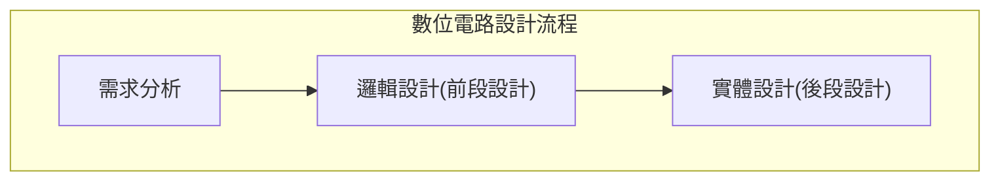

## 簡介
在積體電路設計這類硬體設計中相對軟體開發相對容易受到資金與設備的限制，學習過程與所需知識與技術相當「哈扣」(Hardcore)，不像軟體可以透過一台電腦就可以達成，在開發上也是需要搭配設備一起使用，造成容易被大型的積體電路設計科技公司掌握與主導，這也是為什麼中美貿易戰中美國可以直接透過制裁掐住中國半導體產業，中國從底層設備到開發所使用的軟體皆來自美國。

這章將介紹：

- [積體電路製造流程](#積體電路製造流程)：
- [邏輯設計](#邏輯設計)：針對使用 Quartus II 64-bit 21.1 Web Edition 、 Xilinx Vivado 、 Atom 進行軟體開發。

## 積體電路製造流程
一般來說完成一個數位積體電路晶片要經過以下流程：

經過簡化後的結果主要為「市場規格制定」、「邏輯設計」、「實體設計」三大部份。

需求分析是一「市場規格制定」有有本書所教的內容是以

## 邏輯設計
也就是稍微介紹在積體電路中會有「離散電路」、「可程式規劃裝置」、「專門用途積體電路」三種方式設計，而我們會採用「可程式規劃裝置」搭配「硬體描述語言」(HDL, Hardware Description Language)方式設計與驗證。

在「數位電路設計流程」中會詳細解析目前整個半導體產業的設計流程，以及數位邏輯設計與VerilogHDL在半導體產業佔哪一塊，提供有興趣學且想要當工作的人了解在這個產業是如何。

現在數位積體電路設計中，已經不像過去單純靠著雙手將設計內容畫出來，會善用科技與工具來輔助設計與驗證，加速公司開發週期應付市場變化，這也就是現在常見的「設計自動化」(EDA, Electronic Design Automation)工具，因此學完後會發現透過工具通通幫你跑完在學習中很瑣碎與重複性的作業，因此本書也會透過「設計自動化」工具來幫助來幫助各位了解。

我們所作的是針對前面進行設計，基本上會分成下列六個階段：

1. 設計輸入
1. 設計編譯
1. 功能模擬
1. 電路佈局或平面規劃
1. 實際模擬
1. 實體驗證

以這份

有時會出現開發工具會有出錯的現象，理論基礎就相當的重要，這時身為工程師的你就要一層一層抽絲剝繭找到問題，這時理論基礎就很重要。這也是為什麼課程中同時有實作內容，如果可以我會希望此專案可以透過Python來得出運算結果，這樣就可以東西產生東西出來。
