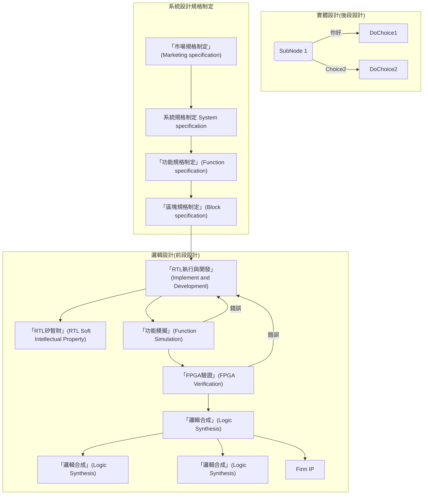

# 數位電路設計流程
盡可能的介紹與說明可以如何讓開發提供廣大社群參與。

一般來說完成一個數位積體電路要經過以下流程，

包含：

在積體電路設計這類硬體設計中相對軟體開發相對容易受到資金與設備的限制，學習過程與所需知識與技術相當「哈扣」(Hardcore)，不像軟體可以透過努力與一台電腦就可以達成，在開發上也是需要搭配設備一起使用，造成容易被大型的積體電路設計科技公司掌握與主導，這也是為什麼中美貿易戰中美國可以直接透過制裁掐住中國半導體產業，因為中國從底層設備到開發所使用的軟體皆來自美國。
