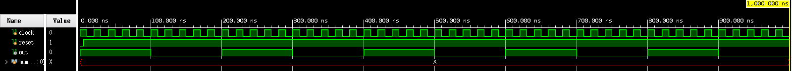
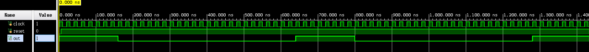
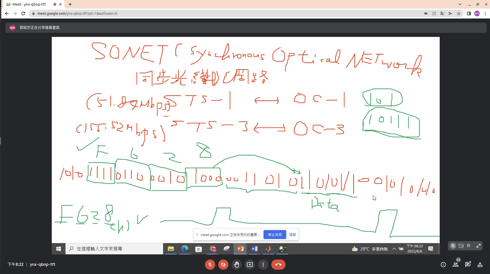
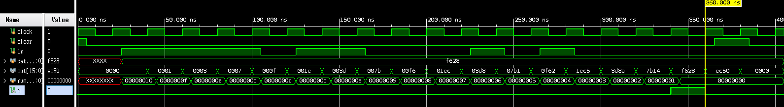

## 簡介
這邊將舉出許多的範例以及檔案，會提供理論說明以及分析方式，如已經在前面有理論的，會提供連結前往。最後會附上測試檔案供大家可以進行測試，以及模擬測試結果。

## 加三碼
真值表

| I2 I1 I0 | O2 O1 O1 |
|:--------:|:--------:|
|  0 0 0   |  0 1 1   |
|  0 0 1   |  1 0 0   |
|  0 1 0   |  1 0 1   |
|  0 1 1   |  1 1 0   |
|  1 0 0   |  1 1 1   |
|  1 0 1   |  0 0 0   |
|  1 1 0   |  0 0 1   |
|  1 1 1   |  0 1 0   |

分析與設計

### 方法1 assign連續指定

<details>
<summary>Verilog程式碼</summary>

```verilog

```

</details>
<details>
<summary>Verilog測試檔案</summary>

```verilog

```
</details>

模擬結果：

### 方法2 行為層if

<details>
<summary>Verilog程式碼</summary>

```verilog

```

</details>
<details>
<summary>Verilog測試檔案</summary>

```verilog

```
</details>

模擬結果：

### 方法3 行為層case

<details>
<summary>Verilog程式碼</summary>

```verilog

```

</details>
<details>
<summary>Verilog測試檔案</summary>

```verilog

```
</details>

模擬結果：

## 格雷碼轉換器
真值表

| I3  | I2  | I1  | I0  |     | O3  | O2  | O1  | O1  |
|:---:|:---:|:---:|:---:|:---:|:---:|:---:|:---:|:---:|
|  0  |  0  |  0  |  0  |     |  0  |  0  |  0  |  0  |
|  0  |  0  |  0  |  1  |     |  0  |  0  |  0  |  1  |
|  0  |  0  |  1  |  0  |     |  0  |  0  |  1  |  1  |
|  0  |  0  |  1  |  1  |     |  0  |  0  |  1  |  0  |
|  0  |  1  |  0  |  0  |     |  0  |  1  |  1  |  0  |
|  0  |  1  |  0  |  1  |     |  0  |  1  |  1  |  1  |
|  0  |  1  |  1  |  0  |     |  0  |  1  |  0  |  1  |
|  0  |  1  |  1  |  1  |     |  0  |  1  |  0  |  0  |
|  1  |  0  |  0  |  0  |     |  1  |  1  |  0  |  0  |
|  1  |  0  |  0  |  1  |     |  1  |  1  |  0  |  1  |
|  1  |  0  |  1  |  0  |     |  1  |  1  |  1  |  1  |
|  1  |  0  |  1  |  1  |     |  1  |  1  |  1  |  0  |
|  1  |  1  |  0  |  0  |     |  1  |  0  |  1  |  0  |
|  1  |  1  |  0  |  1  |     |  1  |  0  |  1  |  1  |
|  1  |  1  |  1  |  0  |     |  1  |  0  |  0  |  1  |
|  1  |  1  |  1  |  1  |     |  1  |  0  |  0  |  0  |

分析與設計

### 方法1 行為層if
<details>
<summary>Verilog程式碼</summary>

```verilog
module gray_if (i, o);
  input [3:0] i;
  output [3:0] o;
  reg [3:0] o;


  always @ ( i ) begin
    if ( i == 0) begin
      o = 0;
    end else if (i == 1) begin
      o = 4'b0001;
    end else if (i == 2) begin
      o = 4'b0011;
    end else if (i == 3) begin
      o = 4'b0010;
    end else if (i == 4) begin
      o = 4'b0110;
    end else if (i == 5) begin
      o = 4'b0111;
    end else if (i == 6) begin
      o = 4'b0101;
    end else if (i == 7) begin
      o = 4'b0100;
    end else if (i == 8) begin
      o = 4'b1100;
    end else if (i == 9) begin
      o = 4'b1101;
    end else if (i == 10) begin
      o = 4'b1111;
    end else if (i == 11) begin
      o = 4'b1110;
    end else if (i == 12) begin
      o = 4'b1010;
    end else if (i == 13) begin
      o = 4'b1011;
    end else if (i == 14) begin
      o = 4'b1001;
    end else if (i == 15) begin
      o = 4'b1000;
    end
  end
endmodule // gray_if
```

</details>
<details>
<summary>Verilog測試檔案</summary>

```verilog
module gray_if_test ();
  reg [3:0] i;
  wire [3:0] o;
  integer conut;

  gray_if UUT (.i(i), .o(o));

  initial begin
    for (conut = 0; conut < 16; conut = conut + 1)
      begin
        i = conut[3:0];
        #10;
      end
    $finish;
  end

endmodule // gray_if_test
```
</details>

模擬結果：


### 方法2 行為層case
<details>
<summary>Verilog程式碼</summary>

```verilog
module gray_case (i, o);
  input [3:0] i;
  output [3:0] o;
  reg [3:0] o;

  always @ ( i ) begin
    case (i)
      4'h0: o = 4'h0;
      4'h1: o = 4'h1;
      4'h2: o = 4'h3;
      4'h3: o = 4'h2;
      4'h4: o = 4'h6;
      4'h5: o = 4'h7;
      4'h6: o = 4'h5;
      4'h7: o = 4'h4;
      4'h8: o = 4'hc;
      4'h9: o = 4'hd;
      4'ha: o = 4'hf;
      4'hb: o = 4'he;
      4'hc: o = 4'ha;
      4'hd: o = 4'hb;
      4'he: o = 4'h9;
      default: o = 4'b1000;
    endcase
  end

endmodule // gray_case
```

</details>
<details>
<summary>Verilog測試檔案</summary>

```verilog
module gray_case_test ();
  reg [3:0] i;
  wire [3:0] o;
  integer conut;

  gray_case UUT (.i(i), .o(o));

  initial begin
    for (conut = 0; conut < 16; conut = conut + 1)
      begin
        i = conut[3:0];
        #10;
      end
    $finish;
  end

endmodule // gray_case_test
```
</details>

模擬結果


## 四人投票機
| I3  | I2  | I1  | I0  |     | O3(反對) | O2(平手) | O1(贊成) |
|:---:|:---:|:---:|:---:|:---:|:--------:|:--------:|:--------:|
|  0  |  0  |  0  |  0  |     |    1     |    0     |    0     |
|  0  |  0  |  0  |  1  |     |    1     |    0     |    0     |
|  0  |  0  |  1  |  0  |     |    1     |    0     |    0     |
|  0  |  0  |  1  |  1  |     |    0     |    1     |    0     |
|  0  |  1  |  0  |  0  |     |    1     |    0     |    0     |
|  0  |  1  |  0  |  1  |     |    0     |    1     |    0     |
|  0  |  1  |  1  |  0  |     |    0     |    1     |    0     |
|  0  |  1  |  1  |  1  |     |    0     |    0     |    1     |
|  1  |  0  |  0  |  0  |     |    1     |    0     |    0     |
|  1  |  0  |  0  |  1  |     |    0     |    1     |    0     |
|  1  |  0  |  1  |  0  |     |    0     |    1     |    0     |
|  1  |  0  |  1  |  1  |     |    0     |    0     |    1     |
|  1  |  1  |  0  |  0  |     |    0     |    1     |    0     |
|  1  |  1  |  0  |  1  |     |    0     |    0     |    1     |
|  1  |  1  |  1  |  0  |     |    0     |    0     |    1     |
|  1  |  1  |  1  |  1  |     |    0     |    0     |    1     |

分析與設計方式。

### 方法1 行為層if

<details>
<summary>Verilog程式碼</summary>

```verilog
module voter_if (i, o);
input [3:0] i;
output [3:1] o;
reg [3:1] o;

always @ ( i ) begin
  if (i == 0 || i == 1 || i == 2 || i == 4 || i == 8) begin
    o[3] = 1;
  end else begin
    o[3] = 0;
  end

  if (i == 3 || i == 5 || i == 6 || i == 9 || i == 10 || i == 12) begin
    o[2] = 1;
  end else begin
    o[2] = 0;
  end

  if (i == 7 || i == 11 || i == 13 || i == 14 || i == 15) begin
    o[1] = 1;
  end else begin
    o[1] = 0;
  end

end
endmodule // voter_if

```

</details>
<details>
<summary>Verilog測試檔案</summary>

```verilog
module voter_if_test ();
  reg [3:0] i;
  wire [2:0] o;
  integer conut;

  voter_if UUT (.i(i), .o(o));

  initial begin
    for (conut = 0; conut < 16; conut = conut + 1)
      begin
        i = conut[3:0];
        #10;
      end
    $finish;
  end

endmodule // voter_if_test

```
</details>

模擬結果：


### 方法2 行為層case
<details>
<summary>Verilog程式碼</summary>

```verilog
module voter_case (i, o);
input [3:0] i;
output [3:1] o;
reg [3:1] o;

always @ ( i ) begin
  case(i)
    4'b0000: o = 3'b100;
    4'b0001: o = 3'b100;
    4'b0010: o = 3'b100;
    4'b0011: o = 3'b010;
    4'b0100: o = 3'b100;
    4'b0101: o = 3'b010;
    4'b0110: o = 3'b010;
    4'b0111: o = 3'b001;
    4'b1000: o = 3'b100;
    4'b1001: o = 3'b010;
    4'b1010: o = 3'b010;
    4'b1011: o = 3'b001;
    4'b1100: o = 3'b010;
    4'b1101: o = 3'b001;
    4'b1110: o = 3'b001;
    4'b1111: o = 3'b001;
  endcase
end
endmodule // voter_case

```

</details>
<details>
<summary>Verilog測試檔案</summary>

```verilog
module voter_case_test ();
  reg [3:0] i;
  wire [2:0] o;
  integer conut;

  voter_case UUT (.i(i), .o(o));

  initial begin
    for (conut = 0; conut < 16; conut = conut + 1)
      begin
        i = conut[3:0];
        #10;
      end
    $finish;
  end

endmodule // voter_case_test

```
</details>

模擬結果：


## 主席參與投票機

|  M  | I3  | I2  | I1  | I0  |     | O3(反對) | O2(平手) | O1(贊成) |
|:---:|:---:|:---:|:---:|:---:|:---:|:--------:|:--------:|:--------:|
|  0  |  0  |  0  |  0  |  0  |     |    1     |    0     |    0     |
|  0  |  0  |  0  |  0  |  1  |     |    1     |    0     |    0     |
|  0  |  0  |  0  |  1  |  0  |     |    1     |    0     |    0     |
|  0  |  0  |  0  |  1  |  1  |     |    0     |    0     |    0     |
|  0  |  0  |  1  |  0  |  0  |     |    1     |    0     |    0     |
|  0  |  0  |  1  |  0  |  1  |     |    0     |    0     |    0     |
|  0  |  0  |  1  |  1  |  0  |     |    0     |    0     |    0     |
|  0  |  0  |  1  |  1  |  1  |     |    0     |    0     |    1     |
|  0  |  1  |  0  |  0  |  0  |     |    1     |    0     |    0     |
|  0  |  1  |  0  |  0  |  1  |     |    0     |    0     |    0     |
|  0  |  1  |  0  |  1  |  0  |     |    0     |    0     |    0     |
|  0  |  1  |  0  |  1  |  1  |     |    0     |    0     |    1     |
|  0  |  1  |  1  |  0  |  0  |     |    0     |    0     |    0     |
|  0  |  1  |  1  |  0  |  1  |     |    0     |    0     |    1     |
|  0  |  1  |  1  |  1  |  0  |     |    0     |    0     |    1     |
|  0  |  1  |  1  |  1  |  1  |     |    0     |    0     |    1     |
|  1  |  0  |  0  |  0  |  0  |     |    1     |    0     |    0     |
|  1  |  0  |  0  |  0  |  1  |     |    1     |    0     |    0     |
|  1  |  0  |  0  |  1  |  0  |     |    1     |    0     |    0     |
|  1  |  0  |  0  |  1  |  1  |     |    0     |    1     |    0     |
|  1  |  0  |  1  |  0  |  0  |     |    1     |    0     |    0     |
|  1  |  0  |  1  |  0  |  1  |     |    0     |    1     |    0     |
|  1  |  0  |  1  |  1  |  0  |     |    0     |    1     |    0     |
|  1  |  0  |  1  |  1  |  1  |     |    0     |    0     |    1     |
|  1  |  1  |  0  |  0  |  0  |     |    1     |    0     |    0     |
|  1  |  1  |  0  |  0  |  1  |     |    0     |    1     |    0     |
|  1  |  1  |  0  |  1  |  0  |     |    0     |    1     |    0     |
|  1  |  1  |  0  |  1  |  1  |     |    0     |    0     |    1     |
|  1  |  1  |  1  |  0  |  0  |     |    0     |    1     |    0     |
|  1  |  1  |  1  |  0  |  1  |     |    0     |    0     |    1     |
|  1  |  1  |  1  |  1  |  0  |     |    0     |    0     |    1     |
|  1  |  1  |  1  |  1  |  1  |     |    0     |    0     |    1     |

分析與設計

<details>
<summary>Verilog程式碼</summary>

```verilog
module voter_if_master (i, m, o);
input [3:0] i;
input m;
output [3:1] o;
reg [3:1] o;

always @ (  i or m ) begin
  if (i == 0 || i == 1 || i == 2 || i == 4 || i == 8) begin
    o = 3'b100;
  end

  if ((i == 3 || i == 5 || i == 6 || i == 9 || i == 10 || i == 12) && m == 1) begin
    o = 3'b001;
  end else begin
    o = 3'b100;
  end

  if (i == 7 || i == 11 || i == 13 || i == 14 || i == 15) begin
    o = 3'b001;
  end

end
endmodule // voter_if_master

```

</details>
<details>
<summary>Verilog測試檔案</summary>

```verilog
module voter_if_master_test ();
  reg [3:0] i;
  reg m = 0;
  wire [2:0] o;
  integer conut;

  voter_if_master UUT (.i(i), .m(m), .o(o));

  initial begin
    for (conut = 0; conut < 16; conut = conut + 1)
      begin
        i = conut[3:0];
        m = 0;
        #10;
        m = 1;
        #10;
      end
    $finish;
  end

endmodule // voter_if_master_test
```
</details>

模擬結果：


## 主席否決權投票機
真值表

分析與設計

<details>
<summary>Verilog程式碼</summary>

```verilog
module voter_if_master_intercessio (i, m, o);
input [3:0] i;
input m;
output [3:1] o;
reg [3:1] o;

always @ ( i or m ) begin
  if (i == 0 || i == 1 || i == 2 || i == 4 || i == 8) begin
    o[3] = 1;
  end else begin
    o[3] = 0;
  end

  if (i == 3 || i == 5 || i == 6 || i == 9 || i == 10 || i == 12) begin
    o[2] = 1;
  end else begin
    o[2] = 0;
  end

  if (i == 7 || i == 11 || i == 13 || i == 14 || i == 15) begin
    o[1] = 1;
  end else begin
    o[1] = 0;
  end

  if (m == 1) begin
    o[3] = 0;
    o[2] = 0;
    o[1] = 1;
  end
end
endmodule // voter_if_master

```

</details>
<details>
<summary>Verilog測試檔案</summary>

```verilog
module voter_if_master_intercessio_test ();
  reg [3:0] i;
  reg m = 0;
  wire [2:0] o;
  integer conut;

  voter_if_master_intercessio UUT (.i(i), .m(m), .o(o));

  initial begin
    for (conut = 0; conut < 16; conut = conut + 1)
      begin
        i = conut[3:0];
        m = 0;
        #10;
        m = 1;
        #10;
      end
    $finish;
  end

endmodule // voter_if_master_intercessio_test

```
</details>

模擬結果：


## 七段顯示器指定其一腳位亮起

## 紅綠燈

兩個十字路口，有四個紅綠燈，四個綠燈倒數計時器。

所以這個表示，共會有兩組相同的電路，因為同一條路口的燈的顏色與動作是可以一樣的。

這邊我們會使用計數器搭配編碼器與七段顯示器使用，不以個別拼湊而成方式製作。

## 除頻器

### 除10除頻器
<details>
<summary>Verilog程式碼</summary>

```verilog
module frequency_divder_bcd (clock, reset, out);
  input clock, reset;
  output out;

  reg out;
  reg [3:0] diver;

  // 10 除頻器
  always @ (posedge clock) begin
    if (~reset || diver == 9) begin
      diver = 0;
    end else begin
      diver = diver + 1;
    end
  end

  // 形成對稱方波
  always @ (diver) begin
    if (diver < 5) begin
      out = 1;
    end else begin
      out = 0;
    end
  end

endmodule // frequency_divder_bcd
```

</details>
<details>
<summary>Verilog測試檔案</summary>

```verilog
`include "frequency_divder_bcd.v"

module frequency_divder_bcd_test ();
  reg clock;
  reg reset;
  wire out;

  integer number;

  frequency_divder_bcd UUT (clock, reset, out);

  initial begin
    clock = 1'b1;
    reset = 1'b0;
    #5;

    reset = 1'b1;

    $display("| clock | reset | out |");

  end

  always begin
    #5;
    $monitor("|   %b   |   %b   |  %b  |", clock, reset, out);

    #5;
    clock = ~clock;
  end

  initial begin
    #1000;
    $finish;
  end

endmodule // frequency_divder_bcd_test
```
</details>

<details>
<summary>測試結果</summary>

```
| clock | reset | out |
|   1   |   1   |  0  |
|   0   |   1   |  0  |
|   0   |   1   |  0  |
|   1   |   1   |  0  |
|   1   |   1   |  0  |
|   0   |   1   |  0  |
|   0   |   1   |  0  |
|   1   |   1   |  0  |
|   1   |   1   |  0  |
|   0   |   1   |  0  |
|   0   |   1   |  0  |
|   1   |   1   |  0  |
|   1   |   1   |  0  |
|   0   |   1   |  0  |
|   0   |   1   |  0  |
|   1   |   1   |  0  |
|   1   |   1   |  0  |
|   0   |   1   |  0  |
|   0   |   1   |  0  |
|   1   |   1   |  1  |
|   1   |   1   |  1  |
|   0   |   1   |  1  |
|   0   |   1   |  1  |
|   1   |   1   |  1  |
|   1   |   1   |  1  |
|   0   |   1   |  1  |
|   0   |   1   |  1  |
|   1   |   1   |  1  |
|   1   |   1   |  1  |
|   0   |   1   |  1  |
|   0   |   1   |  1  |
|   1   |   1   |  1  |
|   1   |   1   |  1  |
|   0   |   1   |  1  |
|   0   |   1   |  1  |
|   1   |   1   |  1  |
|   1   |   1   |  1  |
|   0   |   1   |  1  |
|   0   |   1   |  1  |
|   1   |   1   |  0  |
|   1   |   1   |  0  |
|   0   |   1   |  0  |
|   0   |   1   |  0  |
|   1   |   1   |  0  |
|   1   |   1   |  0  |
|   0   |   1   |  0  |
|   0   |   1   |  0  |
|   1   |   1   |  0  |
|   1   |   1   |  0  |
|   0   |   1   |  0  |
|   0   |   1   |  0  |
|   1   |   1   |  0  |
|   1   |   1   |  0  |
|   0   |   1   |  0  |
|   0   |   1   |  0  |
|   1   |   1   |  0  |
|   1   |   1   |  0  |
|   0   |   1   |  0  |
|   0   |   1   |  0  |
|   1   |   1   |  1  |
|   1   |   1   |  1  |
|   0   |   1   |  1  |
|   0   |   1   |  1  |
|   1   |   1   |  1  |
|   1   |   1   |  1  |
|   0   |   1   |  1  |
|   0   |   1   |  1  |
|   1   |   1   |  1  |
|   1   |   1   |  1  |
|   0   |   1   |  1  |
|   0   |   1   |  1  |
|   1   |   1   |  1  |
|   1   |   1   |  1  |
|   0   |   1   |  1  |
|   0   |   1   |  1  |
|   1   |   1   |  1  |
|   1   |   1   |  1  |
|   0   |   1   |  1  |
|   0   |   1   |  1  |
|   1   |   1   |  0  |
|   1   |   1   |  0  |
|   0   |   1   |  0  |
|   0   |   1   |  0  |
|   1   |   1   |  0  |
|   1   |   1   |  0  |
|   0   |   1   |  0  |
|   0   |   1   |  0  |
|   1   |   1   |  0  |
|   1   |   1   |  0  |
|   0   |   1   |  0  |
|   0   |   1   |  0  |
|   1   |   1   |  0  |
|   1   |   1   |  0  |
|   0   |   1   |  0  |
|   0   |   1   |  0  |
|   1   |   1   |  0  |
|   1   |   1   |  0  |
|   0   |   1   |  0  |
|   0   |   1   |  0  |
|   1   |   1   |  1  |
|   1   |   1   |  1  |
|   0   |   1   |  1  |
|   0   |   1   |  1  |
|   1   |   1   |  1  |
|   1   |   1   |  1  |
|   0   |   1   |  1  |
|   0   |   1   |  1  |
|   1   |   1   |  1  |
|   1   |   1   |  1  |
|   0   |   1   |  1  |
|   0   |   1   |  1  |
|   1   |   1   |  1  |
|   1   |   1   |  1  |
|   0   |   1   |  1  |
|   0   |   1   |  1  |
|   1   |   1   |  1  |
|   1   |   1   |  1  |
|   0   |   1   |  1  |
|   0   |   1   |  1  |
|   1   |   1   |  0  |
|   1   |   1   |  0  |
|   0   |   1   |  0  |
|   0   |   1   |  0  |
|   1   |   1   |  0  |
|   1   |   1   |  0  |
|   0   |   1   |  0  |
|   0   |   1   |  0  |
|   1   |   1   |  0  |
|   1   |   1   |  0  |
|   0   |   1   |  0  |
|   0   |   1   |  0  |
|   1   |   1   |  0  |
|   1   |   1   |  0  |
|   0   |   1   |  0  |
|   0   |   1   |  0  |
|   1   |   1   |  0  |
|   1   |   1   |  0  |
|   0   |   1   |  0  |
|   0   |   1   |  0  |
|   1   |   1   |  1  |
|   1   |   1   |  1  |
|   0   |   1   |  1  |
|   0   |   1   |  1  |
|   1   |   1   |  1  |
|   1   |   1   |  1  |
|   0   |   1   |  1  |
|   0   |   1   |  1  |
|   1   |   1   |  1  |
|   1   |   1   |  1  |
|   0   |   1   |  1  |
|   0   |   1   |  1  |
|   1   |   1   |  1  |
|   1   |   1   |  1  |
|   0   |   1   |  1  |
|   0   |   1   |  1  |
|   1   |   1   |  1  |
|   1   |   1   |  1  |
|   0   |   1   |  1  |
|   0   |   1   |  1  |
|   1   |   1   |  0  |
|   1   |   1   |  0  |
|   0   |   1   |  0  |
|   0   |   1   |  0  |
|   1   |   1   |  0  |
|   1   |   1   |  0  |
|   0   |   1   |  0  |
|   0   |   1   |  0  |
|   1   |   1   |  0  |
|   1   |   1   |  0  |
|   0   |   1   |  0  |
|   0   |   1   |  0  |
|   1   |   1   |  0  |
|   1   |   1   |  0  |
|   0   |   1   |  0  |
|   0   |   1   |  0  |
|   1   |   1   |  0  |
|   1   |   1   |  0  |
|   0   |   1   |  0  |
|   0   |   1   |  0  |
|   1   |   1   |  1  |
|   1   |   1   |  1  |
|   0   |   1   |  1  |
|   0   |   1   |  1  |
|   1   |   1   |  1  |
|   1   |   1   |  1  |
|   0   |   1   |  1  |
|   0   |   1   |  1  |
|   1   |   1   |  1  |
|   1   |   1   |  1  |
|   0   |   1   |  1  |
|   0   |   1   |  1  |
|   1   |   1   |  1  |
|   1   |   1   |  1  |
|   0   |   1   |  1  |
|   0   |   1   |  1  |
|   1   |   1   |  1  |
|   1   |   1   |  1  |
|   0   |   1   |  1  |
|   0   |   1   |  1  |
|   1   |   1   |  0  |
```
</details>



### 除16除頻器

<details>
<summary>Verilog程式碼</summary>

```verilog
// 16除頻器

module frequency_divder_16 (clock, reset, out);
  input clock, reset;
  output out;

  reg out;
  reg [3:0] diver;

  parameter count = 8;

  always @ (posedge clock) begin
    if (~reset) begin
      diver = 0;
    end else begin
      if (diver < count - 1) begin
        diver = diver + 1;
      end else begin
        diver = 0;
      end
    end
  end

  // 產生工作週期 0.5 波形
  always @ (diver) begin
    if (~reset) begin
      out = 1'b0;
    end else begin
      if (diver == count - 1) begin
        out = ~out;
      end else begin
        out = out;
      end
    end
  end

endmodule // frequency_divder_16
```
</details>

<details>
<summary>Verilog測試檔案</summary>

```verilog
`include "frequency_divder_16.v"

module frequency_divder_16_test ();
  reg clock;
  reg reset;
  wire out;

  frequency_divder_16 UUT (clock, reset, out);

  initial begin
    clock = 1'b1;
    reset = 1'b0;
    #5;

    reset = 1'b1;

    $display("| clock | reset | out |");

  end

  always begin
    #5;
    $monitor("|   %b   |   %b   |  %b  |", clock, reset, out);

    #5;
    clock = ~clock;
  end

  initial begin
    #1000;
    $finish;
  end

endmodule // frequency_divder_16_test
```
</details>

<details>
<summary>測試結果</summary>

```
| clock | reset | out |
|   1   |   1   |  0  |
|   0   |   1   |  0  |
|   0   |   1   |  0  |
|   1   |   1   |  0  |
|   1   |   1   |  0  |
|   0   |   1   |  0  |
|   0   |   1   |  0  |
|   1   |   1   |  0  |
|   1   |   1   |  0  |
|   0   |   1   |  0  |
|   0   |   1   |  0  |
|   1   |   1   |  0  |
|   1   |   1   |  0  |
|   0   |   1   |  0  |
|   0   |   1   |  0  |
|   1   |   1   |  0  |
|   1   |   1   |  0  |
|   0   |   1   |  0  |
|   0   |   1   |  0  |
|   1   |   1   |  0  |
|   1   |   1   |  0  |
|   0   |   1   |  0  |
|   0   |   1   |  0  |
|   1   |   1   |  0  |
|   1   |   1   |  0  |
|   0   |   1   |  0  |
|   0   |   1   |  0  |
|   1   |   1   |  1  |
|   1   |   1   |  1  |
|   0   |   1   |  1  |
|   0   |   1   |  1  |
|   1   |   1   |  0  |
|   1   |   1   |  0  |
|   0   |   1   |  0  |
|   0   |   1   |  0  |
|   1   |   1   |  0  |
|   1   |   1   |  0  |
|   0   |   1   |  0  |
|   0   |   1   |  0  |
|   1   |   1   |  0  |
|   1   |   1   |  0  |
|   0   |   1   |  0  |
|   0   |   1   |  0  |
|   1   |   1   |  0  |
|   1   |   1   |  0  |
|   0   |   1   |  0  |
|   0   |   1   |  0  |
|   1   |   1   |  0  |
|   1   |   1   |  0  |
|   0   |   1   |  0  |
|   0   |   1   |  0  |
|   1   |   1   |  0  |
|   1   |   1   |  0  |
|   0   |   1   |  0  |
|   0   |   1   |  0  |
|   1   |   1   |  0  |
|   1   |   1   |  0  |
|   0   |   1   |  0  |
|   0   |   1   |  0  |
|   1   |   1   |  1  |
|   1   |   1   |  1  |
|   0   |   1   |  1  |
|   0   |   1   |  1  |
|   1   |   1   |  0  |
|   1   |   1   |  0  |
|   0   |   1   |  0  |
|   0   |   1   |  0  |
|   1   |   1   |  0  |
|   1   |   1   |  0  |
|   0   |   1   |  0  |
|   0   |   1   |  0  |
|   1   |   1   |  0  |
|   1   |   1   |  0  |
|   0   |   1   |  0  |
|   0   |   1   |  0  |
|   1   |   1   |  0  |
|   1   |   1   |  0  |
|   0   |   1   |  0  |
|   0   |   1   |  0  |
|   1   |   1   |  0  |
|   1   |   1   |  0  |
|   0   |   1   |  0  |
|   0   |   1   |  0  |
|   1   |   1   |  0  |
|   1   |   1   |  0  |
|   0   |   1   |  0  |
|   0   |   1   |  0  |
|   1   |   1   |  0  |
|   1   |   1   |  0  |
|   0   |   1   |  0  |
|   0   |   1   |  0  |
|   1   |   1   |  1  |
|   1   |   1   |  1  |
|   0   |   1   |  1  |
|   0   |   1   |  1  |
|   1   |   1   |  0  |
|   1   |   1   |  0  |
|   0   |   1   |  0  |
|   0   |   1   |  0  |
|   1   |   1   |  0  |
|   1   |   1   |  0  |
|   0   |   1   |  0  |
|   0   |   1   |  0  |
|   1   |   1   |  0  |
|   1   |   1   |  0  |
|   0   |   1   |  0  |
|   0   |   1   |  0  |
|   1   |   1   |  0  |
|   1   |   1   |  0  |
|   0   |   1   |  0  |
|   0   |   1   |  0  |
|   1   |   1   |  0  |
|   1   |   1   |  0  |
|   0   |   1   |  0  |
|   0   |   1   |  0  |
|   1   |   1   |  0  |
|   1   |   1   |  0  |
|   0   |   1   |  0  |
|   0   |   1   |  0  |
|   1   |   1   |  0  |
|   1   |   1   |  0  |
|   0   |   1   |  0  |
|   0   |   1   |  0  |
|   1   |   1   |  1  |
|   1   |   1   |  1  |
|   0   |   1   |  1  |
|   0   |   1   |  1  |
|   1   |   1   |  0  |
|   1   |   1   |  0  |
|   0   |   1   |  0  |
|   0   |   1   |  0  |
|   1   |   1   |  0  |
|   1   |   1   |  0  |
|   0   |   1   |  0  |
|   0   |   1   |  0  |
|   1   |   1   |  0  |
|   1   |   1   |  0  |
|   0   |   1   |  0  |
|   0   |   1   |  0  |
|   1   |   1   |  0  |
|   1   |   1   |  0  |
|   0   |   1   |  0  |
|   0   |   1   |  0  |
|   1   |   1   |  0  |
|   1   |   1   |  0  |
|   0   |   1   |  0  |
|   0   |   1   |  0  |
|   1   |   1   |  0  |
|   1   |   1   |  0  |
|   0   |   1   |  0  |
|   0   |   1   |  0  |
|   1   |   1   |  0  |
|   1   |   1   |  0  |
|   0   |   1   |  0  |
|   0   |   1   |  0  |
|   1   |   1   |  1  |
|   1   |   1   |  1  |
|   0   |   1   |  1  |
|   0   |   1   |  1  |
|   1   |   1   |  0  |
|   1   |   1   |  0  |
|   0   |   1   |  0  |
|   0   |   1   |  0  |
|   1   |   1   |  0  |
|   1   |   1   |  0  |
|   0   |   1   |  0  |
|   0   |   1   |  0  |
|   1   |   1   |  0  |
|   1   |   1   |  0  |
|   0   |   1   |  0  |
|   0   |   1   |  0  |
|   1   |   1   |  0  |
|   1   |   1   |  0  |
|   0   |   1   |  0  |
|   0   |   1   |  0  |
|   1   |   1   |  0  |
|   1   |   1   |  0  |
|   0   |   1   |  0  |
|   0   |   1   |  0  |
|   1   |   1   |  0  |
|   1   |   1   |  0  |
|   0   |   1   |  0  |
|   0   |   1   |  0  |
|   1   |   1   |  0  |
|   1   |   1   |  0  |
|   0   |   1   |  0  |
|   0   |   1   |  0  |
|   1   |   1   |  1  |
|   1   |   1   |  1  |
|   0   |   1   |  1  |
|   0   |   1   |  1  |
|   1   |   1   |  0  |
|   1   |   1   |  0  |
|   0   |   1   |  0  |
|   0   |   1   |  0  |
|   1   |   1   |  0  |
|   1   |   1   |  0  |
|   0   |   1   |  0  |
|   0   |   1   |  0  |
|   1   |   1   |  0  |
```
</details>


### 除32除頻器

<details>
<summary>Verilog程式碼</summary>

```verilog
// 32除頻器

module frequency_divder_32 (clock, reset, out);
  input clock, reset;
  output out;

  reg out;
  reg [4:0] diver;

  parameter count = 16;

  always @ (posedge clock) begin
    if (~reset) begin
      diver = 0;
    end else begin
      if (diver < count - 1) begin
        diver += 1;
      end else begin
        diver = 0;
      end
    end

  end

  // 產生工作週期 0.5 波形
  always @ (diver) begin
    if (~reset) begin
      out = 1'b0;
    end else begin
      if (diver == count - 1) begin
        out = ~out;
      end else begin
        out = out;
      end
    end
  end

endmodule // frequency_divder_32
```

</details>

<details>
<summary>Verilog測試檔案</summary>

```verilog
`include "frequency_divder_32.v"

module frequency_divder_32_test ();
  reg clock;
  reg reset;
  wire out;

  integer number;

  frequency_divder_32 UUT (clock, reset, out);

  initial begin
    clock = 1'b1;
    reset = 1'b0;
    #5;

    reset = 1'b1;

    $display("| clock | reset | out |");

  end

  always begin
    #5;
    $monitor("|   %b   |   %b   |  %b  |", clock, reset, out);

    #5;
    clock = ~clock;
  end

  initial begin
    #6500;
    $finish;
  end

endmodule // frequency_divder_32_test
```

</details>

<details>
<summary>測試結果</summary>

```
| clock | reset | out |
|   1   |   1   |  0  |
|   0   |   1   |  0  |
|   0   |   1   |  0  |
|   1   |   1   |  0  |
|   1   |   1   |  0  |
|   0   |   1   |  0  |
|   0   |   1   |  0  |
|   1   |   1   |  0  |
|   1   |   1   |  0  |
|   0   |   1   |  0  |
|   0   |   1   |  0  |
|   1   |   1   |  0  |
|   1   |   1   |  0  |
|   0   |   1   |  0  |
|   0   |   1   |  0  |
|   1   |   1   |  0  |
|   1   |   1   |  0  |
|   0   |   1   |  0  |
|   0   |   1   |  0  |
|   1   |   1   |  0  |
|   1   |   1   |  0  |
|   0   |   1   |  0  |
|   0   |   1   |  0  |
|   1   |   1   |  0  |
|   1   |   1   |  0  |
|   0   |   1   |  0  |
|   0   |   1   |  0  |
|   1   |   1   |  0  |
|   1   |   1   |  0  |
|   0   |   1   |  0  |
|   0   |   1   |  0  |
|   1   |   1   |  0  |
|   1   |   1   |  0  |
|   0   |   1   |  0  |
|   0   |   1   |  0  |
|   1   |   1   |  0  |
|   1   |   1   |  0  |
|   0   |   1   |  0  |
|   0   |   1   |  0  |
|   1   |   1   |  0  |
|   1   |   1   |  0  |
|   0   |   1   |  0  |
|   0   |   1   |  0  |
|   1   |   1   |  0  |
|   1   |   1   |  0  |
|   0   |   1   |  0  |
|   0   |   1   |  0  |
|   1   |   1   |  0  |
|   1   |   1   |  0  |
|   0   |   1   |  0  |
|   0   |   1   |  0  |
|   1   |   1   |  0  |
|   1   |   1   |  0  |
|   0   |   1   |  0  |
|   0   |   1   |  0  |
|   1   |   1   |  0  |
|   1   |   1   |  0  |
|   0   |   1   |  0  |
|   0   |   1   |  0  |
|   1   |   1   |  0  |
|   1   |   1   |  0  |
|   0   |   1   |  0  |
|   0   |   1   |  0  |
|   1   |   1   |  0  |
|   1   |   1   |  0  |
|   0   |   1   |  0  |
|   0   |   1   |  0  |
|   1   |   1   |  0  |
|   1   |   1   |  0  |
|   0   |   1   |  0  |
|   0   |   1   |  0  |
|   1   |   1   |  0  |
|   1   |   1   |  0  |
|   0   |   1   |  0  |
|   0   |   1   |  0  |
|   1   |   1   |  0  |
|   1   |   1   |  0  |
|   0   |   1   |  0  |
|   0   |   1   |  0  |
|   1   |   1   |  0  |
|   1   |   1   |  0  |
|   0   |   1   |  0  |
|   0   |   1   |  0  |
|   1   |   1   |  0  |
|   1   |   1   |  0  |
|   0   |   1   |  0  |
|   0   |   1   |  0  |
|   1   |   1   |  0  |
|   1   |   1   |  0  |
|   0   |   1   |  0  |
|   0   |   1   |  0  |
|   1   |   1   |  0  |
|   1   |   1   |  0  |
|   0   |   1   |  0  |
|   0   |   1   |  0  |
|   1   |   1   |  0  |
|   1   |   1   |  0  |
|   0   |   1   |  0  |
|   0   |   1   |  0  |
|   1   |   1   |  0  |
|   1   |   1   |  0  |
|   0   |   1   |  0  |
|   0   |   1   |  0  |
|   1   |   1   |  0  |
|   1   |   1   |  0  |
|   0   |   1   |  0  |
|   0   |   1   |  0  |
|   1   |   1   |  0  |
|   1   |   1   |  0  |
|   0   |   1   |  0  |
|   0   |   1   |  0  |
|   1   |   1   |  0  |
|   1   |   1   |  0  |
|   0   |   1   |  0  |
|   0   |   1   |  0  |
|   1   |   1   |  0  |
|   1   |   1   |  0  |
|   0   |   1   |  0  |
|   0   |   1   |  0  |
|   1   |   1   |  0  |
|   1   |   1   |  0  |
|   0   |   1   |  0  |
|   0   |   1   |  0  |
|   1   |   1   |  1  |
|   1   |   1   |  1  |
|   0   |   1   |  1  |
|   0   |   1   |  1  |
|   1   |   1   |  0  |
|   1   |   1   |  0  |
|   0   |   1   |  0  |
|   0   |   1   |  0  |
|   1   |   1   |  0  |
|   1   |   1   |  0  |
|   0   |   1   |  0  |
|   0   |   1   |  0  |
|   1   |   1   |  0  |
|   1   |   1   |  0  |
|   0   |   1   |  0  |
|   0   |   1   |  0  |
|   1   |   1   |  0  |
|   1   |   1   |  0  |
|   0   |   1   |  0  |
|   0   |   1   |  0  |
|   1   |   1   |  0  |
|   1   |   1   |  0  |
|   0   |   1   |  0  |
|   0   |   1   |  0  |
|   1   |   1   |  0  |
|   1   |   1   |  0  |
|   0   |   1   |  0  |
|   0   |   1   |  0  |
|   1   |   1   |  0  |
|   1   |   1   |  0  |
|   0   |   1   |  0  |
|   0   |   1   |  0  |
|   1   |   1   |  0  |
|   1   |   1   |  0  |
|   0   |   1   |  0  |
|   0   |   1   |  0  |
|   1   |   1   |  0  |
|   1   |   1   |  0  |
|   0   |   1   |  0  |
|   0   |   1   |  0  |
|   1   |   1   |  0  |
|   1   |   1   |  0  |
|   0   |   1   |  0  |
|   0   |   1   |  0  |
|   1   |   1   |  0  |
|   1   |   1   |  0  |
|   0   |   1   |  0  |
|   0   |   1   |  0  |
|   1   |   1   |  0  |
|   1   |   1   |  0  |
|   0   |   1   |  0  |
|   0   |   1   |  0  |
|   1   |   1   |  0  |
|   1   |   1   |  0  |
|   0   |   1   |  0  |
|   0   |   1   |  0  |
|   1   |   1   |  0  |
|   1   |   1   |  0  |
|   0   |   1   |  0  |
|   0   |   1   |  0  |
|   1   |   1   |  0  |
|   1   |   1   |  0  |
|   0   |   1   |  0  |
|   0   |   1   |  0  |
|   1   |   1   |  0  |
|   1   |   1   |  0  |
|   0   |   1   |  0  |
|   0   |   1   |  0  |
|   1   |   1   |  0  |
|   1   |   1   |  0  |
|   0   |   1   |  0  |
|   0   |   1   |  0  |
|   1   |   1   |  0  |
|   1   |   1   |  0  |
|   0   |   1   |  0  |
|   0   |   1   |  0  |
|   1   |   1   |  0  |
|   1   |   1   |  0  |
|   0   |   1   |  0  |
|   0   |   1   |  0  |
|   1   |   1   |  0  |
|   1   |   1   |  0  |
|   0   |   1   |  0  |
|   0   |   1   |  0  |
|   1   |   1   |  0  |
|   1   |   1   |  0  |
|   0   |   1   |  0  |
|   0   |   1   |  0  |
|   1   |   1   |  0  |
|   1   |   1   |  0  |
|   0   |   1   |  0  |
|   0   |   1   |  0  |
|   1   |   1   |  0  |
|   1   |   1   |  0  |
|   0   |   1   |  0  |
|   0   |   1   |  0  |
|   1   |   1   |  0  |
|   1   |   1   |  0  |
|   0   |   1   |  0  |
|   0   |   1   |  0  |
|   1   |   1   |  0  |
|   1   |   1   |  0  |
|   0   |   1   |  0  |
|   0   |   1   |  0  |
|   1   |   1   |  0  |
|   1   |   1   |  0  |
|   0   |   1   |  0  |
|   0   |   1   |  0  |
|   1   |   1   |  0  |
|   1   |   1   |  0  |
|   0   |   1   |  0  |
|   0   |   1   |  0  |
|   1   |   1   |  0  |
|   1   |   1   |  0  |
|   0   |   1   |  0  |
|   0   |   1   |  0  |
|   1   |   1   |  0  |
|   1   |   1   |  0  |
|   0   |   1   |  0  |
|   0   |   1   |  0  |
|   1   |   1   |  0  |
|   1   |   1   |  0  |
|   0   |   1   |  0  |
|   0   |   1   |  0  |
|   1   |   1   |  0  |
|   1   |   1   |  0  |
|   0   |   1   |  0  |
|   0   |   1   |  0  |
|   1   |   1   |  1  |
|   1   |   1   |  1  |
|   0   |   1   |  1  |
|   0   |   1   |  1  |
|   1   |   1   |  0  |
|   1   |   1   |  0  |
|   0   |   1   |  0  |
|   0   |   1   |  0  |
|   1   |   1   |  0  |
|   1   |   1   |  0  |
|   0   |   1   |  0  |
|   0   |   1   |  0  |
|   1   |   1   |  0  |
|   1   |   1   |  0  |
|   0   |   1   |  0  |
|   0   |   1   |  0  |
|   1   |   1   |  0  |
|   1   |   1   |  0  |
|   0   |   1   |  0  |
|   0   |   1   |  0  |
|   1   |   1   |  0  |
|   1   |   1   |  0  |
|   0   |   1   |  0  |
|   0   |   1   |  0  |
|   1   |   1   |  0  |
|   1   |   1   |  0  |
|   0   |   1   |  0  |
|   0   |   1   |  0  |
|   1   |   1   |  0  |
|   1   |   1   |  0  |
|   0   |   1   |  0  |
|   0   |   1   |  0  |
|   1   |   1   |  0  |
|   1   |   1   |  0  |
|   0   |   1   |  0  |
|   0   |   1   |  0  |
|   1   |   1   |  0  |
|   1   |   1   |  0  |
|   0   |   1   |  0  |
|   0   |   1   |  0  |
|   1   |   1   |  0  |
|   1   |   1   |  0  |
|   0   |   1   |  0  |
|   0   |   1   |  0  |
|   1   |   1   |  0  |
|   1   |   1   |  0  |
|   0   |   1   |  0  |
|   0   |   1   |  0  |
|   1   |   1   |  0  |
|   1   |   1   |  0  |
|   0   |   1   |  0  |
|   0   |   1   |  0  |
|   1   |   1   |  0  |
|   1   |   1   |  0  |
|   0   |   1   |  0  |
|   0   |   1   |  0  |
|   1   |   1   |  0  |
|   1   |   1   |  0  |
|   0   |   1   |  0  |
|   0   |   1   |  0  |
|   1   |   1   |  0  |
|   1   |   1   |  0  |
|   0   |   1   |  0  |
|   0   |   1   |  0  |
|   1   |   1   |  0  |
|   1   |   1   |  0  |
|   0   |   1   |  0  |
|   0   |   1   |  0  |
|   1   |   1   |  0  |
|   1   |   1   |  0  |
|   0   |   1   |  0  |
|   0   |   1   |  0  |
|   1   |   1   |  0  |
|   1   |   1   |  0  |
|   0   |   1   |  0  |
|   0   |   1   |  0  |
|   1   |   1   |  0  |
|   1   |   1   |  0  |
|   0   |   1   |  0  |
|   0   |   1   |  0  |
|   1   |   1   |  0  |
|   1   |   1   |  0  |
|   0   |   1   |  0  |
|   0   |   1   |  0  |
|   1   |   1   |  0  |
|   1   |   1   |  0  |
|   0   |   1   |  0  |
|   0   |   1   |  0  |
|   1   |   1   |  0  |
|   1   |   1   |  0  |
|   0   |   1   |  0  |
|   0   |   1   |  0  |
|   1   |   1   |  0  |
|   1   |   1   |  0  |
|   0   |   1   |  0  |
|   0   |   1   |  0  |
|   1   |   1   |  0  |
|   1   |   1   |  0  |
|   0   |   1   |  0  |
|   0   |   1   |  0  |
|   1   |   1   |  0  |
|   1   |   1   |  0  |
|   0   |   1   |  0  |
|   0   |   1   |  0  |
|   1   |   1   |  0  |
|   1   |   1   |  0  |
|   0   |   1   |  0  |
|   0   |   1   |  0  |
|   1   |   1   |  0  |
|   1   |   1   |  0  |
|   0   |   1   |  0  |
|   0   |   1   |  0  |
|   1   |   1   |  0  |
|   1   |   1   |  0  |
|   0   |   1   |  0  |
|   0   |   1   |  0  |
|   1   |   1   |  0  |
|   1   |   1   |  0  |
|   0   |   1   |  0  |
|   0   |   1   |  0  |
|   1   |   1   |  0  |
|   1   |   1   |  0  |
|   0   |   1   |  0  |
|   0   |   1   |  0  |
|   1   |   1   |  0  |
|   1   |   1   |  0  |
|   0   |   1   |  0  |
|   0   |   1   |  0  |
|   1   |   1   |  1  |
|   1   |   1   |  1  |
|   0   |   1   |  1  |
|   0   |   1   |  1  |
|   1   |   1   |  0  |
|   1   |   1   |  0  |
|   0   |   1   |  0  |
|   0   |   1   |  0  |
|   1   |   1   |  0  |
|   1   |   1   |  0  |
|   0   |   1   |  0  |
|   0   |   1   |  0  |
|   1   |   1   |  0  |
|   1   |   1   |  0  |
|   0   |   1   |  0  |
|   0   |   1   |  0  |
|   1   |   1   |  0  |
|   1   |   1   |  0  |
|   0   |   1   |  0  |
|   0   |   1   |  0  |
|   1   |   1   |  0  |
|   1   |   1   |  0  |
|   0   |   1   |  0  |
|   0   |   1   |  0  |
|   1   |   1   |  0  |
|   1   |   1   |  0  |
|   0   |   1   |  0  |
|   0   |   1   |  0  |
|   1   |   1   |  0  |
|   1   |   1   |  0  |
|   0   |   1   |  0  |
|   0   |   1   |  0  |
|   1   |   1   |  0  |
|   1   |   1   |  0  |
|   0   |   1   |  0  |
|   0   |   1   |  0  |
|   1   |   1   |  0  |
|   1   |   1   |  0  |
|   0   |   1   |  0  |
|   0   |   1   |  0  |
|   1   |   1   |  0  |
|   1   |   1   |  0  |
|   0   |   1   |  0  |
|   0   |   1   |  0  |
|   1   |   1   |  0  |
|   1   |   1   |  0  |
|   0   |   1   |  0  |
|   0   |   1   |  0  |
|   1   |   1   |  0  |
|   1   |   1   |  0  |
|   0   |   1   |  0  |
|   0   |   1   |  0  |
|   1   |   1   |  0  |
|   1   |   1   |  0  |
|   0   |   1   |  0  |
|   0   |   1   |  0  |
|   1   |   1   |  0  |
|   1   |   1   |  0  |
|   0   |   1   |  0  |
|   0   |   1   |  0  |
|   1   |   1   |  0  |
|   1   |   1   |  0  |
|   0   |   1   |  0  |
|   0   |   1   |  0  |
|   1   |   1   |  0  |
|   1   |   1   |  0  |
|   0   |   1   |  0  |
|   0   |   1   |  0  |
|   1   |   1   |  0  |
|   1   |   1   |  0  |
|   0   |   1   |  0  |
|   0   |   1   |  0  |
|   1   |   1   |  0  |
|   1   |   1   |  0  |
|   0   |   1   |  0  |
|   0   |   1   |  0  |
|   1   |   1   |  0  |
|   1   |   1   |  0  |
|   0   |   1   |  0  |
|   0   |   1   |  0  |
|   1   |   1   |  0  |
|   1   |   1   |  0  |
|   0   |   1   |  0  |
|   0   |   1   |  0  |
|   1   |   1   |  0  |
|   1   |   1   |  0  |
|   0   |   1   |  0  |
|   0   |   1   |  0  |
|   1   |   1   |  0  |
|   1   |   1   |  0  |
|   0   |   1   |  0  |
|   0   |   1   |  0  |
|   1   |   1   |  0  |
|   1   |   1   |  0  |
|   0   |   1   |  0  |
|   0   |   1   |  0  |
|   1   |   1   |  0  |
|   1   |   1   |  0  |
|   0   |   1   |  0  |
|   0   |   1   |  0  |
|   1   |   1   |  0  |
|   1   |   1   |  0  |
|   0   |   1   |  0  |
|   0   |   1   |  0  |
|   1   |   1   |  0  |
|   1   |   1   |  0  |
|   0   |   1   |  0  |
|   0   |   1   |  0  |
|   1   |   1   |  0  |
|   1   |   1   |  0  |
|   0   |   1   |  0  |
|   0   |   1   |  0  |
|   1   |   1   |  0  |
|   1   |   1   |  0  |
|   0   |   1   |  0  |
|   0   |   1   |  0  |
|   1   |   1   |  0  |
|   1   |   1   |  0  |
|   0   |   1   |  0  |
|   0   |   1   |  0  |
|   1   |   1   |  0  |
|   1   |   1   |  0  |
|   0   |   1   |  0  |
|   0   |   1   |  0  |
|   1   |   1   |  0  |
|   1   |   1   |  0  |
|   0   |   1   |  0  |
|   0   |   1   |  0  |
|   1   |   1   |  1  |
|   1   |   1   |  1  |
|   0   |   1   |  1  |
|   0   |   1   |  1  |
|   1   |   1   |  0  |
|   1   |   1   |  0  |
|   0   |   1   |  0  |
|   0   |   1   |  0  |
|   1   |   1   |  0  |
|   1   |   1   |  0  |
|   0   |   1   |  0  |
|   0   |   1   |  0  |
|   1   |   1   |  0  |
|   1   |   1   |  0  |
|   0   |   1   |  0  |
|   0   |   1   |  0  |
|   1   |   1   |  0  |
|   1   |   1   |  0  |
|   0   |   1   |  0  |
|   0   |   1   |  0  |
|   1   |   1   |  0  |
|   1   |   1   |  0  |
|   0   |   1   |  0  |
|   0   |   1   |  0  |
|   1   |   1   |  0  |
|   1   |   1   |  0  |
|   0   |   1   |  0  |
|   0   |   1   |  0  |
|   1   |   1   |  0  |
|   1   |   1   |  0  |
|   0   |   1   |  0  |
|   0   |   1   |  0  |
|   1   |   1   |  0  |
|   1   |   1   |  0  |
|   0   |   1   |  0  |
|   0   |   1   |  0  |
|   1   |   1   |  0  |
|   1   |   1   |  0  |
|   0   |   1   |  0  |
|   0   |   1   |  0  |
|   1   |   1   |  0  |
|   1   |   1   |  0  |
|   0   |   1   |  0  |
|   0   |   1   |  0  |
|   1   |   1   |  0  |
|   1   |   1   |  0  |
|   0   |   1   |  0  |
|   0   |   1   |  0  |
|   1   |   1   |  0  |
|   1   |   1   |  0  |
|   0   |   1   |  0  |
|   0   |   1   |  0  |
|   1   |   1   |  0  |
|   1   |   1   |  0  |
|   0   |   1   |  0  |
|   0   |   1   |  0  |
|   1   |   1   |  0  |
|   1   |   1   |  0  |
|   0   |   1   |  0  |
|   0   |   1   |  0  |
|   1   |   1   |  0  |
|   1   |   1   |  0  |
|   0   |   1   |  0  |
|   0   |   1   |  0  |
|   1   |   1   |  0  |
|   1   |   1   |  0  |
|   0   |   1   |  0  |
|   0   |   1   |  0  |
|   1   |   1   |  0  |
|   1   |   1   |  0  |
|   0   |   1   |  0  |
|   0   |   1   |  0  |
|   1   |   1   |  0  |
|   1   |   1   |  0  |
|   0   |   1   |  0  |
|   0   |   1   |  0  |
|   1   |   1   |  0  |
|   1   |   1   |  0  |
|   0   |   1   |  0  |
|   0   |   1   |  0  |
|   1   |   1   |  0  |
|   1   |   1   |  0  |
|   0   |   1   |  0  |
|   0   |   1   |  0  |
|   1   |   1   |  0  |
|   1   |   1   |  0  |
|   0   |   1   |  0  |
|   0   |   1   |  0  |
|   1   |   1   |  0  |
|   1   |   1   |  0  |
|   0   |   1   |  0  |
|   0   |   1   |  0  |
|   1   |   1   |  0  |
|   1   |   1   |  0  |
|   0   |   1   |  0  |
|   0   |   1   |  0  |
|   1   |   1   |  0  |
|   1   |   1   |  0  |
|   0   |   1   |  0  |
|   0   |   1   |  0  |
|   1   |   1   |  0  |
|   1   |   1   |  0  |
|   0   |   1   |  0  |
|   0   |   1   |  0  |
|   1   |   1   |  0  |
|   1   |   1   |  0  |
|   0   |   1   |  0  |
|   0   |   1   |  0  |
|   1   |   1   |  0  |
|   1   |   1   |  0  |
|   0   |   1   |  0  |
|   0   |   1   |  0  |
|   1   |   1   |  0  |
|   1   |   1   |  0  |
|   0   |   1   |  0  |
|   0   |   1   |  0  |
|   1   |   1   |  0  |
|   1   |   1   |  0  |
|   0   |   1   |  0  |
|   0   |   1   |  0  |
|   1   |   1   |  0  |
|   1   |   1   |  0  |
|   0   |   1   |  0  |
|   0   |   1   |  0  |
|   1   |   1   |  0  |
|   1   |   1   |  0  |
|   0   |   1   |  0  |
|   0   |   1   |  0  |
|   1   |   1   |  1  |
|   1   |   1   |  1  |
|   0   |   1   |  1  |
|   0   |   1   |  1  |
|   1   |   1   |  0  |
|   1   |   1   |  0  |
|   0   |   1   |  0  |
|   0   |   1   |  0  |
|   1   |   1   |  0  |
|   1   |   1   |  0  |
|   0   |   1   |  0  |
|   0   |   1   |  0  |
|   1   |   1   |  0  |
|   1   |   1   |  0  |
|   0   |   1   |  0  |
|   0   |   1   |  0  |
|   1   |   1   |  0  |
|   1   |   1   |  0  |
|   0   |   1   |  0  |
|   0   |   1   |  0  |
|   1   |   1   |  0  |
|   1   |   1   |  0  |
|   0   |   1   |  0  |
|   0   |   1   |  0  |
|   1   |   1   |  0  |
|   1   |   1   |  0  |
|   0   |   1   |  0  |
|   0   |   1   |  0  |
|   1   |   1   |  0  |
|   1   |   1   |  0  |
|   0   |   1   |  0  |
|   0   |   1   |  0  |
|   1   |   1   |  0  |
|   1   |   1   |  0  |
|   0   |   1   |  0  |
|   0   |   1   |  0  |
|   1   |   1   |  0  |
|   1   |   1   |  0  |
|   0   |   1   |  0  |
|   0   |   1   |  0  |
|   1   |   1   |  0  |
|   1   |   1   |  0  |
|   0   |   1   |  0  |
|   0   |   1   |  0  |
|   1   |   1   |  0  |
|   1   |   1   |  0  |
|   0   |   1   |  0  |
|   0   |   1   |  0  |
|   1   |   1   |  0  |
|   1   |   1   |  0  |
|   0   |   1   |  0  |
|   0   |   1   |  0  |
|   1   |   1   |  0  |
|   1   |   1   |  0  |
|   0   |   1   |  0  |
|   0   |   1   |  0  |
|   1   |   1   |  0  |
|   1   |   1   |  0  |
|   0   |   1   |  0  |
|   0   |   1   |  0  |
|   1   |   1   |  0  |
|   1   |   1   |  0  |
|   0   |   1   |  0  |
|   0   |   1   |  0  |
|   1   |   1   |  0  |
|   1   |   1   |  0  |
|   0   |   1   |  0  |
|   0   |   1   |  0  |
|   1   |   1   |  0  |
|   1   |   1   |  0  |
|   0   |   1   |  0  |
|   0   |   1   |  0  |
|   1   |   1   |  0  |
|   1   |   1   |  0  |
|   0   |   1   |  0  |
|   0   |   1   |  0  |
|   1   |   1   |  0  |
|   1   |   1   |  0  |
|   0   |   1   |  0  |
|   0   |   1   |  0  |
|   1   |   1   |  0  |
|   1   |   1   |  0  |
|   0   |   1   |  0  |
|   0   |   1   |  0  |
|   1   |   1   |  0  |
|   1   |   1   |  0  |
|   0   |   1   |  0  |
|   0   |   1   |  0  |
|   1   |   1   |  0  |
|   1   |   1   |  0  |
|   0   |   1   |  0  |
|   0   |   1   |  0  |
|   1   |   1   |  0  |
|   1   |   1   |  0  |
|   0   |   1   |  0  |
|   0   |   1   |  0  |
|   1   |   1   |  0  |
|   1   |   1   |  0  |
|   0   |   1   |  0  |
|   0   |   1   |  0  |
|   1   |   1   |  0  |
|   1   |   1   |  0  |
|   0   |   1   |  0  |
|   0   |   1   |  0  |
|   1   |   1   |  0  |
|   1   |   1   |  0  |
|   0   |   1   |  0  |
|   0   |   1   |  0  |
|   1   |   1   |  0  |
|   1   |   1   |  0  |
|   0   |   1   |  0  |
|   0   |   1   |  0  |
|   1   |   1   |  0  |
|   1   |   1   |  0  |
|   0   |   1   |  0  |
|   0   |   1   |  0  |
|   1   |   1   |  0  |
|   1   |   1   |  0  |
|   0   |   1   |  0  |
|   0   |   1   |  0  |
|   1   |   1   |  0  |
|   1   |   1   |  0  |
|   0   |   1   |  0  |
|   0   |   1   |  0  |
|   1   |   1   |  0  |
|   1   |   1   |  0  |
|   0   |   1   |  0  |
|   0   |   1   |  0  |
|   1   |   1   |  1  |
|   1   |   1   |  1  |
|   0   |   1   |  1  |
|   0   |   1   |  1  |
|   1   |   1   |  0  |
|   1   |   1   |  0  |
|   0   |   1   |  0  |
|   0   |   1   |  0  |
|   1   |   1   |  0  |
|   1   |   1   |  0  |
|   0   |   1   |  0  |
|   0   |   1   |  0  |
|   1   |   1   |  0  |
|   1   |   1   |  0  |
|   0   |   1   |  0  |
|   0   |   1   |  0  |
|   1   |   1   |  0  |
|   1   |   1   |  0  |
|   0   |   1   |  0  |
|   0   |   1   |  0  |
|   1   |   1   |  0  |
|   1   |   1   |  0  |
|   0   |   1   |  0  |
|   0   |   1   |  0  |
|   1   |   1   |  0  |
|   1   |   1   |  0  |
|   0   |   1   |  0  |
|   0   |   1   |  0  |
|   1   |   1   |  0  |
|   1   |   1   |  0  |
|   0   |   1   |  0  |
|   0   |   1   |  0  |
|   1   |   1   |  0  |
|   1   |   1   |  0  |
|   0   |   1   |  0  |
|   0   |   1   |  0  |
|   1   |   1   |  0  |
|   1   |   1   |  0  |
|   0   |   1   |  0  |
|   0   |   1   |  0  |
|   1   |   1   |  0  |
|   1   |   1   |  0  |
|   0   |   1   |  0  |
|   0   |   1   |  0  |
|   1   |   1   |  0  |
|   1   |   1   |  0  |
|   0   |   1   |  0  |
|   0   |   1   |  0  |
|   1   |   1   |  0  |
|   1   |   1   |  0  |
|   0   |   1   |  0  |
|   0   |   1   |  0  |
|   1   |   1   |  0  |
|   1   |   1   |  0  |
|   0   |   1   |  0  |
|   0   |   1   |  0  |
|   1   |   1   |  0  |
|   1   |   1   |  0  |
|   0   |   1   |  0  |
|   0   |   1   |  0  |
|   1   |   1   |  0  |
|   1   |   1   |  0  |
|   0   |   1   |  0  |
|   0   |   1   |  0  |
|   1   |   1   |  0  |
|   1   |   1   |  0  |
|   0   |   1   |  0  |
|   0   |   1   |  0  |
|   1   |   1   |  0  |
|   1   |   1   |  0  |
|   0   |   1   |  0  |
|   0   |   1   |  0  |
|   1   |   1   |  0  |
|   1   |   1   |  0  |
|   0   |   1   |  0  |
|   0   |   1   |  0  |
|   1   |   1   |  0  |
|   1   |   1   |  0  |
|   0   |   1   |  0  |
|   0   |   1   |  0  |
|   1   |   1   |  0  |
|   1   |   1   |  0  |
|   0   |   1   |  0  |
|   0   |   1   |  0  |
|   1   |   1   |  0  |
|   1   |   1   |  0  |
|   0   |   1   |  0  |
|   0   |   1   |  0  |
|   1   |   1   |  0  |
|   1   |   1   |  0  |
|   0   |   1   |  0  |
|   0   |   1   |  0  |
|   1   |   1   |  0  |
|   1   |   1   |  0  |
|   0   |   1   |  0  |
|   0   |   1   |  0  |
|   1   |   1   |  0  |
|   1   |   1   |  0  |
|   0   |   1   |  0  |
|   0   |   1   |  0  |
|   1   |   1   |  0  |
|   1   |   1   |  0  |
|   0   |   1   |  0  |
|   0   |   1   |  0  |
|   1   |   1   |  0  |
|   1   |   1   |  0  |
|   0   |   1   |  0  |
|   0   |   1   |  0  |
|   1   |   1   |  0  |
|   1   |   1   |  0  |
|   0   |   1   |  0  |
|   0   |   1   |  0  |
|   1   |   1   |  0  |
|   1   |   1   |  0  |
|   0   |   1   |  0  |
|   0   |   1   |  0  |
|   1   |   1   |  0  |
|   1   |   1   |  0  |
|   0   |   1   |  0  |
|   0   |   1   |  0  |
|   1   |   1   |  0  |
|   1   |   1   |  0  |
|   0   |   1   |  0  |
|   0   |   1   |  0  |
|   1   |   1   |  0  |
|   1   |   1   |  0  |
|   0   |   1   |  0  |
|   0   |   1   |  0  |
|   1   |   1   |  1  |
|   1   |   1   |  1  |
|   0   |   1   |  1  |
|   0   |   1   |  1  |
|   1   |   1   |  0  |
|   1   |   1   |  0  |
|   0   |   1   |  0  |
|   0   |   1   |  0  |
|   1   |   1   |  0  |
|   1   |   1   |  0  |
|   0   |   1   |  0  |
|   0   |   1   |  0  |
|   1   |   1   |  0  |
|   1   |   1   |  0  |
|   0   |   1   |  0  |
|   0   |   1   |  0  |
|   1   |   1   |  0  |
|   1   |   1   |  0  |
|   0   |   1   |  0  |
|   0   |   1   |  0  |
|   1   |   1   |  0  |
|   1   |   1   |  0  |
|   0   |   1   |  0  |
|   0   |   1   |  0  |
|   1   |   1   |  0  |
|   1   |   1   |  0  |
|   0   |   1   |  0  |
|   0   |   1   |  0  |
|   1   |   1   |  0  |
|   1   |   1   |  0  |
|   0   |   1   |  0  |
|   0   |   1   |  0  |
|   1   |   1   |  0  |
|   1   |   1   |  0  |
|   0   |   1   |  0  |
|   0   |   1   |  0  |
|   1   |   1   |  0  |
|   1   |   1   |  0  |
|   0   |   1   |  0  |
|   0   |   1   |  0  |
|   1   |   1   |  0  |
|   1   |   1   |  0  |
|   0   |   1   |  0  |
|   0   |   1   |  0  |
|   1   |   1   |  0  |
|   1   |   1   |  0  |
|   0   |   1   |  0  |
|   0   |   1   |  0  |
|   1   |   1   |  0  |
|   1   |   1   |  0  |
|   0   |   1   |  0  |
|   0   |   1   |  0  |
|   1   |   1   |  0  |
|   1   |   1   |  0  |
|   0   |   1   |  0  |
|   0   |   1   |  0  |
|   1   |   1   |  0  |
|   1   |   1   |  0  |
|   0   |   1   |  0  |
|   0   |   1   |  0  |
|   1   |   1   |  0  |
|   1   |   1   |  0  |
|   0   |   1   |  0  |
|   0   |   1   |  0  |
|   1   |   1   |  0  |
|   1   |   1   |  0  |
|   0   |   1   |  0  |
|   0   |   1   |  0  |
|   1   |   1   |  0  |
|   1   |   1   |  0  |
|   0   |   1   |  0  |
|   0   |   1   |  0  |
|   1   |   1   |  0  |
|   1   |   1   |  0  |
|   0   |   1   |  0  |
|   0   |   1   |  0  |
|   1   |   1   |  0  |
|   1   |   1   |  0  |
|   0   |   1   |  0  |
|   0   |   1   |  0  |
|   1   |   1   |  0  |
|   1   |   1   |  0  |
|   0   |   1   |  0  |
|   0   |   1   |  0  |
|   1   |   1   |  0  |
|   1   |   1   |  0  |
|   0   |   1   |  0  |
|   0   |   1   |  0  |
|   1   |   1   |  0  |
|   1   |   1   |  0  |
|   0   |   1   |  0  |
|   0   |   1   |  0  |
|   1   |   1   |  0  |
|   1   |   1   |  0  |
|   0   |   1   |  0  |
|   0   |   1   |  0  |
|   1   |   1   |  0  |
|   1   |   1   |  0  |
|   0   |   1   |  0  |
|   0   |   1   |  0  |
|   1   |   1   |  0  |
|   1   |   1   |  0  |
|   0   |   1   |  0  |
|   0   |   1   |  0  |
|   1   |   1   |  0  |
|   1   |   1   |  0  |
|   0   |   1   |  0  |
|   0   |   1   |  0  |
|   1   |   1   |  0  |
|   1   |   1   |  0  |
|   0   |   1   |  0  |
|   0   |   1   |  0  |
|   1   |   1   |  0  |
|   1   |   1   |  0  |
|   0   |   1   |  0  |
|   0   |   1   |  0  |
|   1   |   1   |  0  |
|   1   |   1   |  0  |
|   0   |   1   |  0  |
|   0   |   1   |  0  |
|   1   |   1   |  0  |
|   1   |   1   |  0  |
|   0   |   1   |  0  |
|   0   |   1   |  0  |
|   1   |   1   |  0  |
|   1   |   1   |  0  |
|   0   |   1   |  0  |
|   0   |   1   |  0  |
|   1   |   1   |  1  |
|   1   |   1   |  1  |
|   0   |   1   |  1  |
|   0   |   1   |  1  |
|   1   |   1   |  0  |
|   1   |   1   |  0  |
|   0   |   1   |  0  |
|   0   |   1   |  0  |
|   1   |   1   |  0  |
|   1   |   1   |  0  |
|   0   |   1   |  0  |
|   0   |   1   |  0  |
|   1   |   1   |  0  |
|   1   |   1   |  0  |
|   0   |   1   |  0  |
|   0   |   1   |  0  |
|   1   |   1   |  0  |
|   1   |   1   |  0  |
|   0   |   1   |  0  |
|   0   |   1   |  0  |
|   1   |   1   |  0  |
|   1   |   1   |  0  |
|   0   |   1   |  0  |
|   0   |   1   |  0  |
|   1   |   1   |  0  |
|   1   |   1   |  0  |
|   0   |   1   |  0  |
|   0   |   1   |  0  |
|   1   |   1   |  0  |
|   1   |   1   |  0  |
|   0   |   1   |  0  |
|   0   |   1   |  0  |
|   1   |   1   |  0  |
|   1   |   1   |  0  |
|   0   |   1   |  0  |
|   0   |   1   |  0  |
|   1   |   1   |  0  |
|   1   |   1   |  0  |
|   0   |   1   |  0  |
|   0   |   1   |  0  |
|   1   |   1   |  0  |
|   1   |   1   |  0  |
|   0   |   1   |  0  |
|   0   |   1   |  0  |
|   1   |   1   |  0  |
|   1   |   1   |  0  |
|   0   |   1   |  0  |
|   0   |   1   |  0  |
|   1   |   1   |  0  |
|   1   |   1   |  0  |
|   0   |   1   |  0  |
|   0   |   1   |  0  |
|   1   |   1   |  0  |
|   1   |   1   |  0  |
|   0   |   1   |  0  |
|   0   |   1   |  0  |
|   1   |   1   |  0  |
|   1   |   1   |  0  |
|   0   |   1   |  0  |
|   0   |   1   |  0  |
|   1   |   1   |  0  |
|   1   |   1   |  0  |
|   0   |   1   |  0  |
|   0   |   1   |  0  |
|   1   |   1   |  0  |
|   1   |   1   |  0  |
|   0   |   1   |  0  |
|   0   |   1   |  0  |
|   1   |   1   |  0  |
|   1   |   1   |  0  |
|   0   |   1   |  0  |
|   0   |   1   |  0  |
|   1   |   1   |  0  |
|   1   |   1   |  0  |
|   0   |   1   |  0  |
|   0   |   1   |  0  |
|   1   |   1   |  0  |
|   1   |   1   |  0  |
|   0   |   1   |  0  |
|   0   |   1   |  0  |
|   1   |   1   |  0  |
|   1   |   1   |  0  |
|   0   |   1   |  0  |
|   0   |   1   |  0  |
|   1   |   1   |  0  |
|   1   |   1   |  0  |
|   0   |   1   |  0  |
|   0   |   1   |  0  |
|   1   |   1   |  0  |
|   1   |   1   |  0  |
|   0   |   1   |  0  |
|   0   |   1   |  0  |
|   1   |   1   |  0  |
|   1   |   1   |  0  |
|   0   |   1   |  0  |
|   0   |   1   |  0  |
|   1   |   1   |  0  |
|   1   |   1   |  0  |
|   0   |   1   |  0  |
|   0   |   1   |  0  |
|   1   |   1   |  0  |
|   1   |   1   |  0  |
|   0   |   1   |  0  |
|   0   |   1   |  0  |
|   1   |   1   |  0  |
|   1   |   1   |  0  |
|   0   |   1   |  0  |
|   0   |   1   |  0  |
|   1   |   1   |  0  |
|   1   |   1   |  0  |
|   0   |   1   |  0  |
|   0   |   1   |  0  |
|   1   |   1   |  0  |
|   1   |   1   |  0  |
|   0   |   1   |  0  |
|   0   |   1   |  0  |
|   1   |   1   |  0  |
|   1   |   1   |  0  |
|   0   |   1   |  0  |
|   0   |   1   |  0  |
|   1   |   1   |  0  |
|   1   |   1   |  0  |
|   0   |   1   |  0  |
|   0   |   1   |  0  |
|   1   |   1   |  0  |
|   1   |   1   |  0  |
|   0   |   1   |  0  |
|   0   |   1   |  0  |
|   1   |   1   |  1  |
|   1   |   1   |  1  |
|   0   |   1   |  1  |
|   0   |   1   |  1  |
|   1   |   1   |  0  |
|   1   |   1   |  0  |
|   0   |   1   |  0  |
|   0   |   1   |  0  |
|   1   |   1   |  0  |
|   1   |   1   |  0  |
|   0   |   1   |  0  |
|   0   |   1   |  0  |
|   1   |   1   |  0  |
|   1   |   1   |  0  |
|   0   |   1   |  0  |
|   0   |   1   |  0  |
|   1   |   1   |  0  |
|   1   |   1   |  0  |
|   0   |   1   |  0  |
|   0   |   1   |  0  |
|   1   |   1   |  0  |
|   1   |   1   |  0  |
|   0   |   1   |  0  |
|   0   |   1   |  0  |
|   1   |   1   |  0  |
|   1   |   1   |  0  |
|   0   |   1   |  0  |
|   0   |   1   |  0  |
|   1   |   1   |  0  |
|   1   |   1   |  0  |
|   0   |   1   |  0  |
|   0   |   1   |  0  |
|   1   |   1   |  0  |
|   1   |   1   |  0  |
|   0   |   1   |  0  |
|   0   |   1   |  0  |
|   1   |   1   |  0  |
|   1   |   1   |  0  |
|   0   |   1   |  0  |
|   0   |   1   |  0  |
|   1   |   1   |  0  |
|   1   |   1   |  0  |
|   0   |   1   |  0  |
|   0   |   1   |  0  |
|   1   |   1   |  0  |
|   1   |   1   |  0  |
|   0   |   1   |  0  |
|   0   |   1   |  0  |
|   1   |   1   |  0  |
|   1   |   1   |  0  |
|   0   |   1   |  0  |
|   0   |   1   |  0  |
|   1   |   1   |  0  |
|   1   |   1   |  0  |
|   0   |   1   |  0  |
|   0   |   1   |  0  |
|   1   |   1   |  0  |
|   1   |   1   |  0  |
|   0   |   1   |  0  |
|   0   |   1   |  0  |
|   1   |   1   |  0  |
|   1   |   1   |  0  |
|   0   |   1   |  0  |
|   0   |   1   |  0  |
|   1   |   1   |  0  |
|   1   |   1   |  0  |
|   0   |   1   |  0  |
|   0   |   1   |  0  |
|   1   |   1   |  0  |
|   1   |   1   |  0  |
|   0   |   1   |  0  |
|   0   |   1   |  0  |
|   1   |   1   |  0  |
|   1   |   1   |  0  |
|   0   |   1   |  0  |
|   0   |   1   |  0  |
|   1   |   1   |  0  |
|   1   |   1   |  0  |
|   0   |   1   |  0  |
|   0   |   1   |  0  |
|   1   |   1   |  0  |
|   1   |   1   |  0  |
|   0   |   1   |  0  |
|   0   |   1   |  0  |
|   1   |   1   |  0  |
|   1   |   1   |  0  |
|   0   |   1   |  0  |
|   0   |   1   |  0  |
|   1   |   1   |  0  |
|   1   |   1   |  0  |
|   0   |   1   |  0  |
|   0   |   1   |  0  |
|   1   |   1   |  0  |
|   1   |   1   |  0  |
|   0   |   1   |  0  |
|   0   |   1   |  0  |
|   1   |   1   |  0  |
|   1   |   1   |  0  |
|   0   |   1   |  0  |
|   0   |   1   |  0  |
|   1   |   1   |  0  |
|   1   |   1   |  0  |
|   0   |   1   |  0  |
|   0   |   1   |  0  |
|   1   |   1   |  0  |
|   1   |   1   |  0  |
|   0   |   1   |  0  |
|   0   |   1   |  0  |
|   1   |   1   |  0  |
|   1   |   1   |  0  |
|   0   |   1   |  0  |
|   0   |   1   |  0  |
|   1   |   1   |  0  |
|   1   |   1   |  0  |
|   0   |   1   |  0  |
|   0   |   1   |  0  |
|   1   |   1   |  0  |
|   1   |   1   |  0  |
|   0   |   1   |  0  |
|   0   |   1   |  0  |
|   1   |   1   |  0  |
|   1   |   1   |  0  |
|   0   |   1   |  0  |
|   0   |   1   |  0  |
|   1   |   1   |  0  |
|   1   |   1   |  0  |
|   0   |   1   |  0  |
|   0   |   1   |  0  |
|   1   |   1   |  1  |
|   1   |   1   |  1  |
|   0   |   1   |  1  |
|   0   |   1   |  1  |
|   1   |   1   |  0  |
```
</details>


### 工作週期百分之 50 除 32 除頻器

<details>
<summary>Verilog程式碼</summary>

```verilog
module frequency_divder_32_duty_cycle_50 (clock, reset, out);
  input clock, reset;
  output out;

  reg out;
  reg [4:0] diver;

  // 32 除頻器
  always @ (posedge clock) begin
    if (~reset || diver == 32) begin
      diver = 0;
    end else begin
      diver += 1;
    end
  end

  // 形成對稱方波
  always @ (diver) begin
    if (diver < 16) begin
      out = 0;
    end else begin
      out = 1;
    end
  end

endmodule // frequency_divder_32_duty_cycle_50
```
</details>

<details>
<summary>Verilog測試檔案</summary>

```verilog
"frequency_divder_32_duty_cycle_50.v"

module frequency_divder_32_duty_cycle_50_test ();
  reg clock;
  reg reset;
  wire out;

  frequency_divder_32_duty_cycle_50 UUT (clock, reset, out);

  initial begin
    clock = 1'b1;
    reset = 1'b0;
    #5;

    reset = 1'b1;

    $display("| clock | reset | out |");

  end

  always begin
    #5;
    $monitor("|   %b   |   %b   |  %b  |", clock, reset, out);

    #5;
    clock = ~clock;
  end

  initial begin
    #6500;
    $finish;
  end

endmodule // frequency_divder_32_duty_cycle_50_test
```
</details>

<details>
<summary>測試結果</summary>

```
| clock | reset | out |
|   1   |   1   |  0  |
|   0   |   1   |  0  |
|   0   |   1   |  0  |
|   1   |   1   |  0  |
|   1   |   1   |  0  |
|   0   |   1   |  0  |
|   0   |   1   |  0  |
|   1   |   1   |  0  |
|   1   |   1   |  0  |
|   0   |   1   |  0  |
|   0   |   1   |  0  |
|   1   |   1   |  0  |
|   1   |   1   |  0  |
|   0   |   1   |  0  |
|   0   |   1   |  0  |
|   1   |   1   |  0  |
|   1   |   1   |  0  |
|   0   |   1   |  0  |
|   0   |   1   |  0  |
|   1   |   1   |  0  |
|   1   |   1   |  0  |
|   0   |   1   |  0  |
|   0   |   1   |  0  |
|   1   |   1   |  0  |
|   1   |   1   |  0  |
|   0   |   1   |  0  |
|   0   |   1   |  0  |
|   1   |   1   |  0  |
|   1   |   1   |  0  |
|   0   |   1   |  0  |
|   0   |   1   |  0  |
|   1   |   1   |  0  |
|   1   |   1   |  0  |
|   0   |   1   |  0  |
|   0   |   1   |  0  |
|   1   |   1   |  0  |
|   1   |   1   |  0  |
|   0   |   1   |  0  |
|   0   |   1   |  0  |
|   1   |   1   |  0  |
|   1   |   1   |  0  |
|   0   |   1   |  0  |
|   0   |   1   |  0  |
|   1   |   1   |  0  |
|   1   |   1   |  0  |
|   0   |   1   |  0  |
|   0   |   1   |  0  |
|   1   |   1   |  0  |
|   1   |   1   |  0  |
|   0   |   1   |  0  |
|   0   |   1   |  0  |
|   1   |   1   |  0  |
|   1   |   1   |  0  |
|   0   |   1   |  0  |
|   0   |   1   |  0  |
|   1   |   1   |  0  |
|   1   |   1   |  0  |
|   0   |   1   |  0  |
|   0   |   1   |  0  |
|   1   |   1   |  0  |
|   1   |   1   |  0  |
|   0   |   1   |  0  |
|   0   |   1   |  0  |
|   1   |   1   |  1  |
|   1   |   1   |  1  |
|   0   |   1   |  1  |
|   0   |   1   |  1  |
|   1   |   1   |  1  |
|   1   |   1   |  1  |
|   0   |   1   |  1  |
|   0   |   1   |  1  |
|   1   |   1   |  1  |
|   1   |   1   |  1  |
|   0   |   1   |  1  |
|   0   |   1   |  1  |
|   1   |   1   |  1  |
|   1   |   1   |  1  |
|   0   |   1   |  1  |
|   0   |   1   |  1  |
|   1   |   1   |  1  |
|   1   |   1   |  1  |
|   0   |   1   |  1  |
|   0   |   1   |  1  |
|   1   |   1   |  1  |
|   1   |   1   |  1  |
|   0   |   1   |  1  |
|   0   |   1   |  1  |
|   1   |   1   |  1  |
|   1   |   1   |  1  |
|   0   |   1   |  1  |
|   0   |   1   |  1  |
|   1   |   1   |  1  |
|   1   |   1   |  1  |
|   0   |   1   |  1  |
|   0   |   1   |  1  |
|   1   |   1   |  1  |
|   1   |   1   |  1  |
|   0   |   1   |  1  |
|   0   |   1   |  1  |
|   1   |   1   |  1  |
|   1   |   1   |  1  |
|   0   |   1   |  1  |
|   0   |   1   |  1  |
|   1   |   1   |  1  |
|   1   |   1   |  1  |
|   0   |   1   |  1  |
|   0   |   1   |  1  |
|   1   |   1   |  1  |
|   1   |   1   |  1  |
|   0   |   1   |  1  |
|   0   |   1   |  1  |
|   1   |   1   |  1  |
|   1   |   1   |  1  |
|   0   |   1   |  1  |
|   0   |   1   |  1  |
|   1   |   1   |  1  |
|   1   |   1   |  1  |
|   0   |   1   |  1  |
|   0   |   1   |  1  |
|   1   |   1   |  1  |
|   1   |   1   |  1  |
|   0   |   1   |  1  |
|   0   |   1   |  1  |
|   1   |   1   |  1  |
|   1   |   1   |  1  |
|   0   |   1   |  1  |
|   0   |   1   |  1  |
|   1   |   1   |  0  |
|   1   |   1   |  0  |
|   0   |   1   |  0  |
|   0   |   1   |  0  |
|   1   |   1   |  0  |
|   1   |   1   |  0  |
|   0   |   1   |  0  |
|   0   |   1   |  0  |
|   1   |   1   |  0  |
|   1   |   1   |  0  |
|   0   |   1   |  0  |
|   0   |   1   |  0  |
|   1   |   1   |  0  |
|   1   |   1   |  0  |
|   0   |   1   |  0  |
|   0   |   1   |  0  |
|   1   |   1   |  0  |
|   1   |   1   |  0  |
|   0   |   1   |  0  |
|   0   |   1   |  0  |
|   1   |   1   |  0  |
|   1   |   1   |  0  |
|   0   |   1   |  0  |
|   0   |   1   |  0  |
|   1   |   1   |  0  |
|   1   |   1   |  0  |
|   0   |   1   |  0  |
|   0   |   1   |  0  |
|   1   |   1   |  0  |
|   1   |   1   |  0  |
|   0   |   1   |  0  |
|   0   |   1   |  0  |
|   1   |   1   |  0  |
|   1   |   1   |  0  |
|   0   |   1   |  0  |
|   0   |   1   |  0  |
|   1   |   1   |  0  |
|   1   |   1   |  0  |
|   0   |   1   |  0  |
|   0   |   1   |  0  |
|   1   |   1   |  0  |
|   1   |   1   |  0  |
|   0   |   1   |  0  |
|   0   |   1   |  0  |
|   1   |   1   |  0  |
|   1   |   1   |  0  |
|   0   |   1   |  0  |
|   0   |   1   |  0  |
|   1   |   1   |  0  |
|   1   |   1   |  0  |
|   0   |   1   |  0  |
|   0   |   1   |  0  |
|   1   |   1   |  0  |
|   1   |   1   |  0  |
|   0   |   1   |  0  |
|   0   |   1   |  0  |
|   1   |   1   |  0  |
|   1   |   1   |  0  |
|   0   |   1   |  0  |
|   0   |   1   |  0  |
|   1   |   1   |  0  |
|   1   |   1   |  0  |
|   0   |   1   |  0  |
|   0   |   1   |  0  |
|   1   |   1   |  1  |
|   1   |   1   |  1  |
|   0   |   1   |  1  |
|   0   |   1   |  1  |
|   1   |   1   |  1  |
|   1   |   1   |  1  |
|   0   |   1   |  1  |
|   0   |   1   |  1  |
|   1   |   1   |  1  |
|   1   |   1   |  1  |
|   0   |   1   |  1  |
|   0   |   1   |  1  |
|   1   |   1   |  1  |
|   1   |   1   |  1  |
|   0   |   1   |  1  |
|   0   |   1   |  1  |
|   1   |   1   |  1  |
|   1   |   1   |  1  |
|   0   |   1   |  1  |
|   0   |   1   |  1  |
|   1   |   1   |  1  |
|   1   |   1   |  1  |
|   0   |   1   |  1  |
|   0   |   1   |  1  |
|   1   |   1   |  1  |
|   1   |   1   |  1  |
|   0   |   1   |  1  |
|   0   |   1   |  1  |
|   1   |   1   |  1  |
|   1   |   1   |  1  |
|   0   |   1   |  1  |
|   0   |   1   |  1  |
|   1   |   1   |  1  |
|   1   |   1   |  1  |
|   0   |   1   |  1  |
|   0   |   1   |  1  |
|   1   |   1   |  1  |
|   1   |   1   |  1  |
|   0   |   1   |  1  |
|   0   |   1   |  1  |
|   1   |   1   |  1  |
|   1   |   1   |  1  |
|   0   |   1   |  1  |
|   0   |   1   |  1  |
|   1   |   1   |  1  |
|   1   |   1   |  1  |
|   0   |   1   |  1  |
|   0   |   1   |  1  |
|   1   |   1   |  1  |
|   1   |   1   |  1  |
|   0   |   1   |  1  |
|   0   |   1   |  1  |
|   1   |   1   |  1  |
|   1   |   1   |  1  |
|   0   |   1   |  1  |
|   0   |   1   |  1  |
|   1   |   1   |  1  |
|   1   |   1   |  1  |
|   0   |   1   |  1  |
|   0   |   1   |  1  |
|   1   |   1   |  1  |
|   1   |   1   |  1  |
|   0   |   1   |  1  |
|   0   |   1   |  1  |
|   1   |   1   |  0  |
|   1   |   1   |  0  |
|   0   |   1   |  0  |
|   0   |   1   |  0  |
|   1   |   1   |  0  |
|   1   |   1   |  0  |
|   0   |   1   |  0  |
|   0   |   1   |  0  |
|   1   |   1   |  0  |
|   1   |   1   |  0  |
|   0   |   1   |  0  |
|   0   |   1   |  0  |
|   1   |   1   |  0  |
|   1   |   1   |  0  |
|   0   |   1   |  0  |
|   0   |   1   |  0  |
|   1   |   1   |  0  |
|   1   |   1   |  0  |
|   0   |   1   |  0  |
|   0   |   1   |  0  |
|   1   |   1   |  0  |
|   1   |   1   |  0  |
|   0   |   1   |  0  |
|   0   |   1   |  0  |
|   1   |   1   |  0  |
|   1   |   1   |  0  |
|   0   |   1   |  0  |
|   0   |   1   |  0  |
|   1   |   1   |  0  |
|   1   |   1   |  0  |
|   0   |   1   |  0  |
|   0   |   1   |  0  |
|   1   |   1   |  0  |
|   1   |   1   |  0  |
|   0   |   1   |  0  |
|   0   |   1   |  0  |
|   1   |   1   |  0  |
|   1   |   1   |  0  |
|   0   |   1   |  0  |
|   0   |   1   |  0  |
|   1   |   1   |  0  |
|   1   |   1   |  0  |
|   0   |   1   |  0  |
|   0   |   1   |  0  |
|   1   |   1   |  0  |
|   1   |   1   |  0  |
|   0   |   1   |  0  |
|   0   |   1   |  0  |
|   1   |   1   |  0  |
|   1   |   1   |  0  |
|   0   |   1   |  0  |
|   0   |   1   |  0  |
|   1   |   1   |  0  |
|   1   |   1   |  0  |
|   0   |   1   |  0  |
|   0   |   1   |  0  |
|   1   |   1   |  0  |
|   1   |   1   |  0  |
|   0   |   1   |  0  |
|   0   |   1   |  0  |
|   1   |   1   |  0  |
|   1   |   1   |  0  |
|   0   |   1   |  0  |
|   0   |   1   |  0  |
|   1   |   1   |  1  |
|   1   |   1   |  1  |
|   0   |   1   |  1  |
|   0   |   1   |  1  |
|   1   |   1   |  1  |
|   1   |   1   |  1  |
|   0   |   1   |  1  |
|   0   |   1   |  1  |
|   1   |   1   |  1  |
|   1   |   1   |  1  |
|   0   |   1   |  1  |
|   0   |   1   |  1  |
|   1   |   1   |  1  |
|   1   |   1   |  1  |
|   0   |   1   |  1  |
|   0   |   1   |  1  |
|   1   |   1   |  1  |
|   1   |   1   |  1  |
|   0   |   1   |  1  |
|   0   |   1   |  1  |
|   1   |   1   |  1  |
|   1   |   1   |  1  |
|   0   |   1   |  1  |
|   0   |   1   |  1  |
|   1   |   1   |  1  |
|   1   |   1   |  1  |
|   0   |   1   |  1  |
|   0   |   1   |  1  |
|   1   |   1   |  1  |
|   1   |   1   |  1  |
|   0   |   1   |  1  |
|   0   |   1   |  1  |
|   1   |   1   |  1  |
|   1   |   1   |  1  |
|   0   |   1   |  1  |
|   0   |   1   |  1  |
|   1   |   1   |  1  |
|   1   |   1   |  1  |
|   0   |   1   |  1  |
|   0   |   1   |  1  |
|   1   |   1   |  1  |
|   1   |   1   |  1  |
|   0   |   1   |  1  |
|   0   |   1   |  1  |
|   1   |   1   |  1  |
|   1   |   1   |  1  |
|   0   |   1   |  1  |
|   0   |   1   |  1  |
|   1   |   1   |  1  |
|   1   |   1   |  1  |
|   0   |   1   |  1  |
|   0   |   1   |  1  |
|   1   |   1   |  1  |
|   1   |   1   |  1  |
|   0   |   1   |  1  |
|   0   |   1   |  1  |
|   1   |   1   |  1  |
|   1   |   1   |  1  |
|   0   |   1   |  1  |
|   0   |   1   |  1  |
|   1   |   1   |  1  |
|   1   |   1   |  1  |
|   0   |   1   |  1  |
|   0   |   1   |  1  |
|   1   |   1   |  0  |
|   1   |   1   |  0  |
|   0   |   1   |  0  |
|   0   |   1   |  0  |
|   1   |   1   |  0  |
|   1   |   1   |  0  |
|   0   |   1   |  0  |
|   0   |   1   |  0  |
|   1   |   1   |  0  |
|   1   |   1   |  0  |
|   0   |   1   |  0  |
|   0   |   1   |  0  |
|   1   |   1   |  0  |
|   1   |   1   |  0  |
|   0   |   1   |  0  |
|   0   |   1   |  0  |
|   1   |   1   |  0  |
|   1   |   1   |  0  |
|   0   |   1   |  0  |
|   0   |   1   |  0  |
|   1   |   1   |  0  |
|   1   |   1   |  0  |
|   0   |   1   |  0  |
|   0   |   1   |  0  |
|   1   |   1   |  0  |
|   1   |   1   |  0  |
|   0   |   1   |  0  |
|   0   |   1   |  0  |
|   1   |   1   |  0  |
|   1   |   1   |  0  |
|   0   |   1   |  0  |
|   0   |   1   |  0  |
|   1   |   1   |  0  |
|   1   |   1   |  0  |
|   0   |   1   |  0  |
|   0   |   1   |  0  |
|   1   |   1   |  0  |
|   1   |   1   |  0  |
|   0   |   1   |  0  |
|   0   |   1   |  0  |
|   1   |   1   |  0  |
|   1   |   1   |  0  |
|   0   |   1   |  0  |
|   0   |   1   |  0  |
|   1   |   1   |  0  |
|   1   |   1   |  0  |
|   0   |   1   |  0  |
|   0   |   1   |  0  |
|   1   |   1   |  0  |
|   1   |   1   |  0  |
|   0   |   1   |  0  |
|   0   |   1   |  0  |
|   1   |   1   |  0  |
|   1   |   1   |  0  |
|   0   |   1   |  0  |
|   0   |   1   |  0  |
|   1   |   1   |  0  |
|   1   |   1   |  0  |
|   0   |   1   |  0  |
|   0   |   1   |  0  |
|   1   |   1   |  0  |
|   1   |   1   |  0  |
|   0   |   1   |  0  |
|   0   |   1   |  0  |
|   1   |   1   |  1  |
|   1   |   1   |  1  |
|   0   |   1   |  1  |
|   0   |   1   |  1  |
|   1   |   1   |  1  |
|   1   |   1   |  1  |
|   0   |   1   |  1  |
|   0   |   1   |  1  |
|   1   |   1   |  1  |
|   1   |   1   |  1  |
|   0   |   1   |  1  |
|   0   |   1   |  1  |
|   1   |   1   |  1  |
|   1   |   1   |  1  |
|   0   |   1   |  1  |
|   0   |   1   |  1  |
|   1   |   1   |  1  |
|   1   |   1   |  1  |
|   0   |   1   |  1  |
|   0   |   1   |  1  |
|   1   |   1   |  1  |
|   1   |   1   |  1  |
|   0   |   1   |  1  |
|   0   |   1   |  1  |
|   1   |   1   |  1  |
|   1   |   1   |  1  |
|   0   |   1   |  1  |
|   0   |   1   |  1  |
|   1   |   1   |  1  |
|   1   |   1   |  1  |
|   0   |   1   |  1  |
|   0   |   1   |  1  |
|   1   |   1   |  1  |
|   1   |   1   |  1  |
|   0   |   1   |  1  |
|   0   |   1   |  1  |
|   1   |   1   |  1  |
|   1   |   1   |  1  |
|   0   |   1   |  1  |
|   0   |   1   |  1  |
|   1   |   1   |  1  |
|   1   |   1   |  1  |
|   0   |   1   |  1  |
|   0   |   1   |  1  |
|   1   |   1   |  1  |
|   1   |   1   |  1  |
|   0   |   1   |  1  |
|   0   |   1   |  1  |
|   1   |   1   |  1  |
|   1   |   1   |  1  |
|   0   |   1   |  1  |
|   0   |   1   |  1  |
|   1   |   1   |  1  |
|   1   |   1   |  1  |
|   0   |   1   |  1  |
|   0   |   1   |  1  |
|   1   |   1   |  1  |
|   1   |   1   |  1  |
|   0   |   1   |  1  |
|   0   |   1   |  1  |
|   1   |   1   |  1  |
|   1   |   1   |  1  |
|   0   |   1   |  1  |
|   0   |   1   |  1  |
|   1   |   1   |  0  |
|   1   |   1   |  0  |
|   0   |   1   |  0  |
|   0   |   1   |  0  |
|   1   |   1   |  0  |
|   1   |   1   |  0  |
|   0   |   1   |  0  |
|   0   |   1   |  0  |
|   1   |   1   |  0  |
|   1   |   1   |  0  |
|   0   |   1   |  0  |
|   0   |   1   |  0  |
|   1   |   1   |  0  |
|   1   |   1   |  0  |
|   0   |   1   |  0  |
|   0   |   1   |  0  |
|   1   |   1   |  0  |
|   1   |   1   |  0  |
|   0   |   1   |  0  |
|   0   |   1   |  0  |
|   1   |   1   |  0  |
|   1   |   1   |  0  |
|   0   |   1   |  0  |
|   0   |   1   |  0  |
|   1   |   1   |  0  |
|   1   |   1   |  0  |
|   0   |   1   |  0  |
|   0   |   1   |  0  |
|   1   |   1   |  0  |
|   1   |   1   |  0  |
|   0   |   1   |  0  |
|   0   |   1   |  0  |
|   1   |   1   |  0  |
|   1   |   1   |  0  |
|   0   |   1   |  0  |
|   0   |   1   |  0  |
|   1   |   1   |  0  |
|   1   |   1   |  0  |
|   0   |   1   |  0  |
|   0   |   1   |  0  |
|   1   |   1   |  0  |
|   1   |   1   |  0  |
|   0   |   1   |  0  |
|   0   |   1   |  0  |
|   1   |   1   |  0  |
|   1   |   1   |  0  |
|   0   |   1   |  0  |
|   0   |   1   |  0  |
|   1   |   1   |  0  |
|   1   |   1   |  0  |
|   0   |   1   |  0  |
|   0   |   1   |  0  |
|   1   |   1   |  0  |
|   1   |   1   |  0  |
|   0   |   1   |  0  |
|   0   |   1   |  0  |
|   1   |   1   |  0  |
|   1   |   1   |  0  |
|   0   |   1   |  0  |
|   0   |   1   |  0  |
|   1   |   1   |  0  |
|   1   |   1   |  0  |
|   0   |   1   |  0  |
|   0   |   1   |  0  |
|   1   |   1   |  1  |
|   1   |   1   |  1  |
|   0   |   1   |  1  |
|   0   |   1   |  1  |
|   1   |   1   |  1  |
|   1   |   1   |  1  |
|   0   |   1   |  1  |
|   0   |   1   |  1  |
|   1   |   1   |  1  |
|   1   |   1   |  1  |
|   0   |   1   |  1  |
|   0   |   1   |  1  |
|   1   |   1   |  1  |
|   1   |   1   |  1  |
|   0   |   1   |  1  |
|   0   |   1   |  1  |
|   1   |   1   |  1  |
|   1   |   1   |  1  |
|   0   |   1   |  1  |
|   0   |   1   |  1  |
|   1   |   1   |  1  |
|   1   |   1   |  1  |
|   0   |   1   |  1  |
|   0   |   1   |  1  |
|   1   |   1   |  1  |
|   1   |   1   |  1  |
|   0   |   1   |  1  |
|   0   |   1   |  1  |
|   1   |   1   |  1  |
|   1   |   1   |  1  |
|   0   |   1   |  1  |
|   0   |   1   |  1  |
|   1   |   1   |  1  |
|   1   |   1   |  1  |
|   0   |   1   |  1  |
|   0   |   1   |  1  |
|   1   |   1   |  1  |
|   1   |   1   |  1  |
|   0   |   1   |  1  |
|   0   |   1   |  1  |
|   1   |   1   |  1  |
|   1   |   1   |  1  |
|   0   |   1   |  1  |
|   0   |   1   |  1  |
|   1   |   1   |  1  |
|   1   |   1   |  1  |
|   0   |   1   |  1  |
|   0   |   1   |  1  |
|   1   |   1   |  1  |
|   1   |   1   |  1  |
|   0   |   1   |  1  |
|   0   |   1   |  1  |
|   1   |   1   |  1  |
|   1   |   1   |  1  |
|   0   |   1   |  1  |
|   0   |   1   |  1  |
|   1   |   1   |  1  |
|   1   |   1   |  1  |
|   0   |   1   |  1  |
|   0   |   1   |  1  |
|   1   |   1   |  1  |
|   1   |   1   |  1  |
|   0   |   1   |  1  |
|   0   |   1   |  1  |
|   1   |   1   |  0  |
|   1   |   1   |  0  |
|   0   |   1   |  0  |
|   0   |   1   |  0  |
|   1   |   1   |  0  |
|   1   |   1   |  0  |
|   0   |   1   |  0  |
|   0   |   1   |  0  |
|   1   |   1   |  0  |
|   1   |   1   |  0  |
|   0   |   1   |  0  |
|   0   |   1   |  0  |
|   1   |   1   |  0  |
|   1   |   1   |  0  |
|   0   |   1   |  0  |
|   0   |   1   |  0  |
|   1   |   1   |  0  |
|   1   |   1   |  0  |
|   0   |   1   |  0  |
|   0   |   1   |  0  |
|   1   |   1   |  0  |
|   1   |   1   |  0  |
|   0   |   1   |  0  |
|   0   |   1   |  0  |
|   1   |   1   |  0  |
|   1   |   1   |  0  |
|   0   |   1   |  0  |
|   0   |   1   |  0  |
|   1   |   1   |  0  |
|   1   |   1   |  0  |
|   0   |   1   |  0  |
|   0   |   1   |  0  |
|   1   |   1   |  0  |
|   1   |   1   |  0  |
|   0   |   1   |  0  |
|   0   |   1   |  0  |
|   1   |   1   |  0  |
|   1   |   1   |  0  |
|   0   |   1   |  0  |
|   0   |   1   |  0  |
|   1   |   1   |  0  |
|   1   |   1   |  0  |
|   0   |   1   |  0  |
|   0   |   1   |  0  |
|   1   |   1   |  0  |
|   1   |   1   |  0  |
|   0   |   1   |  0  |
|   0   |   1   |  0  |
|   1   |   1   |  0  |
|   1   |   1   |  0  |
|   0   |   1   |  0  |
|   0   |   1   |  0  |
|   1   |   1   |  0  |
|   1   |   1   |  0  |
|   0   |   1   |  0  |
|   0   |   1   |  0  |
|   1   |   1   |  0  |
|   1   |   1   |  0  |
|   0   |   1   |  0  |
|   0   |   1   |  0  |
|   1   |   1   |  0  |
|   1   |   1   |  0  |
|   0   |   1   |  0  |
|   0   |   1   |  0  |
|   1   |   1   |  1  |
|   1   |   1   |  1  |
|   0   |   1   |  1  |
|   0   |   1   |  1  |
|   1   |   1   |  1  |
|   1   |   1   |  1  |
|   0   |   1   |  1  |
|   0   |   1   |  1  |
|   1   |   1   |  1  |
|   1   |   1   |  1  |
|   0   |   1   |  1  |
|   0   |   1   |  1  |
|   1   |   1   |  1  |
|   1   |   1   |  1  |
|   0   |   1   |  1  |
|   0   |   1   |  1  |
|   1   |   1   |  1  |
|   1   |   1   |  1  |
|   0   |   1   |  1  |
|   0   |   1   |  1  |
|   1   |   1   |  1  |
|   1   |   1   |  1  |
|   0   |   1   |  1  |
|   0   |   1   |  1  |
|   1   |   1   |  1  |
|   1   |   1   |  1  |
|   0   |   1   |  1  |
|   0   |   1   |  1  |
|   1   |   1   |  1  |
|   1   |   1   |  1  |
|   0   |   1   |  1  |
|   0   |   1   |  1  |
|   1   |   1   |  1  |
|   1   |   1   |  1  |
|   0   |   1   |  1  |
|   0   |   1   |  1  |
|   1   |   1   |  1  |
|   1   |   1   |  1  |
|   0   |   1   |  1  |
|   0   |   1   |  1  |
|   1   |   1   |  1  |
|   1   |   1   |  1  |
|   0   |   1   |  1  |
|   0   |   1   |  1  |
|   1   |   1   |  1  |
|   1   |   1   |  1  |
|   0   |   1   |  1  |
|   0   |   1   |  1  |
|   1   |   1   |  1  |
|   1   |   1   |  1  |
|   0   |   1   |  1  |
|   0   |   1   |  1  |
|   1   |   1   |  1  |
|   1   |   1   |  1  |
|   0   |   1   |  1  |
|   0   |   1   |  1  |
|   1   |   1   |  1  |
|   1   |   1   |  1  |
|   0   |   1   |  1  |
|   0   |   1   |  1  |
|   1   |   1   |  1  |
|   1   |   1   |  1  |
|   0   |   1   |  1  |
|   0   |   1   |  1  |
|   1   |   1   |  0  |
|   1   |   1   |  0  |
|   0   |   1   |  0  |
|   0   |   1   |  0  |
|   1   |   1   |  0  |
|   1   |   1   |  0  |
|   0   |   1   |  0  |
|   0   |   1   |  0  |
|   1   |   1   |  0  |
|   1   |   1   |  0  |
|   0   |   1   |  0  |
|   0   |   1   |  0  |
|   1   |   1   |  0  |
|   1   |   1   |  0  |
|   0   |   1   |  0  |
|   0   |   1   |  0  |
|   1   |   1   |  0  |
|   1   |   1   |  0  |
|   0   |   1   |  0  |
|   0   |   1   |  0  |
|   1   |   1   |  0  |
|   1   |   1   |  0  |
|   0   |   1   |  0  |
|   0   |   1   |  0  |
|   1   |   1   |  0  |
|   1   |   1   |  0  |
|   0   |   1   |  0  |
|   0   |   1   |  0  |
|   1   |   1   |  0  |
|   1   |   1   |  0  |
|   0   |   1   |  0  |
|   0   |   1   |  0  |
|   1   |   1   |  0  |
|   1   |   1   |  0  |
|   0   |   1   |  0  |
|   0   |   1   |  0  |
|   1   |   1   |  0  |
|   1   |   1   |  0  |
|   0   |   1   |  0  |
|   0   |   1   |  0  |
|   1   |   1   |  0  |
|   1   |   1   |  0  |
|   0   |   1   |  0  |
|   0   |   1   |  0  |
|   1   |   1   |  0  |
|   1   |   1   |  0  |
|   0   |   1   |  0  |
|   0   |   1   |  0  |
|   1   |   1   |  0  |
|   1   |   1   |  0  |
|   0   |   1   |  0  |
|   0   |   1   |  0  |
|   1   |   1   |  0  |
|   1   |   1   |  0  |
|   0   |   1   |  0  |
|   0   |   1   |  0  |
|   1   |   1   |  0  |
|   1   |   1   |  0  |
|   0   |   1   |  0  |
|   0   |   1   |  0  |
|   1   |   1   |  0  |
|   1   |   1   |  0  |
|   0   |   1   |  0  |
|   0   |   1   |  0  |
|   1   |   1   |  1  |
|   1   |   1   |  1  |
|   0   |   1   |  1  |
|   0   |   1   |  1  |
|   1   |   1   |  1  |
|   1   |   1   |  1  |
|   0   |   1   |  1  |
|   0   |   1   |  1  |
|   1   |   1   |  1  |
|   1   |   1   |  1  |
|   0   |   1   |  1  |
|   0   |   1   |  1  |
|   1   |   1   |  1  |
|   1   |   1   |  1  |
|   0   |   1   |  1  |
|   0   |   1   |  1  |
|   1   |   1   |  1  |
|   1   |   1   |  1  |
|   0   |   1   |  1  |
|   0   |   1   |  1  |
|   1   |   1   |  1  |
|   1   |   1   |  1  |
|   0   |   1   |  1  |
|   0   |   1   |  1  |
|   1   |   1   |  1  |
|   1   |   1   |  1  |
|   0   |   1   |  1  |
|   0   |   1   |  1  |
|   1   |   1   |  1  |
|   1   |   1   |  1  |
|   0   |   1   |  1  |
|   0   |   1   |  1  |
|   1   |   1   |  1  |
|   1   |   1   |  1  |
|   0   |   1   |  1  |
|   0   |   1   |  1  |
|   1   |   1   |  1  |
|   1   |   1   |  1  |
|   0   |   1   |  1  |
|   0   |   1   |  1  |
|   1   |   1   |  1  |
|   1   |   1   |  1  |
|   0   |   1   |  1  |
|   0   |   1   |  1  |
|   1   |   1   |  1  |
|   1   |   1   |  1  |
|   0   |   1   |  1  |
|   0   |   1   |  1  |
|   1   |   1   |  1  |
|   1   |   1   |  1  |
|   0   |   1   |  1  |
|   0   |   1   |  1  |
|   1   |   1   |  1  |
|   1   |   1   |  1  |
|   0   |   1   |  1  |
|   0   |   1   |  1  |
|   1   |   1   |  1  |
|   1   |   1   |  1  |
|   0   |   1   |  1  |
|   0   |   1   |  1  |
|   1   |   1   |  1  |
|   1   |   1   |  1  |
|   0   |   1   |  1  |
|   0   |   1   |  1  |
|   1   |   1   |  0  |
|   1   |   1   |  0  |
|   0   |   1   |  0  |
|   0   |   1   |  0  |
|   1   |   1   |  0  |
|   1   |   1   |  0  |
|   0   |   1   |  0  |
|   0   |   1   |  0  |
|   1   |   1   |  0  |
|   1   |   1   |  0  |
|   0   |   1   |  0  |
|   0   |   1   |  0  |
|   1   |   1   |  0  |
|   1   |   1   |  0  |
|   0   |   1   |  0  |
|   0   |   1   |  0  |
|   1   |   1   |  0  |
|   1   |   1   |  0  |
|   0   |   1   |  0  |
|   0   |   1   |  0  |
|   1   |   1   |  0  |
|   1   |   1   |  0  |
|   0   |   1   |  0  |
|   0   |   1   |  0  |
|   1   |   1   |  0  |
|   1   |   1   |  0  |
|   0   |   1   |  0  |
|   0   |   1   |  0  |
|   1   |   1   |  0  |
|   1   |   1   |  0  |
|   0   |   1   |  0  |
|   0   |   1   |  0  |
|   1   |   1   |  0  |
|   1   |   1   |  0  |
|   0   |   1   |  0  |
|   0   |   1   |  0  |
|   1   |   1   |  0  |
|   1   |   1   |  0  |
|   0   |   1   |  0  |
|   0   |   1   |  0  |
|   1   |   1   |  0  |
|   1   |   1   |  0  |
|   0   |   1   |  0  |
|   0   |   1   |  0  |
|   1   |   1   |  0  |
|   1   |   1   |  0  |
|   0   |   1   |  0  |
|   0   |   1   |  0  |
|   1   |   1   |  0  |
|   1   |   1   |  0  |
|   0   |   1   |  0  |
|   0   |   1   |  0  |
|   1   |   1   |  0  |
|   1   |   1   |  0  |
|   0   |   1   |  0  |
|   0   |   1   |  0  |
|   1   |   1   |  0  |
|   1   |   1   |  0  |
|   0   |   1   |  0  |
|   0   |   1   |  0  |
|   1   |   1   |  0  |
|   1   |   1   |  0  |
|   0   |   1   |  0  |
|   0   |   1   |  0  |
|   1   |   1   |  1  |
|   1   |   1   |  1  |
|   0   |   1   |  1  |
|   0   |   1   |  1  |
|   1   |   1   |  1  |
|   1   |   1   |  1  |
|   0   |   1   |  1  |
|   0   |   1   |  1  |
|   1   |   1   |  1  |
|   1   |   1   |  1  |
|   0   |   1   |  1  |
|   0   |   1   |  1  |
|   1   |   1   |  1  |
|   1   |   1   |  1  |
|   0   |   1   |  1  |
|   0   |   1   |  1  |
|   1   |   1   |  1  |
|   1   |   1   |  1  |
|   0   |   1   |  1  |
|   0   |   1   |  1  |
|   1   |   1   |  1  |
|   1   |   1   |  1  |
|   0   |   1   |  1  |
|   0   |   1   |  1  |
|   1   |   1   |  1  |
|   1   |   1   |  1  |
|   0   |   1   |  1  |
|   0   |   1   |  1  |
|   1   |   1   |  1  |
|   1   |   1   |  1  |
|   0   |   1   |  1  |
|   0   |   1   |  1  |
|   1   |   1   |  1  |
|   1   |   1   |  1  |
|   0   |   1   |  1  |
|   0   |   1   |  1  |
|   1   |   1   |  1  |
|   1   |   1   |  1  |
|   0   |   1   |  1  |
|   0   |   1   |  1  |
|   1   |   1   |  1  |
|   1   |   1   |  1  |
|   0   |   1   |  1  |
|   0   |   1   |  1  |
|   1   |   1   |  1  |
|   1   |   1   |  1  |
|   0   |   1   |  1  |
|   0   |   1   |  1  |
|   1   |   1   |  1  |
|   1   |   1   |  1  |
|   0   |   1   |  1  |
|   0   |   1   |  1  |
|   1   |   1   |  1  |
|   1   |   1   |  1  |
|   0   |   1   |  1  |
|   0   |   1   |  1  |
|   1   |   1   |  1  |
|   1   |   1   |  1  |
|   0   |   1   |  1  |
|   0   |   1   |  1  |
|   1   |   1   |  1  |
|   1   |   1   |  1  |
|   0   |   1   |  1  |
|   0   |   1   |  1  |
|   1   |   1   |  0  |
|   1   |   1   |  0  |
|   0   |   1   |  0  |
|   0   |   1   |  0  |
|   1   |   1   |  0  |
|   1   |   1   |  0  |
|   0   |   1   |  0  |
|   0   |   1   |  0  |
|   1   |   1   |  0  |
|   1   |   1   |  0  |
|   0   |   1   |  0  |
|   0   |   1   |  0  |
|   1   |   1   |  0  |
|   1   |   1   |  0  |
|   0   |   1   |  0  |
|   0   |   1   |  0  |
|   1   |   1   |  0  |
|   1   |   1   |  0  |
|   0   |   1   |  0  |
|   0   |   1   |  0  |
|   1   |   1   |  0  |
|   1   |   1   |  0  |
|   0   |   1   |  0  |
|   0   |   1   |  0  |
|   1   |   1   |  0  |
|   1   |   1   |  0  |
|   0   |   1   |  0  |
|   0   |   1   |  0  |
|   1   |   1   |  0  |
|   1   |   1   |  0  |
|   0   |   1   |  0  |
|   0   |   1   |  0  |
|   1   |   1   |  0  |
|   1   |   1   |  0  |
|   0   |   1   |  0  |
|   0   |   1   |  0  |
|   1   |   1   |  0  |
|   1   |   1   |  0  |
|   0   |   1   |  0  |
|   0   |   1   |  0  |
|   1   |   1   |  0  |
|   1   |   1   |  0  |
|   0   |   1   |  0  |
|   0   |   1   |  0  |
|   1   |   1   |  0  |
|   1   |   1   |  0  |
|   0   |   1   |  0  |
|   0   |   1   |  0  |
|   1   |   1   |  0  |
|   1   |   1   |  0  |
|   0   |   1   |  0  |
|   0   |   1   |  0  |
|   1   |   1   |  0  |
|   1   |   1   |  0  |
|   0   |   1   |  0  |
|   0   |   1   |  0  |
|   1   |   1   |  0  |
|   1   |   1   |  0  |
|   0   |   1   |  0  |
|   0   |   1   |  0  |
|   1   |   1   |  0  |
|   1   |   1   |  0  |
|   0   |   1   |  0  |
|   0   |   1   |  0  |
|   1   |   1   |  1  |
|   1   |   1   |  1  |
|   0   |   1   |  1  |
|   0   |   1   |  1  |
|   1   |   1   |  1  |
|   1   |   1   |  1  |
|   0   |   1   |  1  |
|   0   |   1   |  1  |
|   1   |   1   |  1  |
|   1   |   1   |  1  |
|   0   |   1   |  1  |
|   0   |   1   |  1  |
|   1   |   1   |  1  |
|   1   |   1   |  1  |
|   0   |   1   |  1  |
|   0   |   1   |  1  |
|   1   |   1   |  1  |
|   1   |   1   |  1  |
|   0   |   1   |  1  |
|   0   |   1   |  1  |
|   1   |   1   |  1  |
|   1   |   1   |  1  |
|   0   |   1   |  1  |
|   0   |   1   |  1  |
|   1   |   1   |  1  |
|   1   |   1   |  1  |
|   0   |   1   |  1  |
|   0   |   1   |  1  |
|   1   |   1   |  1  |
|   1   |   1   |  1  |
|   0   |   1   |  1  |
|   0   |   1   |  1  |
|   1   |   1   |  1  |
|   1   |   1   |  1  |
|   0   |   1   |  1  |
|   0   |   1   |  1  |
|   1   |   1   |  1  |
|   1   |   1   |  1  |
|   0   |   1   |  1  |
|   0   |   1   |  1  |
|   1   |   1   |  1  |
|   1   |   1   |  1  |
|   0   |   1   |  1  |
|   0   |   1   |  1  |
|   1   |   1   |  1  |
|   1   |   1   |  1  |
|   0   |   1   |  1  |
|   0   |   1   |  1  |
|   1   |   1   |  1  |
|   1   |   1   |  1  |
|   0   |   1   |  1  |
|   0   |   1   |  1  |
|   1   |   1   |  1  |
|   1   |   1   |  1  |
|   0   |   1   |  1  |
|   0   |   1   |  1  |
|   1   |   1   |  1  |
|   1   |   1   |  1  |
|   0   |   1   |  1  |
|   0   |   1   |  1  |
|   1   |   1   |  1  |
|   1   |   1   |  1  |
|   0   |   1   |  1  |
|   0   |   1   |  1  |
|   1   |   1   |  0  |
|   1   |   1   |  0  |
|   0   |   1   |  0  |
|   0   |   1   |  0  |
|   1   |   1   |  0  |
|   1   |   1   |  0  |
|   0   |   1   |  0  |
|   0   |   1   |  0  |
|   1   |   1   |  0  |
|   1   |   1   |  0  |
|   0   |   1   |  0  |
|   0   |   1   |  0  |
|   1   |   1   |  0  |
|   1   |   1   |  0  |
|   0   |   1   |  0  |
|   0   |   1   |  0  |
|   1   |   1   |  0  |
|   1   |   1   |  0  |
|   0   |   1   |  0  |
|   0   |   1   |  0  |
|   1   |   1   |  0  |
|   1   |   1   |  0  |
|   0   |   1   |  0  |
|   0   |   1   |  0  |
|   1   |   1   |  0  |
|   1   |   1   |  0  |
|   0   |   1   |  0  |
|   0   |   1   |  0  |
|   1   |   1   |  0  |
|   1   |   1   |  0  |
|   0   |   1   |  0  |
|   0   |   1   |  0  |
|   1   |   1   |  0  |
|   1   |   1   |  0  |
|   0   |   1   |  0  |
|   0   |   1   |  0  |
|   1   |   1   |  0  |
|   1   |   1   |  0  |
|   0   |   1   |  0  |
|   0   |   1   |  0  |
|   1   |   1   |  0  |
|   1   |   1   |  0  |
|   0   |   1   |  0  |
|   0   |   1   |  0  |
|   1   |   1   |  0  |
|   1   |   1   |  0  |
|   0   |   1   |  0  |
|   0   |   1   |  0  |
|   1   |   1   |  0  |
|   1   |   1   |  0  |
|   0   |   1   |  0  |
|   0   |   1   |  0  |
|   1   |   1   |  0  |
|   1   |   1   |  0  |
|   0   |   1   |  0  |
|   0   |   1   |  0  |
|   1   |   1   |  0  |
|   1   |   1   |  0  |
|   0   |   1   |  0  |
|   0   |   1   |  0  |
|   1   |   1   |  0  |
|   1   |   1   |  0  |
|   0   |   1   |  0  |
|   0   |   1   |  0  |
|   1   |   1   |  1  |
|   1   |   1   |  1  |
|   0   |   1   |  1  |
|   0   |   1   |  1  |
|   1   |   1   |  1  |
|   1   |   1   |  1  |
|   0   |   1   |  1  |
|   0   |   1   |  1  |
|   1   |   1   |  1  |
|   1   |   1   |  1  |
|   0   |   1   |  1  |
|   0   |   1   |  1  |
|   1   |   1   |  1  |
|   1   |   1   |  1  |
|   0   |   1   |  1  |
|   0   |   1   |  1  |
|   1   |   1   |  1  |
|   1   |   1   |  1  |
|   0   |   1   |  1  |
|   0   |   1   |  1  |
|   1   |   1   |  1  |
|   1   |   1   |  1  |
|   0   |   1   |  1  |
|   0   |   1   |  1  |
|   1   |   1   |  1  |
|   1   |   1   |  1  |
|   0   |   1   |  1  |
|   0   |   1   |  1  |
|   1   |   1   |  1  |
|   1   |   1   |  1  |
|   0   |   1   |  1  |
|   0   |   1   |  1  |
|   1   |   1   |  1  |
|   1   |   1   |  1  |
|   0   |   1   |  1  |
|   0   |   1   |  1  |
|   1   |   1   |  1  |
|   1   |   1   |  1  |
|   0   |   1   |  1  |
|   0   |   1   |  1  |
|   1   |   1   |  1  |
|   1   |   1   |  1  |
|   0   |   1   |  1  |
|   0   |   1   |  1  |
|   1   |   1   |  1  |
|   1   |   1   |  1  |
|   0   |   1   |  1  |
|   0   |   1   |  1  |
|   1   |   1   |  1  |
|   1   |   1   |  1  |
|   0   |   1   |  1  |
|   0   |   1   |  1  |
|   1   |   1   |  1  |
|   1   |   1   |  1  |
|   0   |   1   |  1  |
|   0   |   1   |  1  |
|   1   |   1   |  1  |
|   1   |   1   |  1  |
|   0   |   1   |  1  |
|   0   |   1   |  1  |
|   1   |   1   |  1  |
|   1   |   1   |  1  |
|   0   |   1   |  1  |
|   0   |   1   |  1  |
|   1   |   1   |  0  |
```
</details>


### 工作週期百分之 50 除 500 除頻器

<details>
<summary>Verilog程式碼</summary>

```verilog
module frequency_divder_500_duty_cycle_50 (clock, reset, out);
  input clock, reset;
  output out;

  reg out;
  reg [8:0] diver;

  // 500 除頻器
  always @ (posedge clock) begin
    if (~reset || diver == 500) begin
      diver = 0;
    end else begin
      diver = diver + 1;
    end
  end

  // 形成對稱方波
  always @ (diver) begin
    if (diver < 250) begin
      out = 1;
    end else begin
      out = 0;
    end
  end

endmodule // frequency_divder_500_duty_cycle_50
```

</details>

<details>
<summary>Verilog測試檔案</summary>

```verilog
`include "frequency_divder_500_duty_cycle_50.v"

module frequency_divder_500_duty_cycle_50_test ();
  reg clock;
  reg reset;
  wire out;

  frequency_divder_500_duty_cycle_50 UUT (clock, reset, out);

  initial begin
    clock = 1'b1;
    reset = 1'b0;
    #5;

    reset = 1'b1;

    $display("| clock | reset | out |");

  end

  always begin
    #5;
    $monitor("|   %b   |   %b   |  %b  |", clock, reset, out);

    #5;
    clock = ~clock;
  end

  initial begin
    #100000;
    $finish;
  end

endmodule // frequency_divder_500_duty_cycle_50_test
```

</details>

<details>
<summary>測試結果</summary>

```
| clock | reset | out |
|   1   |   1   |  1  |
|   0   |   1   |  1  |
|   0   |   1   |  1  |
|   1   |   1   |  1  |
|   1   |   1   |  1  |
|   0   |   1   |  1  |
|   0   |   1   |  1  |
|   1   |   1   |  1  |
|   1   |   1   |  1  |
|   0   |   1   |  1  |
|   0   |   1   |  1  |
|   1   |   1   |  1  |
|   1   |   1   |  1  |
|   0   |   1   |  1  |
|   0   |   1   |  1  |
|   1   |   1   |  1  |
|   1   |   1   |  1  |
|   0   |   1   |  1  |
|   0   |   1   |  1  |
|   1   |   1   |  1  |
|   1   |   1   |  1  |
|   0   |   1   |  1  |
|   0   |   1   |  1  |
|   1   |   1   |  1  |
|   1   |   1   |  1  |
|   0   |   1   |  1  |
|   0   |   1   |  1  |
|   1   |   1   |  1  |
|   1   |   1   |  1  |
|   0   |   1   |  1  |
|   0   |   1   |  1  |
|   1   |   1   |  1  |
|   1   |   1   |  1  |
|   0   |   1   |  1  |
|   0   |   1   |  1  |
|   1   |   1   |  1  |
|   1   |   1   |  1  |
|   0   |   1   |  1  |
|   0   |   1   |  1  |
|   1   |   1   |  1  |
|   1   |   1   |  1  |
|   0   |   1   |  1  |
|   0   |   1   |  1  |
|   1   |   1   |  1  |
|   1   |   1   |  1  |
|   0   |   1   |  1  |
|   0   |   1   |  1  |
|   1   |   1   |  1  |
|   1   |   1   |  1  |
|   0   |   1   |  1  |
|   0   |   1   |  1  |
|   1   |   1   |  1  |
|   1   |   1   |  1  |
|   0   |   1   |  1  |
|   0   |   1   |  1  |
|   1   |   1   |  1  |
|   1   |   1   |  1  |
|   0   |   1   |  1  |
|   0   |   1   |  1  |
|   1   |   1   |  1  |
|   1   |   1   |  1  |
|   0   |   1   |  1  |
|   0   |   1   |  1  |
|   1   |   1   |  1  |
|   1   |   1   |  1  |
|   0   |   1   |  1  |
|   0   |   1   |  1  |
|   1   |   1   |  1  |
|   1   |   1   |  1  |
|   0   |   1   |  1  |
|   0   |   1   |  1  |
|   1   |   1   |  1  |
|   1   |   1   |  1  |
|   0   |   1   |  1  |
|   0   |   1   |  1  |
|   1   |   1   |  1  |
|   1   |   1   |  1  |
|   0   |   1   |  1  |
|   0   |   1   |  1  |
|   1   |   1   |  1  |
|   1   |   1   |  1  |
|   0   |   1   |  1  |
|   0   |   1   |  1  |
|   1   |   1   |  1  |
|   1   |   1   |  1  |
|   0   |   1   |  1  |
|   0   |   1   |  1  |
|   1   |   1   |  1  |
|   1   |   1   |  1  |
|   0   |   1   |  1  |
|   0   |   1   |  1  |
|   1   |   1   |  1  |
|   1   |   1   |  1  |
|   0   |   1   |  1  |
|   0   |   1   |  1  |
|   1   |   1   |  1  |
|   1   |   1   |  1  |
|   0   |   1   |  1  |
|   0   |   1   |  1  |
|   1   |   1   |  1  |
|   1   |   1   |  1  |
|   0   |   1   |  1  |
|   0   |   1   |  1  |
|   1   |   1   |  1  |
|   1   |   1   |  1  |
|   0   |   1   |  1  |
|   0   |   1   |  1  |
|   1   |   1   |  1  |
|   1   |   1   |  1  |
|   0   |   1   |  1  |
|   0   |   1   |  1  |
|   1   |   1   |  1  |
|   1   |   1   |  1  |
|   0   |   1   |  1  |
|   0   |   1   |  1  |
|   1   |   1   |  1  |
|   1   |   1   |  1  |
|   0   |   1   |  1  |
|   0   |   1   |  1  |
|   1   |   1   |  1  |
|   1   |   1   |  1  |
|   0   |   1   |  1  |
|   0   |   1   |  1  |
|   1   |   1   |  1  |
|   1   |   1   |  1  |
|   0   |   1   |  1  |
|   0   |   1   |  1  |
|   1   |   1   |  1  |
|   1   |   1   |  1  |
|   0   |   1   |  1  |
|   0   |   1   |  1  |
|   1   |   1   |  1  |
|   1   |   1   |  1  |
|   0   |   1   |  1  |
|   0   |   1   |  1  |
|   1   |   1   |  1  |
|   1   |   1   |  1  |
|   0   |   1   |  1  |
|   0   |   1   |  1  |
|   1   |   1   |  1  |
|   1   |   1   |  1  |
|   0   |   1   |  1  |
|   0   |   1   |  1  |
|   1   |   1   |  1  |
|   1   |   1   |  1  |
|   0   |   1   |  1  |
|   0   |   1   |  1  |
|   1   |   1   |  1  |
|   1   |   1   |  1  |
|   0   |   1   |  1  |
|   0   |   1   |  1  |
|   1   |   1   |  1  |
|   1   |   1   |  1  |
|   0   |   1   |  1  |
|   0   |   1   |  1  |
|   1   |   1   |  1  |
|   1   |   1   |  1  |
|   0   |   1   |  1  |
|   0   |   1   |  1  |
|   1   |   1   |  1  |
|   1   |   1   |  1  |
|   0   |   1   |  1  |
|   0   |   1   |  1  |
|   1   |   1   |  1  |
|   1   |   1   |  1  |
|   0   |   1   |  1  |
|   0   |   1   |  1  |
|   1   |   1   |  1  |
|   1   |   1   |  1  |
|   0   |   1   |  1  |
|   0   |   1   |  1  |
|   1   |   1   |  1  |
|   1   |   1   |  1  |
|   0   |   1   |  1  |
|   0   |   1   |  1  |
|   1   |   1   |  1  |
|   1   |   1   |  1  |
|   0   |   1   |  1  |
|   0   |   1   |  1  |
|   1   |   1   |  1  |
|   1   |   1   |  1  |
|   0   |   1   |  1  |
|   0   |   1   |  1  |
|   1   |   1   |  1  |
|   1   |   1   |  1  |
|   0   |   1   |  1  |
|   0   |   1   |  1  |
|   1   |   1   |  1  |
|   1   |   1   |  1  |
|   0   |   1   |  1  |
|   0   |   1   |  1  |
|   1   |   1   |  1  |
|   1   |   1   |  1  |
|   0   |   1   |  1  |
|   0   |   1   |  1  |
|   1   |   1   |  1  |
|   1   |   1   |  1  |
|   0   |   1   |  1  |
|   0   |   1   |  1  |
|   1   |   1   |  1  |
|   1   |   1   |  1  |
|   0   |   1   |  1  |
|   0   |   1   |  1  |
|   1   |   1   |  1  |
|   1   |   1   |  1  |
|   0   |   1   |  1  |
|   0   |   1   |  1  |
|   1   |   1   |  1  |
|   1   |   1   |  1  |
|   0   |   1   |  1  |
|   0   |   1   |  1  |
|   1   |   1   |  1  |
|   1   |   1   |  1  |
|   0   |   1   |  1  |
|   0   |   1   |  1  |
|   1   |   1   |  1  |
|   1   |   1   |  1  |
|   0   |   1   |  1  |
|   0   |   1   |  1  |
|   1   |   1   |  1  |
|   1   |   1   |  1  |
|   0   |   1   |  1  |
|   0   |   1   |  1  |
|   1   |   1   |  1  |
|   1   |   1   |  1  |
|   0   |   1   |  1  |
|   0   |   1   |  1  |
|   1   |   1   |  1  |
|   1   |   1   |  1  |
|   0   |   1   |  1  |
|   0   |   1   |  1  |
|   1   |   1   |  1  |
|   1   |   1   |  1  |
|   0   |   1   |  1  |
|   0   |   1   |  1  |
|   1   |   1   |  1  |
|   1   |   1   |  1  |
|   0   |   1   |  1  |
|   0   |   1   |  1  |
|   1   |   1   |  1  |
|   1   |   1   |  1  |
|   0   |   1   |  1  |
|   0   |   1   |  1  |
|   1   |   1   |  1  |
|   1   |   1   |  1  |
|   0   |   1   |  1  |
|   0   |   1   |  1  |
|   1   |   1   |  1  |
|   1   |   1   |  1  |
|   0   |   1   |  1  |
|   0   |   1   |  1  |
|   1   |   1   |  1  |
|   1   |   1   |  1  |
|   0   |   1   |  1  |
|   0   |   1   |  1  |
|   1   |   1   |  1  |
|   1   |   1   |  1  |
|   0   |   1   |  1  |
|   0   |   1   |  1  |
|   1   |   1   |  1  |
|   1   |   1   |  1  |
|   0   |   1   |  1  |
|   0   |   1   |  1  |
|   1   |   1   |  1  |
|   1   |   1   |  1  |
|   0   |   1   |  1  |
|   0   |   1   |  1  |
|   1   |   1   |  1  |
|   1   |   1   |  1  |
|   0   |   1   |  1  |
|   0   |   1   |  1  |
|   1   |   1   |  1  |
|   1   |   1   |  1  |
|   0   |   1   |  1  |
|   0   |   1   |  1  |
|   1   |   1   |  1  |
|   1   |   1   |  1  |
|   0   |   1   |  1  |
|   0   |   1   |  1  |
|   1   |   1   |  1  |
|   1   |   1   |  1  |
|   0   |   1   |  1  |
|   0   |   1   |  1  |
|   1   |   1   |  1  |
|   1   |   1   |  1  |
|   0   |   1   |  1  |
|   0   |   1   |  1  |
|   1   |   1   |  1  |
|   1   |   1   |  1  |
|   0   |   1   |  1  |
|   0   |   1   |  1  |
|   1   |   1   |  1  |
|   1   |   1   |  1  |
|   0   |   1   |  1  |
|   0   |   1   |  1  |
|   1   |   1   |  1  |
|   1   |   1   |  1  |
|   0   |   1   |  1  |
|   0   |   1   |  1  |
|   1   |   1   |  1  |
|   1   |   1   |  1  |
|   0   |   1   |  1  |
|   0   |   1   |  1  |
|   1   |   1   |  1  |
|   1   |   1   |  1  |
|   0   |   1   |  1  |
|   0   |   1   |  1  |
|   1   |   1   |  1  |
|   1   |   1   |  1  |
|   0   |   1   |  1  |
|   0   |   1   |  1  |
|   1   |   1   |  1  |
|   1   |   1   |  1  |
|   0   |   1   |  1  |
|   0   |   1   |  1  |
|   1   |   1   |  1  |
|   1   |   1   |  1  |
|   0   |   1   |  1  |
|   0   |   1   |  1  |
|   1   |   1   |  1  |
|   1   |   1   |  1  |
|   0   |   1   |  1  |
|   0   |   1   |  1  |
|   1   |   1   |  1  |
|   1   |   1   |  1  |
|   0   |   1   |  1  |
|   0   |   1   |  1  |
|   1   |   1   |  1  |
|   1   |   1   |  1  |
|   0   |   1   |  1  |
|   0   |   1   |  1  |
|   1   |   1   |  1  |
|   1   |   1   |  1  |
|   0   |   1   |  1  |
|   0   |   1   |  1  |
|   1   |   1   |  1  |
|   1   |   1   |  1  |
|   0   |   1   |  1  |
|   0   |   1   |  1  |
|   1   |   1   |  1  |
|   1   |   1   |  1  |
|   0   |   1   |  1  |
|   0   |   1   |  1  |
|   1   |   1   |  1  |
|   1   |   1   |  1  |
|   0   |   1   |  1  |
|   0   |   1   |  1  |
|   1   |   1   |  1  |
|   1   |   1   |  1  |
|   0   |   1   |  1  |
|   0   |   1   |  1  |
|   1   |   1   |  1  |
|   1   |   1   |  1  |
|   0   |   1   |  1  |
|   0   |   1   |  1  |
|   1   |   1   |  1  |
|   1   |   1   |  1  |
|   0   |   1   |  1  |
|   0   |   1   |  1  |
|   1   |   1   |  1  |
|   1   |   1   |  1  |
|   0   |   1   |  1  |
|   0   |   1   |  1  |
|   1   |   1   |  1  |
|   1   |   1   |  1  |
|   0   |   1   |  1  |
|   0   |   1   |  1  |
|   1   |   1   |  1  |
|   1   |   1   |  1  |
|   0   |   1   |  1  |
|   0   |   1   |  1  |
|   1   |   1   |  1  |
|   1   |   1   |  1  |
|   0   |   1   |  1  |
|   0   |   1   |  1  |
|   1   |   1   |  1  |
|   1   |   1   |  1  |
|   0   |   1   |  1  |
|   0   |   1   |  1  |
|   1   |   1   |  1  |
|   1   |   1   |  1  |
|   0   |   1   |  1  |
|   0   |   1   |  1  |
|   1   |   1   |  1  |
|   1   |   1   |  1  |
|   0   |   1   |  1  |
|   0   |   1   |  1  |
|   1   |   1   |  1  |
|   1   |   1   |  1  |
|   0   |   1   |  1  |
|   0   |   1   |  1  |
|   1   |   1   |  1  |
|   1   |   1   |  1  |
|   0   |   1   |  1  |
|   0   |   1   |  1  |
|   1   |   1   |  1  |
|   1   |   1   |  1  |
|   0   |   1   |  1  |
|   0   |   1   |  1  |
|   1   |   1   |  1  |
|   1   |   1   |  1  |
|   0   |   1   |  1  |
|   0   |   1   |  1  |
|   1   |   1   |  1  |
|   1   |   1   |  1  |
|   0   |   1   |  1  |
|   0   |   1   |  1  |
|   1   |   1   |  1  |
|   1   |   1   |  1  |
|   0   |   1   |  1  |
|   0   |   1   |  1  |
|   1   |   1   |  1  |
|   1   |   1   |  1  |
|   0   |   1   |  1  |
|   0   |   1   |  1  |
|   1   |   1   |  1  |
|   1   |   1   |  1  |
|   0   |   1   |  1  |
|   0   |   1   |  1  |
|   1   |   1   |  1  |
|   1   |   1   |  1  |
|   0   |   1   |  1  |
|   0   |   1   |  1  |
|   1   |   1   |  1  |
|   1   |   1   |  1  |
|   0   |   1   |  1  |
|   0   |   1   |  1  |
|   1   |   1   |  1  |
|   1   |   1   |  1  |
|   0   |   1   |  1  |
|   0   |   1   |  1  |
|   1   |   1   |  1  |
|   1   |   1   |  1  |
|   0   |   1   |  1  |
|   0   |   1   |  1  |
|   1   |   1   |  1  |
|   1   |   1   |  1  |
|   0   |   1   |  1  |
|   0   |   1   |  1  |
|   1   |   1   |  1  |
|   1   |   1   |  1  |
|   0   |   1   |  1  |
|   0   |   1   |  1  |
|   1   |   1   |  1  |
|   1   |   1   |  1  |
|   0   |   1   |  1  |
|   0   |   1   |  1  |
|   1   |   1   |  1  |
|   1   |   1   |  1  |
|   0   |   1   |  1  |
|   0   |   1   |  1  |
|   1   |   1   |  1  |
|   1   |   1   |  1  |
|   0   |   1   |  1  |
|   0   |   1   |  1  |
|   1   |   1   |  1  |
|   1   |   1   |  1  |
|   0   |   1   |  1  |
|   0   |   1   |  1  |
|   1   |   1   |  1  |
|   1   |   1   |  1  |
|   0   |   1   |  1  |
|   0   |   1   |  1  |
|   1   |   1   |  1  |
|   1   |   1   |  1  |
|   0   |   1   |  1  |
|   0   |   1   |  1  |
|   1   |   1   |  1  |
|   1   |   1   |  1  |
|   0   |   1   |  1  |
|   0   |   1   |  1  |
|   1   |   1   |  1  |
|   1   |   1   |  1  |
|   0   |   1   |  1  |
|   0   |   1   |  1  |
|   1   |   1   |  1  |
|   1   |   1   |  1  |
|   0   |   1   |  1  |
|   0   |   1   |  1  |
|   1   |   1   |  1  |
|   1   |   1   |  1  |
|   0   |   1   |  1  |
|   0   |   1   |  1  |
|   1   |   1   |  1  |
|   1   |   1   |  1  |
|   0   |   1   |  1  |
|   0   |   1   |  1  |
|   1   |   1   |  1  |
|   1   |   1   |  1  |
|   0   |   1   |  1  |
|   0   |   1   |  1  |
|   1   |   1   |  1  |
|   1   |   1   |  1  |
|   0   |   1   |  1  |
|   0   |   1   |  1  |
|   1   |   1   |  1  |
|   1   |   1   |  1  |
|   0   |   1   |  1  |
|   0   |   1   |  1  |
|   1   |   1   |  1  |
|   1   |   1   |  1  |
|   0   |   1   |  1  |
|   0   |   1   |  1  |
|   1   |   1   |  1  |
|   1   |   1   |  1  |
|   0   |   1   |  1  |
|   0   |   1   |  1  |
|   1   |   1   |  1  |
|   1   |   1   |  1  |
|   0   |   1   |  1  |
|   0   |   1   |  1  |
|   1   |   1   |  1  |
|   1   |   1   |  1  |
|   0   |   1   |  1  |
|   0   |   1   |  1  |
|   1   |   1   |  1  |
|   1   |   1   |  1  |
|   0   |   1   |  1  |
|   0   |   1   |  1  |
|   1   |   1   |  1  |
|   1   |   1   |  1  |
|   0   |   1   |  1  |
|   0   |   1   |  1  |
|   1   |   1   |  1  |
|   1   |   1   |  1  |
|   0   |   1   |  1  |
|   0   |   1   |  1  |
|   1   |   1   |  1  |
|   1   |   1   |  1  |
|   0   |   1   |  1  |
|   0   |   1   |  1  |
|   1   |   1   |  1  |
|   1   |   1   |  1  |
|   0   |   1   |  1  |
|   0   |   1   |  1  |
|   1   |   1   |  1  |
|   1   |   1   |  1  |
|   0   |   1   |  1  |
|   0   |   1   |  1  |
|   1   |   1   |  1  |
|   1   |   1   |  1  |
|   0   |   1   |  1  |
|   0   |   1   |  1  |
|   1   |   1   |  1  |
|   1   |   1   |  1  |
|   0   |   1   |  1  |
|   0   |   1   |  1  |
|   1   |   1   |  1  |
|   1   |   1   |  1  |
|   0   |   1   |  1  |
|   0   |   1   |  1  |
|   1   |   1   |  1  |
|   1   |   1   |  1  |
|   0   |   1   |  1  |
|   0   |   1   |  1  |
|   1   |   1   |  1  |
|   1   |   1   |  1  |
|   0   |   1   |  1  |
|   0   |   1   |  1  |
|   1   |   1   |  1  |
|   1   |   1   |  1  |
|   0   |   1   |  1  |
|   0   |   1   |  1  |
|   1   |   1   |  1  |
|   1   |   1   |  1  |
|   0   |   1   |  1  |
|   0   |   1   |  1  |
|   1   |   1   |  1  |
|   1   |   1   |  1  |
|   0   |   1   |  1  |
|   0   |   1   |  1  |
|   1   |   1   |  1  |
|   1   |   1   |  1  |
|   0   |   1   |  1  |
|   0   |   1   |  1  |
|   1   |   1   |  1  |
|   1   |   1   |  1  |
|   0   |   1   |  1  |
|   0   |   1   |  1  |
|   1   |   1   |  1  |
|   1   |   1   |  1  |
|   0   |   1   |  1  |
|   0   |   1   |  1  |
|   1   |   1   |  1  |
|   1   |   1   |  1  |
|   0   |   1   |  1  |
|   0   |   1   |  1  |
|   1   |   1   |  1  |
|   1   |   1   |  1  |
|   0   |   1   |  1  |
|   0   |   1   |  1  |
|   1   |   1   |  1  |
|   1   |   1   |  1  |
|   0   |   1   |  1  |
|   0   |   1   |  1  |
|   1   |   1   |  1  |
|   1   |   1   |  1  |
|   0   |   1   |  1  |
|   0   |   1   |  1  |
|   1   |   1   |  1  |
|   1   |   1   |  1  |
|   0   |   1   |  1  |
|   0   |   1   |  1  |
|   1   |   1   |  1  |
|   1   |   1   |  1  |
|   0   |   1   |  1  |
|   0   |   1   |  1  |
|   1   |   1   |  1  |
|   1   |   1   |  1  |
|   0   |   1   |  1  |
|   0   |   1   |  1  |
|   1   |   1   |  1  |
|   1   |   1   |  1  |
|   0   |   1   |  1  |
|   0   |   1   |  1  |
|   1   |   1   |  1  |
|   1   |   1   |  1  |
|   0   |   1   |  1  |
|   0   |   1   |  1  |
|   1   |   1   |  1  |
|   1   |   1   |  1  |
|   0   |   1   |  1  |
|   0   |   1   |  1  |
|   1   |   1   |  1  |
|   1   |   1   |  1  |
|   0   |   1   |  1  |
|   0   |   1   |  1  |
|   1   |   1   |  1  |
|   1   |   1   |  1  |
|   0   |   1   |  1  |
|   0   |   1   |  1  |
|   1   |   1   |  1  |
|   1   |   1   |  1  |
|   0   |   1   |  1  |
|   0   |   1   |  1  |
|   1   |   1   |  1  |
|   1   |   1   |  1  |
|   0   |   1   |  1  |
|   0   |   1   |  1  |
|   1   |   1   |  1  |
|   1   |   1   |  1  |
|   0   |   1   |  1  |
|   0   |   1   |  1  |
|   1   |   1   |  1  |
|   1   |   1   |  1  |
|   0   |   1   |  1  |
|   0   |   1   |  1  |
|   1   |   1   |  1  |
|   1   |   1   |  1  |
|   0   |   1   |  1  |
|   0   |   1   |  1  |
|   1   |   1   |  1  |
|   1   |   1   |  1  |
|   0   |   1   |  1  |
|   0   |   1   |  1  |
|   1   |   1   |  1  |
|   1   |   1   |  1  |
|   0   |   1   |  1  |
|   0   |   1   |  1  |
|   1   |   1   |  1  |
|   1   |   1   |  1  |
|   0   |   1   |  1  |
|   0   |   1   |  1  |
|   1   |   1   |  1  |
|   1   |   1   |  1  |
|   0   |   1   |  1  |
|   0   |   1   |  1  |
|   1   |   1   |  1  |
|   1   |   1   |  1  |
|   0   |   1   |  1  |
|   0   |   1   |  1  |
|   1   |   1   |  1  |
|   1   |   1   |  1  |
|   0   |   1   |  1  |
|   0   |   1   |  1  |
|   1   |   1   |  1  |
|   1   |   1   |  1  |
|   0   |   1   |  1  |
|   0   |   1   |  1  |
|   1   |   1   |  1  |
|   1   |   1   |  1  |
|   0   |   1   |  1  |
|   0   |   1   |  1  |
|   1   |   1   |  1  |
|   1   |   1   |  1  |
|   0   |   1   |  1  |
|   0   |   1   |  1  |
|   1   |   1   |  1  |
|   1   |   1   |  1  |
|   0   |   1   |  1  |
|   0   |   1   |  1  |
|   1   |   1   |  1  |
|   1   |   1   |  1  |
|   0   |   1   |  1  |
|   0   |   1   |  1  |
|   1   |   1   |  1  |
|   1   |   1   |  1  |
|   0   |   1   |  1  |
|   0   |   1   |  1  |
|   1   |   1   |  1  |
|   1   |   1   |  1  |
|   0   |   1   |  1  |
|   0   |   1   |  1  |
|   1   |   1   |  1  |
|   1   |   1   |  1  |
|   0   |   1   |  1  |
|   0   |   1   |  1  |
|   1   |   1   |  1  |
|   1   |   1   |  1  |
|   0   |   1   |  1  |
|   0   |   1   |  1  |
|   1   |   1   |  1  |
|   1   |   1   |  1  |
|   0   |   1   |  1  |
|   0   |   1   |  1  |
|   1   |   1   |  1  |
|   1   |   1   |  1  |
|   0   |   1   |  1  |
|   0   |   1   |  1  |
|   1   |   1   |  1  |
|   1   |   1   |  1  |
|   0   |   1   |  1  |
|   0   |   1   |  1  |
|   1   |   1   |  1  |
|   1   |   1   |  1  |
|   0   |   1   |  1  |
|   0   |   1   |  1  |
|   1   |   1   |  1  |
|   1   |   1   |  1  |
|   0   |   1   |  1  |
|   0   |   1   |  1  |
|   1   |   1   |  1  |
|   1   |   1   |  1  |
|   0   |   1   |  1  |
|   0   |   1   |  1  |
|   1   |   1   |  1  |
|   1   |   1   |  1  |
|   0   |   1   |  1  |
|   0   |   1   |  1  |
|   1   |   1   |  1  |
|   1   |   1   |  1  |
|   0   |   1   |  1  |
|   0   |   1   |  1  |
|   1   |   1   |  1  |
|   1   |   1   |  1  |
|   0   |   1   |  1  |
|   0   |   1   |  1  |
|   1   |   1   |  1  |
|   1   |   1   |  1  |
|   0   |   1   |  1  |
|   0   |   1   |  1  |
|   1   |   1   |  1  |
|   1   |   1   |  1  |
|   0   |   1   |  1  |
|   0   |   1   |  1  |
|   1   |   1   |  1  |
|   1   |   1   |  1  |
|   0   |   1   |  1  |
|   0   |   1   |  1  |
|   1   |   1   |  1  |
|   1   |   1   |  1  |
|   0   |   1   |  1  |
|   0   |   1   |  1  |
|   1   |   1   |  1  |
|   1   |   1   |  1  |
|   0   |   1   |  1  |
|   0   |   1   |  1  |
|   1   |   1   |  1  |
|   1   |   1   |  1  |
|   0   |   1   |  1  |
|   0   |   1   |  1  |
|   1   |   1   |  1  |
|   1   |   1   |  1  |
|   0   |   1   |  1  |
|   0   |   1   |  1  |
|   1   |   1   |  1  |
|   1   |   1   |  1  |
|   0   |   1   |  1  |
|   0   |   1   |  1  |
|   1   |   1   |  1  |
|   1   |   1   |  1  |
|   0   |   1   |  1  |
|   0   |   1   |  1  |
|   1   |   1   |  1  |
|   1   |   1   |  1  |
|   0   |   1   |  1  |
|   0   |   1   |  1  |
|   1   |   1   |  1  |
|   1   |   1   |  1  |
|   0   |   1   |  1  |
|   0   |   1   |  1  |
|   1   |   1   |  1  |
|   1   |   1   |  1  |
|   0   |   1   |  1  |
|   0   |   1   |  1  |
|   1   |   1   |  1  |
|   1   |   1   |  1  |
|   0   |   1   |  1  |
|   0   |   1   |  1  |
|   1   |   1   |  1  |
|   1   |   1   |  1  |
|   0   |   1   |  1  |
|   0   |   1   |  1  |
|   1   |   1   |  1  |
|   1   |   1   |  1  |
|   0   |   1   |  1  |
|   0   |   1   |  1  |
|   1   |   1   |  1  |
|   1   |   1   |  1  |
|   0   |   1   |  1  |
|   0   |   1   |  1  |
|   1   |   1   |  1  |
|   1   |   1   |  1  |
|   0   |   1   |  1  |
|   0   |   1   |  1  |
|   1   |   1   |  1  |
|   1   |   1   |  1  |
|   0   |   1   |  1  |
|   0   |   1   |  1  |
|   1   |   1   |  1  |
|   1   |   1   |  1  |
|   0   |   1   |  1  |
|   0   |   1   |  1  |
|   1   |   1   |  1  |
|   1   |   1   |  1  |
|   0   |   1   |  1  |
|   0   |   1   |  1  |
|   1   |   1   |  1  |
|   1   |   1   |  1  |
|   0   |   1   |  1  |
|   0   |   1   |  1  |
|   1   |   1   |  1  |
|   1   |   1   |  1  |
|   0   |   1   |  1  |
|   0   |   1   |  1  |
|   1   |   1   |  1  |
|   1   |   1   |  1  |
|   0   |   1   |  1  |
|   0   |   1   |  1  |
|   1   |   1   |  1  |
|   1   |   1   |  1  |
|   0   |   1   |  1  |
|   0   |   1   |  1  |
|   1   |   1   |  1  |
|   1   |   1   |  1  |
|   0   |   1   |  1  |
|   0   |   1   |  1  |
|   1   |   1   |  1  |
|   1   |   1   |  1  |
|   0   |   1   |  1  |
|   0   |   1   |  1  |
|   1   |   1   |  1  |
|   1   |   1   |  1  |
|   0   |   1   |  1  |
|   0   |   1   |  1  |
|   1   |   1   |  1  |
|   1   |   1   |  1  |
|   0   |   1   |  1  |
|   0   |   1   |  1  |
|   1   |   1   |  1  |
|   1   |   1   |  1  |
|   0   |   1   |  1  |
|   0   |   1   |  1  |
|   1   |   1   |  1  |
|   1   |   1   |  1  |
|   0   |   1   |  1  |
|   0   |   1   |  1  |
|   1   |   1   |  1  |
|   1   |   1   |  1  |
|   0   |   1   |  1  |
|   0   |   1   |  1  |
|   1   |   1   |  1  |
|   1   |   1   |  1  |
|   0   |   1   |  1  |
|   0   |   1   |  1  |
|   1   |   1   |  1  |
|   1   |   1   |  1  |
|   0   |   1   |  1  |
|   0   |   1   |  1  |
|   1   |   1   |  1  |
|   1   |   1   |  1  |
|   0   |   1   |  1  |
|   0   |   1   |  1  |
|   1   |   1   |  1  |
|   1   |   1   |  1  |
|   0   |   1   |  1  |
|   0   |   1   |  1  |
|   1   |   1   |  1  |
|   1   |   1   |  1  |
|   0   |   1   |  1  |
|   0   |   1   |  1  |
|   1   |   1   |  1  |
|   1   |   1   |  1  |
|   0   |   1   |  1  |
|   0   |   1   |  1  |
|   1   |   1   |  1  |
|   1   |   1   |  1  |
|   0   |   1   |  1  |
|   0   |   1   |  1  |
|   1   |   1   |  1  |
|   1   |   1   |  1  |
|   0   |   1   |  1  |
|   0   |   1   |  1  |
|   1   |   1   |  1  |
|   1   |   1   |  1  |
|   0   |   1   |  1  |
|   0   |   1   |  1  |
|   1   |   1   |  1  |
|   1   |   1   |  1  |
|   0   |   1   |  1  |
|   0   |   1   |  1  |
|   1   |   1   |  1  |
|   1   |   1   |  1  |
|   0   |   1   |  1  |
|   0   |   1   |  1  |
|   1   |   1   |  1  |
|   1   |   1   |  1  |
|   0   |   1   |  1  |
|   0   |   1   |  1  |
|   1   |   1   |  1  |
|   1   |   1   |  1  |
|   0   |   1   |  1  |
|   0   |   1   |  1  |
|   1   |   1   |  1  |
|   1   |   1   |  1  |
|   0   |   1   |  1  |
|   0   |   1   |  1  |
|   1   |   1   |  1  |
|   1   |   1   |  1  |
|   0   |   1   |  1  |
|   0   |   1   |  1  |
|   1   |   1   |  1  |
|   1   |   1   |  1  |
|   0   |   1   |  1  |
|   0   |   1   |  1  |
|   1   |   1   |  1  |
|   1   |   1   |  1  |
|   0   |   1   |  1  |
|   0   |   1   |  1  |
|   1   |   1   |  1  |
|   1   |   1   |  1  |
|   0   |   1   |  1  |
|   0   |   1   |  1  |
|   1   |   1   |  1  |
|   1   |   1   |  1  |
|   0   |   1   |  1  |
|   0   |   1   |  1  |
|   1   |   1   |  1  |
|   1   |   1   |  1  |
|   0   |   1   |  1  |
|   0   |   1   |  1  |
|   1   |   1   |  1  |
|   1   |   1   |  1  |
|   0   |   1   |  1  |
|   0   |   1   |  1  |
|   1   |   1   |  1  |
|   1   |   1   |  1  |
|   0   |   1   |  1  |
|   0   |   1   |  1  |
|   1   |   1   |  1  |
|   1   |   1   |  1  |
|   0   |   1   |  1  |
|   0   |   1   |  1  |
|   1   |   1   |  1  |
|   1   |   1   |  1  |
|   0   |   1   |  1  |
|   0   |   1   |  1  |
|   1   |   1   |  1  |
|   1   |   1   |  1  |
|   0   |   1   |  1  |
|   0   |   1   |  1  |
|   1   |   1   |  1  |
|   1   |   1   |  1  |
|   0   |   1   |  1  |
|   0   |   1   |  1  |
|   1   |   1   |  1  |
|   1   |   1   |  1  |
|   0   |   1   |  1  |
|   0   |   1   |  1  |
|   1   |   1   |  1  |
|   1   |   1   |  1  |
|   0   |   1   |  1  |
|   0   |   1   |  1  |
|   1   |   1   |  1  |
|   1   |   1   |  1  |
|   0   |   1   |  1  |
|   0   |   1   |  1  |
|   1   |   1   |  1  |
|   1   |   1   |  1  |
|   0   |   1   |  1  |
|   0   |   1   |  1  |
|   1   |   1   |  1  |
|   1   |   1   |  1  |
|   0   |   1   |  1  |
|   0   |   1   |  1  |
|   1   |   1   |  1  |
|   1   |   1   |  1  |
|   0   |   1   |  1  |
|   0   |   1   |  1  |
|   1   |   1   |  0  |
|   1   |   1   |  0  |
|   0   |   1   |  0  |
|   0   |   1   |  0  |
|   1   |   1   |  0  |
|   1   |   1   |  0  |
|   0   |   1   |  0  |
|   0   |   1   |  0  |
|   1   |   1   |  0  |
|   1   |   1   |  0  |
|   0   |   1   |  0  |
|   0   |   1   |  0  |
|   1   |   1   |  0  |
|   1   |   1   |  0  |
|   0   |   1   |  0  |
|   0   |   1   |  0  |
|   1   |   1   |  0  |
|   1   |   1   |  0  |
|   0   |   1   |  0  |
|   0   |   1   |  0  |
|   1   |   1   |  0  |
|   1   |   1   |  0  |
|   0   |   1   |  0  |
|   0   |   1   |  0  |
|   1   |   1   |  0  |
|   1   |   1   |  0  |
|   0   |   1   |  0  |
|   0   |   1   |  0  |
|   1   |   1   |  0  |
|   1   |   1   |  0  |
|   0   |   1   |  0  |
|   0   |   1   |  0  |
|   1   |   1   |  0  |
|   1   |   1   |  0  |
|   0   |   1   |  0  |
|   0   |   1   |  0  |
|   1   |   1   |  0  |
|   1   |   1   |  0  |
|   0   |   1   |  0  |
|   0   |   1   |  0  |
|   1   |   1   |  0  |
|   1   |   1   |  0  |
|   0   |   1   |  0  |
|   0   |   1   |  0  |
|   1   |   1   |  0  |
|   1   |   1   |  0  |
|   0   |   1   |  0  |
|   0   |   1   |  0  |
|   1   |   1   |  0  |
|   1   |   1   |  0  |
|   0   |   1   |  0  |
|   0   |   1   |  0  |
|   1   |   1   |  0  |
|   1   |   1   |  0  |
|   0   |   1   |  0  |
|   0   |   1   |  0  |
|   1   |   1   |  0  |
|   1   |   1   |  0  |
|   0   |   1   |  0  |
|   0   |   1   |  0  |
|   1   |   1   |  0  |
|   1   |   1   |  0  |
|   0   |   1   |  0  |
|   0   |   1   |  0  |
|   1   |   1   |  0  |
|   1   |   1   |  0  |
|   0   |   1   |  0  |
|   0   |   1   |  0  |
|   1   |   1   |  0  |
|   1   |   1   |  0  |
|   0   |   1   |  0  |
|   0   |   1   |  0  |
|   1   |   1   |  0  |
|   1   |   1   |  0  |
|   0   |   1   |  0  |
|   0   |   1   |  0  |
|   1   |   1   |  0  |
|   1   |   1   |  0  |
|   0   |   1   |  0  |
|   0   |   1   |  0  |
|   1   |   1   |  0  |
|   1   |   1   |  0  |
|   0   |   1   |  0  |
|   0   |   1   |  0  |
|   1   |   1   |  0  |
|   1   |   1   |  0  |
|   0   |   1   |  0  |
|   0   |   1   |  0  |
|   1   |   1   |  0  |
|   1   |   1   |  0  |
|   0   |   1   |  0  |
|   0   |   1   |  0  |
|   1   |   1   |  0  |
|   1   |   1   |  0  |
|   0   |   1   |  0  |
|   0   |   1   |  0  |
|   1   |   1   |  0  |
|   1   |   1   |  0  |
|   0   |   1   |  0  |
|   0   |   1   |  0  |
|   1   |   1   |  0  |
|   1   |   1   |  0  |
|   0   |   1   |  0  |
|   0   |   1   |  0  |
|   1   |   1   |  0  |
|   1   |   1   |  0  |
|   0   |   1   |  0  |
|   0   |   1   |  0  |
|   1   |   1   |  0  |
|   1   |   1   |  0  |
|   0   |   1   |  0  |
|   0   |   1   |  0  |
|   1   |   1   |  0  |
|   1   |   1   |  0  |
|   0   |   1   |  0  |
|   0   |   1   |  0  |
|   1   |   1   |  0  |
|   1   |   1   |  0  |
|   0   |   1   |  0  |
|   0   |   1   |  0  |
|   1   |   1   |  0  |
|   1   |   1   |  0  |
|   0   |   1   |  0  |
|   0   |   1   |  0  |
|   1   |   1   |  0  |
|   1   |   1   |  0  |
|   0   |   1   |  0  |
|   0   |   1   |  0  |
|   1   |   1   |  0  |
|   1   |   1   |  0  |
|   0   |   1   |  0  |
|   0   |   1   |  0  |
|   1   |   1   |  0  |
|   1   |   1   |  0  |
|   0   |   1   |  0  |
|   0   |   1   |  0  |
|   1   |   1   |  0  |
|   1   |   1   |  0  |
|   0   |   1   |  0  |
|   0   |   1   |  0  |
|   1   |   1   |  0  |
|   1   |   1   |  0  |
|   0   |   1   |  0  |
|   0   |   1   |  0  |
|   1   |   1   |  0  |
|   1   |   1   |  0  |
|   0   |   1   |  0  |
|   0   |   1   |  0  |
|   1   |   1   |  0  |
|   1   |   1   |  0  |
|   0   |   1   |  0  |
|   0   |   1   |  0  |
|   1   |   1   |  0  |
|   1   |   1   |  0  |
|   0   |   1   |  0  |
|   0   |   1   |  0  |
|   1   |   1   |  0  |
|   1   |   1   |  0  |
|   0   |   1   |  0  |
|   0   |   1   |  0  |
|   1   |   1   |  0  |
|   1   |   1   |  0  |
|   0   |   1   |  0  |
|   0   |   1   |  0  |
|   1   |   1   |  0  |
|   1   |   1   |  0  |
|   0   |   1   |  0  |
|   0   |   1   |  0  |
|   1   |   1   |  0  |
|   1   |   1   |  0  |
|   0   |   1   |  0  |
|   0   |   1   |  0  |
|   1   |   1   |  0  |
|   1   |   1   |  0  |
|   0   |   1   |  0  |
|   0   |   1   |  0  |
|   1   |   1   |  0  |
|   1   |   1   |  0  |
|   0   |   1   |  0  |
|   0   |   1   |  0  |
|   1   |   1   |  0  |
|   1   |   1   |  0  |
|   0   |   1   |  0  |
|   0   |   1   |  0  |
|   1   |   1   |  0  |
|   1   |   1   |  0  |
|   0   |   1   |  0  |
|   0   |   1   |  0  |
|   1   |   1   |  0  |
|   1   |   1   |  0  |
|   0   |   1   |  0  |
|   0   |   1   |  0  |
|   1   |   1   |  0  |
|   1   |   1   |  0  |
|   0   |   1   |  0  |
|   0   |   1   |  0  |
|   1   |   1   |  0  |
|   1   |   1   |  0  |
|   0   |   1   |  0  |
|   0   |   1   |  0  |
|   1   |   1   |  0  |
|   1   |   1   |  0  |
|   0   |   1   |  0  |
|   0   |   1   |  0  |
|   1   |   1   |  0  |
|   1   |   1   |  0  |
|   0   |   1   |  0  |
|   0   |   1   |  0  |
|   1   |   1   |  0  |
|   1   |   1   |  0  |
|   0   |   1   |  0  |
|   0   |   1   |  0  |
|   1   |   1   |  0  |
|   1   |   1   |  0  |
|   0   |   1   |  0  |
|   0   |   1   |  0  |
|   1   |   1   |  0  |
|   1   |   1   |  0  |
|   0   |   1   |  0  |
|   0   |   1   |  0  |
|   1   |   1   |  0  |
|   1   |   1   |  0  |
|   0   |   1   |  0  |
|   0   |   1   |  0  |
|   1   |   1   |  0  |
|   1   |   1   |  0  |
|   0   |   1   |  0  |
|   0   |   1   |  0  |
|   1   |   1   |  0  |
|   1   |   1   |  0  |
|   0   |   1   |  0  |
|   0   |   1   |  0  |
|   1   |   1   |  0  |
|   1   |   1   |  0  |
|   0   |   1   |  0  |
|   0   |   1   |  0  |
|   1   |   1   |  0  |
|   1   |   1   |  0  |
|   0   |   1   |  0  |
|   0   |   1   |  0  |
|   1   |   1   |  0  |
|   1   |   1   |  0  |
|   0   |   1   |  0  |
|   0   |   1   |  0  |
|   1   |   1   |  0  |
|   1   |   1   |  0  |
|   0   |   1   |  0  |
|   0   |   1   |  0  |
|   1   |   1   |  0  |
|   1   |   1   |  0  |
|   0   |   1   |  0  |
|   0   |   1   |  0  |
|   1   |   1   |  0  |
|   1   |   1   |  0  |
|   0   |   1   |  0  |
|   0   |   1   |  0  |
|   1   |   1   |  0  |
|   1   |   1   |  0  |
|   0   |   1   |  0  |
|   0   |   1   |  0  |
|   1   |   1   |  0  |
|   1   |   1   |  0  |
|   0   |   1   |  0  |
|   0   |   1   |  0  |
|   1   |   1   |  0  |
|   1   |   1   |  0  |
|   0   |   1   |  0  |
|   0   |   1   |  0  |
|   1   |   1   |  0  |
|   1   |   1   |  0  |
|   0   |   1   |  0  |
|   0   |   1   |  0  |
|   1   |   1   |  0  |
|   1   |   1   |  0  |
|   0   |   1   |  0  |
|   0   |   1   |  0  |
|   1   |   1   |  0  |
|   1   |   1   |  0  |
|   0   |   1   |  0  |
|   0   |   1   |  0  |
|   1   |   1   |  0  |
|   1   |   1   |  0  |
|   0   |   1   |  0  |
|   0   |   1   |  0  |
|   1   |   1   |  0  |
|   1   |   1   |  0  |
|   0   |   1   |  0  |
|   0   |   1   |  0  |
|   1   |   1   |  0  |
|   1   |   1   |  0  |
|   0   |   1   |  0  |
|   0   |   1   |  0  |
|   1   |   1   |  0  |
|   1   |   1   |  0  |
|   0   |   1   |  0  |
|   0   |   1   |  0  |
|   1   |   1   |  0  |
|   1   |   1   |  0  |
|   0   |   1   |  0  |
|   0   |   1   |  0  |
|   1   |   1   |  0  |
|   1   |   1   |  0  |
|   0   |   1   |  0  |
|   0   |   1   |  0  |
|   1   |   1   |  0  |
|   1   |   1   |  0  |
|   0   |   1   |  0  |
|   0   |   1   |  0  |
|   1   |   1   |  0  |
|   1   |   1   |  0  |
|   0   |   1   |  0  |
|   0   |   1   |  0  |
|   1   |   1   |  0  |
|   1   |   1   |  0  |
|   0   |   1   |  0  |
|   0   |   1   |  0  |
|   1   |   1   |  0  |
|   1   |   1   |  0  |
|   0   |   1   |  0  |
|   0   |   1   |  0  |
|   1   |   1   |  0  |
|   1   |   1   |  0  |
|   0   |   1   |  0  |
|   0   |   1   |  0  |
|   1   |   1   |  0  |
|   1   |   1   |  0  |
|   0   |   1   |  0  |
|   0   |   1   |  0  |
|   1   |   1   |  0  |
|   1   |   1   |  0  |
|   0   |   1   |  0  |
|   0   |   1   |  0  |
|   1   |   1   |  0  |
|   1   |   1   |  0  |
|   0   |   1   |  0  |
|   0   |   1   |  0  |
|   1   |   1   |  0  |
|   1   |   1   |  0  |
|   0   |   1   |  0  |
|   0   |   1   |  0  |
|   1   |   1   |  0  |
|   1   |   1   |  0  |
|   0   |   1   |  0  |
|   0   |   1   |  0  |
|   1   |   1   |  0  |
|   1   |   1   |  0  |
|   0   |   1   |  0  |
|   0   |   1   |  0  |
|   1   |   1   |  0  |
|   1   |   1   |  0  |
|   0   |   1   |  0  |
|   0   |   1   |  0  |
|   1   |   1   |  0  |
|   1   |   1   |  0  |
|   0   |   1   |  0  |
|   0   |   1   |  0  |
|   1   |   1   |  0  |
|   1   |   1   |  0  |
|   0   |   1   |  0  |
|   0   |   1   |  0  |
|   1   |   1   |  0  |
|   1   |   1   |  0  |
|   0   |   1   |  0  |
|   0   |   1   |  0  |
|   1   |   1   |  0  |
|   1   |   1   |  0  |
|   0   |   1   |  0  |
|   0   |   1   |  0  |
|   1   |   1   |  0  |
|   1   |   1   |  0  |
|   0   |   1   |  0  |
|   0   |   1   |  0  |
|   1   |   1   |  0  |
|   1   |   1   |  0  |
|   0   |   1   |  0  |
|   0   |   1   |  0  |
|   1   |   1   |  0  |
|   1   |   1   |  0  |
|   0   |   1   |  0  |
|   0   |   1   |  0  |
|   1   |   1   |  0  |
|   1   |   1   |  0  |
|   0   |   1   |  0  |
|   0   |   1   |  0  |
|   1   |   1   |  0  |
|   1   |   1   |  0  |
|   0   |   1   |  0  |
|   0   |   1   |  0  |
|   1   |   1   |  0  |
|   1   |   1   |  0  |
|   0   |   1   |  0  |
|   0   |   1   |  0  |
|   1   |   1   |  0  |
|   1   |   1   |  0  |
|   0   |   1   |  0  |
|   0   |   1   |  0  |
|   1   |   1   |  0  |
|   1   |   1   |  0  |
|   0   |   1   |  0  |
|   0   |   1   |  0  |
|   1   |   1   |  0  |
|   1   |   1   |  0  |
|   0   |   1   |  0  |
|   0   |   1   |  0  |
|   1   |   1   |  0  |
|   1   |   1   |  0  |
|   0   |   1   |  0  |
|   0   |   1   |  0  |
|   1   |   1   |  0  |
|   1   |   1   |  0  |
|   0   |   1   |  0  |
|   0   |   1   |  0  |
|   1   |   1   |  0  |
|   1   |   1   |  0  |
|   0   |   1   |  0  |
|   0   |   1   |  0  |
|   1   |   1   |  0  |
|   1   |   1   |  0  |
|   0   |   1   |  0  |
|   0   |   1   |  0  |
|   1   |   1   |  0  |
|   1   |   1   |  0  |
|   0   |   1   |  0  |
|   0   |   1   |  0  |
|   1   |   1   |  0  |
|   1   |   1   |  0  |
|   0   |   1   |  0  |
|   0   |   1   |  0  |
|   1   |   1   |  0  |
|   1   |   1   |  0  |
|   0   |   1   |  0  |
|   0   |   1   |  0  |
|   1   |   1   |  0  |
|   1   |   1   |  0  |
|   0   |   1   |  0  |
|   0   |   1   |  0  |
|   1   |   1   |  0  |
|   1   |   1   |  0  |
|   0   |   1   |  0  |
|   0   |   1   |  0  |
|   1   |   1   |  0  |
|   1   |   1   |  0  |
|   0   |   1   |  0  |
|   0   |   1   |  0  |
|   1   |   1   |  0  |
|   1   |   1   |  0  |
|   0   |   1   |  0  |
|   0   |   1   |  0  |
|   1   |   1   |  0  |
|   1   |   1   |  0  |
|   0   |   1   |  0  |
|   0   |   1   |  0  |
|   1   |   1   |  0  |
|   1   |   1   |  0  |
|   0   |   1   |  0  |
|   0   |   1   |  0  |
|   1   |   1   |  0  |
|   1   |   1   |  0  |
|   0   |   1   |  0  |
|   0   |   1   |  0  |
|   1   |   1   |  0  |
|   1   |   1   |  0  |
|   0   |   1   |  0  |
|   0   |   1   |  0  |
|   1   |   1   |  0  |
|   1   |   1   |  0  |
|   0   |   1   |  0  |
|   0   |   1   |  0  |
|   1   |   1   |  0  |
|   1   |   1   |  0  |
|   0   |   1   |  0  |
|   0   |   1   |  0  |
|   1   |   1   |  0  |
|   1   |   1   |  0  |
|   0   |   1   |  0  |
|   0   |   1   |  0  |
|   1   |   1   |  0  |
|   1   |   1   |  0  |
|   0   |   1   |  0  |
|   0   |   1   |  0  |
|   1   |   1   |  0  |
|   1   |   1   |  0  |
|   0   |   1   |  0  |
|   0   |   1   |  0  |
|   1   |   1   |  0  |
|   1   |   1   |  0  |
|   0   |   1   |  0  |
|   0   |   1   |  0  |
|   1   |   1   |  0  |
|   1   |   1   |  0  |
|   0   |   1   |  0  |
|   0   |   1   |  0  |
|   1   |   1   |  0  |
|   1   |   1   |  0  |
|   0   |   1   |  0  |
|   0   |   1   |  0  |
|   1   |   1   |  0  |
|   1   |   1   |  0  |
|   0   |   1   |  0  |
|   0   |   1   |  0  |
|   1   |   1   |  0  |
|   1   |   1   |  0  |
|   0   |   1   |  0  |
|   0   |   1   |  0  |
|   1   |   1   |  0  |
|   1   |   1   |  0  |
|   0   |   1   |  0  |
|   0   |   1   |  0  |
|   1   |   1   |  0  |
|   1   |   1   |  0  |
|   0   |   1   |  0  |
|   0   |   1   |  0  |
|   1   |   1   |  0  |
|   1   |   1   |  0  |
|   0   |   1   |  0  |
|   0   |   1   |  0  |
|   1   |   1   |  0  |
|   1   |   1   |  0  |
|   0   |   1   |  0  |
|   0   |   1   |  0  |
|   1   |   1   |  0  |
|   1   |   1   |  0  |
|   0   |   1   |  0  |
|   0   |   1   |  0  |
|   1   |   1   |  0  |
|   1   |   1   |  0  |
|   0   |   1   |  0  |
|   0   |   1   |  0  |
|   1   |   1   |  0  |
|   1   |   1   |  0  |
|   0   |   1   |  0  |
|   0   |   1   |  0  |
|   1   |   1   |  0  |
|   1   |   1   |  0  |
|   0   |   1   |  0  |
|   0   |   1   |  0  |
|   1   |   1   |  0  |
|   1   |   1   |  0  |
|   0   |   1   |  0  |
|   0   |   1   |  0  |
|   1   |   1   |  0  |
|   1   |   1   |  0  |
|   0   |   1   |  0  |
|   0   |   1   |  0  |
|   1   |   1   |  0  |
|   1   |   1   |  0  |
|   0   |   1   |  0  |
|   0   |   1   |  0  |
|   1   |   1   |  0  |
|   1   |   1   |  0  |
|   0   |   1   |  0  |
|   0   |   1   |  0  |
|   1   |   1   |  0  |
|   1   |   1   |  0  |
|   0   |   1   |  0  |
|   0   |   1   |  0  |
|   1   |   1   |  0  |
|   1   |   1   |  0  |
|   0   |   1   |  0  |
|   0   |   1   |  0  |
|   1   |   1   |  0  |
|   1   |   1   |  0  |
|   0   |   1   |  0  |
|   0   |   1   |  0  |
|   1   |   1   |  0  |
|   1   |   1   |  0  |
|   0   |   1   |  0  |
|   0   |   1   |  0  |
|   1   |   1   |  0  |
|   1   |   1   |  0  |
|   0   |   1   |  0  |
|   0   |   1   |  0  |
|   1   |   1   |  0  |
|   1   |   1   |  0  |
|   0   |   1   |  0  |
|   0   |   1   |  0  |
|   1   |   1   |  0  |
|   1   |   1   |  0  |
|   0   |   1   |  0  |
|   0   |   1   |  0  |
|   1   |   1   |  0  |
|   1   |   1   |  0  |
|   0   |   1   |  0  |
|   0   |   1   |  0  |
|   1   |   1   |  0  |
|   1   |   1   |  0  |
|   0   |   1   |  0  |
|   0   |   1   |  0  |
|   1   |   1   |  0  |
|   1   |   1   |  0  |
|   0   |   1   |  0  |
|   0   |   1   |  0  |
|   1   |   1   |  0  |
|   1   |   1   |  0  |
|   0   |   1   |  0  |
|   0   |   1   |  0  |
|   1   |   1   |  0  |
|   1   |   1   |  0  |
|   0   |   1   |  0  |
|   0   |   1   |  0  |
|   1   |   1   |  0  |
|   1   |   1   |  0  |
|   0   |   1   |  0  |
|   0   |   1   |  0  |
|   1   |   1   |  0  |
|   1   |   1   |  0  |
|   0   |   1   |  0  |
|   0   |   1   |  0  |
|   1   |   1   |  0  |
|   1   |   1   |  0  |
|   0   |   1   |  0  |
|   0   |   1   |  0  |
|   1   |   1   |  0  |
|   1   |   1   |  0  |
|   0   |   1   |  0  |
|   0   |   1   |  0  |
|   1   |   1   |  0  |
|   1   |   1   |  0  |
|   0   |   1   |  0  |
|   0   |   1   |  0  |
|   1   |   1   |  0  |
|   1   |   1   |  0  |
|   0   |   1   |  0  |
|   0   |   1   |  0  |
|   1   |   1   |  0  |
|   1   |   1   |  0  |
|   0   |   1   |  0  |
|   0   |   1   |  0  |
|   1   |   1   |  0  |
|   1   |   1   |  0  |
|   0   |   1   |  0  |
|   0   |   1   |  0  |
|   1   |   1   |  0  |
|   1   |   1   |  0  |
|   0   |   1   |  0  |
|   0   |   1   |  0  |
|   1   |   1   |  0  |
|   1   |   1   |  0  |
|   0   |   1   |  0  |
|   0   |   1   |  0  |
|   1   |   1   |  0  |
|   1   |   1   |  0  |
|   0   |   1   |  0  |
|   0   |   1   |  0  |
|   1   |   1   |  0  |
|   1   |   1   |  0  |
|   0   |   1   |  0  |
|   0   |   1   |  0  |
|   1   |   1   |  0  |
|   1   |   1   |  0  |
|   0   |   1   |  0  |
|   0   |   1   |  0  |
|   1   |   1   |  0  |
|   1   |   1   |  0  |
|   0   |   1   |  0  |
|   0   |   1   |  0  |
|   1   |   1   |  0  |
|   1   |   1   |  0  |
|   0   |   1   |  0  |
|   0   |   1   |  0  |
|   1   |   1   |  0  |
|   1   |   1   |  0  |
|   0   |   1   |  0  |
|   0   |   1   |  0  |
|   1   |   1   |  0  |
|   1   |   1   |  0  |
|   0   |   1   |  0  |
|   0   |   1   |  0  |
|   1   |   1   |  0  |
|   1   |   1   |  0  |
|   0   |   1   |  0  |
|   0   |   1   |  0  |
|   1   |   1   |  0  |
|   1   |   1   |  0  |
|   0   |   1   |  0  |
|   0   |   1   |  0  |
|   1   |   1   |  0  |
|   1   |   1   |  0  |
|   0   |   1   |  0  |
|   0   |   1   |  0  |
|   1   |   1   |  0  |
|   1   |   1   |  0  |
|   0   |   1   |  0  |
|   0   |   1   |  0  |
|   1   |   1   |  0  |
|   1   |   1   |  0  |
|   0   |   1   |  0  |
|   0   |   1   |  0  |
|   1   |   1   |  0  |
|   1   |   1   |  0  |
|   0   |   1   |  0  |
|   0   |   1   |  0  |
|   1   |   1   |  0  |
|   1   |   1   |  0  |
|   0   |   1   |  0  |
|   0   |   1   |  0  |
|   1   |   1   |  0  |
|   1   |   1   |  0  |
|   0   |   1   |  0  |
|   0   |   1   |  0  |
|   1   |   1   |  0  |
|   1   |   1   |  0  |
|   0   |   1   |  0  |
|   0   |   1   |  0  |
|   1   |   1   |  0  |
|   1   |   1   |  0  |
|   0   |   1   |  0  |
|   0   |   1   |  0  |
|   1   |   1   |  0  |
|   1   |   1   |  0  |
|   0   |   1   |  0  |
|   0   |   1   |  0  |
|   1   |   1   |  0  |
|   1   |   1   |  0  |
|   0   |   1   |  0  |
|   0   |   1   |  0  |
|   1   |   1   |  0  |
|   1   |   1   |  0  |
|   0   |   1   |  0  |
|   0   |   1   |  0  |
|   1   |   1   |  0  |
|   1   |   1   |  0  |
|   0   |   1   |  0  |
|   0   |   1   |  0  |
|   1   |   1   |  0  |
|   1   |   1   |  0  |
|   0   |   1   |  0  |
|   0   |   1   |  0  |
|   1   |   1   |  0  |
|   1   |   1   |  0  |
|   0   |   1   |  0  |
|   0   |   1   |  0  |
|   1   |   1   |  0  |
|   1   |   1   |  0  |
|   0   |   1   |  0  |
|   0   |   1   |  0  |
|   1   |   1   |  0  |
|   1   |   1   |  0  |
|   0   |   1   |  0  |
|   0   |   1   |  0  |
|   1   |   1   |  0  |
|   1   |   1   |  0  |
|   0   |   1   |  0  |
|   0   |   1   |  0  |
|   1   |   1   |  0  |
|   1   |   1   |  0  |
|   0   |   1   |  0  |
|   0   |   1   |  0  |
|   1   |   1   |  0  |
|   1   |   1   |  0  |
|   0   |   1   |  0  |
|   0   |   1   |  0  |
|   1   |   1   |  0  |
|   1   |   1   |  0  |
|   0   |   1   |  0  |
|   0   |   1   |  0  |
|   1   |   1   |  0  |
|   1   |   1   |  0  |
|   0   |   1   |  0  |
|   0   |   1   |  0  |
|   1   |   1   |  0  |
|   1   |   1   |  0  |
|   0   |   1   |  0  |
|   0   |   1   |  0  |
|   1   |   1   |  0  |
|   1   |   1   |  0  |
|   0   |   1   |  0  |
|   0   |   1   |  0  |
|   1   |   1   |  0  |
|   1   |   1   |  0  |
|   0   |   1   |  0  |
|   0   |   1   |  0  |
|   1   |   1   |  0  |
|   1   |   1   |  0  |
|   0   |   1   |  0  |
|   0   |   1   |  0  |
|   1   |   1   |  0  |
|   1   |   1   |  0  |
|   0   |   1   |  0  |
|   0   |   1   |  0  |
|   1   |   1   |  0  |
|   1   |   1   |  0  |
|   0   |   1   |  0  |
|   0   |   1   |  0  |
|   1   |   1   |  0  |
|   1   |   1   |  0  |
|   0   |   1   |  0  |
|   0   |   1   |  0  |
|   1   |   1   |  0  |
|   1   |   1   |  0  |
|   0   |   1   |  0  |
|   0   |   1   |  0  |
|   1   |   1   |  0  |
|   1   |   1   |  0  |
|   0   |   1   |  0  |
|   0   |   1   |  0  |
|   1   |   1   |  0  |
|   1   |   1   |  0  |
|   0   |   1   |  0  |
|   0   |   1   |  0  |
|   1   |   1   |  0  |
|   1   |   1   |  0  |
|   0   |   1   |  0  |
|   0   |   1   |  0  |
|   1   |   1   |  0  |
|   1   |   1   |  0  |
|   0   |   1   |  0  |
|   0   |   1   |  0  |
|   1   |   1   |  0  |
|   1   |   1   |  0  |
|   0   |   1   |  0  |
|   0   |   1   |  0  |
|   1   |   1   |  0  |
|   1   |   1   |  0  |
|   0   |   1   |  0  |
|   0   |   1   |  0  |
|   1   |   1   |  0  |
|   1   |   1   |  0  |
|   0   |   1   |  0  |
|   0   |   1   |  0  |
|   1   |   1   |  0  |
|   1   |   1   |  0  |
|   0   |   1   |  0  |
|   0   |   1   |  0  |
|   1   |   1   |  0  |
|   1   |   1   |  0  |
|   0   |   1   |  0  |
|   0   |   1   |  0  |
|   1   |   1   |  0  |
|   1   |   1   |  0  |
|   0   |   1   |  0  |
|   0   |   1   |  0  |
|   1   |   1   |  0  |
|   1   |   1   |  0  |
|   0   |   1   |  0  |
|   0   |   1   |  0  |
|   1   |   1   |  0  |
|   1   |   1   |  0  |
|   0   |   1   |  0  |
|   0   |   1   |  0  |
|   1   |   1   |  0  |
|   1   |   1   |  0  |
|   0   |   1   |  0  |
|   0   |   1   |  0  |
|   1   |   1   |  0  |
|   1   |   1   |  0  |
|   0   |   1   |  0  |
|   0   |   1   |  0  |
|   1   |   1   |  0  |
|   1   |   1   |  0  |
|   0   |   1   |  0  |
|   0   |   1   |  0  |
|   1   |   1   |  0  |
|   1   |   1   |  0  |
|   0   |   1   |  0  |
|   0   |   1   |  0  |
|   1   |   1   |  0  |
|   1   |   1   |  0  |
|   0   |   1   |  0  |
|   0   |   1   |  0  |
|   1   |   1   |  0  |
|   1   |   1   |  0  |
|   0   |   1   |  0  |
|   0   |   1   |  0  |
|   1   |   1   |  0  |
|   1   |   1   |  0  |
|   0   |   1   |  0  |
|   0   |   1   |  0  |
|   1   |   1   |  0  |
|   1   |   1   |  0  |
|   0   |   1   |  0  |
|   0   |   1   |  0  |
|   1   |   1   |  0  |
|   1   |   1   |  0  |
|   0   |   1   |  0  |
|   0   |   1   |  0  |
|   1   |   1   |  0  |
|   1   |   1   |  0  |
|   0   |   1   |  0  |
|   0   |   1   |  0  |
|   1   |   1   |  0  |
|   1   |   1   |  0  |
|   0   |   1   |  0  |
|   0   |   1   |  0  |
|   1   |   1   |  0  |
|   1   |   1   |  0  |
|   0   |   1   |  0  |
|   0   |   1   |  0  |
|   1   |   1   |  0  |
|   1   |   1   |  0  |
|   0   |   1   |  0  |
|   0   |   1   |  0  |
|   1   |   1   |  0  |
|   1   |   1   |  0  |
|   0   |   1   |  0  |
|   0   |   1   |  0  |
|   1   |   1   |  0  |
|   1   |   1   |  0  |
|   0   |   1   |  0  |
|   0   |   1   |  0  |
|   1   |   1   |  0  |
|   1   |   1   |  0  |
|   0   |   1   |  0  |
|   0   |   1   |  0  |
|   1   |   1   |  0  |
|   1   |   1   |  0  |
|   0   |   1   |  0  |
|   0   |   1   |  0  |
|   1   |   1   |  0  |
|   1   |   1   |  0  |
|   0   |   1   |  0  |
|   0   |   1   |  0  |
|   1   |   1   |  0  |
|   1   |   1   |  0  |
|   0   |   1   |  0  |
|   0   |   1   |  0  |
|   1   |   1   |  0  |
|   1   |   1   |  0  |
|   0   |   1   |  0  |
|   0   |   1   |  0  |
|   1   |   1   |  0  |
|   1   |   1   |  0  |
|   0   |   1   |  0  |
|   0   |   1   |  0  |
|   1   |   1   |  0  |
|   1   |   1   |  0  |
|   0   |   1   |  0  |
|   0   |   1   |  0  |
|   1   |   1   |  0  |
|   1   |   1   |  0  |
|   0   |   1   |  0  |
|   0   |   1   |  0  |
|   1   |   1   |  0  |
|   1   |   1   |  0  |
|   0   |   1   |  0  |
|   0   |   1   |  0  |
|   1   |   1   |  0  |
|   1   |   1   |  0  |
|   0   |   1   |  0  |
|   0   |   1   |  0  |
|   1   |   1   |  0  |
|   1   |   1   |  0  |
|   0   |   1   |  0  |
|   0   |   1   |  0  |
|   1   |   1   |  0  |
|   1   |   1   |  0  |
|   0   |   1   |  0  |
|   0   |   1   |  0  |
|   1   |   1   |  0  |
|   1   |   1   |  0  |
|   0   |   1   |  0  |
|   0   |   1   |  0  |
|   1   |   1   |  0  |
|   1   |   1   |  0  |
|   0   |   1   |  0  |
|   0   |   1   |  0  |
|   1   |   1   |  0  |
|   1   |   1   |  0  |
|   0   |   1   |  0  |
|   0   |   1   |  0  |
|   1   |   1   |  0  |
|   1   |   1   |  0  |
|   0   |   1   |  0  |
|   0   |   1   |  0  |
|   1   |   1   |  0  |
|   1   |   1   |  0  |
|   0   |   1   |  0  |
|   0   |   1   |  0  |
|   1   |   1   |  0  |
|   1   |   1   |  0  |
|   0   |   1   |  0  |
|   0   |   1   |  0  |
|   1   |   1   |  0  |
|   1   |   1   |  0  |
|   0   |   1   |  0  |
|   0   |   1   |  0  |
|   1   |   1   |  0  |
|   1   |   1   |  0  |
|   0   |   1   |  0  |
|   0   |   1   |  0  |
|   1   |   1   |  0  |
|   1   |   1   |  0  |
|   0   |   1   |  0  |
|   0   |   1   |  0  |
|   1   |   1   |  0  |
|   1   |   1   |  0  |
|   0   |   1   |  0  |
|   0   |   1   |  0  |
|   1   |   1   |  0  |
|   1   |   1   |  0  |
|   0   |   1   |  0  |
|   0   |   1   |  0  |
|   1   |   1   |  0  |
|   1   |   1   |  0  |
|   0   |   1   |  0  |
|   0   |   1   |  0  |
|   1   |   1   |  0  |
|   1   |   1   |  0  |
|   0   |   1   |  0  |
|   0   |   1   |  0  |
|   1   |   1   |  0  |
|   1   |   1   |  0  |
|   0   |   1   |  0  |
|   0   |   1   |  0  |
|   1   |   1   |  1  |
|   1   |   1   |  1  |
|   0   |   1   |  1  |
|   0   |   1   |  1  |
|   1   |   1   |  1  |
|   1   |   1   |  1  |
|   0   |   1   |  1  |
|   0   |   1   |  1  |
|   1   |   1   |  1  |
|   1   |   1   |  1  |
|   0   |   1   |  1  |
|   0   |   1   |  1  |
|   1   |   1   |  1  |
|   1   |   1   |  1  |
|   0   |   1   |  1  |
|   0   |   1   |  1  |
|   1   |   1   |  1  |
|   1   |   1   |  1  |
|   0   |   1   |  1  |
|   0   |   1   |  1  |
|   1   |   1   |  1  |
|   1   |   1   |  1  |
|   0   |   1   |  1  |
|   0   |   1   |  1  |
|   1   |   1   |  1  |
|   1   |   1   |  1  |
|   0   |   1   |  1  |
|   0   |   1   |  1  |
|   1   |   1   |  1  |
|   1   |   1   |  1  |
|   0   |   1   |  1  |
|   0   |   1   |  1  |
|   1   |   1   |  1  |
|   1   |   1   |  1  |
|   0   |   1   |  1  |
|   0   |   1   |  1  |
|   1   |   1   |  1  |
|   1   |   1   |  1  |
|   0   |   1   |  1  |
|   0   |   1   |  1  |
|   1   |   1   |  1  |
|   1   |   1   |  1  |
|   0   |   1   |  1  |
|   0   |   1   |  1  |
|   1   |   1   |  1  |
|   1   |   1   |  1  |
|   0   |   1   |  1  |
|   0   |   1   |  1  |
|   1   |   1   |  1  |
|   1   |   1   |  1  |
|   0   |   1   |  1  |
|   0   |   1   |  1  |
|   1   |   1   |  1  |
|   1   |   1   |  1  |
|   0   |   1   |  1  |
|   0   |   1   |  1  |
|   1   |   1   |  1  |
|   1   |   1   |  1  |
|   0   |   1   |  1  |
|   0   |   1   |  1  |
|   1   |   1   |  1  |
|   1   |   1   |  1  |
|   0   |   1   |  1  |
|   0   |   1   |  1  |
|   1   |   1   |  1  |
|   1   |   1   |  1  |
|   0   |   1   |  1  |
|   0   |   1   |  1  |
|   1   |   1   |  1  |
|   1   |   1   |  1  |
|   0   |   1   |  1  |
|   0   |   1   |  1  |
|   1   |   1   |  1  |
|   1   |   1   |  1  |
|   0   |   1   |  1  |
|   0   |   1   |  1  |
|   1   |   1   |  1  |
|   1   |   1   |  1  |
|   0   |   1   |  1  |
|   0   |   1   |  1  |
|   1   |   1   |  1  |
|   1   |   1   |  1  |
|   0   |   1   |  1  |
|   0   |   1   |  1  |
|   1   |   1   |  1  |
|   1   |   1   |  1  |
|   0   |   1   |  1  |
|   0   |   1   |  1  |
|   1   |   1   |  1  |
|   1   |   1   |  1  |
|   0   |   1   |  1  |
|   0   |   1   |  1  |
|   1   |   1   |  1  |
|   1   |   1   |  1  |
|   0   |   1   |  1  |
|   0   |   1   |  1  |
|   1   |   1   |  1  |
|   1   |   1   |  1  |
|   0   |   1   |  1  |
|   0   |   1   |  1  |
|   1   |   1   |  1  |
|   1   |   1   |  1  |
|   0   |   1   |  1  |
|   0   |   1   |  1  |
|   1   |   1   |  1  |
|   1   |   1   |  1  |
|   0   |   1   |  1  |
|   0   |   1   |  1  |
|   1   |   1   |  1  |
|   1   |   1   |  1  |
|   0   |   1   |  1  |
|   0   |   1   |  1  |
|   1   |   1   |  1  |
|   1   |   1   |  1  |
|   0   |   1   |  1  |
|   0   |   1   |  1  |
|   1   |   1   |  1  |
|   1   |   1   |  1  |
|   0   |   1   |  1  |
|   0   |   1   |  1  |
|   1   |   1   |  1  |
|   1   |   1   |  1  |
|   0   |   1   |  1  |
|   0   |   1   |  1  |
|   1   |   1   |  1  |
|   1   |   1   |  1  |
|   0   |   1   |  1  |
|   0   |   1   |  1  |
|   1   |   1   |  1  |
|   1   |   1   |  1  |
|   0   |   1   |  1  |
|   0   |   1   |  1  |
|   1   |   1   |  1  |
|   1   |   1   |  1  |
|   0   |   1   |  1  |
|   0   |   1   |  1  |
|   1   |   1   |  1  |
|   1   |   1   |  1  |
|   0   |   1   |  1  |
|   0   |   1   |  1  |
|   1   |   1   |  1  |
|   1   |   1   |  1  |
|   0   |   1   |  1  |
|   0   |   1   |  1  |
|   1   |   1   |  1  |
|   1   |   1   |  1  |
|   0   |   1   |  1  |
|   0   |   1   |  1  |
|   1   |   1   |  1  |
|   1   |   1   |  1  |
|   0   |   1   |  1  |
|   0   |   1   |  1  |
|   1   |   1   |  1  |
|   1   |   1   |  1  |
|   0   |   1   |  1  |
|   0   |   1   |  1  |
|   1   |   1   |  1  |
|   1   |   1   |  1  |
|   0   |   1   |  1  |
|   0   |   1   |  1  |
|   1   |   1   |  1  |
|   1   |   1   |  1  |
|   0   |   1   |  1  |
|   0   |   1   |  1  |
|   1   |   1   |  1  |
|   1   |   1   |  1  |
|   0   |   1   |  1  |
|   0   |   1   |  1  |
|   1   |   1   |  1  |
|   1   |   1   |  1  |
|   0   |   1   |  1  |
|   0   |   1   |  1  |
|   1   |   1   |  1  |
|   1   |   1   |  1  |
|   0   |   1   |  1  |
|   0   |   1   |  1  |
|   1   |   1   |  1  |
|   1   |   1   |  1  |
|   0   |   1   |  1  |
|   0   |   1   |  1  |
|   1   |   1   |  1  |
|   1   |   1   |  1  |
|   0   |   1   |  1  |
|   0   |   1   |  1  |
|   1   |   1   |  1  |
|   1   |   1   |  1  |
|   0   |   1   |  1  |
|   0   |   1   |  1  |
|   1   |   1   |  1  |
|   1   |   1   |  1  |
|   0   |   1   |  1  |
|   0   |   1   |  1  |
|   1   |   1   |  1  |
|   1   |   1   |  1  |
|   0   |   1   |  1  |
|   0   |   1   |  1  |
|   1   |   1   |  1  |
|   1   |   1   |  1  |
|   0   |   1   |  1  |
|   0   |   1   |  1  |
|   1   |   1   |  1  |
|   1   |   1   |  1  |
|   0   |   1   |  1  |
|   0   |   1   |  1  |
|   1   |   1   |  1  |
|   1   |   1   |  1  |
|   0   |   1   |  1  |
|   0   |   1   |  1  |
|   1   |   1   |  1  |
|   1   |   1   |  1  |
|   0   |   1   |  1  |
|   0   |   1   |  1  |
|   1   |   1   |  1  |
|   1   |   1   |  1  |
|   0   |   1   |  1  |
|   0   |   1   |  1  |
|   1   |   1   |  1  |
|   1   |   1   |  1  |
|   0   |   1   |  1  |
|   0   |   1   |  1  |
|   1   |   1   |  1  |
|   1   |   1   |  1  |
|   0   |   1   |  1  |
|   0   |   1   |  1  |
|   1   |   1   |  1  |
|   1   |   1   |  1  |
|   0   |   1   |  1  |
|   0   |   1   |  1  |
|   1   |   1   |  1  |
|   1   |   1   |  1  |
|   0   |   1   |  1  |
|   0   |   1   |  1  |
|   1   |   1   |  1  |
|   1   |   1   |  1  |
|   0   |   1   |  1  |
|   0   |   1   |  1  |
|   1   |   1   |  1  |
|   1   |   1   |  1  |
|   0   |   1   |  1  |
|   0   |   1   |  1  |
|   1   |   1   |  1  |
|   1   |   1   |  1  |
|   0   |   1   |  1  |
|   0   |   1   |  1  |
|   1   |   1   |  1  |
|   1   |   1   |  1  |
|   0   |   1   |  1  |
|   0   |   1   |  1  |
|   1   |   1   |  1  |
|   1   |   1   |  1  |
|   0   |   1   |  1  |
|   0   |   1   |  1  |
|   1   |   1   |  1  |
|   1   |   1   |  1  |
|   0   |   1   |  1  |
|   0   |   1   |  1  |
|   1   |   1   |  1  |
|   1   |   1   |  1  |
|   0   |   1   |  1  |
|   0   |   1   |  1  |
|   1   |   1   |  1  |
|   1   |   1   |  1  |
|   0   |   1   |  1  |
|   0   |   1   |  1  |
|   1   |   1   |  1  |
|   1   |   1   |  1  |
|   0   |   1   |  1  |
|   0   |   1   |  1  |
|   1   |   1   |  1  |
|   1   |   1   |  1  |
|   0   |   1   |  1  |
|   0   |   1   |  1  |
|   1   |   1   |  1  |
|   1   |   1   |  1  |
|   0   |   1   |  1  |
|   0   |   1   |  1  |
|   1   |   1   |  1  |
|   1   |   1   |  1  |
|   0   |   1   |  1  |
|   0   |   1   |  1  |
|   1   |   1   |  1  |
|   1   |   1   |  1  |
|   0   |   1   |  1  |
|   0   |   1   |  1  |
|   1   |   1   |  1  |
|   1   |   1   |  1  |
|   0   |   1   |  1  |
|   0   |   1   |  1  |
|   1   |   1   |  1  |
|   1   |   1   |  1  |
|   0   |   1   |  1  |
|   0   |   1   |  1  |
|   1   |   1   |  1  |
|   1   |   1   |  1  |
|   0   |   1   |  1  |
|   0   |   1   |  1  |
|   1   |   1   |  1  |
|   1   |   1   |  1  |
|   0   |   1   |  1  |
|   0   |   1   |  1  |
|   1   |   1   |  1  |
|   1   |   1   |  1  |
|   0   |   1   |  1  |
|   0   |   1   |  1  |
|   1   |   1   |  1  |
|   1   |   1   |  1  |
|   0   |   1   |  1  |
|   0   |   1   |  1  |
|   1   |   1   |  1  |
|   1   |   1   |  1  |
|   0   |   1   |  1  |
|   0   |   1   |  1  |
|   1   |   1   |  1  |
|   1   |   1   |  1  |
|   0   |   1   |  1  |
|   0   |   1   |  1  |
|   1   |   1   |  1  |
|   1   |   1   |  1  |
|   0   |   1   |  1  |
|   0   |   1   |  1  |
|   1   |   1   |  1  |
|   1   |   1   |  1  |
|   0   |   1   |  1  |
|   0   |   1   |  1  |
|   1   |   1   |  1  |
|   1   |   1   |  1  |
|   0   |   1   |  1  |
|   0   |   1   |  1  |
|   1   |   1   |  1  |
|   1   |   1   |  1  |
|   0   |   1   |  1  |
|   0   |   1   |  1  |
|   1   |   1   |  1  |
|   1   |   1   |  1  |
|   0   |   1   |  1  |
|   0   |   1   |  1  |
|   1   |   1   |  1  |
|   1   |   1   |  1  |
|   0   |   1   |  1  |
|   0   |   1   |  1  |
|   1   |   1   |  1  |
|   1   |   1   |  1  |
|   0   |   1   |  1  |
|   0   |   1   |  1  |
|   1   |   1   |  1  |
|   1   |   1   |  1  |
|   0   |   1   |  1  |
|   0   |   1   |  1  |
|   1   |   1   |  1  |
|   1   |   1   |  1  |
|   0   |   1   |  1  |
|   0   |   1   |  1  |
|   1   |   1   |  1  |
|   1   |   1   |  1  |
|   0   |   1   |  1  |
|   0   |   1   |  1  |
|   1   |   1   |  1  |
|   1   |   1   |  1  |
|   0   |   1   |  1  |
|   0   |   1   |  1  |
|   1   |   1   |  1  |
|   1   |   1   |  1  |
|   0   |   1   |  1  |
|   0   |   1   |  1  |
|   1   |   1   |  1  |
|   1   |   1   |  1  |
|   0   |   1   |  1  |
|   0   |   1   |  1  |
|   1   |   1   |  1  |
|   1   |   1   |  1  |
|   0   |   1   |  1  |
|   0   |   1   |  1  |
|   1   |   1   |  1  |
|   1   |   1   |  1  |
|   0   |   1   |  1  |
|   0   |   1   |  1  |
|   1   |   1   |  1  |
|   1   |   1   |  1  |
|   0   |   1   |  1  |
|   0   |   1   |  1  |
|   1   |   1   |  1  |
|   1   |   1   |  1  |
|   0   |   1   |  1  |
|   0   |   1   |  1  |
|   1   |   1   |  1  |
|   1   |   1   |  1  |
|   0   |   1   |  1  |
|   0   |   1   |  1  |
|   1   |   1   |  1  |
|   1   |   1   |  1  |
|   0   |   1   |  1  |
|   0   |   1   |  1  |
|   1   |   1   |  1  |
|   1   |   1   |  1  |
|   0   |   1   |  1  |
|   0   |   1   |  1  |
|   1   |   1   |  1  |
|   1   |   1   |  1  |
|   0   |   1   |  1  |
|   0   |   1   |  1  |
|   1   |   1   |  1  |
|   1   |   1   |  1  |
|   0   |   1   |  1  |
|   0   |   1   |  1  |
|   1   |   1   |  1  |
|   1   |   1   |  1  |
|   0   |   1   |  1  |
|   0   |   1   |  1  |
|   1   |   1   |  1  |
|   1   |   1   |  1  |
|   0   |   1   |  1  |
|   0   |   1   |  1  |
|   1   |   1   |  1  |
|   1   |   1   |  1  |
|   0   |   1   |  1  |
|   0   |   1   |  1  |
|   1   |   1   |  1  |
|   1   |   1   |  1  |
|   0   |   1   |  1  |
|   0   |   1   |  1  |
|   1   |   1   |  1  |
|   1   |   1   |  1  |
|   0   |   1   |  1  |
|   0   |   1   |  1  |
|   1   |   1   |  1  |
|   1   |   1   |  1  |
|   0   |   1   |  1  |
|   0   |   1   |  1  |
|   1   |   1   |  1  |
|   1   |   1   |  1  |
|   0   |   1   |  1  |
|   0   |   1   |  1  |
|   1   |   1   |  1  |
|   1   |   1   |  1  |
|   0   |   1   |  1  |
|   0   |   1   |  1  |
|   1   |   1   |  1  |
|   1   |   1   |  1  |
|   0   |   1   |  1  |
|   0   |   1   |  1  |
|   1   |   1   |  1  |
|   1   |   1   |  1  |
|   0   |   1   |  1  |
|   0   |   1   |  1  |
|   1   |   1   |  1  |
|   1   |   1   |  1  |
|   0   |   1   |  1  |
|   0   |   1   |  1  |
|   1   |   1   |  1  |
|   1   |   1   |  1  |
|   0   |   1   |  1  |
|   0   |   1   |  1  |
|   1   |   1   |  1  |
|   1   |   1   |  1  |
|   0   |   1   |  1  |
|   0   |   1   |  1  |
|   1   |   1   |  1  |
|   1   |   1   |  1  |
|   0   |   1   |  1  |
|   0   |   1   |  1  |
|   1   |   1   |  1  |
|   1   |   1   |  1  |
|   0   |   1   |  1  |
|   0   |   1   |  1  |
|   1   |   1   |  1  |
|   1   |   1   |  1  |
|   0   |   1   |  1  |
|   0   |   1   |  1  |
|   1   |   1   |  1  |
|   1   |   1   |  1  |
|   0   |   1   |  1  |
|   0   |   1   |  1  |
|   1   |   1   |  1  |
|   1   |   1   |  1  |
|   0   |   1   |  1  |
|   0   |   1   |  1  |
|   1   |   1   |  1  |
|   1   |   1   |  1  |
|   0   |   1   |  1  |
|   0   |   1   |  1  |
|   1   |   1   |  1  |
|   1   |   1   |  1  |
|   0   |   1   |  1  |
|   0   |   1   |  1  |
|   1   |   1   |  1  |
|   1   |   1   |  1  |
|   0   |   1   |  1  |
|   0   |   1   |  1  |
|   1   |   1   |  1  |
|   1   |   1   |  1  |
|   0   |   1   |  1  |
|   0   |   1   |  1  |
|   1   |   1   |  1  |
|   1   |   1   |  1  |
|   0   |   1   |  1  |
|   0   |   1   |  1  |
|   1   |   1   |  1  |
|   1   |   1   |  1  |
|   0   |   1   |  1  |
|   0   |   1   |  1  |
|   1   |   1   |  1  |
|   1   |   1   |  1  |
|   0   |   1   |  1  |
|   0   |   1   |  1  |
|   1   |   1   |  1  |
|   1   |   1   |  1  |
|   0   |   1   |  1  |
|   0   |   1   |  1  |
|   1   |   1   |  1  |
|   1   |   1   |  1  |
|   0   |   1   |  1  |
|   0   |   1   |  1  |
|   1   |   1   |  1  |
|   1   |   1   |  1  |
|   0   |   1   |  1  |
|   0   |   1   |  1  |
|   1   |   1   |  1  |
|   1   |   1   |  1  |
|   0   |   1   |  1  |
|   0   |   1   |  1  |
|   1   |   1   |  1  |
|   1   |   1   |  1  |
|   0   |   1   |  1  |
|   0   |   1   |  1  |
|   1   |   1   |  1  |
|   1   |   1   |  1  |
|   0   |   1   |  1  |
|   0   |   1   |  1  |
|   1   |   1   |  1  |
|   1   |   1   |  1  |
|   0   |   1   |  1  |
|   0   |   1   |  1  |
|   1   |   1   |  1  |
|   1   |   1   |  1  |
|   0   |   1   |  1  |
|   0   |   1   |  1  |
|   1   |   1   |  1  |
|   1   |   1   |  1  |
|   0   |   1   |  1  |
|   0   |   1   |  1  |
|   1   |   1   |  1  |
|   1   |   1   |  1  |
|   0   |   1   |  1  |
|   0   |   1   |  1  |
|   1   |   1   |  1  |
|   1   |   1   |  1  |
|   0   |   1   |  1  |
|   0   |   1   |  1  |
|   1   |   1   |  1  |
|   1   |   1   |  1  |
|   0   |   1   |  1  |
|   0   |   1   |  1  |
|   1   |   1   |  1  |
|   1   |   1   |  1  |
|   0   |   1   |  1  |
|   0   |   1   |  1  |
|   1   |   1   |  1  |
|   1   |   1   |  1  |
|   0   |   1   |  1  |
|   0   |   1   |  1  |
|   1   |   1   |  1  |
|   1   |   1   |  1  |
|   0   |   1   |  1  |
|   0   |   1   |  1  |
|   1   |   1   |  1  |
|   1   |   1   |  1  |
|   0   |   1   |  1  |
|   0   |   1   |  1  |
|   1   |   1   |  1  |
|   1   |   1   |  1  |
|   0   |   1   |  1  |
|   0   |   1   |  1  |
|   1   |   1   |  1  |
|   1   |   1   |  1  |
|   0   |   1   |  1  |
|   0   |   1   |  1  |
|   1   |   1   |  1  |
|   1   |   1   |  1  |
|   0   |   1   |  1  |
|   0   |   1   |  1  |
|   1   |   1   |  1  |
|   1   |   1   |  1  |
|   0   |   1   |  1  |
|   0   |   1   |  1  |
|   1   |   1   |  1  |
|   1   |   1   |  1  |
|   0   |   1   |  1  |
|   0   |   1   |  1  |
|   1   |   1   |  1  |
|   1   |   1   |  1  |
|   0   |   1   |  1  |
|   0   |   1   |  1  |
|   1   |   1   |  1  |
|   1   |   1   |  1  |
|   0   |   1   |  1  |
|   0   |   1   |  1  |
|   1   |   1   |  1  |
|   1   |   1   |  1  |
|   0   |   1   |  1  |
|   0   |   1   |  1  |
|   1   |   1   |  1  |
|   1   |   1   |  1  |
|   0   |   1   |  1  |
|   0   |   1   |  1  |
|   1   |   1   |  1  |
|   1   |   1   |  1  |
|   0   |   1   |  1  |
|   0   |   1   |  1  |
|   1   |   1   |  1  |
|   1   |   1   |  1  |
|   0   |   1   |  1  |
|   0   |   1   |  1  |
|   1   |   1   |  1  |
|   1   |   1   |  1  |
|   0   |   1   |  1  |
|   0   |   1   |  1  |
|   1   |   1   |  1  |
|   1   |   1   |  1  |
|   0   |   1   |  1  |
|   0   |   1   |  1  |
|   1   |   1   |  1  |
|   1   |   1   |  1  |
|   0   |   1   |  1  |
|   0   |   1   |  1  |
|   1   |   1   |  1  |
|   1   |   1   |  1  |
|   0   |   1   |  1  |
|   0   |   1   |  1  |
|   1   |   1   |  1  |
|   1   |   1   |  1  |
|   0   |   1   |  1  |
|   0   |   1   |  1  |
|   1   |   1   |  1  |
|   1   |   1   |  1  |
|   0   |   1   |  1  |
|   0   |   1   |  1  |
|   1   |   1   |  1  |
|   1   |   1   |  1  |
|   0   |   1   |  1  |
|   0   |   1   |  1  |
|   1   |   1   |  1  |
|   1   |   1   |  1  |
|   0   |   1   |  1  |
|   0   |   1   |  1  |
|   1   |   1   |  1  |
|   1   |   1   |  1  |
|   0   |   1   |  1  |
|   0   |   1   |  1  |
|   1   |   1   |  1  |
|   1   |   1   |  1  |
|   0   |   1   |  1  |
|   0   |   1   |  1  |
|   1   |   1   |  1  |
|   1   |   1   |  1  |
|   0   |   1   |  1  |
|   0   |   1   |  1  |
|   1   |   1   |  1  |
|   1   |   1   |  1  |
|   0   |   1   |  1  |
|   0   |   1   |  1  |
|   1   |   1   |  1  |
|   1   |   1   |  1  |
|   0   |   1   |  1  |
|   0   |   1   |  1  |
|   1   |   1   |  1  |
|   1   |   1   |  1  |
|   0   |   1   |  1  |
|   0   |   1   |  1  |
|   1   |   1   |  1  |
|   1   |   1   |  1  |
|   0   |   1   |  1  |
|   0   |   1   |  1  |
|   1   |   1   |  1  |
|   1   |   1   |  1  |
|   0   |   1   |  1  |
|   0   |   1   |  1  |
|   1   |   1   |  1  |
|   1   |   1   |  1  |
|   0   |   1   |  1  |
|   0   |   1   |  1  |
|   1   |   1   |  1  |
|   1   |   1   |  1  |
|   0   |   1   |  1  |
|   0   |   1   |  1  |
|   1   |   1   |  1  |
|   1   |   1   |  1  |
|   0   |   1   |  1  |
|   0   |   1   |  1  |
|   1   |   1   |  1  |
|   1   |   1   |  1  |
|   0   |   1   |  1  |
|   0   |   1   |  1  |
|   1   |   1   |  1  |
|   1   |   1   |  1  |
|   0   |   1   |  1  |
|   0   |   1   |  1  |
|   1   |   1   |  1  |
|   1   |   1   |  1  |
|   0   |   1   |  1  |
|   0   |   1   |  1  |
|   1   |   1   |  1  |
|   1   |   1   |  1  |
|   0   |   1   |  1  |
|   0   |   1   |  1  |
|   1   |   1   |  1  |
|   1   |   1   |  1  |
|   0   |   1   |  1  |
|   0   |   1   |  1  |
|   1   |   1   |  1  |
|   1   |   1   |  1  |
|   0   |   1   |  1  |
|   0   |   1   |  1  |
|   1   |   1   |  1  |
|   1   |   1   |  1  |
|   0   |   1   |  1  |
|   0   |   1   |  1  |
|   1   |   1   |  1  |
|   1   |   1   |  1  |
|   0   |   1   |  1  |
|   0   |   1   |  1  |
|   1   |   1   |  1  |
|   1   |   1   |  1  |
|   0   |   1   |  1  |
|   0   |   1   |  1  |
|   1   |   1   |  1  |
|   1   |   1   |  1  |
|   0   |   1   |  1  |
|   0   |   1   |  1  |
|   1   |   1   |  1  |
|   1   |   1   |  1  |
|   0   |   1   |  1  |
|   0   |   1   |  1  |
|   1   |   1   |  1  |
|   1   |   1   |  1  |
|   0   |   1   |  1  |
|   0   |   1   |  1  |
|   1   |   1   |  1  |
|   1   |   1   |  1  |
|   0   |   1   |  1  |
|   0   |   1   |  1  |
|   1   |   1   |  1  |
|   1   |   1   |  1  |
|   0   |   1   |  1  |
|   0   |   1   |  1  |
|   1   |   1   |  1  |
|   1   |   1   |  1  |
|   0   |   1   |  1  |
|   0   |   1   |  1  |
|   1   |   1   |  1  |
|   1   |   1   |  1  |
|   0   |   1   |  1  |
|   0   |   1   |  1  |
|   1   |   1   |  1  |
|   1   |   1   |  1  |
|   0   |   1   |  1  |
|   0   |   1   |  1  |
|   1   |   1   |  1  |
|   1   |   1   |  1  |
|   0   |   1   |  1  |
|   0   |   1   |  1  |
|   1   |   1   |  1  |
|   1   |   1   |  1  |
|   0   |   1   |  1  |
|   0   |   1   |  1  |
|   1   |   1   |  1  |
|   1   |   1   |  1  |
|   0   |   1   |  1  |
|   0   |   1   |  1  |
|   1   |   1   |  1  |
|   1   |   1   |  1  |
|   0   |   1   |  1  |
|   0   |   1   |  1  |
|   1   |   1   |  1  |
|   1   |   1   |  1  |
|   0   |   1   |  1  |
|   0   |   1   |  1  |
|   1   |   1   |  1  |
|   1   |   1   |  1  |
|   0   |   1   |  1  |
|   0   |   1   |  1  |
|   1   |   1   |  1  |
|   1   |   1   |  1  |
|   0   |   1   |  1  |
|   0   |   1   |  1  |
|   1   |   1   |  1  |
|   1   |   1   |  1  |
|   0   |   1   |  1  |
|   0   |   1   |  1  |
|   1   |   1   |  1  |
|   1   |   1   |  1  |
|   0   |   1   |  1  |
|   0   |   1   |  1  |
|   1   |   1   |  1  |
|   1   |   1   |  1  |
|   0   |   1   |  1  |
|   0   |   1   |  1  |
|   1   |   1   |  1  |
|   1   |   1   |  1  |
|   0   |   1   |  1  |
|   0   |   1   |  1  |
|   1   |   1   |  1  |
|   1   |   1   |  1  |
|   0   |   1   |  1  |
|   0   |   1   |  1  |
|   1   |   1   |  1  |
|   1   |   1   |  1  |
|   0   |   1   |  1  |
|   0   |   1   |  1  |
|   1   |   1   |  1  |
|   1   |   1   |  1  |
|   0   |   1   |  1  |
|   0   |   1   |  1  |
|   1   |   1   |  1  |
|   1   |   1   |  1  |
|   0   |   1   |  1  |
|   0   |   1   |  1  |
|   1   |   1   |  1  |
|   1   |   1   |  1  |
|   0   |   1   |  1  |
|   0   |   1   |  1  |
|   1   |   1   |  1  |
|   1   |   1   |  1  |
|   0   |   1   |  1  |
|   0   |   1   |  1  |
|   1   |   1   |  1  |
|   1   |   1   |  1  |
|   0   |   1   |  1  |
|   0   |   1   |  1  |
|   1   |   1   |  1  |
|   1   |   1   |  1  |
|   0   |   1   |  1  |
|   0   |   1   |  1  |
|   1   |   1   |  1  |
|   1   |   1   |  1  |
|   0   |   1   |  1  |
|   0   |   1   |  1  |
|   1   |   1   |  1  |
|   1   |   1   |  1  |
|   0   |   1   |  1  |
|   0   |   1   |  1  |
|   1   |   1   |  1  |
|   1   |   1   |  1  |
|   0   |   1   |  1  |
|   0   |   1   |  1  |
|   1   |   1   |  1  |
|   1   |   1   |  1  |
|   0   |   1   |  1  |
|   0   |   1   |  1  |
|   1   |   1   |  1  |
|   1   |   1   |  1  |
|   0   |   1   |  1  |
|   0   |   1   |  1  |
|   1   |   1   |  1  |
|   1   |   1   |  1  |
|   0   |   1   |  1  |
|   0   |   1   |  1  |
|   1   |   1   |  1  |
|   1   |   1   |  1  |
|   0   |   1   |  1  |
|   0   |   1   |  1  |
|   1   |   1   |  1  |
|   1   |   1   |  1  |
|   0   |   1   |  1  |
|   0   |   1   |  1  |
|   1   |   1   |  1  |
|   1   |   1   |  1  |
|   0   |   1   |  1  |
|   0   |   1   |  1  |
|   1   |   1   |  1  |
|   1   |   1   |  1  |
|   0   |   1   |  1  |
|   0   |   1   |  1  |
|   1   |   1   |  1  |
|   1   |   1   |  1  |
|   0   |   1   |  1  |
|   0   |   1   |  1  |
|   1   |   1   |  1  |
|   1   |   1   |  1  |
|   0   |   1   |  1  |
|   0   |   1   |  1  |
|   1   |   1   |  1  |
|   1   |   1   |  1  |
|   0   |   1   |  1  |
|   0   |   1   |  1  |
|   1   |   1   |  1  |
|   1   |   1   |  1  |
|   0   |   1   |  1  |
|   0   |   1   |  1  |
|   1   |   1   |  1  |
|   1   |   1   |  1  |
|   0   |   1   |  1  |
|   0   |   1   |  1  |
|   1   |   1   |  1  |
|   1   |   1   |  1  |
|   0   |   1   |  1  |
|   0   |   1   |  1  |
|   1   |   1   |  1  |
|   1   |   1   |  1  |
|   0   |   1   |  1  |
|   0   |   1   |  1  |
|   1   |   1   |  1  |
|   1   |   1   |  1  |
|   0   |   1   |  1  |
|   0   |   1   |  1  |
|   1   |   1   |  1  |
|   1   |   1   |  1  |
|   0   |   1   |  1  |
|   0   |   1   |  1  |
|   1   |   1   |  1  |
|   1   |   1   |  1  |
|   0   |   1   |  1  |
|   0   |   1   |  1  |
|   1   |   1   |  1  |
|   1   |   1   |  1  |
|   0   |   1   |  1  |
|   0   |   1   |  1  |
|   1   |   1   |  1  |
|   1   |   1   |  1  |
|   0   |   1   |  1  |
|   0   |   1   |  1  |
|   1   |   1   |  1  |
|   1   |   1   |  1  |
|   0   |   1   |  1  |
|   0   |   1   |  1  |
|   1   |   1   |  1  |
|   1   |   1   |  1  |
|   0   |   1   |  1  |
|   0   |   1   |  1  |
|   1   |   1   |  1  |
|   1   |   1   |  1  |
|   0   |   1   |  1  |
|   0   |   1   |  1  |
|   1   |   1   |  1  |
|   1   |   1   |  1  |
|   0   |   1   |  1  |
|   0   |   1   |  1  |
|   1   |   1   |  1  |
|   1   |   1   |  1  |
|   0   |   1   |  1  |
|   0   |   1   |  1  |
|   1   |   1   |  1  |
|   1   |   1   |  1  |
|   0   |   1   |  1  |
|   0   |   1   |  1  |
|   1   |   1   |  1  |
|   1   |   1   |  1  |
|   0   |   1   |  1  |
|   0   |   1   |  1  |
|   1   |   1   |  1  |
|   1   |   1   |  1  |
|   0   |   1   |  1  |
|   0   |   1   |  1  |
|   1   |   1   |  1  |
|   1   |   1   |  1  |
|   0   |   1   |  1  |
|   0   |   1   |  1  |
|   1   |   1   |  1  |
|   1   |   1   |  1  |
|   0   |   1   |  1  |
|   0   |   1   |  1  |
|   1   |   1   |  1  |
|   1   |   1   |  1  |
|   0   |   1   |  1  |
|   0   |   1   |  1  |
|   1   |   1   |  1  |
|   1   |   1   |  1  |
|   0   |   1   |  1  |
|   0   |   1   |  1  |
|   1   |   1   |  1  |
|   1   |   1   |  1  |
|   0   |   1   |  1  |
|   0   |   1   |  1  |
|   1   |   1   |  1  |
|   1   |   1   |  1  |
|   0   |   1   |  1  |
|   0   |   1   |  1  |
|   1   |   1   |  1  |
|   1   |   1   |  1  |
|   0   |   1   |  1  |
|   0   |   1   |  1  |
|   1   |   1   |  1  |
|   1   |   1   |  1  |
|   0   |   1   |  1  |
|   0   |   1   |  1  |
|   1   |   1   |  1  |
|   1   |   1   |  1  |
|   0   |   1   |  1  |
|   0   |   1   |  1  |
|   1   |   1   |  1  |
|   1   |   1   |  1  |
|   0   |   1   |  1  |
|   0   |   1   |  1  |
|   1   |   1   |  1  |
|   1   |   1   |  1  |
|   0   |   1   |  1  |
|   0   |   1   |  1  |
|   1   |   1   |  1  |
|   1   |   1   |  1  |
|   0   |   1   |  1  |
|   0   |   1   |  1  |
|   1   |   1   |  0  |
|   1   |   1   |  0  |
|   0   |   1   |  0  |
|   0   |   1   |  0  |
|   1   |   1   |  0  |
|   1   |   1   |  0  |
|   0   |   1   |  0  |
|   0   |   1   |  0  |
|   1   |   1   |  0  |
|   1   |   1   |  0  |
|   0   |   1   |  0  |
|   0   |   1   |  0  |
|   1   |   1   |  0  |
|   1   |   1   |  0  |
|   0   |   1   |  0  |
|   0   |   1   |  0  |
|   1   |   1   |  0  |
|   1   |   1   |  0  |
|   0   |   1   |  0  |
|   0   |   1   |  0  |
|   1   |   1   |  0  |
|   1   |   1   |  0  |
|   0   |   1   |  0  |
|   0   |   1   |  0  |
|   1   |   1   |  0  |
|   1   |   1   |  0  |
|   0   |   1   |  0  |
|   0   |   1   |  0  |
|   1   |   1   |  0  |
|   1   |   1   |  0  |
|   0   |   1   |  0  |
|   0   |   1   |  0  |
|   1   |   1   |  0  |
|   1   |   1   |  0  |
|   0   |   1   |  0  |
|   0   |   1   |  0  |
|   1   |   1   |  0  |
|   1   |   1   |  0  |
|   0   |   1   |  0  |
|   0   |   1   |  0  |
|   1   |   1   |  0  |
|   1   |   1   |  0  |
|   0   |   1   |  0  |
|   0   |   1   |  0  |
|   1   |   1   |  0  |
|   1   |   1   |  0  |
|   0   |   1   |  0  |
|   0   |   1   |  0  |
|   1   |   1   |  0  |
|   1   |   1   |  0  |
|   0   |   1   |  0  |
|   0   |   1   |  0  |
|   1   |   1   |  0  |
|   1   |   1   |  0  |
|   0   |   1   |  0  |
|   0   |   1   |  0  |
|   1   |   1   |  0  |
|   1   |   1   |  0  |
|   0   |   1   |  0  |
|   0   |   1   |  0  |
|   1   |   1   |  0  |
|   1   |   1   |  0  |
|   0   |   1   |  0  |
|   0   |   1   |  0  |
|   1   |   1   |  0  |
|   1   |   1   |  0  |
|   0   |   1   |  0  |
|   0   |   1   |  0  |
|   1   |   1   |  0  |
|   1   |   1   |  0  |
|   0   |   1   |  0  |
|   0   |   1   |  0  |
|   1   |   1   |  0  |
|   1   |   1   |  0  |
|   0   |   1   |  0  |
|   0   |   1   |  0  |
|   1   |   1   |  0  |
|   1   |   1   |  0  |
|   0   |   1   |  0  |
|   0   |   1   |  0  |
|   1   |   1   |  0  |
|   1   |   1   |  0  |
|   0   |   1   |  0  |
|   0   |   1   |  0  |
|   1   |   1   |  0  |
|   1   |   1   |  0  |
|   0   |   1   |  0  |
|   0   |   1   |  0  |
|   1   |   1   |  0  |
|   1   |   1   |  0  |
|   0   |   1   |  0  |
|   0   |   1   |  0  |
|   1   |   1   |  0  |
|   1   |   1   |  0  |
|   0   |   1   |  0  |
|   0   |   1   |  0  |
|   1   |   1   |  0  |
|   1   |   1   |  0  |
|   0   |   1   |  0  |
|   0   |   1   |  0  |
|   1   |   1   |  0  |
|   1   |   1   |  0  |
|   0   |   1   |  0  |
|   0   |   1   |  0  |
|   1   |   1   |  0  |
|   1   |   1   |  0  |
|   0   |   1   |  0  |
|   0   |   1   |  0  |
|   1   |   1   |  0  |
|   1   |   1   |  0  |
|   0   |   1   |  0  |
|   0   |   1   |  0  |
|   1   |   1   |  0  |
|   1   |   1   |  0  |
|   0   |   1   |  0  |
|   0   |   1   |  0  |
|   1   |   1   |  0  |
|   1   |   1   |  0  |
|   0   |   1   |  0  |
|   0   |   1   |  0  |
|   1   |   1   |  0  |
|   1   |   1   |  0  |
|   0   |   1   |  0  |
|   0   |   1   |  0  |
|   1   |   1   |  0  |
|   1   |   1   |  0  |
|   0   |   1   |  0  |
|   0   |   1   |  0  |
|   1   |   1   |  0  |
|   1   |   1   |  0  |
|   0   |   1   |  0  |
|   0   |   1   |  0  |
|   1   |   1   |  0  |
|   1   |   1   |  0  |
|   0   |   1   |  0  |
|   0   |   1   |  0  |
|   1   |   1   |  0  |
|   1   |   1   |  0  |
|   0   |   1   |  0  |
|   0   |   1   |  0  |
|   1   |   1   |  0  |
|   1   |   1   |  0  |
|   0   |   1   |  0  |
|   0   |   1   |  0  |
|   1   |   1   |  0  |
|   1   |   1   |  0  |
|   0   |   1   |  0  |
|   0   |   1   |  0  |
|   1   |   1   |  0  |
|   1   |   1   |  0  |
|   0   |   1   |  0  |
|   0   |   1   |  0  |
|   1   |   1   |  0  |
|   1   |   1   |  0  |
|   0   |   1   |  0  |
|   0   |   1   |  0  |
|   1   |   1   |  0  |
|   1   |   1   |  0  |
|   0   |   1   |  0  |
|   0   |   1   |  0  |
|   1   |   1   |  0  |
|   1   |   1   |  0  |
|   0   |   1   |  0  |
|   0   |   1   |  0  |
|   1   |   1   |  0  |
|   1   |   1   |  0  |
|   0   |   1   |  0  |
|   0   |   1   |  0  |
|   1   |   1   |  0  |
|   1   |   1   |  0  |
|   0   |   1   |  0  |
|   0   |   1   |  0  |
|   1   |   1   |  0  |
|   1   |   1   |  0  |
|   0   |   1   |  0  |
|   0   |   1   |  0  |
|   1   |   1   |  0  |
|   1   |   1   |  0  |
|   0   |   1   |  0  |
|   0   |   1   |  0  |
|   1   |   1   |  0  |
|   1   |   1   |  0  |
|   0   |   1   |  0  |
|   0   |   1   |  0  |
|   1   |   1   |  0  |
|   1   |   1   |  0  |
|   0   |   1   |  0  |
|   0   |   1   |  0  |
|   1   |   1   |  0  |
|   1   |   1   |  0  |
|   0   |   1   |  0  |
|   0   |   1   |  0  |
|   1   |   1   |  0  |
|   1   |   1   |  0  |
|   0   |   1   |  0  |
|   0   |   1   |  0  |
|   1   |   1   |  0  |
|   1   |   1   |  0  |
|   0   |   1   |  0  |
|   0   |   1   |  0  |
|   1   |   1   |  0  |
|   1   |   1   |  0  |
|   0   |   1   |  0  |
|   0   |   1   |  0  |
|   1   |   1   |  0  |
|   1   |   1   |  0  |
|   0   |   1   |  0  |
|   0   |   1   |  0  |
|   1   |   1   |  0  |
|   1   |   1   |  0  |
|   0   |   1   |  0  |
|   0   |   1   |  0  |
|   1   |   1   |  0  |
|   1   |   1   |  0  |
|   0   |   1   |  0  |
|   0   |   1   |  0  |
|   1   |   1   |  0  |
|   1   |   1   |  0  |
|   0   |   1   |  0  |
|   0   |   1   |  0  |
|   1   |   1   |  0  |
|   1   |   1   |  0  |
|   0   |   1   |  0  |
|   0   |   1   |  0  |
|   1   |   1   |  0  |
|   1   |   1   |  0  |
|   0   |   1   |  0  |
|   0   |   1   |  0  |
|   1   |   1   |  0  |
|   1   |   1   |  0  |
|   0   |   1   |  0  |
|   0   |   1   |  0  |
|   1   |   1   |  0  |
|   1   |   1   |  0  |
|   0   |   1   |  0  |
|   0   |   1   |  0  |
|   1   |   1   |  0  |
|   1   |   1   |  0  |
|   0   |   1   |  0  |
|   0   |   1   |  0  |
|   1   |   1   |  0  |
|   1   |   1   |  0  |
|   0   |   1   |  0  |
|   0   |   1   |  0  |
|   1   |   1   |  0  |
|   1   |   1   |  0  |
|   0   |   1   |  0  |
|   0   |   1   |  0  |
|   1   |   1   |  0  |
|   1   |   1   |  0  |
|   0   |   1   |  0  |
|   0   |   1   |  0  |
|   1   |   1   |  0  |
|   1   |   1   |  0  |
|   0   |   1   |  0  |
|   0   |   1   |  0  |
|   1   |   1   |  0  |
|   1   |   1   |  0  |
|   0   |   1   |  0  |
|   0   |   1   |  0  |
|   1   |   1   |  0  |
|   1   |   1   |  0  |
|   0   |   1   |  0  |
|   0   |   1   |  0  |
|   1   |   1   |  0  |
|   1   |   1   |  0  |
|   0   |   1   |  0  |
|   0   |   1   |  0  |
|   1   |   1   |  0  |
|   1   |   1   |  0  |
|   0   |   1   |  0  |
|   0   |   1   |  0  |
|   1   |   1   |  0  |
|   1   |   1   |  0  |
|   0   |   1   |  0  |
|   0   |   1   |  0  |
|   1   |   1   |  0  |
|   1   |   1   |  0  |
|   0   |   1   |  0  |
|   0   |   1   |  0  |
|   1   |   1   |  0  |
|   1   |   1   |  0  |
|   0   |   1   |  0  |
|   0   |   1   |  0  |
|   1   |   1   |  0  |
|   1   |   1   |  0  |
|   0   |   1   |  0  |
|   0   |   1   |  0  |
|   1   |   1   |  0  |
|   1   |   1   |  0  |
|   0   |   1   |  0  |
|   0   |   1   |  0  |
|   1   |   1   |  0  |
|   1   |   1   |  0  |
|   0   |   1   |  0  |
|   0   |   1   |  0  |
|   1   |   1   |  0  |
|   1   |   1   |  0  |
|   0   |   1   |  0  |
|   0   |   1   |  0  |
|   1   |   1   |  0  |
|   1   |   1   |  0  |
|   0   |   1   |  0  |
|   0   |   1   |  0  |
|   1   |   1   |  0  |
|   1   |   1   |  0  |
|   0   |   1   |  0  |
|   0   |   1   |  0  |
|   1   |   1   |  0  |
|   1   |   1   |  0  |
|   0   |   1   |  0  |
|   0   |   1   |  0  |
|   1   |   1   |  0  |
|   1   |   1   |  0  |
|   0   |   1   |  0  |
|   0   |   1   |  0  |
|   1   |   1   |  0  |
|   1   |   1   |  0  |
|   0   |   1   |  0  |
|   0   |   1   |  0  |
|   1   |   1   |  0  |
|   1   |   1   |  0  |
|   0   |   1   |  0  |
|   0   |   1   |  0  |
|   1   |   1   |  0  |
|   1   |   1   |  0  |
|   0   |   1   |  0  |
|   0   |   1   |  0  |
|   1   |   1   |  0  |
|   1   |   1   |  0  |
|   0   |   1   |  0  |
|   0   |   1   |  0  |
|   1   |   1   |  0  |
|   1   |   1   |  0  |
|   0   |   1   |  0  |
|   0   |   1   |  0  |
|   1   |   1   |  0  |
|   1   |   1   |  0  |
|   0   |   1   |  0  |
|   0   |   1   |  0  |
|   1   |   1   |  0  |
|   1   |   1   |  0  |
|   0   |   1   |  0  |
|   0   |   1   |  0  |
|   1   |   1   |  0  |
|   1   |   1   |  0  |
|   0   |   1   |  0  |
|   0   |   1   |  0  |
|   1   |   1   |  0  |
|   1   |   1   |  0  |
|   0   |   1   |  0  |
|   0   |   1   |  0  |
|   1   |   1   |  0  |
|   1   |   1   |  0  |
|   0   |   1   |  0  |
|   0   |   1   |  0  |
|   1   |   1   |  0  |
|   1   |   1   |  0  |
|   0   |   1   |  0  |
|   0   |   1   |  0  |
|   1   |   1   |  0  |
|   1   |   1   |  0  |
|   0   |   1   |  0  |
|   0   |   1   |  0  |
|   1   |   1   |  0  |
|   1   |   1   |  0  |
|   0   |   1   |  0  |
|   0   |   1   |  0  |
|   1   |   1   |  0  |
|   1   |   1   |  0  |
|   0   |   1   |  0  |
|   0   |   1   |  0  |
|   1   |   1   |  0  |
|   1   |   1   |  0  |
|   0   |   1   |  0  |
|   0   |   1   |  0  |
|   1   |   1   |  0  |
|   1   |   1   |  0  |
|   0   |   1   |  0  |
|   0   |   1   |  0  |
|   1   |   1   |  0  |
|   1   |   1   |  0  |
|   0   |   1   |  0  |
|   0   |   1   |  0  |
|   1   |   1   |  0  |
|   1   |   1   |  0  |
|   0   |   1   |  0  |
|   0   |   1   |  0  |
|   1   |   1   |  0  |
|   1   |   1   |  0  |
|   0   |   1   |  0  |
|   0   |   1   |  0  |
|   1   |   1   |  0  |
|   1   |   1   |  0  |
|   0   |   1   |  0  |
|   0   |   1   |  0  |
|   1   |   1   |  0  |
|   1   |   1   |  0  |
|   0   |   1   |  0  |
|   0   |   1   |  0  |
|   1   |   1   |  0  |
|   1   |   1   |  0  |
|   0   |   1   |  0  |
|   0   |   1   |  0  |
|   1   |   1   |  0  |
|   1   |   1   |  0  |
|   0   |   1   |  0  |
|   0   |   1   |  0  |
|   1   |   1   |  0  |
|   1   |   1   |  0  |
|   0   |   1   |  0  |
|   0   |   1   |  0  |
|   1   |   1   |  0  |
|   1   |   1   |  0  |
|   0   |   1   |  0  |
|   0   |   1   |  0  |
|   1   |   1   |  0  |
|   1   |   1   |  0  |
|   0   |   1   |  0  |
|   0   |   1   |  0  |
|   1   |   1   |  0  |
|   1   |   1   |  0  |
|   0   |   1   |  0  |
|   0   |   1   |  0  |
|   1   |   1   |  0  |
|   1   |   1   |  0  |
|   0   |   1   |  0  |
|   0   |   1   |  0  |
|   1   |   1   |  0  |
|   1   |   1   |  0  |
|   0   |   1   |  0  |
|   0   |   1   |  0  |
|   1   |   1   |  0  |
|   1   |   1   |  0  |
|   0   |   1   |  0  |
|   0   |   1   |  0  |
|   1   |   1   |  0  |
|   1   |   1   |  0  |
|   0   |   1   |  0  |
|   0   |   1   |  0  |
|   1   |   1   |  0  |
|   1   |   1   |  0  |
|   0   |   1   |  0  |
|   0   |   1   |  0  |
|   1   |   1   |  0  |
|   1   |   1   |  0  |
|   0   |   1   |  0  |
|   0   |   1   |  0  |
|   1   |   1   |  0  |
|   1   |   1   |  0  |
|   0   |   1   |  0  |
|   0   |   1   |  0  |
|   1   |   1   |  0  |
|   1   |   1   |  0  |
|   0   |   1   |  0  |
|   0   |   1   |  0  |
|   1   |   1   |  0  |
|   1   |   1   |  0  |
|   0   |   1   |  0  |
|   0   |   1   |  0  |
|   1   |   1   |  0  |
|   1   |   1   |  0  |
|   0   |   1   |  0  |
|   0   |   1   |  0  |
|   1   |   1   |  0  |
|   1   |   1   |  0  |
|   0   |   1   |  0  |
|   0   |   1   |  0  |
|   1   |   1   |  0  |
|   1   |   1   |  0  |
|   0   |   1   |  0  |
|   0   |   1   |  0  |
|   1   |   1   |  0  |
|   1   |   1   |  0  |
|   0   |   1   |  0  |
|   0   |   1   |  0  |
|   1   |   1   |  0  |
|   1   |   1   |  0  |
|   0   |   1   |  0  |
|   0   |   1   |  0  |
|   1   |   1   |  0  |
|   1   |   1   |  0  |
|   0   |   1   |  0  |
|   0   |   1   |  0  |
|   1   |   1   |  0  |
|   1   |   1   |  0  |
|   0   |   1   |  0  |
|   0   |   1   |  0  |
|   1   |   1   |  0  |
|   1   |   1   |  0  |
|   0   |   1   |  0  |
|   0   |   1   |  0  |
|   1   |   1   |  0  |
|   1   |   1   |  0  |
|   0   |   1   |  0  |
|   0   |   1   |  0  |
|   1   |   1   |  0  |
|   1   |   1   |  0  |
|   0   |   1   |  0  |
|   0   |   1   |  0  |
|   1   |   1   |  0  |
|   1   |   1   |  0  |
|   0   |   1   |  0  |
|   0   |   1   |  0  |
|   1   |   1   |  0  |
|   1   |   1   |  0  |
|   0   |   1   |  0  |
|   0   |   1   |  0  |
|   1   |   1   |  0  |
|   1   |   1   |  0  |
|   0   |   1   |  0  |
|   0   |   1   |  0  |
|   1   |   1   |  0  |
|   1   |   1   |  0  |
|   0   |   1   |  0  |
|   0   |   1   |  0  |
|   1   |   1   |  0  |
|   1   |   1   |  0  |
|   0   |   1   |  0  |
|   0   |   1   |  0  |
|   1   |   1   |  0  |
|   1   |   1   |  0  |
|   0   |   1   |  0  |
|   0   |   1   |  0  |
|   1   |   1   |  0  |
|   1   |   1   |  0  |
|   0   |   1   |  0  |
|   0   |   1   |  0  |
|   1   |   1   |  0  |
|   1   |   1   |  0  |
|   0   |   1   |  0  |
|   0   |   1   |  0  |
|   1   |   1   |  0  |
|   1   |   1   |  0  |
|   0   |   1   |  0  |
|   0   |   1   |  0  |
|   1   |   1   |  0  |
|   1   |   1   |  0  |
|   0   |   1   |  0  |
|   0   |   1   |  0  |
|   1   |   1   |  0  |
|   1   |   1   |  0  |
|   0   |   1   |  0  |
|   0   |   1   |  0  |
|   1   |   1   |  0  |
|   1   |   1   |  0  |
|   0   |   1   |  0  |
|   0   |   1   |  0  |
|   1   |   1   |  0  |
|   1   |   1   |  0  |
|   0   |   1   |  0  |
|   0   |   1   |  0  |
|   1   |   1   |  0  |
|   1   |   1   |  0  |
|   0   |   1   |  0  |
|   0   |   1   |  0  |
|   1   |   1   |  0  |
|   1   |   1   |  0  |
|   0   |   1   |  0  |
|   0   |   1   |  0  |
|   1   |   1   |  0  |
|   1   |   1   |  0  |
|   0   |   1   |  0  |
|   0   |   1   |  0  |
|   1   |   1   |  0  |
|   1   |   1   |  0  |
|   0   |   1   |  0  |
|   0   |   1   |  0  |
|   1   |   1   |  0  |
|   1   |   1   |  0  |
|   0   |   1   |  0  |
|   0   |   1   |  0  |
|   1   |   1   |  0  |
|   1   |   1   |  0  |
|   0   |   1   |  0  |
|   0   |   1   |  0  |
|   1   |   1   |  0  |
|   1   |   1   |  0  |
|   0   |   1   |  0  |
|   0   |   1   |  0  |
|   1   |   1   |  0  |
|   1   |   1   |  0  |
|   0   |   1   |  0  |
|   0   |   1   |  0  |
|   1   |   1   |  0  |
|   1   |   1   |  0  |
|   0   |   1   |  0  |
|   0   |   1   |  0  |
|   1   |   1   |  0  |
|   1   |   1   |  0  |
|   0   |   1   |  0  |
|   0   |   1   |  0  |
|   1   |   1   |  0  |
|   1   |   1   |  0  |
|   0   |   1   |  0  |
|   0   |   1   |  0  |
|   1   |   1   |  0  |
|   1   |   1   |  0  |
|   0   |   1   |  0  |
|   0   |   1   |  0  |
|   1   |   1   |  0  |
|   1   |   1   |  0  |
|   0   |   1   |  0  |
|   0   |   1   |  0  |
|   1   |   1   |  0  |
|   1   |   1   |  0  |
|   0   |   1   |  0  |
|   0   |   1   |  0  |
|   1   |   1   |  0  |
|   1   |   1   |  0  |
|   0   |   1   |  0  |
|   0   |   1   |  0  |
|   1   |   1   |  0  |
|   1   |   1   |  0  |
|   0   |   1   |  0  |
|   0   |   1   |  0  |
|   1   |   1   |  0  |
|   1   |   1   |  0  |
|   0   |   1   |  0  |
|   0   |   1   |  0  |
|   1   |   1   |  0  |
|   1   |   1   |  0  |
|   0   |   1   |  0  |
|   0   |   1   |  0  |
|   1   |   1   |  0  |
|   1   |   1   |  0  |
|   0   |   1   |  0  |
|   0   |   1   |  0  |
|   1   |   1   |  0  |
|   1   |   1   |  0  |
|   0   |   1   |  0  |
|   0   |   1   |  0  |
|   1   |   1   |  0  |
|   1   |   1   |  0  |
|   0   |   1   |  0  |
|   0   |   1   |  0  |
|   1   |   1   |  0  |
|   1   |   1   |  0  |
|   0   |   1   |  0  |
|   0   |   1   |  0  |
|   1   |   1   |  0  |
|   1   |   1   |  0  |
|   0   |   1   |  0  |
|   0   |   1   |  0  |
|   1   |   1   |  0  |
|   1   |   1   |  0  |
|   0   |   1   |  0  |
|   0   |   1   |  0  |
|   1   |   1   |  0  |
|   1   |   1   |  0  |
|   0   |   1   |  0  |
|   0   |   1   |  0  |
|   1   |   1   |  0  |
|   1   |   1   |  0  |
|   0   |   1   |  0  |
|   0   |   1   |  0  |
|   1   |   1   |  0  |
|   1   |   1   |  0  |
|   0   |   1   |  0  |
|   0   |   1   |  0  |
|   1   |   1   |  0  |
|   1   |   1   |  0  |
|   0   |   1   |  0  |
|   0   |   1   |  0  |
|   1   |   1   |  0  |
|   1   |   1   |  0  |
|   0   |   1   |  0  |
|   0   |   1   |  0  |
|   1   |   1   |  0  |
|   1   |   1   |  0  |
|   0   |   1   |  0  |
|   0   |   1   |  0  |
|   1   |   1   |  0  |
|   1   |   1   |  0  |
|   0   |   1   |  0  |
|   0   |   1   |  0  |
|   1   |   1   |  0  |
|   1   |   1   |  0  |
|   0   |   1   |  0  |
|   0   |   1   |  0  |
|   1   |   1   |  0  |
|   1   |   1   |  0  |
|   0   |   1   |  0  |
|   0   |   1   |  0  |
|   1   |   1   |  0  |
|   1   |   1   |  0  |
|   0   |   1   |  0  |
|   0   |   1   |  0  |
|   1   |   1   |  0  |
|   1   |   1   |  0  |
|   0   |   1   |  0  |
|   0   |   1   |  0  |
|   1   |   1   |  0  |
|   1   |   1   |  0  |
|   0   |   1   |  0  |
|   0   |   1   |  0  |
|   1   |   1   |  0  |
|   1   |   1   |  0  |
|   0   |   1   |  0  |
|   0   |   1   |  0  |
|   1   |   1   |  0  |
|   1   |   1   |  0  |
|   0   |   1   |  0  |
|   0   |   1   |  0  |
|   1   |   1   |  0  |
|   1   |   1   |  0  |
|   0   |   1   |  0  |
|   0   |   1   |  0  |
|   1   |   1   |  0  |
|   1   |   1   |  0  |
|   0   |   1   |  0  |
|   0   |   1   |  0  |
|   1   |   1   |  0  |
|   1   |   1   |  0  |
|   0   |   1   |  0  |
|   0   |   1   |  0  |
|   1   |   1   |  0  |
|   1   |   1   |  0  |
|   0   |   1   |  0  |
|   0   |   1   |  0  |
|   1   |   1   |  0  |
|   1   |   1   |  0  |
|   0   |   1   |  0  |
|   0   |   1   |  0  |
|   1   |   1   |  0  |
|   1   |   1   |  0  |
|   0   |   1   |  0  |
|   0   |   1   |  0  |
|   1   |   1   |  0  |
|   1   |   1   |  0  |
|   0   |   1   |  0  |
|   0   |   1   |  0  |
|   1   |   1   |  0  |
|   1   |   1   |  0  |
|   0   |   1   |  0  |
|   0   |   1   |  0  |
|   1   |   1   |  0  |
|   1   |   1   |  0  |
|   0   |   1   |  0  |
|   0   |   1   |  0  |
|   1   |   1   |  0  |
|   1   |   1   |  0  |
|   0   |   1   |  0  |
|   0   |   1   |  0  |
|   1   |   1   |  0  |
|   1   |   1   |  0  |
|   0   |   1   |  0  |
|   0   |   1   |  0  |
|   1   |   1   |  0  |
|   1   |   1   |  0  |
|   0   |   1   |  0  |
|   0   |   1   |  0  |
|   1   |   1   |  0  |
|   1   |   1   |  0  |
|   0   |   1   |  0  |
|   0   |   1   |  0  |
|   1   |   1   |  0  |
|   1   |   1   |  0  |
|   0   |   1   |  0  |
|   0   |   1   |  0  |
|   1   |   1   |  0  |
|   1   |   1   |  0  |
|   0   |   1   |  0  |
|   0   |   1   |  0  |
|   1   |   1   |  0  |
|   1   |   1   |  0  |
|   0   |   1   |  0  |
|   0   |   1   |  0  |
|   1   |   1   |  0  |
|   1   |   1   |  0  |
|   0   |   1   |  0  |
|   0   |   1   |  0  |
|   1   |   1   |  0  |
|   1   |   1   |  0  |
|   0   |   1   |  0  |
|   0   |   1   |  0  |
|   1   |   1   |  0  |
|   1   |   1   |  0  |
|   0   |   1   |  0  |
|   0   |   1   |  0  |
|   1   |   1   |  0  |
|   1   |   1   |  0  |
|   0   |   1   |  0  |
|   0   |   1   |  0  |
|   1   |   1   |  0  |
|   1   |   1   |  0  |
|   0   |   1   |  0  |
|   0   |   1   |  0  |
|   1   |   1   |  0  |
|   1   |   1   |  0  |
|   0   |   1   |  0  |
|   0   |   1   |  0  |
|   1   |   1   |  0  |
|   1   |   1   |  0  |
|   0   |   1   |  0  |
|   0   |   1   |  0  |
|   1   |   1   |  0  |
|   1   |   1   |  0  |
|   0   |   1   |  0  |
|   0   |   1   |  0  |
|   1   |   1   |  0  |
|   1   |   1   |  0  |
|   0   |   1   |  0  |
|   0   |   1   |  0  |
|   1   |   1   |  0  |
|   1   |   1   |  0  |
|   0   |   1   |  0  |
|   0   |   1   |  0  |
|   1   |   1   |  0  |
|   1   |   1   |  0  |
|   0   |   1   |  0  |
|   0   |   1   |  0  |
|   1   |   1   |  0  |
|   1   |   1   |  0  |
|   0   |   1   |  0  |
|   0   |   1   |  0  |
|   1   |   1   |  0  |
|   1   |   1   |  0  |
|   0   |   1   |  0  |
|   0   |   1   |  0  |
|   1   |   1   |  0  |
|   1   |   1   |  0  |
|   0   |   1   |  0  |
|   0   |   1   |  0  |
|   1   |   1   |  0  |
|   1   |   1   |  0  |
|   0   |   1   |  0  |
|   0   |   1   |  0  |
|   1   |   1   |  0  |
|   1   |   1   |  0  |
|   0   |   1   |  0  |
|   0   |   1   |  0  |
|   1   |   1   |  0  |
|   1   |   1   |  0  |
|   0   |   1   |  0  |
|   0   |   1   |  0  |
|   1   |   1   |  0  |
|   1   |   1   |  0  |
|   0   |   1   |  0  |
|   0   |   1   |  0  |
|   1   |   1   |  0  |
|   1   |   1   |  0  |
|   0   |   1   |  0  |
|   0   |   1   |  0  |
|   1   |   1   |  0  |
|   1   |   1   |  0  |
|   0   |   1   |  0  |
|   0   |   1   |  0  |
|   1   |   1   |  0  |
|   1   |   1   |  0  |
|   0   |   1   |  0  |
|   0   |   1   |  0  |
|   1   |   1   |  0  |
|   1   |   1   |  0  |
|   0   |   1   |  0  |
|   0   |   1   |  0  |
|   1   |   1   |  0  |
|   1   |   1   |  0  |
|   0   |   1   |  0  |
|   0   |   1   |  0  |
|   1   |   1   |  0  |
|   1   |   1   |  0  |
|   0   |   1   |  0  |
|   0   |   1   |  0  |
|   1   |   1   |  0  |
|   1   |   1   |  0  |
|   0   |   1   |  0  |
|   0   |   1   |  0  |
|   1   |   1   |  0  |
|   1   |   1   |  0  |
|   0   |   1   |  0  |
|   0   |   1   |  0  |
|   1   |   1   |  0  |
|   1   |   1   |  0  |
|   0   |   1   |  0  |
|   0   |   1   |  0  |
|   1   |   1   |  0  |
|   1   |   1   |  0  |
|   0   |   1   |  0  |
|   0   |   1   |  0  |
|   1   |   1   |  0  |
|   1   |   1   |  0  |
|   0   |   1   |  0  |
|   0   |   1   |  0  |
|   1   |   1   |  0  |
|   1   |   1   |  0  |
|   0   |   1   |  0  |
|   0   |   1   |  0  |
|   1   |   1   |  0  |
|   1   |   1   |  0  |
|   0   |   1   |  0  |
|   0   |   1   |  0  |
|   1   |   1   |  0  |
|   1   |   1   |  0  |
|   0   |   1   |  0  |
|   0   |   1   |  0  |
|   1   |   1   |  0  |
|   1   |   1   |  0  |
|   0   |   1   |  0  |
|   0   |   1   |  0  |
|   1   |   1   |  0  |
|   1   |   1   |  0  |
|   0   |   1   |  0  |
|   0   |   1   |  0  |
|   1   |   1   |  0  |
|   1   |   1   |  0  |
|   0   |   1   |  0  |
|   0   |   1   |  0  |
|   1   |   1   |  0  |
|   1   |   1   |  0  |
|   0   |   1   |  0  |
|   0   |   1   |  0  |
|   1   |   1   |  0  |
|   1   |   1   |  0  |
|   0   |   1   |  0  |
|   0   |   1   |  0  |
|   1   |   1   |  0  |
|   1   |   1   |  0  |
|   0   |   1   |  0  |
|   0   |   1   |  0  |
|   1   |   1   |  0  |
|   1   |   1   |  0  |
|   0   |   1   |  0  |
|   0   |   1   |  0  |
|   1   |   1   |  0  |
|   1   |   1   |  0  |
|   0   |   1   |  0  |
|   0   |   1   |  0  |
|   1   |   1   |  0  |
|   1   |   1   |  0  |
|   0   |   1   |  0  |
|   0   |   1   |  0  |
|   1   |   1   |  0  |
|   1   |   1   |  0  |
|   0   |   1   |  0  |
|   0   |   1   |  0  |
|   1   |   1   |  0  |
|   1   |   1   |  0  |
|   0   |   1   |  0  |
|   0   |   1   |  0  |
|   1   |   1   |  0  |
|   1   |   1   |  0  |
|   0   |   1   |  0  |
|   0   |   1   |  0  |
|   1   |   1   |  0  |
|   1   |   1   |  0  |
|   0   |   1   |  0  |
|   0   |   1   |  0  |
|   1   |   1   |  0  |
|   1   |   1   |  0  |
|   0   |   1   |  0  |
|   0   |   1   |  0  |
|   1   |   1   |  0  |
|   1   |   1   |  0  |
|   0   |   1   |  0  |
|   0   |   1   |  0  |
|   1   |   1   |  0  |
|   1   |   1   |  0  |
|   0   |   1   |  0  |
|   0   |   1   |  0  |
|   1   |   1   |  0  |
|   1   |   1   |  0  |
|   0   |   1   |  0  |
|   0   |   1   |  0  |
|   1   |   1   |  0  |
|   1   |   1   |  0  |
|   0   |   1   |  0  |
|   0   |   1   |  0  |
|   1   |   1   |  0  |
|   1   |   1   |  0  |
|   0   |   1   |  0  |
|   0   |   1   |  0  |
|   1   |   1   |  0  |
|   1   |   1   |  0  |
|   0   |   1   |  0  |
|   0   |   1   |  0  |
|   1   |   1   |  0  |
|   1   |   1   |  0  |
|   0   |   1   |  0  |
|   0   |   1   |  0  |
|   1   |   1   |  0  |
|   1   |   1   |  0  |
|   0   |   1   |  0  |
|   0   |   1   |  0  |
|   1   |   1   |  0  |
|   1   |   1   |  0  |
|   0   |   1   |  0  |
|   0   |   1   |  0  |
|   1   |   1   |  0  |
|   1   |   1   |  0  |
|   0   |   1   |  0  |
|   0   |   1   |  0  |
|   1   |   1   |  0  |
|   1   |   1   |  0  |
|   0   |   1   |  0  |
|   0   |   1   |  0  |
|   1   |   1   |  0  |
|   1   |   1   |  0  |
|   0   |   1   |  0  |
|   0   |   1   |  0  |
|   1   |   1   |  0  |
|   1   |   1   |  0  |
|   0   |   1   |  0  |
|   0   |   1   |  0  |
|   1   |   1   |  1  |
|   1   |   1   |  1  |
|   0   |   1   |  1  |
|   0   |   1   |  1  |
|   1   |   1   |  1  |
|   1   |   1   |  1  |
|   0   |   1   |  1  |
|   0   |   1   |  1  |
|   1   |   1   |  1  |
|   1   |   1   |  1  |
|   0   |   1   |  1  |
|   0   |   1   |  1  |
|   1   |   1   |  1  |
|   1   |   1   |  1  |
|   0   |   1   |  1  |
|   0   |   1   |  1  |
|   1   |   1   |  1  |
|   1   |   1   |  1  |
|   0   |   1   |  1  |
|   0   |   1   |  1  |
|   1   |   1   |  1  |
|   1   |   1   |  1  |
|   0   |   1   |  1  |
|   0   |   1   |  1  |
|   1   |   1   |  1  |
|   1   |   1   |  1  |
|   0   |   1   |  1  |
|   0   |   1   |  1  |
|   1   |   1   |  1  |
|   1   |   1   |  1  |
|   0   |   1   |  1  |
|   0   |   1   |  1  |
|   1   |   1   |  1  |
|   1   |   1   |  1  |
|   0   |   1   |  1  |
|   0   |   1   |  1  |
|   1   |   1   |  1  |
|   1   |   1   |  1  |
|   0   |   1   |  1  |
|   0   |   1   |  1  |
|   1   |   1   |  1  |
|   1   |   1   |  1  |
|   0   |   1   |  1  |
|   0   |   1   |  1  |
|   1   |   1   |  1  |
|   1   |   1   |  1  |
|   0   |   1   |  1  |
|   0   |   1   |  1  |
|   1   |   1   |  1  |
|   1   |   1   |  1  |
|   0   |   1   |  1  |
|   0   |   1   |  1  |
|   1   |   1   |  1  |
|   1   |   1   |  1  |
|   0   |   1   |  1  |
|   0   |   1   |  1  |
|   1   |   1   |  1  |
|   1   |   1   |  1  |
|   0   |   1   |  1  |
|   0   |   1   |  1  |
|   1   |   1   |  1  |
|   1   |   1   |  1  |
|   0   |   1   |  1  |
|   0   |   1   |  1  |
|   1   |   1   |  1  |
|   1   |   1   |  1  |
|   0   |   1   |  1  |
|   0   |   1   |  1  |
|   1   |   1   |  1  |
|   1   |   1   |  1  |
|   0   |   1   |  1  |
|   0   |   1   |  1  |
|   1   |   1   |  1  |
|   1   |   1   |  1  |
|   0   |   1   |  1  |
|   0   |   1   |  1  |
|   1   |   1   |  1  |
|   1   |   1   |  1  |
|   0   |   1   |  1  |
|   0   |   1   |  1  |
|   1   |   1   |  1  |
|   1   |   1   |  1  |
|   0   |   1   |  1  |
|   0   |   1   |  1  |
|   1   |   1   |  1  |
|   1   |   1   |  1  |
|   0   |   1   |  1  |
|   0   |   1   |  1  |
|   1   |   1   |  1  |
|   1   |   1   |  1  |
|   0   |   1   |  1  |
|   0   |   1   |  1  |
|   1   |   1   |  1  |
|   1   |   1   |  1  |
|   0   |   1   |  1  |
|   0   |   1   |  1  |
|   1   |   1   |  1  |
|   1   |   1   |  1  |
|   0   |   1   |  1  |
|   0   |   1   |  1  |
|   1   |   1   |  1  |
|   1   |   1   |  1  |
|   0   |   1   |  1  |
|   0   |   1   |  1  |
|   1   |   1   |  1  |
|   1   |   1   |  1  |
|   0   |   1   |  1  |
|   0   |   1   |  1  |
|   1   |   1   |  1  |
|   1   |   1   |  1  |
|   0   |   1   |  1  |
|   0   |   1   |  1  |
|   1   |   1   |  1  |
|   1   |   1   |  1  |
|   0   |   1   |  1  |
|   0   |   1   |  1  |
|   1   |   1   |  1  |
|   1   |   1   |  1  |
|   0   |   1   |  1  |
|   0   |   1   |  1  |
|   1   |   1   |  1  |
|   1   |   1   |  1  |
|   0   |   1   |  1  |
|   0   |   1   |  1  |
|   1   |   1   |  1  |
|   1   |   1   |  1  |
|   0   |   1   |  1  |
|   0   |   1   |  1  |
|   1   |   1   |  1  |
|   1   |   1   |  1  |
|   0   |   1   |  1  |
|   0   |   1   |  1  |
|   1   |   1   |  1  |
|   1   |   1   |  1  |
|   0   |   1   |  1  |
|   0   |   1   |  1  |
|   1   |   1   |  1  |
|   1   |   1   |  1  |
|   0   |   1   |  1  |
|   0   |   1   |  1  |
|   1   |   1   |  1  |
|   1   |   1   |  1  |
|   0   |   1   |  1  |
|   0   |   1   |  1  |
|   1   |   1   |  1  |
|   1   |   1   |  1  |
|   0   |   1   |  1  |
|   0   |   1   |  1  |
|   1   |   1   |  1  |
|   1   |   1   |  1  |
|   0   |   1   |  1  |
|   0   |   1   |  1  |
|   1   |   1   |  1  |
|   1   |   1   |  1  |
|   0   |   1   |  1  |
|   0   |   1   |  1  |
|   1   |   1   |  1  |
|   1   |   1   |  1  |
|   0   |   1   |  1  |
|   0   |   1   |  1  |
|   1   |   1   |  1  |
|   1   |   1   |  1  |
|   0   |   1   |  1  |
|   0   |   1   |  1  |
|   1   |   1   |  1  |
|   1   |   1   |  1  |
|   0   |   1   |  1  |
|   0   |   1   |  1  |
|   1   |   1   |  1  |
|   1   |   1   |  1  |
|   0   |   1   |  1  |
|   0   |   1   |  1  |
|   1   |   1   |  1  |
|   1   |   1   |  1  |
|   0   |   1   |  1  |
|   0   |   1   |  1  |
|   1   |   1   |  1  |
|   1   |   1   |  1  |
|   0   |   1   |  1  |
|   0   |   1   |  1  |
|   1   |   1   |  1  |
|   1   |   1   |  1  |
|   0   |   1   |  1  |
|   0   |   1   |  1  |
|   1   |   1   |  1  |
|   1   |   1   |  1  |
|   0   |   1   |  1  |
|   0   |   1   |  1  |
|   1   |   1   |  1  |
|   1   |   1   |  1  |
|   0   |   1   |  1  |
|   0   |   1   |  1  |
|   1   |   1   |  1  |
|   1   |   1   |  1  |
|   0   |   1   |  1  |
|   0   |   1   |  1  |
|   1   |   1   |  1  |
|   1   |   1   |  1  |
|   0   |   1   |  1  |
|   0   |   1   |  1  |
|   1   |   1   |  1  |
|   1   |   1   |  1  |
|   0   |   1   |  1  |
|   0   |   1   |  1  |
|   1   |   1   |  1  |
|   1   |   1   |  1  |
|   0   |   1   |  1  |
|   0   |   1   |  1  |
|   1   |   1   |  1  |
|   1   |   1   |  1  |
|   0   |   1   |  1  |
|   0   |   1   |  1  |
|   1   |   1   |  1  |
|   1   |   1   |  1  |
|   0   |   1   |  1  |
|   0   |   1   |  1  |
|   1   |   1   |  1  |
|   1   |   1   |  1  |
|   0   |   1   |  1  |
|   0   |   1   |  1  |
|   1   |   1   |  1  |
|   1   |   1   |  1  |
|   0   |   1   |  1  |
|   0   |   1   |  1  |
|   1   |   1   |  1  |
|   1   |   1   |  1  |
|   0   |   1   |  1  |
|   0   |   1   |  1  |
|   1   |   1   |  1  |
|   1   |   1   |  1  |
|   0   |   1   |  1  |
|   0   |   1   |  1  |
|   1   |   1   |  1  |
|   1   |   1   |  1  |
|   0   |   1   |  1  |
|   0   |   1   |  1  |
|   1   |   1   |  1  |
|   1   |   1   |  1  |
|   0   |   1   |  1  |
|   0   |   1   |  1  |
|   1   |   1   |  1  |
|   1   |   1   |  1  |
|   0   |   1   |  1  |
|   0   |   1   |  1  |
|   1   |   1   |  1  |
|   1   |   1   |  1  |
|   0   |   1   |  1  |
|   0   |   1   |  1  |
|   1   |   1   |  1  |
|   1   |   1   |  1  |
|   0   |   1   |  1  |
|   0   |   1   |  1  |
|   1   |   1   |  1  |
|   1   |   1   |  1  |
|   0   |   1   |  1  |
|   0   |   1   |  1  |
|   1   |   1   |  1  |
|   1   |   1   |  1  |
|   0   |   1   |  1  |
|   0   |   1   |  1  |
|   1   |   1   |  1  |
|   1   |   1   |  1  |
|   0   |   1   |  1  |
|   0   |   1   |  1  |
|   1   |   1   |  1  |
|   1   |   1   |  1  |
|   0   |   1   |  1  |
|   0   |   1   |  1  |
|   1   |   1   |  1  |
|   1   |   1   |  1  |
|   0   |   1   |  1  |
|   0   |   1   |  1  |
|   1   |   1   |  1  |
|   1   |   1   |  1  |
|   0   |   1   |  1  |
|   0   |   1   |  1  |
|   1   |   1   |  1  |
|   1   |   1   |  1  |
|   0   |   1   |  1  |
|   0   |   1   |  1  |
|   1   |   1   |  1  |
|   1   |   1   |  1  |
|   0   |   1   |  1  |
|   0   |   1   |  1  |
|   1   |   1   |  1  |
|   1   |   1   |  1  |
|   0   |   1   |  1  |
|   0   |   1   |  1  |
|   1   |   1   |  1  |
|   1   |   1   |  1  |
|   0   |   1   |  1  |
|   0   |   1   |  1  |
|   1   |   1   |  1  |
|   1   |   1   |  1  |
|   0   |   1   |  1  |
|   0   |   1   |  1  |
|   1   |   1   |  1  |
|   1   |   1   |  1  |
|   0   |   1   |  1  |
|   0   |   1   |  1  |
|   1   |   1   |  1  |
|   1   |   1   |  1  |
|   0   |   1   |  1  |
|   0   |   1   |  1  |
|   1   |   1   |  1  |
|   1   |   1   |  1  |
|   0   |   1   |  1  |
|   0   |   1   |  1  |
|   1   |   1   |  1  |
|   1   |   1   |  1  |
|   0   |   1   |  1  |
|   0   |   1   |  1  |
|   1   |   1   |  1  |
|   1   |   1   |  1  |
|   0   |   1   |  1  |
|   0   |   1   |  1  |
|   1   |   1   |  1  |
|   1   |   1   |  1  |
|   0   |   1   |  1  |
|   0   |   1   |  1  |
|   1   |   1   |  1  |
|   1   |   1   |  1  |
|   0   |   1   |  1  |
|   0   |   1   |  1  |
|   1   |   1   |  1  |
|   1   |   1   |  1  |
|   0   |   1   |  1  |
|   0   |   1   |  1  |
|   1   |   1   |  1  |
|   1   |   1   |  1  |
|   0   |   1   |  1  |
|   0   |   1   |  1  |
|   1   |   1   |  1  |
|   1   |   1   |  1  |
|   0   |   1   |  1  |
|   0   |   1   |  1  |
|   1   |   1   |  1  |
|   1   |   1   |  1  |
|   0   |   1   |  1  |
|   0   |   1   |  1  |
|   1   |   1   |  1  |
|   1   |   1   |  1  |
|   0   |   1   |  1  |
|   0   |   1   |  1  |
|   1   |   1   |  1  |
|   1   |   1   |  1  |
|   0   |   1   |  1  |
|   0   |   1   |  1  |
|   1   |   1   |  1  |
|   1   |   1   |  1  |
|   0   |   1   |  1  |
|   0   |   1   |  1  |
|   1   |   1   |  1  |
|   1   |   1   |  1  |
|   0   |   1   |  1  |
|   0   |   1   |  1  |
|   1   |   1   |  1  |
|   1   |   1   |  1  |
|   0   |   1   |  1  |
|   0   |   1   |  1  |
|   1   |   1   |  1  |
|   1   |   1   |  1  |
|   0   |   1   |  1  |
|   0   |   1   |  1  |
|   1   |   1   |  1  |
|   1   |   1   |  1  |
|   0   |   1   |  1  |
|   0   |   1   |  1  |
|   1   |   1   |  1  |
|   1   |   1   |  1  |
|   0   |   1   |  1  |
|   0   |   1   |  1  |
|   1   |   1   |  1  |
|   1   |   1   |  1  |
|   0   |   1   |  1  |
|   0   |   1   |  1  |
|   1   |   1   |  1  |
|   1   |   1   |  1  |
|   0   |   1   |  1  |
|   0   |   1   |  1  |
|   1   |   1   |  1  |
|   1   |   1   |  1  |
|   0   |   1   |  1  |
|   0   |   1   |  1  |
|   1   |   1   |  1  |
|   1   |   1   |  1  |
|   0   |   1   |  1  |
|   0   |   1   |  1  |
|   1   |   1   |  1  |
|   1   |   1   |  1  |
|   0   |   1   |  1  |
|   0   |   1   |  1  |
|   1   |   1   |  1  |
|   1   |   1   |  1  |
|   0   |   1   |  1  |
|   0   |   1   |  1  |
|   1   |   1   |  1  |
|   1   |   1   |  1  |
|   0   |   1   |  1  |
|   0   |   1   |  1  |
|   1   |   1   |  1  |
|   1   |   1   |  1  |
|   0   |   1   |  1  |
|   0   |   1   |  1  |
|   1   |   1   |  1  |
|   1   |   1   |  1  |
|   0   |   1   |  1  |
|   0   |   1   |  1  |
|   1   |   1   |  1  |
|   1   |   1   |  1  |
|   0   |   1   |  1  |
|   0   |   1   |  1  |
|   1   |   1   |  1  |
|   1   |   1   |  1  |
|   0   |   1   |  1  |
|   0   |   1   |  1  |
|   1   |   1   |  1  |
|   1   |   1   |  1  |
|   0   |   1   |  1  |
|   0   |   1   |  1  |
|   1   |   1   |  1  |
|   1   |   1   |  1  |
|   0   |   1   |  1  |
|   0   |   1   |  1  |
|   1   |   1   |  1  |
|   1   |   1   |  1  |
|   0   |   1   |  1  |
|   0   |   1   |  1  |
|   1   |   1   |  1  |
|   1   |   1   |  1  |
|   0   |   1   |  1  |
|   0   |   1   |  1  |
|   1   |   1   |  1  |
|   1   |   1   |  1  |
|   0   |   1   |  1  |
|   0   |   1   |  1  |
|   1   |   1   |  1  |
|   1   |   1   |  1  |
|   0   |   1   |  1  |
|   0   |   1   |  1  |
|   1   |   1   |  1  |
|   1   |   1   |  1  |
|   0   |   1   |  1  |
|   0   |   1   |  1  |
|   1   |   1   |  1  |
|   1   |   1   |  1  |
|   0   |   1   |  1  |
|   0   |   1   |  1  |
|   1   |   1   |  1  |
|   1   |   1   |  1  |
|   0   |   1   |  1  |
|   0   |   1   |  1  |
|   1   |   1   |  1  |
|   1   |   1   |  1  |
|   0   |   1   |  1  |
|   0   |   1   |  1  |
|   1   |   1   |  1  |
|   1   |   1   |  1  |
|   0   |   1   |  1  |
|   0   |   1   |  1  |
|   1   |   1   |  1  |
|   1   |   1   |  1  |
|   0   |   1   |  1  |
|   0   |   1   |  1  |
|   1   |   1   |  1  |
|   1   |   1   |  1  |
|   0   |   1   |  1  |
|   0   |   1   |  1  |
|   1   |   1   |  1  |
|   1   |   1   |  1  |
|   0   |   1   |  1  |
|   0   |   1   |  1  |
|   1   |   1   |  1  |
|   1   |   1   |  1  |
|   0   |   1   |  1  |
|   0   |   1   |  1  |
|   1   |   1   |  1  |
|   1   |   1   |  1  |
|   0   |   1   |  1  |
|   0   |   1   |  1  |
|   1   |   1   |  1  |
|   1   |   1   |  1  |
|   0   |   1   |  1  |
|   0   |   1   |  1  |
|   1   |   1   |  1  |
|   1   |   1   |  1  |
|   0   |   1   |  1  |
|   0   |   1   |  1  |
|   1   |   1   |  1  |
|   1   |   1   |  1  |
|   0   |   1   |  1  |
|   0   |   1   |  1  |
|   1   |   1   |  1  |
|   1   |   1   |  1  |
|   0   |   1   |  1  |
|   0   |   1   |  1  |
|   1   |   1   |  1  |
|   1   |   1   |  1  |
|   0   |   1   |  1  |
|   0   |   1   |  1  |
|   1   |   1   |  1  |
|   1   |   1   |  1  |
|   0   |   1   |  1  |
|   0   |   1   |  1  |
|   1   |   1   |  1  |
|   1   |   1   |  1  |
|   0   |   1   |  1  |
|   0   |   1   |  1  |
|   1   |   1   |  1  |
|   1   |   1   |  1  |
|   0   |   1   |  1  |
|   0   |   1   |  1  |
|   1   |   1   |  1  |
|   1   |   1   |  1  |
|   0   |   1   |  1  |
|   0   |   1   |  1  |
|   1   |   1   |  1  |
|   1   |   1   |  1  |
|   0   |   1   |  1  |
|   0   |   1   |  1  |
|   1   |   1   |  1  |
|   1   |   1   |  1  |
|   0   |   1   |  1  |
|   0   |   1   |  1  |
|   1   |   1   |  1  |
|   1   |   1   |  1  |
|   0   |   1   |  1  |
|   0   |   1   |  1  |
|   1   |   1   |  1  |
|   1   |   1   |  1  |
|   0   |   1   |  1  |
|   0   |   1   |  1  |
|   1   |   1   |  1  |
|   1   |   1   |  1  |
|   0   |   1   |  1  |
|   0   |   1   |  1  |
|   1   |   1   |  1  |
|   1   |   1   |  1  |
|   0   |   1   |  1  |
|   0   |   1   |  1  |
|   1   |   1   |  1  |
|   1   |   1   |  1  |
|   0   |   1   |  1  |
|   0   |   1   |  1  |
|   1   |   1   |  1  |
|   1   |   1   |  1  |
|   0   |   1   |  1  |
|   0   |   1   |  1  |
|   1   |   1   |  1  |
|   1   |   1   |  1  |
|   0   |   1   |  1  |
|   0   |   1   |  1  |
|   1   |   1   |  1  |
|   1   |   1   |  1  |
|   0   |   1   |  1  |
|   0   |   1   |  1  |
|   1   |   1   |  1  |
|   1   |   1   |  1  |
|   0   |   1   |  1  |
|   0   |   1   |  1  |
|   1   |   1   |  1  |
|   1   |   1   |  1  |
|   0   |   1   |  1  |
|   0   |   1   |  1  |
|   1   |   1   |  1  |
|   1   |   1   |  1  |
|   0   |   1   |  1  |
|   0   |   1   |  1  |
|   1   |   1   |  1  |
|   1   |   1   |  1  |
|   0   |   1   |  1  |
|   0   |   1   |  1  |
|   1   |   1   |  1  |
|   1   |   1   |  1  |
|   0   |   1   |  1  |
|   0   |   1   |  1  |
|   1   |   1   |  1  |
|   1   |   1   |  1  |
|   0   |   1   |  1  |
|   0   |   1   |  1  |
|   1   |   1   |  1  |
|   1   |   1   |  1  |
|   0   |   1   |  1  |
|   0   |   1   |  1  |
|   1   |   1   |  1  |
|   1   |   1   |  1  |
|   0   |   1   |  1  |
|   0   |   1   |  1  |
|   1   |   1   |  1  |
|   1   |   1   |  1  |
|   0   |   1   |  1  |
|   0   |   1   |  1  |
|   1   |   1   |  1  |
|   1   |   1   |  1  |
|   0   |   1   |  1  |
|   0   |   1   |  1  |
|   1   |   1   |  1  |
|   1   |   1   |  1  |
|   0   |   1   |  1  |
|   0   |   1   |  1  |
|   1   |   1   |  1  |
|   1   |   1   |  1  |
|   0   |   1   |  1  |
|   0   |   1   |  1  |
|   1   |   1   |  1  |
|   1   |   1   |  1  |
|   0   |   1   |  1  |
|   0   |   1   |  1  |
|   1   |   1   |  1  |
|   1   |   1   |  1  |
|   0   |   1   |  1  |
|   0   |   1   |  1  |
|   1   |   1   |  1  |
|   1   |   1   |  1  |
|   0   |   1   |  1  |
|   0   |   1   |  1  |
|   1   |   1   |  1  |
|   1   |   1   |  1  |
|   0   |   1   |  1  |
|   0   |   1   |  1  |
|   1   |   1   |  1  |
|   1   |   1   |  1  |
|   0   |   1   |  1  |
|   0   |   1   |  1  |
|   1   |   1   |  1  |
|   1   |   1   |  1  |
|   0   |   1   |  1  |
|   0   |   1   |  1  |
|   1   |   1   |  1  |
|   1   |   1   |  1  |
|   0   |   1   |  1  |
|   0   |   1   |  1  |
|   1   |   1   |  1  |
|   1   |   1   |  1  |
|   0   |   1   |  1  |
|   0   |   1   |  1  |
|   1   |   1   |  1  |
|   1   |   1   |  1  |
|   0   |   1   |  1  |
|   0   |   1   |  1  |
|   1   |   1   |  1  |
|   1   |   1   |  1  |
|   0   |   1   |  1  |
|   0   |   1   |  1  |
|   1   |   1   |  1  |
|   1   |   1   |  1  |
|   0   |   1   |  1  |
|   0   |   1   |  1  |
|   1   |   1   |  1  |
|   1   |   1   |  1  |
|   0   |   1   |  1  |
|   0   |   1   |  1  |
|   1   |   1   |  1  |
|   1   |   1   |  1  |
|   0   |   1   |  1  |
|   0   |   1   |  1  |
|   1   |   1   |  1  |
|   1   |   1   |  1  |
|   0   |   1   |  1  |
|   0   |   1   |  1  |
|   1   |   1   |  1  |
|   1   |   1   |  1  |
|   0   |   1   |  1  |
|   0   |   1   |  1  |
|   1   |   1   |  1  |
|   1   |   1   |  1  |
|   0   |   1   |  1  |
|   0   |   1   |  1  |
|   1   |   1   |  1  |
|   1   |   1   |  1  |
|   0   |   1   |  1  |
|   0   |   1   |  1  |
|   1   |   1   |  1  |
|   1   |   1   |  1  |
|   0   |   1   |  1  |
|   0   |   1   |  1  |
|   1   |   1   |  1  |
|   1   |   1   |  1  |
|   0   |   1   |  1  |
|   0   |   1   |  1  |
|   1   |   1   |  1  |
|   1   |   1   |  1  |
|   0   |   1   |  1  |
|   0   |   1   |  1  |
|   1   |   1   |  1  |
|   1   |   1   |  1  |
|   0   |   1   |  1  |
|   0   |   1   |  1  |
|   1   |   1   |  1  |
|   1   |   1   |  1  |
|   0   |   1   |  1  |
|   0   |   1   |  1  |
|   1   |   1   |  1  |
|   1   |   1   |  1  |
|   0   |   1   |  1  |
|   0   |   1   |  1  |
|   1   |   1   |  1  |
|   1   |   1   |  1  |
|   0   |   1   |  1  |
|   0   |   1   |  1  |
|   1   |   1   |  1  |
|   1   |   1   |  1  |
|   0   |   1   |  1  |
|   0   |   1   |  1  |
|   1   |   1   |  1  |
|   1   |   1   |  1  |
|   0   |   1   |  1  |
|   0   |   1   |  1  |
|   1   |   1   |  1  |
|   1   |   1   |  1  |
|   0   |   1   |  1  |
|   0   |   1   |  1  |
|   1   |   1   |  1  |
|   1   |   1   |  1  |
|   0   |   1   |  1  |
|   0   |   1   |  1  |
|   1   |   1   |  1  |
|   1   |   1   |  1  |
|   0   |   1   |  1  |
|   0   |   1   |  1  |
|   1   |   1   |  1  |
|   1   |   1   |  1  |
|   0   |   1   |  1  |
|   0   |   1   |  1  |
|   1   |   1   |  1  |
|   1   |   1   |  1  |
|   0   |   1   |  1  |
|   0   |   1   |  1  |
|   1   |   1   |  1  |
|   1   |   1   |  1  |
|   0   |   1   |  1  |
|   0   |   1   |  1  |
|   1   |   1   |  1  |
|   1   |   1   |  1  |
|   0   |   1   |  1  |
|   0   |   1   |  1  |
|   1   |   1   |  1  |
|   1   |   1   |  1  |
|   0   |   1   |  1  |
|   0   |   1   |  1  |
|   1   |   1   |  1  |
|   1   |   1   |  1  |
|   0   |   1   |  1  |
|   0   |   1   |  1  |
|   1   |   1   |  1  |
|   1   |   1   |  1  |
|   0   |   1   |  1  |
|   0   |   1   |  1  |
|   1   |   1   |  1  |
|   1   |   1   |  1  |
|   0   |   1   |  1  |
|   0   |   1   |  1  |
|   1   |   1   |  1  |
|   1   |   1   |  1  |
|   0   |   1   |  1  |
|   0   |   1   |  1  |
|   1   |   1   |  1  |
|   1   |   1   |  1  |
|   0   |   1   |  1  |
|   0   |   1   |  1  |
|   1   |   1   |  1  |
|   1   |   1   |  1  |
|   0   |   1   |  1  |
|   0   |   1   |  1  |
|   1   |   1   |  1  |
|   1   |   1   |  1  |
|   0   |   1   |  1  |
|   0   |   1   |  1  |
|   1   |   1   |  1  |
|   1   |   1   |  1  |
|   0   |   1   |  1  |
|   0   |   1   |  1  |
|   1   |   1   |  1  |
|   1   |   1   |  1  |
|   0   |   1   |  1  |
|   0   |   1   |  1  |
|   1   |   1   |  1  |
|   1   |   1   |  1  |
|   0   |   1   |  1  |
|   0   |   1   |  1  |
|   1   |   1   |  1  |
|   1   |   1   |  1  |
|   0   |   1   |  1  |
|   0   |   1   |  1  |
|   1   |   1   |  1  |
|   1   |   1   |  1  |
|   0   |   1   |  1  |
|   0   |   1   |  1  |
|   1   |   1   |  1  |
|   1   |   1   |  1  |
|   0   |   1   |  1  |
|   0   |   1   |  1  |
|   1   |   1   |  1  |
|   1   |   1   |  1  |
|   0   |   1   |  1  |
|   0   |   1   |  1  |
|   1   |   1   |  1  |
|   1   |   1   |  1  |
|   0   |   1   |  1  |
|   0   |   1   |  1  |
|   1   |   1   |  1  |
|   1   |   1   |  1  |
|   0   |   1   |  1  |
|   0   |   1   |  1  |
|   1   |   1   |  1  |
|   1   |   1   |  1  |
|   0   |   1   |  1  |
|   0   |   1   |  1  |
|   1   |   1   |  1  |
|   1   |   1   |  1  |
|   0   |   1   |  1  |
|   0   |   1   |  1  |
|   1   |   1   |  1  |
|   1   |   1   |  1  |
|   0   |   1   |  1  |
|   0   |   1   |  1  |
|   1   |   1   |  1  |
|   1   |   1   |  1  |
|   0   |   1   |  1  |
|   0   |   1   |  1  |
|   1   |   1   |  1  |
|   1   |   1   |  1  |
|   0   |   1   |  1  |
|   0   |   1   |  1  |
|   1   |   1   |  1  |
|   1   |   1   |  1  |
|   0   |   1   |  1  |
|   0   |   1   |  1  |
|   1   |   1   |  1  |
|   1   |   1   |  1  |
|   0   |   1   |  1  |
|   0   |   1   |  1  |
|   1   |   1   |  1  |
|   1   |   1   |  1  |
|   0   |   1   |  1  |
|   0   |   1   |  1  |
|   1   |   1   |  1  |
|   1   |   1   |  1  |
|   0   |   1   |  1  |
|   0   |   1   |  1  |
|   1   |   1   |  1  |
|   1   |   1   |  1  |
|   0   |   1   |  1  |
|   0   |   1   |  1  |
|   1   |   1   |  1  |
|   1   |   1   |  1  |
|   0   |   1   |  1  |
|   0   |   1   |  1  |
|   1   |   1   |  1  |
|   1   |   1   |  1  |
|   0   |   1   |  1  |
|   0   |   1   |  1  |
|   1   |   1   |  1  |
|   1   |   1   |  1  |
|   0   |   1   |  1  |
|   0   |   1   |  1  |
|   1   |   1   |  1  |
|   1   |   1   |  1  |
|   0   |   1   |  1  |
|   0   |   1   |  1  |
|   1   |   1   |  1  |
|   1   |   1   |  1  |
|   0   |   1   |  1  |
|   0   |   1   |  1  |
|   1   |   1   |  1  |
|   1   |   1   |  1  |
|   0   |   1   |  1  |
|   0   |   1   |  1  |
|   1   |   1   |  1  |
|   1   |   1   |  1  |
|   0   |   1   |  1  |
|   0   |   1   |  1  |
|   1   |   1   |  1  |
|   1   |   1   |  1  |
|   0   |   1   |  1  |
|   0   |   1   |  1  |
|   1   |   1   |  1  |
|   1   |   1   |  1  |
|   0   |   1   |  1  |
|   0   |   1   |  1  |
|   1   |   1   |  1  |
|   1   |   1   |  1  |
|   0   |   1   |  1  |
|   0   |   1   |  1  |
|   1   |   1   |  1  |
|   1   |   1   |  1  |
|   0   |   1   |  1  |
|   0   |   1   |  1  |
|   1   |   1   |  1  |
|   1   |   1   |  1  |
|   0   |   1   |  1  |
|   0   |   1   |  1  |
|   1   |   1   |  1  |
|   1   |   1   |  1  |
|   0   |   1   |  1  |
|   0   |   1   |  1  |
|   1   |   1   |  1  |
|   1   |   1   |  1  |
|   0   |   1   |  1  |
|   0   |   1   |  1  |
|   1   |   1   |  1  |
|   1   |   1   |  1  |
|   0   |   1   |  1  |
|   0   |   1   |  1  |
|   1   |   1   |  1  |
|   1   |   1   |  1  |
|   0   |   1   |  1  |
|   0   |   1   |  1  |
|   1   |   1   |  1  |
|   1   |   1   |  1  |
|   0   |   1   |  1  |
|   0   |   1   |  1  |
|   1   |   1   |  1  |
|   1   |   1   |  1  |
|   0   |   1   |  1  |
|   0   |   1   |  1  |
|   1   |   1   |  1  |
|   1   |   1   |  1  |
|   0   |   1   |  1  |
|   0   |   1   |  1  |
|   1   |   1   |  1  |
|   1   |   1   |  1  |
|   0   |   1   |  1  |
|   0   |   1   |  1  |
|   1   |   1   |  1  |
|   1   |   1   |  1  |
|   0   |   1   |  1  |
|   0   |   1   |  1  |
|   1   |   1   |  1  |
|   1   |   1   |  1  |
|   0   |   1   |  1  |
|   0   |   1   |  1  |
|   1   |   1   |  1  |
|   1   |   1   |  1  |
|   0   |   1   |  1  |
|   0   |   1   |  1  |
|   1   |   1   |  1  |
|   1   |   1   |  1  |
|   0   |   1   |  1  |
|   0   |   1   |  1  |
|   1   |   1   |  1  |
|   1   |   1   |  1  |
|   0   |   1   |  1  |
|   0   |   1   |  1  |
|   1   |   1   |  1  |
|   1   |   1   |  1  |
|   0   |   1   |  1  |
|   0   |   1   |  1  |
|   1   |   1   |  1  |
|   1   |   1   |  1  |
|   0   |   1   |  1  |
|   0   |   1   |  1  |
|   1   |   1   |  1  |
|   1   |   1   |  1  |
|   0   |   1   |  1  |
|   0   |   1   |  1  |
|   1   |   1   |  1  |
|   1   |   1   |  1  |
|   0   |   1   |  1  |
|   0   |   1   |  1  |
|   1   |   1   |  1  |
|   1   |   1   |  1  |
|   0   |   1   |  1  |
|   0   |   1   |  1  |
|   1   |   1   |  1  |
|   1   |   1   |  1  |
|   0   |   1   |  1  |
|   0   |   1   |  1  |
|   1   |   1   |  1  |
|   1   |   1   |  1  |
|   0   |   1   |  1  |
|   0   |   1   |  1  |
|   1   |   1   |  1  |
|   1   |   1   |  1  |
|   0   |   1   |  1  |
|   0   |   1   |  1  |
|   1   |   1   |  1  |
|   1   |   1   |  1  |
|   0   |   1   |  1  |
|   0   |   1   |  1  |
|   1   |   1   |  1  |
|   1   |   1   |  1  |
|   0   |   1   |  1  |
|   0   |   1   |  1  |
|   1   |   1   |  1  |
|   1   |   1   |  1  |
|   0   |   1   |  1  |
|   0   |   1   |  1  |
|   1   |   1   |  1  |
|   1   |   1   |  1  |
|   0   |   1   |  1  |
|   0   |   1   |  1  |
|   1   |   1   |  1  |
|   1   |   1   |  1  |
|   0   |   1   |  1  |
|   0   |   1   |  1  |
|   1   |   1   |  1  |
|   1   |   1   |  1  |
|   0   |   1   |  1  |
|   0   |   1   |  1  |
|   1   |   1   |  0  |
|   1   |   1   |  0  |
|   0   |   1   |  0  |
|   0   |   1   |  0  |
|   1   |   1   |  0  |
|   1   |   1   |  0  |
|   0   |   1   |  0  |
|   0   |   1   |  0  |
|   1   |   1   |  0  |
|   1   |   1   |  0  |
|   0   |   1   |  0  |
|   0   |   1   |  0  |
|   1   |   1   |  0  |
|   1   |   1   |  0  |
|   0   |   1   |  0  |
|   0   |   1   |  0  |
|   1   |   1   |  0  |
|   1   |   1   |  0  |
|   0   |   1   |  0  |
|   0   |   1   |  0  |
|   1   |   1   |  0  |
|   1   |   1   |  0  |
|   0   |   1   |  0  |
|   0   |   1   |  0  |
|   1   |   1   |  0  |
|   1   |   1   |  0  |
|   0   |   1   |  0  |
|   0   |   1   |  0  |
|   1   |   1   |  0  |
|   1   |   1   |  0  |
|   0   |   1   |  0  |
|   0   |   1   |  0  |
|   1   |   1   |  0  |
|   1   |   1   |  0  |
|   0   |   1   |  0  |
|   0   |   1   |  0  |
|   1   |   1   |  0  |
|   1   |   1   |  0  |
|   0   |   1   |  0  |
|   0   |   1   |  0  |
|   1   |   1   |  0  |
|   1   |   1   |  0  |
|   0   |   1   |  0  |
|   0   |   1   |  0  |
|   1   |   1   |  0  |
|   1   |   1   |  0  |
|   0   |   1   |  0  |
|   0   |   1   |  0  |
|   1   |   1   |  0  |
|   1   |   1   |  0  |
|   0   |   1   |  0  |
|   0   |   1   |  0  |
|   1   |   1   |  0  |
|   1   |   1   |  0  |
|   0   |   1   |  0  |
|   0   |   1   |  0  |
|   1   |   1   |  0  |
|   1   |   1   |  0  |
|   0   |   1   |  0  |
|   0   |   1   |  0  |
|   1   |   1   |  0  |
|   1   |   1   |  0  |
|   0   |   1   |  0  |
|   0   |   1   |  0  |
|   1   |   1   |  0  |
|   1   |   1   |  0  |
|   0   |   1   |  0  |
|   0   |   1   |  0  |
|   1   |   1   |  0  |
|   1   |   1   |  0  |
|   0   |   1   |  0  |
|   0   |   1   |  0  |
|   1   |   1   |  0  |
|   1   |   1   |  0  |
|   0   |   1   |  0  |
|   0   |   1   |  0  |
|   1   |   1   |  0  |
|   1   |   1   |  0  |
|   0   |   1   |  0  |
|   0   |   1   |  0  |
|   1   |   1   |  0  |
|   1   |   1   |  0  |
|   0   |   1   |  0  |
|   0   |   1   |  0  |
|   1   |   1   |  0  |
|   1   |   1   |  0  |
|   0   |   1   |  0  |
|   0   |   1   |  0  |
|   1   |   1   |  0  |
|   1   |   1   |  0  |
|   0   |   1   |  0  |
|   0   |   1   |  0  |
|   1   |   1   |  0  |
|   1   |   1   |  0  |
|   0   |   1   |  0  |
|   0   |   1   |  0  |
|   1   |   1   |  0  |
|   1   |   1   |  0  |
|   0   |   1   |  0  |
|   0   |   1   |  0  |
|   1   |   1   |  0  |
|   1   |   1   |  0  |
|   0   |   1   |  0  |
|   0   |   1   |  0  |
|   1   |   1   |  0  |
|   1   |   1   |  0  |
|   0   |   1   |  0  |
|   0   |   1   |  0  |
|   1   |   1   |  0  |
|   1   |   1   |  0  |
|   0   |   1   |  0  |
|   0   |   1   |  0  |
|   1   |   1   |  0  |
|   1   |   1   |  0  |
|   0   |   1   |  0  |
|   0   |   1   |  0  |
|   1   |   1   |  0  |
|   1   |   1   |  0  |
|   0   |   1   |  0  |
|   0   |   1   |  0  |
|   1   |   1   |  0  |
|   1   |   1   |  0  |
|   0   |   1   |  0  |
|   0   |   1   |  0  |
|   1   |   1   |  0  |
|   1   |   1   |  0  |
|   0   |   1   |  0  |
|   0   |   1   |  0  |
|   1   |   1   |  0  |
|   1   |   1   |  0  |
|   0   |   1   |  0  |
|   0   |   1   |  0  |
|   1   |   1   |  0  |
|   1   |   1   |  0  |
|   0   |   1   |  0  |
|   0   |   1   |  0  |
|   1   |   1   |  0  |
|   1   |   1   |  0  |
|   0   |   1   |  0  |
|   0   |   1   |  0  |
|   1   |   1   |  0  |
|   1   |   1   |  0  |
|   0   |   1   |  0  |
|   0   |   1   |  0  |
|   1   |   1   |  0  |
|   1   |   1   |  0  |
|   0   |   1   |  0  |
|   0   |   1   |  0  |
|   1   |   1   |  0  |
|   1   |   1   |  0  |
|   0   |   1   |  0  |
|   0   |   1   |  0  |
|   1   |   1   |  0  |
|   1   |   1   |  0  |
|   0   |   1   |  0  |
|   0   |   1   |  0  |
|   1   |   1   |  0  |
|   1   |   1   |  0  |
|   0   |   1   |  0  |
|   0   |   1   |  0  |
|   1   |   1   |  0  |
|   1   |   1   |  0  |
|   0   |   1   |  0  |
|   0   |   1   |  0  |
|   1   |   1   |  0  |
|   1   |   1   |  0  |
|   0   |   1   |  0  |
|   0   |   1   |  0  |
|   1   |   1   |  0  |
|   1   |   1   |  0  |
|   0   |   1   |  0  |
|   0   |   1   |  0  |
|   1   |   1   |  0  |
|   1   |   1   |  0  |
|   0   |   1   |  0  |
|   0   |   1   |  0  |
|   1   |   1   |  0  |
|   1   |   1   |  0  |
|   0   |   1   |  0  |
|   0   |   1   |  0  |
|   1   |   1   |  0  |
|   1   |   1   |  0  |
|   0   |   1   |  0  |
|   0   |   1   |  0  |
|   1   |   1   |  0  |
|   1   |   1   |  0  |
|   0   |   1   |  0  |
|   0   |   1   |  0  |
|   1   |   1   |  0  |
|   1   |   1   |  0  |
|   0   |   1   |  0  |
|   0   |   1   |  0  |
|   1   |   1   |  0  |
|   1   |   1   |  0  |
|   0   |   1   |  0  |
|   0   |   1   |  0  |
|   1   |   1   |  0  |
|   1   |   1   |  0  |
|   0   |   1   |  0  |
|   0   |   1   |  0  |
|   1   |   1   |  0  |
|   1   |   1   |  0  |
|   0   |   1   |  0  |
|   0   |   1   |  0  |
|   1   |   1   |  0  |
|   1   |   1   |  0  |
|   0   |   1   |  0  |
|   0   |   1   |  0  |
|   1   |   1   |  0  |
|   1   |   1   |  0  |
|   0   |   1   |  0  |
|   0   |   1   |  0  |
|   1   |   1   |  0  |
|   1   |   1   |  0  |
|   0   |   1   |  0  |
|   0   |   1   |  0  |
|   1   |   1   |  0  |
|   1   |   1   |  0  |
|   0   |   1   |  0  |
|   0   |   1   |  0  |
|   1   |   1   |  0  |
|   1   |   1   |  0  |
|   0   |   1   |  0  |
|   0   |   1   |  0  |
|   1   |   1   |  0  |
|   1   |   1   |  0  |
|   0   |   1   |  0  |
|   0   |   1   |  0  |
|   1   |   1   |  0  |
|   1   |   1   |  0  |
|   0   |   1   |  0  |
|   0   |   1   |  0  |
|   1   |   1   |  0  |
|   1   |   1   |  0  |
|   0   |   1   |  0  |
|   0   |   1   |  0  |
|   1   |   1   |  0  |
|   1   |   1   |  0  |
|   0   |   1   |  0  |
|   0   |   1   |  0  |
|   1   |   1   |  0  |
|   1   |   1   |  0  |
|   0   |   1   |  0  |
|   0   |   1   |  0  |
|   1   |   1   |  0  |
|   1   |   1   |  0  |
|   0   |   1   |  0  |
|   0   |   1   |  0  |
|   1   |   1   |  0  |
|   1   |   1   |  0  |
|   0   |   1   |  0  |
|   0   |   1   |  0  |
|   1   |   1   |  0  |
|   1   |   1   |  0  |
|   0   |   1   |  0  |
|   0   |   1   |  0  |
|   1   |   1   |  0  |
|   1   |   1   |  0  |
|   0   |   1   |  0  |
|   0   |   1   |  0  |
|   1   |   1   |  0  |
|   1   |   1   |  0  |
|   0   |   1   |  0  |
|   0   |   1   |  0  |
|   1   |   1   |  0  |
|   1   |   1   |  0  |
|   0   |   1   |  0  |
|   0   |   1   |  0  |
|   1   |   1   |  0  |
|   1   |   1   |  0  |
|   0   |   1   |  0  |
|   0   |   1   |  0  |
|   1   |   1   |  0  |
|   1   |   1   |  0  |
|   0   |   1   |  0  |
|   0   |   1   |  0  |
|   1   |   1   |  0  |
|   1   |   1   |  0  |
|   0   |   1   |  0  |
|   0   |   1   |  0  |
|   1   |   1   |  0  |
|   1   |   1   |  0  |
|   0   |   1   |  0  |
|   0   |   1   |  0  |
|   1   |   1   |  0  |
|   1   |   1   |  0  |
|   0   |   1   |  0  |
|   0   |   1   |  0  |
|   1   |   1   |  0  |
|   1   |   1   |  0  |
|   0   |   1   |  0  |
|   0   |   1   |  0  |
|   1   |   1   |  0  |
|   1   |   1   |  0  |
|   0   |   1   |  0  |
|   0   |   1   |  0  |
|   1   |   1   |  0  |
|   1   |   1   |  0  |
|   0   |   1   |  0  |
|   0   |   1   |  0  |
|   1   |   1   |  0  |
|   1   |   1   |  0  |
|   0   |   1   |  0  |
|   0   |   1   |  0  |
|   1   |   1   |  0  |
|   1   |   1   |  0  |
|   0   |   1   |  0  |
|   0   |   1   |  0  |
|   1   |   1   |  0  |
|   1   |   1   |  0  |
|   0   |   1   |  0  |
|   0   |   1   |  0  |
|   1   |   1   |  0  |
|   1   |   1   |  0  |
|   0   |   1   |  0  |
|   0   |   1   |  0  |
|   1   |   1   |  0  |
|   1   |   1   |  0  |
|   0   |   1   |  0  |
|   0   |   1   |  0  |
|   1   |   1   |  0  |
|   1   |   1   |  0  |
|   0   |   1   |  0  |
|   0   |   1   |  0  |
|   1   |   1   |  0  |
|   1   |   1   |  0  |
|   0   |   1   |  0  |
|   0   |   1   |  0  |
|   1   |   1   |  0  |
|   1   |   1   |  0  |
|   0   |   1   |  0  |
|   0   |   1   |  0  |
|   1   |   1   |  0  |
|   1   |   1   |  0  |
|   0   |   1   |  0  |
|   0   |   1   |  0  |
|   1   |   1   |  0  |
|   1   |   1   |  0  |
|   0   |   1   |  0  |
|   0   |   1   |  0  |
|   1   |   1   |  0  |
|   1   |   1   |  0  |
|   0   |   1   |  0  |
|   0   |   1   |  0  |
|   1   |   1   |  0  |
|   1   |   1   |  0  |
|   0   |   1   |  0  |
|   0   |   1   |  0  |
|   1   |   1   |  0  |
|   1   |   1   |  0  |
|   0   |   1   |  0  |
|   0   |   1   |  0  |
|   1   |   1   |  0  |
|   1   |   1   |  0  |
|   0   |   1   |  0  |
|   0   |   1   |  0  |
|   1   |   1   |  0  |
|   1   |   1   |  0  |
|   0   |   1   |  0  |
|   0   |   1   |  0  |
|   1   |   1   |  0  |
|   1   |   1   |  0  |
|   0   |   1   |  0  |
|   0   |   1   |  0  |
|   1   |   1   |  0  |
|   1   |   1   |  0  |
|   0   |   1   |  0  |
|   0   |   1   |  0  |
|   1   |   1   |  0  |
|   1   |   1   |  0  |
|   0   |   1   |  0  |
|   0   |   1   |  0  |
|   1   |   1   |  0  |
|   1   |   1   |  0  |
|   0   |   1   |  0  |
|   0   |   1   |  0  |
|   1   |   1   |  0  |
|   1   |   1   |  0  |
|   0   |   1   |  0  |
|   0   |   1   |  0  |
|   1   |   1   |  0  |
|   1   |   1   |  0  |
|   0   |   1   |  0  |
|   0   |   1   |  0  |
|   1   |   1   |  0  |
|   1   |   1   |  0  |
|   0   |   1   |  0  |
|   0   |   1   |  0  |
|   1   |   1   |  0  |
|   1   |   1   |  0  |
|   0   |   1   |  0  |
|   0   |   1   |  0  |
|   1   |   1   |  0  |
|   1   |   1   |  0  |
|   0   |   1   |  0  |
|   0   |   1   |  0  |
|   1   |   1   |  0  |
|   1   |   1   |  0  |
|   0   |   1   |  0  |
|   0   |   1   |  0  |
|   1   |   1   |  0  |
|   1   |   1   |  0  |
|   0   |   1   |  0  |
|   0   |   1   |  0  |
|   1   |   1   |  0  |
|   1   |   1   |  0  |
|   0   |   1   |  0  |
|   0   |   1   |  0  |
|   1   |   1   |  0  |
|   1   |   1   |  0  |
|   0   |   1   |  0  |
|   0   |   1   |  0  |
|   1   |   1   |  0  |
|   1   |   1   |  0  |
|   0   |   1   |  0  |
|   0   |   1   |  0  |
|   1   |   1   |  0  |
|   1   |   1   |  0  |
|   0   |   1   |  0  |
|   0   |   1   |  0  |
|   1   |   1   |  0  |
|   1   |   1   |  0  |
|   0   |   1   |  0  |
|   0   |   1   |  0  |
|   1   |   1   |  0  |
|   1   |   1   |  0  |
|   0   |   1   |  0  |
|   0   |   1   |  0  |
|   1   |   1   |  0  |
|   1   |   1   |  0  |
|   0   |   1   |  0  |
|   0   |   1   |  0  |
|   1   |   1   |  0  |
|   1   |   1   |  0  |
|   0   |   1   |  0  |
|   0   |   1   |  0  |
|   1   |   1   |  0  |
|   1   |   1   |  0  |
|   0   |   1   |  0  |
|   0   |   1   |  0  |
|   1   |   1   |  0  |
|   1   |   1   |  0  |
|   0   |   1   |  0  |
|   0   |   1   |  0  |
|   1   |   1   |  0  |
|   1   |   1   |  0  |
|   0   |   1   |  0  |
|   0   |   1   |  0  |
|   1   |   1   |  0  |
|   1   |   1   |  0  |
|   0   |   1   |  0  |
|   0   |   1   |  0  |
|   1   |   1   |  0  |
|   1   |   1   |  0  |
|   0   |   1   |  0  |
|   0   |   1   |  0  |
|   1   |   1   |  0  |
|   1   |   1   |  0  |
|   0   |   1   |  0  |
|   0   |   1   |  0  |
|   1   |   1   |  0  |
|   1   |   1   |  0  |
|   0   |   1   |  0  |
|   0   |   1   |  0  |
|   1   |   1   |  0  |
|   1   |   1   |  0  |
|   0   |   1   |  0  |
|   0   |   1   |  0  |
|   1   |   1   |  0  |
|   1   |   1   |  0  |
|   0   |   1   |  0  |
|   0   |   1   |  0  |
|   1   |   1   |  0  |
|   1   |   1   |  0  |
|   0   |   1   |  0  |
|   0   |   1   |  0  |
|   1   |   1   |  0  |
|   1   |   1   |  0  |
|   0   |   1   |  0  |
|   0   |   1   |  0  |
|   1   |   1   |  0  |
|   1   |   1   |  0  |
|   0   |   1   |  0  |
|   0   |   1   |  0  |
|   1   |   1   |  0  |
|   1   |   1   |  0  |
|   0   |   1   |  0  |
|   0   |   1   |  0  |
|   1   |   1   |  0  |
|   1   |   1   |  0  |
|   0   |   1   |  0  |
|   0   |   1   |  0  |
|   1   |   1   |  0  |
|   1   |   1   |  0  |
|   0   |   1   |  0  |
|   0   |   1   |  0  |
|   1   |   1   |  0  |
|   1   |   1   |  0  |
|   0   |   1   |  0  |
|   0   |   1   |  0  |
|   1   |   1   |  0  |
|   1   |   1   |  0  |
|   0   |   1   |  0  |
|   0   |   1   |  0  |
|   1   |   1   |  0  |
|   1   |   1   |  0  |
|   0   |   1   |  0  |
|   0   |   1   |  0  |
|   1   |   1   |  0  |
|   1   |   1   |  0  |
|   0   |   1   |  0  |
|   0   |   1   |  0  |
|   1   |   1   |  0  |
|   1   |   1   |  0  |
|   0   |   1   |  0  |
|   0   |   1   |  0  |
|   1   |   1   |  0  |
|   1   |   1   |  0  |
|   0   |   1   |  0  |
|   0   |   1   |  0  |
|   1   |   1   |  0  |
|   1   |   1   |  0  |
|   0   |   1   |  0  |
|   0   |   1   |  0  |
|   1   |   1   |  0  |
|   1   |   1   |  0  |
|   0   |   1   |  0  |
|   0   |   1   |  0  |
|   1   |   1   |  0  |
|   1   |   1   |  0  |
|   0   |   1   |  0  |
|   0   |   1   |  0  |
|   1   |   1   |  0  |
|   1   |   1   |  0  |
|   0   |   1   |  0  |
|   0   |   1   |  0  |
|   1   |   1   |  0  |
|   1   |   1   |  0  |
|   0   |   1   |  0  |
|   0   |   1   |  0  |
|   1   |   1   |  0  |
|   1   |   1   |  0  |
|   0   |   1   |  0  |
|   0   |   1   |  0  |
|   1   |   1   |  0  |
|   1   |   1   |  0  |
|   0   |   1   |  0  |
|   0   |   1   |  0  |
|   1   |   1   |  0  |
|   1   |   1   |  0  |
|   0   |   1   |  0  |
|   0   |   1   |  0  |
|   1   |   1   |  0  |
|   1   |   1   |  0  |
|   0   |   1   |  0  |
|   0   |   1   |  0  |
|   1   |   1   |  0  |
|   1   |   1   |  0  |
|   0   |   1   |  0  |
|   0   |   1   |  0  |
|   1   |   1   |  0  |
|   1   |   1   |  0  |
|   0   |   1   |  0  |
|   0   |   1   |  0  |
|   1   |   1   |  0  |
|   1   |   1   |  0  |
|   0   |   1   |  0  |
|   0   |   1   |  0  |
|   1   |   1   |  0  |
|   1   |   1   |  0  |
|   0   |   1   |  0  |
|   0   |   1   |  0  |
|   1   |   1   |  0  |
|   1   |   1   |  0  |
|   0   |   1   |  0  |
|   0   |   1   |  0  |
|   1   |   1   |  0  |
|   1   |   1   |  0  |
|   0   |   1   |  0  |
|   0   |   1   |  0  |
|   1   |   1   |  0  |
|   1   |   1   |  0  |
|   0   |   1   |  0  |
|   0   |   1   |  0  |
|   1   |   1   |  0  |
|   1   |   1   |  0  |
|   0   |   1   |  0  |
|   0   |   1   |  0  |
|   1   |   1   |  0  |
|   1   |   1   |  0  |
|   0   |   1   |  0  |
|   0   |   1   |  0  |
|   1   |   1   |  0  |
|   1   |   1   |  0  |
|   0   |   1   |  0  |
|   0   |   1   |  0  |
|   1   |   1   |  0  |
|   1   |   1   |  0  |
|   0   |   1   |  0  |
|   0   |   1   |  0  |
|   1   |   1   |  0  |
|   1   |   1   |  0  |
|   0   |   1   |  0  |
|   0   |   1   |  0  |
|   1   |   1   |  0  |
|   1   |   1   |  0  |
|   0   |   1   |  0  |
|   0   |   1   |  0  |
|   1   |   1   |  0  |
|   1   |   1   |  0  |
|   0   |   1   |  0  |
|   0   |   1   |  0  |
|   1   |   1   |  0  |
|   1   |   1   |  0  |
|   0   |   1   |  0  |
|   0   |   1   |  0  |
|   1   |   1   |  0  |
|   1   |   1   |  0  |
|   0   |   1   |  0  |
|   0   |   1   |  0  |
|   1   |   1   |  0  |
|   1   |   1   |  0  |
|   0   |   1   |  0  |
|   0   |   1   |  0  |
|   1   |   1   |  0  |
|   1   |   1   |  0  |
|   0   |   1   |  0  |
|   0   |   1   |  0  |
|   1   |   1   |  0  |
|   1   |   1   |  0  |
|   0   |   1   |  0  |
|   0   |   1   |  0  |
|   1   |   1   |  0  |
|   1   |   1   |  0  |
|   0   |   1   |  0  |
|   0   |   1   |  0  |
|   1   |   1   |  0  |
|   1   |   1   |  0  |
|   0   |   1   |  0  |
|   0   |   1   |  0  |
|   1   |   1   |  0  |
|   1   |   1   |  0  |
|   0   |   1   |  0  |
|   0   |   1   |  0  |
|   1   |   1   |  0  |
|   1   |   1   |  0  |
|   0   |   1   |  0  |
|   0   |   1   |  0  |
|   1   |   1   |  0  |
|   1   |   1   |  0  |
|   0   |   1   |  0  |
|   0   |   1   |  0  |
|   1   |   1   |  0  |
|   1   |   1   |  0  |
|   0   |   1   |  0  |
|   0   |   1   |  0  |
|   1   |   1   |  0  |
|   1   |   1   |  0  |
|   0   |   1   |  0  |
|   0   |   1   |  0  |
|   1   |   1   |  0  |
|   1   |   1   |  0  |
|   0   |   1   |  0  |
|   0   |   1   |  0  |
|   1   |   1   |  0  |
|   1   |   1   |  0  |
|   0   |   1   |  0  |
|   0   |   1   |  0  |
|   1   |   1   |  0  |
|   1   |   1   |  0  |
|   0   |   1   |  0  |
|   0   |   1   |  0  |
|   1   |   1   |  0  |
|   1   |   1   |  0  |
|   0   |   1   |  0  |
|   0   |   1   |  0  |
|   1   |   1   |  0  |
|   1   |   1   |  0  |
|   0   |   1   |  0  |
|   0   |   1   |  0  |
|   1   |   1   |  0  |
|   1   |   1   |  0  |
|   0   |   1   |  0  |
|   0   |   1   |  0  |
|   1   |   1   |  0  |
|   1   |   1   |  0  |
|   0   |   1   |  0  |
|   0   |   1   |  0  |
|   1   |   1   |  0  |
|   1   |   1   |  0  |
|   0   |   1   |  0  |
|   0   |   1   |  0  |
|   1   |   1   |  0  |
|   1   |   1   |  0  |
|   0   |   1   |  0  |
|   0   |   1   |  0  |
|   1   |   1   |  0  |
|   1   |   1   |  0  |
|   0   |   1   |  0  |
|   0   |   1   |  0  |
|   1   |   1   |  0  |
|   1   |   1   |  0  |
|   0   |   1   |  0  |
|   0   |   1   |  0  |
|   1   |   1   |  0  |
|   1   |   1   |  0  |
|   0   |   1   |  0  |
|   0   |   1   |  0  |
|   1   |   1   |  0  |
|   1   |   1   |  0  |
|   0   |   1   |  0  |
|   0   |   1   |  0  |
|   1   |   1   |  0  |
|   1   |   1   |  0  |
|   0   |   1   |  0  |
|   0   |   1   |  0  |
|   1   |   1   |  0  |
|   1   |   1   |  0  |
|   0   |   1   |  0  |
|   0   |   1   |  0  |
|   1   |   1   |  0  |
|   1   |   1   |  0  |
|   0   |   1   |  0  |
|   0   |   1   |  0  |
|   1   |   1   |  0  |
|   1   |   1   |  0  |
|   0   |   1   |  0  |
|   0   |   1   |  0  |
|   1   |   1   |  0  |
|   1   |   1   |  0  |
|   0   |   1   |  0  |
|   0   |   1   |  0  |
|   1   |   1   |  0  |
|   1   |   1   |  0  |
|   0   |   1   |  0  |
|   0   |   1   |  0  |
|   1   |   1   |  0  |
|   1   |   1   |  0  |
|   0   |   1   |  0  |
|   0   |   1   |  0  |
|   1   |   1   |  0  |
|   1   |   1   |  0  |
|   0   |   1   |  0  |
|   0   |   1   |  0  |
|   1   |   1   |  0  |
|   1   |   1   |  0  |
|   0   |   1   |  0  |
|   0   |   1   |  0  |
|   1   |   1   |  0  |
|   1   |   1   |  0  |
|   0   |   1   |  0  |
|   0   |   1   |  0  |
|   1   |   1   |  0  |
|   1   |   1   |  0  |
|   0   |   1   |  0  |
|   0   |   1   |  0  |
|   1   |   1   |  0  |
|   1   |   1   |  0  |
|   0   |   1   |  0  |
|   0   |   1   |  0  |
|   1   |   1   |  0  |
|   1   |   1   |  0  |
|   0   |   1   |  0  |
|   0   |   1   |  0  |
|   1   |   1   |  0  |
|   1   |   1   |  0  |
|   0   |   1   |  0  |
|   0   |   1   |  0  |
|   1   |   1   |  0  |
|   1   |   1   |  0  |
|   0   |   1   |  0  |
|   0   |   1   |  0  |
|   1   |   1   |  0  |
|   1   |   1   |  0  |
|   0   |   1   |  0  |
|   0   |   1   |  0  |
|   1   |   1   |  0  |
|   1   |   1   |  0  |
|   0   |   1   |  0  |
|   0   |   1   |  0  |
|   1   |   1   |  0  |
|   1   |   1   |  0  |
|   0   |   1   |  0  |
|   0   |   1   |  0  |
|   1   |   1   |  0  |
|   1   |   1   |  0  |
|   0   |   1   |  0  |
|   0   |   1   |  0  |
|   1   |   1   |  0  |
|   1   |   1   |  0  |
|   0   |   1   |  0  |
|   0   |   1   |  0  |
|   1   |   1   |  0  |
|   1   |   1   |  0  |
|   0   |   1   |  0  |
|   0   |   1   |  0  |
|   1   |   1   |  0  |
|   1   |   1   |  0  |
|   0   |   1   |  0  |
|   0   |   1   |  0  |
|   1   |   1   |  0  |
|   1   |   1   |  0  |
|   0   |   1   |  0  |
|   0   |   1   |  0  |
|   1   |   1   |  0  |
|   1   |   1   |  0  |
|   0   |   1   |  0  |
|   0   |   1   |  0  |
|   1   |   1   |  0  |
|   1   |   1   |  0  |
|   0   |   1   |  0  |
|   0   |   1   |  0  |
|   1   |   1   |  0  |
|   1   |   1   |  0  |
|   0   |   1   |  0  |
|   0   |   1   |  0  |
|   1   |   1   |  0  |
|   1   |   1   |  0  |
|   0   |   1   |  0  |
|   0   |   1   |  0  |
|   1   |   1   |  0  |
|   1   |   1   |  0  |
|   0   |   1   |  0  |
|   0   |   1   |  0  |
|   1   |   1   |  0  |
|   1   |   1   |  0  |
|   0   |   1   |  0  |
|   0   |   1   |  0  |
|   1   |   1   |  0  |
|   1   |   1   |  0  |
|   0   |   1   |  0  |
|   0   |   1   |  0  |
|   1   |   1   |  0  |
|   1   |   1   |  0  |
|   0   |   1   |  0  |
|   0   |   1   |  0  |
|   1   |   1   |  0  |
|   1   |   1   |  0  |
|   0   |   1   |  0  |
|   0   |   1   |  0  |
|   1   |   1   |  0  |
|   1   |   1   |  0  |
|   0   |   1   |  0  |
|   0   |   1   |  0  |
|   1   |   1   |  0  |
|   1   |   1   |  0  |
|   0   |   1   |  0  |
|   0   |   1   |  0  |
|   1   |   1   |  0  |
|   1   |   1   |  0  |
|   0   |   1   |  0  |
|   0   |   1   |  0  |
|   1   |   1   |  0  |
|   1   |   1   |  0  |
|   0   |   1   |  0  |
|   0   |   1   |  0  |
|   1   |   1   |  0  |
|   1   |   1   |  0  |
|   0   |   1   |  0  |
|   0   |   1   |  0  |
|   1   |   1   |  0  |
|   1   |   1   |  0  |
|   0   |   1   |  0  |
|   0   |   1   |  0  |
|   1   |   1   |  0  |
|   1   |   1   |  0  |
|   0   |   1   |  0  |
|   0   |   1   |  0  |
|   1   |   1   |  0  |
|   1   |   1   |  0  |
|   0   |   1   |  0  |
|   0   |   1   |  0  |
|   1   |   1   |  0  |
|   1   |   1   |  0  |
|   0   |   1   |  0  |
|   0   |   1   |  0  |
|   1   |   1   |  0  |
|   1   |   1   |  0  |
|   0   |   1   |  0  |
|   0   |   1   |  0  |
|   1   |   1   |  0  |
|   1   |   1   |  0  |
|   0   |   1   |  0  |
|   0   |   1   |  0  |
|   1   |   1   |  0  |
|   1   |   1   |  0  |
|   0   |   1   |  0  |
|   0   |   1   |  0  |
|   1   |   1   |  0  |
|   1   |   1   |  0  |
|   0   |   1   |  0  |
|   0   |   1   |  0  |
|   1   |   1   |  0  |
|   1   |   1   |  0  |
|   0   |   1   |  0  |
|   0   |   1   |  0  |
|   1   |   1   |  0  |
|   1   |   1   |  0  |
|   0   |   1   |  0  |
|   0   |   1   |  0  |
|   1   |   1   |  0  |
|   1   |   1   |  0  |
|   0   |   1   |  0  |
|   0   |   1   |  0  |
|   1   |   1   |  0  |
|   1   |   1   |  0  |
|   0   |   1   |  0  |
|   0   |   1   |  0  |
|   1   |   1   |  0  |
|   1   |   1   |  0  |
|   0   |   1   |  0  |
|   0   |   1   |  0  |
|   1   |   1   |  0  |
|   1   |   1   |  0  |
|   0   |   1   |  0  |
|   0   |   1   |  0  |
|   1   |   1   |  0  |
|   1   |   1   |  0  |
|   0   |   1   |  0  |
|   0   |   1   |  0  |
|   1   |   1   |  0  |
|   1   |   1   |  0  |
|   0   |   1   |  0  |
|   0   |   1   |  0  |
|   1   |   1   |  0  |
|   1   |   1   |  0  |
|   0   |   1   |  0  |
|   0   |   1   |  0  |
|   1   |   1   |  0  |
|   1   |   1   |  0  |
|   0   |   1   |  0  |
|   0   |   1   |  0  |
|   1   |   1   |  0  |
|   1   |   1   |  0  |
|   0   |   1   |  0  |
|   0   |   1   |  0  |
|   1   |   1   |  0  |
|   1   |   1   |  0  |
|   0   |   1   |  0  |
|   0   |   1   |  0  |
|   1   |   1   |  0  |
|   1   |   1   |  0  |
|   0   |   1   |  0  |
|   0   |   1   |  0  |
|   1   |   1   |  0  |
|   1   |   1   |  0  |
|   0   |   1   |  0  |
|   0   |   1   |  0  |
|   1   |   1   |  0  |
|   1   |   1   |  0  |
|   0   |   1   |  0  |
|   0   |   1   |  0  |
|   1   |   1   |  0  |
|   1   |   1   |  0  |
|   0   |   1   |  0  |
|   0   |   1   |  0  |
|   1   |   1   |  0  |
|   1   |   1   |  0  |
|   0   |   1   |  0  |
|   0   |   1   |  0  |
|   1   |   1   |  0  |
|   1   |   1   |  0  |
|   0   |   1   |  0  |
|   0   |   1   |  0  |
|   1   |   1   |  0  |
|   1   |   1   |  0  |
|   0   |   1   |  0  |
|   0   |   1   |  0  |
|   1   |   1   |  0  |
|   1   |   1   |  0  |
|   0   |   1   |  0  |
|   0   |   1   |  0  |
|   1   |   1   |  0  |
|   1   |   1   |  0  |
|   0   |   1   |  0  |
|   0   |   1   |  0  |
|   1   |   1   |  0  |
|   1   |   1   |  0  |
|   0   |   1   |  0  |
|   0   |   1   |  0  |
|   1   |   1   |  0  |
|   1   |   1   |  0  |
|   0   |   1   |  0  |
|   0   |   1   |  0  |
|   1   |   1   |  0  |
|   1   |   1   |  0  |
|   0   |   1   |  0  |
|   0   |   1   |  0  |
|   1   |   1   |  0  |
|   1   |   1   |  0  |
|   0   |   1   |  0  |
|   0   |   1   |  0  |
|   1   |   1   |  0  |
|   1   |   1   |  0  |
|   0   |   1   |  0  |
|   0   |   1   |  0  |
|   1   |   1   |  0  |
|   1   |   1   |  0  |
|   0   |   1   |  0  |
|   0   |   1   |  0  |
|   1   |   1   |  0  |
|   1   |   1   |  0  |
|   0   |   1   |  0  |
|   0   |   1   |  0  |
|   1   |   1   |  1  |
|   1   |   1   |  1  |
|   0   |   1   |  1  |
|   0   |   1   |  1  |
|   1   |   1   |  1  |
|   1   |   1   |  1  |
|   0   |   1   |  1  |
|   0   |   1   |  1  |
|   1   |   1   |  1  |
|   1   |   1   |  1  |
|   0   |   1   |  1  |
|   0   |   1   |  1  |
|   1   |   1   |  1  |
|   1   |   1   |  1  |
|   0   |   1   |  1  |
|   0   |   1   |  1  |
|   1   |   1   |  1  |
|   1   |   1   |  1  |
|   0   |   1   |  1  |
|   0   |   1   |  1  |
|   1   |   1   |  1  |
|   1   |   1   |  1  |
|   0   |   1   |  1  |
|   0   |   1   |  1  |
|   1   |   1   |  1  |
|   1   |   1   |  1  |
|   0   |   1   |  1  |
|   0   |   1   |  1  |
|   1   |   1   |  1  |
|   1   |   1   |  1  |
|   0   |   1   |  1  |
|   0   |   1   |  1  |
|   1   |   1   |  1  |
|   1   |   1   |  1  |
|   0   |   1   |  1  |
|   0   |   1   |  1  |
|   1   |   1   |  1  |
|   1   |   1   |  1  |
|   0   |   1   |  1  |
|   0   |   1   |  1  |
|   1   |   1   |  1  |
|   1   |   1   |  1  |
|   0   |   1   |  1  |
|   0   |   1   |  1  |
|   1   |   1   |  1  |
|   1   |   1   |  1  |
|   0   |   1   |  1  |
|   0   |   1   |  1  |
|   1   |   1   |  1  |
|   1   |   1   |  1  |
|   0   |   1   |  1  |
|   0   |   1   |  1  |
|   1   |   1   |  1  |
|   1   |   1   |  1  |
|   0   |   1   |  1  |
|   0   |   1   |  1  |
|   1   |   1   |  1  |
|   1   |   1   |  1  |
|   0   |   1   |  1  |
|   0   |   1   |  1  |
|   1   |   1   |  1  |
|   1   |   1   |  1  |
|   0   |   1   |  1  |
|   0   |   1   |  1  |
|   1   |   1   |  1  |
|   1   |   1   |  1  |
|   0   |   1   |  1  |
|   0   |   1   |  1  |
|   1   |   1   |  1  |
|   1   |   1   |  1  |
|   0   |   1   |  1  |
|   0   |   1   |  1  |
|   1   |   1   |  1  |
|   1   |   1   |  1  |
|   0   |   1   |  1  |
|   0   |   1   |  1  |
|   1   |   1   |  1  |
|   1   |   1   |  1  |
|   0   |   1   |  1  |
|   0   |   1   |  1  |
|   1   |   1   |  1  |
|   1   |   1   |  1  |
|   0   |   1   |  1  |
|   0   |   1   |  1  |
|   1   |   1   |  1  |
|   1   |   1   |  1  |
|   0   |   1   |  1  |
|   0   |   1   |  1  |
|   1   |   1   |  1  |
|   1   |   1   |  1  |
|   0   |   1   |  1  |
|   0   |   1   |  1  |
|   1   |   1   |  1  |
|   1   |   1   |  1  |
|   0   |   1   |  1  |
|   0   |   1   |  1  |
|   1   |   1   |  1  |
|   1   |   1   |  1  |
|   0   |   1   |  1  |
|   0   |   1   |  1  |
|   1   |   1   |  1  |
|   1   |   1   |  1  |
|   0   |   1   |  1  |
|   0   |   1   |  1  |
|   1   |   1   |  1  |
|   1   |   1   |  1  |
|   0   |   1   |  1  |
|   0   |   1   |  1  |
|   1   |   1   |  1  |
|   1   |   1   |  1  |
|   0   |   1   |  1  |
|   0   |   1   |  1  |
|   1   |   1   |  1  |
|   1   |   1   |  1  |
|   0   |   1   |  1  |
|   0   |   1   |  1  |
|   1   |   1   |  1  |
|   1   |   1   |  1  |
|   0   |   1   |  1  |
|   0   |   1   |  1  |
|   1   |   1   |  1  |
|   1   |   1   |  1  |
|   0   |   1   |  1  |
|   0   |   1   |  1  |
|   1   |   1   |  1  |
|   1   |   1   |  1  |
|   0   |   1   |  1  |
|   0   |   1   |  1  |
|   1   |   1   |  1  |
|   1   |   1   |  1  |
|   0   |   1   |  1  |
|   0   |   1   |  1  |
|   1   |   1   |  1  |
|   1   |   1   |  1  |
|   0   |   1   |  1  |
|   0   |   1   |  1  |
|   1   |   1   |  1  |
|   1   |   1   |  1  |
|   0   |   1   |  1  |
|   0   |   1   |  1  |
|   1   |   1   |  1  |
|   1   |   1   |  1  |
|   0   |   1   |  1  |
|   0   |   1   |  1  |
|   1   |   1   |  1  |
|   1   |   1   |  1  |
|   0   |   1   |  1  |
|   0   |   1   |  1  |
|   1   |   1   |  1  |
|   1   |   1   |  1  |
|   0   |   1   |  1  |
|   0   |   1   |  1  |
|   1   |   1   |  1  |
|   1   |   1   |  1  |
|   0   |   1   |  1  |
|   0   |   1   |  1  |
|   1   |   1   |  1  |
|   1   |   1   |  1  |
|   0   |   1   |  1  |
|   0   |   1   |  1  |
|   1   |   1   |  1  |
|   1   |   1   |  1  |
|   0   |   1   |  1  |
|   0   |   1   |  1  |
|   1   |   1   |  1  |
|   1   |   1   |  1  |
|   0   |   1   |  1  |
|   0   |   1   |  1  |
|   1   |   1   |  1  |
|   1   |   1   |  1  |
|   0   |   1   |  1  |
|   0   |   1   |  1  |
|   1   |   1   |  1  |
|   1   |   1   |  1  |
|   0   |   1   |  1  |
|   0   |   1   |  1  |
|   1   |   1   |  1  |
|   1   |   1   |  1  |
|   0   |   1   |  1  |
|   0   |   1   |  1  |
|   1   |   1   |  1  |
|   1   |   1   |  1  |
|   0   |   1   |  1  |
|   0   |   1   |  1  |
|   1   |   1   |  1  |
|   1   |   1   |  1  |
|   0   |   1   |  1  |
|   0   |   1   |  1  |
|   1   |   1   |  1  |
|   1   |   1   |  1  |
|   0   |   1   |  1  |
|   0   |   1   |  1  |
|   1   |   1   |  1  |
|   1   |   1   |  1  |
|   0   |   1   |  1  |
|   0   |   1   |  1  |
|   1   |   1   |  1  |
|   1   |   1   |  1  |
|   0   |   1   |  1  |
|   0   |   1   |  1  |
|   1   |   1   |  1  |
|   1   |   1   |  1  |
|   0   |   1   |  1  |
|   0   |   1   |  1  |
|   1   |   1   |  1  |
|   1   |   1   |  1  |
|   0   |   1   |  1  |
|   0   |   1   |  1  |
|   1   |   1   |  1  |
|   1   |   1   |  1  |
|   0   |   1   |  1  |
|   0   |   1   |  1  |
|   1   |   1   |  1  |
|   1   |   1   |  1  |
|   0   |   1   |  1  |
|   0   |   1   |  1  |
|   1   |   1   |  1  |
|   1   |   1   |  1  |
|   0   |   1   |  1  |
|   0   |   1   |  1  |
|   1   |   1   |  1  |
|   1   |   1   |  1  |
|   0   |   1   |  1  |
|   0   |   1   |  1  |
|   1   |   1   |  1  |
|   1   |   1   |  1  |
|   0   |   1   |  1  |
|   0   |   1   |  1  |
|   1   |   1   |  1  |
|   1   |   1   |  1  |
|   0   |   1   |  1  |
|   0   |   1   |  1  |
|   1   |   1   |  1  |
|   1   |   1   |  1  |
|   0   |   1   |  1  |
|   0   |   1   |  1  |
|   1   |   1   |  1  |
|   1   |   1   |  1  |
|   0   |   1   |  1  |
|   0   |   1   |  1  |
|   1   |   1   |  1  |
|   1   |   1   |  1  |
|   0   |   1   |  1  |
|   0   |   1   |  1  |
|   1   |   1   |  1  |
|   1   |   1   |  1  |
|   0   |   1   |  1  |
|   0   |   1   |  1  |
|   1   |   1   |  1  |
|   1   |   1   |  1  |
|   0   |   1   |  1  |
|   0   |   1   |  1  |
|   1   |   1   |  1  |
|   1   |   1   |  1  |
|   0   |   1   |  1  |
|   0   |   1   |  1  |
|   1   |   1   |  1  |
|   1   |   1   |  1  |
|   0   |   1   |  1  |
|   0   |   1   |  1  |
|   1   |   1   |  1  |
|   1   |   1   |  1  |
|   0   |   1   |  1  |
|   0   |   1   |  1  |
|   1   |   1   |  1  |
|   1   |   1   |  1  |
|   0   |   1   |  1  |
|   0   |   1   |  1  |
|   1   |   1   |  1  |
|   1   |   1   |  1  |
|   0   |   1   |  1  |
|   0   |   1   |  1  |
|   1   |   1   |  1  |
|   1   |   1   |  1  |
|   0   |   1   |  1  |
|   0   |   1   |  1  |
|   1   |   1   |  1  |
|   1   |   1   |  1  |
|   0   |   1   |  1  |
|   0   |   1   |  1  |
|   1   |   1   |  1  |
|   1   |   1   |  1  |
|   0   |   1   |  1  |
|   0   |   1   |  1  |
|   1   |   1   |  1  |
|   1   |   1   |  1  |
|   0   |   1   |  1  |
|   0   |   1   |  1  |
|   1   |   1   |  1  |
|   1   |   1   |  1  |
|   0   |   1   |  1  |
|   0   |   1   |  1  |
|   1   |   1   |  1  |
|   1   |   1   |  1  |
|   0   |   1   |  1  |
|   0   |   1   |  1  |
|   1   |   1   |  1  |
|   1   |   1   |  1  |
|   0   |   1   |  1  |
|   0   |   1   |  1  |
|   1   |   1   |  1  |
|   1   |   1   |  1  |
|   0   |   1   |  1  |
|   0   |   1   |  1  |
|   1   |   1   |  1  |
|   1   |   1   |  1  |
|   0   |   1   |  1  |
|   0   |   1   |  1  |
|   1   |   1   |  1  |
|   1   |   1   |  1  |
|   0   |   1   |  1  |
|   0   |   1   |  1  |
|   1   |   1   |  1  |
|   1   |   1   |  1  |
|   0   |   1   |  1  |
|   0   |   1   |  1  |
|   1   |   1   |  1  |
|   1   |   1   |  1  |
|   0   |   1   |  1  |
|   0   |   1   |  1  |
|   1   |   1   |  1  |
|   1   |   1   |  1  |
|   0   |   1   |  1  |
|   0   |   1   |  1  |
|   1   |   1   |  1  |
|   1   |   1   |  1  |
|   0   |   1   |  1  |
|   0   |   1   |  1  |
|   1   |   1   |  1  |
|   1   |   1   |  1  |
|   0   |   1   |  1  |
|   0   |   1   |  1  |
|   1   |   1   |  1  |
|   1   |   1   |  1  |
|   0   |   1   |  1  |
|   0   |   1   |  1  |
|   1   |   1   |  1  |
|   1   |   1   |  1  |
|   0   |   1   |  1  |
|   0   |   1   |  1  |
|   1   |   1   |  1  |
|   1   |   1   |  1  |
|   0   |   1   |  1  |
|   0   |   1   |  1  |
|   1   |   1   |  1  |
|   1   |   1   |  1  |
|   0   |   1   |  1  |
|   0   |   1   |  1  |
|   1   |   1   |  1  |
|   1   |   1   |  1  |
|   0   |   1   |  1  |
|   0   |   1   |  1  |
|   1   |   1   |  1  |
|   1   |   1   |  1  |
|   0   |   1   |  1  |
|   0   |   1   |  1  |
|   1   |   1   |  1  |
|   1   |   1   |  1  |
|   0   |   1   |  1  |
|   0   |   1   |  1  |
|   1   |   1   |  1  |
|   1   |   1   |  1  |
|   0   |   1   |  1  |
|   0   |   1   |  1  |
|   1   |   1   |  1  |
|   1   |   1   |  1  |
|   0   |   1   |  1  |
|   0   |   1   |  1  |
|   1   |   1   |  1  |
|   1   |   1   |  1  |
|   0   |   1   |  1  |
|   0   |   1   |  1  |
|   1   |   1   |  1  |
|   1   |   1   |  1  |
|   0   |   1   |  1  |
|   0   |   1   |  1  |
|   1   |   1   |  1  |
|   1   |   1   |  1  |
|   0   |   1   |  1  |
|   0   |   1   |  1  |
|   1   |   1   |  1  |
|   1   |   1   |  1  |
|   0   |   1   |  1  |
|   0   |   1   |  1  |
|   1   |   1   |  1  |
|   1   |   1   |  1  |
|   0   |   1   |  1  |
|   0   |   1   |  1  |
|   1   |   1   |  1  |
|   1   |   1   |  1  |
|   0   |   1   |  1  |
|   0   |   1   |  1  |
|   1   |   1   |  1  |
|   1   |   1   |  1  |
|   0   |   1   |  1  |
|   0   |   1   |  1  |
|   1   |   1   |  1  |
|   1   |   1   |  1  |
|   0   |   1   |  1  |
|   0   |   1   |  1  |
|   1   |   1   |  1  |
|   1   |   1   |  1  |
|   0   |   1   |  1  |
|   0   |   1   |  1  |
|   1   |   1   |  1  |
|   1   |   1   |  1  |
|   0   |   1   |  1  |
|   0   |   1   |  1  |
|   1   |   1   |  1  |
|   1   |   1   |  1  |
|   0   |   1   |  1  |
|   0   |   1   |  1  |
|   1   |   1   |  1  |
|   1   |   1   |  1  |
|   0   |   1   |  1  |
|   0   |   1   |  1  |
|   1   |   1   |  1  |
|   1   |   1   |  1  |
|   0   |   1   |  1  |
|   0   |   1   |  1  |
|   1   |   1   |  1  |
|   1   |   1   |  1  |
|   0   |   1   |  1  |
|   0   |   1   |  1  |
|   1   |   1   |  1  |
|   1   |   1   |  1  |
|   0   |   1   |  1  |
|   0   |   1   |  1  |
|   1   |   1   |  1  |
|   1   |   1   |  1  |
|   0   |   1   |  1  |
|   0   |   1   |  1  |
|   1   |   1   |  1  |
|   1   |   1   |  1  |
|   0   |   1   |  1  |
|   0   |   1   |  1  |
|   1   |   1   |  1  |
|   1   |   1   |  1  |
|   0   |   1   |  1  |
|   0   |   1   |  1  |
|   1   |   1   |  1  |
|   1   |   1   |  1  |
|   0   |   1   |  1  |
|   0   |   1   |  1  |
|   1   |   1   |  1  |
|   1   |   1   |  1  |
|   0   |   1   |  1  |
|   0   |   1   |  1  |
|   1   |   1   |  1  |
|   1   |   1   |  1  |
|   0   |   1   |  1  |
|   0   |   1   |  1  |
|   1   |   1   |  1  |
|   1   |   1   |  1  |
|   0   |   1   |  1  |
|   0   |   1   |  1  |
|   1   |   1   |  1  |
|   1   |   1   |  1  |
|   0   |   1   |  1  |
|   0   |   1   |  1  |
|   1   |   1   |  1  |
|   1   |   1   |  1  |
|   0   |   1   |  1  |
|   0   |   1   |  1  |
|   1   |   1   |  1  |
|   1   |   1   |  1  |
|   0   |   1   |  1  |
|   0   |   1   |  1  |
|   1   |   1   |  1  |
|   1   |   1   |  1  |
|   0   |   1   |  1  |
|   0   |   1   |  1  |
|   1   |   1   |  1  |
|   1   |   1   |  1  |
|   0   |   1   |  1  |
|   0   |   1   |  1  |
|   1   |   1   |  1  |
|   1   |   1   |  1  |
|   0   |   1   |  1  |
|   0   |   1   |  1  |
|   1   |   1   |  1  |
|   1   |   1   |  1  |
|   0   |   1   |  1  |
|   0   |   1   |  1  |
|   1   |   1   |  1  |
|   1   |   1   |  1  |
|   0   |   1   |  1  |
|   0   |   1   |  1  |
|   1   |   1   |  1  |
|   1   |   1   |  1  |
|   0   |   1   |  1  |
|   0   |   1   |  1  |
|   1   |   1   |  1  |
|   1   |   1   |  1  |
|   0   |   1   |  1  |
|   0   |   1   |  1  |
|   1   |   1   |  1  |
|   1   |   1   |  1  |
|   0   |   1   |  1  |
|   0   |   1   |  1  |
|   1   |   1   |  1  |
|   1   |   1   |  1  |
|   0   |   1   |  1  |
|   0   |   1   |  1  |
|   1   |   1   |  1  |
|   1   |   1   |  1  |
|   0   |   1   |  1  |
|   0   |   1   |  1  |
|   1   |   1   |  1  |
|   1   |   1   |  1  |
|   0   |   1   |  1  |
|   0   |   1   |  1  |
|   1   |   1   |  1  |
|   1   |   1   |  1  |
|   0   |   1   |  1  |
|   0   |   1   |  1  |
|   1   |   1   |  1  |
|   1   |   1   |  1  |
|   0   |   1   |  1  |
|   0   |   1   |  1  |
|   1   |   1   |  1  |
|   1   |   1   |  1  |
|   0   |   1   |  1  |
|   0   |   1   |  1  |
|   1   |   1   |  1  |
|   1   |   1   |  1  |
|   0   |   1   |  1  |
|   0   |   1   |  1  |
|   1   |   1   |  1  |
|   1   |   1   |  1  |
|   0   |   1   |  1  |
|   0   |   1   |  1  |
|   1   |   1   |  1  |
|   1   |   1   |  1  |
|   0   |   1   |  1  |
|   0   |   1   |  1  |
|   1   |   1   |  1  |
|   1   |   1   |  1  |
|   0   |   1   |  1  |
|   0   |   1   |  1  |
|   1   |   1   |  1  |
|   1   |   1   |  1  |
|   0   |   1   |  1  |
|   0   |   1   |  1  |
|   1   |   1   |  1  |
|   1   |   1   |  1  |
|   0   |   1   |  1  |
|   0   |   1   |  1  |
|   1   |   1   |  1  |
|   1   |   1   |  1  |
|   0   |   1   |  1  |
|   0   |   1   |  1  |
|   1   |   1   |  1  |
|   1   |   1   |  1  |
|   0   |   1   |  1  |
|   0   |   1   |  1  |
|   1   |   1   |  1  |
|   1   |   1   |  1  |
|   0   |   1   |  1  |
|   0   |   1   |  1  |
|   1   |   1   |  1  |
|   1   |   1   |  1  |
|   0   |   1   |  1  |
|   0   |   1   |  1  |
|   1   |   1   |  1  |
|   1   |   1   |  1  |
|   0   |   1   |  1  |
|   0   |   1   |  1  |
|   1   |   1   |  1  |
|   1   |   1   |  1  |
|   0   |   1   |  1  |
|   0   |   1   |  1  |
|   1   |   1   |  1  |
|   1   |   1   |  1  |
|   0   |   1   |  1  |
|   0   |   1   |  1  |
|   1   |   1   |  1  |
|   1   |   1   |  1  |
|   0   |   1   |  1  |
|   0   |   1   |  1  |
|   1   |   1   |  1  |
|   1   |   1   |  1  |
|   0   |   1   |  1  |
|   0   |   1   |  1  |
|   1   |   1   |  1  |
|   1   |   1   |  1  |
|   0   |   1   |  1  |
|   0   |   1   |  1  |
|   1   |   1   |  1  |
|   1   |   1   |  1  |
|   0   |   1   |  1  |
|   0   |   1   |  1  |
|   1   |   1   |  1  |
|   1   |   1   |  1  |
|   0   |   1   |  1  |
|   0   |   1   |  1  |
|   1   |   1   |  1  |
|   1   |   1   |  1  |
|   0   |   1   |  1  |
|   0   |   1   |  1  |
|   1   |   1   |  1  |
|   1   |   1   |  1  |
|   0   |   1   |  1  |
|   0   |   1   |  1  |
|   1   |   1   |  1  |
|   1   |   1   |  1  |
|   0   |   1   |  1  |
|   0   |   1   |  1  |
|   1   |   1   |  1  |
|   1   |   1   |  1  |
|   0   |   1   |  1  |
|   0   |   1   |  1  |
|   1   |   1   |  1  |
|   1   |   1   |  1  |
|   0   |   1   |  1  |
|   0   |   1   |  1  |
|   1   |   1   |  1  |
|   1   |   1   |  1  |
|   0   |   1   |  1  |
|   0   |   1   |  1  |
|   1   |   1   |  1  |
|   1   |   1   |  1  |
|   0   |   1   |  1  |
|   0   |   1   |  1  |
|   1   |   1   |  1  |
|   1   |   1   |  1  |
|   0   |   1   |  1  |
|   0   |   1   |  1  |
|   1   |   1   |  1  |
|   1   |   1   |  1  |
|   0   |   1   |  1  |
|   0   |   1   |  1  |
|   1   |   1   |  1  |
|   1   |   1   |  1  |
|   0   |   1   |  1  |
|   0   |   1   |  1  |
|   1   |   1   |  1  |
|   1   |   1   |  1  |
|   0   |   1   |  1  |
|   0   |   1   |  1  |
|   1   |   1   |  1  |
|   1   |   1   |  1  |
|   0   |   1   |  1  |
|   0   |   1   |  1  |
|   1   |   1   |  1  |
|   1   |   1   |  1  |
|   0   |   1   |  1  |
|   0   |   1   |  1  |
|   1   |   1   |  1  |
|   1   |   1   |  1  |
|   0   |   1   |  1  |
|   0   |   1   |  1  |
|   1   |   1   |  1  |
|   1   |   1   |  1  |
|   0   |   1   |  1  |
|   0   |   1   |  1  |
|   1   |   1   |  1  |
|   1   |   1   |  1  |
|   0   |   1   |  1  |
|   0   |   1   |  1  |
|   1   |   1   |  1  |
|   1   |   1   |  1  |
|   0   |   1   |  1  |
|   0   |   1   |  1  |
|   1   |   1   |  1  |
|   1   |   1   |  1  |
|   0   |   1   |  1  |
|   0   |   1   |  1  |
|   1   |   1   |  1  |
|   1   |   1   |  1  |
|   0   |   1   |  1  |
|   0   |   1   |  1  |
|   1   |   1   |  1  |
|   1   |   1   |  1  |
|   0   |   1   |  1  |
|   0   |   1   |  1  |
|   1   |   1   |  1  |
|   1   |   1   |  1  |
|   0   |   1   |  1  |
|   0   |   1   |  1  |
|   1   |   1   |  1  |
|   1   |   1   |  1  |
|   0   |   1   |  1  |
|   0   |   1   |  1  |
|   1   |   1   |  1  |
|   1   |   1   |  1  |
|   0   |   1   |  1  |
|   0   |   1   |  1  |
|   1   |   1   |  1  |
|   1   |   1   |  1  |
|   0   |   1   |  1  |
|   0   |   1   |  1  |
|   1   |   1   |  1  |
|   1   |   1   |  1  |
|   0   |   1   |  1  |
|   0   |   1   |  1  |
|   1   |   1   |  1  |
|   1   |   1   |  1  |
|   0   |   1   |  1  |
|   0   |   1   |  1  |
|   1   |   1   |  1  |
|   1   |   1   |  1  |
|   0   |   1   |  1  |
|   0   |   1   |  1  |
|   1   |   1   |  1  |
|   1   |   1   |  1  |
|   0   |   1   |  1  |
|   0   |   1   |  1  |
|   1   |   1   |  1  |
|   1   |   1   |  1  |
|   0   |   1   |  1  |
|   0   |   1   |  1  |
|   1   |   1   |  1  |
|   1   |   1   |  1  |
|   0   |   1   |  1  |
|   0   |   1   |  1  |
|   1   |   1   |  1  |
|   1   |   1   |  1  |
|   0   |   1   |  1  |
|   0   |   1   |  1  |
|   1   |   1   |  1  |
|   1   |   1   |  1  |
|   0   |   1   |  1  |
|   0   |   1   |  1  |
|   1   |   1   |  1  |
|   1   |   1   |  1  |
|   0   |   1   |  1  |
|   0   |   1   |  1  |
|   1   |   1   |  1  |
|   1   |   1   |  1  |
|   0   |   1   |  1  |
|   0   |   1   |  1  |
|   1   |   1   |  1  |
|   1   |   1   |  1  |
|   0   |   1   |  1  |
|   0   |   1   |  1  |
|   1   |   1   |  1  |
|   1   |   1   |  1  |
|   0   |   1   |  1  |
|   0   |   1   |  1  |
|   1   |   1   |  1  |
|   1   |   1   |  1  |
|   0   |   1   |  1  |
|   0   |   1   |  1  |
|   1   |   1   |  1  |
|   1   |   1   |  1  |
|   0   |   1   |  1  |
|   0   |   1   |  1  |
|   1   |   1   |  1  |
|   1   |   1   |  1  |
|   0   |   1   |  1  |
|   0   |   1   |  1  |
|   1   |   1   |  1  |
|   1   |   1   |  1  |
|   0   |   1   |  1  |
|   0   |   1   |  1  |
|   1   |   1   |  1  |
|   1   |   1   |  1  |
|   0   |   1   |  1  |
|   0   |   1   |  1  |
|   1   |   1   |  1  |
|   1   |   1   |  1  |
|   0   |   1   |  1  |
|   0   |   1   |  1  |
|   1   |   1   |  1  |
|   1   |   1   |  1  |
|   0   |   1   |  1  |
|   0   |   1   |  1  |
|   1   |   1   |  1  |
|   1   |   1   |  1  |
|   0   |   1   |  1  |
|   0   |   1   |  1  |
|   1   |   1   |  1  |
|   1   |   1   |  1  |
|   0   |   1   |  1  |
|   0   |   1   |  1  |
|   1   |   1   |  1  |
|   1   |   1   |  1  |
|   0   |   1   |  1  |
|   0   |   1   |  1  |
|   1   |   1   |  1  |
|   1   |   1   |  1  |
|   0   |   1   |  1  |
|   0   |   1   |  1  |
|   1   |   1   |  1  |
|   1   |   1   |  1  |
|   0   |   1   |  1  |
|   0   |   1   |  1  |
|   1   |   1   |  1  |
|   1   |   1   |  1  |
|   0   |   1   |  1  |
|   0   |   1   |  1  |
|   1   |   1   |  1  |
|   1   |   1   |  1  |
|   0   |   1   |  1  |
|   0   |   1   |  1  |
|   1   |   1   |  1  |
|   1   |   1   |  1  |
|   0   |   1   |  1  |
|   0   |   1   |  1  |
|   1   |   1   |  1  |
|   1   |   1   |  1  |
|   0   |   1   |  1  |
|   0   |   1   |  1  |
|   1   |   1   |  1  |
|   1   |   1   |  1  |
|   0   |   1   |  1  |
|   0   |   1   |  1  |
|   1   |   1   |  1  |
|   1   |   1   |  1  |
|   0   |   1   |  1  |
|   0   |   1   |  1  |
|   1   |   1   |  1  |
|   1   |   1   |  1  |
|   0   |   1   |  1  |
|   0   |   1   |  1  |
|   1   |   1   |  1  |
|   1   |   1   |  1  |
|   0   |   1   |  1  |
|   0   |   1   |  1  |
|   1   |   1   |  1  |
|   1   |   1   |  1  |
|   0   |   1   |  1  |
|   0   |   1   |  1  |
|   1   |   1   |  1  |
|   1   |   1   |  1  |
|   0   |   1   |  1  |
|   0   |   1   |  1  |
|   1   |   1   |  1  |
|   1   |   1   |  1  |
|   0   |   1   |  1  |
|   0   |   1   |  1  |
|   1   |   1   |  1  |
|   1   |   1   |  1  |
|   0   |   1   |  1  |
|   0   |   1   |  1  |
|   1   |   1   |  1  |
|   1   |   1   |  1  |
|   0   |   1   |  1  |
|   0   |   1   |  1  |
|   1   |   1   |  1  |
|   1   |   1   |  1  |
|   0   |   1   |  1  |
|   0   |   1   |  1  |
|   1   |   1   |  1  |
|   1   |   1   |  1  |
|   0   |   1   |  1  |
|   0   |   1   |  1  |
|   1   |   1   |  1  |
|   1   |   1   |  1  |
|   0   |   1   |  1  |
|   0   |   1   |  1  |
|   1   |   1   |  1  |
|   1   |   1   |  1  |
|   0   |   1   |  1  |
|   0   |   1   |  1  |
|   1   |   1   |  1  |
|   1   |   1   |  1  |
|   0   |   1   |  1  |
|   0   |   1   |  1  |
|   1   |   1   |  1  |
|   1   |   1   |  1  |
|   0   |   1   |  1  |
|   0   |   1   |  1  |
|   1   |   1   |  1  |
|   1   |   1   |  1  |
|   0   |   1   |  1  |
|   0   |   1   |  1  |
|   1   |   1   |  1  |
|   1   |   1   |  1  |
|   0   |   1   |  1  |
|   0   |   1   |  1  |
|   1   |   1   |  1  |
|   1   |   1   |  1  |
|   0   |   1   |  1  |
|   0   |   1   |  1  |
|   1   |   1   |  1  |
|   1   |   1   |  1  |
|   0   |   1   |  1  |
|   0   |   1   |  1  |
|   1   |   1   |  1  |
|   1   |   1   |  1  |
|   0   |   1   |  1  |
|   0   |   1   |  1  |
|   1   |   1   |  1  |
|   1   |   1   |  1  |
|   0   |   1   |  1  |
|   0   |   1   |  1  |
|   1   |   1   |  1  |
|   1   |   1   |  1  |
|   0   |   1   |  1  |
|   0   |   1   |  1  |
|   1   |   1   |  1  |
|   1   |   1   |  1  |
|   0   |   1   |  1  |
|   0   |   1   |  1  |
|   1   |   1   |  1  |
|   1   |   1   |  1  |
|   0   |   1   |  1  |
|   0   |   1   |  1  |
|   1   |   1   |  1  |
|   1   |   1   |  1  |
|   0   |   1   |  1  |
|   0   |   1   |  1  |
|   1   |   1   |  1  |
|   1   |   1   |  1  |
|   0   |   1   |  1  |
|   0   |   1   |  1  |
|   1   |   1   |  1  |
|   1   |   1   |  1  |
|   0   |   1   |  1  |
|   0   |   1   |  1  |
|   1   |   1   |  1  |
|   1   |   1   |  1  |
|   0   |   1   |  1  |
|   0   |   1   |  1  |
|   1   |   1   |  1  |
|   1   |   1   |  1  |
|   0   |   1   |  1  |
|   0   |   1   |  1  |
|   1   |   1   |  1  |
|   1   |   1   |  1  |
|   0   |   1   |  1  |
|   0   |   1   |  1  |
|   1   |   1   |  1  |
|   1   |   1   |  1  |
|   0   |   1   |  1  |
|   0   |   1   |  1  |
|   1   |   1   |  1  |
|   1   |   1   |  1  |
|   0   |   1   |  1  |
|   0   |   1   |  1  |
|   1   |   1   |  1  |
|   1   |   1   |  1  |
|   0   |   1   |  1  |
|   0   |   1   |  1  |
|   1   |   1   |  1  |
|   1   |   1   |  1  |
|   0   |   1   |  1  |
|   0   |   1   |  1  |
|   1   |   1   |  1  |
|   1   |   1   |  1  |
|   0   |   1   |  1  |
|   0   |   1   |  1  |
|   1   |   1   |  1  |
|   1   |   1   |  1  |
|   0   |   1   |  1  |
|   0   |   1   |  1  |
|   1   |   1   |  1  |
|   1   |   1   |  1  |
|   0   |   1   |  1  |
|   0   |   1   |  1  |
|   1   |   1   |  1  |
|   1   |   1   |  1  |
|   0   |   1   |  1  |
|   0   |   1   |  1  |
|   1   |   1   |  1  |
|   1   |   1   |  1  |
|   0   |   1   |  1  |
|   0   |   1   |  1  |
|   1   |   1   |  1  |
|   1   |   1   |  1  |
|   0   |   1   |  1  |
|   0   |   1   |  1  |
|   1   |   1   |  1  |
|   1   |   1   |  1  |
|   0   |   1   |  1  |
|   0   |   1   |  1  |
|   1   |   1   |  1  |
|   1   |   1   |  1  |
|   0   |   1   |  1  |
|   0   |   1   |  1  |
|   1   |   1   |  1  |
|   1   |   1   |  1  |
|   0   |   1   |  1  |
|   0   |   1   |  1  |
|   1   |   1   |  1  |
|   1   |   1   |  1  |
|   0   |   1   |  1  |
|   0   |   1   |  1  |
|   1   |   1   |  1  |
|   1   |   1   |  1  |
|   0   |   1   |  1  |
|   0   |   1   |  1  |
|   1   |   1   |  1  |
|   1   |   1   |  1  |
|   0   |   1   |  1  |
|   0   |   1   |  1  |
|   1   |   1   |  1  |
|   1   |   1   |  1  |
|   0   |   1   |  1  |
|   0   |   1   |  1  |
|   1   |   1   |  1  |
|   1   |   1   |  1  |
|   0   |   1   |  1  |
|   0   |   1   |  1  |
|   1   |   1   |  1  |
|   1   |   1   |  1  |
|   0   |   1   |  1  |
|   0   |   1   |  1  |
|   1   |   1   |  0  |
|   1   |   1   |  0  |
|   0   |   1   |  0  |
|   0   |   1   |  0  |
|   1   |   1   |  0  |
|   1   |   1   |  0  |
|   0   |   1   |  0  |
|   0   |   1   |  0  |
|   1   |   1   |  0  |
|   1   |   1   |  0  |
|   0   |   1   |  0  |
|   0   |   1   |  0  |
|   1   |   1   |  0  |
|   1   |   1   |  0  |
|   0   |   1   |  0  |
|   0   |   1   |  0  |
|   1   |   1   |  0  |
|   1   |   1   |  0  |
|   0   |   1   |  0  |
|   0   |   1   |  0  |
|   1   |   1   |  0  |
|   1   |   1   |  0  |
|   0   |   1   |  0  |
|   0   |   1   |  0  |
|   1   |   1   |  0  |
|   1   |   1   |  0  |
|   0   |   1   |  0  |
|   0   |   1   |  0  |
|   1   |   1   |  0  |
|   1   |   1   |  0  |
|   0   |   1   |  0  |
|   0   |   1   |  0  |
|   1   |   1   |  0  |
|   1   |   1   |  0  |
|   0   |   1   |  0  |
|   0   |   1   |  0  |
|   1   |   1   |  0  |
|   1   |   1   |  0  |
|   0   |   1   |  0  |
|   0   |   1   |  0  |
|   1   |   1   |  0  |
|   1   |   1   |  0  |
|   0   |   1   |  0  |
|   0   |   1   |  0  |
|   1   |   1   |  0  |
|   1   |   1   |  0  |
|   0   |   1   |  0  |
|   0   |   1   |  0  |
|   1   |   1   |  0  |
|   1   |   1   |  0  |
|   0   |   1   |  0  |
|   0   |   1   |  0  |
|   1   |   1   |  0  |
|   1   |   1   |  0  |
|   0   |   1   |  0  |
|   0   |   1   |  0  |
|   1   |   1   |  0  |
|   1   |   1   |  0  |
|   0   |   1   |  0  |
|   0   |   1   |  0  |
|   1   |   1   |  0  |
|   1   |   1   |  0  |
|   0   |   1   |  0  |
|   0   |   1   |  0  |
|   1   |   1   |  0  |
|   1   |   1   |  0  |
|   0   |   1   |  0  |
|   0   |   1   |  0  |
|   1   |   1   |  0  |
|   1   |   1   |  0  |
|   0   |   1   |  0  |
|   0   |   1   |  0  |
|   1   |   1   |  0  |
|   1   |   1   |  0  |
|   0   |   1   |  0  |
|   0   |   1   |  0  |
|   1   |   1   |  0  |
|   1   |   1   |  0  |
|   0   |   1   |  0  |
|   0   |   1   |  0  |
|   1   |   1   |  0  |
|   1   |   1   |  0  |
|   0   |   1   |  0  |
|   0   |   1   |  0  |
|   1   |   1   |  0  |
|   1   |   1   |  0  |
|   0   |   1   |  0  |
|   0   |   1   |  0  |
|   1   |   1   |  0  |
|   1   |   1   |  0  |
|   0   |   1   |  0  |
|   0   |   1   |  0  |
|   1   |   1   |  0  |
|   1   |   1   |  0  |
|   0   |   1   |  0  |
|   0   |   1   |  0  |
|   1   |   1   |  0  |
|   1   |   1   |  0  |
|   0   |   1   |  0  |
|   0   |   1   |  0  |
|   1   |   1   |  0  |
|   1   |   1   |  0  |
|   0   |   1   |  0  |
|   0   |   1   |  0  |
|   1   |   1   |  0  |
|   1   |   1   |  0  |
|   0   |   1   |  0  |
|   0   |   1   |  0  |
|   1   |   1   |  0  |
|   1   |   1   |  0  |
|   0   |   1   |  0  |
|   0   |   1   |  0  |
|   1   |   1   |  0  |
|   1   |   1   |  0  |
|   0   |   1   |  0  |
|   0   |   1   |  0  |
|   1   |   1   |  0  |
|   1   |   1   |  0  |
|   0   |   1   |  0  |
|   0   |   1   |  0  |
|   1   |   1   |  0  |
|   1   |   1   |  0  |
|   0   |   1   |  0  |
|   0   |   1   |  0  |
|   1   |   1   |  0  |
|   1   |   1   |  0  |
|   0   |   1   |  0  |
|   0   |   1   |  0  |
|   1   |   1   |  0  |
|   1   |   1   |  0  |
|   0   |   1   |  0  |
|   0   |   1   |  0  |
|   1   |   1   |  0  |
|   1   |   1   |  0  |
|   0   |   1   |  0  |
|   0   |   1   |  0  |
|   1   |   1   |  0  |
|   1   |   1   |  0  |
|   0   |   1   |  0  |
|   0   |   1   |  0  |
|   1   |   1   |  0  |
|   1   |   1   |  0  |
|   0   |   1   |  0  |
|   0   |   1   |  0  |
|   1   |   1   |  0  |
|   1   |   1   |  0  |
|   0   |   1   |  0  |
|   0   |   1   |  0  |
|   1   |   1   |  0  |
|   1   |   1   |  0  |
|   0   |   1   |  0  |
|   0   |   1   |  0  |
|   1   |   1   |  0  |
|   1   |   1   |  0  |
|   0   |   1   |  0  |
|   0   |   1   |  0  |
|   1   |   1   |  0  |
|   1   |   1   |  0  |
|   0   |   1   |  0  |
|   0   |   1   |  0  |
|   1   |   1   |  0  |
|   1   |   1   |  0  |
|   0   |   1   |  0  |
|   0   |   1   |  0  |
|   1   |   1   |  0  |
|   1   |   1   |  0  |
|   0   |   1   |  0  |
|   0   |   1   |  0  |
|   1   |   1   |  0  |
|   1   |   1   |  0  |
|   0   |   1   |  0  |
|   0   |   1   |  0  |
|   1   |   1   |  0  |
|   1   |   1   |  0  |
|   0   |   1   |  0  |
|   0   |   1   |  0  |
|   1   |   1   |  0  |
|   1   |   1   |  0  |
|   0   |   1   |  0  |
|   0   |   1   |  0  |
|   1   |   1   |  0  |
|   1   |   1   |  0  |
|   0   |   1   |  0  |
|   0   |   1   |  0  |
|   1   |   1   |  0  |
|   1   |   1   |  0  |
|   0   |   1   |  0  |
|   0   |   1   |  0  |
|   1   |   1   |  0  |
|   1   |   1   |  0  |
|   0   |   1   |  0  |
|   0   |   1   |  0  |
|   1   |   1   |  0  |
|   1   |   1   |  0  |
|   0   |   1   |  0  |
|   0   |   1   |  0  |
|   1   |   1   |  0  |
|   1   |   1   |  0  |
|   0   |   1   |  0  |
|   0   |   1   |  0  |
|   1   |   1   |  0  |
|   1   |   1   |  0  |
|   0   |   1   |  0  |
|   0   |   1   |  0  |
|   1   |   1   |  0  |
|   1   |   1   |  0  |
|   0   |   1   |  0  |
|   0   |   1   |  0  |
|   1   |   1   |  0  |
|   1   |   1   |  0  |
|   0   |   1   |  0  |
|   0   |   1   |  0  |
|   1   |   1   |  0  |
|   1   |   1   |  0  |
|   0   |   1   |  0  |
|   0   |   1   |  0  |
|   1   |   1   |  0  |
|   1   |   1   |  0  |
|   0   |   1   |  0  |
|   0   |   1   |  0  |
|   1   |   1   |  0  |
|   1   |   1   |  0  |
|   0   |   1   |  0  |
|   0   |   1   |  0  |
|   1   |   1   |  0  |
|   1   |   1   |  0  |
|   0   |   1   |  0  |
|   0   |   1   |  0  |
|   1   |   1   |  0  |
|   1   |   1   |  0  |
|   0   |   1   |  0  |
|   0   |   1   |  0  |
|   1   |   1   |  0  |
|   1   |   1   |  0  |
|   0   |   1   |  0  |
|   0   |   1   |  0  |
|   1   |   1   |  0  |
|   1   |   1   |  0  |
|   0   |   1   |  0  |
|   0   |   1   |  0  |
|   1   |   1   |  0  |
|   1   |   1   |  0  |
|   0   |   1   |  0  |
|   0   |   1   |  0  |
|   1   |   1   |  0  |
|   1   |   1   |  0  |
|   0   |   1   |  0  |
|   0   |   1   |  0  |
|   1   |   1   |  0  |
|   1   |   1   |  0  |
|   0   |   1   |  0  |
|   0   |   1   |  0  |
|   1   |   1   |  0  |
|   1   |   1   |  0  |
|   0   |   1   |  0  |
|   0   |   1   |  0  |
|   1   |   1   |  0  |
|   1   |   1   |  0  |
|   0   |   1   |  0  |
|   0   |   1   |  0  |
|   1   |   1   |  0  |
|   1   |   1   |  0  |
|   0   |   1   |  0  |
|   0   |   1   |  0  |
|   1   |   1   |  0  |
|   1   |   1   |  0  |
|   0   |   1   |  0  |
|   0   |   1   |  0  |
|   1   |   1   |  0  |
|   1   |   1   |  0  |
|   0   |   1   |  0  |
|   0   |   1   |  0  |
|   1   |   1   |  0  |
|   1   |   1   |  0  |
|   0   |   1   |  0  |
|   0   |   1   |  0  |
|   1   |   1   |  0  |
|   1   |   1   |  0  |
|   0   |   1   |  0  |
|   0   |   1   |  0  |
|   1   |   1   |  0  |
|   1   |   1   |  0  |
|   0   |   1   |  0  |
|   0   |   1   |  0  |
|   1   |   1   |  0  |
|   1   |   1   |  0  |
|   0   |   1   |  0  |
|   0   |   1   |  0  |
|   1   |   1   |  0  |
|   1   |   1   |  0  |
|   0   |   1   |  0  |
|   0   |   1   |  0  |
|   1   |   1   |  0  |
|   1   |   1   |  0  |
|   0   |   1   |  0  |
|   0   |   1   |  0  |
|   1   |   1   |  0  |
|   1   |   1   |  0  |
|   0   |   1   |  0  |
|   0   |   1   |  0  |
|   1   |   1   |  0  |
|   1   |   1   |  0  |
|   0   |   1   |  0  |
|   0   |   1   |  0  |
|   1   |   1   |  0  |
|   1   |   1   |  0  |
|   0   |   1   |  0  |
|   0   |   1   |  0  |
|   1   |   1   |  0  |
|   1   |   1   |  0  |
|   0   |   1   |  0  |
|   0   |   1   |  0  |
|   1   |   1   |  0  |
|   1   |   1   |  0  |
|   0   |   1   |  0  |
|   0   |   1   |  0  |
|   1   |   1   |  0  |
|   1   |   1   |  0  |
|   0   |   1   |  0  |
|   0   |   1   |  0  |
|   1   |   1   |  0  |
|   1   |   1   |  0  |
|   0   |   1   |  0  |
|   0   |   1   |  0  |
|   1   |   1   |  0  |
|   1   |   1   |  0  |
|   0   |   1   |  0  |
|   0   |   1   |  0  |
|   1   |   1   |  0  |
|   1   |   1   |  0  |
|   0   |   1   |  0  |
|   0   |   1   |  0  |
|   1   |   1   |  0  |
|   1   |   1   |  0  |
|   0   |   1   |  0  |
|   0   |   1   |  0  |
|   1   |   1   |  0  |
|   1   |   1   |  0  |
|   0   |   1   |  0  |
|   0   |   1   |  0  |
|   1   |   1   |  0  |
|   1   |   1   |  0  |
|   0   |   1   |  0  |
|   0   |   1   |  0  |
|   1   |   1   |  0  |
|   1   |   1   |  0  |
|   0   |   1   |  0  |
|   0   |   1   |  0  |
|   1   |   1   |  0  |
|   1   |   1   |  0  |
|   0   |   1   |  0  |
|   0   |   1   |  0  |
|   1   |   1   |  0  |
|   1   |   1   |  0  |
|   0   |   1   |  0  |
|   0   |   1   |  0  |
|   1   |   1   |  0  |
|   1   |   1   |  0  |
|   0   |   1   |  0  |
|   0   |   1   |  0  |
|   1   |   1   |  0  |
|   1   |   1   |  0  |
|   0   |   1   |  0  |
|   0   |   1   |  0  |
|   1   |   1   |  0  |
|   1   |   1   |  0  |
|   0   |   1   |  0  |
|   0   |   1   |  0  |
|   1   |   1   |  0  |
|   1   |   1   |  0  |
|   0   |   1   |  0  |
|   0   |   1   |  0  |
|   1   |   1   |  0  |
|   1   |   1   |  0  |
|   0   |   1   |  0  |
|   0   |   1   |  0  |
|   1   |   1   |  0  |
|   1   |   1   |  0  |
|   0   |   1   |  0  |
|   0   |   1   |  0  |
|   1   |   1   |  0  |
|   1   |   1   |  0  |
|   0   |   1   |  0  |
|   0   |   1   |  0  |
|   1   |   1   |  0  |
|   1   |   1   |  0  |
|   0   |   1   |  0  |
|   0   |   1   |  0  |
|   1   |   1   |  0  |
|   1   |   1   |  0  |
|   0   |   1   |  0  |
|   0   |   1   |  0  |
|   1   |   1   |  0  |
|   1   |   1   |  0  |
|   0   |   1   |  0  |
|   0   |   1   |  0  |
|   1   |   1   |  0  |
|   1   |   1   |  0  |
|   0   |   1   |  0  |
|   0   |   1   |  0  |
|   1   |   1   |  0  |
|   1   |   1   |  0  |
|   0   |   1   |  0  |
|   0   |   1   |  0  |
|   1   |   1   |  0  |
|   1   |   1   |  0  |
|   0   |   1   |  0  |
|   0   |   1   |  0  |
|   1   |   1   |  0  |
|   1   |   1   |  0  |
|   0   |   1   |  0  |
|   0   |   1   |  0  |
|   1   |   1   |  0  |
|   1   |   1   |  0  |
|   0   |   1   |  0  |
|   0   |   1   |  0  |
|   1   |   1   |  0  |
|   1   |   1   |  0  |
|   0   |   1   |  0  |
|   0   |   1   |  0  |
|   1   |   1   |  0  |
|   1   |   1   |  0  |
|   0   |   1   |  0  |
|   0   |   1   |  0  |
|   1   |   1   |  0  |
|   1   |   1   |  0  |
|   0   |   1   |  0  |
|   0   |   1   |  0  |
|   1   |   1   |  0  |
|   1   |   1   |  0  |
|   0   |   1   |  0  |
|   0   |   1   |  0  |
|   1   |   1   |  0  |
|   1   |   1   |  0  |
|   0   |   1   |  0  |
|   0   |   1   |  0  |
|   1   |   1   |  0  |
|   1   |   1   |  0  |
|   0   |   1   |  0  |
|   0   |   1   |  0  |
|   1   |   1   |  0  |
|   1   |   1   |  0  |
|   0   |   1   |  0  |
|   0   |   1   |  0  |
|   1   |   1   |  0  |
|   1   |   1   |  0  |
|   0   |   1   |  0  |
|   0   |   1   |  0  |
|   1   |   1   |  0  |
|   1   |   1   |  0  |
|   0   |   1   |  0  |
|   0   |   1   |  0  |
|   1   |   1   |  0  |
|   1   |   1   |  0  |
|   0   |   1   |  0  |
|   0   |   1   |  0  |
|   1   |   1   |  0  |
|   1   |   1   |  0  |
|   0   |   1   |  0  |
|   0   |   1   |  0  |
|   1   |   1   |  0  |
|   1   |   1   |  0  |
|   0   |   1   |  0  |
|   0   |   1   |  0  |
|   1   |   1   |  0  |
|   1   |   1   |  0  |
|   0   |   1   |  0  |
|   0   |   1   |  0  |
|   1   |   1   |  0  |
|   1   |   1   |  0  |
|   0   |   1   |  0  |
|   0   |   1   |  0  |
|   1   |   1   |  0  |
|   1   |   1   |  0  |
|   0   |   1   |  0  |
|   0   |   1   |  0  |
|   1   |   1   |  0  |
|   1   |   1   |  0  |
|   0   |   1   |  0  |
|   0   |   1   |  0  |
|   1   |   1   |  0  |
|   1   |   1   |  0  |
|   0   |   1   |  0  |
|   0   |   1   |  0  |
|   1   |   1   |  0  |
|   1   |   1   |  0  |
|   0   |   1   |  0  |
|   0   |   1   |  0  |
|   1   |   1   |  0  |
|   1   |   1   |  0  |
|   0   |   1   |  0  |
|   0   |   1   |  0  |
|   1   |   1   |  0  |
|   1   |   1   |  0  |
|   0   |   1   |  0  |
|   0   |   1   |  0  |
|   1   |   1   |  0  |
|   1   |   1   |  0  |
|   0   |   1   |  0  |
|   0   |   1   |  0  |
|   1   |   1   |  0  |
|   1   |   1   |  0  |
|   0   |   1   |  0  |
|   0   |   1   |  0  |
|   1   |   1   |  0  |
|   1   |   1   |  0  |
|   0   |   1   |  0  |
|   0   |   1   |  0  |
|   1   |   1   |  0  |
|   1   |   1   |  0  |
|   0   |   1   |  0  |
|   0   |   1   |  0  |
|   1   |   1   |  0  |
|   1   |   1   |  0  |
|   0   |   1   |  0  |
|   0   |   1   |  0  |
|   1   |   1   |  0  |
|   1   |   1   |  0  |
|   0   |   1   |  0  |
|   0   |   1   |  0  |
|   1   |   1   |  0  |
|   1   |   1   |  0  |
|   0   |   1   |  0  |
|   0   |   1   |  0  |
|   1   |   1   |  0  |
|   1   |   1   |  0  |
|   0   |   1   |  0  |
|   0   |   1   |  0  |
|   1   |   1   |  0  |
|   1   |   1   |  0  |
|   0   |   1   |  0  |
|   0   |   1   |  0  |
|   1   |   1   |  0  |
|   1   |   1   |  0  |
|   0   |   1   |  0  |
|   0   |   1   |  0  |
|   1   |   1   |  0  |
|   1   |   1   |  0  |
|   0   |   1   |  0  |
|   0   |   1   |  0  |
|   1   |   1   |  0  |
|   1   |   1   |  0  |
|   0   |   1   |  0  |
|   0   |   1   |  0  |
|   1   |   1   |  0  |
|   1   |   1   |  0  |
|   0   |   1   |  0  |
|   0   |   1   |  0  |
|   1   |   1   |  0  |
|   1   |   1   |  0  |
|   0   |   1   |  0  |
|   0   |   1   |  0  |
|   1   |   1   |  0  |
|   1   |   1   |  0  |
|   0   |   1   |  0  |
|   0   |   1   |  0  |
|   1   |   1   |  0  |
|   1   |   1   |  0  |
|   0   |   1   |  0  |
|   0   |   1   |  0  |
|   1   |   1   |  0  |
|   1   |   1   |  0  |
|   0   |   1   |  0  |
|   0   |   1   |  0  |
|   1   |   1   |  0  |
|   1   |   1   |  0  |
|   0   |   1   |  0  |
|   0   |   1   |  0  |
|   1   |   1   |  0  |
|   1   |   1   |  0  |
|   0   |   1   |  0  |
|   0   |   1   |  0  |
|   1   |   1   |  0  |
|   1   |   1   |  0  |
|   0   |   1   |  0  |
|   0   |   1   |  0  |
|   1   |   1   |  0  |
|   1   |   1   |  0  |
|   0   |   1   |  0  |
|   0   |   1   |  0  |
|   1   |   1   |  0  |
|   1   |   1   |  0  |
|   0   |   1   |  0  |
|   0   |   1   |  0  |
|   1   |   1   |  0  |
|   1   |   1   |  0  |
|   0   |   1   |  0  |
|   0   |   1   |  0  |
|   1   |   1   |  0  |
|   1   |   1   |  0  |
|   0   |   1   |  0  |
|   0   |   1   |  0  |
|   1   |   1   |  0  |
|   1   |   1   |  0  |
|   0   |   1   |  0  |
|   0   |   1   |  0  |
|   1   |   1   |  0  |
|   1   |   1   |  0  |
|   0   |   1   |  0  |
|   0   |   1   |  0  |
|   1   |   1   |  0  |
|   1   |   1   |  0  |
|   0   |   1   |  0  |
|   0   |   1   |  0  |
|   1   |   1   |  0  |
|   1   |   1   |  0  |
|   0   |   1   |  0  |
|   0   |   1   |  0  |
|   1   |   1   |  0  |
|   1   |   1   |  0  |
|   0   |   1   |  0  |
|   0   |   1   |  0  |
|   1   |   1   |  0  |
|   1   |   1   |  0  |
|   0   |   1   |  0  |
|   0   |   1   |  0  |
|   1   |   1   |  0  |
|   1   |   1   |  0  |
|   0   |   1   |  0  |
|   0   |   1   |  0  |
|   1   |   1   |  0  |
|   1   |   1   |  0  |
|   0   |   1   |  0  |
|   0   |   1   |  0  |
|   1   |   1   |  0  |
|   1   |   1   |  0  |
|   0   |   1   |  0  |
|   0   |   1   |  0  |
|   1   |   1   |  0  |
|   1   |   1   |  0  |
|   0   |   1   |  0  |
|   0   |   1   |  0  |
|   1   |   1   |  0  |
|   1   |   1   |  0  |
|   0   |   1   |  0  |
|   0   |   1   |  0  |
|   1   |   1   |  0  |
|   1   |   1   |  0  |
|   0   |   1   |  0  |
|   0   |   1   |  0  |
|   1   |   1   |  0  |
|   1   |   1   |  0  |
|   0   |   1   |  0  |
|   0   |   1   |  0  |
|   1   |   1   |  0  |
|   1   |   1   |  0  |
|   0   |   1   |  0  |
|   0   |   1   |  0  |
|   1   |   1   |  0  |
|   1   |   1   |  0  |
|   0   |   1   |  0  |
|   0   |   1   |  0  |
|   1   |   1   |  0  |
|   1   |   1   |  0  |
|   0   |   1   |  0  |
|   0   |   1   |  0  |
|   1   |   1   |  0  |
|   1   |   1   |  0  |
|   0   |   1   |  0  |
|   0   |   1   |  0  |
|   1   |   1   |  0  |
|   1   |   1   |  0  |
|   0   |   1   |  0  |
|   0   |   1   |  0  |
|   1   |   1   |  0  |
|   1   |   1   |  0  |
|   0   |   1   |  0  |
|   0   |   1   |  0  |
|   1   |   1   |  0  |
|   1   |   1   |  0  |
|   0   |   1   |  0  |
|   0   |   1   |  0  |
|   1   |   1   |  0  |
|   1   |   1   |  0  |
|   0   |   1   |  0  |
|   0   |   1   |  0  |
|   1   |   1   |  0  |
|   1   |   1   |  0  |
|   0   |   1   |  0  |
|   0   |   1   |  0  |
|   1   |   1   |  0  |
|   1   |   1   |  0  |
|   0   |   1   |  0  |
|   0   |   1   |  0  |
|   1   |   1   |  0  |
|   1   |   1   |  0  |
|   0   |   1   |  0  |
|   0   |   1   |  0  |
|   1   |   1   |  0  |
|   1   |   1   |  0  |
|   0   |   1   |  0  |
|   0   |   1   |  0  |
|   1   |   1   |  0  |
|   1   |   1   |  0  |
|   0   |   1   |  0  |
|   0   |   1   |  0  |
|   1   |   1   |  0  |
|   1   |   1   |  0  |
|   0   |   1   |  0  |
|   0   |   1   |  0  |
|   1   |   1   |  0  |
|   1   |   1   |  0  |
|   0   |   1   |  0  |
|   0   |   1   |  0  |
|   1   |   1   |  0  |
|   1   |   1   |  0  |
|   0   |   1   |  0  |
|   0   |   1   |  0  |
|   1   |   1   |  0  |
|   1   |   1   |  0  |
|   0   |   1   |  0  |
|   0   |   1   |  0  |
|   1   |   1   |  0  |
|   1   |   1   |  0  |
|   0   |   1   |  0  |
|   0   |   1   |  0  |
|   1   |   1   |  0  |
|   1   |   1   |  0  |
|   0   |   1   |  0  |
|   0   |   1   |  0  |
|   1   |   1   |  0  |
|   1   |   1   |  0  |
|   0   |   1   |  0  |
|   0   |   1   |  0  |
|   1   |   1   |  0  |
|   1   |   1   |  0  |
|   0   |   1   |  0  |
|   0   |   1   |  0  |
|   1   |   1   |  0  |
|   1   |   1   |  0  |
|   0   |   1   |  0  |
|   0   |   1   |  0  |
|   1   |   1   |  0  |
|   1   |   1   |  0  |
|   0   |   1   |  0  |
|   0   |   1   |  0  |
|   1   |   1   |  0  |
|   1   |   1   |  0  |
|   0   |   1   |  0  |
|   0   |   1   |  0  |
|   1   |   1   |  0  |
|   1   |   1   |  0  |
|   0   |   1   |  0  |
|   0   |   1   |  0  |
|   1   |   1   |  0  |
|   1   |   1   |  0  |
|   0   |   1   |  0  |
|   0   |   1   |  0  |
|   1   |   1   |  0  |
|   1   |   1   |  0  |
|   0   |   1   |  0  |
|   0   |   1   |  0  |
|   1   |   1   |  0  |
|   1   |   1   |  0  |
|   0   |   1   |  0  |
|   0   |   1   |  0  |
|   1   |   1   |  0  |
|   1   |   1   |  0  |
|   0   |   1   |  0  |
|   0   |   1   |  0  |
|   1   |   1   |  0  |
|   1   |   1   |  0  |
|   0   |   1   |  0  |
|   0   |   1   |  0  |
|   1   |   1   |  0  |
|   1   |   1   |  0  |
|   0   |   1   |  0  |
|   0   |   1   |  0  |
|   1   |   1   |  0  |
|   1   |   1   |  0  |
|   0   |   1   |  0  |
|   0   |   1   |  0  |
|   1   |   1   |  0  |
|   1   |   1   |  0  |
|   0   |   1   |  0  |
|   0   |   1   |  0  |
|   1   |   1   |  0  |
|   1   |   1   |  0  |
|   0   |   1   |  0  |
|   0   |   1   |  0  |
|   1   |   1   |  0  |
|   1   |   1   |  0  |
|   0   |   1   |  0  |
|   0   |   1   |  0  |
|   1   |   1   |  0  |
|   1   |   1   |  0  |
|   0   |   1   |  0  |
|   0   |   1   |  0  |
|   1   |   1   |  0  |
|   1   |   1   |  0  |
|   0   |   1   |  0  |
|   0   |   1   |  0  |
|   1   |   1   |  0  |
|   1   |   1   |  0  |
|   0   |   1   |  0  |
|   0   |   1   |  0  |
|   1   |   1   |  0  |
|   1   |   1   |  0  |
|   0   |   1   |  0  |
|   0   |   1   |  0  |
|   1   |   1   |  0  |
|   1   |   1   |  0  |
|   0   |   1   |  0  |
|   0   |   1   |  0  |
|   1   |   1   |  0  |
|   1   |   1   |  0  |
|   0   |   1   |  0  |
|   0   |   1   |  0  |
|   1   |   1   |  0  |
|   1   |   1   |  0  |
|   0   |   1   |  0  |
|   0   |   1   |  0  |
|   1   |   1   |  0  |
|   1   |   1   |  0  |
|   0   |   1   |  0  |
|   0   |   1   |  0  |
|   1   |   1   |  0  |
|   1   |   1   |  0  |
|   0   |   1   |  0  |
|   0   |   1   |  0  |
|   1   |   1   |  0  |
|   1   |   1   |  0  |
|   0   |   1   |  0  |
|   0   |   1   |  0  |
|   1   |   1   |  0  |
|   1   |   1   |  0  |
|   0   |   1   |  0  |
|   0   |   1   |  0  |
|   1   |   1   |  0  |
|   1   |   1   |  0  |
|   0   |   1   |  0  |
|   0   |   1   |  0  |
|   1   |   1   |  0  |
|   1   |   1   |  0  |
|   0   |   1   |  0  |
|   0   |   1   |  0  |
|   1   |   1   |  0  |
|   1   |   1   |  0  |
|   0   |   1   |  0  |
|   0   |   1   |  0  |
|   1   |   1   |  0  |
|   1   |   1   |  0  |
|   0   |   1   |  0  |
|   0   |   1   |  0  |
|   1   |   1   |  0  |
|   1   |   1   |  0  |
|   0   |   1   |  0  |
|   0   |   1   |  0  |
|   1   |   1   |  0  |
|   1   |   1   |  0  |
|   0   |   1   |  0  |
|   0   |   1   |  0  |
|   1   |   1   |  0  |
|   1   |   1   |  0  |
|   0   |   1   |  0  |
|   0   |   1   |  0  |
|   1   |   1   |  0  |
|   1   |   1   |  0  |
|   0   |   1   |  0  |
|   0   |   1   |  0  |
|   1   |   1   |  0  |
|   1   |   1   |  0  |
|   0   |   1   |  0  |
|   0   |   1   |  0  |
|   1   |   1   |  0  |
|   1   |   1   |  0  |
|   0   |   1   |  0  |
|   0   |   1   |  0  |
|   1   |   1   |  0  |
|   1   |   1   |  0  |
|   0   |   1   |  0  |
|   0   |   1   |  0  |
|   1   |   1   |  0  |
|   1   |   1   |  0  |
|   0   |   1   |  0  |
|   0   |   1   |  0  |
|   1   |   1   |  0  |
|   1   |   1   |  0  |
|   0   |   1   |  0  |
|   0   |   1   |  0  |
|   1   |   1   |  0  |
|   1   |   1   |  0  |
|   0   |   1   |  0  |
|   0   |   1   |  0  |
|   1   |   1   |  0  |
|   1   |   1   |  0  |
|   0   |   1   |  0  |
|   0   |   1   |  0  |
|   1   |   1   |  0  |
|   1   |   1   |  0  |
|   0   |   1   |  0  |
|   0   |   1   |  0  |
|   1   |   1   |  0  |
|   1   |   1   |  0  |
|   0   |   1   |  0  |
|   0   |   1   |  0  |
|   1   |   1   |  0  |
|   1   |   1   |  0  |
|   0   |   1   |  0  |
|   0   |   1   |  0  |
|   1   |   1   |  0  |
|   1   |   1   |  0  |
|   0   |   1   |  0  |
|   0   |   1   |  0  |
|   1   |   1   |  0  |
|   1   |   1   |  0  |
|   0   |   1   |  0  |
|   0   |   1   |  0  |
|   1   |   1   |  0  |
|   1   |   1   |  0  |
|   0   |   1   |  0  |
|   0   |   1   |  0  |
|   1   |   1   |  0  |
|   1   |   1   |  0  |
|   0   |   1   |  0  |
|   0   |   1   |  0  |
|   1   |   1   |  0  |
|   1   |   1   |  0  |
|   0   |   1   |  0  |
|   0   |   1   |  0  |
|   1   |   1   |  0  |
|   1   |   1   |  0  |
|   0   |   1   |  0  |
|   0   |   1   |  0  |
|   1   |   1   |  0  |
|   1   |   1   |  0  |
|   0   |   1   |  0  |
|   0   |   1   |  0  |
|   1   |   1   |  0  |
|   1   |   1   |  0  |
|   0   |   1   |  0  |
|   0   |   1   |  0  |
|   1   |   1   |  0  |
|   1   |   1   |  0  |
|   0   |   1   |  0  |
|   0   |   1   |  0  |
|   1   |   1   |  0  |
|   1   |   1   |  0  |
|   0   |   1   |  0  |
|   0   |   1   |  0  |
|   1   |   1   |  0  |
|   1   |   1   |  0  |
|   0   |   1   |  0  |
|   0   |   1   |  0  |
|   1   |   1   |  0  |
|   1   |   1   |  0  |
|   0   |   1   |  0  |
|   0   |   1   |  0  |
|   1   |   1   |  0  |
|   1   |   1   |  0  |
|   0   |   1   |  0  |
|   0   |   1   |  0  |
|   1   |   1   |  0  |
|   1   |   1   |  0  |
|   0   |   1   |  0  |
|   0   |   1   |  0  |
|   1   |   1   |  0  |
|   1   |   1   |  0  |
|   0   |   1   |  0  |
|   0   |   1   |  0  |
|   1   |   1   |  0  |
|   1   |   1   |  0  |
|   0   |   1   |  0  |
|   0   |   1   |  0  |
|   1   |   1   |  0  |
|   1   |   1   |  0  |
|   0   |   1   |  0  |
|   0   |   1   |  0  |
|   1   |   1   |  0  |
|   1   |   1   |  0  |
|   0   |   1   |  0  |
|   0   |   1   |  0  |
|   1   |   1   |  0  |
|   1   |   1   |  0  |
|   0   |   1   |  0  |
|   0   |   1   |  0  |
|   1   |   1   |  0  |
|   1   |   1   |  0  |
|   0   |   1   |  0  |
|   0   |   1   |  0  |
|   1   |   1   |  0  |
|   1   |   1   |  0  |
|   0   |   1   |  0  |
|   0   |   1   |  0  |
|   1   |   1   |  0  |
|   1   |   1   |  0  |
|   0   |   1   |  0  |
|   0   |   1   |  0  |
|   1   |   1   |  0  |
|   1   |   1   |  0  |
|   0   |   1   |  0  |
|   0   |   1   |  0  |
|   1   |   1   |  0  |
|   1   |   1   |  0  |
|   0   |   1   |  0  |
|   0   |   1   |  0  |
|   1   |   1   |  0  |
|   1   |   1   |  0  |
|   0   |   1   |  0  |
|   0   |   1   |  0  |
|   1   |   1   |  0  |
|   1   |   1   |  0  |
|   0   |   1   |  0  |
|   0   |   1   |  0  |
|   1   |   1   |  1  |
|   1   |   1   |  1  |
|   0   |   1   |  1  |
|   0   |   1   |  1  |
|   1   |   1   |  1  |
|   1   |   1   |  1  |
|   0   |   1   |  1  |
|   0   |   1   |  1  |
|   1   |   1   |  1  |
|   1   |   1   |  1  |
|   0   |   1   |  1  |
|   0   |   1   |  1  |
|   1   |   1   |  1  |
|   1   |   1   |  1  |
|   0   |   1   |  1  |
|   0   |   1   |  1  |
|   1   |   1   |  1  |
|   1   |   1   |  1  |
|   0   |   1   |  1  |
|   0   |   1   |  1  |
|   1   |   1   |  1  |
|   1   |   1   |  1  |
|   0   |   1   |  1  |
|   0   |   1   |  1  |
|   1   |   1   |  1  |
|   1   |   1   |  1  |
|   0   |   1   |  1  |
|   0   |   1   |  1  |
|   1   |   1   |  1  |
|   1   |   1   |  1  |
|   0   |   1   |  1  |
|   0   |   1   |  1  |
|   1   |   1   |  1  |
|   1   |   1   |  1  |
|   0   |   1   |  1  |
|   0   |   1   |  1  |
|   1   |   1   |  1  |
|   1   |   1   |  1  |
|   0   |   1   |  1  |
|   0   |   1   |  1  |
|   1   |   1   |  1  |
|   1   |   1   |  1  |
|   0   |   1   |  1  |
|   0   |   1   |  1  |
|   1   |   1   |  1  |
|   1   |   1   |  1  |
|   0   |   1   |  1  |
|   0   |   1   |  1  |
|   1   |   1   |  1  |
|   1   |   1   |  1  |
|   0   |   1   |  1  |
|   0   |   1   |  1  |
|   1   |   1   |  1  |
|   1   |   1   |  1  |
|   0   |   1   |  1  |
|   0   |   1   |  1  |
|   1   |   1   |  1  |
|   1   |   1   |  1  |
|   0   |   1   |  1  |
|   0   |   1   |  1  |
|   1   |   1   |  1  |
|   1   |   1   |  1  |
|   0   |   1   |  1  |
|   0   |   1   |  1  |
|   1   |   1   |  1  |
|   1   |   1   |  1  |
|   0   |   1   |  1  |
|   0   |   1   |  1  |
|   1   |   1   |  1  |
|   1   |   1   |  1  |
|   0   |   1   |  1  |
|   0   |   1   |  1  |
|   1   |   1   |  1  |
|   1   |   1   |  1  |
|   0   |   1   |  1  |
|   0   |   1   |  1  |
|   1   |   1   |  1  |
|   1   |   1   |  1  |
|   0   |   1   |  1  |
|   0   |   1   |  1  |
|   1   |   1   |  1  |
|   1   |   1   |  1  |
|   0   |   1   |  1  |
|   0   |   1   |  1  |
|   1   |   1   |  1  |
|   1   |   1   |  1  |
|   0   |   1   |  1  |
|   0   |   1   |  1  |
|   1   |   1   |  1  |
|   1   |   1   |  1  |
|   0   |   1   |  1  |
|   0   |   1   |  1  |
|   1   |   1   |  1  |
|   1   |   1   |  1  |
|   0   |   1   |  1  |
|   0   |   1   |  1  |
|   1   |   1   |  1  |
|   1   |   1   |  1  |
|   0   |   1   |  1  |
|   0   |   1   |  1  |
|   1   |   1   |  1  |
|   1   |   1   |  1  |
|   0   |   1   |  1  |
|   0   |   1   |  1  |
|   1   |   1   |  1  |
|   1   |   1   |  1  |
|   0   |   1   |  1  |
|   0   |   1   |  1  |
|   1   |   1   |  1  |
|   1   |   1   |  1  |
|   0   |   1   |  1  |
|   0   |   1   |  1  |
|   1   |   1   |  1  |
|   1   |   1   |  1  |
|   0   |   1   |  1  |
|   0   |   1   |  1  |
|   1   |   1   |  1  |
|   1   |   1   |  1  |
|   0   |   1   |  1  |
|   0   |   1   |  1  |
|   1   |   1   |  1  |
|   1   |   1   |  1  |
|   0   |   1   |  1  |
|   0   |   1   |  1  |
|   1   |   1   |  1  |
|   1   |   1   |  1  |
|   0   |   1   |  1  |
|   0   |   1   |  1  |
|   1   |   1   |  1  |
|   1   |   1   |  1  |
|   0   |   1   |  1  |
|   0   |   1   |  1  |
|   1   |   1   |  1  |
|   1   |   1   |  1  |
|   0   |   1   |  1  |
|   0   |   1   |  1  |
|   1   |   1   |  1  |
|   1   |   1   |  1  |
|   0   |   1   |  1  |
|   0   |   1   |  1  |
|   1   |   1   |  1  |
|   1   |   1   |  1  |
|   0   |   1   |  1  |
|   0   |   1   |  1  |
|   1   |   1   |  1  |
|   1   |   1   |  1  |
|   0   |   1   |  1  |
|   0   |   1   |  1  |
|   1   |   1   |  1  |
|   1   |   1   |  1  |
|   0   |   1   |  1  |
|   0   |   1   |  1  |
|   1   |   1   |  1  |
|   1   |   1   |  1  |
|   0   |   1   |  1  |
|   0   |   1   |  1  |
|   1   |   1   |  1  |
|   1   |   1   |  1  |
|   0   |   1   |  1  |
|   0   |   1   |  1  |
|   1   |   1   |  1  |
|   1   |   1   |  1  |
|   0   |   1   |  1  |
|   0   |   1   |  1  |
|   1   |   1   |  1  |
|   1   |   1   |  1  |
|   0   |   1   |  1  |
|   0   |   1   |  1  |
|   1   |   1   |  1  |
|   1   |   1   |  1  |
|   0   |   1   |  1  |
|   0   |   1   |  1  |
|   1   |   1   |  1  |
|   1   |   1   |  1  |
|   0   |   1   |  1  |
|   0   |   1   |  1  |
|   1   |   1   |  1  |
|   1   |   1   |  1  |
|   0   |   1   |  1  |
|   0   |   1   |  1  |
|   1   |   1   |  1  |
|   1   |   1   |  1  |
|   0   |   1   |  1  |
|   0   |   1   |  1  |
|   1   |   1   |  1  |
|   1   |   1   |  1  |
|   0   |   1   |  1  |
|   0   |   1   |  1  |
|   1   |   1   |  1  |
|   1   |   1   |  1  |
|   0   |   1   |  1  |
|   0   |   1   |  1  |
|   1   |   1   |  1  |
|   1   |   1   |  1  |
|   0   |   1   |  1  |
|   0   |   1   |  1  |
|   1   |   1   |  1  |
|   1   |   1   |  1  |
|   0   |   1   |  1  |
|   0   |   1   |  1  |
|   1   |   1   |  1  |
|   1   |   1   |  1  |
|   0   |   1   |  1  |
|   0   |   1   |  1  |
|   1   |   1   |  1  |
|   1   |   1   |  1  |
|   0   |   1   |  1  |
|   0   |   1   |  1  |
|   1   |   1   |  1  |
|   1   |   1   |  1  |
|   0   |   1   |  1  |
|   0   |   1   |  1  |
|   1   |   1   |  1  |
|   1   |   1   |  1  |
|   0   |   1   |  1  |
|   0   |   1   |  1  |
|   1   |   1   |  1  |
|   1   |   1   |  1  |
|   0   |   1   |  1  |
|   0   |   1   |  1  |
|   1   |   1   |  1  |
|   1   |   1   |  1  |
|   0   |   1   |  1  |
|   0   |   1   |  1  |
|   1   |   1   |  1  |
|   1   |   1   |  1  |
|   0   |   1   |  1  |
|   0   |   1   |  1  |
|   1   |   1   |  1  |
|   1   |   1   |  1  |
|   0   |   1   |  1  |
|   0   |   1   |  1  |
|   1   |   1   |  1  |
|   1   |   1   |  1  |
|   0   |   1   |  1  |
|   0   |   1   |  1  |
|   1   |   1   |  1  |
|   1   |   1   |  1  |
|   0   |   1   |  1  |
|   0   |   1   |  1  |
|   1   |   1   |  1  |
|   1   |   1   |  1  |
|   0   |   1   |  1  |
|   0   |   1   |  1  |
|   1   |   1   |  1  |
|   1   |   1   |  1  |
|   0   |   1   |  1  |
|   0   |   1   |  1  |
|   1   |   1   |  1  |
|   1   |   1   |  1  |
|   0   |   1   |  1  |
|   0   |   1   |  1  |
|   1   |   1   |  1  |
|   1   |   1   |  1  |
|   0   |   1   |  1  |
|   0   |   1   |  1  |
|   1   |   1   |  1  |
|   1   |   1   |  1  |
|   0   |   1   |  1  |
|   0   |   1   |  1  |
|   1   |   1   |  1  |
|   1   |   1   |  1  |
|   0   |   1   |  1  |
|   0   |   1   |  1  |
|   1   |   1   |  1  |
|   1   |   1   |  1  |
|   0   |   1   |  1  |
|   0   |   1   |  1  |
|   1   |   1   |  1  |
|   1   |   1   |  1  |
|   0   |   1   |  1  |
|   0   |   1   |  1  |
|   1   |   1   |  1  |
|   1   |   1   |  1  |
|   0   |   1   |  1  |
|   0   |   1   |  1  |
|   1   |   1   |  1  |
|   1   |   1   |  1  |
|   0   |   1   |  1  |
|   0   |   1   |  1  |
|   1   |   1   |  1  |
|   1   |   1   |  1  |
|   0   |   1   |  1  |
|   0   |   1   |  1  |
|   1   |   1   |  1  |
|   1   |   1   |  1  |
|   0   |   1   |  1  |
|   0   |   1   |  1  |
|   1   |   1   |  1  |
|   1   |   1   |  1  |
|   0   |   1   |  1  |
|   0   |   1   |  1  |
|   1   |   1   |  1  |
|   1   |   1   |  1  |
|   0   |   1   |  1  |
|   0   |   1   |  1  |
|   1   |   1   |  1  |
|   1   |   1   |  1  |
|   0   |   1   |  1  |
|   0   |   1   |  1  |
|   1   |   1   |  1  |
|   1   |   1   |  1  |
|   0   |   1   |  1  |
|   0   |   1   |  1  |
|   1   |   1   |  1  |
|   1   |   1   |  1  |
|   0   |   1   |  1  |
|   0   |   1   |  1  |
|   1   |   1   |  1  |
|   1   |   1   |  1  |
|   0   |   1   |  1  |
|   0   |   1   |  1  |
|   1   |   1   |  1  |
|   1   |   1   |  1  |
|   0   |   1   |  1  |
|   0   |   1   |  1  |
|   1   |   1   |  1  |
|   1   |   1   |  1  |
|   0   |   1   |  1  |
|   0   |   1   |  1  |
|   1   |   1   |  1  |
|   1   |   1   |  1  |
|   0   |   1   |  1  |
|   0   |   1   |  1  |
|   1   |   1   |  1  |
|   1   |   1   |  1  |
|   0   |   1   |  1  |
|   0   |   1   |  1  |
|   1   |   1   |  1  |
|   1   |   1   |  1  |
|   0   |   1   |  1  |
|   0   |   1   |  1  |
|   1   |   1   |  1  |
|   1   |   1   |  1  |
|   0   |   1   |  1  |
|   0   |   1   |  1  |
|   1   |   1   |  1  |
|   1   |   1   |  1  |
|   0   |   1   |  1  |
|   0   |   1   |  1  |
|   1   |   1   |  1  |
|   1   |   1   |  1  |
|   0   |   1   |  1  |
|   0   |   1   |  1  |
|   1   |   1   |  1  |
|   1   |   1   |  1  |
|   0   |   1   |  1  |
|   0   |   1   |  1  |
|   1   |   1   |  1  |
|   1   |   1   |  1  |
|   0   |   1   |  1  |
|   0   |   1   |  1  |
|   1   |   1   |  1  |
|   1   |   1   |  1  |
|   0   |   1   |  1  |
|   0   |   1   |  1  |
|   1   |   1   |  1  |
|   1   |   1   |  1  |
|   0   |   1   |  1  |
|   0   |   1   |  1  |
|   1   |   1   |  1  |
|   1   |   1   |  1  |
|   0   |   1   |  1  |
|   0   |   1   |  1  |
|   1   |   1   |  1  |
|   1   |   1   |  1  |
|   0   |   1   |  1  |
|   0   |   1   |  1  |
|   1   |   1   |  1  |
|   1   |   1   |  1  |
|   0   |   1   |  1  |
|   0   |   1   |  1  |
|   1   |   1   |  1  |
|   1   |   1   |  1  |
|   0   |   1   |  1  |
|   0   |   1   |  1  |
|   1   |   1   |  1  |
|   1   |   1   |  1  |
|   0   |   1   |  1  |
|   0   |   1   |  1  |
|   1   |   1   |  1  |
|   1   |   1   |  1  |
|   0   |   1   |  1  |
|   0   |   1   |  1  |
|   1   |   1   |  1  |
|   1   |   1   |  1  |
|   0   |   1   |  1  |
|   0   |   1   |  1  |
|   1   |   1   |  1  |
|   1   |   1   |  1  |
|   0   |   1   |  1  |
|   0   |   1   |  1  |
|   1   |   1   |  1  |
|   1   |   1   |  1  |
|   0   |   1   |  1  |
|   0   |   1   |  1  |
|   1   |   1   |  1  |
|   1   |   1   |  1  |
|   0   |   1   |  1  |
|   0   |   1   |  1  |
|   1   |   1   |  1  |
|   1   |   1   |  1  |
|   0   |   1   |  1  |
|   0   |   1   |  1  |
|   1   |   1   |  1  |
|   1   |   1   |  1  |
|   0   |   1   |  1  |
|   0   |   1   |  1  |
|   1   |   1   |  1  |
|   1   |   1   |  1  |
|   0   |   1   |  1  |
|   0   |   1   |  1  |
|   1   |   1   |  1  |
|   1   |   1   |  1  |
|   0   |   1   |  1  |
|   0   |   1   |  1  |
|   1   |   1   |  1  |
|   1   |   1   |  1  |
|   0   |   1   |  1  |
|   0   |   1   |  1  |
|   1   |   1   |  1  |
|   1   |   1   |  1  |
|   0   |   1   |  1  |
|   0   |   1   |  1  |
|   1   |   1   |  1  |
|   1   |   1   |  1  |
|   0   |   1   |  1  |
|   0   |   1   |  1  |
|   1   |   1   |  1  |
|   1   |   1   |  1  |
|   0   |   1   |  1  |
|   0   |   1   |  1  |
|   1   |   1   |  1  |
|   1   |   1   |  1  |
|   0   |   1   |  1  |
|   0   |   1   |  1  |
|   1   |   1   |  1  |
|   1   |   1   |  1  |
|   0   |   1   |  1  |
|   0   |   1   |  1  |
|   1   |   1   |  1  |
|   1   |   1   |  1  |
|   0   |   1   |  1  |
|   0   |   1   |  1  |
|   1   |   1   |  1  |
|   1   |   1   |  1  |
|   0   |   1   |  1  |
|   0   |   1   |  1  |
|   1   |   1   |  1  |
|   1   |   1   |  1  |
|   0   |   1   |  1  |
|   0   |   1   |  1  |
|   1   |   1   |  1  |
|   1   |   1   |  1  |
|   0   |   1   |  1  |
|   0   |   1   |  1  |
|   1   |   1   |  1  |
|   1   |   1   |  1  |
|   0   |   1   |  1  |
|   0   |   1   |  1  |
|   1   |   1   |  1  |
|   1   |   1   |  1  |
|   0   |   1   |  1  |
|   0   |   1   |  1  |
|   1   |   1   |  1  |
|   1   |   1   |  1  |
|   0   |   1   |  1  |
|   0   |   1   |  1  |
|   1   |   1   |  1  |
|   1   |   1   |  1  |
|   0   |   1   |  1  |
|   0   |   1   |  1  |
|   1   |   1   |  1  |
|   1   |   1   |  1  |
|   0   |   1   |  1  |
|   0   |   1   |  1  |
|   1   |   1   |  1  |
|   1   |   1   |  1  |
|   0   |   1   |  1  |
|   0   |   1   |  1  |
|   1   |   1   |  1  |
|   1   |   1   |  1  |
|   0   |   1   |  1  |
|   0   |   1   |  1  |
|   1   |   1   |  1  |
|   1   |   1   |  1  |
|   0   |   1   |  1  |
|   0   |   1   |  1  |
|   1   |   1   |  1  |
|   1   |   1   |  1  |
|   0   |   1   |  1  |
|   0   |   1   |  1  |
|   1   |   1   |  1  |
|   1   |   1   |  1  |
|   0   |   1   |  1  |
|   0   |   1   |  1  |
|   1   |   1   |  1  |
|   1   |   1   |  1  |
|   0   |   1   |  1  |
|   0   |   1   |  1  |
|   1   |   1   |  1  |
|   1   |   1   |  1  |
|   0   |   1   |  1  |
|   0   |   1   |  1  |
|   1   |   1   |  1  |
|   1   |   1   |  1  |
|   0   |   1   |  1  |
|   0   |   1   |  1  |
|   1   |   1   |  1  |
|   1   |   1   |  1  |
|   0   |   1   |  1  |
|   0   |   1   |  1  |
|   1   |   1   |  1  |
|   1   |   1   |  1  |
|   0   |   1   |  1  |
|   0   |   1   |  1  |
|   1   |   1   |  1  |
|   1   |   1   |  1  |
|   0   |   1   |  1  |
|   0   |   1   |  1  |
|   1   |   1   |  1  |
|   1   |   1   |  1  |
|   0   |   1   |  1  |
|   0   |   1   |  1  |
|   1   |   1   |  1  |
|   1   |   1   |  1  |
|   0   |   1   |  1  |
|   0   |   1   |  1  |
|   1   |   1   |  1  |
|   1   |   1   |  1  |
|   0   |   1   |  1  |
|   0   |   1   |  1  |
|   1   |   1   |  1  |
|   1   |   1   |  1  |
|   0   |   1   |  1  |
|   0   |   1   |  1  |
|   1   |   1   |  1  |
|   1   |   1   |  1  |
|   0   |   1   |  1  |
|   0   |   1   |  1  |
|   1   |   1   |  1  |
|   1   |   1   |  1  |
|   0   |   1   |  1  |
|   0   |   1   |  1  |
|   1   |   1   |  1  |
|   1   |   1   |  1  |
|   0   |   1   |  1  |
|   0   |   1   |  1  |
|   1   |   1   |  1  |
|   1   |   1   |  1  |
|   0   |   1   |  1  |
|   0   |   1   |  1  |
|   1   |   1   |  1  |
|   1   |   1   |  1  |
|   0   |   1   |  1  |
|   0   |   1   |  1  |
|   1   |   1   |  1  |
|   1   |   1   |  1  |
|   0   |   1   |  1  |
|   0   |   1   |  1  |
|   1   |   1   |  1  |
|   1   |   1   |  1  |
|   0   |   1   |  1  |
|   0   |   1   |  1  |
|   1   |   1   |  1  |
|   1   |   1   |  1  |
|   0   |   1   |  1  |
|   0   |   1   |  1  |
|   1   |   1   |  1  |
|   1   |   1   |  1  |
|   0   |   1   |  1  |
|   0   |   1   |  1  |
|   1   |   1   |  1  |
|   1   |   1   |  1  |
|   0   |   1   |  1  |
|   0   |   1   |  1  |
|   1   |   1   |  1  |
|   1   |   1   |  1  |
|   0   |   1   |  1  |
|   0   |   1   |  1  |
|   1   |   1   |  1  |
|   1   |   1   |  1  |
|   0   |   1   |  1  |
|   0   |   1   |  1  |
|   1   |   1   |  1  |
|   1   |   1   |  1  |
|   0   |   1   |  1  |
|   0   |   1   |  1  |
|   1   |   1   |  1  |
|   1   |   1   |  1  |
|   0   |   1   |  1  |
|   0   |   1   |  1  |
|   1   |   1   |  1  |
|   1   |   1   |  1  |
|   0   |   1   |  1  |
|   0   |   1   |  1  |
|   1   |   1   |  1  |
|   1   |   1   |  1  |
|   0   |   1   |  1  |
|   0   |   1   |  1  |
|   1   |   1   |  1  |
|   1   |   1   |  1  |
|   0   |   1   |  1  |
|   0   |   1   |  1  |
|   1   |   1   |  1  |
|   1   |   1   |  1  |
|   0   |   1   |  1  |
|   0   |   1   |  1  |
|   1   |   1   |  1  |
|   1   |   1   |  1  |
|   0   |   1   |  1  |
|   0   |   1   |  1  |
|   1   |   1   |  1  |
|   1   |   1   |  1  |
|   0   |   1   |  1  |
|   0   |   1   |  1  |
|   1   |   1   |  1  |
|   1   |   1   |  1  |
|   0   |   1   |  1  |
|   0   |   1   |  1  |
|   1   |   1   |  1  |
|   1   |   1   |  1  |
|   0   |   1   |  1  |
|   0   |   1   |  1  |
|   1   |   1   |  1  |
|   1   |   1   |  1  |
|   0   |   1   |  1  |
|   0   |   1   |  1  |
|   1   |   1   |  1  |
|   1   |   1   |  1  |
|   0   |   1   |  1  |
|   0   |   1   |  1  |
|   1   |   1   |  1  |
|   1   |   1   |  1  |
|   0   |   1   |  1  |
|   0   |   1   |  1  |
|   1   |   1   |  1  |
|   1   |   1   |  1  |
|   0   |   1   |  1  |
|   0   |   1   |  1  |
|   1   |   1   |  1  |
|   1   |   1   |  1  |
|   0   |   1   |  1  |
|   0   |   1   |  1  |
|   1   |   1   |  1  |
|   1   |   1   |  1  |
|   0   |   1   |  1  |
|   0   |   1   |  1  |
|   1   |   1   |  1  |
|   1   |   1   |  1  |
|   0   |   1   |  1  |
|   0   |   1   |  1  |
|   1   |   1   |  1  |
|   1   |   1   |  1  |
|   0   |   1   |  1  |
|   0   |   1   |  1  |
|   1   |   1   |  1  |
|   1   |   1   |  1  |
|   0   |   1   |  1  |
|   0   |   1   |  1  |
|   1   |   1   |  1  |
|   1   |   1   |  1  |
|   0   |   1   |  1  |
|   0   |   1   |  1  |
|   1   |   1   |  1  |
|   1   |   1   |  1  |
|   0   |   1   |  1  |
|   0   |   1   |  1  |
|   1   |   1   |  1  |
|   1   |   1   |  1  |
|   0   |   1   |  1  |
|   0   |   1   |  1  |
|   1   |   1   |  1  |
|   1   |   1   |  1  |
|   0   |   1   |  1  |
|   0   |   1   |  1  |
|   1   |   1   |  1  |
|   1   |   1   |  1  |
|   0   |   1   |  1  |
|   0   |   1   |  1  |
|   1   |   1   |  1  |
|   1   |   1   |  1  |
|   0   |   1   |  1  |
|   0   |   1   |  1  |
|   1   |   1   |  1  |
|   1   |   1   |  1  |
|   0   |   1   |  1  |
|   0   |   1   |  1  |
|   1   |   1   |  1  |
|   1   |   1   |  1  |
|   0   |   1   |  1  |
|   0   |   1   |  1  |
|   1   |   1   |  1  |
|   1   |   1   |  1  |
|   0   |   1   |  1  |
|   0   |   1   |  1  |
|   1   |   1   |  1  |
|   1   |   1   |  1  |
|   0   |   1   |  1  |
|   0   |   1   |  1  |
|   1   |   1   |  1  |
|   1   |   1   |  1  |
|   0   |   1   |  1  |
|   0   |   1   |  1  |
|   1   |   1   |  1  |
|   1   |   1   |  1  |
|   0   |   1   |  1  |
|   0   |   1   |  1  |
|   1   |   1   |  1  |
|   1   |   1   |  1  |
|   0   |   1   |  1  |
|   0   |   1   |  1  |
|   1   |   1   |  1  |
|   1   |   1   |  1  |
|   0   |   1   |  1  |
|   0   |   1   |  1  |
|   1   |   1   |  1  |
|   1   |   1   |  1  |
|   0   |   1   |  1  |
|   0   |   1   |  1  |
|   1   |   1   |  1  |
|   1   |   1   |  1  |
|   0   |   1   |  1  |
|   0   |   1   |  1  |
|   1   |   1   |  1  |
|   1   |   1   |  1  |
|   0   |   1   |  1  |
|   0   |   1   |  1  |
|   1   |   1   |  1  |
|   1   |   1   |  1  |
|   0   |   1   |  1  |
|   0   |   1   |  1  |
|   1   |   1   |  1  |
|   1   |   1   |  1  |
|   0   |   1   |  1  |
|   0   |   1   |  1  |
|   1   |   1   |  1  |
|   1   |   1   |  1  |
|   0   |   1   |  1  |
|   0   |   1   |  1  |
|   1   |   1   |  1  |
|   1   |   1   |  1  |
|   0   |   1   |  1  |
|   0   |   1   |  1  |
|   1   |   1   |  1  |
|   1   |   1   |  1  |
|   0   |   1   |  1  |
|   0   |   1   |  1  |
|   1   |   1   |  1  |
|   1   |   1   |  1  |
|   0   |   1   |  1  |
|   0   |   1   |  1  |
|   1   |   1   |  1  |
|   1   |   1   |  1  |
|   0   |   1   |  1  |
|   0   |   1   |  1  |
|   1   |   1   |  1  |
|   1   |   1   |  1  |
|   0   |   1   |  1  |
|   0   |   1   |  1  |
|   1   |   1   |  1  |
|   1   |   1   |  1  |
|   0   |   1   |  1  |
|   0   |   1   |  1  |
|   1   |   1   |  1  |
|   1   |   1   |  1  |
|   0   |   1   |  1  |
|   0   |   1   |  1  |
|   1   |   1   |  1  |
|   1   |   1   |  1  |
|   0   |   1   |  1  |
|   0   |   1   |  1  |
|   1   |   1   |  1  |
|   1   |   1   |  1  |
|   0   |   1   |  1  |
|   0   |   1   |  1  |
|   1   |   1   |  1  |
|   1   |   1   |  1  |
|   0   |   1   |  1  |
|   0   |   1   |  1  |
|   1   |   1   |  1  |
|   1   |   1   |  1  |
|   0   |   1   |  1  |
|   0   |   1   |  1  |
|   1   |   1   |  1  |
|   1   |   1   |  1  |
|   0   |   1   |  1  |
|   0   |   1   |  1  |
|   1   |   1   |  1  |
|   1   |   1   |  1  |
|   0   |   1   |  1  |
|   0   |   1   |  1  |
|   1   |   1   |  1  |
|   1   |   1   |  1  |
|   0   |   1   |  1  |
|   0   |   1   |  1  |
|   1   |   1   |  1  |
|   1   |   1   |  1  |
|   0   |   1   |  1  |
|   0   |   1   |  1  |
|   1   |   1   |  1  |
|   1   |   1   |  1  |
|   0   |   1   |  1  |
|   0   |   1   |  1  |
|   1   |   1   |  1  |
|   1   |   1   |  1  |
|   0   |   1   |  1  |
|   0   |   1   |  1  |
|   1   |   1   |  1  |
|   1   |   1   |  1  |
|   0   |   1   |  1  |
|   0   |   1   |  1  |
|   1   |   1   |  1  |
|   1   |   1   |  1  |
|   0   |   1   |  1  |
|   0   |   1   |  1  |
|   1   |   1   |  1  |
|   1   |   1   |  1  |
|   0   |   1   |  1  |
|   0   |   1   |  1  |
|   1   |   1   |  1  |
|   1   |   1   |  1  |
|   0   |   1   |  1  |
|   0   |   1   |  1  |
|   1   |   1   |  1  |
|   1   |   1   |  1  |
|   0   |   1   |  1  |
|   0   |   1   |  1  |
|   1   |   1   |  1  |
|   1   |   1   |  1  |
|   0   |   1   |  1  |
|   0   |   1   |  1  |
|   1   |   1   |  1  |
|   1   |   1   |  1  |
|   0   |   1   |  1  |
|   0   |   1   |  1  |
|   1   |   1   |  1  |
|   1   |   1   |  1  |
|   0   |   1   |  1  |
|   0   |   1   |  1  |
|   1   |   1   |  1  |
|   1   |   1   |  1  |
|   0   |   1   |  1  |
|   0   |   1   |  1  |
|   1   |   1   |  1  |
|   1   |   1   |  1  |
|   0   |   1   |  1  |
|   0   |   1   |  1  |
|   1   |   1   |  1  |
|   1   |   1   |  1  |
|   0   |   1   |  1  |
|   0   |   1   |  1  |
|   1   |   1   |  1  |
|   1   |   1   |  1  |
|   0   |   1   |  1  |
|   0   |   1   |  1  |
|   1   |   1   |  1  |
|   1   |   1   |  1  |
|   0   |   1   |  1  |
|   0   |   1   |  1  |
|   1   |   1   |  1  |
|   1   |   1   |  1  |
|   0   |   1   |  1  |
|   0   |   1   |  1  |
|   1   |   1   |  1  |
|   1   |   1   |  1  |
|   0   |   1   |  1  |
|   0   |   1   |  1  |
|   1   |   1   |  1  |
|   1   |   1   |  1  |
|   0   |   1   |  1  |
|   0   |   1   |  1  |
|   1   |   1   |  1  |
|   1   |   1   |  1  |
|   0   |   1   |  1  |
|   0   |   1   |  1  |
|   1   |   1   |  1  |
|   1   |   1   |  1  |
|   0   |   1   |  1  |
|   0   |   1   |  1  |
|   1   |   1   |  1  |
|   1   |   1   |  1  |
|   0   |   1   |  1  |
|   0   |   1   |  1  |
|   1   |   1   |  1  |
|   1   |   1   |  1  |
|   0   |   1   |  1  |
|   0   |   1   |  1  |
|   1   |   1   |  1  |
|   1   |   1   |  1  |
|   0   |   1   |  1  |
|   0   |   1   |  1  |
|   1   |   1   |  1  |
|   1   |   1   |  1  |
|   0   |   1   |  1  |
|   0   |   1   |  1  |
|   1   |   1   |  1  |
|   1   |   1   |  1  |
|   0   |   1   |  1  |
|   0   |   1   |  1  |
|   1   |   1   |  1  |
|   1   |   1   |  1  |
|   0   |   1   |  1  |
|   0   |   1   |  1  |
|   1   |   1   |  1  |
|   1   |   1   |  1  |
|   0   |   1   |  1  |
|   0   |   1   |  1  |
|   1   |   1   |  1  |
|   1   |   1   |  1  |
|   0   |   1   |  1  |
|   0   |   1   |  1  |
|   1   |   1   |  1  |
|   1   |   1   |  1  |
|   0   |   1   |  1  |
|   0   |   1   |  1  |
|   1   |   1   |  1  |
|   1   |   1   |  1  |
|   0   |   1   |  1  |
|   0   |   1   |  1  |
|   1   |   1   |  1  |
|   1   |   1   |  1  |
|   0   |   1   |  1  |
|   0   |   1   |  1  |
|   1   |   1   |  1  |
|   1   |   1   |  1  |
|   0   |   1   |  1  |
|   0   |   1   |  1  |
|   1   |   1   |  1  |
|   1   |   1   |  1  |
|   0   |   1   |  1  |
|   0   |   1   |  1  |
|   1   |   1   |  1  |
|   1   |   1   |  1  |
|   0   |   1   |  1  |
|   0   |   1   |  1  |
|   1   |   1   |  1  |
|   1   |   1   |  1  |
|   0   |   1   |  1  |
|   0   |   1   |  1  |
|   1   |   1   |  1  |
|   1   |   1   |  1  |
|   0   |   1   |  1  |
|   0   |   1   |  1  |
|   1   |   1   |  1  |
|   1   |   1   |  1  |
|   0   |   1   |  1  |
|   0   |   1   |  1  |
|   1   |   1   |  1  |
|   1   |   1   |  1  |
|   0   |   1   |  1  |
|   0   |   1   |  1  |
|   1   |   1   |  1  |
|   1   |   1   |  1  |
|   0   |   1   |  1  |
|   0   |   1   |  1  |
|   1   |   1   |  1  |
|   1   |   1   |  1  |
|   0   |   1   |  1  |
|   0   |   1   |  1  |
|   1   |   1   |  1  |
|   1   |   1   |  1  |
|   0   |   1   |  1  |
|   0   |   1   |  1  |
|   1   |   1   |  1  |
|   1   |   1   |  1  |
|   0   |   1   |  1  |
|   0   |   1   |  1  |
|   1   |   1   |  1  |
|   1   |   1   |  1  |
|   0   |   1   |  1  |
|   0   |   1   |  1  |
|   1   |   1   |  1  |
|   1   |   1   |  1  |
|   0   |   1   |  1  |
|   0   |   1   |  1  |
|   1   |   1   |  1  |
|   1   |   1   |  1  |
|   0   |   1   |  1  |
|   0   |   1   |  1  |
|   1   |   1   |  1  |
|   1   |   1   |  1  |
|   0   |   1   |  1  |
|   0   |   1   |  1  |
|   1   |   1   |  1  |
|   1   |   1   |  1  |
|   0   |   1   |  1  |
|   0   |   1   |  1  |
|   1   |   1   |  1  |
|   1   |   1   |  1  |
|   0   |   1   |  1  |
|   0   |   1   |  1  |
|   1   |   1   |  1  |
|   1   |   1   |  1  |
|   0   |   1   |  1  |
|   0   |   1   |  1  |
|   1   |   1   |  1  |
|   1   |   1   |  1  |
|   0   |   1   |  1  |
|   0   |   1   |  1  |
|   1   |   1   |  0  |
|   1   |   1   |  0  |
|   0   |   1   |  0  |
|   0   |   1   |  0  |
|   1   |   1   |  0  |
|   1   |   1   |  0  |
|   0   |   1   |  0  |
|   0   |   1   |  0  |
|   1   |   1   |  0  |
|   1   |   1   |  0  |
|   0   |   1   |  0  |
|   0   |   1   |  0  |
|   1   |   1   |  0  |
|   1   |   1   |  0  |
|   0   |   1   |  0  |
|   0   |   1   |  0  |
|   1   |   1   |  0  |
|   1   |   1   |  0  |
|   0   |   1   |  0  |
|   0   |   1   |  0  |
|   1   |   1   |  0  |
|   1   |   1   |  0  |
|   0   |   1   |  0  |
|   0   |   1   |  0  |
|   1   |   1   |  0  |
|   1   |   1   |  0  |
|   0   |   1   |  0  |
|   0   |   1   |  0  |
|   1   |   1   |  0  |
|   1   |   1   |  0  |
|   0   |   1   |  0  |
|   0   |   1   |  0  |
|   1   |   1   |  0  |
|   1   |   1   |  0  |
|   0   |   1   |  0  |
|   0   |   1   |  0  |
|   1   |   1   |  0  |
|   1   |   1   |  0  |
|   0   |   1   |  0  |
|   0   |   1   |  0  |
|   1   |   1   |  0  |
|   1   |   1   |  0  |
|   0   |   1   |  0  |
|   0   |   1   |  0  |
|   1   |   1   |  0  |
|   1   |   1   |  0  |
|   0   |   1   |  0  |
|   0   |   1   |  0  |
|   1   |   1   |  0  |
|   1   |   1   |  0  |
|   0   |   1   |  0  |
|   0   |   1   |  0  |
|   1   |   1   |  0  |
|   1   |   1   |  0  |
|   0   |   1   |  0  |
|   0   |   1   |  0  |
|   1   |   1   |  0  |
|   1   |   1   |  0  |
|   0   |   1   |  0  |
|   0   |   1   |  0  |
|   1   |   1   |  0  |
|   1   |   1   |  0  |
|   0   |   1   |  0  |
|   0   |   1   |  0  |
|   1   |   1   |  0  |
|   1   |   1   |  0  |
|   0   |   1   |  0  |
|   0   |   1   |  0  |
|   1   |   1   |  0  |
|   1   |   1   |  0  |
|   0   |   1   |  0  |
|   0   |   1   |  0  |
|   1   |   1   |  0  |
|   1   |   1   |  0  |
|   0   |   1   |  0  |
|   0   |   1   |  0  |
|   1   |   1   |  0  |
|   1   |   1   |  0  |
|   0   |   1   |  0  |
|   0   |   1   |  0  |
|   1   |   1   |  0  |
|   1   |   1   |  0  |
|   0   |   1   |  0  |
|   0   |   1   |  0  |
|   1   |   1   |  0  |
|   1   |   1   |  0  |
|   0   |   1   |  0  |
|   0   |   1   |  0  |
|   1   |   1   |  0  |
|   1   |   1   |  0  |
|   0   |   1   |  0  |
|   0   |   1   |  0  |
|   1   |   1   |  0  |
|   1   |   1   |  0  |
|   0   |   1   |  0  |
|   0   |   1   |  0  |
|   1   |   1   |  0  |
|   1   |   1   |  0  |
|   0   |   1   |  0  |
|   0   |   1   |  0  |
|   1   |   1   |  0  |
|   1   |   1   |  0  |
|   0   |   1   |  0  |
|   0   |   1   |  0  |
|   1   |   1   |  0  |
|   1   |   1   |  0  |
|   0   |   1   |  0  |
|   0   |   1   |  0  |
|   1   |   1   |  0  |
|   1   |   1   |  0  |
|   0   |   1   |  0  |
|   0   |   1   |  0  |
|   1   |   1   |  0  |
|   1   |   1   |  0  |
|   0   |   1   |  0  |
|   0   |   1   |  0  |
|   1   |   1   |  0  |
|   1   |   1   |  0  |
|   0   |   1   |  0  |
|   0   |   1   |  0  |
|   1   |   1   |  0  |
|   1   |   1   |  0  |
|   0   |   1   |  0  |
|   0   |   1   |  0  |
|   1   |   1   |  0  |
|   1   |   1   |  0  |
|   0   |   1   |  0  |
|   0   |   1   |  0  |
|   1   |   1   |  0  |
|   1   |   1   |  0  |
|   0   |   1   |  0  |
|   0   |   1   |  0  |
|   1   |   1   |  0  |
|   1   |   1   |  0  |
|   0   |   1   |  0  |
|   0   |   1   |  0  |
|   1   |   1   |  0  |
|   1   |   1   |  0  |
|   0   |   1   |  0  |
|   0   |   1   |  0  |
|   1   |   1   |  0  |
|   1   |   1   |  0  |
|   0   |   1   |  0  |
|   0   |   1   |  0  |
|   1   |   1   |  0  |
|   1   |   1   |  0  |
|   0   |   1   |  0  |
|   0   |   1   |  0  |
|   1   |   1   |  0  |
|   1   |   1   |  0  |
|   0   |   1   |  0  |
|   0   |   1   |  0  |
|   1   |   1   |  0  |
|   1   |   1   |  0  |
|   0   |   1   |  0  |
|   0   |   1   |  0  |
|   1   |   1   |  0  |
|   1   |   1   |  0  |
|   0   |   1   |  0  |
|   0   |   1   |  0  |
|   1   |   1   |  0  |
|   1   |   1   |  0  |
|   0   |   1   |  0  |
|   0   |   1   |  0  |
|   1   |   1   |  0  |
|   1   |   1   |  0  |
|   0   |   1   |  0  |
|   0   |   1   |  0  |
|   1   |   1   |  0  |
|   1   |   1   |  0  |
|   0   |   1   |  0  |
|   0   |   1   |  0  |
|   1   |   1   |  0  |
|   1   |   1   |  0  |
|   0   |   1   |  0  |
|   0   |   1   |  0  |
|   1   |   1   |  0  |
|   1   |   1   |  0  |
|   0   |   1   |  0  |
|   0   |   1   |  0  |
|   1   |   1   |  0  |
|   1   |   1   |  0  |
|   0   |   1   |  0  |
|   0   |   1   |  0  |
|   1   |   1   |  0  |
|   1   |   1   |  0  |
|   0   |   1   |  0  |
|   0   |   1   |  0  |
|   1   |   1   |  0  |
|   1   |   1   |  0  |
|   0   |   1   |  0  |
|   0   |   1   |  0  |
|   1   |   1   |  0  |
|   1   |   1   |  0  |
|   0   |   1   |  0  |
|   0   |   1   |  0  |
|   1   |   1   |  0  |
|   1   |   1   |  0  |
|   0   |   1   |  0  |
|   0   |   1   |  0  |
|   1   |   1   |  0  |
|   1   |   1   |  0  |
|   0   |   1   |  0  |
|   0   |   1   |  0  |
|   1   |   1   |  0  |
|   1   |   1   |  0  |
|   0   |   1   |  0  |
|   0   |   1   |  0  |
|   1   |   1   |  0  |
|   1   |   1   |  0  |
|   0   |   1   |  0  |
|   0   |   1   |  0  |
|   1   |   1   |  0  |
|   1   |   1   |  0  |
|   0   |   1   |  0  |
|   0   |   1   |  0  |
|   1   |   1   |  0  |
|   1   |   1   |  0  |
|   0   |   1   |  0  |
|   0   |   1   |  0  |
|   1   |   1   |  0  |
|   1   |   1   |  0  |
|   0   |   1   |  0  |
|   0   |   1   |  0  |
|   1   |   1   |  0  |
|   1   |   1   |  0  |
|   0   |   1   |  0  |
|   0   |   1   |  0  |
|   1   |   1   |  0  |
|   1   |   1   |  0  |
|   0   |   1   |  0  |
|   0   |   1   |  0  |
|   1   |   1   |  0  |
|   1   |   1   |  0  |
|   0   |   1   |  0  |
|   0   |   1   |  0  |
|   1   |   1   |  0  |
|   1   |   1   |  0  |
|   0   |   1   |  0  |
|   0   |   1   |  0  |
|   1   |   1   |  0  |
|   1   |   1   |  0  |
|   0   |   1   |  0  |
|   0   |   1   |  0  |
|   1   |   1   |  0  |
|   1   |   1   |  0  |
|   0   |   1   |  0  |
|   0   |   1   |  0  |
|   1   |   1   |  0  |
|   1   |   1   |  0  |
|   0   |   1   |  0  |
|   0   |   1   |  0  |
|   1   |   1   |  0  |
|   1   |   1   |  0  |
|   0   |   1   |  0  |
|   0   |   1   |  0  |
|   1   |   1   |  0  |
|   1   |   1   |  0  |
|   0   |   1   |  0  |
|   0   |   1   |  0  |
|   1   |   1   |  0  |
|   1   |   1   |  0  |
|   0   |   1   |  0  |
|   0   |   1   |  0  |
|   1   |   1   |  0  |
|   1   |   1   |  0  |
|   0   |   1   |  0  |
|   0   |   1   |  0  |
|   1   |   1   |  0  |
|   1   |   1   |  0  |
|   0   |   1   |  0  |
|   0   |   1   |  0  |
|   1   |   1   |  0  |
|   1   |   1   |  0  |
|   0   |   1   |  0  |
|   0   |   1   |  0  |
|   1   |   1   |  0  |
|   1   |   1   |  0  |
|   0   |   1   |  0  |
|   0   |   1   |  0  |
|   1   |   1   |  0  |
|   1   |   1   |  0  |
|   0   |   1   |  0  |
|   0   |   1   |  0  |
|   1   |   1   |  0  |
|   1   |   1   |  0  |
|   0   |   1   |  0  |
|   0   |   1   |  0  |
|   1   |   1   |  0  |
|   1   |   1   |  0  |
|   0   |   1   |  0  |
|   0   |   1   |  0  |
|   1   |   1   |  0  |
|   1   |   1   |  0  |
|   0   |   1   |  0  |
|   0   |   1   |  0  |
|   1   |   1   |  0  |
|   1   |   1   |  0  |
|   0   |   1   |  0  |
|   0   |   1   |  0  |
|   1   |   1   |  0  |
|   1   |   1   |  0  |
|   0   |   1   |  0  |
|   0   |   1   |  0  |
|   1   |   1   |  0  |
|   1   |   1   |  0  |
|   0   |   1   |  0  |
|   0   |   1   |  0  |
|   1   |   1   |  0  |
|   1   |   1   |  0  |
|   0   |   1   |  0  |
|   0   |   1   |  0  |
|   1   |   1   |  0  |
|   1   |   1   |  0  |
|   0   |   1   |  0  |
|   0   |   1   |  0  |
|   1   |   1   |  0  |
|   1   |   1   |  0  |
|   0   |   1   |  0  |
|   0   |   1   |  0  |
|   1   |   1   |  0  |
|   1   |   1   |  0  |
|   0   |   1   |  0  |
|   0   |   1   |  0  |
|   1   |   1   |  0  |
|   1   |   1   |  0  |
|   0   |   1   |  0  |
|   0   |   1   |  0  |
|   1   |   1   |  0  |
|   1   |   1   |  0  |
|   0   |   1   |  0  |
|   0   |   1   |  0  |
|   1   |   1   |  0  |
|   1   |   1   |  0  |
|   0   |   1   |  0  |
|   0   |   1   |  0  |
|   1   |   1   |  0  |
|   1   |   1   |  0  |
|   0   |   1   |  0  |
|   0   |   1   |  0  |
|   1   |   1   |  0  |
|   1   |   1   |  0  |
|   0   |   1   |  0  |
|   0   |   1   |  0  |
|   1   |   1   |  0  |
|   1   |   1   |  0  |
|   0   |   1   |  0  |
|   0   |   1   |  0  |
|   1   |   1   |  0  |
|   1   |   1   |  0  |
|   0   |   1   |  0  |
|   0   |   1   |  0  |
|   1   |   1   |  0  |
|   1   |   1   |  0  |
|   0   |   1   |  0  |
|   0   |   1   |  0  |
|   1   |   1   |  0  |
|   1   |   1   |  0  |
|   0   |   1   |  0  |
|   0   |   1   |  0  |
|   1   |   1   |  0  |
|   1   |   1   |  0  |
|   0   |   1   |  0  |
|   0   |   1   |  0  |
|   1   |   1   |  0  |
|   1   |   1   |  0  |
|   0   |   1   |  0  |
|   0   |   1   |  0  |
|   1   |   1   |  0  |
|   1   |   1   |  0  |
|   0   |   1   |  0  |
|   0   |   1   |  0  |
|   1   |   1   |  0  |
|   1   |   1   |  0  |
|   0   |   1   |  0  |
|   0   |   1   |  0  |
|   1   |   1   |  0  |
|   1   |   1   |  0  |
|   0   |   1   |  0  |
|   0   |   1   |  0  |
|   1   |   1   |  0  |
|   1   |   1   |  0  |
|   0   |   1   |  0  |
|   0   |   1   |  0  |
|   1   |   1   |  0  |
|   1   |   1   |  0  |
|   0   |   1   |  0  |
|   0   |   1   |  0  |
|   1   |   1   |  0  |
|   1   |   1   |  0  |
|   0   |   1   |  0  |
|   0   |   1   |  0  |
|   1   |   1   |  0  |
|   1   |   1   |  0  |
|   0   |   1   |  0  |
|   0   |   1   |  0  |
|   1   |   1   |  0  |
|   1   |   1   |  0  |
|   0   |   1   |  0  |
|   0   |   1   |  0  |
|   1   |   1   |  0  |
|   1   |   1   |  0  |
|   0   |   1   |  0  |
|   0   |   1   |  0  |
|   1   |   1   |  0  |
|   1   |   1   |  0  |
|   0   |   1   |  0  |
|   0   |   1   |  0  |
|   1   |   1   |  0  |
|   1   |   1   |  0  |
|   0   |   1   |  0  |
|   0   |   1   |  0  |
|   1   |   1   |  0  |
|   1   |   1   |  0  |
|   0   |   1   |  0  |
|   0   |   1   |  0  |
|   1   |   1   |  0  |
|   1   |   1   |  0  |
|   0   |   1   |  0  |
|   0   |   1   |  0  |
|   1   |   1   |  0  |
|   1   |   1   |  0  |
|   0   |   1   |  0  |
|   0   |   1   |  0  |
|   1   |   1   |  0  |
|   1   |   1   |  0  |
|   0   |   1   |  0  |
|   0   |   1   |  0  |
|   1   |   1   |  0  |
|   1   |   1   |  0  |
|   0   |   1   |  0  |
|   0   |   1   |  0  |
|   1   |   1   |  0  |
|   1   |   1   |  0  |
|   0   |   1   |  0  |
|   0   |   1   |  0  |
|   1   |   1   |  0  |
|   1   |   1   |  0  |
|   0   |   1   |  0  |
|   0   |   1   |  0  |
|   1   |   1   |  0  |
|   1   |   1   |  0  |
|   0   |   1   |  0  |
|   0   |   1   |  0  |
|   1   |   1   |  0  |
|   1   |   1   |  0  |
|   0   |   1   |  0  |
|   0   |   1   |  0  |
|   1   |   1   |  0  |
|   1   |   1   |  0  |
|   0   |   1   |  0  |
|   0   |   1   |  0  |
|   1   |   1   |  0  |
|   1   |   1   |  0  |
|   0   |   1   |  0  |
|   0   |   1   |  0  |
|   1   |   1   |  0  |
|   1   |   1   |  0  |
|   0   |   1   |  0  |
|   0   |   1   |  0  |
|   1   |   1   |  0  |
|   1   |   1   |  0  |
|   0   |   1   |  0  |
|   0   |   1   |  0  |
|   1   |   1   |  0  |
|   1   |   1   |  0  |
|   0   |   1   |  0  |
|   0   |   1   |  0  |
|   1   |   1   |  0  |
|   1   |   1   |  0  |
|   0   |   1   |  0  |
|   0   |   1   |  0  |
|   1   |   1   |  0  |
|   1   |   1   |  0  |
|   0   |   1   |  0  |
|   0   |   1   |  0  |
|   1   |   1   |  0  |
|   1   |   1   |  0  |
|   0   |   1   |  0  |
|   0   |   1   |  0  |
|   1   |   1   |  0  |
|   1   |   1   |  0  |
|   0   |   1   |  0  |
|   0   |   1   |  0  |
|   1   |   1   |  0  |
|   1   |   1   |  0  |
|   0   |   1   |  0  |
|   0   |   1   |  0  |
|   1   |   1   |  0  |
|   1   |   1   |  0  |
|   0   |   1   |  0  |
|   0   |   1   |  0  |
|   1   |   1   |  0  |
|   1   |   1   |  0  |
|   0   |   1   |  0  |
|   0   |   1   |  0  |
|   1   |   1   |  0  |
|   1   |   1   |  0  |
|   0   |   1   |  0  |
|   0   |   1   |  0  |
|   1   |   1   |  0  |
|   1   |   1   |  0  |
|   0   |   1   |  0  |
|   0   |   1   |  0  |
|   1   |   1   |  0  |
|   1   |   1   |  0  |
|   0   |   1   |  0  |
|   0   |   1   |  0  |
|   1   |   1   |  0  |
|   1   |   1   |  0  |
|   0   |   1   |  0  |
|   0   |   1   |  0  |
|   1   |   1   |  0  |
|   1   |   1   |  0  |
|   0   |   1   |  0  |
|   0   |   1   |  0  |
|   1   |   1   |  0  |
|   1   |   1   |  0  |
|   0   |   1   |  0  |
|   0   |   1   |  0  |
|   1   |   1   |  0  |
|   1   |   1   |  0  |
|   0   |   1   |  0  |
|   0   |   1   |  0  |
|   1   |   1   |  0  |
|   1   |   1   |  0  |
|   0   |   1   |  0  |
|   0   |   1   |  0  |
|   1   |   1   |  0  |
|   1   |   1   |  0  |
|   0   |   1   |  0  |
|   0   |   1   |  0  |
|   1   |   1   |  0  |
|   1   |   1   |  0  |
|   0   |   1   |  0  |
|   0   |   1   |  0  |
|   1   |   1   |  0  |
|   1   |   1   |  0  |
|   0   |   1   |  0  |
|   0   |   1   |  0  |
|   1   |   1   |  0  |
|   1   |   1   |  0  |
|   0   |   1   |  0  |
|   0   |   1   |  0  |
|   1   |   1   |  0  |
|   1   |   1   |  0  |
|   0   |   1   |  0  |
|   0   |   1   |  0  |
|   1   |   1   |  0  |
|   1   |   1   |  0  |
|   0   |   1   |  0  |
|   0   |   1   |  0  |
|   1   |   1   |  0  |
|   1   |   1   |  0  |
|   0   |   1   |  0  |
|   0   |   1   |  0  |
|   1   |   1   |  0  |
|   1   |   1   |  0  |
|   0   |   1   |  0  |
|   0   |   1   |  0  |
|   1   |   1   |  0  |
|   1   |   1   |  0  |
|   0   |   1   |  0  |
|   0   |   1   |  0  |
|   1   |   1   |  0  |
|   1   |   1   |  0  |
|   0   |   1   |  0  |
|   0   |   1   |  0  |
|   1   |   1   |  0  |
|   1   |   1   |  0  |
|   0   |   1   |  0  |
|   0   |   1   |  0  |
|   1   |   1   |  0  |
|   1   |   1   |  0  |
|   0   |   1   |  0  |
|   0   |   1   |  0  |
|   1   |   1   |  0  |
|   1   |   1   |  0  |
|   0   |   1   |  0  |
|   0   |   1   |  0  |
|   1   |   1   |  0  |
|   1   |   1   |  0  |
|   0   |   1   |  0  |
|   0   |   1   |  0  |
|   1   |   1   |  0  |
|   1   |   1   |  0  |
|   0   |   1   |  0  |
|   0   |   1   |  0  |
|   1   |   1   |  0  |
|   1   |   1   |  0  |
|   0   |   1   |  0  |
|   0   |   1   |  0  |
|   1   |   1   |  0  |
|   1   |   1   |  0  |
|   0   |   1   |  0  |
|   0   |   1   |  0  |
|   1   |   1   |  0  |
|   1   |   1   |  0  |
|   0   |   1   |  0  |
|   0   |   1   |  0  |
|   1   |   1   |  0  |
|   1   |   1   |  0  |
|   0   |   1   |  0  |
|   0   |   1   |  0  |
|   1   |   1   |  0  |
|   1   |   1   |  0  |
|   0   |   1   |  0  |
|   0   |   1   |  0  |
|   1   |   1   |  0  |
|   1   |   1   |  0  |
|   0   |   1   |  0  |
|   0   |   1   |  0  |
|   1   |   1   |  0  |
|   1   |   1   |  0  |
|   0   |   1   |  0  |
|   0   |   1   |  0  |
|   1   |   1   |  0  |
|   1   |   1   |  0  |
|   0   |   1   |  0  |
|   0   |   1   |  0  |
|   1   |   1   |  0  |
|   1   |   1   |  0  |
|   0   |   1   |  0  |
|   0   |   1   |  0  |
|   1   |   1   |  0  |
|   1   |   1   |  0  |
|   0   |   1   |  0  |
|   0   |   1   |  0  |
|   1   |   1   |  0  |
|   1   |   1   |  0  |
|   0   |   1   |  0  |
|   0   |   1   |  0  |
|   1   |   1   |  0  |
|   1   |   1   |  0  |
|   0   |   1   |  0  |
|   0   |   1   |  0  |
|   1   |   1   |  0  |
|   1   |   1   |  0  |
|   0   |   1   |  0  |
|   0   |   1   |  0  |
|   1   |   1   |  0  |
|   1   |   1   |  0  |
|   0   |   1   |  0  |
|   0   |   1   |  0  |
|   1   |   1   |  0  |
|   1   |   1   |  0  |
|   0   |   1   |  0  |
|   0   |   1   |  0  |
|   1   |   1   |  0  |
|   1   |   1   |  0  |
|   0   |   1   |  0  |
|   0   |   1   |  0  |
|   1   |   1   |  0  |
|   1   |   1   |  0  |
|   0   |   1   |  0  |
|   0   |   1   |  0  |
|   1   |   1   |  0  |
|   1   |   1   |  0  |
|   0   |   1   |  0  |
|   0   |   1   |  0  |
|   1   |   1   |  0  |
|   1   |   1   |  0  |
|   0   |   1   |  0  |
|   0   |   1   |  0  |
|   1   |   1   |  0  |
|   1   |   1   |  0  |
|   0   |   1   |  0  |
|   0   |   1   |  0  |
|   1   |   1   |  0  |
|   1   |   1   |  0  |
|   0   |   1   |  0  |
|   0   |   1   |  0  |
|   1   |   1   |  0  |
|   1   |   1   |  0  |
|   0   |   1   |  0  |
|   0   |   1   |  0  |
|   1   |   1   |  0  |
|   1   |   1   |  0  |
|   0   |   1   |  0  |
|   0   |   1   |  0  |
|   1   |   1   |  0  |
|   1   |   1   |  0  |
|   0   |   1   |  0  |
|   0   |   1   |  0  |
|   1   |   1   |  0  |
|   1   |   1   |  0  |
|   0   |   1   |  0  |
|   0   |   1   |  0  |
|   1   |   1   |  0  |
|   1   |   1   |  0  |
|   0   |   1   |  0  |
|   0   |   1   |  0  |
|   1   |   1   |  0  |
|   1   |   1   |  0  |
|   0   |   1   |  0  |
|   0   |   1   |  0  |
|   1   |   1   |  0  |
|   1   |   1   |  0  |
|   0   |   1   |  0  |
|   0   |   1   |  0  |
|   1   |   1   |  0  |
|   1   |   1   |  0  |
|   0   |   1   |  0  |
|   0   |   1   |  0  |
|   1   |   1   |  0  |
|   1   |   1   |  0  |
|   0   |   1   |  0  |
|   0   |   1   |  0  |
|   1   |   1   |  0  |
|   1   |   1   |  0  |
|   0   |   1   |  0  |
|   0   |   1   |  0  |
|   1   |   1   |  0  |
|   1   |   1   |  0  |
|   0   |   1   |  0  |
|   0   |   1   |  0  |
|   1   |   1   |  0  |
|   1   |   1   |  0  |
|   0   |   1   |  0  |
|   0   |   1   |  0  |
|   1   |   1   |  0  |
|   1   |   1   |  0  |
|   0   |   1   |  0  |
|   0   |   1   |  0  |
|   1   |   1   |  0  |
|   1   |   1   |  0  |
|   0   |   1   |  0  |
|   0   |   1   |  0  |
|   1   |   1   |  0  |
|   1   |   1   |  0  |
|   0   |   1   |  0  |
|   0   |   1   |  0  |
|   1   |   1   |  0  |
|   1   |   1   |  0  |
|   0   |   1   |  0  |
|   0   |   1   |  0  |
|   1   |   1   |  0  |
|   1   |   1   |  0  |
|   0   |   1   |  0  |
|   0   |   1   |  0  |
|   1   |   1   |  0  |
|   1   |   1   |  0  |
|   0   |   1   |  0  |
|   0   |   1   |  0  |
|   1   |   1   |  0  |
|   1   |   1   |  0  |
|   0   |   1   |  0  |
|   0   |   1   |  0  |
|   1   |   1   |  0  |
|   1   |   1   |  0  |
|   0   |   1   |  0  |
|   0   |   1   |  0  |
|   1   |   1   |  0  |
|   1   |   1   |  0  |
|   0   |   1   |  0  |
|   0   |   1   |  0  |
|   1   |   1   |  0  |
|   1   |   1   |  0  |
|   0   |   1   |  0  |
|   0   |   1   |  0  |
|   1   |   1   |  0  |
|   1   |   1   |  0  |
|   0   |   1   |  0  |
|   0   |   1   |  0  |
|   1   |   1   |  0  |
|   1   |   1   |  0  |
|   0   |   1   |  0  |
|   0   |   1   |  0  |
|   1   |   1   |  0  |
|   1   |   1   |  0  |
|   0   |   1   |  0  |
|   0   |   1   |  0  |
|   1   |   1   |  0  |
|   1   |   1   |  0  |
|   0   |   1   |  0  |
|   0   |   1   |  0  |
|   1   |   1   |  0  |
|   1   |   1   |  0  |
|   0   |   1   |  0  |
|   0   |   1   |  0  |
|   1   |   1   |  0  |
|   1   |   1   |  0  |
|   0   |   1   |  0  |
|   0   |   1   |  0  |
|   1   |   1   |  0  |
|   1   |   1   |  0  |
|   0   |   1   |  0  |
|   0   |   1   |  0  |
|   1   |   1   |  0  |
|   1   |   1   |  0  |
|   0   |   1   |  0  |
|   0   |   1   |  0  |
|   1   |   1   |  0  |
|   1   |   1   |  0  |
|   0   |   1   |  0  |
|   0   |   1   |  0  |
|   1   |   1   |  0  |
|   1   |   1   |  0  |
|   0   |   1   |  0  |
|   0   |   1   |  0  |
|   1   |   1   |  0  |
|   1   |   1   |  0  |
|   0   |   1   |  0  |
|   0   |   1   |  0  |
|   1   |   1   |  0  |
|   1   |   1   |  0  |
|   0   |   1   |  0  |
|   0   |   1   |  0  |
|   1   |   1   |  0  |
|   1   |   1   |  0  |
|   0   |   1   |  0  |
|   0   |   1   |  0  |
|   1   |   1   |  0  |
|   1   |   1   |  0  |
|   0   |   1   |  0  |
|   0   |   1   |  0  |
|   1   |   1   |  0  |
|   1   |   1   |  0  |
|   0   |   1   |  0  |
|   0   |   1   |  0  |
|   1   |   1   |  0  |
|   1   |   1   |  0  |
|   0   |   1   |  0  |
|   0   |   1   |  0  |
|   1   |   1   |  0  |
|   1   |   1   |  0  |
|   0   |   1   |  0  |
|   0   |   1   |  0  |
|   1   |   1   |  0  |
|   1   |   1   |  0  |
|   0   |   1   |  0  |
|   0   |   1   |  0  |
|   1   |   1   |  0  |
|   1   |   1   |  0  |
|   0   |   1   |  0  |
|   0   |   1   |  0  |
|   1   |   1   |  0  |
|   1   |   1   |  0  |
|   0   |   1   |  0  |
|   0   |   1   |  0  |
|   1   |   1   |  0  |
|   1   |   1   |  0  |
|   0   |   1   |  0  |
|   0   |   1   |  0  |
|   1   |   1   |  0  |
|   1   |   1   |  0  |
|   0   |   1   |  0  |
|   0   |   1   |  0  |
|   1   |   1   |  0  |
|   1   |   1   |  0  |
|   0   |   1   |  0  |
|   0   |   1   |  0  |
|   1   |   1   |  0  |
|   1   |   1   |  0  |
|   0   |   1   |  0  |
|   0   |   1   |  0  |
|   1   |   1   |  0  |
|   1   |   1   |  0  |
|   0   |   1   |  0  |
|   0   |   1   |  0  |
|   1   |   1   |  0  |
|   1   |   1   |  0  |
|   0   |   1   |  0  |
|   0   |   1   |  0  |
|   1   |   1   |  0  |
|   1   |   1   |  0  |
|   0   |   1   |  0  |
|   0   |   1   |  0  |
|   1   |   1   |  0  |
|   1   |   1   |  0  |
|   0   |   1   |  0  |
|   0   |   1   |  0  |
|   1   |   1   |  0  |
|   1   |   1   |  0  |
|   0   |   1   |  0  |
|   0   |   1   |  0  |
|   1   |   1   |  0  |
|   1   |   1   |  0  |
|   0   |   1   |  0  |
|   0   |   1   |  0  |
|   1   |   1   |  0  |
|   1   |   1   |  0  |
|   0   |   1   |  0  |
|   0   |   1   |  0  |
|   1   |   1   |  0  |
|   1   |   1   |  0  |
|   0   |   1   |  0  |
|   0   |   1   |  0  |
|   1   |   1   |  0  |
|   1   |   1   |  0  |
|   0   |   1   |  0  |
|   0   |   1   |  0  |
|   1   |   1   |  0  |
|   1   |   1   |  0  |
|   0   |   1   |  0  |
|   0   |   1   |  0  |
|   1   |   1   |  0  |
|   1   |   1   |  0  |
|   0   |   1   |  0  |
|   0   |   1   |  0  |
|   1   |   1   |  0  |
|   1   |   1   |  0  |
|   0   |   1   |  0  |
|   0   |   1   |  0  |
|   1   |   1   |  0  |
|   1   |   1   |  0  |
|   0   |   1   |  0  |
|   0   |   1   |  0  |
|   1   |   1   |  0  |
|   1   |   1   |  0  |
|   0   |   1   |  0  |
|   0   |   1   |  0  |
|   1   |   1   |  0  |
|   1   |   1   |  0  |
|   0   |   1   |  0  |
|   0   |   1   |  0  |
|   1   |   1   |  0  |
|   1   |   1   |  0  |
|   0   |   1   |  0  |
|   0   |   1   |  0  |
|   1   |   1   |  0  |
|   1   |   1   |  0  |
|   0   |   1   |  0  |
|   0   |   1   |  0  |
|   1   |   1   |  0  |
|   1   |   1   |  0  |
|   0   |   1   |  0  |
|   0   |   1   |  0  |
|   1   |   1   |  0  |
|   1   |   1   |  0  |
|   0   |   1   |  0  |
|   0   |   1   |  0  |
|   1   |   1   |  0  |
|   1   |   1   |  0  |
|   0   |   1   |  0  |
|   0   |   1   |  0  |
|   1   |   1   |  0  |
|   1   |   1   |  0  |
|   0   |   1   |  0  |
|   0   |   1   |  0  |
|   1   |   1   |  0  |
|   1   |   1   |  0  |
|   0   |   1   |  0  |
|   0   |   1   |  0  |
|   1   |   1   |  0  |
|   1   |   1   |  0  |
|   0   |   1   |  0  |
|   0   |   1   |  0  |
|   1   |   1   |  0  |
|   1   |   1   |  0  |
|   0   |   1   |  0  |
|   0   |   1   |  0  |
|   1   |   1   |  0  |
|   1   |   1   |  0  |
|   0   |   1   |  0  |
|   0   |   1   |  0  |
|   1   |   1   |  0  |
|   1   |   1   |  0  |
|   0   |   1   |  0  |
|   0   |   1   |  0  |
|   1   |   1   |  0  |
|   1   |   1   |  0  |
|   0   |   1   |  0  |
|   0   |   1   |  0  |
|   1   |   1   |  0  |
|   1   |   1   |  0  |
|   0   |   1   |  0  |
|   0   |   1   |  0  |
|   1   |   1   |  0  |
|   1   |   1   |  0  |
|   0   |   1   |  0  |
|   0   |   1   |  0  |
|   1   |   1   |  0  |
|   1   |   1   |  0  |
|   0   |   1   |  0  |
|   0   |   1   |  0  |
|   1   |   1   |  0  |
|   1   |   1   |  0  |
|   0   |   1   |  0  |
|   0   |   1   |  0  |
|   1   |   1   |  0  |
|   1   |   1   |  0  |
|   0   |   1   |  0  |
|   0   |   1   |  0  |
|   1   |   1   |  0  |
|   1   |   1   |  0  |
|   0   |   1   |  0  |
|   0   |   1   |  0  |
|   1   |   1   |  0  |
|   1   |   1   |  0  |
|   0   |   1   |  0  |
|   0   |   1   |  0  |
|   1   |   1   |  0  |
|   1   |   1   |  0  |
|   0   |   1   |  0  |
|   0   |   1   |  0  |
|   1   |   1   |  0  |
|   1   |   1   |  0  |
|   0   |   1   |  0  |
|   0   |   1   |  0  |
|   1   |   1   |  0  |
|   1   |   1   |  0  |
|   0   |   1   |  0  |
|   0   |   1   |  0  |
|   1   |   1   |  1  |
|   1   |   1   |  1  |
|   0   |   1   |  1  |
|   0   |   1   |  1  |
|   1   |   1   |  1  |
|   1   |   1   |  1  |
|   0   |   1   |  1  |
|   0   |   1   |  1  |
|   1   |   1   |  1  |
|   1   |   1   |  1  |
|   0   |   1   |  1  |
|   0   |   1   |  1  |
|   1   |   1   |  1  |
|   1   |   1   |  1  |
|   0   |   1   |  1  |
|   0   |   1   |  1  |
|   1   |   1   |  1  |
|   1   |   1   |  1  |
|   0   |   1   |  1  |
|   0   |   1   |  1  |
|   1   |   1   |  1  |
|   1   |   1   |  1  |
|   0   |   1   |  1  |
|   0   |   1   |  1  |
|   1   |   1   |  1  |
|   1   |   1   |  1  |
|   0   |   1   |  1  |
|   0   |   1   |  1  |
|   1   |   1   |  1  |
|   1   |   1   |  1  |
|   0   |   1   |  1  |
|   0   |   1   |  1  |
|   1   |   1   |  1  |
|   1   |   1   |  1  |
|   0   |   1   |  1  |
|   0   |   1   |  1  |
|   1   |   1   |  1  |
|   1   |   1   |  1  |
|   0   |   1   |  1  |
|   0   |   1   |  1  |
|   1   |   1   |  1  |
|   1   |   1   |  1  |
|   0   |   1   |  1  |
|   0   |   1   |  1  |
|   1   |   1   |  1  |
|   1   |   1   |  1  |
|   0   |   1   |  1  |
|   0   |   1   |  1  |
|   1   |   1   |  1  |
|   1   |   1   |  1  |
|   0   |   1   |  1  |
|   0   |   1   |  1  |
|   1   |   1   |  1  |
|   1   |   1   |  1  |
|   0   |   1   |  1  |
|   0   |   1   |  1  |
|   1   |   1   |  1  |
|   1   |   1   |  1  |
|   0   |   1   |  1  |
|   0   |   1   |  1  |
|   1   |   1   |  1  |
|   1   |   1   |  1  |
|   0   |   1   |  1  |
|   0   |   1   |  1  |
|   1   |   1   |  1  |
|   1   |   1   |  1  |
|   0   |   1   |  1  |
|   0   |   1   |  1  |
|   1   |   1   |  1  |
|   1   |   1   |  1  |
|   0   |   1   |  1  |
|   0   |   1   |  1  |
|   1   |   1   |  1  |
|   1   |   1   |  1  |
|   0   |   1   |  1  |
|   0   |   1   |  1  |
|   1   |   1   |  1  |
|   1   |   1   |  1  |
|   0   |   1   |  1  |
|   0   |   1   |  1  |
|   1   |   1   |  1  |
|   1   |   1   |  1  |
|   0   |   1   |  1  |
|   0   |   1   |  1  |
|   1   |   1   |  1  |
|   1   |   1   |  1  |
|   0   |   1   |  1  |
|   0   |   1   |  1  |
|   1   |   1   |  1  |
|   1   |   1   |  1  |
|   0   |   1   |  1  |
|   0   |   1   |  1  |
|   1   |   1   |  1  |
|   1   |   1   |  1  |
|   0   |   1   |  1  |
|   0   |   1   |  1  |
|   1   |   1   |  1  |
|   1   |   1   |  1  |
|   0   |   1   |  1  |
|   0   |   1   |  1  |
|   1   |   1   |  1  |
|   1   |   1   |  1  |
|   0   |   1   |  1  |
|   0   |   1   |  1  |
|   1   |   1   |  1  |
|   1   |   1   |  1  |
|   0   |   1   |  1  |
|   0   |   1   |  1  |
|   1   |   1   |  1  |
|   1   |   1   |  1  |
|   0   |   1   |  1  |
|   0   |   1   |  1  |
|   1   |   1   |  1  |
|   1   |   1   |  1  |
|   0   |   1   |  1  |
|   0   |   1   |  1  |
|   1   |   1   |  1  |
|   1   |   1   |  1  |
|   0   |   1   |  1  |
|   0   |   1   |  1  |
|   1   |   1   |  1  |
|   1   |   1   |  1  |
|   0   |   1   |  1  |
|   0   |   1   |  1  |
|   1   |   1   |  1  |
|   1   |   1   |  1  |
|   0   |   1   |  1  |
|   0   |   1   |  1  |
|   1   |   1   |  1  |
|   1   |   1   |  1  |
|   0   |   1   |  1  |
|   0   |   1   |  1  |
|   1   |   1   |  1  |
|   1   |   1   |  1  |
|   0   |   1   |  1  |
|   0   |   1   |  1  |
|   1   |   1   |  1  |
|   1   |   1   |  1  |
|   0   |   1   |  1  |
|   0   |   1   |  1  |
|   1   |   1   |  1  |
|   1   |   1   |  1  |
|   0   |   1   |  1  |
|   0   |   1   |  1  |
|   1   |   1   |  1  |
|   1   |   1   |  1  |
|   0   |   1   |  1  |
|   0   |   1   |  1  |
|   1   |   1   |  1  |
|   1   |   1   |  1  |
|   0   |   1   |  1  |
|   0   |   1   |  1  |
|   1   |   1   |  1  |
|   1   |   1   |  1  |
|   0   |   1   |  1  |
|   0   |   1   |  1  |
|   1   |   1   |  1  |
|   1   |   1   |  1  |
|   0   |   1   |  1  |
|   0   |   1   |  1  |
|   1   |   1   |  1  |
|   1   |   1   |  1  |
|   0   |   1   |  1  |
|   0   |   1   |  1  |
|   1   |   1   |  1  |
|   1   |   1   |  1  |
|   0   |   1   |  1  |
|   0   |   1   |  1  |
|   1   |   1   |  1  |
|   1   |   1   |  1  |
|   0   |   1   |  1  |
|   0   |   1   |  1  |
|   1   |   1   |  1  |
|   1   |   1   |  1  |
|   0   |   1   |  1  |
|   0   |   1   |  1  |
|   1   |   1   |  1  |
|   1   |   1   |  1  |
|   0   |   1   |  1  |
|   0   |   1   |  1  |
|   1   |   1   |  1  |
|   1   |   1   |  1  |
|   0   |   1   |  1  |
|   0   |   1   |  1  |
|   1   |   1   |  1  |
|   1   |   1   |  1  |
|   0   |   1   |  1  |
|   0   |   1   |  1  |
|   1   |   1   |  1  |
|   1   |   1   |  1  |
|   0   |   1   |  1  |
|   0   |   1   |  1  |
|   1   |   1   |  1  |
|   1   |   1   |  1  |
|   0   |   1   |  1  |
|   0   |   1   |  1  |
|   1   |   1   |  1  |
|   1   |   1   |  1  |
|   0   |   1   |  1  |
|   0   |   1   |  1  |
|   1   |   1   |  1  |
|   1   |   1   |  1  |
|   0   |   1   |  1  |
|   0   |   1   |  1  |
|   1   |   1   |  1  |
|   1   |   1   |  1  |
|   0   |   1   |  1  |
|   0   |   1   |  1  |
|   1   |   1   |  1  |
|   1   |   1   |  1  |
|   0   |   1   |  1  |
|   0   |   1   |  1  |
|   1   |   1   |  1  |
|   1   |   1   |  1  |
|   0   |   1   |  1  |
|   0   |   1   |  1  |
|   1   |   1   |  1  |
|   1   |   1   |  1  |
|   0   |   1   |  1  |
|   0   |   1   |  1  |
|   1   |   1   |  1  |
|   1   |   1   |  1  |
|   0   |   1   |  1  |
|   0   |   1   |  1  |
|   1   |   1   |  1  |
|   1   |   1   |  1  |
|   0   |   1   |  1  |
|   0   |   1   |  1  |
|   1   |   1   |  1  |
|   1   |   1   |  1  |
|   0   |   1   |  1  |
|   0   |   1   |  1  |
|   1   |   1   |  1  |
|   1   |   1   |  1  |
|   0   |   1   |  1  |
|   0   |   1   |  1  |
|   1   |   1   |  1  |
|   1   |   1   |  1  |
|   0   |   1   |  1  |
|   0   |   1   |  1  |
|   1   |   1   |  1  |
|   1   |   1   |  1  |
|   0   |   1   |  1  |
|   0   |   1   |  1  |
|   1   |   1   |  1  |
|   1   |   1   |  1  |
|   0   |   1   |  1  |
|   0   |   1   |  1  |
|   1   |   1   |  1  |
|   1   |   1   |  1  |
|   0   |   1   |  1  |
|   0   |   1   |  1  |
|   1   |   1   |  1  |
|   1   |   1   |  1  |
|   0   |   1   |  1  |
|   0   |   1   |  1  |
|   1   |   1   |  1  |
|   1   |   1   |  1  |
|   0   |   1   |  1  |
|   0   |   1   |  1  |
|   1   |   1   |  1  |
|   1   |   1   |  1  |
|   0   |   1   |  1  |
|   0   |   1   |  1  |
|   1   |   1   |  1  |
|   1   |   1   |  1  |
|   0   |   1   |  1  |
|   0   |   1   |  1  |
|   1   |   1   |  1  |
|   1   |   1   |  1  |
|   0   |   1   |  1  |
|   0   |   1   |  1  |
|   1   |   1   |  1  |
|   1   |   1   |  1  |
|   0   |   1   |  1  |
|   0   |   1   |  1  |
|   1   |   1   |  1  |
|   1   |   1   |  1  |
|   0   |   1   |  1  |
|   0   |   1   |  1  |
|   1   |   1   |  1  |
|   1   |   1   |  1  |
|   0   |   1   |  1  |
|   0   |   1   |  1  |
|   1   |   1   |  1  |
|   1   |   1   |  1  |
|   0   |   1   |  1  |
|   0   |   1   |  1  |
|   1   |   1   |  1  |
|   1   |   1   |  1  |
|   0   |   1   |  1  |
|   0   |   1   |  1  |
|   1   |   1   |  1  |
|   1   |   1   |  1  |
|   0   |   1   |  1  |
|   0   |   1   |  1  |
|   1   |   1   |  1  |
|   1   |   1   |  1  |
|   0   |   1   |  1  |
|   0   |   1   |  1  |
|   1   |   1   |  1  |
|   1   |   1   |  1  |
|   0   |   1   |  1  |
|   0   |   1   |  1  |
|   1   |   1   |  1  |
|   1   |   1   |  1  |
|   0   |   1   |  1  |
|   0   |   1   |  1  |
|   1   |   1   |  1  |
|   1   |   1   |  1  |
|   0   |   1   |  1  |
|   0   |   1   |  1  |
|   1   |   1   |  1  |
|   1   |   1   |  1  |
|   0   |   1   |  1  |
|   0   |   1   |  1  |
|   1   |   1   |  1  |
|   1   |   1   |  1  |
|   0   |   1   |  1  |
|   0   |   1   |  1  |
|   1   |   1   |  1  |
|   1   |   1   |  1  |
|   0   |   1   |  1  |
|   0   |   1   |  1  |
|   1   |   1   |  1  |
|   1   |   1   |  1  |
|   0   |   1   |  1  |
|   0   |   1   |  1  |
|   1   |   1   |  1  |
|   1   |   1   |  1  |
|   0   |   1   |  1  |
|   0   |   1   |  1  |
|   1   |   1   |  1  |
|   1   |   1   |  1  |
|   0   |   1   |  1  |
|   0   |   1   |  1  |
|   1   |   1   |  1  |
|   1   |   1   |  1  |
|   0   |   1   |  1  |
|   0   |   1   |  1  |
|   1   |   1   |  1  |
|   1   |   1   |  1  |
|   0   |   1   |  1  |
|   0   |   1   |  1  |
|   1   |   1   |  1  |
|   1   |   1   |  1  |
|   0   |   1   |  1  |
|   0   |   1   |  1  |
|   1   |   1   |  1  |
|   1   |   1   |  1  |
|   0   |   1   |  1  |
|   0   |   1   |  1  |
|   1   |   1   |  1  |
|   1   |   1   |  1  |
|   0   |   1   |  1  |
|   0   |   1   |  1  |
|   1   |   1   |  1  |
|   1   |   1   |  1  |
|   0   |   1   |  1  |
|   0   |   1   |  1  |
|   1   |   1   |  1  |
|   1   |   1   |  1  |
|   0   |   1   |  1  |
|   0   |   1   |  1  |
|   1   |   1   |  1  |
|   1   |   1   |  1  |
|   0   |   1   |  1  |
|   0   |   1   |  1  |
|   1   |   1   |  1  |
|   1   |   1   |  1  |
|   0   |   1   |  1  |
|   0   |   1   |  1  |
|   1   |   1   |  1  |
|   1   |   1   |  1  |
|   0   |   1   |  1  |
|   0   |   1   |  1  |
|   1   |   1   |  1  |
|   1   |   1   |  1  |
|   0   |   1   |  1  |
|   0   |   1   |  1  |
|   1   |   1   |  1  |
|   1   |   1   |  1  |
|   0   |   1   |  1  |
|   0   |   1   |  1  |
|   1   |   1   |  1  |
|   1   |   1   |  1  |
|   0   |   1   |  1  |
|   0   |   1   |  1  |
|   1   |   1   |  1  |
|   1   |   1   |  1  |
|   0   |   1   |  1  |
|   0   |   1   |  1  |
|   1   |   1   |  1  |
|   1   |   1   |  1  |
|   0   |   1   |  1  |
|   0   |   1   |  1  |
|   1   |   1   |  1  |
|   1   |   1   |  1  |
|   0   |   1   |  1  |
|   0   |   1   |  1  |
|   1   |   1   |  1  |
|   1   |   1   |  1  |
|   0   |   1   |  1  |
|   0   |   1   |  1  |
|   1   |   1   |  1  |
|   1   |   1   |  1  |
|   0   |   1   |  1  |
|   0   |   1   |  1  |
|   1   |   1   |  1  |
|   1   |   1   |  1  |
|   0   |   1   |  1  |
|   0   |   1   |  1  |
|   1   |   1   |  1  |
|   1   |   1   |  1  |
|   0   |   1   |  1  |
|   0   |   1   |  1  |
|   1   |   1   |  1  |
|   1   |   1   |  1  |
|   0   |   1   |  1  |
|   0   |   1   |  1  |
|   1   |   1   |  1  |
|   1   |   1   |  1  |
|   0   |   1   |  1  |
|   0   |   1   |  1  |
|   1   |   1   |  1  |
|   1   |   1   |  1  |
|   0   |   1   |  1  |
|   0   |   1   |  1  |
|   1   |   1   |  1  |
|   1   |   1   |  1  |
|   0   |   1   |  1  |
|   0   |   1   |  1  |
|   1   |   1   |  1  |
|   1   |   1   |  1  |
|   0   |   1   |  1  |
|   0   |   1   |  1  |
|   1   |   1   |  1  |
|   1   |   1   |  1  |
|   0   |   1   |  1  |
|   0   |   1   |  1  |
|   1   |   1   |  1  |
|   1   |   1   |  1  |
|   0   |   1   |  1  |
|   0   |   1   |  1  |
|   1   |   1   |  1  |
|   1   |   1   |  1  |
|   0   |   1   |  1  |
|   0   |   1   |  1  |
|   1   |   1   |  1  |
|   1   |   1   |  1  |
|   0   |   1   |  1  |
|   0   |   1   |  1  |
|   1   |   1   |  1  |
|   1   |   1   |  1  |
|   0   |   1   |  1  |
|   0   |   1   |  1  |
|   1   |   1   |  1  |
|   1   |   1   |  1  |
|   0   |   1   |  1  |
|   0   |   1   |  1  |
|   1   |   1   |  1  |
|   1   |   1   |  1  |
|   0   |   1   |  1  |
|   0   |   1   |  1  |
|   1   |   1   |  1  |
|   1   |   1   |  1  |
|   0   |   1   |  1  |
|   0   |   1   |  1  |
|   1   |   1   |  1  |
|   1   |   1   |  1  |
|   0   |   1   |  1  |
|   0   |   1   |  1  |
|   1   |   1   |  1  |
|   1   |   1   |  1  |
|   0   |   1   |  1  |
|   0   |   1   |  1  |
|   1   |   1   |  1  |
|   1   |   1   |  1  |
|   0   |   1   |  1  |
|   0   |   1   |  1  |
|   1   |   1   |  1  |
|   1   |   1   |  1  |
|   0   |   1   |  1  |
|   0   |   1   |  1  |
|   1   |   1   |  1  |
|   1   |   1   |  1  |
|   0   |   1   |  1  |
|   0   |   1   |  1  |
|   1   |   1   |  1  |
|   1   |   1   |  1  |
|   0   |   1   |  1  |
|   0   |   1   |  1  |
|   1   |   1   |  1  |
|   1   |   1   |  1  |
|   0   |   1   |  1  |
|   0   |   1   |  1  |
|   1   |   1   |  1  |
|   1   |   1   |  1  |
|   0   |   1   |  1  |
|   0   |   1   |  1  |
|   1   |   1   |  1  |
|   1   |   1   |  1  |
|   0   |   1   |  1  |
|   0   |   1   |  1  |
|   1   |   1   |  1  |
|   1   |   1   |  1  |
|   0   |   1   |  1  |
|   0   |   1   |  1  |
|   1   |   1   |  1  |
|   1   |   1   |  1  |
|   0   |   1   |  1  |
|   0   |   1   |  1  |
|   1   |   1   |  1  |
|   1   |   1   |  1  |
|   0   |   1   |  1  |
|   0   |   1   |  1  |
|   1   |   1   |  1  |
|   1   |   1   |  1  |
|   0   |   1   |  1  |
|   0   |   1   |  1  |
|   1   |   1   |  1  |
|   1   |   1   |  1  |
|   0   |   1   |  1  |
|   0   |   1   |  1  |
|   1   |   1   |  1  |
|   1   |   1   |  1  |
|   0   |   1   |  1  |
|   0   |   1   |  1  |
|   1   |   1   |  1  |
|   1   |   1   |  1  |
|   0   |   1   |  1  |
|   0   |   1   |  1  |
|   1   |   1   |  1  |
|   1   |   1   |  1  |
|   0   |   1   |  1  |
|   0   |   1   |  1  |
|   1   |   1   |  1  |
|   1   |   1   |  1  |
|   0   |   1   |  1  |
|   0   |   1   |  1  |
|   1   |   1   |  1  |
|   1   |   1   |  1  |
|   0   |   1   |  1  |
|   0   |   1   |  1  |
|   1   |   1   |  1  |
|   1   |   1   |  1  |
|   0   |   1   |  1  |
|   0   |   1   |  1  |
|   1   |   1   |  1  |
|   1   |   1   |  1  |
|   0   |   1   |  1  |
|   0   |   1   |  1  |
|   1   |   1   |  1  |
|   1   |   1   |  1  |
|   0   |   1   |  1  |
|   0   |   1   |  1  |
|   1   |   1   |  1  |
|   1   |   1   |  1  |
|   0   |   1   |  1  |
|   0   |   1   |  1  |
|   1   |   1   |  1  |
|   1   |   1   |  1  |
|   0   |   1   |  1  |
|   0   |   1   |  1  |
|   1   |   1   |  1  |
|   1   |   1   |  1  |
|   0   |   1   |  1  |
|   0   |   1   |  1  |
|   1   |   1   |  1  |
|   1   |   1   |  1  |
|   0   |   1   |  1  |
|   0   |   1   |  1  |
|   1   |   1   |  1  |
|   1   |   1   |  1  |
|   0   |   1   |  1  |
|   0   |   1   |  1  |
|   1   |   1   |  1  |
|   1   |   1   |  1  |
|   0   |   1   |  1  |
|   0   |   1   |  1  |
|   1   |   1   |  1  |
|   1   |   1   |  1  |
|   0   |   1   |  1  |
|   0   |   1   |  1  |
|   1   |   1   |  1  |
|   1   |   1   |  1  |
|   0   |   1   |  1  |
|   0   |   1   |  1  |
|   1   |   1   |  1  |
|   1   |   1   |  1  |
|   0   |   1   |  1  |
|   0   |   1   |  1  |
|   1   |   1   |  1  |
|   1   |   1   |  1  |
|   0   |   1   |  1  |
|   0   |   1   |  1  |
|   1   |   1   |  1  |
|   1   |   1   |  1  |
|   0   |   1   |  1  |
|   0   |   1   |  1  |
|   1   |   1   |  1  |
|   1   |   1   |  1  |
|   0   |   1   |  1  |
|   0   |   1   |  1  |
|   1   |   1   |  1  |
|   1   |   1   |  1  |
|   0   |   1   |  1  |
|   0   |   1   |  1  |
|   1   |   1   |  1  |
|   1   |   1   |  1  |
|   0   |   1   |  1  |
|   0   |   1   |  1  |
|   1   |   1   |  1  |
|   1   |   1   |  1  |
|   0   |   1   |  1  |
|   0   |   1   |  1  |
|   1   |   1   |  1  |
|   1   |   1   |  1  |
|   0   |   1   |  1  |
|   0   |   1   |  1  |
|   1   |   1   |  1  |
|   1   |   1   |  1  |
|   0   |   1   |  1  |
|   0   |   1   |  1  |
|   1   |   1   |  1  |
|   1   |   1   |  1  |
|   0   |   1   |  1  |
|   0   |   1   |  1  |
|   1   |   1   |  1  |
|   1   |   1   |  1  |
|   0   |   1   |  1  |
|   0   |   1   |  1  |
|   1   |   1   |  1  |
|   1   |   1   |  1  |
|   0   |   1   |  1  |
|   0   |   1   |  1  |
|   1   |   1   |  1  |
|   1   |   1   |  1  |
|   0   |   1   |  1  |
|   0   |   1   |  1  |
|   1   |   1   |  1  |
|   1   |   1   |  1  |
|   0   |   1   |  1  |
|   0   |   1   |  1  |
|   1   |   1   |  1  |
|   1   |   1   |  1  |
|   0   |   1   |  1  |
|   0   |   1   |  1  |
|   1   |   1   |  1  |
|   1   |   1   |  1  |
|   0   |   1   |  1  |
|   0   |   1   |  1  |
|   1   |   1   |  1  |
|   1   |   1   |  1  |
|   0   |   1   |  1  |
|   0   |   1   |  1  |
|   1   |   1   |  1  |
|   1   |   1   |  1  |
|   0   |   1   |  1  |
|   0   |   1   |  1  |
|   1   |   1   |  1  |
|   1   |   1   |  1  |
|   0   |   1   |  1  |
|   0   |   1   |  1  |
|   1   |   1   |  1  |
|   1   |   1   |  1  |
|   0   |   1   |  1  |
|   0   |   1   |  1  |
|   1   |   1   |  1  |
|   1   |   1   |  1  |
|   0   |   1   |  1  |
|   0   |   1   |  1  |
|   1   |   1   |  1  |
|   1   |   1   |  1  |
|   0   |   1   |  1  |
|   0   |   1   |  1  |
|   1   |   1   |  1  |
|   1   |   1   |  1  |
|   0   |   1   |  1  |
|   0   |   1   |  1  |
|   1   |   1   |  1  |
|   1   |   1   |  1  |
|   0   |   1   |  1  |
|   0   |   1   |  1  |
|   1   |   1   |  1  |
|   1   |   1   |  1  |
|   0   |   1   |  1  |
|   0   |   1   |  1  |
|   1   |   1   |  1  |
|   1   |   1   |  1  |
|   0   |   1   |  1  |
|   0   |   1   |  1  |
|   1   |   1   |  1  |
|   1   |   1   |  1  |
|   0   |   1   |  1  |
|   0   |   1   |  1  |
|   1   |   1   |  1  |
|   1   |   1   |  1  |
|   0   |   1   |  1  |
|   0   |   1   |  1  |
|   1   |   1   |  1  |
|   1   |   1   |  1  |
|   0   |   1   |  1  |
|   0   |   1   |  1  |
|   1   |   1   |  1  |
|   1   |   1   |  1  |
|   0   |   1   |  1  |
|   0   |   1   |  1  |
|   1   |   1   |  1  |
|   1   |   1   |  1  |
|   0   |   1   |  1  |
|   0   |   1   |  1  |
|   1   |   1   |  1  |
|   1   |   1   |  1  |
|   0   |   1   |  1  |
|   0   |   1   |  1  |
|   1   |   1   |  1  |
|   1   |   1   |  1  |
|   0   |   1   |  1  |
|   0   |   1   |  1  |
|   1   |   1   |  1  |
|   1   |   1   |  1  |
|   0   |   1   |  1  |
|   0   |   1   |  1  |
|   1   |   1   |  1  |
|   1   |   1   |  1  |
|   0   |   1   |  1  |
|   0   |   1   |  1  |
|   1   |   1   |  1  |
|   1   |   1   |  1  |
|   0   |   1   |  1  |
|   0   |   1   |  1  |
|   1   |   1   |  1  |
|   1   |   1   |  1  |
|   0   |   1   |  1  |
|   0   |   1   |  1  |
|   1   |   1   |  1  |
|   1   |   1   |  1  |
|   0   |   1   |  1  |
|   0   |   1   |  1  |
|   1   |   1   |  1  |
|   1   |   1   |  1  |
|   0   |   1   |  1  |
|   0   |   1   |  1  |
|   1   |   1   |  1  |
|   1   |   1   |  1  |
|   0   |   1   |  1  |
|   0   |   1   |  1  |
|   1   |   1   |  1  |
|   1   |   1   |  1  |
|   0   |   1   |  1  |
|   0   |   1   |  1  |
|   1   |   1   |  1  |
|   1   |   1   |  1  |
|   0   |   1   |  1  |
|   0   |   1   |  1  |
|   1   |   1   |  1  |
|   1   |   1   |  1  |
|   0   |   1   |  1  |
|   0   |   1   |  1  |
|   1   |   1   |  1  |
|   1   |   1   |  1  |
|   0   |   1   |  1  |
|   0   |   1   |  1  |
|   1   |   1   |  1  |
|   1   |   1   |  1  |
|   0   |   1   |  1  |
|   0   |   1   |  1  |
|   1   |   1   |  1  |
|   1   |   1   |  1  |
|   0   |   1   |  1  |
|   0   |   1   |  1  |
|   1   |   1   |  1  |
|   1   |   1   |  1  |
|   0   |   1   |  1  |
|   0   |   1   |  1  |
|   1   |   1   |  1  |
|   1   |   1   |  1  |
|   0   |   1   |  1  |
|   0   |   1   |  1  |
|   1   |   1   |  1  |
|   1   |   1   |  1  |
|   0   |   1   |  1  |
|   0   |   1   |  1  |
|   1   |   1   |  1  |
|   1   |   1   |  1  |
|   0   |   1   |  1  |
|   0   |   1   |  1  |
|   1   |   1   |  1  |
|   1   |   1   |  1  |
|   0   |   1   |  1  |
|   0   |   1   |  1  |
|   1   |   1   |  1  |
|   1   |   1   |  1  |
|   0   |   1   |  1  |
|   0   |   1   |  1  |
|   1   |   1   |  1  |
|   1   |   1   |  1  |
|   0   |   1   |  1  |
|   0   |   1   |  1  |
|   1   |   1   |  1  |
|   1   |   1   |  1  |
|   0   |   1   |  1  |
|   0   |   1   |  1  |
|   1   |   1   |  1  |
|   1   |   1   |  1  |
|   0   |   1   |  1  |
|   0   |   1   |  1  |
|   1   |   1   |  1  |
|   1   |   1   |  1  |
|   0   |   1   |  1  |
|   0   |   1   |  1  |
|   1   |   1   |  1  |
|   1   |   1   |  1  |
|   0   |   1   |  1  |
|   0   |   1   |  1  |
|   1   |   1   |  1  |
|   1   |   1   |  1  |
|   0   |   1   |  1  |
|   0   |   1   |  1  |
|   1   |   1   |  1  |
|   1   |   1   |  1  |
|   0   |   1   |  1  |
|   0   |   1   |  1  |
|   1   |   1   |  1  |
|   1   |   1   |  1  |
|   0   |   1   |  1  |
|   0   |   1   |  1  |
|   1   |   1   |  1  |
|   1   |   1   |  1  |
|   0   |   1   |  1  |
|   0   |   1   |  1  |
|   1   |   1   |  1  |
|   1   |   1   |  1  |
|   0   |   1   |  1  |
|   0   |   1   |  1  |
|   1   |   1   |  1  |
|   1   |   1   |  1  |
|   0   |   1   |  1  |
|   0   |   1   |  1  |
|   1   |   1   |  1  |
|   1   |   1   |  1  |
|   0   |   1   |  1  |
|   0   |   1   |  1  |
|   1   |   1   |  1  |
|   1   |   1   |  1  |
|   0   |   1   |  1  |
|   0   |   1   |  1  |
|   1   |   1   |  1  |
|   1   |   1   |  1  |
|   0   |   1   |  1  |
|   0   |   1   |  1  |
|   1   |   1   |  1  |
|   1   |   1   |  1  |
|   0   |   1   |  1  |
|   0   |   1   |  1  |
|   1   |   1   |  1  |
|   1   |   1   |  1  |
|   0   |   1   |  1  |
|   0   |   1   |  1  |
|   1   |   1   |  1  |
|   1   |   1   |  1  |
|   0   |   1   |  1  |
|   0   |   1   |  1  |
|   1   |   1   |  1  |
|   1   |   1   |  1  |
|   0   |   1   |  1  |
|   0   |   1   |  1  |
|   1   |   1   |  1  |
|   1   |   1   |  1  |
|   0   |   1   |  1  |
|   0   |   1   |  1  |
|   1   |   1   |  1  |
|   1   |   1   |  1  |
|   0   |   1   |  1  |
|   0   |   1   |  1  |
|   1   |   1   |  1  |
|   1   |   1   |  1  |
|   0   |   1   |  1  |
|   0   |   1   |  1  |
|   1   |   1   |  1  |
|   1   |   1   |  1  |
|   0   |   1   |  1  |
|   0   |   1   |  1  |
|   1   |   1   |  1  |
|   1   |   1   |  1  |
|   0   |   1   |  1  |
|   0   |   1   |  1  |
|   1   |   1   |  1  |
|   1   |   1   |  1  |
|   0   |   1   |  1  |
|   0   |   1   |  1  |
|   1   |   1   |  1  |
|   1   |   1   |  1  |
|   0   |   1   |  1  |
|   0   |   1   |  1  |
|   1   |   1   |  1  |
|   1   |   1   |  1  |
|   0   |   1   |  1  |
|   0   |   1   |  1  |
|   1   |   1   |  1  |
|   1   |   1   |  1  |
|   0   |   1   |  1  |
|   0   |   1   |  1  |
|   1   |   1   |  1  |
|   1   |   1   |  1  |
|   0   |   1   |  1  |
|   0   |   1   |  1  |
|   1   |   1   |  1  |
|   1   |   1   |  1  |
|   0   |   1   |  1  |
|   0   |   1   |  1  |
|   1   |   1   |  1  |
|   1   |   1   |  1  |
|   0   |   1   |  1  |
|   0   |   1   |  1  |
|   1   |   1   |  1  |
|   1   |   1   |  1  |
|   0   |   1   |  1  |
|   0   |   1   |  1  |
|   1   |   1   |  1  |
|   1   |   1   |  1  |
|   0   |   1   |  1  |
|   0   |   1   |  1  |
|   1   |   1   |  1  |
|   1   |   1   |  1  |
|   0   |   1   |  1  |
|   0   |   1   |  1  |
|   1   |   1   |  1  |
|   1   |   1   |  1  |
|   0   |   1   |  1  |
|   0   |   1   |  1  |
|   1   |   1   |  1  |
|   1   |   1   |  1  |
|   0   |   1   |  1  |
|   0   |   1   |  1  |
|   1   |   1   |  1  |
|   1   |   1   |  1  |
|   0   |   1   |  1  |
|   0   |   1   |  1  |
|   1   |   1   |  1  |
|   1   |   1   |  1  |
|   0   |   1   |  1  |
|   0   |   1   |  1  |
|   1   |   1   |  1  |
|   1   |   1   |  1  |
|   0   |   1   |  1  |
|   0   |   1   |  1  |
|   1   |   1   |  1  |
|   1   |   1   |  1  |
|   0   |   1   |  1  |
|   0   |   1   |  1  |
|   1   |   1   |  1  |
|   1   |   1   |  1  |
|   0   |   1   |  1  |
|   0   |   1   |  1  |
|   1   |   1   |  1  |
|   1   |   1   |  1  |
|   0   |   1   |  1  |
|   0   |   1   |  1  |
|   1   |   1   |  1  |
|   1   |   1   |  1  |
|   0   |   1   |  1  |
|   0   |   1   |  1  |
|   1   |   1   |  1  |
|   1   |   1   |  1  |
|   0   |   1   |  1  |
|   0   |   1   |  1  |
|   1   |   1   |  1  |
|   1   |   1   |  1  |
|   0   |   1   |  1  |
|   0   |   1   |  1  |
|   1   |   1   |  1  |
|   1   |   1   |  1  |
|   0   |   1   |  1  |
|   0   |   1   |  1  |
|   1   |   1   |  1  |
|   1   |   1   |  1  |
|   0   |   1   |  1  |
|   0   |   1   |  1  |
|   1   |   1   |  1  |
|   1   |   1   |  1  |
|   0   |   1   |  1  |
|   0   |   1   |  1  |
|   1   |   1   |  1  |
|   1   |   1   |  1  |
|   0   |   1   |  1  |
|   0   |   1   |  1  |
|   1   |   1   |  1  |
|   1   |   1   |  1  |
|   0   |   1   |  1  |
|   0   |   1   |  1  |
|   1   |   1   |  1  |
|   1   |   1   |  1  |
|   0   |   1   |  1  |
|   0   |   1   |  1  |
|   1   |   1   |  1  |
|   1   |   1   |  1  |
|   0   |   1   |  1  |
|   0   |   1   |  1  |
|   1   |   1   |  0  |
|   1   |   1   |  0  |
|   0   |   1   |  0  |
|   0   |   1   |  0  |
|   1   |   1   |  0  |
|   1   |   1   |  0  |
|   0   |   1   |  0  |
|   0   |   1   |  0  |
|   1   |   1   |  0  |
|   1   |   1   |  0  |
|   0   |   1   |  0  |
|   0   |   1   |  0  |
|   1   |   1   |  0  |
|   1   |   1   |  0  |
|   0   |   1   |  0  |
|   0   |   1   |  0  |
|   1   |   1   |  0  |
|   1   |   1   |  0  |
|   0   |   1   |  0  |
|   0   |   1   |  0  |
|   1   |   1   |  0  |
|   1   |   1   |  0  |
|   0   |   1   |  0  |
|   0   |   1   |  0  |
|   1   |   1   |  0  |
|   1   |   1   |  0  |
|   0   |   1   |  0  |
|   0   |   1   |  0  |
|   1   |   1   |  0  |
|   1   |   1   |  0  |
|   0   |   1   |  0  |
|   0   |   1   |  0  |
|   1   |   1   |  0  |
|   1   |   1   |  0  |
|   0   |   1   |  0  |
|   0   |   1   |  0  |
|   1   |   1   |  0  |
|   1   |   1   |  0  |
|   0   |   1   |  0  |
|   0   |   1   |  0  |
|   1   |   1   |  0  |
|   1   |   1   |  0  |
|   0   |   1   |  0  |
|   0   |   1   |  0  |
|   1   |   1   |  0  |
|   1   |   1   |  0  |
|   0   |   1   |  0  |
|   0   |   1   |  0  |
|   1   |   1   |  0  |
|   1   |   1   |  0  |
|   0   |   1   |  0  |
|   0   |   1   |  0  |
|   1   |   1   |  0  |
|   1   |   1   |  0  |
|   0   |   1   |  0  |
|   0   |   1   |  0  |
|   1   |   1   |  0  |
|   1   |   1   |  0  |
|   0   |   1   |  0  |
|   0   |   1   |  0  |
|   1   |   1   |  0  |
|   1   |   1   |  0  |
|   0   |   1   |  0  |
|   0   |   1   |  0  |
|   1   |   1   |  0  |
|   1   |   1   |  0  |
|   0   |   1   |  0  |
|   0   |   1   |  0  |
|   1   |   1   |  0  |
|   1   |   1   |  0  |
|   0   |   1   |  0  |
|   0   |   1   |  0  |
|   1   |   1   |  0  |
|   1   |   1   |  0  |
|   0   |   1   |  0  |
|   0   |   1   |  0  |
|   1   |   1   |  0  |
|   1   |   1   |  0  |
|   0   |   1   |  0  |
|   0   |   1   |  0  |
|   1   |   1   |  0  |
|   1   |   1   |  0  |
|   0   |   1   |  0  |
|   0   |   1   |  0  |
|   1   |   1   |  0  |
|   1   |   1   |  0  |
|   0   |   1   |  0  |
|   0   |   1   |  0  |
|   1   |   1   |  0  |
|   1   |   1   |  0  |
|   0   |   1   |  0  |
|   0   |   1   |  0  |
|   1   |   1   |  0  |
|   1   |   1   |  0  |
|   0   |   1   |  0  |
|   0   |   1   |  0  |
|   1   |   1   |  0  |
|   1   |   1   |  0  |
|   0   |   1   |  0  |
|   0   |   1   |  0  |
|   1   |   1   |  0  |
|   1   |   1   |  0  |
|   0   |   1   |  0  |
|   0   |   1   |  0  |
|   1   |   1   |  0  |
|   1   |   1   |  0  |
|   0   |   1   |  0  |
|   0   |   1   |  0  |
|   1   |   1   |  0  |
|   1   |   1   |  0  |
|   0   |   1   |  0  |
|   0   |   1   |  0  |
|   1   |   1   |  0  |
|   1   |   1   |  0  |
|   0   |   1   |  0  |
|   0   |   1   |  0  |
|   1   |   1   |  0  |
|   1   |   1   |  0  |
|   0   |   1   |  0  |
|   0   |   1   |  0  |
|   1   |   1   |  0  |
|   1   |   1   |  0  |
|   0   |   1   |  0  |
|   0   |   1   |  0  |
|   1   |   1   |  0  |
|   1   |   1   |  0  |
|   0   |   1   |  0  |
|   0   |   1   |  0  |
|   1   |   1   |  0  |
|   1   |   1   |  0  |
|   0   |   1   |  0  |
|   0   |   1   |  0  |
|   1   |   1   |  0  |
|   1   |   1   |  0  |
|   0   |   1   |  0  |
|   0   |   1   |  0  |
|   1   |   1   |  0  |
|   1   |   1   |  0  |
|   0   |   1   |  0  |
|   0   |   1   |  0  |
|   1   |   1   |  0  |
|   1   |   1   |  0  |
|   0   |   1   |  0  |
|   0   |   1   |  0  |
|   1   |   1   |  0  |
|   1   |   1   |  0  |
|   0   |   1   |  0  |
|   0   |   1   |  0  |
|   1   |   1   |  0  |
|   1   |   1   |  0  |
|   0   |   1   |  0  |
|   0   |   1   |  0  |
|   1   |   1   |  0  |
|   1   |   1   |  0  |
|   0   |   1   |  0  |
|   0   |   1   |  0  |
|   1   |   1   |  0  |
|   1   |   1   |  0  |
|   0   |   1   |  0  |
|   0   |   1   |  0  |
|   1   |   1   |  0  |
|   1   |   1   |  0  |
|   0   |   1   |  0  |
|   0   |   1   |  0  |
|   1   |   1   |  0  |
|   1   |   1   |  0  |
|   0   |   1   |  0  |
|   0   |   1   |  0  |
|   1   |   1   |  0  |
|   1   |   1   |  0  |
|   0   |   1   |  0  |
|   0   |   1   |  0  |
|   1   |   1   |  0  |
|   1   |   1   |  0  |
|   0   |   1   |  0  |
|   0   |   1   |  0  |
|   1   |   1   |  0  |
|   1   |   1   |  0  |
|   0   |   1   |  0  |
|   0   |   1   |  0  |
|   1   |   1   |  0  |
|   1   |   1   |  0  |
|   0   |   1   |  0  |
|   0   |   1   |  0  |
|   1   |   1   |  0  |
|   1   |   1   |  0  |
|   0   |   1   |  0  |
|   0   |   1   |  0  |
|   1   |   1   |  0  |
|   1   |   1   |  0  |
|   0   |   1   |  0  |
|   0   |   1   |  0  |
|   1   |   1   |  0  |
|   1   |   1   |  0  |
|   0   |   1   |  0  |
|   0   |   1   |  0  |
|   1   |   1   |  0  |
|   1   |   1   |  0  |
|   0   |   1   |  0  |
|   0   |   1   |  0  |
|   1   |   1   |  0  |
|   1   |   1   |  0  |
|   0   |   1   |  0  |
|   0   |   1   |  0  |
|   1   |   1   |  0  |
|   1   |   1   |  0  |
|   0   |   1   |  0  |
|   0   |   1   |  0  |
|   1   |   1   |  0  |
|   1   |   1   |  0  |
|   0   |   1   |  0  |
|   0   |   1   |  0  |
|   1   |   1   |  0  |
|   1   |   1   |  0  |
|   0   |   1   |  0  |
|   0   |   1   |  0  |
|   1   |   1   |  0  |
|   1   |   1   |  0  |
|   0   |   1   |  0  |
|   0   |   1   |  0  |
|   1   |   1   |  0  |
|   1   |   1   |  0  |
|   0   |   1   |  0  |
|   0   |   1   |  0  |
|   1   |   1   |  0  |
|   1   |   1   |  0  |
|   0   |   1   |  0  |
|   0   |   1   |  0  |
|   1   |   1   |  0  |
|   1   |   1   |  0  |
|   0   |   1   |  0  |
|   0   |   1   |  0  |
|   1   |   1   |  0  |
|   1   |   1   |  0  |
|   0   |   1   |  0  |
|   0   |   1   |  0  |
|   1   |   1   |  0  |
|   1   |   1   |  0  |
|   0   |   1   |  0  |
|   0   |   1   |  0  |
|   1   |   1   |  0  |
|   1   |   1   |  0  |
|   0   |   1   |  0  |
|   0   |   1   |  0  |
|   1   |   1   |  0  |
|   1   |   1   |  0  |
|   0   |   1   |  0  |
|   0   |   1   |  0  |
|   1   |   1   |  0  |
|   1   |   1   |  0  |
|   0   |   1   |  0  |
|   0   |   1   |  0  |
|   1   |   1   |  0  |
|   1   |   1   |  0  |
|   0   |   1   |  0  |
|   0   |   1   |  0  |
|   1   |   1   |  0  |
|   1   |   1   |  0  |
|   0   |   1   |  0  |
|   0   |   1   |  0  |
|   1   |   1   |  0  |
|   1   |   1   |  0  |
|   0   |   1   |  0  |
|   0   |   1   |  0  |
|   1   |   1   |  0  |
|   1   |   1   |  0  |
|   0   |   1   |  0  |
|   0   |   1   |  0  |
|   1   |   1   |  0  |
|   1   |   1   |  0  |
|   0   |   1   |  0  |
|   0   |   1   |  0  |
|   1   |   1   |  0  |
|   1   |   1   |  0  |
|   0   |   1   |  0  |
|   0   |   1   |  0  |
|   1   |   1   |  0  |
|   1   |   1   |  0  |
|   0   |   1   |  0  |
|   0   |   1   |  0  |
|   1   |   1   |  0  |
|   1   |   1   |  0  |
|   0   |   1   |  0  |
|   0   |   1   |  0  |
|   1   |   1   |  0  |
|   1   |   1   |  0  |
|   0   |   1   |  0  |
|   0   |   1   |  0  |
|   1   |   1   |  0  |
|   1   |   1   |  0  |
|   0   |   1   |  0  |
|   0   |   1   |  0  |
|   1   |   1   |  0  |
|   1   |   1   |  0  |
|   0   |   1   |  0  |
|   0   |   1   |  0  |
|   1   |   1   |  0  |
|   1   |   1   |  0  |
|   0   |   1   |  0  |
|   0   |   1   |  0  |
|   1   |   1   |  0  |
|   1   |   1   |  0  |
|   0   |   1   |  0  |
|   0   |   1   |  0  |
|   1   |   1   |  0  |
|   1   |   1   |  0  |
|   0   |   1   |  0  |
|   0   |   1   |  0  |
|   1   |   1   |  0  |
|   1   |   1   |  0  |
|   0   |   1   |  0  |
|   0   |   1   |  0  |
|   1   |   1   |  0  |
|   1   |   1   |  0  |
|   0   |   1   |  0  |
|   0   |   1   |  0  |
|   1   |   1   |  0  |
|   1   |   1   |  0  |
|   0   |   1   |  0  |
|   0   |   1   |  0  |
|   1   |   1   |  0  |
|   1   |   1   |  0  |
|   0   |   1   |  0  |
|   0   |   1   |  0  |
|   1   |   1   |  0  |
|   1   |   1   |  0  |
|   0   |   1   |  0  |
|   0   |   1   |  0  |
|   1   |   1   |  0  |
|   1   |   1   |  0  |
|   0   |   1   |  0  |
|   0   |   1   |  0  |
|   1   |   1   |  0  |
|   1   |   1   |  0  |
|   0   |   1   |  0  |
|   0   |   1   |  0  |
|   1   |   1   |  0  |
|   1   |   1   |  0  |
|   0   |   1   |  0  |
|   0   |   1   |  0  |
|   1   |   1   |  0  |
|   1   |   1   |  0  |
|   0   |   1   |  0  |
|   0   |   1   |  0  |
|   1   |   1   |  0  |
|   1   |   1   |  0  |
|   0   |   1   |  0  |
|   0   |   1   |  0  |
|   1   |   1   |  0  |
|   1   |   1   |  0  |
|   0   |   1   |  0  |
|   0   |   1   |  0  |
|   1   |   1   |  0  |
|   1   |   1   |  0  |
|   0   |   1   |  0  |
|   0   |   1   |  0  |
|   1   |   1   |  0  |
|   1   |   1   |  0  |
|   0   |   1   |  0  |
|   0   |   1   |  0  |
|   1   |   1   |  0  |
|   1   |   1   |  0  |
|   0   |   1   |  0  |
|   0   |   1   |  0  |
|   1   |   1   |  0  |
|   1   |   1   |  0  |
|   0   |   1   |  0  |
|   0   |   1   |  0  |
|   1   |   1   |  0  |
|   1   |   1   |  0  |
|   0   |   1   |  0  |
|   0   |   1   |  0  |
|   1   |   1   |  0  |
|   1   |   1   |  0  |
|   0   |   1   |  0  |
|   0   |   1   |  0  |
|   1   |   1   |  0  |
|   1   |   1   |  0  |
|   0   |   1   |  0  |
|   0   |   1   |  0  |
|   1   |   1   |  0  |
|   1   |   1   |  0  |
|   0   |   1   |  0  |
|   0   |   1   |  0  |
|   1   |   1   |  0  |
|   1   |   1   |  0  |
|   0   |   1   |  0  |
|   0   |   1   |  0  |
|   1   |   1   |  0  |
|   1   |   1   |  0  |
|   0   |   1   |  0  |
|   0   |   1   |  0  |
|   1   |   1   |  0  |
|   1   |   1   |  0  |
|   0   |   1   |  0  |
|   0   |   1   |  0  |
|   1   |   1   |  0  |
|   1   |   1   |  0  |
|   0   |   1   |  0  |
|   0   |   1   |  0  |
|   1   |   1   |  0  |
|   1   |   1   |  0  |
|   0   |   1   |  0  |
|   0   |   1   |  0  |
|   1   |   1   |  0  |
|   1   |   1   |  0  |
|   0   |   1   |  0  |
|   0   |   1   |  0  |
|   1   |   1   |  0  |
|   1   |   1   |  0  |
|   0   |   1   |  0  |
|   0   |   1   |  0  |
|   1   |   1   |  0  |
|   1   |   1   |  0  |
|   0   |   1   |  0  |
|   0   |   1   |  0  |
|   1   |   1   |  0  |
|   1   |   1   |  0  |
|   0   |   1   |  0  |
|   0   |   1   |  0  |
|   1   |   1   |  0  |
|   1   |   1   |  0  |
|   0   |   1   |  0  |
|   0   |   1   |  0  |
|   1   |   1   |  0  |
|   1   |   1   |  0  |
|   0   |   1   |  0  |
|   0   |   1   |  0  |
|   1   |   1   |  0  |
|   1   |   1   |  0  |
|   0   |   1   |  0  |
|   0   |   1   |  0  |
|   1   |   1   |  0  |
|   1   |   1   |  0  |
|   0   |   1   |  0  |
|   0   |   1   |  0  |
|   1   |   1   |  0  |
|   1   |   1   |  0  |
|   0   |   1   |  0  |
|   0   |   1   |  0  |
|   1   |   1   |  0  |
|   1   |   1   |  0  |
|   0   |   1   |  0  |
|   0   |   1   |  0  |
|   1   |   1   |  0  |
|   1   |   1   |  0  |
|   0   |   1   |  0  |
|   0   |   1   |  0  |
|   1   |   1   |  0  |
|   1   |   1   |  0  |
|   0   |   1   |  0  |
|   0   |   1   |  0  |
|   1   |   1   |  0  |
|   1   |   1   |  0  |
|   0   |   1   |  0  |
|   0   |   1   |  0  |
|   1   |   1   |  0  |
|   1   |   1   |  0  |
|   0   |   1   |  0  |
|   0   |   1   |  0  |
|   1   |   1   |  0  |
|   1   |   1   |  0  |
|   0   |   1   |  0  |
|   0   |   1   |  0  |
|   1   |   1   |  0  |
|   1   |   1   |  0  |
|   0   |   1   |  0  |
|   0   |   1   |  0  |
|   1   |   1   |  0  |
|   1   |   1   |  0  |
|   0   |   1   |  0  |
|   0   |   1   |  0  |
|   1   |   1   |  0  |
|   1   |   1   |  0  |
|   0   |   1   |  0  |
|   0   |   1   |  0  |
|   1   |   1   |  0  |
|   1   |   1   |  0  |
|   0   |   1   |  0  |
|   0   |   1   |  0  |
|   1   |   1   |  0  |
|   1   |   1   |  0  |
|   0   |   1   |  0  |
|   0   |   1   |  0  |
|   1   |   1   |  0  |
|   1   |   1   |  0  |
|   0   |   1   |  0  |
|   0   |   1   |  0  |
|   1   |   1   |  0  |
|   1   |   1   |  0  |
|   0   |   1   |  0  |
|   0   |   1   |  0  |
|   1   |   1   |  0  |
|   1   |   1   |  0  |
|   0   |   1   |  0  |
|   0   |   1   |  0  |
|   1   |   1   |  0  |
|   1   |   1   |  0  |
|   0   |   1   |  0  |
|   0   |   1   |  0  |
|   1   |   1   |  0  |
|   1   |   1   |  0  |
|   0   |   1   |  0  |
|   0   |   1   |  0  |
|   1   |   1   |  0  |
|   1   |   1   |  0  |
|   0   |   1   |  0  |
|   0   |   1   |  0  |
|   1   |   1   |  0  |
|   1   |   1   |  0  |
|   0   |   1   |  0  |
|   0   |   1   |  0  |
|   1   |   1   |  0  |
|   1   |   1   |  0  |
|   0   |   1   |  0  |
|   0   |   1   |  0  |
|   1   |   1   |  0  |
|   1   |   1   |  0  |
|   0   |   1   |  0  |
|   0   |   1   |  0  |
|   1   |   1   |  0  |
|   1   |   1   |  0  |
|   0   |   1   |  0  |
|   0   |   1   |  0  |
|   1   |   1   |  0  |
|   1   |   1   |  0  |
|   0   |   1   |  0  |
|   0   |   1   |  0  |
|   1   |   1   |  0  |
|   1   |   1   |  0  |
|   0   |   1   |  0  |
|   0   |   1   |  0  |
|   1   |   1   |  0  |
|   1   |   1   |  0  |
|   0   |   1   |  0  |
|   0   |   1   |  0  |
|   1   |   1   |  0  |
|   1   |   1   |  0  |
|   0   |   1   |  0  |
|   0   |   1   |  0  |
|   1   |   1   |  0  |
|   1   |   1   |  0  |
|   0   |   1   |  0  |
|   0   |   1   |  0  |
|   1   |   1   |  0  |
|   1   |   1   |  0  |
|   0   |   1   |  0  |
|   0   |   1   |  0  |
|   1   |   1   |  0  |
|   1   |   1   |  0  |
|   0   |   1   |  0  |
|   0   |   1   |  0  |
|   1   |   1   |  0  |
|   1   |   1   |  0  |
|   0   |   1   |  0  |
|   0   |   1   |  0  |
|   1   |   1   |  0  |
|   1   |   1   |  0  |
|   0   |   1   |  0  |
|   0   |   1   |  0  |
|   1   |   1   |  0  |
|   1   |   1   |  0  |
|   0   |   1   |  0  |
|   0   |   1   |  0  |
|   1   |   1   |  0  |
|   1   |   1   |  0  |
|   0   |   1   |  0  |
|   0   |   1   |  0  |
|   1   |   1   |  0  |
|   1   |   1   |  0  |
|   0   |   1   |  0  |
|   0   |   1   |  0  |
|   1   |   1   |  0  |
|   1   |   1   |  0  |
|   0   |   1   |  0  |
|   0   |   1   |  0  |
|   1   |   1   |  0  |
|   1   |   1   |  0  |
|   0   |   1   |  0  |
|   0   |   1   |  0  |
|   1   |   1   |  0  |
|   1   |   1   |  0  |
|   0   |   1   |  0  |
|   0   |   1   |  0  |
|   1   |   1   |  0  |
|   1   |   1   |  0  |
|   0   |   1   |  0  |
|   0   |   1   |  0  |
|   1   |   1   |  0  |
|   1   |   1   |  0  |
|   0   |   1   |  0  |
|   0   |   1   |  0  |
|   1   |   1   |  0  |
|   1   |   1   |  0  |
|   0   |   1   |  0  |
|   0   |   1   |  0  |
|   1   |   1   |  0  |
|   1   |   1   |  0  |
|   0   |   1   |  0  |
|   0   |   1   |  0  |
|   1   |   1   |  0  |
|   1   |   1   |  0  |
|   0   |   1   |  0  |
|   0   |   1   |  0  |
|   1   |   1   |  0  |
|   1   |   1   |  0  |
|   0   |   1   |  0  |
|   0   |   1   |  0  |
|   1   |   1   |  0  |
|   1   |   1   |  0  |
|   0   |   1   |  0  |
|   0   |   1   |  0  |
|   1   |   1   |  0  |
|   1   |   1   |  0  |
|   0   |   1   |  0  |
|   0   |   1   |  0  |
|   1   |   1   |  0  |
|   1   |   1   |  0  |
|   0   |   1   |  0  |
|   0   |   1   |  0  |
|   1   |   1   |  0  |
|   1   |   1   |  0  |
|   0   |   1   |  0  |
|   0   |   1   |  0  |
|   1   |   1   |  0  |
|   1   |   1   |  0  |
|   0   |   1   |  0  |
|   0   |   1   |  0  |
|   1   |   1   |  0  |
|   1   |   1   |  0  |
|   0   |   1   |  0  |
|   0   |   1   |  0  |
|   1   |   1   |  0  |
|   1   |   1   |  0  |
|   0   |   1   |  0  |
|   0   |   1   |  0  |
|   1   |   1   |  0  |
|   1   |   1   |  0  |
|   0   |   1   |  0  |
|   0   |   1   |  0  |
|   1   |   1   |  0  |
|   1   |   1   |  0  |
|   0   |   1   |  0  |
|   0   |   1   |  0  |
|   1   |   1   |  0  |
|   1   |   1   |  0  |
|   0   |   1   |  0  |
|   0   |   1   |  0  |
|   1   |   1   |  0  |
|   1   |   1   |  0  |
|   0   |   1   |  0  |
|   0   |   1   |  0  |
|   1   |   1   |  0  |
|   1   |   1   |  0  |
|   0   |   1   |  0  |
|   0   |   1   |  0  |
|   1   |   1   |  0  |
|   1   |   1   |  0  |
|   0   |   1   |  0  |
|   0   |   1   |  0  |
|   1   |   1   |  0  |
|   1   |   1   |  0  |
|   0   |   1   |  0  |
|   0   |   1   |  0  |
|   1   |   1   |  0  |
|   1   |   1   |  0  |
|   0   |   1   |  0  |
|   0   |   1   |  0  |
|   1   |   1   |  0  |
|   1   |   1   |  0  |
|   0   |   1   |  0  |
|   0   |   1   |  0  |
|   1   |   1   |  0  |
|   1   |   1   |  0  |
|   0   |   1   |  0  |
|   0   |   1   |  0  |
|   1   |   1   |  0  |
|   1   |   1   |  0  |
|   0   |   1   |  0  |
|   0   |   1   |  0  |
|   1   |   1   |  0  |
|   1   |   1   |  0  |
|   0   |   1   |  0  |
|   0   |   1   |  0  |
|   1   |   1   |  0  |
|   1   |   1   |  0  |
|   0   |   1   |  0  |
|   0   |   1   |  0  |
|   1   |   1   |  0  |
|   1   |   1   |  0  |
|   0   |   1   |  0  |
|   0   |   1   |  0  |
|   1   |   1   |  0  |
|   1   |   1   |  0  |
|   0   |   1   |  0  |
|   0   |   1   |  0  |
|   1   |   1   |  0  |
|   1   |   1   |  0  |
|   0   |   1   |  0  |
|   0   |   1   |  0  |
|   1   |   1   |  0  |
|   1   |   1   |  0  |
|   0   |   1   |  0  |
|   0   |   1   |  0  |
|   1   |   1   |  0  |
|   1   |   1   |  0  |
|   0   |   1   |  0  |
|   0   |   1   |  0  |
|   1   |   1   |  0  |
|   1   |   1   |  0  |
|   0   |   1   |  0  |
|   0   |   1   |  0  |
|   1   |   1   |  0  |
|   1   |   1   |  0  |
|   0   |   1   |  0  |
|   0   |   1   |  0  |
|   1   |   1   |  0  |
|   1   |   1   |  0  |
|   0   |   1   |  0  |
|   0   |   1   |  0  |
|   1   |   1   |  0  |
|   1   |   1   |  0  |
|   0   |   1   |  0  |
|   0   |   1   |  0  |
|   1   |   1   |  0  |
|   1   |   1   |  0  |
|   0   |   1   |  0  |
|   0   |   1   |  0  |
|   1   |   1   |  0  |
|   1   |   1   |  0  |
|   0   |   1   |  0  |
|   0   |   1   |  0  |
|   1   |   1   |  0  |
|   1   |   1   |  0  |
|   0   |   1   |  0  |
|   0   |   1   |  0  |
|   1   |   1   |  0  |
|   1   |   1   |  0  |
|   0   |   1   |  0  |
|   0   |   1   |  0  |
|   1   |   1   |  0  |
|   1   |   1   |  0  |
|   0   |   1   |  0  |
|   0   |   1   |  0  |
|   1   |   1   |  0  |
|   1   |   1   |  0  |
|   0   |   1   |  0  |
|   0   |   1   |  0  |
|   1   |   1   |  0  |
|   1   |   1   |  0  |
|   0   |   1   |  0  |
|   0   |   1   |  0  |
|   1   |   1   |  0  |
|   1   |   1   |  0  |
|   0   |   1   |  0  |
|   0   |   1   |  0  |
|   1   |   1   |  0  |
|   1   |   1   |  0  |
|   0   |   1   |  0  |
|   0   |   1   |  0  |
|   1   |   1   |  0  |
|   1   |   1   |  0  |
|   0   |   1   |  0  |
|   0   |   1   |  0  |
|   1   |   1   |  0  |
|   1   |   1   |  0  |
|   0   |   1   |  0  |
|   0   |   1   |  0  |
|   1   |   1   |  0  |
|   1   |   1   |  0  |
|   0   |   1   |  0  |
|   0   |   1   |  0  |
|   1   |   1   |  0  |
|   1   |   1   |  0  |
|   0   |   1   |  0  |
|   0   |   1   |  0  |
|   1   |   1   |  0  |
|   1   |   1   |  0  |
|   0   |   1   |  0  |
|   0   |   1   |  0  |
|   1   |   1   |  0  |
|   1   |   1   |  0  |
|   0   |   1   |  0  |
|   0   |   1   |  0  |
|   1   |   1   |  0  |
|   1   |   1   |  0  |
|   0   |   1   |  0  |
|   0   |   1   |  0  |
|   1   |   1   |  0  |
|   1   |   1   |  0  |
|   0   |   1   |  0  |
|   0   |   1   |  0  |
|   1   |   1   |  0  |
|   1   |   1   |  0  |
|   0   |   1   |  0  |
|   0   |   1   |  0  |
|   1   |   1   |  0  |
|   1   |   1   |  0  |
|   0   |   1   |  0  |
|   0   |   1   |  0  |
|   1   |   1   |  0  |
|   1   |   1   |  0  |
|   0   |   1   |  0  |
|   0   |   1   |  0  |
|   1   |   1   |  0  |
|   1   |   1   |  0  |
|   0   |   1   |  0  |
|   0   |   1   |  0  |
|   1   |   1   |  0  |
|   1   |   1   |  0  |
|   0   |   1   |  0  |
|   0   |   1   |  0  |
|   1   |   1   |  0  |
|   1   |   1   |  0  |
|   0   |   1   |  0  |
|   0   |   1   |  0  |
|   1   |   1   |  0  |
|   1   |   1   |  0  |
|   0   |   1   |  0  |
|   0   |   1   |  0  |
|   1   |   1   |  0  |
|   1   |   1   |  0  |
|   0   |   1   |  0  |
|   0   |   1   |  0  |
|   1   |   1   |  0  |
|   1   |   1   |  0  |
|   0   |   1   |  0  |
|   0   |   1   |  0  |
|   1   |   1   |  0  |
|   1   |   1   |  0  |
|   0   |   1   |  0  |
|   0   |   1   |  0  |
|   1   |   1   |  0  |
|   1   |   1   |  0  |
|   0   |   1   |  0  |
|   0   |   1   |  0  |
|   1   |   1   |  0  |
|   1   |   1   |  0  |
|   0   |   1   |  0  |
|   0   |   1   |  0  |
|   1   |   1   |  0  |
|   1   |   1   |  0  |
|   0   |   1   |  0  |
|   0   |   1   |  0  |
|   1   |   1   |  0  |
|   1   |   1   |  0  |
|   0   |   1   |  0  |
|   0   |   1   |  0  |
|   1   |   1   |  0  |
|   1   |   1   |  0  |
|   0   |   1   |  0  |
|   0   |   1   |  0  |
|   1   |   1   |  0  |
|   1   |   1   |  0  |
|   0   |   1   |  0  |
|   0   |   1   |  0  |
|   1   |   1   |  0  |
|   1   |   1   |  0  |
|   0   |   1   |  0  |
|   0   |   1   |  0  |
|   1   |   1   |  0  |
|   1   |   1   |  0  |
|   0   |   1   |  0  |
|   0   |   1   |  0  |
|   1   |   1   |  0  |
|   1   |   1   |  0  |
|   0   |   1   |  0  |
|   0   |   1   |  0  |
|   1   |   1   |  0  |
|   1   |   1   |  0  |
|   0   |   1   |  0  |
|   0   |   1   |  0  |
|   1   |   1   |  0  |
|   1   |   1   |  0  |
|   0   |   1   |  0  |
|   0   |   1   |  0  |
|   1   |   1   |  0  |
|   1   |   1   |  0  |
|   0   |   1   |  0  |
|   0   |   1   |  0  |
|   1   |   1   |  0  |
|   1   |   1   |  0  |
|   0   |   1   |  0  |
|   0   |   1   |  0  |
|   1   |   1   |  0  |
|   1   |   1   |  0  |
|   0   |   1   |  0  |
|   0   |   1   |  0  |
|   1   |   1   |  0  |
|   1   |   1   |  0  |
|   0   |   1   |  0  |
|   0   |   1   |  0  |
|   1   |   1   |  0  |
|   1   |   1   |  0  |
|   0   |   1   |  0  |
|   0   |   1   |  0  |
|   1   |   1   |  0  |
|   1   |   1   |  0  |
|   0   |   1   |  0  |
|   0   |   1   |  0  |
|   1   |   1   |  0  |
|   1   |   1   |  0  |
|   0   |   1   |  0  |
|   0   |   1   |  0  |
|   1   |   1   |  0  |
|   1   |   1   |  0  |
|   0   |   1   |  0  |
|   0   |   1   |  0  |
|   1   |   1   |  0  |
|   1   |   1   |  0  |
|   0   |   1   |  0  |
|   0   |   1   |  0  |
|   1   |   1   |  0  |
|   1   |   1   |  0  |
|   0   |   1   |  0  |
|   0   |   1   |  0  |
|   1   |   1   |  0  |
|   1   |   1   |  0  |
|   0   |   1   |  0  |
|   0   |   1   |  0  |
|   1   |   1   |  0  |
|   1   |   1   |  0  |
|   0   |   1   |  0  |
|   0   |   1   |  0  |
|   1   |   1   |  0  |
|   1   |   1   |  0  |
|   0   |   1   |  0  |
|   0   |   1   |  0  |
|   1   |   1   |  0  |
|   1   |   1   |  0  |
|   0   |   1   |  0  |
|   0   |   1   |  0  |
|   1   |   1   |  0  |
|   1   |   1   |  0  |
|   0   |   1   |  0  |
|   0   |   1   |  0  |
|   1   |   1   |  0  |
|   1   |   1   |  0  |
|   0   |   1   |  0  |
|   0   |   1   |  0  |
|   1   |   1   |  0  |
|   1   |   1   |  0  |
|   0   |   1   |  0  |
|   0   |   1   |  0  |
|   1   |   1   |  0  |
|   1   |   1   |  0  |
|   0   |   1   |  0  |
|   0   |   1   |  0  |
|   1   |   1   |  0  |
|   1   |   1   |  0  |
|   0   |   1   |  0  |
|   0   |   1   |  0  |
|   1   |   1   |  0  |
|   1   |   1   |  0  |
|   0   |   1   |  0  |
|   0   |   1   |  0  |
|   1   |   1   |  0  |
|   1   |   1   |  0  |
|   0   |   1   |  0  |
|   0   |   1   |  0  |
|   1   |   1   |  0  |
|   1   |   1   |  0  |
|   0   |   1   |  0  |
|   0   |   1   |  0  |
|   1   |   1   |  0  |
|   1   |   1   |  0  |
|   0   |   1   |  0  |
|   0   |   1   |  0  |
|   1   |   1   |  0  |
|   1   |   1   |  0  |
|   0   |   1   |  0  |
|   0   |   1   |  0  |
|   1   |   1   |  0  |
|   1   |   1   |  0  |
|   0   |   1   |  0  |
|   0   |   1   |  0  |
|   1   |   1   |  0  |
|   1   |   1   |  0  |
|   0   |   1   |  0  |
|   0   |   1   |  0  |
|   1   |   1   |  0  |
|   1   |   1   |  0  |
|   0   |   1   |  0  |
|   0   |   1   |  0  |
|   1   |   1   |  0  |
|   1   |   1   |  0  |
|   0   |   1   |  0  |
|   0   |   1   |  0  |
|   1   |   1   |  0  |
|   1   |   1   |  0  |
|   0   |   1   |  0  |
|   0   |   1   |  0  |
|   1   |   1   |  0  |
|   1   |   1   |  0  |
|   0   |   1   |  0  |
|   0   |   1   |  0  |
|   1   |   1   |  0  |
|   1   |   1   |  0  |
|   0   |   1   |  0  |
|   0   |   1   |  0  |
|   1   |   1   |  0  |
|   1   |   1   |  0  |
|   0   |   1   |  0  |
|   0   |   1   |  0  |
|   1   |   1   |  1  |
|   1   |   1   |  1  |
|   0   |   1   |  1  |
|   0   |   1   |  1  |
|   1   |   1   |  1  |
|   1   |   1   |  1  |
|   0   |   1   |  1  |
|   0   |   1   |  1  |
|   1   |   1   |  1  |
|   1   |   1   |  1  |
|   0   |   1   |  1  |
|   0   |   1   |  1  |
|   1   |   1   |  1  |
|   1   |   1   |  1  |
|   0   |   1   |  1  |
|   0   |   1   |  1  |
|   1   |   1   |  1  |
|   1   |   1   |  1  |
|   0   |   1   |  1  |
|   0   |   1   |  1  |
|   1   |   1   |  1  |
|   1   |   1   |  1  |
|   0   |   1   |  1  |
|   0   |   1   |  1  |
|   1   |   1   |  1  |
|   1   |   1   |  1  |
|   0   |   1   |  1  |
|   0   |   1   |  1  |
|   1   |   1   |  1  |
|   1   |   1   |  1  |
|   0   |   1   |  1  |
|   0   |   1   |  1  |
|   1   |   1   |  1  |
|   1   |   1   |  1  |
|   0   |   1   |  1  |
|   0   |   1   |  1  |
|   1   |   1   |  1  |
|   1   |   1   |  1  |
|   0   |   1   |  1  |
|   0   |   1   |  1  |
|   1   |   1   |  1  |
|   1   |   1   |  1  |
|   0   |   1   |  1  |
|   0   |   1   |  1  |
|   1   |   1   |  1  |
|   1   |   1   |  1  |
|   0   |   1   |  1  |
|   0   |   1   |  1  |
|   1   |   1   |  1  |
|   1   |   1   |  1  |
|   0   |   1   |  1  |
|   0   |   1   |  1  |
|   1   |   1   |  1  |
|   1   |   1   |  1  |
|   0   |   1   |  1  |
|   0   |   1   |  1  |
|   1   |   1   |  1  |
|   1   |   1   |  1  |
|   0   |   1   |  1  |
|   0   |   1   |  1  |
|   1   |   1   |  1  |
|   1   |   1   |  1  |
|   0   |   1   |  1  |
|   0   |   1   |  1  |
|   1   |   1   |  1  |
|   1   |   1   |  1  |
|   0   |   1   |  1  |
|   0   |   1   |  1  |
|   1   |   1   |  1  |
|   1   |   1   |  1  |
|   0   |   1   |  1  |
|   0   |   1   |  1  |
|   1   |   1   |  1  |
|   1   |   1   |  1  |
|   0   |   1   |  1  |
|   0   |   1   |  1  |
|   1   |   1   |  1  |
|   1   |   1   |  1  |
|   0   |   1   |  1  |
|   0   |   1   |  1  |
|   1   |   1   |  1  |
|   1   |   1   |  1  |
|   0   |   1   |  1  |
|   0   |   1   |  1  |
|   1   |   1   |  1  |
|   1   |   1   |  1  |
|   0   |   1   |  1  |
|   0   |   1   |  1  |
|   1   |   1   |  1  |
|   1   |   1   |  1  |
|   0   |   1   |  1  |
|   0   |   1   |  1  |
|   1   |   1   |  1  |
|   1   |   1   |  1  |
|   0   |   1   |  1  |
|   0   |   1   |  1  |
|   1   |   1   |  1  |
|   1   |   1   |  1  |
|   0   |   1   |  1  |
|   0   |   1   |  1  |
|   1   |   1   |  1  |
|   1   |   1   |  1  |
|   0   |   1   |  1  |
|   0   |   1   |  1  |
|   1   |   1   |  1  |
|   1   |   1   |  1  |
|   0   |   1   |  1  |
|   0   |   1   |  1  |
|   1   |   1   |  1  |
|   1   |   1   |  1  |
|   0   |   1   |  1  |
|   0   |   1   |  1  |
|   1   |   1   |  1  |
|   1   |   1   |  1  |
|   0   |   1   |  1  |
|   0   |   1   |  1  |
|   1   |   1   |  1  |
|   1   |   1   |  1  |
|   0   |   1   |  1  |
|   0   |   1   |  1  |
|   1   |   1   |  1  |
|   1   |   1   |  1  |
|   0   |   1   |  1  |
|   0   |   1   |  1  |
|   1   |   1   |  1  |
|   1   |   1   |  1  |
|   0   |   1   |  1  |
|   0   |   1   |  1  |
|   1   |   1   |  1  |
|   1   |   1   |  1  |
|   0   |   1   |  1  |
|   0   |   1   |  1  |
|   1   |   1   |  1  |
|   1   |   1   |  1  |
|   0   |   1   |  1  |
|   0   |   1   |  1  |
|   1   |   1   |  1  |
|   1   |   1   |  1  |
|   0   |   1   |  1  |
|   0   |   1   |  1  |
|   1   |   1   |  1  |
|   1   |   1   |  1  |
|   0   |   1   |  1  |
|   0   |   1   |  1  |
|   1   |   1   |  1  |
|   1   |   1   |  1  |
|   0   |   1   |  1  |
|   0   |   1   |  1  |
|   1   |   1   |  1  |
|   1   |   1   |  1  |
|   0   |   1   |  1  |
|   0   |   1   |  1  |
|   1   |   1   |  1  |
|   1   |   1   |  1  |
|   0   |   1   |  1  |
|   0   |   1   |  1  |
|   1   |   1   |  1  |
|   1   |   1   |  1  |
|   0   |   1   |  1  |
|   0   |   1   |  1  |
|   1   |   1   |  1  |
|   1   |   1   |  1  |
|   0   |   1   |  1  |
|   0   |   1   |  1  |
|   1   |   1   |  1  |
|   1   |   1   |  1  |
|   0   |   1   |  1  |
|   0   |   1   |  1  |
|   1   |   1   |  1  |
|   1   |   1   |  1  |
|   0   |   1   |  1  |
|   0   |   1   |  1  |
|   1   |   1   |  1  |
|   1   |   1   |  1  |
|   0   |   1   |  1  |
|   0   |   1   |  1  |
|   1   |   1   |  1  |
|   1   |   1   |  1  |
|   0   |   1   |  1  |
|   0   |   1   |  1  |
|   1   |   1   |  1  |
|   1   |   1   |  1  |
|   0   |   1   |  1  |
|   0   |   1   |  1  |
|   1   |   1   |  1  |
|   1   |   1   |  1  |
|   0   |   1   |  1  |
|   0   |   1   |  1  |
|   1   |   1   |  1  |
|   1   |   1   |  1  |
|   0   |   1   |  1  |
|   0   |   1   |  1  |
|   1   |   1   |  1  |
|   1   |   1   |  1  |
|   0   |   1   |  1  |
|   0   |   1   |  1  |
|   1   |   1   |  1  |
|   1   |   1   |  1  |
|   0   |   1   |  1  |
|   0   |   1   |  1  |
|   1   |   1   |  1  |
|   1   |   1   |  1  |
|   0   |   1   |  1  |
|   0   |   1   |  1  |
|   1   |   1   |  1  |
|   1   |   1   |  1  |
|   0   |   1   |  1  |
|   0   |   1   |  1  |
|   1   |   1   |  1  |
|   1   |   1   |  1  |
|   0   |   1   |  1  |
|   0   |   1   |  1  |
|   1   |   1   |  1  |
|   1   |   1   |  1  |
|   0   |   1   |  1  |
|   0   |   1   |  1  |
|   1   |   1   |  1  |
|   1   |   1   |  1  |
|   0   |   1   |  1  |
|   0   |   1   |  1  |
|   1   |   1   |  1  |
|   1   |   1   |  1  |
|   0   |   1   |  1  |
|   0   |   1   |  1  |
|   1   |   1   |  1  |
|   1   |   1   |  1  |
|   0   |   1   |  1  |
|   0   |   1   |  1  |
|   1   |   1   |  1  |
|   1   |   1   |  1  |
|   0   |   1   |  1  |
|   0   |   1   |  1  |
|   1   |   1   |  1  |
|   1   |   1   |  1  |
|   0   |   1   |  1  |
|   0   |   1   |  1  |
|   1   |   1   |  1  |
|   1   |   1   |  1  |
|   0   |   1   |  1  |
|   0   |   1   |  1  |
|   1   |   1   |  1  |
|   1   |   1   |  1  |
|   0   |   1   |  1  |
|   0   |   1   |  1  |
|   1   |   1   |  1  |
|   1   |   1   |  1  |
|   0   |   1   |  1  |
|   0   |   1   |  1  |
|   1   |   1   |  1  |
|   1   |   1   |  1  |
|   0   |   1   |  1  |
|   0   |   1   |  1  |
|   1   |   1   |  1  |
|   1   |   1   |  1  |
|   0   |   1   |  1  |
|   0   |   1   |  1  |
|   1   |   1   |  1  |
|   1   |   1   |  1  |
|   0   |   1   |  1  |
|   0   |   1   |  1  |
|   1   |   1   |  1  |
|   1   |   1   |  1  |
|   0   |   1   |  1  |
|   0   |   1   |  1  |
|   1   |   1   |  1  |
|   1   |   1   |  1  |
|   0   |   1   |  1  |
|   0   |   1   |  1  |
|   1   |   1   |  1  |
|   1   |   1   |  1  |
|   0   |   1   |  1  |
|   0   |   1   |  1  |
|   1   |   1   |  1  |
|   1   |   1   |  1  |
|   0   |   1   |  1  |
|   0   |   1   |  1  |
|   1   |   1   |  1  |
|   1   |   1   |  1  |
|   0   |   1   |  1  |
|   0   |   1   |  1  |
|   1   |   1   |  1  |
|   1   |   1   |  1  |
|   0   |   1   |  1  |
|   0   |   1   |  1  |
|   1   |   1   |  1  |
|   1   |   1   |  1  |
|   0   |   1   |  1  |
|   0   |   1   |  1  |
|   1   |   1   |  1  |
|   1   |   1   |  1  |
|   0   |   1   |  1  |
|   0   |   1   |  1  |
|   1   |   1   |  1  |
|   1   |   1   |  1  |
|   0   |   1   |  1  |
|   0   |   1   |  1  |
|   1   |   1   |  1  |
|   1   |   1   |  1  |
|   0   |   1   |  1  |
|   0   |   1   |  1  |
|   1   |   1   |  1  |
|   1   |   1   |  1  |
|   0   |   1   |  1  |
|   0   |   1   |  1  |
|   1   |   1   |  1  |
|   1   |   1   |  1  |
|   0   |   1   |  1  |
|   0   |   1   |  1  |
|   1   |   1   |  1  |
|   1   |   1   |  1  |
|   0   |   1   |  1  |
|   0   |   1   |  1  |
|   1   |   1   |  1  |
|   1   |   1   |  1  |
|   0   |   1   |  1  |
|   0   |   1   |  1  |
|   1   |   1   |  1  |
|   1   |   1   |  1  |
|   0   |   1   |  1  |
|   0   |   1   |  1  |
|   1   |   1   |  1  |
|   1   |   1   |  1  |
|   0   |   1   |  1  |
|   0   |   1   |  1  |
|   1   |   1   |  1  |
|   1   |   1   |  1  |
|   0   |   1   |  1  |
|   0   |   1   |  1  |
|   1   |   1   |  1  |
|   1   |   1   |  1  |
|   0   |   1   |  1  |
|   0   |   1   |  1  |
|   1   |   1   |  1  |
|   1   |   1   |  1  |
|   0   |   1   |  1  |
|   0   |   1   |  1  |
|   1   |   1   |  1  |
|   1   |   1   |  1  |
|   0   |   1   |  1  |
|   0   |   1   |  1  |
|   1   |   1   |  1  |
|   1   |   1   |  1  |
|   0   |   1   |  1  |
|   0   |   1   |  1  |
|   1   |   1   |  1  |
|   1   |   1   |  1  |
|   0   |   1   |  1  |
|   0   |   1   |  1  |
|   1   |   1   |  1  |
|   1   |   1   |  1  |
|   0   |   1   |  1  |
|   0   |   1   |  1  |
|   1   |   1   |  1  |
|   1   |   1   |  1  |
|   0   |   1   |  1  |
|   0   |   1   |  1  |
|   1   |   1   |  1  |
|   1   |   1   |  1  |
|   0   |   1   |  1  |
|   0   |   1   |  1  |
|   1   |   1   |  1  |
|   1   |   1   |  1  |
|   0   |   1   |  1  |
|   0   |   1   |  1  |
|   1   |   1   |  1  |
|   1   |   1   |  1  |
|   0   |   1   |  1  |
|   0   |   1   |  1  |
|   1   |   1   |  1  |
|   1   |   1   |  1  |
|   0   |   1   |  1  |
|   0   |   1   |  1  |
|   1   |   1   |  1  |
|   1   |   1   |  1  |
|   0   |   1   |  1  |
|   0   |   1   |  1  |
|   1   |   1   |  1  |
|   1   |   1   |  1  |
|   0   |   1   |  1  |
|   0   |   1   |  1  |
|   1   |   1   |  1  |
|   1   |   1   |  1  |
|   0   |   1   |  1  |
|   0   |   1   |  1  |
|   1   |   1   |  1  |
|   1   |   1   |  1  |
|   0   |   1   |  1  |
|   0   |   1   |  1  |
|   1   |   1   |  1  |
|   1   |   1   |  1  |
|   0   |   1   |  1  |
|   0   |   1   |  1  |
|   1   |   1   |  1  |
|   1   |   1   |  1  |
|   0   |   1   |  1  |
|   0   |   1   |  1  |
|   1   |   1   |  1  |
|   1   |   1   |  1  |
|   0   |   1   |  1  |
|   0   |   1   |  1  |
|   1   |   1   |  1  |
|   1   |   1   |  1  |
|   0   |   1   |  1  |
|   0   |   1   |  1  |
|   1   |   1   |  1  |
|   1   |   1   |  1  |
|   0   |   1   |  1  |
|   0   |   1   |  1  |
|   1   |   1   |  1  |
|   1   |   1   |  1  |
|   0   |   1   |  1  |
|   0   |   1   |  1  |
|   1   |   1   |  1  |
|   1   |   1   |  1  |
|   0   |   1   |  1  |
|   0   |   1   |  1  |
|   1   |   1   |  1  |
|   1   |   1   |  1  |
|   0   |   1   |  1  |
|   0   |   1   |  1  |
|   1   |   1   |  1  |
|   1   |   1   |  1  |
|   0   |   1   |  1  |
|   0   |   1   |  1  |
|   1   |   1   |  1  |
|   1   |   1   |  1  |
|   0   |   1   |  1  |
|   0   |   1   |  1  |
|   1   |   1   |  1  |
|   1   |   1   |  1  |
|   0   |   1   |  1  |
|   0   |   1   |  1  |
|   1   |   1   |  1  |
|   1   |   1   |  1  |
|   0   |   1   |  1  |
|   0   |   1   |  1  |
|   1   |   1   |  1  |
|   1   |   1   |  1  |
|   0   |   1   |  1  |
|   0   |   1   |  1  |
|   1   |   1   |  1  |
|   1   |   1   |  1  |
|   0   |   1   |  1  |
|   0   |   1   |  1  |
|   1   |   1   |  1  |
|   1   |   1   |  1  |
|   0   |   1   |  1  |
|   0   |   1   |  1  |
|   1   |   1   |  1  |
|   1   |   1   |  1  |
|   0   |   1   |  1  |
|   0   |   1   |  1  |
|   1   |   1   |  1  |
|   1   |   1   |  1  |
|   0   |   1   |  1  |
|   0   |   1   |  1  |
|   1   |   1   |  1  |
|   1   |   1   |  1  |
|   0   |   1   |  1  |
|   0   |   1   |  1  |
|   1   |   1   |  1  |
|   1   |   1   |  1  |
|   0   |   1   |  1  |
|   0   |   1   |  1  |
|   1   |   1   |  1  |
|   1   |   1   |  1  |
|   0   |   1   |  1  |
|   0   |   1   |  1  |
|   1   |   1   |  1  |
|   1   |   1   |  1  |
|   0   |   1   |  1  |
|   0   |   1   |  1  |
|   1   |   1   |  1  |
|   1   |   1   |  1  |
|   0   |   1   |  1  |
|   0   |   1   |  1  |
|   1   |   1   |  1  |
|   1   |   1   |  1  |
|   0   |   1   |  1  |
|   0   |   1   |  1  |
|   1   |   1   |  1  |
|   1   |   1   |  1  |
|   0   |   1   |  1  |
|   0   |   1   |  1  |
|   1   |   1   |  1  |
|   1   |   1   |  1  |
|   0   |   1   |  1  |
|   0   |   1   |  1  |
|   1   |   1   |  1  |
|   1   |   1   |  1  |
|   0   |   1   |  1  |
|   0   |   1   |  1  |
|   1   |   1   |  1  |
|   1   |   1   |  1  |
|   0   |   1   |  1  |
|   0   |   1   |  1  |
|   1   |   1   |  1  |
|   1   |   1   |  1  |
|   0   |   1   |  1  |
|   0   |   1   |  1  |
|   1   |   1   |  1  |
|   1   |   1   |  1  |
|   0   |   1   |  1  |
|   0   |   1   |  1  |
|   1   |   1   |  1  |
|   1   |   1   |  1  |
|   0   |   1   |  1  |
|   0   |   1   |  1  |
|   1   |   1   |  1  |
|   1   |   1   |  1  |
|   0   |   1   |  1  |
|   0   |   1   |  1  |
|   1   |   1   |  1  |
|   1   |   1   |  1  |
|   0   |   1   |  1  |
|   0   |   1   |  1  |
|   1   |   1   |  1  |
|   1   |   1   |  1  |
|   0   |   1   |  1  |
|   0   |   1   |  1  |
|   1   |   1   |  1  |
|   1   |   1   |  1  |
|   0   |   1   |  1  |
|   0   |   1   |  1  |
|   1   |   1   |  1  |
|   1   |   1   |  1  |
|   0   |   1   |  1  |
|   0   |   1   |  1  |
|   1   |   1   |  1  |
|   1   |   1   |  1  |
|   0   |   1   |  1  |
|   0   |   1   |  1  |
|   1   |   1   |  1  |
|   1   |   1   |  1  |
|   0   |   1   |  1  |
|   0   |   1   |  1  |
|   1   |   1   |  1  |
|   1   |   1   |  1  |
|   0   |   1   |  1  |
|   0   |   1   |  1  |
|   1   |   1   |  1  |
|   1   |   1   |  1  |
|   0   |   1   |  1  |
|   0   |   1   |  1  |
|   1   |   1   |  1  |
|   1   |   1   |  1  |
|   0   |   1   |  1  |
|   0   |   1   |  1  |
|   1   |   1   |  1  |
|   1   |   1   |  1  |
|   0   |   1   |  1  |
|   0   |   1   |  1  |
|   1   |   1   |  1  |
|   1   |   1   |  1  |
|   0   |   1   |  1  |
|   0   |   1   |  1  |
|   1   |   1   |  1  |
|   1   |   1   |  1  |
|   0   |   1   |  1  |
|   0   |   1   |  1  |
|   1   |   1   |  1  |
|   1   |   1   |  1  |
|   0   |   1   |  1  |
|   0   |   1   |  1  |
|   1   |   1   |  1  |
|   1   |   1   |  1  |
|   0   |   1   |  1  |
|   0   |   1   |  1  |
|   1   |   1   |  1  |
|   1   |   1   |  1  |
|   0   |   1   |  1  |
|   0   |   1   |  1  |
|   1   |   1   |  1  |
|   1   |   1   |  1  |
|   0   |   1   |  1  |
|   0   |   1   |  1  |
|   1   |   1   |  1  |
|   1   |   1   |  1  |
|   0   |   1   |  1  |
|   0   |   1   |  1  |
|   1   |   1   |  1  |
|   1   |   1   |  1  |
|   0   |   1   |  1  |
|   0   |   1   |  1  |
|   1   |   1   |  1  |
|   1   |   1   |  1  |
|   0   |   1   |  1  |
|   0   |   1   |  1  |
|   1   |   1   |  1  |
|   1   |   1   |  1  |
|   0   |   1   |  1  |
|   0   |   1   |  1  |
|   1   |   1   |  1  |
|   1   |   1   |  1  |
|   0   |   1   |  1  |
|   0   |   1   |  1  |
|   1   |   1   |  1  |
|   1   |   1   |  1  |
|   0   |   1   |  1  |
|   0   |   1   |  1  |
|   1   |   1   |  1  |
|   1   |   1   |  1  |
|   0   |   1   |  1  |
|   0   |   1   |  1  |
|   1   |   1   |  1  |
|   1   |   1   |  1  |
|   0   |   1   |  1  |
|   0   |   1   |  1  |
|   1   |   1   |  1  |
|   1   |   1   |  1  |
|   0   |   1   |  1  |
|   0   |   1   |  1  |
|   1   |   1   |  1  |
|   1   |   1   |  1  |
|   0   |   1   |  1  |
|   0   |   1   |  1  |
|   1   |   1   |  1  |
|   1   |   1   |  1  |
|   0   |   1   |  1  |
|   0   |   1   |  1  |
|   1   |   1   |  1  |
|   1   |   1   |  1  |
|   0   |   1   |  1  |
|   0   |   1   |  1  |
|   1   |   1   |  1  |
|   1   |   1   |  1  |
|   0   |   1   |  1  |
|   0   |   1   |  1  |
|   1   |   1   |  1  |
|   1   |   1   |  1  |
|   0   |   1   |  1  |
|   0   |   1   |  1  |
|   1   |   1   |  1  |
|   1   |   1   |  1  |
|   0   |   1   |  1  |
|   0   |   1   |  1  |
|   1   |   1   |  1  |
|   1   |   1   |  1  |
|   0   |   1   |  1  |
|   0   |   1   |  1  |
|   1   |   1   |  1  |
|   1   |   1   |  1  |
|   0   |   1   |  1  |
|   0   |   1   |  1  |
|   1   |   1   |  1  |
|   1   |   1   |  1  |
|   0   |   1   |  1  |
|   0   |   1   |  1  |
|   1   |   1   |  1  |
|   1   |   1   |  1  |
|   0   |   1   |  1  |
|   0   |   1   |  1  |
|   1   |   1   |  1  |
|   1   |   1   |  1  |
|   0   |   1   |  1  |
|   0   |   1   |  1  |
|   1   |   1   |  1  |
|   1   |   1   |  1  |
|   0   |   1   |  1  |
|   0   |   1   |  1  |
|   1   |   1   |  1  |
|   1   |   1   |  1  |
|   0   |   1   |  1  |
|   0   |   1   |  1  |
|   1   |   1   |  1  |
|   1   |   1   |  1  |
|   0   |   1   |  1  |
|   0   |   1   |  1  |
|   1   |   1   |  1  |
|   1   |   1   |  1  |
|   0   |   1   |  1  |
|   0   |   1   |  1  |
|   1   |   1   |  1  |
|   1   |   1   |  1  |
|   0   |   1   |  1  |
|   0   |   1   |  1  |
|   1   |   1   |  1  |
|   1   |   1   |  1  |
|   0   |   1   |  1  |
|   0   |   1   |  1  |
|   1   |   1   |  1  |
|   1   |   1   |  1  |
|   0   |   1   |  1  |
|   0   |   1   |  1  |
|   1   |   1   |  1  |
|   1   |   1   |  1  |
|   0   |   1   |  1  |
|   0   |   1   |  1  |
|   1   |   1   |  1  |
|   1   |   1   |  1  |
|   0   |   1   |  1  |
|   0   |   1   |  1  |
|   1   |   1   |  1  |
|   1   |   1   |  1  |
|   0   |   1   |  1  |
|   0   |   1   |  1  |
|   1   |   1   |  1  |
|   1   |   1   |  1  |
|   0   |   1   |  1  |
|   0   |   1   |  1  |
|   1   |   1   |  1  |
|   1   |   1   |  1  |
|   0   |   1   |  1  |
|   0   |   1   |  1  |
|   1   |   1   |  1  |
|   1   |   1   |  1  |
|   0   |   1   |  1  |
|   0   |   1   |  1  |
|   1   |   1   |  1  |
|   1   |   1   |  1  |
|   0   |   1   |  1  |
|   0   |   1   |  1  |
|   1   |   1   |  1  |
|   1   |   1   |  1  |
|   0   |   1   |  1  |
|   0   |   1   |  1  |
|   1   |   1   |  1  |
|   1   |   1   |  1  |
|   0   |   1   |  1  |
|   0   |   1   |  1  |
|   1   |   1   |  1  |
|   1   |   1   |  1  |
|   0   |   1   |  1  |
|   0   |   1   |  1  |
|   1   |   1   |  1  |
|   1   |   1   |  1  |
|   0   |   1   |  1  |
|   0   |   1   |  1  |
|   1   |   1   |  1  |
|   1   |   1   |  1  |
|   0   |   1   |  1  |
|   0   |   1   |  1  |
|   1   |   1   |  1  |
|   1   |   1   |  1  |
|   0   |   1   |  1  |
|   0   |   1   |  1  |
|   1   |   1   |  1  |
|   1   |   1   |  1  |
|   0   |   1   |  1  |
|   0   |   1   |  1  |
|   1   |   1   |  1  |
|   1   |   1   |  1  |
|   0   |   1   |  1  |
|   0   |   1   |  1  |
|   1   |   1   |  1  |
|   1   |   1   |  1  |
|   0   |   1   |  1  |
|   0   |   1   |  1  |
|   1   |   1   |  1  |
|   1   |   1   |  1  |
|   0   |   1   |  1  |
|   0   |   1   |  1  |
|   1   |   1   |  1  |
|   1   |   1   |  1  |
|   0   |   1   |  1  |
|   0   |   1   |  1  |
|   1   |   1   |  1  |
|   1   |   1   |  1  |
|   0   |   1   |  1  |
|   0   |   1   |  1  |
|   1   |   1   |  1  |
|   1   |   1   |  1  |
|   0   |   1   |  1  |
|   0   |   1   |  1  |
|   1   |   1   |  1  |
|   1   |   1   |  1  |
|   0   |   1   |  1  |
|   0   |   1   |  1  |
|   1   |   1   |  1  |
|   1   |   1   |  1  |
|   0   |   1   |  1  |
|   0   |   1   |  1  |
|   1   |   1   |  1  |
|   1   |   1   |  1  |
|   0   |   1   |  1  |
|   0   |   1   |  1  |
|   1   |   1   |  1  |
|   1   |   1   |  1  |
|   0   |   1   |  1  |
|   0   |   1   |  1  |
|   1   |   1   |  1  |
|   1   |   1   |  1  |
|   0   |   1   |  1  |
|   0   |   1   |  1  |
|   1   |   1   |  1  |
|   1   |   1   |  1  |
|   0   |   1   |  1  |
|   0   |   1   |  1  |
|   1   |   1   |  1  |
|   1   |   1   |  1  |
|   0   |   1   |  1  |
|   0   |   1   |  1  |
|   1   |   1   |  1  |
|   1   |   1   |  1  |
|   0   |   1   |  1  |
|   0   |   1   |  1  |
|   1   |   1   |  1  |
|   1   |   1   |  1  |
|   0   |   1   |  1  |
|   0   |   1   |  1  |
|   1   |   1   |  1  |
|   1   |   1   |  1  |
|   0   |   1   |  1  |
|   0   |   1   |  1  |
|   1   |   1   |  1  |
|   1   |   1   |  1  |
|   0   |   1   |  1  |
|   0   |   1   |  1  |
|   1   |   1   |  1  |
|   1   |   1   |  1  |
|   0   |   1   |  1  |
|   0   |   1   |  1  |
|   1   |   1   |  1  |
|   1   |   1   |  1  |
|   0   |   1   |  1  |
|   0   |   1   |  1  |
|   1   |   1   |  1  |
|   1   |   1   |  1  |
|   0   |   1   |  1  |
|   0   |   1   |  1  |
|   1   |   1   |  1  |
|   1   |   1   |  1  |
|   0   |   1   |  1  |
|   0   |   1   |  1  |
|   1   |   1   |  1  |
|   1   |   1   |  1  |
|   0   |   1   |  1  |
|   0   |   1   |  1  |
|   1   |   1   |  1  |
|   1   |   1   |  1  |
|   0   |   1   |  1  |
|   0   |   1   |  1  |
|   1   |   1   |  1  |
|   1   |   1   |  1  |
|   0   |   1   |  1  |
|   0   |   1   |  1  |
|   1   |   1   |  1  |
|   1   |   1   |  1  |
|   0   |   1   |  1  |
|   0   |   1   |  1  |
|   1   |   1   |  1  |
|   1   |   1   |  1  |
|   0   |   1   |  1  |
|   0   |   1   |  1  |
|   1   |   1   |  1  |
|   1   |   1   |  1  |
|   0   |   1   |  1  |
|   0   |   1   |  1  |
|   1   |   1   |  1  |
|   1   |   1   |  1  |
|   0   |   1   |  1  |
|   0   |   1   |  1  |
|   1   |   1   |  1  |
|   1   |   1   |  1  |
|   0   |   1   |  1  |
|   0   |   1   |  1  |
|   1   |   1   |  1  |
|   1   |   1   |  1  |
|   0   |   1   |  1  |
|   0   |   1   |  1  |
|   1   |   1   |  1  |
|   1   |   1   |  1  |
|   0   |   1   |  1  |
|   0   |   1   |  1  |
|   1   |   1   |  1  |
|   1   |   1   |  1  |
|   0   |   1   |  1  |
|   0   |   1   |  1  |
|   1   |   1   |  1  |
|   1   |   1   |  1  |
|   0   |   1   |  1  |
|   0   |   1   |  1  |
|   1   |   1   |  1  |
|   1   |   1   |  1  |
|   0   |   1   |  1  |
|   0   |   1   |  1  |
|   1   |   1   |  1  |
|   1   |   1   |  1  |
|   0   |   1   |  1  |
|   0   |   1   |  1  |
|   1   |   1   |  1  |
|   1   |   1   |  1  |
|   0   |   1   |  1  |
|   0   |   1   |  1  |
|   1   |   1   |  1  |
|   1   |   1   |  1  |
|   0   |   1   |  1  |
|   0   |   1   |  1  |
|   1   |   1   |  1  |
|   1   |   1   |  1  |
|   0   |   1   |  1  |
|   0   |   1   |  1  |
|   1   |   1   |  1  |
|   1   |   1   |  1  |
|   0   |   1   |  1  |
|   0   |   1   |  1  |
|   1   |   1   |  1  |
|   1   |   1   |  1  |
|   0   |   1   |  1  |
|   0   |   1   |  1  |
|   1   |   1   |  1  |
|   1   |   1   |  1  |
|   0   |   1   |  1  |
|   0   |   1   |  1  |
|   1   |   1   |  1  |
|   1   |   1   |  1  |
|   0   |   1   |  1  |
|   0   |   1   |  1  |
|   1   |   1   |  1  |
|   1   |   1   |  1  |
|   0   |   1   |  1  |
|   0   |   1   |  1  |
|   1   |   1   |  1  |
|   1   |   1   |  1  |
|   0   |   1   |  1  |
|   0   |   1   |  1  |
|   1   |   1   |  1  |
|   1   |   1   |  1  |
|   0   |   1   |  1  |
|   0   |   1   |  1  |
|   1   |   1   |  1  |
|   1   |   1   |  1  |
|   0   |   1   |  1  |
|   0   |   1   |  1  |
|   1   |   1   |  1  |
|   1   |   1   |  1  |
|   0   |   1   |  1  |
|   0   |   1   |  1  |
|   1   |   1   |  1  |
|   1   |   1   |  1  |
|   0   |   1   |  1  |
|   0   |   1   |  1  |
|   1   |   1   |  1  |
|   1   |   1   |  1  |
|   0   |   1   |  1  |
|   0   |   1   |  1  |
|   1   |   1   |  1  |
|   1   |   1   |  1  |
|   0   |   1   |  1  |
|   0   |   1   |  1  |
|   1   |   1   |  1  |
|   1   |   1   |  1  |
|   0   |   1   |  1  |
|   0   |   1   |  1  |
|   1   |   1   |  1  |
|   1   |   1   |  1  |
|   0   |   1   |  1  |
|   0   |   1   |  1  |
|   1   |   1   |  1  |
|   1   |   1   |  1  |
|   0   |   1   |  1  |
|   0   |   1   |  1  |
|   1   |   1   |  1  |
|   1   |   1   |  1  |
|   0   |   1   |  1  |
|   0   |   1   |  1  |
|   1   |   1   |  1  |
|   1   |   1   |  1  |
|   0   |   1   |  1  |
|   0   |   1   |  1  |
|   1   |   1   |  1  |
|   1   |   1   |  1  |
|   0   |   1   |  1  |
|   0   |   1   |  1  |
|   1   |   1   |  1  |
|   1   |   1   |  1  |
|   0   |   1   |  1  |
|   0   |   1   |  1  |
|   1   |   1   |  1  |
|   1   |   1   |  1  |
|   0   |   1   |  1  |
|   0   |   1   |  1  |
|   1   |   1   |  1  |
|   1   |   1   |  1  |
|   0   |   1   |  1  |
|   0   |   1   |  1  |
|   1   |   1   |  1  |
|   1   |   1   |  1  |
|   0   |   1   |  1  |
|   0   |   1   |  1  |
|   1   |   1   |  1  |
|   1   |   1   |  1  |
|   0   |   1   |  1  |
|   0   |   1   |  1  |
|   1   |   1   |  1  |
|   1   |   1   |  1  |
|   0   |   1   |  1  |
|   0   |   1   |  1  |
|   1   |   1   |  1  |
|   1   |   1   |  1  |
|   0   |   1   |  1  |
|   0   |   1   |  1  |
|   1   |   1   |  1  |
|   1   |   1   |  1  |
|   0   |   1   |  1  |
|   0   |   1   |  1  |
|   1   |   1   |  1  |
|   1   |   1   |  1  |
|   0   |   1   |  1  |
|   0   |   1   |  1  |
|   1   |   1   |  0  |
|   1   |   1   |  0  |
|   0   |   1   |  0  |
|   0   |   1   |  0  |
|   1   |   1   |  0  |
|   1   |   1   |  0  |
|   0   |   1   |  0  |
|   0   |   1   |  0  |
|   1   |   1   |  0  |
|   1   |   1   |  0  |
|   0   |   1   |  0  |
|   0   |   1   |  0  |
|   1   |   1   |  0  |
|   1   |   1   |  0  |
|   0   |   1   |  0  |
|   0   |   1   |  0  |
|   1   |   1   |  0  |
|   1   |   1   |  0  |
|   0   |   1   |  0  |
|   0   |   1   |  0  |
|   1   |   1   |  0  |
|   1   |   1   |  0  |
|   0   |   1   |  0  |
|   0   |   1   |  0  |
|   1   |   1   |  0  |
|   1   |   1   |  0  |
|   0   |   1   |  0  |
|   0   |   1   |  0  |
|   1   |   1   |  0  |
|   1   |   1   |  0  |
|   0   |   1   |  0  |
|   0   |   1   |  0  |
|   1   |   1   |  0  |
|   1   |   1   |  0  |
|   0   |   1   |  0  |
|   0   |   1   |  0  |
|   1   |   1   |  0  |
|   1   |   1   |  0  |
|   0   |   1   |  0  |
|   0   |   1   |  0  |
|   1   |   1   |  0  |
|   1   |   1   |  0  |
|   0   |   1   |  0  |
|   0   |   1   |  0  |
|   1   |   1   |  0  |
|   1   |   1   |  0  |
|   0   |   1   |  0  |
|   0   |   1   |  0  |
|   1   |   1   |  0  |
|   1   |   1   |  0  |
|   0   |   1   |  0  |
|   0   |   1   |  0  |
|   1   |   1   |  0  |
|   1   |   1   |  0  |
|   0   |   1   |  0  |
|   0   |   1   |  0  |
|   1   |   1   |  0  |
|   1   |   1   |  0  |
|   0   |   1   |  0  |
|   0   |   1   |  0  |
|   1   |   1   |  0  |
|   1   |   1   |  0  |
|   0   |   1   |  0  |
|   0   |   1   |  0  |
|   1   |   1   |  0  |
|   1   |   1   |  0  |
|   0   |   1   |  0  |
|   0   |   1   |  0  |
|   1   |   1   |  0  |
|   1   |   1   |  0  |
|   0   |   1   |  0  |
|   0   |   1   |  0  |
|   1   |   1   |  0  |
|   1   |   1   |  0  |
|   0   |   1   |  0  |
|   0   |   1   |  0  |
|   1   |   1   |  0  |
|   1   |   1   |  0  |
|   0   |   1   |  0  |
|   0   |   1   |  0  |
|   1   |   1   |  0  |
|   1   |   1   |  0  |
|   0   |   1   |  0  |
|   0   |   1   |  0  |
|   1   |   1   |  0  |
|   1   |   1   |  0  |
|   0   |   1   |  0  |
|   0   |   1   |  0  |
|   1   |   1   |  0  |
|   1   |   1   |  0  |
|   0   |   1   |  0  |
|   0   |   1   |  0  |
|   1   |   1   |  0  |
|   1   |   1   |  0  |
|   0   |   1   |  0  |
|   0   |   1   |  0  |
|   1   |   1   |  0  |
|   1   |   1   |  0  |
|   0   |   1   |  0  |
|   0   |   1   |  0  |
|   1   |   1   |  0  |
|   1   |   1   |  0  |
|   0   |   1   |  0  |
|   0   |   1   |  0  |
|   1   |   1   |  0  |
|   1   |   1   |  0  |
|   0   |   1   |  0  |
|   0   |   1   |  0  |
|   1   |   1   |  0  |
|   1   |   1   |  0  |
|   0   |   1   |  0  |
|   0   |   1   |  0  |
|   1   |   1   |  0  |
|   1   |   1   |  0  |
|   0   |   1   |  0  |
|   0   |   1   |  0  |
|   1   |   1   |  0  |
|   1   |   1   |  0  |
|   0   |   1   |  0  |
|   0   |   1   |  0  |
|   1   |   1   |  0  |
|   1   |   1   |  0  |
|   0   |   1   |  0  |
|   0   |   1   |  0  |
|   1   |   1   |  0  |
|   1   |   1   |  0  |
|   0   |   1   |  0  |
|   0   |   1   |  0  |
|   1   |   1   |  0  |
|   1   |   1   |  0  |
|   0   |   1   |  0  |
|   0   |   1   |  0  |
|   1   |   1   |  0  |
|   1   |   1   |  0  |
|   0   |   1   |  0  |
|   0   |   1   |  0  |
|   1   |   1   |  0  |
|   1   |   1   |  0  |
|   0   |   1   |  0  |
|   0   |   1   |  0  |
|   1   |   1   |  0  |
|   1   |   1   |  0  |
|   0   |   1   |  0  |
|   0   |   1   |  0  |
|   1   |   1   |  0  |
|   1   |   1   |  0  |
|   0   |   1   |  0  |
|   0   |   1   |  0  |
|   1   |   1   |  0  |
|   1   |   1   |  0  |
|   0   |   1   |  0  |
|   0   |   1   |  0  |
|   1   |   1   |  0  |
|   1   |   1   |  0  |
|   0   |   1   |  0  |
|   0   |   1   |  0  |
|   1   |   1   |  0  |
|   1   |   1   |  0  |
|   0   |   1   |  0  |
|   0   |   1   |  0  |
|   1   |   1   |  0  |
|   1   |   1   |  0  |
|   0   |   1   |  0  |
|   0   |   1   |  0  |
|   1   |   1   |  0  |
|   1   |   1   |  0  |
|   0   |   1   |  0  |
|   0   |   1   |  0  |
|   1   |   1   |  0  |
|   1   |   1   |  0  |
|   0   |   1   |  0  |
|   0   |   1   |  0  |
|   1   |   1   |  0  |
|   1   |   1   |  0  |
|   0   |   1   |  0  |
|   0   |   1   |  0  |
|   1   |   1   |  0  |
|   1   |   1   |  0  |
|   0   |   1   |  0  |
|   0   |   1   |  0  |
|   1   |   1   |  0  |
|   1   |   1   |  0  |
|   0   |   1   |  0  |
|   0   |   1   |  0  |
|   1   |   1   |  0  |
|   1   |   1   |  0  |
|   0   |   1   |  0  |
|   0   |   1   |  0  |
|   1   |   1   |  0  |
|   1   |   1   |  0  |
|   0   |   1   |  0  |
|   0   |   1   |  0  |
|   1   |   1   |  0  |
|   1   |   1   |  0  |
|   0   |   1   |  0  |
|   0   |   1   |  0  |
|   1   |   1   |  0  |
|   1   |   1   |  0  |
|   0   |   1   |  0  |
|   0   |   1   |  0  |
|   1   |   1   |  0  |
|   1   |   1   |  0  |
|   0   |   1   |  0  |
|   0   |   1   |  0  |
|   1   |   1   |  0  |
|   1   |   1   |  0  |
|   0   |   1   |  0  |
|   0   |   1   |  0  |
|   1   |   1   |  0  |
|   1   |   1   |  0  |
|   0   |   1   |  0  |
|   0   |   1   |  0  |
|   1   |   1   |  0  |
|   1   |   1   |  0  |
|   0   |   1   |  0  |
|   0   |   1   |  0  |
|   1   |   1   |  0  |
|   1   |   1   |  0  |
|   0   |   1   |  0  |
|   0   |   1   |  0  |
|   1   |   1   |  0  |
|   1   |   1   |  0  |
|   0   |   1   |  0  |
|   0   |   1   |  0  |
|   1   |   1   |  0  |
|   1   |   1   |  0  |
|   0   |   1   |  0  |
|   0   |   1   |  0  |
|   1   |   1   |  0  |
|   1   |   1   |  0  |
|   0   |   1   |  0  |
|   0   |   1   |  0  |
|   1   |   1   |  0  |
|   1   |   1   |  0  |
|   0   |   1   |  0  |
|   0   |   1   |  0  |
|   1   |   1   |  0  |
|   1   |   1   |  0  |
|   0   |   1   |  0  |
|   0   |   1   |  0  |
|   1   |   1   |  0  |
|   1   |   1   |  0  |
|   0   |   1   |  0  |
|   0   |   1   |  0  |
|   1   |   1   |  0  |
|   1   |   1   |  0  |
|   0   |   1   |  0  |
|   0   |   1   |  0  |
|   1   |   1   |  0  |
|   1   |   1   |  0  |
|   0   |   1   |  0  |
|   0   |   1   |  0  |
|   1   |   1   |  0  |
|   1   |   1   |  0  |
|   0   |   1   |  0  |
|   0   |   1   |  0  |
|   1   |   1   |  0  |
|   1   |   1   |  0  |
|   0   |   1   |  0  |
|   0   |   1   |  0  |
|   1   |   1   |  0  |
|   1   |   1   |  0  |
|   0   |   1   |  0  |
|   0   |   1   |  0  |
|   1   |   1   |  0  |
|   1   |   1   |  0  |
|   0   |   1   |  0  |
|   0   |   1   |  0  |
|   1   |   1   |  0  |
|   1   |   1   |  0  |
|   0   |   1   |  0  |
|   0   |   1   |  0  |
|   1   |   1   |  0  |
|   1   |   1   |  0  |
|   0   |   1   |  0  |
|   0   |   1   |  0  |
|   1   |   1   |  0  |
|   1   |   1   |  0  |
|   0   |   1   |  0  |
|   0   |   1   |  0  |
|   1   |   1   |  0  |
|   1   |   1   |  0  |
|   0   |   1   |  0  |
|   0   |   1   |  0  |
|   1   |   1   |  0  |
|   1   |   1   |  0  |
|   0   |   1   |  0  |
|   0   |   1   |  0  |
|   1   |   1   |  0  |
|   1   |   1   |  0  |
|   0   |   1   |  0  |
|   0   |   1   |  0  |
|   1   |   1   |  0  |
|   1   |   1   |  0  |
|   0   |   1   |  0  |
|   0   |   1   |  0  |
|   1   |   1   |  0  |
|   1   |   1   |  0  |
|   0   |   1   |  0  |
|   0   |   1   |  0  |
|   1   |   1   |  0  |
|   1   |   1   |  0  |
|   0   |   1   |  0  |
|   0   |   1   |  0  |
|   1   |   1   |  0  |
|   1   |   1   |  0  |
|   0   |   1   |  0  |
|   0   |   1   |  0  |
|   1   |   1   |  0  |
|   1   |   1   |  0  |
|   0   |   1   |  0  |
|   0   |   1   |  0  |
|   1   |   1   |  0  |
|   1   |   1   |  0  |
|   0   |   1   |  0  |
|   0   |   1   |  0  |
|   1   |   1   |  0  |
|   1   |   1   |  0  |
|   0   |   1   |  0  |
|   0   |   1   |  0  |
|   1   |   1   |  0  |
|   1   |   1   |  0  |
|   0   |   1   |  0  |
|   0   |   1   |  0  |
|   1   |   1   |  0  |
|   1   |   1   |  0  |
|   0   |   1   |  0  |
|   0   |   1   |  0  |
|   1   |   1   |  0  |
|   1   |   1   |  0  |
|   0   |   1   |  0  |
|   0   |   1   |  0  |
|   1   |   1   |  0  |
|   1   |   1   |  0  |
|   0   |   1   |  0  |
|   0   |   1   |  0  |
|   1   |   1   |  0  |
|   1   |   1   |  0  |
|   0   |   1   |  0  |
|   0   |   1   |  0  |
|   1   |   1   |  0  |
|   1   |   1   |  0  |
|   0   |   1   |  0  |
|   0   |   1   |  0  |
|   1   |   1   |  0  |
|   1   |   1   |  0  |
|   0   |   1   |  0  |
|   0   |   1   |  0  |
|   1   |   1   |  0  |
|   1   |   1   |  0  |
|   0   |   1   |  0  |
|   0   |   1   |  0  |
|   1   |   1   |  0  |
|   1   |   1   |  0  |
|   0   |   1   |  0  |
|   0   |   1   |  0  |
|   1   |   1   |  0  |
|   1   |   1   |  0  |
|   0   |   1   |  0  |
|   0   |   1   |  0  |
|   1   |   1   |  0  |
|   1   |   1   |  0  |
|   0   |   1   |  0  |
|   0   |   1   |  0  |
|   1   |   1   |  0  |
|   1   |   1   |  0  |
|   0   |   1   |  0  |
|   0   |   1   |  0  |
|   1   |   1   |  0  |
|   1   |   1   |  0  |
|   0   |   1   |  0  |
|   0   |   1   |  0  |
|   1   |   1   |  0  |
|   1   |   1   |  0  |
|   0   |   1   |  0  |
|   0   |   1   |  0  |
|   1   |   1   |  0  |
|   1   |   1   |  0  |
|   0   |   1   |  0  |
|   0   |   1   |  0  |
|   1   |   1   |  0  |
|   1   |   1   |  0  |
|   0   |   1   |  0  |
|   0   |   1   |  0  |
|   1   |   1   |  0  |
|   1   |   1   |  0  |
|   0   |   1   |  0  |
|   0   |   1   |  0  |
|   1   |   1   |  0  |
|   1   |   1   |  0  |
|   0   |   1   |  0  |
|   0   |   1   |  0  |
|   1   |   1   |  0  |
|   1   |   1   |  0  |
|   0   |   1   |  0  |
|   0   |   1   |  0  |
|   1   |   1   |  0  |
|   1   |   1   |  0  |
|   0   |   1   |  0  |
|   0   |   1   |  0  |
|   1   |   1   |  0  |
|   1   |   1   |  0  |
|   0   |   1   |  0  |
|   0   |   1   |  0  |
|   1   |   1   |  0  |
|   1   |   1   |  0  |
|   0   |   1   |  0  |
|   0   |   1   |  0  |
|   1   |   1   |  0  |
|   1   |   1   |  0  |
|   0   |   1   |  0  |
|   0   |   1   |  0  |
|   1   |   1   |  0  |
|   1   |   1   |  0  |
|   0   |   1   |  0  |
|   0   |   1   |  0  |
|   1   |   1   |  0  |
|   1   |   1   |  0  |
|   0   |   1   |  0  |
|   0   |   1   |  0  |
|   1   |   1   |  0  |
|   1   |   1   |  0  |
|   0   |   1   |  0  |
|   0   |   1   |  0  |
|   1   |   1   |  0  |
|   1   |   1   |  0  |
|   0   |   1   |  0  |
|   0   |   1   |  0  |
|   1   |   1   |  0  |
|   1   |   1   |  0  |
|   0   |   1   |  0  |
|   0   |   1   |  0  |
|   1   |   1   |  0  |
|   1   |   1   |  0  |
|   0   |   1   |  0  |
|   0   |   1   |  0  |
|   1   |   1   |  0  |
|   1   |   1   |  0  |
|   0   |   1   |  0  |
|   0   |   1   |  0  |
|   1   |   1   |  0  |
|   1   |   1   |  0  |
|   0   |   1   |  0  |
|   0   |   1   |  0  |
|   1   |   1   |  0  |
|   1   |   1   |  0  |
|   0   |   1   |  0  |
|   0   |   1   |  0  |
|   1   |   1   |  0  |
|   1   |   1   |  0  |
|   0   |   1   |  0  |
|   0   |   1   |  0  |
|   1   |   1   |  0  |
|   1   |   1   |  0  |
|   0   |   1   |  0  |
|   0   |   1   |  0  |
|   1   |   1   |  0  |
|   1   |   1   |  0  |
|   0   |   1   |  0  |
|   0   |   1   |  0  |
|   1   |   1   |  0  |
|   1   |   1   |  0  |
|   0   |   1   |  0  |
|   0   |   1   |  0  |
|   1   |   1   |  0  |
|   1   |   1   |  0  |
|   0   |   1   |  0  |
|   0   |   1   |  0  |
|   1   |   1   |  0  |
|   1   |   1   |  0  |
|   0   |   1   |  0  |
|   0   |   1   |  0  |
|   1   |   1   |  0  |
|   1   |   1   |  0  |
|   0   |   1   |  0  |
|   0   |   1   |  0  |
|   1   |   1   |  0  |
|   1   |   1   |  0  |
|   0   |   1   |  0  |
|   0   |   1   |  0  |
|   1   |   1   |  0  |
|   1   |   1   |  0  |
|   0   |   1   |  0  |
|   0   |   1   |  0  |
|   1   |   1   |  0  |
|   1   |   1   |  0  |
|   0   |   1   |  0  |
|   0   |   1   |  0  |
|   1   |   1   |  0  |
|   1   |   1   |  0  |
|   0   |   1   |  0  |
|   0   |   1   |  0  |
|   1   |   1   |  0  |
|   1   |   1   |  0  |
|   0   |   1   |  0  |
|   0   |   1   |  0  |
|   1   |   1   |  0  |
|   1   |   1   |  0  |
|   0   |   1   |  0  |
|   0   |   1   |  0  |
|   1   |   1   |  0  |
|   1   |   1   |  0  |
|   0   |   1   |  0  |
|   0   |   1   |  0  |
|   1   |   1   |  0  |
|   1   |   1   |  0  |
|   0   |   1   |  0  |
|   0   |   1   |  0  |
|   1   |   1   |  0  |
|   1   |   1   |  0  |
|   0   |   1   |  0  |
|   0   |   1   |  0  |
|   1   |   1   |  0  |
|   1   |   1   |  0  |
|   0   |   1   |  0  |
|   0   |   1   |  0  |
|   1   |   1   |  0  |
|   1   |   1   |  0  |
|   0   |   1   |  0  |
|   0   |   1   |  0  |
|   1   |   1   |  0  |
|   1   |   1   |  0  |
|   0   |   1   |  0  |
|   0   |   1   |  0  |
|   1   |   1   |  0  |
|   1   |   1   |  0  |
|   0   |   1   |  0  |
|   0   |   1   |  0  |
|   1   |   1   |  0  |
|   1   |   1   |  0  |
|   0   |   1   |  0  |
|   0   |   1   |  0  |
|   1   |   1   |  0  |
|   1   |   1   |  0  |
|   0   |   1   |  0  |
|   0   |   1   |  0  |
|   1   |   1   |  0  |
|   1   |   1   |  0  |
|   0   |   1   |  0  |
|   0   |   1   |  0  |
|   1   |   1   |  0  |
|   1   |   1   |  0  |
|   0   |   1   |  0  |
|   0   |   1   |  0  |
|   1   |   1   |  0  |
|   1   |   1   |  0  |
|   0   |   1   |  0  |
|   0   |   1   |  0  |
|   1   |   1   |  0  |
|   1   |   1   |  0  |
|   0   |   1   |  0  |
|   0   |   1   |  0  |
|   1   |   1   |  0  |
|   1   |   1   |  0  |
|   0   |   1   |  0  |
|   0   |   1   |  0  |
|   1   |   1   |  0  |
|   1   |   1   |  0  |
|   0   |   1   |  0  |
|   0   |   1   |  0  |
|   1   |   1   |  0  |
|   1   |   1   |  0  |
|   0   |   1   |  0  |
|   0   |   1   |  0  |
|   1   |   1   |  0  |
|   1   |   1   |  0  |
|   0   |   1   |  0  |
|   0   |   1   |  0  |
|   1   |   1   |  0  |
|   1   |   1   |  0  |
|   0   |   1   |  0  |
|   0   |   1   |  0  |
|   1   |   1   |  0  |
|   1   |   1   |  0  |
|   0   |   1   |  0  |
|   0   |   1   |  0  |
|   1   |   1   |  0  |
|   1   |   1   |  0  |
|   0   |   1   |  0  |
|   0   |   1   |  0  |
|   1   |   1   |  0  |
|   1   |   1   |  0  |
|   0   |   1   |  0  |
|   0   |   1   |  0  |
|   1   |   1   |  0  |
|   1   |   1   |  0  |
|   0   |   1   |  0  |
|   0   |   1   |  0  |
|   1   |   1   |  0  |
|   1   |   1   |  0  |
|   0   |   1   |  0  |
|   0   |   1   |  0  |
|   1   |   1   |  0  |
|   1   |   1   |  0  |
|   0   |   1   |  0  |
|   0   |   1   |  0  |
|   1   |   1   |  0  |
|   1   |   1   |  0  |
|   0   |   1   |  0  |
|   0   |   1   |  0  |
|   1   |   1   |  0  |
|   1   |   1   |  0  |
|   0   |   1   |  0  |
|   0   |   1   |  0  |
|   1   |   1   |  0  |
|   1   |   1   |  0  |
|   0   |   1   |  0  |
|   0   |   1   |  0  |
|   1   |   1   |  0  |
|   1   |   1   |  0  |
|   0   |   1   |  0  |
|   0   |   1   |  0  |
|   1   |   1   |  0  |
|   1   |   1   |  0  |
|   0   |   1   |  0  |
|   0   |   1   |  0  |
|   1   |   1   |  0  |
|   1   |   1   |  0  |
|   0   |   1   |  0  |
|   0   |   1   |  0  |
|   1   |   1   |  0  |
|   1   |   1   |  0  |
|   0   |   1   |  0  |
|   0   |   1   |  0  |
|   1   |   1   |  0  |
|   1   |   1   |  0  |
|   0   |   1   |  0  |
|   0   |   1   |  0  |
|   1   |   1   |  0  |
|   1   |   1   |  0  |
|   0   |   1   |  0  |
|   0   |   1   |  0  |
|   1   |   1   |  0  |
|   1   |   1   |  0  |
|   0   |   1   |  0  |
|   0   |   1   |  0  |
|   1   |   1   |  0  |
|   1   |   1   |  0  |
|   0   |   1   |  0  |
|   0   |   1   |  0  |
|   1   |   1   |  0  |
|   1   |   1   |  0  |
|   0   |   1   |  0  |
|   0   |   1   |  0  |
|   1   |   1   |  0  |
|   1   |   1   |  0  |
|   0   |   1   |  0  |
|   0   |   1   |  0  |
|   1   |   1   |  0  |
|   1   |   1   |  0  |
|   0   |   1   |  0  |
|   0   |   1   |  0  |
|   1   |   1   |  0  |
|   1   |   1   |  0  |
|   0   |   1   |  0  |
|   0   |   1   |  0  |
|   1   |   1   |  0  |
|   1   |   1   |  0  |
|   0   |   1   |  0  |
|   0   |   1   |  0  |
|   1   |   1   |  0  |
|   1   |   1   |  0  |
|   0   |   1   |  0  |
|   0   |   1   |  0  |
|   1   |   1   |  0  |
|   1   |   1   |  0  |
|   0   |   1   |  0  |
|   0   |   1   |  0  |
|   1   |   1   |  0  |
|   1   |   1   |  0  |
|   0   |   1   |  0  |
|   0   |   1   |  0  |
|   1   |   1   |  0  |
|   1   |   1   |  0  |
|   0   |   1   |  0  |
|   0   |   1   |  0  |
|   1   |   1   |  0  |
|   1   |   1   |  0  |
|   0   |   1   |  0  |
|   0   |   1   |  0  |
|   1   |   1   |  0  |
|   1   |   1   |  0  |
|   0   |   1   |  0  |
|   0   |   1   |  0  |
|   1   |   1   |  0  |
|   1   |   1   |  0  |
|   0   |   1   |  0  |
|   0   |   1   |  0  |
|   1   |   1   |  0  |
|   1   |   1   |  0  |
|   0   |   1   |  0  |
|   0   |   1   |  0  |
|   1   |   1   |  0  |
|   1   |   1   |  0  |
|   0   |   1   |  0  |
|   0   |   1   |  0  |
|   1   |   1   |  0  |
|   1   |   1   |  0  |
|   0   |   1   |  0  |
|   0   |   1   |  0  |
|   1   |   1   |  0  |
|   1   |   1   |  0  |
|   0   |   1   |  0  |
|   0   |   1   |  0  |
|   1   |   1   |  0  |
|   1   |   1   |  0  |
|   0   |   1   |  0  |
|   0   |   1   |  0  |
|   1   |   1   |  0  |
|   1   |   1   |  0  |
|   0   |   1   |  0  |
|   0   |   1   |  0  |
|   1   |   1   |  0  |
|   1   |   1   |  0  |
|   0   |   1   |  0  |
|   0   |   1   |  0  |
|   1   |   1   |  0  |
|   1   |   1   |  0  |
|   0   |   1   |  0  |
|   0   |   1   |  0  |
|   1   |   1   |  0  |
|   1   |   1   |  0  |
|   0   |   1   |  0  |
|   0   |   1   |  0  |
|   1   |   1   |  0  |
|   1   |   1   |  0  |
|   0   |   1   |  0  |
|   0   |   1   |  0  |
|   1   |   1   |  0  |
|   1   |   1   |  0  |
|   0   |   1   |  0  |
|   0   |   1   |  0  |
|   1   |   1   |  0  |
|   1   |   1   |  0  |
|   0   |   1   |  0  |
|   0   |   1   |  0  |
|   1   |   1   |  0  |
|   1   |   1   |  0  |
|   0   |   1   |  0  |
|   0   |   1   |  0  |
|   1   |   1   |  0  |
|   1   |   1   |  0  |
|   0   |   1   |  0  |
|   0   |   1   |  0  |
|   1   |   1   |  0  |
|   1   |   1   |  0  |
|   0   |   1   |  0  |
|   0   |   1   |  0  |
|   1   |   1   |  0  |
|   1   |   1   |  0  |
|   0   |   1   |  0  |
|   0   |   1   |  0  |
|   1   |   1   |  0  |
|   1   |   1   |  0  |
|   0   |   1   |  0  |
|   0   |   1   |  0  |
|   1   |   1   |  0  |
|   1   |   1   |  0  |
|   0   |   1   |  0  |
|   0   |   1   |  0  |
|   1   |   1   |  0  |
|   1   |   1   |  0  |
|   0   |   1   |  0  |
|   0   |   1   |  0  |
|   1   |   1   |  0  |
|   1   |   1   |  0  |
|   0   |   1   |  0  |
|   0   |   1   |  0  |
|   1   |   1   |  0  |
|   1   |   1   |  0  |
|   0   |   1   |  0  |
|   0   |   1   |  0  |
|   1   |   1   |  0  |
|   1   |   1   |  0  |
|   0   |   1   |  0  |
|   0   |   1   |  0  |
|   1   |   1   |  0  |
|   1   |   1   |  0  |
|   0   |   1   |  0  |
|   0   |   1   |  0  |
|   1   |   1   |  0  |
|   1   |   1   |  0  |
|   0   |   1   |  0  |
|   0   |   1   |  0  |
|   1   |   1   |  0  |
|   1   |   1   |  0  |
|   0   |   1   |  0  |
|   0   |   1   |  0  |
|   1   |   1   |  0  |
|   1   |   1   |  0  |
|   0   |   1   |  0  |
|   0   |   1   |  0  |
|   1   |   1   |  0  |
|   1   |   1   |  0  |
|   0   |   1   |  0  |
|   0   |   1   |  0  |
|   1   |   1   |  0  |
|   1   |   1   |  0  |
|   0   |   1   |  0  |
|   0   |   1   |  0  |
|   1   |   1   |  0  |
|   1   |   1   |  0  |
|   0   |   1   |  0  |
|   0   |   1   |  0  |
|   1   |   1   |  0  |
|   1   |   1   |  0  |
|   0   |   1   |  0  |
|   0   |   1   |  0  |
|   1   |   1   |  0  |
|   1   |   1   |  0  |
|   0   |   1   |  0  |
|   0   |   1   |  0  |
|   1   |   1   |  0  |
|   1   |   1   |  0  |
|   0   |   1   |  0  |
|   0   |   1   |  0  |
|   1   |   1   |  0  |
|   1   |   1   |  0  |
|   0   |   1   |  0  |
|   0   |   1   |  0  |
|   1   |   1   |  0  |
|   1   |   1   |  0  |
|   0   |   1   |  0  |
|   0   |   1   |  0  |
|   1   |   1   |  0  |
|   1   |   1   |  0  |
|   0   |   1   |  0  |
|   0   |   1   |  0  |
|   1   |   1   |  0  |
|   1   |   1   |  0  |
|   0   |   1   |  0  |
|   0   |   1   |  0  |
|   1   |   1   |  0  |
|   1   |   1   |  0  |
|   0   |   1   |  0  |
|   0   |   1   |  0  |
|   1   |   1   |  0  |
|   1   |   1   |  0  |
|   0   |   1   |  0  |
|   0   |   1   |  0  |
|   1   |   1   |  0  |
|   1   |   1   |  0  |
|   0   |   1   |  0  |
|   0   |   1   |  0  |
|   1   |   1   |  0  |
|   1   |   1   |  0  |
|   0   |   1   |  0  |
|   0   |   1   |  0  |
|   1   |   1   |  0  |
|   1   |   1   |  0  |
|   0   |   1   |  0  |
|   0   |   1   |  0  |
|   1   |   1   |  0  |
|   1   |   1   |  0  |
|   0   |   1   |  0  |
|   0   |   1   |  0  |
|   1   |   1   |  0  |
|   1   |   1   |  0  |
|   0   |   1   |  0  |
|   0   |   1   |  0  |
|   1   |   1   |  0  |
|   1   |   1   |  0  |
|   0   |   1   |  0  |
|   0   |   1   |  0  |
|   1   |   1   |  0  |
|   1   |   1   |  0  |
|   0   |   1   |  0  |
|   0   |   1   |  0  |
|   1   |   1   |  0  |
|   1   |   1   |  0  |
|   0   |   1   |  0  |
|   0   |   1   |  0  |
|   1   |   1   |  0  |
|   1   |   1   |  0  |
|   0   |   1   |  0  |
|   0   |   1   |  0  |
|   1   |   1   |  0  |
|   1   |   1   |  0  |
|   0   |   1   |  0  |
|   0   |   1   |  0  |
|   1   |   1   |  0  |
|   1   |   1   |  0  |
|   0   |   1   |  0  |
|   0   |   1   |  0  |
|   1   |   1   |  0  |
|   1   |   1   |  0  |
|   0   |   1   |  0  |
|   0   |   1   |  0  |
|   1   |   1   |  0  |
|   1   |   1   |  0  |
|   0   |   1   |  0  |
|   0   |   1   |  0  |
|   1   |   1   |  0  |
|   1   |   1   |  0  |
|   0   |   1   |  0  |
|   0   |   1   |  0  |
|   1   |   1   |  0  |
|   1   |   1   |  0  |
|   0   |   1   |  0  |
|   0   |   1   |  0  |
|   1   |   1   |  0  |
|   1   |   1   |  0  |
|   0   |   1   |  0  |
|   0   |   1   |  0  |
|   1   |   1   |  0  |
|   1   |   1   |  0  |
|   0   |   1   |  0  |
|   0   |   1   |  0  |
|   1   |   1   |  0  |
|   1   |   1   |  0  |
|   0   |   1   |  0  |
|   0   |   1   |  0  |
|   1   |   1   |  0  |
|   1   |   1   |  0  |
|   0   |   1   |  0  |
|   0   |   1   |  0  |
|   1   |   1   |  0  |
|   1   |   1   |  0  |
|   0   |   1   |  0  |
|   0   |   1   |  0  |
|   1   |   1   |  0  |
|   1   |   1   |  0  |
|   0   |   1   |  0  |
|   0   |   1   |  0  |
|   1   |   1   |  0  |
|   1   |   1   |  0  |
|   0   |   1   |  0  |
|   0   |   1   |  0  |
|   1   |   1   |  0  |
|   1   |   1   |  0  |
|   0   |   1   |  0  |
|   0   |   1   |  0  |
|   1   |   1   |  0  |
|   1   |   1   |  0  |
|   0   |   1   |  0  |
|   0   |   1   |  0  |
|   1   |   1   |  0  |
|   1   |   1   |  0  |
|   0   |   1   |  0  |
|   0   |   1   |  0  |
|   1   |   1   |  0  |
|   1   |   1   |  0  |
|   0   |   1   |  0  |
|   0   |   1   |  0  |
|   1   |   1   |  0  |
|   1   |   1   |  0  |
|   0   |   1   |  0  |
|   0   |   1   |  0  |
|   1   |   1   |  0  |
|   1   |   1   |  0  |
|   0   |   1   |  0  |
|   0   |   1   |  0  |
|   1   |   1   |  0  |
|   1   |   1   |  0  |
|   0   |   1   |  0  |
|   0   |   1   |  0  |
|   1   |   1   |  0  |
|   1   |   1   |  0  |
|   0   |   1   |  0  |
|   0   |   1   |  0  |
|   1   |   1   |  0  |
|   1   |   1   |  0  |
|   0   |   1   |  0  |
|   0   |   1   |  0  |
|   1   |   1   |  0  |
|   1   |   1   |  0  |
|   0   |   1   |  0  |
|   0   |   1   |  0  |
|   1   |   1   |  0  |
|   1   |   1   |  0  |
|   0   |   1   |  0  |
|   0   |   1   |  0  |
|   1   |   1   |  0  |
|   1   |   1   |  0  |
|   0   |   1   |  0  |
|   0   |   1   |  0  |
|   1   |   1   |  0  |
|   1   |   1   |  0  |
|   0   |   1   |  0  |
|   0   |   1   |  0  |
|   1   |   1   |  0  |
|   1   |   1   |  0  |
|   0   |   1   |  0  |
|   0   |   1   |  0  |
|   1   |   1   |  0  |
|   1   |   1   |  0  |
|   0   |   1   |  0  |
|   0   |   1   |  0  |
|   1   |   1   |  0  |
|   1   |   1   |  0  |
|   0   |   1   |  0  |
|   0   |   1   |  0  |
|   1   |   1   |  0  |
|   1   |   1   |  0  |
|   0   |   1   |  0  |
|   0   |   1   |  0  |
|   1   |   1   |  0  |
|   1   |   1   |  0  |
|   0   |   1   |  0  |
|   0   |   1   |  0  |
|   1   |   1   |  0  |
|   1   |   1   |  0  |
|   0   |   1   |  0  |
|   0   |   1   |  0  |
|   1   |   1   |  1  |
|   1   |   1   |  1  |
|   0   |   1   |  1  |
|   0   |   1   |  1  |
|   1   |   1   |  1  |
|   1   |   1   |  1  |
|   0   |   1   |  1  |
|   0   |   1   |  1  |
|   1   |   1   |  1  |
|   1   |   1   |  1  |
|   0   |   1   |  1  |
|   0   |   1   |  1  |
|   1   |   1   |  1  |
|   1   |   1   |  1  |
|   0   |   1   |  1  |
|   0   |   1   |  1  |
|   1   |   1   |  1  |
|   1   |   1   |  1  |
|   0   |   1   |  1  |
|   0   |   1   |  1  |
|   1   |   1   |  1  |
|   1   |   1   |  1  |
|   0   |   1   |  1  |
|   0   |   1   |  1  |
|   1   |   1   |  1  |
|   1   |   1   |  1  |
|   0   |   1   |  1  |
|   0   |   1   |  1  |
|   1   |   1   |  1  |
|   1   |   1   |  1  |
|   0   |   1   |  1  |
|   0   |   1   |  1  |
|   1   |   1   |  1  |
|   1   |   1   |  1  |
|   0   |   1   |  1  |
|   0   |   1   |  1  |
|   1   |   1   |  1  |
|   1   |   1   |  1  |
|   0   |   1   |  1  |
|   0   |   1   |  1  |
|   1   |   1   |  1  |
|   1   |   1   |  1  |
|   0   |   1   |  1  |
|   0   |   1   |  1  |
|   1   |   1   |  1  |
|   1   |   1   |  1  |
|   0   |   1   |  1  |
|   0   |   1   |  1  |
|   1   |   1   |  1  |
|   1   |   1   |  1  |
|   0   |   1   |  1  |
|   0   |   1   |  1  |
|   1   |   1   |  1  |
|   1   |   1   |  1  |
|   0   |   1   |  1  |
|   0   |   1   |  1  |
|   1   |   1   |  1  |
|   1   |   1   |  1  |
|   0   |   1   |  1  |
|   0   |   1   |  1  |
|   1   |   1   |  1  |
|   1   |   1   |  1  |
|   0   |   1   |  1  |
|   0   |   1   |  1  |
|   1   |   1   |  1  |
|   1   |   1   |  1  |
|   0   |   1   |  1  |
|   0   |   1   |  1  |
|   1   |   1   |  1  |
|   1   |   1   |  1  |
|   0   |   1   |  1  |
|   0   |   1   |  1  |
|   1   |   1   |  1  |
|   1   |   1   |  1  |
|   0   |   1   |  1  |
|   0   |   1   |  1  |
|   1   |   1   |  1  |
|   1   |   1   |  1  |
|   0   |   1   |  1  |
|   0   |   1   |  1  |
|   1   |   1   |  1  |
|   1   |   1   |  1  |
|   0   |   1   |  1  |
|   0   |   1   |  1  |
|   1   |   1   |  1  |
|   1   |   1   |  1  |
|   0   |   1   |  1  |
|   0   |   1   |  1  |
|   1   |   1   |  1  |
|   1   |   1   |  1  |
|   0   |   1   |  1  |
|   0   |   1   |  1  |
|   1   |   1   |  1  |
|   1   |   1   |  1  |
|   0   |   1   |  1  |
|   0   |   1   |  1  |
|   1   |   1   |  1  |
|   1   |   1   |  1  |
|   0   |   1   |  1  |
|   0   |   1   |  1  |
|   1   |   1   |  1  |
|   1   |   1   |  1  |
|   0   |   1   |  1  |
|   0   |   1   |  1  |
|   1   |   1   |  1  |
|   1   |   1   |  1  |
|   0   |   1   |  1  |
|   0   |   1   |  1  |
|   1   |   1   |  1  |
|   1   |   1   |  1  |
|   0   |   1   |  1  |
|   0   |   1   |  1  |
|   1   |   1   |  1  |
|   1   |   1   |  1  |
|   0   |   1   |  1  |
|   0   |   1   |  1  |
|   1   |   1   |  1  |
|   1   |   1   |  1  |
|   0   |   1   |  1  |
|   0   |   1   |  1  |
|   1   |   1   |  1  |
|   1   |   1   |  1  |
|   0   |   1   |  1  |
|   0   |   1   |  1  |
|   1   |   1   |  1  |
|   1   |   1   |  1  |
|   0   |   1   |  1  |
|   0   |   1   |  1  |
|   1   |   1   |  1  |
|   1   |   1   |  1  |
|   0   |   1   |  1  |
|   0   |   1   |  1  |
|   1   |   1   |  1  |
|   1   |   1   |  1  |
|   0   |   1   |  1  |
|   0   |   1   |  1  |
|   1   |   1   |  1  |
|   1   |   1   |  1  |
|   0   |   1   |  1  |
|   0   |   1   |  1  |
|   1   |   1   |  1  |
|   1   |   1   |  1  |
|   0   |   1   |  1  |
|   0   |   1   |  1  |
|   1   |   1   |  1  |
|   1   |   1   |  1  |
|   0   |   1   |  1  |
|   0   |   1   |  1  |
|   1   |   1   |  1  |
|   1   |   1   |  1  |
|   0   |   1   |  1  |
|   0   |   1   |  1  |
|   1   |   1   |  1  |
|   1   |   1   |  1  |
|   0   |   1   |  1  |
|   0   |   1   |  1  |
|   1   |   1   |  1  |
|   1   |   1   |  1  |
|   0   |   1   |  1  |
|   0   |   1   |  1  |
|   1   |   1   |  1  |
|   1   |   1   |  1  |
|   0   |   1   |  1  |
|   0   |   1   |  1  |
|   1   |   1   |  1  |
|   1   |   1   |  1  |
|   0   |   1   |  1  |
|   0   |   1   |  1  |
|   1   |   1   |  1  |
|   1   |   1   |  1  |
|   0   |   1   |  1  |
|   0   |   1   |  1  |
|   1   |   1   |  1  |
|   1   |   1   |  1  |
|   0   |   1   |  1  |
|   0   |   1   |  1  |
|   1   |   1   |  1  |
|   1   |   1   |  1  |
|   0   |   1   |  1  |
|   0   |   1   |  1  |
|   1   |   1   |  1  |
|   1   |   1   |  1  |
|   0   |   1   |  1  |
|   0   |   1   |  1  |
|   1   |   1   |  1  |
|   1   |   1   |  1  |
|   0   |   1   |  1  |
|   0   |   1   |  1  |
|   1   |   1   |  1  |
|   1   |   1   |  1  |
|   0   |   1   |  1  |
|   0   |   1   |  1  |
|   1   |   1   |  1  |
|   1   |   1   |  1  |
|   0   |   1   |  1  |
|   0   |   1   |  1  |
|   1   |   1   |  1  |
|   1   |   1   |  1  |
|   0   |   1   |  1  |
|   0   |   1   |  1  |
|   1   |   1   |  1  |
|   1   |   1   |  1  |
|   0   |   1   |  1  |
|   0   |   1   |  1  |
|   1   |   1   |  1  |
|   1   |   1   |  1  |
|   0   |   1   |  1  |
|   0   |   1   |  1  |
|   1   |   1   |  1  |
|   1   |   1   |  1  |
|   0   |   1   |  1  |
|   0   |   1   |  1  |
|   1   |   1   |  1  |
|   1   |   1   |  1  |
|   0   |   1   |  1  |
|   0   |   1   |  1  |
|   1   |   1   |  1  |
|   1   |   1   |  1  |
|   0   |   1   |  1  |
|   0   |   1   |  1  |
|   1   |   1   |  1  |
|   1   |   1   |  1  |
|   0   |   1   |  1  |
|   0   |   1   |  1  |
|   1   |   1   |  1  |
|   1   |   1   |  1  |
|   0   |   1   |  1  |
|   0   |   1   |  1  |
|   1   |   1   |  1  |
|   1   |   1   |  1  |
|   0   |   1   |  1  |
|   0   |   1   |  1  |
|   1   |   1   |  1  |
|   1   |   1   |  1  |
|   0   |   1   |  1  |
|   0   |   1   |  1  |
|   1   |   1   |  1  |
|   1   |   1   |  1  |
|   0   |   1   |  1  |
|   0   |   1   |  1  |
|   1   |   1   |  1  |
|   1   |   1   |  1  |
|   0   |   1   |  1  |
|   0   |   1   |  1  |
|   1   |   1   |  1  |
|   1   |   1   |  1  |
|   0   |   1   |  1  |
|   0   |   1   |  1  |
|   1   |   1   |  1  |
|   1   |   1   |  1  |
|   0   |   1   |  1  |
|   0   |   1   |  1  |
|   1   |   1   |  1  |
|   1   |   1   |  1  |
|   0   |   1   |  1  |
|   0   |   1   |  1  |
|   1   |   1   |  1  |
|   1   |   1   |  1  |
|   0   |   1   |  1  |
|   0   |   1   |  1  |
|   1   |   1   |  1  |
|   1   |   1   |  1  |
|   0   |   1   |  1  |
|   0   |   1   |  1  |
|   1   |   1   |  1  |
|   1   |   1   |  1  |
|   0   |   1   |  1  |
|   0   |   1   |  1  |
|   1   |   1   |  1  |
|   1   |   1   |  1  |
|   0   |   1   |  1  |
|   0   |   1   |  1  |
|   1   |   1   |  1  |
|   1   |   1   |  1  |
|   0   |   1   |  1  |
|   0   |   1   |  1  |
|   1   |   1   |  1  |
|   1   |   1   |  1  |
|   0   |   1   |  1  |
|   0   |   1   |  1  |
|   1   |   1   |  1  |
|   1   |   1   |  1  |
|   0   |   1   |  1  |
|   0   |   1   |  1  |
|   1   |   1   |  1  |
|   1   |   1   |  1  |
|   0   |   1   |  1  |
|   0   |   1   |  1  |
|   1   |   1   |  1  |
|   1   |   1   |  1  |
|   0   |   1   |  1  |
|   0   |   1   |  1  |
|   1   |   1   |  1  |
|   1   |   1   |  1  |
|   0   |   1   |  1  |
|   0   |   1   |  1  |
|   1   |   1   |  1  |
|   1   |   1   |  1  |
|   0   |   1   |  1  |
|   0   |   1   |  1  |
|   1   |   1   |  1  |
|   1   |   1   |  1  |
|   0   |   1   |  1  |
|   0   |   1   |  1  |
|   1   |   1   |  1  |
|   1   |   1   |  1  |
|   0   |   1   |  1  |
|   0   |   1   |  1  |
|   1   |   1   |  1  |
|   1   |   1   |  1  |
|   0   |   1   |  1  |
|   0   |   1   |  1  |
|   1   |   1   |  1  |
|   1   |   1   |  1  |
|   0   |   1   |  1  |
|   0   |   1   |  1  |
|   1   |   1   |  1  |
|   1   |   1   |  1  |
|   0   |   1   |  1  |
|   0   |   1   |  1  |
|   1   |   1   |  1  |
|   1   |   1   |  1  |
|   0   |   1   |  1  |
|   0   |   1   |  1  |
|   1   |   1   |  1  |
|   1   |   1   |  1  |
|   0   |   1   |  1  |
|   0   |   1   |  1  |
|   1   |   1   |  1  |
|   1   |   1   |  1  |
|   0   |   1   |  1  |
|   0   |   1   |  1  |
|   1   |   1   |  1  |
|   1   |   1   |  1  |
|   0   |   1   |  1  |
|   0   |   1   |  1  |
|   1   |   1   |  1  |
|   1   |   1   |  1  |
|   0   |   1   |  1  |
|   0   |   1   |  1  |
|   1   |   1   |  1  |
|   1   |   1   |  1  |
|   0   |   1   |  1  |
|   0   |   1   |  1  |
|   1   |   1   |  1  |
|   1   |   1   |  1  |
|   0   |   1   |  1  |
|   0   |   1   |  1  |
|   1   |   1   |  1  |
|   1   |   1   |  1  |
|   0   |   1   |  1  |
|   0   |   1   |  1  |
|   1   |   1   |  1  |
|   1   |   1   |  1  |
|   0   |   1   |  1  |
|   0   |   1   |  1  |
|   1   |   1   |  1  |
|   1   |   1   |  1  |
|   0   |   1   |  1  |
|   0   |   1   |  1  |
|   1   |   1   |  1  |
|   1   |   1   |  1  |
|   0   |   1   |  1  |
|   0   |   1   |  1  |
|   1   |   1   |  1  |
|   1   |   1   |  1  |
|   0   |   1   |  1  |
|   0   |   1   |  1  |
|   1   |   1   |  1  |
|   1   |   1   |  1  |
|   0   |   1   |  1  |
|   0   |   1   |  1  |
|   1   |   1   |  1  |
|   1   |   1   |  1  |
|   0   |   1   |  1  |
|   0   |   1   |  1  |
|   1   |   1   |  1  |
|   1   |   1   |  1  |
|   0   |   1   |  1  |
|   0   |   1   |  1  |
|   1   |   1   |  1  |
|   1   |   1   |  1  |
|   0   |   1   |  1  |
|   0   |   1   |  1  |
|   1   |   1   |  1  |
|   1   |   1   |  1  |
|   0   |   1   |  1  |
|   0   |   1   |  1  |
|   1   |   1   |  1  |
|   1   |   1   |  1  |
|   0   |   1   |  1  |
|   0   |   1   |  1  |
|   1   |   1   |  1  |
|   1   |   1   |  1  |
|   0   |   1   |  1  |
|   0   |   1   |  1  |
|   1   |   1   |  1  |
|   1   |   1   |  1  |
|   0   |   1   |  1  |
|   0   |   1   |  1  |
|   1   |   1   |  1  |
|   1   |   1   |  1  |
|   0   |   1   |  1  |
|   0   |   1   |  1  |
|   1   |   1   |  1  |
|   1   |   1   |  1  |
|   0   |   1   |  1  |
|   0   |   1   |  1  |
|   1   |   1   |  1  |
|   1   |   1   |  1  |
|   0   |   1   |  1  |
|   0   |   1   |  1  |
|   1   |   1   |  1  |
|   1   |   1   |  1  |
|   0   |   1   |  1  |
|   0   |   1   |  1  |
|   1   |   1   |  1  |
|   1   |   1   |  1  |
|   0   |   1   |  1  |
|   0   |   1   |  1  |
|   1   |   1   |  1  |
|   1   |   1   |  1  |
|   0   |   1   |  1  |
|   0   |   1   |  1  |
|   1   |   1   |  1  |
|   1   |   1   |  1  |
|   0   |   1   |  1  |
|   0   |   1   |  1  |
|   1   |   1   |  1  |
|   1   |   1   |  1  |
|   0   |   1   |  1  |
|   0   |   1   |  1  |
|   1   |   1   |  1  |
|   1   |   1   |  1  |
|   0   |   1   |  1  |
|   0   |   1   |  1  |
|   1   |   1   |  1  |
|   1   |   1   |  1  |
|   0   |   1   |  1  |
|   0   |   1   |  1  |
|   1   |   1   |  1  |
|   1   |   1   |  1  |
|   0   |   1   |  1  |
|   0   |   1   |  1  |
|   1   |   1   |  1  |
|   1   |   1   |  1  |
|   0   |   1   |  1  |
|   0   |   1   |  1  |
|   1   |   1   |  1  |
|   1   |   1   |  1  |
|   0   |   1   |  1  |
|   0   |   1   |  1  |
|   1   |   1   |  1  |
|   1   |   1   |  1  |
|   0   |   1   |  1  |
|   0   |   1   |  1  |
|   1   |   1   |  1  |
|   1   |   1   |  1  |
|   0   |   1   |  1  |
|   0   |   1   |  1  |
|   1   |   1   |  1  |
|   1   |   1   |  1  |
|   0   |   1   |  1  |
|   0   |   1   |  1  |
|   1   |   1   |  1  |
|   1   |   1   |  1  |
|   0   |   1   |  1  |
|   0   |   1   |  1  |
|   1   |   1   |  1  |
|   1   |   1   |  1  |
|   0   |   1   |  1  |
|   0   |   1   |  1  |
|   1   |   1   |  1  |
|   1   |   1   |  1  |
|   0   |   1   |  1  |
|   0   |   1   |  1  |
|   1   |   1   |  1  |
|   1   |   1   |  1  |
|   0   |   1   |  1  |
|   0   |   1   |  1  |
|   1   |   1   |  1  |
|   1   |   1   |  1  |
|   0   |   1   |  1  |
|   0   |   1   |  1  |
|   1   |   1   |  1  |
|   1   |   1   |  1  |
|   0   |   1   |  1  |
|   0   |   1   |  1  |
|   1   |   1   |  1  |
|   1   |   1   |  1  |
|   0   |   1   |  1  |
|   0   |   1   |  1  |
|   1   |   1   |  1  |
|   1   |   1   |  1  |
|   0   |   1   |  1  |
|   0   |   1   |  1  |
|   1   |   1   |  1  |
|   1   |   1   |  1  |
|   0   |   1   |  1  |
|   0   |   1   |  1  |
|   1   |   1   |  1  |
|   1   |   1   |  1  |
|   0   |   1   |  1  |
|   0   |   1   |  1  |
|   1   |   1   |  1  |
|   1   |   1   |  1  |
|   0   |   1   |  1  |
|   0   |   1   |  1  |
|   1   |   1   |  1  |
|   1   |   1   |  1  |
|   0   |   1   |  1  |
|   0   |   1   |  1  |
|   1   |   1   |  1  |
|   1   |   1   |  1  |
|   0   |   1   |  1  |
|   0   |   1   |  1  |
|   1   |   1   |  1  |
|   1   |   1   |  1  |
|   0   |   1   |  1  |
|   0   |   1   |  1  |
|   1   |   1   |  1  |
|   1   |   1   |  1  |
|   0   |   1   |  1  |
|   0   |   1   |  1  |
|   1   |   1   |  1  |
|   1   |   1   |  1  |
|   0   |   1   |  1  |
|   0   |   1   |  1  |
|   1   |   1   |  1  |
|   1   |   1   |  1  |
|   0   |   1   |  1  |
|   0   |   1   |  1  |
|   1   |   1   |  1  |
|   1   |   1   |  1  |
|   0   |   1   |  1  |
|   0   |   1   |  1  |
|   1   |   1   |  1  |
|   1   |   1   |  1  |
|   0   |   1   |  1  |
|   0   |   1   |  1  |
|   1   |   1   |  1  |
|   1   |   1   |  1  |
|   0   |   1   |  1  |
|   0   |   1   |  1  |
|   1   |   1   |  1  |
|   1   |   1   |  1  |
|   0   |   1   |  1  |
|   0   |   1   |  1  |
|   1   |   1   |  1  |
|   1   |   1   |  1  |
|   0   |   1   |  1  |
|   0   |   1   |  1  |
|   1   |   1   |  1  |
|   1   |   1   |  1  |
|   0   |   1   |  1  |
|   0   |   1   |  1  |
|   1   |   1   |  1  |
|   1   |   1   |  1  |
|   0   |   1   |  1  |
|   0   |   1   |  1  |
|   1   |   1   |  1  |
|   1   |   1   |  1  |
|   0   |   1   |  1  |
|   0   |   1   |  1  |
|   1   |   1   |  1  |
|   1   |   1   |  1  |
|   0   |   1   |  1  |
|   0   |   1   |  1  |
|   1   |   1   |  1  |
|   1   |   1   |  1  |
|   0   |   1   |  1  |
|   0   |   1   |  1  |
|   1   |   1   |  1  |
|   1   |   1   |  1  |
|   0   |   1   |  1  |
|   0   |   1   |  1  |
|   1   |   1   |  1  |
|   1   |   1   |  1  |
|   0   |   1   |  1  |
|   0   |   1   |  1  |
|   1   |   1   |  1  |
|   1   |   1   |  1  |
|   0   |   1   |  1  |
|   0   |   1   |  1  |
|   1   |   1   |  1  |
|   1   |   1   |  1  |
|   0   |   1   |  1  |
|   0   |   1   |  1  |
|   1   |   1   |  1  |
|   1   |   1   |  1  |
|   0   |   1   |  1  |
|   0   |   1   |  1  |
|   1   |   1   |  1  |
|   1   |   1   |  1  |
|   0   |   1   |  1  |
|   0   |   1   |  1  |
|   1   |   1   |  1  |
|   1   |   1   |  1  |
|   0   |   1   |  1  |
|   0   |   1   |  1  |
|   1   |   1   |  1  |
|   1   |   1   |  1  |
|   0   |   1   |  1  |
|   0   |   1   |  1  |
|   1   |   1   |  1  |
|   1   |   1   |  1  |
|   0   |   1   |  1  |
|   0   |   1   |  1  |
|   1   |   1   |  1  |
|   1   |   1   |  1  |
|   0   |   1   |  1  |
|   0   |   1   |  1  |
|   1   |   1   |  1  |
|   1   |   1   |  1  |
|   0   |   1   |  1  |
|   0   |   1   |  1  |
|   1   |   1   |  1  |
|   1   |   1   |  1  |
|   0   |   1   |  1  |
|   0   |   1   |  1  |
|   1   |   1   |  1  |
|   1   |   1   |  1  |
|   0   |   1   |  1  |
|   0   |   1   |  1  |
|   1   |   1   |  1  |
|   1   |   1   |  1  |
|   0   |   1   |  1  |
|   0   |   1   |  1  |
|   1   |   1   |  1  |
|   1   |   1   |  1  |
|   0   |   1   |  1  |
|   0   |   1   |  1  |
|   1   |   1   |  1  |
|   1   |   1   |  1  |
|   0   |   1   |  1  |
|   0   |   1   |  1  |
|   1   |   1   |  1  |
|   1   |   1   |  1  |
|   0   |   1   |  1  |
|   0   |   1   |  1  |
|   1   |   1   |  1  |
|   1   |   1   |  1  |
|   0   |   1   |  1  |
|   0   |   1   |  1  |
|   1   |   1   |  1  |
|   1   |   1   |  1  |
|   0   |   1   |  1  |
|   0   |   1   |  1  |
|   1   |   1   |  1  |
|   1   |   1   |  1  |
|   0   |   1   |  1  |
|   0   |   1   |  1  |
|   1   |   1   |  1  |
|   1   |   1   |  1  |
|   0   |   1   |  1  |
|   0   |   1   |  1  |
|   1   |   1   |  1  |
|   1   |   1   |  1  |
|   0   |   1   |  1  |
|   0   |   1   |  1  |
|   1   |   1   |  1  |
|   1   |   1   |  1  |
|   0   |   1   |  1  |
|   0   |   1   |  1  |
|   1   |   1   |  1  |
|   1   |   1   |  1  |
|   0   |   1   |  1  |
|   0   |   1   |  1  |
|   1   |   1   |  1  |
|   1   |   1   |  1  |
|   0   |   1   |  1  |
|   0   |   1   |  1  |
|   1   |   1   |  1  |
|   1   |   1   |  1  |
|   0   |   1   |  1  |
|   0   |   1   |  1  |
|   1   |   1   |  1  |
|   1   |   1   |  1  |
|   0   |   1   |  1  |
|   0   |   1   |  1  |
|   1   |   1   |  1  |
|   1   |   1   |  1  |
|   0   |   1   |  1  |
|   0   |   1   |  1  |
|   1   |   1   |  1  |
|   1   |   1   |  1  |
|   0   |   1   |  1  |
|   0   |   1   |  1  |
|   1   |   1   |  1  |
|   1   |   1   |  1  |
|   0   |   1   |  1  |
|   0   |   1   |  1  |
|   1   |   1   |  1  |
|   1   |   1   |  1  |
|   0   |   1   |  1  |
|   0   |   1   |  1  |
|   1   |   1   |  1  |
|   1   |   1   |  1  |
|   0   |   1   |  1  |
|   0   |   1   |  1  |
|   1   |   1   |  1  |
|   1   |   1   |  1  |
|   0   |   1   |  1  |
|   0   |   1   |  1  |
|   1   |   1   |  1  |
|   1   |   1   |  1  |
|   0   |   1   |  1  |
|   0   |   1   |  1  |
|   1   |   1   |  1  |
|   1   |   1   |  1  |
|   0   |   1   |  1  |
|   0   |   1   |  1  |
|   1   |   1   |  1  |
|   1   |   1   |  1  |
|   0   |   1   |  1  |
|   0   |   1   |  1  |
|   1   |   1   |  1  |
|   1   |   1   |  1  |
|   0   |   1   |  1  |
|   0   |   1   |  1  |
|   1   |   1   |  1  |
|   1   |   1   |  1  |
|   0   |   1   |  1  |
|   0   |   1   |  1  |
|   1   |   1   |  1  |
|   1   |   1   |  1  |
|   0   |   1   |  1  |
|   0   |   1   |  1  |
|   1   |   1   |  1  |
|   1   |   1   |  1  |
|   0   |   1   |  1  |
|   0   |   1   |  1  |
|   1   |   1   |  1  |
|   1   |   1   |  1  |
|   0   |   1   |  1  |
|   0   |   1   |  1  |
|   1   |   1   |  1  |
|   1   |   1   |  1  |
|   0   |   1   |  1  |
|   0   |   1   |  1  |
|   1   |   1   |  1  |
|   1   |   1   |  1  |
|   0   |   1   |  1  |
|   0   |   1   |  1  |
|   1   |   1   |  1  |
|   1   |   1   |  1  |
|   0   |   1   |  1  |
|   0   |   1   |  1  |
|   1   |   1   |  1  |
|   1   |   1   |  1  |
|   0   |   1   |  1  |
|   0   |   1   |  1  |
|   1   |   1   |  1  |
|   1   |   1   |  1  |
|   0   |   1   |  1  |
|   0   |   1   |  1  |
|   1   |   1   |  1  |
|   1   |   1   |  1  |
|   0   |   1   |  1  |
|   0   |   1   |  1  |
|   1   |   1   |  1  |
|   1   |   1   |  1  |
|   0   |   1   |  1  |
|   0   |   1   |  1  |
|   1   |   1   |  1  |
|   1   |   1   |  1  |
|   0   |   1   |  1  |
|   0   |   1   |  1  |
|   1   |   1   |  1  |
|   1   |   1   |  1  |
|   0   |   1   |  1  |
|   0   |   1   |  1  |
|   1   |   1   |  1  |
|   1   |   1   |  1  |
|   0   |   1   |  1  |
|   0   |   1   |  1  |
|   1   |   1   |  1  |
|   1   |   1   |  1  |
|   0   |   1   |  1  |
|   0   |   1   |  1  |
|   1   |   1   |  1  |
|   1   |   1   |  1  |
|   0   |   1   |  1  |
|   0   |   1   |  1  |
|   1   |   1   |  1  |
|   1   |   1   |  1  |
|   0   |   1   |  1  |
|   0   |   1   |  1  |
|   1   |   1   |  1  |
|   1   |   1   |  1  |
|   0   |   1   |  1  |
|   0   |   1   |  1  |
|   1   |   1   |  1  |
|   1   |   1   |  1  |
|   0   |   1   |  1  |
|   0   |   1   |  1  |
|   1   |   1   |  1  |
|   1   |   1   |  1  |
|   0   |   1   |  1  |
|   0   |   1   |  1  |
|   1   |   1   |  1  |
|   1   |   1   |  1  |
|   0   |   1   |  1  |
|   0   |   1   |  1  |
|   1   |   1   |  1  |
|   1   |   1   |  1  |
|   0   |   1   |  1  |
|   0   |   1   |  1  |
|   1   |   1   |  1  |
|   1   |   1   |  1  |
|   0   |   1   |  1  |
|   0   |   1   |  1  |
|   1   |   1   |  1  |
|   1   |   1   |  1  |
|   0   |   1   |  1  |
|   0   |   1   |  1  |
|   1   |   1   |  1  |
|   1   |   1   |  1  |
|   0   |   1   |  1  |
|   0   |   1   |  1  |
|   1   |   1   |  1  |
|   1   |   1   |  1  |
|   0   |   1   |  1  |
|   0   |   1   |  1  |
|   1   |   1   |  1  |
|   1   |   1   |  1  |
|   0   |   1   |  1  |
|   0   |   1   |  1  |
|   1   |   1   |  1  |
|   1   |   1   |  1  |
|   0   |   1   |  1  |
|   0   |   1   |  1  |
|   1   |   1   |  1  |
|   1   |   1   |  1  |
|   0   |   1   |  1  |
|   0   |   1   |  1  |
|   1   |   1   |  1  |
|   1   |   1   |  1  |
|   0   |   1   |  1  |
|   0   |   1   |  1  |
|   1   |   1   |  1  |
|   1   |   1   |  1  |
|   0   |   1   |  1  |
|   0   |   1   |  1  |
|   1   |   1   |  1  |
|   1   |   1   |  1  |
|   0   |   1   |  1  |
|   0   |   1   |  1  |
|   1   |   1   |  1  |
|   1   |   1   |  1  |
|   0   |   1   |  1  |
|   0   |   1   |  1  |
|   1   |   1   |  1  |
|   1   |   1   |  1  |
|   0   |   1   |  1  |
|   0   |   1   |  1  |
|   1   |   1   |  1  |
|   1   |   1   |  1  |
|   0   |   1   |  1  |
|   0   |   1   |  1  |
|   1   |   1   |  1  |
|   1   |   1   |  1  |
|   0   |   1   |  1  |
|   0   |   1   |  1  |
|   1   |   1   |  1  |
|   1   |   1   |  1  |
|   0   |   1   |  1  |
|   0   |   1   |  1  |
|   1   |   1   |  1  |
|   1   |   1   |  1  |
|   0   |   1   |  1  |
|   0   |   1   |  1  |
|   1   |   1   |  1  |
|   1   |   1   |  1  |
|   0   |   1   |  1  |
|   0   |   1   |  1  |
|   1   |   1   |  1  |
|   1   |   1   |  1  |
|   0   |   1   |  1  |
|   0   |   1   |  1  |
|   1   |   1   |  1  |
|   1   |   1   |  1  |
|   0   |   1   |  1  |
|   0   |   1   |  1  |
|   1   |   1   |  1  |
|   1   |   1   |  1  |
|   0   |   1   |  1  |
|   0   |   1   |  1  |
|   1   |   1   |  1  |
|   1   |   1   |  1  |
|   0   |   1   |  1  |
|   0   |   1   |  1  |
|   1   |   1   |  1  |
|   1   |   1   |  1  |
|   0   |   1   |  1  |
|   0   |   1   |  1  |
|   1   |   1   |  1  |
|   1   |   1   |  1  |
|   0   |   1   |  1  |
|   0   |   1   |  1  |
|   1   |   1   |  1  |
|   1   |   1   |  1  |
|   0   |   1   |  1  |
|   0   |   1   |  1  |
|   1   |   1   |  1  |
|   1   |   1   |  1  |
|   0   |   1   |  1  |
|   0   |   1   |  1  |
|   1   |   1   |  1  |
|   1   |   1   |  1  |
|   0   |   1   |  1  |
|   0   |   1   |  1  |
|   1   |   1   |  1  |
|   1   |   1   |  1  |
|   0   |   1   |  1  |
|   0   |   1   |  1  |
|   1   |   1   |  1  |
|   1   |   1   |  1  |
|   0   |   1   |  1  |
|   0   |   1   |  1  |
|   1   |   1   |  1  |
|   1   |   1   |  1  |
|   0   |   1   |  1  |
|   0   |   1   |  1  |
|   1   |   1   |  1  |
|   1   |   1   |  1  |
|   0   |   1   |  1  |
|   0   |   1   |  1  |
|   1   |   1   |  1  |
|   1   |   1   |  1  |
|   0   |   1   |  1  |
|   0   |   1   |  1  |
|   1   |   1   |  1  |
|   1   |   1   |  1  |
|   0   |   1   |  1  |
|   0   |   1   |  1  |
|   1   |   1   |  1  |
|   1   |   1   |  1  |
|   0   |   1   |  1  |
|   0   |   1   |  1  |
|   1   |   1   |  1  |
|   1   |   1   |  1  |
|   0   |   1   |  1  |
|   0   |   1   |  1  |
|   1   |   1   |  1  |
|   1   |   1   |  1  |
|   0   |   1   |  1  |
|   0   |   1   |  1  |
|   1   |   1   |  1  |
|   1   |   1   |  1  |
|   0   |   1   |  1  |
|   0   |   1   |  1  |
|   1   |   1   |  1  |
|   1   |   1   |  1  |
|   0   |   1   |  1  |
|   0   |   1   |  1  |
|   1   |   1   |  1  |
|   1   |   1   |  1  |
|   0   |   1   |  1  |
|   0   |   1   |  1  |
|   1   |   1   |  1  |
|   1   |   1   |  1  |
|   0   |   1   |  1  |
|   0   |   1   |  1  |
|   1   |   1   |  1  |
|   1   |   1   |  1  |
|   0   |   1   |  1  |
|   0   |   1   |  1  |
|   1   |   1   |  1  |
|   1   |   1   |  1  |
|   0   |   1   |  1  |
|   0   |   1   |  1  |
|   1   |   1   |  1  |
|   1   |   1   |  1  |
|   0   |   1   |  1  |
|   0   |   1   |  1  |
|   1   |   1   |  1  |
|   1   |   1   |  1  |
|   0   |   1   |  1  |
|   0   |   1   |  1  |
|   1   |   1   |  1  |
|   1   |   1   |  1  |
|   0   |   1   |  1  |
|   0   |   1   |  1  |
|   1   |   1   |  1  |
|   1   |   1   |  1  |
|   0   |   1   |  1  |
|   0   |   1   |  1  |
|   1   |   1   |  1  |
|   1   |   1   |  1  |
|   0   |   1   |  1  |
|   0   |   1   |  1  |
|   1   |   1   |  1  |
|   1   |   1   |  1  |
|   0   |   1   |  1  |
|   0   |   1   |  1  |
|   1   |   1   |  1  |
|   1   |   1   |  1  |
|   0   |   1   |  1  |
|   0   |   1   |  1  |
|   1   |   1   |  0  |
|   1   |   1   |  0  |
|   0   |   1   |  0  |
|   0   |   1   |  0  |
|   1   |   1   |  0  |
|   1   |   1   |  0  |
|   0   |   1   |  0  |
|   0   |   1   |  0  |
|   1   |   1   |  0  |
|   1   |   1   |  0  |
|   0   |   1   |  0  |
|   0   |   1   |  0  |
|   1   |   1   |  0  |
|   1   |   1   |  0  |
|   0   |   1   |  0  |
|   0   |   1   |  0  |
|   1   |   1   |  0  |
|   1   |   1   |  0  |
|   0   |   1   |  0  |
|   0   |   1   |  0  |
|   1   |   1   |  0  |
|   1   |   1   |  0  |
|   0   |   1   |  0  |
|   0   |   1   |  0  |
|   1   |   1   |  0  |
|   1   |   1   |  0  |
|   0   |   1   |  0  |
|   0   |   1   |  0  |
|   1   |   1   |  0  |
|   1   |   1   |  0  |
|   0   |   1   |  0  |
|   0   |   1   |  0  |
|   1   |   1   |  0  |
|   1   |   1   |  0  |
|   0   |   1   |  0  |
|   0   |   1   |  0  |
|   1   |   1   |  0  |
|   1   |   1   |  0  |
|   0   |   1   |  0  |
|   0   |   1   |  0  |
|   1   |   1   |  0  |
|   1   |   1   |  0  |
|   0   |   1   |  0  |
|   0   |   1   |  0  |
|   1   |   1   |  0  |
|   1   |   1   |  0  |
|   0   |   1   |  0  |
|   0   |   1   |  0  |
|   1   |   1   |  0  |
|   1   |   1   |  0  |
|   0   |   1   |  0  |
|   0   |   1   |  0  |
|   1   |   1   |  0  |
|   1   |   1   |  0  |
|   0   |   1   |  0  |
|   0   |   1   |  0  |
|   1   |   1   |  0  |
|   1   |   1   |  0  |
|   0   |   1   |  0  |
|   0   |   1   |  0  |
|   1   |   1   |  0  |
|   1   |   1   |  0  |
|   0   |   1   |  0  |
|   0   |   1   |  0  |
|   1   |   1   |  0  |
|   1   |   1   |  0  |
|   0   |   1   |  0  |
|   0   |   1   |  0  |
|   1   |   1   |  0  |
|   1   |   1   |  0  |
|   0   |   1   |  0  |
|   0   |   1   |  0  |
|   1   |   1   |  0  |
|   1   |   1   |  0  |
|   0   |   1   |  0  |
|   0   |   1   |  0  |
|   1   |   1   |  0  |
|   1   |   1   |  0  |
|   0   |   1   |  0  |
|   0   |   1   |  0  |
|   1   |   1   |  0  |
|   1   |   1   |  0  |
|   0   |   1   |  0  |
|   0   |   1   |  0  |
|   1   |   1   |  0  |
|   1   |   1   |  0  |
|   0   |   1   |  0  |
|   0   |   1   |  0  |
|   1   |   1   |  0  |
|   1   |   1   |  0  |
|   0   |   1   |  0  |
|   0   |   1   |  0  |
|   1   |   1   |  0  |
|   1   |   1   |  0  |
|   0   |   1   |  0  |
|   0   |   1   |  0  |
|   1   |   1   |  0  |
|   1   |   1   |  0  |
|   0   |   1   |  0  |
|   0   |   1   |  0  |
|   1   |   1   |  0  |
|   1   |   1   |  0  |
|   0   |   1   |  0  |
|   0   |   1   |  0  |
|   1   |   1   |  0  |
|   1   |   1   |  0  |
|   0   |   1   |  0  |
|   0   |   1   |  0  |
|   1   |   1   |  0  |
|   1   |   1   |  0  |
|   0   |   1   |  0  |
|   0   |   1   |  0  |
|   1   |   1   |  0  |
|   1   |   1   |  0  |
|   0   |   1   |  0  |
|   0   |   1   |  0  |
|   1   |   1   |  0  |
|   1   |   1   |  0  |
|   0   |   1   |  0  |
|   0   |   1   |  0  |
|   1   |   1   |  0  |
|   1   |   1   |  0  |
|   0   |   1   |  0  |
|   0   |   1   |  0  |
|   1   |   1   |  0  |
|   1   |   1   |  0  |
|   0   |   1   |  0  |
|   0   |   1   |  0  |
|   1   |   1   |  0  |
|   1   |   1   |  0  |
|   0   |   1   |  0  |
|   0   |   1   |  0  |
|   1   |   1   |  0  |
|   1   |   1   |  0  |
|   0   |   1   |  0  |
|   0   |   1   |  0  |
|   1   |   1   |  0  |
|   1   |   1   |  0  |
|   0   |   1   |  0  |
|   0   |   1   |  0  |
|   1   |   1   |  0  |
|   1   |   1   |  0  |
|   0   |   1   |  0  |
|   0   |   1   |  0  |
|   1   |   1   |  0  |
|   1   |   1   |  0  |
|   0   |   1   |  0  |
|   0   |   1   |  0  |
|   1   |   1   |  0  |
|   1   |   1   |  0  |
|   0   |   1   |  0  |
|   0   |   1   |  0  |
|   1   |   1   |  0  |
|   1   |   1   |  0  |
|   0   |   1   |  0  |
|   0   |   1   |  0  |
|   1   |   1   |  0  |
|   1   |   1   |  0  |
|   0   |   1   |  0  |
|   0   |   1   |  0  |
|   1   |   1   |  0  |
|   1   |   1   |  0  |
|   0   |   1   |  0  |
|   0   |   1   |  0  |
|   1   |   1   |  0  |
|   1   |   1   |  0  |
|   0   |   1   |  0  |
|   0   |   1   |  0  |
|   1   |   1   |  0  |
|   1   |   1   |  0  |
|   0   |   1   |  0  |
|   0   |   1   |  0  |
|   1   |   1   |  0  |
|   1   |   1   |  0  |
|   0   |   1   |  0  |
|   0   |   1   |  0  |
|   1   |   1   |  0  |
|   1   |   1   |  0  |
|   0   |   1   |  0  |
|   0   |   1   |  0  |
|   1   |   1   |  0  |
|   1   |   1   |  0  |
|   0   |   1   |  0  |
|   0   |   1   |  0  |
|   1   |   1   |  0  |
|   1   |   1   |  0  |
|   0   |   1   |  0  |
|   0   |   1   |  0  |
|   1   |   1   |  0  |
|   1   |   1   |  0  |
|   0   |   1   |  0  |
|   0   |   1   |  0  |
|   1   |   1   |  0  |
|   1   |   1   |  0  |
|   0   |   1   |  0  |
|   0   |   1   |  0  |
|   1   |   1   |  0  |
|   1   |   1   |  0  |
|   0   |   1   |  0  |
|   0   |   1   |  0  |
|   1   |   1   |  0  |
|   1   |   1   |  0  |
|   0   |   1   |  0  |
|   0   |   1   |  0  |
|   1   |   1   |  0  |
|   1   |   1   |  0  |
|   0   |   1   |  0  |
|   0   |   1   |  0  |
|   1   |   1   |  0  |
|   1   |   1   |  0  |
|   0   |   1   |  0  |
|   0   |   1   |  0  |
|   1   |   1   |  0  |
|   1   |   1   |  0  |
|   0   |   1   |  0  |
|   0   |   1   |  0  |
|   1   |   1   |  0  |
|   1   |   1   |  0  |
|   0   |   1   |  0  |
|   0   |   1   |  0  |
|   1   |   1   |  0  |
|   1   |   1   |  0  |
|   0   |   1   |  0  |
|   0   |   1   |  0  |
|   1   |   1   |  0  |
|   1   |   1   |  0  |
|   0   |   1   |  0  |
|   0   |   1   |  0  |
|   1   |   1   |  0  |
|   1   |   1   |  0  |
|   0   |   1   |  0  |
|   0   |   1   |  0  |
|   1   |   1   |  0  |
|   1   |   1   |  0  |
|   0   |   1   |  0  |
|   0   |   1   |  0  |
|   1   |   1   |  0  |
|   1   |   1   |  0  |
|   0   |   1   |  0  |
|   0   |   1   |  0  |
|   1   |   1   |  0  |
|   1   |   1   |  0  |
|   0   |   1   |  0  |
|   0   |   1   |  0  |
|   1   |   1   |  0  |
|   1   |   1   |  0  |
|   0   |   1   |  0  |
|   0   |   1   |  0  |
|   1   |   1   |  0  |
|   1   |   1   |  0  |
|   0   |   1   |  0  |
|   0   |   1   |  0  |
|   1   |   1   |  0  |
|   1   |   1   |  0  |
|   0   |   1   |  0  |
|   0   |   1   |  0  |
|   1   |   1   |  0  |
|   1   |   1   |  0  |
|   0   |   1   |  0  |
|   0   |   1   |  0  |
|   1   |   1   |  0  |
|   1   |   1   |  0  |
|   0   |   1   |  0  |
|   0   |   1   |  0  |
|   1   |   1   |  0  |
|   1   |   1   |  0  |
|   0   |   1   |  0  |
|   0   |   1   |  0  |
|   1   |   1   |  0  |
|   1   |   1   |  0  |
|   0   |   1   |  0  |
|   0   |   1   |  0  |
|   1   |   1   |  0  |
|   1   |   1   |  0  |
|   0   |   1   |  0  |
|   0   |   1   |  0  |
|   1   |   1   |  0  |
|   1   |   1   |  0  |
|   0   |   1   |  0  |
|   0   |   1   |  0  |
|   1   |   1   |  0  |
|   1   |   1   |  0  |
|   0   |   1   |  0  |
|   0   |   1   |  0  |
|   1   |   1   |  0  |
|   1   |   1   |  0  |
|   0   |   1   |  0  |
|   0   |   1   |  0  |
|   1   |   1   |  0  |
|   1   |   1   |  0  |
|   0   |   1   |  0  |
|   0   |   1   |  0  |
|   1   |   1   |  0  |
|   1   |   1   |  0  |
|   0   |   1   |  0  |
|   0   |   1   |  0  |
|   1   |   1   |  0  |
|   1   |   1   |  0  |
|   0   |   1   |  0  |
|   0   |   1   |  0  |
|   1   |   1   |  0  |
|   1   |   1   |  0  |
|   0   |   1   |  0  |
|   0   |   1   |  0  |
|   1   |   1   |  0  |
|   1   |   1   |  0  |
|   0   |   1   |  0  |
|   0   |   1   |  0  |
|   1   |   1   |  0  |
|   1   |   1   |  0  |
|   0   |   1   |  0  |
|   0   |   1   |  0  |
|   1   |   1   |  0  |
|   1   |   1   |  0  |
|   0   |   1   |  0  |
|   0   |   1   |  0  |
|   1   |   1   |  0  |
|   1   |   1   |  0  |
|   0   |   1   |  0  |
|   0   |   1   |  0  |
|   1   |   1   |  0  |
|   1   |   1   |  0  |
|   0   |   1   |  0  |
|   0   |   1   |  0  |
|   1   |   1   |  0  |
|   1   |   1   |  0  |
|   0   |   1   |  0  |
|   0   |   1   |  0  |
|   1   |   1   |  0  |
|   1   |   1   |  0  |
|   0   |   1   |  0  |
|   0   |   1   |  0  |
|   1   |   1   |  0  |
|   1   |   1   |  0  |
|   0   |   1   |  0  |
|   0   |   1   |  0  |
|   1   |   1   |  0  |
|   1   |   1   |  0  |
|   0   |   1   |  0  |
|   0   |   1   |  0  |
|   1   |   1   |  0  |
|   1   |   1   |  0  |
|   0   |   1   |  0  |
|   0   |   1   |  0  |
|   1   |   1   |  0  |
|   1   |   1   |  0  |
|   0   |   1   |  0  |
|   0   |   1   |  0  |
|   1   |   1   |  0  |
|   1   |   1   |  0  |
|   0   |   1   |  0  |
|   0   |   1   |  0  |
|   1   |   1   |  0  |
|   1   |   1   |  0  |
|   0   |   1   |  0  |
|   0   |   1   |  0  |
|   1   |   1   |  0  |
|   1   |   1   |  0  |
|   0   |   1   |  0  |
|   0   |   1   |  0  |
|   1   |   1   |  0  |
|   1   |   1   |  0  |
|   0   |   1   |  0  |
|   0   |   1   |  0  |
|   1   |   1   |  0  |
|   1   |   1   |  0  |
|   0   |   1   |  0  |
|   0   |   1   |  0  |
|   1   |   1   |  0  |
|   1   |   1   |  0  |
|   0   |   1   |  0  |
|   0   |   1   |  0  |
|   1   |   1   |  0  |
|   1   |   1   |  0  |
|   0   |   1   |  0  |
|   0   |   1   |  0  |
|   1   |   1   |  0  |
|   1   |   1   |  0  |
|   0   |   1   |  0  |
|   0   |   1   |  0  |
|   1   |   1   |  0  |
|   1   |   1   |  0  |
|   0   |   1   |  0  |
|   0   |   1   |  0  |
|   1   |   1   |  0  |
|   1   |   1   |  0  |
|   0   |   1   |  0  |
|   0   |   1   |  0  |
|   1   |   1   |  0  |
|   1   |   1   |  0  |
|   0   |   1   |  0  |
|   0   |   1   |  0  |
|   1   |   1   |  0  |
|   1   |   1   |  0  |
|   0   |   1   |  0  |
|   0   |   1   |  0  |
|   1   |   1   |  0  |
|   1   |   1   |  0  |
|   0   |   1   |  0  |
|   0   |   1   |  0  |
|   1   |   1   |  0  |
|   1   |   1   |  0  |
|   0   |   1   |  0  |
|   0   |   1   |  0  |
|   1   |   1   |  0  |
|   1   |   1   |  0  |
|   0   |   1   |  0  |
|   0   |   1   |  0  |
|   1   |   1   |  0  |
|   1   |   1   |  0  |
|   0   |   1   |  0  |
|   0   |   1   |  0  |
|   1   |   1   |  0  |
|   1   |   1   |  0  |
|   0   |   1   |  0  |
|   0   |   1   |  0  |
|   1   |   1   |  0  |
|   1   |   1   |  0  |
|   0   |   1   |  0  |
|   0   |   1   |  0  |
|   1   |   1   |  0  |
|   1   |   1   |  0  |
|   0   |   1   |  0  |
|   0   |   1   |  0  |
|   1   |   1   |  0  |
|   1   |   1   |  0  |
|   0   |   1   |  0  |
|   0   |   1   |  0  |
|   1   |   1   |  0  |
|   1   |   1   |  0  |
|   0   |   1   |  0  |
|   0   |   1   |  0  |
|   1   |   1   |  0  |
|   1   |   1   |  0  |
|   0   |   1   |  0  |
|   0   |   1   |  0  |
|   1   |   1   |  0  |
|   1   |   1   |  0  |
|   0   |   1   |  0  |
|   0   |   1   |  0  |
|   1   |   1   |  0  |
|   1   |   1   |  0  |
|   0   |   1   |  0  |
|   0   |   1   |  0  |
|   1   |   1   |  0  |
|   1   |   1   |  0  |
|   0   |   1   |  0  |
|   0   |   1   |  0  |
|   1   |   1   |  0  |
|   1   |   1   |  0  |
|   0   |   1   |  0  |
|   0   |   1   |  0  |
|   1   |   1   |  0  |
|   1   |   1   |  0  |
|   0   |   1   |  0  |
|   0   |   1   |  0  |
|   1   |   1   |  0  |
|   1   |   1   |  0  |
|   0   |   1   |  0  |
|   0   |   1   |  0  |
|   1   |   1   |  0  |
|   1   |   1   |  0  |
|   0   |   1   |  0  |
|   0   |   1   |  0  |
|   1   |   1   |  0  |
|   1   |   1   |  0  |
|   0   |   1   |  0  |
|   0   |   1   |  0  |
|   1   |   1   |  0  |
|   1   |   1   |  0  |
|   0   |   1   |  0  |
|   0   |   1   |  0  |
|   1   |   1   |  0  |
|   1   |   1   |  0  |
|   0   |   1   |  0  |
|   0   |   1   |  0  |
|   1   |   1   |  0  |
|   1   |   1   |  0  |
|   0   |   1   |  0  |
|   0   |   1   |  0  |
|   1   |   1   |  0  |
|   1   |   1   |  0  |
|   0   |   1   |  0  |
|   0   |   1   |  0  |
|   1   |   1   |  0  |
|   1   |   1   |  0  |
|   0   |   1   |  0  |
|   0   |   1   |  0  |
|   1   |   1   |  0  |
|   1   |   1   |  0  |
|   0   |   1   |  0  |
|   0   |   1   |  0  |
|   1   |   1   |  0  |
|   1   |   1   |  0  |
|   0   |   1   |  0  |
|   0   |   1   |  0  |
|   1   |   1   |  0  |
|   1   |   1   |  0  |
|   0   |   1   |  0  |
|   0   |   1   |  0  |
|   1   |   1   |  0  |
|   1   |   1   |  0  |
|   0   |   1   |  0  |
|   0   |   1   |  0  |
|   1   |   1   |  0  |
|   1   |   1   |  0  |
|   0   |   1   |  0  |
|   0   |   1   |  0  |
|   1   |   1   |  0  |
|   1   |   1   |  0  |
|   0   |   1   |  0  |
|   0   |   1   |  0  |
|   1   |   1   |  0  |
|   1   |   1   |  0  |
|   0   |   1   |  0  |
|   0   |   1   |  0  |
|   1   |   1   |  0  |
|   1   |   1   |  0  |
|   0   |   1   |  0  |
|   0   |   1   |  0  |
|   1   |   1   |  0  |
|   1   |   1   |  0  |
|   0   |   1   |  0  |
|   0   |   1   |  0  |
|   1   |   1   |  0  |
|   1   |   1   |  0  |
|   0   |   1   |  0  |
|   0   |   1   |  0  |
|   1   |   1   |  0  |
|   1   |   1   |  0  |
|   0   |   1   |  0  |
|   0   |   1   |  0  |
|   1   |   1   |  0  |
|   1   |   1   |  0  |
|   0   |   1   |  0  |
|   0   |   1   |  0  |
|   1   |   1   |  0  |
|   1   |   1   |  0  |
|   0   |   1   |  0  |
|   0   |   1   |  0  |
|   1   |   1   |  0  |
|   1   |   1   |  0  |
|   0   |   1   |  0  |
|   0   |   1   |  0  |
|   1   |   1   |  0  |
|   1   |   1   |  0  |
|   0   |   1   |  0  |
|   0   |   1   |  0  |
|   1   |   1   |  0  |
|   1   |   1   |  0  |
|   0   |   1   |  0  |
|   0   |   1   |  0  |
|   1   |   1   |  0  |
|   1   |   1   |  0  |
|   0   |   1   |  0  |
|   0   |   1   |  0  |
|   1   |   1   |  0  |
|   1   |   1   |  0  |
|   0   |   1   |  0  |
|   0   |   1   |  0  |
|   1   |   1   |  0  |
|   1   |   1   |  0  |
|   0   |   1   |  0  |
|   0   |   1   |  0  |
|   1   |   1   |  0  |
|   1   |   1   |  0  |
|   0   |   1   |  0  |
|   0   |   1   |  0  |
|   1   |   1   |  0  |
|   1   |   1   |  0  |
|   0   |   1   |  0  |
|   0   |   1   |  0  |
|   1   |   1   |  0  |
|   1   |   1   |  0  |
|   0   |   1   |  0  |
|   0   |   1   |  0  |
|   1   |   1   |  0  |
|   1   |   1   |  0  |
|   0   |   1   |  0  |
|   0   |   1   |  0  |
|   1   |   1   |  0  |
|   1   |   1   |  0  |
|   0   |   1   |  0  |
|   0   |   1   |  0  |
|   1   |   1   |  0  |
|   1   |   1   |  0  |
|   0   |   1   |  0  |
|   0   |   1   |  0  |
|   1   |   1   |  0  |
|   1   |   1   |  0  |
|   0   |   1   |  0  |
|   0   |   1   |  0  |
|   1   |   1   |  0  |
|   1   |   1   |  0  |
|   0   |   1   |  0  |
|   0   |   1   |  0  |
|   1   |   1   |  0  |
|   1   |   1   |  0  |
|   0   |   1   |  0  |
|   0   |   1   |  0  |
|   1   |   1   |  0  |
|   1   |   1   |  0  |
|   0   |   1   |  0  |
|   0   |   1   |  0  |
|   1   |   1   |  0  |
|   1   |   1   |  0  |
|   0   |   1   |  0  |
|   0   |   1   |  0  |
|   1   |   1   |  0  |
|   1   |   1   |  0  |
|   0   |   1   |  0  |
|   0   |   1   |  0  |
|   1   |   1   |  0  |
|   1   |   1   |  0  |
|   0   |   1   |  0  |
|   0   |   1   |  0  |
|   1   |   1   |  0  |
|   1   |   1   |  0  |
|   0   |   1   |  0  |
|   0   |   1   |  0  |
|   1   |   1   |  0  |
|   1   |   1   |  0  |
|   0   |   1   |  0  |
|   0   |   1   |  0  |
|   1   |   1   |  0  |
|   1   |   1   |  0  |
|   0   |   1   |  0  |
|   0   |   1   |  0  |
|   1   |   1   |  0  |
|   1   |   1   |  0  |
|   0   |   1   |  0  |
|   0   |   1   |  0  |
|   1   |   1   |  0  |
|   1   |   1   |  0  |
|   0   |   1   |  0  |
|   0   |   1   |  0  |
|   1   |   1   |  0  |
|   1   |   1   |  0  |
|   0   |   1   |  0  |
|   0   |   1   |  0  |
|   1   |   1   |  0  |
|   1   |   1   |  0  |
|   0   |   1   |  0  |
|   0   |   1   |  0  |
|   1   |   1   |  0  |
|   1   |   1   |  0  |
|   0   |   1   |  0  |
|   0   |   1   |  0  |
|   1   |   1   |  0  |
|   1   |   1   |  0  |
|   0   |   1   |  0  |
|   0   |   1   |  0  |
|   1   |   1   |  0  |
|   1   |   1   |  0  |
|   0   |   1   |  0  |
|   0   |   1   |  0  |
|   1   |   1   |  0  |
|   1   |   1   |  0  |
|   0   |   1   |  0  |
|   0   |   1   |  0  |
|   1   |   1   |  0  |
|   1   |   1   |  0  |
|   0   |   1   |  0  |
|   0   |   1   |  0  |
|   1   |   1   |  0  |
|   1   |   1   |  0  |
|   0   |   1   |  0  |
|   0   |   1   |  0  |
|   1   |   1   |  0  |
|   1   |   1   |  0  |
|   0   |   1   |  0  |
|   0   |   1   |  0  |
|   1   |   1   |  0  |
|   1   |   1   |  0  |
|   0   |   1   |  0  |
|   0   |   1   |  0  |
|   1   |   1   |  0  |
|   1   |   1   |  0  |
|   0   |   1   |  0  |
|   0   |   1   |  0  |
|   1   |   1   |  0  |
|   1   |   1   |  0  |
|   0   |   1   |  0  |
|   0   |   1   |  0  |
|   1   |   1   |  0  |
|   1   |   1   |  0  |
|   0   |   1   |  0  |
|   0   |   1   |  0  |
|   1   |   1   |  0  |
|   1   |   1   |  0  |
|   0   |   1   |  0  |
|   0   |   1   |  0  |
|   1   |   1   |  0  |
|   1   |   1   |  0  |
|   0   |   1   |  0  |
|   0   |   1   |  0  |
|   1   |   1   |  0  |
|   1   |   1   |  0  |
|   0   |   1   |  0  |
|   0   |   1   |  0  |
|   1   |   1   |  0  |
|   1   |   1   |  0  |
|   0   |   1   |  0  |
|   0   |   1   |  0  |
|   1   |   1   |  0  |
|   1   |   1   |  0  |
|   0   |   1   |  0  |
|   0   |   1   |  0  |
|   1   |   1   |  0  |
|   1   |   1   |  0  |
|   0   |   1   |  0  |
|   0   |   1   |  0  |
|   1   |   1   |  0  |
|   1   |   1   |  0  |
|   0   |   1   |  0  |
|   0   |   1   |  0  |
|   1   |   1   |  0  |
|   1   |   1   |  0  |
|   0   |   1   |  0  |
|   0   |   1   |  0  |
|   1   |   1   |  0  |
|   1   |   1   |  0  |
|   0   |   1   |  0  |
|   0   |   1   |  0  |
|   1   |   1   |  0  |
|   1   |   1   |  0  |
|   0   |   1   |  0  |
|   0   |   1   |  0  |
|   1   |   1   |  0  |
|   1   |   1   |  0  |
|   0   |   1   |  0  |
|   0   |   1   |  0  |
|   1   |   1   |  0  |
|   1   |   1   |  0  |
|   0   |   1   |  0  |
|   0   |   1   |  0  |
|   1   |   1   |  0  |
|   1   |   1   |  0  |
|   0   |   1   |  0  |
|   0   |   1   |  0  |
|   1   |   1   |  0  |
|   1   |   1   |  0  |
|   0   |   1   |  0  |
|   0   |   1   |  0  |
|   1   |   1   |  0  |
|   1   |   1   |  0  |
|   0   |   1   |  0  |
|   0   |   1   |  0  |
|   1   |   1   |  0  |
|   1   |   1   |  0  |
|   0   |   1   |  0  |
|   0   |   1   |  0  |
|   1   |   1   |  0  |
|   1   |   1   |  0  |
|   0   |   1   |  0  |
|   0   |   1   |  0  |
|   1   |   1   |  0  |
|   1   |   1   |  0  |
|   0   |   1   |  0  |
|   0   |   1   |  0  |
|   1   |   1   |  0  |
|   1   |   1   |  0  |
|   0   |   1   |  0  |
|   0   |   1   |  0  |
|   1   |   1   |  0  |
|   1   |   1   |  0  |
|   0   |   1   |  0  |
|   0   |   1   |  0  |
|   1   |   1   |  0  |
|   1   |   1   |  0  |
|   0   |   1   |  0  |
|   0   |   1   |  0  |
|   1   |   1   |  0  |
|   1   |   1   |  0  |
|   0   |   1   |  0  |
|   0   |   1   |  0  |
|   1   |   1   |  0  |
|   1   |   1   |  0  |
|   0   |   1   |  0  |
|   0   |   1   |  0  |
|   1   |   1   |  0  |
|   1   |   1   |  0  |
|   0   |   1   |  0  |
|   0   |   1   |  0  |
|   1   |   1   |  0  |
|   1   |   1   |  0  |
|   0   |   1   |  0  |
|   0   |   1   |  0  |
|   1   |   1   |  0  |
|   1   |   1   |  0  |
|   0   |   1   |  0  |
|   0   |   1   |  0  |
|   1   |   1   |  0  |
|   1   |   1   |  0  |
|   0   |   1   |  0  |
|   0   |   1   |  0  |
|   1   |   1   |  0  |
|   1   |   1   |  0  |
|   0   |   1   |  0  |
|   0   |   1   |  0  |
|   1   |   1   |  0  |
|   1   |   1   |  0  |
|   0   |   1   |  0  |
|   0   |   1   |  0  |
|   1   |   1   |  0  |
|   1   |   1   |  0  |
|   0   |   1   |  0  |
|   0   |   1   |  0  |
|   1   |   1   |  0  |
|   1   |   1   |  0  |
|   0   |   1   |  0  |
|   0   |   1   |  0  |
|   1   |   1   |  0  |
|   1   |   1   |  0  |
|   0   |   1   |  0  |
|   0   |   1   |  0  |
|   1   |   1   |  0  |
|   1   |   1   |  0  |
|   0   |   1   |  0  |
|   0   |   1   |  0  |
|   1   |   1   |  0  |
|   1   |   1   |  0  |
|   0   |   1   |  0  |
|   0   |   1   |  0  |
|   1   |   1   |  0  |
|   1   |   1   |  0  |
|   0   |   1   |  0  |
|   0   |   1   |  0  |
|   1   |   1   |  0  |
|   1   |   1   |  0  |
|   0   |   1   |  0  |
|   0   |   1   |  0  |
|   1   |   1   |  0  |
|   1   |   1   |  0  |
|   0   |   1   |  0  |
|   0   |   1   |  0  |
|   1   |   1   |  0  |
|   1   |   1   |  0  |
|   0   |   1   |  0  |
|   0   |   1   |  0  |
|   1   |   1   |  0  |
|   1   |   1   |  0  |
|   0   |   1   |  0  |
|   0   |   1   |  0  |
|   1   |   1   |  0  |
|   1   |   1   |  0  |
|   0   |   1   |  0  |
|   0   |   1   |  0  |
|   1   |   1   |  0  |
|   1   |   1   |  0  |
|   0   |   1   |  0  |
|   0   |   1   |  0  |
|   1   |   1   |  0  |
|   1   |   1   |  0  |
|   0   |   1   |  0  |
|   0   |   1   |  0  |
|   1   |   1   |  0  |
|   1   |   1   |  0  |
|   0   |   1   |  0  |
|   0   |   1   |  0  |
|   1   |   1   |  0  |
|   1   |   1   |  0  |
|   0   |   1   |  0  |
|   0   |   1   |  0  |
|   1   |   1   |  0  |
|   1   |   1   |  0  |
|   0   |   1   |  0  |
|   0   |   1   |  0  |
|   1   |   1   |  0  |
|   1   |   1   |  0  |
|   0   |   1   |  0  |
|   0   |   1   |  0  |
|   1   |   1   |  0  |
|   1   |   1   |  0  |
|   0   |   1   |  0  |
|   0   |   1   |  0  |
|   1   |   1   |  0  |
|   1   |   1   |  0  |
|   0   |   1   |  0  |
|   0   |   1   |  0  |
|   1   |   1   |  0  |
|   1   |   1   |  0  |
|   0   |   1   |  0  |
|   0   |   1   |  0  |
|   1   |   1   |  0  |
|   1   |   1   |  0  |
|   0   |   1   |  0  |
|   0   |   1   |  0  |
|   1   |   1   |  0  |
|   1   |   1   |  0  |
|   0   |   1   |  0  |
|   0   |   1   |  0  |
|   1   |   1   |  0  |
|   1   |   1   |  0  |
|   0   |   1   |  0  |
|   0   |   1   |  0  |
|   1   |   1   |  0  |
|   1   |   1   |  0  |
|   0   |   1   |  0  |
|   0   |   1   |  0  |
|   1   |   1   |  0  |
|   1   |   1   |  0  |
|   0   |   1   |  0  |
|   0   |   1   |  0  |
|   1   |   1   |  0  |
|   1   |   1   |  0  |
|   0   |   1   |  0  |
|   0   |   1   |  0  |
|   1   |   1   |  0  |
|   1   |   1   |  0  |
|   0   |   1   |  0  |
|   0   |   1   |  0  |
|   1   |   1   |  0  |
|   1   |   1   |  0  |
|   0   |   1   |  0  |
|   0   |   1   |  0  |
|   1   |   1   |  0  |
|   1   |   1   |  0  |
|   0   |   1   |  0  |
|   0   |   1   |  0  |
|   1   |   1   |  0  |
|   1   |   1   |  0  |
|   0   |   1   |  0  |
|   0   |   1   |  0  |
|   1   |   1   |  0  |
|   1   |   1   |  0  |
|   0   |   1   |  0  |
|   0   |   1   |  0  |
|   1   |   1   |  0  |
|   1   |   1   |  0  |
|   0   |   1   |  0  |
|   0   |   1   |  0  |
|   1   |   1   |  0  |
|   1   |   1   |  0  |
|   0   |   1   |  0  |
|   0   |   1   |  0  |
|   1   |   1   |  0  |
|   1   |   1   |  0  |
|   0   |   1   |  0  |
|   0   |   1   |  0  |
|   1   |   1   |  0  |
|   1   |   1   |  0  |
|   0   |   1   |  0  |
|   0   |   1   |  0  |
|   1   |   1   |  0  |
|   1   |   1   |  0  |
|   0   |   1   |  0  |
|   0   |   1   |  0  |
|   1   |   1   |  0  |
|   1   |   1   |  0  |
|   0   |   1   |  0  |
|   0   |   1   |  0  |
|   1   |   1   |  0  |
|   1   |   1   |  0  |
|   0   |   1   |  0  |
|   0   |   1   |  0  |
|   1   |   1   |  0  |
|   1   |   1   |  0  |
|   0   |   1   |  0  |
|   0   |   1   |  0  |
|   1   |   1   |  0  |
|   1   |   1   |  0  |
|   0   |   1   |  0  |
|   0   |   1   |  0  |
|   1   |   1   |  0  |
|   1   |   1   |  0  |
|   0   |   1   |  0  |
|   0   |   1   |  0  |
|   1   |   1   |  0  |
|   1   |   1   |  0  |
|   0   |   1   |  0  |
|   0   |   1   |  0  |
|   1   |   1   |  0  |
|   1   |   1   |  0  |
|   0   |   1   |  0  |
|   0   |   1   |  0  |
|   1   |   1   |  0  |
|   1   |   1   |  0  |
|   0   |   1   |  0  |
|   0   |   1   |  0  |
|   1   |   1   |  0  |
|   1   |   1   |  0  |
|   0   |   1   |  0  |
|   0   |   1   |  0  |
|   1   |   1   |  0  |
|   1   |   1   |  0  |
|   0   |   1   |  0  |
|   0   |   1   |  0  |
|   1   |   1   |  0  |
|   1   |   1   |  0  |
|   0   |   1   |  0  |
|   0   |   1   |  0  |
|   1   |   1   |  0  |
|   1   |   1   |  0  |
|   0   |   1   |  0  |
|   0   |   1   |  0  |
|   1   |   1   |  0  |
|   1   |   1   |  0  |
|   0   |   1   |  0  |
|   0   |   1   |  0  |
|   1   |   1   |  0  |
|   1   |   1   |  0  |
|   0   |   1   |  0  |
|   0   |   1   |  0  |
|   1   |   1   |  1  |
|   1   |   1   |  1  |
|   0   |   1   |  1  |
|   0   |   1   |  1  |
|   1   |   1   |  1  |
|   1   |   1   |  1  |
|   0   |   1   |  1  |
|   0   |   1   |  1  |
|   1   |   1   |  1  |
|   1   |   1   |  1  |
|   0   |   1   |  1  |
|   0   |   1   |  1  |
|   1   |   1   |  1  |
|   1   |   1   |  1  |
|   0   |   1   |  1  |
|   0   |   1   |  1  |
|   1   |   1   |  1  |
|   1   |   1   |  1  |
|   0   |   1   |  1  |
|   0   |   1   |  1  |
|   1   |   1   |  1  |
|   1   |   1   |  1  |
|   0   |   1   |  1  |
|   0   |   1   |  1  |
|   1   |   1   |  1  |
|   1   |   1   |  1  |
|   0   |   1   |  1  |
|   0   |   1   |  1  |
|   1   |   1   |  1  |
|   1   |   1   |  1  |
|   0   |   1   |  1  |
|   0   |   1   |  1  |
|   1   |   1   |  1  |
|   1   |   1   |  1  |
|   0   |   1   |  1  |
|   0   |   1   |  1  |
|   1   |   1   |  1  |
|   1   |   1   |  1  |
|   0   |   1   |  1  |
|   0   |   1   |  1  |
|   1   |   1   |  1  |
|   1   |   1   |  1  |
|   0   |   1   |  1  |
|   0   |   1   |  1  |
|   1   |   1   |  1  |
|   1   |   1   |  1  |
|   0   |   1   |  1  |
|   0   |   1   |  1  |
|   1   |   1   |  1  |
|   1   |   1   |  1  |
|   0   |   1   |  1  |
|   0   |   1   |  1  |
|   1   |   1   |  1  |
|   1   |   1   |  1  |
|   0   |   1   |  1  |
|   0   |   1   |  1  |
|   1   |   1   |  1  |
|   1   |   1   |  1  |
|   0   |   1   |  1  |
|   0   |   1   |  1  |
|   1   |   1   |  1  |
|   1   |   1   |  1  |
|   0   |   1   |  1  |
|   0   |   1   |  1  |
|   1   |   1   |  1  |
|   1   |   1   |  1  |
|   0   |   1   |  1  |
|   0   |   1   |  1  |
|   1   |   1   |  1  |
|   1   |   1   |  1  |
|   0   |   1   |  1  |
|   0   |   1   |  1  |
|   1   |   1   |  1  |
|   1   |   1   |  1  |
|   0   |   1   |  1  |
|   0   |   1   |  1  |
|   1   |   1   |  1  |
|   1   |   1   |  1  |
|   0   |   1   |  1  |
|   0   |   1   |  1  |
|   1   |   1   |  1  |
|   1   |   1   |  1  |
|   0   |   1   |  1  |
|   0   |   1   |  1  |
|   1   |   1   |  1  |
|   1   |   1   |  1  |
|   0   |   1   |  1  |
|   0   |   1   |  1  |
|   1   |   1   |  1  |
|   1   |   1   |  1  |
|   0   |   1   |  1  |
|   0   |   1   |  1  |
|   1   |   1   |  1  |
|   1   |   1   |  1  |
|   0   |   1   |  1  |
|   0   |   1   |  1  |
|   1   |   1   |  1  |
|   1   |   1   |  1  |
|   0   |   1   |  1  |
|   0   |   1   |  1  |
|   1   |   1   |  1  |
|   1   |   1   |  1  |
|   0   |   1   |  1  |
|   0   |   1   |  1  |
|   1   |   1   |  1  |
|   1   |   1   |  1  |
|   0   |   1   |  1  |
|   0   |   1   |  1  |
|   1   |   1   |  1  |
|   1   |   1   |  1  |
|   0   |   1   |  1  |
|   0   |   1   |  1  |
|   1   |   1   |  1  |
|   1   |   1   |  1  |
|   0   |   1   |  1  |
|   0   |   1   |  1  |
|   1   |   1   |  1  |
|   1   |   1   |  1  |
|   0   |   1   |  1  |
|   0   |   1   |  1  |
|   1   |   1   |  1  |
|   1   |   1   |  1  |
|   0   |   1   |  1  |
|   0   |   1   |  1  |
|   1   |   1   |  1  |
|   1   |   1   |  1  |
|   0   |   1   |  1  |
|   0   |   1   |  1  |
|   1   |   1   |  1  |
|   1   |   1   |  1  |
|   0   |   1   |  1  |
|   0   |   1   |  1  |
|   1   |   1   |  1  |
|   1   |   1   |  1  |
|   0   |   1   |  1  |
|   0   |   1   |  1  |
|   1   |   1   |  1  |
|   1   |   1   |  1  |
|   0   |   1   |  1  |
|   0   |   1   |  1  |
|   1   |   1   |  1  |
|   1   |   1   |  1  |
|   0   |   1   |  1  |
|   0   |   1   |  1  |
|   1   |   1   |  1  |
|   1   |   1   |  1  |
|   0   |   1   |  1  |
|   0   |   1   |  1  |
|   1   |   1   |  1  |
|   1   |   1   |  1  |
|   0   |   1   |  1  |
|   0   |   1   |  1  |
|   1   |   1   |  1  |
|   1   |   1   |  1  |
|   0   |   1   |  1  |
|   0   |   1   |  1  |
|   1   |   1   |  1  |
|   1   |   1   |  1  |
|   0   |   1   |  1  |
|   0   |   1   |  1  |
|   1   |   1   |  1  |
|   1   |   1   |  1  |
|   0   |   1   |  1  |
|   0   |   1   |  1  |
|   1   |   1   |  1  |
|   1   |   1   |  1  |
|   0   |   1   |  1  |
|   0   |   1   |  1  |
|   1   |   1   |  1  |
|   1   |   1   |  1  |
|   0   |   1   |  1  |
|   0   |   1   |  1  |
|   1   |   1   |  1  |
|   1   |   1   |  1  |
|   0   |   1   |  1  |
|   0   |   1   |  1  |
|   1   |   1   |  1  |
|   1   |   1   |  1  |
|   0   |   1   |  1  |
|   0   |   1   |  1  |
|   1   |   1   |  1  |
|   1   |   1   |  1  |
|   0   |   1   |  1  |
|   0   |   1   |  1  |
|   1   |   1   |  1  |
|   1   |   1   |  1  |
|   0   |   1   |  1  |
|   0   |   1   |  1  |
|   1   |   1   |  1  |
|   1   |   1   |  1  |
|   0   |   1   |  1  |
|   0   |   1   |  1  |
|   1   |   1   |  1  |
|   1   |   1   |  1  |
|   0   |   1   |  1  |
|   0   |   1   |  1  |
|   1   |   1   |  1  |
|   1   |   1   |  1  |
|   0   |   1   |  1  |
|   0   |   1   |  1  |
|   1   |   1   |  1  |
|   1   |   1   |  1  |
|   0   |   1   |  1  |
|   0   |   1   |  1  |
|   1   |   1   |  1  |
|   1   |   1   |  1  |
|   0   |   1   |  1  |
|   0   |   1   |  1  |
|   1   |   1   |  1  |
|   1   |   1   |  1  |
|   0   |   1   |  1  |
|   0   |   1   |  1  |
|   1   |   1   |  1  |
|   1   |   1   |  1  |
|   0   |   1   |  1  |
|   0   |   1   |  1  |
|   1   |   1   |  1  |
|   1   |   1   |  1  |
|   0   |   1   |  1  |
|   0   |   1   |  1  |
|   1   |   1   |  1  |
|   1   |   1   |  1  |
|   0   |   1   |  1  |
|   0   |   1   |  1  |
|   1   |   1   |  1  |
|   1   |   1   |  1  |
|   0   |   1   |  1  |
|   0   |   1   |  1  |
|   1   |   1   |  1  |
|   1   |   1   |  1  |
|   0   |   1   |  1  |
|   0   |   1   |  1  |
|   1   |   1   |  1  |
|   1   |   1   |  1  |
|   0   |   1   |  1  |
|   0   |   1   |  1  |
|   1   |   1   |  1  |
|   1   |   1   |  1  |
|   0   |   1   |  1  |
|   0   |   1   |  1  |
|   1   |   1   |  1  |
|   1   |   1   |  1  |
|   0   |   1   |  1  |
|   0   |   1   |  1  |
|   1   |   1   |  1  |
|   1   |   1   |  1  |
|   0   |   1   |  1  |
|   0   |   1   |  1  |
|   1   |   1   |  1  |
|   1   |   1   |  1  |
|   0   |   1   |  1  |
|   0   |   1   |  1  |
|   1   |   1   |  1  |
|   1   |   1   |  1  |
|   0   |   1   |  1  |
|   0   |   1   |  1  |
|   1   |   1   |  1  |
|   1   |   1   |  1  |
|   0   |   1   |  1  |
|   0   |   1   |  1  |
|   1   |   1   |  1  |
|   1   |   1   |  1  |
|   0   |   1   |  1  |
|   0   |   1   |  1  |
|   1   |   1   |  1  |
|   1   |   1   |  1  |
|   0   |   1   |  1  |
|   0   |   1   |  1  |
|   1   |   1   |  1  |
|   1   |   1   |  1  |
|   0   |   1   |  1  |
|   0   |   1   |  1  |
|   1   |   1   |  1  |
|   1   |   1   |  1  |
|   0   |   1   |  1  |
|   0   |   1   |  1  |
|   1   |   1   |  1  |
|   1   |   1   |  1  |
|   0   |   1   |  1  |
|   0   |   1   |  1  |
|   1   |   1   |  1  |
|   1   |   1   |  1  |
|   0   |   1   |  1  |
|   0   |   1   |  1  |
|   1   |   1   |  1  |
|   1   |   1   |  1  |
|   0   |   1   |  1  |
|   0   |   1   |  1  |
|   1   |   1   |  1  |
|   1   |   1   |  1  |
|   0   |   1   |  1  |
|   0   |   1   |  1  |
|   1   |   1   |  1  |
|   1   |   1   |  1  |
|   0   |   1   |  1  |
|   0   |   1   |  1  |
|   1   |   1   |  1  |
|   1   |   1   |  1  |
|   0   |   1   |  1  |
|   0   |   1   |  1  |
|   1   |   1   |  1  |
|   1   |   1   |  1  |
|   0   |   1   |  1  |
|   0   |   1   |  1  |
|   1   |   1   |  1  |
|   1   |   1   |  1  |
|   0   |   1   |  1  |
|   0   |   1   |  1  |
|   1   |   1   |  1  |
|   1   |   1   |  1  |
|   0   |   1   |  1  |
|   0   |   1   |  1  |
|   1   |   1   |  1  |
|   1   |   1   |  1  |
|   0   |   1   |  1  |
|   0   |   1   |  1  |
|   1   |   1   |  1  |
|   1   |   1   |  1  |
|   0   |   1   |  1  |
|   0   |   1   |  1  |
|   1   |   1   |  1  |
|   1   |   1   |  1  |
|   0   |   1   |  1  |
|   0   |   1   |  1  |
|   1   |   1   |  1  |
|   1   |   1   |  1  |
|   0   |   1   |  1  |
|   0   |   1   |  1  |
|   1   |   1   |  1  |
|   1   |   1   |  1  |
|   0   |   1   |  1  |
|   0   |   1   |  1  |
|   1   |   1   |  1  |
|   1   |   1   |  1  |
|   0   |   1   |  1  |
|   0   |   1   |  1  |
|   1   |   1   |  1  |
|   1   |   1   |  1  |
|   0   |   1   |  1  |
|   0   |   1   |  1  |
|   1   |   1   |  1  |
|   1   |   1   |  1  |
|   0   |   1   |  1  |
|   0   |   1   |  1  |
|   1   |   1   |  1  |
|   1   |   1   |  1  |
|   0   |   1   |  1  |
|   0   |   1   |  1  |
|   1   |   1   |  1  |
|   1   |   1   |  1  |
|   0   |   1   |  1  |
|   0   |   1   |  1  |
|   1   |   1   |  1  |
|   1   |   1   |  1  |
|   0   |   1   |  1  |
|   0   |   1   |  1  |
|   1   |   1   |  1  |
|   1   |   1   |  1  |
|   0   |   1   |  1  |
|   0   |   1   |  1  |
|   1   |   1   |  1  |
|   1   |   1   |  1  |
|   0   |   1   |  1  |
|   0   |   1   |  1  |
|   1   |   1   |  1  |
|   1   |   1   |  1  |
|   0   |   1   |  1  |
|   0   |   1   |  1  |
|   1   |   1   |  1  |
|   1   |   1   |  1  |
|   0   |   1   |  1  |
|   0   |   1   |  1  |
|   1   |   1   |  1  |
|   1   |   1   |  1  |
|   0   |   1   |  1  |
|   0   |   1   |  1  |
|   1   |   1   |  1  |
|   1   |   1   |  1  |
|   0   |   1   |  1  |
|   0   |   1   |  1  |
|   1   |   1   |  1  |
|   1   |   1   |  1  |
|   0   |   1   |  1  |
|   0   |   1   |  1  |
|   1   |   1   |  1  |
|   1   |   1   |  1  |
|   0   |   1   |  1  |
|   0   |   1   |  1  |
|   1   |   1   |  1  |
|   1   |   1   |  1  |
|   0   |   1   |  1  |
|   0   |   1   |  1  |
|   1   |   1   |  1  |
|   1   |   1   |  1  |
|   0   |   1   |  1  |
|   0   |   1   |  1  |
|   1   |   1   |  1  |
|   1   |   1   |  1  |
|   0   |   1   |  1  |
|   0   |   1   |  1  |
|   1   |   1   |  1  |
|   1   |   1   |  1  |
|   0   |   1   |  1  |
|   0   |   1   |  1  |
|   1   |   1   |  1  |
|   1   |   1   |  1  |
|   0   |   1   |  1  |
|   0   |   1   |  1  |
|   1   |   1   |  1  |
|   1   |   1   |  1  |
|   0   |   1   |  1  |
|   0   |   1   |  1  |
|   1   |   1   |  1  |
|   1   |   1   |  1  |
|   0   |   1   |  1  |
|   0   |   1   |  1  |
|   1   |   1   |  1  |
|   1   |   1   |  1  |
|   0   |   1   |  1  |
|   0   |   1   |  1  |
|   1   |   1   |  1  |
|   1   |   1   |  1  |
|   0   |   1   |  1  |
|   0   |   1   |  1  |
|   1   |   1   |  1  |
|   1   |   1   |  1  |
|   0   |   1   |  1  |
|   0   |   1   |  1  |
|   1   |   1   |  1  |
|   1   |   1   |  1  |
|   0   |   1   |  1  |
|   0   |   1   |  1  |
|   1   |   1   |  1  |
|   1   |   1   |  1  |
|   0   |   1   |  1  |
|   0   |   1   |  1  |
|   1   |   1   |  1  |
|   1   |   1   |  1  |
|   0   |   1   |  1  |
|   0   |   1   |  1  |
|   1   |   1   |  1  |
|   1   |   1   |  1  |
|   0   |   1   |  1  |
|   0   |   1   |  1  |
|   1   |   1   |  1  |
|   1   |   1   |  1  |
|   0   |   1   |  1  |
|   0   |   1   |  1  |
|   1   |   1   |  1  |
|   1   |   1   |  1  |
|   0   |   1   |  1  |
|   0   |   1   |  1  |
|   1   |   1   |  1  |
|   1   |   1   |  1  |
|   0   |   1   |  1  |
|   0   |   1   |  1  |
|   1   |   1   |  1  |
|   1   |   1   |  1  |
|   0   |   1   |  1  |
|   0   |   1   |  1  |
|   1   |   1   |  1  |
|   1   |   1   |  1  |
|   0   |   1   |  1  |
|   0   |   1   |  1  |
|   1   |   1   |  1  |
|   1   |   1   |  1  |
|   0   |   1   |  1  |
|   0   |   1   |  1  |
|   1   |   1   |  1  |
|   1   |   1   |  1  |
|   0   |   1   |  1  |
|   0   |   1   |  1  |
|   1   |   1   |  1  |
|   1   |   1   |  1  |
|   0   |   1   |  1  |
|   0   |   1   |  1  |
|   1   |   1   |  1  |
|   1   |   1   |  1  |
|   0   |   1   |  1  |
|   0   |   1   |  1  |
|   1   |   1   |  1  |
|   1   |   1   |  1  |
|   0   |   1   |  1  |
|   0   |   1   |  1  |
|   1   |   1   |  1  |
|   1   |   1   |  1  |
|   0   |   1   |  1  |
|   0   |   1   |  1  |
|   1   |   1   |  1  |
|   1   |   1   |  1  |
|   0   |   1   |  1  |
|   0   |   1   |  1  |
|   1   |   1   |  1  |
|   1   |   1   |  1  |
|   0   |   1   |  1  |
|   0   |   1   |  1  |
|   1   |   1   |  1  |
|   1   |   1   |  1  |
|   0   |   1   |  1  |
|   0   |   1   |  1  |
|   1   |   1   |  1  |
|   1   |   1   |  1  |
|   0   |   1   |  1  |
|   0   |   1   |  1  |
|   1   |   1   |  1  |
|   1   |   1   |  1  |
|   0   |   1   |  1  |
|   0   |   1   |  1  |
|   1   |   1   |  1  |
|   1   |   1   |  1  |
|   0   |   1   |  1  |
|   0   |   1   |  1  |
|   1   |   1   |  1  |
|   1   |   1   |  1  |
|   0   |   1   |  1  |
|   0   |   1   |  1  |
|   1   |   1   |  1  |
|   1   |   1   |  1  |
|   0   |   1   |  1  |
|   0   |   1   |  1  |
|   1   |   1   |  1  |
|   1   |   1   |  1  |
|   0   |   1   |  1  |
|   0   |   1   |  1  |
|   1   |   1   |  1  |
|   1   |   1   |  1  |
|   0   |   1   |  1  |
|   0   |   1   |  1  |
|   1   |   1   |  1  |
|   1   |   1   |  1  |
|   0   |   1   |  1  |
|   0   |   1   |  1  |
|   1   |   1   |  1  |
|   1   |   1   |  1  |
|   0   |   1   |  1  |
|   0   |   1   |  1  |
|   1   |   1   |  1  |
|   1   |   1   |  1  |
|   0   |   1   |  1  |
|   0   |   1   |  1  |
|   1   |   1   |  1  |
|   1   |   1   |  1  |
|   0   |   1   |  1  |
|   0   |   1   |  1  |
|   1   |   1   |  1  |
|   1   |   1   |  1  |
|   0   |   1   |  1  |
|   0   |   1   |  1  |
|   1   |   1   |  1  |
|   1   |   1   |  1  |
|   0   |   1   |  1  |
|   0   |   1   |  1  |
|   1   |   1   |  1  |
|   1   |   1   |  1  |
|   0   |   1   |  1  |
|   0   |   1   |  1  |
|   1   |   1   |  1  |
|   1   |   1   |  1  |
|   0   |   1   |  1  |
|   0   |   1   |  1  |
|   1   |   1   |  1  |
|   1   |   1   |  1  |
|   0   |   1   |  1  |
|   0   |   1   |  1  |
|   1   |   1   |  1  |
|   1   |   1   |  1  |
|   0   |   1   |  1  |
|   0   |   1   |  1  |
|   1   |   1   |  1  |
|   1   |   1   |  1  |
|   0   |   1   |  1  |
|   0   |   1   |  1  |
|   1   |   1   |  1  |
|   1   |   1   |  1  |
|   0   |   1   |  1  |
|   0   |   1   |  1  |
|   1   |   1   |  1  |
|   1   |   1   |  1  |
|   0   |   1   |  1  |
|   0   |   1   |  1  |
|   1   |   1   |  1  |
|   1   |   1   |  1  |
|   0   |   1   |  1  |
|   0   |   1   |  1  |
|   1   |   1   |  1  |
|   1   |   1   |  1  |
|   0   |   1   |  1  |
|   0   |   1   |  1  |
|   1   |   1   |  1  |
|   1   |   1   |  1  |
|   0   |   1   |  1  |
|   0   |   1   |  1  |
|   1   |   1   |  1  |
|   1   |   1   |  1  |
|   0   |   1   |  1  |
|   0   |   1   |  1  |
|   1   |   1   |  1  |
|   1   |   1   |  1  |
|   0   |   1   |  1  |
|   0   |   1   |  1  |
|   1   |   1   |  1  |
|   1   |   1   |  1  |
|   0   |   1   |  1  |
|   0   |   1   |  1  |
|   1   |   1   |  1  |
|   1   |   1   |  1  |
|   0   |   1   |  1  |
|   0   |   1   |  1  |
|   1   |   1   |  1  |
|   1   |   1   |  1  |
|   0   |   1   |  1  |
|   0   |   1   |  1  |
|   1   |   1   |  1  |
|   1   |   1   |  1  |
|   0   |   1   |  1  |
|   0   |   1   |  1  |
|   1   |   1   |  1  |
|   1   |   1   |  1  |
|   0   |   1   |  1  |
|   0   |   1   |  1  |
|   1   |   1   |  1  |
|   1   |   1   |  1  |
|   0   |   1   |  1  |
|   0   |   1   |  1  |
|   1   |   1   |  1  |
|   1   |   1   |  1  |
|   0   |   1   |  1  |
|   0   |   1   |  1  |
|   1   |   1   |  1  |
|   1   |   1   |  1  |
|   0   |   1   |  1  |
|   0   |   1   |  1  |
|   1   |   1   |  1  |
|   1   |   1   |  1  |
|   0   |   1   |  1  |
|   0   |   1   |  1  |
|   1   |   1   |  1  |
|   1   |   1   |  1  |
|   0   |   1   |  1  |
|   0   |   1   |  1  |
|   1   |   1   |  1  |
|   1   |   1   |  1  |
|   0   |   1   |  1  |
|   0   |   1   |  1  |
|   1   |   1   |  1  |
|   1   |   1   |  1  |
|   0   |   1   |  1  |
|   0   |   1   |  1  |
|   1   |   1   |  1  |
|   1   |   1   |  1  |
|   0   |   1   |  1  |
|   0   |   1   |  1  |
|   1   |   1   |  1  |
|   1   |   1   |  1  |
|   0   |   1   |  1  |
|   0   |   1   |  1  |
|   1   |   1   |  1  |
|   1   |   1   |  1  |
|   0   |   1   |  1  |
|   0   |   1   |  1  |
|   1   |   1   |  1  |
|   1   |   1   |  1  |
|   0   |   1   |  1  |
|   0   |   1   |  1  |
|   1   |   1   |  1  |
|   1   |   1   |  1  |
|   0   |   1   |  1  |
|   0   |   1   |  1  |
|   1   |   1   |  1  |
|   1   |   1   |  1  |
|   0   |   1   |  1  |
|   0   |   1   |  1  |
|   1   |   1   |  1  |
|   1   |   1   |  1  |
|   0   |   1   |  1  |
|   0   |   1   |  1  |
|   1   |   1   |  1  |
|   1   |   1   |  1  |
|   0   |   1   |  1  |
|   0   |   1   |  1  |
|   1   |   1   |  1  |
|   1   |   1   |  1  |
|   0   |   1   |  1  |
|   0   |   1   |  1  |
|   1   |   1   |  1  |
|   1   |   1   |  1  |
|   0   |   1   |  1  |
|   0   |   1   |  1  |
|   1   |   1   |  1  |
|   1   |   1   |  1  |
|   0   |   1   |  1  |
|   0   |   1   |  1  |
|   1   |   1   |  1  |
|   1   |   1   |  1  |
|   0   |   1   |  1  |
|   0   |   1   |  1  |
|   1   |   1   |  1  |
|   1   |   1   |  1  |
|   0   |   1   |  1  |
|   0   |   1   |  1  |
|   1   |   1   |  1  |
|   1   |   1   |  1  |
|   0   |   1   |  1  |
|   0   |   1   |  1  |
|   1   |   1   |  1  |
|   1   |   1   |  1  |
|   0   |   1   |  1  |
|   0   |   1   |  1  |
|   1   |   1   |  1  |
|   1   |   1   |  1  |
|   0   |   1   |  1  |
|   0   |   1   |  1  |
|   1   |   1   |  1  |
|   1   |   1   |  1  |
|   0   |   1   |  1  |
|   0   |   1   |  1  |
|   1   |   1   |  1  |
|   1   |   1   |  1  |
|   0   |   1   |  1  |
|   0   |   1   |  1  |
|   1   |   1   |  1  |
|   1   |   1   |  1  |
|   0   |   1   |  1  |
|   0   |   1   |  1  |
|   1   |   1   |  1  |
|   1   |   1   |  1  |
|   0   |   1   |  1  |
|   0   |   1   |  1  |
|   1   |   1   |  1  |
|   1   |   1   |  1  |
|   0   |   1   |  1  |
|   0   |   1   |  1  |
|   1   |   1   |  1  |
|   1   |   1   |  1  |
|   0   |   1   |  1  |
|   0   |   1   |  1  |
|   1   |   1   |  1  |
|   1   |   1   |  1  |
|   0   |   1   |  1  |
|   0   |   1   |  1  |
|   1   |   1   |  1  |
|   1   |   1   |  1  |
|   0   |   1   |  1  |
|   0   |   1   |  1  |
|   1   |   1   |  1  |
|   1   |   1   |  1  |
|   0   |   1   |  1  |
|   0   |   1   |  1  |
|   1   |   1   |  1  |
|   1   |   1   |  1  |
|   0   |   1   |  1  |
|   0   |   1   |  1  |
|   1   |   1   |  1  |
|   1   |   1   |  1  |
|   0   |   1   |  1  |
|   0   |   1   |  1  |
|   1   |   1   |  1  |
|   1   |   1   |  1  |
|   0   |   1   |  1  |
|   0   |   1   |  1  |
|   1   |   1   |  1  |
|   1   |   1   |  1  |
|   0   |   1   |  1  |
|   0   |   1   |  1  |
|   1   |   1   |  1  |
|   1   |   1   |  1  |
|   0   |   1   |  1  |
|   0   |   1   |  1  |
|   1   |   1   |  1  |
|   1   |   1   |  1  |
|   0   |   1   |  1  |
|   0   |   1   |  1  |
|   1   |   1   |  1  |
|   1   |   1   |  1  |
|   0   |   1   |  1  |
|   0   |   1   |  1  |
|   1   |   1   |  1  |
|   1   |   1   |  1  |
|   0   |   1   |  1  |
|   0   |   1   |  1  |
|   1   |   1   |  1  |
|   1   |   1   |  1  |
|   0   |   1   |  1  |
|   0   |   1   |  1  |
|   1   |   1   |  1  |
|   1   |   1   |  1  |
|   0   |   1   |  1  |
|   0   |   1   |  1  |
|   1   |   1   |  1  |
|   1   |   1   |  1  |
|   0   |   1   |  1  |
|   0   |   1   |  1  |
|   1   |   1   |  1  |
|   1   |   1   |  1  |
|   0   |   1   |  1  |
|   0   |   1   |  1  |
|   1   |   1   |  1  |
|   1   |   1   |  1  |
|   0   |   1   |  1  |
|   0   |   1   |  1  |
|   1   |   1   |  1  |
|   1   |   1   |  1  |
|   0   |   1   |  1  |
|   0   |   1   |  1  |
|   1   |   1   |  1  |
|   1   |   1   |  1  |
|   0   |   1   |  1  |
|   0   |   1   |  1  |
|   1   |   1   |  1  |
|   1   |   1   |  1  |
|   0   |   1   |  1  |
|   0   |   1   |  1  |
|   1   |   1   |  1  |
|   1   |   1   |  1  |
|   0   |   1   |  1  |
|   0   |   1   |  1  |
|   1   |   1   |  1  |
|   1   |   1   |  1  |
|   0   |   1   |  1  |
|   0   |   1   |  1  |
|   1   |   1   |  1  |
|   1   |   1   |  1  |
|   0   |   1   |  1  |
|   0   |   1   |  1  |
|   1   |   1   |  1  |
|   1   |   1   |  1  |
|   0   |   1   |  1  |
|   0   |   1   |  1  |
|   1   |   1   |  1  |
|   1   |   1   |  1  |
|   0   |   1   |  1  |
|   0   |   1   |  1  |
|   1   |   1   |  1  |
|   1   |   1   |  1  |
|   0   |   1   |  1  |
|   0   |   1   |  1  |
|   1   |   1   |  1  |
|   1   |   1   |  1  |
|   0   |   1   |  1  |
|   0   |   1   |  1  |
|   1   |   1   |  1  |
|   1   |   1   |  1  |
|   0   |   1   |  1  |
|   0   |   1   |  1  |
|   1   |   1   |  1  |
|   1   |   1   |  1  |
|   0   |   1   |  1  |
|   0   |   1   |  1  |
|   1   |   1   |  1  |
|   1   |   1   |  1  |
|   0   |   1   |  1  |
|   0   |   1   |  1  |
|   1   |   1   |  1  |
|   1   |   1   |  1  |
|   0   |   1   |  1  |
|   0   |   1   |  1  |
|   1   |   1   |  1  |
|   1   |   1   |  1  |
|   0   |   1   |  1  |
|   0   |   1   |  1  |
|   1   |   1   |  1  |
|   1   |   1   |  1  |
|   0   |   1   |  1  |
|   0   |   1   |  1  |
|   1   |   1   |  1  |
|   1   |   1   |  1  |
|   0   |   1   |  1  |
|   0   |   1   |  1  |
|   1   |   1   |  1  |
|   1   |   1   |  1  |
|   0   |   1   |  1  |
|   0   |   1   |  1  |
|   1   |   1   |  1  |
|   1   |   1   |  1  |
|   0   |   1   |  1  |
|   0   |   1   |  1  |
|   1   |   1   |  1  |
|   1   |   1   |  1  |
|   0   |   1   |  1  |
|   0   |   1   |  1  |
|   1   |   1   |  1  |
|   1   |   1   |  1  |
|   0   |   1   |  1  |
|   0   |   1   |  1  |
|   1   |   1   |  1  |
|   1   |   1   |  1  |
|   0   |   1   |  1  |
|   0   |   1   |  1  |
|   1   |   1   |  1  |
|   1   |   1   |  1  |
|   0   |   1   |  1  |
|   0   |   1   |  1  |
|   1   |   1   |  1  |
|   1   |   1   |  1  |
|   0   |   1   |  1  |
|   0   |   1   |  1  |
|   1   |   1   |  1  |
|   1   |   1   |  1  |
|   0   |   1   |  1  |
|   0   |   1   |  1  |
|   1   |   1   |  1  |
|   1   |   1   |  1  |
|   0   |   1   |  1  |
|   0   |   1   |  1  |
|   1   |   1   |  1  |
|   1   |   1   |  1  |
|   0   |   1   |  1  |
|   0   |   1   |  1  |
|   1   |   1   |  1  |
|   1   |   1   |  1  |
|   0   |   1   |  1  |
|   0   |   1   |  1  |
|   1   |   1   |  1  |
|   1   |   1   |  1  |
|   0   |   1   |  1  |
|   0   |   1   |  1  |
|   1   |   1   |  1  |
|   1   |   1   |  1  |
|   0   |   1   |  1  |
|   0   |   1   |  1  |
|   1   |   1   |  1  |
|   1   |   1   |  1  |
|   0   |   1   |  1  |
|   0   |   1   |  1  |
|   1   |   1   |  1  |
|   1   |   1   |  1  |
|   0   |   1   |  1  |
|   0   |   1   |  1  |
|   1   |   1   |  1  |
|   1   |   1   |  1  |
|   0   |   1   |  1  |
|   0   |   1   |  1  |
|   1   |   1   |  1  |
|   1   |   1   |  1  |
|   0   |   1   |  1  |
|   0   |   1   |  1  |
|   1   |   1   |  1  |
|   1   |   1   |  1  |
|   0   |   1   |  1  |
|   0   |   1   |  1  |
|   1   |   1   |  1  |
|   1   |   1   |  1  |
|   0   |   1   |  1  |
|   0   |   1   |  1  |
|   1   |   1   |  1  |
|   1   |   1   |  1  |
|   0   |   1   |  1  |
|   0   |   1   |  1  |
|   1   |   1   |  1  |
|   1   |   1   |  1  |
|   0   |   1   |  1  |
|   0   |   1   |  1  |
|   1   |   1   |  1  |
|   1   |   1   |  1  |
|   0   |   1   |  1  |
|   0   |   1   |  1  |
|   1   |   1   |  1  |
|   1   |   1   |  1  |
|   0   |   1   |  1  |
|   0   |   1   |  1  |
|   1   |   1   |  1  |
|   1   |   1   |  1  |
|   0   |   1   |  1  |
|   0   |   1   |  1  |
|   1   |   1   |  1  |
|   1   |   1   |  1  |
|   0   |   1   |  1  |
|   0   |   1   |  1  |
|   1   |   1   |  1  |
|   1   |   1   |  1  |
|   0   |   1   |  1  |
|   0   |   1   |  1  |
|   1   |   1   |  1  |
|   1   |   1   |  1  |
|   0   |   1   |  1  |
|   0   |   1   |  1  |
|   1   |   1   |  1  |
|   1   |   1   |  1  |
|   0   |   1   |  1  |
|   0   |   1   |  1  |
|   1   |   1   |  1  |
|   1   |   1   |  1  |
|   0   |   1   |  1  |
|   0   |   1   |  1  |
|   1   |   1   |  1  |
|   1   |   1   |  1  |
|   0   |   1   |  1  |
|   0   |   1   |  1  |
|   1   |   1   |  1  |
|   1   |   1   |  1  |
|   0   |   1   |  1  |
|   0   |   1   |  1  |
|   1   |   1   |  1  |
|   1   |   1   |  1  |
|   0   |   1   |  1  |
|   0   |   1   |  1  |
|   1   |   1   |  1  |
|   1   |   1   |  1  |
|   0   |   1   |  1  |
|   0   |   1   |  1  |
|   1   |   1   |  0  |
|   1   |   1   |  0  |
|   0   |   1   |  0  |
|   0   |   1   |  0  |
|   1   |   1   |  0  |
|   1   |   1   |  0  |
|   0   |   1   |  0  |
|   0   |   1   |  0  |
|   1   |   1   |  0  |
|   1   |   1   |  0  |
|   0   |   1   |  0  |
|   0   |   1   |  0  |
|   1   |   1   |  0  |
|   1   |   1   |  0  |
|   0   |   1   |  0  |
|   0   |   1   |  0  |
|   1   |   1   |  0  |
|   1   |   1   |  0  |
|   0   |   1   |  0  |
|   0   |   1   |  0  |
|   1   |   1   |  0  |
|   1   |   1   |  0  |
|   0   |   1   |  0  |
|   0   |   1   |  0  |
|   1   |   1   |  0  |
|   1   |   1   |  0  |
|   0   |   1   |  0  |
|   0   |   1   |  0  |
|   1   |   1   |  0  |
|   1   |   1   |  0  |
|   0   |   1   |  0  |
|   0   |   1   |  0  |
|   1   |   1   |  0  |
|   1   |   1   |  0  |
|   0   |   1   |  0  |
|   0   |   1   |  0  |
|   1   |   1   |  0  |
|   1   |   1   |  0  |
|   0   |   1   |  0  |
|   0   |   1   |  0  |
|   1   |   1   |  0  |
|   1   |   1   |  0  |
|   0   |   1   |  0  |
|   0   |   1   |  0  |
|   1   |   1   |  0  |
|   1   |   1   |  0  |
|   0   |   1   |  0  |
|   0   |   1   |  0  |
|   1   |   1   |  0  |
|   1   |   1   |  0  |
|   0   |   1   |  0  |
|   0   |   1   |  0  |
|   1   |   1   |  0  |
|   1   |   1   |  0  |
|   0   |   1   |  0  |
|   0   |   1   |  0  |
|   1   |   1   |  0  |
|   1   |   1   |  0  |
|   0   |   1   |  0  |
|   0   |   1   |  0  |
|   1   |   1   |  0  |
|   1   |   1   |  0  |
|   0   |   1   |  0  |
|   0   |   1   |  0  |
|   1   |   1   |  0  |
|   1   |   1   |  0  |
|   0   |   1   |  0  |
|   0   |   1   |  0  |
|   1   |   1   |  0  |
|   1   |   1   |  0  |
|   0   |   1   |  0  |
|   0   |   1   |  0  |
|   1   |   1   |  0  |
|   1   |   1   |  0  |
|   0   |   1   |  0  |
|   0   |   1   |  0  |
|   1   |   1   |  0  |
|   1   |   1   |  0  |
|   0   |   1   |  0  |
|   0   |   1   |  0  |
|   1   |   1   |  0  |
|   1   |   1   |  0  |
|   0   |   1   |  0  |
|   0   |   1   |  0  |
|   1   |   1   |  0  |
|   1   |   1   |  0  |
|   0   |   1   |  0  |
|   0   |   1   |  0  |
|   1   |   1   |  0  |
|   1   |   1   |  0  |
|   0   |   1   |  0  |
|   0   |   1   |  0  |
|   1   |   1   |  0  |
|   1   |   1   |  0  |
|   0   |   1   |  0  |
|   0   |   1   |  0  |
|   1   |   1   |  0  |
|   1   |   1   |  0  |
|   0   |   1   |  0  |
|   0   |   1   |  0  |
|   1   |   1   |  0  |
|   1   |   1   |  0  |
|   0   |   1   |  0  |
|   0   |   1   |  0  |
|   1   |   1   |  0  |
|   1   |   1   |  0  |
|   0   |   1   |  0  |
|   0   |   1   |  0  |
|   1   |   1   |  0  |
|   1   |   1   |  0  |
|   0   |   1   |  0  |
|   0   |   1   |  0  |
|   1   |   1   |  0  |
|   1   |   1   |  0  |
|   0   |   1   |  0  |
|   0   |   1   |  0  |
|   1   |   1   |  0  |
|   1   |   1   |  0  |
|   0   |   1   |  0  |
|   0   |   1   |  0  |
|   1   |   1   |  0  |
|   1   |   1   |  0  |
|   0   |   1   |  0  |
|   0   |   1   |  0  |
|   1   |   1   |  0  |
|   1   |   1   |  0  |
|   0   |   1   |  0  |
|   0   |   1   |  0  |
|   1   |   1   |  0  |
|   1   |   1   |  0  |
|   0   |   1   |  0  |
|   0   |   1   |  0  |
|   1   |   1   |  0  |
|   1   |   1   |  0  |
|   0   |   1   |  0  |
|   0   |   1   |  0  |
|   1   |   1   |  0  |
|   1   |   1   |  0  |
|   0   |   1   |  0  |
|   0   |   1   |  0  |
|   1   |   1   |  0  |
|   1   |   1   |  0  |
|   0   |   1   |  0  |
|   0   |   1   |  0  |
|   1   |   1   |  0  |
|   1   |   1   |  0  |
|   0   |   1   |  0  |
|   0   |   1   |  0  |
|   1   |   1   |  0  |
|   1   |   1   |  0  |
|   0   |   1   |  0  |
|   0   |   1   |  0  |
|   1   |   1   |  0  |
|   1   |   1   |  0  |
|   0   |   1   |  0  |
|   0   |   1   |  0  |
|   1   |   1   |  0  |
|   1   |   1   |  0  |
|   0   |   1   |  0  |
|   0   |   1   |  0  |
|   1   |   1   |  0  |
|   1   |   1   |  0  |
|   0   |   1   |  0  |
|   0   |   1   |  0  |
|   1   |   1   |  0  |
|   1   |   1   |  0  |
|   0   |   1   |  0  |
|   0   |   1   |  0  |
|   1   |   1   |  0  |
|   1   |   1   |  0  |
|   0   |   1   |  0  |
|   0   |   1   |  0  |
|   1   |   1   |  0  |
|   1   |   1   |  0  |
|   0   |   1   |  0  |
|   0   |   1   |  0  |
|   1   |   1   |  0  |
|   1   |   1   |  0  |
|   0   |   1   |  0  |
|   0   |   1   |  0  |
|   1   |   1   |  0  |
|   1   |   1   |  0  |
|   0   |   1   |  0  |
|   0   |   1   |  0  |
|   1   |   1   |  0  |
|   1   |   1   |  0  |
|   0   |   1   |  0  |
|   0   |   1   |  0  |
|   1   |   1   |  0  |
|   1   |   1   |  0  |
|   0   |   1   |  0  |
|   0   |   1   |  0  |
|   1   |   1   |  0  |
|   1   |   1   |  0  |
|   0   |   1   |  0  |
|   0   |   1   |  0  |
|   1   |   1   |  0  |
|   1   |   1   |  0  |
|   0   |   1   |  0  |
|   0   |   1   |  0  |
|   1   |   1   |  0  |
|   1   |   1   |  0  |
|   0   |   1   |  0  |
|   0   |   1   |  0  |
|   1   |   1   |  0  |
|   1   |   1   |  0  |
|   0   |   1   |  0  |
|   0   |   1   |  0  |
|   1   |   1   |  0  |
|   1   |   1   |  0  |
|   0   |   1   |  0  |
|   0   |   1   |  0  |
|   1   |   1   |  0  |
|   1   |   1   |  0  |
|   0   |   1   |  0  |
|   0   |   1   |  0  |
|   1   |   1   |  0  |
|   1   |   1   |  0  |
|   0   |   1   |  0  |
|   0   |   1   |  0  |
|   1   |   1   |  0  |
|   1   |   1   |  0  |
|   0   |   1   |  0  |
|   0   |   1   |  0  |
|   1   |   1   |  0  |
|   1   |   1   |  0  |
|   0   |   1   |  0  |
|   0   |   1   |  0  |
|   1   |   1   |  0  |
|   1   |   1   |  0  |
|   0   |   1   |  0  |
|   0   |   1   |  0  |
|   1   |   1   |  0  |
|   1   |   1   |  0  |
|   0   |   1   |  0  |
|   0   |   1   |  0  |
|   1   |   1   |  0  |
|   1   |   1   |  0  |
|   0   |   1   |  0  |
|   0   |   1   |  0  |
|   1   |   1   |  0  |
|   1   |   1   |  0  |
|   0   |   1   |  0  |
|   0   |   1   |  0  |
|   1   |   1   |  0  |
|   1   |   1   |  0  |
|   0   |   1   |  0  |
|   0   |   1   |  0  |
|   1   |   1   |  0  |
|   1   |   1   |  0  |
|   0   |   1   |  0  |
|   0   |   1   |  0  |
|   1   |   1   |  0  |
|   1   |   1   |  0  |
|   0   |   1   |  0  |
|   0   |   1   |  0  |
|   1   |   1   |  0  |
|   1   |   1   |  0  |
|   0   |   1   |  0  |
|   0   |   1   |  0  |
|   1   |   1   |  0  |
|   1   |   1   |  0  |
|   0   |   1   |  0  |
|   0   |   1   |  0  |
|   1   |   1   |  0  |
|   1   |   1   |  0  |
|   0   |   1   |  0  |
|   0   |   1   |  0  |
|   1   |   1   |  0  |
|   1   |   1   |  0  |
|   0   |   1   |  0  |
|   0   |   1   |  0  |
|   1   |   1   |  0  |
|   1   |   1   |  0  |
|   0   |   1   |  0  |
|   0   |   1   |  0  |
|   1   |   1   |  0  |
|   1   |   1   |  0  |
|   0   |   1   |  0  |
|   0   |   1   |  0  |
|   1   |   1   |  0  |
|   1   |   1   |  0  |
|   0   |   1   |  0  |
|   0   |   1   |  0  |
|   1   |   1   |  0  |
|   1   |   1   |  0  |
|   0   |   1   |  0  |
|   0   |   1   |  0  |
|   1   |   1   |  0  |
|   1   |   1   |  0  |
|   0   |   1   |  0  |
|   0   |   1   |  0  |
|   1   |   1   |  0  |
|   1   |   1   |  0  |
|   0   |   1   |  0  |
|   0   |   1   |  0  |
|   1   |   1   |  0  |
|   1   |   1   |  0  |
|   0   |   1   |  0  |
|   0   |   1   |  0  |
|   1   |   1   |  0  |
|   1   |   1   |  0  |
|   0   |   1   |  0  |
|   0   |   1   |  0  |
|   1   |   1   |  0  |
|   1   |   1   |  0  |
|   0   |   1   |  0  |
|   0   |   1   |  0  |
|   1   |   1   |  0  |
|   1   |   1   |  0  |
|   0   |   1   |  0  |
|   0   |   1   |  0  |
|   1   |   1   |  0  |
|   1   |   1   |  0  |
|   0   |   1   |  0  |
|   0   |   1   |  0  |
|   1   |   1   |  0  |
|   1   |   1   |  0  |
|   0   |   1   |  0  |
|   0   |   1   |  0  |
|   1   |   1   |  0  |
|   1   |   1   |  0  |
|   0   |   1   |  0  |
|   0   |   1   |  0  |
|   1   |   1   |  0  |
|   1   |   1   |  0  |
|   0   |   1   |  0  |
|   0   |   1   |  0  |
|   1   |   1   |  0  |
|   1   |   1   |  0  |
|   0   |   1   |  0  |
|   0   |   1   |  0  |
|   1   |   1   |  0  |
|   1   |   1   |  0  |
|   0   |   1   |  0  |
|   0   |   1   |  0  |
|   1   |   1   |  0  |
|   1   |   1   |  0  |
|   0   |   1   |  0  |
|   0   |   1   |  0  |
|   1   |   1   |  0  |
|   1   |   1   |  0  |
|   0   |   1   |  0  |
|   0   |   1   |  0  |
|   1   |   1   |  0  |
|   1   |   1   |  0  |
|   0   |   1   |  0  |
|   0   |   1   |  0  |
|   1   |   1   |  0  |
|   1   |   1   |  0  |
|   0   |   1   |  0  |
|   0   |   1   |  0  |
|   1   |   1   |  0  |
|   1   |   1   |  0  |
|   0   |   1   |  0  |
|   0   |   1   |  0  |
|   1   |   1   |  0  |
|   1   |   1   |  0  |
|   0   |   1   |  0  |
|   0   |   1   |  0  |
|   1   |   1   |  0  |
|   1   |   1   |  0  |
|   0   |   1   |  0  |
|   0   |   1   |  0  |
|   1   |   1   |  0  |
|   1   |   1   |  0  |
|   0   |   1   |  0  |
|   0   |   1   |  0  |
|   1   |   1   |  0  |
|   1   |   1   |  0  |
|   0   |   1   |  0  |
|   0   |   1   |  0  |
|   1   |   1   |  0  |
|   1   |   1   |  0  |
|   0   |   1   |  0  |
|   0   |   1   |  0  |
|   1   |   1   |  0  |
|   1   |   1   |  0  |
|   0   |   1   |  0  |
|   0   |   1   |  0  |
|   1   |   1   |  0  |
|   1   |   1   |  0  |
|   0   |   1   |  0  |
|   0   |   1   |  0  |
|   1   |   1   |  0  |
|   1   |   1   |  0  |
|   0   |   1   |  0  |
|   0   |   1   |  0  |
|   1   |   1   |  0  |
|   1   |   1   |  0  |
|   0   |   1   |  0  |
|   0   |   1   |  0  |
|   1   |   1   |  0  |
|   1   |   1   |  0  |
|   0   |   1   |  0  |
|   0   |   1   |  0  |
|   1   |   1   |  0  |
|   1   |   1   |  0  |
|   0   |   1   |  0  |
|   0   |   1   |  0  |
|   1   |   1   |  0  |
|   1   |   1   |  0  |
|   0   |   1   |  0  |
|   0   |   1   |  0  |
|   1   |   1   |  0  |
|   1   |   1   |  0  |
|   0   |   1   |  0  |
|   0   |   1   |  0  |
|   1   |   1   |  0  |
|   1   |   1   |  0  |
|   0   |   1   |  0  |
|   0   |   1   |  0  |
|   1   |   1   |  0  |
|   1   |   1   |  0  |
|   0   |   1   |  0  |
|   0   |   1   |  0  |
|   1   |   1   |  0  |
|   1   |   1   |  0  |
|   0   |   1   |  0  |
|   0   |   1   |  0  |
|   1   |   1   |  0  |
|   1   |   1   |  0  |
|   0   |   1   |  0  |
|   0   |   1   |  0  |
|   1   |   1   |  0  |
|   1   |   1   |  0  |
|   0   |   1   |  0  |
|   0   |   1   |  0  |
|   1   |   1   |  0  |
|   1   |   1   |  0  |
|   0   |   1   |  0  |
|   0   |   1   |  0  |
|   1   |   1   |  0  |
|   1   |   1   |  0  |
|   0   |   1   |  0  |
|   0   |   1   |  0  |
|   1   |   1   |  0  |
|   1   |   1   |  0  |
|   0   |   1   |  0  |
|   0   |   1   |  0  |
|   1   |   1   |  0  |
|   1   |   1   |  0  |
|   0   |   1   |  0  |
|   0   |   1   |  0  |
|   1   |   1   |  0  |
|   1   |   1   |  0  |
|   0   |   1   |  0  |
|   0   |   1   |  0  |
|   1   |   1   |  0  |
|   1   |   1   |  0  |
|   0   |   1   |  0  |
|   0   |   1   |  0  |
|   1   |   1   |  0  |
|   1   |   1   |  0  |
|   0   |   1   |  0  |
|   0   |   1   |  0  |
|   1   |   1   |  0  |
|   1   |   1   |  0  |
|   0   |   1   |  0  |
|   0   |   1   |  0  |
|   1   |   1   |  0  |
|   1   |   1   |  0  |
|   0   |   1   |  0  |
|   0   |   1   |  0  |
|   1   |   1   |  0  |
|   1   |   1   |  0  |
|   0   |   1   |  0  |
|   0   |   1   |  0  |
|   1   |   1   |  0  |
|   1   |   1   |  0  |
|   0   |   1   |  0  |
|   0   |   1   |  0  |
|   1   |   1   |  0  |
|   1   |   1   |  0  |
|   0   |   1   |  0  |
|   0   |   1   |  0  |
|   1   |   1   |  0  |
|   1   |   1   |  0  |
|   0   |   1   |  0  |
|   0   |   1   |  0  |
|   1   |   1   |  0  |
|   1   |   1   |  0  |
|   0   |   1   |  0  |
|   0   |   1   |  0  |
|   1   |   1   |  0  |
|   1   |   1   |  0  |
|   0   |   1   |  0  |
|   0   |   1   |  0  |
|   1   |   1   |  0  |
|   1   |   1   |  0  |
|   0   |   1   |  0  |
|   0   |   1   |  0  |
|   1   |   1   |  0  |
|   1   |   1   |  0  |
|   0   |   1   |  0  |
|   0   |   1   |  0  |
|   1   |   1   |  0  |
|   1   |   1   |  0  |
|   0   |   1   |  0  |
|   0   |   1   |  0  |
|   1   |   1   |  0  |
|   1   |   1   |  0  |
|   0   |   1   |  0  |
|   0   |   1   |  0  |
|   1   |   1   |  0  |
|   1   |   1   |  0  |
|   0   |   1   |  0  |
|   0   |   1   |  0  |
|   1   |   1   |  0  |
|   1   |   1   |  0  |
|   0   |   1   |  0  |
|   0   |   1   |  0  |
|   1   |   1   |  0  |
|   1   |   1   |  0  |
|   0   |   1   |  0  |
|   0   |   1   |  0  |
|   1   |   1   |  0  |
|   1   |   1   |  0  |
|   0   |   1   |  0  |
|   0   |   1   |  0  |
|   1   |   1   |  0  |
|   1   |   1   |  0  |
|   0   |   1   |  0  |
|   0   |   1   |  0  |
|   1   |   1   |  0  |
|   1   |   1   |  0  |
|   0   |   1   |  0  |
|   0   |   1   |  0  |
|   1   |   1   |  0  |
|   1   |   1   |  0  |
|   0   |   1   |  0  |
|   0   |   1   |  0  |
|   1   |   1   |  0  |
|   1   |   1   |  0  |
|   0   |   1   |  0  |
|   0   |   1   |  0  |
|   1   |   1   |  0  |
|   1   |   1   |  0  |
|   0   |   1   |  0  |
|   0   |   1   |  0  |
|   1   |   1   |  0  |
|   1   |   1   |  0  |
|   0   |   1   |  0  |
|   0   |   1   |  0  |
|   1   |   1   |  0  |
|   1   |   1   |  0  |
|   0   |   1   |  0  |
|   0   |   1   |  0  |
|   1   |   1   |  0  |
|   1   |   1   |  0  |
|   0   |   1   |  0  |
|   0   |   1   |  0  |
|   1   |   1   |  0  |
|   1   |   1   |  0  |
|   0   |   1   |  0  |
|   0   |   1   |  0  |
|   1   |   1   |  0  |
|   1   |   1   |  0  |
|   0   |   1   |  0  |
|   0   |   1   |  0  |
|   1   |   1   |  0  |
|   1   |   1   |  0  |
|   0   |   1   |  0  |
|   0   |   1   |  0  |
|   1   |   1   |  0  |
|   1   |   1   |  0  |
|   0   |   1   |  0  |
|   0   |   1   |  0  |
|   1   |   1   |  0  |
|   1   |   1   |  0  |
|   0   |   1   |  0  |
|   0   |   1   |  0  |
|   1   |   1   |  0  |
|   1   |   1   |  0  |
|   0   |   1   |  0  |
|   0   |   1   |  0  |
|   1   |   1   |  0  |
|   1   |   1   |  0  |
|   0   |   1   |  0  |
|   0   |   1   |  0  |
|   1   |   1   |  0  |
|   1   |   1   |  0  |
|   0   |   1   |  0  |
|   0   |   1   |  0  |
|   1   |   1   |  0  |
|   1   |   1   |  0  |
|   0   |   1   |  0  |
|   0   |   1   |  0  |
|   1   |   1   |  0  |
|   1   |   1   |  0  |
|   0   |   1   |  0  |
|   0   |   1   |  0  |
|   1   |   1   |  0  |
|   1   |   1   |  0  |
|   0   |   1   |  0  |
|   0   |   1   |  0  |
|   1   |   1   |  0  |
|   1   |   1   |  0  |
|   0   |   1   |  0  |
|   0   |   1   |  0  |
|   1   |   1   |  0  |
|   1   |   1   |  0  |
|   0   |   1   |  0  |
|   0   |   1   |  0  |
|   1   |   1   |  0  |
|   1   |   1   |  0  |
|   0   |   1   |  0  |
|   0   |   1   |  0  |
|   1   |   1   |  0  |
|   1   |   1   |  0  |
|   0   |   1   |  0  |
|   0   |   1   |  0  |
|   1   |   1   |  0  |
|   1   |   1   |  0  |
|   0   |   1   |  0  |
|   0   |   1   |  0  |
|   1   |   1   |  0  |
|   1   |   1   |  0  |
|   0   |   1   |  0  |
|   0   |   1   |  0  |
|   1   |   1   |  0  |
|   1   |   1   |  0  |
|   0   |   1   |  0  |
|   0   |   1   |  0  |
|   1   |   1   |  0  |
|   1   |   1   |  0  |
|   0   |   1   |  0  |
|   0   |   1   |  0  |
|   1   |   1   |  0  |
|   1   |   1   |  0  |
|   0   |   1   |  0  |
|   0   |   1   |  0  |
|   1   |   1   |  0  |
|   1   |   1   |  0  |
|   0   |   1   |  0  |
|   0   |   1   |  0  |
|   1   |   1   |  0  |
|   1   |   1   |  0  |
|   0   |   1   |  0  |
|   0   |   1   |  0  |
|   1   |   1   |  0  |
|   1   |   1   |  0  |
|   0   |   1   |  0  |
|   0   |   1   |  0  |
|   1   |   1   |  0  |
|   1   |   1   |  0  |
|   0   |   1   |  0  |
|   0   |   1   |  0  |
|   1   |   1   |  0  |
|   1   |   1   |  0  |
|   0   |   1   |  0  |
|   0   |   1   |  0  |
|   1   |   1   |  0  |
|   1   |   1   |  0  |
|   0   |   1   |  0  |
|   0   |   1   |  0  |
|   1   |   1   |  0  |
|   1   |   1   |  0  |
|   0   |   1   |  0  |
|   0   |   1   |  0  |
|   1   |   1   |  0  |
|   1   |   1   |  0  |
|   0   |   1   |  0  |
|   0   |   1   |  0  |
|   1   |   1   |  0  |
|   1   |   1   |  0  |
|   0   |   1   |  0  |
|   0   |   1   |  0  |
|   1   |   1   |  0  |
|   1   |   1   |  0  |
|   0   |   1   |  0  |
|   0   |   1   |  0  |
|   1   |   1   |  0  |
|   1   |   1   |  0  |
|   0   |   1   |  0  |
|   0   |   1   |  0  |
|   1   |   1   |  0  |
|   1   |   1   |  0  |
|   0   |   1   |  0  |
|   0   |   1   |  0  |
|   1   |   1   |  0  |
|   1   |   1   |  0  |
|   0   |   1   |  0  |
|   0   |   1   |  0  |
|   1   |   1   |  0  |
|   1   |   1   |  0  |
|   0   |   1   |  0  |
|   0   |   1   |  0  |
|   1   |   1   |  0  |
|   1   |   1   |  0  |
|   0   |   1   |  0  |
|   0   |   1   |  0  |
|   1   |   1   |  0  |
|   1   |   1   |  0  |
|   0   |   1   |  0  |
|   0   |   1   |  0  |
|   1   |   1   |  0  |
|   1   |   1   |  0  |
|   0   |   1   |  0  |
|   0   |   1   |  0  |
|   1   |   1   |  0  |
|   1   |   1   |  0  |
|   0   |   1   |  0  |
|   0   |   1   |  0  |
|   1   |   1   |  0  |
|   1   |   1   |  0  |
|   0   |   1   |  0  |
|   0   |   1   |  0  |
|   1   |   1   |  0  |
|   1   |   1   |  0  |
|   0   |   1   |  0  |
|   0   |   1   |  0  |
|   1   |   1   |  0  |
|   1   |   1   |  0  |
|   0   |   1   |  0  |
|   0   |   1   |  0  |
|   1   |   1   |  0  |
|   1   |   1   |  0  |
|   0   |   1   |  0  |
|   0   |   1   |  0  |
|   1   |   1   |  0  |
|   1   |   1   |  0  |
|   0   |   1   |  0  |
|   0   |   1   |  0  |
|   1   |   1   |  0  |
|   1   |   1   |  0  |
|   0   |   1   |  0  |
|   0   |   1   |  0  |
|   1   |   1   |  0  |
|   1   |   1   |  0  |
|   0   |   1   |  0  |
|   0   |   1   |  0  |
|   1   |   1   |  0  |
|   1   |   1   |  0  |
|   0   |   1   |  0  |
|   0   |   1   |  0  |
|   1   |   1   |  0  |
|   1   |   1   |  0  |
|   0   |   1   |  0  |
|   0   |   1   |  0  |
|   1   |   1   |  0  |
|   1   |   1   |  0  |
|   0   |   1   |  0  |
|   0   |   1   |  0  |
|   1   |   1   |  0  |
|   1   |   1   |  0  |
|   0   |   1   |  0  |
|   0   |   1   |  0  |
|   1   |   1   |  0  |
|   1   |   1   |  0  |
|   0   |   1   |  0  |
|   0   |   1   |  0  |
|   1   |   1   |  0  |
|   1   |   1   |  0  |
|   0   |   1   |  0  |
|   0   |   1   |  0  |
|   1   |   1   |  0  |
|   1   |   1   |  0  |
|   0   |   1   |  0  |
|   0   |   1   |  0  |
|   1   |   1   |  0  |
|   1   |   1   |  0  |
|   0   |   1   |  0  |
|   0   |   1   |  0  |
|   1   |   1   |  0  |
|   1   |   1   |  0  |
|   0   |   1   |  0  |
|   0   |   1   |  0  |
|   1   |   1   |  0  |
|   1   |   1   |  0  |
|   0   |   1   |  0  |
|   0   |   1   |  0  |
|   1   |   1   |  0  |
|   1   |   1   |  0  |
|   0   |   1   |  0  |
|   0   |   1   |  0  |
|   1   |   1   |  0  |
|   1   |   1   |  0  |
|   0   |   1   |  0  |
|   0   |   1   |  0  |
|   1   |   1   |  0  |
|   1   |   1   |  0  |
|   0   |   1   |  0  |
|   0   |   1   |  0  |
|   1   |   1   |  0  |
|   1   |   1   |  0  |
|   0   |   1   |  0  |
|   0   |   1   |  0  |
|   1   |   1   |  0  |
|   1   |   1   |  0  |
|   0   |   1   |  0  |
|   0   |   1   |  0  |
|   1   |   1   |  0  |
|   1   |   1   |  0  |
|   0   |   1   |  0  |
|   0   |   1   |  0  |
|   1   |   1   |  0  |
|   1   |   1   |  0  |
|   0   |   1   |  0  |
|   0   |   1   |  0  |
|   1   |   1   |  0  |
|   1   |   1   |  0  |
|   0   |   1   |  0  |
|   0   |   1   |  0  |
|   1   |   1   |  0  |
|   1   |   1   |  0  |
|   0   |   1   |  0  |
|   0   |   1   |  0  |
|   1   |   1   |  0  |
|   1   |   1   |  0  |
|   0   |   1   |  0  |
|   0   |   1   |  0  |
|   1   |   1   |  0  |
|   1   |   1   |  0  |
|   0   |   1   |  0  |
|   0   |   1   |  0  |
|   1   |   1   |  0  |
|   1   |   1   |  0  |
|   0   |   1   |  0  |
|   0   |   1   |  0  |
|   1   |   1   |  0  |
|   1   |   1   |  0  |
|   0   |   1   |  0  |
|   0   |   1   |  0  |
|   1   |   1   |  0  |
|   1   |   1   |  0  |
|   0   |   1   |  0  |
|   0   |   1   |  0  |
|   1   |   1   |  0  |
|   1   |   1   |  0  |
|   0   |   1   |  0  |
|   0   |   1   |  0  |
|   1   |   1   |  0  |
|   1   |   1   |  0  |
|   0   |   1   |  0  |
|   0   |   1   |  0  |
|   1   |   1   |  0  |
|   1   |   1   |  0  |
|   0   |   1   |  0  |
|   0   |   1   |  0  |
|   1   |   1   |  0  |
|   1   |   1   |  0  |
|   0   |   1   |  0  |
|   0   |   1   |  0  |
|   1   |   1   |  0  |
|   1   |   1   |  0  |
|   0   |   1   |  0  |
|   0   |   1   |  0  |
|   1   |   1   |  0  |
|   1   |   1   |  0  |
|   0   |   1   |  0  |
|   0   |   1   |  0  |
|   1   |   1   |  0  |
|   1   |   1   |  0  |
|   0   |   1   |  0  |
|   0   |   1   |  0  |
|   1   |   1   |  0  |
|   1   |   1   |  0  |
|   0   |   1   |  0  |
|   0   |   1   |  0  |
|   1   |   1   |  0  |
|   1   |   1   |  0  |
|   0   |   1   |  0  |
|   0   |   1   |  0  |
|   1   |   1   |  0  |
|   1   |   1   |  0  |
|   0   |   1   |  0  |
|   0   |   1   |  0  |
|   1   |   1   |  0  |
|   1   |   1   |  0  |
|   0   |   1   |  0  |
|   0   |   1   |  0  |
|   1   |   1   |  0  |
|   1   |   1   |  0  |
|   0   |   1   |  0  |
|   0   |   1   |  0  |
|   1   |   1   |  0  |
|   1   |   1   |  0  |
|   0   |   1   |  0  |
|   0   |   1   |  0  |
|   1   |   1   |  0  |
|   1   |   1   |  0  |
|   0   |   1   |  0  |
|   0   |   1   |  0  |
|   1   |   1   |  0  |
|   1   |   1   |  0  |
|   0   |   1   |  0  |
|   0   |   1   |  0  |
|   1   |   1   |  0  |
|   1   |   1   |  0  |
|   0   |   1   |  0  |
|   0   |   1   |  0  |
|   1   |   1   |  0  |
|   1   |   1   |  0  |
|   0   |   1   |  0  |
|   0   |   1   |  0  |
|   1   |   1   |  0  |
|   1   |   1   |  0  |
|   0   |   1   |  0  |
|   0   |   1   |  0  |
|   1   |   1   |  0  |
|   1   |   1   |  0  |
|   0   |   1   |  0  |
|   0   |   1   |  0  |
|   1   |   1   |  0  |
|   1   |   1   |  0  |
|   0   |   1   |  0  |
|   0   |   1   |  0  |
|   1   |   1   |  0  |
|   1   |   1   |  0  |
|   0   |   1   |  0  |
|   0   |   1   |  0  |
|   1   |   1   |  0  |
|   1   |   1   |  0  |
|   0   |   1   |  0  |
|   0   |   1   |  0  |
|   1   |   1   |  0  |
|   1   |   1   |  0  |
|   0   |   1   |  0  |
|   0   |   1   |  0  |
|   1   |   1   |  0  |
|   1   |   1   |  0  |
|   0   |   1   |  0  |
|   0   |   1   |  0  |
|   1   |   1   |  0  |
|   1   |   1   |  0  |
|   0   |   1   |  0  |
|   0   |   1   |  0  |
|   1   |   1   |  0  |
|   1   |   1   |  0  |
|   0   |   1   |  0  |
|   0   |   1   |  0  |
|   1   |   1   |  0  |
|   1   |   1   |  0  |
|   0   |   1   |  0  |
|   0   |   1   |  0  |
|   1   |   1   |  0  |
|   1   |   1   |  0  |
|   0   |   1   |  0  |
|   0   |   1   |  0  |
|   1   |   1   |  0  |
|   1   |   1   |  0  |
|   0   |   1   |  0  |
|   0   |   1   |  0  |
|   1   |   1   |  0  |
|   1   |   1   |  0  |
|   0   |   1   |  0  |
|   0   |   1   |  0  |
|   1   |   1   |  0  |
|   1   |   1   |  0  |
|   0   |   1   |  0  |
|   0   |   1   |  0  |
|   1   |   1   |  0  |
|   1   |   1   |  0  |
|   0   |   1   |  0  |
|   0   |   1   |  0  |
|   1   |   1   |  0  |
|   1   |   1   |  0  |
|   0   |   1   |  0  |
|   0   |   1   |  0  |
|   1   |   1   |  0  |
|   1   |   1   |  0  |
|   0   |   1   |  0  |
|   0   |   1   |  0  |
|   1   |   1   |  0  |
|   1   |   1   |  0  |
|   0   |   1   |  0  |
|   0   |   1   |  0  |
|   1   |   1   |  0  |
|   1   |   1   |  0  |
|   0   |   1   |  0  |
|   0   |   1   |  0  |
|   1   |   1   |  0  |
|   1   |   1   |  0  |
|   0   |   1   |  0  |
|   0   |   1   |  0  |
|   1   |   1   |  0  |
|   1   |   1   |  0  |
|   0   |   1   |  0  |
|   0   |   1   |  0  |
|   1   |   1   |  0  |
|   1   |   1   |  0  |
|   0   |   1   |  0  |
|   0   |   1   |  0  |
|   1   |   1   |  0  |
|   1   |   1   |  0  |
|   0   |   1   |  0  |
|   0   |   1   |  0  |
|   1   |   1   |  0  |
|   1   |   1   |  0  |
|   0   |   1   |  0  |
|   0   |   1   |  0  |
|   1   |   1   |  0  |
|   1   |   1   |  0  |
|   0   |   1   |  0  |
|   0   |   1   |  0  |
|   1   |   1   |  0  |
|   1   |   1   |  0  |
|   0   |   1   |  0  |
|   0   |   1   |  0  |
|   1   |   1   |  0  |
|   1   |   1   |  0  |
|   0   |   1   |  0  |
|   0   |   1   |  0  |
|   1   |   1   |  1  |
|   1   |   1   |  1  |
|   0   |   1   |  1  |
|   0   |   1   |  1  |
|   1   |   1   |  1  |
|   1   |   1   |  1  |
|   0   |   1   |  1  |
|   0   |   1   |  1  |
|   1   |   1   |  1  |
|   1   |   1   |  1  |
|   0   |   1   |  1  |
|   0   |   1   |  1  |
|   1   |   1   |  1  |
|   1   |   1   |  1  |
|   0   |   1   |  1  |
|   0   |   1   |  1  |
|   1   |   1   |  1  |
|   1   |   1   |  1  |
|   0   |   1   |  1  |
|   0   |   1   |  1  |
|   1   |   1   |  1  |
|   1   |   1   |  1  |
|   0   |   1   |  1  |
|   0   |   1   |  1  |
|   1   |   1   |  1  |
|   1   |   1   |  1  |
|   0   |   1   |  1  |
|   0   |   1   |  1  |
|   1   |   1   |  1  |
|   1   |   1   |  1  |
|   0   |   1   |  1  |
|   0   |   1   |  1  |
|   1   |   1   |  1  |
|   1   |   1   |  1  |
|   0   |   1   |  1  |
|   0   |   1   |  1  |
|   1   |   1   |  1  |
|   1   |   1   |  1  |
|   0   |   1   |  1  |
|   0   |   1   |  1  |
|   1   |   1   |  1  |
|   1   |   1   |  1  |
|   0   |   1   |  1  |
|   0   |   1   |  1  |
|   1   |   1   |  1  |
|   1   |   1   |  1  |
|   0   |   1   |  1  |
|   0   |   1   |  1  |
|   1   |   1   |  1  |
|   1   |   1   |  1  |
|   0   |   1   |  1  |
|   0   |   1   |  1  |
|   1   |   1   |  1  |
|   1   |   1   |  1  |
|   0   |   1   |  1  |
|   0   |   1   |  1  |
|   1   |   1   |  1  |
|   1   |   1   |  1  |
|   0   |   1   |  1  |
|   0   |   1   |  1  |
|   1   |   1   |  1  |
|   1   |   1   |  1  |
|   0   |   1   |  1  |
|   0   |   1   |  1  |
|   1   |   1   |  1  |
|   1   |   1   |  1  |
|   0   |   1   |  1  |
|   0   |   1   |  1  |
|   1   |   1   |  1  |
|   1   |   1   |  1  |
|   0   |   1   |  1  |
|   0   |   1   |  1  |
|   1   |   1   |  1  |
|   1   |   1   |  1  |
|   0   |   1   |  1  |
|   0   |   1   |  1  |
|   1   |   1   |  1  |
|   1   |   1   |  1  |
|   0   |   1   |  1  |
|   0   |   1   |  1  |
|   1   |   1   |  1  |
|   1   |   1   |  1  |
|   0   |   1   |  1  |
|   0   |   1   |  1  |
|   1   |   1   |  1  |
|   1   |   1   |  1  |
|   0   |   1   |  1  |
|   0   |   1   |  1  |
|   1   |   1   |  1  |
|   1   |   1   |  1  |
|   0   |   1   |  1  |
|   0   |   1   |  1  |
|   1   |   1   |  1  |
|   1   |   1   |  1  |
|   0   |   1   |  1  |
|   0   |   1   |  1  |
|   1   |   1   |  1  |
|   1   |   1   |  1  |
|   0   |   1   |  1  |
|   0   |   1   |  1  |
|   1   |   1   |  1  |
|   1   |   1   |  1  |
|   0   |   1   |  1  |
|   0   |   1   |  1  |
|   1   |   1   |  1  |
|   1   |   1   |  1  |
|   0   |   1   |  1  |
|   0   |   1   |  1  |
|   1   |   1   |  1  |
|   1   |   1   |  1  |
|   0   |   1   |  1  |
|   0   |   1   |  1  |
|   1   |   1   |  1  |
|   1   |   1   |  1  |
|   0   |   1   |  1  |
|   0   |   1   |  1  |
|   1   |   1   |  1  |
|   1   |   1   |  1  |
|   0   |   1   |  1  |
|   0   |   1   |  1  |
|   1   |   1   |  1  |
|   1   |   1   |  1  |
|   0   |   1   |  1  |
|   0   |   1   |  1  |
|   1   |   1   |  1  |
|   1   |   1   |  1  |
|   0   |   1   |  1  |
|   0   |   1   |  1  |
|   1   |   1   |  1  |
|   1   |   1   |  1  |
|   0   |   1   |  1  |
|   0   |   1   |  1  |
|   1   |   1   |  1  |
|   1   |   1   |  1  |
|   0   |   1   |  1  |
|   0   |   1   |  1  |
|   1   |   1   |  1  |
|   1   |   1   |  1  |
|   0   |   1   |  1  |
|   0   |   1   |  1  |
|   1   |   1   |  1  |
|   1   |   1   |  1  |
|   0   |   1   |  1  |
|   0   |   1   |  1  |
|   1   |   1   |  1  |
|   1   |   1   |  1  |
|   0   |   1   |  1  |
|   0   |   1   |  1  |
|   1   |   1   |  1  |
|   1   |   1   |  1  |
|   0   |   1   |  1  |
|   0   |   1   |  1  |
|   1   |   1   |  1  |
|   1   |   1   |  1  |
|   0   |   1   |  1  |
|   0   |   1   |  1  |
|   1   |   1   |  1  |
|   1   |   1   |  1  |
|   0   |   1   |  1  |
|   0   |   1   |  1  |
|   1   |   1   |  1  |
|   1   |   1   |  1  |
|   0   |   1   |  1  |
|   0   |   1   |  1  |
|   1   |   1   |  1  |
|   1   |   1   |  1  |
|   0   |   1   |  1  |
|   0   |   1   |  1  |
|   1   |   1   |  1  |
|   1   |   1   |  1  |
|   0   |   1   |  1  |
|   0   |   1   |  1  |
|   1   |   1   |  1  |
|   1   |   1   |  1  |
|   0   |   1   |  1  |
|   0   |   1   |  1  |
|   1   |   1   |  1  |
|   1   |   1   |  1  |
|   0   |   1   |  1  |
|   0   |   1   |  1  |
|   1   |   1   |  1  |
|   1   |   1   |  1  |
|   0   |   1   |  1  |
|   0   |   1   |  1  |
|   1   |   1   |  1  |
|   1   |   1   |  1  |
|   0   |   1   |  1  |
|   0   |   1   |  1  |
|   1   |   1   |  1  |
|   1   |   1   |  1  |
|   0   |   1   |  1  |
|   0   |   1   |  1  |
|   1   |   1   |  1  |
|   1   |   1   |  1  |
|   0   |   1   |  1  |
|   0   |   1   |  1  |
|   1   |   1   |  1  |
|   1   |   1   |  1  |
|   0   |   1   |  1  |
|   0   |   1   |  1  |
|   1   |   1   |  1  |
|   1   |   1   |  1  |
|   0   |   1   |  1  |
|   0   |   1   |  1  |
|   1   |   1   |  1  |
|   1   |   1   |  1  |
|   0   |   1   |  1  |
|   0   |   1   |  1  |
|   1   |   1   |  1  |
|   1   |   1   |  1  |
|   0   |   1   |  1  |
|   0   |   1   |  1  |
|   1   |   1   |  1  |
|   1   |   1   |  1  |
|   0   |   1   |  1  |
|   0   |   1   |  1  |
|   1   |   1   |  1  |
|   1   |   1   |  1  |
|   0   |   1   |  1  |
|   0   |   1   |  1  |
|   1   |   1   |  1  |
|   1   |   1   |  1  |
|   0   |   1   |  1  |
|   0   |   1   |  1  |
|   1   |   1   |  1  |
|   1   |   1   |  1  |
|   0   |   1   |  1  |
|   0   |   1   |  1  |
|   1   |   1   |  1  |
|   1   |   1   |  1  |
|   0   |   1   |  1  |
|   0   |   1   |  1  |
|   1   |   1   |  1  |
|   1   |   1   |  1  |
|   0   |   1   |  1  |
|   0   |   1   |  1  |
|   1   |   1   |  1  |
|   1   |   1   |  1  |
|   0   |   1   |  1  |
|   0   |   1   |  1  |
|   1   |   1   |  1  |
|   1   |   1   |  1  |
|   0   |   1   |  1  |
|   0   |   1   |  1  |
|   1   |   1   |  1  |
|   1   |   1   |  1  |
|   0   |   1   |  1  |
|   0   |   1   |  1  |
|   1   |   1   |  1  |
|   1   |   1   |  1  |
|   0   |   1   |  1  |
|   0   |   1   |  1  |
|   1   |   1   |  1  |
|   1   |   1   |  1  |
|   0   |   1   |  1  |
|   0   |   1   |  1  |
|   1   |   1   |  1  |
|   1   |   1   |  1  |
|   0   |   1   |  1  |
|   0   |   1   |  1  |
|   1   |   1   |  1  |
|   1   |   1   |  1  |
|   0   |   1   |  1  |
|   0   |   1   |  1  |
|   1   |   1   |  1  |
|   1   |   1   |  1  |
|   0   |   1   |  1  |
|   0   |   1   |  1  |
|   1   |   1   |  1  |
|   1   |   1   |  1  |
|   0   |   1   |  1  |
|   0   |   1   |  1  |
|   1   |   1   |  1  |
|   1   |   1   |  1  |
|   0   |   1   |  1  |
|   0   |   1   |  1  |
|   1   |   1   |  1  |
|   1   |   1   |  1  |
|   0   |   1   |  1  |
|   0   |   1   |  1  |
|   1   |   1   |  1  |
|   1   |   1   |  1  |
|   0   |   1   |  1  |
|   0   |   1   |  1  |
|   1   |   1   |  1  |
|   1   |   1   |  1  |
|   0   |   1   |  1  |
|   0   |   1   |  1  |
|   1   |   1   |  1  |
|   1   |   1   |  1  |
|   0   |   1   |  1  |
|   0   |   1   |  1  |
|   1   |   1   |  1  |
|   1   |   1   |  1  |
|   0   |   1   |  1  |
|   0   |   1   |  1  |
|   1   |   1   |  1  |
|   1   |   1   |  1  |
|   0   |   1   |  1  |
|   0   |   1   |  1  |
|   1   |   1   |  1  |
|   1   |   1   |  1  |
|   0   |   1   |  1  |
|   0   |   1   |  1  |
|   1   |   1   |  1  |
|   1   |   1   |  1  |
|   0   |   1   |  1  |
|   0   |   1   |  1  |
|   1   |   1   |  1  |
|   1   |   1   |  1  |
|   0   |   1   |  1  |
|   0   |   1   |  1  |
|   1   |   1   |  1  |
|   1   |   1   |  1  |
|   0   |   1   |  1  |
|   0   |   1   |  1  |
|   1   |   1   |  1  |
|   1   |   1   |  1  |
|   0   |   1   |  1  |
|   0   |   1   |  1  |
|   1   |   1   |  1  |
|   1   |   1   |  1  |
|   0   |   1   |  1  |
|   0   |   1   |  1  |
|   1   |   1   |  1  |
|   1   |   1   |  1  |
|   0   |   1   |  1  |
|   0   |   1   |  1  |
|   1   |   1   |  1  |
|   1   |   1   |  1  |
|   0   |   1   |  1  |
|   0   |   1   |  1  |
|   1   |   1   |  1  |
|   1   |   1   |  1  |
|   0   |   1   |  1  |
|   0   |   1   |  1  |
|   1   |   1   |  1  |
|   1   |   1   |  1  |
|   0   |   1   |  1  |
|   0   |   1   |  1  |
|   1   |   1   |  1  |
|   1   |   1   |  1  |
|   0   |   1   |  1  |
|   0   |   1   |  1  |
|   1   |   1   |  1  |
|   1   |   1   |  1  |
|   0   |   1   |  1  |
|   0   |   1   |  1  |
|   1   |   1   |  1  |
|   1   |   1   |  1  |
|   0   |   1   |  1  |
|   0   |   1   |  1  |
|   1   |   1   |  1  |
|   1   |   1   |  1  |
|   0   |   1   |  1  |
|   0   |   1   |  1  |
|   1   |   1   |  1  |
|   1   |   1   |  1  |
|   0   |   1   |  1  |
|   0   |   1   |  1  |
|   1   |   1   |  1  |
|   1   |   1   |  1  |
|   0   |   1   |  1  |
|   0   |   1   |  1  |
|   1   |   1   |  1  |
|   1   |   1   |  1  |
|   0   |   1   |  1  |
|   0   |   1   |  1  |
|   1   |   1   |  1  |
|   1   |   1   |  1  |
|   0   |   1   |  1  |
|   0   |   1   |  1  |
|   1   |   1   |  1  |
|   1   |   1   |  1  |
|   0   |   1   |  1  |
|   0   |   1   |  1  |
|   1   |   1   |  1  |
|   1   |   1   |  1  |
|   0   |   1   |  1  |
|   0   |   1   |  1  |
|   1   |   1   |  1  |
|   1   |   1   |  1  |
|   0   |   1   |  1  |
|   0   |   1   |  1  |
|   1   |   1   |  1  |
|   1   |   1   |  1  |
|   0   |   1   |  1  |
|   0   |   1   |  1  |
|   1   |   1   |  1  |
|   1   |   1   |  1  |
|   0   |   1   |  1  |
|   0   |   1   |  1  |
|   1   |   1   |  1  |
|   1   |   1   |  1  |
|   0   |   1   |  1  |
|   0   |   1   |  1  |
|   1   |   1   |  1  |
|   1   |   1   |  1  |
|   0   |   1   |  1  |
|   0   |   1   |  1  |
|   1   |   1   |  1  |
|   1   |   1   |  1  |
|   0   |   1   |  1  |
|   0   |   1   |  1  |
|   1   |   1   |  1  |
|   1   |   1   |  1  |
|   0   |   1   |  1  |
|   0   |   1   |  1  |
|   1   |   1   |  1  |
|   1   |   1   |  1  |
|   0   |   1   |  1  |
|   0   |   1   |  1  |
|   1   |   1   |  1  |
|   1   |   1   |  1  |
|   0   |   1   |  1  |
|   0   |   1   |  1  |
|   1   |   1   |  1  |
|   1   |   1   |  1  |
|   0   |   1   |  1  |
|   0   |   1   |  1  |
|   1   |   1   |  1  |
|   1   |   1   |  1  |
|   0   |   1   |  1  |
|   0   |   1   |  1  |
|   1   |   1   |  1  |
|   1   |   1   |  1  |
|   0   |   1   |  1  |
|   0   |   1   |  1  |
|   1   |   1   |  1  |
|   1   |   1   |  1  |
|   0   |   1   |  1  |
|   0   |   1   |  1  |
|   1   |   1   |  1  |
|   1   |   1   |  1  |
|   0   |   1   |  1  |
|   0   |   1   |  1  |
|   1   |   1   |  1  |
|   1   |   1   |  1  |
|   0   |   1   |  1  |
|   0   |   1   |  1  |
|   1   |   1   |  1  |
|   1   |   1   |  1  |
|   0   |   1   |  1  |
|   0   |   1   |  1  |
|   1   |   1   |  1  |
|   1   |   1   |  1  |
|   0   |   1   |  1  |
|   0   |   1   |  1  |
|   1   |   1   |  1  |
|   1   |   1   |  1  |
|   0   |   1   |  1  |
|   0   |   1   |  1  |
|   1   |   1   |  1  |
|   1   |   1   |  1  |
|   0   |   1   |  1  |
|   0   |   1   |  1  |
|   1   |   1   |  1  |
|   1   |   1   |  1  |
|   0   |   1   |  1  |
|   0   |   1   |  1  |
|   1   |   1   |  1  |
|   1   |   1   |  1  |
|   0   |   1   |  1  |
|   0   |   1   |  1  |
|   1   |   1   |  1  |
|   1   |   1   |  1  |
|   0   |   1   |  1  |
|   0   |   1   |  1  |
|   1   |   1   |  1  |
|   1   |   1   |  1  |
|   0   |   1   |  1  |
|   0   |   1   |  1  |
|   1   |   1   |  1  |
|   1   |   1   |  1  |
|   0   |   1   |  1  |
|   0   |   1   |  1  |
|   1   |   1   |  1  |
|   1   |   1   |  1  |
|   0   |   1   |  1  |
|   0   |   1   |  1  |
|   1   |   1   |  1  |
|   1   |   1   |  1  |
|   0   |   1   |  1  |
|   0   |   1   |  1  |
|   1   |   1   |  1  |
|   1   |   1   |  1  |
|   0   |   1   |  1  |
|   0   |   1   |  1  |
|   1   |   1   |  1  |
|   1   |   1   |  1  |
|   0   |   1   |  1  |
|   0   |   1   |  1  |
|   1   |   1   |  1  |
|   1   |   1   |  1  |
|   0   |   1   |  1  |
|   0   |   1   |  1  |
|   1   |   1   |  1  |
|   1   |   1   |  1  |
|   0   |   1   |  1  |
|   0   |   1   |  1  |
|   1   |   1   |  1  |
|   1   |   1   |  1  |
|   0   |   1   |  1  |
|   0   |   1   |  1  |
|   1   |   1   |  1  |
|   1   |   1   |  1  |
|   0   |   1   |  1  |
|   0   |   1   |  1  |
|   1   |   1   |  1  |
|   1   |   1   |  1  |
|   0   |   1   |  1  |
|   0   |   1   |  1  |
|   1   |   1   |  1  |
|   1   |   1   |  1  |
|   0   |   1   |  1  |
|   0   |   1   |  1  |
|   1   |   1   |  1  |
|   1   |   1   |  1  |
|   0   |   1   |  1  |
|   0   |   1   |  1  |
|   1   |   1   |  1  |
|   1   |   1   |  1  |
|   0   |   1   |  1  |
|   0   |   1   |  1  |
|   1   |   1   |  1  |
|   1   |   1   |  1  |
|   0   |   1   |  1  |
|   0   |   1   |  1  |
|   1   |   1   |  1  |
|   1   |   1   |  1  |
|   0   |   1   |  1  |
|   0   |   1   |  1  |
|   1   |   1   |  1  |
|   1   |   1   |  1  |
|   0   |   1   |  1  |
|   0   |   1   |  1  |
|   1   |   1   |  1  |
|   1   |   1   |  1  |
|   0   |   1   |  1  |
|   0   |   1   |  1  |
|   1   |   1   |  1  |
|   1   |   1   |  1  |
|   0   |   1   |  1  |
|   0   |   1   |  1  |
|   1   |   1   |  1  |
|   1   |   1   |  1  |
|   0   |   1   |  1  |
|   0   |   1   |  1  |
|   1   |   1   |  1  |
|   1   |   1   |  1  |
|   0   |   1   |  1  |
|   0   |   1   |  1  |
|   1   |   1   |  1  |
|   1   |   1   |  1  |
|   0   |   1   |  1  |
|   0   |   1   |  1  |
|   1   |   1   |  1  |
|   1   |   1   |  1  |
|   0   |   1   |  1  |
|   0   |   1   |  1  |
|   1   |   1   |  1  |
|   1   |   1   |  1  |
|   0   |   1   |  1  |
|   0   |   1   |  1  |
|   1   |   1   |  1  |
|   1   |   1   |  1  |
|   0   |   1   |  1  |
|   0   |   1   |  1  |
|   1   |   1   |  1  |
|   1   |   1   |  1  |
|   0   |   1   |  1  |
|   0   |   1   |  1  |
|   1   |   1   |  1  |
|   1   |   1   |  1  |
|   0   |   1   |  1  |
|   0   |   1   |  1  |
|   1   |   1   |  1  |
|   1   |   1   |  1  |
|   0   |   1   |  1  |
|   0   |   1   |  1  |
|   1   |   1   |  1  |
|   1   |   1   |  1  |
|   0   |   1   |  1  |
|   0   |   1   |  1  |
|   1   |   1   |  1  |
|   1   |   1   |  1  |
|   0   |   1   |  1  |
|   0   |   1   |  1  |
|   1   |   1   |  1  |
|   1   |   1   |  1  |
|   0   |   1   |  1  |
|   0   |   1   |  1  |
|   1   |   1   |  1  |
|   1   |   1   |  1  |
|   0   |   1   |  1  |
|   0   |   1   |  1  |
|   1   |   1   |  1  |
|   1   |   1   |  1  |
|   0   |   1   |  1  |
|   0   |   1   |  1  |
|   1   |   1   |  1  |
|   1   |   1   |  1  |
|   0   |   1   |  1  |
|   0   |   1   |  1  |
|   1   |   1   |  1  |
|   1   |   1   |  1  |
|   0   |   1   |  1  |
|   0   |   1   |  1  |
|   1   |   1   |  1  |
|   1   |   1   |  1  |
|   0   |   1   |  1  |
|   0   |   1   |  1  |
|   1   |   1   |  1  |
|   1   |   1   |  1  |
|   0   |   1   |  1  |
|   0   |   1   |  1  |
|   1   |   1   |  1  |
|   1   |   1   |  1  |
|   0   |   1   |  1  |
|   0   |   1   |  1  |
|   1   |   1   |  1  |
|   1   |   1   |  1  |
|   0   |   1   |  1  |
|   0   |   1   |  1  |
|   1   |   1   |  1  |
|   1   |   1   |  1  |
|   0   |   1   |  1  |
|   0   |   1   |  1  |
|   1   |   1   |  1  |
|   1   |   1   |  1  |
|   0   |   1   |  1  |
|   0   |   1   |  1  |
|   1   |   1   |  1  |
|   1   |   1   |  1  |
|   0   |   1   |  1  |
|   0   |   1   |  1  |
|   1   |   1   |  1  |
|   1   |   1   |  1  |
|   0   |   1   |  1  |
|   0   |   1   |  1  |
|   1   |   1   |  1  |
|   1   |   1   |  1  |
|   0   |   1   |  1  |
|   0   |   1   |  1  |
|   1   |   1   |  1  |
|   1   |   1   |  1  |
|   0   |   1   |  1  |
|   0   |   1   |  1  |
|   1   |   1   |  1  |
|   1   |   1   |  1  |
|   0   |   1   |  1  |
|   0   |   1   |  1  |
|   1   |   1   |  1  |
|   1   |   1   |  1  |
|   0   |   1   |  1  |
|   0   |   1   |  1  |
|   1   |   1   |  1  |
|   1   |   1   |  1  |
|   0   |   1   |  1  |
|   0   |   1   |  1  |
|   1   |   1   |  1  |
|   1   |   1   |  1  |
|   0   |   1   |  1  |
|   0   |   1   |  1  |
|   1   |   1   |  1  |
|   1   |   1   |  1  |
|   0   |   1   |  1  |
|   0   |   1   |  1  |
|   1   |   1   |  1  |
|   1   |   1   |  1  |
|   0   |   1   |  1  |
|   0   |   1   |  1  |
|   1   |   1   |  1  |
|   1   |   1   |  1  |
|   0   |   1   |  1  |
|   0   |   1   |  1  |
|   1   |   1   |  1  |
|   1   |   1   |  1  |
|   0   |   1   |  1  |
|   0   |   1   |  1  |
|   1   |   1   |  1  |
|   1   |   1   |  1  |
|   0   |   1   |  1  |
|   0   |   1   |  1  |
|   1   |   1   |  1  |
|   1   |   1   |  1  |
|   0   |   1   |  1  |
|   0   |   1   |  1  |
|   1   |   1   |  1  |
|   1   |   1   |  1  |
|   0   |   1   |  1  |
|   0   |   1   |  1  |
|   1   |   1   |  1  |
|   1   |   1   |  1  |
|   0   |   1   |  1  |
|   0   |   1   |  1  |
|   1   |   1   |  1  |
|   1   |   1   |  1  |
|   0   |   1   |  1  |
|   0   |   1   |  1  |
|   1   |   1   |  1  |
|   1   |   1   |  1  |
|   0   |   1   |  1  |
|   0   |   1   |  1  |
|   1   |   1   |  1  |
|   1   |   1   |  1  |
|   0   |   1   |  1  |
|   0   |   1   |  1  |
|   1   |   1   |  1  |
|   1   |   1   |  1  |
|   0   |   1   |  1  |
|   0   |   1   |  1  |
|   1   |   1   |  1  |
|   1   |   1   |  1  |
|   0   |   1   |  1  |
|   0   |   1   |  1  |
|   1   |   1   |  1  |
|   1   |   1   |  1  |
|   0   |   1   |  1  |
|   0   |   1   |  1  |
|   1   |   1   |  1  |
|   1   |   1   |  1  |
|   0   |   1   |  1  |
|   0   |   1   |  1  |
|   1   |   1   |  1  |
|   1   |   1   |  1  |
|   0   |   1   |  1  |
|   0   |   1   |  1  |
|   1   |   1   |  1  |
|   1   |   1   |  1  |
|   0   |   1   |  1  |
|   0   |   1   |  1  |
|   1   |   1   |  1  |
|   1   |   1   |  1  |
|   0   |   1   |  1  |
|   0   |   1   |  1  |
|   1   |   1   |  1  |
|   1   |   1   |  1  |
|   0   |   1   |  1  |
|   0   |   1   |  1  |
|   1   |   1   |  1  |
|   1   |   1   |  1  |
|   0   |   1   |  1  |
|   0   |   1   |  1  |
|   1   |   1   |  1  |
|   1   |   1   |  1  |
|   0   |   1   |  1  |
|   0   |   1   |  1  |
|   1   |   1   |  1  |
|   1   |   1   |  1  |
|   0   |   1   |  1  |
|   0   |   1   |  1  |
|   1   |   1   |  1  |
|   1   |   1   |  1  |
|   0   |   1   |  1  |
|   0   |   1   |  1  |
|   1   |   1   |  1  |
|   1   |   1   |  1  |
|   0   |   1   |  1  |
|   0   |   1   |  1  |
|   1   |   1   |  1  |
|   1   |   1   |  1  |
|   0   |   1   |  1  |
|   0   |   1   |  1  |
|   1   |   1   |  1  |
|   1   |   1   |  1  |
|   0   |   1   |  1  |
|   0   |   1   |  1  |
|   1   |   1   |  1  |
|   1   |   1   |  1  |
|   0   |   1   |  1  |
|   0   |   1   |  1  |
|   1   |   1   |  1  |
|   1   |   1   |  1  |
|   0   |   1   |  1  |
|   0   |   1   |  1  |
|   1   |   1   |  1  |
|   1   |   1   |  1  |
|   0   |   1   |  1  |
|   0   |   1   |  1  |
|   1   |   1   |  1  |
|   1   |   1   |  1  |
|   0   |   1   |  1  |
|   0   |   1   |  1  |
|   1   |   1   |  1  |
|   1   |   1   |  1  |
|   0   |   1   |  1  |
|   0   |   1   |  1  |
|   1   |   1   |  1  |
|   1   |   1   |  1  |
|   0   |   1   |  1  |
|   0   |   1   |  1  |
|   1   |   1   |  1  |
|   1   |   1   |  1  |
|   0   |   1   |  1  |
|   0   |   1   |  1  |
|   1   |   1   |  1  |
|   1   |   1   |  1  |
|   0   |   1   |  1  |
|   0   |   1   |  1  |
|   1   |   1   |  1  |
|   1   |   1   |  1  |
|   0   |   1   |  1  |
|   0   |   1   |  1  |
|   1   |   1   |  1  |
|   1   |   1   |  1  |
|   0   |   1   |  1  |
|   0   |   1   |  1  |
|   1   |   1   |  1  |
|   1   |   1   |  1  |
|   0   |   1   |  1  |
|   0   |   1   |  1  |
|   1   |   1   |  1  |
|   1   |   1   |  1  |
|   0   |   1   |  1  |
|   0   |   1   |  1  |
|   1   |   1   |  1  |
|   1   |   1   |  1  |
|   0   |   1   |  1  |
|   0   |   1   |  1  |
|   1   |   1   |  1  |
|   1   |   1   |  1  |
|   0   |   1   |  1  |
|   0   |   1   |  1  |
|   1   |   1   |  1  |
|   1   |   1   |  1  |
|   0   |   1   |  1  |
|   0   |   1   |  1  |
|   1   |   1   |  1  |
|   1   |   1   |  1  |
|   0   |   1   |  1  |
|   0   |   1   |  1  |
|   1   |   1   |  1  |
|   1   |   1   |  1  |
|   0   |   1   |  1  |
|   0   |   1   |  1  |
|   1   |   1   |  1  |
|   1   |   1   |  1  |
|   0   |   1   |  1  |
|   0   |   1   |  1  |
|   1   |   1   |  1  |
|   1   |   1   |  1  |
|   0   |   1   |  1  |
|   0   |   1   |  1  |
|   1   |   1   |  1  |
|   1   |   1   |  1  |
|   0   |   1   |  1  |
|   0   |   1   |  1  |
|   1   |   1   |  1  |
|   1   |   1   |  1  |
|   0   |   1   |  1  |
|   0   |   1   |  1  |
|   1   |   1   |  1  |
|   1   |   1   |  1  |
|   0   |   1   |  1  |
|   0   |   1   |  1  |
|   1   |   1   |  1  |
|   1   |   1   |  1  |
|   0   |   1   |  1  |
|   0   |   1   |  1  |
|   1   |   1   |  1  |
|   1   |   1   |  1  |
|   0   |   1   |  1  |
|   0   |   1   |  1  |
|   1   |   1   |  1  |
|   1   |   1   |  1  |
|   0   |   1   |  1  |
|   0   |   1   |  1  |
|   1   |   1   |  1  |
|   1   |   1   |  1  |
|   0   |   1   |  1  |
|   0   |   1   |  1  |
|   1   |   1   |  1  |
|   1   |   1   |  1  |
|   0   |   1   |  1  |
|   0   |   1   |  1  |
|   1   |   1   |  1  |
|   1   |   1   |  1  |
|   0   |   1   |  1  |
|   0   |   1   |  1  |
|   1   |   1   |  1  |
|   1   |   1   |  1  |
|   0   |   1   |  1  |
|   0   |   1   |  1  |
|   1   |   1   |  1  |
|   1   |   1   |  1  |
|   0   |   1   |  1  |
|   0   |   1   |  1  |
|   1   |   1   |  1  |
|   1   |   1   |  1  |
|   0   |   1   |  1  |
|   0   |   1   |  1  |
|   1   |   1   |  1  |
|   1   |   1   |  1  |
|   0   |   1   |  1  |
|   0   |   1   |  1  |
|   1   |   1   |  1  |
|   1   |   1   |  1  |
|   0   |   1   |  1  |
|   0   |   1   |  1  |
|   1   |   1   |  1  |
|   1   |   1   |  1  |
|   0   |   1   |  1  |
|   0   |   1   |  1  |
|   1   |   1   |  1  |
|   1   |   1   |  1  |
|   0   |   1   |  1  |
|   0   |   1   |  1  |
|   1   |   1   |  1  |
|   1   |   1   |  1  |
|   0   |   1   |  1  |
|   0   |   1   |  1  |
|   1   |   1   |  1  |
|   1   |   1   |  1  |
|   0   |   1   |  1  |
|   0   |   1   |  1  |
|   1   |   1   |  1  |
|   1   |   1   |  1  |
|   0   |   1   |  1  |
|   0   |   1   |  1  |
|   1   |   1   |  1  |
|   1   |   1   |  1  |
|   0   |   1   |  1  |
|   0   |   1   |  1  |
|   1   |   1   |  1  |
|   1   |   1   |  1  |
|   0   |   1   |  1  |
|   0   |   1   |  1  |
|   1   |   1   |  1  |
|   1   |   1   |  1  |
|   0   |   1   |  1  |
|   0   |   1   |  1  |
|   1   |   1   |  1  |
|   1   |   1   |  1  |
|   0   |   1   |  1  |
|   0   |   1   |  1  |
|   1   |   1   |  1  |
|   1   |   1   |  1  |
|   0   |   1   |  1  |
|   0   |   1   |  1  |
|   1   |   1   |  1  |
|   1   |   1   |  1  |
|   0   |   1   |  1  |
|   0   |   1   |  1  |
|   1   |   1   |  1  |
|   1   |   1   |  1  |
|   0   |   1   |  1  |
|   0   |   1   |  1  |
|   1   |   1   |  1  |
|   1   |   1   |  1  |
|   0   |   1   |  1  |
|   0   |   1   |  1  |
|   1   |   1   |  1  |
|   1   |   1   |  1  |
|   0   |   1   |  1  |
|   0   |   1   |  1  |
|   1   |   1   |  1  |
|   1   |   1   |  1  |
|   0   |   1   |  1  |
|   0   |   1   |  1  |
|   1   |   1   |  1  |
|   1   |   1   |  1  |
|   0   |   1   |  1  |
|   0   |   1   |  1  |
|   1   |   1   |  1  |
|   1   |   1   |  1  |
|   0   |   1   |  1  |
|   0   |   1   |  1  |
|   1   |   1   |  1  |
|   1   |   1   |  1  |
|   0   |   1   |  1  |
|   0   |   1   |  1  |
|   1   |   1   |  1  |
|   1   |   1   |  1  |
|   0   |   1   |  1  |
|   0   |   1   |  1  |
|   1   |   1   |  1  |
|   1   |   1   |  1  |
|   0   |   1   |  1  |
|   0   |   1   |  1  |
|   1   |   1   |  1  |
|   1   |   1   |  1  |
|   0   |   1   |  1  |
|   0   |   1   |  1  |
|   1   |   1   |  1  |
|   1   |   1   |  1  |
|   0   |   1   |  1  |
|   0   |   1   |  1  |
|   1   |   1   |  1  |
|   1   |   1   |  1  |
|   0   |   1   |  1  |
|   0   |   1   |  1  |
|   1   |   1   |  1  |
|   1   |   1   |  1  |
|   0   |   1   |  1  |
|   0   |   1   |  1  |
|   1   |   1   |  1  |
|   1   |   1   |  1  |
|   0   |   1   |  1  |
|   0   |   1   |  1  |
|   1   |   1   |  0  |
|   1   |   1   |  0  |
|   0   |   1   |  0  |
|   0   |   1   |  0  |
|   1   |   1   |  0  |
|   1   |   1   |  0  |
|   0   |   1   |  0  |
|   0   |   1   |  0  |
|   1   |   1   |  0  |
|   1   |   1   |  0  |
|   0   |   1   |  0  |
|   0   |   1   |  0  |
|   1   |   1   |  0  |
|   1   |   1   |  0  |
|   0   |   1   |  0  |
|   0   |   1   |  0  |
|   1   |   1   |  0  |
|   1   |   1   |  0  |
|   0   |   1   |  0  |
|   0   |   1   |  0  |
|   1   |   1   |  0  |
|   1   |   1   |  0  |
|   0   |   1   |  0  |
|   0   |   1   |  0  |
|   1   |   1   |  0  |
|   1   |   1   |  0  |
|   0   |   1   |  0  |
|   0   |   1   |  0  |
|   1   |   1   |  0  |
|   1   |   1   |  0  |
|   0   |   1   |  0  |
|   0   |   1   |  0  |
|   1   |   1   |  0  |
|   1   |   1   |  0  |
|   0   |   1   |  0  |
|   0   |   1   |  0  |
|   1   |   1   |  0  |
|   1   |   1   |  0  |
|   0   |   1   |  0  |
|   0   |   1   |  0  |
|   1   |   1   |  0  |
|   1   |   1   |  0  |
|   0   |   1   |  0  |
|   0   |   1   |  0  |
|   1   |   1   |  0  |
|   1   |   1   |  0  |
|   0   |   1   |  0  |
|   0   |   1   |  0  |
|   1   |   1   |  0  |
|   1   |   1   |  0  |
|   0   |   1   |  0  |
|   0   |   1   |  0  |
|   1   |   1   |  0  |
|   1   |   1   |  0  |
|   0   |   1   |  0  |
|   0   |   1   |  0  |
|   1   |   1   |  0  |
|   1   |   1   |  0  |
|   0   |   1   |  0  |
|   0   |   1   |  0  |
|   1   |   1   |  0  |
|   1   |   1   |  0  |
|   0   |   1   |  0  |
|   0   |   1   |  0  |
|   1   |   1   |  0  |
|   1   |   1   |  0  |
|   0   |   1   |  0  |
|   0   |   1   |  0  |
|   1   |   1   |  0  |
|   1   |   1   |  0  |
|   0   |   1   |  0  |
|   0   |   1   |  0  |
|   1   |   1   |  0  |
|   1   |   1   |  0  |
|   0   |   1   |  0  |
|   0   |   1   |  0  |
|   1   |   1   |  0  |
|   1   |   1   |  0  |
|   0   |   1   |  0  |
|   0   |   1   |  0  |
|   1   |   1   |  0  |
|   1   |   1   |  0  |
|   0   |   1   |  0  |
|   0   |   1   |  0  |
|   1   |   1   |  0  |
|   1   |   1   |  0  |
|   0   |   1   |  0  |
|   0   |   1   |  0  |
|   1   |   1   |  0  |
|   1   |   1   |  0  |
|   0   |   1   |  0  |
|   0   |   1   |  0  |
|   1   |   1   |  0  |
|   1   |   1   |  0  |
|   0   |   1   |  0  |
|   0   |   1   |  0  |
|   1   |   1   |  0  |
|   1   |   1   |  0  |
|   0   |   1   |  0  |
|   0   |   1   |  0  |
|   1   |   1   |  0  |
|   1   |   1   |  0  |
|   0   |   1   |  0  |
|   0   |   1   |  0  |
|   1   |   1   |  0  |
|   1   |   1   |  0  |
|   0   |   1   |  0  |
|   0   |   1   |  0  |
|   1   |   1   |  0  |
|   1   |   1   |  0  |
|   0   |   1   |  0  |
|   0   |   1   |  0  |
|   1   |   1   |  0  |
|   1   |   1   |  0  |
|   0   |   1   |  0  |
|   0   |   1   |  0  |
|   1   |   1   |  0  |
|   1   |   1   |  0  |
|   0   |   1   |  0  |
|   0   |   1   |  0  |
|   1   |   1   |  0  |
|   1   |   1   |  0  |
|   0   |   1   |  0  |
|   0   |   1   |  0  |
|   1   |   1   |  0  |
|   1   |   1   |  0  |
|   0   |   1   |  0  |
|   0   |   1   |  0  |
|   1   |   1   |  0  |
|   1   |   1   |  0  |
|   0   |   1   |  0  |
|   0   |   1   |  0  |
|   1   |   1   |  0  |
|   1   |   1   |  0  |
|   0   |   1   |  0  |
|   0   |   1   |  0  |
|   1   |   1   |  0  |
|   1   |   1   |  0  |
|   0   |   1   |  0  |
|   0   |   1   |  0  |
|   1   |   1   |  0  |
|   1   |   1   |  0  |
|   0   |   1   |  0  |
|   0   |   1   |  0  |
|   1   |   1   |  0  |
|   1   |   1   |  0  |
|   0   |   1   |  0  |
|   0   |   1   |  0  |
|   1   |   1   |  0  |
|   1   |   1   |  0  |
|   0   |   1   |  0  |
|   0   |   1   |  0  |
|   1   |   1   |  0  |
|   1   |   1   |  0  |
|   0   |   1   |  0  |
|   0   |   1   |  0  |
|   1   |   1   |  0  |
|   1   |   1   |  0  |
|   0   |   1   |  0  |
|   0   |   1   |  0  |
|   1   |   1   |  0  |
|   1   |   1   |  0  |
|   0   |   1   |  0  |
|   0   |   1   |  0  |
|   1   |   1   |  0  |
|   1   |   1   |  0  |
|   0   |   1   |  0  |
|   0   |   1   |  0  |
|   1   |   1   |  0  |
|   1   |   1   |  0  |
|   0   |   1   |  0  |
|   0   |   1   |  0  |
|   1   |   1   |  0  |
|   1   |   1   |  0  |
|   0   |   1   |  0  |
|   0   |   1   |  0  |
|   1   |   1   |  0  |
|   1   |   1   |  0  |
|   0   |   1   |  0  |
|   0   |   1   |  0  |
|   1   |   1   |  0  |
|   1   |   1   |  0  |
|   0   |   1   |  0  |
|   0   |   1   |  0  |
|   1   |   1   |  0  |
|   1   |   1   |  0  |
|   0   |   1   |  0  |
|   0   |   1   |  0  |
|   1   |   1   |  0  |
|   1   |   1   |  0  |
|   0   |   1   |  0  |
|   0   |   1   |  0  |
|   1   |   1   |  0  |
|   1   |   1   |  0  |
|   0   |   1   |  0  |
|   0   |   1   |  0  |
|   1   |   1   |  0  |
|   1   |   1   |  0  |
|   0   |   1   |  0  |
|   0   |   1   |  0  |
|   1   |   1   |  0  |
|   1   |   1   |  0  |
|   0   |   1   |  0  |
|   0   |   1   |  0  |
|   1   |   1   |  0  |
|   1   |   1   |  0  |
|   0   |   1   |  0  |
|   0   |   1   |  0  |
|   1   |   1   |  0  |
|   1   |   1   |  0  |
|   0   |   1   |  0  |
|   0   |   1   |  0  |
|   1   |   1   |  0  |
|   1   |   1   |  0  |
|   0   |   1   |  0  |
|   0   |   1   |  0  |
|   1   |   1   |  0  |
|   1   |   1   |  0  |
|   0   |   1   |  0  |
|   0   |   1   |  0  |
|   1   |   1   |  0  |
|   1   |   1   |  0  |
|   0   |   1   |  0  |
|   0   |   1   |  0  |
|   1   |   1   |  0  |
|   1   |   1   |  0  |
|   0   |   1   |  0  |
|   0   |   1   |  0  |
|   1   |   1   |  0  |
|   1   |   1   |  0  |
|   0   |   1   |  0  |
|   0   |   1   |  0  |
|   1   |   1   |  0  |
|   1   |   1   |  0  |
|   0   |   1   |  0  |
|   0   |   1   |  0  |
|   1   |   1   |  0  |
|   1   |   1   |  0  |
|   0   |   1   |  0  |
|   0   |   1   |  0  |
|   1   |   1   |  0  |
|   1   |   1   |  0  |
|   0   |   1   |  0  |
|   0   |   1   |  0  |
|   1   |   1   |  0  |
|   1   |   1   |  0  |
|   0   |   1   |  0  |
|   0   |   1   |  0  |
|   1   |   1   |  0  |
|   1   |   1   |  0  |
|   0   |   1   |  0  |
|   0   |   1   |  0  |
|   1   |   1   |  0  |
|   1   |   1   |  0  |
|   0   |   1   |  0  |
|   0   |   1   |  0  |
|   1   |   1   |  0  |
|   1   |   1   |  0  |
|   0   |   1   |  0  |
|   0   |   1   |  0  |
|   1   |   1   |  0  |
|   1   |   1   |  0  |
|   0   |   1   |  0  |
|   0   |   1   |  0  |
|   1   |   1   |  0  |
|   1   |   1   |  0  |
|   0   |   1   |  0  |
|   0   |   1   |  0  |
|   1   |   1   |  0  |
|   1   |   1   |  0  |
|   0   |   1   |  0  |
|   0   |   1   |  0  |
|   1   |   1   |  0  |
|   1   |   1   |  0  |
|   0   |   1   |  0  |
|   0   |   1   |  0  |
|   1   |   1   |  0  |
|   1   |   1   |  0  |
|   0   |   1   |  0  |
|   0   |   1   |  0  |
|   1   |   1   |  0  |
|   1   |   1   |  0  |
|   0   |   1   |  0  |
|   0   |   1   |  0  |
|   1   |   1   |  0  |
|   1   |   1   |  0  |
|   0   |   1   |  0  |
|   0   |   1   |  0  |
|   1   |   1   |  0  |
|   1   |   1   |  0  |
|   0   |   1   |  0  |
|   0   |   1   |  0  |
|   1   |   1   |  0  |
|   1   |   1   |  0  |
|   0   |   1   |  0  |
|   0   |   1   |  0  |
|   1   |   1   |  0  |
|   1   |   1   |  0  |
|   0   |   1   |  0  |
|   0   |   1   |  0  |
|   1   |   1   |  0  |
|   1   |   1   |  0  |
|   0   |   1   |  0  |
|   0   |   1   |  0  |
|   1   |   1   |  0  |
|   1   |   1   |  0  |
|   0   |   1   |  0  |
|   0   |   1   |  0  |
|   1   |   1   |  0  |
|   1   |   1   |  0  |
|   0   |   1   |  0  |
|   0   |   1   |  0  |
|   1   |   1   |  0  |
|   1   |   1   |  0  |
|   0   |   1   |  0  |
|   0   |   1   |  0  |
|   1   |   1   |  0  |
|   1   |   1   |  0  |
|   0   |   1   |  0  |
|   0   |   1   |  0  |
|   1   |   1   |  0  |
|   1   |   1   |  0  |
|   0   |   1   |  0  |
|   0   |   1   |  0  |
|   1   |   1   |  0  |
|   1   |   1   |  0  |
|   0   |   1   |  0  |
|   0   |   1   |  0  |
|   1   |   1   |  0  |
|   1   |   1   |  0  |
|   0   |   1   |  0  |
|   0   |   1   |  0  |
|   1   |   1   |  0  |
|   1   |   1   |  0  |
|   0   |   1   |  0  |
|   0   |   1   |  0  |
|   1   |   1   |  0  |
|   1   |   1   |  0  |
|   0   |   1   |  0  |
|   0   |   1   |  0  |
|   1   |   1   |  0  |
|   1   |   1   |  0  |
|   0   |   1   |  0  |
|   0   |   1   |  0  |
|   1   |   1   |  0  |
|   1   |   1   |  0  |
|   0   |   1   |  0  |
|   0   |   1   |  0  |
|   1   |   1   |  0  |
|   1   |   1   |  0  |
|   0   |   1   |  0  |
|   0   |   1   |  0  |
|   1   |   1   |  0  |
|   1   |   1   |  0  |
|   0   |   1   |  0  |
|   0   |   1   |  0  |
|   1   |   1   |  0  |
|   1   |   1   |  0  |
|   0   |   1   |  0  |
|   0   |   1   |  0  |
|   1   |   1   |  0  |
|   1   |   1   |  0  |
|   0   |   1   |  0  |
|   0   |   1   |  0  |
|   1   |   1   |  0  |
|   1   |   1   |  0  |
|   0   |   1   |  0  |
|   0   |   1   |  0  |
|   1   |   1   |  0  |
|   1   |   1   |  0  |
|   0   |   1   |  0  |
|   0   |   1   |  0  |
|   1   |   1   |  0  |
|   1   |   1   |  0  |
|   0   |   1   |  0  |
|   0   |   1   |  0  |
|   1   |   1   |  0  |
|   1   |   1   |  0  |
|   0   |   1   |  0  |
|   0   |   1   |  0  |
|   1   |   1   |  0  |
|   1   |   1   |  0  |
|   0   |   1   |  0  |
|   0   |   1   |  0  |
|   1   |   1   |  0  |
|   1   |   1   |  0  |
|   0   |   1   |  0  |
|   0   |   1   |  0  |
|   1   |   1   |  0  |
|   1   |   1   |  0  |
|   0   |   1   |  0  |
|   0   |   1   |  0  |
|   1   |   1   |  0  |
|   1   |   1   |  0  |
|   0   |   1   |  0  |
|   0   |   1   |  0  |
|   1   |   1   |  0  |
|   1   |   1   |  0  |
|   0   |   1   |  0  |
|   0   |   1   |  0  |
|   1   |   1   |  0  |
|   1   |   1   |  0  |
|   0   |   1   |  0  |
|   0   |   1   |  0  |
|   1   |   1   |  0  |
|   1   |   1   |  0  |
|   0   |   1   |  0  |
|   0   |   1   |  0  |
|   1   |   1   |  0  |
|   1   |   1   |  0  |
|   0   |   1   |  0  |
|   0   |   1   |  0  |
|   1   |   1   |  0  |
|   1   |   1   |  0  |
|   0   |   1   |  0  |
|   0   |   1   |  0  |
|   1   |   1   |  0  |
|   1   |   1   |  0  |
|   0   |   1   |  0  |
|   0   |   1   |  0  |
|   1   |   1   |  0  |
|   1   |   1   |  0  |
|   0   |   1   |  0  |
|   0   |   1   |  0  |
|   1   |   1   |  0  |
|   1   |   1   |  0  |
|   0   |   1   |  0  |
|   0   |   1   |  0  |
|   1   |   1   |  0  |
|   1   |   1   |  0  |
|   0   |   1   |  0  |
|   0   |   1   |  0  |
|   1   |   1   |  0  |
|   1   |   1   |  0  |
|   0   |   1   |  0  |
|   0   |   1   |  0  |
|   1   |   1   |  0  |
|   1   |   1   |  0  |
|   0   |   1   |  0  |
|   0   |   1   |  0  |
|   1   |   1   |  0  |
|   1   |   1   |  0  |
|   0   |   1   |  0  |
|   0   |   1   |  0  |
|   1   |   1   |  0  |
|   1   |   1   |  0  |
|   0   |   1   |  0  |
|   0   |   1   |  0  |
|   1   |   1   |  0  |
|   1   |   1   |  0  |
|   0   |   1   |  0  |
|   0   |   1   |  0  |
|   1   |   1   |  0  |
|   1   |   1   |  0  |
|   0   |   1   |  0  |
|   0   |   1   |  0  |
|   1   |   1   |  0  |
|   1   |   1   |  0  |
|   0   |   1   |  0  |
|   0   |   1   |  0  |
|   1   |   1   |  0  |
|   1   |   1   |  0  |
|   0   |   1   |  0  |
|   0   |   1   |  0  |
|   1   |   1   |  0  |
|   1   |   1   |  0  |
|   0   |   1   |  0  |
|   0   |   1   |  0  |
|   1   |   1   |  0  |
|   1   |   1   |  0  |
|   0   |   1   |  0  |
|   0   |   1   |  0  |
|   1   |   1   |  0  |
|   1   |   1   |  0  |
|   0   |   1   |  0  |
|   0   |   1   |  0  |
|   1   |   1   |  0  |
|   1   |   1   |  0  |
|   0   |   1   |  0  |
|   0   |   1   |  0  |
|   1   |   1   |  0  |
|   1   |   1   |  0  |
|   0   |   1   |  0  |
|   0   |   1   |  0  |
|   1   |   1   |  0  |
|   1   |   1   |  0  |
|   0   |   1   |  0  |
|   0   |   1   |  0  |
|   1   |   1   |  0  |
|   1   |   1   |  0  |
|   0   |   1   |  0  |
|   0   |   1   |  0  |
|   1   |   1   |  0  |
|   1   |   1   |  0  |
|   0   |   1   |  0  |
|   0   |   1   |  0  |
|   1   |   1   |  0  |
|   1   |   1   |  0  |
|   0   |   1   |  0  |
|   0   |   1   |  0  |
|   1   |   1   |  0  |
|   1   |   1   |  0  |
|   0   |   1   |  0  |
|   0   |   1   |  0  |
|   1   |   1   |  0  |
|   1   |   1   |  0  |
|   0   |   1   |  0  |
|   0   |   1   |  0  |
|   1   |   1   |  0  |
|   1   |   1   |  0  |
|   0   |   1   |  0  |
|   0   |   1   |  0  |
|   1   |   1   |  0  |
|   1   |   1   |  0  |
|   0   |   1   |  0  |
|   0   |   1   |  0  |
|   1   |   1   |  0  |
|   1   |   1   |  0  |
|   0   |   1   |  0  |
|   0   |   1   |  0  |
|   1   |   1   |  0  |
|   1   |   1   |  0  |
|   0   |   1   |  0  |
|   0   |   1   |  0  |
|   1   |   1   |  0  |
|   1   |   1   |  0  |
|   0   |   1   |  0  |
|   0   |   1   |  0  |
|   1   |   1   |  0  |
|   1   |   1   |  0  |
|   0   |   1   |  0  |
|   0   |   1   |  0  |
|   1   |   1   |  0  |
|   1   |   1   |  0  |
|   0   |   1   |  0  |
|   0   |   1   |  0  |
|   1   |   1   |  0  |
|   1   |   1   |  0  |
|   0   |   1   |  0  |
|   0   |   1   |  0  |
|   1   |   1   |  0  |
|   1   |   1   |  0  |
|   0   |   1   |  0  |
|   0   |   1   |  0  |
|   1   |   1   |  0  |
|   1   |   1   |  0  |
|   0   |   1   |  0  |
|   0   |   1   |  0  |
|   1   |   1   |  0  |
|   1   |   1   |  0  |
|   0   |   1   |  0  |
|   0   |   1   |  0  |
|   1   |   1   |  0  |
|   1   |   1   |  0  |
|   0   |   1   |  0  |
|   0   |   1   |  0  |
|   1   |   1   |  0  |
|   1   |   1   |  0  |
|   0   |   1   |  0  |
|   0   |   1   |  0  |
|   1   |   1   |  0  |
|   1   |   1   |  0  |
|   0   |   1   |  0  |
|   0   |   1   |  0  |
|   1   |   1   |  0  |
|   1   |   1   |  0  |
|   0   |   1   |  0  |
|   0   |   1   |  0  |
|   1   |   1   |  0  |
|   1   |   1   |  0  |
|   0   |   1   |  0  |
|   0   |   1   |  0  |
|   1   |   1   |  0  |
|   1   |   1   |  0  |
|   0   |   1   |  0  |
|   0   |   1   |  0  |
|   1   |   1   |  0  |
|   1   |   1   |  0  |
|   0   |   1   |  0  |
|   0   |   1   |  0  |
|   1   |   1   |  0  |
|   1   |   1   |  0  |
|   0   |   1   |  0  |
|   0   |   1   |  0  |
|   1   |   1   |  0  |
|   1   |   1   |  0  |
|   0   |   1   |  0  |
|   0   |   1   |  0  |
|   1   |   1   |  0  |
|   1   |   1   |  0  |
|   0   |   1   |  0  |
|   0   |   1   |  0  |
|   1   |   1   |  0  |
|   1   |   1   |  0  |
|   0   |   1   |  0  |
|   0   |   1   |  0  |
|   1   |   1   |  0  |
|   1   |   1   |  0  |
|   0   |   1   |  0  |
|   0   |   1   |  0  |
|   1   |   1   |  0  |
|   1   |   1   |  0  |
|   0   |   1   |  0  |
|   0   |   1   |  0  |
|   1   |   1   |  0  |
|   1   |   1   |  0  |
|   0   |   1   |  0  |
|   0   |   1   |  0  |
|   1   |   1   |  0  |
|   1   |   1   |  0  |
|   0   |   1   |  0  |
|   0   |   1   |  0  |
|   1   |   1   |  0  |
|   1   |   1   |  0  |
|   0   |   1   |  0  |
|   0   |   1   |  0  |
|   1   |   1   |  0  |
|   1   |   1   |  0  |
|   0   |   1   |  0  |
|   0   |   1   |  0  |
|   1   |   1   |  0  |
|   1   |   1   |  0  |
|   0   |   1   |  0  |
|   0   |   1   |  0  |
|   1   |   1   |  0  |
|   1   |   1   |  0  |
|   0   |   1   |  0  |
|   0   |   1   |  0  |
|   1   |   1   |  0  |
|   1   |   1   |  0  |
|   0   |   1   |  0  |
|   0   |   1   |  0  |
|   1   |   1   |  0  |
|   1   |   1   |  0  |
|   0   |   1   |  0  |
|   0   |   1   |  0  |
|   1   |   1   |  0  |
|   1   |   1   |  0  |
|   0   |   1   |  0  |
|   0   |   1   |  0  |
|   1   |   1   |  0  |
|   1   |   1   |  0  |
|   0   |   1   |  0  |
|   0   |   1   |  0  |
|   1   |   1   |  0  |
|   1   |   1   |  0  |
|   0   |   1   |  0  |
|   0   |   1   |  0  |
|   1   |   1   |  0  |
|   1   |   1   |  0  |
|   0   |   1   |  0  |
|   0   |   1   |  0  |
|   1   |   1   |  0  |
|   1   |   1   |  0  |
|   0   |   1   |  0  |
|   0   |   1   |  0  |
|   1   |   1   |  0  |
|   1   |   1   |  0  |
|   0   |   1   |  0  |
|   0   |   1   |  0  |
|   1   |   1   |  0  |
|   1   |   1   |  0  |
|   0   |   1   |  0  |
|   0   |   1   |  0  |
|   1   |   1   |  0  |
|   1   |   1   |  0  |
|   0   |   1   |  0  |
|   0   |   1   |  0  |
|   1   |   1   |  0  |
|   1   |   1   |  0  |
|   0   |   1   |  0  |
|   0   |   1   |  0  |
|   1   |   1   |  0  |
|   1   |   1   |  0  |
|   0   |   1   |  0  |
|   0   |   1   |  0  |
|   1   |   1   |  0  |
|   1   |   1   |  0  |
|   0   |   1   |  0  |
|   0   |   1   |  0  |
|   1   |   1   |  0  |
|   1   |   1   |  0  |
|   0   |   1   |  0  |
|   0   |   1   |  0  |
|   1   |   1   |  0  |
|   1   |   1   |  0  |
|   0   |   1   |  0  |
|   0   |   1   |  0  |
|   1   |   1   |  0  |
|   1   |   1   |  0  |
|   0   |   1   |  0  |
|   0   |   1   |  0  |
|   1   |   1   |  0  |
|   1   |   1   |  0  |
|   0   |   1   |  0  |
|   0   |   1   |  0  |
|   1   |   1   |  0  |
|   1   |   1   |  0  |
|   0   |   1   |  0  |
|   0   |   1   |  0  |
|   1   |   1   |  0  |
|   1   |   1   |  0  |
|   0   |   1   |  0  |
|   0   |   1   |  0  |
|   1   |   1   |  0  |
|   1   |   1   |  0  |
|   0   |   1   |  0  |
|   0   |   1   |  0  |
|   1   |   1   |  0  |
|   1   |   1   |  0  |
|   0   |   1   |  0  |
|   0   |   1   |  0  |
|   1   |   1   |  0  |
|   1   |   1   |  0  |
|   0   |   1   |  0  |
|   0   |   1   |  0  |
|   1   |   1   |  0  |
|   1   |   1   |  0  |
|   0   |   1   |  0  |
|   0   |   1   |  0  |
|   1   |   1   |  0  |
|   1   |   1   |  0  |
|   0   |   1   |  0  |
|   0   |   1   |  0  |
|   1   |   1   |  0  |
|   1   |   1   |  0  |
|   0   |   1   |  0  |
|   0   |   1   |  0  |
|   1   |   1   |  0  |
|   1   |   1   |  0  |
|   0   |   1   |  0  |
|   0   |   1   |  0  |
|   1   |   1   |  0  |
|   1   |   1   |  0  |
|   0   |   1   |  0  |
|   0   |   1   |  0  |
|   1   |   1   |  0  |
|   1   |   1   |  0  |
|   0   |   1   |  0  |
|   0   |   1   |  0  |
|   1   |   1   |  0  |
|   1   |   1   |  0  |
|   0   |   1   |  0  |
|   0   |   1   |  0  |
|   1   |   1   |  0  |
|   1   |   1   |  0  |
|   0   |   1   |  0  |
|   0   |   1   |  0  |
|   1   |   1   |  0  |
|   1   |   1   |  0  |
|   0   |   1   |  0  |
|   0   |   1   |  0  |
|   1   |   1   |  0  |
|   1   |   1   |  0  |
|   0   |   1   |  0  |
|   0   |   1   |  0  |
|   1   |   1   |  0  |
|   1   |   1   |  0  |
|   0   |   1   |  0  |
|   0   |   1   |  0  |
|   1   |   1   |  0  |
|   1   |   1   |  0  |
|   0   |   1   |  0  |
|   0   |   1   |  0  |
|   1   |   1   |  0  |
|   1   |   1   |  0  |
|   0   |   1   |  0  |
|   0   |   1   |  0  |
|   1   |   1   |  0  |
|   1   |   1   |  0  |
|   0   |   1   |  0  |
|   0   |   1   |  0  |
|   1   |   1   |  0  |
|   1   |   1   |  0  |
|   0   |   1   |  0  |
|   0   |   1   |  0  |
|   1   |   1   |  0  |
|   1   |   1   |  0  |
|   0   |   1   |  0  |
|   0   |   1   |  0  |
|   1   |   1   |  0  |
|   1   |   1   |  0  |
|   0   |   1   |  0  |
|   0   |   1   |  0  |
|   1   |   1   |  0  |
|   1   |   1   |  0  |
|   0   |   1   |  0  |
|   0   |   1   |  0  |
|   1   |   1   |  0  |
|   1   |   1   |  0  |
|   0   |   1   |  0  |
|   0   |   1   |  0  |
|   1   |   1   |  0  |
|   1   |   1   |  0  |
|   0   |   1   |  0  |
|   0   |   1   |  0  |
|   1   |   1   |  0  |
|   1   |   1   |  0  |
|   0   |   1   |  0  |
|   0   |   1   |  0  |
|   1   |   1   |  0  |
|   1   |   1   |  0  |
|   0   |   1   |  0  |
|   0   |   1   |  0  |
|   1   |   1   |  0  |
|   1   |   1   |  0  |
|   0   |   1   |  0  |
|   0   |   1   |  0  |
|   1   |   1   |  0  |
|   1   |   1   |  0  |
|   0   |   1   |  0  |
|   0   |   1   |  0  |
|   1   |   1   |  0  |
|   1   |   1   |  0  |
|   0   |   1   |  0  |
|   0   |   1   |  0  |
|   1   |   1   |  0  |
|   1   |   1   |  0  |
|   0   |   1   |  0  |
|   0   |   1   |  0  |
|   1   |   1   |  0  |
|   1   |   1   |  0  |
|   0   |   1   |  0  |
|   0   |   1   |  0  |
|   1   |   1   |  0  |
|   1   |   1   |  0  |
|   0   |   1   |  0  |
|   0   |   1   |  0  |
|   1   |   1   |  0  |
|   1   |   1   |  0  |
|   0   |   1   |  0  |
|   0   |   1   |  0  |
|   1   |   1   |  0  |
|   1   |   1   |  0  |
|   0   |   1   |  0  |
|   0   |   1   |  0  |
|   1   |   1   |  0  |
|   1   |   1   |  0  |
|   0   |   1   |  0  |
|   0   |   1   |  0  |
|   1   |   1   |  0  |
|   1   |   1   |  0  |
|   0   |   1   |  0  |
|   0   |   1   |  0  |
|   1   |   1   |  0  |
|   1   |   1   |  0  |
|   0   |   1   |  0  |
|   0   |   1   |  0  |
|   1   |   1   |  0  |
|   1   |   1   |  0  |
|   0   |   1   |  0  |
|   0   |   1   |  0  |
|   1   |   1   |  0  |
|   1   |   1   |  0  |
|   0   |   1   |  0  |
|   0   |   1   |  0  |
|   1   |   1   |  0  |
|   1   |   1   |  0  |
|   0   |   1   |  0  |
|   0   |   1   |  0  |
|   1   |   1   |  0  |
|   1   |   1   |  0  |
|   0   |   1   |  0  |
|   0   |   1   |  0  |
|   1   |   1   |  0  |
|   1   |   1   |  0  |
|   0   |   1   |  0  |
|   0   |   1   |  0  |
|   1   |   1   |  0  |
|   1   |   1   |  0  |
|   0   |   1   |  0  |
|   0   |   1   |  0  |
|   1   |   1   |  0  |
|   1   |   1   |  0  |
|   0   |   1   |  0  |
|   0   |   1   |  0  |
|   1   |   1   |  0  |
|   1   |   1   |  0  |
|   0   |   1   |  0  |
|   0   |   1   |  0  |
|   1   |   1   |  0  |
|   1   |   1   |  0  |
|   0   |   1   |  0  |
|   0   |   1   |  0  |
|   1   |   1   |  0  |
|   1   |   1   |  0  |
|   0   |   1   |  0  |
|   0   |   1   |  0  |
|   1   |   1   |  0  |
|   1   |   1   |  0  |
|   0   |   1   |  0  |
|   0   |   1   |  0  |
|   1   |   1   |  0  |
|   1   |   1   |  0  |
|   0   |   1   |  0  |
|   0   |   1   |  0  |
|   1   |   1   |  0  |
|   1   |   1   |  0  |
|   0   |   1   |  0  |
|   0   |   1   |  0  |
|   1   |   1   |  0  |
|   1   |   1   |  0  |
|   0   |   1   |  0  |
|   0   |   1   |  0  |
|   1   |   1   |  0  |
|   1   |   1   |  0  |
|   0   |   1   |  0  |
|   0   |   1   |  0  |
|   1   |   1   |  0  |
|   1   |   1   |  0  |
|   0   |   1   |  0  |
|   0   |   1   |  0  |
|   1   |   1   |  0  |
|   1   |   1   |  0  |
|   0   |   1   |  0  |
|   0   |   1   |  0  |
|   1   |   1   |  0  |
|   1   |   1   |  0  |
|   0   |   1   |  0  |
|   0   |   1   |  0  |
|   1   |   1   |  0  |
|   1   |   1   |  0  |
|   0   |   1   |  0  |
|   0   |   1   |  0  |
|   1   |   1   |  0  |
|   1   |   1   |  0  |
|   0   |   1   |  0  |
|   0   |   1   |  0  |
|   1   |   1   |  0  |
|   1   |   1   |  0  |
|   0   |   1   |  0  |
|   0   |   1   |  0  |
|   1   |   1   |  0  |
|   1   |   1   |  0  |
|   0   |   1   |  0  |
|   0   |   1   |  0  |
|   1   |   1   |  0  |
|   1   |   1   |  0  |
|   0   |   1   |  0  |
|   0   |   1   |  0  |
|   1   |   1   |  0  |
|   1   |   1   |  0  |
|   0   |   1   |  0  |
|   0   |   1   |  0  |
|   1   |   1   |  0  |
|   1   |   1   |  0  |
|   0   |   1   |  0  |
|   0   |   1   |  0  |
|   1   |   1   |  0  |
|   1   |   1   |  0  |
|   0   |   1   |  0  |
|   0   |   1   |  0  |
|   1   |   1   |  0  |
|   1   |   1   |  0  |
|   0   |   1   |  0  |
|   0   |   1   |  0  |
|   1   |   1   |  0  |
|   1   |   1   |  0  |
|   0   |   1   |  0  |
|   0   |   1   |  0  |
|   1   |   1   |  0  |
|   1   |   1   |  0  |
|   0   |   1   |  0  |
|   0   |   1   |  0  |
|   1   |   1   |  0  |
```
</details>


### 工作週期百分之 25 除 32 除頻器

<details>
<summary>Verilog程式碼</summary>

```verilog
module frequency_divder_32_duty_cycle_25 (clock, reset, out);
  input clock, reset;
  output out;

  reg out;
  reg [4:0] diver;

  // 32 除頻器
  always @ (posedge clock) begin
    if (~reset || diver == 32) begin
      diver = 0;
    end else begin
      diver = diver + 1;
    end
  end

  // 形成對稱方波
  always @ (diver) begin
    if (diver < 8) begin
      out = 1;
    end else begin
      out = 0;
    end
  end

endmodule // frequency_divder_32_duty_cycle_25
```
</details>

<details>
<summary>Verilog測試檔案</summary>

```verilog
`include `include "frequency_divder_32_duty_cycle_25.v"

module frequency_divder_32_duty_cycle_25_test ();
  reg clock;
  reg reset;
  wire out;

  frequency_divder_32_duty_cycle_25 UUT (clock, reset, out);

  initial begin
    clock = 1'b1;
    reset = 1'b0;
    #5;

    reset = 1'b1;

    $display("| clock | reset | out |");

  end

  always begin
    #5;
    $monitor("|   %b   |   %b   |  %b  |", clock, reset, out);

    #5;
    clock = ~clock;
  end

  initial begin
    #6500;
    $finish;
  end

endmodule // frequency_divder_32_duty_cycle_25_test
```

</details>

<details>
<summary>測試結果</summary>

```
| clock | reset | out |
|   1   |   1   |  0  |
|   0   |   1   |  0  |
|   0   |   1   |  0  |
|   1   |   1   |  0  |
|   1   |   1   |  0  |
|   0   |   1   |  0  |
|   0   |   1   |  0  |
|   1   |   1   |  0  |
|   1   |   1   |  0  |
|   0   |   1   |  0  |
|   0   |   1   |  0  |
|   1   |   1   |  0  |
|   1   |   1   |  0  |
|   0   |   1   |  0  |
|   0   |   1   |  0  |
|   1   |   1   |  0  |
|   1   |   1   |  0  |
|   0   |   1   |  0  |
|   0   |   1   |  0  |
|   1   |   1   |  0  |
|   1   |   1   |  0  |
|   0   |   1   |  0  |
|   0   |   1   |  0  |
|   1   |   1   |  0  |
|   1   |   1   |  0  |
|   0   |   1   |  0  |
|   0   |   1   |  0  |
|   1   |   1   |  0  |
|   1   |   1   |  0  |
|   0   |   1   |  0  |
|   0   |   1   |  0  |
|   1   |   1   |  0  |
|   1   |   1   |  0  |
|   0   |   1   |  0  |
|   0   |   1   |  0  |
|   1   |   1   |  0  |
|   1   |   1   |  0  |
|   0   |   1   |  0  |
|   0   |   1   |  0  |
|   1   |   1   |  0  |
|   1   |   1   |  0  |
|   0   |   1   |  0  |
|   0   |   1   |  0  |
|   1   |   1   |  0  |
|   1   |   1   |  0  |
|   0   |   1   |  0  |
|   0   |   1   |  0  |
|   1   |   1   |  0  |
|   1   |   1   |  0  |
|   0   |   1   |  0  |
|   0   |   1   |  0  |
|   1   |   1   |  0  |
|   1   |   1   |  0  |
|   0   |   1   |  0  |
|   0   |   1   |  0  |
|   1   |   1   |  0  |
|   1   |   1   |  0  |
|   0   |   1   |  0  |
|   0   |   1   |  0  |
|   1   |   1   |  0  |
|   1   |   1   |  0  |
|   0   |   1   |  0  |
|   0   |   1   |  0  |
|   1   |   1   |  1  |
|   1   |   1   |  1  |
|   0   |   1   |  1  |
|   0   |   1   |  1  |
|   1   |   1   |  1  |
|   1   |   1   |  1  |
|   0   |   1   |  1  |
|   0   |   1   |  1  |
|   1   |   1   |  1  |
|   1   |   1   |  1  |
|   0   |   1   |  1  |
|   0   |   1   |  1  |
|   1   |   1   |  1  |
|   1   |   1   |  1  |
|   0   |   1   |  1  |
|   0   |   1   |  1  |
|   1   |   1   |  1  |
|   1   |   1   |  1  |
|   0   |   1   |  1  |
|   0   |   1   |  1  |
|   1   |   1   |  1  |
|   1   |   1   |  1  |
|   0   |   1   |  1  |
|   0   |   1   |  1  |
|   1   |   1   |  1  |
|   1   |   1   |  1  |
|   0   |   1   |  1  |
|   0   |   1   |  1  |
|   1   |   1   |  1  |
|   1   |   1   |  1  |
|   0   |   1   |  1  |
|   0   |   1   |  1  |
|   1   |   1   |  1  |
|   1   |   1   |  1  |
|   0   |   1   |  1  |
|   0   |   1   |  1  |
|   1   |   1   |  1  |
|   1   |   1   |  1  |
|   0   |   1   |  1  |
|   0   |   1   |  1  |
|   1   |   1   |  1  |
|   1   |   1   |  1  |
|   0   |   1   |  1  |
|   0   |   1   |  1  |
|   1   |   1   |  1  |
|   1   |   1   |  1  |
|   0   |   1   |  1  |
|   0   |   1   |  1  |
|   1   |   1   |  1  |
|   1   |   1   |  1  |
|   0   |   1   |  1  |
|   0   |   1   |  1  |
|   1   |   1   |  1  |
|   1   |   1   |  1  |
|   0   |   1   |  1  |
|   0   |   1   |  1  |
|   1   |   1   |  1  |
|   1   |   1   |  1  |
|   0   |   1   |  1  |
|   0   |   1   |  1  |
|   1   |   1   |  1  |
|   1   |   1   |  1  |
|   0   |   1   |  1  |
|   0   |   1   |  1  |
|   1   |   1   |  0  |
|   1   |   1   |  0  |
|   0   |   1   |  0  |
|   0   |   1   |  0  |
|   1   |   1   |  0  |
|   1   |   1   |  0  |
|   0   |   1   |  0  |
|   0   |   1   |  0  |
|   1   |   1   |  0  |
|   1   |   1   |  0  |
|   0   |   1   |  0  |
|   0   |   1   |  0  |
|   1   |   1   |  0  |
|   1   |   1   |  0  |
|   0   |   1   |  0  |
|   0   |   1   |  0  |
|   1   |   1   |  0  |
|   1   |   1   |  0  |
|   0   |   1   |  0  |
|   0   |   1   |  0  |
|   1   |   1   |  0  |
|   1   |   1   |  0  |
|   0   |   1   |  0  |
|   0   |   1   |  0  |
|   1   |   1   |  0  |
|   1   |   1   |  0  |
|   0   |   1   |  0  |
|   0   |   1   |  0  |
|   1   |   1   |  0  |
|   1   |   1   |  0  |
|   0   |   1   |  0  |
|   0   |   1   |  0  |
|   1   |   1   |  0  |
|   1   |   1   |  0  |
|   0   |   1   |  0  |
|   0   |   1   |  0  |
|   1   |   1   |  0  |
|   1   |   1   |  0  |
|   0   |   1   |  0  |
|   0   |   1   |  0  |
|   1   |   1   |  0  |
|   1   |   1   |  0  |
|   0   |   1   |  0  |
|   0   |   1   |  0  |
|   1   |   1   |  0  |
|   1   |   1   |  0  |
|   0   |   1   |  0  |
|   0   |   1   |  0  |
|   1   |   1   |  0  |
|   1   |   1   |  0  |
|   0   |   1   |  0  |
|   0   |   1   |  0  |
|   1   |   1   |  0  |
|   1   |   1   |  0  |
|   0   |   1   |  0  |
|   0   |   1   |  0  |
|   1   |   1   |  0  |
|   1   |   1   |  0  |
|   0   |   1   |  0  |
|   0   |   1   |  0  |
|   1   |   1   |  0  |
|   1   |   1   |  0  |
|   0   |   1   |  0  |
|   0   |   1   |  0  |
|   1   |   1   |  1  |
|   1   |   1   |  1  |
|   0   |   1   |  1  |
|   0   |   1   |  1  |
|   1   |   1   |  1  |
|   1   |   1   |  1  |
|   0   |   1   |  1  |
|   0   |   1   |  1  |
|   1   |   1   |  1  |
|   1   |   1   |  1  |
|   0   |   1   |  1  |
|   0   |   1   |  1  |
|   1   |   1   |  1  |
|   1   |   1   |  1  |
|   0   |   1   |  1  |
|   0   |   1   |  1  |
|   1   |   1   |  1  |
|   1   |   1   |  1  |
|   0   |   1   |  1  |
|   0   |   1   |  1  |
|   1   |   1   |  1  |
|   1   |   1   |  1  |
|   0   |   1   |  1  |
|   0   |   1   |  1  |
|   1   |   1   |  1  |
|   1   |   1   |  1  |
|   0   |   1   |  1  |
|   0   |   1   |  1  |
|   1   |   1   |  1  |
|   1   |   1   |  1  |
|   0   |   1   |  1  |
|   0   |   1   |  1  |
|   1   |   1   |  1  |
|   1   |   1   |  1  |
|   0   |   1   |  1  |
|   0   |   1   |  1  |
|   1   |   1   |  1  |
|   1   |   1   |  1  |
|   0   |   1   |  1  |
|   0   |   1   |  1  |
|   1   |   1   |  1  |
|   1   |   1   |  1  |
|   0   |   1   |  1  |
|   0   |   1   |  1  |
|   1   |   1   |  1  |
|   1   |   1   |  1  |
|   0   |   1   |  1  |
|   0   |   1   |  1  |
|   1   |   1   |  1  |
|   1   |   1   |  1  |
|   0   |   1   |  1  |
|   0   |   1   |  1  |
|   1   |   1   |  1  |
|   1   |   1   |  1  |
|   0   |   1   |  1  |
|   0   |   1   |  1  |
|   1   |   1   |  1  |
|   1   |   1   |  1  |
|   0   |   1   |  1  |
|   0   |   1   |  1  |
|   1   |   1   |  1  |
|   1   |   1   |  1  |
|   0   |   1   |  1  |
|   0   |   1   |  1  |
|   1   |   1   |  0  |
|   1   |   1   |  0  |
|   0   |   1   |  0  |
|   0   |   1   |  0  |
|   1   |   1   |  0  |
|   1   |   1   |  0  |
|   0   |   1   |  0  |
|   0   |   1   |  0  |
|   1   |   1   |  0  |
|   1   |   1   |  0  |
|   0   |   1   |  0  |
|   0   |   1   |  0  |
|   1   |   1   |  0  |
|   1   |   1   |  0  |
|   0   |   1   |  0  |
|   0   |   1   |  0  |
|   1   |   1   |  0  |
|   1   |   1   |  0  |
|   0   |   1   |  0  |
|   0   |   1   |  0  |
|   1   |   1   |  0  |
|   1   |   1   |  0  |
|   0   |   1   |  0  |
|   0   |   1   |  0  |
|   1   |   1   |  0  |
|   1   |   1   |  0  |
|   0   |   1   |  0  |
|   0   |   1   |  0  |
|   1   |   1   |  0  |
|   1   |   1   |  0  |
|   0   |   1   |  0  |
|   0   |   1   |  0  |
|   1   |   1   |  0  |
|   1   |   1   |  0  |
|   0   |   1   |  0  |
|   0   |   1   |  0  |
|   1   |   1   |  0  |
|   1   |   1   |  0  |
|   0   |   1   |  0  |
|   0   |   1   |  0  |
|   1   |   1   |  0  |
|   1   |   1   |  0  |
|   0   |   1   |  0  |
|   0   |   1   |  0  |
|   1   |   1   |  0  |
|   1   |   1   |  0  |
|   0   |   1   |  0  |
|   0   |   1   |  0  |
|   1   |   1   |  0  |
|   1   |   1   |  0  |
|   0   |   1   |  0  |
|   0   |   1   |  0  |
|   1   |   1   |  0  |
|   1   |   1   |  0  |
|   0   |   1   |  0  |
|   0   |   1   |  0  |
|   1   |   1   |  0  |
|   1   |   1   |  0  |
|   0   |   1   |  0  |
|   0   |   1   |  0  |
|   1   |   1   |  0  |
|   1   |   1   |  0  |
|   0   |   1   |  0  |
|   0   |   1   |  0  |
|   1   |   1   |  1  |
|   1   |   1   |  1  |
|   0   |   1   |  1  |
|   0   |   1   |  1  |
|   1   |   1   |  1  |
|   1   |   1   |  1  |
|   0   |   1   |  1  |
|   0   |   1   |  1  |
|   1   |   1   |  1  |
|   1   |   1   |  1  |
|   0   |   1   |  1  |
|   0   |   1   |  1  |
|   1   |   1   |  1  |
|   1   |   1   |  1  |
|   0   |   1   |  1  |
|   0   |   1   |  1  |
|   1   |   1   |  1  |
|   1   |   1   |  1  |
|   0   |   1   |  1  |
|   0   |   1   |  1  |
|   1   |   1   |  1  |
|   1   |   1   |  1  |
|   0   |   1   |  1  |
|   0   |   1   |  1  |
|   1   |   1   |  1  |
|   1   |   1   |  1  |
|   0   |   1   |  1  |
|   0   |   1   |  1  |
|   1   |   1   |  1  |
|   1   |   1   |  1  |
|   0   |   1   |  1  |
|   0   |   1   |  1  |
|   1   |   1   |  1  |
|   1   |   1   |  1  |
|   0   |   1   |  1  |
|   0   |   1   |  1  |
|   1   |   1   |  1  |
|   1   |   1   |  1  |
|   0   |   1   |  1  |
|   0   |   1   |  1  |
|   1   |   1   |  1  |
|   1   |   1   |  1  |
|   0   |   1   |  1  |
|   0   |   1   |  1  |
|   1   |   1   |  1  |
|   1   |   1   |  1  |
|   0   |   1   |  1  |
|   0   |   1   |  1  |
|   1   |   1   |  1  |
|   1   |   1   |  1  |
|   0   |   1   |  1  |
|   0   |   1   |  1  |
|   1   |   1   |  1  |
|   1   |   1   |  1  |
|   0   |   1   |  1  |
|   0   |   1   |  1  |
|   1   |   1   |  1  |
|   1   |   1   |  1  |
|   0   |   1   |  1  |
|   0   |   1   |  1  |
|   1   |   1   |  1  |
|   1   |   1   |  1  |
|   0   |   1   |  1  |
|   0   |   1   |  1  |
|   1   |   1   |  0  |
|   1   |   1   |  0  |
|   0   |   1   |  0  |
|   0   |   1   |  0  |
|   1   |   1   |  0  |
|   1   |   1   |  0  |
|   0   |   1   |  0  |
|   0   |   1   |  0  |
|   1   |   1   |  0  |
|   1   |   1   |  0  |
|   0   |   1   |  0  |
|   0   |   1   |  0  |
|   1   |   1   |  0  |
|   1   |   1   |  0  |
|   0   |   1   |  0  |
|   0   |   1   |  0  |
|   1   |   1   |  0  |
|   1   |   1   |  0  |
|   0   |   1   |  0  |
|   0   |   1   |  0  |
|   1   |   1   |  0  |
|   1   |   1   |  0  |
|   0   |   1   |  0  |
|   0   |   1   |  0  |
|   1   |   1   |  0  |
|   1   |   1   |  0  |
|   0   |   1   |  0  |
|   0   |   1   |  0  |
|   1   |   1   |  0  |
|   1   |   1   |  0  |
|   0   |   1   |  0  |
|   0   |   1   |  0  |
|   1   |   1   |  0  |
|   1   |   1   |  0  |
|   0   |   1   |  0  |
|   0   |   1   |  0  |
|   1   |   1   |  0  |
|   1   |   1   |  0  |
|   0   |   1   |  0  |
|   0   |   1   |  0  |
|   1   |   1   |  0  |
|   1   |   1   |  0  |
|   0   |   1   |  0  |
|   0   |   1   |  0  |
|   1   |   1   |  0  |
|   1   |   1   |  0  |
|   0   |   1   |  0  |
|   0   |   1   |  0  |
|   1   |   1   |  0  |
|   1   |   1   |  0  |
|   0   |   1   |  0  |
|   0   |   1   |  0  |
|   1   |   1   |  0  |
|   1   |   1   |  0  |
|   0   |   1   |  0  |
|   0   |   1   |  0  |
|   1   |   1   |  0  |
|   1   |   1   |  0  |
|   0   |   1   |  0  |
|   0   |   1   |  0  |
|   1   |   1   |  0  |
|   1   |   1   |  0  |
|   0   |   1   |  0  |
|   0   |   1   |  0  |
|   1   |   1   |  1  |
|   1   |   1   |  1  |
|   0   |   1   |  1  |
|   0   |   1   |  1  |
|   1   |   1   |  1  |
|   1   |   1   |  1  |
|   0   |   1   |  1  |
|   0   |   1   |  1  |
|   1   |   1   |  1  |
|   1   |   1   |  1  |
|   0   |   1   |  1  |
|   0   |   1   |  1  |
|   1   |   1   |  1  |
|   1   |   1   |  1  |
|   0   |   1   |  1  |
|   0   |   1   |  1  |
|   1   |   1   |  1  |
|   1   |   1   |  1  |
|   0   |   1   |  1  |
|   0   |   1   |  1  |
|   1   |   1   |  1  |
|   1   |   1   |  1  |
|   0   |   1   |  1  |
|   0   |   1   |  1  |
|   1   |   1   |  1  |
|   1   |   1   |  1  |
|   0   |   1   |  1  |
|   0   |   1   |  1  |
|   1   |   1   |  1  |
|   1   |   1   |  1  |
|   0   |   1   |  1  |
|   0   |   1   |  1  |
|   1   |   1   |  1  |
|   1   |   1   |  1  |
|   0   |   1   |  1  |
|   0   |   1   |  1  |
|   1   |   1   |  1  |
|   1   |   1   |  1  |
|   0   |   1   |  1  |
|   0   |   1   |  1  |
|   1   |   1   |  1  |
|   1   |   1   |  1  |
|   0   |   1   |  1  |
|   0   |   1   |  1  |
|   1   |   1   |  1  |
|   1   |   1   |  1  |
|   0   |   1   |  1  |
|   0   |   1   |  1  |
|   1   |   1   |  1  |
|   1   |   1   |  1  |
|   0   |   1   |  1  |
|   0   |   1   |  1  |
|   1   |   1   |  1  |
|   1   |   1   |  1  |
|   0   |   1   |  1  |
|   0   |   1   |  1  |
|   1   |   1   |  1  |
|   1   |   1   |  1  |
|   0   |   1   |  1  |
|   0   |   1   |  1  |
|   1   |   1   |  1  |
|   1   |   1   |  1  |
|   0   |   1   |  1  |
|   0   |   1   |  1  |
|   1   |   1   |  0  |
|   1   |   1   |  0  |
|   0   |   1   |  0  |
|   0   |   1   |  0  |
|   1   |   1   |  0  |
|   1   |   1   |  0  |
|   0   |   1   |  0  |
|   0   |   1   |  0  |
|   1   |   1   |  0  |
|   1   |   1   |  0  |
|   0   |   1   |  0  |
|   0   |   1   |  0  |
|   1   |   1   |  0  |
|   1   |   1   |  0  |
|   0   |   1   |  0  |
|   0   |   1   |  0  |
|   1   |   1   |  0  |
|   1   |   1   |  0  |
|   0   |   1   |  0  |
|   0   |   1   |  0  |
|   1   |   1   |  0  |
|   1   |   1   |  0  |
|   0   |   1   |  0  |
|   0   |   1   |  0  |
|   1   |   1   |  0  |
|   1   |   1   |  0  |
|   0   |   1   |  0  |
|   0   |   1   |  0  |
|   1   |   1   |  0  |
|   1   |   1   |  0  |
|   0   |   1   |  0  |
|   0   |   1   |  0  |
|   1   |   1   |  0  |
|   1   |   1   |  0  |
|   0   |   1   |  0  |
|   0   |   1   |  0  |
|   1   |   1   |  0  |
|   1   |   1   |  0  |
|   0   |   1   |  0  |
|   0   |   1   |  0  |
|   1   |   1   |  0  |
|   1   |   1   |  0  |
|   0   |   1   |  0  |
|   0   |   1   |  0  |
|   1   |   1   |  0  |
|   1   |   1   |  0  |
|   0   |   1   |  0  |
|   0   |   1   |  0  |
|   1   |   1   |  0  |
|   1   |   1   |  0  |
|   0   |   1   |  0  |
|   0   |   1   |  0  |
|   1   |   1   |  0  |
|   1   |   1   |  0  |
|   0   |   1   |  0  |
|   0   |   1   |  0  |
|   1   |   1   |  0  |
|   1   |   1   |  0  |
|   0   |   1   |  0  |
|   0   |   1   |  0  |
|   1   |   1   |  0  |
|   1   |   1   |  0  |
|   0   |   1   |  0  |
|   0   |   1   |  0  |
|   1   |   1   |  1  |
|   1   |   1   |  1  |
|   0   |   1   |  1  |
|   0   |   1   |  1  |
|   1   |   1   |  1  |
|   1   |   1   |  1  |
|   0   |   1   |  1  |
|   0   |   1   |  1  |
|   1   |   1   |  1  |
|   1   |   1   |  1  |
|   0   |   1   |  1  |
|   0   |   1   |  1  |
|   1   |   1   |  1  |
|   1   |   1   |  1  |
|   0   |   1   |  1  |
|   0   |   1   |  1  |
|   1   |   1   |  1  |
|   1   |   1   |  1  |
|   0   |   1   |  1  |
|   0   |   1   |  1  |
|   1   |   1   |  1  |
|   1   |   1   |  1  |
|   0   |   1   |  1  |
|   0   |   1   |  1  |
|   1   |   1   |  1  |
|   1   |   1   |  1  |
|   0   |   1   |  1  |
|   0   |   1   |  1  |
|   1   |   1   |  1  |
|   1   |   1   |  1  |
|   0   |   1   |  1  |
|   0   |   1   |  1  |
|   1   |   1   |  1  |
|   1   |   1   |  1  |
|   0   |   1   |  1  |
|   0   |   1   |  1  |
|   1   |   1   |  1  |
|   1   |   1   |  1  |
|   0   |   1   |  1  |
|   0   |   1   |  1  |
|   1   |   1   |  1  |
|   1   |   1   |  1  |
|   0   |   1   |  1  |
|   0   |   1   |  1  |
|   1   |   1   |  1  |
|   1   |   1   |  1  |
|   0   |   1   |  1  |
|   0   |   1   |  1  |
|   1   |   1   |  1  |
|   1   |   1   |  1  |
|   0   |   1   |  1  |
|   0   |   1   |  1  |
|   1   |   1   |  1  |
|   1   |   1   |  1  |
|   0   |   1   |  1  |
|   0   |   1   |  1  |
|   1   |   1   |  1  |
|   1   |   1   |  1  |
|   0   |   1   |  1  |
|   0   |   1   |  1  |
|   1   |   1   |  1  |
|   1   |   1   |  1  |
|   0   |   1   |  1  |
|   0   |   1   |  1  |
|   1   |   1   |  0  |
|   1   |   1   |  0  |
|   0   |   1   |  0  |
|   0   |   1   |  0  |
|   1   |   1   |  0  |
|   1   |   1   |  0  |
|   0   |   1   |  0  |
|   0   |   1   |  0  |
|   1   |   1   |  0  |
|   1   |   1   |  0  |
|   0   |   1   |  0  |
|   0   |   1   |  0  |
|   1   |   1   |  0  |
|   1   |   1   |  0  |
|   0   |   1   |  0  |
|   0   |   1   |  0  |
|   1   |   1   |  0  |
|   1   |   1   |  0  |
|   0   |   1   |  0  |
|   0   |   1   |  0  |
|   1   |   1   |  0  |
|   1   |   1   |  0  |
|   0   |   1   |  0  |
|   0   |   1   |  0  |
|   1   |   1   |  0  |
|   1   |   1   |  0  |
|   0   |   1   |  0  |
|   0   |   1   |  0  |
|   1   |   1   |  0  |
|   1   |   1   |  0  |
|   0   |   1   |  0  |
|   0   |   1   |  0  |
|   1   |   1   |  0  |
|   1   |   1   |  0  |
|   0   |   1   |  0  |
|   0   |   1   |  0  |
|   1   |   1   |  0  |
|   1   |   1   |  0  |
|   0   |   1   |  0  |
|   0   |   1   |  0  |
|   1   |   1   |  0  |
|   1   |   1   |  0  |
|   0   |   1   |  0  |
|   0   |   1   |  0  |
|   1   |   1   |  0  |
|   1   |   1   |  0  |
|   0   |   1   |  0  |
|   0   |   1   |  0  |
|   1   |   1   |  0  |
|   1   |   1   |  0  |
|   0   |   1   |  0  |
|   0   |   1   |  0  |
|   1   |   1   |  0  |
|   1   |   1   |  0  |
|   0   |   1   |  0  |
|   0   |   1   |  0  |
|   1   |   1   |  0  |
|   1   |   1   |  0  |
|   0   |   1   |  0  |
|   0   |   1   |  0  |
|   1   |   1   |  0  |
|   1   |   1   |  0  |
|   0   |   1   |  0  |
|   0   |   1   |  0  |
|   1   |   1   |  1  |
|   1   |   1   |  1  |
|   0   |   1   |  1  |
|   0   |   1   |  1  |
|   1   |   1   |  1  |
|   1   |   1   |  1  |
|   0   |   1   |  1  |
|   0   |   1   |  1  |
|   1   |   1   |  1  |
|   1   |   1   |  1  |
|   0   |   1   |  1  |
|   0   |   1   |  1  |
|   1   |   1   |  1  |
|   1   |   1   |  1  |
|   0   |   1   |  1  |
|   0   |   1   |  1  |
|   1   |   1   |  1  |
|   1   |   1   |  1  |
|   0   |   1   |  1  |
|   0   |   1   |  1  |
|   1   |   1   |  1  |
|   1   |   1   |  1  |
|   0   |   1   |  1  |
|   0   |   1   |  1  |
|   1   |   1   |  1  |
|   1   |   1   |  1  |
|   0   |   1   |  1  |
|   0   |   1   |  1  |
|   1   |   1   |  1  |
|   1   |   1   |  1  |
|   0   |   1   |  1  |
|   0   |   1   |  1  |
|   1   |   1   |  1  |
|   1   |   1   |  1  |
|   0   |   1   |  1  |
|   0   |   1   |  1  |
|   1   |   1   |  1  |
|   1   |   1   |  1  |
|   0   |   1   |  1  |
|   0   |   1   |  1  |
|   1   |   1   |  1  |
|   1   |   1   |  1  |
|   0   |   1   |  1  |
|   0   |   1   |  1  |
|   1   |   1   |  1  |
|   1   |   1   |  1  |
|   0   |   1   |  1  |
|   0   |   1   |  1  |
|   1   |   1   |  1  |
|   1   |   1   |  1  |
|   0   |   1   |  1  |
|   0   |   1   |  1  |
|   1   |   1   |  1  |
|   1   |   1   |  1  |
|   0   |   1   |  1  |
|   0   |   1   |  1  |
|   1   |   1   |  1  |
|   1   |   1   |  1  |
|   0   |   1   |  1  |
|   0   |   1   |  1  |
|   1   |   1   |  1  |
|   1   |   1   |  1  |
|   0   |   1   |  1  |
|   0   |   1   |  1  |
|   1   |   1   |  0  |
|   1   |   1   |  0  |
|   0   |   1   |  0  |
|   0   |   1   |  0  |
|   1   |   1   |  0  |
|   1   |   1   |  0  |
|   0   |   1   |  0  |
|   0   |   1   |  0  |
|   1   |   1   |  0  |
|   1   |   1   |  0  |
|   0   |   1   |  0  |
|   0   |   1   |  0  |
|   1   |   1   |  0  |
|   1   |   1   |  0  |
|   0   |   1   |  0  |
|   0   |   1   |  0  |
|   1   |   1   |  0  |
|   1   |   1   |  0  |
|   0   |   1   |  0  |
|   0   |   1   |  0  |
|   1   |   1   |  0  |
|   1   |   1   |  0  |
|   0   |   1   |  0  |
|   0   |   1   |  0  |
|   1   |   1   |  0  |
|   1   |   1   |  0  |
|   0   |   1   |  0  |
|   0   |   1   |  0  |
|   1   |   1   |  0  |
|   1   |   1   |  0  |
|   0   |   1   |  0  |
|   0   |   1   |  0  |
|   1   |   1   |  0  |
|   1   |   1   |  0  |
|   0   |   1   |  0  |
|   0   |   1   |  0  |
|   1   |   1   |  0  |
|   1   |   1   |  0  |
|   0   |   1   |  0  |
|   0   |   1   |  0  |
|   1   |   1   |  0  |
|   1   |   1   |  0  |
|   0   |   1   |  0  |
|   0   |   1   |  0  |
|   1   |   1   |  0  |
|   1   |   1   |  0  |
|   0   |   1   |  0  |
|   0   |   1   |  0  |
|   1   |   1   |  0  |
|   1   |   1   |  0  |
|   0   |   1   |  0  |
|   0   |   1   |  0  |
|   1   |   1   |  0  |
|   1   |   1   |  0  |
|   0   |   1   |  0  |
|   0   |   1   |  0  |
|   1   |   1   |  0  |
|   1   |   1   |  0  |
|   0   |   1   |  0  |
|   0   |   1   |  0  |
|   1   |   1   |  0  |
|   1   |   1   |  0  |
|   0   |   1   |  0  |
|   0   |   1   |  0  |
|   1   |   1   |  1  |
|   1   |   1   |  1  |
|   0   |   1   |  1  |
|   0   |   1   |  1  |
|   1   |   1   |  1  |
|   1   |   1   |  1  |
|   0   |   1   |  1  |
|   0   |   1   |  1  |
|   1   |   1   |  1  |
|   1   |   1   |  1  |
|   0   |   1   |  1  |
|   0   |   1   |  1  |
|   1   |   1   |  1  |
|   1   |   1   |  1  |
|   0   |   1   |  1  |
|   0   |   1   |  1  |
|   1   |   1   |  1  |
|   1   |   1   |  1  |
|   0   |   1   |  1  |
|   0   |   1   |  1  |
|   1   |   1   |  1  |
|   1   |   1   |  1  |
|   0   |   1   |  1  |
|   0   |   1   |  1  |
|   1   |   1   |  1  |
|   1   |   1   |  1  |
|   0   |   1   |  1  |
|   0   |   1   |  1  |
|   1   |   1   |  1  |
|   1   |   1   |  1  |
|   0   |   1   |  1  |
|   0   |   1   |  1  |
|   1   |   1   |  1  |
|   1   |   1   |  1  |
|   0   |   1   |  1  |
|   0   |   1   |  1  |
|   1   |   1   |  1  |
|   1   |   1   |  1  |
|   0   |   1   |  1  |
|   0   |   1   |  1  |
|   1   |   1   |  1  |
|   1   |   1   |  1  |
|   0   |   1   |  1  |
|   0   |   1   |  1  |
|   1   |   1   |  1  |
|   1   |   1   |  1  |
|   0   |   1   |  1  |
|   0   |   1   |  1  |
|   1   |   1   |  1  |
|   1   |   1   |  1  |
|   0   |   1   |  1  |
|   0   |   1   |  1  |
|   1   |   1   |  1  |
|   1   |   1   |  1  |
|   0   |   1   |  1  |
|   0   |   1   |  1  |
|   1   |   1   |  1  |
|   1   |   1   |  1  |
|   0   |   1   |  1  |
|   0   |   1   |  1  |
|   1   |   1   |  1  |
|   1   |   1   |  1  |
|   0   |   1   |  1  |
|   0   |   1   |  1  |
|   1   |   1   |  0  |
|   1   |   1   |  0  |
|   0   |   1   |  0  |
|   0   |   1   |  0  |
|   1   |   1   |  0  |
|   1   |   1   |  0  |
|   0   |   1   |  0  |
|   0   |   1   |  0  |
|   1   |   1   |  0  |
|   1   |   1   |  0  |
|   0   |   1   |  0  |
|   0   |   1   |  0  |
|   1   |   1   |  0  |
|   1   |   1   |  0  |
|   0   |   1   |  0  |
|   0   |   1   |  0  |
|   1   |   1   |  0  |
|   1   |   1   |  0  |
|   0   |   1   |  0  |
|   0   |   1   |  0  |
|   1   |   1   |  0  |
|   1   |   1   |  0  |
|   0   |   1   |  0  |
|   0   |   1   |  0  |
|   1   |   1   |  0  |
|   1   |   1   |  0  |
|   0   |   1   |  0  |
|   0   |   1   |  0  |
|   1   |   1   |  0  |
|   1   |   1   |  0  |
|   0   |   1   |  0  |
|   0   |   1   |  0  |
|   1   |   1   |  0  |
|   1   |   1   |  0  |
|   0   |   1   |  0  |
|   0   |   1   |  0  |
|   1   |   1   |  0  |
|   1   |   1   |  0  |
|   0   |   1   |  0  |
|   0   |   1   |  0  |
|   1   |   1   |  0  |
|   1   |   1   |  0  |
|   0   |   1   |  0  |
|   0   |   1   |  0  |
|   1   |   1   |  0  |
|   1   |   1   |  0  |
|   0   |   1   |  0  |
|   0   |   1   |  0  |
|   1   |   1   |  0  |
|   1   |   1   |  0  |
|   0   |   1   |  0  |
|   0   |   1   |  0  |
|   1   |   1   |  0  |
|   1   |   1   |  0  |
|   0   |   1   |  0  |
|   0   |   1   |  0  |
|   1   |   1   |  0  |
|   1   |   1   |  0  |
|   0   |   1   |  0  |
|   0   |   1   |  0  |
|   1   |   1   |  0  |
|   1   |   1   |  0  |
|   0   |   1   |  0  |
|   0   |   1   |  0  |
|   1   |   1   |  1  |
|   1   |   1   |  1  |
|   0   |   1   |  1  |
|   0   |   1   |  1  |
|   1   |   1   |  1  |
|   1   |   1   |  1  |
|   0   |   1   |  1  |
|   0   |   1   |  1  |
|   1   |   1   |  1  |
|   1   |   1   |  1  |
|   0   |   1   |  1  |
|   0   |   1   |  1  |
|   1   |   1   |  1  |
|   1   |   1   |  1  |
|   0   |   1   |  1  |
|   0   |   1   |  1  |
|   1   |   1   |  1  |
|   1   |   1   |  1  |
|   0   |   1   |  1  |
|   0   |   1   |  1  |
|   1   |   1   |  1  |
|   1   |   1   |  1  |
|   0   |   1   |  1  |
|   0   |   1   |  1  |
|   1   |   1   |  1  |
|   1   |   1   |  1  |
|   0   |   1   |  1  |
|   0   |   1   |  1  |
|   1   |   1   |  1  |
|   1   |   1   |  1  |
|   0   |   1   |  1  |
|   0   |   1   |  1  |
|   1   |   1   |  1  |
|   1   |   1   |  1  |
|   0   |   1   |  1  |
|   0   |   1   |  1  |
|   1   |   1   |  1  |
|   1   |   1   |  1  |
|   0   |   1   |  1  |
|   0   |   1   |  1  |
|   1   |   1   |  1  |
|   1   |   1   |  1  |
|   0   |   1   |  1  |
|   0   |   1   |  1  |
|   1   |   1   |  1  |
|   1   |   1   |  1  |
|   0   |   1   |  1  |
|   0   |   1   |  1  |
|   1   |   1   |  1  |
|   1   |   1   |  1  |
|   0   |   1   |  1  |
|   0   |   1   |  1  |
|   1   |   1   |  1  |
|   1   |   1   |  1  |
|   0   |   1   |  1  |
|   0   |   1   |  1  |
|   1   |   1   |  1  |
|   1   |   1   |  1  |
|   0   |   1   |  1  |
|   0   |   1   |  1  |
|   1   |   1   |  1  |
|   1   |   1   |  1  |
|   0   |   1   |  1  |
|   0   |   1   |  1  |
|   1   |   1   |  0  |
|   1   |   1   |  0  |
|   0   |   1   |  0  |
|   0   |   1   |  0  |
|   1   |   1   |  0  |
|   1   |   1   |  0  |
|   0   |   1   |  0  |
|   0   |   1   |  0  |
|   1   |   1   |  0  |
|   1   |   1   |  0  |
|   0   |   1   |  0  |
|   0   |   1   |  0  |
|   1   |   1   |  0  |
|   1   |   1   |  0  |
|   0   |   1   |  0  |
|   0   |   1   |  0  |
|   1   |   1   |  0  |
|   1   |   1   |  0  |
|   0   |   1   |  0  |
|   0   |   1   |  0  |
|   1   |   1   |  0  |
|   1   |   1   |  0  |
|   0   |   1   |  0  |
|   0   |   1   |  0  |
|   1   |   1   |  0  |
|   1   |   1   |  0  |
|   0   |   1   |  0  |
|   0   |   1   |  0  |
|   1   |   1   |  0  |
|   1   |   1   |  0  |
|   0   |   1   |  0  |
|   0   |   1   |  0  |
|   1   |   1   |  0  |
|   1   |   1   |  0  |
|   0   |   1   |  0  |
|   0   |   1   |  0  |
|   1   |   1   |  0  |
|   1   |   1   |  0  |
|   0   |   1   |  0  |
|   0   |   1   |  0  |
|   1   |   1   |  0  |
|   1   |   1   |  0  |
|   0   |   1   |  0  |
|   0   |   1   |  0  |
|   1   |   1   |  0  |
|   1   |   1   |  0  |
|   0   |   1   |  0  |
|   0   |   1   |  0  |
|   1   |   1   |  0  |
|   1   |   1   |  0  |
|   0   |   1   |  0  |
|   0   |   1   |  0  |
|   1   |   1   |  0  |
|   1   |   1   |  0  |
|   0   |   1   |  0  |
|   0   |   1   |  0  |
|   1   |   1   |  0  |
|   1   |   1   |  0  |
|   0   |   1   |  0  |
|   0   |   1   |  0  |
|   1   |   1   |  0  |
|   1   |   1   |  0  |
|   0   |   1   |  0  |
|   0   |   1   |  0  |
|   1   |   1   |  1  |
|   1   |   1   |  1  |
|   0   |   1   |  1  |
|   0   |   1   |  1  |
|   1   |   1   |  1  |
|   1   |   1   |  1  |
|   0   |   1   |  1  |
|   0   |   1   |  1  |
|   1   |   1   |  1  |
|   1   |   1   |  1  |
|   0   |   1   |  1  |
|   0   |   1   |  1  |
|   1   |   1   |  1  |
|   1   |   1   |  1  |
|   0   |   1   |  1  |
|   0   |   1   |  1  |
|   1   |   1   |  1  |
|   1   |   1   |  1  |
|   0   |   1   |  1  |
|   0   |   1   |  1  |
|   1   |   1   |  1  |
|   1   |   1   |  1  |
|   0   |   1   |  1  |
|   0   |   1   |  1  |
|   1   |   1   |  1  |
|   1   |   1   |  1  |
|   0   |   1   |  1  |
|   0   |   1   |  1  |
|   1   |   1   |  1  |
|   1   |   1   |  1  |
|   0   |   1   |  1  |
|   0   |   1   |  1  |
|   1   |   1   |  1  |
|   1   |   1   |  1  |
|   0   |   1   |  1  |
|   0   |   1   |  1  |
|   1   |   1   |  1  |
|   1   |   1   |  1  |
|   0   |   1   |  1  |
|   0   |   1   |  1  |
|   1   |   1   |  1  |
|   1   |   1   |  1  |
|   0   |   1   |  1  |
|   0   |   1   |  1  |
|   1   |   1   |  1  |
|   1   |   1   |  1  |
|   0   |   1   |  1  |
|   0   |   1   |  1  |
|   1   |   1   |  1  |
|   1   |   1   |  1  |
|   0   |   1   |  1  |
|   0   |   1   |  1  |
|   1   |   1   |  1  |
|   1   |   1   |  1  |
|   0   |   1   |  1  |
|   0   |   1   |  1  |
|   1   |   1   |  1  |
|   1   |   1   |  1  |
|   0   |   1   |  1  |
|   0   |   1   |  1  |
|   1   |   1   |  1  |
|   1   |   1   |  1  |
|   0   |   1   |  1  |
|   0   |   1   |  1  |
|   1   |   1   |  0  |
|   1   |   1   |  0  |
|   0   |   1   |  0  |
|   0   |   1   |  0  |
|   1   |   1   |  0  |
|   1   |   1   |  0  |
|   0   |   1   |  0  |
|   0   |   1   |  0  |
|   1   |   1   |  0  |
|   1   |   1   |  0  |
|   0   |   1   |  0  |
|   0   |   1   |  0  |
|   1   |   1   |  0  |
|   1   |   1   |  0  |
|   0   |   1   |  0  |
|   0   |   1   |  0  |
|   1   |   1   |  0  |
|   1   |   1   |  0  |
|   0   |   1   |  0  |
|   0   |   1   |  0  |
|   1   |   1   |  0  |
|   1   |   1   |  0  |
|   0   |   1   |  0  |
|   0   |   1   |  0  |
|   1   |   1   |  0  |
|   1   |   1   |  0  |
|   0   |   1   |  0  |
|   0   |   1   |  0  |
|   1   |   1   |  0  |
|   1   |   1   |  0  |
|   0   |   1   |  0  |
|   0   |   1   |  0  |
|   1   |   1   |  0  |
|   1   |   1   |  0  |
|   0   |   1   |  0  |
|   0   |   1   |  0  |
|   1   |   1   |  0  |
|   1   |   1   |  0  |
|   0   |   1   |  0  |
|   0   |   1   |  0  |
|   1   |   1   |  0  |
|   1   |   1   |  0  |
|   0   |   1   |  0  |
|   0   |   1   |  0  |
|   1   |   1   |  0  |
|   1   |   1   |  0  |
|   0   |   1   |  0  |
|   0   |   1   |  0  |
|   1   |   1   |  0  |
|   1   |   1   |  0  |
|   0   |   1   |  0  |
|   0   |   1   |  0  |
|   1   |   1   |  0  |
|   1   |   1   |  0  |
|   0   |   1   |  0  |
|   0   |   1   |  0  |
|   1   |   1   |  0  |
|   1   |   1   |  0  |
|   0   |   1   |  0  |
|   0   |   1   |  0  |
|   1   |   1   |  0  |
|   1   |   1   |  0  |
|   0   |   1   |  0  |
|   0   |   1   |  0  |
|   1   |   1   |  1  |
|   1   |   1   |  1  |
|   0   |   1   |  1  |
|   0   |   1   |  1  |
|   1   |   1   |  1  |
|   1   |   1   |  1  |
|   0   |   1   |  1  |
|   0   |   1   |  1  |
|   1   |   1   |  1  |
|   1   |   1   |  1  |
|   0   |   1   |  1  |
|   0   |   1   |  1  |
|   1   |   1   |  1  |
|   1   |   1   |  1  |
|   0   |   1   |  1  |
|   0   |   1   |  1  |
|   1   |   1   |  1  |
|   1   |   1   |  1  |
|   0   |   1   |  1  |
|   0   |   1   |  1  |
|   1   |   1   |  1  |
|   1   |   1   |  1  |
|   0   |   1   |  1  |
|   0   |   1   |  1  |
|   1   |   1   |  1  |
|   1   |   1   |  1  |
|   0   |   1   |  1  |
|   0   |   1   |  1  |
|   1   |   1   |  1  |
|   1   |   1   |  1  |
|   0   |   1   |  1  |
|   0   |   1   |  1  |
|   1   |   1   |  1  |
|   1   |   1   |  1  |
|   0   |   1   |  1  |
|   0   |   1   |  1  |
|   1   |   1   |  1  |
|   1   |   1   |  1  |
|   0   |   1   |  1  |
|   0   |   1   |  1  |
|   1   |   1   |  1  |
|   1   |   1   |  1  |
|   0   |   1   |  1  |
|   0   |   1   |  1  |
|   1   |   1   |  1  |
|   1   |   1   |  1  |
|   0   |   1   |  1  |
|   0   |   1   |  1  |
|   1   |   1   |  1  |
|   1   |   1   |  1  |
|   0   |   1   |  1  |
|   0   |   1   |  1  |
|   1   |   1   |  1  |
|   1   |   1   |  1  |
|   0   |   1   |  1  |
|   0   |   1   |  1  |
|   1   |   1   |  1  |
|   1   |   1   |  1  |
|   0   |   1   |  1  |
|   0   |   1   |  1  |
|   1   |   1   |  1  |
|   1   |   1   |  1  |
|   0   |   1   |  1  |
|   0   |   1   |  1  |
|   1   |   1   |  0  |
```

</details>



### 工作週期百分之 30 除 300 除頻器

<details>
<summary>Verilog程式碼</summary>

```verilog
module frequency_divder_300_duty_cycle_30 (clock, reset, out);
  input clock, reset;
  output out;

  reg out;
  reg [8:0] diver;

  // 32 除頻器
  always @ (posedge clock) begin
    if (~reset || diver == 300) begin
      diver = 0;
    end else begin
      diver = diver + 1;
    end
  end

  // 形成對稱方波
  always @ (diver) begin
    if (diver < 90) begin
      out = 1;
    end else begin
      out = 0;
    end
  end

endmodule // frequency_divder_300_duty_cycle_30
```

</details>
<details>
<summary>Verilog測試檔案</summary>

```verilog
`include "frequency_divder_300_duty_cycle_30.v"

module frequency_divder_300_duty_cycle_30_test ();
  reg clock;
  reg reset;
  wire out;

  frequency_divder_300_duty_cycle_30 UUT (clock, reset, out);

  initial begin
    clock = 1'b1;
    reset = 1'b0;
    #5;

    reset = 1'b1;

    $display("| clock | reset | out |");

  end

  always begin
    #5;
    $monitor("|   %b   |   %b   |  %b  |", clock, reset, out);

    #5;
    clock = ~clock;
  end

  initial begin
    #100000;
    $finish;
  end

endmodule // frequency_divder_300_duty_cycle_30_test
```
</details>

<details>
<summary>測試結果</summary>

```
| clock | reset | out |
|   1   |   1   |  1  |
|   0   |   1   |  1  |
|   0   |   1   |  1  |
|   1   |   1   |  1  |
|   1   |   1   |  1  |
|   0   |   1   |  1  |
|   0   |   1   |  1  |
|   1   |   1   |  1  |
|   1   |   1   |  1  |
|   0   |   1   |  1  |
|   0   |   1   |  1  |
|   1   |   1   |  1  |
|   1   |   1   |  1  |
|   0   |   1   |  1  |
|   0   |   1   |  1  |
|   1   |   1   |  1  |
|   1   |   1   |  1  |
|   0   |   1   |  1  |
|   0   |   1   |  1  |
|   1   |   1   |  1  |
|   1   |   1   |  1  |
|   0   |   1   |  1  |
|   0   |   1   |  1  |
|   1   |   1   |  1  |
|   1   |   1   |  1  |
|   0   |   1   |  1  |
|   0   |   1   |  1  |
|   1   |   1   |  1  |
|   1   |   1   |  1  |
|   0   |   1   |  1  |
|   0   |   1   |  1  |
|   1   |   1   |  1  |
|   1   |   1   |  1  |
|   0   |   1   |  1  |
|   0   |   1   |  1  |
|   1   |   1   |  1  |
|   1   |   1   |  1  |
|   0   |   1   |  1  |
|   0   |   1   |  1  |
|   1   |   1   |  1  |
|   1   |   1   |  1  |
|   0   |   1   |  1  |
|   0   |   1   |  1  |
|   1   |   1   |  1  |
|   1   |   1   |  1  |
|   0   |   1   |  1  |
|   0   |   1   |  1  |
|   1   |   1   |  1  |
|   1   |   1   |  1  |
|   0   |   1   |  1  |
|   0   |   1   |  1  |
|   1   |   1   |  1  |
|   1   |   1   |  1  |
|   0   |   1   |  1  |
|   0   |   1   |  1  |
|   1   |   1   |  1  |
|   1   |   1   |  1  |
|   0   |   1   |  1  |
|   0   |   1   |  1  |
|   1   |   1   |  1  |
|   1   |   1   |  1  |
|   0   |   1   |  1  |
|   0   |   1   |  1  |
|   1   |   1   |  1  |
|   1   |   1   |  1  |
|   0   |   1   |  1  |
|   0   |   1   |  1  |
|   1   |   1   |  1  |
|   1   |   1   |  1  |
|   0   |   1   |  1  |
|   0   |   1   |  1  |
|   1   |   1   |  1  |
|   1   |   1   |  1  |
|   0   |   1   |  1  |
|   0   |   1   |  1  |
|   1   |   1   |  1  |
|   1   |   1   |  1  |
|   0   |   1   |  1  |
|   0   |   1   |  1  |
|   1   |   1   |  1  |
|   1   |   1   |  1  |
|   0   |   1   |  1  |
|   0   |   1   |  1  |
|   1   |   1   |  1  |
|   1   |   1   |  1  |
|   0   |   1   |  1  |
|   0   |   1   |  1  |
|   1   |   1   |  1  |
|   1   |   1   |  1  |
|   0   |   1   |  1  |
|   0   |   1   |  1  |
|   1   |   1   |  1  |
|   1   |   1   |  1  |
|   0   |   1   |  1  |
|   0   |   1   |  1  |
|   1   |   1   |  1  |
|   1   |   1   |  1  |
|   0   |   1   |  1  |
|   0   |   1   |  1  |
|   1   |   1   |  1  |
|   1   |   1   |  1  |
|   0   |   1   |  1  |
|   0   |   1   |  1  |
|   1   |   1   |  1  |
|   1   |   1   |  1  |
|   0   |   1   |  1  |
|   0   |   1   |  1  |
|   1   |   1   |  1  |
|   1   |   1   |  1  |
|   0   |   1   |  1  |
|   0   |   1   |  1  |
|   1   |   1   |  1  |
|   1   |   1   |  1  |
|   0   |   1   |  1  |
|   0   |   1   |  1  |
|   1   |   1   |  1  |
|   1   |   1   |  1  |
|   0   |   1   |  1  |
|   0   |   1   |  1  |
|   1   |   1   |  1  |
|   1   |   1   |  1  |
|   0   |   1   |  1  |
|   0   |   1   |  1  |
|   1   |   1   |  1  |
|   1   |   1   |  1  |
|   0   |   1   |  1  |
|   0   |   1   |  1  |
|   1   |   1   |  1  |
|   1   |   1   |  1  |
|   0   |   1   |  1  |
|   0   |   1   |  1  |
|   1   |   1   |  1  |
|   1   |   1   |  1  |
|   0   |   1   |  1  |
|   0   |   1   |  1  |
|   1   |   1   |  1  |
|   1   |   1   |  1  |
|   0   |   1   |  1  |
|   0   |   1   |  1  |
|   1   |   1   |  1  |
|   1   |   1   |  1  |
|   0   |   1   |  1  |
|   0   |   1   |  1  |
|   1   |   1   |  1  |
|   1   |   1   |  1  |
|   0   |   1   |  1  |
|   0   |   1   |  1  |
|   1   |   1   |  1  |
|   1   |   1   |  1  |
|   0   |   1   |  1  |
|   0   |   1   |  1  |
|   1   |   1   |  1  |
|   1   |   1   |  1  |
|   0   |   1   |  1  |
|   0   |   1   |  1  |
|   1   |   1   |  1  |
|   1   |   1   |  1  |
|   0   |   1   |  1  |
|   0   |   1   |  1  |
|   1   |   1   |  1  |
|   1   |   1   |  1  |
|   0   |   1   |  1  |
|   0   |   1   |  1  |
|   1   |   1   |  1  |
|   1   |   1   |  1  |
|   0   |   1   |  1  |
|   0   |   1   |  1  |
|   1   |   1   |  1  |
|   1   |   1   |  1  |
|   0   |   1   |  1  |
|   0   |   1   |  1  |
|   1   |   1   |  1  |
|   1   |   1   |  1  |
|   0   |   1   |  1  |
|   0   |   1   |  1  |
|   1   |   1   |  1  |
|   1   |   1   |  1  |
|   0   |   1   |  1  |
|   0   |   1   |  1  |
|   1   |   1   |  1  |
|   1   |   1   |  1  |
|   0   |   1   |  1  |
|   0   |   1   |  1  |
|   1   |   1   |  1  |
|   1   |   1   |  1  |
|   0   |   1   |  1  |
|   0   |   1   |  1  |
|   1   |   1   |  1  |
|   1   |   1   |  1  |
|   0   |   1   |  1  |
|   0   |   1   |  1  |
|   1   |   1   |  1  |
|   1   |   1   |  1  |
|   0   |   1   |  1  |
|   0   |   1   |  1  |
|   1   |   1   |  1  |
|   1   |   1   |  1  |
|   0   |   1   |  1  |
|   0   |   1   |  1  |
|   1   |   1   |  1  |
|   1   |   1   |  1  |
|   0   |   1   |  1  |
|   0   |   1   |  1  |
|   1   |   1   |  1  |
|   1   |   1   |  1  |
|   0   |   1   |  1  |
|   0   |   1   |  1  |
|   1   |   1   |  1  |
|   1   |   1   |  1  |
|   0   |   1   |  1  |
|   0   |   1   |  1  |
|   1   |   1   |  1  |
|   1   |   1   |  1  |
|   0   |   1   |  1  |
|   0   |   1   |  1  |
|   1   |   1   |  1  |
|   1   |   1   |  1  |
|   0   |   1   |  1  |
|   0   |   1   |  1  |
|   1   |   1   |  1  |
|   1   |   1   |  1  |
|   0   |   1   |  1  |
|   0   |   1   |  1  |
|   1   |   1   |  1  |
|   1   |   1   |  1  |
|   0   |   1   |  1  |
|   0   |   1   |  1  |
|   1   |   1   |  1  |
|   1   |   1   |  1  |
|   0   |   1   |  1  |
|   0   |   1   |  1  |
|   1   |   1   |  1  |
|   1   |   1   |  1  |
|   0   |   1   |  1  |
|   0   |   1   |  1  |
|   1   |   1   |  1  |
|   1   |   1   |  1  |
|   0   |   1   |  1  |
|   0   |   1   |  1  |
|   1   |   1   |  1  |
|   1   |   1   |  1  |
|   0   |   1   |  1  |
|   0   |   1   |  1  |
|   1   |   1   |  1  |
|   1   |   1   |  1  |
|   0   |   1   |  1  |
|   0   |   1   |  1  |
|   1   |   1   |  1  |
|   1   |   1   |  1  |
|   0   |   1   |  1  |
|   0   |   1   |  1  |
|   1   |   1   |  1  |
|   1   |   1   |  1  |
|   0   |   1   |  1  |
|   0   |   1   |  1  |
|   1   |   1   |  1  |
|   1   |   1   |  1  |
|   0   |   1   |  1  |
|   0   |   1   |  1  |
|   1   |   1   |  1  |
|   1   |   1   |  1  |
|   0   |   1   |  1  |
|   0   |   1   |  1  |
|   1   |   1   |  1  |
|   1   |   1   |  1  |
|   0   |   1   |  1  |
|   0   |   1   |  1  |
|   1   |   1   |  1  |
|   1   |   1   |  1  |
|   0   |   1   |  1  |
|   0   |   1   |  1  |
|   1   |   1   |  1  |
|   1   |   1   |  1  |
|   0   |   1   |  1  |
|   0   |   1   |  1  |
|   1   |   1   |  1  |
|   1   |   1   |  1  |
|   0   |   1   |  1  |
|   0   |   1   |  1  |
|   1   |   1   |  1  |
|   1   |   1   |  1  |
|   0   |   1   |  1  |
|   0   |   1   |  1  |
|   1   |   1   |  1  |
|   1   |   1   |  1  |
|   0   |   1   |  1  |
|   0   |   1   |  1  |
|   1   |   1   |  1  |
|   1   |   1   |  1  |
|   0   |   1   |  1  |
|   0   |   1   |  1  |
|   1   |   1   |  1  |
|   1   |   1   |  1  |
|   0   |   1   |  1  |
|   0   |   1   |  1  |
|   1   |   1   |  1  |
|   1   |   1   |  1  |
|   0   |   1   |  1  |
|   0   |   1   |  1  |
|   1   |   1   |  1  |
|   1   |   1   |  1  |
|   0   |   1   |  1  |
|   0   |   1   |  1  |
|   1   |   1   |  1  |
|   1   |   1   |  1  |
|   0   |   1   |  1  |
|   0   |   1   |  1  |
|   1   |   1   |  1  |
|   1   |   1   |  1  |
|   0   |   1   |  1  |
|   0   |   1   |  1  |
|   1   |   1   |  1  |
|   1   |   1   |  1  |
|   0   |   1   |  1  |
|   0   |   1   |  1  |
|   1   |   1   |  1  |
|   1   |   1   |  1  |
|   0   |   1   |  1  |
|   0   |   1   |  1  |
|   1   |   1   |  1  |
|   1   |   1   |  1  |
|   0   |   1   |  1  |
|   0   |   1   |  1  |
|   1   |   1   |  1  |
|   1   |   1   |  1  |
|   0   |   1   |  1  |
|   0   |   1   |  1  |
|   1   |   1   |  1  |
|   1   |   1   |  1  |
|   0   |   1   |  1  |
|   0   |   1   |  1  |
|   1   |   1   |  1  |
|   1   |   1   |  1  |
|   0   |   1   |  1  |
|   0   |   1   |  1  |
|   1   |   1   |  1  |
|   1   |   1   |  1  |
|   0   |   1   |  1  |
|   0   |   1   |  1  |
|   1   |   1   |  1  |
|   1   |   1   |  1  |
|   0   |   1   |  1  |
|   0   |   1   |  1  |
|   1   |   1   |  1  |
|   1   |   1   |  1  |
|   0   |   1   |  1  |
|   0   |   1   |  1  |
|   1   |   1   |  1  |
|   1   |   1   |  1  |
|   0   |   1   |  1  |
|   0   |   1   |  1  |
|   1   |   1   |  1  |
|   1   |   1   |  1  |
|   0   |   1   |  1  |
|   0   |   1   |  1  |
|   1   |   1   |  1  |
|   1   |   1   |  1  |
|   0   |   1   |  1  |
|   0   |   1   |  1  |
|   1   |   1   |  0  |
|   1   |   1   |  0  |
|   0   |   1   |  0  |
|   0   |   1   |  0  |
|   1   |   1   |  0  |
|   1   |   1   |  0  |
|   0   |   1   |  0  |
|   0   |   1   |  0  |
|   1   |   1   |  0  |
|   1   |   1   |  0  |
|   0   |   1   |  0  |
|   0   |   1   |  0  |
|   1   |   1   |  0  |
|   1   |   1   |  0  |
|   0   |   1   |  0  |
|   0   |   1   |  0  |
|   1   |   1   |  0  |
|   1   |   1   |  0  |
|   0   |   1   |  0  |
|   0   |   1   |  0  |
|   1   |   1   |  0  |
|   1   |   1   |  0  |
|   0   |   1   |  0  |
|   0   |   1   |  0  |
|   1   |   1   |  0  |
|   1   |   1   |  0  |
|   0   |   1   |  0  |
|   0   |   1   |  0  |
|   1   |   1   |  0  |
|   1   |   1   |  0  |
|   0   |   1   |  0  |
|   0   |   1   |  0  |
|   1   |   1   |  0  |
|   1   |   1   |  0  |
|   0   |   1   |  0  |
|   0   |   1   |  0  |
|   1   |   1   |  0  |
|   1   |   1   |  0  |
|   0   |   1   |  0  |
|   0   |   1   |  0  |
|   1   |   1   |  0  |
|   1   |   1   |  0  |
|   0   |   1   |  0  |
|   0   |   1   |  0  |
|   1   |   1   |  0  |
|   1   |   1   |  0  |
|   0   |   1   |  0  |
|   0   |   1   |  0  |
|   1   |   1   |  0  |
|   1   |   1   |  0  |
|   0   |   1   |  0  |
|   0   |   1   |  0  |
|   1   |   1   |  0  |
|   1   |   1   |  0  |
|   0   |   1   |  0  |
|   0   |   1   |  0  |
|   1   |   1   |  0  |
|   1   |   1   |  0  |
|   0   |   1   |  0  |
|   0   |   1   |  0  |
|   1   |   1   |  0  |
|   1   |   1   |  0  |
|   0   |   1   |  0  |
|   0   |   1   |  0  |
|   1   |   1   |  0  |
|   1   |   1   |  0  |
|   0   |   1   |  0  |
|   0   |   1   |  0  |
|   1   |   1   |  0  |
|   1   |   1   |  0  |
|   0   |   1   |  0  |
|   0   |   1   |  0  |
|   1   |   1   |  0  |
|   1   |   1   |  0  |
|   0   |   1   |  0  |
|   0   |   1   |  0  |
|   1   |   1   |  0  |
|   1   |   1   |  0  |
|   0   |   1   |  0  |
|   0   |   1   |  0  |
|   1   |   1   |  0  |
|   1   |   1   |  0  |
|   0   |   1   |  0  |
|   0   |   1   |  0  |
|   1   |   1   |  0  |
|   1   |   1   |  0  |
|   0   |   1   |  0  |
|   0   |   1   |  0  |
|   1   |   1   |  0  |
|   1   |   1   |  0  |
|   0   |   1   |  0  |
|   0   |   1   |  0  |
|   1   |   1   |  0  |
|   1   |   1   |  0  |
|   0   |   1   |  0  |
|   0   |   1   |  0  |
|   1   |   1   |  0  |
|   1   |   1   |  0  |
|   0   |   1   |  0  |
|   0   |   1   |  0  |
|   1   |   1   |  0  |
|   1   |   1   |  0  |
|   0   |   1   |  0  |
|   0   |   1   |  0  |
|   1   |   1   |  0  |
|   1   |   1   |  0  |
|   0   |   1   |  0  |
|   0   |   1   |  0  |
|   1   |   1   |  0  |
|   1   |   1   |  0  |
|   0   |   1   |  0  |
|   0   |   1   |  0  |
|   1   |   1   |  0  |
|   1   |   1   |  0  |
|   0   |   1   |  0  |
|   0   |   1   |  0  |
|   1   |   1   |  0  |
|   1   |   1   |  0  |
|   0   |   1   |  0  |
|   0   |   1   |  0  |
|   1   |   1   |  0  |
|   1   |   1   |  0  |
|   0   |   1   |  0  |
|   0   |   1   |  0  |
|   1   |   1   |  0  |
|   1   |   1   |  0  |
|   0   |   1   |  0  |
|   0   |   1   |  0  |
|   1   |   1   |  0  |
|   1   |   1   |  0  |
|   0   |   1   |  0  |
|   0   |   1   |  0  |
|   1   |   1   |  0  |
|   1   |   1   |  0  |
|   0   |   1   |  0  |
|   0   |   1   |  0  |
|   1   |   1   |  0  |
|   1   |   1   |  0  |
|   0   |   1   |  0  |
|   0   |   1   |  0  |
|   1   |   1   |  0  |
|   1   |   1   |  0  |
|   0   |   1   |  0  |
|   0   |   1   |  0  |
|   1   |   1   |  0  |
|   1   |   1   |  0  |
|   0   |   1   |  0  |
|   0   |   1   |  0  |
|   1   |   1   |  0  |
|   1   |   1   |  0  |
|   0   |   1   |  0  |
|   0   |   1   |  0  |
|   1   |   1   |  0  |
|   1   |   1   |  0  |
|   0   |   1   |  0  |
|   0   |   1   |  0  |
|   1   |   1   |  0  |
|   1   |   1   |  0  |
|   0   |   1   |  0  |
|   0   |   1   |  0  |
|   1   |   1   |  0  |
|   1   |   1   |  0  |
|   0   |   1   |  0  |
|   0   |   1   |  0  |
|   1   |   1   |  0  |
|   1   |   1   |  0  |
|   0   |   1   |  0  |
|   0   |   1   |  0  |
|   1   |   1   |  0  |
|   1   |   1   |  0  |
|   0   |   1   |  0  |
|   0   |   1   |  0  |
|   1   |   1   |  0  |
|   1   |   1   |  0  |
|   0   |   1   |  0  |
|   0   |   1   |  0  |
|   1   |   1   |  0  |
|   1   |   1   |  0  |
|   0   |   1   |  0  |
|   0   |   1   |  0  |
|   1   |   1   |  0  |
|   1   |   1   |  0  |
|   0   |   1   |  0  |
|   0   |   1   |  0  |
|   1   |   1   |  0  |
|   1   |   1   |  0  |
|   0   |   1   |  0  |
|   0   |   1   |  0  |
|   1   |   1   |  0  |
|   1   |   1   |  0  |
|   0   |   1   |  0  |
|   0   |   1   |  0  |
|   1   |   1   |  0  |
|   1   |   1   |  0  |
|   0   |   1   |  0  |
|   0   |   1   |  0  |
|   1   |   1   |  0  |
|   1   |   1   |  0  |
|   0   |   1   |  0  |
|   0   |   1   |  0  |
|   1   |   1   |  0  |
|   1   |   1   |  0  |
|   0   |   1   |  0  |
|   0   |   1   |  0  |
|   1   |   1   |  0  |
|   1   |   1   |  0  |
|   0   |   1   |  0  |
|   0   |   1   |  0  |
|   1   |   1   |  0  |
|   1   |   1   |  0  |
|   0   |   1   |  0  |
|   0   |   1   |  0  |
|   1   |   1   |  0  |
|   1   |   1   |  0  |
|   0   |   1   |  0  |
|   0   |   1   |  0  |
|   1   |   1   |  0  |
|   1   |   1   |  0  |
|   0   |   1   |  0  |
|   0   |   1   |  0  |
|   1   |   1   |  0  |
|   1   |   1   |  0  |
|   0   |   1   |  0  |
|   0   |   1   |  0  |
|   1   |   1   |  0  |
|   1   |   1   |  0  |
|   0   |   1   |  0  |
|   0   |   1   |  0  |
|   1   |   1   |  0  |
|   1   |   1   |  0  |
|   0   |   1   |  0  |
|   0   |   1   |  0  |
|   1   |   1   |  0  |
|   1   |   1   |  0  |
|   0   |   1   |  0  |
|   0   |   1   |  0  |
|   1   |   1   |  0  |
|   1   |   1   |  0  |
|   0   |   1   |  0  |
|   0   |   1   |  0  |
|   1   |   1   |  0  |
|   1   |   1   |  0  |
|   0   |   1   |  0  |
|   0   |   1   |  0  |
|   1   |   1   |  0  |
|   1   |   1   |  0  |
|   0   |   1   |  0  |
|   0   |   1   |  0  |
|   1   |   1   |  0  |
|   1   |   1   |  0  |
|   0   |   1   |  0  |
|   0   |   1   |  0  |
|   1   |   1   |  0  |
|   1   |   1   |  0  |
|   0   |   1   |  0  |
|   0   |   1   |  0  |
|   1   |   1   |  0  |
|   1   |   1   |  0  |
|   0   |   1   |  0  |
|   0   |   1   |  0  |
|   1   |   1   |  0  |
|   1   |   1   |  0  |
|   0   |   1   |  0  |
|   0   |   1   |  0  |
|   1   |   1   |  0  |
|   1   |   1   |  0  |
|   0   |   1   |  0  |
|   0   |   1   |  0  |
|   1   |   1   |  0  |
|   1   |   1   |  0  |
|   0   |   1   |  0  |
|   0   |   1   |  0  |
|   1   |   1   |  0  |
|   1   |   1   |  0  |
|   0   |   1   |  0  |
|   0   |   1   |  0  |
|   1   |   1   |  0  |
|   1   |   1   |  0  |
|   0   |   1   |  0  |
|   0   |   1   |  0  |
|   1   |   1   |  0  |
|   1   |   1   |  0  |
|   0   |   1   |  0  |
|   0   |   1   |  0  |
|   1   |   1   |  0  |
|   1   |   1   |  0  |
|   0   |   1   |  0  |
|   0   |   1   |  0  |
|   1   |   1   |  0  |
|   1   |   1   |  0  |
|   0   |   1   |  0  |
|   0   |   1   |  0  |
|   1   |   1   |  0  |
|   1   |   1   |  0  |
|   0   |   1   |  0  |
|   0   |   1   |  0  |
|   1   |   1   |  0  |
|   1   |   1   |  0  |
|   0   |   1   |  0  |
|   0   |   1   |  0  |
|   1   |   1   |  0  |
|   1   |   1   |  0  |
|   0   |   1   |  0  |
|   0   |   1   |  0  |
|   1   |   1   |  0  |
|   1   |   1   |  0  |
|   0   |   1   |  0  |
|   0   |   1   |  0  |
|   1   |   1   |  0  |
|   1   |   1   |  0  |
|   0   |   1   |  0  |
|   0   |   1   |  0  |
|   1   |   1   |  0  |
|   1   |   1   |  0  |
|   0   |   1   |  0  |
|   0   |   1   |  0  |
|   1   |   1   |  0  |
|   1   |   1   |  0  |
|   0   |   1   |  0  |
|   0   |   1   |  0  |
|   1   |   1   |  0  |
|   1   |   1   |  0  |
|   0   |   1   |  0  |
|   0   |   1   |  0  |
|   1   |   1   |  0  |
|   1   |   1   |  0  |
|   0   |   1   |  0  |
|   0   |   1   |  0  |
|   1   |   1   |  0  |
|   1   |   1   |  0  |
|   0   |   1   |  0  |
|   0   |   1   |  0  |
|   1   |   1   |  0  |
|   1   |   1   |  0  |
|   0   |   1   |  0  |
|   0   |   1   |  0  |
|   1   |   1   |  0  |
|   1   |   1   |  0  |
|   0   |   1   |  0  |
|   0   |   1   |  0  |
|   1   |   1   |  0  |
|   1   |   1   |  0  |
|   0   |   1   |  0  |
|   0   |   1   |  0  |
|   1   |   1   |  0  |
|   1   |   1   |  0  |
|   0   |   1   |  0  |
|   0   |   1   |  0  |
|   1   |   1   |  0  |
|   1   |   1   |  0  |
|   0   |   1   |  0  |
|   0   |   1   |  0  |
|   1   |   1   |  0  |
|   1   |   1   |  0  |
|   0   |   1   |  0  |
|   0   |   1   |  0  |
|   1   |   1   |  0  |
|   1   |   1   |  0  |
|   0   |   1   |  0  |
|   0   |   1   |  0  |
|   1   |   1   |  0  |
|   1   |   1   |  0  |
|   0   |   1   |  0  |
|   0   |   1   |  0  |
|   1   |   1   |  0  |
|   1   |   1   |  0  |
|   0   |   1   |  0  |
|   0   |   1   |  0  |
|   1   |   1   |  0  |
|   1   |   1   |  0  |
|   0   |   1   |  0  |
|   0   |   1   |  0  |
|   1   |   1   |  0  |
|   1   |   1   |  0  |
|   0   |   1   |  0  |
|   0   |   1   |  0  |
|   1   |   1   |  0  |
|   1   |   1   |  0  |
|   0   |   1   |  0  |
|   0   |   1   |  0  |
|   1   |   1   |  0  |
|   1   |   1   |  0  |
|   0   |   1   |  0  |
|   0   |   1   |  0  |
|   1   |   1   |  0  |
|   1   |   1   |  0  |
|   0   |   1   |  0  |
|   0   |   1   |  0  |
|   1   |   1   |  0  |
|   1   |   1   |  0  |
|   0   |   1   |  0  |
|   0   |   1   |  0  |
|   1   |   1   |  0  |
|   1   |   1   |  0  |
|   0   |   1   |  0  |
|   0   |   1   |  0  |
|   1   |   1   |  0  |
|   1   |   1   |  0  |
|   0   |   1   |  0  |
|   0   |   1   |  0  |
|   1   |   1   |  0  |
|   1   |   1   |  0  |
|   0   |   1   |  0  |
|   0   |   1   |  0  |
|   1   |   1   |  0  |
|   1   |   1   |  0  |
|   0   |   1   |  0  |
|   0   |   1   |  0  |
|   1   |   1   |  0  |
|   1   |   1   |  0  |
|   0   |   1   |  0  |
|   0   |   1   |  0  |
|   1   |   1   |  0  |
|   1   |   1   |  0  |
|   0   |   1   |  0  |
|   0   |   1   |  0  |
|   1   |   1   |  0  |
|   1   |   1   |  0  |
|   0   |   1   |  0  |
|   0   |   1   |  0  |
|   1   |   1   |  0  |
|   1   |   1   |  0  |
|   0   |   1   |  0  |
|   0   |   1   |  0  |
|   1   |   1   |  0  |
|   1   |   1   |  0  |
|   0   |   1   |  0  |
|   0   |   1   |  0  |
|   1   |   1   |  0  |
|   1   |   1   |  0  |
|   0   |   1   |  0  |
|   0   |   1   |  0  |
|   1   |   1   |  0  |
|   1   |   1   |  0  |
|   0   |   1   |  0  |
|   0   |   1   |  0  |
|   1   |   1   |  0  |
|   1   |   1   |  0  |
|   0   |   1   |  0  |
|   0   |   1   |  0  |
|   1   |   1   |  0  |
|   1   |   1   |  0  |
|   0   |   1   |  0  |
|   0   |   1   |  0  |
|   1   |   1   |  0  |
|   1   |   1   |  0  |
|   0   |   1   |  0  |
|   0   |   1   |  0  |
|   1   |   1   |  0  |
|   1   |   1   |  0  |
|   0   |   1   |  0  |
|   0   |   1   |  0  |
|   1   |   1   |  0  |
|   1   |   1   |  0  |
|   0   |   1   |  0  |
|   0   |   1   |  0  |
|   1   |   1   |  0  |
|   1   |   1   |  0  |
|   0   |   1   |  0  |
|   0   |   1   |  0  |
|   1   |   1   |  0  |
|   1   |   1   |  0  |
|   0   |   1   |  0  |
|   0   |   1   |  0  |
|   1   |   1   |  0  |
|   1   |   1   |  0  |
|   0   |   1   |  0  |
|   0   |   1   |  0  |
|   1   |   1   |  0  |
|   1   |   1   |  0  |
|   0   |   1   |  0  |
|   0   |   1   |  0  |
|   1   |   1   |  0  |
|   1   |   1   |  0  |
|   0   |   1   |  0  |
|   0   |   1   |  0  |
|   1   |   1   |  0  |
|   1   |   1   |  0  |
|   0   |   1   |  0  |
|   0   |   1   |  0  |
|   1   |   1   |  0  |
|   1   |   1   |  0  |
|   0   |   1   |  0  |
|   0   |   1   |  0  |
|   1   |   1   |  0  |
|   1   |   1   |  0  |
|   0   |   1   |  0  |
|   0   |   1   |  0  |
|   1   |   1   |  0  |
|   1   |   1   |  0  |
|   0   |   1   |  0  |
|   0   |   1   |  0  |
|   1   |   1   |  0  |
|   1   |   1   |  0  |
|   0   |   1   |  0  |
|   0   |   1   |  0  |
|   1   |   1   |  0  |
|   1   |   1   |  0  |
|   0   |   1   |  0  |
|   0   |   1   |  0  |
|   1   |   1   |  0  |
|   1   |   1   |  0  |
|   0   |   1   |  0  |
|   0   |   1   |  0  |
|   1   |   1   |  0  |
|   1   |   1   |  0  |
|   0   |   1   |  0  |
|   0   |   1   |  0  |
|   1   |   1   |  0  |
|   1   |   1   |  0  |
|   0   |   1   |  0  |
|   0   |   1   |  0  |
|   1   |   1   |  0  |
|   1   |   1   |  0  |
|   0   |   1   |  0  |
|   0   |   1   |  0  |
|   1   |   1   |  0  |
|   1   |   1   |  0  |
|   0   |   1   |  0  |
|   0   |   1   |  0  |
|   1   |   1   |  0  |
|   1   |   1   |  0  |
|   0   |   1   |  0  |
|   0   |   1   |  0  |
|   1   |   1   |  0  |
|   1   |   1   |  0  |
|   0   |   1   |  0  |
|   0   |   1   |  0  |
|   1   |   1   |  0  |
|   1   |   1   |  0  |
|   0   |   1   |  0  |
|   0   |   1   |  0  |
|   1   |   1   |  0  |
|   1   |   1   |  0  |
|   0   |   1   |  0  |
|   0   |   1   |  0  |
|   1   |   1   |  0  |
|   1   |   1   |  0  |
|   0   |   1   |  0  |
|   0   |   1   |  0  |
|   1   |   1   |  0  |
|   1   |   1   |  0  |
|   0   |   1   |  0  |
|   0   |   1   |  0  |
|   1   |   1   |  0  |
|   1   |   1   |  0  |
|   0   |   1   |  0  |
|   0   |   1   |  0  |
|   1   |   1   |  0  |
|   1   |   1   |  0  |
|   0   |   1   |  0  |
|   0   |   1   |  0  |
|   1   |   1   |  0  |
|   1   |   1   |  0  |
|   0   |   1   |  0  |
|   0   |   1   |  0  |
|   1   |   1   |  0  |
|   1   |   1   |  0  |
|   0   |   1   |  0  |
|   0   |   1   |  0  |
|   1   |   1   |  0  |
|   1   |   1   |  0  |
|   0   |   1   |  0  |
|   0   |   1   |  0  |
|   1   |   1   |  0  |
|   1   |   1   |  0  |
|   0   |   1   |  0  |
|   0   |   1   |  0  |
|   1   |   1   |  0  |
|   1   |   1   |  0  |
|   0   |   1   |  0  |
|   0   |   1   |  0  |
|   1   |   1   |  0  |
|   1   |   1   |  0  |
|   0   |   1   |  0  |
|   0   |   1   |  0  |
|   1   |   1   |  0  |
|   1   |   1   |  0  |
|   0   |   1   |  0  |
|   0   |   1   |  0  |
|   1   |   1   |  0  |
|   1   |   1   |  0  |
|   0   |   1   |  0  |
|   0   |   1   |  0  |
|   1   |   1   |  0  |
|   1   |   1   |  0  |
|   0   |   1   |  0  |
|   0   |   1   |  0  |
|   1   |   1   |  0  |
|   1   |   1   |  0  |
|   0   |   1   |  0  |
|   0   |   1   |  0  |
|   1   |   1   |  0  |
|   1   |   1   |  0  |
|   0   |   1   |  0  |
|   0   |   1   |  0  |
|   1   |   1   |  0  |
|   1   |   1   |  0  |
|   0   |   1   |  0  |
|   0   |   1   |  0  |
|   1   |   1   |  0  |
|   1   |   1   |  0  |
|   0   |   1   |  0  |
|   0   |   1   |  0  |
|   1   |   1   |  0  |
|   1   |   1   |  0  |
|   0   |   1   |  0  |
|   0   |   1   |  0  |
|   1   |   1   |  0  |
|   1   |   1   |  0  |
|   0   |   1   |  0  |
|   0   |   1   |  0  |
|   1   |   1   |  0  |
|   1   |   1   |  0  |
|   0   |   1   |  0  |
|   0   |   1   |  0  |
|   1   |   1   |  0  |
|   1   |   1   |  0  |
|   0   |   1   |  0  |
|   0   |   1   |  0  |
|   1   |   1   |  0  |
|   1   |   1   |  0  |
|   0   |   1   |  0  |
|   0   |   1   |  0  |
|   1   |   1   |  0  |
|   1   |   1   |  0  |
|   0   |   1   |  0  |
|   0   |   1   |  0  |
|   1   |   1   |  0  |
|   1   |   1   |  0  |
|   0   |   1   |  0  |
|   0   |   1   |  0  |
|   1   |   1   |  0  |
|   1   |   1   |  0  |
|   0   |   1   |  0  |
|   0   |   1   |  0  |
|   1   |   1   |  0  |
|   1   |   1   |  0  |
|   0   |   1   |  0  |
|   0   |   1   |  0  |
|   1   |   1   |  0  |
|   1   |   1   |  0  |
|   0   |   1   |  0  |
|   0   |   1   |  0  |
|   1   |   1   |  0  |
|   1   |   1   |  0  |
|   0   |   1   |  0  |
|   0   |   1   |  0  |
|   1   |   1   |  0  |
|   1   |   1   |  0  |
|   0   |   1   |  0  |
|   0   |   1   |  0  |
|   1   |   1   |  0  |
|   1   |   1   |  0  |
|   0   |   1   |  0  |
|   0   |   1   |  0  |
|   1   |   1   |  0  |
|   1   |   1   |  0  |
|   0   |   1   |  0  |
|   0   |   1   |  0  |
|   1   |   1   |  0  |
|   1   |   1   |  0  |
|   0   |   1   |  0  |
|   0   |   1   |  0  |
|   1   |   1   |  0  |
|   1   |   1   |  0  |
|   0   |   1   |  0  |
|   0   |   1   |  0  |
|   1   |   1   |  0  |
|   1   |   1   |  0  |
|   0   |   1   |  0  |
|   0   |   1   |  0  |
|   1   |   1   |  0  |
|   1   |   1   |  0  |
|   0   |   1   |  0  |
|   0   |   1   |  0  |
|   1   |   1   |  0  |
|   1   |   1   |  0  |
|   0   |   1   |  0  |
|   0   |   1   |  0  |
|   1   |   1   |  0  |
|   1   |   1   |  0  |
|   0   |   1   |  0  |
|   0   |   1   |  0  |
|   1   |   1   |  0  |
|   1   |   1   |  0  |
|   0   |   1   |  0  |
|   0   |   1   |  0  |
|   1   |   1   |  0  |
|   1   |   1   |  0  |
|   0   |   1   |  0  |
|   0   |   1   |  0  |
|   1   |   1   |  0  |
|   1   |   1   |  0  |
|   0   |   1   |  0  |
|   0   |   1   |  0  |
|   1   |   1   |  0  |
|   1   |   1   |  0  |
|   0   |   1   |  0  |
|   0   |   1   |  0  |
|   1   |   1   |  0  |
|   1   |   1   |  0  |
|   0   |   1   |  0  |
|   0   |   1   |  0  |
|   1   |   1   |  0  |
|   1   |   1   |  0  |
|   0   |   1   |  0  |
|   0   |   1   |  0  |
|   1   |   1   |  0  |
|   1   |   1   |  0  |
|   0   |   1   |  0  |
|   0   |   1   |  0  |
|   1   |   1   |  0  |
|   1   |   1   |  0  |
|   0   |   1   |  0  |
|   0   |   1   |  0  |
|   1   |   1   |  0  |
|   1   |   1   |  0  |
|   0   |   1   |  0  |
|   0   |   1   |  0  |
|   1   |   1   |  0  |
|   1   |   1   |  0  |
|   0   |   1   |  0  |
|   0   |   1   |  0  |
|   1   |   1   |  0  |
|   1   |   1   |  0  |
|   0   |   1   |  0  |
|   0   |   1   |  0  |
|   1   |   1   |  0  |
|   1   |   1   |  0  |
|   0   |   1   |  0  |
|   0   |   1   |  0  |
|   1   |   1   |  0  |
|   1   |   1   |  0  |
|   0   |   1   |  0  |
|   0   |   1   |  0  |
|   1   |   1   |  0  |
|   1   |   1   |  0  |
|   0   |   1   |  0  |
|   0   |   1   |  0  |
|   1   |   1   |  0  |
|   1   |   1   |  0  |
|   0   |   1   |  0  |
|   0   |   1   |  0  |
|   1   |   1   |  0  |
|   1   |   1   |  0  |
|   0   |   1   |  0  |
|   0   |   1   |  0  |
|   1   |   1   |  0  |
|   1   |   1   |  0  |
|   0   |   1   |  0  |
|   0   |   1   |  0  |
|   1   |   1   |  0  |
|   1   |   1   |  0  |
|   0   |   1   |  0  |
|   0   |   1   |  0  |
|   1   |   1   |  0  |
|   1   |   1   |  0  |
|   0   |   1   |  0  |
|   0   |   1   |  0  |
|   1   |   1   |  0  |
|   1   |   1   |  0  |
|   0   |   1   |  0  |
|   0   |   1   |  0  |
|   1   |   1   |  0  |
|   1   |   1   |  0  |
|   0   |   1   |  0  |
|   0   |   1   |  0  |
|   1   |   1   |  0  |
|   1   |   1   |  0  |
|   0   |   1   |  0  |
|   0   |   1   |  0  |
|   1   |   1   |  0  |
|   1   |   1   |  0  |
|   0   |   1   |  0  |
|   0   |   1   |  0  |
|   1   |   1   |  0  |
|   1   |   1   |  0  |
|   0   |   1   |  0  |
|   0   |   1   |  0  |
|   1   |   1   |  0  |
|   1   |   1   |  0  |
|   0   |   1   |  0  |
|   0   |   1   |  0  |
|   1   |   1   |  0  |
|   1   |   1   |  0  |
|   0   |   1   |  0  |
|   0   |   1   |  0  |
|   1   |   1   |  0  |
|   1   |   1   |  0  |
|   0   |   1   |  0  |
|   0   |   1   |  0  |
|   1   |   1   |  0  |
|   1   |   1   |  0  |
|   0   |   1   |  0  |
|   0   |   1   |  0  |
|   1   |   1   |  0  |
|   1   |   1   |  0  |
|   0   |   1   |  0  |
|   0   |   1   |  0  |
|   1   |   1   |  0  |
|   1   |   1   |  0  |
|   0   |   1   |  0  |
|   0   |   1   |  0  |
|   1   |   1   |  0  |
|   1   |   1   |  0  |
|   0   |   1   |  0  |
|   0   |   1   |  0  |
|   1   |   1   |  0  |
|   1   |   1   |  0  |
|   0   |   1   |  0  |
|   0   |   1   |  0  |
|   1   |   1   |  0  |
|   1   |   1   |  0  |
|   0   |   1   |  0  |
|   0   |   1   |  0  |
|   1   |   1   |  0  |
|   1   |   1   |  0  |
|   0   |   1   |  0  |
|   0   |   1   |  0  |
|   1   |   1   |  0  |
|   1   |   1   |  0  |
|   0   |   1   |  0  |
|   0   |   1   |  0  |
|   1   |   1   |  0  |
|   1   |   1   |  0  |
|   0   |   1   |  0  |
|   0   |   1   |  0  |
|   1   |   1   |  0  |
|   1   |   1   |  0  |
|   0   |   1   |  0  |
|   0   |   1   |  0  |
|   1   |   1   |  0  |
|   1   |   1   |  0  |
|   0   |   1   |  0  |
|   0   |   1   |  0  |
|   1   |   1   |  0  |
|   1   |   1   |  0  |
|   0   |   1   |  0  |
|   0   |   1   |  0  |
|   1   |   1   |  0  |
|   1   |   1   |  0  |
|   0   |   1   |  0  |
|   0   |   1   |  0  |
|   1   |   1   |  1  |
|   1   |   1   |  1  |
|   0   |   1   |  1  |
|   0   |   1   |  1  |
|   1   |   1   |  1  |
|   1   |   1   |  1  |
|   0   |   1   |  1  |
|   0   |   1   |  1  |
|   1   |   1   |  1  |
|   1   |   1   |  1  |
|   0   |   1   |  1  |
|   0   |   1   |  1  |
|   1   |   1   |  1  |
|   1   |   1   |  1  |
|   0   |   1   |  1  |
|   0   |   1   |  1  |
|   1   |   1   |  1  |
|   1   |   1   |  1  |
|   0   |   1   |  1  |
|   0   |   1   |  1  |
|   1   |   1   |  1  |
|   1   |   1   |  1  |
|   0   |   1   |  1  |
|   0   |   1   |  1  |
|   1   |   1   |  1  |
|   1   |   1   |  1  |
|   0   |   1   |  1  |
|   0   |   1   |  1  |
|   1   |   1   |  1  |
|   1   |   1   |  1  |
|   0   |   1   |  1  |
|   0   |   1   |  1  |
|   1   |   1   |  1  |
|   1   |   1   |  1  |
|   0   |   1   |  1  |
|   0   |   1   |  1  |
|   1   |   1   |  1  |
|   1   |   1   |  1  |
|   0   |   1   |  1  |
|   0   |   1   |  1  |
|   1   |   1   |  1  |
|   1   |   1   |  1  |
|   0   |   1   |  1  |
|   0   |   1   |  1  |
|   1   |   1   |  1  |
|   1   |   1   |  1  |
|   0   |   1   |  1  |
|   0   |   1   |  1  |
|   1   |   1   |  1  |
|   1   |   1   |  1  |
|   0   |   1   |  1  |
|   0   |   1   |  1  |
|   1   |   1   |  1  |
|   1   |   1   |  1  |
|   0   |   1   |  1  |
|   0   |   1   |  1  |
|   1   |   1   |  1  |
|   1   |   1   |  1  |
|   0   |   1   |  1  |
|   0   |   1   |  1  |
|   1   |   1   |  1  |
|   1   |   1   |  1  |
|   0   |   1   |  1  |
|   0   |   1   |  1  |
|   1   |   1   |  1  |
|   1   |   1   |  1  |
|   0   |   1   |  1  |
|   0   |   1   |  1  |
|   1   |   1   |  1  |
|   1   |   1   |  1  |
|   0   |   1   |  1  |
|   0   |   1   |  1  |
|   1   |   1   |  1  |
|   1   |   1   |  1  |
|   0   |   1   |  1  |
|   0   |   1   |  1  |
|   1   |   1   |  1  |
|   1   |   1   |  1  |
|   0   |   1   |  1  |
|   0   |   1   |  1  |
|   1   |   1   |  1  |
|   1   |   1   |  1  |
|   0   |   1   |  1  |
|   0   |   1   |  1  |
|   1   |   1   |  1  |
|   1   |   1   |  1  |
|   0   |   1   |  1  |
|   0   |   1   |  1  |
|   1   |   1   |  1  |
|   1   |   1   |  1  |
|   0   |   1   |  1  |
|   0   |   1   |  1  |
|   1   |   1   |  1  |
|   1   |   1   |  1  |
|   0   |   1   |  1  |
|   0   |   1   |  1  |
|   1   |   1   |  1  |
|   1   |   1   |  1  |
|   0   |   1   |  1  |
|   0   |   1   |  1  |
|   1   |   1   |  1  |
|   1   |   1   |  1  |
|   0   |   1   |  1  |
|   0   |   1   |  1  |
|   1   |   1   |  1  |
|   1   |   1   |  1  |
|   0   |   1   |  1  |
|   0   |   1   |  1  |
|   1   |   1   |  1  |
|   1   |   1   |  1  |
|   0   |   1   |  1  |
|   0   |   1   |  1  |
|   1   |   1   |  1  |
|   1   |   1   |  1  |
|   0   |   1   |  1  |
|   0   |   1   |  1  |
|   1   |   1   |  1  |
|   1   |   1   |  1  |
|   0   |   1   |  1  |
|   0   |   1   |  1  |
|   1   |   1   |  1  |
|   1   |   1   |  1  |
|   0   |   1   |  1  |
|   0   |   1   |  1  |
|   1   |   1   |  1  |
|   1   |   1   |  1  |
|   0   |   1   |  1  |
|   0   |   1   |  1  |
|   1   |   1   |  1  |
|   1   |   1   |  1  |
|   0   |   1   |  1  |
|   0   |   1   |  1  |
|   1   |   1   |  1  |
|   1   |   1   |  1  |
|   0   |   1   |  1  |
|   0   |   1   |  1  |
|   1   |   1   |  1  |
|   1   |   1   |  1  |
|   0   |   1   |  1  |
|   0   |   1   |  1  |
|   1   |   1   |  1  |
|   1   |   1   |  1  |
|   0   |   1   |  1  |
|   0   |   1   |  1  |
|   1   |   1   |  1  |
|   1   |   1   |  1  |
|   0   |   1   |  1  |
|   0   |   1   |  1  |
|   1   |   1   |  1  |
|   1   |   1   |  1  |
|   0   |   1   |  1  |
|   0   |   1   |  1  |
|   1   |   1   |  1  |
|   1   |   1   |  1  |
|   0   |   1   |  1  |
|   0   |   1   |  1  |
|   1   |   1   |  1  |
|   1   |   1   |  1  |
|   0   |   1   |  1  |
|   0   |   1   |  1  |
|   1   |   1   |  1  |
|   1   |   1   |  1  |
|   0   |   1   |  1  |
|   0   |   1   |  1  |
|   1   |   1   |  1  |
|   1   |   1   |  1  |
|   0   |   1   |  1  |
|   0   |   1   |  1  |
|   1   |   1   |  1  |
|   1   |   1   |  1  |
|   0   |   1   |  1  |
|   0   |   1   |  1  |
|   1   |   1   |  1  |
|   1   |   1   |  1  |
|   0   |   1   |  1  |
|   0   |   1   |  1  |
|   1   |   1   |  1  |
|   1   |   1   |  1  |
|   0   |   1   |  1  |
|   0   |   1   |  1  |
|   1   |   1   |  1  |
|   1   |   1   |  1  |
|   0   |   1   |  1  |
|   0   |   1   |  1  |
|   1   |   1   |  1  |
|   1   |   1   |  1  |
|   0   |   1   |  1  |
|   0   |   1   |  1  |
|   1   |   1   |  1  |
|   1   |   1   |  1  |
|   0   |   1   |  1  |
|   0   |   1   |  1  |
|   1   |   1   |  1  |
|   1   |   1   |  1  |
|   0   |   1   |  1  |
|   0   |   1   |  1  |
|   1   |   1   |  1  |
|   1   |   1   |  1  |
|   0   |   1   |  1  |
|   0   |   1   |  1  |
|   1   |   1   |  1  |
|   1   |   1   |  1  |
|   0   |   1   |  1  |
|   0   |   1   |  1  |
|   1   |   1   |  1  |
|   1   |   1   |  1  |
|   0   |   1   |  1  |
|   0   |   1   |  1  |
|   1   |   1   |  1  |
|   1   |   1   |  1  |
|   0   |   1   |  1  |
|   0   |   1   |  1  |
|   1   |   1   |  1  |
|   1   |   1   |  1  |
|   0   |   1   |  1  |
|   0   |   1   |  1  |
|   1   |   1   |  1  |
|   1   |   1   |  1  |
|   0   |   1   |  1  |
|   0   |   1   |  1  |
|   1   |   1   |  1  |
|   1   |   1   |  1  |
|   0   |   1   |  1  |
|   0   |   1   |  1  |
|   1   |   1   |  1  |
|   1   |   1   |  1  |
|   0   |   1   |  1  |
|   0   |   1   |  1  |
|   1   |   1   |  1  |
|   1   |   1   |  1  |
|   0   |   1   |  1  |
|   0   |   1   |  1  |
|   1   |   1   |  1  |
|   1   |   1   |  1  |
|   0   |   1   |  1  |
|   0   |   1   |  1  |
|   1   |   1   |  1  |
|   1   |   1   |  1  |
|   0   |   1   |  1  |
|   0   |   1   |  1  |
|   1   |   1   |  1  |
|   1   |   1   |  1  |
|   0   |   1   |  1  |
|   0   |   1   |  1  |
|   1   |   1   |  1  |
|   1   |   1   |  1  |
|   0   |   1   |  1  |
|   0   |   1   |  1  |
|   1   |   1   |  1  |
|   1   |   1   |  1  |
|   0   |   1   |  1  |
|   0   |   1   |  1  |
|   1   |   1   |  1  |
|   1   |   1   |  1  |
|   0   |   1   |  1  |
|   0   |   1   |  1  |
|   1   |   1   |  1  |
|   1   |   1   |  1  |
|   0   |   1   |  1  |
|   0   |   1   |  1  |
|   1   |   1   |  1  |
|   1   |   1   |  1  |
|   0   |   1   |  1  |
|   0   |   1   |  1  |
|   1   |   1   |  1  |
|   1   |   1   |  1  |
|   0   |   1   |  1  |
|   0   |   1   |  1  |
|   1   |   1   |  1  |
|   1   |   1   |  1  |
|   0   |   1   |  1  |
|   0   |   1   |  1  |
|   1   |   1   |  1  |
|   1   |   1   |  1  |
|   0   |   1   |  1  |
|   0   |   1   |  1  |
|   1   |   1   |  1  |
|   1   |   1   |  1  |
|   0   |   1   |  1  |
|   0   |   1   |  1  |
|   1   |   1   |  1  |
|   1   |   1   |  1  |
|   0   |   1   |  1  |
|   0   |   1   |  1  |
|   1   |   1   |  1  |
|   1   |   1   |  1  |
|   0   |   1   |  1  |
|   0   |   1   |  1  |
|   1   |   1   |  1  |
|   1   |   1   |  1  |
|   0   |   1   |  1  |
|   0   |   1   |  1  |
|   1   |   1   |  1  |
|   1   |   1   |  1  |
|   0   |   1   |  1  |
|   0   |   1   |  1  |
|   1   |   1   |  1  |
|   1   |   1   |  1  |
|   0   |   1   |  1  |
|   0   |   1   |  1  |
|   1   |   1   |  1  |
|   1   |   1   |  1  |
|   0   |   1   |  1  |
|   0   |   1   |  1  |
|   1   |   1   |  1  |
|   1   |   1   |  1  |
|   0   |   1   |  1  |
|   0   |   1   |  1  |
|   1   |   1   |  1  |
|   1   |   1   |  1  |
|   0   |   1   |  1  |
|   0   |   1   |  1  |
|   1   |   1   |  1  |
|   1   |   1   |  1  |
|   0   |   1   |  1  |
|   0   |   1   |  1  |
|   1   |   1   |  1  |
|   1   |   1   |  1  |
|   0   |   1   |  1  |
|   0   |   1   |  1  |
|   1   |   1   |  1  |
|   1   |   1   |  1  |
|   0   |   1   |  1  |
|   0   |   1   |  1  |
|   1   |   1   |  1  |
|   1   |   1   |  1  |
|   0   |   1   |  1  |
|   0   |   1   |  1  |
|   1   |   1   |  1  |
|   1   |   1   |  1  |
|   0   |   1   |  1  |
|   0   |   1   |  1  |
|   1   |   1   |  1  |
|   1   |   1   |  1  |
|   0   |   1   |  1  |
|   0   |   1   |  1  |
|   1   |   1   |  1  |
|   1   |   1   |  1  |
|   0   |   1   |  1  |
|   0   |   1   |  1  |
|   1   |   1   |  1  |
|   1   |   1   |  1  |
|   0   |   1   |  1  |
|   0   |   1   |  1  |
|   1   |   1   |  1  |
|   1   |   1   |  1  |
|   0   |   1   |  1  |
|   0   |   1   |  1  |
|   1   |   1   |  1  |
|   1   |   1   |  1  |
|   0   |   1   |  1  |
|   0   |   1   |  1  |
|   1   |   1   |  1  |
|   1   |   1   |  1  |
|   0   |   1   |  1  |
|   0   |   1   |  1  |
|   1   |   1   |  1  |
|   1   |   1   |  1  |
|   0   |   1   |  1  |
|   0   |   1   |  1  |
|   1   |   1   |  0  |
|   1   |   1   |  0  |
|   0   |   1   |  0  |
|   0   |   1   |  0  |
|   1   |   1   |  0  |
|   1   |   1   |  0  |
|   0   |   1   |  0  |
|   0   |   1   |  0  |
|   1   |   1   |  0  |
|   1   |   1   |  0  |
|   0   |   1   |  0  |
|   0   |   1   |  0  |
|   1   |   1   |  0  |
|   1   |   1   |  0  |
|   0   |   1   |  0  |
|   0   |   1   |  0  |
|   1   |   1   |  0  |
|   1   |   1   |  0  |
|   0   |   1   |  0  |
|   0   |   1   |  0  |
|   1   |   1   |  0  |
|   1   |   1   |  0  |
|   0   |   1   |  0  |
|   0   |   1   |  0  |
|   1   |   1   |  0  |
|   1   |   1   |  0  |
|   0   |   1   |  0  |
|   0   |   1   |  0  |
|   1   |   1   |  0  |
|   1   |   1   |  0  |
|   0   |   1   |  0  |
|   0   |   1   |  0  |
|   1   |   1   |  0  |
|   1   |   1   |  0  |
|   0   |   1   |  0  |
|   0   |   1   |  0  |
|   1   |   1   |  0  |
|   1   |   1   |  0  |
|   0   |   1   |  0  |
|   0   |   1   |  0  |
|   1   |   1   |  0  |
|   1   |   1   |  0  |
|   0   |   1   |  0  |
|   0   |   1   |  0  |
|   1   |   1   |  0  |
|   1   |   1   |  0  |
|   0   |   1   |  0  |
|   0   |   1   |  0  |
|   1   |   1   |  0  |
|   1   |   1   |  0  |
|   0   |   1   |  0  |
|   0   |   1   |  0  |
|   1   |   1   |  0  |
|   1   |   1   |  0  |
|   0   |   1   |  0  |
|   0   |   1   |  0  |
|   1   |   1   |  0  |
|   1   |   1   |  0  |
|   0   |   1   |  0  |
|   0   |   1   |  0  |
|   1   |   1   |  0  |
|   1   |   1   |  0  |
|   0   |   1   |  0  |
|   0   |   1   |  0  |
|   1   |   1   |  0  |
|   1   |   1   |  0  |
|   0   |   1   |  0  |
|   0   |   1   |  0  |
|   1   |   1   |  0  |
|   1   |   1   |  0  |
|   0   |   1   |  0  |
|   0   |   1   |  0  |
|   1   |   1   |  0  |
|   1   |   1   |  0  |
|   0   |   1   |  0  |
|   0   |   1   |  0  |
|   1   |   1   |  0  |
|   1   |   1   |  0  |
|   0   |   1   |  0  |
|   0   |   1   |  0  |
|   1   |   1   |  0  |
|   1   |   1   |  0  |
|   0   |   1   |  0  |
|   0   |   1   |  0  |
|   1   |   1   |  0  |
|   1   |   1   |  0  |
|   0   |   1   |  0  |
|   0   |   1   |  0  |
|   1   |   1   |  0  |
|   1   |   1   |  0  |
|   0   |   1   |  0  |
|   0   |   1   |  0  |
|   1   |   1   |  0  |
|   1   |   1   |  0  |
|   0   |   1   |  0  |
|   0   |   1   |  0  |
|   1   |   1   |  0  |
|   1   |   1   |  0  |
|   0   |   1   |  0  |
|   0   |   1   |  0  |
|   1   |   1   |  0  |
|   1   |   1   |  0  |
|   0   |   1   |  0  |
|   0   |   1   |  0  |
|   1   |   1   |  0  |
|   1   |   1   |  0  |
|   0   |   1   |  0  |
|   0   |   1   |  0  |
|   1   |   1   |  0  |
|   1   |   1   |  0  |
|   0   |   1   |  0  |
|   0   |   1   |  0  |
|   1   |   1   |  0  |
|   1   |   1   |  0  |
|   0   |   1   |  0  |
|   0   |   1   |  0  |
|   1   |   1   |  0  |
|   1   |   1   |  0  |
|   0   |   1   |  0  |
|   0   |   1   |  0  |
|   1   |   1   |  0  |
|   1   |   1   |  0  |
|   0   |   1   |  0  |
|   0   |   1   |  0  |
|   1   |   1   |  0  |
|   1   |   1   |  0  |
|   0   |   1   |  0  |
|   0   |   1   |  0  |
|   1   |   1   |  0  |
|   1   |   1   |  0  |
|   0   |   1   |  0  |
|   0   |   1   |  0  |
|   1   |   1   |  0  |
|   1   |   1   |  0  |
|   0   |   1   |  0  |
|   0   |   1   |  0  |
|   1   |   1   |  0  |
|   1   |   1   |  0  |
|   0   |   1   |  0  |
|   0   |   1   |  0  |
|   1   |   1   |  0  |
|   1   |   1   |  0  |
|   0   |   1   |  0  |
|   0   |   1   |  0  |
|   1   |   1   |  0  |
|   1   |   1   |  0  |
|   0   |   1   |  0  |
|   0   |   1   |  0  |
|   1   |   1   |  0  |
|   1   |   1   |  0  |
|   0   |   1   |  0  |
|   0   |   1   |  0  |
|   1   |   1   |  0  |
|   1   |   1   |  0  |
|   0   |   1   |  0  |
|   0   |   1   |  0  |
|   1   |   1   |  0  |
|   1   |   1   |  0  |
|   0   |   1   |  0  |
|   0   |   1   |  0  |
|   1   |   1   |  0  |
|   1   |   1   |  0  |
|   0   |   1   |  0  |
|   0   |   1   |  0  |
|   1   |   1   |  0  |
|   1   |   1   |  0  |
|   0   |   1   |  0  |
|   0   |   1   |  0  |
|   1   |   1   |  0  |
|   1   |   1   |  0  |
|   0   |   1   |  0  |
|   0   |   1   |  0  |
|   1   |   1   |  0  |
|   1   |   1   |  0  |
|   0   |   1   |  0  |
|   0   |   1   |  0  |
|   1   |   1   |  0  |
|   1   |   1   |  0  |
|   0   |   1   |  0  |
|   0   |   1   |  0  |
|   1   |   1   |  0  |
|   1   |   1   |  0  |
|   0   |   1   |  0  |
|   0   |   1   |  0  |
|   1   |   1   |  0  |
|   1   |   1   |  0  |
|   0   |   1   |  0  |
|   0   |   1   |  0  |
|   1   |   1   |  0  |
|   1   |   1   |  0  |
|   0   |   1   |  0  |
|   0   |   1   |  0  |
|   1   |   1   |  0  |
|   1   |   1   |  0  |
|   0   |   1   |  0  |
|   0   |   1   |  0  |
|   1   |   1   |  0  |
|   1   |   1   |  0  |
|   0   |   1   |  0  |
|   0   |   1   |  0  |
|   1   |   1   |  0  |
|   1   |   1   |  0  |
|   0   |   1   |  0  |
|   0   |   1   |  0  |
|   1   |   1   |  0  |
|   1   |   1   |  0  |
|   0   |   1   |  0  |
|   0   |   1   |  0  |
|   1   |   1   |  0  |
|   1   |   1   |  0  |
|   0   |   1   |  0  |
|   0   |   1   |  0  |
|   1   |   1   |  0  |
|   1   |   1   |  0  |
|   0   |   1   |  0  |
|   0   |   1   |  0  |
|   1   |   1   |  0  |
|   1   |   1   |  0  |
|   0   |   1   |  0  |
|   0   |   1   |  0  |
|   1   |   1   |  0  |
|   1   |   1   |  0  |
|   0   |   1   |  0  |
|   0   |   1   |  0  |
|   1   |   1   |  0  |
|   1   |   1   |  0  |
|   0   |   1   |  0  |
|   0   |   1   |  0  |
|   1   |   1   |  0  |
|   1   |   1   |  0  |
|   0   |   1   |  0  |
|   0   |   1   |  0  |
|   1   |   1   |  0  |
|   1   |   1   |  0  |
|   0   |   1   |  0  |
|   0   |   1   |  0  |
|   1   |   1   |  0  |
|   1   |   1   |  0  |
|   0   |   1   |  0  |
|   0   |   1   |  0  |
|   1   |   1   |  0  |
|   1   |   1   |  0  |
|   0   |   1   |  0  |
|   0   |   1   |  0  |
|   1   |   1   |  0  |
|   1   |   1   |  0  |
|   0   |   1   |  0  |
|   0   |   1   |  0  |
|   1   |   1   |  0  |
|   1   |   1   |  0  |
|   0   |   1   |  0  |
|   0   |   1   |  0  |
|   1   |   1   |  0  |
|   1   |   1   |  0  |
|   0   |   1   |  0  |
|   0   |   1   |  0  |
|   1   |   1   |  0  |
|   1   |   1   |  0  |
|   0   |   1   |  0  |
|   0   |   1   |  0  |
|   1   |   1   |  0  |
|   1   |   1   |  0  |
|   0   |   1   |  0  |
|   0   |   1   |  0  |
|   1   |   1   |  0  |
|   1   |   1   |  0  |
|   0   |   1   |  0  |
|   0   |   1   |  0  |
|   1   |   1   |  0  |
|   1   |   1   |  0  |
|   0   |   1   |  0  |
|   0   |   1   |  0  |
|   1   |   1   |  0  |
|   1   |   1   |  0  |
|   0   |   1   |  0  |
|   0   |   1   |  0  |
|   1   |   1   |  0  |
|   1   |   1   |  0  |
|   0   |   1   |  0  |
|   0   |   1   |  0  |
|   1   |   1   |  0  |
|   1   |   1   |  0  |
|   0   |   1   |  0  |
|   0   |   1   |  0  |
|   1   |   1   |  0  |
|   1   |   1   |  0  |
|   0   |   1   |  0  |
|   0   |   1   |  0  |
|   1   |   1   |  0  |
|   1   |   1   |  0  |
|   0   |   1   |  0  |
|   0   |   1   |  0  |
|   1   |   1   |  0  |
|   1   |   1   |  0  |
|   0   |   1   |  0  |
|   0   |   1   |  0  |
|   1   |   1   |  0  |
|   1   |   1   |  0  |
|   0   |   1   |  0  |
|   0   |   1   |  0  |
|   1   |   1   |  0  |
|   1   |   1   |  0  |
|   0   |   1   |  0  |
|   0   |   1   |  0  |
|   1   |   1   |  0  |
|   1   |   1   |  0  |
|   0   |   1   |  0  |
|   0   |   1   |  0  |
|   1   |   1   |  0  |
|   1   |   1   |  0  |
|   0   |   1   |  0  |
|   0   |   1   |  0  |
|   1   |   1   |  0  |
|   1   |   1   |  0  |
|   0   |   1   |  0  |
|   0   |   1   |  0  |
|   1   |   1   |  0  |
|   1   |   1   |  0  |
|   0   |   1   |  0  |
|   0   |   1   |  0  |
|   1   |   1   |  0  |
|   1   |   1   |  0  |
|   0   |   1   |  0  |
|   0   |   1   |  0  |
|   1   |   1   |  0  |
|   1   |   1   |  0  |
|   0   |   1   |  0  |
|   0   |   1   |  0  |
|   1   |   1   |  0  |
|   1   |   1   |  0  |
|   0   |   1   |  0  |
|   0   |   1   |  0  |
|   1   |   1   |  0  |
|   1   |   1   |  0  |
|   0   |   1   |  0  |
|   0   |   1   |  0  |
|   1   |   1   |  0  |
|   1   |   1   |  0  |
|   0   |   1   |  0  |
|   0   |   1   |  0  |
|   1   |   1   |  0  |
|   1   |   1   |  0  |
|   0   |   1   |  0  |
|   0   |   1   |  0  |
|   1   |   1   |  0  |
|   1   |   1   |  0  |
|   0   |   1   |  0  |
|   0   |   1   |  0  |
|   1   |   1   |  0  |
|   1   |   1   |  0  |
|   0   |   1   |  0  |
|   0   |   1   |  0  |
|   1   |   1   |  0  |
|   1   |   1   |  0  |
|   0   |   1   |  0  |
|   0   |   1   |  0  |
|   1   |   1   |  0  |
|   1   |   1   |  0  |
|   0   |   1   |  0  |
|   0   |   1   |  0  |
|   1   |   1   |  0  |
|   1   |   1   |  0  |
|   0   |   1   |  0  |
|   0   |   1   |  0  |
|   1   |   1   |  0  |
|   1   |   1   |  0  |
|   0   |   1   |  0  |
|   0   |   1   |  0  |
|   1   |   1   |  0  |
|   1   |   1   |  0  |
|   0   |   1   |  0  |
|   0   |   1   |  0  |
|   1   |   1   |  0  |
|   1   |   1   |  0  |
|   0   |   1   |  0  |
|   0   |   1   |  0  |
|   1   |   1   |  0  |
|   1   |   1   |  0  |
|   0   |   1   |  0  |
|   0   |   1   |  0  |
|   1   |   1   |  0  |
|   1   |   1   |  0  |
|   0   |   1   |  0  |
|   0   |   1   |  0  |
|   1   |   1   |  0  |
|   1   |   1   |  0  |
|   0   |   1   |  0  |
|   0   |   1   |  0  |
|   1   |   1   |  0  |
|   1   |   1   |  0  |
|   0   |   1   |  0  |
|   0   |   1   |  0  |
|   1   |   1   |  0  |
|   1   |   1   |  0  |
|   0   |   1   |  0  |
|   0   |   1   |  0  |
|   1   |   1   |  0  |
|   1   |   1   |  0  |
|   0   |   1   |  0  |
|   0   |   1   |  0  |
|   1   |   1   |  0  |
|   1   |   1   |  0  |
|   0   |   1   |  0  |
|   0   |   1   |  0  |
|   1   |   1   |  0  |
|   1   |   1   |  0  |
|   0   |   1   |  0  |
|   0   |   1   |  0  |
|   1   |   1   |  0  |
|   1   |   1   |  0  |
|   0   |   1   |  0  |
|   0   |   1   |  0  |
|   1   |   1   |  0  |
|   1   |   1   |  0  |
|   0   |   1   |  0  |
|   0   |   1   |  0  |
|   1   |   1   |  0  |
|   1   |   1   |  0  |
|   0   |   1   |  0  |
|   0   |   1   |  0  |
|   1   |   1   |  0  |
|   1   |   1   |  0  |
|   0   |   1   |  0  |
|   0   |   1   |  0  |
|   1   |   1   |  0  |
|   1   |   1   |  0  |
|   0   |   1   |  0  |
|   0   |   1   |  0  |
|   1   |   1   |  0  |
|   1   |   1   |  0  |
|   0   |   1   |  0  |
|   0   |   1   |  0  |
|   1   |   1   |  0  |
|   1   |   1   |  0  |
|   0   |   1   |  0  |
|   0   |   1   |  0  |
|   1   |   1   |  0  |
|   1   |   1   |  0  |
|   0   |   1   |  0  |
|   0   |   1   |  0  |
|   1   |   1   |  0  |
|   1   |   1   |  0  |
|   0   |   1   |  0  |
|   0   |   1   |  0  |
|   1   |   1   |  0  |
|   1   |   1   |  0  |
|   0   |   1   |  0  |
|   0   |   1   |  0  |
|   1   |   1   |  0  |
|   1   |   1   |  0  |
|   0   |   1   |  0  |
|   0   |   1   |  0  |
|   1   |   1   |  0  |
|   1   |   1   |  0  |
|   0   |   1   |  0  |
|   0   |   1   |  0  |
|   1   |   1   |  0  |
|   1   |   1   |  0  |
|   0   |   1   |  0  |
|   0   |   1   |  0  |
|   1   |   1   |  0  |
|   1   |   1   |  0  |
|   0   |   1   |  0  |
|   0   |   1   |  0  |
|   1   |   1   |  0  |
|   1   |   1   |  0  |
|   0   |   1   |  0  |
|   0   |   1   |  0  |
|   1   |   1   |  0  |
|   1   |   1   |  0  |
|   0   |   1   |  0  |
|   0   |   1   |  0  |
|   1   |   1   |  0  |
|   1   |   1   |  0  |
|   0   |   1   |  0  |
|   0   |   1   |  0  |
|   1   |   1   |  0  |
|   1   |   1   |  0  |
|   0   |   1   |  0  |
|   0   |   1   |  0  |
|   1   |   1   |  0  |
|   1   |   1   |  0  |
|   0   |   1   |  0  |
|   0   |   1   |  0  |
|   1   |   1   |  0  |
|   1   |   1   |  0  |
|   0   |   1   |  0  |
|   0   |   1   |  0  |
|   1   |   1   |  0  |
|   1   |   1   |  0  |
|   0   |   1   |  0  |
|   0   |   1   |  0  |
|   1   |   1   |  0  |
|   1   |   1   |  0  |
|   0   |   1   |  0  |
|   0   |   1   |  0  |
|   1   |   1   |  0  |
|   1   |   1   |  0  |
|   0   |   1   |  0  |
|   0   |   1   |  0  |
|   1   |   1   |  0  |
|   1   |   1   |  0  |
|   0   |   1   |  0  |
|   0   |   1   |  0  |
|   1   |   1   |  0  |
|   1   |   1   |  0  |
|   0   |   1   |  0  |
|   0   |   1   |  0  |
|   1   |   1   |  0  |
|   1   |   1   |  0  |
|   0   |   1   |  0  |
|   0   |   1   |  0  |
|   1   |   1   |  0  |
|   1   |   1   |  0  |
|   0   |   1   |  0  |
|   0   |   1   |  0  |
|   1   |   1   |  0  |
|   1   |   1   |  0  |
|   0   |   1   |  0  |
|   0   |   1   |  0  |
|   1   |   1   |  0  |
|   1   |   1   |  0  |
|   0   |   1   |  0  |
|   0   |   1   |  0  |
|   1   |   1   |  0  |
|   1   |   1   |  0  |
|   0   |   1   |  0  |
|   0   |   1   |  0  |
|   1   |   1   |  0  |
|   1   |   1   |  0  |
|   0   |   1   |  0  |
|   0   |   1   |  0  |
|   1   |   1   |  0  |
|   1   |   1   |  0  |
|   0   |   1   |  0  |
|   0   |   1   |  0  |
|   1   |   1   |  0  |
|   1   |   1   |  0  |
|   0   |   1   |  0  |
|   0   |   1   |  0  |
|   1   |   1   |  0  |
|   1   |   1   |  0  |
|   0   |   1   |  0  |
|   0   |   1   |  0  |
|   1   |   1   |  0  |
|   1   |   1   |  0  |
|   0   |   1   |  0  |
|   0   |   1   |  0  |
|   1   |   1   |  0  |
|   1   |   1   |  0  |
|   0   |   1   |  0  |
|   0   |   1   |  0  |
|   1   |   1   |  0  |
|   1   |   1   |  0  |
|   0   |   1   |  0  |
|   0   |   1   |  0  |
|   1   |   1   |  0  |
|   1   |   1   |  0  |
|   0   |   1   |  0  |
|   0   |   1   |  0  |
|   1   |   1   |  0  |
|   1   |   1   |  0  |
|   0   |   1   |  0  |
|   0   |   1   |  0  |
|   1   |   1   |  0  |
|   1   |   1   |  0  |
|   0   |   1   |  0  |
|   0   |   1   |  0  |
|   1   |   1   |  0  |
|   1   |   1   |  0  |
|   0   |   1   |  0  |
|   0   |   1   |  0  |
|   1   |   1   |  0  |
|   1   |   1   |  0  |
|   0   |   1   |  0  |
|   0   |   1   |  0  |
|   1   |   1   |  0  |
|   1   |   1   |  0  |
|   0   |   1   |  0  |
|   0   |   1   |  0  |
|   1   |   1   |  0  |
|   1   |   1   |  0  |
|   0   |   1   |  0  |
|   0   |   1   |  0  |
|   1   |   1   |  0  |
|   1   |   1   |  0  |
|   0   |   1   |  0  |
|   0   |   1   |  0  |
|   1   |   1   |  0  |
|   1   |   1   |  0  |
|   0   |   1   |  0  |
|   0   |   1   |  0  |
|   1   |   1   |  0  |
|   1   |   1   |  0  |
|   0   |   1   |  0  |
|   0   |   1   |  0  |
|   1   |   1   |  0  |
|   1   |   1   |  0  |
|   0   |   1   |  0  |
|   0   |   1   |  0  |
|   1   |   1   |  0  |
|   1   |   1   |  0  |
|   0   |   1   |  0  |
|   0   |   1   |  0  |
|   1   |   1   |  0  |
|   1   |   1   |  0  |
|   0   |   1   |  0  |
|   0   |   1   |  0  |
|   1   |   1   |  0  |
|   1   |   1   |  0  |
|   0   |   1   |  0  |
|   0   |   1   |  0  |
|   1   |   1   |  0  |
|   1   |   1   |  0  |
|   0   |   1   |  0  |
|   0   |   1   |  0  |
|   1   |   1   |  0  |
|   1   |   1   |  0  |
|   0   |   1   |  0  |
|   0   |   1   |  0  |
|   1   |   1   |  0  |
|   1   |   1   |  0  |
|   0   |   1   |  0  |
|   0   |   1   |  0  |
|   1   |   1   |  0  |
|   1   |   1   |  0  |
|   0   |   1   |  0  |
|   0   |   1   |  0  |
|   1   |   1   |  0  |
|   1   |   1   |  0  |
|   0   |   1   |  0  |
|   0   |   1   |  0  |
|   1   |   1   |  0  |
|   1   |   1   |  0  |
|   0   |   1   |  0  |
|   0   |   1   |  0  |
|   1   |   1   |  0  |
|   1   |   1   |  0  |
|   0   |   1   |  0  |
|   0   |   1   |  0  |
|   1   |   1   |  0  |
|   1   |   1   |  0  |
|   0   |   1   |  0  |
|   0   |   1   |  0  |
|   1   |   1   |  0  |
|   1   |   1   |  0  |
|   0   |   1   |  0  |
|   0   |   1   |  0  |
|   1   |   1   |  0  |
|   1   |   1   |  0  |
|   0   |   1   |  0  |
|   0   |   1   |  0  |
|   1   |   1   |  0  |
|   1   |   1   |  0  |
|   0   |   1   |  0  |
|   0   |   1   |  0  |
|   1   |   1   |  0  |
|   1   |   1   |  0  |
|   0   |   1   |  0  |
|   0   |   1   |  0  |
|   1   |   1   |  0  |
|   1   |   1   |  0  |
|   0   |   1   |  0  |
|   0   |   1   |  0  |
|   1   |   1   |  0  |
|   1   |   1   |  0  |
|   0   |   1   |  0  |
|   0   |   1   |  0  |
|   1   |   1   |  0  |
|   1   |   1   |  0  |
|   0   |   1   |  0  |
|   0   |   1   |  0  |
|   1   |   1   |  0  |
|   1   |   1   |  0  |
|   0   |   1   |  0  |
|   0   |   1   |  0  |
|   1   |   1   |  0  |
|   1   |   1   |  0  |
|   0   |   1   |  0  |
|   0   |   1   |  0  |
|   1   |   1   |  0  |
|   1   |   1   |  0  |
|   0   |   1   |  0  |
|   0   |   1   |  0  |
|   1   |   1   |  0  |
|   1   |   1   |  0  |
|   0   |   1   |  0  |
|   0   |   1   |  0  |
|   1   |   1   |  0  |
|   1   |   1   |  0  |
|   0   |   1   |  0  |
|   0   |   1   |  0  |
|   1   |   1   |  0  |
|   1   |   1   |  0  |
|   0   |   1   |  0  |
|   0   |   1   |  0  |
|   1   |   1   |  0  |
|   1   |   1   |  0  |
|   0   |   1   |  0  |
|   0   |   1   |  0  |
|   1   |   1   |  0  |
|   1   |   1   |  0  |
|   0   |   1   |  0  |
|   0   |   1   |  0  |
|   1   |   1   |  0  |
|   1   |   1   |  0  |
|   0   |   1   |  0  |
|   0   |   1   |  0  |
|   1   |   1   |  0  |
|   1   |   1   |  0  |
|   0   |   1   |  0  |
|   0   |   1   |  0  |
|   1   |   1   |  0  |
|   1   |   1   |  0  |
|   0   |   1   |  0  |
|   0   |   1   |  0  |
|   1   |   1   |  0  |
|   1   |   1   |  0  |
|   0   |   1   |  0  |
|   0   |   1   |  0  |
|   1   |   1   |  0  |
|   1   |   1   |  0  |
|   0   |   1   |  0  |
|   0   |   1   |  0  |
|   1   |   1   |  0  |
|   1   |   1   |  0  |
|   0   |   1   |  0  |
|   0   |   1   |  0  |
|   1   |   1   |  0  |
|   1   |   1   |  0  |
|   0   |   1   |  0  |
|   0   |   1   |  0  |
|   1   |   1   |  0  |
|   1   |   1   |  0  |
|   0   |   1   |  0  |
|   0   |   1   |  0  |
|   1   |   1   |  0  |
|   1   |   1   |  0  |
|   0   |   1   |  0  |
|   0   |   1   |  0  |
|   1   |   1   |  0  |
|   1   |   1   |  0  |
|   0   |   1   |  0  |
|   0   |   1   |  0  |
|   1   |   1   |  0  |
|   1   |   1   |  0  |
|   0   |   1   |  0  |
|   0   |   1   |  0  |
|   1   |   1   |  0  |
|   1   |   1   |  0  |
|   0   |   1   |  0  |
|   0   |   1   |  0  |
|   1   |   1   |  0  |
|   1   |   1   |  0  |
|   0   |   1   |  0  |
|   0   |   1   |  0  |
|   1   |   1   |  0  |
|   1   |   1   |  0  |
|   0   |   1   |  0  |
|   0   |   1   |  0  |
|   1   |   1   |  0  |
|   1   |   1   |  0  |
|   0   |   1   |  0  |
|   0   |   1   |  0  |
|   1   |   1   |  0  |
|   1   |   1   |  0  |
|   0   |   1   |  0  |
|   0   |   1   |  0  |
|   1   |   1   |  0  |
|   1   |   1   |  0  |
|   0   |   1   |  0  |
|   0   |   1   |  0  |
|   1   |   1   |  0  |
|   1   |   1   |  0  |
|   0   |   1   |  0  |
|   0   |   1   |  0  |
|   1   |   1   |  0  |
|   1   |   1   |  0  |
|   0   |   1   |  0  |
|   0   |   1   |  0  |
|   1   |   1   |  0  |
|   1   |   1   |  0  |
|   0   |   1   |  0  |
|   0   |   1   |  0  |
|   1   |   1   |  0  |
|   1   |   1   |  0  |
|   0   |   1   |  0  |
|   0   |   1   |  0  |
|   1   |   1   |  0  |
|   1   |   1   |  0  |
|   0   |   1   |  0  |
|   0   |   1   |  0  |
|   1   |   1   |  0  |
|   1   |   1   |  0  |
|   0   |   1   |  0  |
|   0   |   1   |  0  |
|   1   |   1   |  0  |
|   1   |   1   |  0  |
|   0   |   1   |  0  |
|   0   |   1   |  0  |
|   1   |   1   |  0  |
|   1   |   1   |  0  |
|   0   |   1   |  0  |
|   0   |   1   |  0  |
|   1   |   1   |  0  |
|   1   |   1   |  0  |
|   0   |   1   |  0  |
|   0   |   1   |  0  |
|   1   |   1   |  0  |
|   1   |   1   |  0  |
|   0   |   1   |  0  |
|   0   |   1   |  0  |
|   1   |   1   |  0  |
|   1   |   1   |  0  |
|   0   |   1   |  0  |
|   0   |   1   |  0  |
|   1   |   1   |  0  |
|   1   |   1   |  0  |
|   0   |   1   |  0  |
|   0   |   1   |  0  |
|   1   |   1   |  0  |
|   1   |   1   |  0  |
|   0   |   1   |  0  |
|   0   |   1   |  0  |
|   1   |   1   |  0  |
|   1   |   1   |  0  |
|   0   |   1   |  0  |
|   0   |   1   |  0  |
|   1   |   1   |  0  |
|   1   |   1   |  0  |
|   0   |   1   |  0  |
|   0   |   1   |  0  |
|   1   |   1   |  0  |
|   1   |   1   |  0  |
|   0   |   1   |  0  |
|   0   |   1   |  0  |
|   1   |   1   |  0  |
|   1   |   1   |  0  |
|   0   |   1   |  0  |
|   0   |   1   |  0  |
|   1   |   1   |  0  |
|   1   |   1   |  0  |
|   0   |   1   |  0  |
|   0   |   1   |  0  |
|   1   |   1   |  1  |
|   1   |   1   |  1  |
|   0   |   1   |  1  |
|   0   |   1   |  1  |
|   1   |   1   |  1  |
|   1   |   1   |  1  |
|   0   |   1   |  1  |
|   0   |   1   |  1  |
|   1   |   1   |  1  |
|   1   |   1   |  1  |
|   0   |   1   |  1  |
|   0   |   1   |  1  |
|   1   |   1   |  1  |
|   1   |   1   |  1  |
|   0   |   1   |  1  |
|   0   |   1   |  1  |
|   1   |   1   |  1  |
|   1   |   1   |  1  |
|   0   |   1   |  1  |
|   0   |   1   |  1  |
|   1   |   1   |  1  |
|   1   |   1   |  1  |
|   0   |   1   |  1  |
|   0   |   1   |  1  |
|   1   |   1   |  1  |
|   1   |   1   |  1  |
|   0   |   1   |  1  |
|   0   |   1   |  1  |
|   1   |   1   |  1  |
|   1   |   1   |  1  |
|   0   |   1   |  1  |
|   0   |   1   |  1  |
|   1   |   1   |  1  |
|   1   |   1   |  1  |
|   0   |   1   |  1  |
|   0   |   1   |  1  |
|   1   |   1   |  1  |
|   1   |   1   |  1  |
|   0   |   1   |  1  |
|   0   |   1   |  1  |
|   1   |   1   |  1  |
|   1   |   1   |  1  |
|   0   |   1   |  1  |
|   0   |   1   |  1  |
|   1   |   1   |  1  |
|   1   |   1   |  1  |
|   0   |   1   |  1  |
|   0   |   1   |  1  |
|   1   |   1   |  1  |
|   1   |   1   |  1  |
|   0   |   1   |  1  |
|   0   |   1   |  1  |
|   1   |   1   |  1  |
|   1   |   1   |  1  |
|   0   |   1   |  1  |
|   0   |   1   |  1  |
|   1   |   1   |  1  |
|   1   |   1   |  1  |
|   0   |   1   |  1  |
|   0   |   1   |  1  |
|   1   |   1   |  1  |
|   1   |   1   |  1  |
|   0   |   1   |  1  |
|   0   |   1   |  1  |
|   1   |   1   |  1  |
|   1   |   1   |  1  |
|   0   |   1   |  1  |
|   0   |   1   |  1  |
|   1   |   1   |  1  |
|   1   |   1   |  1  |
|   0   |   1   |  1  |
|   0   |   1   |  1  |
|   1   |   1   |  1  |
|   1   |   1   |  1  |
|   0   |   1   |  1  |
|   0   |   1   |  1  |
|   1   |   1   |  1  |
|   1   |   1   |  1  |
|   0   |   1   |  1  |
|   0   |   1   |  1  |
|   1   |   1   |  1  |
|   1   |   1   |  1  |
|   0   |   1   |  1  |
|   0   |   1   |  1  |
|   1   |   1   |  1  |
|   1   |   1   |  1  |
|   0   |   1   |  1  |
|   0   |   1   |  1  |
|   1   |   1   |  1  |
|   1   |   1   |  1  |
|   0   |   1   |  1  |
|   0   |   1   |  1  |
|   1   |   1   |  1  |
|   1   |   1   |  1  |
|   0   |   1   |  1  |
|   0   |   1   |  1  |
|   1   |   1   |  1  |
|   1   |   1   |  1  |
|   0   |   1   |  1  |
|   0   |   1   |  1  |
|   1   |   1   |  1  |
|   1   |   1   |  1  |
|   0   |   1   |  1  |
|   0   |   1   |  1  |
|   1   |   1   |  1  |
|   1   |   1   |  1  |
|   0   |   1   |  1  |
|   0   |   1   |  1  |
|   1   |   1   |  1  |
|   1   |   1   |  1  |
|   0   |   1   |  1  |
|   0   |   1   |  1  |
|   1   |   1   |  1  |
|   1   |   1   |  1  |
|   0   |   1   |  1  |
|   0   |   1   |  1  |
|   1   |   1   |  1  |
|   1   |   1   |  1  |
|   0   |   1   |  1  |
|   0   |   1   |  1  |
|   1   |   1   |  1  |
|   1   |   1   |  1  |
|   0   |   1   |  1  |
|   0   |   1   |  1  |
|   1   |   1   |  1  |
|   1   |   1   |  1  |
|   0   |   1   |  1  |
|   0   |   1   |  1  |
|   1   |   1   |  1  |
|   1   |   1   |  1  |
|   0   |   1   |  1  |
|   0   |   1   |  1  |
|   1   |   1   |  1  |
|   1   |   1   |  1  |
|   0   |   1   |  1  |
|   0   |   1   |  1  |
|   1   |   1   |  1  |
|   1   |   1   |  1  |
|   0   |   1   |  1  |
|   0   |   1   |  1  |
|   1   |   1   |  1  |
|   1   |   1   |  1  |
|   0   |   1   |  1  |
|   0   |   1   |  1  |
|   1   |   1   |  1  |
|   1   |   1   |  1  |
|   0   |   1   |  1  |
|   0   |   1   |  1  |
|   1   |   1   |  1  |
|   1   |   1   |  1  |
|   0   |   1   |  1  |
|   0   |   1   |  1  |
|   1   |   1   |  1  |
|   1   |   1   |  1  |
|   0   |   1   |  1  |
|   0   |   1   |  1  |
|   1   |   1   |  1  |
|   1   |   1   |  1  |
|   0   |   1   |  1  |
|   0   |   1   |  1  |
|   1   |   1   |  1  |
|   1   |   1   |  1  |
|   0   |   1   |  1  |
|   0   |   1   |  1  |
|   1   |   1   |  1  |
|   1   |   1   |  1  |
|   0   |   1   |  1  |
|   0   |   1   |  1  |
|   1   |   1   |  1  |
|   1   |   1   |  1  |
|   0   |   1   |  1  |
|   0   |   1   |  1  |
|   1   |   1   |  1  |
|   1   |   1   |  1  |
|   0   |   1   |  1  |
|   0   |   1   |  1  |
|   1   |   1   |  1  |
|   1   |   1   |  1  |
|   0   |   1   |  1  |
|   0   |   1   |  1  |
|   1   |   1   |  1  |
|   1   |   1   |  1  |
|   0   |   1   |  1  |
|   0   |   1   |  1  |
|   1   |   1   |  1  |
|   1   |   1   |  1  |
|   0   |   1   |  1  |
|   0   |   1   |  1  |
|   1   |   1   |  1  |
|   1   |   1   |  1  |
|   0   |   1   |  1  |
|   0   |   1   |  1  |
|   1   |   1   |  1  |
|   1   |   1   |  1  |
|   0   |   1   |  1  |
|   0   |   1   |  1  |
|   1   |   1   |  1  |
|   1   |   1   |  1  |
|   0   |   1   |  1  |
|   0   |   1   |  1  |
|   1   |   1   |  1  |
|   1   |   1   |  1  |
|   0   |   1   |  1  |
|   0   |   1   |  1  |
|   1   |   1   |  1  |
|   1   |   1   |  1  |
|   0   |   1   |  1  |
|   0   |   1   |  1  |
|   1   |   1   |  1  |
|   1   |   1   |  1  |
|   0   |   1   |  1  |
|   0   |   1   |  1  |
|   1   |   1   |  1  |
|   1   |   1   |  1  |
|   0   |   1   |  1  |
|   0   |   1   |  1  |
|   1   |   1   |  1  |
|   1   |   1   |  1  |
|   0   |   1   |  1  |
|   0   |   1   |  1  |
|   1   |   1   |  1  |
|   1   |   1   |  1  |
|   0   |   1   |  1  |
|   0   |   1   |  1  |
|   1   |   1   |  1  |
|   1   |   1   |  1  |
|   0   |   1   |  1  |
|   0   |   1   |  1  |
|   1   |   1   |  1  |
|   1   |   1   |  1  |
|   0   |   1   |  1  |
|   0   |   1   |  1  |
|   1   |   1   |  1  |
|   1   |   1   |  1  |
|   0   |   1   |  1  |
|   0   |   1   |  1  |
|   1   |   1   |  1  |
|   1   |   1   |  1  |
|   0   |   1   |  1  |
|   0   |   1   |  1  |
|   1   |   1   |  1  |
|   1   |   1   |  1  |
|   0   |   1   |  1  |
|   0   |   1   |  1  |
|   1   |   1   |  1  |
|   1   |   1   |  1  |
|   0   |   1   |  1  |
|   0   |   1   |  1  |
|   1   |   1   |  1  |
|   1   |   1   |  1  |
|   0   |   1   |  1  |
|   0   |   1   |  1  |
|   1   |   1   |  1  |
|   1   |   1   |  1  |
|   0   |   1   |  1  |
|   0   |   1   |  1  |
|   1   |   1   |  1  |
|   1   |   1   |  1  |
|   0   |   1   |  1  |
|   0   |   1   |  1  |
|   1   |   1   |  1  |
|   1   |   1   |  1  |
|   0   |   1   |  1  |
|   0   |   1   |  1  |
|   1   |   1   |  1  |
|   1   |   1   |  1  |
|   0   |   1   |  1  |
|   0   |   1   |  1  |
|   1   |   1   |  1  |
|   1   |   1   |  1  |
|   0   |   1   |  1  |
|   0   |   1   |  1  |
|   1   |   1   |  1  |
|   1   |   1   |  1  |
|   0   |   1   |  1  |
|   0   |   1   |  1  |
|   1   |   1   |  1  |
|   1   |   1   |  1  |
|   0   |   1   |  1  |
|   0   |   1   |  1  |
|   1   |   1   |  1  |
|   1   |   1   |  1  |
|   0   |   1   |  1  |
|   0   |   1   |  1  |
|   1   |   1   |  1  |
|   1   |   1   |  1  |
|   0   |   1   |  1  |
|   0   |   1   |  1  |
|   1   |   1   |  1  |
|   1   |   1   |  1  |
|   0   |   1   |  1  |
|   0   |   1   |  1  |
|   1   |   1   |  1  |
|   1   |   1   |  1  |
|   0   |   1   |  1  |
|   0   |   1   |  1  |
|   1   |   1   |  1  |
|   1   |   1   |  1  |
|   0   |   1   |  1  |
|   0   |   1   |  1  |
|   1   |   1   |  1  |
|   1   |   1   |  1  |
|   0   |   1   |  1  |
|   0   |   1   |  1  |
|   1   |   1   |  1  |
|   1   |   1   |  1  |
|   0   |   1   |  1  |
|   0   |   1   |  1  |
|   1   |   1   |  1  |
|   1   |   1   |  1  |
|   0   |   1   |  1  |
|   0   |   1   |  1  |
|   1   |   1   |  1  |
|   1   |   1   |  1  |
|   0   |   1   |  1  |
|   0   |   1   |  1  |
|   1   |   1   |  1  |
|   1   |   1   |  1  |
|   0   |   1   |  1  |
|   0   |   1   |  1  |
|   1   |   1   |  1  |
|   1   |   1   |  1  |
|   0   |   1   |  1  |
|   0   |   1   |  1  |
|   1   |   1   |  1  |
|   1   |   1   |  1  |
|   0   |   1   |  1  |
|   0   |   1   |  1  |
|   1   |   1   |  1  |
|   1   |   1   |  1  |
|   0   |   1   |  1  |
|   0   |   1   |  1  |
|   1   |   1   |  1  |
|   1   |   1   |  1  |
|   0   |   1   |  1  |
|   0   |   1   |  1  |
|   1   |   1   |  1  |
|   1   |   1   |  1  |
|   0   |   1   |  1  |
|   0   |   1   |  1  |
|   1   |   1   |  1  |
|   1   |   1   |  1  |
|   0   |   1   |  1  |
|   0   |   1   |  1  |
|   1   |   1   |  1  |
|   1   |   1   |  1  |
|   0   |   1   |  1  |
|   0   |   1   |  1  |
|   1   |   1   |  1  |
|   1   |   1   |  1  |
|   0   |   1   |  1  |
|   0   |   1   |  1  |
|   1   |   1   |  1  |
|   1   |   1   |  1  |
|   0   |   1   |  1  |
|   0   |   1   |  1  |
|   1   |   1   |  1  |
|   1   |   1   |  1  |
|   0   |   1   |  1  |
|   0   |   1   |  1  |
|   1   |   1   |  0  |
|   1   |   1   |  0  |
|   0   |   1   |  0  |
|   0   |   1   |  0  |
|   1   |   1   |  0  |
|   1   |   1   |  0  |
|   0   |   1   |  0  |
|   0   |   1   |  0  |
|   1   |   1   |  0  |
|   1   |   1   |  0  |
|   0   |   1   |  0  |
|   0   |   1   |  0  |
|   1   |   1   |  0  |
|   1   |   1   |  0  |
|   0   |   1   |  0  |
|   0   |   1   |  0  |
|   1   |   1   |  0  |
|   1   |   1   |  0  |
|   0   |   1   |  0  |
|   0   |   1   |  0  |
|   1   |   1   |  0  |
|   1   |   1   |  0  |
|   0   |   1   |  0  |
|   0   |   1   |  0  |
|   1   |   1   |  0  |
|   1   |   1   |  0  |
|   0   |   1   |  0  |
|   0   |   1   |  0  |
|   1   |   1   |  0  |
|   1   |   1   |  0  |
|   0   |   1   |  0  |
|   0   |   1   |  0  |
|   1   |   1   |  0  |
|   1   |   1   |  0  |
|   0   |   1   |  0  |
|   0   |   1   |  0  |
|   1   |   1   |  0  |
|   1   |   1   |  0  |
|   0   |   1   |  0  |
|   0   |   1   |  0  |
|   1   |   1   |  0  |
|   1   |   1   |  0  |
|   0   |   1   |  0  |
|   0   |   1   |  0  |
|   1   |   1   |  0  |
|   1   |   1   |  0  |
|   0   |   1   |  0  |
|   0   |   1   |  0  |
|   1   |   1   |  0  |
|   1   |   1   |  0  |
|   0   |   1   |  0  |
|   0   |   1   |  0  |
|   1   |   1   |  0  |
|   1   |   1   |  0  |
|   0   |   1   |  0  |
|   0   |   1   |  0  |
|   1   |   1   |  0  |
|   1   |   1   |  0  |
|   0   |   1   |  0  |
|   0   |   1   |  0  |
|   1   |   1   |  0  |
|   1   |   1   |  0  |
|   0   |   1   |  0  |
|   0   |   1   |  0  |
|   1   |   1   |  0  |
|   1   |   1   |  0  |
|   0   |   1   |  0  |
|   0   |   1   |  0  |
|   1   |   1   |  0  |
|   1   |   1   |  0  |
|   0   |   1   |  0  |
|   0   |   1   |  0  |
|   1   |   1   |  0  |
|   1   |   1   |  0  |
|   0   |   1   |  0  |
|   0   |   1   |  0  |
|   1   |   1   |  0  |
|   1   |   1   |  0  |
|   0   |   1   |  0  |
|   0   |   1   |  0  |
|   1   |   1   |  0  |
|   1   |   1   |  0  |
|   0   |   1   |  0  |
|   0   |   1   |  0  |
|   1   |   1   |  0  |
|   1   |   1   |  0  |
|   0   |   1   |  0  |
|   0   |   1   |  0  |
|   1   |   1   |  0  |
|   1   |   1   |  0  |
|   0   |   1   |  0  |
|   0   |   1   |  0  |
|   1   |   1   |  0  |
|   1   |   1   |  0  |
|   0   |   1   |  0  |
|   0   |   1   |  0  |
|   1   |   1   |  0  |
|   1   |   1   |  0  |
|   0   |   1   |  0  |
|   0   |   1   |  0  |
|   1   |   1   |  0  |
|   1   |   1   |  0  |
|   0   |   1   |  0  |
|   0   |   1   |  0  |
|   1   |   1   |  0  |
|   1   |   1   |  0  |
|   0   |   1   |  0  |
|   0   |   1   |  0  |
|   1   |   1   |  0  |
|   1   |   1   |  0  |
|   0   |   1   |  0  |
|   0   |   1   |  0  |
|   1   |   1   |  0  |
|   1   |   1   |  0  |
|   0   |   1   |  0  |
|   0   |   1   |  0  |
|   1   |   1   |  0  |
|   1   |   1   |  0  |
|   0   |   1   |  0  |
|   0   |   1   |  0  |
|   1   |   1   |  0  |
|   1   |   1   |  0  |
|   0   |   1   |  0  |
|   0   |   1   |  0  |
|   1   |   1   |  0  |
|   1   |   1   |  0  |
|   0   |   1   |  0  |
|   0   |   1   |  0  |
|   1   |   1   |  0  |
|   1   |   1   |  0  |
|   0   |   1   |  0  |
|   0   |   1   |  0  |
|   1   |   1   |  0  |
|   1   |   1   |  0  |
|   0   |   1   |  0  |
|   0   |   1   |  0  |
|   1   |   1   |  0  |
|   1   |   1   |  0  |
|   0   |   1   |  0  |
|   0   |   1   |  0  |
|   1   |   1   |  0  |
|   1   |   1   |  0  |
|   0   |   1   |  0  |
|   0   |   1   |  0  |
|   1   |   1   |  0  |
|   1   |   1   |  0  |
|   0   |   1   |  0  |
|   0   |   1   |  0  |
|   1   |   1   |  0  |
|   1   |   1   |  0  |
|   0   |   1   |  0  |
|   0   |   1   |  0  |
|   1   |   1   |  0  |
|   1   |   1   |  0  |
|   0   |   1   |  0  |
|   0   |   1   |  0  |
|   1   |   1   |  0  |
|   1   |   1   |  0  |
|   0   |   1   |  0  |
|   0   |   1   |  0  |
|   1   |   1   |  0  |
|   1   |   1   |  0  |
|   0   |   1   |  0  |
|   0   |   1   |  0  |
|   1   |   1   |  0  |
|   1   |   1   |  0  |
|   0   |   1   |  0  |
|   0   |   1   |  0  |
|   1   |   1   |  0  |
|   1   |   1   |  0  |
|   0   |   1   |  0  |
|   0   |   1   |  0  |
|   1   |   1   |  0  |
|   1   |   1   |  0  |
|   0   |   1   |  0  |
|   0   |   1   |  0  |
|   1   |   1   |  0  |
|   1   |   1   |  0  |
|   0   |   1   |  0  |
|   0   |   1   |  0  |
|   1   |   1   |  0  |
|   1   |   1   |  0  |
|   0   |   1   |  0  |
|   0   |   1   |  0  |
|   1   |   1   |  0  |
|   1   |   1   |  0  |
|   0   |   1   |  0  |
|   0   |   1   |  0  |
|   1   |   1   |  0  |
|   1   |   1   |  0  |
|   0   |   1   |  0  |
|   0   |   1   |  0  |
|   1   |   1   |  0  |
|   1   |   1   |  0  |
|   0   |   1   |  0  |
|   0   |   1   |  0  |
|   1   |   1   |  0  |
|   1   |   1   |  0  |
|   0   |   1   |  0  |
|   0   |   1   |  0  |
|   1   |   1   |  0  |
|   1   |   1   |  0  |
|   0   |   1   |  0  |
|   0   |   1   |  0  |
|   1   |   1   |  0  |
|   1   |   1   |  0  |
|   0   |   1   |  0  |
|   0   |   1   |  0  |
|   1   |   1   |  0  |
|   1   |   1   |  0  |
|   0   |   1   |  0  |
|   0   |   1   |  0  |
|   1   |   1   |  0  |
|   1   |   1   |  0  |
|   0   |   1   |  0  |
|   0   |   1   |  0  |
|   1   |   1   |  0  |
|   1   |   1   |  0  |
|   0   |   1   |  0  |
|   0   |   1   |  0  |
|   1   |   1   |  0  |
|   1   |   1   |  0  |
|   0   |   1   |  0  |
|   0   |   1   |  0  |
|   1   |   1   |  0  |
|   1   |   1   |  0  |
|   0   |   1   |  0  |
|   0   |   1   |  0  |
|   1   |   1   |  0  |
|   1   |   1   |  0  |
|   0   |   1   |  0  |
|   0   |   1   |  0  |
|   1   |   1   |  0  |
|   1   |   1   |  0  |
|   0   |   1   |  0  |
|   0   |   1   |  0  |
|   1   |   1   |  0  |
|   1   |   1   |  0  |
|   0   |   1   |  0  |
|   0   |   1   |  0  |
|   1   |   1   |  0  |
|   1   |   1   |  0  |
|   0   |   1   |  0  |
|   0   |   1   |  0  |
|   1   |   1   |  0  |
|   1   |   1   |  0  |
|   0   |   1   |  0  |
|   0   |   1   |  0  |
|   1   |   1   |  0  |
|   1   |   1   |  0  |
|   0   |   1   |  0  |
|   0   |   1   |  0  |
|   1   |   1   |  0  |
|   1   |   1   |  0  |
|   0   |   1   |  0  |
|   0   |   1   |  0  |
|   1   |   1   |  0  |
|   1   |   1   |  0  |
|   0   |   1   |  0  |
|   0   |   1   |  0  |
|   1   |   1   |  0  |
|   1   |   1   |  0  |
|   0   |   1   |  0  |
|   0   |   1   |  0  |
|   1   |   1   |  0  |
|   1   |   1   |  0  |
|   0   |   1   |  0  |
|   0   |   1   |  0  |
|   1   |   1   |  0  |
|   1   |   1   |  0  |
|   0   |   1   |  0  |
|   0   |   1   |  0  |
|   1   |   1   |  0  |
|   1   |   1   |  0  |
|   0   |   1   |  0  |
|   0   |   1   |  0  |
|   1   |   1   |  0  |
|   1   |   1   |  0  |
|   0   |   1   |  0  |
|   0   |   1   |  0  |
|   1   |   1   |  0  |
|   1   |   1   |  0  |
|   0   |   1   |  0  |
|   0   |   1   |  0  |
|   1   |   1   |  0  |
|   1   |   1   |  0  |
|   0   |   1   |  0  |
|   0   |   1   |  0  |
|   1   |   1   |  0  |
|   1   |   1   |  0  |
|   0   |   1   |  0  |
|   0   |   1   |  0  |
|   1   |   1   |  0  |
|   1   |   1   |  0  |
|   0   |   1   |  0  |
|   0   |   1   |  0  |
|   1   |   1   |  0  |
|   1   |   1   |  0  |
|   0   |   1   |  0  |
|   0   |   1   |  0  |
|   1   |   1   |  0  |
|   1   |   1   |  0  |
|   0   |   1   |  0  |
|   0   |   1   |  0  |
|   1   |   1   |  0  |
|   1   |   1   |  0  |
|   0   |   1   |  0  |
|   0   |   1   |  0  |
|   1   |   1   |  0  |
|   1   |   1   |  0  |
|   0   |   1   |  0  |
|   0   |   1   |  0  |
|   1   |   1   |  0  |
|   1   |   1   |  0  |
|   0   |   1   |  0  |
|   0   |   1   |  0  |
|   1   |   1   |  0  |
|   1   |   1   |  0  |
|   0   |   1   |  0  |
|   0   |   1   |  0  |
|   1   |   1   |  0  |
|   1   |   1   |  0  |
|   0   |   1   |  0  |
|   0   |   1   |  0  |
|   1   |   1   |  0  |
|   1   |   1   |  0  |
|   0   |   1   |  0  |
|   0   |   1   |  0  |
|   1   |   1   |  0  |
|   1   |   1   |  0  |
|   0   |   1   |  0  |
|   0   |   1   |  0  |
|   1   |   1   |  0  |
|   1   |   1   |  0  |
|   0   |   1   |  0  |
|   0   |   1   |  0  |
|   1   |   1   |  0  |
|   1   |   1   |  0  |
|   0   |   1   |  0  |
|   0   |   1   |  0  |
|   1   |   1   |  0  |
|   1   |   1   |  0  |
|   0   |   1   |  0  |
|   0   |   1   |  0  |
|   1   |   1   |  0  |
|   1   |   1   |  0  |
|   0   |   1   |  0  |
|   0   |   1   |  0  |
|   1   |   1   |  0  |
|   1   |   1   |  0  |
|   0   |   1   |  0  |
|   0   |   1   |  0  |
|   1   |   1   |  0  |
|   1   |   1   |  0  |
|   0   |   1   |  0  |
|   0   |   1   |  0  |
|   1   |   1   |  0  |
|   1   |   1   |  0  |
|   0   |   1   |  0  |
|   0   |   1   |  0  |
|   1   |   1   |  0  |
|   1   |   1   |  0  |
|   0   |   1   |  0  |
|   0   |   1   |  0  |
|   1   |   1   |  0  |
|   1   |   1   |  0  |
|   0   |   1   |  0  |
|   0   |   1   |  0  |
|   1   |   1   |  0  |
|   1   |   1   |  0  |
|   0   |   1   |  0  |
|   0   |   1   |  0  |
|   1   |   1   |  0  |
|   1   |   1   |  0  |
|   0   |   1   |  0  |
|   0   |   1   |  0  |
|   1   |   1   |  0  |
|   1   |   1   |  0  |
|   0   |   1   |  0  |
|   0   |   1   |  0  |
|   1   |   1   |  0  |
|   1   |   1   |  0  |
|   0   |   1   |  0  |
|   0   |   1   |  0  |
|   1   |   1   |  0  |
|   1   |   1   |  0  |
|   0   |   1   |  0  |
|   0   |   1   |  0  |
|   1   |   1   |  0  |
|   1   |   1   |  0  |
|   0   |   1   |  0  |
|   0   |   1   |  0  |
|   1   |   1   |  0  |
|   1   |   1   |  0  |
|   0   |   1   |  0  |
|   0   |   1   |  0  |
|   1   |   1   |  0  |
|   1   |   1   |  0  |
|   0   |   1   |  0  |
|   0   |   1   |  0  |
|   1   |   1   |  0  |
|   1   |   1   |  0  |
|   0   |   1   |  0  |
|   0   |   1   |  0  |
|   1   |   1   |  0  |
|   1   |   1   |  0  |
|   0   |   1   |  0  |
|   0   |   1   |  0  |
|   1   |   1   |  0  |
|   1   |   1   |  0  |
|   0   |   1   |  0  |
|   0   |   1   |  0  |
|   1   |   1   |  0  |
|   1   |   1   |  0  |
|   0   |   1   |  0  |
|   0   |   1   |  0  |
|   1   |   1   |  0  |
|   1   |   1   |  0  |
|   0   |   1   |  0  |
|   0   |   1   |  0  |
|   1   |   1   |  0  |
|   1   |   1   |  0  |
|   0   |   1   |  0  |
|   0   |   1   |  0  |
|   1   |   1   |  0  |
|   1   |   1   |  0  |
|   0   |   1   |  0  |
|   0   |   1   |  0  |
|   1   |   1   |  0  |
|   1   |   1   |  0  |
|   0   |   1   |  0  |
|   0   |   1   |  0  |
|   1   |   1   |  0  |
|   1   |   1   |  0  |
|   0   |   1   |  0  |
|   0   |   1   |  0  |
|   1   |   1   |  0  |
|   1   |   1   |  0  |
|   0   |   1   |  0  |
|   0   |   1   |  0  |
|   1   |   1   |  0  |
|   1   |   1   |  0  |
|   0   |   1   |  0  |
|   0   |   1   |  0  |
|   1   |   1   |  0  |
|   1   |   1   |  0  |
|   0   |   1   |  0  |
|   0   |   1   |  0  |
|   1   |   1   |  0  |
|   1   |   1   |  0  |
|   0   |   1   |  0  |
|   0   |   1   |  0  |
|   1   |   1   |  0  |
|   1   |   1   |  0  |
|   0   |   1   |  0  |
|   0   |   1   |  0  |
|   1   |   1   |  0  |
|   1   |   1   |  0  |
|   0   |   1   |  0  |
|   0   |   1   |  0  |
|   1   |   1   |  0  |
|   1   |   1   |  0  |
|   0   |   1   |  0  |
|   0   |   1   |  0  |
|   1   |   1   |  0  |
|   1   |   1   |  0  |
|   0   |   1   |  0  |
|   0   |   1   |  0  |
|   1   |   1   |  0  |
|   1   |   1   |  0  |
|   0   |   1   |  0  |
|   0   |   1   |  0  |
|   1   |   1   |  0  |
|   1   |   1   |  0  |
|   0   |   1   |  0  |
|   0   |   1   |  0  |
|   1   |   1   |  0  |
|   1   |   1   |  0  |
|   0   |   1   |  0  |
|   0   |   1   |  0  |
|   1   |   1   |  0  |
|   1   |   1   |  0  |
|   0   |   1   |  0  |
|   0   |   1   |  0  |
|   1   |   1   |  0  |
|   1   |   1   |  0  |
|   0   |   1   |  0  |
|   0   |   1   |  0  |
|   1   |   1   |  0  |
|   1   |   1   |  0  |
|   0   |   1   |  0  |
|   0   |   1   |  0  |
|   1   |   1   |  0  |
|   1   |   1   |  0  |
|   0   |   1   |  0  |
|   0   |   1   |  0  |
|   1   |   1   |  0  |
|   1   |   1   |  0  |
|   0   |   1   |  0  |
|   0   |   1   |  0  |
|   1   |   1   |  0  |
|   1   |   1   |  0  |
|   0   |   1   |  0  |
|   0   |   1   |  0  |
|   1   |   1   |  0  |
|   1   |   1   |  0  |
|   0   |   1   |  0  |
|   0   |   1   |  0  |
|   1   |   1   |  0  |
|   1   |   1   |  0  |
|   0   |   1   |  0  |
|   0   |   1   |  0  |
|   1   |   1   |  0  |
|   1   |   1   |  0  |
|   0   |   1   |  0  |
|   0   |   1   |  0  |
|   1   |   1   |  0  |
|   1   |   1   |  0  |
|   0   |   1   |  0  |
|   0   |   1   |  0  |
|   1   |   1   |  0  |
|   1   |   1   |  0  |
|   0   |   1   |  0  |
|   0   |   1   |  0  |
|   1   |   1   |  0  |
|   1   |   1   |  0  |
|   0   |   1   |  0  |
|   0   |   1   |  0  |
|   1   |   1   |  0  |
|   1   |   1   |  0  |
|   0   |   1   |  0  |
|   0   |   1   |  0  |
|   1   |   1   |  0  |
|   1   |   1   |  0  |
|   0   |   1   |  0  |
|   0   |   1   |  0  |
|   1   |   1   |  0  |
|   1   |   1   |  0  |
|   0   |   1   |  0  |
|   0   |   1   |  0  |
|   1   |   1   |  0  |
|   1   |   1   |  0  |
|   0   |   1   |  0  |
|   0   |   1   |  0  |
|   1   |   1   |  0  |
|   1   |   1   |  0  |
|   0   |   1   |  0  |
|   0   |   1   |  0  |
|   1   |   1   |  0  |
|   1   |   1   |  0  |
|   0   |   1   |  0  |
|   0   |   1   |  0  |
|   1   |   1   |  0  |
|   1   |   1   |  0  |
|   0   |   1   |  0  |
|   0   |   1   |  0  |
|   1   |   1   |  0  |
|   1   |   1   |  0  |
|   0   |   1   |  0  |
|   0   |   1   |  0  |
|   1   |   1   |  0  |
|   1   |   1   |  0  |
|   0   |   1   |  0  |
|   0   |   1   |  0  |
|   1   |   1   |  0  |
|   1   |   1   |  0  |
|   0   |   1   |  0  |
|   0   |   1   |  0  |
|   1   |   1   |  0  |
|   1   |   1   |  0  |
|   0   |   1   |  0  |
|   0   |   1   |  0  |
|   1   |   1   |  0  |
|   1   |   1   |  0  |
|   0   |   1   |  0  |
|   0   |   1   |  0  |
|   1   |   1   |  0  |
|   1   |   1   |  0  |
|   0   |   1   |  0  |
|   0   |   1   |  0  |
|   1   |   1   |  0  |
|   1   |   1   |  0  |
|   0   |   1   |  0  |
|   0   |   1   |  0  |
|   1   |   1   |  0  |
|   1   |   1   |  0  |
|   0   |   1   |  0  |
|   0   |   1   |  0  |
|   1   |   1   |  0  |
|   1   |   1   |  0  |
|   0   |   1   |  0  |
|   0   |   1   |  0  |
|   1   |   1   |  0  |
|   1   |   1   |  0  |
|   0   |   1   |  0  |
|   0   |   1   |  0  |
|   1   |   1   |  0  |
|   1   |   1   |  0  |
|   0   |   1   |  0  |
|   0   |   1   |  0  |
|   1   |   1   |  0  |
|   1   |   1   |  0  |
|   0   |   1   |  0  |
|   0   |   1   |  0  |
|   1   |   1   |  0  |
|   1   |   1   |  0  |
|   0   |   1   |  0  |
|   0   |   1   |  0  |
|   1   |   1   |  0  |
|   1   |   1   |  0  |
|   0   |   1   |  0  |
|   0   |   1   |  0  |
|   1   |   1   |  0  |
|   1   |   1   |  0  |
|   0   |   1   |  0  |
|   0   |   1   |  0  |
|   1   |   1   |  0  |
|   1   |   1   |  0  |
|   0   |   1   |  0  |
|   0   |   1   |  0  |
|   1   |   1   |  0  |
|   1   |   1   |  0  |
|   0   |   1   |  0  |
|   0   |   1   |  0  |
|   1   |   1   |  0  |
|   1   |   1   |  0  |
|   0   |   1   |  0  |
|   0   |   1   |  0  |
|   1   |   1   |  0  |
|   1   |   1   |  0  |
|   0   |   1   |  0  |
|   0   |   1   |  0  |
|   1   |   1   |  0  |
|   1   |   1   |  0  |
|   0   |   1   |  0  |
|   0   |   1   |  0  |
|   1   |   1   |  0  |
|   1   |   1   |  0  |
|   0   |   1   |  0  |
|   0   |   1   |  0  |
|   1   |   1   |  0  |
|   1   |   1   |  0  |
|   0   |   1   |  0  |
|   0   |   1   |  0  |
|   1   |   1   |  0  |
|   1   |   1   |  0  |
|   0   |   1   |  0  |
|   0   |   1   |  0  |
|   1   |   1   |  0  |
|   1   |   1   |  0  |
|   0   |   1   |  0  |
|   0   |   1   |  0  |
|   1   |   1   |  0  |
|   1   |   1   |  0  |
|   0   |   1   |  0  |
|   0   |   1   |  0  |
|   1   |   1   |  0  |
|   1   |   1   |  0  |
|   0   |   1   |  0  |
|   0   |   1   |  0  |
|   1   |   1   |  0  |
|   1   |   1   |  0  |
|   0   |   1   |  0  |
|   0   |   1   |  0  |
|   1   |   1   |  0  |
|   1   |   1   |  0  |
|   0   |   1   |  0  |
|   0   |   1   |  0  |
|   1   |   1   |  0  |
|   1   |   1   |  0  |
|   0   |   1   |  0  |
|   0   |   1   |  0  |
|   1   |   1   |  0  |
|   1   |   1   |  0  |
|   0   |   1   |  0  |
|   0   |   1   |  0  |
|   1   |   1   |  0  |
|   1   |   1   |  0  |
|   0   |   1   |  0  |
|   0   |   1   |  0  |
|   1   |   1   |  0  |
|   1   |   1   |  0  |
|   0   |   1   |  0  |
|   0   |   1   |  0  |
|   1   |   1   |  0  |
|   1   |   1   |  0  |
|   0   |   1   |  0  |
|   0   |   1   |  0  |
|   1   |   1   |  0  |
|   1   |   1   |  0  |
|   0   |   1   |  0  |
|   0   |   1   |  0  |
|   1   |   1   |  0  |
|   1   |   1   |  0  |
|   0   |   1   |  0  |
|   0   |   1   |  0  |
|   1   |   1   |  0  |
|   1   |   1   |  0  |
|   0   |   1   |  0  |
|   0   |   1   |  0  |
|   1   |   1   |  0  |
|   1   |   1   |  0  |
|   0   |   1   |  0  |
|   0   |   1   |  0  |
|   1   |   1   |  0  |
|   1   |   1   |  0  |
|   0   |   1   |  0  |
|   0   |   1   |  0  |
|   1   |   1   |  0  |
|   1   |   1   |  0  |
|   0   |   1   |  0  |
|   0   |   1   |  0  |
|   1   |   1   |  0  |
|   1   |   1   |  0  |
|   0   |   1   |  0  |
|   0   |   1   |  0  |
|   1   |   1   |  0  |
|   1   |   1   |  0  |
|   0   |   1   |  0  |
|   0   |   1   |  0  |
|   1   |   1   |  0  |
|   1   |   1   |  0  |
|   0   |   1   |  0  |
|   0   |   1   |  0  |
|   1   |   1   |  0  |
|   1   |   1   |  0  |
|   0   |   1   |  0  |
|   0   |   1   |  0  |
|   1   |   1   |  0  |
|   1   |   1   |  0  |
|   0   |   1   |  0  |
|   0   |   1   |  0  |
|   1   |   1   |  0  |
|   1   |   1   |  0  |
|   0   |   1   |  0  |
|   0   |   1   |  0  |
|   1   |   1   |  0  |
|   1   |   1   |  0  |
|   0   |   1   |  0  |
|   0   |   1   |  0  |
|   1   |   1   |  0  |
|   1   |   1   |  0  |
|   0   |   1   |  0  |
|   0   |   1   |  0  |
|   1   |   1   |  0  |
|   1   |   1   |  0  |
|   0   |   1   |  0  |
|   0   |   1   |  0  |
|   1   |   1   |  0  |
|   1   |   1   |  0  |
|   0   |   1   |  0  |
|   0   |   1   |  0  |
|   1   |   1   |  0  |
|   1   |   1   |  0  |
|   0   |   1   |  0  |
|   0   |   1   |  0  |
|   1   |   1   |  0  |
|   1   |   1   |  0  |
|   0   |   1   |  0  |
|   0   |   1   |  0  |
|   1   |   1   |  0  |
|   1   |   1   |  0  |
|   0   |   1   |  0  |
|   0   |   1   |  0  |
|   1   |   1   |  0  |
|   1   |   1   |  0  |
|   0   |   1   |  0  |
|   0   |   1   |  0  |
|   1   |   1   |  0  |
|   1   |   1   |  0  |
|   0   |   1   |  0  |
|   0   |   1   |  0  |
|   1   |   1   |  0  |
|   1   |   1   |  0  |
|   0   |   1   |  0  |
|   0   |   1   |  0  |
|   1   |   1   |  0  |
|   1   |   1   |  0  |
|   0   |   1   |  0  |
|   0   |   1   |  0  |
|   1   |   1   |  0  |
|   1   |   1   |  0  |
|   0   |   1   |  0  |
|   0   |   1   |  0  |
|   1   |   1   |  0  |
|   1   |   1   |  0  |
|   0   |   1   |  0  |
|   0   |   1   |  0  |
|   1   |   1   |  0  |
|   1   |   1   |  0  |
|   0   |   1   |  0  |
|   0   |   1   |  0  |
|   1   |   1   |  0  |
|   1   |   1   |  0  |
|   0   |   1   |  0  |
|   0   |   1   |  0  |
|   1   |   1   |  0  |
|   1   |   1   |  0  |
|   0   |   1   |  0  |
|   0   |   1   |  0  |
|   1   |   1   |  0  |
|   1   |   1   |  0  |
|   0   |   1   |  0  |
|   0   |   1   |  0  |
|   1   |   1   |  0  |
|   1   |   1   |  0  |
|   0   |   1   |  0  |
|   0   |   1   |  0  |
|   1   |   1   |  0  |
|   1   |   1   |  0  |
|   0   |   1   |  0  |
|   0   |   1   |  0  |
|   1   |   1   |  0  |
|   1   |   1   |  0  |
|   0   |   1   |  0  |
|   0   |   1   |  0  |
|   1   |   1   |  0  |
|   1   |   1   |  0  |
|   0   |   1   |  0  |
|   0   |   1   |  0  |
|   1   |   1   |  0  |
|   1   |   1   |  0  |
|   0   |   1   |  0  |
|   0   |   1   |  0  |
|   1   |   1   |  0  |
|   1   |   1   |  0  |
|   0   |   1   |  0  |
|   0   |   1   |  0  |
|   1   |   1   |  0  |
|   1   |   1   |  0  |
|   0   |   1   |  0  |
|   0   |   1   |  0  |
|   1   |   1   |  0  |
|   1   |   1   |  0  |
|   0   |   1   |  0  |
|   0   |   1   |  0  |
|   1   |   1   |  0  |
|   1   |   1   |  0  |
|   0   |   1   |  0  |
|   0   |   1   |  0  |
|   1   |   1   |  0  |
|   1   |   1   |  0  |
|   0   |   1   |  0  |
|   0   |   1   |  0  |
|   1   |   1   |  1  |
|   1   |   1   |  1  |
|   0   |   1   |  1  |
|   0   |   1   |  1  |
|   1   |   1   |  1  |
|   1   |   1   |  1  |
|   0   |   1   |  1  |
|   0   |   1   |  1  |
|   1   |   1   |  1  |
|   1   |   1   |  1  |
|   0   |   1   |  1  |
|   0   |   1   |  1  |
|   1   |   1   |  1  |
|   1   |   1   |  1  |
|   0   |   1   |  1  |
|   0   |   1   |  1  |
|   1   |   1   |  1  |
|   1   |   1   |  1  |
|   0   |   1   |  1  |
|   0   |   1   |  1  |
|   1   |   1   |  1  |
|   1   |   1   |  1  |
|   0   |   1   |  1  |
|   0   |   1   |  1  |
|   1   |   1   |  1  |
|   1   |   1   |  1  |
|   0   |   1   |  1  |
|   0   |   1   |  1  |
|   1   |   1   |  1  |
|   1   |   1   |  1  |
|   0   |   1   |  1  |
|   0   |   1   |  1  |
|   1   |   1   |  1  |
|   1   |   1   |  1  |
|   0   |   1   |  1  |
|   0   |   1   |  1  |
|   1   |   1   |  1  |
|   1   |   1   |  1  |
|   0   |   1   |  1  |
|   0   |   1   |  1  |
|   1   |   1   |  1  |
|   1   |   1   |  1  |
|   0   |   1   |  1  |
|   0   |   1   |  1  |
|   1   |   1   |  1  |
|   1   |   1   |  1  |
|   0   |   1   |  1  |
|   0   |   1   |  1  |
|   1   |   1   |  1  |
|   1   |   1   |  1  |
|   0   |   1   |  1  |
|   0   |   1   |  1  |
|   1   |   1   |  1  |
|   1   |   1   |  1  |
|   0   |   1   |  1  |
|   0   |   1   |  1  |
|   1   |   1   |  1  |
|   1   |   1   |  1  |
|   0   |   1   |  1  |
|   0   |   1   |  1  |
|   1   |   1   |  1  |
|   1   |   1   |  1  |
|   0   |   1   |  1  |
|   0   |   1   |  1  |
|   1   |   1   |  1  |
|   1   |   1   |  1  |
|   0   |   1   |  1  |
|   0   |   1   |  1  |
|   1   |   1   |  1  |
|   1   |   1   |  1  |
|   0   |   1   |  1  |
|   0   |   1   |  1  |
|   1   |   1   |  1  |
|   1   |   1   |  1  |
|   0   |   1   |  1  |
|   0   |   1   |  1  |
|   1   |   1   |  1  |
|   1   |   1   |  1  |
|   0   |   1   |  1  |
|   0   |   1   |  1  |
|   1   |   1   |  1  |
|   1   |   1   |  1  |
|   0   |   1   |  1  |
|   0   |   1   |  1  |
|   1   |   1   |  1  |
|   1   |   1   |  1  |
|   0   |   1   |  1  |
|   0   |   1   |  1  |
|   1   |   1   |  1  |
|   1   |   1   |  1  |
|   0   |   1   |  1  |
|   0   |   1   |  1  |
|   1   |   1   |  1  |
|   1   |   1   |  1  |
|   0   |   1   |  1  |
|   0   |   1   |  1  |
|   1   |   1   |  1  |
|   1   |   1   |  1  |
|   0   |   1   |  1  |
|   0   |   1   |  1  |
|   1   |   1   |  1  |
|   1   |   1   |  1  |
|   0   |   1   |  1  |
|   0   |   1   |  1  |
|   1   |   1   |  1  |
|   1   |   1   |  1  |
|   0   |   1   |  1  |
|   0   |   1   |  1  |
|   1   |   1   |  1  |
|   1   |   1   |  1  |
|   0   |   1   |  1  |
|   0   |   1   |  1  |
|   1   |   1   |  1  |
|   1   |   1   |  1  |
|   0   |   1   |  1  |
|   0   |   1   |  1  |
|   1   |   1   |  1  |
|   1   |   1   |  1  |
|   0   |   1   |  1  |
|   0   |   1   |  1  |
|   1   |   1   |  1  |
|   1   |   1   |  1  |
|   0   |   1   |  1  |
|   0   |   1   |  1  |
|   1   |   1   |  1  |
|   1   |   1   |  1  |
|   0   |   1   |  1  |
|   0   |   1   |  1  |
|   1   |   1   |  1  |
|   1   |   1   |  1  |
|   0   |   1   |  1  |
|   0   |   1   |  1  |
|   1   |   1   |  1  |
|   1   |   1   |  1  |
|   0   |   1   |  1  |
|   0   |   1   |  1  |
|   1   |   1   |  1  |
|   1   |   1   |  1  |
|   0   |   1   |  1  |
|   0   |   1   |  1  |
|   1   |   1   |  1  |
|   1   |   1   |  1  |
|   0   |   1   |  1  |
|   0   |   1   |  1  |
|   1   |   1   |  1  |
|   1   |   1   |  1  |
|   0   |   1   |  1  |
|   0   |   1   |  1  |
|   1   |   1   |  1  |
|   1   |   1   |  1  |
|   0   |   1   |  1  |
|   0   |   1   |  1  |
|   1   |   1   |  1  |
|   1   |   1   |  1  |
|   0   |   1   |  1  |
|   0   |   1   |  1  |
|   1   |   1   |  1  |
|   1   |   1   |  1  |
|   0   |   1   |  1  |
|   0   |   1   |  1  |
|   1   |   1   |  1  |
|   1   |   1   |  1  |
|   0   |   1   |  1  |
|   0   |   1   |  1  |
|   1   |   1   |  1  |
|   1   |   1   |  1  |
|   0   |   1   |  1  |
|   0   |   1   |  1  |
|   1   |   1   |  1  |
|   1   |   1   |  1  |
|   0   |   1   |  1  |
|   0   |   1   |  1  |
|   1   |   1   |  1  |
|   1   |   1   |  1  |
|   0   |   1   |  1  |
|   0   |   1   |  1  |
|   1   |   1   |  1  |
|   1   |   1   |  1  |
|   0   |   1   |  1  |
|   0   |   1   |  1  |
|   1   |   1   |  1  |
|   1   |   1   |  1  |
|   0   |   1   |  1  |
|   0   |   1   |  1  |
|   1   |   1   |  1  |
|   1   |   1   |  1  |
|   0   |   1   |  1  |
|   0   |   1   |  1  |
|   1   |   1   |  1  |
|   1   |   1   |  1  |
|   0   |   1   |  1  |
|   0   |   1   |  1  |
|   1   |   1   |  1  |
|   1   |   1   |  1  |
|   0   |   1   |  1  |
|   0   |   1   |  1  |
|   1   |   1   |  1  |
|   1   |   1   |  1  |
|   0   |   1   |  1  |
|   0   |   1   |  1  |
|   1   |   1   |  1  |
|   1   |   1   |  1  |
|   0   |   1   |  1  |
|   0   |   1   |  1  |
|   1   |   1   |  1  |
|   1   |   1   |  1  |
|   0   |   1   |  1  |
|   0   |   1   |  1  |
|   1   |   1   |  1  |
|   1   |   1   |  1  |
|   0   |   1   |  1  |
|   0   |   1   |  1  |
|   1   |   1   |  1  |
|   1   |   1   |  1  |
|   0   |   1   |  1  |
|   0   |   1   |  1  |
|   1   |   1   |  1  |
|   1   |   1   |  1  |
|   0   |   1   |  1  |
|   0   |   1   |  1  |
|   1   |   1   |  1  |
|   1   |   1   |  1  |
|   0   |   1   |  1  |
|   0   |   1   |  1  |
|   1   |   1   |  1  |
|   1   |   1   |  1  |
|   0   |   1   |  1  |
|   0   |   1   |  1  |
|   1   |   1   |  1  |
|   1   |   1   |  1  |
|   0   |   1   |  1  |
|   0   |   1   |  1  |
|   1   |   1   |  1  |
|   1   |   1   |  1  |
|   0   |   1   |  1  |
|   0   |   1   |  1  |
|   1   |   1   |  1  |
|   1   |   1   |  1  |
|   0   |   1   |  1  |
|   0   |   1   |  1  |
|   1   |   1   |  1  |
|   1   |   1   |  1  |
|   0   |   1   |  1  |
|   0   |   1   |  1  |
|   1   |   1   |  1  |
|   1   |   1   |  1  |
|   0   |   1   |  1  |
|   0   |   1   |  1  |
|   1   |   1   |  1  |
|   1   |   1   |  1  |
|   0   |   1   |  1  |
|   0   |   1   |  1  |
|   1   |   1   |  1  |
|   1   |   1   |  1  |
|   0   |   1   |  1  |
|   0   |   1   |  1  |
|   1   |   1   |  1  |
|   1   |   1   |  1  |
|   0   |   1   |  1  |
|   0   |   1   |  1  |
|   1   |   1   |  1  |
|   1   |   1   |  1  |
|   0   |   1   |  1  |
|   0   |   1   |  1  |
|   1   |   1   |  1  |
|   1   |   1   |  1  |
|   0   |   1   |  1  |
|   0   |   1   |  1  |
|   1   |   1   |  1  |
|   1   |   1   |  1  |
|   0   |   1   |  1  |
|   0   |   1   |  1  |
|   1   |   1   |  1  |
|   1   |   1   |  1  |
|   0   |   1   |  1  |
|   0   |   1   |  1  |
|   1   |   1   |  1  |
|   1   |   1   |  1  |
|   0   |   1   |  1  |
|   0   |   1   |  1  |
|   1   |   1   |  1  |
|   1   |   1   |  1  |
|   0   |   1   |  1  |
|   0   |   1   |  1  |
|   1   |   1   |  1  |
|   1   |   1   |  1  |
|   0   |   1   |  1  |
|   0   |   1   |  1  |
|   1   |   1   |  1  |
|   1   |   1   |  1  |
|   0   |   1   |  1  |
|   0   |   1   |  1  |
|   1   |   1   |  1  |
|   1   |   1   |  1  |
|   0   |   1   |  1  |
|   0   |   1   |  1  |
|   1   |   1   |  1  |
|   1   |   1   |  1  |
|   0   |   1   |  1  |
|   0   |   1   |  1  |
|   1   |   1   |  1  |
|   1   |   1   |  1  |
|   0   |   1   |  1  |
|   0   |   1   |  1  |
|   1   |   1   |  1  |
|   1   |   1   |  1  |
|   0   |   1   |  1  |
|   0   |   1   |  1  |
|   1   |   1   |  1  |
|   1   |   1   |  1  |
|   0   |   1   |  1  |
|   0   |   1   |  1  |
|   1   |   1   |  1  |
|   1   |   1   |  1  |
|   0   |   1   |  1  |
|   0   |   1   |  1  |
|   1   |   1   |  1  |
|   1   |   1   |  1  |
|   0   |   1   |  1  |
|   0   |   1   |  1  |
|   1   |   1   |  1  |
|   1   |   1   |  1  |
|   0   |   1   |  1  |
|   0   |   1   |  1  |
|   1   |   1   |  1  |
|   1   |   1   |  1  |
|   0   |   1   |  1  |
|   0   |   1   |  1  |
|   1   |   1   |  1  |
|   1   |   1   |  1  |
|   0   |   1   |  1  |
|   0   |   1   |  1  |
|   1   |   1   |  1  |
|   1   |   1   |  1  |
|   0   |   1   |  1  |
|   0   |   1   |  1  |
|   1   |   1   |  1  |
|   1   |   1   |  1  |
|   0   |   1   |  1  |
|   0   |   1   |  1  |
|   1   |   1   |  1  |
|   1   |   1   |  1  |
|   0   |   1   |  1  |
|   0   |   1   |  1  |
|   1   |   1   |  1  |
|   1   |   1   |  1  |
|   0   |   1   |  1  |
|   0   |   1   |  1  |
|   1   |   1   |  1  |
|   1   |   1   |  1  |
|   0   |   1   |  1  |
|   0   |   1   |  1  |
|   1   |   1   |  1  |
|   1   |   1   |  1  |
|   0   |   1   |  1  |
|   0   |   1   |  1  |
|   1   |   1   |  1  |
|   1   |   1   |  1  |
|   0   |   1   |  1  |
|   0   |   1   |  1  |
|   1   |   1   |  0  |
|   1   |   1   |  0  |
|   0   |   1   |  0  |
|   0   |   1   |  0  |
|   1   |   1   |  0  |
|   1   |   1   |  0  |
|   0   |   1   |  0  |
|   0   |   1   |  0  |
|   1   |   1   |  0  |
|   1   |   1   |  0  |
|   0   |   1   |  0  |
|   0   |   1   |  0  |
|   1   |   1   |  0  |
|   1   |   1   |  0  |
|   0   |   1   |  0  |
|   0   |   1   |  0  |
|   1   |   1   |  0  |
|   1   |   1   |  0  |
|   0   |   1   |  0  |
|   0   |   1   |  0  |
|   1   |   1   |  0  |
|   1   |   1   |  0  |
|   0   |   1   |  0  |
|   0   |   1   |  0  |
|   1   |   1   |  0  |
|   1   |   1   |  0  |
|   0   |   1   |  0  |
|   0   |   1   |  0  |
|   1   |   1   |  0  |
|   1   |   1   |  0  |
|   0   |   1   |  0  |
|   0   |   1   |  0  |
|   1   |   1   |  0  |
|   1   |   1   |  0  |
|   0   |   1   |  0  |
|   0   |   1   |  0  |
|   1   |   1   |  0  |
|   1   |   1   |  0  |
|   0   |   1   |  0  |
|   0   |   1   |  0  |
|   1   |   1   |  0  |
|   1   |   1   |  0  |
|   0   |   1   |  0  |
|   0   |   1   |  0  |
|   1   |   1   |  0  |
|   1   |   1   |  0  |
|   0   |   1   |  0  |
|   0   |   1   |  0  |
|   1   |   1   |  0  |
|   1   |   1   |  0  |
|   0   |   1   |  0  |
|   0   |   1   |  0  |
|   1   |   1   |  0  |
|   1   |   1   |  0  |
|   0   |   1   |  0  |
|   0   |   1   |  0  |
|   1   |   1   |  0  |
|   1   |   1   |  0  |
|   0   |   1   |  0  |
|   0   |   1   |  0  |
|   1   |   1   |  0  |
|   1   |   1   |  0  |
|   0   |   1   |  0  |
|   0   |   1   |  0  |
|   1   |   1   |  0  |
|   1   |   1   |  0  |
|   0   |   1   |  0  |
|   0   |   1   |  0  |
|   1   |   1   |  0  |
|   1   |   1   |  0  |
|   0   |   1   |  0  |
|   0   |   1   |  0  |
|   1   |   1   |  0  |
|   1   |   1   |  0  |
|   0   |   1   |  0  |
|   0   |   1   |  0  |
|   1   |   1   |  0  |
|   1   |   1   |  0  |
|   0   |   1   |  0  |
|   0   |   1   |  0  |
|   1   |   1   |  0  |
|   1   |   1   |  0  |
|   0   |   1   |  0  |
|   0   |   1   |  0  |
|   1   |   1   |  0  |
|   1   |   1   |  0  |
|   0   |   1   |  0  |
|   0   |   1   |  0  |
|   1   |   1   |  0  |
|   1   |   1   |  0  |
|   0   |   1   |  0  |
|   0   |   1   |  0  |
|   1   |   1   |  0  |
|   1   |   1   |  0  |
|   0   |   1   |  0  |
|   0   |   1   |  0  |
|   1   |   1   |  0  |
|   1   |   1   |  0  |
|   0   |   1   |  0  |
|   0   |   1   |  0  |
|   1   |   1   |  0  |
|   1   |   1   |  0  |
|   0   |   1   |  0  |
|   0   |   1   |  0  |
|   1   |   1   |  0  |
|   1   |   1   |  0  |
|   0   |   1   |  0  |
|   0   |   1   |  0  |
|   1   |   1   |  0  |
|   1   |   1   |  0  |
|   0   |   1   |  0  |
|   0   |   1   |  0  |
|   1   |   1   |  0  |
|   1   |   1   |  0  |
|   0   |   1   |  0  |
|   0   |   1   |  0  |
|   1   |   1   |  0  |
|   1   |   1   |  0  |
|   0   |   1   |  0  |
|   0   |   1   |  0  |
|   1   |   1   |  0  |
|   1   |   1   |  0  |
|   0   |   1   |  0  |
|   0   |   1   |  0  |
|   1   |   1   |  0  |
|   1   |   1   |  0  |
|   0   |   1   |  0  |
|   0   |   1   |  0  |
|   1   |   1   |  0  |
|   1   |   1   |  0  |
|   0   |   1   |  0  |
|   0   |   1   |  0  |
|   1   |   1   |  0  |
|   1   |   1   |  0  |
|   0   |   1   |  0  |
|   0   |   1   |  0  |
|   1   |   1   |  0  |
|   1   |   1   |  0  |
|   0   |   1   |  0  |
|   0   |   1   |  0  |
|   1   |   1   |  0  |
|   1   |   1   |  0  |
|   0   |   1   |  0  |
|   0   |   1   |  0  |
|   1   |   1   |  0  |
|   1   |   1   |  0  |
|   0   |   1   |  0  |
|   0   |   1   |  0  |
|   1   |   1   |  0  |
|   1   |   1   |  0  |
|   0   |   1   |  0  |
|   0   |   1   |  0  |
|   1   |   1   |  0  |
|   1   |   1   |  0  |
|   0   |   1   |  0  |
|   0   |   1   |  0  |
|   1   |   1   |  0  |
|   1   |   1   |  0  |
|   0   |   1   |  0  |
|   0   |   1   |  0  |
|   1   |   1   |  0  |
|   1   |   1   |  0  |
|   0   |   1   |  0  |
|   0   |   1   |  0  |
|   1   |   1   |  0  |
|   1   |   1   |  0  |
|   0   |   1   |  0  |
|   0   |   1   |  0  |
|   1   |   1   |  0  |
|   1   |   1   |  0  |
|   0   |   1   |  0  |
|   0   |   1   |  0  |
|   1   |   1   |  0  |
|   1   |   1   |  0  |
|   0   |   1   |  0  |
|   0   |   1   |  0  |
|   1   |   1   |  0  |
|   1   |   1   |  0  |
|   0   |   1   |  0  |
|   0   |   1   |  0  |
|   1   |   1   |  0  |
|   1   |   1   |  0  |
|   0   |   1   |  0  |
|   0   |   1   |  0  |
|   1   |   1   |  0  |
|   1   |   1   |  0  |
|   0   |   1   |  0  |
|   0   |   1   |  0  |
|   1   |   1   |  0  |
|   1   |   1   |  0  |
|   0   |   1   |  0  |
|   0   |   1   |  0  |
|   1   |   1   |  0  |
|   1   |   1   |  0  |
|   0   |   1   |  0  |
|   0   |   1   |  0  |
|   1   |   1   |  0  |
|   1   |   1   |  0  |
|   0   |   1   |  0  |
|   0   |   1   |  0  |
|   1   |   1   |  0  |
|   1   |   1   |  0  |
|   0   |   1   |  0  |
|   0   |   1   |  0  |
|   1   |   1   |  0  |
|   1   |   1   |  0  |
|   0   |   1   |  0  |
|   0   |   1   |  0  |
|   1   |   1   |  0  |
|   1   |   1   |  0  |
|   0   |   1   |  0  |
|   0   |   1   |  0  |
|   1   |   1   |  0  |
|   1   |   1   |  0  |
|   0   |   1   |  0  |
|   0   |   1   |  0  |
|   1   |   1   |  0  |
|   1   |   1   |  0  |
|   0   |   1   |  0  |
|   0   |   1   |  0  |
|   1   |   1   |  0  |
|   1   |   1   |  0  |
|   0   |   1   |  0  |
|   0   |   1   |  0  |
|   1   |   1   |  0  |
|   1   |   1   |  0  |
|   0   |   1   |  0  |
|   0   |   1   |  0  |
|   1   |   1   |  0  |
|   1   |   1   |  0  |
|   0   |   1   |  0  |
|   0   |   1   |  0  |
|   1   |   1   |  0  |
|   1   |   1   |  0  |
|   0   |   1   |  0  |
|   0   |   1   |  0  |
|   1   |   1   |  0  |
|   1   |   1   |  0  |
|   0   |   1   |  0  |
|   0   |   1   |  0  |
|   1   |   1   |  0  |
|   1   |   1   |  0  |
|   0   |   1   |  0  |
|   0   |   1   |  0  |
|   1   |   1   |  0  |
|   1   |   1   |  0  |
|   0   |   1   |  0  |
|   0   |   1   |  0  |
|   1   |   1   |  0  |
|   1   |   1   |  0  |
|   0   |   1   |  0  |
|   0   |   1   |  0  |
|   1   |   1   |  0  |
|   1   |   1   |  0  |
|   0   |   1   |  0  |
|   0   |   1   |  0  |
|   1   |   1   |  0  |
|   1   |   1   |  0  |
|   0   |   1   |  0  |
|   0   |   1   |  0  |
|   1   |   1   |  0  |
|   1   |   1   |  0  |
|   0   |   1   |  0  |
|   0   |   1   |  0  |
|   1   |   1   |  0  |
|   1   |   1   |  0  |
|   0   |   1   |  0  |
|   0   |   1   |  0  |
|   1   |   1   |  0  |
|   1   |   1   |  0  |
|   0   |   1   |  0  |
|   0   |   1   |  0  |
|   1   |   1   |  0  |
|   1   |   1   |  0  |
|   0   |   1   |  0  |
|   0   |   1   |  0  |
|   1   |   1   |  0  |
|   1   |   1   |  0  |
|   0   |   1   |  0  |
|   0   |   1   |  0  |
|   1   |   1   |  0  |
|   1   |   1   |  0  |
|   0   |   1   |  0  |
|   0   |   1   |  0  |
|   1   |   1   |  0  |
|   1   |   1   |  0  |
|   0   |   1   |  0  |
|   0   |   1   |  0  |
|   1   |   1   |  0  |
|   1   |   1   |  0  |
|   0   |   1   |  0  |
|   0   |   1   |  0  |
|   1   |   1   |  0  |
|   1   |   1   |  0  |
|   0   |   1   |  0  |
|   0   |   1   |  0  |
|   1   |   1   |  0  |
|   1   |   1   |  0  |
|   0   |   1   |  0  |
|   0   |   1   |  0  |
|   1   |   1   |  0  |
|   1   |   1   |  0  |
|   0   |   1   |  0  |
|   0   |   1   |  0  |
|   1   |   1   |  0  |
|   1   |   1   |  0  |
|   0   |   1   |  0  |
|   0   |   1   |  0  |
|   1   |   1   |  0  |
|   1   |   1   |  0  |
|   0   |   1   |  0  |
|   0   |   1   |  0  |
|   1   |   1   |  0  |
|   1   |   1   |  0  |
|   0   |   1   |  0  |
|   0   |   1   |  0  |
|   1   |   1   |  0  |
|   1   |   1   |  0  |
|   0   |   1   |  0  |
|   0   |   1   |  0  |
|   1   |   1   |  0  |
|   1   |   1   |  0  |
|   0   |   1   |  0  |
|   0   |   1   |  0  |
|   1   |   1   |  0  |
|   1   |   1   |  0  |
|   0   |   1   |  0  |
|   0   |   1   |  0  |
|   1   |   1   |  0  |
|   1   |   1   |  0  |
|   0   |   1   |  0  |
|   0   |   1   |  0  |
|   1   |   1   |  0  |
|   1   |   1   |  0  |
|   0   |   1   |  0  |
|   0   |   1   |  0  |
|   1   |   1   |  0  |
|   1   |   1   |  0  |
|   0   |   1   |  0  |
|   0   |   1   |  0  |
|   1   |   1   |  0  |
|   1   |   1   |  0  |
|   0   |   1   |  0  |
|   0   |   1   |  0  |
|   1   |   1   |  0  |
|   1   |   1   |  0  |
|   0   |   1   |  0  |
|   0   |   1   |  0  |
|   1   |   1   |  0  |
|   1   |   1   |  0  |
|   0   |   1   |  0  |
|   0   |   1   |  0  |
|   1   |   1   |  0  |
|   1   |   1   |  0  |
|   0   |   1   |  0  |
|   0   |   1   |  0  |
|   1   |   1   |  0  |
|   1   |   1   |  0  |
|   0   |   1   |  0  |
|   0   |   1   |  0  |
|   1   |   1   |  0  |
|   1   |   1   |  0  |
|   0   |   1   |  0  |
|   0   |   1   |  0  |
|   1   |   1   |  0  |
|   1   |   1   |  0  |
|   0   |   1   |  0  |
|   0   |   1   |  0  |
|   1   |   1   |  0  |
|   1   |   1   |  0  |
|   0   |   1   |  0  |
|   0   |   1   |  0  |
|   1   |   1   |  0  |
|   1   |   1   |  0  |
|   0   |   1   |  0  |
|   0   |   1   |  0  |
|   1   |   1   |  0  |
|   1   |   1   |  0  |
|   0   |   1   |  0  |
|   0   |   1   |  0  |
|   1   |   1   |  0  |
|   1   |   1   |  0  |
|   0   |   1   |  0  |
|   0   |   1   |  0  |
|   1   |   1   |  0  |
|   1   |   1   |  0  |
|   0   |   1   |  0  |
|   0   |   1   |  0  |
|   1   |   1   |  0  |
|   1   |   1   |  0  |
|   0   |   1   |  0  |
|   0   |   1   |  0  |
|   1   |   1   |  0  |
|   1   |   1   |  0  |
|   0   |   1   |  0  |
|   0   |   1   |  0  |
|   1   |   1   |  0  |
|   1   |   1   |  0  |
|   0   |   1   |  0  |
|   0   |   1   |  0  |
|   1   |   1   |  0  |
|   1   |   1   |  0  |
|   0   |   1   |  0  |
|   0   |   1   |  0  |
|   1   |   1   |  0  |
|   1   |   1   |  0  |
|   0   |   1   |  0  |
|   0   |   1   |  0  |
|   1   |   1   |  0  |
|   1   |   1   |  0  |
|   0   |   1   |  0  |
|   0   |   1   |  0  |
|   1   |   1   |  0  |
|   1   |   1   |  0  |
|   0   |   1   |  0  |
|   0   |   1   |  0  |
|   1   |   1   |  0  |
|   1   |   1   |  0  |
|   0   |   1   |  0  |
|   0   |   1   |  0  |
|   1   |   1   |  0  |
|   1   |   1   |  0  |
|   0   |   1   |  0  |
|   0   |   1   |  0  |
|   1   |   1   |  0  |
|   1   |   1   |  0  |
|   0   |   1   |  0  |
|   0   |   1   |  0  |
|   1   |   1   |  0  |
|   1   |   1   |  0  |
|   0   |   1   |  0  |
|   0   |   1   |  0  |
|   1   |   1   |  0  |
|   1   |   1   |  0  |
|   0   |   1   |  0  |
|   0   |   1   |  0  |
|   1   |   1   |  0  |
|   1   |   1   |  0  |
|   0   |   1   |  0  |
|   0   |   1   |  0  |
|   1   |   1   |  0  |
|   1   |   1   |  0  |
|   0   |   1   |  0  |
|   0   |   1   |  0  |
|   1   |   1   |  0  |
|   1   |   1   |  0  |
|   0   |   1   |  0  |
|   0   |   1   |  0  |
|   1   |   1   |  0  |
|   1   |   1   |  0  |
|   0   |   1   |  0  |
|   0   |   1   |  0  |
|   1   |   1   |  0  |
|   1   |   1   |  0  |
|   0   |   1   |  0  |
|   0   |   1   |  0  |
|   1   |   1   |  0  |
|   1   |   1   |  0  |
|   0   |   1   |  0  |
|   0   |   1   |  0  |
|   1   |   1   |  0  |
|   1   |   1   |  0  |
|   0   |   1   |  0  |
|   0   |   1   |  0  |
|   1   |   1   |  0  |
|   1   |   1   |  0  |
|   0   |   1   |  0  |
|   0   |   1   |  0  |
|   1   |   1   |  0  |
|   1   |   1   |  0  |
|   0   |   1   |  0  |
|   0   |   1   |  0  |
|   1   |   1   |  0  |
|   1   |   1   |  0  |
|   0   |   1   |  0  |
|   0   |   1   |  0  |
|   1   |   1   |  0  |
|   1   |   1   |  0  |
|   0   |   1   |  0  |
|   0   |   1   |  0  |
|   1   |   1   |  0  |
|   1   |   1   |  0  |
|   0   |   1   |  0  |
|   0   |   1   |  0  |
|   1   |   1   |  0  |
|   1   |   1   |  0  |
|   0   |   1   |  0  |
|   0   |   1   |  0  |
|   1   |   1   |  0  |
|   1   |   1   |  0  |
|   0   |   1   |  0  |
|   0   |   1   |  0  |
|   1   |   1   |  0  |
|   1   |   1   |  0  |
|   0   |   1   |  0  |
|   0   |   1   |  0  |
|   1   |   1   |  0  |
|   1   |   1   |  0  |
|   0   |   1   |  0  |
|   0   |   1   |  0  |
|   1   |   1   |  0  |
|   1   |   1   |  0  |
|   0   |   1   |  0  |
|   0   |   1   |  0  |
|   1   |   1   |  0  |
|   1   |   1   |  0  |
|   0   |   1   |  0  |
|   0   |   1   |  0  |
|   1   |   1   |  0  |
|   1   |   1   |  0  |
|   0   |   1   |  0  |
|   0   |   1   |  0  |
|   1   |   1   |  0  |
|   1   |   1   |  0  |
|   0   |   1   |  0  |
|   0   |   1   |  0  |
|   1   |   1   |  0  |
|   1   |   1   |  0  |
|   0   |   1   |  0  |
|   0   |   1   |  0  |
|   1   |   1   |  0  |
|   1   |   1   |  0  |
|   0   |   1   |  0  |
|   0   |   1   |  0  |
|   1   |   1   |  0  |
|   1   |   1   |  0  |
|   0   |   1   |  0  |
|   0   |   1   |  0  |
|   1   |   1   |  0  |
|   1   |   1   |  0  |
|   0   |   1   |  0  |
|   0   |   1   |  0  |
|   1   |   1   |  0  |
|   1   |   1   |  0  |
|   0   |   1   |  0  |
|   0   |   1   |  0  |
|   1   |   1   |  0  |
|   1   |   1   |  0  |
|   0   |   1   |  0  |
|   0   |   1   |  0  |
|   1   |   1   |  0  |
|   1   |   1   |  0  |
|   0   |   1   |  0  |
|   0   |   1   |  0  |
|   1   |   1   |  0  |
|   1   |   1   |  0  |
|   0   |   1   |  0  |
|   0   |   1   |  0  |
|   1   |   1   |  0  |
|   1   |   1   |  0  |
|   0   |   1   |  0  |
|   0   |   1   |  0  |
|   1   |   1   |  0  |
|   1   |   1   |  0  |
|   0   |   1   |  0  |
|   0   |   1   |  0  |
|   1   |   1   |  0  |
|   1   |   1   |  0  |
|   0   |   1   |  0  |
|   0   |   1   |  0  |
|   1   |   1   |  0  |
|   1   |   1   |  0  |
|   0   |   1   |  0  |
|   0   |   1   |  0  |
|   1   |   1   |  0  |
|   1   |   1   |  0  |
|   0   |   1   |  0  |
|   0   |   1   |  0  |
|   1   |   1   |  0  |
|   1   |   1   |  0  |
|   0   |   1   |  0  |
|   0   |   1   |  0  |
|   1   |   1   |  0  |
|   1   |   1   |  0  |
|   0   |   1   |  0  |
|   0   |   1   |  0  |
|   1   |   1   |  0  |
|   1   |   1   |  0  |
|   0   |   1   |  0  |
|   0   |   1   |  0  |
|   1   |   1   |  0  |
|   1   |   1   |  0  |
|   0   |   1   |  0  |
|   0   |   1   |  0  |
|   1   |   1   |  0  |
|   1   |   1   |  0  |
|   0   |   1   |  0  |
|   0   |   1   |  0  |
|   1   |   1   |  0  |
|   1   |   1   |  0  |
|   0   |   1   |  0  |
|   0   |   1   |  0  |
|   1   |   1   |  0  |
|   1   |   1   |  0  |
|   0   |   1   |  0  |
|   0   |   1   |  0  |
|   1   |   1   |  0  |
|   1   |   1   |  0  |
|   0   |   1   |  0  |
|   0   |   1   |  0  |
|   1   |   1   |  0  |
|   1   |   1   |  0  |
|   0   |   1   |  0  |
|   0   |   1   |  0  |
|   1   |   1   |  0  |
|   1   |   1   |  0  |
|   0   |   1   |  0  |
|   0   |   1   |  0  |
|   1   |   1   |  0  |
|   1   |   1   |  0  |
|   0   |   1   |  0  |
|   0   |   1   |  0  |
|   1   |   1   |  0  |
|   1   |   1   |  0  |
|   0   |   1   |  0  |
|   0   |   1   |  0  |
|   1   |   1   |  0  |
|   1   |   1   |  0  |
|   0   |   1   |  0  |
|   0   |   1   |  0  |
|   1   |   1   |  0  |
|   1   |   1   |  0  |
|   0   |   1   |  0  |
|   0   |   1   |  0  |
|   1   |   1   |  0  |
|   1   |   1   |  0  |
|   0   |   1   |  0  |
|   0   |   1   |  0  |
|   1   |   1   |  0  |
|   1   |   1   |  0  |
|   0   |   1   |  0  |
|   0   |   1   |  0  |
|   1   |   1   |  0  |
|   1   |   1   |  0  |
|   0   |   1   |  0  |
|   0   |   1   |  0  |
|   1   |   1   |  0  |
|   1   |   1   |  0  |
|   0   |   1   |  0  |
|   0   |   1   |  0  |
|   1   |   1   |  0  |
|   1   |   1   |  0  |
|   0   |   1   |  0  |
|   0   |   1   |  0  |
|   1   |   1   |  0  |
|   1   |   1   |  0  |
|   0   |   1   |  0  |
|   0   |   1   |  0  |
|   1   |   1   |  0  |
|   1   |   1   |  0  |
|   0   |   1   |  0  |
|   0   |   1   |  0  |
|   1   |   1   |  0  |
|   1   |   1   |  0  |
|   0   |   1   |  0  |
|   0   |   1   |  0  |
|   1   |   1   |  0  |
|   1   |   1   |  0  |
|   0   |   1   |  0  |
|   0   |   1   |  0  |
|   1   |   1   |  0  |
|   1   |   1   |  0  |
|   0   |   1   |  0  |
|   0   |   1   |  0  |
|   1   |   1   |  0  |
|   1   |   1   |  0  |
|   0   |   1   |  0  |
|   0   |   1   |  0  |
|   1   |   1   |  0  |
|   1   |   1   |  0  |
|   0   |   1   |  0  |
|   0   |   1   |  0  |
|   1   |   1   |  0  |
|   1   |   1   |  0  |
|   0   |   1   |  0  |
|   0   |   1   |  0  |
|   1   |   1   |  0  |
|   1   |   1   |  0  |
|   0   |   1   |  0  |
|   0   |   1   |  0  |
|   1   |   1   |  0  |
|   1   |   1   |  0  |
|   0   |   1   |  0  |
|   0   |   1   |  0  |
|   1   |   1   |  0  |
|   1   |   1   |  0  |
|   0   |   1   |  0  |
|   0   |   1   |  0  |
|   1   |   1   |  0  |
|   1   |   1   |  0  |
|   0   |   1   |  0  |
|   0   |   1   |  0  |
|   1   |   1   |  0  |
|   1   |   1   |  0  |
|   0   |   1   |  0  |
|   0   |   1   |  0  |
|   1   |   1   |  0  |
|   1   |   1   |  0  |
|   0   |   1   |  0  |
|   0   |   1   |  0  |
|   1   |   1   |  0  |
|   1   |   1   |  0  |
|   0   |   1   |  0  |
|   0   |   1   |  0  |
|   1   |   1   |  0  |
|   1   |   1   |  0  |
|   0   |   1   |  0  |
|   0   |   1   |  0  |
|   1   |   1   |  0  |
|   1   |   1   |  0  |
|   0   |   1   |  0  |
|   0   |   1   |  0  |
|   1   |   1   |  0  |
|   1   |   1   |  0  |
|   0   |   1   |  0  |
|   0   |   1   |  0  |
|   1   |   1   |  0  |
|   1   |   1   |  0  |
|   0   |   1   |  0  |
|   0   |   1   |  0  |
|   1   |   1   |  0  |
|   1   |   1   |  0  |
|   0   |   1   |  0  |
|   0   |   1   |  0  |
|   1   |   1   |  0  |
|   1   |   1   |  0  |
|   0   |   1   |  0  |
|   0   |   1   |  0  |
|   1   |   1   |  0  |
|   1   |   1   |  0  |
|   0   |   1   |  0  |
|   0   |   1   |  0  |
|   1   |   1   |  0  |
|   1   |   1   |  0  |
|   0   |   1   |  0  |
|   0   |   1   |  0  |
|   1   |   1   |  0  |
|   1   |   1   |  0  |
|   0   |   1   |  0  |
|   0   |   1   |  0  |
|   1   |   1   |  0  |
|   1   |   1   |  0  |
|   0   |   1   |  0  |
|   0   |   1   |  0  |
|   1   |   1   |  0  |
|   1   |   1   |  0  |
|   0   |   1   |  0  |
|   0   |   1   |  0  |
|   1   |   1   |  0  |
|   1   |   1   |  0  |
|   0   |   1   |  0  |
|   0   |   1   |  0  |
|   1   |   1   |  0  |
|   1   |   1   |  0  |
|   0   |   1   |  0  |
|   0   |   1   |  0  |
|   1   |   1   |  0  |
|   1   |   1   |  0  |
|   0   |   1   |  0  |
|   0   |   1   |  0  |
|   1   |   1   |  0  |
|   1   |   1   |  0  |
|   0   |   1   |  0  |
|   0   |   1   |  0  |
|   1   |   1   |  0  |
|   1   |   1   |  0  |
|   0   |   1   |  0  |
|   0   |   1   |  0  |
|   1   |   1   |  0  |
|   1   |   1   |  0  |
|   0   |   1   |  0  |
|   0   |   1   |  0  |
|   1   |   1   |  0  |
|   1   |   1   |  0  |
|   0   |   1   |  0  |
|   0   |   1   |  0  |
|   1   |   1   |  0  |
|   1   |   1   |  0  |
|   0   |   1   |  0  |
|   0   |   1   |  0  |
|   1   |   1   |  0  |
|   1   |   1   |  0  |
|   0   |   1   |  0  |
|   0   |   1   |  0  |
|   1   |   1   |  0  |
|   1   |   1   |  0  |
|   0   |   1   |  0  |
|   0   |   1   |  0  |
|   1   |   1   |  0  |
|   1   |   1   |  0  |
|   0   |   1   |  0  |
|   0   |   1   |  0  |
|   1   |   1   |  0  |
|   1   |   1   |  0  |
|   0   |   1   |  0  |
|   0   |   1   |  0  |
|   1   |   1   |  0  |
|   1   |   1   |  0  |
|   0   |   1   |  0  |
|   0   |   1   |  0  |
|   1   |   1   |  0  |
|   1   |   1   |  0  |
|   0   |   1   |  0  |
|   0   |   1   |  0  |
|   1   |   1   |  0  |
|   1   |   1   |  0  |
|   0   |   1   |  0  |
|   0   |   1   |  0  |
|   1   |   1   |  0  |
|   1   |   1   |  0  |
|   0   |   1   |  0  |
|   0   |   1   |  0  |
|   1   |   1   |  0  |
|   1   |   1   |  0  |
|   0   |   1   |  0  |
|   0   |   1   |  0  |
|   1   |   1   |  0  |
|   1   |   1   |  0  |
|   0   |   1   |  0  |
|   0   |   1   |  0  |
|   1   |   1   |  0  |
|   1   |   1   |  0  |
|   0   |   1   |  0  |
|   0   |   1   |  0  |
|   1   |   1   |  0  |
|   1   |   1   |  0  |
|   0   |   1   |  0  |
|   0   |   1   |  0  |
|   1   |   1   |  0  |
|   1   |   1   |  0  |
|   0   |   1   |  0  |
|   0   |   1   |  0  |
|   1   |   1   |  0  |
|   1   |   1   |  0  |
|   0   |   1   |  0  |
|   0   |   1   |  0  |
|   1   |   1   |  0  |
|   1   |   1   |  0  |
|   0   |   1   |  0  |
|   0   |   1   |  0  |
|   1   |   1   |  0  |
|   1   |   1   |  0  |
|   0   |   1   |  0  |
|   0   |   1   |  0  |
|   1   |   1   |  1  |
|   1   |   1   |  1  |
|   0   |   1   |  1  |
|   0   |   1   |  1  |
|   1   |   1   |  1  |
|   1   |   1   |  1  |
|   0   |   1   |  1  |
|   0   |   1   |  1  |
|   1   |   1   |  1  |
|   1   |   1   |  1  |
|   0   |   1   |  1  |
|   0   |   1   |  1  |
|   1   |   1   |  1  |
|   1   |   1   |  1  |
|   0   |   1   |  1  |
|   0   |   1   |  1  |
|   1   |   1   |  1  |
|   1   |   1   |  1  |
|   0   |   1   |  1  |
|   0   |   1   |  1  |
|   1   |   1   |  1  |
|   1   |   1   |  1  |
|   0   |   1   |  1  |
|   0   |   1   |  1  |
|   1   |   1   |  1  |
|   1   |   1   |  1  |
|   0   |   1   |  1  |
|   0   |   1   |  1  |
|   1   |   1   |  1  |
|   1   |   1   |  1  |
|   0   |   1   |  1  |
|   0   |   1   |  1  |
|   1   |   1   |  1  |
|   1   |   1   |  1  |
|   0   |   1   |  1  |
|   0   |   1   |  1  |
|   1   |   1   |  1  |
|   1   |   1   |  1  |
|   0   |   1   |  1  |
|   0   |   1   |  1  |
|   1   |   1   |  1  |
|   1   |   1   |  1  |
|   0   |   1   |  1  |
|   0   |   1   |  1  |
|   1   |   1   |  1  |
|   1   |   1   |  1  |
|   0   |   1   |  1  |
|   0   |   1   |  1  |
|   1   |   1   |  1  |
|   1   |   1   |  1  |
|   0   |   1   |  1  |
|   0   |   1   |  1  |
|   1   |   1   |  1  |
|   1   |   1   |  1  |
|   0   |   1   |  1  |
|   0   |   1   |  1  |
|   1   |   1   |  1  |
|   1   |   1   |  1  |
|   0   |   1   |  1  |
|   0   |   1   |  1  |
|   1   |   1   |  1  |
|   1   |   1   |  1  |
|   0   |   1   |  1  |
|   0   |   1   |  1  |
|   1   |   1   |  1  |
|   1   |   1   |  1  |
|   0   |   1   |  1  |
|   0   |   1   |  1  |
|   1   |   1   |  1  |
|   1   |   1   |  1  |
|   0   |   1   |  1  |
|   0   |   1   |  1  |
|   1   |   1   |  1  |
|   1   |   1   |  1  |
|   0   |   1   |  1  |
|   0   |   1   |  1  |
|   1   |   1   |  1  |
|   1   |   1   |  1  |
|   0   |   1   |  1  |
|   0   |   1   |  1  |
|   1   |   1   |  1  |
|   1   |   1   |  1  |
|   0   |   1   |  1  |
|   0   |   1   |  1  |
|   1   |   1   |  1  |
|   1   |   1   |  1  |
|   0   |   1   |  1  |
|   0   |   1   |  1  |
|   1   |   1   |  1  |
|   1   |   1   |  1  |
|   0   |   1   |  1  |
|   0   |   1   |  1  |
|   1   |   1   |  1  |
|   1   |   1   |  1  |
|   0   |   1   |  1  |
|   0   |   1   |  1  |
|   1   |   1   |  1  |
|   1   |   1   |  1  |
|   0   |   1   |  1  |
|   0   |   1   |  1  |
|   1   |   1   |  1  |
|   1   |   1   |  1  |
|   0   |   1   |  1  |
|   0   |   1   |  1  |
|   1   |   1   |  1  |
|   1   |   1   |  1  |
|   0   |   1   |  1  |
|   0   |   1   |  1  |
|   1   |   1   |  1  |
|   1   |   1   |  1  |
|   0   |   1   |  1  |
|   0   |   1   |  1  |
|   1   |   1   |  1  |
|   1   |   1   |  1  |
|   0   |   1   |  1  |
|   0   |   1   |  1  |
|   1   |   1   |  1  |
|   1   |   1   |  1  |
|   0   |   1   |  1  |
|   0   |   1   |  1  |
|   1   |   1   |  1  |
|   1   |   1   |  1  |
|   0   |   1   |  1  |
|   0   |   1   |  1  |
|   1   |   1   |  1  |
|   1   |   1   |  1  |
|   0   |   1   |  1  |
|   0   |   1   |  1  |
|   1   |   1   |  1  |
|   1   |   1   |  1  |
|   0   |   1   |  1  |
|   0   |   1   |  1  |
|   1   |   1   |  1  |
|   1   |   1   |  1  |
|   0   |   1   |  1  |
|   0   |   1   |  1  |
|   1   |   1   |  1  |
|   1   |   1   |  1  |
|   0   |   1   |  1  |
|   0   |   1   |  1  |
|   1   |   1   |  1  |
|   1   |   1   |  1  |
|   0   |   1   |  1  |
|   0   |   1   |  1  |
|   1   |   1   |  1  |
|   1   |   1   |  1  |
|   0   |   1   |  1  |
|   0   |   1   |  1  |
|   1   |   1   |  1  |
|   1   |   1   |  1  |
|   0   |   1   |  1  |
|   0   |   1   |  1  |
|   1   |   1   |  1  |
|   1   |   1   |  1  |
|   0   |   1   |  1  |
|   0   |   1   |  1  |
|   1   |   1   |  1  |
|   1   |   1   |  1  |
|   0   |   1   |  1  |
|   0   |   1   |  1  |
|   1   |   1   |  1  |
|   1   |   1   |  1  |
|   0   |   1   |  1  |
|   0   |   1   |  1  |
|   1   |   1   |  1  |
|   1   |   1   |  1  |
|   0   |   1   |  1  |
|   0   |   1   |  1  |
|   1   |   1   |  1  |
|   1   |   1   |  1  |
|   0   |   1   |  1  |
|   0   |   1   |  1  |
|   1   |   1   |  1  |
|   1   |   1   |  1  |
|   0   |   1   |  1  |
|   0   |   1   |  1  |
|   1   |   1   |  1  |
|   1   |   1   |  1  |
|   0   |   1   |  1  |
|   0   |   1   |  1  |
|   1   |   1   |  1  |
|   1   |   1   |  1  |
|   0   |   1   |  1  |
|   0   |   1   |  1  |
|   1   |   1   |  1  |
|   1   |   1   |  1  |
|   0   |   1   |  1  |
|   0   |   1   |  1  |
|   1   |   1   |  1  |
|   1   |   1   |  1  |
|   0   |   1   |  1  |
|   0   |   1   |  1  |
|   1   |   1   |  1  |
|   1   |   1   |  1  |
|   0   |   1   |  1  |
|   0   |   1   |  1  |
|   1   |   1   |  1  |
|   1   |   1   |  1  |
|   0   |   1   |  1  |
|   0   |   1   |  1  |
|   1   |   1   |  1  |
|   1   |   1   |  1  |
|   0   |   1   |  1  |
|   0   |   1   |  1  |
|   1   |   1   |  1  |
|   1   |   1   |  1  |
|   0   |   1   |  1  |
|   0   |   1   |  1  |
|   1   |   1   |  1  |
|   1   |   1   |  1  |
|   0   |   1   |  1  |
|   0   |   1   |  1  |
|   1   |   1   |  1  |
|   1   |   1   |  1  |
|   0   |   1   |  1  |
|   0   |   1   |  1  |
|   1   |   1   |  1  |
|   1   |   1   |  1  |
|   0   |   1   |  1  |
|   0   |   1   |  1  |
|   1   |   1   |  1  |
|   1   |   1   |  1  |
|   0   |   1   |  1  |
|   0   |   1   |  1  |
|   1   |   1   |  1  |
|   1   |   1   |  1  |
|   0   |   1   |  1  |
|   0   |   1   |  1  |
|   1   |   1   |  1  |
|   1   |   1   |  1  |
|   0   |   1   |  1  |
|   0   |   1   |  1  |
|   1   |   1   |  1  |
|   1   |   1   |  1  |
|   0   |   1   |  1  |
|   0   |   1   |  1  |
|   1   |   1   |  1  |
|   1   |   1   |  1  |
|   0   |   1   |  1  |
|   0   |   1   |  1  |
|   1   |   1   |  1  |
|   1   |   1   |  1  |
|   0   |   1   |  1  |
|   0   |   1   |  1  |
|   1   |   1   |  1  |
|   1   |   1   |  1  |
|   0   |   1   |  1  |
|   0   |   1   |  1  |
|   1   |   1   |  1  |
|   1   |   1   |  1  |
|   0   |   1   |  1  |
|   0   |   1   |  1  |
|   1   |   1   |  1  |
|   1   |   1   |  1  |
|   0   |   1   |  1  |
|   0   |   1   |  1  |
|   1   |   1   |  1  |
|   1   |   1   |  1  |
|   0   |   1   |  1  |
|   0   |   1   |  1  |
|   1   |   1   |  1  |
|   1   |   1   |  1  |
|   0   |   1   |  1  |
|   0   |   1   |  1  |
|   1   |   1   |  1  |
|   1   |   1   |  1  |
|   0   |   1   |  1  |
|   0   |   1   |  1  |
|   1   |   1   |  1  |
|   1   |   1   |  1  |
|   0   |   1   |  1  |
|   0   |   1   |  1  |
|   1   |   1   |  1  |
|   1   |   1   |  1  |
|   0   |   1   |  1  |
|   0   |   1   |  1  |
|   1   |   1   |  1  |
|   1   |   1   |  1  |
|   0   |   1   |  1  |
|   0   |   1   |  1  |
|   1   |   1   |  1  |
|   1   |   1   |  1  |
|   0   |   1   |  1  |
|   0   |   1   |  1  |
|   1   |   1   |  1  |
|   1   |   1   |  1  |
|   0   |   1   |  1  |
|   0   |   1   |  1  |
|   1   |   1   |  1  |
|   1   |   1   |  1  |
|   0   |   1   |  1  |
|   0   |   1   |  1  |
|   1   |   1   |  1  |
|   1   |   1   |  1  |
|   0   |   1   |  1  |
|   0   |   1   |  1  |
|   1   |   1   |  1  |
|   1   |   1   |  1  |
|   0   |   1   |  1  |
|   0   |   1   |  1  |
|   1   |   1   |  1  |
|   1   |   1   |  1  |
|   0   |   1   |  1  |
|   0   |   1   |  1  |
|   1   |   1   |  1  |
|   1   |   1   |  1  |
|   0   |   1   |  1  |
|   0   |   1   |  1  |
|   1   |   1   |  1  |
|   1   |   1   |  1  |
|   0   |   1   |  1  |
|   0   |   1   |  1  |
|   1   |   1   |  1  |
|   1   |   1   |  1  |
|   0   |   1   |  1  |
|   0   |   1   |  1  |
|   1   |   1   |  1  |
|   1   |   1   |  1  |
|   0   |   1   |  1  |
|   0   |   1   |  1  |
|   1   |   1   |  1  |
|   1   |   1   |  1  |
|   0   |   1   |  1  |
|   0   |   1   |  1  |
|   1   |   1   |  1  |
|   1   |   1   |  1  |
|   0   |   1   |  1  |
|   0   |   1   |  1  |
|   1   |   1   |  1  |
|   1   |   1   |  1  |
|   0   |   1   |  1  |
|   0   |   1   |  1  |
|   1   |   1   |  1  |
|   1   |   1   |  1  |
|   0   |   1   |  1  |
|   0   |   1   |  1  |
|   1   |   1   |  1  |
|   1   |   1   |  1  |
|   0   |   1   |  1  |
|   0   |   1   |  1  |
|   1   |   1   |  1  |
|   1   |   1   |  1  |
|   0   |   1   |  1  |
|   0   |   1   |  1  |
|   1   |   1   |  1  |
|   1   |   1   |  1  |
|   0   |   1   |  1  |
|   0   |   1   |  1  |
|   1   |   1   |  1  |
|   1   |   1   |  1  |
|   0   |   1   |  1  |
|   0   |   1   |  1  |
|   1   |   1   |  1  |
|   1   |   1   |  1  |
|   0   |   1   |  1  |
|   0   |   1   |  1  |
|   1   |   1   |  1  |
|   1   |   1   |  1  |
|   0   |   1   |  1  |
|   0   |   1   |  1  |
|   1   |   1   |  0  |
|   1   |   1   |  0  |
|   0   |   1   |  0  |
|   0   |   1   |  0  |
|   1   |   1   |  0  |
|   1   |   1   |  0  |
|   0   |   1   |  0  |
|   0   |   1   |  0  |
|   1   |   1   |  0  |
|   1   |   1   |  0  |
|   0   |   1   |  0  |
|   0   |   1   |  0  |
|   1   |   1   |  0  |
|   1   |   1   |  0  |
|   0   |   1   |  0  |
|   0   |   1   |  0  |
|   1   |   1   |  0  |
|   1   |   1   |  0  |
|   0   |   1   |  0  |
|   0   |   1   |  0  |
|   1   |   1   |  0  |
|   1   |   1   |  0  |
|   0   |   1   |  0  |
|   0   |   1   |  0  |
|   1   |   1   |  0  |
|   1   |   1   |  0  |
|   0   |   1   |  0  |
|   0   |   1   |  0  |
|   1   |   1   |  0  |
|   1   |   1   |  0  |
|   0   |   1   |  0  |
|   0   |   1   |  0  |
|   1   |   1   |  0  |
|   1   |   1   |  0  |
|   0   |   1   |  0  |
|   0   |   1   |  0  |
|   1   |   1   |  0  |
|   1   |   1   |  0  |
|   0   |   1   |  0  |
|   0   |   1   |  0  |
|   1   |   1   |  0  |
|   1   |   1   |  0  |
|   0   |   1   |  0  |
|   0   |   1   |  0  |
|   1   |   1   |  0  |
|   1   |   1   |  0  |
|   0   |   1   |  0  |
|   0   |   1   |  0  |
|   1   |   1   |  0  |
|   1   |   1   |  0  |
|   0   |   1   |  0  |
|   0   |   1   |  0  |
|   1   |   1   |  0  |
|   1   |   1   |  0  |
|   0   |   1   |  0  |
|   0   |   1   |  0  |
|   1   |   1   |  0  |
|   1   |   1   |  0  |
|   0   |   1   |  0  |
|   0   |   1   |  0  |
|   1   |   1   |  0  |
|   1   |   1   |  0  |
|   0   |   1   |  0  |
|   0   |   1   |  0  |
|   1   |   1   |  0  |
|   1   |   1   |  0  |
|   0   |   1   |  0  |
|   0   |   1   |  0  |
|   1   |   1   |  0  |
|   1   |   1   |  0  |
|   0   |   1   |  0  |
|   0   |   1   |  0  |
|   1   |   1   |  0  |
|   1   |   1   |  0  |
|   0   |   1   |  0  |
|   0   |   1   |  0  |
|   1   |   1   |  0  |
|   1   |   1   |  0  |
|   0   |   1   |  0  |
|   0   |   1   |  0  |
|   1   |   1   |  0  |
|   1   |   1   |  0  |
|   0   |   1   |  0  |
|   0   |   1   |  0  |
|   1   |   1   |  0  |
|   1   |   1   |  0  |
|   0   |   1   |  0  |
|   0   |   1   |  0  |
|   1   |   1   |  0  |
|   1   |   1   |  0  |
|   0   |   1   |  0  |
|   0   |   1   |  0  |
|   1   |   1   |  0  |
|   1   |   1   |  0  |
|   0   |   1   |  0  |
|   0   |   1   |  0  |
|   1   |   1   |  0  |
|   1   |   1   |  0  |
|   0   |   1   |  0  |
|   0   |   1   |  0  |
|   1   |   1   |  0  |
|   1   |   1   |  0  |
|   0   |   1   |  0  |
|   0   |   1   |  0  |
|   1   |   1   |  0  |
|   1   |   1   |  0  |
|   0   |   1   |  0  |
|   0   |   1   |  0  |
|   1   |   1   |  0  |
|   1   |   1   |  0  |
|   0   |   1   |  0  |
|   0   |   1   |  0  |
|   1   |   1   |  0  |
|   1   |   1   |  0  |
|   0   |   1   |  0  |
|   0   |   1   |  0  |
|   1   |   1   |  0  |
|   1   |   1   |  0  |
|   0   |   1   |  0  |
|   0   |   1   |  0  |
|   1   |   1   |  0  |
|   1   |   1   |  0  |
|   0   |   1   |  0  |
|   0   |   1   |  0  |
|   1   |   1   |  0  |
|   1   |   1   |  0  |
|   0   |   1   |  0  |
|   0   |   1   |  0  |
|   1   |   1   |  0  |
|   1   |   1   |  0  |
|   0   |   1   |  0  |
|   0   |   1   |  0  |
|   1   |   1   |  0  |
|   1   |   1   |  0  |
|   0   |   1   |  0  |
|   0   |   1   |  0  |
|   1   |   1   |  0  |
|   1   |   1   |  0  |
|   0   |   1   |  0  |
|   0   |   1   |  0  |
|   1   |   1   |  0  |
|   1   |   1   |  0  |
|   0   |   1   |  0  |
|   0   |   1   |  0  |
|   1   |   1   |  0  |
|   1   |   1   |  0  |
|   0   |   1   |  0  |
|   0   |   1   |  0  |
|   1   |   1   |  0  |
|   1   |   1   |  0  |
|   0   |   1   |  0  |
|   0   |   1   |  0  |
|   1   |   1   |  0  |
|   1   |   1   |  0  |
|   0   |   1   |  0  |
|   0   |   1   |  0  |
|   1   |   1   |  0  |
|   1   |   1   |  0  |
|   0   |   1   |  0  |
|   0   |   1   |  0  |
|   1   |   1   |  0  |
|   1   |   1   |  0  |
|   0   |   1   |  0  |
|   0   |   1   |  0  |
|   1   |   1   |  0  |
|   1   |   1   |  0  |
|   0   |   1   |  0  |
|   0   |   1   |  0  |
|   1   |   1   |  0  |
|   1   |   1   |  0  |
|   0   |   1   |  0  |
|   0   |   1   |  0  |
|   1   |   1   |  0  |
|   1   |   1   |  0  |
|   0   |   1   |  0  |
|   0   |   1   |  0  |
|   1   |   1   |  0  |
|   1   |   1   |  0  |
|   0   |   1   |  0  |
|   0   |   1   |  0  |
|   1   |   1   |  0  |
|   1   |   1   |  0  |
|   0   |   1   |  0  |
|   0   |   1   |  0  |
|   1   |   1   |  0  |
|   1   |   1   |  0  |
|   0   |   1   |  0  |
|   0   |   1   |  0  |
|   1   |   1   |  0  |
|   1   |   1   |  0  |
|   0   |   1   |  0  |
|   0   |   1   |  0  |
|   1   |   1   |  0  |
|   1   |   1   |  0  |
|   0   |   1   |  0  |
|   0   |   1   |  0  |
|   1   |   1   |  0  |
|   1   |   1   |  0  |
|   0   |   1   |  0  |
|   0   |   1   |  0  |
|   1   |   1   |  0  |
|   1   |   1   |  0  |
|   0   |   1   |  0  |
|   0   |   1   |  0  |
|   1   |   1   |  0  |
|   1   |   1   |  0  |
|   0   |   1   |  0  |
|   0   |   1   |  0  |
|   1   |   1   |  0  |
|   1   |   1   |  0  |
|   0   |   1   |  0  |
|   0   |   1   |  0  |
|   1   |   1   |  0  |
|   1   |   1   |  0  |
|   0   |   1   |  0  |
|   0   |   1   |  0  |
|   1   |   1   |  0  |
|   1   |   1   |  0  |
|   0   |   1   |  0  |
|   0   |   1   |  0  |
|   1   |   1   |  0  |
|   1   |   1   |  0  |
|   0   |   1   |  0  |
|   0   |   1   |  0  |
|   1   |   1   |  0  |
|   1   |   1   |  0  |
|   0   |   1   |  0  |
|   0   |   1   |  0  |
|   1   |   1   |  0  |
|   1   |   1   |  0  |
|   0   |   1   |  0  |
|   0   |   1   |  0  |
|   1   |   1   |  0  |
|   1   |   1   |  0  |
|   0   |   1   |  0  |
|   0   |   1   |  0  |
|   1   |   1   |  0  |
|   1   |   1   |  0  |
|   0   |   1   |  0  |
|   0   |   1   |  0  |
|   1   |   1   |  0  |
|   1   |   1   |  0  |
|   0   |   1   |  0  |
|   0   |   1   |  0  |
|   1   |   1   |  0  |
|   1   |   1   |  0  |
|   0   |   1   |  0  |
|   0   |   1   |  0  |
|   1   |   1   |  0  |
|   1   |   1   |  0  |
|   0   |   1   |  0  |
|   0   |   1   |  0  |
|   1   |   1   |  0  |
|   1   |   1   |  0  |
|   0   |   1   |  0  |
|   0   |   1   |  0  |
|   1   |   1   |  0  |
|   1   |   1   |  0  |
|   0   |   1   |  0  |
|   0   |   1   |  0  |
|   1   |   1   |  0  |
|   1   |   1   |  0  |
|   0   |   1   |  0  |
|   0   |   1   |  0  |
|   1   |   1   |  0  |
|   1   |   1   |  0  |
|   0   |   1   |  0  |
|   0   |   1   |  0  |
|   1   |   1   |  0  |
|   1   |   1   |  0  |
|   0   |   1   |  0  |
|   0   |   1   |  0  |
|   1   |   1   |  0  |
|   1   |   1   |  0  |
|   0   |   1   |  0  |
|   0   |   1   |  0  |
|   1   |   1   |  0  |
|   1   |   1   |  0  |
|   0   |   1   |  0  |
|   0   |   1   |  0  |
|   1   |   1   |  0  |
|   1   |   1   |  0  |
|   0   |   1   |  0  |
|   0   |   1   |  0  |
|   1   |   1   |  0  |
|   1   |   1   |  0  |
|   0   |   1   |  0  |
|   0   |   1   |  0  |
|   1   |   1   |  0  |
|   1   |   1   |  0  |
|   0   |   1   |  0  |
|   0   |   1   |  0  |
|   1   |   1   |  0  |
|   1   |   1   |  0  |
|   0   |   1   |  0  |
|   0   |   1   |  0  |
|   1   |   1   |  0  |
|   1   |   1   |  0  |
|   0   |   1   |  0  |
|   0   |   1   |  0  |
|   1   |   1   |  0  |
|   1   |   1   |  0  |
|   0   |   1   |  0  |
|   0   |   1   |  0  |
|   1   |   1   |  0  |
|   1   |   1   |  0  |
|   0   |   1   |  0  |
|   0   |   1   |  0  |
|   1   |   1   |  0  |
|   1   |   1   |  0  |
|   0   |   1   |  0  |
|   0   |   1   |  0  |
|   1   |   1   |  0  |
|   1   |   1   |  0  |
|   0   |   1   |  0  |
|   0   |   1   |  0  |
|   1   |   1   |  0  |
|   1   |   1   |  0  |
|   0   |   1   |  0  |
|   0   |   1   |  0  |
|   1   |   1   |  0  |
|   1   |   1   |  0  |
|   0   |   1   |  0  |
|   0   |   1   |  0  |
|   1   |   1   |  0  |
|   1   |   1   |  0  |
|   0   |   1   |  0  |
|   0   |   1   |  0  |
|   1   |   1   |  0  |
|   1   |   1   |  0  |
|   0   |   1   |  0  |
|   0   |   1   |  0  |
|   1   |   1   |  0  |
|   1   |   1   |  0  |
|   0   |   1   |  0  |
|   0   |   1   |  0  |
|   1   |   1   |  0  |
|   1   |   1   |  0  |
|   0   |   1   |  0  |
|   0   |   1   |  0  |
|   1   |   1   |  0  |
|   1   |   1   |  0  |
|   0   |   1   |  0  |
|   0   |   1   |  0  |
|   1   |   1   |  0  |
|   1   |   1   |  0  |
|   0   |   1   |  0  |
|   0   |   1   |  0  |
|   1   |   1   |  0  |
|   1   |   1   |  0  |
|   0   |   1   |  0  |
|   0   |   1   |  0  |
|   1   |   1   |  0  |
|   1   |   1   |  0  |
|   0   |   1   |  0  |
|   0   |   1   |  0  |
|   1   |   1   |  0  |
|   1   |   1   |  0  |
|   0   |   1   |  0  |
|   0   |   1   |  0  |
|   1   |   1   |  0  |
|   1   |   1   |  0  |
|   0   |   1   |  0  |
|   0   |   1   |  0  |
|   1   |   1   |  0  |
|   1   |   1   |  0  |
|   0   |   1   |  0  |
|   0   |   1   |  0  |
|   1   |   1   |  0  |
|   1   |   1   |  0  |
|   0   |   1   |  0  |
|   0   |   1   |  0  |
|   1   |   1   |  0  |
|   1   |   1   |  0  |
|   0   |   1   |  0  |
|   0   |   1   |  0  |
|   1   |   1   |  0  |
|   1   |   1   |  0  |
|   0   |   1   |  0  |
|   0   |   1   |  0  |
|   1   |   1   |  0  |
|   1   |   1   |  0  |
|   0   |   1   |  0  |
|   0   |   1   |  0  |
|   1   |   1   |  0  |
|   1   |   1   |  0  |
|   0   |   1   |  0  |
|   0   |   1   |  0  |
|   1   |   1   |  0  |
|   1   |   1   |  0  |
|   0   |   1   |  0  |
|   0   |   1   |  0  |
|   1   |   1   |  0  |
|   1   |   1   |  0  |
|   0   |   1   |  0  |
|   0   |   1   |  0  |
|   1   |   1   |  0  |
|   1   |   1   |  0  |
|   0   |   1   |  0  |
|   0   |   1   |  0  |
|   1   |   1   |  0  |
|   1   |   1   |  0  |
|   0   |   1   |  0  |
|   0   |   1   |  0  |
|   1   |   1   |  0  |
|   1   |   1   |  0  |
|   0   |   1   |  0  |
|   0   |   1   |  0  |
|   1   |   1   |  0  |
|   1   |   1   |  0  |
|   0   |   1   |  0  |
|   0   |   1   |  0  |
|   1   |   1   |  0  |
|   1   |   1   |  0  |
|   0   |   1   |  0  |
|   0   |   1   |  0  |
|   1   |   1   |  0  |
|   1   |   1   |  0  |
|   0   |   1   |  0  |
|   0   |   1   |  0  |
|   1   |   1   |  0  |
|   1   |   1   |  0  |
|   0   |   1   |  0  |
|   0   |   1   |  0  |
|   1   |   1   |  0  |
|   1   |   1   |  0  |
|   0   |   1   |  0  |
|   0   |   1   |  0  |
|   1   |   1   |  0  |
|   1   |   1   |  0  |
|   0   |   1   |  0  |
|   0   |   1   |  0  |
|   1   |   1   |  0  |
|   1   |   1   |  0  |
|   0   |   1   |  0  |
|   0   |   1   |  0  |
|   1   |   1   |  0  |
|   1   |   1   |  0  |
|   0   |   1   |  0  |
|   0   |   1   |  0  |
|   1   |   1   |  0  |
|   1   |   1   |  0  |
|   0   |   1   |  0  |
|   0   |   1   |  0  |
|   1   |   1   |  0  |
|   1   |   1   |  0  |
|   0   |   1   |  0  |
|   0   |   1   |  0  |
|   1   |   1   |  0  |
|   1   |   1   |  0  |
|   0   |   1   |  0  |
|   0   |   1   |  0  |
|   1   |   1   |  0  |
|   1   |   1   |  0  |
|   0   |   1   |  0  |
|   0   |   1   |  0  |
|   1   |   1   |  0  |
|   1   |   1   |  0  |
|   0   |   1   |  0  |
|   0   |   1   |  0  |
|   1   |   1   |  0  |
|   1   |   1   |  0  |
|   0   |   1   |  0  |
|   0   |   1   |  0  |
|   1   |   1   |  0  |
|   1   |   1   |  0  |
|   0   |   1   |  0  |
|   0   |   1   |  0  |
|   1   |   1   |  0  |
|   1   |   1   |  0  |
|   0   |   1   |  0  |
|   0   |   1   |  0  |
|   1   |   1   |  0  |
|   1   |   1   |  0  |
|   0   |   1   |  0  |
|   0   |   1   |  0  |
|   1   |   1   |  0  |
|   1   |   1   |  0  |
|   0   |   1   |  0  |
|   0   |   1   |  0  |
|   1   |   1   |  0  |
|   1   |   1   |  0  |
|   0   |   1   |  0  |
|   0   |   1   |  0  |
|   1   |   1   |  0  |
|   1   |   1   |  0  |
|   0   |   1   |  0  |
|   0   |   1   |  0  |
|   1   |   1   |  0  |
|   1   |   1   |  0  |
|   0   |   1   |  0  |
|   0   |   1   |  0  |
|   1   |   1   |  0  |
|   1   |   1   |  0  |
|   0   |   1   |  0  |
|   0   |   1   |  0  |
|   1   |   1   |  0  |
|   1   |   1   |  0  |
|   0   |   1   |  0  |
|   0   |   1   |  0  |
|   1   |   1   |  0  |
|   1   |   1   |  0  |
|   0   |   1   |  0  |
|   0   |   1   |  0  |
|   1   |   1   |  0  |
|   1   |   1   |  0  |
|   0   |   1   |  0  |
|   0   |   1   |  0  |
|   1   |   1   |  0  |
|   1   |   1   |  0  |
|   0   |   1   |  0  |
|   0   |   1   |  0  |
|   1   |   1   |  0  |
|   1   |   1   |  0  |
|   0   |   1   |  0  |
|   0   |   1   |  0  |
|   1   |   1   |  0  |
|   1   |   1   |  0  |
|   0   |   1   |  0  |
|   0   |   1   |  0  |
|   1   |   1   |  0  |
|   1   |   1   |  0  |
|   0   |   1   |  0  |
|   0   |   1   |  0  |
|   1   |   1   |  0  |
|   1   |   1   |  0  |
|   0   |   1   |  0  |
|   0   |   1   |  0  |
|   1   |   1   |  0  |
|   1   |   1   |  0  |
|   0   |   1   |  0  |
|   0   |   1   |  0  |
|   1   |   1   |  0  |
|   1   |   1   |  0  |
|   0   |   1   |  0  |
|   0   |   1   |  0  |
|   1   |   1   |  0  |
|   1   |   1   |  0  |
|   0   |   1   |  0  |
|   0   |   1   |  0  |
|   1   |   1   |  0  |
|   1   |   1   |  0  |
|   0   |   1   |  0  |
|   0   |   1   |  0  |
|   1   |   1   |  0  |
|   1   |   1   |  0  |
|   0   |   1   |  0  |
|   0   |   1   |  0  |
|   1   |   1   |  0  |
|   1   |   1   |  0  |
|   0   |   1   |  0  |
|   0   |   1   |  0  |
|   1   |   1   |  0  |
|   1   |   1   |  0  |
|   0   |   1   |  0  |
|   0   |   1   |  0  |
|   1   |   1   |  0  |
|   1   |   1   |  0  |
|   0   |   1   |  0  |
|   0   |   1   |  0  |
|   1   |   1   |  0  |
|   1   |   1   |  0  |
|   0   |   1   |  0  |
|   0   |   1   |  0  |
|   1   |   1   |  0  |
|   1   |   1   |  0  |
|   0   |   1   |  0  |
|   0   |   1   |  0  |
|   1   |   1   |  0  |
|   1   |   1   |  0  |
|   0   |   1   |  0  |
|   0   |   1   |  0  |
|   1   |   1   |  0  |
|   1   |   1   |  0  |
|   0   |   1   |  0  |
|   0   |   1   |  0  |
|   1   |   1   |  0  |
|   1   |   1   |  0  |
|   0   |   1   |  0  |
|   0   |   1   |  0  |
|   1   |   1   |  0  |
|   1   |   1   |  0  |
|   0   |   1   |  0  |
|   0   |   1   |  0  |
|   1   |   1   |  0  |
|   1   |   1   |  0  |
|   0   |   1   |  0  |
|   0   |   1   |  0  |
|   1   |   1   |  0  |
|   1   |   1   |  0  |
|   0   |   1   |  0  |
|   0   |   1   |  0  |
|   1   |   1   |  0  |
|   1   |   1   |  0  |
|   0   |   1   |  0  |
|   0   |   1   |  0  |
|   1   |   1   |  0  |
|   1   |   1   |  0  |
|   0   |   1   |  0  |
|   0   |   1   |  0  |
|   1   |   1   |  0  |
|   1   |   1   |  0  |
|   0   |   1   |  0  |
|   0   |   1   |  0  |
|   1   |   1   |  0  |
|   1   |   1   |  0  |
|   0   |   1   |  0  |
|   0   |   1   |  0  |
|   1   |   1   |  0  |
|   1   |   1   |  0  |
|   0   |   1   |  0  |
|   0   |   1   |  0  |
|   1   |   1   |  0  |
|   1   |   1   |  0  |
|   0   |   1   |  0  |
|   0   |   1   |  0  |
|   1   |   1   |  0  |
|   1   |   1   |  0  |
|   0   |   1   |  0  |
|   0   |   1   |  0  |
|   1   |   1   |  0  |
|   1   |   1   |  0  |
|   0   |   1   |  0  |
|   0   |   1   |  0  |
|   1   |   1   |  0  |
|   1   |   1   |  0  |
|   0   |   1   |  0  |
|   0   |   1   |  0  |
|   1   |   1   |  0  |
|   1   |   1   |  0  |
|   0   |   1   |  0  |
|   0   |   1   |  0  |
|   1   |   1   |  0  |
|   1   |   1   |  0  |
|   0   |   1   |  0  |
|   0   |   1   |  0  |
|   1   |   1   |  0  |
|   1   |   1   |  0  |
|   0   |   1   |  0  |
|   0   |   1   |  0  |
|   1   |   1   |  0  |
|   1   |   1   |  0  |
|   0   |   1   |  0  |
|   0   |   1   |  0  |
|   1   |   1   |  0  |
|   1   |   1   |  0  |
|   0   |   1   |  0  |
|   0   |   1   |  0  |
|   1   |   1   |  0  |
|   1   |   1   |  0  |
|   0   |   1   |  0  |
|   0   |   1   |  0  |
|   1   |   1   |  0  |
|   1   |   1   |  0  |
|   0   |   1   |  0  |
|   0   |   1   |  0  |
|   1   |   1   |  0  |
|   1   |   1   |  0  |
|   0   |   1   |  0  |
|   0   |   1   |  0  |
|   1   |   1   |  0  |
|   1   |   1   |  0  |
|   0   |   1   |  0  |
|   0   |   1   |  0  |
|   1   |   1   |  0  |
|   1   |   1   |  0  |
|   0   |   1   |  0  |
|   0   |   1   |  0  |
|   1   |   1   |  0  |
|   1   |   1   |  0  |
|   0   |   1   |  0  |
|   0   |   1   |  0  |
|   1   |   1   |  0  |
|   1   |   1   |  0  |
|   0   |   1   |  0  |
|   0   |   1   |  0  |
|   1   |   1   |  0  |
|   1   |   1   |  0  |
|   0   |   1   |  0  |
|   0   |   1   |  0  |
|   1   |   1   |  0  |
|   1   |   1   |  0  |
|   0   |   1   |  0  |
|   0   |   1   |  0  |
|   1   |   1   |  0  |
|   1   |   1   |  0  |
|   0   |   1   |  0  |
|   0   |   1   |  0  |
|   1   |   1   |  0  |
|   1   |   1   |  0  |
|   0   |   1   |  0  |
|   0   |   1   |  0  |
|   1   |   1   |  0  |
|   1   |   1   |  0  |
|   0   |   1   |  0  |
|   0   |   1   |  0  |
|   1   |   1   |  0  |
|   1   |   1   |  0  |
|   0   |   1   |  0  |
|   0   |   1   |  0  |
|   1   |   1   |  0  |
|   1   |   1   |  0  |
|   0   |   1   |  0  |
|   0   |   1   |  0  |
|   1   |   1   |  0  |
|   1   |   1   |  0  |
|   0   |   1   |  0  |
|   0   |   1   |  0  |
|   1   |   1   |  0  |
|   1   |   1   |  0  |
|   0   |   1   |  0  |
|   0   |   1   |  0  |
|   1   |   1   |  0  |
|   1   |   1   |  0  |
|   0   |   1   |  0  |
|   0   |   1   |  0  |
|   1   |   1   |  0  |
|   1   |   1   |  0  |
|   0   |   1   |  0  |
|   0   |   1   |  0  |
|   1   |   1   |  0  |
|   1   |   1   |  0  |
|   0   |   1   |  0  |
|   0   |   1   |  0  |
|   1   |   1   |  0  |
|   1   |   1   |  0  |
|   0   |   1   |  0  |
|   0   |   1   |  0  |
|   1   |   1   |  0  |
|   1   |   1   |  0  |
|   0   |   1   |  0  |
|   0   |   1   |  0  |
|   1   |   1   |  0  |
|   1   |   1   |  0  |
|   0   |   1   |  0  |
|   0   |   1   |  0  |
|   1   |   1   |  0  |
|   1   |   1   |  0  |
|   0   |   1   |  0  |
|   0   |   1   |  0  |
|   1   |   1   |  0  |
|   1   |   1   |  0  |
|   0   |   1   |  0  |
|   0   |   1   |  0  |
|   1   |   1   |  0  |
|   1   |   1   |  0  |
|   0   |   1   |  0  |
|   0   |   1   |  0  |
|   1   |   1   |  0  |
|   1   |   1   |  0  |
|   0   |   1   |  0  |
|   0   |   1   |  0  |
|   1   |   1   |  0  |
|   1   |   1   |  0  |
|   0   |   1   |  0  |
|   0   |   1   |  0  |
|   1   |   1   |  0  |
|   1   |   1   |  0  |
|   0   |   1   |  0  |
|   0   |   1   |  0  |
|   1   |   1   |  0  |
|   1   |   1   |  0  |
|   0   |   1   |  0  |
|   0   |   1   |  0  |
|   1   |   1   |  0  |
|   1   |   1   |  0  |
|   0   |   1   |  0  |
|   0   |   1   |  0  |
|   1   |   1   |  0  |
|   1   |   1   |  0  |
|   0   |   1   |  0  |
|   0   |   1   |  0  |
|   1   |   1   |  0  |
|   1   |   1   |  0  |
|   0   |   1   |  0  |
|   0   |   1   |  0  |
|   1   |   1   |  0  |
|   1   |   1   |  0  |
|   0   |   1   |  0  |
|   0   |   1   |  0  |
|   1   |   1   |  0  |
|   1   |   1   |  0  |
|   0   |   1   |  0  |
|   0   |   1   |  0  |
|   1   |   1   |  0  |
|   1   |   1   |  0  |
|   0   |   1   |  0  |
|   0   |   1   |  0  |
|   1   |   1   |  0  |
|   1   |   1   |  0  |
|   0   |   1   |  0  |
|   0   |   1   |  0  |
|   1   |   1   |  0  |
|   1   |   1   |  0  |
|   0   |   1   |  0  |
|   0   |   1   |  0  |
|   1   |   1   |  0  |
|   1   |   1   |  0  |
|   0   |   1   |  0  |
|   0   |   1   |  0  |
|   1   |   1   |  0  |
|   1   |   1   |  0  |
|   0   |   1   |  0  |
|   0   |   1   |  0  |
|   1   |   1   |  0  |
|   1   |   1   |  0  |
|   0   |   1   |  0  |
|   0   |   1   |  0  |
|   1   |   1   |  0  |
|   1   |   1   |  0  |
|   0   |   1   |  0  |
|   0   |   1   |  0  |
|   1   |   1   |  0  |
|   1   |   1   |  0  |
|   0   |   1   |  0  |
|   0   |   1   |  0  |
|   1   |   1   |  0  |
|   1   |   1   |  0  |
|   0   |   1   |  0  |
|   0   |   1   |  0  |
|   1   |   1   |  0  |
|   1   |   1   |  0  |
|   0   |   1   |  0  |
|   0   |   1   |  0  |
|   1   |   1   |  0  |
|   1   |   1   |  0  |
|   0   |   1   |  0  |
|   0   |   1   |  0  |
|   1   |   1   |  0  |
|   1   |   1   |  0  |
|   0   |   1   |  0  |
|   0   |   1   |  0  |
|   1   |   1   |  0  |
|   1   |   1   |  0  |
|   0   |   1   |  0  |
|   0   |   1   |  0  |
|   1   |   1   |  0  |
|   1   |   1   |  0  |
|   0   |   1   |  0  |
|   0   |   1   |  0  |
|   1   |   1   |  0  |
|   1   |   1   |  0  |
|   0   |   1   |  0  |
|   0   |   1   |  0  |
|   1   |   1   |  1  |
|   1   |   1   |  1  |
|   0   |   1   |  1  |
|   0   |   1   |  1  |
|   1   |   1   |  1  |
|   1   |   1   |  1  |
|   0   |   1   |  1  |
|   0   |   1   |  1  |
|   1   |   1   |  1  |
|   1   |   1   |  1  |
|   0   |   1   |  1  |
|   0   |   1   |  1  |
|   1   |   1   |  1  |
|   1   |   1   |  1  |
|   0   |   1   |  1  |
|   0   |   1   |  1  |
|   1   |   1   |  1  |
|   1   |   1   |  1  |
|   0   |   1   |  1  |
|   0   |   1   |  1  |
|   1   |   1   |  1  |
|   1   |   1   |  1  |
|   0   |   1   |  1  |
|   0   |   1   |  1  |
|   1   |   1   |  1  |
|   1   |   1   |  1  |
|   0   |   1   |  1  |
|   0   |   1   |  1  |
|   1   |   1   |  1  |
|   1   |   1   |  1  |
|   0   |   1   |  1  |
|   0   |   1   |  1  |
|   1   |   1   |  1  |
|   1   |   1   |  1  |
|   0   |   1   |  1  |
|   0   |   1   |  1  |
|   1   |   1   |  1  |
|   1   |   1   |  1  |
|   0   |   1   |  1  |
|   0   |   1   |  1  |
|   1   |   1   |  1  |
|   1   |   1   |  1  |
|   0   |   1   |  1  |
|   0   |   1   |  1  |
|   1   |   1   |  1  |
|   1   |   1   |  1  |
|   0   |   1   |  1  |
|   0   |   1   |  1  |
|   1   |   1   |  1  |
|   1   |   1   |  1  |
|   0   |   1   |  1  |
|   0   |   1   |  1  |
|   1   |   1   |  1  |
|   1   |   1   |  1  |
|   0   |   1   |  1  |
|   0   |   1   |  1  |
|   1   |   1   |  1  |
|   1   |   1   |  1  |
|   0   |   1   |  1  |
|   0   |   1   |  1  |
|   1   |   1   |  1  |
|   1   |   1   |  1  |
|   0   |   1   |  1  |
|   0   |   1   |  1  |
|   1   |   1   |  1  |
|   1   |   1   |  1  |
|   0   |   1   |  1  |
|   0   |   1   |  1  |
|   1   |   1   |  1  |
|   1   |   1   |  1  |
|   0   |   1   |  1  |
|   0   |   1   |  1  |
|   1   |   1   |  1  |
|   1   |   1   |  1  |
|   0   |   1   |  1  |
|   0   |   1   |  1  |
|   1   |   1   |  1  |
|   1   |   1   |  1  |
|   0   |   1   |  1  |
|   0   |   1   |  1  |
|   1   |   1   |  1  |
|   1   |   1   |  1  |
|   0   |   1   |  1  |
|   0   |   1   |  1  |
|   1   |   1   |  1  |
|   1   |   1   |  1  |
|   0   |   1   |  1  |
|   0   |   1   |  1  |
|   1   |   1   |  1  |
|   1   |   1   |  1  |
|   0   |   1   |  1  |
|   0   |   1   |  1  |
|   1   |   1   |  1  |
|   1   |   1   |  1  |
|   0   |   1   |  1  |
|   0   |   1   |  1  |
|   1   |   1   |  1  |
|   1   |   1   |  1  |
|   0   |   1   |  1  |
|   0   |   1   |  1  |
|   1   |   1   |  1  |
|   1   |   1   |  1  |
|   0   |   1   |  1  |
|   0   |   1   |  1  |
|   1   |   1   |  1  |
|   1   |   1   |  1  |
|   0   |   1   |  1  |
|   0   |   1   |  1  |
|   1   |   1   |  1  |
|   1   |   1   |  1  |
|   0   |   1   |  1  |
|   0   |   1   |  1  |
|   1   |   1   |  1  |
|   1   |   1   |  1  |
|   0   |   1   |  1  |
|   0   |   1   |  1  |
|   1   |   1   |  1  |
|   1   |   1   |  1  |
|   0   |   1   |  1  |
|   0   |   1   |  1  |
|   1   |   1   |  1  |
|   1   |   1   |  1  |
|   0   |   1   |  1  |
|   0   |   1   |  1  |
|   1   |   1   |  1  |
|   1   |   1   |  1  |
|   0   |   1   |  1  |
|   0   |   1   |  1  |
|   1   |   1   |  1  |
|   1   |   1   |  1  |
|   0   |   1   |  1  |
|   0   |   1   |  1  |
|   1   |   1   |  1  |
|   1   |   1   |  1  |
|   0   |   1   |  1  |
|   0   |   1   |  1  |
|   1   |   1   |  1  |
|   1   |   1   |  1  |
|   0   |   1   |  1  |
|   0   |   1   |  1  |
|   1   |   1   |  1  |
|   1   |   1   |  1  |
|   0   |   1   |  1  |
|   0   |   1   |  1  |
|   1   |   1   |  1  |
|   1   |   1   |  1  |
|   0   |   1   |  1  |
|   0   |   1   |  1  |
|   1   |   1   |  1  |
|   1   |   1   |  1  |
|   0   |   1   |  1  |
|   0   |   1   |  1  |
|   1   |   1   |  1  |
|   1   |   1   |  1  |
|   0   |   1   |  1  |
|   0   |   1   |  1  |
|   1   |   1   |  1  |
|   1   |   1   |  1  |
|   0   |   1   |  1  |
|   0   |   1   |  1  |
|   1   |   1   |  1  |
|   1   |   1   |  1  |
|   0   |   1   |  1  |
|   0   |   1   |  1  |
|   1   |   1   |  1  |
|   1   |   1   |  1  |
|   0   |   1   |  1  |
|   0   |   1   |  1  |
|   1   |   1   |  1  |
|   1   |   1   |  1  |
|   0   |   1   |  1  |
|   0   |   1   |  1  |
|   1   |   1   |  1  |
|   1   |   1   |  1  |
|   0   |   1   |  1  |
|   0   |   1   |  1  |
|   1   |   1   |  1  |
|   1   |   1   |  1  |
|   0   |   1   |  1  |
|   0   |   1   |  1  |
|   1   |   1   |  1  |
|   1   |   1   |  1  |
|   0   |   1   |  1  |
|   0   |   1   |  1  |
|   1   |   1   |  1  |
|   1   |   1   |  1  |
|   0   |   1   |  1  |
|   0   |   1   |  1  |
|   1   |   1   |  1  |
|   1   |   1   |  1  |
|   0   |   1   |  1  |
|   0   |   1   |  1  |
|   1   |   1   |  1  |
|   1   |   1   |  1  |
|   0   |   1   |  1  |
|   0   |   1   |  1  |
|   1   |   1   |  1  |
|   1   |   1   |  1  |
|   0   |   1   |  1  |
|   0   |   1   |  1  |
|   1   |   1   |  1  |
|   1   |   1   |  1  |
|   0   |   1   |  1  |
|   0   |   1   |  1  |
|   1   |   1   |  1  |
|   1   |   1   |  1  |
|   0   |   1   |  1  |
|   0   |   1   |  1  |
|   1   |   1   |  1  |
|   1   |   1   |  1  |
|   0   |   1   |  1  |
|   0   |   1   |  1  |
|   1   |   1   |  1  |
|   1   |   1   |  1  |
|   0   |   1   |  1  |
|   0   |   1   |  1  |
|   1   |   1   |  1  |
|   1   |   1   |  1  |
|   0   |   1   |  1  |
|   0   |   1   |  1  |
|   1   |   1   |  1  |
|   1   |   1   |  1  |
|   0   |   1   |  1  |
|   0   |   1   |  1  |
|   1   |   1   |  1  |
|   1   |   1   |  1  |
|   0   |   1   |  1  |
|   0   |   1   |  1  |
|   1   |   1   |  1  |
|   1   |   1   |  1  |
|   0   |   1   |  1  |
|   0   |   1   |  1  |
|   1   |   1   |  1  |
|   1   |   1   |  1  |
|   0   |   1   |  1  |
|   0   |   1   |  1  |
|   1   |   1   |  1  |
|   1   |   1   |  1  |
|   0   |   1   |  1  |
|   0   |   1   |  1  |
|   1   |   1   |  1  |
|   1   |   1   |  1  |
|   0   |   1   |  1  |
|   0   |   1   |  1  |
|   1   |   1   |  1  |
|   1   |   1   |  1  |
|   0   |   1   |  1  |
|   0   |   1   |  1  |
|   1   |   1   |  1  |
|   1   |   1   |  1  |
|   0   |   1   |  1  |
|   0   |   1   |  1  |
|   1   |   1   |  1  |
|   1   |   1   |  1  |
|   0   |   1   |  1  |
|   0   |   1   |  1  |
|   1   |   1   |  1  |
|   1   |   1   |  1  |
|   0   |   1   |  1  |
|   0   |   1   |  1  |
|   1   |   1   |  1  |
|   1   |   1   |  1  |
|   0   |   1   |  1  |
|   0   |   1   |  1  |
|   1   |   1   |  1  |
|   1   |   1   |  1  |
|   0   |   1   |  1  |
|   0   |   1   |  1  |
|   1   |   1   |  1  |
|   1   |   1   |  1  |
|   0   |   1   |  1  |
|   0   |   1   |  1  |
|   1   |   1   |  1  |
|   1   |   1   |  1  |
|   0   |   1   |  1  |
|   0   |   1   |  1  |
|   1   |   1   |  1  |
|   1   |   1   |  1  |
|   0   |   1   |  1  |
|   0   |   1   |  1  |
|   1   |   1   |  1  |
|   1   |   1   |  1  |
|   0   |   1   |  1  |
|   0   |   1   |  1  |
|   1   |   1   |  1  |
|   1   |   1   |  1  |
|   0   |   1   |  1  |
|   0   |   1   |  1  |
|   1   |   1   |  1  |
|   1   |   1   |  1  |
|   0   |   1   |  1  |
|   0   |   1   |  1  |
|   1   |   1   |  1  |
|   1   |   1   |  1  |
|   0   |   1   |  1  |
|   0   |   1   |  1  |
|   1   |   1   |  1  |
|   1   |   1   |  1  |
|   0   |   1   |  1  |
|   0   |   1   |  1  |
|   1   |   1   |  1  |
|   1   |   1   |  1  |
|   0   |   1   |  1  |
|   0   |   1   |  1  |
|   1   |   1   |  1  |
|   1   |   1   |  1  |
|   0   |   1   |  1  |
|   0   |   1   |  1  |
|   1   |   1   |  1  |
|   1   |   1   |  1  |
|   0   |   1   |  1  |
|   0   |   1   |  1  |
|   1   |   1   |  1  |
|   1   |   1   |  1  |
|   0   |   1   |  1  |
|   0   |   1   |  1  |
|   1   |   1   |  1  |
|   1   |   1   |  1  |
|   0   |   1   |  1  |
|   0   |   1   |  1  |
|   1   |   1   |  1  |
|   1   |   1   |  1  |
|   0   |   1   |  1  |
|   0   |   1   |  1  |
|   1   |   1   |  1  |
|   1   |   1   |  1  |
|   0   |   1   |  1  |
|   0   |   1   |  1  |
|   1   |   1   |  1  |
|   1   |   1   |  1  |
|   0   |   1   |  1  |
|   0   |   1   |  1  |
|   1   |   1   |  1  |
|   1   |   1   |  1  |
|   0   |   1   |  1  |
|   0   |   1   |  1  |
|   1   |   1   |  1  |
|   1   |   1   |  1  |
|   0   |   1   |  1  |
|   0   |   1   |  1  |
|   1   |   1   |  1  |
|   1   |   1   |  1  |
|   0   |   1   |  1  |
|   0   |   1   |  1  |
|   1   |   1   |  1  |
|   1   |   1   |  1  |
|   0   |   1   |  1  |
|   0   |   1   |  1  |
|   1   |   1   |  1  |
|   1   |   1   |  1  |
|   0   |   1   |  1  |
|   0   |   1   |  1  |
|   1   |   1   |  1  |
|   1   |   1   |  1  |
|   0   |   1   |  1  |
|   0   |   1   |  1  |
|   1   |   1   |  1  |
|   1   |   1   |  1  |
|   0   |   1   |  1  |
|   0   |   1   |  1  |
|   1   |   1   |  0  |
|   1   |   1   |  0  |
|   0   |   1   |  0  |
|   0   |   1   |  0  |
|   1   |   1   |  0  |
|   1   |   1   |  0  |
|   0   |   1   |  0  |
|   0   |   1   |  0  |
|   1   |   1   |  0  |
|   1   |   1   |  0  |
|   0   |   1   |  0  |
|   0   |   1   |  0  |
|   1   |   1   |  0  |
|   1   |   1   |  0  |
|   0   |   1   |  0  |
|   0   |   1   |  0  |
|   1   |   1   |  0  |
|   1   |   1   |  0  |
|   0   |   1   |  0  |
|   0   |   1   |  0  |
|   1   |   1   |  0  |
|   1   |   1   |  0  |
|   0   |   1   |  0  |
|   0   |   1   |  0  |
|   1   |   1   |  0  |
|   1   |   1   |  0  |
|   0   |   1   |  0  |
|   0   |   1   |  0  |
|   1   |   1   |  0  |
|   1   |   1   |  0  |
|   0   |   1   |  0  |
|   0   |   1   |  0  |
|   1   |   1   |  0  |
|   1   |   1   |  0  |
|   0   |   1   |  0  |
|   0   |   1   |  0  |
|   1   |   1   |  0  |
|   1   |   1   |  0  |
|   0   |   1   |  0  |
|   0   |   1   |  0  |
|   1   |   1   |  0  |
|   1   |   1   |  0  |
|   0   |   1   |  0  |
|   0   |   1   |  0  |
|   1   |   1   |  0  |
|   1   |   1   |  0  |
|   0   |   1   |  0  |
|   0   |   1   |  0  |
|   1   |   1   |  0  |
|   1   |   1   |  0  |
|   0   |   1   |  0  |
|   0   |   1   |  0  |
|   1   |   1   |  0  |
|   1   |   1   |  0  |
|   0   |   1   |  0  |
|   0   |   1   |  0  |
|   1   |   1   |  0  |
|   1   |   1   |  0  |
|   0   |   1   |  0  |
|   0   |   1   |  0  |
|   1   |   1   |  0  |
|   1   |   1   |  0  |
|   0   |   1   |  0  |
|   0   |   1   |  0  |
|   1   |   1   |  0  |
|   1   |   1   |  0  |
|   0   |   1   |  0  |
|   0   |   1   |  0  |
|   1   |   1   |  0  |
|   1   |   1   |  0  |
|   0   |   1   |  0  |
|   0   |   1   |  0  |
|   1   |   1   |  0  |
|   1   |   1   |  0  |
|   0   |   1   |  0  |
|   0   |   1   |  0  |
|   1   |   1   |  0  |
|   1   |   1   |  0  |
|   0   |   1   |  0  |
|   0   |   1   |  0  |
|   1   |   1   |  0  |
|   1   |   1   |  0  |
|   0   |   1   |  0  |
|   0   |   1   |  0  |
|   1   |   1   |  0  |
|   1   |   1   |  0  |
|   0   |   1   |  0  |
|   0   |   1   |  0  |
|   1   |   1   |  0  |
|   1   |   1   |  0  |
|   0   |   1   |  0  |
|   0   |   1   |  0  |
|   1   |   1   |  0  |
|   1   |   1   |  0  |
|   0   |   1   |  0  |
|   0   |   1   |  0  |
|   1   |   1   |  0  |
|   1   |   1   |  0  |
|   0   |   1   |  0  |
|   0   |   1   |  0  |
|   1   |   1   |  0  |
|   1   |   1   |  0  |
|   0   |   1   |  0  |
|   0   |   1   |  0  |
|   1   |   1   |  0  |
|   1   |   1   |  0  |
|   0   |   1   |  0  |
|   0   |   1   |  0  |
|   1   |   1   |  0  |
|   1   |   1   |  0  |
|   0   |   1   |  0  |
|   0   |   1   |  0  |
|   1   |   1   |  0  |
|   1   |   1   |  0  |
|   0   |   1   |  0  |
|   0   |   1   |  0  |
|   1   |   1   |  0  |
|   1   |   1   |  0  |
|   0   |   1   |  0  |
|   0   |   1   |  0  |
|   1   |   1   |  0  |
|   1   |   1   |  0  |
|   0   |   1   |  0  |
|   0   |   1   |  0  |
|   1   |   1   |  0  |
|   1   |   1   |  0  |
|   0   |   1   |  0  |
|   0   |   1   |  0  |
|   1   |   1   |  0  |
|   1   |   1   |  0  |
|   0   |   1   |  0  |
|   0   |   1   |  0  |
|   1   |   1   |  0  |
|   1   |   1   |  0  |
|   0   |   1   |  0  |
|   0   |   1   |  0  |
|   1   |   1   |  0  |
|   1   |   1   |  0  |
|   0   |   1   |  0  |
|   0   |   1   |  0  |
|   1   |   1   |  0  |
|   1   |   1   |  0  |
|   0   |   1   |  0  |
|   0   |   1   |  0  |
|   1   |   1   |  0  |
|   1   |   1   |  0  |
|   0   |   1   |  0  |
|   0   |   1   |  0  |
|   1   |   1   |  0  |
|   1   |   1   |  0  |
|   0   |   1   |  0  |
|   0   |   1   |  0  |
|   1   |   1   |  0  |
|   1   |   1   |  0  |
|   0   |   1   |  0  |
|   0   |   1   |  0  |
|   1   |   1   |  0  |
|   1   |   1   |  0  |
|   0   |   1   |  0  |
|   0   |   1   |  0  |
|   1   |   1   |  0  |
|   1   |   1   |  0  |
|   0   |   1   |  0  |
|   0   |   1   |  0  |
|   1   |   1   |  0  |
|   1   |   1   |  0  |
|   0   |   1   |  0  |
|   0   |   1   |  0  |
|   1   |   1   |  0  |
|   1   |   1   |  0  |
|   0   |   1   |  0  |
|   0   |   1   |  0  |
|   1   |   1   |  0  |
|   1   |   1   |  0  |
|   0   |   1   |  0  |
|   0   |   1   |  0  |
|   1   |   1   |  0  |
|   1   |   1   |  0  |
|   0   |   1   |  0  |
|   0   |   1   |  0  |
|   1   |   1   |  0  |
|   1   |   1   |  0  |
|   0   |   1   |  0  |
|   0   |   1   |  0  |
|   1   |   1   |  0  |
|   1   |   1   |  0  |
|   0   |   1   |  0  |
|   0   |   1   |  0  |
|   1   |   1   |  0  |
|   1   |   1   |  0  |
|   0   |   1   |  0  |
|   0   |   1   |  0  |
|   1   |   1   |  0  |
|   1   |   1   |  0  |
|   0   |   1   |  0  |
|   0   |   1   |  0  |
|   1   |   1   |  0  |
|   1   |   1   |  0  |
|   0   |   1   |  0  |
|   0   |   1   |  0  |
|   1   |   1   |  0  |
|   1   |   1   |  0  |
|   0   |   1   |  0  |
|   0   |   1   |  0  |
|   1   |   1   |  0  |
|   1   |   1   |  0  |
|   0   |   1   |  0  |
|   0   |   1   |  0  |
|   1   |   1   |  0  |
|   1   |   1   |  0  |
|   0   |   1   |  0  |
|   0   |   1   |  0  |
|   1   |   1   |  0  |
|   1   |   1   |  0  |
|   0   |   1   |  0  |
|   0   |   1   |  0  |
|   1   |   1   |  0  |
|   1   |   1   |  0  |
|   0   |   1   |  0  |
|   0   |   1   |  0  |
|   1   |   1   |  0  |
|   1   |   1   |  0  |
|   0   |   1   |  0  |
|   0   |   1   |  0  |
|   1   |   1   |  0  |
|   1   |   1   |  0  |
|   0   |   1   |  0  |
|   0   |   1   |  0  |
|   1   |   1   |  0  |
|   1   |   1   |  0  |
|   0   |   1   |  0  |
|   0   |   1   |  0  |
|   1   |   1   |  0  |
|   1   |   1   |  0  |
|   0   |   1   |  0  |
|   0   |   1   |  0  |
|   1   |   1   |  0  |
|   1   |   1   |  0  |
|   0   |   1   |  0  |
|   0   |   1   |  0  |
|   1   |   1   |  0  |
|   1   |   1   |  0  |
|   0   |   1   |  0  |
|   0   |   1   |  0  |
|   1   |   1   |  0  |
|   1   |   1   |  0  |
|   0   |   1   |  0  |
|   0   |   1   |  0  |
|   1   |   1   |  0  |
|   1   |   1   |  0  |
|   0   |   1   |  0  |
|   0   |   1   |  0  |
|   1   |   1   |  0  |
|   1   |   1   |  0  |
|   0   |   1   |  0  |
|   0   |   1   |  0  |
|   1   |   1   |  0  |
|   1   |   1   |  0  |
|   0   |   1   |  0  |
|   0   |   1   |  0  |
|   1   |   1   |  0  |
|   1   |   1   |  0  |
|   0   |   1   |  0  |
|   0   |   1   |  0  |
|   1   |   1   |  0  |
|   1   |   1   |  0  |
|   0   |   1   |  0  |
|   0   |   1   |  0  |
|   1   |   1   |  0  |
|   1   |   1   |  0  |
|   0   |   1   |  0  |
|   0   |   1   |  0  |
|   1   |   1   |  0  |
|   1   |   1   |  0  |
|   0   |   1   |  0  |
|   0   |   1   |  0  |
|   1   |   1   |  0  |
|   1   |   1   |  0  |
|   0   |   1   |  0  |
|   0   |   1   |  0  |
|   1   |   1   |  0  |
|   1   |   1   |  0  |
|   0   |   1   |  0  |
|   0   |   1   |  0  |
|   1   |   1   |  0  |
|   1   |   1   |  0  |
|   0   |   1   |  0  |
|   0   |   1   |  0  |
|   1   |   1   |  0  |
|   1   |   1   |  0  |
|   0   |   1   |  0  |
|   0   |   1   |  0  |
|   1   |   1   |  0  |
|   1   |   1   |  0  |
|   0   |   1   |  0  |
|   0   |   1   |  0  |
|   1   |   1   |  0  |
|   1   |   1   |  0  |
|   0   |   1   |  0  |
|   0   |   1   |  0  |
|   1   |   1   |  0  |
|   1   |   1   |  0  |
|   0   |   1   |  0  |
|   0   |   1   |  0  |
|   1   |   1   |  0  |
|   1   |   1   |  0  |
|   0   |   1   |  0  |
|   0   |   1   |  0  |
|   1   |   1   |  0  |
|   1   |   1   |  0  |
|   0   |   1   |  0  |
|   0   |   1   |  0  |
|   1   |   1   |  0  |
|   1   |   1   |  0  |
|   0   |   1   |  0  |
|   0   |   1   |  0  |
|   1   |   1   |  0  |
|   1   |   1   |  0  |
|   0   |   1   |  0  |
|   0   |   1   |  0  |
|   1   |   1   |  0  |
|   1   |   1   |  0  |
|   0   |   1   |  0  |
|   0   |   1   |  0  |
|   1   |   1   |  0  |
|   1   |   1   |  0  |
|   0   |   1   |  0  |
|   0   |   1   |  0  |
|   1   |   1   |  0  |
|   1   |   1   |  0  |
|   0   |   1   |  0  |
|   0   |   1   |  0  |
|   1   |   1   |  0  |
|   1   |   1   |  0  |
|   0   |   1   |  0  |
|   0   |   1   |  0  |
|   1   |   1   |  0  |
|   1   |   1   |  0  |
|   0   |   1   |  0  |
|   0   |   1   |  0  |
|   1   |   1   |  0  |
|   1   |   1   |  0  |
|   0   |   1   |  0  |
|   0   |   1   |  0  |
|   1   |   1   |  0  |
|   1   |   1   |  0  |
|   0   |   1   |  0  |
|   0   |   1   |  0  |
|   1   |   1   |  0  |
|   1   |   1   |  0  |
|   0   |   1   |  0  |
|   0   |   1   |  0  |
|   1   |   1   |  0  |
|   1   |   1   |  0  |
|   0   |   1   |  0  |
|   0   |   1   |  0  |
|   1   |   1   |  0  |
|   1   |   1   |  0  |
|   0   |   1   |  0  |
|   0   |   1   |  0  |
|   1   |   1   |  0  |
|   1   |   1   |  0  |
|   0   |   1   |  0  |
|   0   |   1   |  0  |
|   1   |   1   |  0  |
|   1   |   1   |  0  |
|   0   |   1   |  0  |
|   0   |   1   |  0  |
|   1   |   1   |  0  |
|   1   |   1   |  0  |
|   0   |   1   |  0  |
|   0   |   1   |  0  |
|   1   |   1   |  0  |
|   1   |   1   |  0  |
|   0   |   1   |  0  |
|   0   |   1   |  0  |
|   1   |   1   |  0  |
|   1   |   1   |  0  |
|   0   |   1   |  0  |
|   0   |   1   |  0  |
|   1   |   1   |  0  |
|   1   |   1   |  0  |
|   0   |   1   |  0  |
|   0   |   1   |  0  |
|   1   |   1   |  0  |
|   1   |   1   |  0  |
|   0   |   1   |  0  |
|   0   |   1   |  0  |
|   1   |   1   |  0  |
|   1   |   1   |  0  |
|   0   |   1   |  0  |
|   0   |   1   |  0  |
|   1   |   1   |  0  |
|   1   |   1   |  0  |
|   0   |   1   |  0  |
|   0   |   1   |  0  |
|   1   |   1   |  0  |
|   1   |   1   |  0  |
|   0   |   1   |  0  |
|   0   |   1   |  0  |
|   1   |   1   |  0  |
|   1   |   1   |  0  |
|   0   |   1   |  0  |
|   0   |   1   |  0  |
|   1   |   1   |  0  |
|   1   |   1   |  0  |
|   0   |   1   |  0  |
|   0   |   1   |  0  |
|   1   |   1   |  0  |
|   1   |   1   |  0  |
|   0   |   1   |  0  |
|   0   |   1   |  0  |
|   1   |   1   |  0  |
|   1   |   1   |  0  |
|   0   |   1   |  0  |
|   0   |   1   |  0  |
|   1   |   1   |  0  |
|   1   |   1   |  0  |
|   0   |   1   |  0  |
|   0   |   1   |  0  |
|   1   |   1   |  0  |
|   1   |   1   |  0  |
|   0   |   1   |  0  |
|   0   |   1   |  0  |
|   1   |   1   |  0  |
|   1   |   1   |  0  |
|   0   |   1   |  0  |
|   0   |   1   |  0  |
|   1   |   1   |  0  |
|   1   |   1   |  0  |
|   0   |   1   |  0  |
|   0   |   1   |  0  |
|   1   |   1   |  0  |
|   1   |   1   |  0  |
|   0   |   1   |  0  |
|   0   |   1   |  0  |
|   1   |   1   |  0  |
|   1   |   1   |  0  |
|   0   |   1   |  0  |
|   0   |   1   |  0  |
|   1   |   1   |  0  |
|   1   |   1   |  0  |
|   0   |   1   |  0  |
|   0   |   1   |  0  |
|   1   |   1   |  0  |
|   1   |   1   |  0  |
|   0   |   1   |  0  |
|   0   |   1   |  0  |
|   1   |   1   |  0  |
|   1   |   1   |  0  |
|   0   |   1   |  0  |
|   0   |   1   |  0  |
|   1   |   1   |  0  |
|   1   |   1   |  0  |
|   0   |   1   |  0  |
|   0   |   1   |  0  |
|   1   |   1   |  0  |
|   1   |   1   |  0  |
|   0   |   1   |  0  |
|   0   |   1   |  0  |
|   1   |   1   |  0  |
|   1   |   1   |  0  |
|   0   |   1   |  0  |
|   0   |   1   |  0  |
|   1   |   1   |  0  |
|   1   |   1   |  0  |
|   0   |   1   |  0  |
|   0   |   1   |  0  |
|   1   |   1   |  0  |
|   1   |   1   |  0  |
|   0   |   1   |  0  |
|   0   |   1   |  0  |
|   1   |   1   |  0  |
|   1   |   1   |  0  |
|   0   |   1   |  0  |
|   0   |   1   |  0  |
|   1   |   1   |  0  |
|   1   |   1   |  0  |
|   0   |   1   |  0  |
|   0   |   1   |  0  |
|   1   |   1   |  0  |
|   1   |   1   |  0  |
|   0   |   1   |  0  |
|   0   |   1   |  0  |
|   1   |   1   |  0  |
|   1   |   1   |  0  |
|   0   |   1   |  0  |
|   0   |   1   |  0  |
|   1   |   1   |  0  |
|   1   |   1   |  0  |
|   0   |   1   |  0  |
|   0   |   1   |  0  |
|   1   |   1   |  0  |
|   1   |   1   |  0  |
|   0   |   1   |  0  |
|   0   |   1   |  0  |
|   1   |   1   |  0  |
|   1   |   1   |  0  |
|   0   |   1   |  0  |
|   0   |   1   |  0  |
|   1   |   1   |  0  |
|   1   |   1   |  0  |
|   0   |   1   |  0  |
|   0   |   1   |  0  |
|   1   |   1   |  0  |
|   1   |   1   |  0  |
|   0   |   1   |  0  |
|   0   |   1   |  0  |
|   1   |   1   |  0  |
|   1   |   1   |  0  |
|   0   |   1   |  0  |
|   0   |   1   |  0  |
|   1   |   1   |  0  |
|   1   |   1   |  0  |
|   0   |   1   |  0  |
|   0   |   1   |  0  |
|   1   |   1   |  0  |
|   1   |   1   |  0  |
|   0   |   1   |  0  |
|   0   |   1   |  0  |
|   1   |   1   |  0  |
|   1   |   1   |  0  |
|   0   |   1   |  0  |
|   0   |   1   |  0  |
|   1   |   1   |  0  |
|   1   |   1   |  0  |
|   0   |   1   |  0  |
|   0   |   1   |  0  |
|   1   |   1   |  0  |
|   1   |   1   |  0  |
|   0   |   1   |  0  |
|   0   |   1   |  0  |
|   1   |   1   |  0  |
|   1   |   1   |  0  |
|   0   |   1   |  0  |
|   0   |   1   |  0  |
|   1   |   1   |  0  |
|   1   |   1   |  0  |
|   0   |   1   |  0  |
|   0   |   1   |  0  |
|   1   |   1   |  0  |
|   1   |   1   |  0  |
|   0   |   1   |  0  |
|   0   |   1   |  0  |
|   1   |   1   |  0  |
|   1   |   1   |  0  |
|   0   |   1   |  0  |
|   0   |   1   |  0  |
|   1   |   1   |  0  |
|   1   |   1   |  0  |
|   0   |   1   |  0  |
|   0   |   1   |  0  |
|   1   |   1   |  0  |
|   1   |   1   |  0  |
|   0   |   1   |  0  |
|   0   |   1   |  0  |
|   1   |   1   |  0  |
|   1   |   1   |  0  |
|   0   |   1   |  0  |
|   0   |   1   |  0  |
|   1   |   1   |  0  |
|   1   |   1   |  0  |
|   0   |   1   |  0  |
|   0   |   1   |  0  |
|   1   |   1   |  0  |
|   1   |   1   |  0  |
|   0   |   1   |  0  |
|   0   |   1   |  0  |
|   1   |   1   |  0  |
|   1   |   1   |  0  |
|   0   |   1   |  0  |
|   0   |   1   |  0  |
|   1   |   1   |  0  |
|   1   |   1   |  0  |
|   0   |   1   |  0  |
|   0   |   1   |  0  |
|   1   |   1   |  0  |
|   1   |   1   |  0  |
|   0   |   1   |  0  |
|   0   |   1   |  0  |
|   1   |   1   |  0  |
|   1   |   1   |  0  |
|   0   |   1   |  0  |
|   0   |   1   |  0  |
|   1   |   1   |  0  |
|   1   |   1   |  0  |
|   0   |   1   |  0  |
|   0   |   1   |  0  |
|   1   |   1   |  0  |
|   1   |   1   |  0  |
|   0   |   1   |  0  |
|   0   |   1   |  0  |
|   1   |   1   |  0  |
|   1   |   1   |  0  |
|   0   |   1   |  0  |
|   0   |   1   |  0  |
|   1   |   1   |  0  |
|   1   |   1   |  0  |
|   0   |   1   |  0  |
|   0   |   1   |  0  |
|   1   |   1   |  0  |
|   1   |   1   |  0  |
|   0   |   1   |  0  |
|   0   |   1   |  0  |
|   1   |   1   |  0  |
|   1   |   1   |  0  |
|   0   |   1   |  0  |
|   0   |   1   |  0  |
|   1   |   1   |  0  |
|   1   |   1   |  0  |
|   0   |   1   |  0  |
|   0   |   1   |  0  |
|   1   |   1   |  0  |
|   1   |   1   |  0  |
|   0   |   1   |  0  |
|   0   |   1   |  0  |
|   1   |   1   |  0  |
|   1   |   1   |  0  |
|   0   |   1   |  0  |
|   0   |   1   |  0  |
|   1   |   1   |  0  |
|   1   |   1   |  0  |
|   0   |   1   |  0  |
|   0   |   1   |  0  |
|   1   |   1   |  0  |
|   1   |   1   |  0  |
|   0   |   1   |  0  |
|   0   |   1   |  0  |
|   1   |   1   |  0  |
|   1   |   1   |  0  |
|   0   |   1   |  0  |
|   0   |   1   |  0  |
|   1   |   1   |  0  |
|   1   |   1   |  0  |
|   0   |   1   |  0  |
|   0   |   1   |  0  |
|   1   |   1   |  0  |
|   1   |   1   |  0  |
|   0   |   1   |  0  |
|   0   |   1   |  0  |
|   1   |   1   |  0  |
|   1   |   1   |  0  |
|   0   |   1   |  0  |
|   0   |   1   |  0  |
|   1   |   1   |  0  |
|   1   |   1   |  0  |
|   0   |   1   |  0  |
|   0   |   1   |  0  |
|   1   |   1   |  0  |
|   1   |   1   |  0  |
|   0   |   1   |  0  |
|   0   |   1   |  0  |
|   1   |   1   |  0  |
|   1   |   1   |  0  |
|   0   |   1   |  0  |
|   0   |   1   |  0  |
|   1   |   1   |  0  |
|   1   |   1   |  0  |
|   0   |   1   |  0  |
|   0   |   1   |  0  |
|   1   |   1   |  0  |
|   1   |   1   |  0  |
|   0   |   1   |  0  |
|   0   |   1   |  0  |
|   1   |   1   |  0  |
|   1   |   1   |  0  |
|   0   |   1   |  0  |
|   0   |   1   |  0  |
|   1   |   1   |  0  |
|   1   |   1   |  0  |
|   0   |   1   |  0  |
|   0   |   1   |  0  |
|   1   |   1   |  0  |
|   1   |   1   |  0  |
|   0   |   1   |  0  |
|   0   |   1   |  0  |
|   1   |   1   |  0  |
|   1   |   1   |  0  |
|   0   |   1   |  0  |
|   0   |   1   |  0  |
|   1   |   1   |  0  |
|   1   |   1   |  0  |
|   0   |   1   |  0  |
|   0   |   1   |  0  |
|   1   |   1   |  0  |
|   1   |   1   |  0  |
|   0   |   1   |  0  |
|   0   |   1   |  0  |
|   1   |   1   |  0  |
|   1   |   1   |  0  |
|   0   |   1   |  0  |
|   0   |   1   |  0  |
|   1   |   1   |  0  |
|   1   |   1   |  0  |
|   0   |   1   |  0  |
|   0   |   1   |  0  |
|   1   |   1   |  0  |
|   1   |   1   |  0  |
|   0   |   1   |  0  |
|   0   |   1   |  0  |
|   1   |   1   |  0  |
|   1   |   1   |  0  |
|   0   |   1   |  0  |
|   0   |   1   |  0  |
|   1   |   1   |  0  |
|   1   |   1   |  0  |
|   0   |   1   |  0  |
|   0   |   1   |  0  |
|   1   |   1   |  0  |
|   1   |   1   |  0  |
|   0   |   1   |  0  |
|   0   |   1   |  0  |
|   1   |   1   |  0  |
|   1   |   1   |  0  |
|   0   |   1   |  0  |
|   0   |   1   |  0  |
|   1   |   1   |  0  |
|   1   |   1   |  0  |
|   0   |   1   |  0  |
|   0   |   1   |  0  |
|   1   |   1   |  0  |
|   1   |   1   |  0  |
|   0   |   1   |  0  |
|   0   |   1   |  0  |
|   1   |   1   |  0  |
|   1   |   1   |  0  |
|   0   |   1   |  0  |
|   0   |   1   |  0  |
|   1   |   1   |  0  |
|   1   |   1   |  0  |
|   0   |   1   |  0  |
|   0   |   1   |  0  |
|   1   |   1   |  0  |
|   1   |   1   |  0  |
|   0   |   1   |  0  |
|   0   |   1   |  0  |
|   1   |   1   |  0  |
|   1   |   1   |  0  |
|   0   |   1   |  0  |
|   0   |   1   |  0  |
|   1   |   1   |  0  |
|   1   |   1   |  0  |
|   0   |   1   |  0  |
|   0   |   1   |  0  |
|   1   |   1   |  0  |
|   1   |   1   |  0  |
|   0   |   1   |  0  |
|   0   |   1   |  0  |
|   1   |   1   |  0  |
|   1   |   1   |  0  |
|   0   |   1   |  0  |
|   0   |   1   |  0  |
|   1   |   1   |  0  |
|   1   |   1   |  0  |
|   0   |   1   |  0  |
|   0   |   1   |  0  |
|   1   |   1   |  0  |
|   1   |   1   |  0  |
|   0   |   1   |  0  |
|   0   |   1   |  0  |
|   1   |   1   |  0  |
|   1   |   1   |  0  |
|   0   |   1   |  0  |
|   0   |   1   |  0  |
|   1   |   1   |  0  |
|   1   |   1   |  0  |
|   0   |   1   |  0  |
|   0   |   1   |  0  |
|   1   |   1   |  0  |
|   1   |   1   |  0  |
|   0   |   1   |  0  |
|   0   |   1   |  0  |
|   1   |   1   |  0  |
|   1   |   1   |  0  |
|   0   |   1   |  0  |
|   0   |   1   |  0  |
|   1   |   1   |  0  |
|   1   |   1   |  0  |
|   0   |   1   |  0  |
|   0   |   1   |  0  |
|   1   |   1   |  0  |
|   1   |   1   |  0  |
|   0   |   1   |  0  |
|   0   |   1   |  0  |
|   1   |   1   |  0  |
|   1   |   1   |  0  |
|   0   |   1   |  0  |
|   0   |   1   |  0  |
|   1   |   1   |  0  |
|   1   |   1   |  0  |
|   0   |   1   |  0  |
|   0   |   1   |  0  |
|   1   |   1   |  0  |
|   1   |   1   |  0  |
|   0   |   1   |  0  |
|   0   |   1   |  0  |
|   1   |   1   |  0  |
|   1   |   1   |  0  |
|   0   |   1   |  0  |
|   0   |   1   |  0  |
|   1   |   1   |  0  |
|   1   |   1   |  0  |
|   0   |   1   |  0  |
|   0   |   1   |  0  |
|   1   |   1   |  0  |
|   1   |   1   |  0  |
|   0   |   1   |  0  |
|   0   |   1   |  0  |
|   1   |   1   |  0  |
|   1   |   1   |  0  |
|   0   |   1   |  0  |
|   0   |   1   |  0  |
|   1   |   1   |  0  |
|   1   |   1   |  0  |
|   0   |   1   |  0  |
|   0   |   1   |  0  |
|   1   |   1   |  0  |
|   1   |   1   |  0  |
|   0   |   1   |  0  |
|   0   |   1   |  0  |
|   1   |   1   |  0  |
|   1   |   1   |  0  |
|   0   |   1   |  0  |
|   0   |   1   |  0  |
|   1   |   1   |  0  |
|   1   |   1   |  0  |
|   0   |   1   |  0  |
|   0   |   1   |  0  |
|   1   |   1   |  0  |
|   1   |   1   |  0  |
|   0   |   1   |  0  |
|   0   |   1   |  0  |
|   1   |   1   |  0  |
|   1   |   1   |  0  |
|   0   |   1   |  0  |
|   0   |   1   |  0  |
|   1   |   1   |  0  |
|   1   |   1   |  0  |
|   0   |   1   |  0  |
|   0   |   1   |  0  |
|   1   |   1   |  0  |
|   1   |   1   |  0  |
|   0   |   1   |  0  |
|   0   |   1   |  0  |
|   1   |   1   |  1  |
|   1   |   1   |  1  |
|   0   |   1   |  1  |
|   0   |   1   |  1  |
|   1   |   1   |  1  |
|   1   |   1   |  1  |
|   0   |   1   |  1  |
|   0   |   1   |  1  |
|   1   |   1   |  1  |
|   1   |   1   |  1  |
|   0   |   1   |  1  |
|   0   |   1   |  1  |
|   1   |   1   |  1  |
|   1   |   1   |  1  |
|   0   |   1   |  1  |
|   0   |   1   |  1  |
|   1   |   1   |  1  |
|   1   |   1   |  1  |
|   0   |   1   |  1  |
|   0   |   1   |  1  |
|   1   |   1   |  1  |
|   1   |   1   |  1  |
|   0   |   1   |  1  |
|   0   |   1   |  1  |
|   1   |   1   |  1  |
|   1   |   1   |  1  |
|   0   |   1   |  1  |
|   0   |   1   |  1  |
|   1   |   1   |  1  |
|   1   |   1   |  1  |
|   0   |   1   |  1  |
|   0   |   1   |  1  |
|   1   |   1   |  1  |
|   1   |   1   |  1  |
|   0   |   1   |  1  |
|   0   |   1   |  1  |
|   1   |   1   |  1  |
|   1   |   1   |  1  |
|   0   |   1   |  1  |
|   0   |   1   |  1  |
|   1   |   1   |  1  |
|   1   |   1   |  1  |
|   0   |   1   |  1  |
|   0   |   1   |  1  |
|   1   |   1   |  1  |
|   1   |   1   |  1  |
|   0   |   1   |  1  |
|   0   |   1   |  1  |
|   1   |   1   |  1  |
|   1   |   1   |  1  |
|   0   |   1   |  1  |
|   0   |   1   |  1  |
|   1   |   1   |  1  |
|   1   |   1   |  1  |
|   0   |   1   |  1  |
|   0   |   1   |  1  |
|   1   |   1   |  1  |
|   1   |   1   |  1  |
|   0   |   1   |  1  |
|   0   |   1   |  1  |
|   1   |   1   |  1  |
|   1   |   1   |  1  |
|   0   |   1   |  1  |
|   0   |   1   |  1  |
|   1   |   1   |  1  |
|   1   |   1   |  1  |
|   0   |   1   |  1  |
|   0   |   1   |  1  |
|   1   |   1   |  1  |
|   1   |   1   |  1  |
|   0   |   1   |  1  |
|   0   |   1   |  1  |
|   1   |   1   |  1  |
|   1   |   1   |  1  |
|   0   |   1   |  1  |
|   0   |   1   |  1  |
|   1   |   1   |  1  |
|   1   |   1   |  1  |
|   0   |   1   |  1  |
|   0   |   1   |  1  |
|   1   |   1   |  1  |
|   1   |   1   |  1  |
|   0   |   1   |  1  |
|   0   |   1   |  1  |
|   1   |   1   |  1  |
|   1   |   1   |  1  |
|   0   |   1   |  1  |
|   0   |   1   |  1  |
|   1   |   1   |  1  |
|   1   |   1   |  1  |
|   0   |   1   |  1  |
|   0   |   1   |  1  |
|   1   |   1   |  1  |
|   1   |   1   |  1  |
|   0   |   1   |  1  |
|   0   |   1   |  1  |
|   1   |   1   |  1  |
|   1   |   1   |  1  |
|   0   |   1   |  1  |
|   0   |   1   |  1  |
|   1   |   1   |  1  |
|   1   |   1   |  1  |
|   0   |   1   |  1  |
|   0   |   1   |  1  |
|   1   |   1   |  1  |
|   1   |   1   |  1  |
|   0   |   1   |  1  |
|   0   |   1   |  1  |
|   1   |   1   |  1  |
|   1   |   1   |  1  |
|   0   |   1   |  1  |
|   0   |   1   |  1  |
|   1   |   1   |  1  |
|   1   |   1   |  1  |
|   0   |   1   |  1  |
|   0   |   1   |  1  |
|   1   |   1   |  1  |
|   1   |   1   |  1  |
|   0   |   1   |  1  |
|   0   |   1   |  1  |
|   1   |   1   |  1  |
|   1   |   1   |  1  |
|   0   |   1   |  1  |
|   0   |   1   |  1  |
|   1   |   1   |  1  |
|   1   |   1   |  1  |
|   0   |   1   |  1  |
|   0   |   1   |  1  |
|   1   |   1   |  1  |
|   1   |   1   |  1  |
|   0   |   1   |  1  |
|   0   |   1   |  1  |
|   1   |   1   |  1  |
|   1   |   1   |  1  |
|   0   |   1   |  1  |
|   0   |   1   |  1  |
|   1   |   1   |  1  |
|   1   |   1   |  1  |
|   0   |   1   |  1  |
|   0   |   1   |  1  |
|   1   |   1   |  1  |
|   1   |   1   |  1  |
|   0   |   1   |  1  |
|   0   |   1   |  1  |
|   1   |   1   |  1  |
|   1   |   1   |  1  |
|   0   |   1   |  1  |
|   0   |   1   |  1  |
|   1   |   1   |  1  |
|   1   |   1   |  1  |
|   0   |   1   |  1  |
|   0   |   1   |  1  |
|   1   |   1   |  1  |
|   1   |   1   |  1  |
|   0   |   1   |  1  |
|   0   |   1   |  1  |
|   1   |   1   |  1  |
|   1   |   1   |  1  |
|   0   |   1   |  1  |
|   0   |   1   |  1  |
|   1   |   1   |  1  |
|   1   |   1   |  1  |
|   0   |   1   |  1  |
|   0   |   1   |  1  |
|   1   |   1   |  1  |
|   1   |   1   |  1  |
|   0   |   1   |  1  |
|   0   |   1   |  1  |
|   1   |   1   |  1  |
|   1   |   1   |  1  |
|   0   |   1   |  1  |
|   0   |   1   |  1  |
|   1   |   1   |  1  |
|   1   |   1   |  1  |
|   0   |   1   |  1  |
|   0   |   1   |  1  |
|   1   |   1   |  1  |
|   1   |   1   |  1  |
|   0   |   1   |  1  |
|   0   |   1   |  1  |
|   1   |   1   |  1  |
|   1   |   1   |  1  |
|   0   |   1   |  1  |
|   0   |   1   |  1  |
|   1   |   1   |  1  |
|   1   |   1   |  1  |
|   0   |   1   |  1  |
|   0   |   1   |  1  |
|   1   |   1   |  1  |
|   1   |   1   |  1  |
|   0   |   1   |  1  |
|   0   |   1   |  1  |
|   1   |   1   |  1  |
|   1   |   1   |  1  |
|   0   |   1   |  1  |
|   0   |   1   |  1  |
|   1   |   1   |  1  |
|   1   |   1   |  1  |
|   0   |   1   |  1  |
|   0   |   1   |  1  |
|   1   |   1   |  1  |
|   1   |   1   |  1  |
|   0   |   1   |  1  |
|   0   |   1   |  1  |
|   1   |   1   |  1  |
|   1   |   1   |  1  |
|   0   |   1   |  1  |
|   0   |   1   |  1  |
|   1   |   1   |  1  |
|   1   |   1   |  1  |
|   0   |   1   |  1  |
|   0   |   1   |  1  |
|   1   |   1   |  1  |
|   1   |   1   |  1  |
|   0   |   1   |  1  |
|   0   |   1   |  1  |
|   1   |   1   |  1  |
|   1   |   1   |  1  |
|   0   |   1   |  1  |
|   0   |   1   |  1  |
|   1   |   1   |  1  |
|   1   |   1   |  1  |
|   0   |   1   |  1  |
|   0   |   1   |  1  |
|   1   |   1   |  1  |
|   1   |   1   |  1  |
|   0   |   1   |  1  |
|   0   |   1   |  1  |
|   1   |   1   |  1  |
|   1   |   1   |  1  |
|   0   |   1   |  1  |
|   0   |   1   |  1  |
|   1   |   1   |  1  |
|   1   |   1   |  1  |
|   0   |   1   |  1  |
|   0   |   1   |  1  |
|   1   |   1   |  1  |
|   1   |   1   |  1  |
|   0   |   1   |  1  |
|   0   |   1   |  1  |
|   1   |   1   |  1  |
|   1   |   1   |  1  |
|   0   |   1   |  1  |
|   0   |   1   |  1  |
|   1   |   1   |  1  |
|   1   |   1   |  1  |
|   0   |   1   |  1  |
|   0   |   1   |  1  |
|   1   |   1   |  1  |
|   1   |   1   |  1  |
|   0   |   1   |  1  |
|   0   |   1   |  1  |
|   1   |   1   |  1  |
|   1   |   1   |  1  |
|   0   |   1   |  1  |
|   0   |   1   |  1  |
|   1   |   1   |  1  |
|   1   |   1   |  1  |
|   0   |   1   |  1  |
|   0   |   1   |  1  |
|   1   |   1   |  1  |
|   1   |   1   |  1  |
|   0   |   1   |  1  |
|   0   |   1   |  1  |
|   1   |   1   |  1  |
|   1   |   1   |  1  |
|   0   |   1   |  1  |
|   0   |   1   |  1  |
|   1   |   1   |  1  |
|   1   |   1   |  1  |
|   0   |   1   |  1  |
|   0   |   1   |  1  |
|   1   |   1   |  1  |
|   1   |   1   |  1  |
|   0   |   1   |  1  |
|   0   |   1   |  1  |
|   1   |   1   |  1  |
|   1   |   1   |  1  |
|   0   |   1   |  1  |
|   0   |   1   |  1  |
|   1   |   1   |  1  |
|   1   |   1   |  1  |
|   0   |   1   |  1  |
|   0   |   1   |  1  |
|   1   |   1   |  1  |
|   1   |   1   |  1  |
|   0   |   1   |  1  |
|   0   |   1   |  1  |
|   1   |   1   |  1  |
|   1   |   1   |  1  |
|   0   |   1   |  1  |
|   0   |   1   |  1  |
|   1   |   1   |  1  |
|   1   |   1   |  1  |
|   0   |   1   |  1  |
|   0   |   1   |  1  |
|   1   |   1   |  1  |
|   1   |   1   |  1  |
|   0   |   1   |  1  |
|   0   |   1   |  1  |
|   1   |   1   |  1  |
|   1   |   1   |  1  |
|   0   |   1   |  1  |
|   0   |   1   |  1  |
|   1   |   1   |  1  |
|   1   |   1   |  1  |
|   0   |   1   |  1  |
|   0   |   1   |  1  |
|   1   |   1   |  1  |
|   1   |   1   |  1  |
|   0   |   1   |  1  |
|   0   |   1   |  1  |
|   1   |   1   |  1  |
|   1   |   1   |  1  |
|   0   |   1   |  1  |
|   0   |   1   |  1  |
|   1   |   1   |  1  |
|   1   |   1   |  1  |
|   0   |   1   |  1  |
|   0   |   1   |  1  |
|   1   |   1   |  1  |
|   1   |   1   |  1  |
|   0   |   1   |  1  |
|   0   |   1   |  1  |
|   1   |   1   |  1  |
|   1   |   1   |  1  |
|   0   |   1   |  1  |
|   0   |   1   |  1  |
|   1   |   1   |  1  |
|   1   |   1   |  1  |
|   0   |   1   |  1  |
|   0   |   1   |  1  |
|   1   |   1   |  1  |
|   1   |   1   |  1  |
|   0   |   1   |  1  |
|   0   |   1   |  1  |
|   1   |   1   |  1  |
|   1   |   1   |  1  |
|   0   |   1   |  1  |
|   0   |   1   |  1  |
|   1   |   1   |  1  |
|   1   |   1   |  1  |
|   0   |   1   |  1  |
|   0   |   1   |  1  |
|   1   |   1   |  1  |
|   1   |   1   |  1  |
|   0   |   1   |  1  |
|   0   |   1   |  1  |
|   1   |   1   |  1  |
|   1   |   1   |  1  |
|   0   |   1   |  1  |
|   0   |   1   |  1  |
|   1   |   1   |  1  |
|   1   |   1   |  1  |
|   0   |   1   |  1  |
|   0   |   1   |  1  |
|   1   |   1   |  1  |
|   1   |   1   |  1  |
|   0   |   1   |  1  |
|   0   |   1   |  1  |
|   1   |   1   |  0  |
|   1   |   1   |  0  |
|   0   |   1   |  0  |
|   0   |   1   |  0  |
|   1   |   1   |  0  |
|   1   |   1   |  0  |
|   0   |   1   |  0  |
|   0   |   1   |  0  |
|   1   |   1   |  0  |
|   1   |   1   |  0  |
|   0   |   1   |  0  |
|   0   |   1   |  0  |
|   1   |   1   |  0  |
|   1   |   1   |  0  |
|   0   |   1   |  0  |
|   0   |   1   |  0  |
|   1   |   1   |  0  |
|   1   |   1   |  0  |
|   0   |   1   |  0  |
|   0   |   1   |  0  |
|   1   |   1   |  0  |
|   1   |   1   |  0  |
|   0   |   1   |  0  |
|   0   |   1   |  0  |
|   1   |   1   |  0  |
|   1   |   1   |  0  |
|   0   |   1   |  0  |
|   0   |   1   |  0  |
|   1   |   1   |  0  |
|   1   |   1   |  0  |
|   0   |   1   |  0  |
|   0   |   1   |  0  |
|   1   |   1   |  0  |
|   1   |   1   |  0  |
|   0   |   1   |  0  |
|   0   |   1   |  0  |
|   1   |   1   |  0  |
|   1   |   1   |  0  |
|   0   |   1   |  0  |
|   0   |   1   |  0  |
|   1   |   1   |  0  |
|   1   |   1   |  0  |
|   0   |   1   |  0  |
|   0   |   1   |  0  |
|   1   |   1   |  0  |
|   1   |   1   |  0  |
|   0   |   1   |  0  |
|   0   |   1   |  0  |
|   1   |   1   |  0  |
|   1   |   1   |  0  |
|   0   |   1   |  0  |
|   0   |   1   |  0  |
|   1   |   1   |  0  |
|   1   |   1   |  0  |
|   0   |   1   |  0  |
|   0   |   1   |  0  |
|   1   |   1   |  0  |
|   1   |   1   |  0  |
|   0   |   1   |  0  |
|   0   |   1   |  0  |
|   1   |   1   |  0  |
|   1   |   1   |  0  |
|   0   |   1   |  0  |
|   0   |   1   |  0  |
|   1   |   1   |  0  |
|   1   |   1   |  0  |
|   0   |   1   |  0  |
|   0   |   1   |  0  |
|   1   |   1   |  0  |
|   1   |   1   |  0  |
|   0   |   1   |  0  |
|   0   |   1   |  0  |
|   1   |   1   |  0  |
|   1   |   1   |  0  |
|   0   |   1   |  0  |
|   0   |   1   |  0  |
|   1   |   1   |  0  |
|   1   |   1   |  0  |
|   0   |   1   |  0  |
|   0   |   1   |  0  |
|   1   |   1   |  0  |
|   1   |   1   |  0  |
|   0   |   1   |  0  |
|   0   |   1   |  0  |
|   1   |   1   |  0  |
|   1   |   1   |  0  |
|   0   |   1   |  0  |
|   0   |   1   |  0  |
|   1   |   1   |  0  |
|   1   |   1   |  0  |
|   0   |   1   |  0  |
|   0   |   1   |  0  |
|   1   |   1   |  0  |
|   1   |   1   |  0  |
|   0   |   1   |  0  |
|   0   |   1   |  0  |
|   1   |   1   |  0  |
|   1   |   1   |  0  |
|   0   |   1   |  0  |
|   0   |   1   |  0  |
|   1   |   1   |  0  |
|   1   |   1   |  0  |
|   0   |   1   |  0  |
|   0   |   1   |  0  |
|   1   |   1   |  0  |
|   1   |   1   |  0  |
|   0   |   1   |  0  |
|   0   |   1   |  0  |
|   1   |   1   |  0  |
|   1   |   1   |  0  |
|   0   |   1   |  0  |
|   0   |   1   |  0  |
|   1   |   1   |  0  |
|   1   |   1   |  0  |
|   0   |   1   |  0  |
|   0   |   1   |  0  |
|   1   |   1   |  0  |
|   1   |   1   |  0  |
|   0   |   1   |  0  |
|   0   |   1   |  0  |
|   1   |   1   |  0  |
|   1   |   1   |  0  |
|   0   |   1   |  0  |
|   0   |   1   |  0  |
|   1   |   1   |  0  |
|   1   |   1   |  0  |
|   0   |   1   |  0  |
|   0   |   1   |  0  |
|   1   |   1   |  0  |
|   1   |   1   |  0  |
|   0   |   1   |  0  |
|   0   |   1   |  0  |
|   1   |   1   |  0  |
|   1   |   1   |  0  |
|   0   |   1   |  0  |
|   0   |   1   |  0  |
|   1   |   1   |  0  |
|   1   |   1   |  0  |
|   0   |   1   |  0  |
|   0   |   1   |  0  |
|   1   |   1   |  0  |
|   1   |   1   |  0  |
|   0   |   1   |  0  |
|   0   |   1   |  0  |
|   1   |   1   |  0  |
|   1   |   1   |  0  |
|   0   |   1   |  0  |
|   0   |   1   |  0  |
|   1   |   1   |  0  |
|   1   |   1   |  0  |
|   0   |   1   |  0  |
|   0   |   1   |  0  |
|   1   |   1   |  0  |
|   1   |   1   |  0  |
|   0   |   1   |  0  |
|   0   |   1   |  0  |
|   1   |   1   |  0  |
|   1   |   1   |  0  |
|   0   |   1   |  0  |
|   0   |   1   |  0  |
|   1   |   1   |  0  |
|   1   |   1   |  0  |
|   0   |   1   |  0  |
|   0   |   1   |  0  |
|   1   |   1   |  0  |
|   1   |   1   |  0  |
|   0   |   1   |  0  |
|   0   |   1   |  0  |
|   1   |   1   |  0  |
|   1   |   1   |  0  |
|   0   |   1   |  0  |
|   0   |   1   |  0  |
|   1   |   1   |  0  |
|   1   |   1   |  0  |
|   0   |   1   |  0  |
|   0   |   1   |  0  |
|   1   |   1   |  0  |
|   1   |   1   |  0  |
|   0   |   1   |  0  |
|   0   |   1   |  0  |
|   1   |   1   |  0  |
|   1   |   1   |  0  |
|   0   |   1   |  0  |
|   0   |   1   |  0  |
|   1   |   1   |  0  |
|   1   |   1   |  0  |
|   0   |   1   |  0  |
|   0   |   1   |  0  |
|   1   |   1   |  0  |
|   1   |   1   |  0  |
|   0   |   1   |  0  |
|   0   |   1   |  0  |
|   1   |   1   |  0  |
|   1   |   1   |  0  |
|   0   |   1   |  0  |
|   0   |   1   |  0  |
|   1   |   1   |  0  |
|   1   |   1   |  0  |
|   0   |   1   |  0  |
|   0   |   1   |  0  |
|   1   |   1   |  0  |
|   1   |   1   |  0  |
|   0   |   1   |  0  |
|   0   |   1   |  0  |
|   1   |   1   |  0  |
|   1   |   1   |  0  |
|   0   |   1   |  0  |
|   0   |   1   |  0  |
|   1   |   1   |  0  |
|   1   |   1   |  0  |
|   0   |   1   |  0  |
|   0   |   1   |  0  |
|   1   |   1   |  0  |
|   1   |   1   |  0  |
|   0   |   1   |  0  |
|   0   |   1   |  0  |
|   1   |   1   |  0  |
|   1   |   1   |  0  |
|   0   |   1   |  0  |
|   0   |   1   |  0  |
|   1   |   1   |  0  |
|   1   |   1   |  0  |
|   0   |   1   |  0  |
|   0   |   1   |  0  |
|   1   |   1   |  0  |
|   1   |   1   |  0  |
|   0   |   1   |  0  |
|   0   |   1   |  0  |
|   1   |   1   |  0  |
|   1   |   1   |  0  |
|   0   |   1   |  0  |
|   0   |   1   |  0  |
|   1   |   1   |  0  |
|   1   |   1   |  0  |
|   0   |   1   |  0  |
|   0   |   1   |  0  |
|   1   |   1   |  0  |
|   1   |   1   |  0  |
|   0   |   1   |  0  |
|   0   |   1   |  0  |
|   1   |   1   |  0  |
|   1   |   1   |  0  |
|   0   |   1   |  0  |
|   0   |   1   |  0  |
|   1   |   1   |  0  |
|   1   |   1   |  0  |
|   0   |   1   |  0  |
|   0   |   1   |  0  |
|   1   |   1   |  0  |
|   1   |   1   |  0  |
|   0   |   1   |  0  |
|   0   |   1   |  0  |
|   1   |   1   |  0  |
|   1   |   1   |  0  |
|   0   |   1   |  0  |
|   0   |   1   |  0  |
|   1   |   1   |  0  |
|   1   |   1   |  0  |
|   0   |   1   |  0  |
|   0   |   1   |  0  |
|   1   |   1   |  0  |
|   1   |   1   |  0  |
|   0   |   1   |  0  |
|   0   |   1   |  0  |
|   1   |   1   |  0  |
|   1   |   1   |  0  |
|   0   |   1   |  0  |
|   0   |   1   |  0  |
|   1   |   1   |  0  |
|   1   |   1   |  0  |
|   0   |   1   |  0  |
|   0   |   1   |  0  |
|   1   |   1   |  0  |
|   1   |   1   |  0  |
|   0   |   1   |  0  |
|   0   |   1   |  0  |
|   1   |   1   |  0  |
|   1   |   1   |  0  |
|   0   |   1   |  0  |
|   0   |   1   |  0  |
|   1   |   1   |  0  |
|   1   |   1   |  0  |
|   0   |   1   |  0  |
|   0   |   1   |  0  |
|   1   |   1   |  0  |
|   1   |   1   |  0  |
|   0   |   1   |  0  |
|   0   |   1   |  0  |
|   1   |   1   |  0  |
|   1   |   1   |  0  |
|   0   |   1   |  0  |
|   0   |   1   |  0  |
|   1   |   1   |  0  |
|   1   |   1   |  0  |
|   0   |   1   |  0  |
|   0   |   1   |  0  |
|   1   |   1   |  0  |
|   1   |   1   |  0  |
|   0   |   1   |  0  |
|   0   |   1   |  0  |
|   1   |   1   |  0  |
|   1   |   1   |  0  |
|   0   |   1   |  0  |
|   0   |   1   |  0  |
|   1   |   1   |  0  |
|   1   |   1   |  0  |
|   0   |   1   |  0  |
|   0   |   1   |  0  |
|   1   |   1   |  0  |
|   1   |   1   |  0  |
|   0   |   1   |  0  |
|   0   |   1   |  0  |
|   1   |   1   |  0  |
|   1   |   1   |  0  |
|   0   |   1   |  0  |
|   0   |   1   |  0  |
|   1   |   1   |  0  |
|   1   |   1   |  0  |
|   0   |   1   |  0  |
|   0   |   1   |  0  |
|   1   |   1   |  0  |
|   1   |   1   |  0  |
|   0   |   1   |  0  |
|   0   |   1   |  0  |
|   1   |   1   |  0  |
|   1   |   1   |  0  |
|   0   |   1   |  0  |
|   0   |   1   |  0  |
|   1   |   1   |  0  |
|   1   |   1   |  0  |
|   0   |   1   |  0  |
|   0   |   1   |  0  |
|   1   |   1   |  0  |
|   1   |   1   |  0  |
|   0   |   1   |  0  |
|   0   |   1   |  0  |
|   1   |   1   |  0  |
|   1   |   1   |  0  |
|   0   |   1   |  0  |
|   0   |   1   |  0  |
|   1   |   1   |  0  |
|   1   |   1   |  0  |
|   0   |   1   |  0  |
|   0   |   1   |  0  |
|   1   |   1   |  0  |
|   1   |   1   |  0  |
|   0   |   1   |  0  |
|   0   |   1   |  0  |
|   1   |   1   |  0  |
|   1   |   1   |  0  |
|   0   |   1   |  0  |
|   0   |   1   |  0  |
|   1   |   1   |  0  |
|   1   |   1   |  0  |
|   0   |   1   |  0  |
|   0   |   1   |  0  |
|   1   |   1   |  0  |
|   1   |   1   |  0  |
|   0   |   1   |  0  |
|   0   |   1   |  0  |
|   1   |   1   |  0  |
|   1   |   1   |  0  |
|   0   |   1   |  0  |
|   0   |   1   |  0  |
|   1   |   1   |  0  |
|   1   |   1   |  0  |
|   0   |   1   |  0  |
|   0   |   1   |  0  |
|   1   |   1   |  0  |
|   1   |   1   |  0  |
|   0   |   1   |  0  |
|   0   |   1   |  0  |
|   1   |   1   |  0  |
|   1   |   1   |  0  |
|   0   |   1   |  0  |
|   0   |   1   |  0  |
|   1   |   1   |  0  |
|   1   |   1   |  0  |
|   0   |   1   |  0  |
|   0   |   1   |  0  |
|   1   |   1   |  0  |
|   1   |   1   |  0  |
|   0   |   1   |  0  |
|   0   |   1   |  0  |
|   1   |   1   |  0  |
|   1   |   1   |  0  |
|   0   |   1   |  0  |
|   0   |   1   |  0  |
|   1   |   1   |  0  |
|   1   |   1   |  0  |
|   0   |   1   |  0  |
|   0   |   1   |  0  |
|   1   |   1   |  0  |
|   1   |   1   |  0  |
|   0   |   1   |  0  |
|   0   |   1   |  0  |
|   1   |   1   |  0  |
|   1   |   1   |  0  |
|   0   |   1   |  0  |
|   0   |   1   |  0  |
|   1   |   1   |  0  |
|   1   |   1   |  0  |
|   0   |   1   |  0  |
|   0   |   1   |  0  |
|   1   |   1   |  0  |
|   1   |   1   |  0  |
|   0   |   1   |  0  |
|   0   |   1   |  0  |
|   1   |   1   |  0  |
|   1   |   1   |  0  |
|   0   |   1   |  0  |
|   0   |   1   |  0  |
|   1   |   1   |  0  |
|   1   |   1   |  0  |
|   0   |   1   |  0  |
|   0   |   1   |  0  |
|   1   |   1   |  0  |
|   1   |   1   |  0  |
|   0   |   1   |  0  |
|   0   |   1   |  0  |
|   1   |   1   |  0  |
|   1   |   1   |  0  |
|   0   |   1   |  0  |
|   0   |   1   |  0  |
|   1   |   1   |  0  |
|   1   |   1   |  0  |
|   0   |   1   |  0  |
|   0   |   1   |  0  |
|   1   |   1   |  0  |
|   1   |   1   |  0  |
|   0   |   1   |  0  |
|   0   |   1   |  0  |
|   1   |   1   |  0  |
|   1   |   1   |  0  |
|   0   |   1   |  0  |
|   0   |   1   |  0  |
|   1   |   1   |  0  |
|   1   |   1   |  0  |
|   0   |   1   |  0  |
|   0   |   1   |  0  |
|   1   |   1   |  0  |
|   1   |   1   |  0  |
|   0   |   1   |  0  |
|   0   |   1   |  0  |
|   1   |   1   |  0  |
|   1   |   1   |  0  |
|   0   |   1   |  0  |
|   0   |   1   |  0  |
|   1   |   1   |  0  |
|   1   |   1   |  0  |
|   0   |   1   |  0  |
|   0   |   1   |  0  |
|   1   |   1   |  0  |
|   1   |   1   |  0  |
|   0   |   1   |  0  |
|   0   |   1   |  0  |
|   1   |   1   |  0  |
|   1   |   1   |  0  |
|   0   |   1   |  0  |
|   0   |   1   |  0  |
|   1   |   1   |  0  |
|   1   |   1   |  0  |
|   0   |   1   |  0  |
|   0   |   1   |  0  |
|   1   |   1   |  0  |
|   1   |   1   |  0  |
|   0   |   1   |  0  |
|   0   |   1   |  0  |
|   1   |   1   |  0  |
|   1   |   1   |  0  |
|   0   |   1   |  0  |
|   0   |   1   |  0  |
|   1   |   1   |  0  |
|   1   |   1   |  0  |
|   0   |   1   |  0  |
|   0   |   1   |  0  |
|   1   |   1   |  0  |
|   1   |   1   |  0  |
|   0   |   1   |  0  |
|   0   |   1   |  0  |
|   1   |   1   |  0  |
|   1   |   1   |  0  |
|   0   |   1   |  0  |
|   0   |   1   |  0  |
|   1   |   1   |  0  |
|   1   |   1   |  0  |
|   0   |   1   |  0  |
|   0   |   1   |  0  |
|   1   |   1   |  0  |
|   1   |   1   |  0  |
|   0   |   1   |  0  |
|   0   |   1   |  0  |
|   1   |   1   |  0  |
|   1   |   1   |  0  |
|   0   |   1   |  0  |
|   0   |   1   |  0  |
|   1   |   1   |  0  |
|   1   |   1   |  0  |
|   0   |   1   |  0  |
|   0   |   1   |  0  |
|   1   |   1   |  0  |
|   1   |   1   |  0  |
|   0   |   1   |  0  |
|   0   |   1   |  0  |
|   1   |   1   |  0  |
|   1   |   1   |  0  |
|   0   |   1   |  0  |
|   0   |   1   |  0  |
|   1   |   1   |  0  |
|   1   |   1   |  0  |
|   0   |   1   |  0  |
|   0   |   1   |  0  |
|   1   |   1   |  0  |
|   1   |   1   |  0  |
|   0   |   1   |  0  |
|   0   |   1   |  0  |
|   1   |   1   |  0  |
|   1   |   1   |  0  |
|   0   |   1   |  0  |
|   0   |   1   |  0  |
|   1   |   1   |  0  |
|   1   |   1   |  0  |
|   0   |   1   |  0  |
|   0   |   1   |  0  |
|   1   |   1   |  0  |
|   1   |   1   |  0  |
|   0   |   1   |  0  |
|   0   |   1   |  0  |
|   1   |   1   |  0  |
|   1   |   1   |  0  |
|   0   |   1   |  0  |
|   0   |   1   |  0  |
|   1   |   1   |  0  |
|   1   |   1   |  0  |
|   0   |   1   |  0  |
|   0   |   1   |  0  |
|   1   |   1   |  0  |
|   1   |   1   |  0  |
|   0   |   1   |  0  |
|   0   |   1   |  0  |
|   1   |   1   |  0  |
|   1   |   1   |  0  |
|   0   |   1   |  0  |
|   0   |   1   |  0  |
|   1   |   1   |  0  |
|   1   |   1   |  0  |
|   0   |   1   |  0  |
|   0   |   1   |  0  |
|   1   |   1   |  0  |
|   1   |   1   |  0  |
|   0   |   1   |  0  |
|   0   |   1   |  0  |
|   1   |   1   |  0  |
|   1   |   1   |  0  |
|   0   |   1   |  0  |
|   0   |   1   |  0  |
|   1   |   1   |  0  |
|   1   |   1   |  0  |
|   0   |   1   |  0  |
|   0   |   1   |  0  |
|   1   |   1   |  0  |
|   1   |   1   |  0  |
|   0   |   1   |  0  |
|   0   |   1   |  0  |
|   1   |   1   |  0  |
|   1   |   1   |  0  |
|   0   |   1   |  0  |
|   0   |   1   |  0  |
|   1   |   1   |  0  |
|   1   |   1   |  0  |
|   0   |   1   |  0  |
|   0   |   1   |  0  |
|   1   |   1   |  0  |
|   1   |   1   |  0  |
|   0   |   1   |  0  |
|   0   |   1   |  0  |
|   1   |   1   |  0  |
|   1   |   1   |  0  |
|   0   |   1   |  0  |
|   0   |   1   |  0  |
|   1   |   1   |  0  |
|   1   |   1   |  0  |
|   0   |   1   |  0  |
|   0   |   1   |  0  |
|   1   |   1   |  0  |
|   1   |   1   |  0  |
|   0   |   1   |  0  |
|   0   |   1   |  0  |
|   1   |   1   |  0  |
|   1   |   1   |  0  |
|   0   |   1   |  0  |
|   0   |   1   |  0  |
|   1   |   1   |  0  |
|   1   |   1   |  0  |
|   0   |   1   |  0  |
|   0   |   1   |  0  |
|   1   |   1   |  0  |
|   1   |   1   |  0  |
|   0   |   1   |  0  |
|   0   |   1   |  0  |
|   1   |   1   |  0  |
|   1   |   1   |  0  |
|   0   |   1   |  0  |
|   0   |   1   |  0  |
|   1   |   1   |  0  |
|   1   |   1   |  0  |
|   0   |   1   |  0  |
|   0   |   1   |  0  |
|   1   |   1   |  0  |
|   1   |   1   |  0  |
|   0   |   1   |  0  |
|   0   |   1   |  0  |
|   1   |   1   |  0  |
|   1   |   1   |  0  |
|   0   |   1   |  0  |
|   0   |   1   |  0  |
|   1   |   1   |  0  |
|   1   |   1   |  0  |
|   0   |   1   |  0  |
|   0   |   1   |  0  |
|   1   |   1   |  0  |
|   1   |   1   |  0  |
|   0   |   1   |  0  |
|   0   |   1   |  0  |
|   1   |   1   |  0  |
|   1   |   1   |  0  |
|   0   |   1   |  0  |
|   0   |   1   |  0  |
|   1   |   1   |  0  |
|   1   |   1   |  0  |
|   0   |   1   |  0  |
|   0   |   1   |  0  |
|   1   |   1   |  0  |
|   1   |   1   |  0  |
|   0   |   1   |  0  |
|   0   |   1   |  0  |
|   1   |   1   |  0  |
|   1   |   1   |  0  |
|   0   |   1   |  0  |
|   0   |   1   |  0  |
|   1   |   1   |  0  |
|   1   |   1   |  0  |
|   0   |   1   |  0  |
|   0   |   1   |  0  |
|   1   |   1   |  0  |
|   1   |   1   |  0  |
|   0   |   1   |  0  |
|   0   |   1   |  0  |
|   1   |   1   |  0  |
|   1   |   1   |  0  |
|   0   |   1   |  0  |
|   0   |   1   |  0  |
|   1   |   1   |  0  |
|   1   |   1   |  0  |
|   0   |   1   |  0  |
|   0   |   1   |  0  |
|   1   |   1   |  0  |
|   1   |   1   |  0  |
|   0   |   1   |  0  |
|   0   |   1   |  0  |
|   1   |   1   |  0  |
|   1   |   1   |  0  |
|   0   |   1   |  0  |
|   0   |   1   |  0  |
|   1   |   1   |  0  |
|   1   |   1   |  0  |
|   0   |   1   |  0  |
|   0   |   1   |  0  |
|   1   |   1   |  0  |
|   1   |   1   |  0  |
|   0   |   1   |  0  |
|   0   |   1   |  0  |
|   1   |   1   |  0  |
|   1   |   1   |  0  |
|   0   |   1   |  0  |
|   0   |   1   |  0  |
|   1   |   1   |  0  |
|   1   |   1   |  0  |
|   0   |   1   |  0  |
|   0   |   1   |  0  |
|   1   |   1   |  0  |
|   1   |   1   |  0  |
|   0   |   1   |  0  |
|   0   |   1   |  0  |
|   1   |   1   |  0  |
|   1   |   1   |  0  |
|   0   |   1   |  0  |
|   0   |   1   |  0  |
|   1   |   1   |  0  |
|   1   |   1   |  0  |
|   0   |   1   |  0  |
|   0   |   1   |  0  |
|   1   |   1   |  0  |
|   1   |   1   |  0  |
|   0   |   1   |  0  |
|   0   |   1   |  0  |
|   1   |   1   |  0  |
|   1   |   1   |  0  |
|   0   |   1   |  0  |
|   0   |   1   |  0  |
|   1   |   1   |  0  |
|   1   |   1   |  0  |
|   0   |   1   |  0  |
|   0   |   1   |  0  |
|   1   |   1   |  0  |
|   1   |   1   |  0  |
|   0   |   1   |  0  |
|   0   |   1   |  0  |
|   1   |   1   |  0  |
|   1   |   1   |  0  |
|   0   |   1   |  0  |
|   0   |   1   |  0  |
|   1   |   1   |  0  |
|   1   |   1   |  0  |
|   0   |   1   |  0  |
|   0   |   1   |  0  |
|   1   |   1   |  0  |
|   1   |   1   |  0  |
|   0   |   1   |  0  |
|   0   |   1   |  0  |
|   1   |   1   |  0  |
|   1   |   1   |  0  |
|   0   |   1   |  0  |
|   0   |   1   |  0  |
|   1   |   1   |  0  |
|   1   |   1   |  0  |
|   0   |   1   |  0  |
|   0   |   1   |  0  |
|   1   |   1   |  0  |
|   1   |   1   |  0  |
|   0   |   1   |  0  |
|   0   |   1   |  0  |
|   1   |   1   |  0  |
|   1   |   1   |  0  |
|   0   |   1   |  0  |
|   0   |   1   |  0  |
|   1   |   1   |  0  |
|   1   |   1   |  0  |
|   0   |   1   |  0  |
|   0   |   1   |  0  |
|   1   |   1   |  0  |
|   1   |   1   |  0  |
|   0   |   1   |  0  |
|   0   |   1   |  0  |
|   1   |   1   |  0  |
|   1   |   1   |  0  |
|   0   |   1   |  0  |
|   0   |   1   |  0  |
|   1   |   1   |  0  |
|   1   |   1   |  0  |
|   0   |   1   |  0  |
|   0   |   1   |  0  |
|   1   |   1   |  0  |
|   1   |   1   |  0  |
|   0   |   1   |  0  |
|   0   |   1   |  0  |
|   1   |   1   |  0  |
|   1   |   1   |  0  |
|   0   |   1   |  0  |
|   0   |   1   |  0  |
|   1   |   1   |  0  |
|   1   |   1   |  0  |
|   0   |   1   |  0  |
|   0   |   1   |  0  |
|   1   |   1   |  0  |
|   1   |   1   |  0  |
|   0   |   1   |  0  |
|   0   |   1   |  0  |
|   1   |   1   |  0  |
|   1   |   1   |  0  |
|   0   |   1   |  0  |
|   0   |   1   |  0  |
|   1   |   1   |  0  |
|   1   |   1   |  0  |
|   0   |   1   |  0  |
|   0   |   1   |  0  |
|   1   |   1   |  0  |
|   1   |   1   |  0  |
|   0   |   1   |  0  |
|   0   |   1   |  0  |
|   1   |   1   |  0  |
|   1   |   1   |  0  |
|   0   |   1   |  0  |
|   0   |   1   |  0  |
|   1   |   1   |  0  |
|   1   |   1   |  0  |
|   0   |   1   |  0  |
|   0   |   1   |  0  |
|   1   |   1   |  0  |
|   1   |   1   |  0  |
|   0   |   1   |  0  |
|   0   |   1   |  0  |
|   1   |   1   |  0  |
|   1   |   1   |  0  |
|   0   |   1   |  0  |
|   0   |   1   |  0  |
|   1   |   1   |  0  |
|   1   |   1   |  0  |
|   0   |   1   |  0  |
|   0   |   1   |  0  |
|   1   |   1   |  0  |
|   1   |   1   |  0  |
|   0   |   1   |  0  |
|   0   |   1   |  0  |
|   1   |   1   |  0  |
|   1   |   1   |  0  |
|   0   |   1   |  0  |
|   0   |   1   |  0  |
|   1   |   1   |  0  |
|   1   |   1   |  0  |
|   0   |   1   |  0  |
|   0   |   1   |  0  |
|   1   |   1   |  0  |
|   1   |   1   |  0  |
|   0   |   1   |  0  |
|   0   |   1   |  0  |
|   1   |   1   |  0  |
|   1   |   1   |  0  |
|   0   |   1   |  0  |
|   0   |   1   |  0  |
|   1   |   1   |  0  |
|   1   |   1   |  0  |
|   0   |   1   |  0  |
|   0   |   1   |  0  |
|   1   |   1   |  0  |
|   1   |   1   |  0  |
|   0   |   1   |  0  |
|   0   |   1   |  0  |
|   1   |   1   |  0  |
|   1   |   1   |  0  |
|   0   |   1   |  0  |
|   0   |   1   |  0  |
|   1   |   1   |  0  |
|   1   |   1   |  0  |
|   0   |   1   |  0  |
|   0   |   1   |  0  |
|   1   |   1   |  0  |
|   1   |   1   |  0  |
|   0   |   1   |  0  |
|   0   |   1   |  0  |
|   1   |   1   |  0  |
|   1   |   1   |  0  |
|   0   |   1   |  0  |
|   0   |   1   |  0  |
|   1   |   1   |  1  |
|   1   |   1   |  1  |
|   0   |   1   |  1  |
|   0   |   1   |  1  |
|   1   |   1   |  1  |
|   1   |   1   |  1  |
|   0   |   1   |  1  |
|   0   |   1   |  1  |
|   1   |   1   |  1  |
|   1   |   1   |  1  |
|   0   |   1   |  1  |
|   0   |   1   |  1  |
|   1   |   1   |  1  |
|   1   |   1   |  1  |
|   0   |   1   |  1  |
|   0   |   1   |  1  |
|   1   |   1   |  1  |
|   1   |   1   |  1  |
|   0   |   1   |  1  |
|   0   |   1   |  1  |
|   1   |   1   |  1  |
|   1   |   1   |  1  |
|   0   |   1   |  1  |
|   0   |   1   |  1  |
|   1   |   1   |  1  |
|   1   |   1   |  1  |
|   0   |   1   |  1  |
|   0   |   1   |  1  |
|   1   |   1   |  1  |
|   1   |   1   |  1  |
|   0   |   1   |  1  |
|   0   |   1   |  1  |
|   1   |   1   |  1  |
|   1   |   1   |  1  |
|   0   |   1   |  1  |
|   0   |   1   |  1  |
|   1   |   1   |  1  |
|   1   |   1   |  1  |
|   0   |   1   |  1  |
|   0   |   1   |  1  |
|   1   |   1   |  1  |
|   1   |   1   |  1  |
|   0   |   1   |  1  |
|   0   |   1   |  1  |
|   1   |   1   |  1  |
|   1   |   1   |  1  |
|   0   |   1   |  1  |
|   0   |   1   |  1  |
|   1   |   1   |  1  |
|   1   |   1   |  1  |
|   0   |   1   |  1  |
|   0   |   1   |  1  |
|   1   |   1   |  1  |
|   1   |   1   |  1  |
|   0   |   1   |  1  |
|   0   |   1   |  1  |
|   1   |   1   |  1  |
|   1   |   1   |  1  |
|   0   |   1   |  1  |
|   0   |   1   |  1  |
|   1   |   1   |  1  |
|   1   |   1   |  1  |
|   0   |   1   |  1  |
|   0   |   1   |  1  |
|   1   |   1   |  1  |
|   1   |   1   |  1  |
|   0   |   1   |  1  |
|   0   |   1   |  1  |
|   1   |   1   |  1  |
|   1   |   1   |  1  |
|   0   |   1   |  1  |
|   0   |   1   |  1  |
|   1   |   1   |  1  |
|   1   |   1   |  1  |
|   0   |   1   |  1  |
|   0   |   1   |  1  |
|   1   |   1   |  1  |
|   1   |   1   |  1  |
|   0   |   1   |  1  |
|   0   |   1   |  1  |
|   1   |   1   |  1  |
|   1   |   1   |  1  |
|   0   |   1   |  1  |
|   0   |   1   |  1  |
|   1   |   1   |  1  |
|   1   |   1   |  1  |
|   0   |   1   |  1  |
|   0   |   1   |  1  |
|   1   |   1   |  1  |
|   1   |   1   |  1  |
|   0   |   1   |  1  |
|   0   |   1   |  1  |
|   1   |   1   |  1  |
|   1   |   1   |  1  |
|   0   |   1   |  1  |
|   0   |   1   |  1  |
|   1   |   1   |  1  |
|   1   |   1   |  1  |
|   0   |   1   |  1  |
|   0   |   1   |  1  |
|   1   |   1   |  1  |
|   1   |   1   |  1  |
|   0   |   1   |  1  |
|   0   |   1   |  1  |
|   1   |   1   |  1  |
|   1   |   1   |  1  |
|   0   |   1   |  1  |
|   0   |   1   |  1  |
|   1   |   1   |  1  |
|   1   |   1   |  1  |
|   0   |   1   |  1  |
|   0   |   1   |  1  |
|   1   |   1   |  1  |
|   1   |   1   |  1  |
|   0   |   1   |  1  |
|   0   |   1   |  1  |
|   1   |   1   |  1  |
|   1   |   1   |  1  |
|   0   |   1   |  1  |
|   0   |   1   |  1  |
|   1   |   1   |  1  |
|   1   |   1   |  1  |
|   0   |   1   |  1  |
|   0   |   1   |  1  |
|   1   |   1   |  1  |
|   1   |   1   |  1  |
|   0   |   1   |  1  |
|   0   |   1   |  1  |
|   1   |   1   |  1  |
|   1   |   1   |  1  |
|   0   |   1   |  1  |
|   0   |   1   |  1  |
|   1   |   1   |  1  |
|   1   |   1   |  1  |
|   0   |   1   |  1  |
|   0   |   1   |  1  |
|   1   |   1   |  1  |
|   1   |   1   |  1  |
|   0   |   1   |  1  |
|   0   |   1   |  1  |
|   1   |   1   |  1  |
|   1   |   1   |  1  |
|   0   |   1   |  1  |
|   0   |   1   |  1  |
|   1   |   1   |  1  |
|   1   |   1   |  1  |
|   0   |   1   |  1  |
|   0   |   1   |  1  |
|   1   |   1   |  1  |
|   1   |   1   |  1  |
|   0   |   1   |  1  |
|   0   |   1   |  1  |
|   1   |   1   |  1  |
|   1   |   1   |  1  |
|   0   |   1   |  1  |
|   0   |   1   |  1  |
|   1   |   1   |  1  |
|   1   |   1   |  1  |
|   0   |   1   |  1  |
|   0   |   1   |  1  |
|   1   |   1   |  1  |
|   1   |   1   |  1  |
|   0   |   1   |  1  |
|   0   |   1   |  1  |
|   1   |   1   |  1  |
|   1   |   1   |  1  |
|   0   |   1   |  1  |
|   0   |   1   |  1  |
|   1   |   1   |  1  |
|   1   |   1   |  1  |
|   0   |   1   |  1  |
|   0   |   1   |  1  |
|   1   |   1   |  1  |
|   1   |   1   |  1  |
|   0   |   1   |  1  |
|   0   |   1   |  1  |
|   1   |   1   |  1  |
|   1   |   1   |  1  |
|   0   |   1   |  1  |
|   0   |   1   |  1  |
|   1   |   1   |  1  |
|   1   |   1   |  1  |
|   0   |   1   |  1  |
|   0   |   1   |  1  |
|   1   |   1   |  1  |
|   1   |   1   |  1  |
|   0   |   1   |  1  |
|   0   |   1   |  1  |
|   1   |   1   |  1  |
|   1   |   1   |  1  |
|   0   |   1   |  1  |
|   0   |   1   |  1  |
|   1   |   1   |  1  |
|   1   |   1   |  1  |
|   0   |   1   |  1  |
|   0   |   1   |  1  |
|   1   |   1   |  1  |
|   1   |   1   |  1  |
|   0   |   1   |  1  |
|   0   |   1   |  1  |
|   1   |   1   |  1  |
|   1   |   1   |  1  |
|   0   |   1   |  1  |
|   0   |   1   |  1  |
|   1   |   1   |  1  |
|   1   |   1   |  1  |
|   0   |   1   |  1  |
|   0   |   1   |  1  |
|   1   |   1   |  1  |
|   1   |   1   |  1  |
|   0   |   1   |  1  |
|   0   |   1   |  1  |
|   1   |   1   |  1  |
|   1   |   1   |  1  |
|   0   |   1   |  1  |
|   0   |   1   |  1  |
|   1   |   1   |  1  |
|   1   |   1   |  1  |
|   0   |   1   |  1  |
|   0   |   1   |  1  |
|   1   |   1   |  1  |
|   1   |   1   |  1  |
|   0   |   1   |  1  |
|   0   |   1   |  1  |
|   1   |   1   |  1  |
|   1   |   1   |  1  |
|   0   |   1   |  1  |
|   0   |   1   |  1  |
|   1   |   1   |  1  |
|   1   |   1   |  1  |
|   0   |   1   |  1  |
|   0   |   1   |  1  |
|   1   |   1   |  1  |
|   1   |   1   |  1  |
|   0   |   1   |  1  |
|   0   |   1   |  1  |
|   1   |   1   |  1  |
|   1   |   1   |  1  |
|   0   |   1   |  1  |
|   0   |   1   |  1  |
|   1   |   1   |  1  |
|   1   |   1   |  1  |
|   0   |   1   |  1  |
|   0   |   1   |  1  |
|   1   |   1   |  1  |
|   1   |   1   |  1  |
|   0   |   1   |  1  |
|   0   |   1   |  1  |
|   1   |   1   |  1  |
|   1   |   1   |  1  |
|   0   |   1   |  1  |
|   0   |   1   |  1  |
|   1   |   1   |  1  |
|   1   |   1   |  1  |
|   0   |   1   |  1  |
|   0   |   1   |  1  |
|   1   |   1   |  1  |
|   1   |   1   |  1  |
|   0   |   1   |  1  |
|   0   |   1   |  1  |
|   1   |   1   |  1  |
|   1   |   1   |  1  |
|   0   |   1   |  1  |
|   0   |   1   |  1  |
|   1   |   1   |  1  |
|   1   |   1   |  1  |
|   0   |   1   |  1  |
|   0   |   1   |  1  |
|   1   |   1   |  1  |
|   1   |   1   |  1  |
|   0   |   1   |  1  |
|   0   |   1   |  1  |
|   1   |   1   |  1  |
|   1   |   1   |  1  |
|   0   |   1   |  1  |
|   0   |   1   |  1  |
|   1   |   1   |  1  |
|   1   |   1   |  1  |
|   0   |   1   |  1  |
|   0   |   1   |  1  |
|   1   |   1   |  1  |
|   1   |   1   |  1  |
|   0   |   1   |  1  |
|   0   |   1   |  1  |
|   1   |   1   |  1  |
|   1   |   1   |  1  |
|   0   |   1   |  1  |
|   0   |   1   |  1  |
|   1   |   1   |  1  |
|   1   |   1   |  1  |
|   0   |   1   |  1  |
|   0   |   1   |  1  |
|   1   |   1   |  1  |
|   1   |   1   |  1  |
|   0   |   1   |  1  |
|   0   |   1   |  1  |
|   1   |   1   |  1  |
|   1   |   1   |  1  |
|   0   |   1   |  1  |
|   0   |   1   |  1  |
|   1   |   1   |  1  |
|   1   |   1   |  1  |
|   0   |   1   |  1  |
|   0   |   1   |  1  |
|   1   |   1   |  1  |
|   1   |   1   |  1  |
|   0   |   1   |  1  |
|   0   |   1   |  1  |
|   1   |   1   |  1  |
|   1   |   1   |  1  |
|   0   |   1   |  1  |
|   0   |   1   |  1  |
|   1   |   1   |  1  |
|   1   |   1   |  1  |
|   0   |   1   |  1  |
|   0   |   1   |  1  |
|   1   |   1   |  1  |
|   1   |   1   |  1  |
|   0   |   1   |  1  |
|   0   |   1   |  1  |
|   1   |   1   |  1  |
|   1   |   1   |  1  |
|   0   |   1   |  1  |
|   0   |   1   |  1  |
|   1   |   1   |  1  |
|   1   |   1   |  1  |
|   0   |   1   |  1  |
|   0   |   1   |  1  |
|   1   |   1   |  1  |
|   1   |   1   |  1  |
|   0   |   1   |  1  |
|   0   |   1   |  1  |
|   1   |   1   |  1  |
|   1   |   1   |  1  |
|   0   |   1   |  1  |
|   0   |   1   |  1  |
|   1   |   1   |  1  |
|   1   |   1   |  1  |
|   0   |   1   |  1  |
|   0   |   1   |  1  |
|   1   |   1   |  1  |
|   1   |   1   |  1  |
|   0   |   1   |  1  |
|   0   |   1   |  1  |
|   1   |   1   |  1  |
|   1   |   1   |  1  |
|   0   |   1   |  1  |
|   0   |   1   |  1  |
|   1   |   1   |  1  |
|   1   |   1   |  1  |
|   0   |   1   |  1  |
|   0   |   1   |  1  |
|   1   |   1   |  1  |
|   1   |   1   |  1  |
|   0   |   1   |  1  |
|   0   |   1   |  1  |
|   1   |   1   |  1  |
|   1   |   1   |  1  |
|   0   |   1   |  1  |
|   0   |   1   |  1  |
|   1   |   1   |  0  |
|   1   |   1   |  0  |
|   0   |   1   |  0  |
|   0   |   1   |  0  |
|   1   |   1   |  0  |
|   1   |   1   |  0  |
|   0   |   1   |  0  |
|   0   |   1   |  0  |
|   1   |   1   |  0  |
|   1   |   1   |  0  |
|   0   |   1   |  0  |
|   0   |   1   |  0  |
|   1   |   1   |  0  |
|   1   |   1   |  0  |
|   0   |   1   |  0  |
|   0   |   1   |  0  |
|   1   |   1   |  0  |
|   1   |   1   |  0  |
|   0   |   1   |  0  |
|   0   |   1   |  0  |
|   1   |   1   |  0  |
|   1   |   1   |  0  |
|   0   |   1   |  0  |
|   0   |   1   |  0  |
|   1   |   1   |  0  |
|   1   |   1   |  0  |
|   0   |   1   |  0  |
|   0   |   1   |  0  |
|   1   |   1   |  0  |
|   1   |   1   |  0  |
|   0   |   1   |  0  |
|   0   |   1   |  0  |
|   1   |   1   |  0  |
|   1   |   1   |  0  |
|   0   |   1   |  0  |
|   0   |   1   |  0  |
|   1   |   1   |  0  |
|   1   |   1   |  0  |
|   0   |   1   |  0  |
|   0   |   1   |  0  |
|   1   |   1   |  0  |
|   1   |   1   |  0  |
|   0   |   1   |  0  |
|   0   |   1   |  0  |
|   1   |   1   |  0  |
|   1   |   1   |  0  |
|   0   |   1   |  0  |
|   0   |   1   |  0  |
|   1   |   1   |  0  |
|   1   |   1   |  0  |
|   0   |   1   |  0  |
|   0   |   1   |  0  |
|   1   |   1   |  0  |
|   1   |   1   |  0  |
|   0   |   1   |  0  |
|   0   |   1   |  0  |
|   1   |   1   |  0  |
|   1   |   1   |  0  |
|   0   |   1   |  0  |
|   0   |   1   |  0  |
|   1   |   1   |  0  |
|   1   |   1   |  0  |
|   0   |   1   |  0  |
|   0   |   1   |  0  |
|   1   |   1   |  0  |
|   1   |   1   |  0  |
|   0   |   1   |  0  |
|   0   |   1   |  0  |
|   1   |   1   |  0  |
|   1   |   1   |  0  |
|   0   |   1   |  0  |
|   0   |   1   |  0  |
|   1   |   1   |  0  |
|   1   |   1   |  0  |
|   0   |   1   |  0  |
|   0   |   1   |  0  |
|   1   |   1   |  0  |
|   1   |   1   |  0  |
|   0   |   1   |  0  |
|   0   |   1   |  0  |
|   1   |   1   |  0  |
|   1   |   1   |  0  |
|   0   |   1   |  0  |
|   0   |   1   |  0  |
|   1   |   1   |  0  |
|   1   |   1   |  0  |
|   0   |   1   |  0  |
|   0   |   1   |  0  |
|   1   |   1   |  0  |
|   1   |   1   |  0  |
|   0   |   1   |  0  |
|   0   |   1   |  0  |
|   1   |   1   |  0  |
|   1   |   1   |  0  |
|   0   |   1   |  0  |
|   0   |   1   |  0  |
|   1   |   1   |  0  |
|   1   |   1   |  0  |
|   0   |   1   |  0  |
|   0   |   1   |  0  |
|   1   |   1   |  0  |
|   1   |   1   |  0  |
|   0   |   1   |  0  |
|   0   |   1   |  0  |
|   1   |   1   |  0  |
|   1   |   1   |  0  |
|   0   |   1   |  0  |
|   0   |   1   |  0  |
|   1   |   1   |  0  |
|   1   |   1   |  0  |
|   0   |   1   |  0  |
|   0   |   1   |  0  |
|   1   |   1   |  0  |
|   1   |   1   |  0  |
|   0   |   1   |  0  |
|   0   |   1   |  0  |
|   1   |   1   |  0  |
|   1   |   1   |  0  |
|   0   |   1   |  0  |
|   0   |   1   |  0  |
|   1   |   1   |  0  |
|   1   |   1   |  0  |
|   0   |   1   |  0  |
|   0   |   1   |  0  |
|   1   |   1   |  0  |
|   1   |   1   |  0  |
|   0   |   1   |  0  |
|   0   |   1   |  0  |
|   1   |   1   |  0  |
|   1   |   1   |  0  |
|   0   |   1   |  0  |
|   0   |   1   |  0  |
|   1   |   1   |  0  |
|   1   |   1   |  0  |
|   0   |   1   |  0  |
|   0   |   1   |  0  |
|   1   |   1   |  0  |
|   1   |   1   |  0  |
|   0   |   1   |  0  |
|   0   |   1   |  0  |
|   1   |   1   |  0  |
|   1   |   1   |  0  |
|   0   |   1   |  0  |
|   0   |   1   |  0  |
|   1   |   1   |  0  |
|   1   |   1   |  0  |
|   0   |   1   |  0  |
|   0   |   1   |  0  |
|   1   |   1   |  0  |
|   1   |   1   |  0  |
|   0   |   1   |  0  |
|   0   |   1   |  0  |
|   1   |   1   |  0  |
|   1   |   1   |  0  |
|   0   |   1   |  0  |
|   0   |   1   |  0  |
|   1   |   1   |  0  |
|   1   |   1   |  0  |
|   0   |   1   |  0  |
|   0   |   1   |  0  |
|   1   |   1   |  0  |
|   1   |   1   |  0  |
|   0   |   1   |  0  |
|   0   |   1   |  0  |
|   1   |   1   |  0  |
|   1   |   1   |  0  |
|   0   |   1   |  0  |
|   0   |   1   |  0  |
|   1   |   1   |  0  |
|   1   |   1   |  0  |
|   0   |   1   |  0  |
|   0   |   1   |  0  |
|   1   |   1   |  0  |
|   1   |   1   |  0  |
|   0   |   1   |  0  |
|   0   |   1   |  0  |
|   1   |   1   |  0  |
|   1   |   1   |  0  |
|   0   |   1   |  0  |
|   0   |   1   |  0  |
|   1   |   1   |  0  |
|   1   |   1   |  0  |
|   0   |   1   |  0  |
|   0   |   1   |  0  |
|   1   |   1   |  0  |
|   1   |   1   |  0  |
|   0   |   1   |  0  |
|   0   |   1   |  0  |
|   1   |   1   |  0  |
|   1   |   1   |  0  |
|   0   |   1   |  0  |
|   0   |   1   |  0  |
|   1   |   1   |  0  |
|   1   |   1   |  0  |
|   0   |   1   |  0  |
|   0   |   1   |  0  |
|   1   |   1   |  0  |
|   1   |   1   |  0  |
|   0   |   1   |  0  |
|   0   |   1   |  0  |
|   1   |   1   |  0  |
|   1   |   1   |  0  |
|   0   |   1   |  0  |
|   0   |   1   |  0  |
|   1   |   1   |  0  |
|   1   |   1   |  0  |
|   0   |   1   |  0  |
|   0   |   1   |  0  |
|   1   |   1   |  0  |
|   1   |   1   |  0  |
|   0   |   1   |  0  |
|   0   |   1   |  0  |
|   1   |   1   |  0  |
|   1   |   1   |  0  |
|   0   |   1   |  0  |
|   0   |   1   |  0  |
|   1   |   1   |  0  |
|   1   |   1   |  0  |
|   0   |   1   |  0  |
|   0   |   1   |  0  |
|   1   |   1   |  0  |
|   1   |   1   |  0  |
|   0   |   1   |  0  |
|   0   |   1   |  0  |
|   1   |   1   |  0  |
|   1   |   1   |  0  |
|   0   |   1   |  0  |
|   0   |   1   |  0  |
|   1   |   1   |  0  |
|   1   |   1   |  0  |
|   0   |   1   |  0  |
|   0   |   1   |  0  |
|   1   |   1   |  0  |
|   1   |   1   |  0  |
|   0   |   1   |  0  |
|   0   |   1   |  0  |
|   1   |   1   |  0  |
|   1   |   1   |  0  |
|   0   |   1   |  0  |
|   0   |   1   |  0  |
|   1   |   1   |  0  |
|   1   |   1   |  0  |
|   0   |   1   |  0  |
|   0   |   1   |  0  |
|   1   |   1   |  0  |
|   1   |   1   |  0  |
|   0   |   1   |  0  |
|   0   |   1   |  0  |
|   1   |   1   |  0  |
|   1   |   1   |  0  |
|   0   |   1   |  0  |
|   0   |   1   |  0  |
|   1   |   1   |  0  |
|   1   |   1   |  0  |
|   0   |   1   |  0  |
|   0   |   1   |  0  |
|   1   |   1   |  0  |
|   1   |   1   |  0  |
|   0   |   1   |  0  |
|   0   |   1   |  0  |
|   1   |   1   |  0  |
|   1   |   1   |  0  |
|   0   |   1   |  0  |
|   0   |   1   |  0  |
|   1   |   1   |  0  |
|   1   |   1   |  0  |
|   0   |   1   |  0  |
|   0   |   1   |  0  |
|   1   |   1   |  0  |
|   1   |   1   |  0  |
|   0   |   1   |  0  |
|   0   |   1   |  0  |
|   1   |   1   |  0  |
|   1   |   1   |  0  |
|   0   |   1   |  0  |
|   0   |   1   |  0  |
|   1   |   1   |  0  |
|   1   |   1   |  0  |
|   0   |   1   |  0  |
|   0   |   1   |  0  |
|   1   |   1   |  0  |
|   1   |   1   |  0  |
|   0   |   1   |  0  |
|   0   |   1   |  0  |
|   1   |   1   |  0  |
|   1   |   1   |  0  |
|   0   |   1   |  0  |
|   0   |   1   |  0  |
|   1   |   1   |  0  |
|   1   |   1   |  0  |
|   0   |   1   |  0  |
|   0   |   1   |  0  |
|   1   |   1   |  0  |
|   1   |   1   |  0  |
|   0   |   1   |  0  |
|   0   |   1   |  0  |
|   1   |   1   |  0  |
|   1   |   1   |  0  |
|   0   |   1   |  0  |
|   0   |   1   |  0  |
|   1   |   1   |  0  |
|   1   |   1   |  0  |
|   0   |   1   |  0  |
|   0   |   1   |  0  |
|   1   |   1   |  0  |
|   1   |   1   |  0  |
|   0   |   1   |  0  |
|   0   |   1   |  0  |
|   1   |   1   |  0  |
|   1   |   1   |  0  |
|   0   |   1   |  0  |
|   0   |   1   |  0  |
|   1   |   1   |  0  |
|   1   |   1   |  0  |
|   0   |   1   |  0  |
|   0   |   1   |  0  |
|   1   |   1   |  0  |
|   1   |   1   |  0  |
|   0   |   1   |  0  |
|   0   |   1   |  0  |
|   1   |   1   |  0  |
|   1   |   1   |  0  |
|   0   |   1   |  0  |
|   0   |   1   |  0  |
|   1   |   1   |  0  |
|   1   |   1   |  0  |
|   0   |   1   |  0  |
|   0   |   1   |  0  |
|   1   |   1   |  0  |
|   1   |   1   |  0  |
|   0   |   1   |  0  |
|   0   |   1   |  0  |
|   1   |   1   |  0  |
|   1   |   1   |  0  |
|   0   |   1   |  0  |
|   0   |   1   |  0  |
|   1   |   1   |  0  |
|   1   |   1   |  0  |
|   0   |   1   |  0  |
|   0   |   1   |  0  |
|   1   |   1   |  0  |
|   1   |   1   |  0  |
|   0   |   1   |  0  |
|   0   |   1   |  0  |
|   1   |   1   |  0  |
|   1   |   1   |  0  |
|   0   |   1   |  0  |
|   0   |   1   |  0  |
|   1   |   1   |  0  |
|   1   |   1   |  0  |
|   0   |   1   |  0  |
|   0   |   1   |  0  |
|   1   |   1   |  0  |
|   1   |   1   |  0  |
|   0   |   1   |  0  |
|   0   |   1   |  0  |
|   1   |   1   |  0  |
|   1   |   1   |  0  |
|   0   |   1   |  0  |
|   0   |   1   |  0  |
|   1   |   1   |  0  |
|   1   |   1   |  0  |
|   0   |   1   |  0  |
|   0   |   1   |  0  |
|   1   |   1   |  0  |
|   1   |   1   |  0  |
|   0   |   1   |  0  |
|   0   |   1   |  0  |
|   1   |   1   |  0  |
|   1   |   1   |  0  |
|   0   |   1   |  0  |
|   0   |   1   |  0  |
|   1   |   1   |  0  |
|   1   |   1   |  0  |
|   0   |   1   |  0  |
|   0   |   1   |  0  |
|   1   |   1   |  0  |
|   1   |   1   |  0  |
|   0   |   1   |  0  |
|   0   |   1   |  0  |
|   1   |   1   |  0  |
|   1   |   1   |  0  |
|   0   |   1   |  0  |
|   0   |   1   |  0  |
|   1   |   1   |  0  |
|   1   |   1   |  0  |
|   0   |   1   |  0  |
|   0   |   1   |  0  |
|   1   |   1   |  0  |
|   1   |   1   |  0  |
|   0   |   1   |  0  |
|   0   |   1   |  0  |
|   1   |   1   |  0  |
|   1   |   1   |  0  |
|   0   |   1   |  0  |
|   0   |   1   |  0  |
|   1   |   1   |  0  |
|   1   |   1   |  0  |
|   0   |   1   |  0  |
|   0   |   1   |  0  |
|   1   |   1   |  0  |
|   1   |   1   |  0  |
|   0   |   1   |  0  |
|   0   |   1   |  0  |
|   1   |   1   |  0  |
|   1   |   1   |  0  |
|   0   |   1   |  0  |
|   0   |   1   |  0  |
|   1   |   1   |  0  |
|   1   |   1   |  0  |
|   0   |   1   |  0  |
|   0   |   1   |  0  |
|   1   |   1   |  0  |
|   1   |   1   |  0  |
|   0   |   1   |  0  |
|   0   |   1   |  0  |
|   1   |   1   |  0  |
|   1   |   1   |  0  |
|   0   |   1   |  0  |
|   0   |   1   |  0  |
|   1   |   1   |  0  |
|   1   |   1   |  0  |
|   0   |   1   |  0  |
|   0   |   1   |  0  |
|   1   |   1   |  0  |
|   1   |   1   |  0  |
|   0   |   1   |  0  |
|   0   |   1   |  0  |
|   1   |   1   |  0  |
|   1   |   1   |  0  |
|   0   |   1   |  0  |
|   0   |   1   |  0  |
|   1   |   1   |  0  |
|   1   |   1   |  0  |
|   0   |   1   |  0  |
|   0   |   1   |  0  |
|   1   |   1   |  0  |
|   1   |   1   |  0  |
|   0   |   1   |  0  |
|   0   |   1   |  0  |
|   1   |   1   |  0  |
|   1   |   1   |  0  |
|   0   |   1   |  0  |
|   0   |   1   |  0  |
|   1   |   1   |  0  |
|   1   |   1   |  0  |
|   0   |   1   |  0  |
|   0   |   1   |  0  |
|   1   |   1   |  0  |
|   1   |   1   |  0  |
|   0   |   1   |  0  |
|   0   |   1   |  0  |
|   1   |   1   |  0  |
|   1   |   1   |  0  |
|   0   |   1   |  0  |
|   0   |   1   |  0  |
|   1   |   1   |  0  |
|   1   |   1   |  0  |
|   0   |   1   |  0  |
|   0   |   1   |  0  |
|   1   |   1   |  0  |
|   1   |   1   |  0  |
|   0   |   1   |  0  |
|   0   |   1   |  0  |
|   1   |   1   |  0  |
|   1   |   1   |  0  |
|   0   |   1   |  0  |
|   0   |   1   |  0  |
|   1   |   1   |  0  |
|   1   |   1   |  0  |
|   0   |   1   |  0  |
|   0   |   1   |  0  |
|   1   |   1   |  0  |
|   1   |   1   |  0  |
|   0   |   1   |  0  |
|   0   |   1   |  0  |
|   1   |   1   |  0  |
|   1   |   1   |  0  |
|   0   |   1   |  0  |
|   0   |   1   |  0  |
|   1   |   1   |  0  |
|   1   |   1   |  0  |
|   0   |   1   |  0  |
|   0   |   1   |  0  |
|   1   |   1   |  0  |
|   1   |   1   |  0  |
|   0   |   1   |  0  |
|   0   |   1   |  0  |
|   1   |   1   |  0  |
|   1   |   1   |  0  |
|   0   |   1   |  0  |
|   0   |   1   |  0  |
|   1   |   1   |  0  |
|   1   |   1   |  0  |
|   0   |   1   |  0  |
|   0   |   1   |  0  |
|   1   |   1   |  0  |
|   1   |   1   |  0  |
|   0   |   1   |  0  |
|   0   |   1   |  0  |
|   1   |   1   |  0  |
|   1   |   1   |  0  |
|   0   |   1   |  0  |
|   0   |   1   |  0  |
|   1   |   1   |  0  |
|   1   |   1   |  0  |
|   0   |   1   |  0  |
|   0   |   1   |  0  |
|   1   |   1   |  0  |
|   1   |   1   |  0  |
|   0   |   1   |  0  |
|   0   |   1   |  0  |
|   1   |   1   |  0  |
|   1   |   1   |  0  |
|   0   |   1   |  0  |
|   0   |   1   |  0  |
|   1   |   1   |  0  |
|   1   |   1   |  0  |
|   0   |   1   |  0  |
|   0   |   1   |  0  |
|   1   |   1   |  0  |
|   1   |   1   |  0  |
|   0   |   1   |  0  |
|   0   |   1   |  0  |
|   1   |   1   |  0  |
|   1   |   1   |  0  |
|   0   |   1   |  0  |
|   0   |   1   |  0  |
|   1   |   1   |  0  |
|   1   |   1   |  0  |
|   0   |   1   |  0  |
|   0   |   1   |  0  |
|   1   |   1   |  0  |
|   1   |   1   |  0  |
|   0   |   1   |  0  |
|   0   |   1   |  0  |
|   1   |   1   |  0  |
|   1   |   1   |  0  |
|   0   |   1   |  0  |
|   0   |   1   |  0  |
|   1   |   1   |  0  |
|   1   |   1   |  0  |
|   0   |   1   |  0  |
|   0   |   1   |  0  |
|   1   |   1   |  0  |
|   1   |   1   |  0  |
|   0   |   1   |  0  |
|   0   |   1   |  0  |
|   1   |   1   |  0  |
|   1   |   1   |  0  |
|   0   |   1   |  0  |
|   0   |   1   |  0  |
|   1   |   1   |  0  |
|   1   |   1   |  0  |
|   0   |   1   |  0  |
|   0   |   1   |  0  |
|   1   |   1   |  0  |
|   1   |   1   |  0  |
|   0   |   1   |  0  |
|   0   |   1   |  0  |
|   1   |   1   |  0  |
|   1   |   1   |  0  |
|   0   |   1   |  0  |
|   0   |   1   |  0  |
|   1   |   1   |  0  |
|   1   |   1   |  0  |
|   0   |   1   |  0  |
|   0   |   1   |  0  |
|   1   |   1   |  0  |
|   1   |   1   |  0  |
|   0   |   1   |  0  |
|   0   |   1   |  0  |
|   1   |   1   |  0  |
|   1   |   1   |  0  |
|   0   |   1   |  0  |
|   0   |   1   |  0  |
|   1   |   1   |  0  |
|   1   |   1   |  0  |
|   0   |   1   |  0  |
|   0   |   1   |  0  |
|   1   |   1   |  0  |
|   1   |   1   |  0  |
|   0   |   1   |  0  |
|   0   |   1   |  0  |
|   1   |   1   |  0  |
|   1   |   1   |  0  |
|   0   |   1   |  0  |
|   0   |   1   |  0  |
|   1   |   1   |  0  |
|   1   |   1   |  0  |
|   0   |   1   |  0  |
|   0   |   1   |  0  |
|   1   |   1   |  0  |
|   1   |   1   |  0  |
|   0   |   1   |  0  |
|   0   |   1   |  0  |
|   1   |   1   |  0  |
|   1   |   1   |  0  |
|   0   |   1   |  0  |
|   0   |   1   |  0  |
|   1   |   1   |  0  |
|   1   |   1   |  0  |
|   0   |   1   |  0  |
|   0   |   1   |  0  |
|   1   |   1   |  0  |
|   1   |   1   |  0  |
|   0   |   1   |  0  |
|   0   |   1   |  0  |
|   1   |   1   |  0  |
|   1   |   1   |  0  |
|   0   |   1   |  0  |
|   0   |   1   |  0  |
|   1   |   1   |  0  |
|   1   |   1   |  0  |
|   0   |   1   |  0  |
|   0   |   1   |  0  |
|   1   |   1   |  0  |
|   1   |   1   |  0  |
|   0   |   1   |  0  |
|   0   |   1   |  0  |
|   1   |   1   |  0  |
|   1   |   1   |  0  |
|   0   |   1   |  0  |
|   0   |   1   |  0  |
|   1   |   1   |  0  |
|   1   |   1   |  0  |
|   0   |   1   |  0  |
|   0   |   1   |  0  |
|   1   |   1   |  0  |
|   1   |   1   |  0  |
|   0   |   1   |  0  |
|   0   |   1   |  0  |
|   1   |   1   |  0  |
|   1   |   1   |  0  |
|   0   |   1   |  0  |
|   0   |   1   |  0  |
|   1   |   1   |  0  |
|   1   |   1   |  0  |
|   0   |   1   |  0  |
|   0   |   1   |  0  |
|   1   |   1   |  0  |
|   1   |   1   |  0  |
|   0   |   1   |  0  |
|   0   |   1   |  0  |
|   1   |   1   |  0  |
|   1   |   1   |  0  |
|   0   |   1   |  0  |
|   0   |   1   |  0  |
|   1   |   1   |  0  |
|   1   |   1   |  0  |
|   0   |   1   |  0  |
|   0   |   1   |  0  |
|   1   |   1   |  0  |
|   1   |   1   |  0  |
|   0   |   1   |  0  |
|   0   |   1   |  0  |
|   1   |   1   |  0  |
|   1   |   1   |  0  |
|   0   |   1   |  0  |
|   0   |   1   |  0  |
|   1   |   1   |  0  |
|   1   |   1   |  0  |
|   0   |   1   |  0  |
|   0   |   1   |  0  |
|   1   |   1   |  0  |
|   1   |   1   |  0  |
|   0   |   1   |  0  |
|   0   |   1   |  0  |
|   1   |   1   |  0  |
|   1   |   1   |  0  |
|   0   |   1   |  0  |
|   0   |   1   |  0  |
|   1   |   1   |  0  |
|   1   |   1   |  0  |
|   0   |   1   |  0  |
|   0   |   1   |  0  |
|   1   |   1   |  0  |
|   1   |   1   |  0  |
|   0   |   1   |  0  |
|   0   |   1   |  0  |
|   1   |   1   |  0  |
|   1   |   1   |  0  |
|   0   |   1   |  0  |
|   0   |   1   |  0  |
|   1   |   1   |  0  |
|   1   |   1   |  0  |
|   0   |   1   |  0  |
|   0   |   1   |  0  |
|   1   |   1   |  0  |
|   1   |   1   |  0  |
|   0   |   1   |  0  |
|   0   |   1   |  0  |
|   1   |   1   |  0  |
|   1   |   1   |  0  |
|   0   |   1   |  0  |
|   0   |   1   |  0  |
|   1   |   1   |  0  |
|   1   |   1   |  0  |
|   0   |   1   |  0  |
|   0   |   1   |  0  |
|   1   |   1   |  0  |
|   1   |   1   |  0  |
|   0   |   1   |  0  |
|   0   |   1   |  0  |
|   1   |   1   |  0  |
|   1   |   1   |  0  |
|   0   |   1   |  0  |
|   0   |   1   |  0  |
|   1   |   1   |  0  |
|   1   |   1   |  0  |
|   0   |   1   |  0  |
|   0   |   1   |  0  |
|   1   |   1   |  0  |
|   1   |   1   |  0  |
|   0   |   1   |  0  |
|   0   |   1   |  0  |
|   1   |   1   |  0  |
|   1   |   1   |  0  |
|   0   |   1   |  0  |
|   0   |   1   |  0  |
|   1   |   1   |  0  |
|   1   |   1   |  0  |
|   0   |   1   |  0  |
|   0   |   1   |  0  |
|   1   |   1   |  0  |
|   1   |   1   |  0  |
|   0   |   1   |  0  |
|   0   |   1   |  0  |
|   1   |   1   |  0  |
|   1   |   1   |  0  |
|   0   |   1   |  0  |
|   0   |   1   |  0  |
|   1   |   1   |  0  |
|   1   |   1   |  0  |
|   0   |   1   |  0  |
|   0   |   1   |  0  |
|   1   |   1   |  0  |
|   1   |   1   |  0  |
|   0   |   1   |  0  |
|   0   |   1   |  0  |
|   1   |   1   |  0  |
|   1   |   1   |  0  |
|   0   |   1   |  0  |
|   0   |   1   |  0  |
|   1   |   1   |  0  |
|   1   |   1   |  0  |
|   0   |   1   |  0  |
|   0   |   1   |  0  |
|   1   |   1   |  0  |
|   1   |   1   |  0  |
|   0   |   1   |  0  |
|   0   |   1   |  0  |
|   1   |   1   |  0  |
|   1   |   1   |  0  |
|   0   |   1   |  0  |
|   0   |   1   |  0  |
|   1   |   1   |  0  |
|   1   |   1   |  0  |
|   0   |   1   |  0  |
|   0   |   1   |  0  |
|   1   |   1   |  0  |
|   1   |   1   |  0  |
|   0   |   1   |  0  |
|   0   |   1   |  0  |
|   1   |   1   |  0  |
|   1   |   1   |  0  |
|   0   |   1   |  0  |
|   0   |   1   |  0  |
|   1   |   1   |  0  |
|   1   |   1   |  0  |
|   0   |   1   |  0  |
|   0   |   1   |  0  |
|   1   |   1   |  0  |
|   1   |   1   |  0  |
|   0   |   1   |  0  |
|   0   |   1   |  0  |
|   1   |   1   |  0  |
|   1   |   1   |  0  |
|   0   |   1   |  0  |
|   0   |   1   |  0  |
|   1   |   1   |  0  |
|   1   |   1   |  0  |
|   0   |   1   |  0  |
|   0   |   1   |  0  |
|   1   |   1   |  0  |
|   1   |   1   |  0  |
|   0   |   1   |  0  |
|   0   |   1   |  0  |
|   1   |   1   |  0  |
|   1   |   1   |  0  |
|   0   |   1   |  0  |
|   0   |   1   |  0  |
|   1   |   1   |  0  |
|   1   |   1   |  0  |
|   0   |   1   |  0  |
|   0   |   1   |  0  |
|   1   |   1   |  0  |
|   1   |   1   |  0  |
|   0   |   1   |  0  |
|   0   |   1   |  0  |
|   1   |   1   |  0  |
|   1   |   1   |  0  |
|   0   |   1   |  0  |
|   0   |   1   |  0  |
|   1   |   1   |  0  |
|   1   |   1   |  0  |
|   0   |   1   |  0  |
|   0   |   1   |  0  |
|   1   |   1   |  0  |
|   1   |   1   |  0  |
|   0   |   1   |  0  |
|   0   |   1   |  0  |
|   1   |   1   |  0  |
|   1   |   1   |  0  |
|   0   |   1   |  0  |
|   0   |   1   |  0  |
|   1   |   1   |  0  |
|   1   |   1   |  0  |
|   0   |   1   |  0  |
|   0   |   1   |  0  |
|   1   |   1   |  0  |
|   1   |   1   |  0  |
|   0   |   1   |  0  |
|   0   |   1   |  0  |
|   1   |   1   |  0  |
|   1   |   1   |  0  |
|   0   |   1   |  0  |
|   0   |   1   |  0  |
|   1   |   1   |  0  |
|   1   |   1   |  0  |
|   0   |   1   |  0  |
|   0   |   1   |  0  |
|   1   |   1   |  0  |
|   1   |   1   |  0  |
|   0   |   1   |  0  |
|   0   |   1   |  0  |
|   1   |   1   |  0  |
|   1   |   1   |  0  |
|   0   |   1   |  0  |
|   0   |   1   |  0  |
|   1   |   1   |  0  |
|   1   |   1   |  0  |
|   0   |   1   |  0  |
|   0   |   1   |  0  |
|   1   |   1   |  1  |
|   1   |   1   |  1  |
|   0   |   1   |  1  |
|   0   |   1   |  1  |
|   1   |   1   |  1  |
|   1   |   1   |  1  |
|   0   |   1   |  1  |
|   0   |   1   |  1  |
|   1   |   1   |  1  |
|   1   |   1   |  1  |
|   0   |   1   |  1  |
|   0   |   1   |  1  |
|   1   |   1   |  1  |
|   1   |   1   |  1  |
|   0   |   1   |  1  |
|   0   |   1   |  1  |
|   1   |   1   |  1  |
|   1   |   1   |  1  |
|   0   |   1   |  1  |
|   0   |   1   |  1  |
|   1   |   1   |  1  |
|   1   |   1   |  1  |
|   0   |   1   |  1  |
|   0   |   1   |  1  |
|   1   |   1   |  1  |
|   1   |   1   |  1  |
|   0   |   1   |  1  |
|   0   |   1   |  1  |
|   1   |   1   |  1  |
|   1   |   1   |  1  |
|   0   |   1   |  1  |
|   0   |   1   |  1  |
|   1   |   1   |  1  |
|   1   |   1   |  1  |
|   0   |   1   |  1  |
|   0   |   1   |  1  |
|   1   |   1   |  1  |
|   1   |   1   |  1  |
|   0   |   1   |  1  |
|   0   |   1   |  1  |
|   1   |   1   |  1  |
|   1   |   1   |  1  |
|   0   |   1   |  1  |
|   0   |   1   |  1  |
|   1   |   1   |  1  |
|   1   |   1   |  1  |
|   0   |   1   |  1  |
|   0   |   1   |  1  |
|   1   |   1   |  1  |
|   1   |   1   |  1  |
|   0   |   1   |  1  |
|   0   |   1   |  1  |
|   1   |   1   |  1  |
|   1   |   1   |  1  |
|   0   |   1   |  1  |
|   0   |   1   |  1  |
|   1   |   1   |  1  |
|   1   |   1   |  1  |
|   0   |   1   |  1  |
|   0   |   1   |  1  |
|   1   |   1   |  1  |
|   1   |   1   |  1  |
|   0   |   1   |  1  |
|   0   |   1   |  1  |
|   1   |   1   |  1  |
|   1   |   1   |  1  |
|   0   |   1   |  1  |
|   0   |   1   |  1  |
|   1   |   1   |  1  |
|   1   |   1   |  1  |
|   0   |   1   |  1  |
|   0   |   1   |  1  |
|   1   |   1   |  1  |
|   1   |   1   |  1  |
|   0   |   1   |  1  |
|   0   |   1   |  1  |
|   1   |   1   |  1  |
|   1   |   1   |  1  |
|   0   |   1   |  1  |
|   0   |   1   |  1  |
|   1   |   1   |  1  |
|   1   |   1   |  1  |
|   0   |   1   |  1  |
|   0   |   1   |  1  |
|   1   |   1   |  1  |
|   1   |   1   |  1  |
|   0   |   1   |  1  |
|   0   |   1   |  1  |
|   1   |   1   |  1  |
|   1   |   1   |  1  |
|   0   |   1   |  1  |
|   0   |   1   |  1  |
|   1   |   1   |  1  |
|   1   |   1   |  1  |
|   0   |   1   |  1  |
|   0   |   1   |  1  |
|   1   |   1   |  1  |
|   1   |   1   |  1  |
|   0   |   1   |  1  |
|   0   |   1   |  1  |
|   1   |   1   |  1  |
|   1   |   1   |  1  |
|   0   |   1   |  1  |
|   0   |   1   |  1  |
|   1   |   1   |  1  |
|   1   |   1   |  1  |
|   0   |   1   |  1  |
|   0   |   1   |  1  |
|   1   |   1   |  1  |
|   1   |   1   |  1  |
|   0   |   1   |  1  |
|   0   |   1   |  1  |
|   1   |   1   |  1  |
|   1   |   1   |  1  |
|   0   |   1   |  1  |
|   0   |   1   |  1  |
|   1   |   1   |  1  |
|   1   |   1   |  1  |
|   0   |   1   |  1  |
|   0   |   1   |  1  |
|   1   |   1   |  1  |
|   1   |   1   |  1  |
|   0   |   1   |  1  |
|   0   |   1   |  1  |
|   1   |   1   |  1  |
|   1   |   1   |  1  |
|   0   |   1   |  1  |
|   0   |   1   |  1  |
|   1   |   1   |  1  |
|   1   |   1   |  1  |
|   0   |   1   |  1  |
|   0   |   1   |  1  |
|   1   |   1   |  1  |
|   1   |   1   |  1  |
|   0   |   1   |  1  |
|   0   |   1   |  1  |
|   1   |   1   |  1  |
|   1   |   1   |  1  |
|   0   |   1   |  1  |
|   0   |   1   |  1  |
|   1   |   1   |  1  |
|   1   |   1   |  1  |
|   0   |   1   |  1  |
|   0   |   1   |  1  |
|   1   |   1   |  1  |
|   1   |   1   |  1  |
|   0   |   1   |  1  |
|   0   |   1   |  1  |
|   1   |   1   |  1  |
|   1   |   1   |  1  |
|   0   |   1   |  1  |
|   0   |   1   |  1  |
|   1   |   1   |  1  |
|   1   |   1   |  1  |
|   0   |   1   |  1  |
|   0   |   1   |  1  |
|   1   |   1   |  1  |
|   1   |   1   |  1  |
|   0   |   1   |  1  |
|   0   |   1   |  1  |
|   1   |   1   |  1  |
|   1   |   1   |  1  |
|   0   |   1   |  1  |
|   0   |   1   |  1  |
|   1   |   1   |  1  |
|   1   |   1   |  1  |
|   0   |   1   |  1  |
|   0   |   1   |  1  |
|   1   |   1   |  1  |
|   1   |   1   |  1  |
|   0   |   1   |  1  |
|   0   |   1   |  1  |
|   1   |   1   |  1  |
|   1   |   1   |  1  |
|   0   |   1   |  1  |
|   0   |   1   |  1  |
|   1   |   1   |  1  |
|   1   |   1   |  1  |
|   0   |   1   |  1  |
|   0   |   1   |  1  |
|   1   |   1   |  1  |
|   1   |   1   |  1  |
|   0   |   1   |  1  |
|   0   |   1   |  1  |
|   1   |   1   |  1  |
|   1   |   1   |  1  |
|   0   |   1   |  1  |
|   0   |   1   |  1  |
|   1   |   1   |  1  |
|   1   |   1   |  1  |
|   0   |   1   |  1  |
|   0   |   1   |  1  |
|   1   |   1   |  1  |
|   1   |   1   |  1  |
|   0   |   1   |  1  |
|   0   |   1   |  1  |
|   1   |   1   |  1  |
|   1   |   1   |  1  |
|   0   |   1   |  1  |
|   0   |   1   |  1  |
|   1   |   1   |  1  |
|   1   |   1   |  1  |
|   0   |   1   |  1  |
|   0   |   1   |  1  |
|   1   |   1   |  1  |
|   1   |   1   |  1  |
|   0   |   1   |  1  |
|   0   |   1   |  1  |
|   1   |   1   |  1  |
|   1   |   1   |  1  |
|   0   |   1   |  1  |
|   0   |   1   |  1  |
|   1   |   1   |  1  |
|   1   |   1   |  1  |
|   0   |   1   |  1  |
|   0   |   1   |  1  |
|   1   |   1   |  1  |
|   1   |   1   |  1  |
|   0   |   1   |  1  |
|   0   |   1   |  1  |
|   1   |   1   |  1  |
|   1   |   1   |  1  |
|   0   |   1   |  1  |
|   0   |   1   |  1  |
|   1   |   1   |  1  |
|   1   |   1   |  1  |
|   0   |   1   |  1  |
|   0   |   1   |  1  |
|   1   |   1   |  1  |
|   1   |   1   |  1  |
|   0   |   1   |  1  |
|   0   |   1   |  1  |
|   1   |   1   |  1  |
|   1   |   1   |  1  |
|   0   |   1   |  1  |
|   0   |   1   |  1  |
|   1   |   1   |  1  |
|   1   |   1   |  1  |
|   0   |   1   |  1  |
|   0   |   1   |  1  |
|   1   |   1   |  1  |
|   1   |   1   |  1  |
|   0   |   1   |  1  |
|   0   |   1   |  1  |
|   1   |   1   |  1  |
|   1   |   1   |  1  |
|   0   |   1   |  1  |
|   0   |   1   |  1  |
|   1   |   1   |  1  |
|   1   |   1   |  1  |
|   0   |   1   |  1  |
|   0   |   1   |  1  |
|   1   |   1   |  1  |
|   1   |   1   |  1  |
|   0   |   1   |  1  |
|   0   |   1   |  1  |
|   1   |   1   |  1  |
|   1   |   1   |  1  |
|   0   |   1   |  1  |
|   0   |   1   |  1  |
|   1   |   1   |  1  |
|   1   |   1   |  1  |
|   0   |   1   |  1  |
|   0   |   1   |  1  |
|   1   |   1   |  1  |
|   1   |   1   |  1  |
|   0   |   1   |  1  |
|   0   |   1   |  1  |
|   1   |   1   |  1  |
|   1   |   1   |  1  |
|   0   |   1   |  1  |
|   0   |   1   |  1  |
|   1   |   1   |  1  |
|   1   |   1   |  1  |
|   0   |   1   |  1  |
|   0   |   1   |  1  |
|   1   |   1   |  1  |
|   1   |   1   |  1  |
|   0   |   1   |  1  |
|   0   |   1   |  1  |
|   1   |   1   |  1  |
|   1   |   1   |  1  |
|   0   |   1   |  1  |
|   0   |   1   |  1  |
|   1   |   1   |  1  |
|   1   |   1   |  1  |
|   0   |   1   |  1  |
|   0   |   1   |  1  |
|   1   |   1   |  1  |
|   1   |   1   |  1  |
|   0   |   1   |  1  |
|   0   |   1   |  1  |
|   1   |   1   |  1  |
|   1   |   1   |  1  |
|   0   |   1   |  1  |
|   0   |   1   |  1  |
|   1   |   1   |  1  |
|   1   |   1   |  1  |
|   0   |   1   |  1  |
|   0   |   1   |  1  |
|   1   |   1   |  1  |
|   1   |   1   |  1  |
|   0   |   1   |  1  |
|   0   |   1   |  1  |
|   1   |   1   |  1  |
|   1   |   1   |  1  |
|   0   |   1   |  1  |
|   0   |   1   |  1  |
|   1   |   1   |  1  |
|   1   |   1   |  1  |
|   0   |   1   |  1  |
|   0   |   1   |  1  |
|   1   |   1   |  1  |
|   1   |   1   |  1  |
|   0   |   1   |  1  |
|   0   |   1   |  1  |
|   1   |   1   |  1  |
|   1   |   1   |  1  |
|   0   |   1   |  1  |
|   0   |   1   |  1  |
|   1   |   1   |  1  |
|   1   |   1   |  1  |
|   0   |   1   |  1  |
|   0   |   1   |  1  |
|   1   |   1   |  1  |
|   1   |   1   |  1  |
|   0   |   1   |  1  |
|   0   |   1   |  1  |
|   1   |   1   |  1  |
|   1   |   1   |  1  |
|   0   |   1   |  1  |
|   0   |   1   |  1  |
|   1   |   1   |  1  |
|   1   |   1   |  1  |
|   0   |   1   |  1  |
|   0   |   1   |  1  |
|   1   |   1   |  1  |
|   1   |   1   |  1  |
|   0   |   1   |  1  |
|   0   |   1   |  1  |
|   1   |   1   |  1  |
|   1   |   1   |  1  |
|   0   |   1   |  1  |
|   0   |   1   |  1  |
|   1   |   1   |  1  |
|   1   |   1   |  1  |
|   0   |   1   |  1  |
|   0   |   1   |  1  |
|   1   |   1   |  1  |
|   1   |   1   |  1  |
|   0   |   1   |  1  |
|   0   |   1   |  1  |
|   1   |   1   |  1  |
|   1   |   1   |  1  |
|   0   |   1   |  1  |
|   0   |   1   |  1  |
|   1   |   1   |  1  |
|   1   |   1   |  1  |
|   0   |   1   |  1  |
|   0   |   1   |  1  |
|   1   |   1   |  0  |
|   1   |   1   |  0  |
|   0   |   1   |  0  |
|   0   |   1   |  0  |
|   1   |   1   |  0  |
|   1   |   1   |  0  |
|   0   |   1   |  0  |
|   0   |   1   |  0  |
|   1   |   1   |  0  |
|   1   |   1   |  0  |
|   0   |   1   |  0  |
|   0   |   1   |  0  |
|   1   |   1   |  0  |
|   1   |   1   |  0  |
|   0   |   1   |  0  |
|   0   |   1   |  0  |
|   1   |   1   |  0  |
|   1   |   1   |  0  |
|   0   |   1   |  0  |
|   0   |   1   |  0  |
|   1   |   1   |  0  |
|   1   |   1   |  0  |
|   0   |   1   |  0  |
|   0   |   1   |  0  |
|   1   |   1   |  0  |
|   1   |   1   |  0  |
|   0   |   1   |  0  |
|   0   |   1   |  0  |
|   1   |   1   |  0  |
|   1   |   1   |  0  |
|   0   |   1   |  0  |
|   0   |   1   |  0  |
|   1   |   1   |  0  |
|   1   |   1   |  0  |
|   0   |   1   |  0  |
|   0   |   1   |  0  |
|   1   |   1   |  0  |
|   1   |   1   |  0  |
|   0   |   1   |  0  |
|   0   |   1   |  0  |
|   1   |   1   |  0  |
|   1   |   1   |  0  |
|   0   |   1   |  0  |
|   0   |   1   |  0  |
|   1   |   1   |  0  |
|   1   |   1   |  0  |
|   0   |   1   |  0  |
|   0   |   1   |  0  |
|   1   |   1   |  0  |
|   1   |   1   |  0  |
|   0   |   1   |  0  |
|   0   |   1   |  0  |
|   1   |   1   |  0  |
|   1   |   1   |  0  |
|   0   |   1   |  0  |
|   0   |   1   |  0  |
|   1   |   1   |  0  |
|   1   |   1   |  0  |
|   0   |   1   |  0  |
|   0   |   1   |  0  |
|   1   |   1   |  0  |
|   1   |   1   |  0  |
|   0   |   1   |  0  |
|   0   |   1   |  0  |
|   1   |   1   |  0  |
|   1   |   1   |  0  |
|   0   |   1   |  0  |
|   0   |   1   |  0  |
|   1   |   1   |  0  |
|   1   |   1   |  0  |
|   0   |   1   |  0  |
|   0   |   1   |  0  |
|   1   |   1   |  0  |
|   1   |   1   |  0  |
|   0   |   1   |  0  |
|   0   |   1   |  0  |
|   1   |   1   |  0  |
|   1   |   1   |  0  |
|   0   |   1   |  0  |
|   0   |   1   |  0  |
|   1   |   1   |  0  |
|   1   |   1   |  0  |
|   0   |   1   |  0  |
|   0   |   1   |  0  |
|   1   |   1   |  0  |
|   1   |   1   |  0  |
|   0   |   1   |  0  |
|   0   |   1   |  0  |
|   1   |   1   |  0  |
|   1   |   1   |  0  |
|   0   |   1   |  0  |
|   0   |   1   |  0  |
|   1   |   1   |  0  |
|   1   |   1   |  0  |
|   0   |   1   |  0  |
|   0   |   1   |  0  |
|   1   |   1   |  0  |
|   1   |   1   |  0  |
|   0   |   1   |  0  |
|   0   |   1   |  0  |
|   1   |   1   |  0  |
|   1   |   1   |  0  |
|   0   |   1   |  0  |
|   0   |   1   |  0  |
|   1   |   1   |  0  |
|   1   |   1   |  0  |
|   0   |   1   |  0  |
|   0   |   1   |  0  |
|   1   |   1   |  0  |
|   1   |   1   |  0  |
|   0   |   1   |  0  |
|   0   |   1   |  0  |
|   1   |   1   |  0  |
|   1   |   1   |  0  |
|   0   |   1   |  0  |
|   0   |   1   |  0  |
|   1   |   1   |  0  |
|   1   |   1   |  0  |
|   0   |   1   |  0  |
|   0   |   1   |  0  |
|   1   |   1   |  0  |
|   1   |   1   |  0  |
|   0   |   1   |  0  |
|   0   |   1   |  0  |
|   1   |   1   |  0  |
|   1   |   1   |  0  |
|   0   |   1   |  0  |
|   0   |   1   |  0  |
|   1   |   1   |  0  |
|   1   |   1   |  0  |
|   0   |   1   |  0  |
|   0   |   1   |  0  |
|   1   |   1   |  0  |
|   1   |   1   |  0  |
|   0   |   1   |  0  |
|   0   |   1   |  0  |
|   1   |   1   |  0  |
|   1   |   1   |  0  |
|   0   |   1   |  0  |
|   0   |   1   |  0  |
|   1   |   1   |  0  |
|   1   |   1   |  0  |
|   0   |   1   |  0  |
|   0   |   1   |  0  |
|   1   |   1   |  0  |
|   1   |   1   |  0  |
|   0   |   1   |  0  |
|   0   |   1   |  0  |
|   1   |   1   |  0  |
|   1   |   1   |  0  |
|   0   |   1   |  0  |
|   0   |   1   |  0  |
|   1   |   1   |  0  |
|   1   |   1   |  0  |
|   0   |   1   |  0  |
|   0   |   1   |  0  |
|   1   |   1   |  0  |
|   1   |   1   |  0  |
|   0   |   1   |  0  |
|   0   |   1   |  0  |
|   1   |   1   |  0  |
|   1   |   1   |  0  |
|   0   |   1   |  0  |
|   0   |   1   |  0  |
|   1   |   1   |  0  |
|   1   |   1   |  0  |
|   0   |   1   |  0  |
|   0   |   1   |  0  |
|   1   |   1   |  0  |
|   1   |   1   |  0  |
|   0   |   1   |  0  |
|   0   |   1   |  0  |
|   1   |   1   |  0  |
|   1   |   1   |  0  |
|   0   |   1   |  0  |
|   0   |   1   |  0  |
|   1   |   1   |  0  |
|   1   |   1   |  0  |
|   0   |   1   |  0  |
|   0   |   1   |  0  |
|   1   |   1   |  0  |
|   1   |   1   |  0  |
|   0   |   1   |  0  |
|   0   |   1   |  0  |
|   1   |   1   |  0  |
|   1   |   1   |  0  |
|   0   |   1   |  0  |
|   0   |   1   |  0  |
|   1   |   1   |  0  |
|   1   |   1   |  0  |
|   0   |   1   |  0  |
|   0   |   1   |  0  |
|   1   |   1   |  0  |
|   1   |   1   |  0  |
|   0   |   1   |  0  |
|   0   |   1   |  0  |
|   1   |   1   |  0  |
|   1   |   1   |  0  |
|   0   |   1   |  0  |
|   0   |   1   |  0  |
|   1   |   1   |  0  |
|   1   |   1   |  0  |
|   0   |   1   |  0  |
|   0   |   1   |  0  |
|   1   |   1   |  0  |
|   1   |   1   |  0  |
|   0   |   1   |  0  |
|   0   |   1   |  0  |
|   1   |   1   |  0  |
|   1   |   1   |  0  |
|   0   |   1   |  0  |
|   0   |   1   |  0  |
|   1   |   1   |  0  |
|   1   |   1   |  0  |
|   0   |   1   |  0  |
|   0   |   1   |  0  |
|   1   |   1   |  0  |
|   1   |   1   |  0  |
|   0   |   1   |  0  |
|   0   |   1   |  0  |
|   1   |   1   |  0  |
|   1   |   1   |  0  |
|   0   |   1   |  0  |
|   0   |   1   |  0  |
|   1   |   1   |  0  |
|   1   |   1   |  0  |
|   0   |   1   |  0  |
|   0   |   1   |  0  |
|   1   |   1   |  0  |
|   1   |   1   |  0  |
|   0   |   1   |  0  |
|   0   |   1   |  0  |
|   1   |   1   |  0  |
|   1   |   1   |  0  |
|   0   |   1   |  0  |
|   0   |   1   |  0  |
|   1   |   1   |  0  |
|   1   |   1   |  0  |
|   0   |   1   |  0  |
|   0   |   1   |  0  |
|   1   |   1   |  0  |
|   1   |   1   |  0  |
|   0   |   1   |  0  |
|   0   |   1   |  0  |
|   1   |   1   |  0  |
|   1   |   1   |  0  |
|   0   |   1   |  0  |
|   0   |   1   |  0  |
|   1   |   1   |  0  |
|   1   |   1   |  0  |
|   0   |   1   |  0  |
|   0   |   1   |  0  |
|   1   |   1   |  0  |
|   1   |   1   |  0  |
|   0   |   1   |  0  |
|   0   |   1   |  0  |
|   1   |   1   |  0  |
|   1   |   1   |  0  |
|   0   |   1   |  0  |
|   0   |   1   |  0  |
|   1   |   1   |  0  |
|   1   |   1   |  0  |
|   0   |   1   |  0  |
|   0   |   1   |  0  |
|   1   |   1   |  0  |
|   1   |   1   |  0  |
|   0   |   1   |  0  |
|   0   |   1   |  0  |
|   1   |   1   |  0  |
|   1   |   1   |  0  |
|   0   |   1   |  0  |
|   0   |   1   |  0  |
|   1   |   1   |  0  |
|   1   |   1   |  0  |
|   0   |   1   |  0  |
|   0   |   1   |  0  |
|   1   |   1   |  0  |
|   1   |   1   |  0  |
|   0   |   1   |  0  |
|   0   |   1   |  0  |
|   1   |   1   |  0  |
|   1   |   1   |  0  |
|   0   |   1   |  0  |
|   0   |   1   |  0  |
|   1   |   1   |  0  |
|   1   |   1   |  0  |
|   0   |   1   |  0  |
|   0   |   1   |  0  |
|   1   |   1   |  0  |
|   1   |   1   |  0  |
|   0   |   1   |  0  |
|   0   |   1   |  0  |
|   1   |   1   |  0  |
|   1   |   1   |  0  |
|   0   |   1   |  0  |
|   0   |   1   |  0  |
|   1   |   1   |  0  |
|   1   |   1   |  0  |
|   0   |   1   |  0  |
|   0   |   1   |  0  |
|   1   |   1   |  0  |
|   1   |   1   |  0  |
|   0   |   1   |  0  |
|   0   |   1   |  0  |
|   1   |   1   |  0  |
|   1   |   1   |  0  |
|   0   |   1   |  0  |
|   0   |   1   |  0  |
|   1   |   1   |  0  |
|   1   |   1   |  0  |
|   0   |   1   |  0  |
|   0   |   1   |  0  |
|   1   |   1   |  0  |
|   1   |   1   |  0  |
|   0   |   1   |  0  |
|   0   |   1   |  0  |
|   1   |   1   |  0  |
|   1   |   1   |  0  |
|   0   |   1   |  0  |
|   0   |   1   |  0  |
|   1   |   1   |  0  |
|   1   |   1   |  0  |
|   0   |   1   |  0  |
|   0   |   1   |  0  |
|   1   |   1   |  0  |
|   1   |   1   |  0  |
|   0   |   1   |  0  |
|   0   |   1   |  0  |
|   1   |   1   |  0  |
|   1   |   1   |  0  |
|   0   |   1   |  0  |
|   0   |   1   |  0  |
|   1   |   1   |  0  |
|   1   |   1   |  0  |
|   0   |   1   |  0  |
|   0   |   1   |  0  |
|   1   |   1   |  0  |
|   1   |   1   |  0  |
|   0   |   1   |  0  |
|   0   |   1   |  0  |
|   1   |   1   |  0  |
|   1   |   1   |  0  |
|   0   |   1   |  0  |
|   0   |   1   |  0  |
|   1   |   1   |  0  |
|   1   |   1   |  0  |
|   0   |   1   |  0  |
|   0   |   1   |  0  |
|   1   |   1   |  0  |
|   1   |   1   |  0  |
|   0   |   1   |  0  |
|   0   |   1   |  0  |
|   1   |   1   |  0  |
|   1   |   1   |  0  |
|   0   |   1   |  0  |
|   0   |   1   |  0  |
|   1   |   1   |  0  |
|   1   |   1   |  0  |
|   0   |   1   |  0  |
|   0   |   1   |  0  |
|   1   |   1   |  0  |
|   1   |   1   |  0  |
|   0   |   1   |  0  |
|   0   |   1   |  0  |
|   1   |   1   |  0  |
|   1   |   1   |  0  |
|   0   |   1   |  0  |
|   0   |   1   |  0  |
|   1   |   1   |  0  |
|   1   |   1   |  0  |
|   0   |   1   |  0  |
|   0   |   1   |  0  |
|   1   |   1   |  0  |
|   1   |   1   |  0  |
|   0   |   1   |  0  |
|   0   |   1   |  0  |
|   1   |   1   |  0  |
|   1   |   1   |  0  |
|   0   |   1   |  0  |
|   0   |   1   |  0  |
|   1   |   1   |  0  |
|   1   |   1   |  0  |
|   0   |   1   |  0  |
|   0   |   1   |  0  |
|   1   |   1   |  0  |
|   1   |   1   |  0  |
|   0   |   1   |  0  |
|   0   |   1   |  0  |
|   1   |   1   |  0  |
|   1   |   1   |  0  |
|   0   |   1   |  0  |
|   0   |   1   |  0  |
|   1   |   1   |  0  |
|   1   |   1   |  0  |
|   0   |   1   |  0  |
|   0   |   1   |  0  |
|   1   |   1   |  0  |
|   1   |   1   |  0  |
|   0   |   1   |  0  |
|   0   |   1   |  0  |
|   1   |   1   |  0  |
|   1   |   1   |  0  |
|   0   |   1   |  0  |
|   0   |   1   |  0  |
|   1   |   1   |  0  |
|   1   |   1   |  0  |
|   0   |   1   |  0  |
|   0   |   1   |  0  |
|   1   |   1   |  0  |
|   1   |   1   |  0  |
|   0   |   1   |  0  |
|   0   |   1   |  0  |
|   1   |   1   |  0  |
|   1   |   1   |  0  |
|   0   |   1   |  0  |
|   0   |   1   |  0  |
|   1   |   1   |  0  |
|   1   |   1   |  0  |
|   0   |   1   |  0  |
|   0   |   1   |  0  |
|   1   |   1   |  0  |
|   1   |   1   |  0  |
|   0   |   1   |  0  |
|   0   |   1   |  0  |
|   1   |   1   |  0  |
|   1   |   1   |  0  |
|   0   |   1   |  0  |
|   0   |   1   |  0  |
|   1   |   1   |  0  |
|   1   |   1   |  0  |
|   0   |   1   |  0  |
|   0   |   1   |  0  |
|   1   |   1   |  0  |
|   1   |   1   |  0  |
|   0   |   1   |  0  |
|   0   |   1   |  0  |
|   1   |   1   |  0  |
|   1   |   1   |  0  |
|   0   |   1   |  0  |
|   0   |   1   |  0  |
|   1   |   1   |  0  |
|   1   |   1   |  0  |
|   0   |   1   |  0  |
|   0   |   1   |  0  |
|   1   |   1   |  0  |
|   1   |   1   |  0  |
|   0   |   1   |  0  |
|   0   |   1   |  0  |
|   1   |   1   |  0  |
|   1   |   1   |  0  |
|   0   |   1   |  0  |
|   0   |   1   |  0  |
|   1   |   1   |  0  |
|   1   |   1   |  0  |
|   0   |   1   |  0  |
|   0   |   1   |  0  |
|   1   |   1   |  0  |
|   1   |   1   |  0  |
|   0   |   1   |  0  |
|   0   |   1   |  0  |
|   1   |   1   |  0  |
|   1   |   1   |  0  |
|   0   |   1   |  0  |
|   0   |   1   |  0  |
|   1   |   1   |  0  |
|   1   |   1   |  0  |
|   0   |   1   |  0  |
|   0   |   1   |  0  |
|   1   |   1   |  0  |
|   1   |   1   |  0  |
|   0   |   1   |  0  |
|   0   |   1   |  0  |
|   1   |   1   |  0  |
|   1   |   1   |  0  |
|   0   |   1   |  0  |
|   0   |   1   |  0  |
|   1   |   1   |  0  |
|   1   |   1   |  0  |
|   0   |   1   |  0  |
|   0   |   1   |  0  |
|   1   |   1   |  0  |
|   1   |   1   |  0  |
|   0   |   1   |  0  |
|   0   |   1   |  0  |
|   1   |   1   |  0  |
|   1   |   1   |  0  |
|   0   |   1   |  0  |
|   0   |   1   |  0  |
|   1   |   1   |  0  |
|   1   |   1   |  0  |
|   0   |   1   |  0  |
|   0   |   1   |  0  |
|   1   |   1   |  0  |
|   1   |   1   |  0  |
|   0   |   1   |  0  |
|   0   |   1   |  0  |
|   1   |   1   |  0  |
|   1   |   1   |  0  |
|   0   |   1   |  0  |
|   0   |   1   |  0  |
|   1   |   1   |  0  |
|   1   |   1   |  0  |
|   0   |   1   |  0  |
|   0   |   1   |  0  |
|   1   |   1   |  0  |
|   1   |   1   |  0  |
|   0   |   1   |  0  |
|   0   |   1   |  0  |
|   1   |   1   |  0  |
|   1   |   1   |  0  |
|   0   |   1   |  0  |
|   0   |   1   |  0  |
|   1   |   1   |  0  |
|   1   |   1   |  0  |
|   0   |   1   |  0  |
|   0   |   1   |  0  |
|   1   |   1   |  0  |
|   1   |   1   |  0  |
|   0   |   1   |  0  |
|   0   |   1   |  0  |
|   1   |   1   |  0  |
|   1   |   1   |  0  |
|   0   |   1   |  0  |
|   0   |   1   |  0  |
|   1   |   1   |  0  |
|   1   |   1   |  0  |
|   0   |   1   |  0  |
|   0   |   1   |  0  |
|   1   |   1   |  0  |
|   1   |   1   |  0  |
|   0   |   1   |  0  |
|   0   |   1   |  0  |
|   1   |   1   |  0  |
|   1   |   1   |  0  |
|   0   |   1   |  0  |
|   0   |   1   |  0  |
|   1   |   1   |  0  |
|   1   |   1   |  0  |
|   0   |   1   |  0  |
|   0   |   1   |  0  |
|   1   |   1   |  0  |
|   1   |   1   |  0  |
|   0   |   1   |  0  |
|   0   |   1   |  0  |
|   1   |   1   |  0  |
|   1   |   1   |  0  |
|   0   |   1   |  0  |
|   0   |   1   |  0  |
|   1   |   1   |  0  |
|   1   |   1   |  0  |
|   0   |   1   |  0  |
|   0   |   1   |  0  |
|   1   |   1   |  0  |
|   1   |   1   |  0  |
|   0   |   1   |  0  |
|   0   |   1   |  0  |
|   1   |   1   |  0  |
|   1   |   1   |  0  |
|   0   |   1   |  0  |
|   0   |   1   |  0  |
|   1   |   1   |  0  |
|   1   |   1   |  0  |
|   0   |   1   |  0  |
|   0   |   1   |  0  |
|   1   |   1   |  0  |
|   1   |   1   |  0  |
|   0   |   1   |  0  |
|   0   |   1   |  0  |
|   1   |   1   |  0  |
|   1   |   1   |  0  |
|   0   |   1   |  0  |
|   0   |   1   |  0  |
|   1   |   1   |  0  |
|   1   |   1   |  0  |
|   0   |   1   |  0  |
|   0   |   1   |  0  |
|   1   |   1   |  0  |
|   1   |   1   |  0  |
|   0   |   1   |  0  |
|   0   |   1   |  0  |
|   1   |   1   |  0  |
|   1   |   1   |  0  |
|   0   |   1   |  0  |
|   0   |   1   |  0  |
|   1   |   1   |  0  |
|   1   |   1   |  0  |
|   0   |   1   |  0  |
|   0   |   1   |  0  |
|   1   |   1   |  0  |
|   1   |   1   |  0  |
|   0   |   1   |  0  |
|   0   |   1   |  0  |
|   1   |   1   |  0  |
|   1   |   1   |  0  |
|   0   |   1   |  0  |
|   0   |   1   |  0  |
|   1   |   1   |  0  |
|   1   |   1   |  0  |
|   0   |   1   |  0  |
|   0   |   1   |  0  |
|   1   |   1   |  0  |
|   1   |   1   |  0  |
|   0   |   1   |  0  |
|   0   |   1   |  0  |
|   1   |   1   |  0  |
|   1   |   1   |  0  |
|   0   |   1   |  0  |
|   0   |   1   |  0  |
|   1   |   1   |  0  |
|   1   |   1   |  0  |
|   0   |   1   |  0  |
|   0   |   1   |  0  |
|   1   |   1   |  0  |
|   1   |   1   |  0  |
|   0   |   1   |  0  |
|   0   |   1   |  0  |
|   1   |   1   |  0  |
|   1   |   1   |  0  |
|   0   |   1   |  0  |
|   0   |   1   |  0  |
|   1   |   1   |  0  |
|   1   |   1   |  0  |
|   0   |   1   |  0  |
|   0   |   1   |  0  |
|   1   |   1   |  0  |
|   1   |   1   |  0  |
|   0   |   1   |  0  |
|   0   |   1   |  0  |
|   1   |   1   |  0  |
|   1   |   1   |  0  |
|   0   |   1   |  0  |
|   0   |   1   |  0  |
|   1   |   1   |  0  |
|   1   |   1   |  0  |
|   0   |   1   |  0  |
|   0   |   1   |  0  |
|   1   |   1   |  0  |
|   1   |   1   |  0  |
|   0   |   1   |  0  |
|   0   |   1   |  0  |
|   1   |   1   |  0  |
|   1   |   1   |  0  |
|   0   |   1   |  0  |
|   0   |   1   |  0  |
|   1   |   1   |  0  |
|   1   |   1   |  0  |
|   0   |   1   |  0  |
|   0   |   1   |  0  |
|   1   |   1   |  0  |
|   1   |   1   |  0  |
|   0   |   1   |  0  |
|   0   |   1   |  0  |
|   1   |   1   |  0  |
|   1   |   1   |  0  |
|   0   |   1   |  0  |
|   0   |   1   |  0  |
|   1   |   1   |  0  |
|   1   |   1   |  0  |
|   0   |   1   |  0  |
|   0   |   1   |  0  |
|   1   |   1   |  0  |
|   1   |   1   |  0  |
|   0   |   1   |  0  |
|   0   |   1   |  0  |
|   1   |   1   |  0  |
|   1   |   1   |  0  |
|   0   |   1   |  0  |
|   0   |   1   |  0  |
|   1   |   1   |  0  |
|   1   |   1   |  0  |
|   0   |   1   |  0  |
|   0   |   1   |  0  |
|   1   |   1   |  0  |
|   1   |   1   |  0  |
|   0   |   1   |  0  |
|   0   |   1   |  0  |
|   1   |   1   |  0  |
|   1   |   1   |  0  |
|   0   |   1   |  0  |
|   0   |   1   |  0  |
|   1   |   1   |  0  |
|   1   |   1   |  0  |
|   0   |   1   |  0  |
|   0   |   1   |  0  |
|   1   |   1   |  0  |
|   1   |   1   |  0  |
|   0   |   1   |  0  |
|   0   |   1   |  0  |
|   1   |   1   |  0  |
|   1   |   1   |  0  |
|   0   |   1   |  0  |
|   0   |   1   |  0  |
|   1   |   1   |  0  |
|   1   |   1   |  0  |
|   0   |   1   |  0  |
|   0   |   1   |  0  |
|   1   |   1   |  0  |
|   1   |   1   |  0  |
|   0   |   1   |  0  |
|   0   |   1   |  0  |
|   1   |   1   |  0  |
|   1   |   1   |  0  |
|   0   |   1   |  0  |
|   0   |   1   |  0  |
|   1   |   1   |  0  |
|   1   |   1   |  0  |
|   0   |   1   |  0  |
|   0   |   1   |  0  |
|   1   |   1   |  0  |
|   1   |   1   |  0  |
|   0   |   1   |  0  |
|   0   |   1   |  0  |
|   1   |   1   |  0  |
|   1   |   1   |  0  |
|   0   |   1   |  0  |
|   0   |   1   |  0  |
|   1   |   1   |  0  |
|   1   |   1   |  0  |
|   0   |   1   |  0  |
|   0   |   1   |  0  |
|   1   |   1   |  0  |
|   1   |   1   |  0  |
|   0   |   1   |  0  |
|   0   |   1   |  0  |
|   1   |   1   |  0  |
|   1   |   1   |  0  |
|   0   |   1   |  0  |
|   0   |   1   |  0  |
|   1   |   1   |  0  |
|   1   |   1   |  0  |
|   0   |   1   |  0  |
|   0   |   1   |  0  |
|   1   |   1   |  0  |
|   1   |   1   |  0  |
|   0   |   1   |  0  |
|   0   |   1   |  0  |
|   1   |   1   |  0  |
|   1   |   1   |  0  |
|   0   |   1   |  0  |
|   0   |   1   |  0  |
|   1   |   1   |  0  |
|   1   |   1   |  0  |
|   0   |   1   |  0  |
|   0   |   1   |  0  |
|   1   |   1   |  0  |
|   1   |   1   |  0  |
|   0   |   1   |  0  |
|   0   |   1   |  0  |
|   1   |   1   |  0  |
|   1   |   1   |  0  |
|   0   |   1   |  0  |
|   0   |   1   |  0  |
|   1   |   1   |  0  |
|   1   |   1   |  0  |
|   0   |   1   |  0  |
|   0   |   1   |  0  |
|   1   |   1   |  0  |
|   1   |   1   |  0  |
|   0   |   1   |  0  |
|   0   |   1   |  0  |
|   1   |   1   |  0  |
|   1   |   1   |  0  |
|   0   |   1   |  0  |
|   0   |   1   |  0  |
|   1   |   1   |  0  |
|   1   |   1   |  0  |
|   0   |   1   |  0  |
|   0   |   1   |  0  |
|   1   |   1   |  0  |
|   1   |   1   |  0  |
|   0   |   1   |  0  |
|   0   |   1   |  0  |
|   1   |   1   |  0  |
|   1   |   1   |  0  |
|   0   |   1   |  0  |
|   0   |   1   |  0  |
|   1   |   1   |  0  |
|   1   |   1   |  0  |
|   0   |   1   |  0  |
|   0   |   1   |  0  |
|   1   |   1   |  0  |
|   1   |   1   |  0  |
|   0   |   1   |  0  |
|   0   |   1   |  0  |
|   1   |   1   |  0  |
|   1   |   1   |  0  |
|   0   |   1   |  0  |
|   0   |   1   |  0  |
|   1   |   1   |  0  |
|   1   |   1   |  0  |
|   0   |   1   |  0  |
|   0   |   1   |  0  |
|   1   |   1   |  0  |
|   1   |   1   |  0  |
|   0   |   1   |  0  |
|   0   |   1   |  0  |
|   1   |   1   |  0  |
|   1   |   1   |  0  |
|   0   |   1   |  0  |
|   0   |   1   |  0  |
|   1   |   1   |  0  |
|   1   |   1   |  0  |
|   0   |   1   |  0  |
|   0   |   1   |  0  |
|   1   |   1   |  0  |
|   1   |   1   |  0  |
|   0   |   1   |  0  |
|   0   |   1   |  0  |
|   1   |   1   |  0  |
|   1   |   1   |  0  |
|   0   |   1   |  0  |
|   0   |   1   |  0  |
|   1   |   1   |  0  |
|   1   |   1   |  0  |
|   0   |   1   |  0  |
|   0   |   1   |  0  |
|   1   |   1   |  0  |
|   1   |   1   |  0  |
|   0   |   1   |  0  |
|   0   |   1   |  0  |
|   1   |   1   |  0  |
|   1   |   1   |  0  |
|   0   |   1   |  0  |
|   0   |   1   |  0  |
|   1   |   1   |  0  |
|   1   |   1   |  0  |
|   0   |   1   |  0  |
|   0   |   1   |  0  |
|   1   |   1   |  0  |
|   1   |   1   |  0  |
|   0   |   1   |  0  |
|   0   |   1   |  0  |
|   1   |   1   |  0  |
|   1   |   1   |  0  |
|   0   |   1   |  0  |
|   0   |   1   |  0  |
|   1   |   1   |  0  |
|   1   |   1   |  0  |
|   0   |   1   |  0  |
|   0   |   1   |  0  |
|   1   |   1   |  0  |
|   1   |   1   |  0  |
|   0   |   1   |  0  |
|   0   |   1   |  0  |
|   1   |   1   |  1  |
|   1   |   1   |  1  |
|   0   |   1   |  1  |
|   0   |   1   |  1  |
|   1   |   1   |  1  |
|   1   |   1   |  1  |
|   0   |   1   |  1  |
|   0   |   1   |  1  |
|   1   |   1   |  1  |
|   1   |   1   |  1  |
|   0   |   1   |  1  |
|   0   |   1   |  1  |
|   1   |   1   |  1  |
|   1   |   1   |  1  |
|   0   |   1   |  1  |
|   0   |   1   |  1  |
|   1   |   1   |  1  |
|   1   |   1   |  1  |
|   0   |   1   |  1  |
|   0   |   1   |  1  |
|   1   |   1   |  1  |
|   1   |   1   |  1  |
|   0   |   1   |  1  |
|   0   |   1   |  1  |
|   1   |   1   |  1  |
|   1   |   1   |  1  |
|   0   |   1   |  1  |
|   0   |   1   |  1  |
|   1   |   1   |  1  |
|   1   |   1   |  1  |
|   0   |   1   |  1  |
|   0   |   1   |  1  |
|   1   |   1   |  1  |
|   1   |   1   |  1  |
|   0   |   1   |  1  |
|   0   |   1   |  1  |
|   1   |   1   |  1  |
|   1   |   1   |  1  |
|   0   |   1   |  1  |
|   0   |   1   |  1  |
|   1   |   1   |  1  |
|   1   |   1   |  1  |
|   0   |   1   |  1  |
|   0   |   1   |  1  |
|   1   |   1   |  1  |
|   1   |   1   |  1  |
|   0   |   1   |  1  |
|   0   |   1   |  1  |
|   1   |   1   |  1  |
|   1   |   1   |  1  |
|   0   |   1   |  1  |
|   0   |   1   |  1  |
|   1   |   1   |  1  |
|   1   |   1   |  1  |
|   0   |   1   |  1  |
|   0   |   1   |  1  |
|   1   |   1   |  1  |
|   1   |   1   |  1  |
|   0   |   1   |  1  |
|   0   |   1   |  1  |
|   1   |   1   |  1  |
|   1   |   1   |  1  |
|   0   |   1   |  1  |
|   0   |   1   |  1  |
|   1   |   1   |  1  |
|   1   |   1   |  1  |
|   0   |   1   |  1  |
|   0   |   1   |  1  |
|   1   |   1   |  1  |
|   1   |   1   |  1  |
|   0   |   1   |  1  |
|   0   |   1   |  1  |
|   1   |   1   |  1  |
|   1   |   1   |  1  |
|   0   |   1   |  1  |
|   0   |   1   |  1  |
|   1   |   1   |  1  |
|   1   |   1   |  1  |
|   0   |   1   |  1  |
|   0   |   1   |  1  |
|   1   |   1   |  1  |
|   1   |   1   |  1  |
|   0   |   1   |  1  |
|   0   |   1   |  1  |
|   1   |   1   |  1  |
|   1   |   1   |  1  |
|   0   |   1   |  1  |
|   0   |   1   |  1  |
|   1   |   1   |  1  |
|   1   |   1   |  1  |
|   0   |   1   |  1  |
|   0   |   1   |  1  |
|   1   |   1   |  1  |
|   1   |   1   |  1  |
|   0   |   1   |  1  |
|   0   |   1   |  1  |
|   1   |   1   |  1  |
|   1   |   1   |  1  |
|   0   |   1   |  1  |
|   0   |   1   |  1  |
|   1   |   1   |  1  |
|   1   |   1   |  1  |
|   0   |   1   |  1  |
|   0   |   1   |  1  |
|   1   |   1   |  1  |
|   1   |   1   |  1  |
|   0   |   1   |  1  |
|   0   |   1   |  1  |
|   1   |   1   |  1  |
|   1   |   1   |  1  |
|   0   |   1   |  1  |
|   0   |   1   |  1  |
|   1   |   1   |  1  |
|   1   |   1   |  1  |
|   0   |   1   |  1  |
|   0   |   1   |  1  |
|   1   |   1   |  1  |
|   1   |   1   |  1  |
|   0   |   1   |  1  |
|   0   |   1   |  1  |
|   1   |   1   |  1  |
|   1   |   1   |  1  |
|   0   |   1   |  1  |
|   0   |   1   |  1  |
|   1   |   1   |  1  |
|   1   |   1   |  1  |
|   0   |   1   |  1  |
|   0   |   1   |  1  |
|   1   |   1   |  1  |
|   1   |   1   |  1  |
|   0   |   1   |  1  |
|   0   |   1   |  1  |
|   1   |   1   |  1  |
|   1   |   1   |  1  |
|   0   |   1   |  1  |
|   0   |   1   |  1  |
|   1   |   1   |  1  |
|   1   |   1   |  1  |
|   0   |   1   |  1  |
|   0   |   1   |  1  |
|   1   |   1   |  1  |
|   1   |   1   |  1  |
|   0   |   1   |  1  |
|   0   |   1   |  1  |
|   1   |   1   |  1  |
|   1   |   1   |  1  |
|   0   |   1   |  1  |
|   0   |   1   |  1  |
|   1   |   1   |  1  |
|   1   |   1   |  1  |
|   0   |   1   |  1  |
|   0   |   1   |  1  |
|   1   |   1   |  1  |
|   1   |   1   |  1  |
|   0   |   1   |  1  |
|   0   |   1   |  1  |
|   1   |   1   |  1  |
|   1   |   1   |  1  |
|   0   |   1   |  1  |
|   0   |   1   |  1  |
|   1   |   1   |  1  |
|   1   |   1   |  1  |
|   0   |   1   |  1  |
|   0   |   1   |  1  |
|   1   |   1   |  1  |
|   1   |   1   |  1  |
|   0   |   1   |  1  |
|   0   |   1   |  1  |
|   1   |   1   |  1  |
|   1   |   1   |  1  |
|   0   |   1   |  1  |
|   0   |   1   |  1  |
|   1   |   1   |  1  |
|   1   |   1   |  1  |
|   0   |   1   |  1  |
|   0   |   1   |  1  |
|   1   |   1   |  1  |
|   1   |   1   |  1  |
|   0   |   1   |  1  |
|   0   |   1   |  1  |
|   1   |   1   |  1  |
|   1   |   1   |  1  |
|   0   |   1   |  1  |
|   0   |   1   |  1  |
|   1   |   1   |  1  |
|   1   |   1   |  1  |
|   0   |   1   |  1  |
|   0   |   1   |  1  |
|   1   |   1   |  1  |
|   1   |   1   |  1  |
|   0   |   1   |  1  |
|   0   |   1   |  1  |
|   1   |   1   |  1  |
|   1   |   1   |  1  |
|   0   |   1   |  1  |
|   0   |   1   |  1  |
|   1   |   1   |  1  |
|   1   |   1   |  1  |
|   0   |   1   |  1  |
|   0   |   1   |  1  |
|   1   |   1   |  1  |
|   1   |   1   |  1  |
|   0   |   1   |  1  |
|   0   |   1   |  1  |
|   1   |   1   |  1  |
|   1   |   1   |  1  |
|   0   |   1   |  1  |
|   0   |   1   |  1  |
|   1   |   1   |  1  |
|   1   |   1   |  1  |
|   0   |   1   |  1  |
|   0   |   1   |  1  |
|   1   |   1   |  1  |
|   1   |   1   |  1  |
|   0   |   1   |  1  |
|   0   |   1   |  1  |
|   1   |   1   |  1  |
|   1   |   1   |  1  |
|   0   |   1   |  1  |
|   0   |   1   |  1  |
|   1   |   1   |  1  |
|   1   |   1   |  1  |
|   0   |   1   |  1  |
|   0   |   1   |  1  |
|   1   |   1   |  1  |
|   1   |   1   |  1  |
|   0   |   1   |  1  |
|   0   |   1   |  1  |
|   1   |   1   |  1  |
|   1   |   1   |  1  |
|   0   |   1   |  1  |
|   0   |   1   |  1  |
|   1   |   1   |  1  |
|   1   |   1   |  1  |
|   0   |   1   |  1  |
|   0   |   1   |  1  |
|   1   |   1   |  1  |
|   1   |   1   |  1  |
|   0   |   1   |  1  |
|   0   |   1   |  1  |
|   1   |   1   |  1  |
|   1   |   1   |  1  |
|   0   |   1   |  1  |
|   0   |   1   |  1  |
|   1   |   1   |  1  |
|   1   |   1   |  1  |
|   0   |   1   |  1  |
|   0   |   1   |  1  |
|   1   |   1   |  1  |
|   1   |   1   |  1  |
|   0   |   1   |  1  |
|   0   |   1   |  1  |
|   1   |   1   |  1  |
|   1   |   1   |  1  |
|   0   |   1   |  1  |
|   0   |   1   |  1  |
|   1   |   1   |  1  |
|   1   |   1   |  1  |
|   0   |   1   |  1  |
|   0   |   1   |  1  |
|   1   |   1   |  1  |
|   1   |   1   |  1  |
|   0   |   1   |  1  |
|   0   |   1   |  1  |
|   1   |   1   |  1  |
|   1   |   1   |  1  |
|   0   |   1   |  1  |
|   0   |   1   |  1  |
|   1   |   1   |  1  |
|   1   |   1   |  1  |
|   0   |   1   |  1  |
|   0   |   1   |  1  |
|   1   |   1   |  1  |
|   1   |   1   |  1  |
|   0   |   1   |  1  |
|   0   |   1   |  1  |
|   1   |   1   |  1  |
|   1   |   1   |  1  |
|   0   |   1   |  1  |
|   0   |   1   |  1  |
|   1   |   1   |  1  |
|   1   |   1   |  1  |
|   0   |   1   |  1  |
|   0   |   1   |  1  |
|   1   |   1   |  1  |
|   1   |   1   |  1  |
|   0   |   1   |  1  |
|   0   |   1   |  1  |
|   1   |   1   |  1  |
|   1   |   1   |  1  |
|   0   |   1   |  1  |
|   0   |   1   |  1  |
|   1   |   1   |  1  |
|   1   |   1   |  1  |
|   0   |   1   |  1  |
|   0   |   1   |  1  |
|   1   |   1   |  1  |
|   1   |   1   |  1  |
|   0   |   1   |  1  |
|   0   |   1   |  1  |
|   1   |   1   |  1  |
|   1   |   1   |  1  |
|   0   |   1   |  1  |
|   0   |   1   |  1  |
|   1   |   1   |  1  |
|   1   |   1   |  1  |
|   0   |   1   |  1  |
|   0   |   1   |  1  |
|   1   |   1   |  1  |
|   1   |   1   |  1  |
|   0   |   1   |  1  |
|   0   |   1   |  1  |
|   1   |   1   |  1  |
|   1   |   1   |  1  |
|   0   |   1   |  1  |
|   0   |   1   |  1  |
|   1   |   1   |  1  |
|   1   |   1   |  1  |
|   0   |   1   |  1  |
|   0   |   1   |  1  |
|   1   |   1   |  1  |
|   1   |   1   |  1  |
|   0   |   1   |  1  |
|   0   |   1   |  1  |
|   1   |   1   |  1  |
|   1   |   1   |  1  |
|   0   |   1   |  1  |
|   0   |   1   |  1  |
|   1   |   1   |  1  |
|   1   |   1   |  1  |
|   0   |   1   |  1  |
|   0   |   1   |  1  |
|   1   |   1   |  1  |
|   1   |   1   |  1  |
|   0   |   1   |  1  |
|   0   |   1   |  1  |
|   1   |   1   |  1  |
|   1   |   1   |  1  |
|   0   |   1   |  1  |
|   0   |   1   |  1  |
|   1   |   1   |  1  |
|   1   |   1   |  1  |
|   0   |   1   |  1  |
|   0   |   1   |  1  |
|   1   |   1   |  1  |
|   1   |   1   |  1  |
|   0   |   1   |  1  |
|   0   |   1   |  1  |
|   1   |   1   |  1  |
|   1   |   1   |  1  |
|   0   |   1   |  1  |
|   0   |   1   |  1  |
|   1   |   1   |  1  |
|   1   |   1   |  1  |
|   0   |   1   |  1  |
|   0   |   1   |  1  |
|   1   |   1   |  1  |
|   1   |   1   |  1  |
|   0   |   1   |  1  |
|   0   |   1   |  1  |
|   1   |   1   |  0  |
|   1   |   1   |  0  |
|   0   |   1   |  0  |
|   0   |   1   |  0  |
|   1   |   1   |  0  |
|   1   |   1   |  0  |
|   0   |   1   |  0  |
|   0   |   1   |  0  |
|   1   |   1   |  0  |
|   1   |   1   |  0  |
|   0   |   1   |  0  |
|   0   |   1   |  0  |
|   1   |   1   |  0  |
|   1   |   1   |  0  |
|   0   |   1   |  0  |
|   0   |   1   |  0  |
|   1   |   1   |  0  |
|   1   |   1   |  0  |
|   0   |   1   |  0  |
|   0   |   1   |  0  |
|   1   |   1   |  0  |
|   1   |   1   |  0  |
|   0   |   1   |  0  |
|   0   |   1   |  0  |
|   1   |   1   |  0  |
|   1   |   1   |  0  |
|   0   |   1   |  0  |
|   0   |   1   |  0  |
|   1   |   1   |  0  |
|   1   |   1   |  0  |
|   0   |   1   |  0  |
|   0   |   1   |  0  |
|   1   |   1   |  0  |
|   1   |   1   |  0  |
|   0   |   1   |  0  |
|   0   |   1   |  0  |
|   1   |   1   |  0  |
|   1   |   1   |  0  |
|   0   |   1   |  0  |
|   0   |   1   |  0  |
|   1   |   1   |  0  |
|   1   |   1   |  0  |
|   0   |   1   |  0  |
|   0   |   1   |  0  |
|   1   |   1   |  0  |
|   1   |   1   |  0  |
|   0   |   1   |  0  |
|   0   |   1   |  0  |
|   1   |   1   |  0  |
|   1   |   1   |  0  |
|   0   |   1   |  0  |
|   0   |   1   |  0  |
|   1   |   1   |  0  |
|   1   |   1   |  0  |
|   0   |   1   |  0  |
|   0   |   1   |  0  |
|   1   |   1   |  0  |
|   1   |   1   |  0  |
|   0   |   1   |  0  |
|   0   |   1   |  0  |
|   1   |   1   |  0  |
|   1   |   1   |  0  |
|   0   |   1   |  0  |
|   0   |   1   |  0  |
|   1   |   1   |  0  |
|   1   |   1   |  0  |
|   0   |   1   |  0  |
|   0   |   1   |  0  |
|   1   |   1   |  0  |
|   1   |   1   |  0  |
|   0   |   1   |  0  |
|   0   |   1   |  0  |
|   1   |   1   |  0  |
|   1   |   1   |  0  |
|   0   |   1   |  0  |
|   0   |   1   |  0  |
|   1   |   1   |  0  |
|   1   |   1   |  0  |
|   0   |   1   |  0  |
|   0   |   1   |  0  |
|   1   |   1   |  0  |
|   1   |   1   |  0  |
|   0   |   1   |  0  |
|   0   |   1   |  0  |
|   1   |   1   |  0  |
|   1   |   1   |  0  |
|   0   |   1   |  0  |
|   0   |   1   |  0  |
|   1   |   1   |  0  |
|   1   |   1   |  0  |
|   0   |   1   |  0  |
|   0   |   1   |  0  |
|   1   |   1   |  0  |
|   1   |   1   |  0  |
|   0   |   1   |  0  |
|   0   |   1   |  0  |
|   1   |   1   |  0  |
|   1   |   1   |  0  |
|   0   |   1   |  0  |
|   0   |   1   |  0  |
|   1   |   1   |  0  |
|   1   |   1   |  0  |
|   0   |   1   |  0  |
|   0   |   1   |  0  |
|   1   |   1   |  0  |
|   1   |   1   |  0  |
|   0   |   1   |  0  |
|   0   |   1   |  0  |
|   1   |   1   |  0  |
|   1   |   1   |  0  |
|   0   |   1   |  0  |
|   0   |   1   |  0  |
|   1   |   1   |  0  |
|   1   |   1   |  0  |
|   0   |   1   |  0  |
|   0   |   1   |  0  |
|   1   |   1   |  0  |
|   1   |   1   |  0  |
|   0   |   1   |  0  |
|   0   |   1   |  0  |
|   1   |   1   |  0  |
|   1   |   1   |  0  |
|   0   |   1   |  0  |
|   0   |   1   |  0  |
|   1   |   1   |  0  |
|   1   |   1   |  0  |
|   0   |   1   |  0  |
|   0   |   1   |  0  |
|   1   |   1   |  0  |
|   1   |   1   |  0  |
|   0   |   1   |  0  |
|   0   |   1   |  0  |
|   1   |   1   |  0  |
|   1   |   1   |  0  |
|   0   |   1   |  0  |
|   0   |   1   |  0  |
|   1   |   1   |  0  |
|   1   |   1   |  0  |
|   0   |   1   |  0  |
|   0   |   1   |  0  |
|   1   |   1   |  0  |
|   1   |   1   |  0  |
|   0   |   1   |  0  |
|   0   |   1   |  0  |
|   1   |   1   |  0  |
|   1   |   1   |  0  |
|   0   |   1   |  0  |
|   0   |   1   |  0  |
|   1   |   1   |  0  |
|   1   |   1   |  0  |
|   0   |   1   |  0  |
|   0   |   1   |  0  |
|   1   |   1   |  0  |
|   1   |   1   |  0  |
|   0   |   1   |  0  |
|   0   |   1   |  0  |
|   1   |   1   |  0  |
|   1   |   1   |  0  |
|   0   |   1   |  0  |
|   0   |   1   |  0  |
|   1   |   1   |  0  |
|   1   |   1   |  0  |
|   0   |   1   |  0  |
|   0   |   1   |  0  |
|   1   |   1   |  0  |
|   1   |   1   |  0  |
|   0   |   1   |  0  |
|   0   |   1   |  0  |
|   1   |   1   |  0  |
|   1   |   1   |  0  |
|   0   |   1   |  0  |
|   0   |   1   |  0  |
|   1   |   1   |  0  |
|   1   |   1   |  0  |
|   0   |   1   |  0  |
|   0   |   1   |  0  |
|   1   |   1   |  0  |
|   1   |   1   |  0  |
|   0   |   1   |  0  |
|   0   |   1   |  0  |
|   1   |   1   |  0  |
|   1   |   1   |  0  |
|   0   |   1   |  0  |
|   0   |   1   |  0  |
|   1   |   1   |  0  |
|   1   |   1   |  0  |
|   0   |   1   |  0  |
|   0   |   1   |  0  |
|   1   |   1   |  0  |
|   1   |   1   |  0  |
|   0   |   1   |  0  |
|   0   |   1   |  0  |
|   1   |   1   |  0  |
|   1   |   1   |  0  |
|   0   |   1   |  0  |
|   0   |   1   |  0  |
|   1   |   1   |  0  |
|   1   |   1   |  0  |
|   0   |   1   |  0  |
|   0   |   1   |  0  |
|   1   |   1   |  0  |
|   1   |   1   |  0  |
|   0   |   1   |  0  |
|   0   |   1   |  0  |
|   1   |   1   |  0  |
|   1   |   1   |  0  |
|   0   |   1   |  0  |
|   0   |   1   |  0  |
|   1   |   1   |  0  |
|   1   |   1   |  0  |
|   0   |   1   |  0  |
|   0   |   1   |  0  |
|   1   |   1   |  0  |
|   1   |   1   |  0  |
|   0   |   1   |  0  |
|   0   |   1   |  0  |
|   1   |   1   |  0  |
|   1   |   1   |  0  |
|   0   |   1   |  0  |
|   0   |   1   |  0  |
|   1   |   1   |  0  |
|   1   |   1   |  0  |
|   0   |   1   |  0  |
|   0   |   1   |  0  |
|   1   |   1   |  0  |
|   1   |   1   |  0  |
|   0   |   1   |  0  |
|   0   |   1   |  0  |
|   1   |   1   |  0  |
|   1   |   1   |  0  |
|   0   |   1   |  0  |
|   0   |   1   |  0  |
|   1   |   1   |  0  |
|   1   |   1   |  0  |
|   0   |   1   |  0  |
|   0   |   1   |  0  |
|   1   |   1   |  0  |
|   1   |   1   |  0  |
|   0   |   1   |  0  |
|   0   |   1   |  0  |
|   1   |   1   |  0  |
|   1   |   1   |  0  |
|   0   |   1   |  0  |
|   0   |   1   |  0  |
|   1   |   1   |  0  |
|   1   |   1   |  0  |
|   0   |   1   |  0  |
|   0   |   1   |  0  |
|   1   |   1   |  0  |
|   1   |   1   |  0  |
|   0   |   1   |  0  |
|   0   |   1   |  0  |
|   1   |   1   |  0  |
|   1   |   1   |  0  |
|   0   |   1   |  0  |
|   0   |   1   |  0  |
|   1   |   1   |  0  |
|   1   |   1   |  0  |
|   0   |   1   |  0  |
|   0   |   1   |  0  |
|   1   |   1   |  0  |
|   1   |   1   |  0  |
|   0   |   1   |  0  |
|   0   |   1   |  0  |
|   1   |   1   |  0  |
|   1   |   1   |  0  |
|   0   |   1   |  0  |
|   0   |   1   |  0  |
|   1   |   1   |  0  |
|   1   |   1   |  0  |
|   0   |   1   |  0  |
|   0   |   1   |  0  |
|   1   |   1   |  0  |
|   1   |   1   |  0  |
|   0   |   1   |  0  |
|   0   |   1   |  0  |
|   1   |   1   |  0  |
|   1   |   1   |  0  |
|   0   |   1   |  0  |
|   0   |   1   |  0  |
|   1   |   1   |  0  |
|   1   |   1   |  0  |
|   0   |   1   |  0  |
|   0   |   1   |  0  |
|   1   |   1   |  0  |
|   1   |   1   |  0  |
|   0   |   1   |  0  |
|   0   |   1   |  0  |
|   1   |   1   |  0  |
|   1   |   1   |  0  |
|   0   |   1   |  0  |
|   0   |   1   |  0  |
|   1   |   1   |  0  |
|   1   |   1   |  0  |
|   0   |   1   |  0  |
|   0   |   1   |  0  |
|   1   |   1   |  0  |
|   1   |   1   |  0  |
|   0   |   1   |  0  |
|   0   |   1   |  0  |
|   1   |   1   |  0  |
|   1   |   1   |  0  |
|   0   |   1   |  0  |
|   0   |   1   |  0  |
|   1   |   1   |  0  |
|   1   |   1   |  0  |
|   0   |   1   |  0  |
|   0   |   1   |  0  |
|   1   |   1   |  0  |
|   1   |   1   |  0  |
|   0   |   1   |  0  |
|   0   |   1   |  0  |
|   1   |   1   |  0  |
|   1   |   1   |  0  |
|   0   |   1   |  0  |
|   0   |   1   |  0  |
|   1   |   1   |  0  |
|   1   |   1   |  0  |
|   0   |   1   |  0  |
|   0   |   1   |  0  |
|   1   |   1   |  0  |
|   1   |   1   |  0  |
|   0   |   1   |  0  |
|   0   |   1   |  0  |
|   1   |   1   |  0  |
|   1   |   1   |  0  |
|   0   |   1   |  0  |
|   0   |   1   |  0  |
|   1   |   1   |  0  |
|   1   |   1   |  0  |
|   0   |   1   |  0  |
|   0   |   1   |  0  |
|   1   |   1   |  0  |
|   1   |   1   |  0  |
|   0   |   1   |  0  |
|   0   |   1   |  0  |
|   1   |   1   |  0  |
|   1   |   1   |  0  |
|   0   |   1   |  0  |
|   0   |   1   |  0  |
|   1   |   1   |  0  |
|   1   |   1   |  0  |
|   0   |   1   |  0  |
|   0   |   1   |  0  |
|   1   |   1   |  0  |
|   1   |   1   |  0  |
|   0   |   1   |  0  |
|   0   |   1   |  0  |
|   1   |   1   |  0  |
|   1   |   1   |  0  |
|   0   |   1   |  0  |
|   0   |   1   |  0  |
|   1   |   1   |  0  |
|   1   |   1   |  0  |
|   0   |   1   |  0  |
|   0   |   1   |  0  |
|   1   |   1   |  0  |
|   1   |   1   |  0  |
|   0   |   1   |  0  |
|   0   |   1   |  0  |
|   1   |   1   |  0  |
|   1   |   1   |  0  |
|   0   |   1   |  0  |
|   0   |   1   |  0  |
|   1   |   1   |  0  |
|   1   |   1   |  0  |
|   0   |   1   |  0  |
|   0   |   1   |  0  |
|   1   |   1   |  0  |
|   1   |   1   |  0  |
|   0   |   1   |  0  |
|   0   |   1   |  0  |
|   1   |   1   |  0  |
|   1   |   1   |  0  |
|   0   |   1   |  0  |
|   0   |   1   |  0  |
|   1   |   1   |  0  |
|   1   |   1   |  0  |
|   0   |   1   |  0  |
|   0   |   1   |  0  |
|   1   |   1   |  0  |
|   1   |   1   |  0  |
|   0   |   1   |  0  |
|   0   |   1   |  0  |
|   1   |   1   |  0  |
|   1   |   1   |  0  |
|   0   |   1   |  0  |
|   0   |   1   |  0  |
|   1   |   1   |  0  |
|   1   |   1   |  0  |
|   0   |   1   |  0  |
|   0   |   1   |  0  |
|   1   |   1   |  0  |
|   1   |   1   |  0  |
|   0   |   1   |  0  |
|   0   |   1   |  0  |
|   1   |   1   |  0  |
|   1   |   1   |  0  |
|   0   |   1   |  0  |
|   0   |   1   |  0  |
|   1   |   1   |  0  |
|   1   |   1   |  0  |
|   0   |   1   |  0  |
|   0   |   1   |  0  |
|   1   |   1   |  0  |
|   1   |   1   |  0  |
|   0   |   1   |  0  |
|   0   |   1   |  0  |
|   1   |   1   |  0  |
|   1   |   1   |  0  |
|   0   |   1   |  0  |
|   0   |   1   |  0  |
|   1   |   1   |  0  |
|   1   |   1   |  0  |
|   0   |   1   |  0  |
|   0   |   1   |  0  |
|   1   |   1   |  0  |
|   1   |   1   |  0  |
|   0   |   1   |  0  |
|   0   |   1   |  0  |
|   1   |   1   |  0  |
|   1   |   1   |  0  |
|   0   |   1   |  0  |
|   0   |   1   |  0  |
|   1   |   1   |  0  |
|   1   |   1   |  0  |
|   0   |   1   |  0  |
|   0   |   1   |  0  |
|   1   |   1   |  0  |
|   1   |   1   |  0  |
|   0   |   1   |  0  |
|   0   |   1   |  0  |
|   1   |   1   |  0  |
|   1   |   1   |  0  |
|   0   |   1   |  0  |
|   0   |   1   |  0  |
|   1   |   1   |  0  |
|   1   |   1   |  0  |
|   0   |   1   |  0  |
|   0   |   1   |  0  |
|   1   |   1   |  0  |
|   1   |   1   |  0  |
|   0   |   1   |  0  |
|   0   |   1   |  0  |
|   1   |   1   |  0  |
|   1   |   1   |  0  |
|   0   |   1   |  0  |
|   0   |   1   |  0  |
|   1   |   1   |  0  |
|   1   |   1   |  0  |
|   0   |   1   |  0  |
|   0   |   1   |  0  |
|   1   |   1   |  0  |
|   1   |   1   |  0  |
|   0   |   1   |  0  |
|   0   |   1   |  0  |
|   1   |   1   |  0  |
|   1   |   1   |  0  |
|   0   |   1   |  0  |
|   0   |   1   |  0  |
|   1   |   1   |  0  |
|   1   |   1   |  0  |
|   0   |   1   |  0  |
|   0   |   1   |  0  |
|   1   |   1   |  0  |
|   1   |   1   |  0  |
|   0   |   1   |  0  |
|   0   |   1   |  0  |
|   1   |   1   |  0  |
|   1   |   1   |  0  |
|   0   |   1   |  0  |
|   0   |   1   |  0  |
|   1   |   1   |  0  |
|   1   |   1   |  0  |
|   0   |   1   |  0  |
|   0   |   1   |  0  |
|   1   |   1   |  0  |
|   1   |   1   |  0  |
|   0   |   1   |  0  |
|   0   |   1   |  0  |
|   1   |   1   |  0  |
|   1   |   1   |  0  |
|   0   |   1   |  0  |
|   0   |   1   |  0  |
|   1   |   1   |  0  |
|   1   |   1   |  0  |
|   0   |   1   |  0  |
|   0   |   1   |  0  |
|   1   |   1   |  0  |
|   1   |   1   |  0  |
|   0   |   1   |  0  |
|   0   |   1   |  0  |
|   1   |   1   |  0  |
|   1   |   1   |  0  |
|   0   |   1   |  0  |
|   0   |   1   |  0  |
|   1   |   1   |  0  |
|   1   |   1   |  0  |
|   0   |   1   |  0  |
|   0   |   1   |  0  |
|   1   |   1   |  0  |
|   1   |   1   |  0  |
|   0   |   1   |  0  |
|   0   |   1   |  0  |
|   1   |   1   |  0  |
|   1   |   1   |  0  |
|   0   |   1   |  0  |
|   0   |   1   |  0  |
|   1   |   1   |  0  |
|   1   |   1   |  0  |
|   0   |   1   |  0  |
|   0   |   1   |  0  |
|   1   |   1   |  0  |
|   1   |   1   |  0  |
|   0   |   1   |  0  |
|   0   |   1   |  0  |
|   1   |   1   |  0  |
|   1   |   1   |  0  |
|   0   |   1   |  0  |
|   0   |   1   |  0  |
|   1   |   1   |  0  |
|   1   |   1   |  0  |
|   0   |   1   |  0  |
|   0   |   1   |  0  |
|   1   |   1   |  0  |
|   1   |   1   |  0  |
|   0   |   1   |  0  |
|   0   |   1   |  0  |
|   1   |   1   |  0  |
|   1   |   1   |  0  |
|   0   |   1   |  0  |
|   0   |   1   |  0  |
|   1   |   1   |  0  |
|   1   |   1   |  0  |
|   0   |   1   |  0  |
|   0   |   1   |  0  |
|   1   |   1   |  0  |
|   1   |   1   |  0  |
|   0   |   1   |  0  |
|   0   |   1   |  0  |
|   1   |   1   |  0  |
|   1   |   1   |  0  |
|   0   |   1   |  0  |
|   0   |   1   |  0  |
|   1   |   1   |  0  |
|   1   |   1   |  0  |
|   0   |   1   |  0  |
|   0   |   1   |  0  |
|   1   |   1   |  0  |
|   1   |   1   |  0  |
|   0   |   1   |  0  |
|   0   |   1   |  0  |
|   1   |   1   |  0  |
|   1   |   1   |  0  |
|   0   |   1   |  0  |
|   0   |   1   |  0  |
|   1   |   1   |  0  |
|   1   |   1   |  0  |
|   0   |   1   |  0  |
|   0   |   1   |  0  |
|   1   |   1   |  0  |
|   1   |   1   |  0  |
|   0   |   1   |  0  |
|   0   |   1   |  0  |
|   1   |   1   |  0  |
|   1   |   1   |  0  |
|   0   |   1   |  0  |
|   0   |   1   |  0  |
|   1   |   1   |  0  |
|   1   |   1   |  0  |
|   0   |   1   |  0  |
|   0   |   1   |  0  |
|   1   |   1   |  0  |
|   1   |   1   |  0  |
|   0   |   1   |  0  |
|   0   |   1   |  0  |
|   1   |   1   |  0  |
|   1   |   1   |  0  |
|   0   |   1   |  0  |
|   0   |   1   |  0  |
|   1   |   1   |  0  |
|   1   |   1   |  0  |
|   0   |   1   |  0  |
|   0   |   1   |  0  |
|   1   |   1   |  0  |
|   1   |   1   |  0  |
|   0   |   1   |  0  |
|   0   |   1   |  0  |
|   1   |   1   |  0  |
|   1   |   1   |  0  |
|   0   |   1   |  0  |
|   0   |   1   |  0  |
|   1   |   1   |  0  |
|   1   |   1   |  0  |
|   0   |   1   |  0  |
|   0   |   1   |  0  |
|   1   |   1   |  0  |
|   1   |   1   |  0  |
|   0   |   1   |  0  |
|   0   |   1   |  0  |
|   1   |   1   |  0  |
|   1   |   1   |  0  |
|   0   |   1   |  0  |
|   0   |   1   |  0  |
|   1   |   1   |  0  |
|   1   |   1   |  0  |
|   0   |   1   |  0  |
|   0   |   1   |  0  |
|   1   |   1   |  0  |
|   1   |   1   |  0  |
|   0   |   1   |  0  |
|   0   |   1   |  0  |
|   1   |   1   |  0  |
|   1   |   1   |  0  |
|   0   |   1   |  0  |
|   0   |   1   |  0  |
|   1   |   1   |  0  |
|   1   |   1   |  0  |
|   0   |   1   |  0  |
|   0   |   1   |  0  |
|   1   |   1   |  0  |
|   1   |   1   |  0  |
|   0   |   1   |  0  |
|   0   |   1   |  0  |
|   1   |   1   |  0  |
|   1   |   1   |  0  |
|   0   |   1   |  0  |
|   0   |   1   |  0  |
|   1   |   1   |  0  |
|   1   |   1   |  0  |
|   0   |   1   |  0  |
|   0   |   1   |  0  |
|   1   |   1   |  0  |
|   1   |   1   |  0  |
|   0   |   1   |  0  |
|   0   |   1   |  0  |
|   1   |   1   |  0  |
|   1   |   1   |  0  |
|   0   |   1   |  0  |
|   0   |   1   |  0  |
|   1   |   1   |  0  |
|   1   |   1   |  0  |
|   0   |   1   |  0  |
|   0   |   1   |  0  |
|   1   |   1   |  0  |
|   1   |   1   |  0  |
|   0   |   1   |  0  |
|   0   |   1   |  0  |
|   1   |   1   |  0  |
|   1   |   1   |  0  |
|   0   |   1   |  0  |
|   0   |   1   |  0  |
|   1   |   1   |  0  |
|   1   |   1   |  0  |
|   0   |   1   |  0  |
|   0   |   1   |  0  |
|   1   |   1   |  0  |
|   1   |   1   |  0  |
|   0   |   1   |  0  |
|   0   |   1   |  0  |
|   1   |   1   |  0  |
|   1   |   1   |  0  |
|   0   |   1   |  0  |
|   0   |   1   |  0  |
|   1   |   1   |  0  |
|   1   |   1   |  0  |
|   0   |   1   |  0  |
|   0   |   1   |  0  |
|   1   |   1   |  0  |
|   1   |   1   |  0  |
|   0   |   1   |  0  |
|   0   |   1   |  0  |
|   1   |   1   |  0  |
|   1   |   1   |  0  |
|   0   |   1   |  0  |
|   0   |   1   |  0  |
|   1   |   1   |  0  |
|   1   |   1   |  0  |
|   0   |   1   |  0  |
|   0   |   1   |  0  |
|   1   |   1   |  0  |
|   1   |   1   |  0  |
|   0   |   1   |  0  |
|   0   |   1   |  0  |
|   1   |   1   |  0  |
|   1   |   1   |  0  |
|   0   |   1   |  0  |
|   0   |   1   |  0  |
|   1   |   1   |  0  |
|   1   |   1   |  0  |
|   0   |   1   |  0  |
|   0   |   1   |  0  |
|   1   |   1   |  0  |
|   1   |   1   |  0  |
|   0   |   1   |  0  |
|   0   |   1   |  0  |
|   1   |   1   |  0  |
|   1   |   1   |  0  |
|   0   |   1   |  0  |
|   0   |   1   |  0  |
|   1   |   1   |  0  |
|   1   |   1   |  0  |
|   0   |   1   |  0  |
|   0   |   1   |  0  |
|   1   |   1   |  0  |
|   1   |   1   |  0  |
|   0   |   1   |  0  |
|   0   |   1   |  0  |
|   1   |   1   |  0  |
|   1   |   1   |  0  |
|   0   |   1   |  0  |
|   0   |   1   |  0  |
|   1   |   1   |  0  |
|   1   |   1   |  0  |
|   0   |   1   |  0  |
|   0   |   1   |  0  |
|   1   |   1   |  0  |
|   1   |   1   |  0  |
|   0   |   1   |  0  |
|   0   |   1   |  0  |
|   1   |   1   |  0  |
|   1   |   1   |  0  |
|   0   |   1   |  0  |
|   0   |   1   |  0  |
|   1   |   1   |  0  |
|   1   |   1   |  0  |
|   0   |   1   |  0  |
|   0   |   1   |  0  |
|   1   |   1   |  0  |
|   1   |   1   |  0  |
|   0   |   1   |  0  |
|   0   |   1   |  0  |
|   1   |   1   |  0  |
|   1   |   1   |  0  |
|   0   |   1   |  0  |
|   0   |   1   |  0  |
|   1   |   1   |  0  |
|   1   |   1   |  0  |
|   0   |   1   |  0  |
|   0   |   1   |  0  |
|   1   |   1   |  0  |
|   1   |   1   |  0  |
|   0   |   1   |  0  |
|   0   |   1   |  0  |
|   1   |   1   |  0  |
|   1   |   1   |  0  |
|   0   |   1   |  0  |
|   0   |   1   |  0  |
|   1   |   1   |  0  |
|   1   |   1   |  0  |
|   0   |   1   |  0  |
|   0   |   1   |  0  |
|   1   |   1   |  0  |
|   1   |   1   |  0  |
|   0   |   1   |  0  |
|   0   |   1   |  0  |
|   1   |   1   |  0  |
|   1   |   1   |  0  |
|   0   |   1   |  0  |
|   0   |   1   |  0  |
|   1   |   1   |  0  |
|   1   |   1   |  0  |
|   0   |   1   |  0  |
|   0   |   1   |  0  |
|   1   |   1   |  0  |
|   1   |   1   |  0  |
|   0   |   1   |  0  |
|   0   |   1   |  0  |
|   1   |   1   |  0  |
|   1   |   1   |  0  |
|   0   |   1   |  0  |
|   0   |   1   |  0  |
|   1   |   1   |  0  |
|   1   |   1   |  0  |
|   0   |   1   |  0  |
|   0   |   1   |  0  |
|   1   |   1   |  0  |
|   1   |   1   |  0  |
|   0   |   1   |  0  |
|   0   |   1   |  0  |
|   1   |   1   |  0  |
|   1   |   1   |  0  |
|   0   |   1   |  0  |
|   0   |   1   |  0  |
|   1   |   1   |  0  |
|   1   |   1   |  0  |
|   0   |   1   |  0  |
|   0   |   1   |  0  |
|   1   |   1   |  0  |
|   1   |   1   |  0  |
|   0   |   1   |  0  |
|   0   |   1   |  0  |
|   1   |   1   |  0  |
|   1   |   1   |  0  |
|   0   |   1   |  0  |
|   0   |   1   |  0  |
|   1   |   1   |  0  |
|   1   |   1   |  0  |
|   0   |   1   |  0  |
|   0   |   1   |  0  |
|   1   |   1   |  0  |
|   1   |   1   |  0  |
|   0   |   1   |  0  |
|   0   |   1   |  0  |
|   1   |   1   |  0  |
|   1   |   1   |  0  |
|   0   |   1   |  0  |
|   0   |   1   |  0  |
|   1   |   1   |  0  |
|   1   |   1   |  0  |
|   0   |   1   |  0  |
|   0   |   1   |  0  |
|   1   |   1   |  0  |
|   1   |   1   |  0  |
|   0   |   1   |  0  |
|   0   |   1   |  0  |
|   1   |   1   |  0  |
|   1   |   1   |  0  |
|   0   |   1   |  0  |
|   0   |   1   |  0  |
|   1   |   1   |  0  |
|   1   |   1   |  0  |
|   0   |   1   |  0  |
|   0   |   1   |  0  |
|   1   |   1   |  0  |
|   1   |   1   |  0  |
|   0   |   1   |  0  |
|   0   |   1   |  0  |
|   1   |   1   |  0  |
|   1   |   1   |  0  |
|   0   |   1   |  0  |
|   0   |   1   |  0  |
|   1   |   1   |  0  |
|   1   |   1   |  0  |
|   0   |   1   |  0  |
|   0   |   1   |  0  |
|   1   |   1   |  0  |
|   1   |   1   |  0  |
|   0   |   1   |  0  |
|   0   |   1   |  0  |
|   1   |   1   |  0  |
|   1   |   1   |  0  |
|   0   |   1   |  0  |
|   0   |   1   |  0  |
|   1   |   1   |  1  |
|   1   |   1   |  1  |
|   0   |   1   |  1  |
|   0   |   1   |  1  |
|   1   |   1   |  1  |
|   1   |   1   |  1  |
|   0   |   1   |  1  |
|   0   |   1   |  1  |
|   1   |   1   |  1  |
|   1   |   1   |  1  |
|   0   |   1   |  1  |
|   0   |   1   |  1  |
|   1   |   1   |  1  |
|   1   |   1   |  1  |
|   0   |   1   |  1  |
|   0   |   1   |  1  |
|   1   |   1   |  1  |
|   1   |   1   |  1  |
|   0   |   1   |  1  |
|   0   |   1   |  1  |
|   1   |   1   |  1  |
|   1   |   1   |  1  |
|   0   |   1   |  1  |
|   0   |   1   |  1  |
|   1   |   1   |  1  |
|   1   |   1   |  1  |
|   0   |   1   |  1  |
|   0   |   1   |  1  |
|   1   |   1   |  1  |
|   1   |   1   |  1  |
|   0   |   1   |  1  |
|   0   |   1   |  1  |
|   1   |   1   |  1  |
|   1   |   1   |  1  |
|   0   |   1   |  1  |
|   0   |   1   |  1  |
|   1   |   1   |  1  |
|   1   |   1   |  1  |
|   0   |   1   |  1  |
|   0   |   1   |  1  |
|   1   |   1   |  1  |
|   1   |   1   |  1  |
|   0   |   1   |  1  |
|   0   |   1   |  1  |
|   1   |   1   |  1  |
|   1   |   1   |  1  |
|   0   |   1   |  1  |
|   0   |   1   |  1  |
|   1   |   1   |  1  |
|   1   |   1   |  1  |
|   0   |   1   |  1  |
|   0   |   1   |  1  |
|   1   |   1   |  1  |
|   1   |   1   |  1  |
|   0   |   1   |  1  |
|   0   |   1   |  1  |
|   1   |   1   |  1  |
|   1   |   1   |  1  |
|   0   |   1   |  1  |
|   0   |   1   |  1  |
|   1   |   1   |  1  |
|   1   |   1   |  1  |
|   0   |   1   |  1  |
|   0   |   1   |  1  |
|   1   |   1   |  1  |
|   1   |   1   |  1  |
|   0   |   1   |  1  |
|   0   |   1   |  1  |
|   1   |   1   |  1  |
|   1   |   1   |  1  |
|   0   |   1   |  1  |
|   0   |   1   |  1  |
|   1   |   1   |  1  |
|   1   |   1   |  1  |
|   0   |   1   |  1  |
|   0   |   1   |  1  |
|   1   |   1   |  1  |
|   1   |   1   |  1  |
|   0   |   1   |  1  |
|   0   |   1   |  1  |
|   1   |   1   |  1  |
|   1   |   1   |  1  |
|   0   |   1   |  1  |
|   0   |   1   |  1  |
|   1   |   1   |  1  |
|   1   |   1   |  1  |
|   0   |   1   |  1  |
|   0   |   1   |  1  |
|   1   |   1   |  1  |
|   1   |   1   |  1  |
|   0   |   1   |  1  |
|   0   |   1   |  1  |
|   1   |   1   |  1  |
|   1   |   1   |  1  |
|   0   |   1   |  1  |
|   0   |   1   |  1  |
|   1   |   1   |  1  |
|   1   |   1   |  1  |
|   0   |   1   |  1  |
|   0   |   1   |  1  |
|   1   |   1   |  1  |
|   1   |   1   |  1  |
|   0   |   1   |  1  |
|   0   |   1   |  1  |
|   1   |   1   |  1  |
|   1   |   1   |  1  |
|   0   |   1   |  1  |
|   0   |   1   |  1  |
|   1   |   1   |  1  |
|   1   |   1   |  1  |
|   0   |   1   |  1  |
|   0   |   1   |  1  |
|   1   |   1   |  1  |
|   1   |   1   |  1  |
|   0   |   1   |  1  |
|   0   |   1   |  1  |
|   1   |   1   |  1  |
|   1   |   1   |  1  |
|   0   |   1   |  1  |
|   0   |   1   |  1  |
|   1   |   1   |  1  |
|   1   |   1   |  1  |
|   0   |   1   |  1  |
|   0   |   1   |  1  |
|   1   |   1   |  1  |
|   1   |   1   |  1  |
|   0   |   1   |  1  |
|   0   |   1   |  1  |
|   1   |   1   |  1  |
|   1   |   1   |  1  |
|   0   |   1   |  1  |
|   0   |   1   |  1  |
|   1   |   1   |  1  |
|   1   |   1   |  1  |
|   0   |   1   |  1  |
|   0   |   1   |  1  |
|   1   |   1   |  1  |
|   1   |   1   |  1  |
|   0   |   1   |  1  |
|   0   |   1   |  1  |
|   1   |   1   |  1  |
|   1   |   1   |  1  |
|   0   |   1   |  1  |
|   0   |   1   |  1  |
|   1   |   1   |  1  |
|   1   |   1   |  1  |
|   0   |   1   |  1  |
|   0   |   1   |  1  |
|   1   |   1   |  1  |
|   1   |   1   |  1  |
|   0   |   1   |  1  |
|   0   |   1   |  1  |
|   1   |   1   |  1  |
|   1   |   1   |  1  |
|   0   |   1   |  1  |
|   0   |   1   |  1  |
|   1   |   1   |  1  |
|   1   |   1   |  1  |
|   0   |   1   |  1  |
|   0   |   1   |  1  |
|   1   |   1   |  1  |
|   1   |   1   |  1  |
|   0   |   1   |  1  |
|   0   |   1   |  1  |
|   1   |   1   |  1  |
|   1   |   1   |  1  |
|   0   |   1   |  1  |
|   0   |   1   |  1  |
|   1   |   1   |  1  |
|   1   |   1   |  1  |
|   0   |   1   |  1  |
|   0   |   1   |  1  |
|   1   |   1   |  1  |
|   1   |   1   |  1  |
|   0   |   1   |  1  |
|   0   |   1   |  1  |
|   1   |   1   |  1  |
|   1   |   1   |  1  |
|   0   |   1   |  1  |
|   0   |   1   |  1  |
|   1   |   1   |  1  |
|   1   |   1   |  1  |
|   0   |   1   |  1  |
|   0   |   1   |  1  |
|   1   |   1   |  1  |
|   1   |   1   |  1  |
|   0   |   1   |  1  |
|   0   |   1   |  1  |
|   1   |   1   |  1  |
|   1   |   1   |  1  |
|   0   |   1   |  1  |
|   0   |   1   |  1  |
|   1   |   1   |  1  |
|   1   |   1   |  1  |
|   0   |   1   |  1  |
|   0   |   1   |  1  |
|   1   |   1   |  1  |
|   1   |   1   |  1  |
|   0   |   1   |  1  |
|   0   |   1   |  1  |
|   1   |   1   |  1  |
|   1   |   1   |  1  |
|   0   |   1   |  1  |
|   0   |   1   |  1  |
|   1   |   1   |  1  |
|   1   |   1   |  1  |
|   0   |   1   |  1  |
|   0   |   1   |  1  |
|   1   |   1   |  1  |
|   1   |   1   |  1  |
|   0   |   1   |  1  |
|   0   |   1   |  1  |
|   1   |   1   |  1  |
|   1   |   1   |  1  |
|   0   |   1   |  1  |
|   0   |   1   |  1  |
|   1   |   1   |  1  |
|   1   |   1   |  1  |
|   0   |   1   |  1  |
|   0   |   1   |  1  |
|   1   |   1   |  1  |
|   1   |   1   |  1  |
|   0   |   1   |  1  |
|   0   |   1   |  1  |
|   1   |   1   |  1  |
|   1   |   1   |  1  |
|   0   |   1   |  1  |
|   0   |   1   |  1  |
|   1   |   1   |  1  |
|   1   |   1   |  1  |
|   0   |   1   |  1  |
|   0   |   1   |  1  |
|   1   |   1   |  1  |
|   1   |   1   |  1  |
|   0   |   1   |  1  |
|   0   |   1   |  1  |
|   1   |   1   |  1  |
|   1   |   1   |  1  |
|   0   |   1   |  1  |
|   0   |   1   |  1  |
|   1   |   1   |  1  |
|   1   |   1   |  1  |
|   0   |   1   |  1  |
|   0   |   1   |  1  |
|   1   |   1   |  1  |
|   1   |   1   |  1  |
|   0   |   1   |  1  |
|   0   |   1   |  1  |
|   1   |   1   |  1  |
|   1   |   1   |  1  |
|   0   |   1   |  1  |
|   0   |   1   |  1  |
|   1   |   1   |  1  |
|   1   |   1   |  1  |
|   0   |   1   |  1  |
|   0   |   1   |  1  |
|   1   |   1   |  1  |
|   1   |   1   |  1  |
|   0   |   1   |  1  |
|   0   |   1   |  1  |
|   1   |   1   |  1  |
|   1   |   1   |  1  |
|   0   |   1   |  1  |
|   0   |   1   |  1  |
|   1   |   1   |  1  |
|   1   |   1   |  1  |
|   0   |   1   |  1  |
|   0   |   1   |  1  |
|   1   |   1   |  1  |
|   1   |   1   |  1  |
|   0   |   1   |  1  |
|   0   |   1   |  1  |
|   1   |   1   |  1  |
|   1   |   1   |  1  |
|   0   |   1   |  1  |
|   0   |   1   |  1  |
|   1   |   1   |  1  |
|   1   |   1   |  1  |
|   0   |   1   |  1  |
|   0   |   1   |  1  |
|   1   |   1   |  1  |
|   1   |   1   |  1  |
|   0   |   1   |  1  |
|   0   |   1   |  1  |
|   1   |   1   |  1  |
|   1   |   1   |  1  |
|   0   |   1   |  1  |
|   0   |   1   |  1  |
|   1   |   1   |  1  |
|   1   |   1   |  1  |
|   0   |   1   |  1  |
|   0   |   1   |  1  |
|   1   |   1   |  1  |
|   1   |   1   |  1  |
|   0   |   1   |  1  |
|   0   |   1   |  1  |
|   1   |   1   |  1  |
|   1   |   1   |  1  |
|   0   |   1   |  1  |
|   0   |   1   |  1  |
|   1   |   1   |  1  |
|   1   |   1   |  1  |
|   0   |   1   |  1  |
|   0   |   1   |  1  |
|   1   |   1   |  1  |
|   1   |   1   |  1  |
|   0   |   1   |  1  |
|   0   |   1   |  1  |
|   1   |   1   |  1  |
|   1   |   1   |  1  |
|   0   |   1   |  1  |
|   0   |   1   |  1  |
|   1   |   1   |  1  |
|   1   |   1   |  1  |
|   0   |   1   |  1  |
|   0   |   1   |  1  |
|   1   |   1   |  1  |
|   1   |   1   |  1  |
|   0   |   1   |  1  |
|   0   |   1   |  1  |
|   1   |   1   |  1  |
|   1   |   1   |  1  |
|   0   |   1   |  1  |
|   0   |   1   |  1  |
|   1   |   1   |  1  |
|   1   |   1   |  1  |
|   0   |   1   |  1  |
|   0   |   1   |  1  |
|   1   |   1   |  1  |
|   1   |   1   |  1  |
|   0   |   1   |  1  |
|   0   |   1   |  1  |
|   1   |   1   |  1  |
|   1   |   1   |  1  |
|   0   |   1   |  1  |
|   0   |   1   |  1  |
|   1   |   1   |  1  |
|   1   |   1   |  1  |
|   0   |   1   |  1  |
|   0   |   1   |  1  |
|   1   |   1   |  1  |
|   1   |   1   |  1  |
|   0   |   1   |  1  |
|   0   |   1   |  1  |
|   1   |   1   |  1  |
|   1   |   1   |  1  |
|   0   |   1   |  1  |
|   0   |   1   |  1  |
|   1   |   1   |  1  |
|   1   |   1   |  1  |
|   0   |   1   |  1  |
|   0   |   1   |  1  |
|   1   |   1   |  1  |
|   1   |   1   |  1  |
|   0   |   1   |  1  |
|   0   |   1   |  1  |
|   1   |   1   |  1  |
|   1   |   1   |  1  |
|   0   |   1   |  1  |
|   0   |   1   |  1  |
|   1   |   1   |  0  |
|   1   |   1   |  0  |
|   0   |   1   |  0  |
|   0   |   1   |  0  |
|   1   |   1   |  0  |
|   1   |   1   |  0  |
|   0   |   1   |  0  |
|   0   |   1   |  0  |
|   1   |   1   |  0  |
|   1   |   1   |  0  |
|   0   |   1   |  0  |
|   0   |   1   |  0  |
|   1   |   1   |  0  |
|   1   |   1   |  0  |
|   0   |   1   |  0  |
|   0   |   1   |  0  |
|   1   |   1   |  0  |
|   1   |   1   |  0  |
|   0   |   1   |  0  |
|   0   |   1   |  0  |
|   1   |   1   |  0  |
|   1   |   1   |  0  |
|   0   |   1   |  0  |
|   0   |   1   |  0  |
|   1   |   1   |  0  |
|   1   |   1   |  0  |
|   0   |   1   |  0  |
|   0   |   1   |  0  |
|   1   |   1   |  0  |
|   1   |   1   |  0  |
|   0   |   1   |  0  |
|   0   |   1   |  0  |
|   1   |   1   |  0  |
|   1   |   1   |  0  |
|   0   |   1   |  0  |
|   0   |   1   |  0  |
|   1   |   1   |  0  |
|   1   |   1   |  0  |
|   0   |   1   |  0  |
|   0   |   1   |  0  |
|   1   |   1   |  0  |
|   1   |   1   |  0  |
|   0   |   1   |  0  |
|   0   |   1   |  0  |
|   1   |   1   |  0  |
|   1   |   1   |  0  |
|   0   |   1   |  0  |
|   0   |   1   |  0  |
|   1   |   1   |  0  |
|   1   |   1   |  0  |
|   0   |   1   |  0  |
|   0   |   1   |  0  |
|   1   |   1   |  0  |
|   1   |   1   |  0  |
|   0   |   1   |  0  |
|   0   |   1   |  0  |
|   1   |   1   |  0  |
|   1   |   1   |  0  |
|   0   |   1   |  0  |
|   0   |   1   |  0  |
|   1   |   1   |  0  |
|   1   |   1   |  0  |
|   0   |   1   |  0  |
|   0   |   1   |  0  |
|   1   |   1   |  0  |
|   1   |   1   |  0  |
|   0   |   1   |  0  |
|   0   |   1   |  0  |
|   1   |   1   |  0  |
|   1   |   1   |  0  |
|   0   |   1   |  0  |
|   0   |   1   |  0  |
|   1   |   1   |  0  |
|   1   |   1   |  0  |
|   0   |   1   |  0  |
|   0   |   1   |  0  |
|   1   |   1   |  0  |
|   1   |   1   |  0  |
|   0   |   1   |  0  |
|   0   |   1   |  0  |
|   1   |   1   |  0  |
|   1   |   1   |  0  |
|   0   |   1   |  0  |
|   0   |   1   |  0  |
|   1   |   1   |  0  |
|   1   |   1   |  0  |
|   0   |   1   |  0  |
|   0   |   1   |  0  |
|   1   |   1   |  0  |
|   1   |   1   |  0  |
|   0   |   1   |  0  |
|   0   |   1   |  0  |
|   1   |   1   |  0  |
|   1   |   1   |  0  |
|   0   |   1   |  0  |
|   0   |   1   |  0  |
|   1   |   1   |  0  |
|   1   |   1   |  0  |
|   0   |   1   |  0  |
|   0   |   1   |  0  |
|   1   |   1   |  0  |
|   1   |   1   |  0  |
|   0   |   1   |  0  |
|   0   |   1   |  0  |
|   1   |   1   |  0  |
|   1   |   1   |  0  |
|   0   |   1   |  0  |
|   0   |   1   |  0  |
|   1   |   1   |  0  |
|   1   |   1   |  0  |
|   0   |   1   |  0  |
|   0   |   1   |  0  |
|   1   |   1   |  0  |
|   1   |   1   |  0  |
|   0   |   1   |  0  |
|   0   |   1   |  0  |
|   1   |   1   |  0  |
|   1   |   1   |  0  |
|   0   |   1   |  0  |
|   0   |   1   |  0  |
|   1   |   1   |  0  |
|   1   |   1   |  0  |
|   0   |   1   |  0  |
|   0   |   1   |  0  |
|   1   |   1   |  0  |
|   1   |   1   |  0  |
|   0   |   1   |  0  |
|   0   |   1   |  0  |
|   1   |   1   |  0  |
|   1   |   1   |  0  |
|   0   |   1   |  0  |
|   0   |   1   |  0  |
|   1   |   1   |  0  |
|   1   |   1   |  0  |
|   0   |   1   |  0  |
|   0   |   1   |  0  |
|   1   |   1   |  0  |
|   1   |   1   |  0  |
|   0   |   1   |  0  |
|   0   |   1   |  0  |
|   1   |   1   |  0  |
|   1   |   1   |  0  |
|   0   |   1   |  0  |
|   0   |   1   |  0  |
|   1   |   1   |  0  |
|   1   |   1   |  0  |
|   0   |   1   |  0  |
|   0   |   1   |  0  |
|   1   |   1   |  0  |
|   1   |   1   |  0  |
|   0   |   1   |  0  |
|   0   |   1   |  0  |
|   1   |   1   |  0  |
|   1   |   1   |  0  |
|   0   |   1   |  0  |
|   0   |   1   |  0  |
|   1   |   1   |  0  |
|   1   |   1   |  0  |
|   0   |   1   |  0  |
|   0   |   1   |  0  |
|   1   |   1   |  0  |
|   1   |   1   |  0  |
|   0   |   1   |  0  |
|   0   |   1   |  0  |
|   1   |   1   |  0  |
|   1   |   1   |  0  |
|   0   |   1   |  0  |
|   0   |   1   |  0  |
|   1   |   1   |  0  |
|   1   |   1   |  0  |
|   0   |   1   |  0  |
|   0   |   1   |  0  |
|   1   |   1   |  0  |
|   1   |   1   |  0  |
|   0   |   1   |  0  |
|   0   |   1   |  0  |
|   1   |   1   |  0  |
|   1   |   1   |  0  |
|   0   |   1   |  0  |
|   0   |   1   |  0  |
|   1   |   1   |  0  |
|   1   |   1   |  0  |
|   0   |   1   |  0  |
|   0   |   1   |  0  |
|   1   |   1   |  0  |
|   1   |   1   |  0  |
|   0   |   1   |  0  |
|   0   |   1   |  0  |
|   1   |   1   |  0  |
|   1   |   1   |  0  |
|   0   |   1   |  0  |
|   0   |   1   |  0  |
|   1   |   1   |  0  |
|   1   |   1   |  0  |
|   0   |   1   |  0  |
|   0   |   1   |  0  |
|   1   |   1   |  0  |
|   1   |   1   |  0  |
|   0   |   1   |  0  |
|   0   |   1   |  0  |
|   1   |   1   |  0  |
|   1   |   1   |  0  |
|   0   |   1   |  0  |
|   0   |   1   |  0  |
|   1   |   1   |  0  |
|   1   |   1   |  0  |
|   0   |   1   |  0  |
|   0   |   1   |  0  |
|   1   |   1   |  0  |
|   1   |   1   |  0  |
|   0   |   1   |  0  |
|   0   |   1   |  0  |
|   1   |   1   |  0  |
|   1   |   1   |  0  |
|   0   |   1   |  0  |
|   0   |   1   |  0  |
|   1   |   1   |  0  |
|   1   |   1   |  0  |
|   0   |   1   |  0  |
|   0   |   1   |  0  |
|   1   |   1   |  0  |
|   1   |   1   |  0  |
|   0   |   1   |  0  |
|   0   |   1   |  0  |
|   1   |   1   |  0  |
|   1   |   1   |  0  |
|   0   |   1   |  0  |
|   0   |   1   |  0  |
|   1   |   1   |  0  |
|   1   |   1   |  0  |
|   0   |   1   |  0  |
|   0   |   1   |  0  |
|   1   |   1   |  0  |
|   1   |   1   |  0  |
|   0   |   1   |  0  |
|   0   |   1   |  0  |
|   1   |   1   |  0  |
|   1   |   1   |  0  |
|   0   |   1   |  0  |
|   0   |   1   |  0  |
|   1   |   1   |  0  |
|   1   |   1   |  0  |
|   0   |   1   |  0  |
|   0   |   1   |  0  |
|   1   |   1   |  0  |
|   1   |   1   |  0  |
|   0   |   1   |  0  |
|   0   |   1   |  0  |
|   1   |   1   |  0  |
|   1   |   1   |  0  |
|   0   |   1   |  0  |
|   0   |   1   |  0  |
|   1   |   1   |  0  |
|   1   |   1   |  0  |
|   0   |   1   |  0  |
|   0   |   1   |  0  |
|   1   |   1   |  0  |
|   1   |   1   |  0  |
|   0   |   1   |  0  |
|   0   |   1   |  0  |
|   1   |   1   |  0  |
|   1   |   1   |  0  |
|   0   |   1   |  0  |
|   0   |   1   |  0  |
|   1   |   1   |  0  |
|   1   |   1   |  0  |
|   0   |   1   |  0  |
|   0   |   1   |  0  |
|   1   |   1   |  0  |
|   1   |   1   |  0  |
|   0   |   1   |  0  |
|   0   |   1   |  0  |
|   1   |   1   |  0  |
|   1   |   1   |  0  |
|   0   |   1   |  0  |
|   0   |   1   |  0  |
|   1   |   1   |  0  |
|   1   |   1   |  0  |
|   0   |   1   |  0  |
|   0   |   1   |  0  |
|   1   |   1   |  0  |
|   1   |   1   |  0  |
|   0   |   1   |  0  |
|   0   |   1   |  0  |
|   1   |   1   |  0  |
|   1   |   1   |  0  |
|   0   |   1   |  0  |
|   0   |   1   |  0  |
|   1   |   1   |  0  |
|   1   |   1   |  0  |
|   0   |   1   |  0  |
|   0   |   1   |  0  |
|   1   |   1   |  0  |
|   1   |   1   |  0  |
|   0   |   1   |  0  |
|   0   |   1   |  0  |
|   1   |   1   |  0  |
|   1   |   1   |  0  |
|   0   |   1   |  0  |
|   0   |   1   |  0  |
|   1   |   1   |  0  |
|   1   |   1   |  0  |
|   0   |   1   |  0  |
|   0   |   1   |  0  |
|   1   |   1   |  0  |
|   1   |   1   |  0  |
|   0   |   1   |  0  |
|   0   |   1   |  0  |
|   1   |   1   |  0  |
|   1   |   1   |  0  |
|   0   |   1   |  0  |
|   0   |   1   |  0  |
|   1   |   1   |  0  |
|   1   |   1   |  0  |
|   0   |   1   |  0  |
|   0   |   1   |  0  |
|   1   |   1   |  0  |
|   1   |   1   |  0  |
|   0   |   1   |  0  |
|   0   |   1   |  0  |
|   1   |   1   |  0  |
|   1   |   1   |  0  |
|   0   |   1   |  0  |
|   0   |   1   |  0  |
|   1   |   1   |  0  |
|   1   |   1   |  0  |
|   0   |   1   |  0  |
|   0   |   1   |  0  |
|   1   |   1   |  0  |
|   1   |   1   |  0  |
|   0   |   1   |  0  |
|   0   |   1   |  0  |
|   1   |   1   |  0  |
|   1   |   1   |  0  |
|   0   |   1   |  0  |
|   0   |   1   |  0  |
|   1   |   1   |  0  |
|   1   |   1   |  0  |
|   0   |   1   |  0  |
|   0   |   1   |  0  |
|   1   |   1   |  0  |
|   1   |   1   |  0  |
|   0   |   1   |  0  |
|   0   |   1   |  0  |
|   1   |   1   |  0  |
|   1   |   1   |  0  |
|   0   |   1   |  0  |
|   0   |   1   |  0  |
|   1   |   1   |  0  |
|   1   |   1   |  0  |
|   0   |   1   |  0  |
|   0   |   1   |  0  |
|   1   |   1   |  0  |
|   1   |   1   |  0  |
|   0   |   1   |  0  |
|   0   |   1   |  0  |
|   1   |   1   |  0  |
|   1   |   1   |  0  |
|   0   |   1   |  0  |
|   0   |   1   |  0  |
|   1   |   1   |  0  |
|   1   |   1   |  0  |
|   0   |   1   |  0  |
|   0   |   1   |  0  |
|   1   |   1   |  0  |
|   1   |   1   |  0  |
|   0   |   1   |  0  |
|   0   |   1   |  0  |
|   1   |   1   |  0  |
|   1   |   1   |  0  |
|   0   |   1   |  0  |
|   0   |   1   |  0  |
|   1   |   1   |  0  |
|   1   |   1   |  0  |
|   0   |   1   |  0  |
|   0   |   1   |  0  |
|   1   |   1   |  0  |
|   1   |   1   |  0  |
|   0   |   1   |  0  |
|   0   |   1   |  0  |
|   1   |   1   |  0  |
|   1   |   1   |  0  |
|   0   |   1   |  0  |
|   0   |   1   |  0  |
|   1   |   1   |  0  |
|   1   |   1   |  0  |
|   0   |   1   |  0  |
|   0   |   1   |  0  |
|   1   |   1   |  0  |
|   1   |   1   |  0  |
|   0   |   1   |  0  |
|   0   |   1   |  0  |
|   1   |   1   |  0  |
|   1   |   1   |  0  |
|   0   |   1   |  0  |
|   0   |   1   |  0  |
|   1   |   1   |  0  |
|   1   |   1   |  0  |
|   0   |   1   |  0  |
|   0   |   1   |  0  |
|   1   |   1   |  0  |
|   1   |   1   |  0  |
|   0   |   1   |  0  |
|   0   |   1   |  0  |
|   1   |   1   |  0  |
|   1   |   1   |  0  |
|   0   |   1   |  0  |
|   0   |   1   |  0  |
|   1   |   1   |  0  |
|   1   |   1   |  0  |
|   0   |   1   |  0  |
|   0   |   1   |  0  |
|   1   |   1   |  0  |
|   1   |   1   |  0  |
|   0   |   1   |  0  |
|   0   |   1   |  0  |
|   1   |   1   |  0  |
|   1   |   1   |  0  |
|   0   |   1   |  0  |
|   0   |   1   |  0  |
|   1   |   1   |  0  |
|   1   |   1   |  0  |
|   0   |   1   |  0  |
|   0   |   1   |  0  |
|   1   |   1   |  0  |
|   1   |   1   |  0  |
|   0   |   1   |  0  |
|   0   |   1   |  0  |
|   1   |   1   |  0  |
|   1   |   1   |  0  |
|   0   |   1   |  0  |
|   0   |   1   |  0  |
|   1   |   1   |  0  |
|   1   |   1   |  0  |
|   0   |   1   |  0  |
|   0   |   1   |  0  |
|   1   |   1   |  0  |
|   1   |   1   |  0  |
|   0   |   1   |  0  |
|   0   |   1   |  0  |
|   1   |   1   |  0  |
|   1   |   1   |  0  |
|   0   |   1   |  0  |
|   0   |   1   |  0  |
|   1   |   1   |  0  |
|   1   |   1   |  0  |
|   0   |   1   |  0  |
|   0   |   1   |  0  |
|   1   |   1   |  0  |
|   1   |   1   |  0  |
|   0   |   1   |  0  |
|   0   |   1   |  0  |
|   1   |   1   |  0  |
|   1   |   1   |  0  |
|   0   |   1   |  0  |
|   0   |   1   |  0  |
|   1   |   1   |  0  |
|   1   |   1   |  0  |
|   0   |   1   |  0  |
|   0   |   1   |  0  |
|   1   |   1   |  0  |
|   1   |   1   |  0  |
|   0   |   1   |  0  |
|   0   |   1   |  0  |
|   1   |   1   |  0  |
|   1   |   1   |  0  |
|   0   |   1   |  0  |
|   0   |   1   |  0  |
|   1   |   1   |  0  |
|   1   |   1   |  0  |
|   0   |   1   |  0  |
|   0   |   1   |  0  |
|   1   |   1   |  0  |
|   1   |   1   |  0  |
|   0   |   1   |  0  |
|   0   |   1   |  0  |
|   1   |   1   |  0  |
|   1   |   1   |  0  |
|   0   |   1   |  0  |
|   0   |   1   |  0  |
|   1   |   1   |  0  |
|   1   |   1   |  0  |
|   0   |   1   |  0  |
|   0   |   1   |  0  |
|   1   |   1   |  0  |
|   1   |   1   |  0  |
|   0   |   1   |  0  |
|   0   |   1   |  0  |
|   1   |   1   |  0  |
|   1   |   1   |  0  |
|   0   |   1   |  0  |
|   0   |   1   |  0  |
|   1   |   1   |  0  |
|   1   |   1   |  0  |
|   0   |   1   |  0  |
|   0   |   1   |  0  |
|   1   |   1   |  0  |
|   1   |   1   |  0  |
|   0   |   1   |  0  |
|   0   |   1   |  0  |
|   1   |   1   |  0  |
|   1   |   1   |  0  |
|   0   |   1   |  0  |
|   0   |   1   |  0  |
|   1   |   1   |  0  |
|   1   |   1   |  0  |
|   0   |   1   |  0  |
|   0   |   1   |  0  |
|   1   |   1   |  0  |
|   1   |   1   |  0  |
|   0   |   1   |  0  |
|   0   |   1   |  0  |
|   1   |   1   |  0  |
|   1   |   1   |  0  |
|   0   |   1   |  0  |
|   0   |   1   |  0  |
|   1   |   1   |  0  |
|   1   |   1   |  0  |
|   0   |   1   |  0  |
|   0   |   1   |  0  |
|   1   |   1   |  0  |
|   1   |   1   |  0  |
|   0   |   1   |  0  |
|   0   |   1   |  0  |
|   1   |   1   |  0  |
|   1   |   1   |  0  |
|   0   |   1   |  0  |
|   0   |   1   |  0  |
|   1   |   1   |  0  |
|   1   |   1   |  0  |
|   0   |   1   |  0  |
|   0   |   1   |  0  |
|   1   |   1   |  0  |
|   1   |   1   |  0  |
|   0   |   1   |  0  |
|   0   |   1   |  0  |
|   1   |   1   |  0  |
|   1   |   1   |  0  |
|   0   |   1   |  0  |
|   0   |   1   |  0  |
|   1   |   1   |  0  |
|   1   |   1   |  0  |
|   0   |   1   |  0  |
|   0   |   1   |  0  |
|   1   |   1   |  0  |
|   1   |   1   |  0  |
|   0   |   1   |  0  |
|   0   |   1   |  0  |
|   1   |   1   |  0  |
|   1   |   1   |  0  |
|   0   |   1   |  0  |
|   0   |   1   |  0  |
|   1   |   1   |  0  |
|   1   |   1   |  0  |
|   0   |   1   |  0  |
|   0   |   1   |  0  |
|   1   |   1   |  0  |
|   1   |   1   |  0  |
|   0   |   1   |  0  |
|   0   |   1   |  0  |
|   1   |   1   |  0  |
|   1   |   1   |  0  |
|   0   |   1   |  0  |
|   0   |   1   |  0  |
|   1   |   1   |  0  |
|   1   |   1   |  0  |
|   0   |   1   |  0  |
|   0   |   1   |  0  |
|   1   |   1   |  0  |
|   1   |   1   |  0  |
|   0   |   1   |  0  |
|   0   |   1   |  0  |
|   1   |   1   |  0  |
|   1   |   1   |  0  |
|   0   |   1   |  0  |
|   0   |   1   |  0  |
|   1   |   1   |  0  |
|   1   |   1   |  0  |
|   0   |   1   |  0  |
|   0   |   1   |  0  |
|   1   |   1   |  0  |
|   1   |   1   |  0  |
|   0   |   1   |  0  |
|   0   |   1   |  0  |
|   1   |   1   |  0  |
|   1   |   1   |  0  |
|   0   |   1   |  0  |
|   0   |   1   |  0  |
|   1   |   1   |  0  |
|   1   |   1   |  0  |
|   0   |   1   |  0  |
|   0   |   1   |  0  |
|   1   |   1   |  0  |
|   1   |   1   |  0  |
|   0   |   1   |  0  |
|   0   |   1   |  0  |
|   1   |   1   |  0  |
|   1   |   1   |  0  |
|   0   |   1   |  0  |
|   0   |   1   |  0  |
|   1   |   1   |  0  |
|   1   |   1   |  0  |
|   0   |   1   |  0  |
|   0   |   1   |  0  |
|   1   |   1   |  0  |
|   1   |   1   |  0  |
|   0   |   1   |  0  |
|   0   |   1   |  0  |
|   1   |   1   |  0  |
|   1   |   1   |  0  |
|   0   |   1   |  0  |
|   0   |   1   |  0  |
|   1   |   1   |  0  |
|   1   |   1   |  0  |
|   0   |   1   |  0  |
|   0   |   1   |  0  |
|   1   |   1   |  0  |
|   1   |   1   |  0  |
|   0   |   1   |  0  |
|   0   |   1   |  0  |
|   1   |   1   |  0  |
|   1   |   1   |  0  |
|   0   |   1   |  0  |
|   0   |   1   |  0  |
|   1   |   1   |  0  |
|   1   |   1   |  0  |
|   0   |   1   |  0  |
|   0   |   1   |  0  |
|   1   |   1   |  0  |
|   1   |   1   |  0  |
|   0   |   1   |  0  |
|   0   |   1   |  0  |
|   1   |   1   |  0  |
|   1   |   1   |  0  |
|   0   |   1   |  0  |
|   0   |   1   |  0  |
|   1   |   1   |  0  |
|   1   |   1   |  0  |
|   0   |   1   |  0  |
|   0   |   1   |  0  |
|   1   |   1   |  0  |
|   1   |   1   |  0  |
|   0   |   1   |  0  |
|   0   |   1   |  0  |
|   1   |   1   |  0  |
|   1   |   1   |  0  |
|   0   |   1   |  0  |
|   0   |   1   |  0  |
|   1   |   1   |  0  |
|   1   |   1   |  0  |
|   0   |   1   |  0  |
|   0   |   1   |  0  |
|   1   |   1   |  0  |
|   1   |   1   |  0  |
|   0   |   1   |  0  |
|   0   |   1   |  0  |
|   1   |   1   |  0  |
|   1   |   1   |  0  |
|   0   |   1   |  0  |
|   0   |   1   |  0  |
|   1   |   1   |  0  |
|   1   |   1   |  0  |
|   0   |   1   |  0  |
|   0   |   1   |  0  |
|   1   |   1   |  0  |
|   1   |   1   |  0  |
|   0   |   1   |  0  |
|   0   |   1   |  0  |
|   1   |   1   |  0  |
|   1   |   1   |  0  |
|   0   |   1   |  0  |
|   0   |   1   |  0  |
|   1   |   1   |  0  |
|   1   |   1   |  0  |
|   0   |   1   |  0  |
|   0   |   1   |  0  |
|   1   |   1   |  0  |
|   1   |   1   |  0  |
|   0   |   1   |  0  |
|   0   |   1   |  0  |
|   1   |   1   |  0  |
|   1   |   1   |  0  |
|   0   |   1   |  0  |
|   0   |   1   |  0  |
|   1   |   1   |  0  |
|   1   |   1   |  0  |
|   0   |   1   |  0  |
|   0   |   1   |  0  |
|   1   |   1   |  0  |
|   1   |   1   |  0  |
|   0   |   1   |  0  |
|   0   |   1   |  0  |
|   1   |   1   |  0  |
|   1   |   1   |  0  |
|   0   |   1   |  0  |
|   0   |   1   |  0  |
|   1   |   1   |  0  |
|   1   |   1   |  0  |
|   0   |   1   |  0  |
|   0   |   1   |  0  |
|   1   |   1   |  0  |
|   1   |   1   |  0  |
|   0   |   1   |  0  |
|   0   |   1   |  0  |
|   1   |   1   |  0  |
|   1   |   1   |  0  |
|   0   |   1   |  0  |
|   0   |   1   |  0  |
|   1   |   1   |  0  |
|   1   |   1   |  0  |
|   0   |   1   |  0  |
|   0   |   1   |  0  |
|   1   |   1   |  0  |
|   1   |   1   |  0  |
|   0   |   1   |  0  |
|   0   |   1   |  0  |
|   1   |   1   |  0  |
|   1   |   1   |  0  |
|   0   |   1   |  0  |
|   0   |   1   |  0  |
|   1   |   1   |  0  |
|   1   |   1   |  0  |
|   0   |   1   |  0  |
|   0   |   1   |  0  |
|   1   |   1   |  0  |
|   1   |   1   |  0  |
|   0   |   1   |  0  |
|   0   |   1   |  0  |
|   1   |   1   |  0  |
|   1   |   1   |  0  |
|   0   |   1   |  0  |
|   0   |   1   |  0  |
|   1   |   1   |  0  |
|   1   |   1   |  0  |
|   0   |   1   |  0  |
|   0   |   1   |  0  |
|   1   |   1   |  0  |
|   1   |   1   |  0  |
|   0   |   1   |  0  |
|   0   |   1   |  0  |
|   1   |   1   |  0  |
|   1   |   1   |  0  |
|   0   |   1   |  0  |
|   0   |   1   |  0  |
|   1   |   1   |  0  |
|   1   |   1   |  0  |
|   0   |   1   |  0  |
|   0   |   1   |  0  |
|   1   |   1   |  0  |
|   1   |   1   |  0  |
|   0   |   1   |  0  |
|   0   |   1   |  0  |
|   1   |   1   |  0  |
|   1   |   1   |  0  |
|   0   |   1   |  0  |
|   0   |   1   |  0  |
|   1   |   1   |  0  |
|   1   |   1   |  0  |
|   0   |   1   |  0  |
|   0   |   1   |  0  |
|   1   |   1   |  0  |
|   1   |   1   |  0  |
|   0   |   1   |  0  |
|   0   |   1   |  0  |
|   1   |   1   |  0  |
|   1   |   1   |  0  |
|   0   |   1   |  0  |
|   0   |   1   |  0  |
|   1   |   1   |  0  |
|   1   |   1   |  0  |
|   0   |   1   |  0  |
|   0   |   1   |  0  |
|   1   |   1   |  0  |
|   1   |   1   |  0  |
|   0   |   1   |  0  |
|   0   |   1   |  0  |
|   1   |   1   |  0  |
|   1   |   1   |  0  |
|   0   |   1   |  0  |
|   0   |   1   |  0  |
|   1   |   1   |  0  |
|   1   |   1   |  0  |
|   0   |   1   |  0  |
|   0   |   1   |  0  |
|   1   |   1   |  0  |
|   1   |   1   |  0  |
|   0   |   1   |  0  |
|   0   |   1   |  0  |
|   1   |   1   |  0  |
|   1   |   1   |  0  |
|   0   |   1   |  0  |
|   0   |   1   |  0  |
|   1   |   1   |  0  |
|   1   |   1   |  0  |
|   0   |   1   |  0  |
|   0   |   1   |  0  |
|   1   |   1   |  0  |
|   1   |   1   |  0  |
|   0   |   1   |  0  |
|   0   |   1   |  0  |
|   1   |   1   |  0  |
|   1   |   1   |  0  |
|   0   |   1   |  0  |
|   0   |   1   |  0  |
|   1   |   1   |  0  |
|   1   |   1   |  0  |
|   0   |   1   |  0  |
|   0   |   1   |  0  |
|   1   |   1   |  0  |
|   1   |   1   |  0  |
|   0   |   1   |  0  |
|   0   |   1   |  0  |
|   1   |   1   |  0  |
|   1   |   1   |  0  |
|   0   |   1   |  0  |
|   0   |   1   |  0  |
|   1   |   1   |  0  |
|   1   |   1   |  0  |
|   0   |   1   |  0  |
|   0   |   1   |  0  |
|   1   |   1   |  0  |
|   1   |   1   |  0  |
|   0   |   1   |  0  |
|   0   |   1   |  0  |
|   1   |   1   |  0  |
|   1   |   1   |  0  |
|   0   |   1   |  0  |
|   0   |   1   |  0  |
|   1   |   1   |  0  |
|   1   |   1   |  0  |
|   0   |   1   |  0  |
|   0   |   1   |  0  |
|   1   |   1   |  0  |
|   1   |   1   |  0  |
|   0   |   1   |  0  |
|   0   |   1   |  0  |
|   1   |   1   |  0  |
|   1   |   1   |  0  |
|   0   |   1   |  0  |
|   0   |   1   |  0  |
|   1   |   1   |  0  |
|   1   |   1   |  0  |
|   0   |   1   |  0  |
|   0   |   1   |  0  |
|   1   |   1   |  1  |
|   1   |   1   |  1  |
|   0   |   1   |  1  |
|   0   |   1   |  1  |
|   1   |   1   |  1  |
|   1   |   1   |  1  |
|   0   |   1   |  1  |
|   0   |   1   |  1  |
|   1   |   1   |  1  |
|   1   |   1   |  1  |
|   0   |   1   |  1  |
|   0   |   1   |  1  |
|   1   |   1   |  1  |
|   1   |   1   |  1  |
|   0   |   1   |  1  |
|   0   |   1   |  1  |
|   1   |   1   |  1  |
|   1   |   1   |  1  |
|   0   |   1   |  1  |
|   0   |   1   |  1  |
|   1   |   1   |  1  |
|   1   |   1   |  1  |
|   0   |   1   |  1  |
|   0   |   1   |  1  |
|   1   |   1   |  1  |
|   1   |   1   |  1  |
|   0   |   1   |  1  |
|   0   |   1   |  1  |
|   1   |   1   |  1  |
|   1   |   1   |  1  |
|   0   |   1   |  1  |
|   0   |   1   |  1  |
|   1   |   1   |  1  |
|   1   |   1   |  1  |
|   0   |   1   |  1  |
|   0   |   1   |  1  |
|   1   |   1   |  1  |
|   1   |   1   |  1  |
|   0   |   1   |  1  |
|   0   |   1   |  1  |
|   1   |   1   |  1  |
|   1   |   1   |  1  |
|   0   |   1   |  1  |
|   0   |   1   |  1  |
|   1   |   1   |  1  |
|   1   |   1   |  1  |
|   0   |   1   |  1  |
|   0   |   1   |  1  |
|   1   |   1   |  1  |
|   1   |   1   |  1  |
|   0   |   1   |  1  |
|   0   |   1   |  1  |
|   1   |   1   |  1  |
|   1   |   1   |  1  |
|   0   |   1   |  1  |
|   0   |   1   |  1  |
|   1   |   1   |  1  |
|   1   |   1   |  1  |
|   0   |   1   |  1  |
|   0   |   1   |  1  |
|   1   |   1   |  1  |
|   1   |   1   |  1  |
|   0   |   1   |  1  |
|   0   |   1   |  1  |
|   1   |   1   |  1  |
|   1   |   1   |  1  |
|   0   |   1   |  1  |
|   0   |   1   |  1  |
|   1   |   1   |  1  |
|   1   |   1   |  1  |
|   0   |   1   |  1  |
|   0   |   1   |  1  |
|   1   |   1   |  1  |
|   1   |   1   |  1  |
|   0   |   1   |  1  |
|   0   |   1   |  1  |
|   1   |   1   |  1  |
|   1   |   1   |  1  |
|   0   |   1   |  1  |
|   0   |   1   |  1  |
|   1   |   1   |  1  |
|   1   |   1   |  1  |
|   0   |   1   |  1  |
|   0   |   1   |  1  |
|   1   |   1   |  1  |
|   1   |   1   |  1  |
|   0   |   1   |  1  |
|   0   |   1   |  1  |
|   1   |   1   |  1  |
|   1   |   1   |  1  |
|   0   |   1   |  1  |
|   0   |   1   |  1  |
|   1   |   1   |  1  |
|   1   |   1   |  1  |
|   0   |   1   |  1  |
|   0   |   1   |  1  |
|   1   |   1   |  1  |
|   1   |   1   |  1  |
|   0   |   1   |  1  |
|   0   |   1   |  1  |
|   1   |   1   |  1  |
|   1   |   1   |  1  |
|   0   |   1   |  1  |
|   0   |   1   |  1  |
|   1   |   1   |  1  |
|   1   |   1   |  1  |
|   0   |   1   |  1  |
|   0   |   1   |  1  |
|   1   |   1   |  1  |
|   1   |   1   |  1  |
|   0   |   1   |  1  |
|   0   |   1   |  1  |
|   1   |   1   |  1  |
|   1   |   1   |  1  |
|   0   |   1   |  1  |
|   0   |   1   |  1  |
|   1   |   1   |  1  |
|   1   |   1   |  1  |
|   0   |   1   |  1  |
|   0   |   1   |  1  |
|   1   |   1   |  1  |
|   1   |   1   |  1  |
|   0   |   1   |  1  |
|   0   |   1   |  1  |
|   1   |   1   |  1  |
|   1   |   1   |  1  |
|   0   |   1   |  1  |
|   0   |   1   |  1  |
|   1   |   1   |  1  |
|   1   |   1   |  1  |
|   0   |   1   |  1  |
|   0   |   1   |  1  |
|   1   |   1   |  1  |
|   1   |   1   |  1  |
|   0   |   1   |  1  |
|   0   |   1   |  1  |
|   1   |   1   |  1  |
|   1   |   1   |  1  |
|   0   |   1   |  1  |
|   0   |   1   |  1  |
|   1   |   1   |  1  |
|   1   |   1   |  1  |
|   0   |   1   |  1  |
|   0   |   1   |  1  |
|   1   |   1   |  1  |
|   1   |   1   |  1  |
|   0   |   1   |  1  |
|   0   |   1   |  1  |
|   1   |   1   |  1  |
|   1   |   1   |  1  |
|   0   |   1   |  1  |
|   0   |   1   |  1  |
|   1   |   1   |  1  |
|   1   |   1   |  1  |
|   0   |   1   |  1  |
|   0   |   1   |  1  |
|   1   |   1   |  1  |
|   1   |   1   |  1  |
|   0   |   1   |  1  |
|   0   |   1   |  1  |
|   1   |   1   |  1  |
|   1   |   1   |  1  |
|   0   |   1   |  1  |
|   0   |   1   |  1  |
|   1   |   1   |  1  |
|   1   |   1   |  1  |
|   0   |   1   |  1  |
|   0   |   1   |  1  |
|   1   |   1   |  1  |
|   1   |   1   |  1  |
|   0   |   1   |  1  |
|   0   |   1   |  1  |
|   1   |   1   |  1  |
|   1   |   1   |  1  |
|   0   |   1   |  1  |
|   0   |   1   |  1  |
|   1   |   1   |  1  |
|   1   |   1   |  1  |
|   0   |   1   |  1  |
|   0   |   1   |  1  |
|   1   |   1   |  1  |
|   1   |   1   |  1  |
|   0   |   1   |  1  |
|   0   |   1   |  1  |
|   1   |   1   |  1  |
|   1   |   1   |  1  |
|   0   |   1   |  1  |
|   0   |   1   |  1  |
|   1   |   1   |  1  |
|   1   |   1   |  1  |
|   0   |   1   |  1  |
|   0   |   1   |  1  |
|   1   |   1   |  1  |
|   1   |   1   |  1  |
|   0   |   1   |  1  |
|   0   |   1   |  1  |
|   1   |   1   |  1  |
|   1   |   1   |  1  |
|   0   |   1   |  1  |
|   0   |   1   |  1  |
|   1   |   1   |  1  |
|   1   |   1   |  1  |
|   0   |   1   |  1  |
|   0   |   1   |  1  |
|   1   |   1   |  1  |
|   1   |   1   |  1  |
|   0   |   1   |  1  |
|   0   |   1   |  1  |
|   1   |   1   |  1  |
|   1   |   1   |  1  |
|   0   |   1   |  1  |
|   0   |   1   |  1  |
|   1   |   1   |  1  |
|   1   |   1   |  1  |
|   0   |   1   |  1  |
|   0   |   1   |  1  |
|   1   |   1   |  1  |
|   1   |   1   |  1  |
|   0   |   1   |  1  |
|   0   |   1   |  1  |
|   1   |   1   |  1  |
|   1   |   1   |  1  |
|   0   |   1   |  1  |
|   0   |   1   |  1  |
|   1   |   1   |  1  |
|   1   |   1   |  1  |
|   0   |   1   |  1  |
|   0   |   1   |  1  |
|   1   |   1   |  1  |
|   1   |   1   |  1  |
|   0   |   1   |  1  |
|   0   |   1   |  1  |
|   1   |   1   |  1  |
|   1   |   1   |  1  |
|   0   |   1   |  1  |
|   0   |   1   |  1  |
|   1   |   1   |  1  |
|   1   |   1   |  1  |
|   0   |   1   |  1  |
|   0   |   1   |  1  |
|   1   |   1   |  1  |
|   1   |   1   |  1  |
|   0   |   1   |  1  |
|   0   |   1   |  1  |
|   1   |   1   |  1  |
|   1   |   1   |  1  |
|   0   |   1   |  1  |
|   0   |   1   |  1  |
|   1   |   1   |  1  |
|   1   |   1   |  1  |
|   0   |   1   |  1  |
|   0   |   1   |  1  |
|   1   |   1   |  1  |
|   1   |   1   |  1  |
|   0   |   1   |  1  |
|   0   |   1   |  1  |
|   1   |   1   |  1  |
|   1   |   1   |  1  |
|   0   |   1   |  1  |
|   0   |   1   |  1  |
|   1   |   1   |  1  |
|   1   |   1   |  1  |
|   0   |   1   |  1  |
|   0   |   1   |  1  |
|   1   |   1   |  1  |
|   1   |   1   |  1  |
|   0   |   1   |  1  |
|   0   |   1   |  1  |
|   1   |   1   |  1  |
|   1   |   1   |  1  |
|   0   |   1   |  1  |
|   0   |   1   |  1  |
|   1   |   1   |  1  |
|   1   |   1   |  1  |
|   0   |   1   |  1  |
|   0   |   1   |  1  |
|   1   |   1   |  1  |
|   1   |   1   |  1  |
|   0   |   1   |  1  |
|   0   |   1   |  1  |
|   1   |   1   |  1  |
|   1   |   1   |  1  |
|   0   |   1   |  1  |
|   0   |   1   |  1  |
|   1   |   1   |  1  |
|   1   |   1   |  1  |
|   0   |   1   |  1  |
|   0   |   1   |  1  |
|   1   |   1   |  1  |
|   1   |   1   |  1  |
|   0   |   1   |  1  |
|   0   |   1   |  1  |
|   1   |   1   |  1  |
|   1   |   1   |  1  |
|   0   |   1   |  1  |
|   0   |   1   |  1  |
|   1   |   1   |  1  |
|   1   |   1   |  1  |
|   0   |   1   |  1  |
|   0   |   1   |  1  |
|   1   |   1   |  1  |
|   1   |   1   |  1  |
|   0   |   1   |  1  |
|   0   |   1   |  1  |
|   1   |   1   |  1  |
|   1   |   1   |  1  |
|   0   |   1   |  1  |
|   0   |   1   |  1  |
|   1   |   1   |  1  |
|   1   |   1   |  1  |
|   0   |   1   |  1  |
|   0   |   1   |  1  |
|   1   |   1   |  1  |
|   1   |   1   |  1  |
|   0   |   1   |  1  |
|   0   |   1   |  1  |
|   1   |   1   |  1  |
|   1   |   1   |  1  |
|   0   |   1   |  1  |
|   0   |   1   |  1  |
|   1   |   1   |  1  |
|   1   |   1   |  1  |
|   0   |   1   |  1  |
|   0   |   1   |  1  |
|   1   |   1   |  1  |
|   1   |   1   |  1  |
|   0   |   1   |  1  |
|   0   |   1   |  1  |
|   1   |   1   |  1  |
|   1   |   1   |  1  |
|   0   |   1   |  1  |
|   0   |   1   |  1  |
|   1   |   1   |  1  |
|   1   |   1   |  1  |
|   0   |   1   |  1  |
|   0   |   1   |  1  |
|   1   |   1   |  1  |
|   1   |   1   |  1  |
|   0   |   1   |  1  |
|   0   |   1   |  1  |
|   1   |   1   |  1  |
|   1   |   1   |  1  |
|   0   |   1   |  1  |
|   0   |   1   |  1  |
|   1   |   1   |  1  |
|   1   |   1   |  1  |
|   0   |   1   |  1  |
|   0   |   1   |  1  |
|   1   |   1   |  1  |
|   1   |   1   |  1  |
|   0   |   1   |  1  |
|   0   |   1   |  1  |
|   1   |   1   |  1  |
|   1   |   1   |  1  |
|   0   |   1   |  1  |
|   0   |   1   |  1  |
|   1   |   1   |  1  |
|   1   |   1   |  1  |
|   0   |   1   |  1  |
|   0   |   1   |  1  |
|   1   |   1   |  0  |
|   1   |   1   |  0  |
|   0   |   1   |  0  |
|   0   |   1   |  0  |
|   1   |   1   |  0  |
|   1   |   1   |  0  |
|   0   |   1   |  0  |
|   0   |   1   |  0  |
|   1   |   1   |  0  |
|   1   |   1   |  0  |
|   0   |   1   |  0  |
|   0   |   1   |  0  |
|   1   |   1   |  0  |
|   1   |   1   |  0  |
|   0   |   1   |  0  |
|   0   |   1   |  0  |
|   1   |   1   |  0  |
|   1   |   1   |  0  |
|   0   |   1   |  0  |
|   0   |   1   |  0  |
|   1   |   1   |  0  |
|   1   |   1   |  0  |
|   0   |   1   |  0  |
|   0   |   1   |  0  |
|   1   |   1   |  0  |
|   1   |   1   |  0  |
|   0   |   1   |  0  |
|   0   |   1   |  0  |
|   1   |   1   |  0  |
|   1   |   1   |  0  |
|   0   |   1   |  0  |
|   0   |   1   |  0  |
|   1   |   1   |  0  |
|   1   |   1   |  0  |
|   0   |   1   |  0  |
|   0   |   1   |  0  |
|   1   |   1   |  0  |
|   1   |   1   |  0  |
|   0   |   1   |  0  |
|   0   |   1   |  0  |
|   1   |   1   |  0  |
|   1   |   1   |  0  |
|   0   |   1   |  0  |
|   0   |   1   |  0  |
|   1   |   1   |  0  |
|   1   |   1   |  0  |
|   0   |   1   |  0  |
|   0   |   1   |  0  |
|   1   |   1   |  0  |
|   1   |   1   |  0  |
|   0   |   1   |  0  |
|   0   |   1   |  0  |
|   1   |   1   |  0  |
|   1   |   1   |  0  |
|   0   |   1   |  0  |
|   0   |   1   |  0  |
|   1   |   1   |  0  |
|   1   |   1   |  0  |
|   0   |   1   |  0  |
|   0   |   1   |  0  |
|   1   |   1   |  0  |
|   1   |   1   |  0  |
|   0   |   1   |  0  |
|   0   |   1   |  0  |
|   1   |   1   |  0  |
|   1   |   1   |  0  |
|   0   |   1   |  0  |
|   0   |   1   |  0  |
|   1   |   1   |  0  |
|   1   |   1   |  0  |
|   0   |   1   |  0  |
|   0   |   1   |  0  |
|   1   |   1   |  0  |
|   1   |   1   |  0  |
|   0   |   1   |  0  |
|   0   |   1   |  0  |
|   1   |   1   |  0  |
|   1   |   1   |  0  |
|   0   |   1   |  0  |
|   0   |   1   |  0  |
|   1   |   1   |  0  |
|   1   |   1   |  0  |
|   0   |   1   |  0  |
|   0   |   1   |  0  |
|   1   |   1   |  0  |
|   1   |   1   |  0  |
|   0   |   1   |  0  |
|   0   |   1   |  0  |
|   1   |   1   |  0  |
|   1   |   1   |  0  |
|   0   |   1   |  0  |
|   0   |   1   |  0  |
|   1   |   1   |  0  |
|   1   |   1   |  0  |
|   0   |   1   |  0  |
|   0   |   1   |  0  |
|   1   |   1   |  0  |
|   1   |   1   |  0  |
|   0   |   1   |  0  |
|   0   |   1   |  0  |
|   1   |   1   |  0  |
|   1   |   1   |  0  |
|   0   |   1   |  0  |
|   0   |   1   |  0  |
|   1   |   1   |  0  |
|   1   |   1   |  0  |
|   0   |   1   |  0  |
|   0   |   1   |  0  |
|   1   |   1   |  0  |
|   1   |   1   |  0  |
|   0   |   1   |  0  |
|   0   |   1   |  0  |
|   1   |   1   |  0  |
|   1   |   1   |  0  |
|   0   |   1   |  0  |
|   0   |   1   |  0  |
|   1   |   1   |  0  |
|   1   |   1   |  0  |
|   0   |   1   |  0  |
|   0   |   1   |  0  |
|   1   |   1   |  0  |
|   1   |   1   |  0  |
|   0   |   1   |  0  |
|   0   |   1   |  0  |
|   1   |   1   |  0  |
|   1   |   1   |  0  |
|   0   |   1   |  0  |
|   0   |   1   |  0  |
|   1   |   1   |  0  |
|   1   |   1   |  0  |
|   0   |   1   |  0  |
|   0   |   1   |  0  |
|   1   |   1   |  0  |
|   1   |   1   |  0  |
|   0   |   1   |  0  |
|   0   |   1   |  0  |
|   1   |   1   |  0  |
|   1   |   1   |  0  |
|   0   |   1   |  0  |
|   0   |   1   |  0  |
|   1   |   1   |  0  |
|   1   |   1   |  0  |
|   0   |   1   |  0  |
|   0   |   1   |  0  |
|   1   |   1   |  0  |
|   1   |   1   |  0  |
|   0   |   1   |  0  |
|   0   |   1   |  0  |
|   1   |   1   |  0  |
|   1   |   1   |  0  |
|   0   |   1   |  0  |
|   0   |   1   |  0  |
|   1   |   1   |  0  |
|   1   |   1   |  0  |
|   0   |   1   |  0  |
|   0   |   1   |  0  |
|   1   |   1   |  0  |
|   1   |   1   |  0  |
|   0   |   1   |  0  |
|   0   |   1   |  0  |
|   1   |   1   |  0  |
|   1   |   1   |  0  |
|   0   |   1   |  0  |
|   0   |   1   |  0  |
|   1   |   1   |  0  |
|   1   |   1   |  0  |
|   0   |   1   |  0  |
|   0   |   1   |  0  |
|   1   |   1   |  0  |
|   1   |   1   |  0  |
|   0   |   1   |  0  |
|   0   |   1   |  0  |
|   1   |   1   |  0  |
|   1   |   1   |  0  |
|   0   |   1   |  0  |
|   0   |   1   |  0  |
|   1   |   1   |  0  |
|   1   |   1   |  0  |
|   0   |   1   |  0  |
|   0   |   1   |  0  |
|   1   |   1   |  0  |
|   1   |   1   |  0  |
|   0   |   1   |  0  |
|   0   |   1   |  0  |
|   1   |   1   |  0  |
|   1   |   1   |  0  |
|   0   |   1   |  0  |
|   0   |   1   |  0  |
|   1   |   1   |  0  |
|   1   |   1   |  0  |
|   0   |   1   |  0  |
|   0   |   1   |  0  |
|   1   |   1   |  0  |
|   1   |   1   |  0  |
|   0   |   1   |  0  |
|   0   |   1   |  0  |
|   1   |   1   |  0  |
|   1   |   1   |  0  |
|   0   |   1   |  0  |
|   0   |   1   |  0  |
|   1   |   1   |  0  |
|   1   |   1   |  0  |
|   0   |   1   |  0  |
|   0   |   1   |  0  |
|   1   |   1   |  0  |
|   1   |   1   |  0  |
|   0   |   1   |  0  |
|   0   |   1   |  0  |
|   1   |   1   |  0  |
|   1   |   1   |  0  |
|   0   |   1   |  0  |
|   0   |   1   |  0  |
|   1   |   1   |  0  |
|   1   |   1   |  0  |
|   0   |   1   |  0  |
|   0   |   1   |  0  |
|   1   |   1   |  0  |
|   1   |   1   |  0  |
|   0   |   1   |  0  |
|   0   |   1   |  0  |
|   1   |   1   |  0  |
|   1   |   1   |  0  |
|   0   |   1   |  0  |
|   0   |   1   |  0  |
|   1   |   1   |  0  |
|   1   |   1   |  0  |
|   0   |   1   |  0  |
|   0   |   1   |  0  |
|   1   |   1   |  0  |
|   1   |   1   |  0  |
|   0   |   1   |  0  |
|   0   |   1   |  0  |
|   1   |   1   |  0  |
|   1   |   1   |  0  |
|   0   |   1   |  0  |
|   0   |   1   |  0  |
|   1   |   1   |  0  |
|   1   |   1   |  0  |
|   0   |   1   |  0  |
|   0   |   1   |  0  |
|   1   |   1   |  0  |
|   1   |   1   |  0  |
|   0   |   1   |  0  |
|   0   |   1   |  0  |
|   1   |   1   |  0  |
|   1   |   1   |  0  |
|   0   |   1   |  0  |
|   0   |   1   |  0  |
|   1   |   1   |  0  |
|   1   |   1   |  0  |
|   0   |   1   |  0  |
|   0   |   1   |  0  |
|   1   |   1   |  0  |
|   1   |   1   |  0  |
|   0   |   1   |  0  |
|   0   |   1   |  0  |
|   1   |   1   |  0  |
|   1   |   1   |  0  |
|   0   |   1   |  0  |
|   0   |   1   |  0  |
|   1   |   1   |  0  |
|   1   |   1   |  0  |
|   0   |   1   |  0  |
|   0   |   1   |  0  |
|   1   |   1   |  0  |
|   1   |   1   |  0  |
|   0   |   1   |  0  |
|   0   |   1   |  0  |
|   1   |   1   |  0  |
|   1   |   1   |  0  |
|   0   |   1   |  0  |
|   0   |   1   |  0  |
|   1   |   1   |  0  |
|   1   |   1   |  0  |
|   0   |   1   |  0  |
|   0   |   1   |  0  |
|   1   |   1   |  0  |
|   1   |   1   |  0  |
|   0   |   1   |  0  |
|   0   |   1   |  0  |
|   1   |   1   |  0  |
|   1   |   1   |  0  |
|   0   |   1   |  0  |
|   0   |   1   |  0  |
|   1   |   1   |  0  |
|   1   |   1   |  0  |
|   0   |   1   |  0  |
|   0   |   1   |  0  |
|   1   |   1   |  0  |
|   1   |   1   |  0  |
|   0   |   1   |  0  |
|   0   |   1   |  0  |
|   1   |   1   |  0  |
|   1   |   1   |  0  |
|   0   |   1   |  0  |
|   0   |   1   |  0  |
|   1   |   1   |  0  |
|   1   |   1   |  0  |
|   0   |   1   |  0  |
|   0   |   1   |  0  |
|   1   |   1   |  0  |
|   1   |   1   |  0  |
|   0   |   1   |  0  |
|   0   |   1   |  0  |
|   1   |   1   |  0  |
|   1   |   1   |  0  |
|   0   |   1   |  0  |
|   0   |   1   |  0  |
|   1   |   1   |  0  |
|   1   |   1   |  0  |
|   0   |   1   |  0  |
|   0   |   1   |  0  |
|   1   |   1   |  0  |
|   1   |   1   |  0  |
|   0   |   1   |  0  |
|   0   |   1   |  0  |
|   1   |   1   |  0  |
|   1   |   1   |  0  |
|   0   |   1   |  0  |
|   0   |   1   |  0  |
|   1   |   1   |  0  |
|   1   |   1   |  0  |
|   0   |   1   |  0  |
|   0   |   1   |  0  |
|   1   |   1   |  0  |
|   1   |   1   |  0  |
|   0   |   1   |  0  |
|   0   |   1   |  0  |
|   1   |   1   |  0  |
|   1   |   1   |  0  |
|   0   |   1   |  0  |
|   0   |   1   |  0  |
|   1   |   1   |  0  |
|   1   |   1   |  0  |
|   0   |   1   |  0  |
|   0   |   1   |  0  |
|   1   |   1   |  0  |
|   1   |   1   |  0  |
|   0   |   1   |  0  |
|   0   |   1   |  0  |
|   1   |   1   |  0  |
|   1   |   1   |  0  |
|   0   |   1   |  0  |
|   0   |   1   |  0  |
|   1   |   1   |  0  |
|   1   |   1   |  0  |
|   0   |   1   |  0  |
|   0   |   1   |  0  |
|   1   |   1   |  0  |
|   1   |   1   |  0  |
|   0   |   1   |  0  |
|   0   |   1   |  0  |
|   1   |   1   |  0  |
|   1   |   1   |  0  |
|   0   |   1   |  0  |
|   0   |   1   |  0  |
|   1   |   1   |  0  |
|   1   |   1   |  0  |
|   0   |   1   |  0  |
|   0   |   1   |  0  |
|   1   |   1   |  0  |
|   1   |   1   |  0  |
|   0   |   1   |  0  |
|   0   |   1   |  0  |
|   1   |   1   |  0  |
|   1   |   1   |  0  |
|   0   |   1   |  0  |
|   0   |   1   |  0  |
|   1   |   1   |  0  |
|   1   |   1   |  0  |
|   0   |   1   |  0  |
|   0   |   1   |  0  |
|   1   |   1   |  0  |
|   1   |   1   |  0  |
|   0   |   1   |  0  |
|   0   |   1   |  0  |
|   1   |   1   |  0  |
|   1   |   1   |  0  |
|   0   |   1   |  0  |
|   0   |   1   |  0  |
|   1   |   1   |  0  |
|   1   |   1   |  0  |
|   0   |   1   |  0  |
|   0   |   1   |  0  |
|   1   |   1   |  0  |
|   1   |   1   |  0  |
|   0   |   1   |  0  |
|   0   |   1   |  0  |
|   1   |   1   |  0  |
|   1   |   1   |  0  |
|   0   |   1   |  0  |
|   0   |   1   |  0  |
|   1   |   1   |  0  |
|   1   |   1   |  0  |
|   0   |   1   |  0  |
|   0   |   1   |  0  |
|   1   |   1   |  0  |
|   1   |   1   |  0  |
|   0   |   1   |  0  |
|   0   |   1   |  0  |
|   1   |   1   |  0  |
|   1   |   1   |  0  |
|   0   |   1   |  0  |
|   0   |   1   |  0  |
|   1   |   1   |  0  |
|   1   |   1   |  0  |
|   0   |   1   |  0  |
|   0   |   1   |  0  |
|   1   |   1   |  0  |
|   1   |   1   |  0  |
|   0   |   1   |  0  |
|   0   |   1   |  0  |
|   1   |   1   |  0  |
|   1   |   1   |  0  |
|   0   |   1   |  0  |
|   0   |   1   |  0  |
|   1   |   1   |  0  |
|   1   |   1   |  0  |
|   0   |   1   |  0  |
|   0   |   1   |  0  |
|   1   |   1   |  0  |
|   1   |   1   |  0  |
|   0   |   1   |  0  |
|   0   |   1   |  0  |
|   1   |   1   |  0  |
|   1   |   1   |  0  |
|   0   |   1   |  0  |
|   0   |   1   |  0  |
|   1   |   1   |  0  |
|   1   |   1   |  0  |
|   0   |   1   |  0  |
|   0   |   1   |  0  |
|   1   |   1   |  0  |
|   1   |   1   |  0  |
|   0   |   1   |  0  |
|   0   |   1   |  0  |
|   1   |   1   |  0  |
|   1   |   1   |  0  |
|   0   |   1   |  0  |
|   0   |   1   |  0  |
|   1   |   1   |  0  |
|   1   |   1   |  0  |
|   0   |   1   |  0  |
|   0   |   1   |  0  |
|   1   |   1   |  0  |
|   1   |   1   |  0  |
|   0   |   1   |  0  |
|   0   |   1   |  0  |
|   1   |   1   |  0  |
|   1   |   1   |  0  |
|   0   |   1   |  0  |
|   0   |   1   |  0  |
|   1   |   1   |  0  |
|   1   |   1   |  0  |
|   0   |   1   |  0  |
|   0   |   1   |  0  |
|   1   |   1   |  0  |
|   1   |   1   |  0  |
|   0   |   1   |  0  |
|   0   |   1   |  0  |
|   1   |   1   |  0  |
|   1   |   1   |  0  |
|   0   |   1   |  0  |
|   0   |   1   |  0  |
|   1   |   1   |  0  |
|   1   |   1   |  0  |
|   0   |   1   |  0  |
|   0   |   1   |  0  |
|   1   |   1   |  0  |
|   1   |   1   |  0  |
|   0   |   1   |  0  |
|   0   |   1   |  0  |
|   1   |   1   |  0  |
|   1   |   1   |  0  |
|   0   |   1   |  0  |
|   0   |   1   |  0  |
|   1   |   1   |  0  |
|   1   |   1   |  0  |
|   0   |   1   |  0  |
|   0   |   1   |  0  |
|   1   |   1   |  0  |
|   1   |   1   |  0  |
|   0   |   1   |  0  |
|   0   |   1   |  0  |
|   1   |   1   |  0  |
|   1   |   1   |  0  |
|   0   |   1   |  0  |
|   0   |   1   |  0  |
|   1   |   1   |  0  |
|   1   |   1   |  0  |
|   0   |   1   |  0  |
|   0   |   1   |  0  |
|   1   |   1   |  0  |
|   1   |   1   |  0  |
|   0   |   1   |  0  |
|   0   |   1   |  0  |
|   1   |   1   |  0  |
|   1   |   1   |  0  |
|   0   |   1   |  0  |
|   0   |   1   |  0  |
|   1   |   1   |  0  |
|   1   |   1   |  0  |
|   0   |   1   |  0  |
|   0   |   1   |  0  |
|   1   |   1   |  0  |
|   1   |   1   |  0  |
|   0   |   1   |  0  |
|   0   |   1   |  0  |
|   1   |   1   |  0  |
|   1   |   1   |  0  |
|   0   |   1   |  0  |
|   0   |   1   |  0  |
|   1   |   1   |  0  |
|   1   |   1   |  0  |
|   0   |   1   |  0  |
|   0   |   1   |  0  |
|   1   |   1   |  0  |
|   1   |   1   |  0  |
|   0   |   1   |  0  |
|   0   |   1   |  0  |
|   1   |   1   |  0  |
|   1   |   1   |  0  |
|   0   |   1   |  0  |
|   0   |   1   |  0  |
|   1   |   1   |  0  |
|   1   |   1   |  0  |
|   0   |   1   |  0  |
|   0   |   1   |  0  |
|   1   |   1   |  0  |
|   1   |   1   |  0  |
|   0   |   1   |  0  |
|   0   |   1   |  0  |
|   1   |   1   |  0  |
|   1   |   1   |  0  |
|   0   |   1   |  0  |
|   0   |   1   |  0  |
|   1   |   1   |  0  |
|   1   |   1   |  0  |
|   0   |   1   |  0  |
|   0   |   1   |  0  |
|   1   |   1   |  0  |
|   1   |   1   |  0  |
|   0   |   1   |  0  |
|   0   |   1   |  0  |
|   1   |   1   |  0  |
|   1   |   1   |  0  |
|   0   |   1   |  0  |
|   0   |   1   |  0  |
|   1   |   1   |  0  |
|   1   |   1   |  0  |
|   0   |   1   |  0  |
|   0   |   1   |  0  |
|   1   |   1   |  0  |
|   1   |   1   |  0  |
|   0   |   1   |  0  |
|   0   |   1   |  0  |
|   1   |   1   |  0  |
|   1   |   1   |  0  |
|   0   |   1   |  0  |
|   0   |   1   |  0  |
|   1   |   1   |  0  |
|   1   |   1   |  0  |
|   0   |   1   |  0  |
|   0   |   1   |  0  |
|   1   |   1   |  0  |
|   1   |   1   |  0  |
|   0   |   1   |  0  |
|   0   |   1   |  0  |
|   1   |   1   |  0  |
|   1   |   1   |  0  |
|   0   |   1   |  0  |
|   0   |   1   |  0  |
|   1   |   1   |  0  |
|   1   |   1   |  0  |
|   0   |   1   |  0  |
|   0   |   1   |  0  |
|   1   |   1   |  0  |
|   1   |   1   |  0  |
|   0   |   1   |  0  |
|   0   |   1   |  0  |
|   1   |   1   |  0  |
|   1   |   1   |  0  |
|   0   |   1   |  0  |
|   0   |   1   |  0  |
|   1   |   1   |  0  |
|   1   |   1   |  0  |
|   0   |   1   |  0  |
|   0   |   1   |  0  |
|   1   |   1   |  0  |
|   1   |   1   |  0  |
|   0   |   1   |  0  |
|   0   |   1   |  0  |
|   1   |   1   |  0  |
|   1   |   1   |  0  |
|   0   |   1   |  0  |
|   0   |   1   |  0  |
|   1   |   1   |  0  |
|   1   |   1   |  0  |
|   0   |   1   |  0  |
|   0   |   1   |  0  |
|   1   |   1   |  0  |
|   1   |   1   |  0  |
|   0   |   1   |  0  |
|   0   |   1   |  0  |
|   1   |   1   |  0  |
|   1   |   1   |  0  |
|   0   |   1   |  0  |
|   0   |   1   |  0  |
|   1   |   1   |  0  |
|   1   |   1   |  0  |
|   0   |   1   |  0  |
|   0   |   1   |  0  |
|   1   |   1   |  0  |
|   1   |   1   |  0  |
|   0   |   1   |  0  |
|   0   |   1   |  0  |
|   1   |   1   |  0  |
|   1   |   1   |  0  |
|   0   |   1   |  0  |
|   0   |   1   |  0  |
|   1   |   1   |  0  |
|   1   |   1   |  0  |
|   0   |   1   |  0  |
|   0   |   1   |  0  |
|   1   |   1   |  0  |
|   1   |   1   |  0  |
|   0   |   1   |  0  |
|   0   |   1   |  0  |
|   1   |   1   |  0  |
|   1   |   1   |  0  |
|   0   |   1   |  0  |
|   0   |   1   |  0  |
|   1   |   1   |  0  |
|   1   |   1   |  0  |
|   0   |   1   |  0  |
|   0   |   1   |  0  |
|   1   |   1   |  0  |
|   1   |   1   |  0  |
|   0   |   1   |  0  |
|   0   |   1   |  0  |
|   1   |   1   |  0  |
|   1   |   1   |  0  |
|   0   |   1   |  0  |
|   0   |   1   |  0  |
|   1   |   1   |  0  |
|   1   |   1   |  0  |
|   0   |   1   |  0  |
|   0   |   1   |  0  |
|   1   |   1   |  0  |
|   1   |   1   |  0  |
|   0   |   1   |  0  |
|   0   |   1   |  0  |
|   1   |   1   |  0  |
|   1   |   1   |  0  |
|   0   |   1   |  0  |
|   0   |   1   |  0  |
|   1   |   1   |  0  |
|   1   |   1   |  0  |
|   0   |   1   |  0  |
|   0   |   1   |  0  |
|   1   |   1   |  0  |
|   1   |   1   |  0  |
|   0   |   1   |  0  |
|   0   |   1   |  0  |
|   1   |   1   |  0  |
|   1   |   1   |  0  |
|   0   |   1   |  0  |
|   0   |   1   |  0  |
|   1   |   1   |  0  |
|   1   |   1   |  0  |
|   0   |   1   |  0  |
|   0   |   1   |  0  |
|   1   |   1   |  0  |
|   1   |   1   |  0  |
|   0   |   1   |  0  |
|   0   |   1   |  0  |
|   1   |   1   |  0  |
|   1   |   1   |  0  |
|   0   |   1   |  0  |
|   0   |   1   |  0  |
|   1   |   1   |  0  |
|   1   |   1   |  0  |
|   0   |   1   |  0  |
|   0   |   1   |  0  |
|   1   |   1   |  0  |
|   1   |   1   |  0  |
|   0   |   1   |  0  |
|   0   |   1   |  0  |
|   1   |   1   |  0  |
|   1   |   1   |  0  |
|   0   |   1   |  0  |
|   0   |   1   |  0  |
|   1   |   1   |  0  |
|   1   |   1   |  0  |
|   0   |   1   |  0  |
|   0   |   1   |  0  |
|   1   |   1   |  0  |
|   1   |   1   |  0  |
|   0   |   1   |  0  |
|   0   |   1   |  0  |
|   1   |   1   |  0  |
|   1   |   1   |  0  |
|   0   |   1   |  0  |
|   0   |   1   |  0  |
|   1   |   1   |  0  |
|   1   |   1   |  0  |
|   0   |   1   |  0  |
|   0   |   1   |  0  |
|   1   |   1   |  0  |
|   1   |   1   |  0  |
|   0   |   1   |  0  |
|   0   |   1   |  0  |
|   1   |   1   |  0  |
|   1   |   1   |  0  |
|   0   |   1   |  0  |
|   0   |   1   |  0  |
|   1   |   1   |  0  |
|   1   |   1   |  0  |
|   0   |   1   |  0  |
|   0   |   1   |  0  |
|   1   |   1   |  0  |
|   1   |   1   |  0  |
|   0   |   1   |  0  |
|   0   |   1   |  0  |
|   1   |   1   |  0  |
|   1   |   1   |  0  |
|   0   |   1   |  0  |
|   0   |   1   |  0  |
|   1   |   1   |  0  |
|   1   |   1   |  0  |
|   0   |   1   |  0  |
|   0   |   1   |  0  |
|   1   |   1   |  0  |
|   1   |   1   |  0  |
|   0   |   1   |  0  |
|   0   |   1   |  0  |
|   1   |   1   |  0  |
|   1   |   1   |  0  |
|   0   |   1   |  0  |
|   0   |   1   |  0  |
|   1   |   1   |  0  |
|   1   |   1   |  0  |
|   0   |   1   |  0  |
|   0   |   1   |  0  |
|   1   |   1   |  0  |
|   1   |   1   |  0  |
|   0   |   1   |  0  |
|   0   |   1   |  0  |
|   1   |   1   |  0  |
|   1   |   1   |  0  |
|   0   |   1   |  0  |
|   0   |   1   |  0  |
|   1   |   1   |  0  |
|   1   |   1   |  0  |
|   0   |   1   |  0  |
|   0   |   1   |  0  |
|   1   |   1   |  0  |
|   1   |   1   |  0  |
|   0   |   1   |  0  |
|   0   |   1   |  0  |
|   1   |   1   |  0  |
|   1   |   1   |  0  |
|   0   |   1   |  0  |
|   0   |   1   |  0  |
|   1   |   1   |  0  |
|   1   |   1   |  0  |
|   0   |   1   |  0  |
|   0   |   1   |  0  |
|   1   |   1   |  0  |
|   1   |   1   |  0  |
|   0   |   1   |  0  |
|   0   |   1   |  0  |
|   1   |   1   |  0  |
|   1   |   1   |  0  |
|   0   |   1   |  0  |
|   0   |   1   |  0  |
|   1   |   1   |  0  |
|   1   |   1   |  0  |
|   0   |   1   |  0  |
|   0   |   1   |  0  |
|   1   |   1   |  0  |
|   1   |   1   |  0  |
|   0   |   1   |  0  |
|   0   |   1   |  0  |
|   1   |   1   |  0  |
|   1   |   1   |  0  |
|   0   |   1   |  0  |
|   0   |   1   |  0  |
|   1   |   1   |  0  |
|   1   |   1   |  0  |
|   0   |   1   |  0  |
|   0   |   1   |  0  |
|   1   |   1   |  0  |
|   1   |   1   |  0  |
|   0   |   1   |  0  |
|   0   |   1   |  0  |
|   1   |   1   |  0  |
|   1   |   1   |  0  |
|   0   |   1   |  0  |
|   0   |   1   |  0  |
|   1   |   1   |  0  |
|   1   |   1   |  0  |
|   0   |   1   |  0  |
|   0   |   1   |  0  |
|   1   |   1   |  0  |
|   1   |   1   |  0  |
|   0   |   1   |  0  |
|   0   |   1   |  0  |
|   1   |   1   |  0  |
|   1   |   1   |  0  |
|   0   |   1   |  0  |
|   0   |   1   |  0  |
|   1   |   1   |  0  |
|   1   |   1   |  0  |
|   0   |   1   |  0  |
|   0   |   1   |  0  |
|   1   |   1   |  0  |
|   1   |   1   |  0  |
|   0   |   1   |  0  |
|   0   |   1   |  0  |
|   1   |   1   |  0  |
|   1   |   1   |  0  |
|   0   |   1   |  0  |
|   0   |   1   |  0  |
|   1   |   1   |  0  |
|   1   |   1   |  0  |
|   0   |   1   |  0  |
|   0   |   1   |  0  |
|   1   |   1   |  0  |
|   1   |   1   |  0  |
|   0   |   1   |  0  |
|   0   |   1   |  0  |
|   1   |   1   |  0  |
|   1   |   1   |  0  |
|   0   |   1   |  0  |
|   0   |   1   |  0  |
|   1   |   1   |  0  |
|   1   |   1   |  0  |
|   0   |   1   |  0  |
|   0   |   1   |  0  |
|   1   |   1   |  0  |
|   1   |   1   |  0  |
|   0   |   1   |  0  |
|   0   |   1   |  0  |
|   1   |   1   |  1  |
|   1   |   1   |  1  |
|   0   |   1   |  1  |
|   0   |   1   |  1  |
|   1   |   1   |  1  |
|   1   |   1   |  1  |
|   0   |   1   |  1  |
|   0   |   1   |  1  |
|   1   |   1   |  1  |
|   1   |   1   |  1  |
|   0   |   1   |  1  |
|   0   |   1   |  1  |
|   1   |   1   |  1  |
|   1   |   1   |  1  |
|   0   |   1   |  1  |
|   0   |   1   |  1  |
|   1   |   1   |  1  |
|   1   |   1   |  1  |
|   0   |   1   |  1  |
|   0   |   1   |  1  |
|   1   |   1   |  1  |
|   1   |   1   |  1  |
|   0   |   1   |  1  |
|   0   |   1   |  1  |
|   1   |   1   |  1  |
|   1   |   1   |  1  |
|   0   |   1   |  1  |
|   0   |   1   |  1  |
|   1   |   1   |  1  |
|   1   |   1   |  1  |
|   0   |   1   |  1  |
|   0   |   1   |  1  |
|   1   |   1   |  1  |
|   1   |   1   |  1  |
|   0   |   1   |  1  |
|   0   |   1   |  1  |
|   1   |   1   |  1  |
|   1   |   1   |  1  |
|   0   |   1   |  1  |
|   0   |   1   |  1  |
|   1   |   1   |  1  |
|   1   |   1   |  1  |
|   0   |   1   |  1  |
|   0   |   1   |  1  |
|   1   |   1   |  1  |
|   1   |   1   |  1  |
|   0   |   1   |  1  |
|   0   |   1   |  1  |
|   1   |   1   |  1  |
|   1   |   1   |  1  |
|   0   |   1   |  1  |
|   0   |   1   |  1  |
|   1   |   1   |  1  |
|   1   |   1   |  1  |
|   0   |   1   |  1  |
|   0   |   1   |  1  |
|   1   |   1   |  1  |
|   1   |   1   |  1  |
|   0   |   1   |  1  |
|   0   |   1   |  1  |
|   1   |   1   |  1  |
|   1   |   1   |  1  |
|   0   |   1   |  1  |
|   0   |   1   |  1  |
|   1   |   1   |  1  |
|   1   |   1   |  1  |
|   0   |   1   |  1  |
|   0   |   1   |  1  |
|   1   |   1   |  1  |
|   1   |   1   |  1  |
|   0   |   1   |  1  |
|   0   |   1   |  1  |
|   1   |   1   |  1  |
|   1   |   1   |  1  |
|   0   |   1   |  1  |
|   0   |   1   |  1  |
|   1   |   1   |  1  |
|   1   |   1   |  1  |
|   0   |   1   |  1  |
|   0   |   1   |  1  |
|   1   |   1   |  1  |
|   1   |   1   |  1  |
|   0   |   1   |  1  |
|   0   |   1   |  1  |
|   1   |   1   |  1  |
|   1   |   1   |  1  |
|   0   |   1   |  1  |
|   0   |   1   |  1  |
|   1   |   1   |  1  |
|   1   |   1   |  1  |
|   0   |   1   |  1  |
|   0   |   1   |  1  |
|   1   |   1   |  1  |
|   1   |   1   |  1  |
|   0   |   1   |  1  |
|   0   |   1   |  1  |
|   1   |   1   |  1  |
|   1   |   1   |  1  |
|   0   |   1   |  1  |
|   0   |   1   |  1  |
|   1   |   1   |  1  |
|   1   |   1   |  1  |
|   0   |   1   |  1  |
|   0   |   1   |  1  |
|   1   |   1   |  1  |
|   1   |   1   |  1  |
|   0   |   1   |  1  |
|   0   |   1   |  1  |
|   1   |   1   |  1  |
|   1   |   1   |  1  |
|   0   |   1   |  1  |
|   0   |   1   |  1  |
|   1   |   1   |  1  |
|   1   |   1   |  1  |
|   0   |   1   |  1  |
|   0   |   1   |  1  |
|   1   |   1   |  1  |
|   1   |   1   |  1  |
|   0   |   1   |  1  |
|   0   |   1   |  1  |
|   1   |   1   |  1  |
|   1   |   1   |  1  |
|   0   |   1   |  1  |
|   0   |   1   |  1  |
|   1   |   1   |  1  |
|   1   |   1   |  1  |
|   0   |   1   |  1  |
|   0   |   1   |  1  |
|   1   |   1   |  1  |
|   1   |   1   |  1  |
|   0   |   1   |  1  |
|   0   |   1   |  1  |
|   1   |   1   |  1  |
|   1   |   1   |  1  |
|   0   |   1   |  1  |
|   0   |   1   |  1  |
|   1   |   1   |  1  |
|   1   |   1   |  1  |
|   0   |   1   |  1  |
|   0   |   1   |  1  |
|   1   |   1   |  1  |
|   1   |   1   |  1  |
|   0   |   1   |  1  |
|   0   |   1   |  1  |
|   1   |   1   |  1  |
|   1   |   1   |  1  |
|   0   |   1   |  1  |
|   0   |   1   |  1  |
|   1   |   1   |  1  |
|   1   |   1   |  1  |
|   0   |   1   |  1  |
|   0   |   1   |  1  |
|   1   |   1   |  1  |
|   1   |   1   |  1  |
|   0   |   1   |  1  |
|   0   |   1   |  1  |
|   1   |   1   |  1  |
|   1   |   1   |  1  |
|   0   |   1   |  1  |
|   0   |   1   |  1  |
|   1   |   1   |  1  |
|   1   |   1   |  1  |
|   0   |   1   |  1  |
|   0   |   1   |  1  |
|   1   |   1   |  1  |
|   1   |   1   |  1  |
|   0   |   1   |  1  |
|   0   |   1   |  1  |
|   1   |   1   |  1  |
|   1   |   1   |  1  |
|   0   |   1   |  1  |
|   0   |   1   |  1  |
|   1   |   1   |  1  |
|   1   |   1   |  1  |
|   0   |   1   |  1  |
|   0   |   1   |  1  |
|   1   |   1   |  1  |
|   1   |   1   |  1  |
|   0   |   1   |  1  |
|   0   |   1   |  1  |
|   1   |   1   |  1  |
|   1   |   1   |  1  |
|   0   |   1   |  1  |
|   0   |   1   |  1  |
|   1   |   1   |  1  |
|   1   |   1   |  1  |
|   0   |   1   |  1  |
|   0   |   1   |  1  |
|   1   |   1   |  1  |
|   1   |   1   |  1  |
|   0   |   1   |  1  |
|   0   |   1   |  1  |
|   1   |   1   |  1  |
|   1   |   1   |  1  |
|   0   |   1   |  1  |
|   0   |   1   |  1  |
|   1   |   1   |  1  |
|   1   |   1   |  1  |
|   0   |   1   |  1  |
|   0   |   1   |  1  |
|   1   |   1   |  1  |
|   1   |   1   |  1  |
|   0   |   1   |  1  |
|   0   |   1   |  1  |
|   1   |   1   |  1  |
|   1   |   1   |  1  |
|   0   |   1   |  1  |
|   0   |   1   |  1  |
|   1   |   1   |  1  |
|   1   |   1   |  1  |
|   0   |   1   |  1  |
|   0   |   1   |  1  |
|   1   |   1   |  1  |
|   1   |   1   |  1  |
|   0   |   1   |  1  |
|   0   |   1   |  1  |
|   1   |   1   |  1  |
|   1   |   1   |  1  |
|   0   |   1   |  1  |
|   0   |   1   |  1  |
|   1   |   1   |  1  |
|   1   |   1   |  1  |
|   0   |   1   |  1  |
|   0   |   1   |  1  |
|   1   |   1   |  1  |
|   1   |   1   |  1  |
|   0   |   1   |  1  |
|   0   |   1   |  1  |
|   1   |   1   |  1  |
|   1   |   1   |  1  |
|   0   |   1   |  1  |
|   0   |   1   |  1  |
|   1   |   1   |  1  |
|   1   |   1   |  1  |
|   0   |   1   |  1  |
|   0   |   1   |  1  |
|   1   |   1   |  1  |
|   1   |   1   |  1  |
|   0   |   1   |  1  |
|   0   |   1   |  1  |
|   1   |   1   |  1  |
|   1   |   1   |  1  |
|   0   |   1   |  1  |
|   0   |   1   |  1  |
|   1   |   1   |  1  |
|   1   |   1   |  1  |
|   0   |   1   |  1  |
|   0   |   1   |  1  |
|   1   |   1   |  1  |
|   1   |   1   |  1  |
|   0   |   1   |  1  |
|   0   |   1   |  1  |
|   1   |   1   |  1  |
|   1   |   1   |  1  |
|   0   |   1   |  1  |
|   0   |   1   |  1  |
|   1   |   1   |  1  |
|   1   |   1   |  1  |
|   0   |   1   |  1  |
|   0   |   1   |  1  |
|   1   |   1   |  1  |
|   1   |   1   |  1  |
|   0   |   1   |  1  |
|   0   |   1   |  1  |
|   1   |   1   |  1  |
|   1   |   1   |  1  |
|   0   |   1   |  1  |
|   0   |   1   |  1  |
|   1   |   1   |  1  |
|   1   |   1   |  1  |
|   0   |   1   |  1  |
|   0   |   1   |  1  |
|   1   |   1   |  1  |
|   1   |   1   |  1  |
|   0   |   1   |  1  |
|   0   |   1   |  1  |
|   1   |   1   |  1  |
|   1   |   1   |  1  |
|   0   |   1   |  1  |
|   0   |   1   |  1  |
|   1   |   1   |  1  |
|   1   |   1   |  1  |
|   0   |   1   |  1  |
|   0   |   1   |  1  |
|   1   |   1   |  1  |
|   1   |   1   |  1  |
|   0   |   1   |  1  |
|   0   |   1   |  1  |
|   1   |   1   |  1  |
|   1   |   1   |  1  |
|   0   |   1   |  1  |
|   0   |   1   |  1  |
|   1   |   1   |  1  |
|   1   |   1   |  1  |
|   0   |   1   |  1  |
|   0   |   1   |  1  |
|   1   |   1   |  1  |
|   1   |   1   |  1  |
|   0   |   1   |  1  |
|   0   |   1   |  1  |
|   1   |   1   |  1  |
|   1   |   1   |  1  |
|   0   |   1   |  1  |
|   0   |   1   |  1  |
|   1   |   1   |  1  |
|   1   |   1   |  1  |
|   0   |   1   |  1  |
|   0   |   1   |  1  |
|   1   |   1   |  1  |
|   1   |   1   |  1  |
|   0   |   1   |  1  |
|   0   |   1   |  1  |
|   1   |   1   |  1  |
|   1   |   1   |  1  |
|   0   |   1   |  1  |
|   0   |   1   |  1  |
|   1   |   1   |  1  |
|   1   |   1   |  1  |
|   0   |   1   |  1  |
|   0   |   1   |  1  |
|   1   |   1   |  1  |
|   1   |   1   |  1  |
|   0   |   1   |  1  |
|   0   |   1   |  1  |
|   1   |   1   |  1  |
|   1   |   1   |  1  |
|   0   |   1   |  1  |
|   0   |   1   |  1  |
|   1   |   1   |  1  |
|   1   |   1   |  1  |
|   0   |   1   |  1  |
|   0   |   1   |  1  |
|   1   |   1   |  1  |
|   1   |   1   |  1  |
|   0   |   1   |  1  |
|   0   |   1   |  1  |
|   1   |   1   |  1  |
|   1   |   1   |  1  |
|   0   |   1   |  1  |
|   0   |   1   |  1  |
|   1   |   1   |  1  |
|   1   |   1   |  1  |
|   0   |   1   |  1  |
|   0   |   1   |  1  |
|   1   |   1   |  1  |
|   1   |   1   |  1  |
|   0   |   1   |  1  |
|   0   |   1   |  1  |
|   1   |   1   |  1  |
|   1   |   1   |  1  |
|   0   |   1   |  1  |
|   0   |   1   |  1  |
|   1   |   1   |  1  |
|   1   |   1   |  1  |
|   0   |   1   |  1  |
|   0   |   1   |  1  |
|   1   |   1   |  1  |
|   1   |   1   |  1  |
|   0   |   1   |  1  |
|   0   |   1   |  1  |
|   1   |   1   |  0  |
|   1   |   1   |  0  |
|   0   |   1   |  0  |
|   0   |   1   |  0  |
|   1   |   1   |  0  |
|   1   |   1   |  0  |
|   0   |   1   |  0  |
|   0   |   1   |  0  |
|   1   |   1   |  0  |
|   1   |   1   |  0  |
|   0   |   1   |  0  |
|   0   |   1   |  0  |
|   1   |   1   |  0  |
|   1   |   1   |  0  |
|   0   |   1   |  0  |
|   0   |   1   |  0  |
|   1   |   1   |  0  |
|   1   |   1   |  0  |
|   0   |   1   |  0  |
|   0   |   1   |  0  |
|   1   |   1   |  0  |
|   1   |   1   |  0  |
|   0   |   1   |  0  |
|   0   |   1   |  0  |
|   1   |   1   |  0  |
|   1   |   1   |  0  |
|   0   |   1   |  0  |
|   0   |   1   |  0  |
|   1   |   1   |  0  |
|   1   |   1   |  0  |
|   0   |   1   |  0  |
|   0   |   1   |  0  |
|   1   |   1   |  0  |
|   1   |   1   |  0  |
|   0   |   1   |  0  |
|   0   |   1   |  0  |
|   1   |   1   |  0  |
|   1   |   1   |  0  |
|   0   |   1   |  0  |
|   0   |   1   |  0  |
|   1   |   1   |  0  |
|   1   |   1   |  0  |
|   0   |   1   |  0  |
|   0   |   1   |  0  |
|   1   |   1   |  0  |
|   1   |   1   |  0  |
|   0   |   1   |  0  |
|   0   |   1   |  0  |
|   1   |   1   |  0  |
|   1   |   1   |  0  |
|   0   |   1   |  0  |
|   0   |   1   |  0  |
|   1   |   1   |  0  |
|   1   |   1   |  0  |
|   0   |   1   |  0  |
|   0   |   1   |  0  |
|   1   |   1   |  0  |
|   1   |   1   |  0  |
|   0   |   1   |  0  |
|   0   |   1   |  0  |
|   1   |   1   |  0  |
|   1   |   1   |  0  |
|   0   |   1   |  0  |
|   0   |   1   |  0  |
|   1   |   1   |  0  |
|   1   |   1   |  0  |
|   0   |   1   |  0  |
|   0   |   1   |  0  |
|   1   |   1   |  0  |
|   1   |   1   |  0  |
|   0   |   1   |  0  |
|   0   |   1   |  0  |
|   1   |   1   |  0  |
|   1   |   1   |  0  |
|   0   |   1   |  0  |
|   0   |   1   |  0  |
|   1   |   1   |  0  |
|   1   |   1   |  0  |
|   0   |   1   |  0  |
|   0   |   1   |  0  |
|   1   |   1   |  0  |
|   1   |   1   |  0  |
|   0   |   1   |  0  |
|   0   |   1   |  0  |
|   1   |   1   |  0  |
|   1   |   1   |  0  |
|   0   |   1   |  0  |
|   0   |   1   |  0  |
|   1   |   1   |  0  |
|   1   |   1   |  0  |
|   0   |   1   |  0  |
|   0   |   1   |  0  |
|   1   |   1   |  0  |
|   1   |   1   |  0  |
|   0   |   1   |  0  |
|   0   |   1   |  0  |
|   1   |   1   |  0  |
|   1   |   1   |  0  |
|   0   |   1   |  0  |
|   0   |   1   |  0  |
|   1   |   1   |  0  |
|   1   |   1   |  0  |
|   0   |   1   |  0  |
|   0   |   1   |  0  |
|   1   |   1   |  0  |
|   1   |   1   |  0  |
|   0   |   1   |  0  |
|   0   |   1   |  0  |
|   1   |   1   |  0  |
|   1   |   1   |  0  |
|   0   |   1   |  0  |
|   0   |   1   |  0  |
|   1   |   1   |  0  |
|   1   |   1   |  0  |
|   0   |   1   |  0  |
|   0   |   1   |  0  |
|   1   |   1   |  0  |
|   1   |   1   |  0  |
|   0   |   1   |  0  |
|   0   |   1   |  0  |
|   1   |   1   |  0  |
|   1   |   1   |  0  |
|   0   |   1   |  0  |
|   0   |   1   |  0  |
|   1   |   1   |  0  |
|   1   |   1   |  0  |
|   0   |   1   |  0  |
|   0   |   1   |  0  |
|   1   |   1   |  0  |
|   1   |   1   |  0  |
|   0   |   1   |  0  |
|   0   |   1   |  0  |
|   1   |   1   |  0  |
|   1   |   1   |  0  |
|   0   |   1   |  0  |
|   0   |   1   |  0  |
|   1   |   1   |  0  |
|   1   |   1   |  0  |
|   0   |   1   |  0  |
|   0   |   1   |  0  |
|   1   |   1   |  0  |
|   1   |   1   |  0  |
|   0   |   1   |  0  |
|   0   |   1   |  0  |
|   1   |   1   |  0  |
|   1   |   1   |  0  |
|   0   |   1   |  0  |
|   0   |   1   |  0  |
|   1   |   1   |  0  |
|   1   |   1   |  0  |
|   0   |   1   |  0  |
|   0   |   1   |  0  |
|   1   |   1   |  0  |
|   1   |   1   |  0  |
|   0   |   1   |  0  |
|   0   |   1   |  0  |
|   1   |   1   |  0  |
|   1   |   1   |  0  |
|   0   |   1   |  0  |
|   0   |   1   |  0  |
|   1   |   1   |  0  |
|   1   |   1   |  0  |
|   0   |   1   |  0  |
|   0   |   1   |  0  |
|   1   |   1   |  0  |
|   1   |   1   |  0  |
|   0   |   1   |  0  |
|   0   |   1   |  0  |
|   1   |   1   |  0  |
|   1   |   1   |  0  |
|   0   |   1   |  0  |
|   0   |   1   |  0  |
|   1   |   1   |  0  |
|   1   |   1   |  0  |
|   0   |   1   |  0  |
|   0   |   1   |  0  |
|   1   |   1   |  0  |
|   1   |   1   |  0  |
|   0   |   1   |  0  |
|   0   |   1   |  0  |
|   1   |   1   |  0  |
|   1   |   1   |  0  |
|   0   |   1   |  0  |
|   0   |   1   |  0  |
|   1   |   1   |  0  |
|   1   |   1   |  0  |
|   0   |   1   |  0  |
|   0   |   1   |  0  |
|   1   |   1   |  0  |
|   1   |   1   |  0  |
|   0   |   1   |  0  |
|   0   |   1   |  0  |
|   1   |   1   |  0  |
|   1   |   1   |  0  |
|   0   |   1   |  0  |
|   0   |   1   |  0  |
|   1   |   1   |  0  |
|   1   |   1   |  0  |
|   0   |   1   |  0  |
|   0   |   1   |  0  |
|   1   |   1   |  0  |
|   1   |   1   |  0  |
|   0   |   1   |  0  |
|   0   |   1   |  0  |
|   1   |   1   |  0  |
|   1   |   1   |  0  |
|   0   |   1   |  0  |
|   0   |   1   |  0  |
|   1   |   1   |  0  |
|   1   |   1   |  0  |
|   0   |   1   |  0  |
|   0   |   1   |  0  |
|   1   |   1   |  0  |
|   1   |   1   |  0  |
|   0   |   1   |  0  |
|   0   |   1   |  0  |
|   1   |   1   |  0  |
|   1   |   1   |  0  |
|   0   |   1   |  0  |
|   0   |   1   |  0  |
|   1   |   1   |  0  |
|   1   |   1   |  0  |
|   0   |   1   |  0  |
|   0   |   1   |  0  |
|   1   |   1   |  0  |
|   1   |   1   |  0  |
|   0   |   1   |  0  |
|   0   |   1   |  0  |
|   1   |   1   |  0  |
|   1   |   1   |  0  |
|   0   |   1   |  0  |
|   0   |   1   |  0  |
|   1   |   1   |  0  |
|   1   |   1   |  0  |
|   0   |   1   |  0  |
|   0   |   1   |  0  |
|   1   |   1   |  0  |
|   1   |   1   |  0  |
|   0   |   1   |  0  |
|   0   |   1   |  0  |
|   1   |   1   |  0  |
|   1   |   1   |  0  |
|   0   |   1   |  0  |
|   0   |   1   |  0  |
|   1   |   1   |  0  |
|   1   |   1   |  0  |
|   0   |   1   |  0  |
|   0   |   1   |  0  |
|   1   |   1   |  0  |
|   1   |   1   |  0  |
|   0   |   1   |  0  |
|   0   |   1   |  0  |
|   1   |   1   |  0  |
|   1   |   1   |  0  |
|   0   |   1   |  0  |
|   0   |   1   |  0  |
|   1   |   1   |  0  |
|   1   |   1   |  0  |
|   0   |   1   |  0  |
|   0   |   1   |  0  |
|   1   |   1   |  0  |
|   1   |   1   |  0  |
|   0   |   1   |  0  |
|   0   |   1   |  0  |
|   1   |   1   |  0  |
|   1   |   1   |  0  |
|   0   |   1   |  0  |
|   0   |   1   |  0  |
|   1   |   1   |  0  |
|   1   |   1   |  0  |
|   0   |   1   |  0  |
|   0   |   1   |  0  |
|   1   |   1   |  0  |
|   1   |   1   |  0  |
|   0   |   1   |  0  |
|   0   |   1   |  0  |
|   1   |   1   |  0  |
|   1   |   1   |  0  |
|   0   |   1   |  0  |
|   0   |   1   |  0  |
|   1   |   1   |  0  |
|   1   |   1   |  0  |
|   0   |   1   |  0  |
|   0   |   1   |  0  |
|   1   |   1   |  0  |
|   1   |   1   |  0  |
|   0   |   1   |  0  |
|   0   |   1   |  0  |
|   1   |   1   |  0  |
|   1   |   1   |  0  |
|   0   |   1   |  0  |
|   0   |   1   |  0  |
|   1   |   1   |  0  |
|   1   |   1   |  0  |
|   0   |   1   |  0  |
|   0   |   1   |  0  |
|   1   |   1   |  0  |
|   1   |   1   |  0  |
|   0   |   1   |  0  |
|   0   |   1   |  0  |
|   1   |   1   |  0  |
|   1   |   1   |  0  |
|   0   |   1   |  0  |
|   0   |   1   |  0  |
|   1   |   1   |  0  |
|   1   |   1   |  0  |
|   0   |   1   |  0  |
|   0   |   1   |  0  |
|   1   |   1   |  0  |
|   1   |   1   |  0  |
|   0   |   1   |  0  |
|   0   |   1   |  0  |
|   1   |   1   |  0  |
|   1   |   1   |  0  |
|   0   |   1   |  0  |
|   0   |   1   |  0  |
|   1   |   1   |  0  |
|   1   |   1   |  0  |
|   0   |   1   |  0  |
|   0   |   1   |  0  |
|   1   |   1   |  0  |
|   1   |   1   |  0  |
|   0   |   1   |  0  |
|   0   |   1   |  0  |
|   1   |   1   |  0  |
|   1   |   1   |  0  |
|   0   |   1   |  0  |
|   0   |   1   |  0  |
|   1   |   1   |  0  |
|   1   |   1   |  0  |
|   0   |   1   |  0  |
|   0   |   1   |  0  |
|   1   |   1   |  0  |
|   1   |   1   |  0  |
|   0   |   1   |  0  |
|   0   |   1   |  0  |
|   1   |   1   |  0  |
|   1   |   1   |  0  |
|   0   |   1   |  0  |
|   0   |   1   |  0  |
|   1   |   1   |  0  |
|   1   |   1   |  0  |
|   0   |   1   |  0  |
|   0   |   1   |  0  |
|   1   |   1   |  0  |
|   1   |   1   |  0  |
|   0   |   1   |  0  |
|   0   |   1   |  0  |
|   1   |   1   |  0  |
|   1   |   1   |  0  |
|   0   |   1   |  0  |
|   0   |   1   |  0  |
|   1   |   1   |  0  |
|   1   |   1   |  0  |
|   0   |   1   |  0  |
|   0   |   1   |  0  |
|   1   |   1   |  0  |
|   1   |   1   |  0  |
|   0   |   1   |  0  |
|   0   |   1   |  0  |
|   1   |   1   |  0  |
|   1   |   1   |  0  |
|   0   |   1   |  0  |
|   0   |   1   |  0  |
|   1   |   1   |  0  |
|   1   |   1   |  0  |
|   0   |   1   |  0  |
|   0   |   1   |  0  |
|   1   |   1   |  0  |
|   1   |   1   |  0  |
|   0   |   1   |  0  |
|   0   |   1   |  0  |
|   1   |   1   |  0  |
|   1   |   1   |  0  |
|   0   |   1   |  0  |
|   0   |   1   |  0  |
|   1   |   1   |  0  |
|   1   |   1   |  0  |
|   0   |   1   |  0  |
|   0   |   1   |  0  |
|   1   |   1   |  0  |
|   1   |   1   |  0  |
|   0   |   1   |  0  |
|   0   |   1   |  0  |
|   1   |   1   |  0  |
|   1   |   1   |  0  |
|   0   |   1   |  0  |
|   0   |   1   |  0  |
|   1   |   1   |  0  |
|   1   |   1   |  0  |
|   0   |   1   |  0  |
|   0   |   1   |  0  |
|   1   |   1   |  0  |
|   1   |   1   |  0  |
|   0   |   1   |  0  |
|   0   |   1   |  0  |
|   1   |   1   |  0  |
|   1   |   1   |  0  |
|   0   |   1   |  0  |
|   0   |   1   |  0  |
|   1   |   1   |  0  |
|   1   |   1   |  0  |
|   0   |   1   |  0  |
|   0   |   1   |  0  |
|   1   |   1   |  0  |
|   1   |   1   |  0  |
|   0   |   1   |  0  |
|   0   |   1   |  0  |
|   1   |   1   |  0  |
|   1   |   1   |  0  |
|   0   |   1   |  0  |
|   0   |   1   |  0  |
|   1   |   1   |  0  |
|   1   |   1   |  0  |
|   0   |   1   |  0  |
|   0   |   1   |  0  |
|   1   |   1   |  0  |
|   1   |   1   |  0  |
|   0   |   1   |  0  |
|   0   |   1   |  0  |
|   1   |   1   |  0  |
|   1   |   1   |  0  |
|   0   |   1   |  0  |
|   0   |   1   |  0  |
|   1   |   1   |  0  |
|   1   |   1   |  0  |
|   0   |   1   |  0  |
|   0   |   1   |  0  |
|   1   |   1   |  0  |
|   1   |   1   |  0  |
|   0   |   1   |  0  |
|   0   |   1   |  0  |
|   1   |   1   |  0  |
|   1   |   1   |  0  |
|   0   |   1   |  0  |
|   0   |   1   |  0  |
|   1   |   1   |  0  |
|   1   |   1   |  0  |
|   0   |   1   |  0  |
|   0   |   1   |  0  |
|   1   |   1   |  0  |
|   1   |   1   |  0  |
|   0   |   1   |  0  |
|   0   |   1   |  0  |
|   1   |   1   |  0  |
|   1   |   1   |  0  |
|   0   |   1   |  0  |
|   0   |   1   |  0  |
|   1   |   1   |  0  |
|   1   |   1   |  0  |
|   0   |   1   |  0  |
|   0   |   1   |  0  |
|   1   |   1   |  0  |
|   1   |   1   |  0  |
|   0   |   1   |  0  |
|   0   |   1   |  0  |
|   1   |   1   |  0  |
|   1   |   1   |  0  |
|   0   |   1   |  0  |
|   0   |   1   |  0  |
|   1   |   1   |  0  |
|   1   |   1   |  0  |
|   0   |   1   |  0  |
|   0   |   1   |  0  |
|   1   |   1   |  0  |
|   1   |   1   |  0  |
|   0   |   1   |  0  |
|   0   |   1   |  0  |
|   1   |   1   |  0  |
|   1   |   1   |  0  |
|   0   |   1   |  0  |
|   0   |   1   |  0  |
|   1   |   1   |  0  |
|   1   |   1   |  0  |
|   0   |   1   |  0  |
|   0   |   1   |  0  |
|   1   |   1   |  0  |
|   1   |   1   |  0  |
|   0   |   1   |  0  |
|   0   |   1   |  0  |
|   1   |   1   |  0  |
|   1   |   1   |  0  |
|   0   |   1   |  0  |
|   0   |   1   |  0  |
|   1   |   1   |  0  |
|   1   |   1   |  0  |
|   0   |   1   |  0  |
|   0   |   1   |  0  |
|   1   |   1   |  0  |
|   1   |   1   |  0  |
|   0   |   1   |  0  |
|   0   |   1   |  0  |
|   1   |   1   |  0  |
|   1   |   1   |  0  |
|   0   |   1   |  0  |
|   0   |   1   |  0  |
|   1   |   1   |  0  |
|   1   |   1   |  0  |
|   0   |   1   |  0  |
|   0   |   1   |  0  |
|   1   |   1   |  0  |
|   1   |   1   |  0  |
|   0   |   1   |  0  |
|   0   |   1   |  0  |
|   1   |   1   |  0  |
|   1   |   1   |  0  |
|   0   |   1   |  0  |
|   0   |   1   |  0  |
|   1   |   1   |  0  |
|   1   |   1   |  0  |
|   0   |   1   |  0  |
|   0   |   1   |  0  |
|   1   |   1   |  0  |
|   1   |   1   |  0  |
|   0   |   1   |  0  |
|   0   |   1   |  0  |
|   1   |   1   |  0  |
|   1   |   1   |  0  |
|   0   |   1   |  0  |
|   0   |   1   |  0  |
|   1   |   1   |  0  |
|   1   |   1   |  0  |
|   0   |   1   |  0  |
|   0   |   1   |  0  |
|   1   |   1   |  0  |
|   1   |   1   |  0  |
|   0   |   1   |  0  |
|   0   |   1   |  0  |
|   1   |   1   |  0  |
|   1   |   1   |  0  |
|   0   |   1   |  0  |
|   0   |   1   |  0  |
|   1   |   1   |  0  |
|   1   |   1   |  0  |
|   0   |   1   |  0  |
|   0   |   1   |  0  |
|   1   |   1   |  0  |
|   1   |   1   |  0  |
|   0   |   1   |  0  |
|   0   |   1   |  0  |
|   1   |   1   |  0  |
|   1   |   1   |  0  |
|   0   |   1   |  0  |
|   0   |   1   |  0  |
|   1   |   1   |  0  |
|   1   |   1   |  0  |
|   0   |   1   |  0  |
|   0   |   1   |  0  |
|   1   |   1   |  0  |
|   1   |   1   |  0  |
|   0   |   1   |  0  |
|   0   |   1   |  0  |
|   1   |   1   |  0  |
|   1   |   1   |  0  |
|   0   |   1   |  0  |
|   0   |   1   |  0  |
|   1   |   1   |  0  |
|   1   |   1   |  0  |
|   0   |   1   |  0  |
|   0   |   1   |  0  |
|   1   |   1   |  0  |
|   1   |   1   |  0  |
|   0   |   1   |  0  |
|   0   |   1   |  0  |
|   1   |   1   |  0  |
|   1   |   1   |  0  |
|   0   |   1   |  0  |
|   0   |   1   |  0  |
|   1   |   1   |  0  |
|   1   |   1   |  0  |
|   0   |   1   |  0  |
|   0   |   1   |  0  |
|   1   |   1   |  0  |
|   1   |   1   |  0  |
|   0   |   1   |  0  |
|   0   |   1   |  0  |
|   1   |   1   |  0  |
|   1   |   1   |  0  |
|   0   |   1   |  0  |
|   0   |   1   |  0  |
|   1   |   1   |  0  |
|   1   |   1   |  0  |
|   0   |   1   |  0  |
|   0   |   1   |  0  |
|   1   |   1   |  0  |
|   1   |   1   |  0  |
|   0   |   1   |  0  |
|   0   |   1   |  0  |
|   1   |   1   |  0  |
|   1   |   1   |  0  |
|   0   |   1   |  0  |
|   0   |   1   |  0  |
|   1   |   1   |  0  |
|   1   |   1   |  0  |
|   0   |   1   |  0  |
|   0   |   1   |  0  |
|   1   |   1   |  0  |
|   1   |   1   |  0  |
|   0   |   1   |  0  |
|   0   |   1   |  0  |
|   1   |   1   |  0  |
|   1   |   1   |  0  |
|   0   |   1   |  0  |
|   0   |   1   |  0  |
|   1   |   1   |  0  |
|   1   |   1   |  0  |
|   0   |   1   |  0  |
|   0   |   1   |  0  |
|   1   |   1   |  0  |
|   1   |   1   |  0  |
|   0   |   1   |  0  |
|   0   |   1   |  0  |
|   1   |   1   |  0  |
|   1   |   1   |  0  |
|   0   |   1   |  0  |
|   0   |   1   |  0  |
|   1   |   1   |  0  |
|   1   |   1   |  0  |
|   0   |   1   |  0  |
|   0   |   1   |  0  |
|   1   |   1   |  0  |
|   1   |   1   |  0  |
|   0   |   1   |  0  |
|   0   |   1   |  0  |
|   1   |   1   |  0  |
|   1   |   1   |  0  |
|   0   |   1   |  0  |
|   0   |   1   |  0  |
|   1   |   1   |  0  |
|   1   |   1   |  0  |
|   0   |   1   |  0  |
|   0   |   1   |  0  |
|   1   |   1   |  0  |
|   1   |   1   |  0  |
|   0   |   1   |  0  |
|   0   |   1   |  0  |
|   1   |   1   |  0  |
|   1   |   1   |  0  |
|   0   |   1   |  0  |
|   0   |   1   |  0  |
|   1   |   1   |  0  |
|   1   |   1   |  0  |
|   0   |   1   |  0  |
|   0   |   1   |  0  |
|   1   |   1   |  0  |
|   1   |   1   |  0  |
|   0   |   1   |  0  |
|   0   |   1   |  0  |
|   1   |   1   |  0  |
|   1   |   1   |  0  |
|   0   |   1   |  0  |
|   0   |   1   |  0  |
|   1   |   1   |  0  |
|   1   |   1   |  0  |
|   0   |   1   |  0  |
|   0   |   1   |  0  |
|   1   |   1   |  0  |
|   1   |   1   |  0  |
|   0   |   1   |  0  |
|   0   |   1   |  0  |
|   1   |   1   |  0  |
|   1   |   1   |  0  |
|   0   |   1   |  0  |
|   0   |   1   |  0  |
|   1   |   1   |  0  |
|   1   |   1   |  0  |
|   0   |   1   |  0  |
|   0   |   1   |  0  |
|   1   |   1   |  0  |
|   1   |   1   |  0  |
|   0   |   1   |  0  |
|   0   |   1   |  0  |
|   1   |   1   |  0  |
|   1   |   1   |  0  |
|   0   |   1   |  0  |
|   0   |   1   |  0  |
|   1   |   1   |  0  |
|   1   |   1   |  0  |
|   0   |   1   |  0  |
|   0   |   1   |  0  |
|   1   |   1   |  0  |
|   1   |   1   |  0  |
|   0   |   1   |  0  |
|   0   |   1   |  0  |
|   1   |   1   |  0  |
|   1   |   1   |  0  |
|   0   |   1   |  0  |
|   0   |   1   |  0  |
|   1   |   1   |  0  |
|   1   |   1   |  0  |
|   0   |   1   |  0  |
|   0   |   1   |  0  |
|   1   |   1   |  0  |
|   1   |   1   |  0  |
|   0   |   1   |  0  |
|   0   |   1   |  0  |
|   1   |   1   |  0  |
|   1   |   1   |  0  |
|   0   |   1   |  0  |
|   0   |   1   |  0  |
|   1   |   1   |  0  |
|   1   |   1   |  0  |
|   0   |   1   |  0  |
|   0   |   1   |  0  |
|   1   |   1   |  0  |
|   1   |   1   |  0  |
|   0   |   1   |  0  |
|   0   |   1   |  0  |
|   1   |   1   |  0  |
|   1   |   1   |  0  |
|   0   |   1   |  0  |
|   0   |   1   |  0  |
|   1   |   1   |  0  |
|   1   |   1   |  0  |
|   0   |   1   |  0  |
|   0   |   1   |  0  |
|   1   |   1   |  0  |
|   1   |   1   |  0  |
|   0   |   1   |  0  |
|   0   |   1   |  0  |
|   1   |   1   |  0  |
|   1   |   1   |  0  |
|   0   |   1   |  0  |
|   0   |   1   |  0  |
|   1   |   1   |  0  |
|   1   |   1   |  0  |
|   0   |   1   |  0  |
|   0   |   1   |  0  |
|   1   |   1   |  0  |
|   1   |   1   |  0  |
|   0   |   1   |  0  |
|   0   |   1   |  0  |
|   1   |   1   |  0  |
|   1   |   1   |  0  |
|   0   |   1   |  0  |
|   0   |   1   |  0  |
|   1   |   1   |  0  |
|   1   |   1   |  0  |
|   0   |   1   |  0  |
|   0   |   1   |  0  |
|   1   |   1   |  0  |
|   1   |   1   |  0  |
|   0   |   1   |  0  |
|   0   |   1   |  0  |
|   1   |   1   |  0  |
|   1   |   1   |  0  |
|   0   |   1   |  0  |
|   0   |   1   |  0  |
|   1   |   1   |  0  |
|   1   |   1   |  0  |
|   0   |   1   |  0  |
|   0   |   1   |  0  |
|   1   |   1   |  0  |
|   1   |   1   |  0  |
|   0   |   1   |  0  |
|   0   |   1   |  0  |
|   1   |   1   |  0  |
|   1   |   1   |  0  |
|   0   |   1   |  0  |
|   0   |   1   |  0  |
|   1   |   1   |  0  |
|   1   |   1   |  0  |
|   0   |   1   |  0  |
|   0   |   1   |  0  |
|   1   |   1   |  0  |
|   1   |   1   |  0  |
|   0   |   1   |  0  |
|   0   |   1   |  0  |
|   1   |   1   |  0  |
|   1   |   1   |  0  |
|   0   |   1   |  0  |
|   0   |   1   |  0  |
|   1   |   1   |  0  |
|   1   |   1   |  0  |
|   0   |   1   |  0  |
|   0   |   1   |  0  |
|   1   |   1   |  0  |
|   1   |   1   |  0  |
|   0   |   1   |  0  |
|   0   |   1   |  0  |
|   1   |   1   |  0  |
|   1   |   1   |  0  |
|   0   |   1   |  0  |
|   0   |   1   |  0  |
|   1   |   1   |  0  |
|   1   |   1   |  0  |
|   0   |   1   |  0  |
|   0   |   1   |  0  |
|   1   |   1   |  0  |
|   1   |   1   |  0  |
|   0   |   1   |  0  |
|   0   |   1   |  0  |
|   1   |   1   |  0  |
|   1   |   1   |  0  |
|   0   |   1   |  0  |
|   0   |   1   |  0  |
|   1   |   1   |  0  |
|   1   |   1   |  0  |
|   0   |   1   |  0  |
|   0   |   1   |  0  |
|   1   |   1   |  0  |
|   1   |   1   |  0  |
|   0   |   1   |  0  |
|   0   |   1   |  0  |
|   1   |   1   |  0  |
|   1   |   1   |  0  |
|   0   |   1   |  0  |
|   0   |   1   |  0  |
|   1   |   1   |  0  |
|   1   |   1   |  0  |
|   0   |   1   |  0  |
|   0   |   1   |  0  |
|   1   |   1   |  0  |
|   1   |   1   |  0  |
|   0   |   1   |  0  |
|   0   |   1   |  0  |
|   1   |   1   |  0  |
|   1   |   1   |  0  |
|   0   |   1   |  0  |
|   0   |   1   |  0  |
|   1   |   1   |  0  |
|   1   |   1   |  0  |
|   0   |   1   |  0  |
|   0   |   1   |  0  |
|   1   |   1   |  0  |
|   1   |   1   |  0  |
|   0   |   1   |  0  |
|   0   |   1   |  0  |
|   1   |   1   |  0  |
|   1   |   1   |  0  |
|   0   |   1   |  0  |
|   0   |   1   |  0  |
|   1   |   1   |  0  |
|   1   |   1   |  0  |
|   0   |   1   |  0  |
|   0   |   1   |  0  |
|   1   |   1   |  0  |
|   1   |   1   |  0  |
|   0   |   1   |  0  |
|   0   |   1   |  0  |
|   1   |   1   |  0  |
|   1   |   1   |  0  |
|   0   |   1   |  0  |
|   0   |   1   |  0  |
|   1   |   1   |  1  |
|   1   |   1   |  1  |
|   0   |   1   |  1  |
|   0   |   1   |  1  |
|   1   |   1   |  1  |
|   1   |   1   |  1  |
|   0   |   1   |  1  |
|   0   |   1   |  1  |
|   1   |   1   |  1  |
|   1   |   1   |  1  |
|   0   |   1   |  1  |
|   0   |   1   |  1  |
|   1   |   1   |  1  |
|   1   |   1   |  1  |
|   0   |   1   |  1  |
|   0   |   1   |  1  |
|   1   |   1   |  1  |
|   1   |   1   |  1  |
|   0   |   1   |  1  |
|   0   |   1   |  1  |
|   1   |   1   |  1  |
|   1   |   1   |  1  |
|   0   |   1   |  1  |
|   0   |   1   |  1  |
|   1   |   1   |  1  |
|   1   |   1   |  1  |
|   0   |   1   |  1  |
|   0   |   1   |  1  |
|   1   |   1   |  1  |
|   1   |   1   |  1  |
|   0   |   1   |  1  |
|   0   |   1   |  1  |
|   1   |   1   |  1  |
|   1   |   1   |  1  |
|   0   |   1   |  1  |
|   0   |   1   |  1  |
|   1   |   1   |  1  |
|   1   |   1   |  1  |
|   0   |   1   |  1  |
|   0   |   1   |  1  |
|   1   |   1   |  1  |
|   1   |   1   |  1  |
|   0   |   1   |  1  |
|   0   |   1   |  1  |
|   1   |   1   |  1  |
|   1   |   1   |  1  |
|   0   |   1   |  1  |
|   0   |   1   |  1  |
|   1   |   1   |  1  |
|   1   |   1   |  1  |
|   0   |   1   |  1  |
|   0   |   1   |  1  |
|   1   |   1   |  1  |
|   1   |   1   |  1  |
|   0   |   1   |  1  |
|   0   |   1   |  1  |
|   1   |   1   |  1  |
|   1   |   1   |  1  |
|   0   |   1   |  1  |
|   0   |   1   |  1  |
|   1   |   1   |  1  |
|   1   |   1   |  1  |
|   0   |   1   |  1  |
|   0   |   1   |  1  |
|   1   |   1   |  1  |
|   1   |   1   |  1  |
|   0   |   1   |  1  |
|   0   |   1   |  1  |
|   1   |   1   |  1  |
|   1   |   1   |  1  |
|   0   |   1   |  1  |
|   0   |   1   |  1  |
|   1   |   1   |  1  |
|   1   |   1   |  1  |
|   0   |   1   |  1  |
|   0   |   1   |  1  |
|   1   |   1   |  1  |
|   1   |   1   |  1  |
|   0   |   1   |  1  |
|   0   |   1   |  1  |
|   1   |   1   |  1  |
|   1   |   1   |  1  |
|   0   |   1   |  1  |
|   0   |   1   |  1  |
|   1   |   1   |  1  |
|   1   |   1   |  1  |
|   0   |   1   |  1  |
|   0   |   1   |  1  |
|   1   |   1   |  1  |
|   1   |   1   |  1  |
|   0   |   1   |  1  |
|   0   |   1   |  1  |
|   1   |   1   |  1  |
|   1   |   1   |  1  |
|   0   |   1   |  1  |
|   0   |   1   |  1  |
|   1   |   1   |  1  |
|   1   |   1   |  1  |
|   0   |   1   |  1  |
|   0   |   1   |  1  |
|   1   |   1   |  1  |
|   1   |   1   |  1  |
|   0   |   1   |  1  |
|   0   |   1   |  1  |
|   1   |   1   |  1  |
|   1   |   1   |  1  |
|   0   |   1   |  1  |
|   0   |   1   |  1  |
|   1   |   1   |  1  |
|   1   |   1   |  1  |
|   0   |   1   |  1  |
|   0   |   1   |  1  |
|   1   |   1   |  1  |
|   1   |   1   |  1  |
|   0   |   1   |  1  |
|   0   |   1   |  1  |
|   1   |   1   |  1  |
|   1   |   1   |  1  |
|   0   |   1   |  1  |
|   0   |   1   |  1  |
|   1   |   1   |  1  |
|   1   |   1   |  1  |
|   0   |   1   |  1  |
|   0   |   1   |  1  |
|   1   |   1   |  1  |
|   1   |   1   |  1  |
|   0   |   1   |  1  |
|   0   |   1   |  1  |
|   1   |   1   |  1  |
|   1   |   1   |  1  |
|   0   |   1   |  1  |
|   0   |   1   |  1  |
|   1   |   1   |  1  |
|   1   |   1   |  1  |
|   0   |   1   |  1  |
|   0   |   1   |  1  |
|   1   |   1   |  1  |
|   1   |   1   |  1  |
|   0   |   1   |  1  |
|   0   |   1   |  1  |
|   1   |   1   |  1  |
|   1   |   1   |  1  |
|   0   |   1   |  1  |
|   0   |   1   |  1  |
|   1   |   1   |  1  |
|   1   |   1   |  1  |
|   0   |   1   |  1  |
|   0   |   1   |  1  |
|   1   |   1   |  1  |
|   1   |   1   |  1  |
|   0   |   1   |  1  |
|   0   |   1   |  1  |
|   1   |   1   |  1  |
|   1   |   1   |  1  |
|   0   |   1   |  1  |
|   0   |   1   |  1  |
|   1   |   1   |  1  |
|   1   |   1   |  1  |
|   0   |   1   |  1  |
|   0   |   1   |  1  |
|   1   |   1   |  1  |
|   1   |   1   |  1  |
|   0   |   1   |  1  |
|   0   |   1   |  1  |
|   1   |   1   |  1  |
|   1   |   1   |  1  |
|   0   |   1   |  1  |
|   0   |   1   |  1  |
|   1   |   1   |  1  |
|   1   |   1   |  1  |
|   0   |   1   |  1  |
|   0   |   1   |  1  |
|   1   |   1   |  1  |
|   1   |   1   |  1  |
|   0   |   1   |  1  |
|   0   |   1   |  1  |
|   1   |   1   |  1  |
|   1   |   1   |  1  |
|   0   |   1   |  1  |
|   0   |   1   |  1  |
|   1   |   1   |  1  |
|   1   |   1   |  1  |
|   0   |   1   |  1  |
|   0   |   1   |  1  |
|   1   |   1   |  1  |
|   1   |   1   |  1  |
|   0   |   1   |  1  |
|   0   |   1   |  1  |
|   1   |   1   |  1  |
|   1   |   1   |  1  |
|   0   |   1   |  1  |
|   0   |   1   |  1  |
|   1   |   1   |  1  |
|   1   |   1   |  1  |
|   0   |   1   |  1  |
|   0   |   1   |  1  |
|   1   |   1   |  1  |
|   1   |   1   |  1  |
|   0   |   1   |  1  |
|   0   |   1   |  1  |
|   1   |   1   |  1  |
|   1   |   1   |  1  |
|   0   |   1   |  1  |
|   0   |   1   |  1  |
|   1   |   1   |  1  |
|   1   |   1   |  1  |
|   0   |   1   |  1  |
|   0   |   1   |  1  |
|   1   |   1   |  1  |
|   1   |   1   |  1  |
|   0   |   1   |  1  |
|   0   |   1   |  1  |
|   1   |   1   |  1  |
|   1   |   1   |  1  |
|   0   |   1   |  1  |
|   0   |   1   |  1  |
|   1   |   1   |  1  |
|   1   |   1   |  1  |
|   0   |   1   |  1  |
|   0   |   1   |  1  |
|   1   |   1   |  1  |
|   1   |   1   |  1  |
|   0   |   1   |  1  |
|   0   |   1   |  1  |
|   1   |   1   |  1  |
|   1   |   1   |  1  |
|   0   |   1   |  1  |
|   0   |   1   |  1  |
|   1   |   1   |  1  |
|   1   |   1   |  1  |
|   0   |   1   |  1  |
|   0   |   1   |  1  |
|   1   |   1   |  1  |
|   1   |   1   |  1  |
|   0   |   1   |  1  |
|   0   |   1   |  1  |
|   1   |   1   |  1  |
|   1   |   1   |  1  |
|   0   |   1   |  1  |
|   0   |   1   |  1  |
|   1   |   1   |  1  |
|   1   |   1   |  1  |
|   0   |   1   |  1  |
|   0   |   1   |  1  |
|   1   |   1   |  1  |
|   1   |   1   |  1  |
|   0   |   1   |  1  |
|   0   |   1   |  1  |
|   1   |   1   |  1  |
|   1   |   1   |  1  |
|   0   |   1   |  1  |
|   0   |   1   |  1  |
|   1   |   1   |  1  |
|   1   |   1   |  1  |
|   0   |   1   |  1  |
|   0   |   1   |  1  |
|   1   |   1   |  1  |
|   1   |   1   |  1  |
|   0   |   1   |  1  |
|   0   |   1   |  1  |
|   1   |   1   |  1  |
|   1   |   1   |  1  |
|   0   |   1   |  1  |
|   0   |   1   |  1  |
|   1   |   1   |  1  |
|   1   |   1   |  1  |
|   0   |   1   |  1  |
|   0   |   1   |  1  |
|   1   |   1   |  1  |
|   1   |   1   |  1  |
|   0   |   1   |  1  |
|   0   |   1   |  1  |
|   1   |   1   |  1  |
|   1   |   1   |  1  |
|   0   |   1   |  1  |
|   0   |   1   |  1  |
|   1   |   1   |  1  |
|   1   |   1   |  1  |
|   0   |   1   |  1  |
|   0   |   1   |  1  |
|   1   |   1   |  1  |
|   1   |   1   |  1  |
|   0   |   1   |  1  |
|   0   |   1   |  1  |
|   1   |   1   |  1  |
|   1   |   1   |  1  |
|   0   |   1   |  1  |
|   0   |   1   |  1  |
|   1   |   1   |  1  |
|   1   |   1   |  1  |
|   0   |   1   |  1  |
|   0   |   1   |  1  |
|   1   |   1   |  1  |
|   1   |   1   |  1  |
|   0   |   1   |  1  |
|   0   |   1   |  1  |
|   1   |   1   |  1  |
|   1   |   1   |  1  |
|   0   |   1   |  1  |
|   0   |   1   |  1  |
|   1   |   1   |  1  |
|   1   |   1   |  1  |
|   0   |   1   |  1  |
|   0   |   1   |  1  |
|   1   |   1   |  1  |
|   1   |   1   |  1  |
|   0   |   1   |  1  |
|   0   |   1   |  1  |
|   1   |   1   |  1  |
|   1   |   1   |  1  |
|   0   |   1   |  1  |
|   0   |   1   |  1  |
|   1   |   1   |  1  |
|   1   |   1   |  1  |
|   0   |   1   |  1  |
|   0   |   1   |  1  |
|   1   |   1   |  1  |
|   1   |   1   |  1  |
|   0   |   1   |  1  |
|   0   |   1   |  1  |
|   1   |   1   |  1  |
|   1   |   1   |  1  |
|   0   |   1   |  1  |
|   0   |   1   |  1  |
|   1   |   1   |  1  |
|   1   |   1   |  1  |
|   0   |   1   |  1  |
|   0   |   1   |  1  |
|   1   |   1   |  1  |
|   1   |   1   |  1  |
|   0   |   1   |  1  |
|   0   |   1   |  1  |
|   1   |   1   |  1  |
|   1   |   1   |  1  |
|   0   |   1   |  1  |
|   0   |   1   |  1  |
|   1   |   1   |  1  |
|   1   |   1   |  1  |
|   0   |   1   |  1  |
|   0   |   1   |  1  |
|   1   |   1   |  1  |
|   1   |   1   |  1  |
|   0   |   1   |  1  |
|   0   |   1   |  1  |
|   1   |   1   |  1  |
|   1   |   1   |  1  |
|   0   |   1   |  1  |
|   0   |   1   |  1  |
|   1   |   1   |  1  |
|   1   |   1   |  1  |
|   0   |   1   |  1  |
|   0   |   1   |  1  |
|   1   |   1   |  1  |
|   1   |   1   |  1  |
|   0   |   1   |  1  |
|   0   |   1   |  1  |
|   1   |   1   |  1  |
|   1   |   1   |  1  |
|   0   |   1   |  1  |
|   0   |   1   |  1  |
|   1   |   1   |  0  |
|   1   |   1   |  0  |
|   0   |   1   |  0  |
|   0   |   1   |  0  |
|   1   |   1   |  0  |
|   1   |   1   |  0  |
|   0   |   1   |  0  |
|   0   |   1   |  0  |
|   1   |   1   |  0  |
|   1   |   1   |  0  |
|   0   |   1   |  0  |
|   0   |   1   |  0  |
|   1   |   1   |  0  |
|   1   |   1   |  0  |
|   0   |   1   |  0  |
|   0   |   1   |  0  |
|   1   |   1   |  0  |
|   1   |   1   |  0  |
|   0   |   1   |  0  |
|   0   |   1   |  0  |
|   1   |   1   |  0  |
|   1   |   1   |  0  |
|   0   |   1   |  0  |
|   0   |   1   |  0  |
|   1   |   1   |  0  |
|   1   |   1   |  0  |
|   0   |   1   |  0  |
|   0   |   1   |  0  |
|   1   |   1   |  0  |
|   1   |   1   |  0  |
|   0   |   1   |  0  |
|   0   |   1   |  0  |
|   1   |   1   |  0  |
|   1   |   1   |  0  |
|   0   |   1   |  0  |
|   0   |   1   |  0  |
|   1   |   1   |  0  |
|   1   |   1   |  0  |
|   0   |   1   |  0  |
|   0   |   1   |  0  |
|   1   |   1   |  0  |
|   1   |   1   |  0  |
|   0   |   1   |  0  |
|   0   |   1   |  0  |
|   1   |   1   |  0  |
|   1   |   1   |  0  |
|   0   |   1   |  0  |
|   0   |   1   |  0  |
|   1   |   1   |  0  |
|   1   |   1   |  0  |
|   0   |   1   |  0  |
|   0   |   1   |  0  |
|   1   |   1   |  0  |
|   1   |   1   |  0  |
|   0   |   1   |  0  |
|   0   |   1   |  0  |
|   1   |   1   |  0  |
|   1   |   1   |  0  |
|   0   |   1   |  0  |
|   0   |   1   |  0  |
|   1   |   1   |  0  |
|   1   |   1   |  0  |
|   0   |   1   |  0  |
|   0   |   1   |  0  |
|   1   |   1   |  0  |
|   1   |   1   |  0  |
|   0   |   1   |  0  |
|   0   |   1   |  0  |
|   1   |   1   |  0  |
|   1   |   1   |  0  |
|   0   |   1   |  0  |
|   0   |   1   |  0  |
|   1   |   1   |  0  |
|   1   |   1   |  0  |
|   0   |   1   |  0  |
|   0   |   1   |  0  |
|   1   |   1   |  0  |
|   1   |   1   |  0  |
|   0   |   1   |  0  |
|   0   |   1   |  0  |
|   1   |   1   |  0  |
|   1   |   1   |  0  |
|   0   |   1   |  0  |
|   0   |   1   |  0  |
|   1   |   1   |  0  |
|   1   |   1   |  0  |
|   0   |   1   |  0  |
|   0   |   1   |  0  |
|   1   |   1   |  0  |
|   1   |   1   |  0  |
|   0   |   1   |  0  |
|   0   |   1   |  0  |
|   1   |   1   |  0  |
|   1   |   1   |  0  |
|   0   |   1   |  0  |
|   0   |   1   |  0  |
|   1   |   1   |  0  |
|   1   |   1   |  0  |
|   0   |   1   |  0  |
|   0   |   1   |  0  |
|   1   |   1   |  0  |
|   1   |   1   |  0  |
|   0   |   1   |  0  |
|   0   |   1   |  0  |
|   1   |   1   |  0  |
|   1   |   1   |  0  |
|   0   |   1   |  0  |
|   0   |   1   |  0  |
|   1   |   1   |  0  |
|   1   |   1   |  0  |
|   0   |   1   |  0  |
|   0   |   1   |  0  |
|   1   |   1   |  0  |
|   1   |   1   |  0  |
|   0   |   1   |  0  |
|   0   |   1   |  0  |
|   1   |   1   |  0  |
|   1   |   1   |  0  |
|   0   |   1   |  0  |
|   0   |   1   |  0  |
|   1   |   1   |  0  |
|   1   |   1   |  0  |
|   0   |   1   |  0  |
|   0   |   1   |  0  |
|   1   |   1   |  0  |
|   1   |   1   |  0  |
|   0   |   1   |  0  |
|   0   |   1   |  0  |
|   1   |   1   |  0  |
|   1   |   1   |  0  |
|   0   |   1   |  0  |
|   0   |   1   |  0  |
|   1   |   1   |  0  |
|   1   |   1   |  0  |
|   0   |   1   |  0  |
|   0   |   1   |  0  |
|   1   |   1   |  0  |
|   1   |   1   |  0  |
|   0   |   1   |  0  |
|   0   |   1   |  0  |
|   1   |   1   |  0  |
|   1   |   1   |  0  |
|   0   |   1   |  0  |
|   0   |   1   |  0  |
|   1   |   1   |  0  |
|   1   |   1   |  0  |
|   0   |   1   |  0  |
|   0   |   1   |  0  |
|   1   |   1   |  0  |
|   1   |   1   |  0  |
|   0   |   1   |  0  |
|   0   |   1   |  0  |
|   1   |   1   |  0  |
|   1   |   1   |  0  |
|   0   |   1   |  0  |
|   0   |   1   |  0  |
|   1   |   1   |  0  |
|   1   |   1   |  0  |
|   0   |   1   |  0  |
|   0   |   1   |  0  |
|   1   |   1   |  0  |
|   1   |   1   |  0  |
|   0   |   1   |  0  |
|   0   |   1   |  0  |
|   1   |   1   |  0  |
|   1   |   1   |  0  |
|   0   |   1   |  0  |
|   0   |   1   |  0  |
|   1   |   1   |  0  |
|   1   |   1   |  0  |
|   0   |   1   |  0  |
|   0   |   1   |  0  |
|   1   |   1   |  0  |
|   1   |   1   |  0  |
|   0   |   1   |  0  |
|   0   |   1   |  0  |
|   1   |   1   |  0  |
|   1   |   1   |  0  |
|   0   |   1   |  0  |
|   0   |   1   |  0  |
|   1   |   1   |  0  |
|   1   |   1   |  0  |
|   0   |   1   |  0  |
|   0   |   1   |  0  |
|   1   |   1   |  0  |
|   1   |   1   |  0  |
|   0   |   1   |  0  |
|   0   |   1   |  0  |
|   1   |   1   |  0  |
|   1   |   1   |  0  |
|   0   |   1   |  0  |
|   0   |   1   |  0  |
|   1   |   1   |  0  |
|   1   |   1   |  0  |
|   0   |   1   |  0  |
|   0   |   1   |  0  |
|   1   |   1   |  0  |
|   1   |   1   |  0  |
|   0   |   1   |  0  |
|   0   |   1   |  0  |
|   1   |   1   |  0  |
|   1   |   1   |  0  |
|   0   |   1   |  0  |
|   0   |   1   |  0  |
|   1   |   1   |  0  |
|   1   |   1   |  0  |
|   0   |   1   |  0  |
|   0   |   1   |  0  |
|   1   |   1   |  0  |
|   1   |   1   |  0  |
|   0   |   1   |  0  |
|   0   |   1   |  0  |
|   1   |   1   |  0  |
|   1   |   1   |  0  |
|   0   |   1   |  0  |
|   0   |   1   |  0  |
|   1   |   1   |  0  |
|   1   |   1   |  0  |
|   0   |   1   |  0  |
|   0   |   1   |  0  |
|   1   |   1   |  0  |
|   1   |   1   |  0  |
|   0   |   1   |  0  |
|   0   |   1   |  0  |
|   1   |   1   |  0  |
|   1   |   1   |  0  |
|   0   |   1   |  0  |
|   0   |   1   |  0  |
|   1   |   1   |  0  |
|   1   |   1   |  0  |
|   0   |   1   |  0  |
|   0   |   1   |  0  |
|   1   |   1   |  0  |
|   1   |   1   |  0  |
|   0   |   1   |  0  |
|   0   |   1   |  0  |
|   1   |   1   |  0  |
|   1   |   1   |  0  |
|   0   |   1   |  0  |
|   0   |   1   |  0  |
|   1   |   1   |  0  |
|   1   |   1   |  0  |
|   0   |   1   |  0  |
|   0   |   1   |  0  |
|   1   |   1   |  0  |
|   1   |   1   |  0  |
|   0   |   1   |  0  |
|   0   |   1   |  0  |
|   1   |   1   |  0  |
|   1   |   1   |  0  |
|   0   |   1   |  0  |
|   0   |   1   |  0  |
|   1   |   1   |  0  |
|   1   |   1   |  0  |
|   0   |   1   |  0  |
|   0   |   1   |  0  |
|   1   |   1   |  0  |
|   1   |   1   |  0  |
|   0   |   1   |  0  |
|   0   |   1   |  0  |
|   1   |   1   |  0  |
|   1   |   1   |  0  |
|   0   |   1   |  0  |
|   0   |   1   |  0  |
|   1   |   1   |  0  |
|   1   |   1   |  0  |
|   0   |   1   |  0  |
|   0   |   1   |  0  |
|   1   |   1   |  0  |
|   1   |   1   |  0  |
|   0   |   1   |  0  |
|   0   |   1   |  0  |
|   1   |   1   |  0  |
|   1   |   1   |  0  |
|   0   |   1   |  0  |
|   0   |   1   |  0  |
|   1   |   1   |  0  |
|   1   |   1   |  0  |
|   0   |   1   |  0  |
|   0   |   1   |  0  |
|   1   |   1   |  0  |
|   1   |   1   |  0  |
|   0   |   1   |  0  |
|   0   |   1   |  0  |
|   1   |   1   |  0  |
|   1   |   1   |  0  |
|   0   |   1   |  0  |
|   0   |   1   |  0  |
|   1   |   1   |  0  |
|   1   |   1   |  0  |
|   0   |   1   |  0  |
|   0   |   1   |  0  |
|   1   |   1   |  0  |
|   1   |   1   |  0  |
|   0   |   1   |  0  |
|   0   |   1   |  0  |
|   1   |   1   |  0  |
|   1   |   1   |  0  |
|   0   |   1   |  0  |
|   0   |   1   |  0  |
|   1   |   1   |  0  |
|   1   |   1   |  0  |
|   0   |   1   |  0  |
|   0   |   1   |  0  |
|   1   |   1   |  0  |
|   1   |   1   |  0  |
|   0   |   1   |  0  |
|   0   |   1   |  0  |
|   1   |   1   |  0  |
|   1   |   1   |  0  |
|   0   |   1   |  0  |
|   0   |   1   |  0  |
|   1   |   1   |  0  |
|   1   |   1   |  0  |
|   0   |   1   |  0  |
|   0   |   1   |  0  |
|   1   |   1   |  0  |
|   1   |   1   |  0  |
|   0   |   1   |  0  |
|   0   |   1   |  0  |
|   1   |   1   |  0  |
|   1   |   1   |  0  |
|   0   |   1   |  0  |
|   0   |   1   |  0  |
|   1   |   1   |  0  |
|   1   |   1   |  0  |
|   0   |   1   |  0  |
|   0   |   1   |  0  |
|   1   |   1   |  0  |
|   1   |   1   |  0  |
|   0   |   1   |  0  |
|   0   |   1   |  0  |
|   1   |   1   |  0  |
|   1   |   1   |  0  |
|   0   |   1   |  0  |
|   0   |   1   |  0  |
|   1   |   1   |  0  |
|   1   |   1   |  0  |
|   0   |   1   |  0  |
|   0   |   1   |  0  |
|   1   |   1   |  0  |
|   1   |   1   |  0  |
|   0   |   1   |  0  |
|   0   |   1   |  0  |
|   1   |   1   |  0  |
|   1   |   1   |  0  |
|   0   |   1   |  0  |
|   0   |   1   |  0  |
|   1   |   1   |  0  |
|   1   |   1   |  0  |
|   0   |   1   |  0  |
|   0   |   1   |  0  |
|   1   |   1   |  0  |
|   1   |   1   |  0  |
|   0   |   1   |  0  |
|   0   |   1   |  0  |
|   1   |   1   |  0  |
|   1   |   1   |  0  |
|   0   |   1   |  0  |
|   0   |   1   |  0  |
|   1   |   1   |  0  |
|   1   |   1   |  0  |
|   0   |   1   |  0  |
|   0   |   1   |  0  |
|   1   |   1   |  0  |
|   1   |   1   |  0  |
|   0   |   1   |  0  |
|   0   |   1   |  0  |
|   1   |   1   |  0  |
|   1   |   1   |  0  |
|   0   |   1   |  0  |
|   0   |   1   |  0  |
|   1   |   1   |  0  |
|   1   |   1   |  0  |
|   0   |   1   |  0  |
|   0   |   1   |  0  |
|   1   |   1   |  0  |
|   1   |   1   |  0  |
|   0   |   1   |  0  |
|   0   |   1   |  0  |
|   1   |   1   |  0  |
|   1   |   1   |  0  |
|   0   |   1   |  0  |
|   0   |   1   |  0  |
|   1   |   1   |  0  |
|   1   |   1   |  0  |
|   0   |   1   |  0  |
|   0   |   1   |  0  |
|   1   |   1   |  0  |
|   1   |   1   |  0  |
|   0   |   1   |  0  |
|   0   |   1   |  0  |
|   1   |   1   |  0  |
|   1   |   1   |  0  |
|   0   |   1   |  0  |
|   0   |   1   |  0  |
|   1   |   1   |  0  |
|   1   |   1   |  0  |
|   0   |   1   |  0  |
|   0   |   1   |  0  |
|   1   |   1   |  0  |
|   1   |   1   |  0  |
|   0   |   1   |  0  |
|   0   |   1   |  0  |
|   1   |   1   |  0  |
|   1   |   1   |  0  |
|   0   |   1   |  0  |
|   0   |   1   |  0  |
|   1   |   1   |  0  |
|   1   |   1   |  0  |
|   0   |   1   |  0  |
|   0   |   1   |  0  |
|   1   |   1   |  0  |
|   1   |   1   |  0  |
|   0   |   1   |  0  |
|   0   |   1   |  0  |
|   1   |   1   |  0  |
|   1   |   1   |  0  |
|   0   |   1   |  0  |
|   0   |   1   |  0  |
|   1   |   1   |  0  |
|   1   |   1   |  0  |
|   0   |   1   |  0  |
|   0   |   1   |  0  |
|   1   |   1   |  0  |
|   1   |   1   |  0  |
|   0   |   1   |  0  |
|   0   |   1   |  0  |
|   1   |   1   |  0  |
|   1   |   1   |  0  |
|   0   |   1   |  0  |
|   0   |   1   |  0  |
|   1   |   1   |  0  |
|   1   |   1   |  0  |
|   0   |   1   |  0  |
|   0   |   1   |  0  |
|   1   |   1   |  0  |
|   1   |   1   |  0  |
|   0   |   1   |  0  |
|   0   |   1   |  0  |
|   1   |   1   |  0  |
|   1   |   1   |  0  |
|   0   |   1   |  0  |
|   0   |   1   |  0  |
|   1   |   1   |  0  |
|   1   |   1   |  0  |
|   0   |   1   |  0  |
|   0   |   1   |  0  |
|   1   |   1   |  0  |
|   1   |   1   |  0  |
|   0   |   1   |  0  |
|   0   |   1   |  0  |
|   1   |   1   |  0  |
|   1   |   1   |  0  |
|   0   |   1   |  0  |
|   0   |   1   |  0  |
|   1   |   1   |  0  |
|   1   |   1   |  0  |
|   0   |   1   |  0  |
|   0   |   1   |  0  |
|   1   |   1   |  0  |
|   1   |   1   |  0  |
|   0   |   1   |  0  |
|   0   |   1   |  0  |
|   1   |   1   |  0  |
|   1   |   1   |  0  |
|   0   |   1   |  0  |
|   0   |   1   |  0  |
|   1   |   1   |  0  |
|   1   |   1   |  0  |
|   0   |   1   |  0  |
|   0   |   1   |  0  |
|   1   |   1   |  0  |
|   1   |   1   |  0  |
|   0   |   1   |  0  |
|   0   |   1   |  0  |
|   1   |   1   |  0  |
|   1   |   1   |  0  |
|   0   |   1   |  0  |
|   0   |   1   |  0  |
|   1   |   1   |  0  |
|   1   |   1   |  0  |
|   0   |   1   |  0  |
|   0   |   1   |  0  |
|   1   |   1   |  0  |
|   1   |   1   |  0  |
|   0   |   1   |  0  |
|   0   |   1   |  0  |
|   1   |   1   |  0  |
|   1   |   1   |  0  |
|   0   |   1   |  0  |
|   0   |   1   |  0  |
|   1   |   1   |  0  |
|   1   |   1   |  0  |
|   0   |   1   |  0  |
|   0   |   1   |  0  |
|   1   |   1   |  0  |
|   1   |   1   |  0  |
|   0   |   1   |  0  |
|   0   |   1   |  0  |
|   1   |   1   |  0  |
|   1   |   1   |  0  |
|   0   |   1   |  0  |
|   0   |   1   |  0  |
|   1   |   1   |  0  |
|   1   |   1   |  0  |
|   0   |   1   |  0  |
|   0   |   1   |  0  |
|   1   |   1   |  0  |
|   1   |   1   |  0  |
|   0   |   1   |  0  |
|   0   |   1   |  0  |
|   1   |   1   |  0  |
|   1   |   1   |  0  |
|   0   |   1   |  0  |
|   0   |   1   |  0  |
|   1   |   1   |  0  |
|   1   |   1   |  0  |
|   0   |   1   |  0  |
|   0   |   1   |  0  |
|   1   |   1   |  0  |
|   1   |   1   |  0  |
|   0   |   1   |  0  |
|   0   |   1   |  0  |
|   1   |   1   |  0  |
|   1   |   1   |  0  |
|   0   |   1   |  0  |
|   0   |   1   |  0  |
|   1   |   1   |  0  |
|   1   |   1   |  0  |
|   0   |   1   |  0  |
|   0   |   1   |  0  |
|   1   |   1   |  0  |
|   1   |   1   |  0  |
|   0   |   1   |  0  |
|   0   |   1   |  0  |
|   1   |   1   |  0  |
|   1   |   1   |  0  |
|   0   |   1   |  0  |
|   0   |   1   |  0  |
|   1   |   1   |  0  |
|   1   |   1   |  0  |
|   0   |   1   |  0  |
|   0   |   1   |  0  |
|   1   |   1   |  0  |
|   1   |   1   |  0  |
|   0   |   1   |  0  |
|   0   |   1   |  0  |
|   1   |   1   |  0  |
|   1   |   1   |  0  |
|   0   |   1   |  0  |
|   0   |   1   |  0  |
|   1   |   1   |  0  |
|   1   |   1   |  0  |
|   0   |   1   |  0  |
|   0   |   1   |  0  |
|   1   |   1   |  0  |
|   1   |   1   |  0  |
|   0   |   1   |  0  |
|   0   |   1   |  0  |
|   1   |   1   |  0  |
|   1   |   1   |  0  |
|   0   |   1   |  0  |
|   0   |   1   |  0  |
|   1   |   1   |  0  |
|   1   |   1   |  0  |
|   0   |   1   |  0  |
|   0   |   1   |  0  |
|   1   |   1   |  0  |
|   1   |   1   |  0  |
|   0   |   1   |  0  |
|   0   |   1   |  0  |
|   1   |   1   |  0  |
|   1   |   1   |  0  |
|   0   |   1   |  0  |
|   0   |   1   |  0  |
|   1   |   1   |  0  |
|   1   |   1   |  0  |
|   0   |   1   |  0  |
|   0   |   1   |  0  |
|   1   |   1   |  0  |
|   1   |   1   |  0  |
|   0   |   1   |  0  |
|   0   |   1   |  0  |
|   1   |   1   |  0  |
|   1   |   1   |  0  |
|   0   |   1   |  0  |
|   0   |   1   |  0  |
|   1   |   1   |  0  |
|   1   |   1   |  0  |
|   0   |   1   |  0  |
|   0   |   1   |  0  |
|   1   |   1   |  0  |
|   1   |   1   |  0  |
|   0   |   1   |  0  |
|   0   |   1   |  0  |
|   1   |   1   |  0  |
|   1   |   1   |  0  |
|   0   |   1   |  0  |
|   0   |   1   |  0  |
|   1   |   1   |  0  |
|   1   |   1   |  0  |
|   0   |   1   |  0  |
|   0   |   1   |  0  |
|   1   |   1   |  0  |
|   1   |   1   |  0  |
|   0   |   1   |  0  |
|   0   |   1   |  0  |
|   1   |   1   |  0  |
|   1   |   1   |  0  |
|   0   |   1   |  0  |
|   0   |   1   |  0  |
|   1   |   1   |  0  |
|   1   |   1   |  0  |
|   0   |   1   |  0  |
|   0   |   1   |  0  |
|   1   |   1   |  0  |
|   1   |   1   |  0  |
|   0   |   1   |  0  |
|   0   |   1   |  0  |
|   1   |   1   |  0  |
|   1   |   1   |  0  |
|   0   |   1   |  0  |
|   0   |   1   |  0  |
|   1   |   1   |  0  |
|   1   |   1   |  0  |
|   0   |   1   |  0  |
|   0   |   1   |  0  |
|   1   |   1   |  0  |
|   1   |   1   |  0  |
|   0   |   1   |  0  |
|   0   |   1   |  0  |
|   1   |   1   |  0  |
|   1   |   1   |  0  |
|   0   |   1   |  0  |
|   0   |   1   |  0  |
|   1   |   1   |  0  |
|   1   |   1   |  0  |
|   0   |   1   |  0  |
|   0   |   1   |  0  |
|   1   |   1   |  0  |
|   1   |   1   |  0  |
|   0   |   1   |  0  |
|   0   |   1   |  0  |
|   1   |   1   |  0  |
|   1   |   1   |  0  |
|   0   |   1   |  0  |
|   0   |   1   |  0  |
|   1   |   1   |  0  |
|   1   |   1   |  0  |
|   0   |   1   |  0  |
|   0   |   1   |  0  |
|   1   |   1   |  0  |
|   1   |   1   |  0  |
|   0   |   1   |  0  |
|   0   |   1   |  0  |
|   1   |   1   |  0  |
|   1   |   1   |  0  |
|   0   |   1   |  0  |
|   0   |   1   |  0  |
|   1   |   1   |  0  |
|   1   |   1   |  0  |
|   0   |   1   |  0  |
|   0   |   1   |  0  |
|   1   |   1   |  0  |
|   1   |   1   |  0  |
|   0   |   1   |  0  |
|   0   |   1   |  0  |
|   1   |   1   |  0  |
|   1   |   1   |  0  |
|   0   |   1   |  0  |
|   0   |   1   |  0  |
|   1   |   1   |  0  |
|   1   |   1   |  0  |
|   0   |   1   |  0  |
|   0   |   1   |  0  |
|   1   |   1   |  0  |
|   1   |   1   |  0  |
|   0   |   1   |  0  |
|   0   |   1   |  0  |
|   1   |   1   |  0  |
|   1   |   1   |  0  |
|   0   |   1   |  0  |
|   0   |   1   |  0  |
|   1   |   1   |  0  |
|   1   |   1   |  0  |
|   0   |   1   |  0  |
|   0   |   1   |  0  |
|   1   |   1   |  0  |
|   1   |   1   |  0  |
|   0   |   1   |  0  |
|   0   |   1   |  0  |
|   1   |   1   |  0  |
|   1   |   1   |  0  |
|   0   |   1   |  0  |
|   0   |   1   |  0  |
|   1   |   1   |  0  |
|   1   |   1   |  0  |
|   0   |   1   |  0  |
|   0   |   1   |  0  |
|   1   |   1   |  0  |
|   1   |   1   |  0  |
|   0   |   1   |  0  |
|   0   |   1   |  0  |
|   1   |   1   |  0  |
|   1   |   1   |  0  |
|   0   |   1   |  0  |
|   0   |   1   |  0  |
|   1   |   1   |  0  |
|   1   |   1   |  0  |
|   0   |   1   |  0  |
|   0   |   1   |  0  |
|   1   |   1   |  0  |
|   1   |   1   |  0  |
|   0   |   1   |  0  |
|   0   |   1   |  0  |
|   1   |   1   |  0  |
|   1   |   1   |  0  |
|   0   |   1   |  0  |
|   0   |   1   |  0  |
|   1   |   1   |  0  |
|   1   |   1   |  0  |
|   0   |   1   |  0  |
|   0   |   1   |  0  |
|   1   |   1   |  0  |
|   1   |   1   |  0  |
|   0   |   1   |  0  |
|   0   |   1   |  0  |
|   1   |   1   |  0  |
|   1   |   1   |  0  |
|   0   |   1   |  0  |
|   0   |   1   |  0  |
|   1   |   1   |  0  |
|   1   |   1   |  0  |
|   0   |   1   |  0  |
|   0   |   1   |  0  |
|   1   |   1   |  0  |
|   1   |   1   |  0  |
|   0   |   1   |  0  |
|   0   |   1   |  0  |
|   1   |   1   |  0  |
|   1   |   1   |  0  |
|   0   |   1   |  0  |
|   0   |   1   |  0  |
|   1   |   1   |  0  |
|   1   |   1   |  0  |
|   0   |   1   |  0  |
|   0   |   1   |  0  |
|   1   |   1   |  0  |
|   1   |   1   |  0  |
|   0   |   1   |  0  |
|   0   |   1   |  0  |
|   1   |   1   |  0  |
|   1   |   1   |  0  |
|   0   |   1   |  0  |
|   0   |   1   |  0  |
|   1   |   1   |  0  |
|   1   |   1   |  0  |
|   0   |   1   |  0  |
|   0   |   1   |  0  |
|   1   |   1   |  0  |
|   1   |   1   |  0  |
|   0   |   1   |  0  |
|   0   |   1   |  0  |
|   1   |   1   |  0  |
|   1   |   1   |  0  |
|   0   |   1   |  0  |
|   0   |   1   |  0  |
|   1   |   1   |  0  |
|   1   |   1   |  0  |
|   0   |   1   |  0  |
|   0   |   1   |  0  |
|   1   |   1   |  0  |
|   1   |   1   |  0  |
|   0   |   1   |  0  |
|   0   |   1   |  0  |
|   1   |   1   |  0  |
|   1   |   1   |  0  |
|   0   |   1   |  0  |
|   0   |   1   |  0  |
|   1   |   1   |  0  |
|   1   |   1   |  0  |
|   0   |   1   |  0  |
|   0   |   1   |  0  |
|   1   |   1   |  0  |
|   1   |   1   |  0  |
|   0   |   1   |  0  |
|   0   |   1   |  0  |
|   1   |   1   |  0  |
|   1   |   1   |  0  |
|   0   |   1   |  0  |
|   0   |   1   |  0  |
|   1   |   1   |  0  |
|   1   |   1   |  0  |
|   0   |   1   |  0  |
|   0   |   1   |  0  |
|   1   |   1   |  0  |
|   1   |   1   |  0  |
|   0   |   1   |  0  |
|   0   |   1   |  0  |
|   1   |   1   |  0  |
|   1   |   1   |  0  |
|   0   |   1   |  0  |
|   0   |   1   |  0  |
|   1   |   1   |  0  |
|   1   |   1   |  0  |
|   0   |   1   |  0  |
|   0   |   1   |  0  |
|   1   |   1   |  0  |
|   1   |   1   |  0  |
|   0   |   1   |  0  |
|   0   |   1   |  0  |
|   1   |   1   |  0  |
|   1   |   1   |  0  |
|   0   |   1   |  0  |
|   0   |   1   |  0  |
|   1   |   1   |  0  |
|   1   |   1   |  0  |
|   0   |   1   |  0  |
|   0   |   1   |  0  |
|   1   |   1   |  0  |
|   1   |   1   |  0  |
|   0   |   1   |  0  |
|   0   |   1   |  0  |
|   1   |   1   |  0  |
|   1   |   1   |  0  |
|   0   |   1   |  0  |
|   0   |   1   |  0  |
|   1   |   1   |  0  |
|   1   |   1   |  0  |
|   0   |   1   |  0  |
|   0   |   1   |  0  |
|   1   |   1   |  0  |
|   1   |   1   |  0  |
|   0   |   1   |  0  |
|   0   |   1   |  0  |
|   1   |   1   |  0  |
|   1   |   1   |  0  |
|   0   |   1   |  0  |
|   0   |   1   |  0  |
|   1   |   1   |  0  |
|   1   |   1   |  0  |
|   0   |   1   |  0  |
|   0   |   1   |  0  |
|   1   |   1   |  1  |
|   1   |   1   |  1  |
|   0   |   1   |  1  |
|   0   |   1   |  1  |
|   1   |   1   |  1  |
|   1   |   1   |  1  |
|   0   |   1   |  1  |
|   0   |   1   |  1  |
|   1   |   1   |  1  |
|   1   |   1   |  1  |
|   0   |   1   |  1  |
|   0   |   1   |  1  |
|   1   |   1   |  1  |
|   1   |   1   |  1  |
|   0   |   1   |  1  |
|   0   |   1   |  1  |
|   1   |   1   |  1  |
|   1   |   1   |  1  |
|   0   |   1   |  1  |
|   0   |   1   |  1  |
|   1   |   1   |  1  |
|   1   |   1   |  1  |
|   0   |   1   |  1  |
|   0   |   1   |  1  |
|   1   |   1   |  1  |
|   1   |   1   |  1  |
|   0   |   1   |  1  |
|   0   |   1   |  1  |
|   1   |   1   |  1  |
|   1   |   1   |  1  |
|   0   |   1   |  1  |
|   0   |   1   |  1  |
|   1   |   1   |  1  |
|   1   |   1   |  1  |
|   0   |   1   |  1  |
|   0   |   1   |  1  |
|   1   |   1   |  1  |
|   1   |   1   |  1  |
|   0   |   1   |  1  |
|   0   |   1   |  1  |
|   1   |   1   |  1  |
|   1   |   1   |  1  |
|   0   |   1   |  1  |
|   0   |   1   |  1  |
|   1   |   1   |  1  |
|   1   |   1   |  1  |
|   0   |   1   |  1  |
|   0   |   1   |  1  |
|   1   |   1   |  1  |
|   1   |   1   |  1  |
|   0   |   1   |  1  |
|   0   |   1   |  1  |
|   1   |   1   |  1  |
|   1   |   1   |  1  |
|   0   |   1   |  1  |
|   0   |   1   |  1  |
|   1   |   1   |  1  |
|   1   |   1   |  1  |
|   0   |   1   |  1  |
|   0   |   1   |  1  |
|   1   |   1   |  1  |
|   1   |   1   |  1  |
|   0   |   1   |  1  |
|   0   |   1   |  1  |
|   1   |   1   |  1  |
|   1   |   1   |  1  |
|   0   |   1   |  1  |
|   0   |   1   |  1  |
|   1   |   1   |  1  |
|   1   |   1   |  1  |
|   0   |   1   |  1  |
|   0   |   1   |  1  |
|   1   |   1   |  1  |
|   1   |   1   |  1  |
|   0   |   1   |  1  |
|   0   |   1   |  1  |
|   1   |   1   |  1  |
|   1   |   1   |  1  |
|   0   |   1   |  1  |
|   0   |   1   |  1  |
|   1   |   1   |  1  |
|   1   |   1   |  1  |
|   0   |   1   |  1  |
|   0   |   1   |  1  |
|   1   |   1   |  1  |
|   1   |   1   |  1  |
|   0   |   1   |  1  |
|   0   |   1   |  1  |
|   1   |   1   |  1  |
|   1   |   1   |  1  |
|   0   |   1   |  1  |
|   0   |   1   |  1  |
|   1   |   1   |  1  |
|   1   |   1   |  1  |
|   0   |   1   |  1  |
|   0   |   1   |  1  |
|   1   |   1   |  1  |
|   1   |   1   |  1  |
|   0   |   1   |  1  |
|   0   |   1   |  1  |
|   1   |   1   |  1  |
|   1   |   1   |  1  |
|   0   |   1   |  1  |
|   0   |   1   |  1  |
|   1   |   1   |  1  |
|   1   |   1   |  1  |
|   0   |   1   |  1  |
|   0   |   1   |  1  |
|   1   |   1   |  1  |
|   1   |   1   |  1  |
|   0   |   1   |  1  |
|   0   |   1   |  1  |
|   1   |   1   |  1  |
|   1   |   1   |  1  |
|   0   |   1   |  1  |
|   0   |   1   |  1  |
|   1   |   1   |  1  |
|   1   |   1   |  1  |
|   0   |   1   |  1  |
|   0   |   1   |  1  |
|   1   |   1   |  1  |
|   1   |   1   |  1  |
|   0   |   1   |  1  |
|   0   |   1   |  1  |
|   1   |   1   |  1  |
|   1   |   1   |  1  |
|   0   |   1   |  1  |
|   0   |   1   |  1  |
|   1   |   1   |  1  |
|   1   |   1   |  1  |
|   0   |   1   |  1  |
|   0   |   1   |  1  |
|   1   |   1   |  1  |
|   1   |   1   |  1  |
|   0   |   1   |  1  |
|   0   |   1   |  1  |
|   1   |   1   |  1  |
|   1   |   1   |  1  |
|   0   |   1   |  1  |
|   0   |   1   |  1  |
|   1   |   1   |  1  |
|   1   |   1   |  1  |
|   0   |   1   |  1  |
|   0   |   1   |  1  |
|   1   |   1   |  1  |
|   1   |   1   |  1  |
|   0   |   1   |  1  |
|   0   |   1   |  1  |
|   1   |   1   |  1  |
|   1   |   1   |  1  |
|   0   |   1   |  1  |
|   0   |   1   |  1  |
|   1   |   1   |  1  |
|   1   |   1   |  1  |
|   0   |   1   |  1  |
|   0   |   1   |  1  |
|   1   |   1   |  1  |
|   1   |   1   |  1  |
|   0   |   1   |  1  |
|   0   |   1   |  1  |
|   1   |   1   |  1  |
|   1   |   1   |  1  |
|   0   |   1   |  1  |
|   0   |   1   |  1  |
|   1   |   1   |  1  |
|   1   |   1   |  1  |
|   0   |   1   |  1  |
|   0   |   1   |  1  |
|   1   |   1   |  1  |
|   1   |   1   |  1  |
|   0   |   1   |  1  |
|   0   |   1   |  1  |
|   1   |   1   |  1  |
|   1   |   1   |  1  |
|   0   |   1   |  1  |
|   0   |   1   |  1  |
|   1   |   1   |  1  |
|   1   |   1   |  1  |
|   0   |   1   |  1  |
|   0   |   1   |  1  |
|   1   |   1   |  1  |
|   1   |   1   |  1  |
|   0   |   1   |  1  |
|   0   |   1   |  1  |
|   1   |   1   |  1  |
|   1   |   1   |  1  |
|   0   |   1   |  1  |
|   0   |   1   |  1  |
|   1   |   1   |  1  |
|   1   |   1   |  1  |
|   0   |   1   |  1  |
|   0   |   1   |  1  |
|   1   |   1   |  1  |
|   1   |   1   |  1  |
|   0   |   1   |  1  |
|   0   |   1   |  1  |
|   1   |   1   |  1  |
|   1   |   1   |  1  |
|   0   |   1   |  1  |
|   0   |   1   |  1  |
|   1   |   1   |  1  |
|   1   |   1   |  1  |
|   0   |   1   |  1  |
|   0   |   1   |  1  |
|   1   |   1   |  1  |
|   1   |   1   |  1  |
|   0   |   1   |  1  |
|   0   |   1   |  1  |
|   1   |   1   |  1  |
|   1   |   1   |  1  |
|   0   |   1   |  1  |
|   0   |   1   |  1  |
|   1   |   1   |  1  |
|   1   |   1   |  1  |
|   0   |   1   |  1  |
|   0   |   1   |  1  |
|   1   |   1   |  1  |
|   1   |   1   |  1  |
|   0   |   1   |  1  |
|   0   |   1   |  1  |
|   1   |   1   |  1  |
|   1   |   1   |  1  |
|   0   |   1   |  1  |
|   0   |   1   |  1  |
|   1   |   1   |  1  |
|   1   |   1   |  1  |
|   0   |   1   |  1  |
|   0   |   1   |  1  |
|   1   |   1   |  1  |
|   1   |   1   |  1  |
|   0   |   1   |  1  |
|   0   |   1   |  1  |
|   1   |   1   |  1  |
|   1   |   1   |  1  |
|   0   |   1   |  1  |
|   0   |   1   |  1  |
|   1   |   1   |  1  |
|   1   |   1   |  1  |
|   0   |   1   |  1  |
|   0   |   1   |  1  |
|   1   |   1   |  1  |
|   1   |   1   |  1  |
|   0   |   1   |  1  |
|   0   |   1   |  1  |
|   1   |   1   |  1  |
|   1   |   1   |  1  |
|   0   |   1   |  1  |
|   0   |   1   |  1  |
|   1   |   1   |  1  |
|   1   |   1   |  1  |
|   0   |   1   |  1  |
|   0   |   1   |  1  |
|   1   |   1   |  1  |
|   1   |   1   |  1  |
|   0   |   1   |  1  |
|   0   |   1   |  1  |
|   1   |   1   |  1  |
|   1   |   1   |  1  |
|   0   |   1   |  1  |
|   0   |   1   |  1  |
|   1   |   1   |  1  |
|   1   |   1   |  1  |
|   0   |   1   |  1  |
|   0   |   1   |  1  |
|   1   |   1   |  1  |
|   1   |   1   |  1  |
|   0   |   1   |  1  |
|   0   |   1   |  1  |
|   1   |   1   |  1  |
|   1   |   1   |  1  |
|   0   |   1   |  1  |
|   0   |   1   |  1  |
|   1   |   1   |  1  |
|   1   |   1   |  1  |
|   0   |   1   |  1  |
|   0   |   1   |  1  |
|   1   |   1   |  1  |
|   1   |   1   |  1  |
|   0   |   1   |  1  |
|   0   |   1   |  1  |
|   1   |   1   |  1  |
|   1   |   1   |  1  |
|   0   |   1   |  1  |
|   0   |   1   |  1  |
|   1   |   1   |  1  |
|   1   |   1   |  1  |
|   0   |   1   |  1  |
|   0   |   1   |  1  |
|   1   |   1   |  1  |
|   1   |   1   |  1  |
|   0   |   1   |  1  |
|   0   |   1   |  1  |
|   1   |   1   |  1  |
|   1   |   1   |  1  |
|   0   |   1   |  1  |
|   0   |   1   |  1  |
|   1   |   1   |  1  |
|   1   |   1   |  1  |
|   0   |   1   |  1  |
|   0   |   1   |  1  |
|   1   |   1   |  1  |
|   1   |   1   |  1  |
|   0   |   1   |  1  |
|   0   |   1   |  1  |
|   1   |   1   |  1  |
|   1   |   1   |  1  |
|   0   |   1   |  1  |
|   0   |   1   |  1  |
|   1   |   1   |  1  |
|   1   |   1   |  1  |
|   0   |   1   |  1  |
|   0   |   1   |  1  |
|   1   |   1   |  1  |
|   1   |   1   |  1  |
|   0   |   1   |  1  |
|   0   |   1   |  1  |
|   1   |   1   |  1  |
|   1   |   1   |  1  |
|   0   |   1   |  1  |
|   0   |   1   |  1  |
|   1   |   1   |  1  |
|   1   |   1   |  1  |
|   0   |   1   |  1  |
|   0   |   1   |  1  |
|   1   |   1   |  1  |
|   1   |   1   |  1  |
|   0   |   1   |  1  |
|   0   |   1   |  1  |
|   1   |   1   |  1  |
|   1   |   1   |  1  |
|   0   |   1   |  1  |
|   0   |   1   |  1  |
|   1   |   1   |  1  |
|   1   |   1   |  1  |
|   0   |   1   |  1  |
|   0   |   1   |  1  |
|   1   |   1   |  1  |
|   1   |   1   |  1  |
|   0   |   1   |  1  |
|   0   |   1   |  1  |
|   1   |   1   |  1  |
|   1   |   1   |  1  |
|   0   |   1   |  1  |
|   0   |   1   |  1  |
|   1   |   1   |  1  |
|   1   |   1   |  1  |
|   0   |   1   |  1  |
|   0   |   1   |  1  |
|   1   |   1   |  1  |
|   1   |   1   |  1  |
|   0   |   1   |  1  |
|   0   |   1   |  1  |
|   1   |   1   |  1  |
|   1   |   1   |  1  |
|   0   |   1   |  1  |
|   0   |   1   |  1  |
|   1   |   1   |  1  |
|   1   |   1   |  1  |
|   0   |   1   |  1  |
|   0   |   1   |  1  |
|   1   |   1   |  0  |
|   1   |   1   |  0  |
|   0   |   1   |  0  |
|   0   |   1   |  0  |
|   1   |   1   |  0  |
|   1   |   1   |  0  |
|   0   |   1   |  0  |
|   0   |   1   |  0  |
|   1   |   1   |  0  |
|   1   |   1   |  0  |
|   0   |   1   |  0  |
|   0   |   1   |  0  |
|   1   |   1   |  0  |
|   1   |   1   |  0  |
|   0   |   1   |  0  |
|   0   |   1   |  0  |
|   1   |   1   |  0  |
|   1   |   1   |  0  |
|   0   |   1   |  0  |
|   0   |   1   |  0  |
|   1   |   1   |  0  |
|   1   |   1   |  0  |
|   0   |   1   |  0  |
|   0   |   1   |  0  |
|   1   |   1   |  0  |
|   1   |   1   |  0  |
|   0   |   1   |  0  |
|   0   |   1   |  0  |
|   1   |   1   |  0  |
|   1   |   1   |  0  |
|   0   |   1   |  0  |
|   0   |   1   |  0  |
|   1   |   1   |  0  |
|   1   |   1   |  0  |
|   0   |   1   |  0  |
|   0   |   1   |  0  |
|   1   |   1   |  0  |
|   1   |   1   |  0  |
|   0   |   1   |  0  |
|   0   |   1   |  0  |
|   1   |   1   |  0  |
|   1   |   1   |  0  |
|   0   |   1   |  0  |
|   0   |   1   |  0  |
|   1   |   1   |  0  |
|   1   |   1   |  0  |
|   0   |   1   |  0  |
|   0   |   1   |  0  |
|   1   |   1   |  0  |
|   1   |   1   |  0  |
|   0   |   1   |  0  |
|   0   |   1   |  0  |
|   1   |   1   |  0  |
|   1   |   1   |  0  |
|   0   |   1   |  0  |
|   0   |   1   |  0  |
|   1   |   1   |  0  |
|   1   |   1   |  0  |
|   0   |   1   |  0  |
|   0   |   1   |  0  |
|   1   |   1   |  0  |
|   1   |   1   |  0  |
|   0   |   1   |  0  |
|   0   |   1   |  0  |
|   1   |   1   |  0  |
|   1   |   1   |  0  |
|   0   |   1   |  0  |
|   0   |   1   |  0  |
|   1   |   1   |  0  |
|   1   |   1   |  0  |
|   0   |   1   |  0  |
|   0   |   1   |  0  |
|   1   |   1   |  0  |
|   1   |   1   |  0  |
|   0   |   1   |  0  |
|   0   |   1   |  0  |
|   1   |   1   |  0  |
|   1   |   1   |  0  |
|   0   |   1   |  0  |
|   0   |   1   |  0  |
|   1   |   1   |  0  |
|   1   |   1   |  0  |
|   0   |   1   |  0  |
|   0   |   1   |  0  |
|   1   |   1   |  0  |
|   1   |   1   |  0  |
|   0   |   1   |  0  |
|   0   |   1   |  0  |
|   1   |   1   |  0  |
|   1   |   1   |  0  |
|   0   |   1   |  0  |
|   0   |   1   |  0  |
|   1   |   1   |  0  |
|   1   |   1   |  0  |
|   0   |   1   |  0  |
|   0   |   1   |  0  |
|   1   |   1   |  0  |
|   1   |   1   |  0  |
|   0   |   1   |  0  |
|   0   |   1   |  0  |
|   1   |   1   |  0  |
|   1   |   1   |  0  |
|   0   |   1   |  0  |
|   0   |   1   |  0  |
|   1   |   1   |  0  |
|   1   |   1   |  0  |
|   0   |   1   |  0  |
|   0   |   1   |  0  |
|   1   |   1   |  0  |
|   1   |   1   |  0  |
|   0   |   1   |  0  |
|   0   |   1   |  0  |
|   1   |   1   |  0  |
|   1   |   1   |  0  |
|   0   |   1   |  0  |
|   0   |   1   |  0  |
|   1   |   1   |  0  |
|   1   |   1   |  0  |
|   0   |   1   |  0  |
|   0   |   1   |  0  |
|   1   |   1   |  0  |
|   1   |   1   |  0  |
|   0   |   1   |  0  |
|   0   |   1   |  0  |
|   1   |   1   |  0  |
|   1   |   1   |  0  |
|   0   |   1   |  0  |
|   0   |   1   |  0  |
|   1   |   1   |  0  |
|   1   |   1   |  0  |
|   0   |   1   |  0  |
|   0   |   1   |  0  |
|   1   |   1   |  0  |
|   1   |   1   |  0  |
|   0   |   1   |  0  |
|   0   |   1   |  0  |
|   1   |   1   |  0  |
|   1   |   1   |  0  |
|   0   |   1   |  0  |
|   0   |   1   |  0  |
|   1   |   1   |  0  |
|   1   |   1   |  0  |
|   0   |   1   |  0  |
|   0   |   1   |  0  |
|   1   |   1   |  0  |
|   1   |   1   |  0  |
|   0   |   1   |  0  |
|   0   |   1   |  0  |
|   1   |   1   |  0  |
|   1   |   1   |  0  |
|   0   |   1   |  0  |
|   0   |   1   |  0  |
|   1   |   1   |  0  |
|   1   |   1   |  0  |
|   0   |   1   |  0  |
|   0   |   1   |  0  |
|   1   |   1   |  0  |
|   1   |   1   |  0  |
|   0   |   1   |  0  |
|   0   |   1   |  0  |
|   1   |   1   |  0  |
|   1   |   1   |  0  |
|   0   |   1   |  0  |
|   0   |   1   |  0  |
|   1   |   1   |  0  |
|   1   |   1   |  0  |
|   0   |   1   |  0  |
|   0   |   1   |  0  |
|   1   |   1   |  0  |
|   1   |   1   |  0  |
|   0   |   1   |  0  |
|   0   |   1   |  0  |
|   1   |   1   |  0  |
|   1   |   1   |  0  |
|   0   |   1   |  0  |
|   0   |   1   |  0  |
|   1   |   1   |  0  |
|   1   |   1   |  0  |
|   0   |   1   |  0  |
|   0   |   1   |  0  |
|   1   |   1   |  0  |
|   1   |   1   |  0  |
|   0   |   1   |  0  |
|   0   |   1   |  0  |
|   1   |   1   |  0  |
|   1   |   1   |  0  |
|   0   |   1   |  0  |
|   0   |   1   |  0  |
|   1   |   1   |  0  |
|   1   |   1   |  0  |
|   0   |   1   |  0  |
|   0   |   1   |  0  |
|   1   |   1   |  0  |
|   1   |   1   |  0  |
|   0   |   1   |  0  |
|   0   |   1   |  0  |
|   1   |   1   |  0  |
|   1   |   1   |  0  |
|   0   |   1   |  0  |
|   0   |   1   |  0  |
|   1   |   1   |  0  |
|   1   |   1   |  0  |
|   0   |   1   |  0  |
|   0   |   1   |  0  |
|   1   |   1   |  0  |
|   1   |   1   |  0  |
|   0   |   1   |  0  |
|   0   |   1   |  0  |
|   1   |   1   |  0  |
|   1   |   1   |  0  |
|   0   |   1   |  0  |
|   0   |   1   |  0  |
|   1   |   1   |  0  |
|   1   |   1   |  0  |
|   0   |   1   |  0  |
|   0   |   1   |  0  |
|   1   |   1   |  0  |
|   1   |   1   |  0  |
|   0   |   1   |  0  |
|   0   |   1   |  0  |
|   1   |   1   |  0  |
|   1   |   1   |  0  |
|   0   |   1   |  0  |
|   0   |   1   |  0  |
|   1   |   1   |  0  |
|   1   |   1   |  0  |
|   0   |   1   |  0  |
|   0   |   1   |  0  |
|   1   |   1   |  0  |
|   1   |   1   |  0  |
|   0   |   1   |  0  |
|   0   |   1   |  0  |
|   1   |   1   |  0  |
|   1   |   1   |  0  |
|   0   |   1   |  0  |
|   0   |   1   |  0  |
|   1   |   1   |  0  |
|   1   |   1   |  0  |
|   0   |   1   |  0  |
|   0   |   1   |  0  |
|   1   |   1   |  0  |
|   1   |   1   |  0  |
|   0   |   1   |  0  |
|   0   |   1   |  0  |
|   1   |   1   |  0  |
|   1   |   1   |  0  |
|   0   |   1   |  0  |
|   0   |   1   |  0  |
|   1   |   1   |  0  |
|   1   |   1   |  0  |
|   0   |   1   |  0  |
|   0   |   1   |  0  |
|   1   |   1   |  0  |
|   1   |   1   |  0  |
|   0   |   1   |  0  |
|   0   |   1   |  0  |
|   1   |   1   |  0  |
|   1   |   1   |  0  |
|   0   |   1   |  0  |
|   0   |   1   |  0  |
|   1   |   1   |  0  |
|   1   |   1   |  0  |
|   0   |   1   |  0  |
|   0   |   1   |  0  |
|   1   |   1   |  0  |
|   1   |   1   |  0  |
|   0   |   1   |  0  |
|   0   |   1   |  0  |
|   1   |   1   |  0  |
|   1   |   1   |  0  |
|   0   |   1   |  0  |
|   0   |   1   |  0  |
|   1   |   1   |  0  |
|   1   |   1   |  0  |
|   0   |   1   |  0  |
|   0   |   1   |  0  |
|   1   |   1   |  0  |
|   1   |   1   |  0  |
|   0   |   1   |  0  |
|   0   |   1   |  0  |
|   1   |   1   |  0  |
|   1   |   1   |  0  |
|   0   |   1   |  0  |
|   0   |   1   |  0  |
|   1   |   1   |  0  |
|   1   |   1   |  0  |
|   0   |   1   |  0  |
|   0   |   1   |  0  |
|   1   |   1   |  0  |
|   1   |   1   |  0  |
|   0   |   1   |  0  |
|   0   |   1   |  0  |
|   1   |   1   |  0  |
|   1   |   1   |  0  |
|   0   |   1   |  0  |
|   0   |   1   |  0  |
|   1   |   1   |  0  |
|   1   |   1   |  0  |
|   0   |   1   |  0  |
|   0   |   1   |  0  |
|   1   |   1   |  0  |
|   1   |   1   |  0  |
|   0   |   1   |  0  |
|   0   |   1   |  0  |
|   1   |   1   |  0  |
|   1   |   1   |  0  |
|   0   |   1   |  0  |
|   0   |   1   |  0  |
|   1   |   1   |  0  |
|   1   |   1   |  0  |
|   0   |   1   |  0  |
|   0   |   1   |  0  |
|   1   |   1   |  0  |
|   1   |   1   |  0  |
|   0   |   1   |  0  |
|   0   |   1   |  0  |
|   1   |   1   |  0  |
|   1   |   1   |  0  |
|   0   |   1   |  0  |
|   0   |   1   |  0  |
|   1   |   1   |  0  |
|   1   |   1   |  0  |
|   0   |   1   |  0  |
|   0   |   1   |  0  |
|   1   |   1   |  0  |
|   1   |   1   |  0  |
|   0   |   1   |  0  |
|   0   |   1   |  0  |
|   1   |   1   |  0  |
|   1   |   1   |  0  |
|   0   |   1   |  0  |
|   0   |   1   |  0  |
|   1   |   1   |  0  |
|   1   |   1   |  0  |
|   0   |   1   |  0  |
|   0   |   1   |  0  |
|   1   |   1   |  0  |
|   1   |   1   |  0  |
|   0   |   1   |  0  |
|   0   |   1   |  0  |
|   1   |   1   |  0  |
|   1   |   1   |  0  |
|   0   |   1   |  0  |
|   0   |   1   |  0  |
|   1   |   1   |  0  |
|   1   |   1   |  0  |
|   0   |   1   |  0  |
|   0   |   1   |  0  |
|   1   |   1   |  0  |
|   1   |   1   |  0  |
|   0   |   1   |  0  |
|   0   |   1   |  0  |
|   1   |   1   |  0  |
|   1   |   1   |  0  |
|   0   |   1   |  0  |
|   0   |   1   |  0  |
|   1   |   1   |  0  |
|   1   |   1   |  0  |
|   0   |   1   |  0  |
|   0   |   1   |  0  |
|   1   |   1   |  0  |
|   1   |   1   |  0  |
|   0   |   1   |  0  |
|   0   |   1   |  0  |
|   1   |   1   |  0  |
|   1   |   1   |  0  |
|   0   |   1   |  0  |
|   0   |   1   |  0  |
|   1   |   1   |  0  |
|   1   |   1   |  0  |
|   0   |   1   |  0  |
|   0   |   1   |  0  |
|   1   |   1   |  0  |
|   1   |   1   |  0  |
|   0   |   1   |  0  |
|   0   |   1   |  0  |
|   1   |   1   |  0  |
|   1   |   1   |  0  |
|   0   |   1   |  0  |
|   0   |   1   |  0  |
|   1   |   1   |  0  |
|   1   |   1   |  0  |
|   0   |   1   |  0  |
|   0   |   1   |  0  |
|   1   |   1   |  0  |
|   1   |   1   |  0  |
|   0   |   1   |  0  |
|   0   |   1   |  0  |
|   1   |   1   |  0  |
|   1   |   1   |  0  |
|   0   |   1   |  0  |
|   0   |   1   |  0  |
|   1   |   1   |  0  |
|   1   |   1   |  0  |
|   0   |   1   |  0  |
|   0   |   1   |  0  |
|   1   |   1   |  0  |
|   1   |   1   |  0  |
|   0   |   1   |  0  |
|   0   |   1   |  0  |
|   1   |   1   |  0  |
|   1   |   1   |  0  |
|   0   |   1   |  0  |
|   0   |   1   |  0  |
|   1   |   1   |  0  |
|   1   |   1   |  0  |
|   0   |   1   |  0  |
|   0   |   1   |  0  |
|   1   |   1   |  0  |
|   1   |   1   |  0  |
|   0   |   1   |  0  |
|   0   |   1   |  0  |
|   1   |   1   |  0  |
|   1   |   1   |  0  |
|   0   |   1   |  0  |
|   0   |   1   |  0  |
|   1   |   1   |  0  |
|   1   |   1   |  0  |
|   0   |   1   |  0  |
|   0   |   1   |  0  |
|   1   |   1   |  0  |
|   1   |   1   |  0  |
|   0   |   1   |  0  |
|   0   |   1   |  0  |
|   1   |   1   |  0  |
|   1   |   1   |  0  |
|   0   |   1   |  0  |
|   0   |   1   |  0  |
|   1   |   1   |  0  |
|   1   |   1   |  0  |
|   0   |   1   |  0  |
|   0   |   1   |  0  |
|   1   |   1   |  0  |
|   1   |   1   |  0  |
|   0   |   1   |  0  |
|   0   |   1   |  0  |
|   1   |   1   |  0  |
|   1   |   1   |  0  |
|   0   |   1   |  0  |
|   0   |   1   |  0  |
|   1   |   1   |  0  |
|   1   |   1   |  0  |
|   0   |   1   |  0  |
|   0   |   1   |  0  |
|   1   |   1   |  0  |
|   1   |   1   |  0  |
|   0   |   1   |  0  |
|   0   |   1   |  0  |
|   1   |   1   |  0  |
|   1   |   1   |  0  |
|   0   |   1   |  0  |
|   0   |   1   |  0  |
|   1   |   1   |  0  |
|   1   |   1   |  0  |
|   0   |   1   |  0  |
|   0   |   1   |  0  |
|   1   |   1   |  0  |
|   1   |   1   |  0  |
|   0   |   1   |  0  |
|   0   |   1   |  0  |
|   1   |   1   |  0  |
|   1   |   1   |  0  |
|   0   |   1   |  0  |
|   0   |   1   |  0  |
|   1   |   1   |  0  |
|   1   |   1   |  0  |
|   0   |   1   |  0  |
|   0   |   1   |  0  |
|   1   |   1   |  0  |
|   1   |   1   |  0  |
|   0   |   1   |  0  |
|   0   |   1   |  0  |
|   1   |   1   |  0  |
|   1   |   1   |  0  |
|   0   |   1   |  0  |
|   0   |   1   |  0  |
|   1   |   1   |  0  |
|   1   |   1   |  0  |
|   0   |   1   |  0  |
|   0   |   1   |  0  |
|   1   |   1   |  0  |
|   1   |   1   |  0  |
|   0   |   1   |  0  |
|   0   |   1   |  0  |
|   1   |   1   |  0  |
|   1   |   1   |  0  |
|   0   |   1   |  0  |
|   0   |   1   |  0  |
|   1   |   1   |  0  |
|   1   |   1   |  0  |
|   0   |   1   |  0  |
|   0   |   1   |  0  |
|   1   |   1   |  0  |
|   1   |   1   |  0  |
|   0   |   1   |  0  |
|   0   |   1   |  0  |
|   1   |   1   |  0  |
|   1   |   1   |  0  |
|   0   |   1   |  0  |
|   0   |   1   |  0  |
|   1   |   1   |  0  |
|   1   |   1   |  0  |
|   0   |   1   |  0  |
|   0   |   1   |  0  |
|   1   |   1   |  0  |
|   1   |   1   |  0  |
|   0   |   1   |  0  |
|   0   |   1   |  0  |
|   1   |   1   |  0  |
|   1   |   1   |  0  |
|   0   |   1   |  0  |
|   0   |   1   |  0  |
|   1   |   1   |  0  |
|   1   |   1   |  0  |
|   0   |   1   |  0  |
|   0   |   1   |  0  |
|   1   |   1   |  0  |
|   1   |   1   |  0  |
|   0   |   1   |  0  |
|   0   |   1   |  0  |
|   1   |   1   |  0  |
|   1   |   1   |  0  |
|   0   |   1   |  0  |
|   0   |   1   |  0  |
|   1   |   1   |  0  |
|   1   |   1   |  0  |
|   0   |   1   |  0  |
|   0   |   1   |  0  |
|   1   |   1   |  0  |
|   1   |   1   |  0  |
|   0   |   1   |  0  |
|   0   |   1   |  0  |
|   1   |   1   |  0  |
|   1   |   1   |  0  |
|   0   |   1   |  0  |
|   0   |   1   |  0  |
|   1   |   1   |  0  |
|   1   |   1   |  0  |
|   0   |   1   |  0  |
|   0   |   1   |  0  |
|   1   |   1   |  0  |
|   1   |   1   |  0  |
|   0   |   1   |  0  |
|   0   |   1   |  0  |
|   1   |   1   |  0  |
|   1   |   1   |  0  |
|   0   |   1   |  0  |
|   0   |   1   |  0  |
|   1   |   1   |  0  |
|   1   |   1   |  0  |
|   0   |   1   |  0  |
|   0   |   1   |  0  |
|   1   |   1   |  0  |
|   1   |   1   |  0  |
|   0   |   1   |  0  |
|   0   |   1   |  0  |
|   1   |   1   |  0  |
|   1   |   1   |  0  |
|   0   |   1   |  0  |
|   0   |   1   |  0  |
|   1   |   1   |  0  |
|   1   |   1   |  0  |
|   0   |   1   |  0  |
|   0   |   1   |  0  |
|   1   |   1   |  0  |
|   1   |   1   |  0  |
|   0   |   1   |  0  |
|   0   |   1   |  0  |
|   1   |   1   |  0  |
|   1   |   1   |  0  |
|   0   |   1   |  0  |
|   0   |   1   |  0  |
|   1   |   1   |  0  |
|   1   |   1   |  0  |
|   0   |   1   |  0  |
|   0   |   1   |  0  |
|   1   |   1   |  0  |
|   1   |   1   |  0  |
|   0   |   1   |  0  |
|   0   |   1   |  0  |
|   1   |   1   |  0  |
|   1   |   1   |  0  |
|   0   |   1   |  0  |
|   0   |   1   |  0  |
|   1   |   1   |  0  |
|   1   |   1   |  0  |
|   0   |   1   |  0  |
|   0   |   1   |  0  |
|   1   |   1   |  0  |
|   1   |   1   |  0  |
|   0   |   1   |  0  |
|   0   |   1   |  0  |
|   1   |   1   |  0  |
|   1   |   1   |  0  |
|   0   |   1   |  0  |
|   0   |   1   |  0  |
|   1   |   1   |  0  |
|   1   |   1   |  0  |
|   0   |   1   |  0  |
|   0   |   1   |  0  |
|   1   |   1   |  0  |
|   1   |   1   |  0  |
|   0   |   1   |  0  |
|   0   |   1   |  0  |
|   1   |   1   |  0  |
|   1   |   1   |  0  |
|   0   |   1   |  0  |
|   0   |   1   |  0  |
|   1   |   1   |  0  |
|   1   |   1   |  0  |
|   0   |   1   |  0  |
|   0   |   1   |  0  |
|   1   |   1   |  0  |
|   1   |   1   |  0  |
|   0   |   1   |  0  |
|   0   |   1   |  0  |
|   1   |   1   |  0  |
|   1   |   1   |  0  |
|   0   |   1   |  0  |
|   0   |   1   |  0  |
|   1   |   1   |  0  |
|   1   |   1   |  0  |
|   0   |   1   |  0  |
|   0   |   1   |  0  |
|   1   |   1   |  0  |
|   1   |   1   |  0  |
|   0   |   1   |  0  |
|   0   |   1   |  0  |
|   1   |   1   |  0  |
|   1   |   1   |  0  |
|   0   |   1   |  0  |
|   0   |   1   |  0  |
|   1   |   1   |  0  |
|   1   |   1   |  0  |
|   0   |   1   |  0  |
|   0   |   1   |  0  |
|   1   |   1   |  0  |
|   1   |   1   |  0  |
|   0   |   1   |  0  |
|   0   |   1   |  0  |
|   1   |   1   |  0  |
|   1   |   1   |  0  |
|   0   |   1   |  0  |
|   0   |   1   |  0  |
|   1   |   1   |  0  |
|   1   |   1   |  0  |
|   0   |   1   |  0  |
|   0   |   1   |  0  |
|   1   |   1   |  0  |
|   1   |   1   |  0  |
|   0   |   1   |  0  |
|   0   |   1   |  0  |
|   1   |   1   |  0  |
|   1   |   1   |  0  |
|   0   |   1   |  0  |
|   0   |   1   |  0  |
|   1   |   1   |  0  |
|   1   |   1   |  0  |
|   0   |   1   |  0  |
|   0   |   1   |  0  |
|   1   |   1   |  0  |
|   1   |   1   |  0  |
|   0   |   1   |  0  |
|   0   |   1   |  0  |
|   1   |   1   |  0  |
|   1   |   1   |  0  |
|   0   |   1   |  0  |
|   0   |   1   |  0  |
|   1   |   1   |  0  |
|   1   |   1   |  0  |
|   0   |   1   |  0  |
|   0   |   1   |  0  |
|   1   |   1   |  0  |
|   1   |   1   |  0  |
|   0   |   1   |  0  |
|   0   |   1   |  0  |
|   1   |   1   |  0  |
|   1   |   1   |  0  |
|   0   |   1   |  0  |
|   0   |   1   |  0  |
|   1   |   1   |  0  |
|   1   |   1   |  0  |
|   0   |   1   |  0  |
|   0   |   1   |  0  |
|   1   |   1   |  0  |
|   1   |   1   |  0  |
|   0   |   1   |  0  |
|   0   |   1   |  0  |
|   1   |   1   |  0  |
|   1   |   1   |  0  |
|   0   |   1   |  0  |
|   0   |   1   |  0  |
|   1   |   1   |  0  |
|   1   |   1   |  0  |
|   0   |   1   |  0  |
|   0   |   1   |  0  |
|   1   |   1   |  0  |
|   1   |   1   |  0  |
|   0   |   1   |  0  |
|   0   |   1   |  0  |
|   1   |   1   |  0  |
|   1   |   1   |  0  |
|   0   |   1   |  0  |
|   0   |   1   |  0  |
|   1   |   1   |  0  |
|   1   |   1   |  0  |
|   0   |   1   |  0  |
|   0   |   1   |  0  |
|   1   |   1   |  0  |
|   1   |   1   |  0  |
|   0   |   1   |  0  |
|   0   |   1   |  0  |
|   1   |   1   |  0  |
|   1   |   1   |  0  |
|   0   |   1   |  0  |
|   0   |   1   |  0  |
|   1   |   1   |  0  |
|   1   |   1   |  0  |
|   0   |   1   |  0  |
|   0   |   1   |  0  |
|   1   |   1   |  0  |
|   1   |   1   |  0  |
|   0   |   1   |  0  |
|   0   |   1   |  0  |
|   1   |   1   |  0  |
|   1   |   1   |  0  |
|   0   |   1   |  0  |
|   0   |   1   |  0  |
|   1   |   1   |  0  |
|   1   |   1   |  0  |
|   0   |   1   |  0  |
|   0   |   1   |  0  |
|   1   |   1   |  0  |
|   1   |   1   |  0  |
|   0   |   1   |  0  |
|   0   |   1   |  0  |
|   1   |   1   |  0  |
|   1   |   1   |  0  |
|   0   |   1   |  0  |
|   0   |   1   |  0  |
|   1   |   1   |  0  |
|   1   |   1   |  0  |
|   0   |   1   |  0  |
|   0   |   1   |  0  |
|   1   |   1   |  0  |
|   1   |   1   |  0  |
|   0   |   1   |  0  |
|   0   |   1   |  0  |
|   1   |   1   |  0  |
|   1   |   1   |  0  |
|   0   |   1   |  0  |
|   0   |   1   |  0  |
|   1   |   1   |  0  |
|   1   |   1   |  0  |
|   0   |   1   |  0  |
|   0   |   1   |  0  |
|   1   |   1   |  0  |
|   1   |   1   |  0  |
|   0   |   1   |  0  |
|   0   |   1   |  0  |
|   1   |   1   |  0  |
|   1   |   1   |  0  |
|   0   |   1   |  0  |
|   0   |   1   |  0  |
|   1   |   1   |  0  |
|   1   |   1   |  0  |
|   0   |   1   |  0  |
|   0   |   1   |  0  |
|   1   |   1   |  0  |
|   1   |   1   |  0  |
|   0   |   1   |  0  |
|   0   |   1   |  0  |
|   1   |   1   |  0  |
|   1   |   1   |  0  |
|   0   |   1   |  0  |
|   0   |   1   |  0  |
|   1   |   1   |  0  |
|   1   |   1   |  0  |
|   0   |   1   |  0  |
|   0   |   1   |  0  |
|   1   |   1   |  0  |
|   1   |   1   |  0  |
|   0   |   1   |  0  |
|   0   |   1   |  0  |
|   1   |   1   |  0  |
|   1   |   1   |  0  |
|   0   |   1   |  0  |
|   0   |   1   |  0  |
|   1   |   1   |  0  |
|   1   |   1   |  0  |
|   0   |   1   |  0  |
|   0   |   1   |  0  |
|   1   |   1   |  0  |
|   1   |   1   |  0  |
|   0   |   1   |  0  |
|   0   |   1   |  0  |
|   1   |   1   |  0  |
|   1   |   1   |  0  |
|   0   |   1   |  0  |
|   0   |   1   |  0  |
|   1   |   1   |  0  |
|   1   |   1   |  0  |
|   0   |   1   |  0  |
|   0   |   1   |  0  |
|   1   |   1   |  0  |
|   1   |   1   |  0  |
|   0   |   1   |  0  |
|   0   |   1   |  0  |
|   1   |   1   |  0  |
|   1   |   1   |  0  |
|   0   |   1   |  0  |
|   0   |   1   |  0  |
|   1   |   1   |  0  |
|   1   |   1   |  0  |
|   0   |   1   |  0  |
|   0   |   1   |  0  |
|   1   |   1   |  0  |
|   1   |   1   |  0  |
|   0   |   1   |  0  |
|   0   |   1   |  0  |
|   1   |   1   |  0  |
|   1   |   1   |  0  |
|   0   |   1   |  0  |
|   0   |   1   |  0  |
|   1   |   1   |  0  |
|   1   |   1   |  0  |
|   0   |   1   |  0  |
|   0   |   1   |  0  |
|   1   |   1   |  0  |
|   1   |   1   |  0  |
|   0   |   1   |  0  |
|   0   |   1   |  0  |
|   1   |   1   |  0  |
|   1   |   1   |  0  |
|   0   |   1   |  0  |
|   0   |   1   |  0  |
|   1   |   1   |  0  |
|   1   |   1   |  0  |
|   0   |   1   |  0  |
|   0   |   1   |  0  |
|   1   |   1   |  0  |
|   1   |   1   |  0  |
|   0   |   1   |  0  |
|   0   |   1   |  0  |
|   1   |   1   |  1  |
|   1   |   1   |  1  |
|   0   |   1   |  1  |
|   0   |   1   |  1  |
|   1   |   1   |  1  |
|   1   |   1   |  1  |
|   0   |   1   |  1  |
|   0   |   1   |  1  |
|   1   |   1   |  1  |
|   1   |   1   |  1  |
|   0   |   1   |  1  |
|   0   |   1   |  1  |
|   1   |   1   |  1  |
|   1   |   1   |  1  |
|   0   |   1   |  1  |
|   0   |   1   |  1  |
|   1   |   1   |  1  |
|   1   |   1   |  1  |
|   0   |   1   |  1  |
|   0   |   1   |  1  |
|   1   |   1   |  1  |
|   1   |   1   |  1  |
|   0   |   1   |  1  |
|   0   |   1   |  1  |
|   1   |   1   |  1  |
|   1   |   1   |  1  |
|   0   |   1   |  1  |
|   0   |   1   |  1  |
|   1   |   1   |  1  |
|   1   |   1   |  1  |
|   0   |   1   |  1  |
|   0   |   1   |  1  |
|   1   |   1   |  1  |
|   1   |   1   |  1  |
|   0   |   1   |  1  |
|   0   |   1   |  1  |
|   1   |   1   |  1  |
|   1   |   1   |  1  |
|   0   |   1   |  1  |
|   0   |   1   |  1  |
|   1   |   1   |  1  |
|   1   |   1   |  1  |
|   0   |   1   |  1  |
|   0   |   1   |  1  |
|   1   |   1   |  1  |
|   1   |   1   |  1  |
|   0   |   1   |  1  |
|   0   |   1   |  1  |
|   1   |   1   |  1  |
|   1   |   1   |  1  |
|   0   |   1   |  1  |
|   0   |   1   |  1  |
|   1   |   1   |  1  |
|   1   |   1   |  1  |
|   0   |   1   |  1  |
|   0   |   1   |  1  |
|   1   |   1   |  1  |
|   1   |   1   |  1  |
|   0   |   1   |  1  |
|   0   |   1   |  1  |
|   1   |   1   |  1  |
|   1   |   1   |  1  |
|   0   |   1   |  1  |
|   0   |   1   |  1  |
|   1   |   1   |  1  |
|   1   |   1   |  1  |
|   0   |   1   |  1  |
|   0   |   1   |  1  |
|   1   |   1   |  1  |
|   1   |   1   |  1  |
|   0   |   1   |  1  |
|   0   |   1   |  1  |
|   1   |   1   |  1  |
|   1   |   1   |  1  |
|   0   |   1   |  1  |
|   0   |   1   |  1  |
|   1   |   1   |  1  |
|   1   |   1   |  1  |
|   0   |   1   |  1  |
|   0   |   1   |  1  |
|   1   |   1   |  1  |
|   1   |   1   |  1  |
|   0   |   1   |  1  |
|   0   |   1   |  1  |
|   1   |   1   |  1  |
|   1   |   1   |  1  |
|   0   |   1   |  1  |
|   0   |   1   |  1  |
|   1   |   1   |  1  |
|   1   |   1   |  1  |
|   0   |   1   |  1  |
|   0   |   1   |  1  |
|   1   |   1   |  1  |
|   1   |   1   |  1  |
|   0   |   1   |  1  |
|   0   |   1   |  1  |
|   1   |   1   |  1  |
|   1   |   1   |  1  |
|   0   |   1   |  1  |
|   0   |   1   |  1  |
|   1   |   1   |  1  |
|   1   |   1   |  1  |
|   0   |   1   |  1  |
|   0   |   1   |  1  |
|   1   |   1   |  1  |
|   1   |   1   |  1  |
|   0   |   1   |  1  |
|   0   |   1   |  1  |
|   1   |   1   |  1  |
|   1   |   1   |  1  |
|   0   |   1   |  1  |
|   0   |   1   |  1  |
|   1   |   1   |  1  |
|   1   |   1   |  1  |
|   0   |   1   |  1  |
|   0   |   1   |  1  |
|   1   |   1   |  1  |
|   1   |   1   |  1  |
|   0   |   1   |  1  |
|   0   |   1   |  1  |
|   1   |   1   |  1  |
|   1   |   1   |  1  |
|   0   |   1   |  1  |
|   0   |   1   |  1  |
|   1   |   1   |  1  |
|   1   |   1   |  1  |
|   0   |   1   |  1  |
|   0   |   1   |  1  |
|   1   |   1   |  1  |
|   1   |   1   |  1  |
|   0   |   1   |  1  |
|   0   |   1   |  1  |
|   1   |   1   |  1  |
|   1   |   1   |  1  |
|   0   |   1   |  1  |
|   0   |   1   |  1  |
|   1   |   1   |  1  |
|   1   |   1   |  1  |
|   0   |   1   |  1  |
|   0   |   1   |  1  |
|   1   |   1   |  1  |
|   1   |   1   |  1  |
|   0   |   1   |  1  |
|   0   |   1   |  1  |
|   1   |   1   |  1  |
|   1   |   1   |  1  |
|   0   |   1   |  1  |
|   0   |   1   |  1  |
|   1   |   1   |  1  |
|   1   |   1   |  1  |
|   0   |   1   |  1  |
|   0   |   1   |  1  |
|   1   |   1   |  1  |
|   1   |   1   |  1  |
|   0   |   1   |  1  |
|   0   |   1   |  1  |
|   1   |   1   |  1  |
|   1   |   1   |  1  |
|   0   |   1   |  1  |
|   0   |   1   |  1  |
|   1   |   1   |  1  |
|   1   |   1   |  1  |
|   0   |   1   |  1  |
|   0   |   1   |  1  |
|   1   |   1   |  1  |
|   1   |   1   |  1  |
|   0   |   1   |  1  |
|   0   |   1   |  1  |
|   1   |   1   |  1  |
|   1   |   1   |  1  |
|   0   |   1   |  1  |
|   0   |   1   |  1  |
|   1   |   1   |  1  |
|   1   |   1   |  1  |
|   0   |   1   |  1  |
|   0   |   1   |  1  |
|   1   |   1   |  1  |
|   1   |   1   |  1  |
|   0   |   1   |  1  |
|   0   |   1   |  1  |
|   1   |   1   |  1  |
|   1   |   1   |  1  |
|   0   |   1   |  1  |
|   0   |   1   |  1  |
|   1   |   1   |  1  |
|   1   |   1   |  1  |
|   0   |   1   |  1  |
|   0   |   1   |  1  |
|   1   |   1   |  1  |
|   1   |   1   |  1  |
|   0   |   1   |  1  |
|   0   |   1   |  1  |
|   1   |   1   |  1  |
|   1   |   1   |  1  |
|   0   |   1   |  1  |
|   0   |   1   |  1  |
|   1   |   1   |  1  |
|   1   |   1   |  1  |
|   0   |   1   |  1  |
|   0   |   1   |  1  |
|   1   |   1   |  1  |
|   1   |   1   |  1  |
|   0   |   1   |  1  |
|   0   |   1   |  1  |
|   1   |   1   |  1  |
|   1   |   1   |  1  |
|   0   |   1   |  1  |
|   0   |   1   |  1  |
|   1   |   1   |  1  |
|   1   |   1   |  1  |
|   0   |   1   |  1  |
|   0   |   1   |  1  |
|   1   |   1   |  1  |
|   1   |   1   |  1  |
|   0   |   1   |  1  |
|   0   |   1   |  1  |
|   1   |   1   |  1  |
|   1   |   1   |  1  |
|   0   |   1   |  1  |
|   0   |   1   |  1  |
|   1   |   1   |  1  |
|   1   |   1   |  1  |
|   0   |   1   |  1  |
|   0   |   1   |  1  |
|   1   |   1   |  1  |
|   1   |   1   |  1  |
|   0   |   1   |  1  |
|   0   |   1   |  1  |
|   1   |   1   |  1  |
|   1   |   1   |  1  |
|   0   |   1   |  1  |
|   0   |   1   |  1  |
|   1   |   1   |  1  |
|   1   |   1   |  1  |
|   0   |   1   |  1  |
|   0   |   1   |  1  |
|   1   |   1   |  1  |
|   1   |   1   |  1  |
|   0   |   1   |  1  |
|   0   |   1   |  1  |
|   1   |   1   |  1  |
|   1   |   1   |  1  |
|   0   |   1   |  1  |
|   0   |   1   |  1  |
|   1   |   1   |  1  |
|   1   |   1   |  1  |
|   0   |   1   |  1  |
|   0   |   1   |  1  |
|   1   |   1   |  1  |
|   1   |   1   |  1  |
|   0   |   1   |  1  |
|   0   |   1   |  1  |
|   1   |   1   |  1  |
|   1   |   1   |  1  |
|   0   |   1   |  1  |
|   0   |   1   |  1  |
|   1   |   1   |  1  |
|   1   |   1   |  1  |
|   0   |   1   |  1  |
|   0   |   1   |  1  |
|   1   |   1   |  1  |
|   1   |   1   |  1  |
|   0   |   1   |  1  |
|   0   |   1   |  1  |
|   1   |   1   |  1  |
|   1   |   1   |  1  |
|   0   |   1   |  1  |
|   0   |   1   |  1  |
|   1   |   1   |  1  |
|   1   |   1   |  1  |
|   0   |   1   |  1  |
|   0   |   1   |  1  |
|   1   |   1   |  1  |
|   1   |   1   |  1  |
|   0   |   1   |  1  |
|   0   |   1   |  1  |
|   1   |   1   |  1  |
|   1   |   1   |  1  |
|   0   |   1   |  1  |
|   0   |   1   |  1  |
|   1   |   1   |  1  |
|   1   |   1   |  1  |
|   0   |   1   |  1  |
|   0   |   1   |  1  |
|   1   |   1   |  1  |
|   1   |   1   |  1  |
|   0   |   1   |  1  |
|   0   |   1   |  1  |
|   1   |   1   |  1  |
|   1   |   1   |  1  |
|   0   |   1   |  1  |
|   0   |   1   |  1  |
|   1   |   1   |  1  |
|   1   |   1   |  1  |
|   0   |   1   |  1  |
|   0   |   1   |  1  |
|   1   |   1   |  1  |
|   1   |   1   |  1  |
|   0   |   1   |  1  |
|   0   |   1   |  1  |
|   1   |   1   |  1  |
|   1   |   1   |  1  |
|   0   |   1   |  1  |
|   0   |   1   |  1  |
|   1   |   1   |  1  |
|   1   |   1   |  1  |
|   0   |   1   |  1  |
|   0   |   1   |  1  |
|   1   |   1   |  1  |
|   1   |   1   |  1  |
|   0   |   1   |  1  |
|   0   |   1   |  1  |
|   1   |   1   |  1  |
|   1   |   1   |  1  |
|   0   |   1   |  1  |
|   0   |   1   |  1  |
|   1   |   1   |  1  |
|   1   |   1   |  1  |
|   0   |   1   |  1  |
|   0   |   1   |  1  |
|   1   |   1   |  1  |
|   1   |   1   |  1  |
|   0   |   1   |  1  |
|   0   |   1   |  1  |
|   1   |   1   |  1  |
|   1   |   1   |  1  |
|   0   |   1   |  1  |
|   0   |   1   |  1  |
|   1   |   1   |  1  |
|   1   |   1   |  1  |
|   0   |   1   |  1  |
|   0   |   1   |  1  |
|   1   |   1   |  1  |
|   1   |   1   |  1  |
|   0   |   1   |  1  |
|   0   |   1   |  1  |
|   1   |   1   |  1  |
|   1   |   1   |  1  |
|   0   |   1   |  1  |
|   0   |   1   |  1  |
|   1   |   1   |  1  |
|   1   |   1   |  1  |
|   0   |   1   |  1  |
|   0   |   1   |  1  |
|   1   |   1   |  1  |
|   1   |   1   |  1  |
|   0   |   1   |  1  |
|   0   |   1   |  1  |
|   1   |   1   |  1  |
|   1   |   1   |  1  |
|   0   |   1   |  1  |
|   0   |   1   |  1  |
|   1   |   1   |  1  |
|   1   |   1   |  1  |
|   0   |   1   |  1  |
|   0   |   1   |  1  |
|   1   |   1   |  1  |
|   1   |   1   |  1  |
|   0   |   1   |  1  |
|   0   |   1   |  1  |
|   1   |   1   |  0  |
|   1   |   1   |  0  |
|   0   |   1   |  0  |
|   0   |   1   |  0  |
|   1   |   1   |  0  |
|   1   |   1   |  0  |
|   0   |   1   |  0  |
|   0   |   1   |  0  |
|   1   |   1   |  0  |
|   1   |   1   |  0  |
|   0   |   1   |  0  |
|   0   |   1   |  0  |
|   1   |   1   |  0  |
|   1   |   1   |  0  |
|   0   |   1   |  0  |
|   0   |   1   |  0  |
|   1   |   1   |  0  |
|   1   |   1   |  0  |
|   0   |   1   |  0  |
|   0   |   1   |  0  |
|   1   |   1   |  0  |
|   1   |   1   |  0  |
|   0   |   1   |  0  |
|   0   |   1   |  0  |
|   1   |   1   |  0  |
|   1   |   1   |  0  |
|   0   |   1   |  0  |
|   0   |   1   |  0  |
|   1   |   1   |  0  |
|   1   |   1   |  0  |
|   0   |   1   |  0  |
|   0   |   1   |  0  |
|   1   |   1   |  0  |
|   1   |   1   |  0  |
|   0   |   1   |  0  |
|   0   |   1   |  0  |
|   1   |   1   |  0  |
|   1   |   1   |  0  |
|   0   |   1   |  0  |
|   0   |   1   |  0  |
|   1   |   1   |  0  |
|   1   |   1   |  0  |
|   0   |   1   |  0  |
|   0   |   1   |  0  |
|   1   |   1   |  0  |
|   1   |   1   |  0  |
|   0   |   1   |  0  |
|   0   |   1   |  0  |
|   1   |   1   |  0  |
|   1   |   1   |  0  |
|   0   |   1   |  0  |
|   0   |   1   |  0  |
|   1   |   1   |  0  |
|   1   |   1   |  0  |
|   0   |   1   |  0  |
|   0   |   1   |  0  |
|   1   |   1   |  0  |
|   1   |   1   |  0  |
|   0   |   1   |  0  |
|   0   |   1   |  0  |
|   1   |   1   |  0  |
|   1   |   1   |  0  |
|   0   |   1   |  0  |
|   0   |   1   |  0  |
|   1   |   1   |  0  |
|   1   |   1   |  0  |
|   0   |   1   |  0  |
|   0   |   1   |  0  |
|   1   |   1   |  0  |
|   1   |   1   |  0  |
|   0   |   1   |  0  |
|   0   |   1   |  0  |
|   1   |   1   |  0  |
|   1   |   1   |  0  |
|   0   |   1   |  0  |
|   0   |   1   |  0  |
|   1   |   1   |  0  |
|   1   |   1   |  0  |
|   0   |   1   |  0  |
|   0   |   1   |  0  |
|   1   |   1   |  0  |
|   1   |   1   |  0  |
|   0   |   1   |  0  |
|   0   |   1   |  0  |
|   1   |   1   |  0  |
|   1   |   1   |  0  |
|   0   |   1   |  0  |
|   0   |   1   |  0  |
|   1   |   1   |  0  |
|   1   |   1   |  0  |
|   0   |   1   |  0  |
|   0   |   1   |  0  |
|   1   |   1   |  0  |
|   1   |   1   |  0  |
|   0   |   1   |  0  |
|   0   |   1   |  0  |
|   1   |   1   |  0  |
|   1   |   1   |  0  |
|   0   |   1   |  0  |
|   0   |   1   |  0  |
|   1   |   1   |  0  |
|   1   |   1   |  0  |
|   0   |   1   |  0  |
|   0   |   1   |  0  |
|   1   |   1   |  0  |
|   1   |   1   |  0  |
|   0   |   1   |  0  |
|   0   |   1   |  0  |
|   1   |   1   |  0  |
|   1   |   1   |  0  |
|   0   |   1   |  0  |
|   0   |   1   |  0  |
|   1   |   1   |  0  |
|   1   |   1   |  0  |
|   0   |   1   |  0  |
|   0   |   1   |  0  |
|   1   |   1   |  0  |
|   1   |   1   |  0  |
|   0   |   1   |  0  |
|   0   |   1   |  0  |
|   1   |   1   |  0  |
|   1   |   1   |  0  |
|   0   |   1   |  0  |
|   0   |   1   |  0  |
|   1   |   1   |  0  |
|   1   |   1   |  0  |
|   0   |   1   |  0  |
|   0   |   1   |  0  |
|   1   |   1   |  0  |
|   1   |   1   |  0  |
|   0   |   1   |  0  |
|   0   |   1   |  0  |
|   1   |   1   |  0  |
|   1   |   1   |  0  |
|   0   |   1   |  0  |
|   0   |   1   |  0  |
|   1   |   1   |  0  |
|   1   |   1   |  0  |
|   0   |   1   |  0  |
|   0   |   1   |  0  |
|   1   |   1   |  0  |
|   1   |   1   |  0  |
|   0   |   1   |  0  |
|   0   |   1   |  0  |
|   1   |   1   |  0  |
|   1   |   1   |  0  |
|   0   |   1   |  0  |
|   0   |   1   |  0  |
|   1   |   1   |  0  |
|   1   |   1   |  0  |
|   0   |   1   |  0  |
|   0   |   1   |  0  |
|   1   |   1   |  0  |
|   1   |   1   |  0  |
|   0   |   1   |  0  |
|   0   |   1   |  0  |
|   1   |   1   |  0  |
|   1   |   1   |  0  |
|   0   |   1   |  0  |
|   0   |   1   |  0  |
|   1   |   1   |  0  |
|   1   |   1   |  0  |
|   0   |   1   |  0  |
|   0   |   1   |  0  |
|   1   |   1   |  0  |
|   1   |   1   |  0  |
|   0   |   1   |  0  |
|   0   |   1   |  0  |
|   1   |   1   |  0  |
|   1   |   1   |  0  |
|   0   |   1   |  0  |
|   0   |   1   |  0  |
|   1   |   1   |  0  |
|   1   |   1   |  0  |
|   0   |   1   |  0  |
|   0   |   1   |  0  |
|   1   |   1   |  0  |
|   1   |   1   |  0  |
|   0   |   1   |  0  |
|   0   |   1   |  0  |
|   1   |   1   |  0  |
|   1   |   1   |  0  |
|   0   |   1   |  0  |
|   0   |   1   |  0  |
|   1   |   1   |  0  |
|   1   |   1   |  0  |
|   0   |   1   |  0  |
|   0   |   1   |  0  |
|   1   |   1   |  0  |
|   1   |   1   |  0  |
|   0   |   1   |  0  |
|   0   |   1   |  0  |
|   1   |   1   |  0  |
|   1   |   1   |  0  |
|   0   |   1   |  0  |
|   0   |   1   |  0  |
|   1   |   1   |  0  |
|   1   |   1   |  0  |
|   0   |   1   |  0  |
|   0   |   1   |  0  |
|   1   |   1   |  0  |
|   1   |   1   |  0  |
|   0   |   1   |  0  |
|   0   |   1   |  0  |
|   1   |   1   |  0  |
|   1   |   1   |  0  |
|   0   |   1   |  0  |
|   0   |   1   |  0  |
|   1   |   1   |  0  |
|   1   |   1   |  0  |
|   0   |   1   |  0  |
|   0   |   1   |  0  |
|   1   |   1   |  0  |
|   1   |   1   |  0  |
|   0   |   1   |  0  |
|   0   |   1   |  0  |
|   1   |   1   |  0  |
|   1   |   1   |  0  |
|   0   |   1   |  0  |
|   0   |   1   |  0  |
|   1   |   1   |  0  |
|   1   |   1   |  0  |
|   0   |   1   |  0  |
|   0   |   1   |  0  |
|   1   |   1   |  0  |
|   1   |   1   |  0  |
|   0   |   1   |  0  |
|   0   |   1   |  0  |
|   1   |   1   |  0  |
|   1   |   1   |  0  |
|   0   |   1   |  0  |
|   0   |   1   |  0  |
|   1   |   1   |  0  |
|   1   |   1   |  0  |
|   0   |   1   |  0  |
|   0   |   1   |  0  |
|   1   |   1   |  0  |
|   1   |   1   |  0  |
|   0   |   1   |  0  |
|   0   |   1   |  0  |
|   1   |   1   |  0  |
|   1   |   1   |  0  |
|   0   |   1   |  0  |
|   0   |   1   |  0  |
|   1   |   1   |  0  |
|   1   |   1   |  0  |
|   0   |   1   |  0  |
|   0   |   1   |  0  |
|   1   |   1   |  0  |
|   1   |   1   |  0  |
|   0   |   1   |  0  |
|   0   |   1   |  0  |
|   1   |   1   |  0  |
|   1   |   1   |  0  |
|   0   |   1   |  0  |
|   0   |   1   |  0  |
|   1   |   1   |  0  |
|   1   |   1   |  0  |
|   0   |   1   |  0  |
|   0   |   1   |  0  |
|   1   |   1   |  0  |
|   1   |   1   |  0  |
|   0   |   1   |  0  |
|   0   |   1   |  0  |
|   1   |   1   |  0  |
|   1   |   1   |  0  |
|   0   |   1   |  0  |
|   0   |   1   |  0  |
|   1   |   1   |  0  |
|   1   |   1   |  0  |
|   0   |   1   |  0  |
|   0   |   1   |  0  |
|   1   |   1   |  0  |
|   1   |   1   |  0  |
|   0   |   1   |  0  |
|   0   |   1   |  0  |
|   1   |   1   |  0  |
|   1   |   1   |  0  |
|   0   |   1   |  0  |
|   0   |   1   |  0  |
|   1   |   1   |  0  |
|   1   |   1   |  0  |
|   0   |   1   |  0  |
|   0   |   1   |  0  |
|   1   |   1   |  0  |
|   1   |   1   |  0  |
|   0   |   1   |  0  |
|   0   |   1   |  0  |
|   1   |   1   |  0  |
|   1   |   1   |  0  |
|   0   |   1   |  0  |
|   0   |   1   |  0  |
|   1   |   1   |  0  |
|   1   |   1   |  0  |
|   0   |   1   |  0  |
|   0   |   1   |  0  |
|   1   |   1   |  0  |
|   1   |   1   |  0  |
|   0   |   1   |  0  |
|   0   |   1   |  0  |
|   1   |   1   |  0  |
|   1   |   1   |  0  |
|   0   |   1   |  0  |
|   0   |   1   |  0  |
|   1   |   1   |  0  |
|   1   |   1   |  0  |
|   0   |   1   |  0  |
|   0   |   1   |  0  |
|   1   |   1   |  0  |
|   1   |   1   |  0  |
|   0   |   1   |  0  |
|   0   |   1   |  0  |
|   1   |   1   |  0  |
|   1   |   1   |  0  |
|   0   |   1   |  0  |
|   0   |   1   |  0  |
|   1   |   1   |  0  |
|   1   |   1   |  0  |
|   0   |   1   |  0  |
|   0   |   1   |  0  |
|   1   |   1   |  0  |
|   1   |   1   |  0  |
|   0   |   1   |  0  |
|   0   |   1   |  0  |
|   1   |   1   |  0  |
|   1   |   1   |  0  |
|   0   |   1   |  0  |
|   0   |   1   |  0  |
|   1   |   1   |  0  |
|   1   |   1   |  0  |
|   0   |   1   |  0  |
|   0   |   1   |  0  |
|   1   |   1   |  0  |
|   1   |   1   |  0  |
|   0   |   1   |  0  |
|   0   |   1   |  0  |
|   1   |   1   |  0  |
|   1   |   1   |  0  |
|   0   |   1   |  0  |
|   0   |   1   |  0  |
|   1   |   1   |  0  |
|   1   |   1   |  0  |
|   0   |   1   |  0  |
|   0   |   1   |  0  |
|   1   |   1   |  0  |
|   1   |   1   |  0  |
|   0   |   1   |  0  |
|   0   |   1   |  0  |
|   1   |   1   |  0  |
|   1   |   1   |  0  |
|   0   |   1   |  0  |
|   0   |   1   |  0  |
|   1   |   1   |  0  |
|   1   |   1   |  0  |
|   0   |   1   |  0  |
|   0   |   1   |  0  |
|   1   |   1   |  0  |
|   1   |   1   |  0  |
|   0   |   1   |  0  |
|   0   |   1   |  0  |
|   1   |   1   |  0  |
|   1   |   1   |  0  |
|   0   |   1   |  0  |
|   0   |   1   |  0  |
|   1   |   1   |  0  |
|   1   |   1   |  0  |
|   0   |   1   |  0  |
|   0   |   1   |  0  |
|   1   |   1   |  0  |
|   1   |   1   |  0  |
|   0   |   1   |  0  |
|   0   |   1   |  0  |
|   1   |   1   |  0  |
|   1   |   1   |  0  |
|   0   |   1   |  0  |
|   0   |   1   |  0  |
|   1   |   1   |  0  |
|   1   |   1   |  0  |
|   0   |   1   |  0  |
|   0   |   1   |  0  |
|   1   |   1   |  0  |
|   1   |   1   |  0  |
|   0   |   1   |  0  |
|   0   |   1   |  0  |
|   1   |   1   |  0  |
|   1   |   1   |  0  |
|   0   |   1   |  0  |
|   0   |   1   |  0  |
|   1   |   1   |  0  |
|   1   |   1   |  0  |
|   0   |   1   |  0  |
|   0   |   1   |  0  |
|   1   |   1   |  0  |
|   1   |   1   |  0  |
|   0   |   1   |  0  |
|   0   |   1   |  0  |
|   1   |   1   |  0  |
|   1   |   1   |  0  |
|   0   |   1   |  0  |
|   0   |   1   |  0  |
|   1   |   1   |  0  |
|   1   |   1   |  0  |
|   0   |   1   |  0  |
|   0   |   1   |  0  |
|   1   |   1   |  0  |
|   1   |   1   |  0  |
|   0   |   1   |  0  |
|   0   |   1   |  0  |
|   1   |   1   |  0  |
|   1   |   1   |  0  |
|   0   |   1   |  0  |
|   0   |   1   |  0  |
|   1   |   1   |  0  |
|   1   |   1   |  0  |
|   0   |   1   |  0  |
|   0   |   1   |  0  |
|   1   |   1   |  0  |
|   1   |   1   |  0  |
|   0   |   1   |  0  |
|   0   |   1   |  0  |
|   1   |   1   |  0  |
|   1   |   1   |  0  |
|   0   |   1   |  0  |
|   0   |   1   |  0  |
|   1   |   1   |  0  |
|   1   |   1   |  0  |
|   0   |   1   |  0  |
|   0   |   1   |  0  |
|   1   |   1   |  0  |
|   1   |   1   |  0  |
|   0   |   1   |  0  |
|   0   |   1   |  0  |
|   1   |   1   |  0  |
|   1   |   1   |  0  |
|   0   |   1   |  0  |
|   0   |   1   |  0  |
|   1   |   1   |  0  |
|   1   |   1   |  0  |
|   0   |   1   |  0  |
|   0   |   1   |  0  |
|   1   |   1   |  0  |
|   1   |   1   |  0  |
|   0   |   1   |  0  |
|   0   |   1   |  0  |
|   1   |   1   |  0  |
|   1   |   1   |  0  |
|   0   |   1   |  0  |
|   0   |   1   |  0  |
|   1   |   1   |  0  |
|   1   |   1   |  0  |
|   0   |   1   |  0  |
|   0   |   1   |  0  |
|   1   |   1   |  0  |
|   1   |   1   |  0  |
|   0   |   1   |  0  |
|   0   |   1   |  0  |
|   1   |   1   |  0  |
|   1   |   1   |  0  |
|   0   |   1   |  0  |
|   0   |   1   |  0  |
|   1   |   1   |  0  |
|   1   |   1   |  0  |
|   0   |   1   |  0  |
|   0   |   1   |  0  |
|   1   |   1   |  0  |
|   1   |   1   |  0  |
|   0   |   1   |  0  |
|   0   |   1   |  0  |
|   1   |   1   |  0  |
|   1   |   1   |  0  |
|   0   |   1   |  0  |
|   0   |   1   |  0  |
|   1   |   1   |  0  |
|   1   |   1   |  0  |
|   0   |   1   |  0  |
|   0   |   1   |  0  |
|   1   |   1   |  0  |
|   1   |   1   |  0  |
|   0   |   1   |  0  |
|   0   |   1   |  0  |
|   1   |   1   |  0  |
|   1   |   1   |  0  |
|   0   |   1   |  0  |
|   0   |   1   |  0  |
|   1   |   1   |  0  |
|   1   |   1   |  0  |
|   0   |   1   |  0  |
|   0   |   1   |  0  |
|   1   |   1   |  0  |
|   1   |   1   |  0  |
|   0   |   1   |  0  |
|   0   |   1   |  0  |
|   1   |   1   |  0  |
|   1   |   1   |  0  |
|   0   |   1   |  0  |
|   0   |   1   |  0  |
|   1   |   1   |  0  |
|   1   |   1   |  0  |
|   0   |   1   |  0  |
|   0   |   1   |  0  |
|   1   |   1   |  0  |
|   1   |   1   |  0  |
|   0   |   1   |  0  |
|   0   |   1   |  0  |
|   1   |   1   |  0  |
|   1   |   1   |  0  |
|   0   |   1   |  0  |
|   0   |   1   |  0  |
|   1   |   1   |  0  |
|   1   |   1   |  0  |
|   0   |   1   |  0  |
|   0   |   1   |  0  |
|   1   |   1   |  0  |
|   1   |   1   |  0  |
|   0   |   1   |  0  |
|   0   |   1   |  0  |
|   1   |   1   |  0  |
|   1   |   1   |  0  |
|   0   |   1   |  0  |
|   0   |   1   |  0  |
|   1   |   1   |  0  |
|   1   |   1   |  0  |
|   0   |   1   |  0  |
|   0   |   1   |  0  |
|   1   |   1   |  0  |
|   1   |   1   |  0  |
|   0   |   1   |  0  |
|   0   |   1   |  0  |
|   1   |   1   |  0  |
|   1   |   1   |  0  |
|   0   |   1   |  0  |
|   0   |   1   |  0  |
|   1   |   1   |  0  |
|   1   |   1   |  0  |
|   0   |   1   |  0  |
|   0   |   1   |  0  |
|   1   |   1   |  0  |
|   1   |   1   |  0  |
|   0   |   1   |  0  |
|   0   |   1   |  0  |
|   1   |   1   |  0  |
|   1   |   1   |  0  |
|   0   |   1   |  0  |
|   0   |   1   |  0  |
|   1   |   1   |  0  |
|   1   |   1   |  0  |
|   0   |   1   |  0  |
|   0   |   1   |  0  |
|   1   |   1   |  0  |
|   1   |   1   |  0  |
|   0   |   1   |  0  |
|   0   |   1   |  0  |
|   1   |   1   |  0  |
|   1   |   1   |  0  |
|   0   |   1   |  0  |
|   0   |   1   |  0  |
|   1   |   1   |  0  |
|   1   |   1   |  0  |
|   0   |   1   |  0  |
|   0   |   1   |  0  |
|   1   |   1   |  0  |
|   1   |   1   |  0  |
|   0   |   1   |  0  |
|   0   |   1   |  0  |
|   1   |   1   |  0  |
|   1   |   1   |  0  |
|   0   |   1   |  0  |
|   0   |   1   |  0  |
|   1   |   1   |  0  |
|   1   |   1   |  0  |
|   0   |   1   |  0  |
|   0   |   1   |  0  |
|   1   |   1   |  0  |
|   1   |   1   |  0  |
|   0   |   1   |  0  |
|   0   |   1   |  0  |
|   1   |   1   |  0  |
|   1   |   1   |  0  |
|   0   |   1   |  0  |
|   0   |   1   |  0  |
|   1   |   1   |  0  |
|   1   |   1   |  0  |
|   0   |   1   |  0  |
|   0   |   1   |  0  |
|   1   |   1   |  0  |
|   1   |   1   |  0  |
|   0   |   1   |  0  |
|   0   |   1   |  0  |
|   1   |   1   |  0  |
|   1   |   1   |  0  |
|   0   |   1   |  0  |
|   0   |   1   |  0  |
|   1   |   1   |  0  |
|   1   |   1   |  0  |
|   0   |   1   |  0  |
|   0   |   1   |  0  |
|   1   |   1   |  0  |
|   1   |   1   |  0  |
|   0   |   1   |  0  |
|   0   |   1   |  0  |
|   1   |   1   |  0  |
|   1   |   1   |  0  |
|   0   |   1   |  0  |
|   0   |   1   |  0  |
|   1   |   1   |  0  |
|   1   |   1   |  0  |
|   0   |   1   |  0  |
|   0   |   1   |  0  |
|   1   |   1   |  0  |
|   1   |   1   |  0  |
|   0   |   1   |  0  |
|   0   |   1   |  0  |
|   1   |   1   |  0  |
|   1   |   1   |  0  |
|   0   |   1   |  0  |
|   0   |   1   |  0  |
|   1   |   1   |  0  |
|   1   |   1   |  0  |
|   0   |   1   |  0  |
|   0   |   1   |  0  |
|   1   |   1   |  0  |
|   1   |   1   |  0  |
|   0   |   1   |  0  |
|   0   |   1   |  0  |
|   1   |   1   |  0  |
|   1   |   1   |  0  |
|   0   |   1   |  0  |
|   0   |   1   |  0  |
|   1   |   1   |  0  |
|   1   |   1   |  0  |
|   0   |   1   |  0  |
|   0   |   1   |  0  |
|   1   |   1   |  0  |
|   1   |   1   |  0  |
|   0   |   1   |  0  |
|   0   |   1   |  0  |
|   1   |   1   |  0  |
|   1   |   1   |  0  |
|   0   |   1   |  0  |
|   0   |   1   |  0  |
|   1   |   1   |  0  |
|   1   |   1   |  0  |
|   0   |   1   |  0  |
|   0   |   1   |  0  |
|   1   |   1   |  0  |
|   1   |   1   |  0  |
|   0   |   1   |  0  |
|   0   |   1   |  0  |
|   1   |   1   |  0  |
|   1   |   1   |  0  |
|   0   |   1   |  0  |
|   0   |   1   |  0  |
|   1   |   1   |  0  |
|   1   |   1   |  0  |
|   0   |   1   |  0  |
|   0   |   1   |  0  |
|   1   |   1   |  0  |
|   1   |   1   |  0  |
|   0   |   1   |  0  |
|   0   |   1   |  0  |
|   1   |   1   |  0  |
|   1   |   1   |  0  |
|   0   |   1   |  0  |
|   0   |   1   |  0  |
|   1   |   1   |  0  |
|   1   |   1   |  0  |
|   0   |   1   |  0  |
|   0   |   1   |  0  |
|   1   |   1   |  0  |
|   1   |   1   |  0  |
|   0   |   1   |  0  |
|   0   |   1   |  0  |
|   1   |   1   |  0  |
|   1   |   1   |  0  |
|   0   |   1   |  0  |
|   0   |   1   |  0  |
|   1   |   1   |  0  |
|   1   |   1   |  0  |
|   0   |   1   |  0  |
|   0   |   1   |  0  |
|   1   |   1   |  0  |
|   1   |   1   |  0  |
|   0   |   1   |  0  |
|   0   |   1   |  0  |
|   1   |   1   |  0  |
|   1   |   1   |  0  |
|   0   |   1   |  0  |
|   0   |   1   |  0  |
|   1   |   1   |  0  |
|   1   |   1   |  0  |
|   0   |   1   |  0  |
|   0   |   1   |  0  |
|   1   |   1   |  0  |
|   1   |   1   |  0  |
|   0   |   1   |  0  |
|   0   |   1   |  0  |
|   1   |   1   |  0  |
|   1   |   1   |  0  |
|   0   |   1   |  0  |
|   0   |   1   |  0  |
|   1   |   1   |  0  |
|   1   |   1   |  0  |
|   0   |   1   |  0  |
|   0   |   1   |  0  |
|   1   |   1   |  0  |
|   1   |   1   |  0  |
|   0   |   1   |  0  |
|   0   |   1   |  0  |
|   1   |   1   |  0  |
|   1   |   1   |  0  |
|   0   |   1   |  0  |
|   0   |   1   |  0  |
|   1   |   1   |  0  |
|   1   |   1   |  0  |
|   0   |   1   |  0  |
|   0   |   1   |  0  |
|   1   |   1   |  0  |
|   1   |   1   |  0  |
|   0   |   1   |  0  |
|   0   |   1   |  0  |
|   1   |   1   |  0  |
|   1   |   1   |  0  |
|   0   |   1   |  0  |
|   0   |   1   |  0  |
|   1   |   1   |  0  |
|   1   |   1   |  0  |
|   0   |   1   |  0  |
|   0   |   1   |  0  |
|   1   |   1   |  0  |
|   1   |   1   |  0  |
|   0   |   1   |  0  |
|   0   |   1   |  0  |
|   1   |   1   |  0  |
|   1   |   1   |  0  |
|   0   |   1   |  0  |
|   0   |   1   |  0  |
|   1   |   1   |  0  |
|   1   |   1   |  0  |
|   0   |   1   |  0  |
|   0   |   1   |  0  |
|   1   |   1   |  0  |
|   1   |   1   |  0  |
|   0   |   1   |  0  |
|   0   |   1   |  0  |
|   1   |   1   |  0  |
|   1   |   1   |  0  |
|   0   |   1   |  0  |
|   0   |   1   |  0  |
|   1   |   1   |  0  |
|   1   |   1   |  0  |
|   0   |   1   |  0  |
|   0   |   1   |  0  |
|   1   |   1   |  0  |
|   1   |   1   |  0  |
|   0   |   1   |  0  |
|   0   |   1   |  0  |
|   1   |   1   |  0  |
|   1   |   1   |  0  |
|   0   |   1   |  0  |
|   0   |   1   |  0  |
|   1   |   1   |  0  |
|   1   |   1   |  0  |
|   0   |   1   |  0  |
|   0   |   1   |  0  |
|   1   |   1   |  0  |
|   1   |   1   |  0  |
|   0   |   1   |  0  |
|   0   |   1   |  0  |
|   1   |   1   |  0  |
|   1   |   1   |  0  |
|   0   |   1   |  0  |
|   0   |   1   |  0  |
|   1   |   1   |  0  |
|   1   |   1   |  0  |
|   0   |   1   |  0  |
|   0   |   1   |  0  |
|   1   |   1   |  0  |
|   1   |   1   |  0  |
|   0   |   1   |  0  |
|   0   |   1   |  0  |
|   1   |   1   |  0  |
|   1   |   1   |  0  |
|   0   |   1   |  0  |
|   0   |   1   |  0  |
|   1   |   1   |  0  |
|   1   |   1   |  0  |
|   0   |   1   |  0  |
|   0   |   1   |  0  |
|   1   |   1   |  0  |
|   1   |   1   |  0  |
|   0   |   1   |  0  |
|   0   |   1   |  0  |
|   1   |   1   |  0  |
|   1   |   1   |  0  |
|   0   |   1   |  0  |
|   0   |   1   |  0  |
|   1   |   1   |  0  |
|   1   |   1   |  0  |
|   0   |   1   |  0  |
|   0   |   1   |  0  |
|   1   |   1   |  0  |
|   1   |   1   |  0  |
|   0   |   1   |  0  |
|   0   |   1   |  0  |
|   1   |   1   |  0  |
|   1   |   1   |  0  |
|   0   |   1   |  0  |
|   0   |   1   |  0  |
|   1   |   1   |  0  |
|   1   |   1   |  0  |
|   0   |   1   |  0  |
|   0   |   1   |  0  |
|   1   |   1   |  0  |
|   1   |   1   |  0  |
|   0   |   1   |  0  |
|   0   |   1   |  0  |
|   1   |   1   |  0  |
|   1   |   1   |  0  |
|   0   |   1   |  0  |
|   0   |   1   |  0  |
|   1   |   1   |  0  |
|   1   |   1   |  0  |
|   0   |   1   |  0  |
|   0   |   1   |  0  |
|   1   |   1   |  0  |
|   1   |   1   |  0  |
|   0   |   1   |  0  |
|   0   |   1   |  0  |
|   1   |   1   |  0  |
|   1   |   1   |  0  |
|   0   |   1   |  0  |
|   0   |   1   |  0  |
|   1   |   1   |  0  |
|   1   |   1   |  0  |
|   0   |   1   |  0  |
|   0   |   1   |  0  |
|   1   |   1   |  0  |
|   1   |   1   |  0  |
|   0   |   1   |  0  |
|   0   |   1   |  0  |
|   1   |   1   |  0  |
|   1   |   1   |  0  |
|   0   |   1   |  0  |
|   0   |   1   |  0  |
|   1   |   1   |  1  |
|   1   |   1   |  1  |
|   0   |   1   |  1  |
|   0   |   1   |  1  |
|   1   |   1   |  1  |
|   1   |   1   |  1  |
|   0   |   1   |  1  |
|   0   |   1   |  1  |
|   1   |   1   |  1  |
|   1   |   1   |  1  |
|   0   |   1   |  1  |
|   0   |   1   |  1  |
|   1   |   1   |  1  |
|   1   |   1   |  1  |
|   0   |   1   |  1  |
|   0   |   1   |  1  |
|   1   |   1   |  1  |
|   1   |   1   |  1  |
|   0   |   1   |  1  |
|   0   |   1   |  1  |
|   1   |   1   |  1  |
|   1   |   1   |  1  |
|   0   |   1   |  1  |
|   0   |   1   |  1  |
|   1   |   1   |  1  |
|   1   |   1   |  1  |
|   0   |   1   |  1  |
|   0   |   1   |  1  |
|   1   |   1   |  1  |
|   1   |   1   |  1  |
|   0   |   1   |  1  |
|   0   |   1   |  1  |
|   1   |   1   |  1  |
|   1   |   1   |  1  |
|   0   |   1   |  1  |
|   0   |   1   |  1  |
|   1   |   1   |  1  |
|   1   |   1   |  1  |
|   0   |   1   |  1  |
|   0   |   1   |  1  |
|   1   |   1   |  1  |
|   1   |   1   |  1  |
|   0   |   1   |  1  |
|   0   |   1   |  1  |
|   1   |   1   |  1  |
|   1   |   1   |  1  |
|   0   |   1   |  1  |
|   0   |   1   |  1  |
|   1   |   1   |  1  |
|   1   |   1   |  1  |
|   0   |   1   |  1  |
|   0   |   1   |  1  |
|   1   |   1   |  1  |
|   1   |   1   |  1  |
|   0   |   1   |  1  |
|   0   |   1   |  1  |
|   1   |   1   |  1  |
|   1   |   1   |  1  |
|   0   |   1   |  1  |
|   0   |   1   |  1  |
|   1   |   1   |  1  |
|   1   |   1   |  1  |
|   0   |   1   |  1  |
|   0   |   1   |  1  |
|   1   |   1   |  1  |
|   1   |   1   |  1  |
|   0   |   1   |  1  |
|   0   |   1   |  1  |
|   1   |   1   |  1  |
|   1   |   1   |  1  |
|   0   |   1   |  1  |
|   0   |   1   |  1  |
|   1   |   1   |  1  |
|   1   |   1   |  1  |
|   0   |   1   |  1  |
|   0   |   1   |  1  |
|   1   |   1   |  1  |
|   1   |   1   |  1  |
|   0   |   1   |  1  |
|   0   |   1   |  1  |
|   1   |   1   |  1  |
|   1   |   1   |  1  |
|   0   |   1   |  1  |
|   0   |   1   |  1  |
|   1   |   1   |  1  |
|   1   |   1   |  1  |
|   0   |   1   |  1  |
|   0   |   1   |  1  |
|   1   |   1   |  1  |
|   1   |   1   |  1  |
|   0   |   1   |  1  |
|   0   |   1   |  1  |
|   1   |   1   |  1  |
|   1   |   1   |  1  |
|   0   |   1   |  1  |
|   0   |   1   |  1  |
|   1   |   1   |  1  |
|   1   |   1   |  1  |
|   0   |   1   |  1  |
|   0   |   1   |  1  |
|   1   |   1   |  1  |
|   1   |   1   |  1  |
|   0   |   1   |  1  |
|   0   |   1   |  1  |
|   1   |   1   |  1  |
|   1   |   1   |  1  |
|   0   |   1   |  1  |
|   0   |   1   |  1  |
|   1   |   1   |  1  |
|   1   |   1   |  1  |
|   0   |   1   |  1  |
|   0   |   1   |  1  |
|   1   |   1   |  1  |
|   1   |   1   |  1  |
|   0   |   1   |  1  |
|   0   |   1   |  1  |
|   1   |   1   |  1  |
|   1   |   1   |  1  |
|   0   |   1   |  1  |
|   0   |   1   |  1  |
|   1   |   1   |  1  |
|   1   |   1   |  1  |
|   0   |   1   |  1  |
|   0   |   1   |  1  |
|   1   |   1   |  1  |
|   1   |   1   |  1  |
|   0   |   1   |  1  |
|   0   |   1   |  1  |
|   1   |   1   |  1  |
|   1   |   1   |  1  |
|   0   |   1   |  1  |
|   0   |   1   |  1  |
|   1   |   1   |  1  |
|   1   |   1   |  1  |
|   0   |   1   |  1  |
|   0   |   1   |  1  |
|   1   |   1   |  1  |
|   1   |   1   |  1  |
|   0   |   1   |  1  |
|   0   |   1   |  1  |
|   1   |   1   |  1  |
|   1   |   1   |  1  |
|   0   |   1   |  1  |
|   0   |   1   |  1  |
|   1   |   1   |  1  |
|   1   |   1   |  1  |
|   0   |   1   |  1  |
|   0   |   1   |  1  |
|   1   |   1   |  1  |
|   1   |   1   |  1  |
|   0   |   1   |  1  |
|   0   |   1   |  1  |
|   1   |   1   |  1  |
|   1   |   1   |  1  |
|   0   |   1   |  1  |
|   0   |   1   |  1  |
|   1   |   1   |  1  |
|   1   |   1   |  1  |
|   0   |   1   |  1  |
|   0   |   1   |  1  |
|   1   |   1   |  1  |
|   1   |   1   |  1  |
|   0   |   1   |  1  |
|   0   |   1   |  1  |
|   1   |   1   |  1  |
|   1   |   1   |  1  |
|   0   |   1   |  1  |
|   0   |   1   |  1  |
|   1   |   1   |  1  |
|   1   |   1   |  1  |
|   0   |   1   |  1  |
|   0   |   1   |  1  |
|   1   |   1   |  1  |
|   1   |   1   |  1  |
|   0   |   1   |  1  |
|   0   |   1   |  1  |
|   1   |   1   |  1  |
|   1   |   1   |  1  |
|   0   |   1   |  1  |
|   0   |   1   |  1  |
|   1   |   1   |  1  |
|   1   |   1   |  1  |
|   0   |   1   |  1  |
|   0   |   1   |  1  |
|   1   |   1   |  1  |
|   1   |   1   |  1  |
|   0   |   1   |  1  |
|   0   |   1   |  1  |
|   1   |   1   |  1  |
|   1   |   1   |  1  |
|   0   |   1   |  1  |
|   0   |   1   |  1  |
|   1   |   1   |  1  |
|   1   |   1   |  1  |
|   0   |   1   |  1  |
|   0   |   1   |  1  |
|   1   |   1   |  1  |
|   1   |   1   |  1  |
|   0   |   1   |  1  |
|   0   |   1   |  1  |
|   1   |   1   |  1  |
|   1   |   1   |  1  |
|   0   |   1   |  1  |
|   0   |   1   |  1  |
|   1   |   1   |  1  |
|   1   |   1   |  1  |
|   0   |   1   |  1  |
|   0   |   1   |  1  |
|   1   |   1   |  1  |
|   1   |   1   |  1  |
|   0   |   1   |  1  |
|   0   |   1   |  1  |
|   1   |   1   |  1  |
|   1   |   1   |  1  |
|   0   |   1   |  1  |
|   0   |   1   |  1  |
|   1   |   1   |  1  |
|   1   |   1   |  1  |
|   0   |   1   |  1  |
|   0   |   1   |  1  |
|   1   |   1   |  1  |
|   1   |   1   |  1  |
|   0   |   1   |  1  |
|   0   |   1   |  1  |
|   1   |   1   |  1  |
|   1   |   1   |  1  |
|   0   |   1   |  1  |
|   0   |   1   |  1  |
|   1   |   1   |  1  |
|   1   |   1   |  1  |
|   0   |   1   |  1  |
|   0   |   1   |  1  |
|   1   |   1   |  1  |
|   1   |   1   |  1  |
|   0   |   1   |  1  |
|   0   |   1   |  1  |
|   1   |   1   |  1  |
|   1   |   1   |  1  |
|   0   |   1   |  1  |
|   0   |   1   |  1  |
|   1   |   1   |  1  |
|   1   |   1   |  1  |
|   0   |   1   |  1  |
|   0   |   1   |  1  |
|   1   |   1   |  1  |
|   1   |   1   |  1  |
|   0   |   1   |  1  |
|   0   |   1   |  1  |
|   1   |   1   |  1  |
|   1   |   1   |  1  |
|   0   |   1   |  1  |
|   0   |   1   |  1  |
|   1   |   1   |  1  |
|   1   |   1   |  1  |
|   0   |   1   |  1  |
|   0   |   1   |  1  |
|   1   |   1   |  1  |
|   1   |   1   |  1  |
|   0   |   1   |  1  |
|   0   |   1   |  1  |
|   1   |   1   |  1  |
|   1   |   1   |  1  |
|   0   |   1   |  1  |
|   0   |   1   |  1  |
|   1   |   1   |  1  |
|   1   |   1   |  1  |
|   0   |   1   |  1  |
|   0   |   1   |  1  |
|   1   |   1   |  1  |
|   1   |   1   |  1  |
|   0   |   1   |  1  |
|   0   |   1   |  1  |
|   1   |   1   |  1  |
|   1   |   1   |  1  |
|   0   |   1   |  1  |
|   0   |   1   |  1  |
|   1   |   1   |  1  |
|   1   |   1   |  1  |
|   0   |   1   |  1  |
|   0   |   1   |  1  |
|   1   |   1   |  1  |
|   1   |   1   |  1  |
|   0   |   1   |  1  |
|   0   |   1   |  1  |
|   1   |   1   |  1  |
|   1   |   1   |  1  |
|   0   |   1   |  1  |
|   0   |   1   |  1  |
|   1   |   1   |  1  |
|   1   |   1   |  1  |
|   0   |   1   |  1  |
|   0   |   1   |  1  |
|   1   |   1   |  1  |
|   1   |   1   |  1  |
|   0   |   1   |  1  |
|   0   |   1   |  1  |
|   1   |   1   |  1  |
|   1   |   1   |  1  |
|   0   |   1   |  1  |
|   0   |   1   |  1  |
|   1   |   1   |  1  |
|   1   |   1   |  1  |
|   0   |   1   |  1  |
|   0   |   1   |  1  |
|   1   |   1   |  1  |
|   1   |   1   |  1  |
|   0   |   1   |  1  |
|   0   |   1   |  1  |
|   1   |   1   |  1  |
|   1   |   1   |  1  |
|   0   |   1   |  1  |
|   0   |   1   |  1  |
|   1   |   1   |  1  |
|   1   |   1   |  1  |
|   0   |   1   |  1  |
|   0   |   1   |  1  |
|   1   |   1   |  1  |
|   1   |   1   |  1  |
|   0   |   1   |  1  |
|   0   |   1   |  1  |
|   1   |   1   |  1  |
|   1   |   1   |  1  |
|   0   |   1   |  1  |
|   0   |   1   |  1  |
|   1   |   1   |  1  |
|   1   |   1   |  1  |
|   0   |   1   |  1  |
|   0   |   1   |  1  |
|   1   |   1   |  1  |
|   1   |   1   |  1  |
|   0   |   1   |  1  |
|   0   |   1   |  1  |
|   1   |   1   |  1  |
|   1   |   1   |  1  |
|   0   |   1   |  1  |
|   0   |   1   |  1  |
|   1   |   1   |  1  |
|   1   |   1   |  1  |
|   0   |   1   |  1  |
|   0   |   1   |  1  |
|   1   |   1   |  1  |
|   1   |   1   |  1  |
|   0   |   1   |  1  |
|   0   |   1   |  1  |
|   1   |   1   |  1  |
|   1   |   1   |  1  |
|   0   |   1   |  1  |
|   0   |   1   |  1  |
|   1   |   1   |  1  |
|   1   |   1   |  1  |
|   0   |   1   |  1  |
|   0   |   1   |  1  |
|   1   |   1   |  1  |
|   1   |   1   |  1  |
|   0   |   1   |  1  |
|   0   |   1   |  1  |
|   1   |   1   |  1  |
|   1   |   1   |  1  |
|   0   |   1   |  1  |
|   0   |   1   |  1  |
|   1   |   1   |  0  |
|   1   |   1   |  0  |
|   0   |   1   |  0  |
|   0   |   1   |  0  |
|   1   |   1   |  0  |
|   1   |   1   |  0  |
|   0   |   1   |  0  |
|   0   |   1   |  0  |
|   1   |   1   |  0  |
|   1   |   1   |  0  |
|   0   |   1   |  0  |
|   0   |   1   |  0  |
|   1   |   1   |  0  |
|   1   |   1   |  0  |
|   0   |   1   |  0  |
|   0   |   1   |  0  |
|   1   |   1   |  0  |
|   1   |   1   |  0  |
|   0   |   1   |  0  |
|   0   |   1   |  0  |
|   1   |   1   |  0  |
|   1   |   1   |  0  |
|   0   |   1   |  0  |
|   0   |   1   |  0  |
|   1   |   1   |  0  |
|   1   |   1   |  0  |
|   0   |   1   |  0  |
|   0   |   1   |  0  |
|   1   |   1   |  0  |
|   1   |   1   |  0  |
|   0   |   1   |  0  |
|   0   |   1   |  0  |
|   1   |   1   |  0  |
|   1   |   1   |  0  |
|   0   |   1   |  0  |
|   0   |   1   |  0  |
|   1   |   1   |  0  |
|   1   |   1   |  0  |
|   0   |   1   |  0  |
|   0   |   1   |  0  |
|   1   |   1   |  0  |
|   1   |   1   |  0  |
|   0   |   1   |  0  |
|   0   |   1   |  0  |
|   1   |   1   |  0  |
|   1   |   1   |  0  |
|   0   |   1   |  0  |
|   0   |   1   |  0  |
|   1   |   1   |  0  |
|   1   |   1   |  0  |
|   0   |   1   |  0  |
|   0   |   1   |  0  |
|   1   |   1   |  0  |
|   1   |   1   |  0  |
|   0   |   1   |  0  |
|   0   |   1   |  0  |
|   1   |   1   |  0  |
|   1   |   1   |  0  |
|   0   |   1   |  0  |
|   0   |   1   |  0  |
|   1   |   1   |  0  |
|   1   |   1   |  0  |
|   0   |   1   |  0  |
|   0   |   1   |  0  |
|   1   |   1   |  0  |
|   1   |   1   |  0  |
|   0   |   1   |  0  |
|   0   |   1   |  0  |
|   1   |   1   |  0  |
|   1   |   1   |  0  |
|   0   |   1   |  0  |
|   0   |   1   |  0  |
|   1   |   1   |  0  |
|   1   |   1   |  0  |
|   0   |   1   |  0  |
|   0   |   1   |  0  |
|   1   |   1   |  0  |
|   1   |   1   |  0  |
|   0   |   1   |  0  |
|   0   |   1   |  0  |
|   1   |   1   |  0  |
|   1   |   1   |  0  |
|   0   |   1   |  0  |
|   0   |   1   |  0  |
|   1   |   1   |  0  |
|   1   |   1   |  0  |
|   0   |   1   |  0  |
|   0   |   1   |  0  |
|   1   |   1   |  0  |
|   1   |   1   |  0  |
|   0   |   1   |  0  |
|   0   |   1   |  0  |
|   1   |   1   |  0  |
|   1   |   1   |  0  |
|   0   |   1   |  0  |
|   0   |   1   |  0  |
|   1   |   1   |  0  |
|   1   |   1   |  0  |
|   0   |   1   |  0  |
|   0   |   1   |  0  |
|   1   |   1   |  0  |
|   1   |   1   |  0  |
|   0   |   1   |  0  |
|   0   |   1   |  0  |
|   1   |   1   |  0  |
|   1   |   1   |  0  |
|   0   |   1   |  0  |
|   0   |   1   |  0  |
|   1   |   1   |  0  |
|   1   |   1   |  0  |
|   0   |   1   |  0  |
|   0   |   1   |  0  |
|   1   |   1   |  0  |
|   1   |   1   |  0  |
|   0   |   1   |  0  |
|   0   |   1   |  0  |
|   1   |   1   |  0  |
|   1   |   1   |  0  |
|   0   |   1   |  0  |
|   0   |   1   |  0  |
|   1   |   1   |  0  |
|   1   |   1   |  0  |
|   0   |   1   |  0  |
|   0   |   1   |  0  |
|   1   |   1   |  0  |
|   1   |   1   |  0  |
|   0   |   1   |  0  |
|   0   |   1   |  0  |
|   1   |   1   |  0  |
|   1   |   1   |  0  |
|   0   |   1   |  0  |
|   0   |   1   |  0  |
|   1   |   1   |  0  |
|   1   |   1   |  0  |
|   0   |   1   |  0  |
|   0   |   1   |  0  |
|   1   |   1   |  0  |
|   1   |   1   |  0  |
|   0   |   1   |  0  |
|   0   |   1   |  0  |
|   1   |   1   |  0  |
|   1   |   1   |  0  |
|   0   |   1   |  0  |
|   0   |   1   |  0  |
|   1   |   1   |  0  |
|   1   |   1   |  0  |
|   0   |   1   |  0  |
|   0   |   1   |  0  |
|   1   |   1   |  0  |
|   1   |   1   |  0  |
|   0   |   1   |  0  |
|   0   |   1   |  0  |
|   1   |   1   |  0  |
|   1   |   1   |  0  |
|   0   |   1   |  0  |
|   0   |   1   |  0  |
|   1   |   1   |  0  |
|   1   |   1   |  0  |
|   0   |   1   |  0  |
|   0   |   1   |  0  |
|   1   |   1   |  0  |
|   1   |   1   |  0  |
|   0   |   1   |  0  |
|   0   |   1   |  0  |
|   1   |   1   |  0  |
|   1   |   1   |  0  |
|   0   |   1   |  0  |
|   0   |   1   |  0  |
|   1   |   1   |  0  |
|   1   |   1   |  0  |
|   0   |   1   |  0  |
|   0   |   1   |  0  |
|   1   |   1   |  0  |
|   1   |   1   |  0  |
|   0   |   1   |  0  |
|   0   |   1   |  0  |
|   1   |   1   |  0  |
|   1   |   1   |  0  |
|   0   |   1   |  0  |
|   0   |   1   |  0  |
|   1   |   1   |  0  |
|   1   |   1   |  0  |
|   0   |   1   |  0  |
|   0   |   1   |  0  |
|   1   |   1   |  0  |
|   1   |   1   |  0  |
|   0   |   1   |  0  |
|   0   |   1   |  0  |
|   1   |   1   |  0  |
|   1   |   1   |  0  |
|   0   |   1   |  0  |
|   0   |   1   |  0  |
|   1   |   1   |  0  |
|   1   |   1   |  0  |
|   0   |   1   |  0  |
|   0   |   1   |  0  |
|   1   |   1   |  0  |
|   1   |   1   |  0  |
|   0   |   1   |  0  |
|   0   |   1   |  0  |
|   1   |   1   |  0  |
|   1   |   1   |  0  |
|   0   |   1   |  0  |
|   0   |   1   |  0  |
|   1   |   1   |  0  |
|   1   |   1   |  0  |
|   0   |   1   |  0  |
|   0   |   1   |  0  |
|   1   |   1   |  0  |
|   1   |   1   |  0  |
|   0   |   1   |  0  |
|   0   |   1   |  0  |
|   1   |   1   |  0  |
|   1   |   1   |  0  |
|   0   |   1   |  0  |
|   0   |   1   |  0  |
|   1   |   1   |  0  |
|   1   |   1   |  0  |
|   0   |   1   |  0  |
|   0   |   1   |  0  |
|   1   |   1   |  0  |
|   1   |   1   |  0  |
|   0   |   1   |  0  |
|   0   |   1   |  0  |
|   1   |   1   |  0  |
|   1   |   1   |  0  |
|   0   |   1   |  0  |
|   0   |   1   |  0  |
|   1   |   1   |  0  |
|   1   |   1   |  0  |
|   0   |   1   |  0  |
|   0   |   1   |  0  |
|   1   |   1   |  0  |
|   1   |   1   |  0  |
|   0   |   1   |  0  |
|   0   |   1   |  0  |
|   1   |   1   |  0  |
|   1   |   1   |  0  |
|   0   |   1   |  0  |
|   0   |   1   |  0  |
|   1   |   1   |  0  |
|   1   |   1   |  0  |
|   0   |   1   |  0  |
|   0   |   1   |  0  |
|   1   |   1   |  0  |
|   1   |   1   |  0  |
|   0   |   1   |  0  |
|   0   |   1   |  0  |
|   1   |   1   |  0  |
|   1   |   1   |  0  |
|   0   |   1   |  0  |
|   0   |   1   |  0  |
|   1   |   1   |  0  |
|   1   |   1   |  0  |
|   0   |   1   |  0  |
|   0   |   1   |  0  |
|   1   |   1   |  0  |
|   1   |   1   |  0  |
|   0   |   1   |  0  |
|   0   |   1   |  0  |
|   1   |   1   |  0  |
|   1   |   1   |  0  |
|   0   |   1   |  0  |
|   0   |   1   |  0  |
|   1   |   1   |  0  |
|   1   |   1   |  0  |
|   0   |   1   |  0  |
|   0   |   1   |  0  |
|   1   |   1   |  0  |
|   1   |   1   |  0  |
|   0   |   1   |  0  |
|   0   |   1   |  0  |
|   1   |   1   |  0  |
|   1   |   1   |  0  |
|   0   |   1   |  0  |
|   0   |   1   |  0  |
|   1   |   1   |  0  |
|   1   |   1   |  0  |
|   0   |   1   |  0  |
|   0   |   1   |  0  |
|   1   |   1   |  0  |
|   1   |   1   |  0  |
|   0   |   1   |  0  |
|   0   |   1   |  0  |
|   1   |   1   |  0  |
|   1   |   1   |  0  |
|   0   |   1   |  0  |
|   0   |   1   |  0  |
|   1   |   1   |  0  |
|   1   |   1   |  0  |
|   0   |   1   |  0  |
|   0   |   1   |  0  |
|   1   |   1   |  0  |
|   1   |   1   |  0  |
|   0   |   1   |  0  |
|   0   |   1   |  0  |
|   1   |   1   |  0  |
|   1   |   1   |  0  |
|   0   |   1   |  0  |
|   0   |   1   |  0  |
|   1   |   1   |  0  |
|   1   |   1   |  0  |
|   0   |   1   |  0  |
|   0   |   1   |  0  |
|   1   |   1   |  0  |
|   1   |   1   |  0  |
|   0   |   1   |  0  |
|   0   |   1   |  0  |
|   1   |   1   |  0  |
|   1   |   1   |  0  |
|   0   |   1   |  0  |
|   0   |   1   |  0  |
|   1   |   1   |  0  |
|   1   |   1   |  0  |
|   0   |   1   |  0  |
|   0   |   1   |  0  |
|   1   |   1   |  0  |
|   1   |   1   |  0  |
|   0   |   1   |  0  |
|   0   |   1   |  0  |
|   1   |   1   |  0  |
|   1   |   1   |  0  |
|   0   |   1   |  0  |
|   0   |   1   |  0  |
|   1   |   1   |  0  |
|   1   |   1   |  0  |
|   0   |   1   |  0  |
|   0   |   1   |  0  |
|   1   |   1   |  0  |
|   1   |   1   |  0  |
|   0   |   1   |  0  |
|   0   |   1   |  0  |
|   1   |   1   |  0  |
|   1   |   1   |  0  |
|   0   |   1   |  0  |
|   0   |   1   |  0  |
|   1   |   1   |  0  |
|   1   |   1   |  0  |
|   0   |   1   |  0  |
|   0   |   1   |  0  |
|   1   |   1   |  0  |
|   1   |   1   |  0  |
|   0   |   1   |  0  |
|   0   |   1   |  0  |
|   1   |   1   |  0  |
|   1   |   1   |  0  |
|   0   |   1   |  0  |
|   0   |   1   |  0  |
|   1   |   1   |  0  |
|   1   |   1   |  0  |
|   0   |   1   |  0  |
|   0   |   1   |  0  |
|   1   |   1   |  0  |
|   1   |   1   |  0  |
|   0   |   1   |  0  |
|   0   |   1   |  0  |
|   1   |   1   |  0  |
|   1   |   1   |  0  |
|   0   |   1   |  0  |
|   0   |   1   |  0  |
|   1   |   1   |  0  |
|   1   |   1   |  0  |
|   0   |   1   |  0  |
|   0   |   1   |  0  |
|   1   |   1   |  0  |
|   1   |   1   |  0  |
|   0   |   1   |  0  |
|   0   |   1   |  0  |
|   1   |   1   |  0  |
|   1   |   1   |  0  |
|   0   |   1   |  0  |
|   0   |   1   |  0  |
|   1   |   1   |  0  |
|   1   |   1   |  0  |
|   0   |   1   |  0  |
|   0   |   1   |  0  |
|   1   |   1   |  0  |
```

</details>


## 訊號偵測器
訊號偵測器，常用於通訊上，例如「同步光纖網路」(Synchronous optical networking)時，通訊之間會需要同步訊號，通過標頭的方式來確定訊息已經傳送到。



當然在計算機結構內，也會用於控制單元，當某個訊號產生時，會進行某些動作。

### 三位元偵測器
<details>
<summary>Verilog程式碼</summary>

```verilog
module detector_3_bits (clock, clear, in, out, q);
  input clock, clear, in;
  output [2:0] out;
  output q;
  reg q;
  reg [2:0] out;

  always @ (posedge clock) begin
    if (clear) begin
      out = 3'd0;
    end else begin
      out[2] = out[1];
      out[1] = out[0];
      out[0] = in;
    end
  end

  always @ (out) begin
    if (out == 3'b101) begin
      q = 1;
    end else begin
      q = 0;
    end
  end

endmodule // detector_3_bits
```

</details>
<details>
<summary>Verilog測試檔案</summary>

```verilog
`include "detector_3_bits.v"

module detector_3_bits_test ();
  reg clock, clear, in;
  reg [7:0] data;
  wire [2:0] out;
  integer number;

  detector_3_bits UUT (clock, clear, in, out, q);

  initial begin
    $display("| clock | clear | in |  out  | q |");

    in = 1'b0;
    clock = 1'b1;
    clear = 1'b1;

    #5;
    clear = 1'b0;

    #20;

    data = 8'b10111101;
    for (number = 8; number >= 1; number = number - 1) begin
      in = data[number - 1];
      #20;
    end
    #20;
    clear = 1'b1;
    #20;
    clear = 1'b0;
    #20;
    $finish;
  end
  always begin
    #5;
    $monitor("|   %b   |   %b   | %b  |  %b  | %b |", clock, clear, in, out, q);

    #5;
    clock = ~clock;
  end

endmodule // detector_3_bits_test
```
</details>

<details>
<summary>測試結果</summary>

```
| clock | clear | in |  out  | q |
|   1   |   0   | 0  |  000  | 0 |
|   0   |   0   | 0  |  000  | 0 |
|   0   |   0   | 0  |  000  | 0 |
|   1   |   0   | 0  |  000  | 0 |
|   1   |   0   | 1  |  000  | 0 |
|   0   |   0   | 1  |  000  | 0 |
|   0   |   0   | 1  |  000  | 0 |
|   1   |   0   | 1  |  001  | 0 |
|   1   |   0   | 0  |  001  | 0 |
|   0   |   0   | 0  |  001  | 0 |
|   0   |   0   | 0  |  001  | 0 |
|   1   |   0   | 0  |  010  | 0 |
|   1   |   0   | 1  |  010  | 0 |
|   0   |   0   | 1  |  010  | 0 |
|   0   |   0   | 1  |  010  | 0 |
|   1   |   0   | 1  |  101  | 1 |
|   1   |   0   | 1  |  101  | 1 |
|   0   |   0   | 1  |  101  | 1 |
|   0   |   0   | 1  |  101  | 1 |
|   1   |   0   | 1  |  011  | 0 |
|   1   |   0   | 1  |  011  | 0 |
|   0   |   0   | 1  |  011  | 0 |
|   0   |   0   | 1  |  011  | 0 |
|   1   |   0   | 1  |  111  | 0 |
|   1   |   0   | 1  |  111  | 0 |
|   0   |   0   | 1  |  111  | 0 |
|   0   |   0   | 1  |  111  | 0 |
|   1   |   0   | 1  |  111  | 0 |
|   1   |   0   | 0  |  111  | 0 |
|   0   |   0   | 0  |  111  | 0 |
|   0   |   0   | 0  |  111  | 0 |
|   1   |   0   | 0  |  110  | 0 |
|   1   |   0   | 1  |  110  | 0 |
|   0   |   0   | 1  |  110  | 0 |
|   0   |   0   | 1  |  110  | 0 |
|   1   |   0   | 1  |  101  | 1 |
|   1   |   0   | 1  |  101  | 1 |
|   0   |   0   | 1  |  101  | 1 |
|   0   |   0   | 1  |  101  | 1 |
|   1   |   0   | 1  |  011  | 0 |
|   1   |   1   | 1  |  011  | 0 |
|   0   |   1   | 1  |  011  | 0 |
|   0   |   1   | 1  |  011  | 0 |
|   1   |   1   | 1  |  000  | 0 |
|   1   |   0   | 1  |  000  | 0 |
|   0   |   0   | 1  |  000  | 0 |
|   0   |   0   | 1  |  000  | 0 |
|   1   |   0   | 1  |  001  | 0 |
|   1   |   0   | 1  |  001  | 0 |
```
</details>

### 5位元偵測器
<details>
<summary>Verilog程式碼</summary>

```verilog
module detector_5_bits (clock, clear, in, out, q);
  input clock, clear, in;
  output [4:0] out;
  output q;
  reg q;
  reg [4:0] out;

  always @ (posedge clock) begin
    if (clock) begin
      out = 3'd0;
    end else begin
      out[4] = out[3];
      out[3] = out[2];
      out[2] = out[1];
      out[1] = out[0];
      out[0] = in;
    end
  end

  always @ (out) begin
    if (out == 3'b10111) begin
      q = 1;
    end else begin
      q = 0;
    end
  end

endmodule // detector_5_bits
```

</details>
<details>
<summary>Verilog測試檔案</summary>

```verilog
`include "detector_5_bits.v"

module detector_5_bits_test ();
  reg clock, clear, in;
  reg [4:0] data;
  wire [4:0] out;
  integer number;

  detector_5_bits UUT (clock, clear, in, out, q);

  initial begin
    $display("| clock | clear | in | out | q |");

    in = 1'b0;
    clock = 1'b1;
    clear = 1'b1;

    #5;
    clear = 1'b0;

    #20;

    data = 5'b10111;
    for (number = 5; number >= 1; number = number - 1) begin
      in = data[number - 1];
      #20;
    end
    #20;
    clear = 1'b1;
    #20;
    clear = 1'b0;
    #20;
    $finish;
  end
  always begin
    #5;
    $monitor("|   %b   |   %b   | %b  |  %b  | %b |", clock, clear, in, out, q);

    #5;
    clock = ~clock;
  end

endmodule // detector_5_bits_test
```
</details>

<details>
<summary>測試結果</summary>

```
| clock | clear | in | out | q |
|   1   |   0   | 0  |  00000  | 0 |
|   0   |   0   | 0  |  00000  | 0 |
|   0   |   0   | 0  |  00000  | 0 |
|   1   |   0   | 0  |  00000  | 0 |
|   1   |   0   | 1  |  00000  | 0 |
|   0   |   0   | 1  |  00000  | 0 |
|   0   |   0   | 1  |  00000  | 0 |
|   1   |   0   | 1  |  00001  | 0 |
|   1   |   0   | 0  |  00001  | 0 |
|   0   |   0   | 0  |  00001  | 0 |
|   0   |   0   | 0  |  00001  | 0 |
|   1   |   0   | 0  |  00010  | 0 |
|   1   |   0   | 1  |  00010  | 0 |
|   0   |   0   | 1  |  00010  | 0 |
|   0   |   0   | 1  |  00010  | 0 |
|   1   |   0   | 1  |  00101  | 0 |
|   1   |   0   | 1  |  00101  | 0 |
|   0   |   0   | 1  |  00101  | 0 |
|   0   |   0   | 1  |  00101  | 0 |
|   1   |   0   | 1  |  01011  | 0 |
|   1   |   0   | 1  |  01011  | 0 |
|   0   |   0   | 1  |  01011  | 0 |
|   0   |   0   | 1  |  01011  | 0 |
|   1   |   0   | 1  |  10111  | 1 |
|   1   |   0   | 1  |  10111  | 1 |
|   0   |   0   | 1  |  10111  | 1 |
|   0   |   0   | 1  |  10111  | 1 |
|   1   |   0   | 1  |  01111  | 0 |
|   1   |   1   | 1  |  01111  | 0 |
|   0   |   1   | 1  |  01111  | 0 |
|   0   |   1   | 1  |  01111  | 0 |
|   1   |   1   | 1  |  00000  | 0 |
|   1   |   0   | 1  |  00000  | 0 |
|   0   |   0   | 1  |  00000  | 0 |
|   0   |   0   | 1  |  00000  | 0 |
|   1   |   0   | 1  |  00001  | 0 |
|   1   |   0   | 1  |  00001  | 0 |
```
</details>

### F628偵測器
<details>
<summary>Verilog程式碼</summary>

```verilog
module detector_f628 (clock, clear, in, out, q);
  input clock, clear, in;
  output [15:0] out;
  output q;
  reg q;
  reg [15:0] out;

  always @ (posedge clock) begin
    if (clear) begin
      out = 16'b0;
    end else begin
      out[15] = out[14];
      out[14] = out[13];
      out[13] = out[12];
      out[12] = out[11];
      out[11] = out[10];
      out[10] = out[9];
      out[9] = out[8];
      out[8] = out[7];
      out[7] = out[6];
      out[6] = out[5];
      out[5] = out[4];
      out[4] = out[3];
      out[3] = out[2];
      out[2] = out[1];
      out[1] = out[0];
      out[0] = in;
    end
  end

  always @ (out) begin
    if (out == 16'hf628) begin
      q = 1;
    end else begin
      q = 0;
    end
  end

endmodule // detector_f628
```

</details>
<details>
<summary>Verilog測試檔案</summary>

```verilog
`include "detector_f628.v"

module detector_f628_test ();
  reg clock, clear, in;
  reg [15:0] data;
  wire [15:0] out;
  integer number;

  detector_f628 UUT (clock, clear, in, out, q);

  initial begin
    $display("| clock | clear | in | out | q |");

    in = 1'b0;
    clock = 1'b1;
    clear = 1'b1;

    #5;
    clear = 1'b0;

    #20;

    data = 16'hf628;
    for (number = 16; number > 0; number = number - 1) begin
      in = data[number - 1];
      #20;
    end
    #20;
    clear = 1'b1;
    #20;
    clear = 1'b0;
    #20;
    $finish;
  end
  always begin
    #5;
    $monitor("|   %b   |   %b   | %b  |  %b  | %b |", clock, clear, in, out, q);

    #5;
    clock = ~clock;
  end

endmodule // detector_f628_test
```
</details>

<details>
<summary>測試結果</summary>

```
| clock | clear | in |        out         | q |
|   1   |   0   | 0  |  0000000000000000  | 0 |
|   0   |   0   | 0  |  0000000000000000  | 0 |
|   0   |   0   | 0  |  0000000000000000  | 0 |
|   1   |   0   | 0  |  0000000000000000  | 0 |
|   1   |   0   | 1  |  0000000000000000  | 0 |
|   0   |   0   | 1  |  0000000000000000  | 0 |
|   0   |   0   | 1  |  0000000000000000  | 0 |
|   1   |   0   | 1  |  0000000000000001  | 0 |
|   1   |   0   | 1  |  0000000000000001  | 0 |
|   0   |   0   | 1  |  0000000000000001  | 0 |
|   0   |   0   | 1  |  0000000000000001  | 0 |
|   1   |   0   | 1  |  0000000000000011  | 0 |
|   1   |   0   | 1  |  0000000000000011  | 0 |
|   0   |   0   | 1  |  0000000000000011  | 0 |
|   0   |   0   | 1  |  0000000000000011  | 0 |
|   1   |   0   | 1  |  0000000000000111  | 0 |
|   1   |   0   | 1  |  0000000000000111  | 0 |
|   0   |   0   | 1  |  0000000000000111  | 0 |
|   0   |   0   | 1  |  0000000000000111  | 0 |
|   1   |   0   | 1  |  0000000000001111  | 0 |
|   1   |   0   | 0  |  0000000000001111  | 0 |
|   0   |   0   | 0  |  0000000000001111  | 0 |
|   0   |   0   | 0  |  0000000000001111  | 0 |
|   1   |   0   | 0  |  0000000000011110  | 0 |
|   1   |   0   | 1  |  0000000000011110  | 0 |
|   0   |   0   | 1  |  0000000000011110  | 0 |
|   0   |   0   | 1  |  0000000000011110  | 0 |
|   1   |   0   | 1  |  0000000000111101  | 0 |
|   1   |   0   | 1  |  0000000000111101  | 0 |
|   0   |   0   | 1  |  0000000000111101  | 0 |
|   0   |   0   | 1  |  0000000000111101  | 0 |
|   1   |   0   | 1  |  0000000001111011  | 0 |
|   1   |   0   | 0  |  0000000001111011  | 0 |
|   0   |   0   | 0  |  0000000001111011  | 0 |
|   0   |   0   | 0  |  0000000001111011  | 0 |
|   1   |   0   | 0  |  0000000011110110  | 0 |
|   1   |   0   | 0  |  0000000011110110  | 0 |
|   0   |   0   | 0  |  0000000011110110  | 0 |
|   0   |   0   | 0  |  0000000011110110  | 0 |
|   1   |   0   | 0  |  0000000111101100  | 0 |
|   1   |   0   | 0  |  0000000111101100  | 0 |
|   0   |   0   | 0  |  0000000111101100  | 0 |
|   0   |   0   | 0  |  0000000111101100  | 0 |
|   1   |   0   | 0  |  0000001111011000  | 0 |
|   1   |   0   | 1  |  0000001111011000  | 0 |
|   0   |   0   | 1  |  0000001111011000  | 0 |
|   0   |   0   | 1  |  0000001111011000  | 0 |
|   1   |   0   | 1  |  0000011110110001  | 0 |
|   1   |   0   | 0  |  0000011110110001  | 0 |
|   0   |   0   | 0  |  0000011110110001  | 0 |
|   0   |   0   | 0  |  0000011110110001  | 0 |
|   1   |   0   | 0  |  0000111101100010  | 0 |
|   1   |   0   | 1  |  0000111101100010  | 0 |
|   0   |   0   | 1  |  0000111101100010  | 0 |
|   0   |   0   | 1  |  0000111101100010  | 0 |
|   1   |   0   | 1  |  0001111011000101  | 0 |
|   1   |   0   | 0  |  0001111011000101  | 0 |
|   0   |   0   | 0  |  0001111011000101  | 0 |
|   0   |   0   | 0  |  0001111011000101  | 0 |
|   1   |   0   | 0  |  0011110110001010  | 0 |
|   1   |   0   | 0  |  0011110110001010  | 0 |
|   0   |   0   | 0  |  0011110110001010  | 0 |
|   0   |   0   | 0  |  0011110110001010  | 0 |
|   1   |   0   | 0  |  0111101100010100  | 0 |
|   1   |   0   | 0  |  0111101100010100  | 0 |
|   0   |   0   | 0  |  0111101100010100  | 0 |
|   0   |   0   | 0  |  0111101100010100  | 0 |
|   1   |   0   | 0  |  1111011000101000  | 1 |
|   1   |   0   | 0  |  1111011000101000  | 1 |
|   0   |   0   | 0  |  1111011000101000  | 1 |
|   0   |   0   | 0  |  1111011000101000  | 1 |
|   1   |   0   | 0  |  1110110001010000  | 0 |
|   1   |   1   | 0  |  1110110001010000  | 0 |
|   0   |   1   | 0  |  1110110001010000  | 0 |
|   0   |   1   | 0  |  1110110001010000  | 0 |
|   1   |   1   | 0  |  0000000000000000  | 0 |
|   1   |   0   | 0  |  0000000000000000  | 0 |
|   0   |   0   | 0  |  0000000000000000  | 0 |
|   0   |   0   | 0  |  0000000000000000  | 0 |
|   1   |   0   | 0  |  0000000000000000  | 0 |
|   1   |   0   | 0  |  0000000000000000  | 0 |
```
</details>


