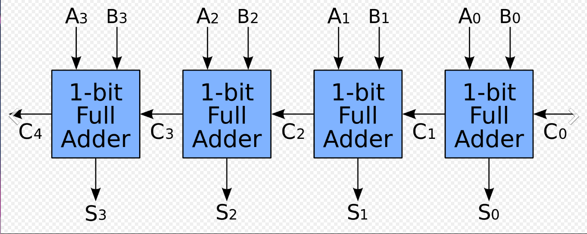
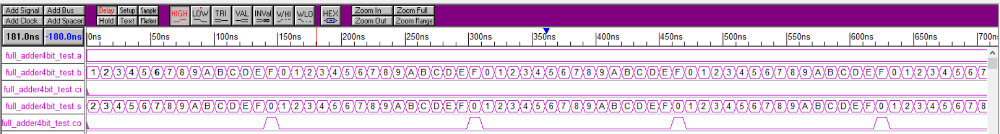

### 漣波加法器
透過進位的方式，一級一級的串接，達到進位的作法，在加法運算中會因為需要等前一級進位才可下一位進位，因此當串聯的數量高的時候速度就會很慢，因此為了改善會使用前瞻進位加法器這類的加法方式。

## 4位元全加法器

### 電路圖



### 真值表
| a3 a2 a1 a0 | b3 b2 b1 b0 | ci | s3 s2 s1 s0   | Co |
|:----------: |:-----------:|:--:|:-------------:|:--:|
|  0 0 0 0    |  0 0 0 0    | 0  |  0 0 0 0      | 0  |
|  0 0 0 1    |  0 0 0 1    | 0  |  0 0 1 0      | 0  |
|  0 0 1 0    |  0 0 1 0    | 0  |  0 1 0 0      | 0  |
|  0 0 1 1    |  0 0 1 1    | 0  |  0 1 1 0      | 0  |
|  0 1 0 0    |  0 1 0 0    | 0  |  1 0 0 0      | 0  |
|  0 1 0 1    |  0 1 0 1    | 0  |  1 0 1 0      | 0  |
|  0 1 1 0    |  0 1 1 0    | 0  |  1 1 0 0      | 0  |
|  0 1 1 1    |  0 1 1 1    | 0  |  1 1 1 0      | 0  |
|  1 0 0 0    |  1 0 0 0    | 0  |  0 0 0 0      | 1  |
|  1 0 0 1    |  1 0 0 1    | 0  |  0 0 1 0      | 1  |
|  1 0 1 0    |  1 0 1 0    | 0  |  0 1 0 0      | 1  |
|  1 0 1 1    |  1 0 1 1    | 0  |  0 1 1 0      | 1  |
|  1 1 0 0    |  1 1 0 0    | 0  |  1 0 0 0      | 1  |
|  1 1 0 1    |  1 1 0 1    | 0  |  1 0 1 0      | 1  |
|  1 1 1 0    |  1 1 1 0    | 0  |  1 1 0 0      | 1  |
|  1 1 1 1    |  1 1 1 1    | 0  |  1 1 1 0      | 1  |
|  1 1 1 1    |  1 1 1 1    | 1  |  1 1 1 1      | 1  |


<details>
<summary>Verilog_assign程式碼</summary>

```verilog
module  adder_4bit_assign (a,b,ci,s,co);
    input [3:0] a,b;
    input ci;
    output [3:0] s;
    output co;

    assign {co,s} = (a + b + ci);
endmodule

```
</details>

<details>
<summary>Verilog測試檔案</summary>

```verilog
`timescale 1ns / 1ps

module adder_4bit_assign_test ();

    reg [3:0] a;
    reg [3:0] b;
    reg ci;
    wire [3:0] s;
    wire co;
    integer i,j;

    adder_4bit_assign UUT (a, b, ci, s, co);

    initial begin
        a  = -1;
        b  = -1;
        ci = 0;
        for (i = 0; i < 16; i = i + 1)begin
            a=a+1;
            for (j = 0; j < 16; j = j + 1)begin
                b=b+1;
                //ci=~ci;
            #10;
            end
        end
    end

    initial begin
        #2560;
        $stop;
    end


endmodule 

```
</details>

<details>
<summary>Verilog_assign_gate程式碼</summary>

```verilog
module fulladder (a, b, ci, s, co);
    input a, b, ci;
    output s, co;
    wire ab,xab,xabci;

    assign xab = a ^ b;
    assign s = xab ^ ci;
    assign xabci = xab & ci;
    assign ab = a & b;
    assign co = xabci | ab;
endmodule

module adder_4bit_assign_gate(a, b, ci, s, co);
    input [3:0] a,b;
    input ci;
    output [3:0] s;
    output co;
    wire [3:0] c;

    fulladder fa1(a[0],b[0], ci, s[0], c[1]) ;
    fulladder fa2(a[1],b[1], c[1], s[1], c[2]) ;
    fulladder fa3(a[2],b[2], c[2], s[2], c[3]) ;
    fulladder fa4(a[3],b[3], c[3], s[3], co) ;

endmodule

```
</details>

<details>
<summary>Verilog測試檔案</summary>

```verilog
`timescale 1ns / 1ps

module adder_4bit_assign_gate_test ();

    reg [3:0] a;
    reg [3:0] b;
    reg ci;
    wire [3:0] s;
    wire co;
    integer i,j;

    adder_4bit_assign_gate UUT (a, b, ci, s, co);

    initial begin
        a  = -1;
        b  = -1;
        ci = 0;
        for (i = 0; i < 16; i = i + 1)begin
            a=a+1;
            for (j = 0; j < 16; j = j + 1)begin
                b=b+1;
                //ci=~ci;
            #10;
            end
        end
    end

    initial begin
        #2560;
        $stop;
    end

endmodule 

```
</details>

<details>
<summary>Verilog_gate程式碼</summary>

```verilog
module fulladder (a, b, ci, s, co);
    input a, b, ci;
    output s, co;
    wire xb,xab,xabci;

    xor(xab,a,b);
    xor(s,xab,ci);
    and(xabci,xab,ci);
    and(ab,a,b);
    or(co,xabci,ab);
endmodule

module adder_4bit_gate(a, b, ci, s, co);
    input [3:0] a,b;
    input ci;
    output [3:0] s;
    output co;
    wire [3:0] c;

    fulladder fa1(a[0],b[0], ci, s[0], c[1]) ;
    fulladder fa2(a[1],b[1], c[1], s[1], c[2]) ;
    fulladder fa3(a[2],b[2], c[2], s[2], c[3]) ;
    fulladder fa4(a[3],b[3], c[3], s[3], co) ;

endmodule

```
</details>

<details>
<summary>Verilog測試檔案</summary>

```verilog
`timescale 1ns / 1ps

module adder_4bit_gate_test ();

    reg [3:0] a;
    reg [3:0] b;
    reg ci;
    wire [3:0] s;
    wire co;
    integer i,j;

    adder_4bit_gate UUT (a, b, ci, s, co);

    initial begin
        a  = -1;
        b  = -1;
        ci = 0;
        for (i = 0; i < 16; i = i + 1)begin
            a=a+1;
            for (j = 0; j < 16; j = j + 1)begin
                b=b+1;
                //ci=~ci;
            #10;
            end
        end
    end

    initial begin
        #2560;
        $stop;
    end


endmodule 

```
</details>

### 模擬圖

