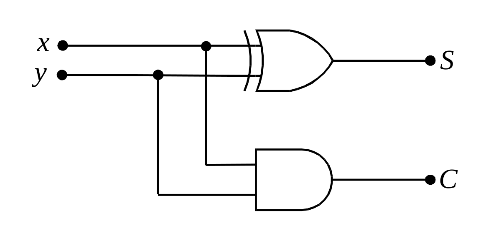
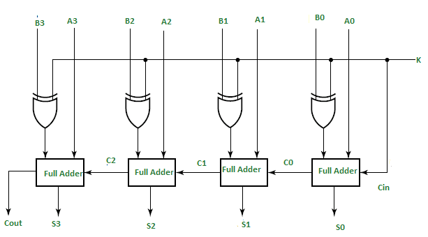
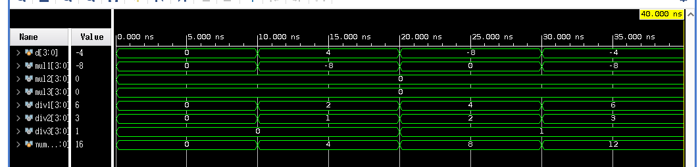
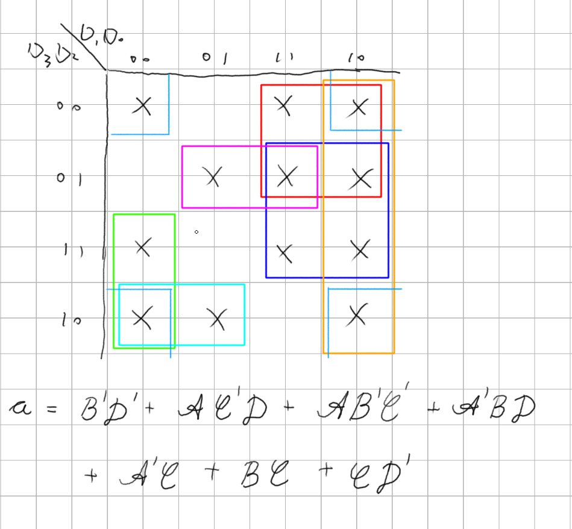
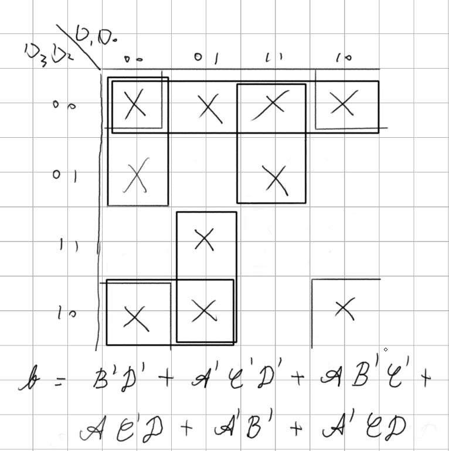
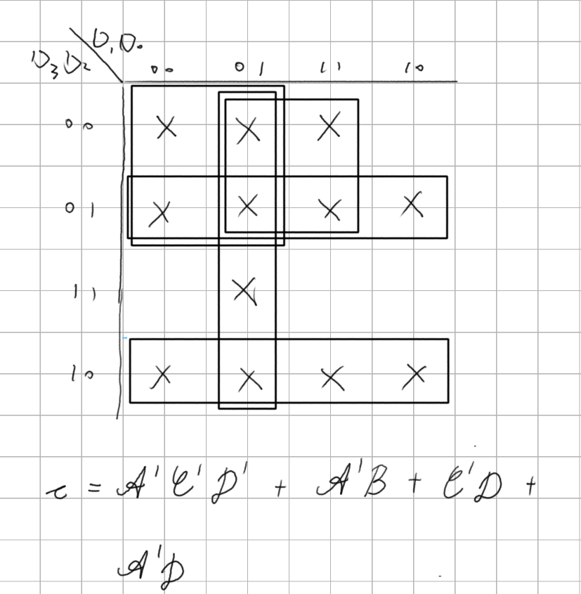
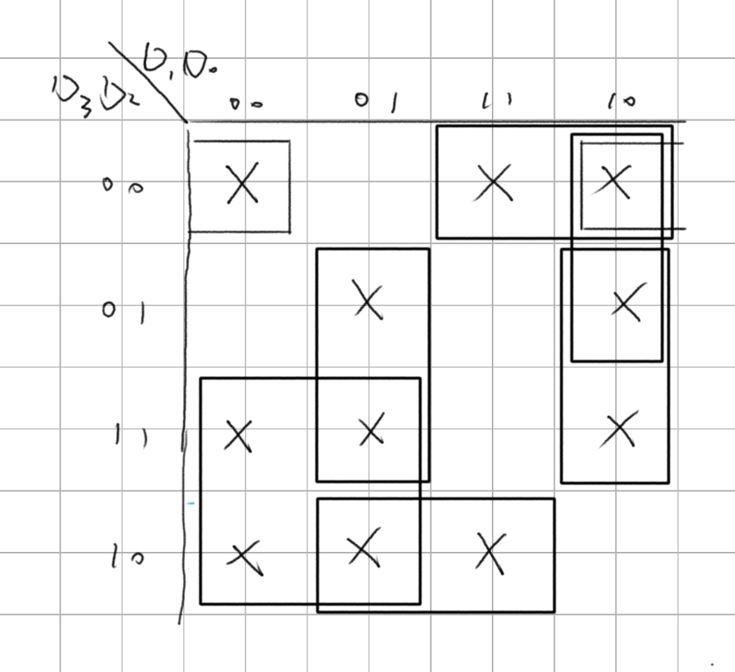

## 簡介
[數位電路](/docs/WiKi/數位電路.md)可以分成兩大類，分別是「[組合邏輯電路](../WiKi/組合邏輯電路.md)」([Combinational Logic Circuit](/docs/WiKi/Combinational%20Logic%20Circuit))與「[序向邏輯電路](../WiKi/序向邏輯電路.md)」([Sequential Logic Circuit](../WiKi/Sequential%20Logic%20Circuit.md))兩大類。

「組合邏輯」是由邏輯閘所組合而成，沒有受到回授訊號、時間順序以及記憶狀態而改變，不因內部狀態而改變下一步動作，僅有「準位觸發」；「[序向邏輯](/docs/WiKi/序向邏輯.md)」則是由[回授電路](/docs/WiKi/回授電路.md)與邏輯閘組合而成，受到回授訊號、時間順序以及記憶狀態而改變，也就是受到內部狀態而改變下一步狀態，除了有「準位觸發」還有「正緣觸發」與「負緣觸發」。

組合邏輯也是[計算機結構](../WiKi/計算機結構.md)的基礎組成之一，例如組合邏輯的基本元件與「[暫存器](/docs/WiKi/暫存器.md)」組成的「微運算」；「微運算」組成的「[算術邏輯移位單元](/docs/WiKi/算術邏輯移位單元.md)」；[多工器](/docs/WiKi/多工器.md)、[編碼器](/docs/WiKi/編碼器.md)、[三態閘](/docs/WiKi/三態閘.md)組成的「[匯流排](/docs/WiKi/匯流排.md)」；由[解碼器](/docs/WiKi/解碼器.md)、控制邏輯閘組成「[控制單元](/docs/WiKi/控制單元.md)」，皆可以看到組合邏輯的身影，此章節是非常重要。

這也是為什麼大多的[數位邏輯書籍](/docs/WiKi/數位邏輯書籍)都會以「[加法器](/docs/WiKi/加法器.md)」、「[減法器](/docs/WiKi/減法器.md)」、「[比較器](/docs/WiKi/比較器.md)」、「[解碼器](/docs/WiKi/解碼器.md)」、「[編碼器](/docs/WiKi/編碼器.md)」、「[多工器](/docs/WiKi/多工器.md)」的基本元件作為介紹，因為後續會用在[計算機結構](../WiKi/計算機結構.md)上面。

此章節會先講解基本的四則運算的組合語言電路，再來編碼與解碼的設計，最後多工器，依序說明常見的組合邏輯設計。

## 數學運算
加、減、乘與除等四種算術運算在我們日常生活中，用來處理數值運算之基本方法，因此數位電路 (Digital Circuit) 亦應具有這些基本算術運算功能，才能用來幫助人類處理各種繁瑣之數值運算問題。

數位電路僅能用來處理二進位 ( 二元性 ) 資料，若引入補數 (Complement) 之觀念，則減法運算可用加法來取代，又乘法運算可用連續加法運算代替，而除法運算亦可用連續減法運算來取代，故加法器可為算術運算之基本電路。

本章首先將討論 1 位元加法器 (Adder) 之設計方法，再進一步說明如何串接 n 個 1 位元加法器來設計 n 位元二進位數並行加法電路。接下來討論使用補數之觀念，使用加法器來取代減法電路之設計方法。

接著討論如何直接設計減法器 (Subtractor) 與乘法器 (Multiplier)，以提所高算術運算電路之運算速度。最後討論將算術運算 (Arithmetic Operation) 與邏輯運算 (Logic Operation)合併在同一個邏輯電路，稱為算術邏輯單元 (Arithmetic Logic Unit; ALU)，以實現多功能之組合邏輯函數

## 加法器
加法器是常見的運算元件，也是數位邏輯中基本元件之一，加法器除了加法外可以延伸製作減法、乘法以及除法。

一個加法器包括了加數、被加數、進位、輸出，也因此最小一位元加法器單元有分成兩種，半加法器、全加法器。

而透過半加法器組成的全加法器中，依照速度與特性又分成兩種加法器：「漣波加法器」、「前瞻加法器」，分別以簡單與快速成為兩種的特性。

這邊都會詳細的說明其中原理與推導。

### 一位元半加法器



| a   | b   | sum | carry |
| --- | --- | --- | ----- |
| 0   | 0   | 0   | 0     |
| 0   | 1   | 1   | 0     |
| 1   | 0   | 1   | 0     |
| 1   | 1   | 0   | 1     |

<details>
<summary>Verilog程式碼 Gate</summary>

```verilog
module half_adder (a, b, sum, carry);
input a, b;
output sum, carry;

xor (sum, a, b);
and (carry, a, b);

endmodule // half_adder

```
</details>

<details>
<summary>Verilog測試檔案</summary>

```verilog
module half_subtr_test ();
  reg [3:0] a, b;
  wire [4:0] sum;
  integer number1, number2;

  half_subtr UUT (a, b, sum);

  initial begin
    for (number1 = 0; number1 < 16; number1 = number1 + 1)
      begin
        for (number2 = 0; number2 < 16; number2 = number2 + 1)
          begin
              a = number1;
              b = number2;
              #10;
          end
      end
    $finish;
  end

endmodule // half_subtr_test

```
</details>

### 一位元全加法器


| a   | b   | ci  | sum | carry |
| --- | --- | --- | --- | ----- |
| 0   | 0   | 0   | 0   | 0     |
| 0   | 0   | 1   | 1   | 0     |
| 0   | 1   | 0   | 1   | 0     |
| 0   | 1   | 1   | 0   | 1     |
| 1   | 0   | 0   | 1   | 0     |
| 1   | 0   | 1   | 0   | 1     |
| 1   | 1   | 0   | 0   | 1     |
| 1   | 1   | 1   | 1   | 1     |

全加器具有前級進位、和、進位，半加器則只具有和、進位，透過AND邏輯閘做出來。

<details>
<summary>Verilog程式碼 gate</summary>

```verilog
module full_adder (a, b, ci, sum, carry);

input a, b, ci;
output carry, sum;
wire a_b, a_ci, b_ci;

xor (sum, a, b, ci);
and (a_b, a, b);
and (a_ci, a, ci);
and (b_ci, b, ci);
or (carry, a_b, a_ci, b_ci);

endmodule // full_adder
```
</details>

<details>
<summary>Verilog測試檔案</summary>

```verilog
`timescale 1ns / 1ps
`include "full_adder.v"

module full_adder_test ();
  reg a, b, ci;
  wire sum, carry;
  integer number1, number2, number3;

  full_adder UUT (a, b, ci, sum, carry);

  initial begin
    for (number1 = 0; number1 < 2; number1 = number1 + 1)
      begin
        for (number2 = 0; number2 < 2; number2 = number2 + 1)
          begin
            for (number3 = 0; number3 < 2; number3 = number3 + 1)
              begin
                a = number1;
                b = number2;
                ci = number3;
                $monitor("| %b | %b | %b | %b | %b |", a, b, ci, sum, carry);
                #10;
              end
          end
      end
    $finish;
  end

endmodule // full_adder_test

```
</details>

<details>
<summary>Verilog程式碼 Assign</summary>

```verilog
module adder_one_assign (a, b, ci, co, sum);
input a, b, ci;
output co, sum;

assign sum = a ^ b ^ ci;
assign co = (a & b) | (a & ci) | (b & ci);

endmodule // adder_one_assign

```
</details>

<details>
<summary>Verilog測試檔案</summary>

```verilog
`timescale 1ns / 1ps

module adder_one_assign_test ();
reg a, b, ci;
wire co, sum;
integer i;

adder_one_assign UUT (.a(a), .b(b), .ci(ci), .co(co), .sum(sum));

initial begin
  for (i = 0; i < 8; i = i + 1)
    begin
      {a, b, ci} = i[2:0];
      #10;
    end
end

initial begin
  #80;
  $finish;
end


endmodule // adder_one_assign_test

```
</details>

<details>
<summary>Verilog程式碼 If</summary>

```verilog
module adder_one_if (a, b, ci, co, sum);
input a, b, ci;
output co, sum;
reg co, sum;


always @ ( a or b or ci ) begin
  if ({a, b, ci} == 0) begin
    {co, sum} = 2'b00;
  end else if ({a, b, ci} == 1) begin
    {co, sum} = 2'b00;
  end else if ({a, b, ci} == 2) begin
    {co, sum} = 2'b00;
  end else if ({a, b, ci} == 3) begin
    {co, sum} = 2'b00;
  end else if ({a, b, ci} == 4) begin
    {co, sum} = 2'b00;
  end else if ({a, b, ci} == 5) begin
    {co, sum} = 2'b00;
  end else if ({a, b, ci} == 6) begin
    {co, sum} = 2'b00;
  end else begin
    {co, sum} = 2'b00;
  end

end

endmodule // adder_one_if

```
</details>

<details>
<summary>Verilog測試檔案</summary>

```verilog
`timescale 1ns / 1ps

module adder_one_if_test ();
reg a, b, ci;
wire co, sum;
integer i;

adder_one_if UUT (.a(a), .b(b), .ci(ci), .co(co), .sum(sum));

initial begin
  for (i = 0; i < 8; i = i + 1)
    begin
      {a, b, ci} = i[2:0];
      #10;
    end
end

initial begin
  #80;
  $finish;
end


endmodule // adder_one_if_test

```
</details>

訊號模擬結果：


使用兩個半加器組成全加器，這樣的作法就有點算是漣波加法器的作法，只是是在1位元就這麼做。

<details>
<summary>Verilog程式碼</summary>

```verilog
```
</details>

<details>
<summary>Verilog測試檔案</summary>

```verilog

```
</details>

### 漣波加法器
透過進位的方式，一級一級的串接，達到進位的作法，在加法運算中會因為需要等前一級進位才可下一位進位，因此當串聯的數量高的時候速度就會很慢，因此為了改善會使用前瞻進位加法器這類的加法方式。

#### 4位元漣波加法器

<details>
<summary>Verilog程式碼</summary>

```verilog
`include "full_adder.v"

module full_adder_4_bit (a, b, ci, sum, co);

input [3:0] a, b;
input ci;
output [3:0] sum;
output co;
wire carry1, carry2, carry3;

full_adder add1(a[0], b[0], ci, sum[0], carry1);
full_adder add2(a[1], b[1], carry1, sum[1], carry2);
full_adder add3(a[2], b[2], carry2, sum[2], carry3);
full_adder add4(a[3], b[3], carry3, sum[3], co);

endmodule // full_add_4_bit

```
</details>

<details>
<summary>Verilog測試檔案</summary>

```verilog
`include "full_adder_4_bit.v"

module full_adder_4_bit_test ();
  reg [3:0] a, b;
  reg ci;
  wire [3:0] sum;
  wire co;
  integer number1, number2, number3;

  full_adder_4_bit UUT (a, b, ci, sum, co);

  initial begin
    for (number1 = 0; number1 < 16; number1 = number1 + 1)
      begin
        for (number2 = 0; number2 < 16; number2 = number2 + 1)
          begin
            for (number3 = 0; number3 < 2; number3 = number3 + 1)
              begin
                a = number1;
                b = number2;
                ci = number3;
                $monitor("| %d | %d | %b | %d | %b |", a, b, ci, sum, co);
                #10;
              end
          end
      end
    $finish;
  end

endmodule // full_adder_4_bit_test

```
</details>

### 4位元加法器
透過 `assign` 的連續指定方式，設計加法器。

<details>
<summary>Verilog程式碼</summary>

```verilog
module adder_4_assign (sum, co, a, b, ci);
input [3:0] a, b;
input ci;
output [3:0] sum;
output co;

assign {co, sum} = (a + b + ci);

endmodule // adder_4_assign
```

</details>

<details>
<summary>Verilog測試檔案</summary>

```verilog
`timescale 1ns / 1ps
`include "adder_4_assign.v"

module adder_4_assign_test ();
reg [3:0] a, b;
reg [3:0] sum;
reg ci, co;
integer i;

adder_4_assign UUT (.co(co), .sum(sum), .a(a), .b(b), .ci(ci));

initial begin
  ci = 0;
  for (i = 0; i < 8; i = i + 2)
    begin
      a = i;
      b = 16 - i;
      ci = ~ci;
      #10;
    end
end

initial begin
  #80;
  $finish;
end

endmodule // adder_4_assign_test

```
</details>

### 16位元全加法器
| a                | b                | out              |
| ---------------- | ---------------- | ---------------- |
| 0000000000000000 | 0000000000000000 | 0000000000000000 |
| 0000000000000000 | 1111111111111111 | 1111111111111111 |
| 1111111111111111 | 1111111111111111 | 1111111111111110 |
| 1010101010101010 | 0101010101010101 | 1111111111111111 |
| 0011110011000011 | 0000111111110000 | 0100110010110011 |
| 0001001000110100 | 1001100001110110 | 1010101010101010 |

<details>
<summary>Verilog程式碼</summary>

```verilog
```
</details>

<details>
<summary>Verilog測試檔案</summary>

```verilog
```
</details>

### 前瞻加法器
<details>
<summary>Verilog程式碼</summary>

```verilog
```
</details>

<details>
<summary>Verilog測試檔案</summary>

```verilog
```
</details>

### 累加器

| a                | b                | out              |
| ---------------- | ---------------- | ---------------- |
| 0000000000000000 | 0000000000000000 | 0000000000000000 |
| 0000000000000000 | 1111111111111111 | 1111111111111111 |
| 1111111111111111 | 1111111111111111 | 1111111111111110 |
| 1010101010101010 | 0101010101010101 | 1111111111111111 |
| 0011110011000011 | 0000111111110000 | 0100110010110011 |
| 0001001000110100 | 1001100001110110 | 1010101010101010 |

當有二進位數字輸入時，會將輸入二進位資料做 $`+ 1`$ 的動作。

<details>
<summary>Verilog程式碼</summary>

```verilog
```
</details>

<details>
<summary>Verilog測試檔案</summary>

```verilog
```
</details>

### 十進位加法器
也稱為「BCD加法器」，以十進位為作為加法。

## 減法器

### 1位元半減法器

| a   | b   | sub | carry |
| --- | --- | --- | ----- |
| 0   | 0   | 0   | 0     |
| 0   | 1   | 1   | 1     |
| 1   | 0   | 1   | 0     |
| 1   | 1   | 0   | 0     |

<details>
<summary>Verilog程式碼 Gate</summary>

```verilog
module half_adder (a, b, sum, borrow);
input a, b;
output sum, borrow;

xor (sum, a, b);
and (borrow, a, b);

endmodule // half_adder
```
</details>

<details>
<summary>Verilog測試檔案</summary>

```verilog
`include "half_adder.v"

module half_adder_test ();
  reg a, b;
  wire sub, borrow;
  integer number1, number2;

  half_adder UUT (a, b, sub, borrow);

  initial begin
    for (number1 = 0; number1 < 2; number1 = number1 + 1)
      begin
        for (number2 = 0; number2 < 2; number2 = number2 + 1)
          begin
            a = number1;
            b = number2;
            $monitor("| %b | %b | %b | %b |", a, b, sub, borrow);
            #10;
          end
      end
    $finish;
  end

endmodule // half_adder_test
```
</details>

### 1位元全減法器

<details>
<summary>Verilog程式碼</summary>

```verilog
module full_subtr (a, b, ci, sub, borrow);

input a, b, ci;
output borrow, sub;
wire a_b, a_ci, b_ci;

not nota(a_bar, a);
not notb(b_bar, a);

xor (sub, a, b, ci);
and (a_b, a_bar, b);
and (a_ci, a_bar, ci);
and (b_ci, b, ci);
or (borrow, a_b, a_ci, b_ci);

endmodule // full_subtr

```
</details>

<details>
<summary>Verilog測試檔案</summary>

```verilog
`timescale 1ns / 1ps
`include "full_subtr.v"

module full_subtr_test ();
  reg a, b, ci;
  wire sub, borrow;
  integer number1, number2, number3;

  full_subtr UUT (a, b, ci, sub, borrow);

  initial begin
    for (number1 = 0; number1 < 2; number1 = number1 + 1)
      begin
        for (number2 = 0; number2 < 2; number2 = number2 + 1)
          begin
            for (number3 = 0; number3 < 2; number3 = number3 + 1)
              begin
                a = number1;
                b = number2;
                ci = number3;
                $monitor("| %b | %b | %b | %b | %b |", a, b, ci, sub, borrow);
                #10;
              end
          end
      end
    $finish;
  end

endmodule // full_subtr_test

```
</details>

<details>
<summary>測試結果</summary>

```
| a   | b   | ci  | sub | borrow |
| 0   | 0   | 0   | 0   | 0      |
| 0   | 0   | 1   | 1   | 1      |
| 0   | 1   | 0   | 1   | 1      |
| 0   | 1   | 1   | 0   | 1      |
| 1   | 0   | 0   | 1   | 0      |
| 1   | 0   | 1   | 0   | 0      |
| 1   | 1   | 0   | 0   | 0      |
| 1   | 1   | 1   | 1   | 1      |
```
</details>

### 4位元漣波減法器

<details>
<summary>Verilog程式碼 Gate</summary>

```verilog
`include "full_subtr.v"

module subtr_4_bit (a, b, bi, sub, bo);

input [3:0] a, b;
input bi;
output [3:0] sub;
output bo;
wire borrow1, borrow2, borrow3;

full_subtr sub1(a[0], b[0], bi, sub[0], borrow1);
full_subtr sub2(a[1], b[1], borrow1, sub[1], borrow2);
full_subtr sub3(a[2], b[2], borrow2, sub[2], borrow3);
full_subtr sub4(a[3], b[3], borrow3, sub[3], bo);

endmodule // subtr_4_bit
```
</details>

<details>
<summary>Verilog測試檔案</summary>

```verilog
`include "subtr_4_bit.v"

module subtr_4_bit_test ();
  reg [3:0] a, b;
  reg bi;
  wire [3:0] sub;
  wire bo;
  integer number1, number2, number3;

  subtr_4_bit UUT (a, b, bi, sub, bo);

  initial begin
    for (number1 = 0; number1 < 16; number1 = number1 + 1)
      begin
        for (number2 = 0; number2 < 16; number2 = number2 + 1)
          begin
            for (number3 = 0; number3 < 2; number3 = number3 + 1)
              begin
                a = number1;
                b = number2;
                bi = number3;
                $monitor("| %b | %b | %b | %b | %b |", a, b, bi, sub, bo);
                #10;
              end
          end
      end
    $finish;
  end

endmodule // subtr_4_bit_test

```
</details>

## 4位元漣波加減法器
透過至能控制線，來控制電路處於加法或減法，因此加法器常常被稱為運算基礎元件，具有通用性質。



<details>
<summary>Verilog程式碼 Gate</summary>

```verilog
`include "adder_4_bit.v"

module adder_subtr_4_bit (a, b, k, sum, co);

input signed [3:0] a, b;
input k;
output signed [3:0] sum;
output co;
wire signed [3:0] add_sub;


xor xor0(add_sub[0], b[0], k);
xor xor1(add_sub[1], b[1], k);
xor xor2(add_sub[2], b[2], k);
xor xor3(add_sub[3], b[3], k);
adder_4_bit adder(a, add_sub, k, sum, co);

endmodule // adder_subtr_4_bit
```
</details>

<details>
<summary>Verilog測試檔案</summary>

```verilog
`include "adder_subtr_4_bit.v"

module adder_subtr_4_bit_test ();
  reg signed [3:0] a, b;
  reg k;
  wire signed [3:0] sum;
  wire co;
  integer number1, number2, number3;

  adder_subtr_4_bit UUT (a, b, k, sum, co);

  initial begin
    for (number1 = 0; number1 < 16; number1 = number1 + 1)
      begin
        for (number2 = 0; number2 < 16; number2 = number2 + 1)
          begin
            for (number3 = 0; number3 < 2; number3 = number3 + 1)
              begin
                a = number1;
                b = number2;
                k = number3;
                $monitor("| %d | %d | %b | %d | %b |", a, b, k, sum, co);
                #10;
              end
          end
      end
    $finish;
  end

endmodule // adder_subtr_4_bit_test
```
</details>

## 乘法器
乘法器會有兩種作法，一種是透過硬體邏輯閘方式，透過加法器來做到。

另一種方式，透過移位的方式，達到乘法運算，當如果乘法器加上暫存器，就會成為移位暫存器，可以在後續的章節了解原理。

### 邏輯閘乘法器

<details>
<summary>Verilog程式碼</summary>

```verilog

```
</details>

<details>
<summary>Verilog測試檔案</summary>

```verilog
```
</details>

### 移位乘法器

#### 4位元移位運算
<details>
<summary>Verilog程式碼</summary>

```verilog
```
</details>

<details>
<summary>Verilog測試檔案</summary>

```verilog
```
</details>



## 除法器
<details>
<summary>Verilog程式碼</summary>

```verilog
```
</details>

<details>
<summary>Verilog測試檔案</summary>

```verilog
```
</details>

## 比較器
用於數值的比較，通常會有製作大於、小於、等於，或者在序向邏輯電路中透過指令的方式，來達到相同，但通常硬體方式是最快的比較方式。

<details>
<summary>Verilog程式碼</summary>

```verilog
```
</details>

<details>
<summary>Verilog測試檔案</summary>

```verilog
```
</details>

## 解碼器
<details>
<summary>Verilog程式碼</summary>

```verilog
```
</details>

<details>
<summary>Verilog測試檔案</summary>

```verilog
```
</details>

### BCD to Seven Segment Display
此為BCD轉成七段顯示器，

由於我們在硬體設計上會使用`[3:0]`來說明輸入訊號為並列，因此設計上為`F(D3, D2, D1, D1)`，會轉換為`F(A, B, C, D) = {a, b, c, d, e, f}`

$`a = B'D' + AC'D + AB'C' + A'BD + A'C + BC + CD'`$



$`b = B'D' + A'C'D' + AB'C' + AC'D + A'B' + A'CD`$



$`c = A'C'D' + A'B + AB' + C'D + A'D`$



$`d = A'B'D' + AC' + BC'D + AB'D + A'B'C + A'CD' + BCD'`$



$`e = B'D' + AB + AC + CD'`$

$`e = C'D' + A'B + AB' + AC`$

$`f = A'BC' + AB'C' + BC'D + AD + A'B'C + AC + CD'`$

## 編碼器
<details>
<summary>Verilog程式碼</summary>

```verilog
```
</details>

<details>
<summary>Verilog測試檔案</summary>

```verilog
```
</details>

## 多工器
「多工器」(Multiplexer)，又稱「資料選擇器」(Data Selector)，被用在數位訊號的資料導向，將訊號透過選擇線控制輸出的訊號。

在CPU上面通常用在匯流排的應用上面，來控制資料的導向與方向。另外一個是訊號切換器，早期叢集運算因為會有很多電腦，當時虛擬化技術尚未發達，因此在控制很多電腦需求下，透過切換器來選擇多個電腦來源以及鍵盤滑鼠的連接，控制指定電腦。

### 2x1多工器
以下是2X1多工器，是多工器的最小單位。


<details>
<summary>Verilog程式碼</summary>

```verilog
module sel_2x1 (a, b, sel, out);
  input a, b, sel;
  output out;
  wire sel_a, sel_b;

  assign sel_a = ~(a & ~sel);
  assign sel_b = ~(b & sel);
  assign out = ~(sel_a & sel_b);

endmodule // sel_2x1
```
</details>

<details>
<summary>Verilog測試檔案</summary>

```verilog
`include "sel_2x1.v"

module sel_2x1_test ();
  reg a, b, sel;
  wire out;
  integer number1, number2;

  sel_2x1 UUT (a, b, sel, out);

  initial begin
    $display("| a | b | sel | out |");
    for (number1 = 0; number1 < 4; number1 = number1 + 1)
      begin
        for (number2 = 0; number2 < 2; number2 = number2 + 1)
          begin
            {a, b} = number1;
            {sel} = number2;
            $monitor("| %b | %b |  %b  |  %b  |", a, b, sel, out);
            #10;
          end
      end
    $finish;
  end

endmodule // sel_2x1_test
```
</details>

<details>
<summary>測試結果</summary>

```
| a | b | sel | out |
| 0 | 0 |  0  |  0  |
| 0 | 0 |  1  |  0  |
| 0 | 1 |  0  |  0  |
| 0 | 1 |  1  |  1  |
| 1 | 0 |  0  |  1  |
| 1 | 0 |  1  |  0  |
| 1 | 1 |  0  |  1  |
| 1 | 1 |  1  |  1  |
```
</details>

### 4x1多工器

<details>
<summary>Verilog程式碼</summary>

```verilog
module sel_4x1 (a, b, c, d, sel0, sel1, out);
input a, b, c, d;
input sel0, sel1;
output out;
wire sel0_b, sel1_b;
wire a_sel, b_sel, c_sel, d_sel;

not not_sel0(sel0_b, sel0);
not not_sel1(sel1_b, sel1);

and(a_sel, a, sel1_b, sel0_b);
and(b_sel, b, sel1_b, sel0);
and(c_sel, c, sel1, sel0_b);
and(d_sel, d, sel1, sel0);
or(out, a_sel, b_sel, c_sel, d_sel);

endmodule // sel_4x1
```
</details>

<details>
<summary>Verilog測試檔案</summary>

```verilog
`include "sel_4x1.v"

module sel_4x1_test ();
  reg a, b, c, d, sel0, sel1;
  wire out;
  integer number1, number2;

  sel_4x1 UUT (a, b, c, d, sel0, sel1, out);

  initial begin
    for (number1 = 0; number1 < 16; number1 = number1 + 1)
      begin
        for (number2 = 0; number2 < 4; number2 = number2 + 1)
          begin
            {a, b, c, d} = number1;
            {sel0, sel1} = number2;
            $monitor("| %b | %b | %b | %b | %b | %b | %b |",
              a, b, c, d, sel0, sel1, out);
            #10;
          end
      end
    $finish;
  end

endmodule // sel_4x1_test
```
</details>

<details>
<summary>測試結果</summary>

```
|  a  |  b  |  c  |  d  | sel0 | sel1 | out |
|  0  |  0  |  0  |  0  |  0   |  0   |  0  |
|  0  |  0  |  0  |  0  |  0   |  1   |  0  |
|  0  |  0  |  0  |  0  |  1   |  0   |  0  |
|  0  |  0  |  0  |  0  |  1   |  1   |  0  |
|  0  |  0  |  0  |  1  |  0   |  0   |  0  |
|  0  |  0  |  0  |  1  |  0   |  1   |  0  |
|  0  |  0  |  0  |  1  |  1   |  0   |  0  |
|  0  |  0  |  0  |  1  |  1   |  1   |  1  |
|  0  |  0  |  1  |  0  |  0   |  0   |  0  |
|  0  |  0  |  1  |  0  |  0   |  1   |  1  |
|  0  |  0  |  1  |  0  |  1   |  0   |  0  |
|  0  |  0  |  1  |  0  |  1   |  1   |  0  |
|  0  |  0  |  1  |  1  |  0   |  0   |  0  |
|  0  |  0  |  1  |  1  |  0   |  1   |  1  |
|  0  |  0  |  1  |  1  |  1   |  0   |  0  |
|  0  |  0  |  1  |  1  |  1   |  1   |  1  |
|  0  |  1  |  0  |  0  |  0   |  0   |  0  |
|  0  |  1  |  0  |  0  |  0   |  1   |  0  |
|  0  |  1  |  0  |  0  |  1   |  0   |  1  |
|  0  |  1  |  0  |  0  |  1   |  1   |  0  |
|  0  |  1  |  0  |  1  |  0   |  0   |  0  |
|  0  |  1  |  0  |  1  |  0   |  1   |  0  |
|  0  |  1  |  0  |  1  |  1   |  0   |  1  |
|  0  |  1  |  0  |  1  |  1   |  1   |  1  |
|  0  |  1  |  1  |  0  |  0   |  0   |  0  |
|  0  |  1  |  1  |  0  |  0   |  1   |  1  |
|  0  |  1  |  1  |  0  |  1   |  0   |  1  |
|  0  |  1  |  1  |  0  |  1   |  1   |  0  |
|  0  |  1  |  1  |  1  |  0   |  0   |  0  |
|  0  |  1  |  1  |  1  |  0   |  1   |  1  |
|  0  |  1  |  1  |  1  |  1   |  0   |  1  |
|  0  |  1  |  1  |  1  |  1   |  1   |  1  |
|  1  |  0  |  0  |  0  |  0   |  0   |  1  |
|  1  |  0  |  0  |  0  |  0   |  1   |  0  |
|  1  |  0  |  0  |  0  |  1   |  0   |  0  |
|  1  |  0  |  0  |  0  |  1   |  1   |  0  |
|  1  |  0  |  0  |  1  |  0   |  0   |  1  |
|  1  |  0  |  0  |  1  |  0   |  1   |  0  |
|  1  |  0  |  0  |  1  |  1   |  0   |  0  |
|  1  |  0  |  0  |  1  |  1   |  1   |  1  |
|  1  |  0  |  1  |  0  |  0   |  0   |  1  |
|  1  |  0  |  1  |  0  |  0   |  1   |  1  |
|  1  |  0  |  1  |  0  |  1   |  0   |  0  |
|  1  |  0  |  1  |  0  |  1   |  1   |  0  |
|  1  |  0  |  1  |  1  |  0   |  0   |  1  |
|  1  |  0  |  1  |  1  |  0   |  1   |  1  |
|  1  |  0  |  1  |  1  |  1   |  0   |  0  |
|  1  |  0  |  1  |  1  |  1   |  1   |  1  |
|  1  |  1  |  0  |  0  |  0   |  0   |  1  |
|  1  |  1  |  0  |  0  |  0   |  1   |  0  |
|  1  |  1  |  0  |  0  |  1   |  0   |  1  |
|  1  |  1  |  0  |  0  |  1   |  1   |  0  |
|  1  |  1  |  0  |  1  |  0   |  0   |  1  |
|  1  |  1  |  0  |  1  |  0   |  1   |  0  |
|  1  |  1  |  0  |  1  |  1   |  0   |  1  |
|  1  |  1  |  0  |  1  |  1   |  1   |  1  |
|  1  |  1  |  1  |  0  |  0   |  0   |  1  |
|  1  |  1  |  1  |  0  |  0   |  1   |  1  |
|  1  |  1  |  1  |  0  |  1   |  0   |  1  |
|  1  |  1  |  1  |  0  |  1   |  1   |  0  |
|  1  |  1  |  1  |  1  |  0   |  0   |  1  |
|  1  |  1  |  1  |  1  |  0   |  1   |  1  |
|  1  |  1  |  1  |  1  |  1   |  0   |  1  |
|  1  |  1  |  1  |  1  |  1   |  1   |  1  |
```

</details>

### 16位元並行輸入16位元並行輸出 2x1多工器

| a                | b                | sel | out              |
| ---------------- | ---------------- | --- | ---------------- |
| 0000000000000000 | 0000000000000000 | 0   | 0000000000000000 |
| 0000000000000000 | 0000000000000000 | 1   | 0000000000000000 |
| 0000000000000000 | 0001001000110100 | 0   | 0000000000000000 |
| 0000000000000000 | 0001001000110100 | 1   | 0001001000110100 |
| 1001100001110110 | 0000000000000000 | 0   | 1001100001110110 |
| 1001100001110110 | 0000000000000000 | 1   | 0000000000000000 |
| 1010101010101010 | 0101010101010101 | 0   | 1010101010101010 |
| 1010101010101010 | 0101010101010101 | 1   | 0101010101010101 |

<details>
<summary>Verilog程式碼</summary>

```verilog
```
</details>

<details>
<summary>Verilog測試檔案</summary>

```verilog
```
</details>

### 四路16位元並行輸入 4X1多工器

| a                | b                | c                | d                | sel | out              |
| ---------------- | ---------------- | ---------------- | ---------------- | --- | ---------------- |
| 0000000000000000 | 0000000000000000 | 0000000000000000 | 0000000000000000 | 00  | 0000000000000000 |
| 0000000000000000 | 0000000000000000 | 0000000000000000 | 0000000000000000 | 01  | 0000000000000000 |
| 0000000000000000 | 0000000000000000 | 0000000000000000 | 0000000000000000 | 10  | 0000000000000000 |
| 0000000000000000 | 0000000000000000 | 0000000000000000 | 0000000000000000 | 11  | 0000000000000000 |
| 0001001000110100 | 1001100001110110 | 1010101010101010 | 0101010101010101 | 00  | 0001001000110100 |
| 0001001000110100 | 1001100001110110 | 1010101010101010 | 0101010101010101 | 01  | 1001100001110110 |
| 0001001000110100 | 1001100001110110 | 1010101010101010 | 0101010101010101 | 10  | 1010101010101010 |
| 0001001000110100 | 1001100001110110 | 1010101010101010 | 0101010101010101 | 11  | 0101010101010101 |

<details>
<summary>Verilog程式碼</summary>

```verilog
```
</details>

<details>
<summary>Verilog測試檔案</summary>

```verilog
```
</details>

## 解多工器


| in  | sel | a   | b   |
| --- | --- | --- | --- |
| 0   | 0   | 0   | 0   |
| 0   | 1   | 0   | 0   |
| 1   | 0   | 1   | 0   |
| 1   | 1   | 0   | 1   |

<details>
<summary>Verilog程式碼</summary>

```verilog
module nand_and (a, b, sel, out);
  input in, sel;
  output a, b;

  assign nand1_out = ~(~(in & ~sel));
  assign nand2_out = ~(~(in & sel));

endmodule // nand_and
```
</details>

<details>
<summary>Verilog測試檔案</summary>

```verilog
```
</details>

### 4x1 解多工器
| in  | sel | a   | b   | c   | d   |
| --- | --- | --- | --- | --- | --- |
| 0   | 00  | 0   | 0   | 0   | 0   |
| 0   | 01  | 0   | 0   | 0   | 0   |
| 0   | 10  | 0   | 0   | 0   | 0   |
| 0   | 11  | 0   | 0   | 0   | 0   |
| 1   | 00  | 1   | 0   | 0   | 0   |
| 1   | 01  | 0   | 1   | 0   | 0   |
| 1   | 10  | 0   | 0   | 1   | 0   |
| 1   | 11  | 0   | 0   | 0   | 1   |

<details>
<summary>Verilog程式碼</summary>

```verilog
```
</details>

<details>
<summary>Verilog測試檔案</summary>

```verilog
```
</details>

### 8x1 解多工器
| in  | sel | a   | b   | c   | d   | e   | f   | g   | h   |
| --- | --- | --- | --- | --- | --- | --- | --- | --- | --- |
| 0   | 000 | 0   | 0   | 0   | 0   | 0   | 0   | 0   | 0   |
| 0   | 001 | 0   | 0   | 0   | 0   | 0   | 0   | 0   | 0   |
| 0   | 010 | 0   | 0   | 0   | 0   | 0   | 0   | 0   | 0   |
| 0   | 011 | 0   | 0   | 0   | 0   | 0   | 0   | 0   | 0   |
| 0   | 100 | 0   | 0   | 0   | 0   | 0   | 0   | 0   | 0   |
| 0   | 101 | 0   | 0   | 0   | 0   | 0   | 0   | 0   | 0   |
| 0   | 110 | 0   | 0   | 0   | 0   | 0   | 0   | 0   | 0   |
| 0   | 111 | 0   | 0   | 0   | 0   | 0   | 0   | 0   | 0   |
| 1   | 000 | 1   | 0   | 0   | 0   | 0   | 0   | 0   | 0   |
| 1   | 001 | 0   | 1   | 0   | 0   | 0   | 0   | 0   | 0   |
| 1   | 010 | 0   | 0   | 1   | 0   | 0   | 0   | 0   | 0   |
| 1   | 011 | 0   | 0   | 0   | 1   | 0   | 0   | 0   | 0   |
| 1   | 100 | 0   | 0   | 0   | 0   | 1   | 0   | 0   | 0   |
| 1   | 101 | 0   | 0   | 0   | 0   | 0   | 1   | 0   | 0   |
| 1   | 110 | 0   | 0   | 0   | 0   | 0   | 0   | 1   | 0   |
| 1   | 111 | 0   | 0   | 0   | 0   | 0   | 0   | 0   | 1   |

<details>
<summary>Verilog程式碼</summary>

```verilog
```
</details>

<details>
<summary>Verilog測試檔案</summary>

```verilog
```
</details>
