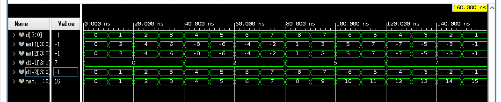

## 簡介

## 拴鎖器

## 正反器

### RS 型正反器

### D 型正反器

### JK 型正反器

### T 型正反器

## 暫存器

<details>
<summary>Verilog程式碼</summary>

```verilog
```
</details>

<details>
<summary>Verilog測試檔案</summary>

```verilog
```
</details>

## 移位暫存器
### 5位元左移暫存器

```verilog

```



### 串列輸入四位元左移位串列輸出

<details>
<summary>Verilog程式碼</summary>

```verilog
module siso_shift_register (clock, clear, in, out);
input clock, clear, in;
output out;
reg [3:0] register;

always @ (posedge clock) begin
  if (clear) begin
    register = 4'd0;
  end else begin
    register[3] = register[2];
    register[2] = register[1];
    register[1] = register[0];
    register[0] = in;
  end
end

assign out = register[3];

endmodule // siso_shift_register
```
</details>

<details>
<summary>Verilog測試檔案</summary>

```verilog
`include "siso_shift_register.v"

module siso_shift_register_test ();
  reg clock, clear, in;
  wire out;
  integer number1, number2;

  siso_shift_register UUT (clock, clear, in, out);

  initial begin
    in = 1'b0;
    clock = 1'b1;
    clear = 1'b1;

    #10;
    clear = 1'b0;

    #5;
    $display("| clock | clear | in | out |");

    for (number1 = 0; number1 < 2; number1 = number1 + 1) begin
      for (number2 = 0; number2 < 64; number2 = number2 + 1) begin
        clear = number1;
        in  = number2;
        $monitor("|   %b   |   %b   | %b  |  %b  |", clock, clear, in, out);
        #20;
      end
    end
    $finish;
  end
  always begin
    #10;
    clock = ~clock;
  end

endmodule // siso_shift_register_test
```
</details>

<details>
<summary>測試結果</summary>

```
| clock | clear | in | out |
|   0   |   0   | 0  |  0  |
|   1   |   0   | 0  |  0  |
|   0   |   0   | 0  |  0  |
|   0   |   0   | 1  |  0  |
|   1   |   0   | 1  |  0  |
|   0   |   0   | 1  |  0  |
|   0   |   0   | 0  |  0  |
|   1   |   0   | 0  |  0  |
|   0   |   0   | 0  |  0  |
|   0   |   0   | 1  |  0  |
|   1   |   0   | 1  |  0  |
|   0   |   0   | 1  |  0  |
|   0   |   0   | 0  |  0  |
|   1   |   0   | 0  |  1  |
|   0   |   0   | 0  |  1  |
|   0   |   0   | 1  |  1  |
|   1   |   0   | 1  |  0  |
|   0   |   0   | 1  |  0  |
|   0   |   0   | 0  |  0  |
|   1   |   0   | 0  |  1  |
|   0   |   0   | 0  |  1  |
|   0   |   0   | 1  |  1  |
|   1   |   0   | 1  |  0  |
|   0   |   0   | 1  |  0  |
|   0   |   0   | 0  |  0  |
|   1   |   0   | 0  |  1  |
|   0   |   0   | 0  |  1  |
|   0   |   0   | 1  |  1  |
|   1   |   0   | 1  |  0  |
|   0   |   0   | 1  |  0  |
|   0   |   0   | 0  |  0  |
|   1   |   0   | 0  |  1  |
|   0   |   0   | 0  |  1  |
|   0   |   0   | 1  |  1  |
|   1   |   0   | 1  |  0  |
|   0   |   0   | 1  |  0  |
|   0   |   0   | 0  |  0  |
|   1   |   0   | 0  |  1  |
|   0   |   0   | 0  |  1  |
|   0   |   0   | 1  |  1  |
|   1   |   0   | 1  |  0  |
|   0   |   0   | 1  |  0  |
|   0   |   0   | 0  |  0  |
|   1   |   0   | 0  |  1  |
|   0   |   0   | 0  |  1  |
|   0   |   0   | 1  |  1  |
|   1   |   0   | 1  |  0  |
|   0   |   0   | 1  |  0  |
|   0   |   0   | 0  |  0  |
|   1   |   0   | 0  |  1  |
|   0   |   0   | 0  |  1  |
|   0   |   0   | 1  |  1  |
|   1   |   0   | 1  |  0  |
|   0   |   0   | 1  |  0  |
|   0   |   0   | 0  |  0  |
|   1   |   0   | 0  |  1  |
|   0   |   0   | 0  |  1  |
|   0   |   0   | 1  |  1  |
|   1   |   0   | 1  |  0  |
|   0   |   0   | 1  |  0  |
|   0   |   0   | 0  |  0  |
|   1   |   0   | 0  |  1  |
|   0   |   0   | 0  |  1  |
|   0   |   0   | 1  |  1  |
|   1   |   0   | 1  |  0  |
|   0   |   0   | 1  |  0  |
|   0   |   0   | 0  |  0  |
|   1   |   0   | 0  |  1  |
|   0   |   0   | 0  |  1  |
|   0   |   0   | 1  |  1  |
|   1   |   0   | 1  |  0  |
|   0   |   0   | 1  |  0  |
|   0   |   0   | 0  |  0  |
|   1   |   0   | 0  |  1  |
|   0   |   0   | 0  |  1  |
|   0   |   0   | 1  |  1  |
|   1   |   0   | 1  |  0  |
|   0   |   0   | 1  |  0  |
|   0   |   0   | 0  |  0  |
|   1   |   0   | 0  |  1  |
|   0   |   0   | 0  |  1  |
|   0   |   0   | 1  |  1  |
|   1   |   0   | 1  |  0  |
|   0   |   0   | 1  |  0  |
|   0   |   0   | 0  |  0  |
|   1   |   0   | 0  |  1  |
|   0   |   0   | 0  |  1  |
|   0   |   0   | 1  |  1  |
|   1   |   0   | 1  |  0  |
|   0   |   0   | 1  |  0  |
|   0   |   0   | 0  |  0  |
|   1   |   0   | 0  |  1  |
|   0   |   0   | 0  |  1  |
|   0   |   0   | 1  |  1  |
|   1   |   0   | 1  |  0  |
|   0   |   0   | 1  |  0  |
|   0   |   0   | 0  |  0  |
|   1   |   0   | 0  |  1  |
|   0   |   0   | 0  |  1  |
|   0   |   0   | 1  |  1  |
|   1   |   0   | 1  |  0  |
|   0   |   0   | 1  |  0  |
|   0   |   0   | 0  |  0  |
|   1   |   0   | 0  |  1  |
|   0   |   0   | 0  |  1  |
|   0   |   0   | 1  |  1  |
|   1   |   0   | 1  |  0  |
|   0   |   0   | 1  |  0  |
|   0   |   0   | 0  |  0  |
|   1   |   0   | 0  |  1  |
|   0   |   0   | 0  |  1  |
|   0   |   0   | 1  |  1  |
|   1   |   0   | 1  |  0  |
|   0   |   0   | 1  |  0  |
|   0   |   0   | 0  |  0  |
|   1   |   0   | 0  |  1  |
|   0   |   0   | 0  |  1  |
|   0   |   0   | 1  |  1  |
|   1   |   0   | 1  |  0  |
|   0   |   0   | 1  |  0  |
|   0   |   0   | 0  |  0  |
|   1   |   0   | 0  |  1  |
|   0   |   0   | 0  |  1  |
|   0   |   0   | 1  |  1  |
|   1   |   0   | 1  |  0  |
|   0   |   0   | 1  |  0  |
|   0   |   0   | 0  |  0  |
|   1   |   0   | 0  |  1  |
|   0   |   0   | 0  |  1  |
|   0   |   0   | 1  |  1  |
|   1   |   0   | 1  |  0  |
|   0   |   0   | 1  |  0  |
|   0   |   0   | 0  |  0  |
|   1   |   0   | 0  |  1  |
|   0   |   0   | 0  |  1  |
|   0   |   0   | 1  |  1  |
|   1   |   0   | 1  |  0  |
|   0   |   0   | 1  |  0  |
|   0   |   0   | 0  |  0  |
|   1   |   0   | 0  |  1  |
|   0   |   0   | 0  |  1  |
|   0   |   0   | 1  |  1  |
|   1   |   0   | 1  |  0  |
|   0   |   0   | 1  |  0  |
|   0   |   0   | 0  |  0  |
|   1   |   0   | 0  |  1  |
|   0   |   0   | 0  |  1  |
|   0   |   0   | 1  |  1  |
|   1   |   0   | 1  |  0  |
|   0   |   0   | 1  |  0  |
|   0   |   0   | 0  |  0  |
|   1   |   0   | 0  |  1  |
|   0   |   0   | 0  |  1  |
|   0   |   0   | 1  |  1  |
|   1   |   0   | 1  |  0  |
|   0   |   0   | 1  |  0  |
|   0   |   0   | 0  |  0  |
|   1   |   0   | 0  |  1  |
|   0   |   0   | 0  |  1  |
|   0   |   0   | 1  |  1  |
|   1   |   0   | 1  |  0  |
|   0   |   0   | 1  |  0  |
|   0   |   0   | 0  |  0  |
|   1   |   0   | 0  |  1  |
|   0   |   0   | 0  |  1  |
|   0   |   0   | 1  |  1  |
|   1   |   0   | 1  |  0  |
|   0   |   0   | 1  |  0  |
|   0   |   0   | 0  |  0  |
|   1   |   0   | 0  |  1  |
|   0   |   0   | 0  |  1  |
|   0   |   0   | 1  |  1  |
|   1   |   0   | 1  |  0  |
|   0   |   0   | 1  |  0  |
|   0   |   0   | 0  |  0  |
|   1   |   0   | 0  |  1  |
|   0   |   0   | 0  |  1  |
|   0   |   0   | 1  |  1  |
|   1   |   0   | 1  |  0  |
|   0   |   0   | 1  |  0  |
|   0   |   0   | 0  |  0  |
|   1   |   0   | 0  |  1  |
|   0   |   0   | 0  |  1  |
|   0   |   0   | 1  |  1  |
|   1   |   0   | 1  |  0  |
|   0   |   0   | 1  |  0  |
|   0   |   0   | 0  |  0  |
|   1   |   0   | 0  |  1  |
|   0   |   0   | 0  |  1  |
|   0   |   0   | 1  |  1  |
|   1   |   0   | 1  |  0  |
|   0   |   0   | 1  |  0  |
|   0   |   1   | 0  |  0  |
|   1   |   1   | 0  |  0  |
|   0   |   1   | 0  |  0  |
|   0   |   1   | 1  |  0  |
|   1   |   1   | 1  |  0  |
|   0   |   1   | 1  |  0  |
|   0   |   1   | 0  |  0  |
|   1   |   1   | 0  |  0  |
|   0   |   1   | 0  |  0  |
|   0   |   1   | 1  |  0  |
|   1   |   1   | 1  |  0  |
|   0   |   1   | 1  |  0  |
|   0   |   1   | 0  |  0  |
|   1   |   1   | 0  |  0  |
|   0   |   1   | 0  |  0  |
|   0   |   1   | 1  |  0  |
|   1   |   1   | 1  |  0  |
|   0   |   1   | 1  |  0  |
|   0   |   1   | 0  |  0  |
|   1   |   1   | 0  |  0  |
|   0   |   1   | 0  |  0  |
|   0   |   1   | 1  |  0  |
|   1   |   1   | 1  |  0  |
|   0   |   1   | 1  |  0  |
|   0   |   1   | 0  |  0  |
|   1   |   1   | 0  |  0  |
|   0   |   1   | 0  |  0  |
|   0   |   1   | 1  |  0  |
|   1   |   1   | 1  |  0  |
|   0   |   1   | 1  |  0  |
|   0   |   1   | 0  |  0  |
|   1   |   1   | 0  |  0  |
|   0   |   1   | 0  |  0  |
|   0   |   1   | 1  |  0  |
|   1   |   1   | 1  |  0  |
|   0   |   1   | 1  |  0  |
|   0   |   1   | 0  |  0  |
|   1   |   1   | 0  |  0  |
|   0   |   1   | 0  |  0  |
|   0   |   1   | 1  |  0  |
|   1   |   1   | 1  |  0  |
|   0   |   1   | 1  |  0  |
|   0   |   1   | 0  |  0  |
|   1   |   1   | 0  |  0  |
|   0   |   1   | 0  |  0  |
|   0   |   1   | 1  |  0  |
|   1   |   1   | 1  |  0  |
|   0   |   1   | 1  |  0  |
|   0   |   1   | 0  |  0  |
|   1   |   1   | 0  |  0  |
|   0   |   1   | 0  |  0  |
|   0   |   1   | 1  |  0  |
|   1   |   1   | 1  |  0  |
|   0   |   1   | 1  |  0  |
|   0   |   1   | 0  |  0  |
|   1   |   1   | 0  |  0  |
|   0   |   1   | 0  |  0  |
|   0   |   1   | 1  |  0  |
|   1   |   1   | 1  |  0  |
|   0   |   1   | 1  |  0  |
|   0   |   1   | 0  |  0  |
|   1   |   1   | 0  |  0  |
|   0   |   1   | 0  |  0  |
|   0   |   1   | 1  |  0  |
|   1   |   1   | 1  |  0  |
|   0   |   1   | 1  |  0  |
|   0   |   1   | 0  |  0  |
|   1   |   1   | 0  |  0  |
|   0   |   1   | 0  |  0  |
|   0   |   1   | 1  |  0  |
|   1   |   1   | 1  |  0  |
|   0   |   1   | 1  |  0  |
|   0   |   1   | 0  |  0  |
|   1   |   1   | 0  |  0  |
|   0   |   1   | 0  |  0  |
|   0   |   1   | 1  |  0  |
|   1   |   1   | 1  |  0  |
|   0   |   1   | 1  |  0  |
|   0   |   1   | 0  |  0  |
|   1   |   1   | 0  |  0  |
|   0   |   1   | 0  |  0  |
|   0   |   1   | 1  |  0  |
|   1   |   1   | 1  |  0  |
|   0   |   1   | 1  |  0  |
|   0   |   1   | 0  |  0  |
|   1   |   1   | 0  |  0  |
|   0   |   1   | 0  |  0  |
|   0   |   1   | 1  |  0  |
|   1   |   1   | 1  |  0  |
|   0   |   1   | 1  |  0  |
|   0   |   1   | 0  |  0  |
|   1   |   1   | 0  |  0  |
|   0   |   1   | 0  |  0  |
|   0   |   1   | 1  |  0  |
|   1   |   1   | 1  |  0  |
|   0   |   1   | 1  |  0  |
|   0   |   1   | 0  |  0  |
|   1   |   1   | 0  |  0  |
|   0   |   1   | 0  |  0  |
|   0   |   1   | 1  |  0  |
|   1   |   1   | 1  |  0  |
|   0   |   1   | 1  |  0  |
|   0   |   1   | 0  |  0  |
|   1   |   1   | 0  |  0  |
|   0   |   1   | 0  |  0  |
|   0   |   1   | 1  |  0  |
|   1   |   1   | 1  |  0  |
|   0   |   1   | 1  |  0  |
|   0   |   1   | 0  |  0  |
|   1   |   1   | 0  |  0  |
|   0   |   1   | 0  |  0  |
|   0   |   1   | 1  |  0  |
|   1   |   1   | 1  |  0  |
|   0   |   1   | 1  |  0  |
|   0   |   1   | 0  |  0  |
|   1   |   1   | 0  |  0  |
|   0   |   1   | 0  |  0  |
|   0   |   1   | 1  |  0  |
|   1   |   1   | 1  |  0  |
|   0   |   1   | 1  |  0  |
|   0   |   1   | 0  |  0  |
|   1   |   1   | 0  |  0  |
|   0   |   1   | 0  |  0  |
|   0   |   1   | 1  |  0  |
|   1   |   1   | 1  |  0  |
|   0   |   1   | 1  |  0  |
|   0   |   1   | 0  |  0  |
|   1   |   1   | 0  |  0  |
|   0   |   1   | 0  |  0  |
|   0   |   1   | 1  |  0  |
|   1   |   1   | 1  |  0  |
|   0   |   1   | 1  |  0  |
|   0   |   1   | 0  |  0  |
|   1   |   1   | 0  |  0  |
|   0   |   1   | 0  |  0  |
|   0   |   1   | 1  |  0  |
|   1   |   1   | 1  |  0  |
|   0   |   1   | 1  |  0  |
|   0   |   1   | 0  |  0  |
|   1   |   1   | 0  |  0  |
|   0   |   1   | 0  |  0  |
|   0   |   1   | 1  |  0  |
|   1   |   1   | 1  |  0  |
|   0   |   1   | 1  |  0  |
|   0   |   1   | 0  |  0  |
|   1   |   1   | 0  |  0  |
|   0   |   1   | 0  |  0  |
|   0   |   1   | 1  |  0  |
|   1   |   1   | 1  |  0  |
|   0   |   1   | 1  |  0  |
|   0   |   1   | 0  |  0  |
|   1   |   1   | 0  |  0  |
|   0   |   1   | 0  |  0  |
|   0   |   1   | 1  |  0  |
|   1   |   1   | 1  |  0  |
|   0   |   1   | 1  |  0  |
|   0   |   1   | 0  |  0  |
|   1   |   1   | 0  |  0  |
|   0   |   1   | 0  |  0  |
|   0   |   1   | 1  |  0  |
|   1   |   1   | 1  |  0  |
|   0   |   1   | 1  |  0  |
|   0   |   1   | 0  |  0  |
|   1   |   1   | 0  |  0  |
|   0   |   1   | 0  |  0  |
|   0   |   1   | 1  |  0  |
|   1   |   1   | 1  |  0  |
|   0   |   1   | 1  |  0  |
|   0   |   1   | 0  |  0  |
|   1   |   1   | 0  |  0  |
|   0   |   1   | 0  |  0  |
|   0   |   1   | 1  |  0  |
|   1   |   1   | 1  |  0  |
|   0   |   1   | 1  |  0  |
|   0   |   1   | 0  |  0  |
|   1   |   1   | 0  |  0  |
|   0   |   1   | 0  |  0  |
|   0   |   1   | 1  |  0  |
|   1   |   1   | 1  |  0  |
|   0   |   1   | 1  |  0  |
|   0   |   1   | 0  |  0  |
|   1   |   1   | 0  |  0  |
|   0   |   1   | 0  |  0  |
|   0   |   1   | 1  |  0  |
|   1   |   1   | 1  |  0  |
|   0   |   1   | 1  |  0  |
|   0   |   1   | 0  |  0  |
|   1   |   1   | 0  |  0  |
|   0   |   1   | 0  |  0  |
|   0   |   1   | 1  |  0  |
|   1   |   1   | 1  |  0  |
|   0   |   1   | 1  |  0  |
```
</details>
