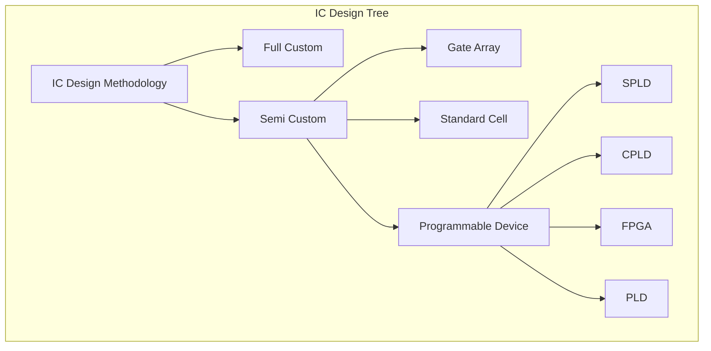

可程式規劃裝置，是一個重要的章節，也就是驅動著的結構「可程式規劃裝置—程式語言指令集架構—軟體」重要基礎，以數位邏輯電路圖的方式說明結構。

由於本章節會介紹階段可以， 分成可以佈線、設計電路、重新燒入，在設計與用途都是不同的。

在現在主流市場為主的可程式規劃裝置非 FPGA 莫數了。又依照 FPGA 市佔，分別為第一名 Xilinx ，第二名 Altera ，第三名 Lattice 。

因此可以知道老大吃肉喝酒，老二喝湯，老三只能撿剩的，因此既然如此 Lattice 透過開放原始碼的方式，吸引開放原始碼社群跟自幹玩家加入作為助力。

- 唯讀記憶體(ROM, )
- 隨機存取記憶體(RAM, )
- 可程式邏輯陣列
- 可程式陣列邏輯
- 可程式邏輯裝置(PLD, Programmable Logic Device)
- 序向可規劃裝置(SPLD, Small/Simple Programmable Logic Device)
- 複雜可程式邏輯裝置(CPLD, Complex Programmable Logic Device)
- 現場可程式邏輯閘陣列(FPGA, Field Programmable Gate Array)

