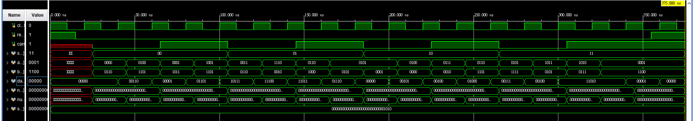

## 簡介
微運算是一種對[暫存器](/docs/knowledge-network-database-repository/暫存器.md)內資料進行操作的基本運算。可以分成以下四類微運算

- 資料傳遞微運算
- 「算術微運算」(arithmetic microoperation)
- 邏輯微運算
- 移位微運算

## 資料傳遞微運算

## 算術微運算
四位元算術邏輯微運算，提供7種算術功能，包括加法、進位加法、減法、借位減法、遞增、遞減、轉移。

<details>
<summary>Verilog程式碼</summary>

```verilog
module arithmetic_microoperation (clock, reset, s, a, b, carry, data);
    input clock, reset, carry;
    input [1:0] s;
    input signed [3:0] a, b;
    output signed [4:0] data;

    reg [4:0] data;

    always @ (posedge clock) begin
        case ({s, carry})
            0: data = a + b;
            1: data = a + b + carry;
            2: data = a + ~b;
            3: data = a + ~b + 1;
            4: data = a;
            5: data = a + 1;
            6: data = a - 1;
            7: data = a;
        endcase

    end

    always @ (posedge clock) begin
        if (reset == 1)
            data = 0;
    end

endmodule // arithmetic_microoperation
```

</details>

<details>
<summary>Verilog測試檔</summary>

```verilog
`include "arithmetic_microoperation.v"

module arithmetic_microoperation_test ();
    reg clock, reset, carry;
    reg [1:0] s;
    reg signed [3:0] a, b;

    wire signed [4:0] data;

    integer number, number2;
    integer seed;

    arithmetic_microoperation UUT (clock, reset, s, a, b, carry, data);

    initial begin
        seed = 10;
    end
    initial begin
        $display("| clock | reset | s carry |  a |  b | data |");
        clock = 1'b1;
        reset = 1'b1;

        #10;
        #5;

        reset = 1'b0;

        #10;

        for (number = 0; number < 8; number = number + 1) begin
            for (number2 = 0; number2 < 32; number2 = number2 + 16) begin
                {s, carry} = number;
                a = $random(seed) % 16;
                b = $random(seed) % 16;
                #20;
            end
        end
        #10;
        reset = 1'b1;

        #20;
        $finish;
    end

    always begin
        #10;
        clock = ~clock;
    end

    always begin
    #10;

    $monitor(
        "|   %b   |   %b   |   %b%b   | %d | %d |   %d |",
        clock, reset, s, carry, a, b, data);

    end

endmodule // arithmetic_microoperation_test
```

</details>

<details>
<summary>真值表</summary>

```
| clock | reset | s carry |  a |  b | data |
|   0   |   1   |   xxx   |  x |  x |    0 |
|   0   |   0   |   xxx   |  x |  x |    0 |
|   1   |   0   |   xxx   |  x |  x |    0 |
|   1   |   0   |   000   |  0 |  6 |    0 |
|   0   |   0   |   000   |  0 |  6 |    0 |
|   1   |   0   |   000   |  0 |  6 |    6 |
|   1   |   0   |   000   |  4 | -3 |    6 |
|   0   |   0   |   000   |  4 | -3 |    6 |
|   1   |   0   |   000   |  4 | -3 |    1 |
|   1   |   0   |   001   |  1 | -5 |    1 |
|   0   |   0   |   001   |  1 | -5 |    1 |
|   1   |   0   |   001   |  1 | -5 |   13 |
|   1   |   0   |   001   | -7 | -3 |   13 |
|   0   |   0   |   001   | -7 | -3 |   13 |
|   1   |   0   |   001   | -7 | -3 |   -9 |
|   1   |   0   |   010   |  3 |  6 |   -9 |
|   0   |   0   |   010   |  3 |  6 |   -9 |
|   1   |   0   |   010   |  3 |  6 |   -4 |
|   1   |   0   |   010   | -2 |  2 |   -4 |
|   0   |   0   |   010   | -2 |  2 |   -4 |
|   1   |   0   |   010   | -2 |  2 |   -5 |
|   1   |   0   |   011   |  6 | -8 |   -5 |
|   0   |   0   |   011   |  6 | -8 |   -5 |
|   1   |   0   |   011   |  6 | -8 |   14 |
|   1   |   0   |   011   |  5 |  5 |   14 |
|   0   |   0   |   011   |  5 |  5 |   14 |
|   1   |   0   |   011   |  5 |  5 |    0 |
|   1   |   0   |   100   |  5 |  1 |    0 |
|   0   |   0   |   100   |  5 |  1 |    0 |
|   1   |   0   |   100   |  5 |  1 |    5 |
|   1   |   0   |   100   |  4 |  0 |    5 |
|   0   |   0   |   100   |  4 |  0 |    5 |
|   1   |   0   |   100   |  4 |  0 |    4 |
|   1   |   0   |   101   |  7 |  2 |    4 |
|   0   |   0   |   101   |  7 |  2 |    4 |
|   1   |   0   |   101   |  7 |  2 |    8 |
|   1   |   0   |   101   |  6 | -3 |    8 |
|   0   |   0   |   101   |  6 | -3 |    8 |
|   1   |   0   |   101   |  6 | -3 |    7 |
|   1   |   0   |   110   |  5 | -1 |    7 |
|   0   |   0   |   110   |  5 | -1 |    7 |
|   1   |   0   |   110   |  5 | -1 |    4 |
|   1   |   0   |   110   | -5 |  5 |    4 |
|   0   |   0   |   110   | -5 |  5 |    4 |
|   1   |   0   |   110   | -5 |  5 |   -6 |
|   1   |   0   |   111   | -6 |  7 |   -6 |
|   0   |   0   |   111   | -6 |  7 |   -6 |
|   1   |   0   |   111   | -6 |  7 |   -6 |
|   1   |   0   |   111   |  1 | -4 |   -6 |
|   0   |   0   |   111   |  1 | -4 |   -6 |
|   1   |   0   |   111   |  1 | -4 |    1 |
|   0   |   0   |   111   |  1 | -4 |    1 |
|   0   |   1   |   111   |  1 | -4 |    1 |
|   1   |   1   |   111   |  1 | -4 |    1 |
|   0   |   1   |   111   |  1 | -4 |    1 |
```

</details>

<details>
<summary>腳本程式</summary>

```sh
file='arithmetic_microoperation'
iverilog -o ${file}_test.vvp ${file}_test.v && vvp ${file}_test.vvp > ${file}.log
```

</details>

<!--  -->



## 邏輯微運算
「邏輯微運算」(logic microoperation)是指用來處理暫存器內位元進行二進位邏輯運算，邏輯運算很少會用在科學計算上，但使用在邏輯決策或者二進位資料操作很快速，另外對於 CRC 或者資料驗證也是方便。

例如進行 XOR 運算時，當 $`P = 1`$ ，將 $`R1`$ 跟 $`R2`$ 進行互斥或閘運算，將結果放回到 $`R1`$ ，這個過程用以下表示資料運算結果：

$`P: R1 \gets R1 \oplus R2`$

例如 $`R1`$ 有 4 bits 的資料，與 $`R2`$ 中的 4bits 資料進行互斥或閘運算後，所呈現的結果：

```math
\def\arraystretch{1}
  \begin{array}{}
    & 1110 \\
    \oplus & 1011 \\ \hline
     & 0101 \\
\end{array}
```

這邊特殊符號會使用 Verilog 的表示方式，來表示不同的呈現，例如使用。

邏輯微運算

| 「布林函數」(bool function) | 微運算             | 命名   |
|:--------------------------- |:------------------ | ------ |
| $`F_0 = 0`$                 | $`F \gets 0`$      | 清除   |
| $`F_1 = xy`$                | $`F \gets A \& B`$ |        |
| $`F_2 = xy'`$               | $`F \gets A`$      | 轉移 A |
| $`F_1 = xy`$                | $`F \gets A \& B`$ |        |
| $`F_1 = xy`$                | $`F \gets A \& B`$ |        |
| $`F_1 = xy`$                | $`F \gets A \& B`$ |        |
| $`F_1 = xy`$                | $`F \gets A \& B`$ |        |
| $`F_1 = xy`$                | $`F \gets A \& B`$ |        |
| $`F_1 = xy`$                | $`F \gets A \& B`$ |        |
| $`F_1 = xy`$                | $`F \gets A \& B`$ |        |
| $`F_1 = xy`$                | $`F \gets A \& B`$ |        |
| $`F_1 = xy`$                | $`F \gets A \& B`$ |        |
| $`F_1 = xy`$                | $`F \gets A \& B`$ |        |
| $`F_1 = xy`$                | $`F \gets A \& B`$ |        |
| $`F_1 = xy`$                | $`F \gets A \& B`$ |        |

「硬體實現」(hardware implementation)上雖然有16種變化需要使用與製作，但此次實務上不會一次全部製作與呈現，而是製作基礎的 及閘、或閘、互斥或閘、反閘來實現，透過多次反覆運算暫存器內的資料也可以達到相同的結果。

以下是我們實際設計的電路：


<details>
<summary>Verilog程式碼</summary>

```verilog
```

</details>

<details>
<summary>Verilog測試檔</summary>

```verilog
```

</details>

<details>
<summary>真值表</summary>

```

```

</details>

<details>
<summary>模擬結果</summary>

```

```

</details>

<details>
<summary>腳本程式</summary>

```sh
file='logic_microoperation'
iverilog -o ${file}_test.vvp ${file}_test.v && vvp ${file}_test.vvp > ${file}.log
```

</details>


## 移位微運算
