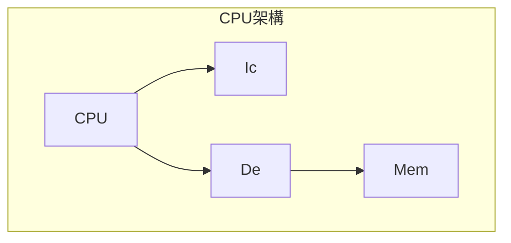

夠多NAND就可以設計初一台電腦

DFF 有一種隔絕資料的一種效果，現在的管線設計會通過DFF把不同狀態隔絕

n2t的記憶體作法是很貴的作法，通常通是在一級快取的方式

因此通常會專門的DRAM方式來做，比較便宜，雖然比較慢

最不容易設計的是PC，程式計數器

設計方式，要先有組合語言，三張表格，是指令集功能

記憶體映射輸入輸出

多核心、快取、管線

n2t的記憶體會很貴

使用記憶體會變慢，但省成本

## 如何加速？
使用加法快速計算：

n2t 沒有移位、乘法與除法的電路，以及浮點數，運算數度會變慢

乘法變通方式：通過自己加上自己，然後針對對應的位置移位後相加，這樣計算方式非常迅速

### 設計單精雙精浮點數運算
#### 乘法
#### 加法
單精、雙精作家法時，會需要做等值的計算

做加法時，要跟大的對齊，避免高位元數值遺失

將數字較小的與大的對齊。

```math
```

所以勒

```math
\begin{smallmatrix}
  & 1.00011 \times 10^6 \\
  + & 1.01010 \times 10^6  \\
  \hline
  & 1.01110 \times 10^6
\end{smallmatrix}
```

如果跟小的位元對及，會損失高位元數值示：

```math

```

#### 除法
參考課本的內容

## 改為前瞻加法器
使用前瞻進位加法器

## 現代處理器加速

- 多層次快取
- 管線
- 平行 + 虛擬化
- 交給專用計算硬體加速

### 前提
以不增加快取的前提下達成

### 分層快取
1. 暫存器
2. 快取 SRAM
    1. L1
    2. L2
    3. L3
    4. L4
3. 主記憶體 DRAM
4. 磁碟

### 快取很重要
適時的增加快取可以增加速度

### 不用快取
如果沒有快取，會像記憶體速度看齊，n2t沒有暫存器

### 存取不到快取資料
C語言無法存取到快取資料

因此如果將資料跳躍存取會讓快取無法得到快取的幫助，會需要堆疊的方式

### 區域性策略要好
好的區域性策略如下

```c
int a[10000][10000];
for (size_t i = 0; i < 10000; i++) {
  for (size_t j = 0; j < 10000; j++) {
    printf("%d\n", a[i][j]);
  }
}
```

不好的區域性策略如下

```c
int a[10000][10000];
for (size_t i = 0; i < 10000; i++) {
  for (size_t j = 0; j < 10000; j++) {
    printf("%d\n", a[j][i]);
  }
}
```

原因是陣列是循序分配記憶體，一個一個接著紀錄著，因此如果非循序結構的話會讓記憶體無法將資料儲存到快取內。可以看到內容

img_3092

### 快取

## 平行
三種平行機制

- 管線
- 多核心 + 虛擬化
- 專用處理器

### 何謂管線
過去的作法是將資料儲存回記憶體，然後在讀取回來處理

現在的作法是設計許多的記憶體，提供暫存後在拿回來處理

指令集設計會直接影響到效能

### MIPS CPU


暫存器不能太多

### 現在CPU架構
遠看馮紐曼架構，進看哈佛架構



#### 馮紐曼架構
指令存在記憶體，資料也存在記憶體

#### 哈佛架構
指令有專門的記憶體，資料是另外處理

很適合嵌入式系統可以運作，因為指令儲存單元已經寫好了

## 管線
透過暫存器將資料

所謂的管線就是透過暫存器連結不同單元與微運算之間，也透過管線方式讓各個區域分離，讓各個區域之間可以獨立運作但又可以互相連結，相對過去單一的匯流排會比較迅速

透過這個方法可以讓每一個事情與匯流排可以滿載。

### 管線缺點
- 被跳躍指令打斷，做已經完成的事情都會拋棄
- 管線氣泡：如果資料沒有在暫存器，那這樣記憶體沒有資料就必須等待資料進來

## 多核心
透過內含不同的核心去運算。

### 多核心問題
thread 執行緒 問題

### 超執行緒
一個CPU會提供兩個邏輯執行緒

利用閒置情形利用這個時間利用與運算

例如將ALU拉出來，給其他人使用，專門給一個暫存器給邏輯執行緒

這部份各覺得是在控制單元部份就要寫好

控制單元也會包含了其他運用

## 專門處理器
通過內含多個ALU來分擔同時運算，來加速需要同時運算性質的計算。

以 CPU + GPU 合作

### 特殊領域
AI 深度學習 挖礦等

張量處理器 高維、向量運算
