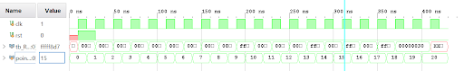
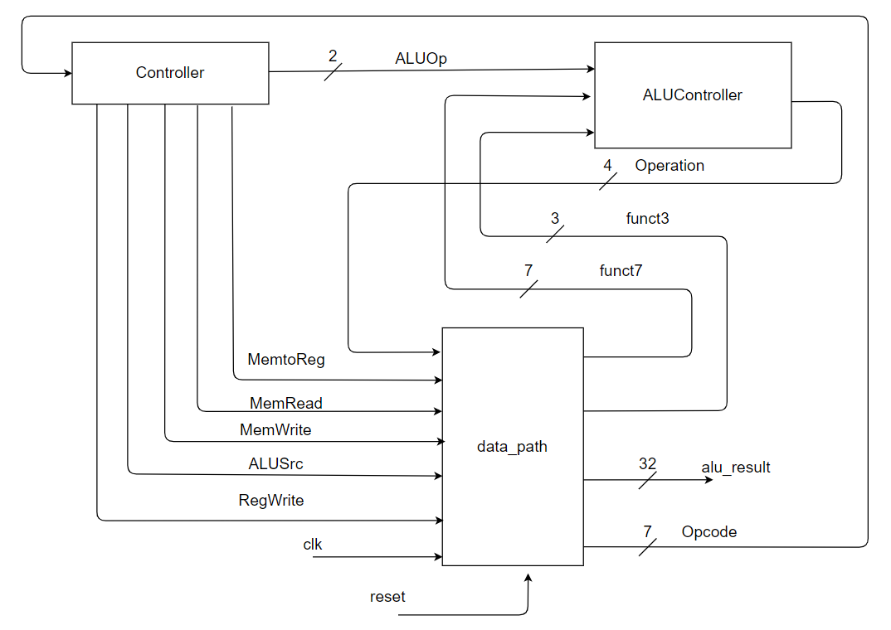

來源 -- https://github.com/SnrNotHere16/RISCVSingleCycleProcessor.git

# RISCVSingleCycleProcessor

A RISC-V Single Cycle Processor which is done in verilog. 

## 執行 (ccc)

[run.md](./run.md)

## Testbench Verification

The following testbench verifies all 20 instrcutions. Twenty points indicates verification for the 20 instructions. 

## RISCV Single Cycle Processor Diagram

