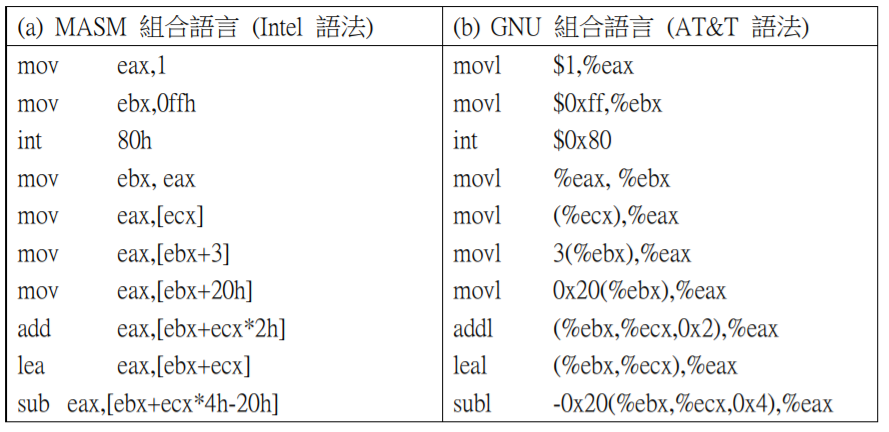
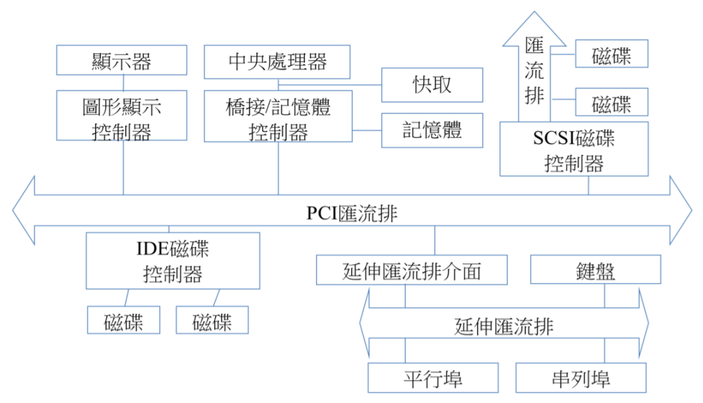
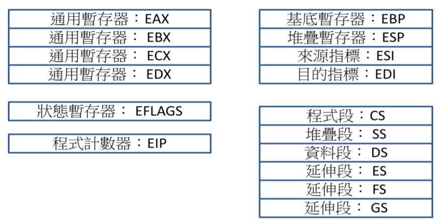
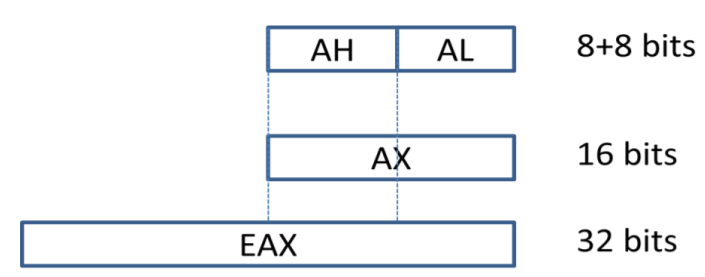
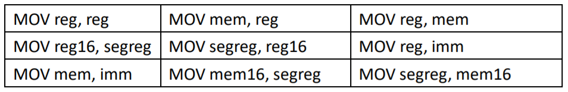
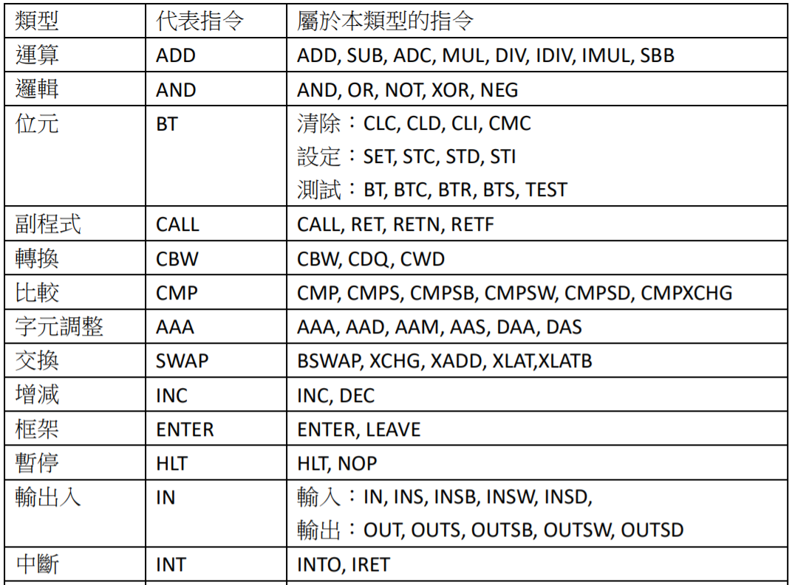
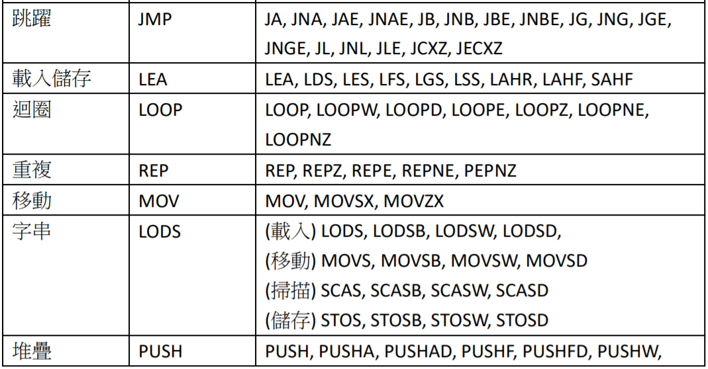

# x86的組合語言

在 x86 系列處理器上，目前常見的組譯器有微軟的 MASM、GNU 的 as 與開放原始碼的 NASM 等，這些組譯器各自採用不同的組合語言語法， GNU as 採用的是AT&T 的語法，MASM 與 NASM 則是以 Intel 語法為基礎，但卻各自進行了擴充。

AT&T 與 Intel 的組合語言語法有明顯的差異，舉例而言，Intel 語法的目標暫存器會放在第一個參數中，採用的是前置式語法，而 AT&T 語法的目標暫存器會放在最後一個參數中，採用的是後置式語法。另外在語法細節上也有許多的差異。

下圖顯示了這兩種語法的差異性，在 MASM 所使用的 Intel 語法中，中括號 [] 代表位址，像是 mov eax, [ebx+3] 就是將 ebx+3 所指向的記憶體內容取出，放入 eax 暫存器當中。但是在 GNU 所使用的 AT&T 語法中，圓刮號 () 才代表位址，因此必須使用 mov 3(%ebx), eax 指令才能達成同樣的功能。

## 處理器

IA32 是 Intel 公司所設計的處理器，屬於 x86 系列處理器的成員。由於 x86 系列的歷史很長，因此，IA32 的設計上可以看到很多歷史的遺跡。這也是 IA32 較為複雜的原因之一。

目前我們所使用的 IBM PC 個人電腦，是以 IA32 CPU 為核心的一個複雜架構，包含有 CPU、匯流排、平行埠、序列埠、南北橋晶片、記憶體、磁碟機、顯示裝置等，如圖 2.19 所示。其中的中央處理器通常就是 IA32 處理器。

下圖顯示了 IA32 的常用暫存器，包含四個通用暫存器 EAX, EBX, ECX, EDX。這些通用暫存器常用來載入變數與儲存運算結果。暫存器 EBP (Extended Base Pointer) 可是框架指標 (Frame Pointer, FP)。ESP(Extended Stack Pointer) 則是堆疊指標，相當於 CPU0 中的 Stack Ponter (SP)。ESI (Extended Source Index) 與 EDI(Extended Destination Index) 則是索引暫存器，ESI 通常指向來源位址，EDI 則指向目標位址。

在乘法與除法上，EAX 會自動作為目標暫存器，因此 EAX 又稱為延伸累加器(Extended Accumulator)。另一個通用暫存器 ECX 則經常被當成迴圈計數器使用。

狀態暫存器 EFLAG (Extended Flags Register)用來儲存旗標值。EFLAG 包含進位 (Carry)、溢位 (Overflow)、符號 (Sign)、零值 (Zero) 等條件旗標，另外還包含輔助進位旗標 (Auxiliary Carry:AC) 與同位旗標 (Parity Flag:PF) 等。

EIP (Extended Instruction Pointer) 是程式計數器Program Counter (PC)。另有六個 16 位元的區段暫存器，CS、SS、DS、ES、FS、GS。

暫存器 CS (Code Segment) 通常指向程式段開頭，DS (Data Segment) 通常指向資料段開頭，SS (Stack Segment) 通常指向堆疊段開頭。ES (Extra Segment) 則指向不特定段落。FS (Flag Segment) 指向旗標段開頭。而 GS (Global Segment) 則指向全域段的開頭。

在 80286 的時代，x86 系列處理器是 16 位元的，因此 AX, BX, CX, DX, CS, SS, DS, ES,FS, GS 等暫存器都只有 16 位元。由於 16 位元只能定址 64 K 的記憶體，不符合當時的需求，因此 80286 採用了『區段+位移』的組合方式，讓 80286 可以定址到 1MB 的記憶體空間。

80286 的『區段+位移』定址法，是利用區段暫存器 (CS, DS, SS, ES) 與位移暫存器 (IP, SI, DI, BP) 組合出來的，其計算方式如下列公式所示。

> 實際位址 = 區段位址 × 16 +位移

在 80386 的時代，x86 系列處理器變成 32 位元的。為了與 80286 相容，Intel 選擇將原先的 AX, BX, CX, DX, IP, BP, SP, SI, DI, FLAGS 等 16 位元暫存器的名稱保留，然後以 EAX, EBX, ECX, EDX, EIP, EBP, ESP, ESI, EDI, EFLAGS 等名稱代表整個 32 位元版的暫存器，因此，這些 32 位元暫存器的較低 16 位元有專有的名稱，而該16 位元又可以被分為高位元組 (High Byte) 與低位元組 (Low Byte) 兩部分。以EAX 為例，其各名稱之間的關係如下圖所示。

在 80386 的時代，浮點運算器是外加的晶片，但是在 80486 之後，就被整合進CPU 當中。在浮點運算器當中，共有 ST(0)..ST(7) 等八個浮點資料暫存器。另外，在 Pentium II 的時代，為了多媒體的應用，特別又加入了八個 64 位元的 MMX暫存器。然後，在 Pentium III 的時代，又加入了八個 XMM 暫存器，以便支援SIMD (Single-Instruction Multiple Data) 的平行計算方式，以加快速度。

## IA 32 的指令集

x86 乃是複雜指令集的典型，除了指令的數目眾多之外，指令的格式也特別複雜。

在精簡指令集當中，通常只有載入與儲存指令可以存取記憶體，其他指令是不能存取記憶體的。但是在 IA32 當中，像是 ADD、MOV 等指令都可以存取記憶體，所以這些指令的參數有很多種組合形式。舉例而言，像是 ADD 指令就有下列六種參數組合形式。

MOV 指令的參數組合形式更多，共有表格 2.3 所示的九種組合形式。

這樣的設計導致 IA32 具有一個相當大的指令表，而且每個指令都有對應的參數組合形式。

下表顯示了 IA32 的各個指令的簡表，進一步的資訊可以
參考 Irvine 的組合語言一書。

## IA64 指令集

## 總結

* https://stackoverflow.com/questions/10995349/what-does-the-r-stand-for-in-rax-rbx-rcx-rdx-rsi-rdi-rbp-rsp

Register operands in 64-bit mode can be any of the following:

* 64-bit general-purpose registers (RAX, RBX, RCX, RDX, RSI, RDI, RSP, RBP, or R8-R15)
* 32-bit general-purpose registers (EAX, EBX, ECX, EDX, ESI, EDI, ESP, EBP, or R8D-R15D)
* 16-bit general-purpose registers (AX, BX, CX, DX, SI, DI, SP, BP, or R8W-R15W)
* 8-bit general-purpose registers: AL, BL, CL, DL, SIL, DIL, SPL, BPL, and R8L-R15L are available using REX
prefixes; AL, BL, CL, DL, AH, BH, CH, DH are available without using REX prefixes.
* Segment registers (CS, DS, SS, ES, FS, and GS)
* RFLAGS register
* x87 FPU registers (ST0 through ST7, status word, control word, tag word, data operand pointer, and instruction pointer)
* MMX registers (MM0 through MM7)
* XMM registers (XMM0 through XMM15) and the MXCSR register
* Control registers (CR0, CR2, CR3, CR4, and CR8) and system table pointer registers (GDTR, LDTR, IDTR, and
task register)
* Debug registers (DR0, DR1, DR2, DR3, DR6, and DR7)
* MSR registers
* RDX:RAX register pair representing a 128-bit operand

## 參考文獻

* x86 Instruction Set Reference
    * http://siyobik.info/index.php?module=x86
* The Intel 8086 / 8088/ 80186 / 80286 / 80386 / 80486 Instruction Set,
    * http://home.comcast.net/~fbui/intel.html
* Intel Architecture Software Developer's Manual - Volume 2
    * http://developer.intel.com/design/pentium/manuals/24319101.pdf
* Irvine 的組合語言
    * http://kipirvine.com/asm/