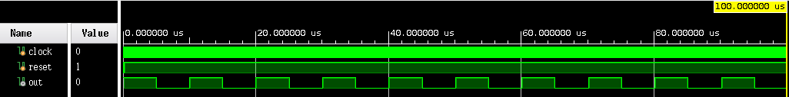

## 除頻器

### 除10除頻器

```verilog
module frequency_divder_bcd (clock, reset, out);
  input clock, reset;
  output out;

  reg out;
  reg [3:0] diver;

  // 10 除頻器
  always @ (posedge clock) begin
    if (~reset || diver == 9) begin
      diver = 0;
    end else begin
      diver = diver + 1;
    end
  end

  // 形成對稱方波
  always @ (diver) begin
    if (diver < 5) begin
      out = 1;
    end else begin
      out = 0;
    end
  end

endmodule // frequency_divder_bcd
```

Verilog測試檔案

```verilog
`include "frequency_divder_bcd.v"

module frequency_divder_bcd_test ();
  reg clock;
  reg reset;
  wire out;

  integer number;

  frequency_divder_bcd UUT (clock, reset, out);

  initial begin
    clock = 1'b1;
    reset = 1'b0;
    #5;

    reset = 1'b1;

    $display("| clock | reset | out |");

  end

  always begin
    #5;
    $monitor("|   %b   |   %b   |  %b  |", clock, reset, out);

    #5;
    clock = ~clock;
  end

  initial begin
    #1000;
    $finish;
  end

endmodule // frequency_divder_bcd_test
```

測試結果


### 除16除頻器

```verilog
// 16除頻器

module frequency_divder_16 (clock, reset, out);
  input clock, reset;
  output out;

  reg out;
  reg [3:0] diver;

  parameter count = 8;

  always @ (posedge clock) begin
    if (~reset) begin
      diver = 0;
    end else begin
      if (diver < count - 1) begin
        diver = diver + 1;
      end else begin
        diver = 0;
      end
    end
  end

  // 產生工作週期 0.5 波形
  always @ (diver) begin
    if (~reset) begin
      out = 1'b0;
    end else begin
      if (diver == count - 1) begin
        out = ~out;
      end else begin
        out = out;
      end
    end
  end

endmodule // frequency_divder_16
```

Verilog測試檔案

```verilog
`include "frequency_divder_16.v"

module frequency_divder_16_test ();
  reg clock;
  reg reset;
  wire out;

  frequency_divder_16 UUT (clock, reset, out);

  initial begin
    clock = 1'b1;
    reset = 1'b0;
    #5;

    reset = 1'b1;

    $display("| clock | reset | out |");

  end

  always begin
    #5;
    $monitor("|   %b   |   %b   |  %b  |", clock, reset, out);

    #5;
    clock = ~clock;
  end

  initial begin
    #1000;
    $finish;
  end

endmodule // frequency_divder_16_test
```

測試結果


### 除32除頻器

```verilog
// 32除頻器

module frequency_divder_32 (clock, reset, out);
  input clock, reset;
  output out;

  reg out;
  reg [4:0] diver;

  parameter count = 16;

  always @ (posedge clock) begin
    if (~reset) begin
      diver = 0;
    end else begin
      if (diver < count - 1) begin
        diver += 1;
      end else begin
        diver = 0;
      end
    end

  end

  // 產生工作週期 0.5 波形
  always @ (diver) begin
    if (~reset) begin
      out = 1'b0;
    end else begin
      if (diver == count - 1) begin
        out = ~out;
      end else begin
        out = out;
      end
    end
  end

endmodule // frequency_divder_32
```

Verilog測試檔案

```verilog
`include "frequency_divder_32.v"

module frequency_divder_32_test ();
  reg clock;
  reg reset;
  wire out;

  integer number;

  frequency_divder_32 UUT (clock, reset, out);

  initial begin
    clock = 1'b1;
    reset = 1'b0;
    #5;

    reset = 1'b1;

    $display("| clock | reset | out |");

  end

  always begin
    #5;
    $monitor("|   %b   |   %b   |  %b  |", clock, reset, out);

    #5;
    clock = ~clock;
  end

  initial begin
    #6500;
    $finish;
  end

endmodule // frequency_divder_32_test
```

測試結果


### 工作週期百分之 50 除 32 除頻器

```verilog
module frequency_divder_32_duty_cycle_50 (clock, reset, out);
  input clock, reset;
  output out;

  reg out;
  reg [4:0] diver;

  // 32 除頻器
  always @ (posedge clock) begin
    if (~reset || diver == 32) begin
      diver = 0;
    end else begin
      diver += 1;
    end
  end

  // 形成對稱方波
  always @ (diver) begin
    if (diver < 16) begin
      out = 0;
    end else begin
      out = 1;
    end
  end

endmodule // frequency_divder_32_duty_cycle_50
```

Verilog測試檔案

```verilog
`include "frequency_divder_32_duty_cycle_50.v"

module frequency_divder_32_duty_cycle_50_test ();
  reg clock;
  reg reset;
  wire out;

  frequency_divder_32_duty_cycle_50 UUT (clock, reset, out);

  initial begin
    clock = 1'b1;
    reset = 1'b0;
    #5;

    reset = 1'b1;

    $display("| clock | reset | out |");

  end

  always begin
    #5;
    $monitor("|   %b   |   %b   |  %b  |", clock, reset, out);

    #5;
    clock = ~clock;
  end

  initial begin
    #6500;
    $finish;
  end

endmodule // frequency_divder_32_duty_cycle_50_test
```

測試結果


### 工作週期百分之 50 除 500 除頻器

```verilog
module frequency_divder_500_duty_cycle_50 (clock, reset, out);
  input clock, reset;
  output out;

  reg out;
  reg [8:0] diver;

  // 500 除頻器
  always @ (posedge clock) begin
    if (~reset || diver == 500) begin
      diver = 0;
    end else begin
      diver = diver + 1;
    end
  end

  // 形成對稱方波
  always @ (diver) begin
    if (diver < 250) begin
      out = 0;
    end else begin
      out = 1;
    end
  end

endmodule // frequency_divder_500_duty_cycle_50
```

Verilog測試檔案

```verilog
`include "frequency_divder_500_duty_cycle_50.v"

module frequency_divder_500_duty_cycle_50_test ();
  reg clock;
  reg reset;
  wire out;

  frequency_divder_500_duty_cycle_50 UUT (clock, reset, out);

  initial begin
    clock = 1'b1;
    reset = 1'b0;
    #5;

    reset = 1'b1;

    $display("| clock | reset | out |");

  end

  always begin
    #5;
    $monitor("|   %b   |   %b   |  %b  |", clock, reset, out);

    #5;
    clock = ~clock;
  end

  initial begin
    #100000;
    $finish;
  end

endmodule // frequency_divder_500_duty_cycle_50_test
```

測試結果



### 工作週期百分之 25 除 32 除頻器

```verilog
module frequency_divder_32_duty_cycle_25 (clock, reset, out);
  input clock, reset;
  output out;

  reg out;
  reg [4:0] diver;

  // 32 除頻器
  always @ (posedge clock) begin
    if (~reset || diver == 32) begin
      diver = 0;
    end else begin
      diver = diver + 1;
    end
  end

  // 形成對稱方波
  always @ (diver) begin
    if (diver < 8) begin
      out = 1;
    end else begin
      out = 0;
    end
  end

endmodule // frequency_divder_32_duty_cycle_25
```

Verilog測試檔案

```verilog
`include "frequency_divder_32_duty_cycle_25.v"

module frequency_divder_32_duty_cycle_25_test ();
  reg clock;
  reg reset;
  wire out;

  frequency_divder_32_duty_cycle_25 UUT (clock, reset, out);

  initial begin
    clock = 1'b1;
    reset = 1'b0;
    #5;

    reset = 1'b1;

    $display("| clock | reset | out |");

  end

  always begin
    #5;
    $monitor("|   %b   |   %b   |  %b  |", clock, reset, out);

    #5;
    clock = ~clock;
  end

  initial begin
    #6500;
    $finish;
  end

endmodule // frequency_divder_32_duty_cycle_25_test
```

測試結果


