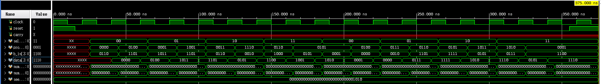

# 邏輯微運算

---

「邏輯微運算」(logic microoperation)是指用來處理暫存器內位元進行二進位邏輯運算，邏輯運算很少會用在科學計算上，但使用在邏輯決策或者二進位資料操作很快速，另外對於 CRC 或者資料驗證也是方便。

---

## 電路

---

## 波形模擬

<!--  -->

---

## 數值模擬

使用 iverilog 產生模擬數據。

| clock | reset | selective_set | processor_register | b_in | data |
| ----- | ----- | ------------- | ------------------ | ---- | ---- |
| 0     | 1     | xx            | xxxx               | xxxx | xxxx |
| 0     | 0     | xx            | xxxx               | xxxx | xxxx |
| 1     | 0     | xx            | xxxx               | xxxx | xxxx |

---

| clock | reset | selective_set | processor_register | b_in | data |
| ----- | ----- | ------------- | ------------------ | ---- | ---- |
| 1     | 0     | 00            | 0000               | 0110 | xxxx |
| 0     | 0     | 00            | 0000               | 0110 | xxxx |
| 1     | 0     | 00            | 0000               | 0110 | 0000 |
| 1     | 0     | 00            | 0100               | 1101 | 0000 |
| 0     | 0     | 00            | 0100               | 1101 | 0000 |
| 1     | 0     | 00            | 0100               | 1101 | 0100 |

---

| clock | reset | selective_set | processor_register | b_in | data |
| ----- | ----- | ------------- | ------------------ | ---- | ---- |
| 1     | 0     | 01            | 0001               | 1011 | 0100 |
| 0     | 0     | 01            | 0001               | 1011 | 0100 |
| 1     | 0     | 01            | 0001               | 1011 | 1011 |
| 1     | 0     | 01            | 1001               | 1101 | 1011 |
| 0     | 0     | 01            | 1001               | 1101 | 1011 |
| 1     | 0     | 01            | 1001               | 1101 | 1101 |

---

| clock | reset | selective_set | processor_register | b_in | data |
| ----- | ----- | ------------- | ------------------ | ---- | ---- |
| 1     | 0     | 10            | 0011               | 0110 | 1101 |
| 0     | 0     | 10            | 0011               | 0110 | 1101 |
| 1     | 0     | 10            | 0011               | 0110 | 0101 |
| 1     | 0     | 10            | 1110               | 0010 | 0101 |
| 0     | 0     | 10            | 1110               | 0010 | 0101 |
| 1     | 0     | 10            | 1110               | 0010 | 1100 |

---

| clock | reset | selective_set | processor_register | b_in | data |
| ----- | ----- | ------------- | ------------------ | ---- | ---- |
| 1     | 0     | 11            | 0110               | 1000 | 1100 |
| 0     | 0     | 11            | 0110               | 1000 | 1100 |
| 1     | 0     | 11            | 0110               | 1000 | 1001 |
| 1     | 0     | 11            | 0101               | 0101 | 1001 |
| 0     | 0     | 11            | 0101               | 0101 | 1001 |
| 1     | 0     | 11            | 0101               | 0101 | 1010 |

---

| clock | reset | selective_set | processor_register | b_in | data |
| ----- | ----- | ------------- | ------------------ | ---- | ---- |
| 1     | 0     | 00            | 0101               | 0001 | 1010 |
| 0     | 0     | 00            | 0101               | 0001 | 1010 |
| 1     | 0     | 00            | 0101               | 0001 | 0001 |
| 1     | 0     | 00            | 0100               | 0000 | 0001 |
| 0     | 0     | 00            | 0100               | 0000 | 0001 |
| 1     | 0     | 00            | 0100               | 0000 | 0000 |

---

| clock | reset | selective_set | processor_register | b_in | data |
| ----- | ----- | ------------- | ------------------ | ---- | ---- |
| 1     | 1     | 11            | 0001               | 1100 | 1110 |
| 0     | 1     | 11            | 0001               | 1100 | 1110 |
| 1     | 1     | 11            | 0001               | 1100 | 0000 |
| 0     | 1     | 11            | 0001               | 1100 | 0000 |
