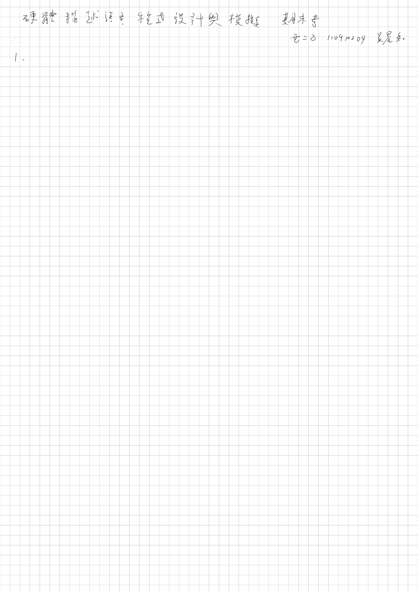
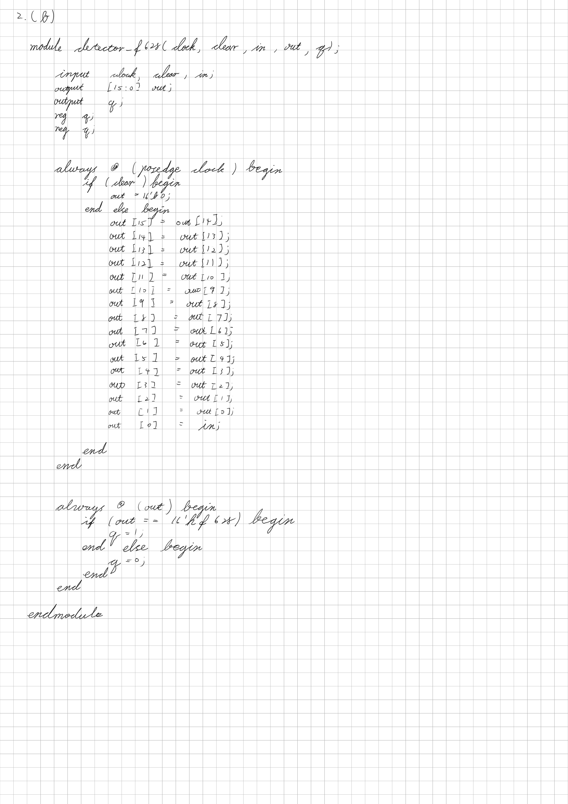
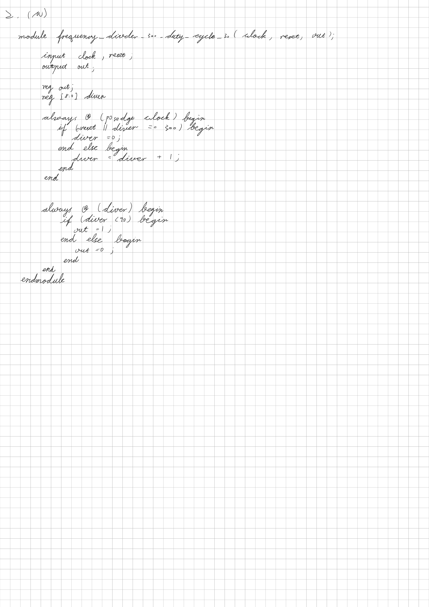
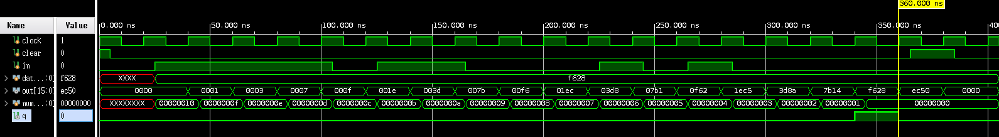

<!--





-->

# detector f628
電路程式碼

```verilog
module detector_f628 (clock, clear, in, out, q);
  input clock, clear, in;
  output [15:0] out;
  output q;
  reg q;
  reg [15:0] out;

  always @ (posedge clock) begin
    if (clear) begin
      out = 16'b0;
    end else begin
      out[15] = out[14];
      out[14] = out[13];
      out[13] = out[12];
      out[12] = out[11];
      out[11] = out[10];
      out[10] = out[9];
      out[9] = out[8];
      out[8] = out[7];
      out[7] = out[6];
      out[6] = out[5];
      out[5] = out[4];
      out[4] = out[3];
      out[3] = out[2];
      out[2] = out[1];
      out[1] = out[0];
      out[0] = in;
    end
  end

  always @ (out) begin
    if (out == 16'hf628) begin
      q = 1;
    end else begin
      q = 0;
    end
  end

endmodule // detector_f628
```

測試檔程式碼

```verilog
`include "detector_f628.v"

module detector_f628_test ();
  reg clock, clear, in;
  reg [15:0] data;
  wire [15:0] out;
  integer number;

  detector_f628 UUT (clock, clear, in, out, q);

  initial begin
    $display("| clock | clear | in | out | q |");

    in = 1'b0;
    clock = 1'b1;
    clear = 1'b1;

    #5;
    clear = 1'b0;

    #20;

    data = 16'hf628;
    for (number = 16; number > 0; number = number - 1) begin
      in = data[number - 1];
      #20;
    end
    #20;
    clear = 1'b1;
    #20;
    clear = 1'b0;
    #20;
    $finish;
  end
  always begin
    #5;
    $monitor("|   %b   |   %b   | %b  |  %b  | %b |", clock, clear, in, out, q);

    #5;
    clock = ~clock;
  end

endmodule // detector_f628_test
```



# frequency divder 300 duty cycle 30 test
電路程式碼

```verilog
module frequency_divder_300_duty_cycle_30 (clock, reset, out);
  input clock, reset;
  output out;

  reg out;
  reg [8:0] diver;

  // 32 除頻器
  always @ (posedge clock) begin
    if (~reset || diver == 300) begin
      diver = 0;
    end else begin
      diver = diver + 1;
    end
  end

  // 形成對稱方波
  always @ (diver) begin
    if (diver < 90) begin
      out = 1;
    end else begin
      out = 0;
    end
  end

endmodule // frequency_divder_300_duty_cycle_30
```

測試檔程式

```verilog
`include "frequency_divder_300_duty_cycle_30.v"

module frequency_divder_300_duty_cycle_30_test ();
  reg clock;
  reg reset;
  wire out;

  frequency_divder_300_duty_cycle_30 UUT (clock, reset, out);

  initial begin
    clock = 1'b1;
    reset = 1'b0;
    #5;

    reset = 1'b1;

    $display("| clock | reset | out |");

  end

  always begin
    #5;
    $monitor("|   %b   |   %b   |  %b  |", clock, reset, out);

    #5;
    clock = ~clock;
  end

  initial begin
    #100000;
    $finish;
  end

endmodule // frequency_divder_300_duty_cycle_30_test
```


